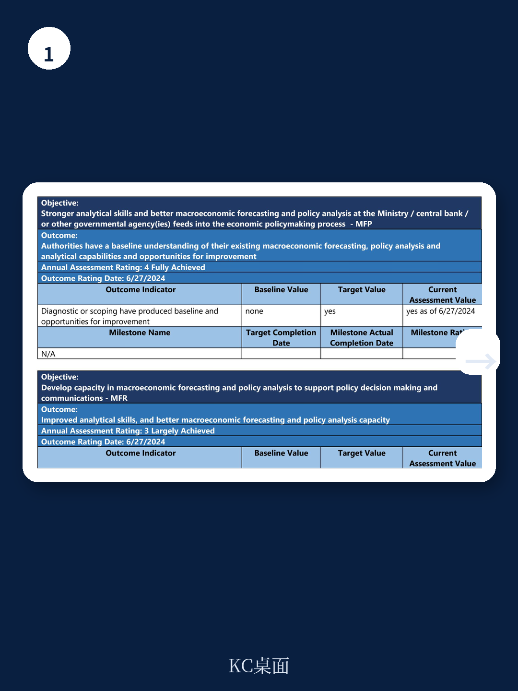
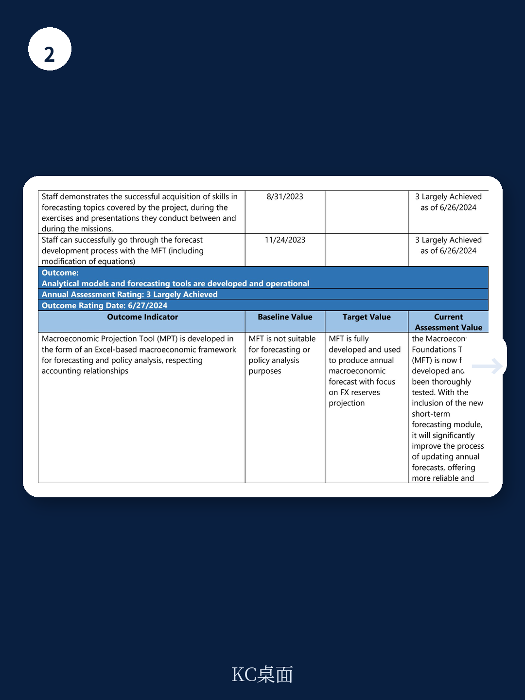

# IMF：伊拉克央行已会用AI预测通胀，但距政策落地还有多远？

一份新的IMF技术援助报告揭示了一个关键进展：伊拉克中央银行（CBI）已成功开发并掌握了宏观宏观环境基础工具（MFT），但该工具要真正融入政策决策过程，还需跨越数据协调与内部流程的最后障碍。

这份报告的核心判断并非技术本身，而是能力建设的“最后一公里”。报告指出，CBI团队已能独立运行MFT进行基线预测和情景分析，但MFT产出的报告尚未进入央行管理层的决策会议，也未能与财政部的中期预算信息有效对接。这意味着，一个在技术上已相当成熟的预测工具，目前仍停留在“实验室”阶段。

## 1. 工具已就位：MFT如何为伊拉克宏观环境“建模”

MFT是一个基于Excel的宏观框架，通过核心行为方程和会计恒等式，将实体宏观环境、财政、外部和货币四个部门联结在一起。针对伊拉克宏观环境高度依赖石油的特点，IMF团队在标准模板中加入了石油部门模型，并开发了利用月度、季度高频数据修正年度预测的插值技术。

报告显示，CBI团队已能独立完成从数据收集、方程评估到基线预测和情景分析的全流程。他们甚至测试了油价冲击、汇率冲击和经常账户逆差等不同情景，以理解政策选择的后果。这标志着CBI的分析能力已从简单的单变量回归模型，跃升至一个系统化的半结构模型框架。

> **KC评论：** 对于资源依赖型地区的央行而言，MFT的价值不在于预测的绝对精确，而在于提供了一个内部一致的“沙盘”——当油价下跌10%或财政支出增加20%时，外汇储备、通胀和宏观环境增长会如何联动。这种跨部门的量化分析能力，是过去CBI所不具备的。

## 2. 数据与协调：两个尚未完全解决的“软约束”

尽管技术层面取得突破，报告也坦承了若干关键挑战。首先是数据问题。伊拉克的国民账户支出法固定价格数据仍不可得，这限制了MFT对实际宏观环境活动的刻画精度。报告建议CBI与中央统计局（CSO）合作解决这一问题。

更大的挑战来自机构间协调。MFT的基线预测高度依赖财政部的预算和中期支出计划，但报告指出，CBI与财政部之间的信息共享机制尚未建立。此外，CBI内部也存在团队人员流动的不确定性，可能影响知识传承。

这些“软约束”说明，一个有效的宏观预测框架，其成功不仅取决于模型本身，更取决于支撑它的数据基础设施和跨部门协作机制。

> **KC评论：** 报告提到的一个细节值得关注：CBI的货币政策传导受到政府存款导致的过剩流动性的阻碍。这意味着，即使MFT预测出需要加息，如果财政政策不配合，货币政策的实际效果也会大打折扣。工具只是起点，政策协调才是终点。

## 3. 报告尚未完全回答的关键问题：从“会用”到“用起来”还需要什么？

报告给出了明确的成果评估：MFT工具本身已“完全开发”（Fully Achieved），但“CBI将MFT产出用于政策制定过程”这一指标仅为“部分实现”（Partially Achieved）。这引出了一个核心问题：从技术能力到决策影响力，中间还缺了什么？

报告暗示了至少两个方向。一是内部制度化：CBI需要建立固定流程，让MFT的基线预测和情景分析定期向管理层汇报，而不是仅作为研究部门的内部练习。二是外部协同：与财政部就预算信息进行常态化沟通，才能让MFT的预测真正反映政策现实。

这些都不是技术问题，而是组织行为与治理问题。对于任何一个正在建设宏观分析能力的机构而言，这可能是最容易被忽视、也最难跨越的鸿沟。

## 对读者的观察框架

如果你正在关注新兴市场央行的能力建设，或从事宏观预测相关工作，这份报告提供了一个可复用的评估框架

第一，看工具的逻辑是否匹配宏观环境结构。MFT对伊拉克的定制化，核心在于嵌入石油部门和外汇储备预测。你的地区是否也有类似的“单一依赖”特征？工具必须反映这一点。

第二，看数据底座是否稳固。没有高频、可靠的国民账户和财政数据，再好的模型也是空中楼阁。数据治理是能力建设的先行研究。

第三，看“最后一公里”的机制设计。工具是否被纳入决策流程？产出是否有固定的汇报对象和频率？这比模型本身的精度更能决定其实际价值。

这份IMF报告的价值，不在于它描述了CBI学会了什么，而在于它清晰地标识出了从“会做”到“被用”之间的距离。对于所有从事宏观分析的专业人士而言，这个距离本身，就是最重要的观察变量。

---

For informational purposes only. Portions may be generated,translated,summarized,or edited with AI assistance based on source materials and may contain omissions or errors. Please verify independently. This is not investment,legal,tax,accounting,or other professional advice.
