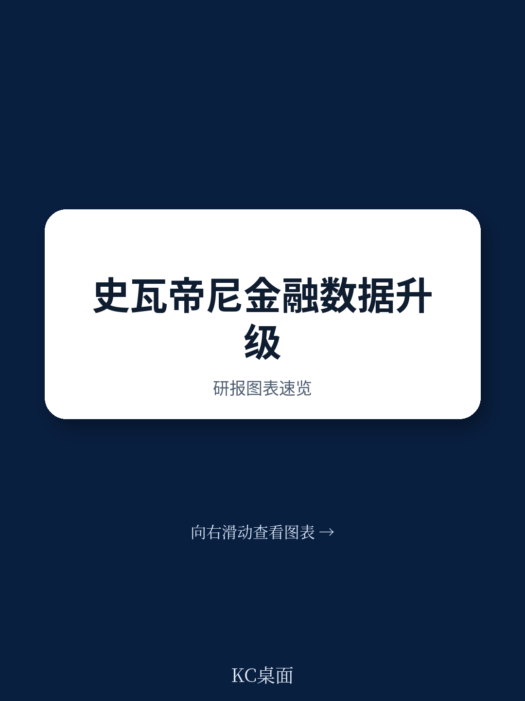
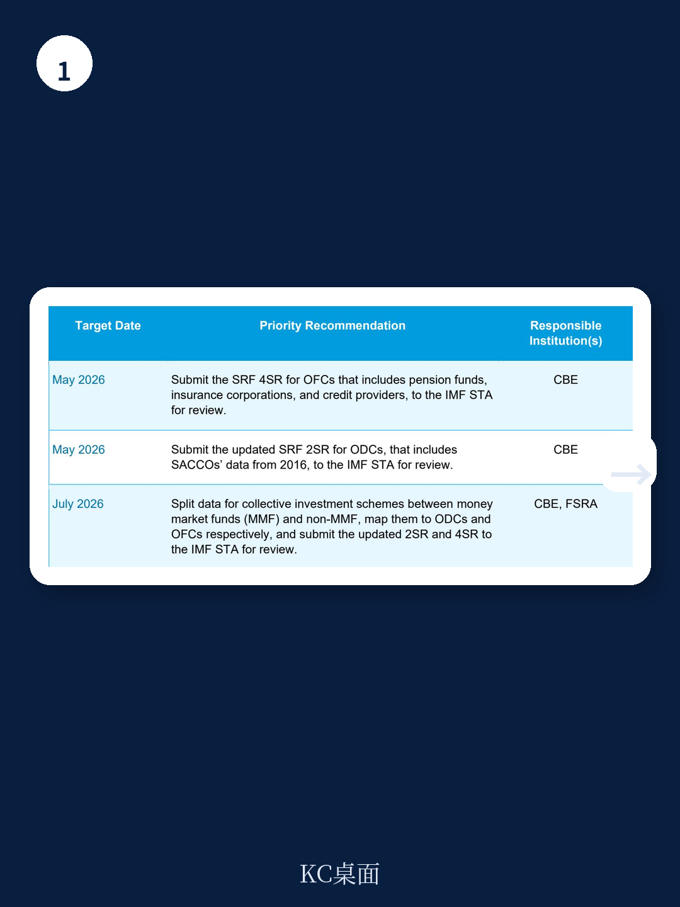
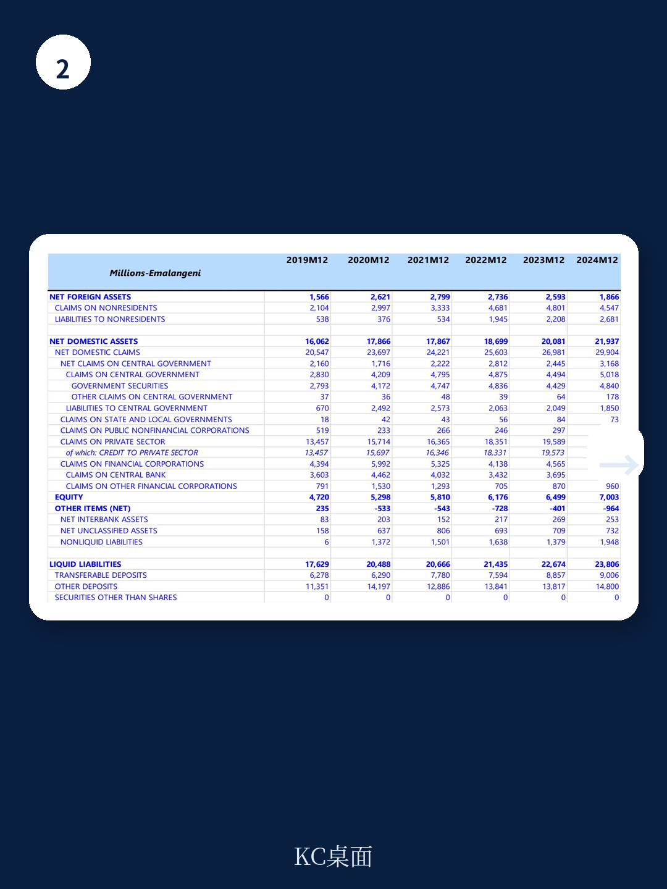

# IMF：史瓦帝尼六成资金资产被非银行机构持有，统计盲区正在被填补

一份2025年5月完成、2026年1月发布的IMF技术援助报告，揭示了一个多数市场观察者容易忽略的事实：在非洲南部小国史瓦帝尼，非银行机构的资产规模已占据整个资金体系的66.2%，但此前长期游离在官方货币与资金统计框架之外。报告的核心判断是，IMF正在帮助该国央行将养老金、保险、信贷机构和集体研究计划纳入标准化统计报表，这不仅是数据工作的完善，更将重塑该国货币政策和资金稳定监测的分析基础。

## 1. 被低估的非银行部门正在改变史瓦帝尼的资金结构

报告显示，截至2024年12月，史瓦帝尼资金体系（不含央行）中，其他资金公司（OFCs）的资产占比高达66.2%，其中养老金独占69.7%，保险机构约占一成。而传统商业银行仅占27.9%。这一比例结构在非洲国家中并不罕见，但史瓦帝尼的特殊之处在于，其监管体系长期由央行和资金服务业监管局（FSRA）分治，导致OFCs的数据并未被系统纳入货币统计。

此次IMF团队协助央行将养老金、保险公司和非存款类信贷机构的数据映射到标准化报告表（SRF 4SR），并首次编制了包含OFCs的资金公司调查（FCS）。这意味着，未来史瓦帝尼的货币当局将能够看到全口径的部门间资金流动，而不仅仅是银行体系的信贷扩张。

> **KC评论：** 对于研究非洲资金体系的读者来说，这份报告提供了一个重要观察窗口——当一个地区超过六成的资金资产由非银行机构持有，其货币政策传导机制必然与成熟市场不同。完整的统计框架是分析这一机制的前提。

## 2. SACCOs的纳入让存款类机构统计更接近真实

报告另一个值得关注的进展是，将存款型储蓄与信贷合作社（SACCOs）纳入了其他存款类公司（ODCs）的统计范围。目前史瓦帝尼有47家SACCOs，资产规模占ODCs部门的7.9%。加上此前已纳入的建筑协会，ODCs覆盖的资产已占资金体系（不含央行）的33.8%。

这一调整的意义在于，SACCOs直接面向家庭部门吸收存款并发放贷款，是连接正规资金与基层宏观环境的重要桥梁。将其纳入统计后，央行可以更准确地评估私人部门的信贷可获得性，以及家庭部门的资产负债状况。

## 3. 货币统计的“最后一公里”：集体研究计划的分类难题

报告也坦诚指出了尚未完全解决的问题。集体研究计划（CIS）占资金体系总资产的约8.0%，但IMF团队未能获得足够数据将其区分为货币市场产品（MMF）和非货币市场产品（non-MMF）。这一分类在MFS框架中至关重要，因为MMF属于存款类机构，而非MMF则归入OFCs。

报告建议史瓦帝尼央行和FSRA在2026年7月前完成这一拆分，并更新对应的标准化报告表。这看似是一个技术细节，但直接关系到宏观流动性监测的准确性——MMF的规模变化会影响广义货币的统计口径。

## 4. 报告尚未回答的关键问题：资金辅助机构的“影子”有多大？

报告在评估OFCs部门的规模时，特别提醒了资产重复计算的不确定性。研究顾问（IAs）管理的资产组合高达300亿埃马兰吉尼（约合16.5亿美元），但这些资产大部分仍记录在养老金和保险公司的资产负债表上，不应被重复计入IAs的资产。

然而，报告也承认，由于缺乏资金辅助机构独立资产负债表的数据，目前无法评估其被低估的程度。资金辅助机构包括资产管理者、研究顾问、标的交易所和养老金管理人等，按MFS框架应纳入OFCs统计，但它们的自有资产规模通常较小。史瓦帝尼的情况是否例外，仍需后续数据验证。

> **KC评论：** 这份报告的价值不仅在于帮助史瓦帝尼完善统计，更在于为其他发展中国家提供了一个可复制的路径——当资金体系从银行主导转向多元结构时，统计框架的更新往往是政策有效性的前提。读者如果关注新兴市场资金深化，可以重点阅读报告中关于资产负债表分析法（BSA）的讨论，这是连接微观数据与宏观审慎政策的关键工具。

For informational purposes only. Portions may be generated,translated,summarized,or edited with AI assistance based on source materials and may contain omissions or errors. Please verify independently. This is not investment,legal,tax,accounting,or other professional advice.
