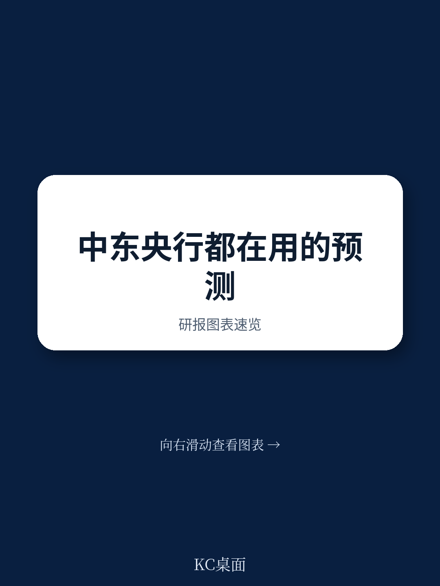

# IMF：伊拉克央行与财政部的协作，是模型落地的真正瓶颈

伊拉克宏观环境长期被一个问题困扰：高度依赖石油收入，油价波动直接冲击财政、货币和国际收支。中央银行需要一套能预测这些冲击、支持政策决策的分析框架。IMF的技术援助报告给出的结论很直接——工具已经有了，真正的挑战不在模型本身，而在团队能否持续用它、数据能否支撑它、央行能否与财政部真正协作。

报告的核心对象是伊拉克央行开发的“宏观宏观环境基础工具”（MFT），一个基于Excel的预测框架，专门针对石油依赖型地区定制。这不是一个理论模型，而是一个可操作、可迭代的政策分析工具。

## 1. 石油模块不是附加项，是整个模型的逻辑起点

MFT最关键的定制在于石油部门模块。它不只是把油价作为外生变量输入，而是系统性地追踪石油收入如何传导至政府预算、公共支出、研究、GDP和居民可支配收入。然后这些变量再反馈到货币部门——影响外汇储备管理、本币稳定和通胀控制。

对于伊拉克这样的地区，这是比标准宏观模型更贴近现实的架构。标准模型往往假设财政和外部部门相对独立，但在伊拉克，财政盈余几乎完全由油价决定，而央行能做的，是在油价高时积累外储，油价低时管理贬值不确定性。MFT把这条传导链完整建模，让央行可以在不同油价情景下提前模拟政策后果。

> **KC评论：** 这份报告最有价值的判断不是“伊拉克央行有了新工具”，而是“这个工具的设计思路对其他石油或资源依赖型地区有直接参考价值”。如果你关注安哥拉、尼日利亚、委内瑞拉等国的宏观政策框架，MFT的模块化思路值得细读原报告中的校准策略和情景设定方法。

## 2. 数据质量是模型的天花板，而伊拉克的支出法GDP数据是明显短板

报告坦率地指出，伊拉克的国民账户数据存在显著缺口——尤其是按固定价格计算的支出法GDP分项数据。这不是一个技术细节。支出法GDP（消费、研究、净出口）是连接实体宏观环境与财政、货币、外部部门的核心枢纽。如果这部分数据不可靠，整个模型的预测精度都会受限。

报告建议央行主动与中央统计局（CSO）跟进，获取更高质量数据，并与中东区域技术援助中心（METAC）合作改进国民账户统计。这是一个慢变量，但也是长期提升模型价值的必要条件。

## 3. 团队更替是制度化的最大障碍，但新团队的学习速度比预期快

2023年7月，伊拉克央行的核心团队经历了一次重大人员更替。这在技术援助项目中是常见的不确定性——人走了，知识就流失了。但报告给出了一个相对积极的信号：新团队在理解MFT及其预测功能方面进展显著，已经能够在后续任务中开始开发替代情景。

这提示一个更普适的规律：工具的设计是否足够“低门槛”，直接决定了它在人员变动后的生存能力。MFT基于Excel，操作逻辑简单，培训周期短，这可能是它比复杂计量软件更适合新兴市场央行的原因。

> **KC评论：** 报告没有完全展开的一个问题是：当核心团队再次更替时，新成员能否在无外部顾问支持的情况下独立运行MFT？这取决于伊拉克央行是否已经建立了内部培训机制和操作手册。原报告附录中可能包含这些细节，值得有需求的专业读者自行查阅。

## 4. 报告没有完全回答：央行与财政部的协作如何落地

报告的第三条建议是加强央行与财政部的合作，把预算和中长期财政计划的最新数据纳入模型假设。这听起来合理，但在伊拉克的实际操作中，这可能是最难执行的建议。财政部是否有动力向央行提供及时、细化的预算执行数据？两个机构之间的数据标准是否一致？如果财政数据滞后或失真，模型中的传导链条就会从起点开始偏离。

这是一个“报告说了但没完全说透”的关键问题。它指向的不是技术能力，而是机构间的协调机制和政治宏观环境学。后续观察的重点，不是MFT本身是否运行，而是伊拉克央行能否真正把财政数据作为模型输入、而不是仅靠假设来填补。

---

对研究新兴市场宏观框架的专业读者来说，这份报告的价值不在于“伊拉克央行做了什么”，而在于它为资源依赖型地区如何建设政策分析能力提供了一个可复用的案例。工具已经开源（Excel版），逻辑已经透明，剩下的问题是：有多少其他央行愿意走同样的路。

For informational purposes only. Portions may be generated,translated,summarized,or edited with AI assistance based on source materials and may contain omissions or errors. Please verify independently. This is not investment,legal,tax,accounting,or other professional advice.
