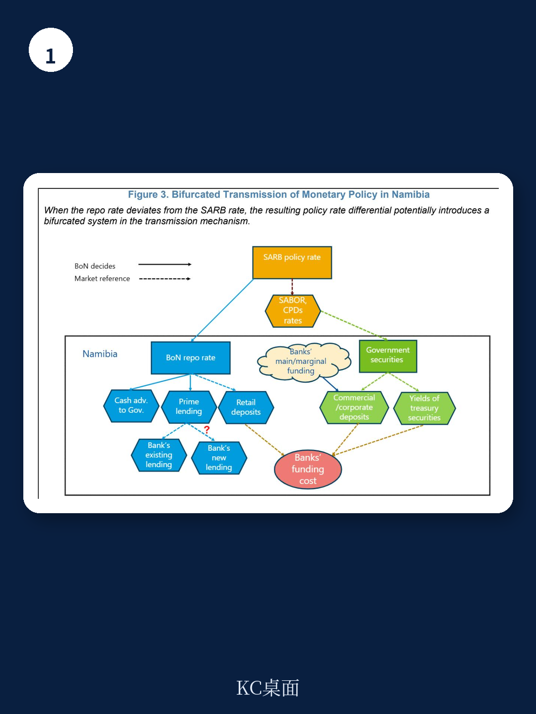

# IMF：货币政策传导为何不对称？IMF用纳米比亚数据给出答案

在固定汇率制度下，货币政策独立性天然受到制约。但这份IMF最新工作论文揭示了一个更具体的结论：纳米比亚的银行存贷款利率变动，主导力量来自南非储备银行的政策利率，而非本国央行的回购利率。这不仅是学术验证，更对任何实行货币局制度或紧密盯住汇率的地区，提供了一个关于政策传导边界的现实参照。

**主判断：** 在资本自由流动和资金深度一体化的背景下，即便存在阶段性政策利率偏离，国内货币政策对银行信贷条件的实际影响力依然有限。真正决定借贷成本的，是锚定国的利率。

## 1. 政策利率偏离提供了“天然实验”，但结果指向锚定国主导

IMF宏观环境学家利用2017年至2025年的月度数据，采用局部投影方法，分离了南非和纳米比亚两国政策利率各自对国内银行利率的影响。关键识别策略在于：2022年以来，两国政策利率出现了罕见的负向偏离——纳米比亚央行并未完全跟随南非加息周期，一度保持更宽松的立场，最大偏离幅度达到100个基点。

实证结果清晰：无论是贷款利率还是存款利率，其对南非政策利率变动的响应幅度和持续性，都显著强于对本国回购利率变动的响应。纳米比亚央行的独立操作虽有边际影响，但效果短暂且微弱。这一发现与海湾合作委员会国家盯住美元的研究结论一致——在固定汇率下，国内政策利率工具更像“装饰性”调节。

> **KC评论：** 这意味着，对于读者和企业而言，判断纳米比亚的融资成本走势，更应关注南非央行的政策路径，而非纳米比亚本地央行的信号。报告中的脉冲响应图清楚展示了这种传导力量的差异，值得细看。

## 2. 传导不对称：贷款利率“快而全”，存款利率“慢而缺”

报告另一个关键发现是传导的非对称性。由于纳米比亚信贷市场高度依赖浮动利率合约，且贷款普遍挂钩于央行规定的“最优惠贷款利率”，一旦政策利率调整，存量贷款几乎立即重新定价。因此，贷款利率的传导不仅迅速，而且近乎完全。

存款利率则截然不同。银行在调整存款定价时拥有更大自主权，其定价不仅参考本国回购利率，更受到市场利率、银行间竞争格局以及南非市场基准的影响。结果是：存款利率对政策利率变动的响应缓慢且不完整。这种不对称直接导致银行净息差在加息周期扩大、在降息周期收窄，进而可能削弱货币政策在宽松周期中的刺激效果——银行不愿在息差收窄时大幅降低贷款利率。

## 3. 报告未完全回答的问题：结构性约束如何影响传导效果

尽管实证分析清晰，报告也坦诚指出了若干未解问题。首先，信贷增长为何在降息后依然仍在调整？这指向了需求侧的结构性因素——住房供给受限、企业缺乏优质研究机会等，这些并非货币政策能够解决的。其次，银行资产负债表上的“超额流动性”如何影响传导？纳米比亚银行体系资金充裕，对央行回购窗口需求有限，这本身就会削弱央行利率信号的传递效率。最后，更细颗粒度的贷款和存款产品层面的数据缺失，使得无法区分“新发放贷款的定价”与“存量贷款的自动重定价”各自对总利率变动的贡献。

这些未解问题恰恰构成了理解货币政策有效性的另一条线索：当资金体系存在结构性摩擦时，利率工具的效果可能被显著稀释。

## 4. 对观察框架的含义：关注“锚定国利率”而非“本国利率”

对于关注非洲南部市场的读者，这份报告提供了一个实用的分析视角。评估纳米比亚的信贷环境、银行盈利能力和企业融资成本时，应将南非货币政策作为首要变量。纳米比亚央行即便尝试通过偏离来刺激宏观环境，效果也有限——大型企业可以选择在南非市场融资或存放资金，套利行为会抵消国内政策意图。

报告给出的政策建议同样值得关注：系统性地、可预测地吸收银行体系超额流动性，并让这些操作利率更紧密地锚定本国政策利率，可能是改善传导效率的现实路径。但这需要配套的市场基础设施建设，并非一蹴而就。

For informational purposes only. Portions may be generated,translated,summarized,or edited with AI assistance based on source materials and may contain omissions or errors. Please verify independently. This is not investment,legal,tax,accounting,or other professional advice.
