# Repo Rate Dynamics

# The Role of Dealers, Hedge Funds, and Issuance

Prepared by Kleopatra Nikolaou

WP/26/145

IMF Working Papers describe research in progress by the author(s) and are published to elicit comments and to encourage debate. The views expressed in IMF Working Papers are those of the author(s) and do not necessarily represent the views of the IMF, its Executive Board, or IMF management.

2026
JUL

IMF Working Paper
Monetary and Capital Markets

Repo Rate Dynamics: The Role of Dealers, Hedge Funds, and Issuance Prepared by Kleopatra Nikolaou

Authorized for distribution by Jason Wu
July 2026

IMF Working Papers describe research in progress by the author(s) and are published to elicit comments and to encourage debate. The views expressed in IMF Working Papers are those of the author(s) and do not necessarily represent the views of the IMF, its Executive Board, or IMF management.

ABSTRACT: This paper analyses U.S. secured repo spreads by jointly looking into reserves, dealer balance-sheet usage, hedge fund leverage, and Treasury issuance. Using a quantile regression framework, the results show that repo market dynamics are strongly state-dependent. Higher level of reserves consistently compress repo spreads to the Federal Reserve's overnight reverse repo offering rate and remain the primary stabilizing force, particularly in tighter funding conditions. Hedge fund activity appears to amplify dealer balance-sheet pressures in lower quantiles, reflecting the impact of leveraged demand in normal markets. As spreads rise, this effect weakens. Instead, heavier Treasury issuance appears to weigh on repo spreads via its stronger effect on dealer balance sheet pressures. Overall, U.S. repo spreads are affected by the supply of central bank liquidity, demand for leverage, Treasury issuance and intermediary capacity. Crucially, these drivers are not equally relevant across the distribution of funding conditions.

RECOMMENDED CITATION: Nikolaou, Kleopatra. 2026. JUL. IMF Working Paper. International Monetary Fund.

JEL Classification Numbers:

G12, G23, E43, E58

Keywords:

Repo, Hedge Funds, Treasury issuance, Broker-dealers, Reserve Demand

Author's E-Mail Address:

KNikolaou@imf.org

WORKING PAPERS

# Repo Rate Dynamics:

The Role of Dealers, Hedge Funds, and Issuance

Prepared by Kleopatra Nikolaou\*

## Contents

Glossary....4   
Executive Summary....5   
Introduction....6   
Relation to Literature....9   
Empirical Methodology....11 Baseline Specification: Reserves and Dealer Balance Sheet Usage....11 Endogeneity in Dealer Balance Sheets and Repo Spreads....11 How Dealer Balance Sheet Pressure is Amplified by Hedge Funds....12 How Treasury Issuance Pressure is Amplified by Dealer Balance Sheets....13   
Results....15 Baseline Specification: Reserves and Dealer Balance Sheet Usage....15 Figure 1: Spreads Are Largely Driven by Reserve Dynamics and Dealer Balance Sheet Usage....16 Amplification Effect from Hedge Funds....16 Figure 2: Hedge Funds Amplify Impact on Repo Spreads in "Normal" Times....18 Amplification Effect from Issuance....19 Figure 3: Issuance Amplifies Impact on Repo Spreads When Funding Conditions Tighten....20   
Conclusion....21   
Annex....22 Figure 4: As Funding Conditions Tighten, Issuance Affects Repo Rates Via the Balance Sheet Channel ....Error! Bookmark not defined. Tables: Quantile Regression Results....27   
References....29

## Glossary

DP......Dealer Balance Sheet Usage
HF......Hedge Fund
RRP......Reverse Repurchase Facility
SOFR......Secured Overnight Financing Rate
MOVE......Merrill Lynch Option Volatility Estimate (Treasury volatility index)
VIX......CBOE Volatility Index (equity market volatility)
Repo......Repurchase Agreement

## Executive Summary

This paper examines the dynamics of U.S. repo market spreads by jointly analyzing the roles of reserves, dealer balance-sheet usage, hedge fund activity, and Treasury issuance. Using a quantile regression framework, the analysis shows that the forces shaping repo rates differ across funding conditions.

Three main conclusions emerge. First, reserve balances remain the primary stabilizing force in U.S. repo markets. Higher reserves consistently compress repo spreads, and their effect becomes particularly important when funding conditions tighten. This result highlights the continued importance of adequate liquidity buffers in floor-type monetary policy frameworks.

Second, hedge fund activity appears to affect U.S. repo markets also through its impact on dealer balance-sheet pressures. In periods of relatively benign funding conditions, growing leveraged hedge fund demand, such as basis trades, can exert pressure on dealer balance sheets and contribute to rising repo spreads. As funding conditions tighten, however, hedge funds tend to reduce positions, and their influence on repo spreads appear to be declining.

Third, Treasury issuance can become a more important driver of U.S. repo spreads in tighter funding environments. While issuance exerts a modest direct effect on repo spreads, its interaction with dealer balance-sheet usage can become significantly stronger as repo spreads rise. This result suggests that supply-driven inventory pressures on dealers may play an increasingly important role during periods of market stress.

Overall, the results of this paper indicate that repo market outcomes reflect the interaction between liquidity supply, leveraged demand, and intermediation capacity. While reserves provide the main buffer against funding pressures, both hedge fund leverage and Treasury issuance can amplify repo market strains through their impact on dealer balance sheets.

## Introduction

Repurchase agreement (repo) markets are a cornerstone of modern financial systems. They provide the primary mechanism through which government securities are financed and redistributed, support the liquidity of government bond markets and serve as the channel through which monetary policy rates are transmitted to short-term funding markets more broadly. The U.S. repo market alone exceeds \$12 trillion in daily outstanding volume, with dealers at its center, simultaneously sourcing cash from lenders and channeling it to borrowers (Hempel et al., 2025).

In recent years, repo markets have experienced significant structural shifts. Rapid growth in U.S. Treasury issuance has expanded the volume of collateral that must be financed and intermediated through repo markets. Yet the capacity of primary dealers to warehouse and redistribute that supply has not kept pace (Adrian, et al., 2025). At the same time, the composition of Treasury market participants has shifted markedly. Hedge funds have increasingly absorbed the growing supply of Treasuries through leveraged relative-value trades, most prominently the Treasury cash-futures basis trade, which relies heavily on repo borrowing (Barth and Kahn 2021, 2025; FSB 2026). While academic and policy literature has examined the implications of higher issuance and hedge fund activity for Treasury yields and term premia, there is comparatively limited empirical evidence on their impact on short-term funding markets, particularly repo rates.

Existing research on repo rate dynamics has largely focused on the role of bank reserves as the primary determinant of short-term funding conditions. In frameworks developed after the Global Financial Crisis, fluctuations in aggregate reserves are often viewed as the key driver of repo rate movements relative to policy rates (Afonso et al., 2025). While reserves undoubtedly play a key role in shaping funding conditions a separate strand of research suggests that repo rates may also reflect shifts in collateral supply, leveraged demand for financing, and the balance-sheet capacity of intermediaries (see for example Cordes and Infante, 2025; Barth and Kahn, 2025). This paper aims to bridge these approaches by jointly examining reserves, Treasury issuance, hedge fund activity, and dealer balance-sheet capacity within a unified empirical framework, allowing their relative importance to vary across funding conditions.

A key element in this mechanism is the role of dealers as the central intermediaries of repo markets. Primary dealers stand between cash lenders and borrowers in repo markets, expanding their balance sheets to finance Treasury securities and support market liquidity. Because these intermediation activities require balance-sheet capacity, the ability of dealers to absorb shifts in funding demand or collateral supply is inherently limited. Changes in repo market conditions stemming from increased Issuance or demand for leveraged trades financed by repo may therefore reflect fluctuations in dealer balance sheet usage, which can impact the cost of repo intermediation (Chabot et al., 2024; Besugo et al., 2025).

Using the overnight repo spread as a measure of funding conditions, I investigate the joint roles of central bank reserves, dealer balance sheet utilization, hedge fund activity, and Treasury issuance in shaping that spread. A key premise is that these drivers are not equally relevant across the distribution of funding conditions. For example, the build-up of leveraged positions is highly procyclical, increasing when funding rates are low (IMF, 2025; Barth and Kahn, 2025), while the impact of Treasury issuance may be more pronounced when dealer balance sheets are already under pressure. I test this heterogeneity in impact using quantile regressions, which characterize the full conditional distribution of the spread rather than its conditional mean, allowing the impact of repo market drivers to vary across funding regimes.

The methodology and results of this paper contribute to the literature in three ways. The first contribution is to provide a joint empirical characterization of repo rate dynamics that integrates the two key drivers identified in the literature, bank reserves and dealer balance-sheet capacity, while also accounting for the role of hedge fund activity and Treasury issuance within a unified quantile regression framework. Existing studies have examined these forces quasi in isolation. The reserve demand literature documents a non-linear relationship between reserves and short-term rate spreads, but the analysis focuses on federal fund spread, instead of repo spreads and typically abstracts from the role of non-bank intermediaries (Langowski, 2023; Lopez-Salido and Vissing-Jorgensen, 2025; Afonso et al., 2025). $^{1}$ The dealer intermediation literature explains the link between intermediary balance sheet and strains in market conditions, including repo rates, but typically abstracts from integrating the role of issuance and hedge funds. $^{2}$ A related strand examining the Treasury basis trade highlights the importance of hedge fund repo borrowing in basis trade volumes, and documents that, in normal times, higher basis trade volumes can be associated with higher repo spreads. (Barth and Kahn, 2021, 2025; Barth, Kahn, and Mann, 2023). However, the role of reserves and, in some cases issuance, does not feature prominently. Finally, the Treasury supply literature documents how issuance affects dealer inventories and market intermediation, but sheds limited light on how the resulting intermediation pressures affect funding markets (Fleming, Nguyen, and Rosenberg, 2024; Adrian, Fleming, and Nikolaou, 2025). This paper brings these strands together in a single empirical framework that allows these forces to interact and vary across funding conditions.

The second contribution is to document a novel, state-dependent mechanism that determines repo spreads. The baseline results confirm the key role of reserves. Higher reserves are associated with lower repo spreads, consistent with the non-linear reserve demand relationship documented in the reserve literature. The stabilizing effect of reserves becomes particularly strong in the upper part of the conditional spread distribution, suggesting that reserve balances are especially effective in containing repo market pressures when funding conditions are already strained. This result aligns with the impact on repo spreads from a scarce-to-ample reserve transition, emphasized in the reserve demand literature.

Results on the impact of growing dealer balance sheet usage on repo spreads, however, demonstrate a U-shaped pattern across spread quantiles. Greater balance sheet usage appears to put upward pressure on repo rates at both low and high quantiles, while compressing spreads in the middle of the distribution. The higher-quantile pattern is consistent with evidence that dealer intermediation can become constrained precisely when it is needed most (Duffie et al., 2023; Adrian et al., 2025), but the analysis further explains the U-shape through amplification channels tied to Treasury supply and hedge-fund demand. Increased Treasury issuance can amplify dealer balance sheet pressure on spreads in higher quantiles, consistent with the narrative that additional collateral supply strains dealer intermediation capacity. Conversely, stronger hedge fund demand for repo –measured by hedge fund short positions in Treasury futures– can put upward pressure on repo rates in lower quantiles, consistent with dealers charging more for balance-sheet space when basis-trade activity is strong (Kashyap et al., 2025; Barth and Kahn, 2025; IMF, 2025). By contrast, in the middle of the distribution, dealer balance-sheet expansion is associated with lower spreads, suggesting that dealers appear to step in as liquidity providers and smooth supply-demand imbalances.

Framing it differently, in more benign funding conditions, when repo spreads are low, hedge fund borrowing demand can place upward pressure on repo spreads primarily through increased dealer balance sheet usage. As funding conditions tighten, the dynamics shift. Treasury issuance appears to become a more important driver of spreads likely because it increases the volume of securities that must be financed and temporarily warehoused by dealers, which can amplify pressures on intermediary balance sheets. Across funding regimes, reserves appear to emerge as the primary stabilizing force: higher reserve balances compress repo spreads, and their effect becomes particularly strong when funding conditions deteriorate.

The empirical findings are supported by a range of robustness checks designed to mitigate potential concerns related to endogeneity, variable construction and sample selection. Nevertheless, the workhorse specifications in the paper remains reduced-form and therefore the results ultimately describe conditional relationships rather than structural causal effects, a limitation shared with the broader empirical literature on dealer intermediation capacity.

The third contribution speaks directly to the policy debate on the calibration of ample-reserves operating frameworks. A key realization for central banks normalizing their balance sheets is that the “optimal” reserve level, the level at which repo markets transition from stable conditions to a regime where funding rate volatility becomes persistent, is time varying (Lopez-Salido and Vissing-Jorgensen 2025; Bailey 2024). The results in this paper provide additional evidence on this transition. Consistent with the reserve demand literature, reserves emerge as the dominant determinant of repo spreads. At the same time, the analysis shows that repo market outcomes also reflect pressures from dealer balance sheet usage, leveraged hedge fund demand, and Treasury issuance. Importantly, the stabilizing effect of reserves becomes stronger as funding conditions tighten, indicating that reserve balances play a critical role in offsetting these market pressures when intermediation capacity becomes strained. In this sense, the “optimal” level of reserves depends not only on aggregate liquidity but also on the structure of repo intermediation and the scale of leveraged activity in Treasury markets.

The remainder of the paper is organized as follows. Section 2 reviews the related literature. Section 3 presents the empirical methodology, including the baseline quantile regression specification and extensions incorporating hedge fund activity and Treasury issuance. Section 4 reports and discusses the main results, with particular attention to the state-dependent transmission mechanism. Section 5 concludes with a summary of the results.

## Relation to Literature

This paper brings together several strands of literature.

A core strand of the literature examines the demand for reserves and its implications for short-term rate dynamics, a central issue for monetary policy implementation. Since the Global Financial Crisis, however, the operating framework has shifted from corridor to floor-type systems, placing the quantity and distribution of bank reserves (scarce vs ample) at the center of rate determination (Langowski, 2023). In such regimes, overnight rates remain well anchored when reserves are abundant but can deviate sharply as reserves approach a scarcity threshold (Afonso et al., 2025; Cordes and Infante, 2025). As a result, the reserve-rate relationship is strongly non-linear, with highly elastic reserve demand at ample levels that becomes steep as scarcity emerges, complicating the calibration of the optimal reserve level and central bank balance sheet size (Lopez-Salido and Vissing-Jorgensen, 2025).

While the link between the aggregate level of reserves and funding rates is well established, the relationship is shaped by additional factors. Afonso et al., (2025) note that repo rates are influenced by elements beyond reserves, including arbitrage opportunities and hedge funds' demand for overnight borrowing. Copeland et al., (2025) further highlight that funding conditions depend not only on aggregate reserves, but on the distribution of reserve balances across large, repo-active dealer banks, operating in part through intraday settlement pressures and payment constraints. These interactions were evident during the September 2019 episode, when SOFR spiked to 5.25 percent following a coincidence of Treasury auction settlements, corporate tax payments, and structural frictions in reserve redistribution (Afonso et al., 2025; Copeland et al., 2025).

Another strand of the literature examines the role of hedge funds in Treasury and repo markets through the lens of dealer balance sheet constraints. Hedge fund Treasury exposures have surged in recent years, largely driven by the cash-futures basis trade—an arbitrage strategy whose aggregate positions have reached around \$1 trillion at their peak (Barth and Kahn, 2021, 2025; FSB, 2026). $^{3}$ This strategy represents a major source of net repo demand in Treasury markets and expands dealer balance sheet usage. Consistent with this mechanism, large basis traders pay roughly 9–10 basis points more than other repo borrowers at the transaction level, reflecting the transmission of dealer balance sheet costs under normal funding conditions (Barth and Kahn, 2025).

The basis trade is also exposed to both repo rate spikes, which raise financing costs and affect profitability, and futures margin calls, which force position unwinds (Barth and Kahn, 2025; IMF, 2025). The March 2020 episode illustrates this mechanism: external selling pressures congested dealer balance sheets and triggered system-wide repo stress, rendering the basis trade unprofitable and leading to the unwinding of leveraged positions. Barth and Kahn (2021) identify hedge funds as the victims rather than the drivers of repo spike in the 2020 event, while Kashyap et al., (2025) identify a secondary amplification loop as dealers withdrew from repo intermediation during the unwind. Taken together, this literature emphasizes that repo spread dynamics in stress periods are largely driven by structural constraints on dealer intermediation capacity.

Recent research highlights how rising Treasury issuance interacts with dealer balance sheet constraints to shape market conditions. The literature is motivated by a growing mismatch: total marketable Treasury debt has expanded from roughly \$5 trillion in 2008 to over \$25 trillion, while dealer balance sheets have remained relatively flat since the Global Financial Crisis as post-crisis capital requirements increased the cost of intermediation. Du et al., (2022) argue that these constraints limit dealers' ability to arbitrage issuance-induced dislocations, requiring higher compensation to hold Treasuries. This can raise Treasury yields relative to swaps and other funding benchmarks and contribute to phenomena such as negative swap spreads and deviations from covered interest parity. Complementing this mechanism, Fleming et al., (2024) show that Treasury issuance is the primary driver of dealer inventory fluctuations, as dealers temporarily warehouse newly issued securities following auctions and gradually unwind these positions. Together, these findings suggest that larger issuance shocks increase the balance sheet burden on dealers, amplifying the effects of supply on market pricing and liquidity conditions.

More broadly, this mechanism relates to the literature on intermediary balance sheet constraints. Adrian and Shin (2014) show that broker-dealers manage their balance sheets procyclically, expanding leverage when balance-sheet capacity is ample and contracting it when constraints tighten. Because market-making requires dealers to absorb client flows on their balance sheets, this behavior implies that the capacity of dealers to intermediate Treasury supply is inherently state-dependent. Consistent with this view, Duffie et al., (2023) and Adrian et al., (2025) provide empirical evidence that Treasury market liquidity deteriorates sharply and nonlinearly when dealer balance sheet utilization becomes elevated, pointing to occasionally binding intermediation constraints.

For the repo market specifically, a growing literature shows that dealer balance sheet costs are directly reflected in repo pricing. Chabot et al., (2024) and Besugo et al., (2025) document that the spread between centrally cleared and bilateral repo transactions reflects the compensation dealers require for balance-sheet-intensive intermediation and correlates with measures of dealer balance sheet tightness. Complementing this evidence, Cochran et al., (2023) show that repo-style secured financing transactions (SFTs) account for a substantial share of the leverage exposure of large bank holding companies, implying that regulatory constraints such as the supplementary leverage ratio (SLR) can directly limit dealers' capacity to finance Treasury positions. $^{4}$ Together, this literature suggests that changes in Treasury supply can affect repo market conditions through the balance sheet constraints faced by intermediaries.

This paper brings together the different strands of literature discussed above, on reserves, hedge fund leverage, Treasury issuance, and intermediary balance sheet usage, within a unified empirical framework. It takes as its starting point the observation that the reserve-rate relationship, while important, captures only part of the forces shaping repo market conditions. Given the central role of repo financing for both Treasury supply and leveraged demand, the analysis focuses on secured repo spreads and estimates the contribution of reserves and dealer balance sheet utilization as the core drivers of funding conditions. Motivated by the literature linking both hedge fund activity and Treasury issuance to dealer balance sheet usage, the empirical specification incorporates these factors primarily through their interactions with dealer balance sheet usage, capturing their role as amplifiers of intermediation pressures. This framework allows the importance of these forces to vary across funding regimes and shows that their effects are strongly state-dependent.

## Empirical Methodology

## Baseline Specification: Reserves and Dealer Balance Sheet Usage

To assess whether the drivers of repo spreads operate differently across funding conditions, the empirical analysis employs a quantile regression framework. As a baseline, the framework estimates how the sensitivity of short-term secured spreads to reserves and dealer balance sheet usage changes across the distribution of market outcomes. Repo spreads are measured using the secured overnight financing rate (SOFR) relative to the reverse repo facility (RRP). $^{5}$ The quantile regression approach allows the relationship between spreads and their drivers to vary across the conditional distribution, capturing potential non-linearities that become particularly relevant during periods of funding stress, defined here by elevated spread levels. The regression specification is:

$$
S p r e a d _ {t} = \alpha_ {q} + \beta_ {1, q} R e s e r v e s _ {t} + \beta_ {2, q} D P _ {t} + \varepsilon_ {q, t} E q (1)
$$

where $q$ denotes the quantile of the spread distribution. The quantile range includes (5%, 10%, 25%, 50%, 75%, 90%, and 95%). Reserves are defined as total banking sector balances held at the Federal Reserve divided by the US banks' total assets, while $DP$ proxies dealer balance sheet usage, measured as dealer net positions in credit markets plus gross repo financing, $^{6}$ relative to their rolling 1-year historical average. Gross repo is the sum of all repo and reverse repo positions on the dealers' balance sheets, excluding cleared repo activity in Treasury securities. It thus reflects the total volume of intermediation activity that constrains balance sheets. $^{7}$ The sample ranges from May 2018 to December 2025. $^{8}$

The data used in this paper are weekly data from May 2018 to the end of 2025. Weekly observations are aligned using a Wednesday dating convention. This choice is motivated by the timing of the Federal Reserve balance sheet data (H.4.1) and primary dealer statistics, which are reported on a weekly basis with reference to Wednesday balance sheet conditions. Repo rates and spreads, which are available in daily frequencies, are sampled on Wednesdays.

## Endogeneity in Dealer Balance Sheets and Repo Spreads

A potential concern with the empirical specification is that dealer balance-sheet usage and reserve levels may be jointly determined by underlying funding conditions, rather than them causing spreads in a single direction. Such endogeneity could take place either through reverse causality or common exposure to underlying market or regulatory dynamics. The paper describes below three specific channels of joint determination relevant to

the present analysis and the robustness tests around them. Nevertheless, the estimates remain reduced-form conditional relationships rather than fully structural causal effects.

First, reserve balances enter the specification contemporaneously, raising the possibility of reverse causality from repo market stress to reserve supply. While the theoretical mechanism underlying the analysis runs from reserves to spreads, the Federal Reserve may also respond to funding market strains through liquidity provision operations. This concern is particularly relevant during the September 2019 repo market dislocation and the acute phase of market stress in March–April 2020, when reserve injections followed sharp increases in repo spreads within a short period of time. To assess whether the results are disproportionately driven by these episodes, the baseline specification is re-estimated excluding the September 2019 spike, the March–April 2020 COVID stress period, and quarter-end observations associated with elevated funding pressures. Outside such episodes, Federal Reserve balance sheet decisions operate on a policy horizon of weeks to months, making weekly reserve levels plausibly predetermined relative to innovations in the repo spread. At the same time, standing repo facilities could in principle allow near-immediate reserve injections, but their use remained limited during most of the sample period.

Second, procyclical risk appetite raises the concern that a deterioration in market conditions could simultaneously reduce dealer balance sheet utilization and therefore widen spreads (Adrian and Shin, 2014). To mitigate concerns that the results merely reflect broader financial stress conditions, in addition to excluding periods of acute funding stress, further robustness checks include controls for market volatility, proxied by the VIX.

Third, regulatory constraints may amplify the relationship between dealer balance sheet utilization and repo spreads. In particular, the supplementary leverage ratio (SLR) may increase the shadow cost of dealer balance sheet usage independently of underlying funding demand. Because regulatory reporting incentives are especially acute around quarter-end dates, re-estimating the specification excluding quarter-end observations provides a robustness check on whether the results are disproportionately driven by regulatory balance sheet adjustments and window-dressing effects (Besugo et al., 2025). The results remain qualitatively similar outside these dates.

Taken together, these controls and robustness checks mitigate several important concerns regarding joint determination between reserve balances, dealer balance sheet conditions, and repo spreads. Nevertheless, the specification remains reduced-form and does not fully isolate exogenous variation in reserves or dealer intermediation capacity, a limitation shared with the broader empirical literature on dealer intermediation capacity (Adrian et al., 2017; Duffie et al., 2023; Chabot et al., 2024).

## How Hedge Funds Amplify Dealer Balance Sheet Pressure

The resurgence of hedge fund activity in the Treasury cash-futures basis trade raises renewed concerns about its implications for short-term funding markets. Hedge funds engaging in this arbitrage strategy typically short Treasury futures while simultaneously purchasing the underlying cash securities, financing the latter through repo borrowing (FSB, 2026). This structure introduces substantial leverage and places direct demands on dealer balance sheets and market liquidity, as individual hedge funds pay substantially more compared to other repo borrowers (IMF, 2025; Barth and Kahn, 2025). While the impact on market rates in normal times has not been studied, prior stress episodes, notably the September 2019 and March 2020 disruptions, have demonstrated that hedge fund positioning can amplify stress in repo markets, particularly when intermediation capacity or reserve buffers are constrained (FSB, 2021; Kashyap et al., 2025; FSB, 2026). To capture this amplification mechanism, I introduce an interaction term between hedge fund activity and dealer balance sheet usage.

The above reasoning demonstrates a close link between Hedge Fund activity and dealer repo financing. To mitigate multicollinearity between hedge fund activity and balance sheet usage, I construct a change variable, $\Delta HF_{t}$ , representing the 3-month change in hedge fund Treasury futures (short) positions. $^{9}$ This specification isolates recent shifts in hedge fund demand and addresses the statistical issue of multicollinearity, while preserving the underlying mechanism of hedge fund activity affecting dealer usage.

The model thus includes the interaction term $(DP_{t} \times \Delta HF_{t})$ , alongside level terms for dealer usage, changes in hedge fund positions and reserves.

$$
\begin{array}{r} S p r e a d _ {t} = \alpha_ {q} + \beta_ {1, q} R e s e r v e s _ {t} + \beta_ {2, q} D P _ {t} + \beta_ {3, q} \varDelta H F _ {t} + \dots \\ \ldots + \gamma_ {q} (D P _ {t} \times \varDelta H F _ {t}) + \varepsilon_ {q, t} \end{array}\tag{Eq(2}
$$

The $Spread_{t}$ , $Reserves_{t}$ and $DP_{t}$ variables follow the same definitions as Equation 1 and, similarly, q denotes the quantile of the spread distribution. Alternative specifications for the dealer hedge fund activity are tested as robustness checks (see Results section). The specification is estimated on weekly data. CFTC Treasury futures positioning data reflect hedge fund positions as of Tuesday close and are therefore assigned to the Wednesday of the same week.

## How Treasury Issuance Amplifies Dealer Balance Sheet Pressure

Treasury issuance, the net supply of securities entering the market, can affect repo dynamics through its impact on intermediary balance sheets. Treasury issuance is the primary driver of dealer inventory fluctuations, and Fleming et al., (2024) document a causal relationship running from inventory changes to dealer net repo financing, confirming that issuance-driven inventory accumulation increases dealer inventories and raises the amount of securities that must be financed in repo markets, thereby increasing balance-sheet usage. How this affects the cost of repo financing depends on capacity utilization: Duffie et al., (2023) show that the shadow cost of dealer balance-sheet constraints rises sharply and nonlinearly as utilization approaches its limit, implying that additional inventory has a far larger impact on intermediation costs when balance sheets are already under pressure. Chabot et al., (2024) and Besugo et al., (2025) document that repo pricing reflects dealer balance-sheet compensation more broadly, but do not isolate the issuance channel or its state-dependence. This paper tests the hypothesis that additional issuance amplifies the impact on repo rates, especially when funding conditions are tight, consistent with the narrative that additional issuance can extend pressures on dealer balance sheets, especially when dealers are most constrained.

Hedge funds also play an increasingly important role in absorbing Treasury supply (Adrian et al., 2025). Leveraged investors, including relative value and basis traders, purchase Treasuries in the primary and secondary cash market. In doing so, they provide demand for newly issued securities and facilitate their distribution away from dealer balance sheets. However, this absorption mechanism relies critically on the availability of repo financing and on dealer balance-sheet capacity because hedge funds finance their positions through repo. As a result, even when hedge funds absorb issuance in the cash market, their demand for repo

financing increases funding activity and can reinforce pressures on dealer balance sheets and funding conditions. However, the level of the spread is an important factor for the profitability of leveraged trades, and hedge funds may not increase, or could even unwind positions in times of stress.

The above reasoning suggests that the mechanism through which intermediation pressures transmit to repo spreads could be state-dependent, driven by leveraged demand in normal conditions and by collateral supply pressures under stress. The empirical strategy captures this by interacting $DP_{t}$ separately with hedge fund activity and with Treasury issuance, allowing each channel to operate in the quantile range where it is theoretically most relevant. $^{10}$

Issuance is measured as quarterly changes of coupon securities outstanding $^{11}$ . Dealer and hedge fund demand concentrates on those securities, which include notes and bonds. Treasury bills, by contrast, are largely held by money market funds and other cash investors. $^{12}$ To capture medium-term flow pressures on dealers and avoid collinearity between hedge fund positions and issuance, the empirical specification uses a quarterly lag for the issuance measurement. This convention is consistent with literature documenting gradual dealer inventory adjustment and delayed redistribution of Treasury supply (Fleming et al., 2024).

To explore the role of issuance, I augment the model of the previous section with an interaction term between the dealer balance sheet usage variable and Issuance. The model specification takes the following form:

$$
S p r e a d _ {t} = \alpha_ {q} + \beta_ {1, q} R e s e r v e s _ {t} + \beta_ {2, q} D P _ {t} + \beta_ {3, q} \varDelta H F _ {t} + \beta_ {4, q} I s s _ {t} + \dots
$$

$$
\ldots + \gamma_ {q} (D P _ {t} \times \varDelta H F _ {t}) + \delta_ {q} (D P _ {t} \times I s s _ {t}) + \varepsilon_ {q, t}\tag{Eq(3}
$$

The $Spread_{t}$ , $Reserves_{t}$ , $DP_{t}$ and $\Delta HF_{t}$ variables follow the same definitions as Equations 1 and 2. Similarly, q denotes the quantile of the spread distribution. The specification is estimated at the weekly frequency.

Several robustness checks confirm that the main results are not driven by specification choices or structural breaks. These include augmenting the specification with an interaction between Treasury issuance and reserve balances to capture potential reserve-drain effects from Treasury settlements (Langowski, 2023), re-estimating the model on the post-COVID subsample only to account for potential structural breaks around the pandemic period, and conducting placebo regressions using MBS repo spreads as the dependent variable to distinguish Treasury-specific collateral-supply effects from broader money-market dynamics.

## Results

## Baseline Specification: Reserves and Dealer Balance Sheet Usage

Figure 1 (Table 1 in the Annex) presents the estimated coefficients for Equation 1 (baseline specification) across quantiles. The reserves' coefficient is consistently negative and becomes increasingly so at higher quantiles. This pattern indicates that reserves are more effective in compressing spreads during stressed conditions, suggesting that reserves act as a stabilizing buffer when market rates are under pressure. At the 95th percentile, the Reserves coefficient $(\beta_{1})$ reaches -0.09 (-9bps), compared to -0.047 (5bps) at the 10th percentile, suggesting that the marginal impact of reserves on repo spreads intensifies as stress increases. The results across quantiles are consistent an ample-to-scarce reserve transition emphasized in the reserve demand literature (Lopez-Salido and Vissing-Jorgensen, 2025; Afonso et al., 2025).

Dealer balance sheet usage exhibits a quasi-U-shaped pattern across quantiles. At lower quantiles (e.g., 1st to 25th), the coefficient is positive and statistically significant, indicating that larger dealer positions are associated with wider spreads. This can be consistent with dealers accommodating higher repo demand during periods of active basis trading. However, as repo rate levels increase, the coefficient declines, turning negative and significant around the (50th percentile). At these moderate funding conditions, dealers are likely stepping in as liquidity providers, increasing effective intermediation capacity and compressing repo spreads. In other words, dealers appear to smooth supply-demand imbalances rather than price balance-sheet scarcity. However, at higher quantiles the coefficient rises again and becomes positive and significant at quantiles above 85 percent, consistent with intermediation pressures binding in stressed states, where additional dealer balance sheet usage reflects rising marginal intermediation costs.

Taken together, the results highlight the central role of reserves in shaping repo spreads across funding conditions. The coefficients on reserves are consistently larger in magnitude than those on dealer balance sheet usage, indicating that liquidity conditions exert a stronger influence on short-term secured funding rates. While increased dealer balance sheet usage place upward pressure on repo spreads, particularly as conditions tighten, the effect of reserves becomes even more pronounced in the upper quantiles of the spread distribution. At these higher quantiles, additional reserves appear to substantially compress spreads and can more than offset the upward pressure associated with constrained dealer intermediation. This pattern suggests that reserves act as a key stabilizing force in stressed funding environments, mitigating the impact of dealer intermediation pressures on repo market conditions.

Robustness checks: Robustness checks are performed to mitigate concerns regarding joint determination between reserve balances, dealer balance sheet conditions, and repo spreads either through reverse causality or through joint determination by underlying funding conditions. These include excluding acute stress episodes, including quarter end periods, and controlling for broader market stress conditions, as proxied by the VIX index as well as. The results are broadly unchanged, mitigating concerns that either Federal Reserve reserve-balance policies or regulatory constraints materially affect the results. Moreover, broad market stress conditions also appear to leave coefficients materially unchanged, confirming that the results are not driven by broad risk-sentiment shocks. The results of these tests are presented in the Annex (Figure A1).

Figure 1: Spreads Are Largely Driven by Reserve Dynamics and Dealer Balance Sheet Usage
Quantile Sensitivity of SOFR-RRP Spread to Reserves and Dealer Positions  
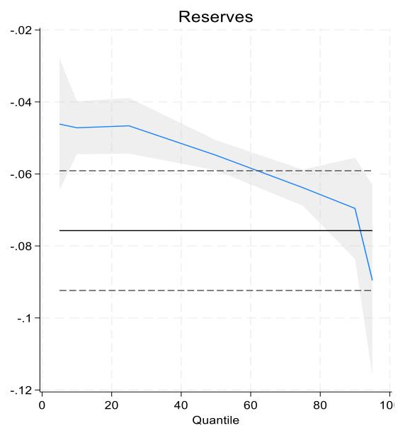

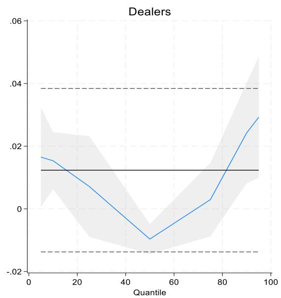  
Notes: The panels present the regression results from Equation 1. The left panel shows the quantile regression coefficient $\beta_{1}$ of SOFR-RRP spreads on standardized reserves (Reserves), while the right panel shows coefficient $\beta_{2}$ on standardized dealer position deviations (Dealer). In each panel, the blue line traces coefficient estimates across quantiles. The gray shaded area represents the 95 percent confidence intervals for the quantile regression estimates (bootstrapped standard errors, 500 replications). The solid black line denotes the corresponding OLS estimate, and the dashed black lines indicate the 95 percent confidence interval of the OLS estimate. Quantiles range is $5\%$ , $10\%$ , $25\%$ , $50\%$ , $75\%$ , $90\%$ , $95\%$ . All quantities variables are standardized. The sample contains weekly data (Wednesday), includes quarter-end dates, and begins in May 2018 through December 2025. Sources: Federal Reserve, Bloomberg, and Author's calculations.

A closer examination of the underlying drivers of dealer balance sheet usage suggests that different forces may shape dealer intermediation across funding conditions. This paper explores two such mechanisms. First, hedge fund demand for leveraged Treasury trades in normal times may help explain the increase in dealer usage observed in lower quantiles. Second, Treasury supply shocks may contribute to the stronger dealer pressures that emerge in higher quantiles. To examine these channels, the following sections present extensions to the baseline model that captures how hedge fund activity and Treasury issuance amplify dealer intermediation pressures.

## Hedge Fund Amplification Effect

To further understand amplification mechanisms via the dealer balance sheet, Figure 2 (Table 2 in the Annex) presents the estimated coefficients across quantiles for key variables of Equation 2, which is the specification including the hedge funds. The interaction coefficient between Hedge Funds and dealer balance sheets ( $\gamma$ ) is declining in significance across quantiles, providing evidence of a retrenchment mechanism: hedge fund amplification of dealer pressures is concentrated in the low-spread regime and turns insignificant in the highspread regime, consistent with the narrative that basis trade activity is elevated when funding conditions are benign and can stall or unwind in periods of funding stress.

More specifically, the interaction between dealer balance-sheet usage and hedge fund activity is positive and statistically significant in the lower to middle quantiles of the repo spread distribution. Increases in hedge fund positions in those quantiles amplify the sensitivity of repo spreads to dealer balance-sheet expansion. $^{13}$ For example, at the 5th percentile, the baseline dealer coefficient is 0.009, implying that a one-standard-deviation increase in dealer balance-sheet usage raises repo spreads by roughly 0.9 basis points when hedge fund activity is unchanged. The interaction coefficient of 0.02 indicates that a one-standard-deviation increase in hedge fund positions raises the marginal sensitivity of repo spreads to dealer balance-sheet usage by an additional 2 basis points, bringing the total marginal effect to roughly 2.9 basis points. This amplification declines across quantiles. At the median, the standalone dealer coefficient is statistically indistinguishable from zero, but the positive interaction coefficient of 0.009 implies that when hedge fund activity increases by one standard deviation, dealer balance-sheet expansion raises repo spreads by about 0.8–0.9 basis points.

The negative standalone coefficient on hedge fund activity reported in Table2, likely reflects the demand-side role of leveraged investors in absorbing Treasury supply and compressing spreads under normal conditions. The hedge fund coefficient is negative and statistically significant at low and mid-quantiles, while the positive interaction with dealer balance-sheet usage at low quantiles indicates that hedge fund activity increases the marginal cost of intermediation, as these positions rely on repo financing and consume dealer balance sheet capacity. Taken together, the impact of the interaction coefficients dominates at low quantiles, suggesting that the cost of intermediation prevails.

Overall, these results indicate that hedge funds can amplify the effect of dealer balance sheet usage, consistent with literature proposing that additional hedge fund demand absorbs dealer balance-sheet capacity and increases the marginal cost of intermediation, leading dealers to raise repo rates in response.

The influence of hedge fund activity diminishes in the upper quantiles of the distribution. Above approximately the 60th percentile, the hedge fund interaction terms decline in magnitude and lose statistical significance. This pattern is consistent with the dependence of basis-trade profitability on funding costs. This dynamic aligns with the narrative that as repo spreads rise, arbitrage strategies become less profitable, leading hedge funds to slow or halt position accumulation. Consequently, hedge fund balance-sheet adjustments appear to matter most when funding conditions are benign to moderate, while their influence weakens as funding stress increases. In more stressed states, repo spreads are no longer shaped by expanding hedge fund activity but instead reflect other types of pressure.

The role of reserves remains key in stabilizing repo spreads across funding conditions. At the 5th percentile, one-standard-deviation increase in reserves lowers repo spreads by roughly 3.7 basis points, a magnitude that exceeds the combined dealer and hedge fund amplification effects at that quantile. The influence of reserves becomes even stronger at the median, where reserves compress repo spreads by about 5.5 basis points. These results suggest that while leveraged demand can amplify dealer balance-sheet pressures, the aggregate level of reserves remains the primary stabilizing force in repo markets.

Figure 2: Hedge Funds Amplify Impact on Repo Spreads in “Normal” Times Hedge Fund Amplification of SOFR-RRP Spread Sensitivity to Reserves and Dealer Positions, by Quantile  
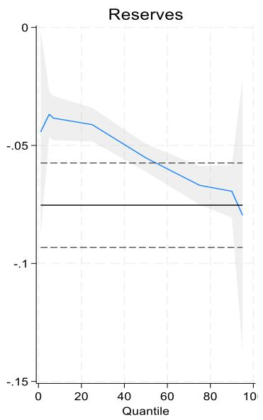

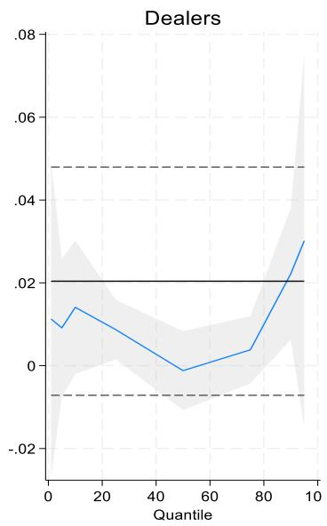

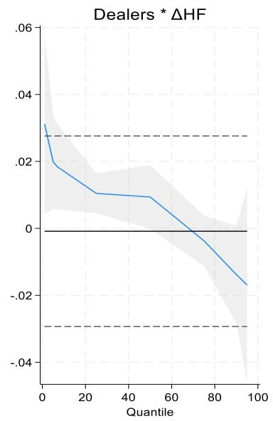  
Notes: The panels present the regression results from Equation 2. The left panel reports quantile regression coefficient $\beta_{1}$ of SOFR-RRP spreads on standardized reserves (Reserves), the middle panel shows coefficient $\beta_{2}$ on standardized dealer position deviations (Dealer) and the right panel reports coefficient $\gamma$ on the interaction between standardized dealer position deviations and hedge fund position growth (Dealers × ΔHF). In each panel, the blue line traces coefficient estimates across quantiles. The gray shaded area represents the 95 percent confidence intervals for the quantile regression estimates (bootstrapped standard errors, 500 replications). The solid black line denotes the corresponding OLS estimate, and the dashed black lines indicate the 95 percent confidence interval of the OLS estimate. Quantiles range is 5%, 10%, 25%, 50%, 75%, 90%, 95%. All quantities variables are standardized. The sample contains weekly data (Wednesday), includes quarter-end dates, and begins in May 2018 through December 2025. Sources: Federal Reserve, Bloomberg, and Author's calculations.

Robustness checks: Additional robustness checks confirm that the amplification results are not driven by the specific construction of the hedge fund activity measure. First, using a residualized measure of hedge fund activity can isolate the portion of hedge fund activity that is orthogonal to dealer balance-sheet usage, ensuring that the interaction captures the amplification of dealer pressures by hedge fund demand rather than mechanical co-movement between the two series. The results remain qualitatively unchanged when using this residualized measure, with similar amplification effects across quantiles (Annex, Figure A2.a).

Second, I test alternative horizons for the hedge fund change variable, including 8-week and 24-week differences. While coefficient magnitudes vary slightly (not shown), the direction and statistical significance of the interaction term remain consistent, indicating that the amplification mechanism is not sensitive to the specific horizon used to measure hedge fund activity.

Third, using separately one-month lagged $\Delta$ HF variables instead of the $\Delta$ HF, the amplification effect remains qualitatively unchanged, suggesting that the amplification pattern described persists when hedge funds activity is treated as predetermined (Annex, Figure A2.b). Finally, excluding quarter-end observations and controlling for market volatility (using the VIX index) does not materially alter the results (not shown), suggesting that the findings are not driven by regulatory calendar effects or broader macro-financial conditions.

## Issuance Amplification Effect

Turning to the impact of Treasury issuance, Table 3 presents the results of Equation 3 graphically (see also Table 3 in the Annex). The results for the reserves and hedge fund coefficients $(\beta_{1}$ and $\gamma)$ remain consistent with the outcomes in the previous section. The reserve coefficient is negative, significant, and declining, while the hedge fund interaction coefficient is positive and significant at the lower-mid quantiles, consistent with hedge funds being more active in the lower quantiles.

In contrast, coefficient $\delta$ , the interaction between dealer balance-sheet usage and issuance, displays a clear upward-sloping pattern across the conditional distribution of repo spreads. At lower quantiles, the interaction coefficient is statistically insignificant, indicating that issuance shocks have little amplification effect on repo spreads. Starting around the middle of the distribution, however, the interaction becomes positive and statistically significant, and its magnitude increases steadily toward the upper quantiles. This pattern suggests that the amplification channel associated with Treasury supply becomes more important as funding conditions tighten. Moreover, the stand-alone impact of issuance $\beta_{4}$ is also positive and statistically significant, suggesting that Treasury issuance exerts a direct upward pressure on repo spreads that becomes stronger when dealer balance sheets are elevated.

The results are consistent with the narrative that additional issuance increases the amount of securities that must be intermediated and financed through dealer balance sheets, raising the marginal cost of repo intermediation. In contrast to hedge fund-driven amplification, which is concentrated in the lower to middle quantiles when funding conditions are relatively normal and leveraged demand is expanding, the issuance channel primarily operates in the middle to upper part of the distribution. With tighter funding conditions and balance sheets already heavily used (due to increased hedge fund demand at the lower quantiles), additional issuance likely requires dealers to increase intermediation with constrained capacity. As a result, dealers raise funding rates to compensate for balance sheet costs.

In terms of magnitude, the issuance channel becomes economically meaningful from the middle of the distribution onward. At the median, a one-standard-deviation increase in issuance raises repo spreads by roughly 1.2 basis points when dealer balance-sheet usage is unchanged. However, when dealer usage increases by one standard deviation, the total effect rises to about 2.9 basis points ( $\delta = 0.017$ ). At the 75th percentile, issuance increases spreads by about 1.6 basis points on average, but the effect rises to approximately 3.5 basis points when dealer balance sheets expand ( $\delta = 0.020$ ).

Finally, despite the amplification effects, reserves remain the dominant determinant of repo spreads across quantiles. At the median, a one-standard-deviation increase in reserves lowers repo spreads by roughly 5.5 basis points. This magnitude exceeds the direct effect of issuance (1.2 basis points), and remains larger even after accounting for dealer amplification, which increases the total issuance impact to approximately 2.9 basis points when dealer balance-sheet usage rises by one standard deviation. A similar pattern holds in the upper quantiles. These results indicate that while Treasury issuance and hedge funds can amplify funding pressures through increased dealer balance-sheet usage, the aggregate level of reserves continues to act as a key stabilizing force in repo markets.

Robustness checks: First, the Annex considers an alternative specification that allows Treasury issuance to interact with reserves to capture potential reserve-drain effects from Treasury settlements (Langowski, 2023). While there is some evidence of such an effect, the main results do not change materially (Annex, Figure A3.a). Second, a further robustness check addresses the concern that the issuance variable may be capturing a structural break around the COVID-19 pandemic rather than continuous supply-pressure dynamics. Re-estimating Equation 3 on the post-COVID subsample does not change the results qualitatively (not shown). These findings confirm that the amplification channels identified in the paper reflect ongoing

dynamics driven by continuous variation in issuance and hedge fund activity, rather than a simple before/after split around the pandemic. Third, as a placebo test, Equation 3 is re-estimated using MBS repo spreads as the dependent variable to show that the issuance amplification channel identified in the paper operates through Treasury-specific collateral-supply pressures on dealer balance sheets, rather than through broad money-market conditions that would affect all collateral classes similarly. The results contrast with the Treasury baseline in the interaction between dealer balance-sheet usage and Treasury issuance (Annex, Figure A3.b). The interaction is flat, close to zero, and statistically insignificant across all quantiles in MBS repo. This stands in direct contrast to the Treasury baseline, where the interaction rises steadily and becomes economically significant from the median upward. The placebo results therefore add validation to the Treasury-specific transmission mechanism.

Figure 3: Issuance Amplifies Impact on Repo Spreads When Funding Conditions Tighten  
Hedge Fund and Treasury Issuance Amplification of SOFR-RRP Spread Sensitivity to Reserves and Dealer Positions, by Quantile  
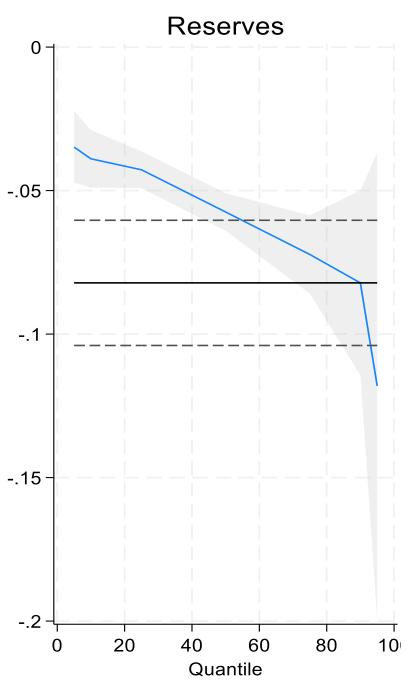

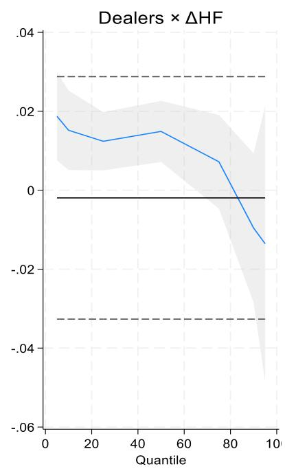

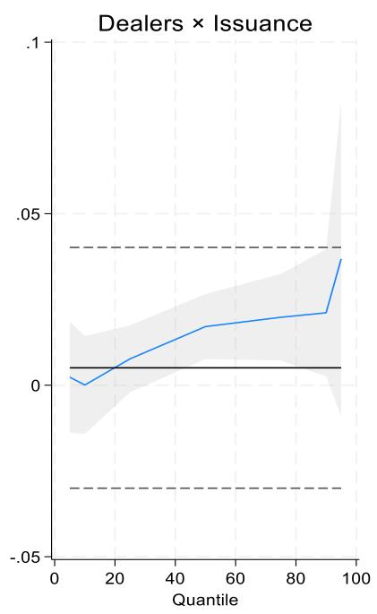  
Notes: The panels present the regression results from Equation 3. The left panel reports quantile regression coefficient $\beta_{1}$ of SOFR-RRP spreads on standardized reserves (Reserves). The middle panel reports coefficient $\gamma$ on the interaction between standardized dealer position deviations and hedge fund position growth (Dealers $\times$ $\Delta$ HF), while the right panel reports coefficient $\delta$ on the interaction between standardized dealer position deviations and lagged Treasury issuance (Dealers $\times$ Issuance). In each panel, the blue line traces the quantile regression coefficient estimates across quantiles. The gray shaded area represents the 95 percent confidence intervals for the quantile regression estimates (bootstrapped standard errors, 500 replications). The solid black line denotes the corresponding OLS estimate, and the dashed black lines indicate the 95 percent confidence interval of the OLS estimate. Quantiles range is $5\%$ , $10\%$ , $25\%$ , $50\%$ , $75\%$ , $90\%$ , $95\%$ . All quantities variables are standardized. The sample contains weekly data (Wednesday), includes quarter-end dates, and begins in May 2018 through December 2025. Sources: Federal Reserve, Bloomberg, and Author's calculations.

## Conclusion

This paper studies the drivers of secured repo spreads by jointly examining the roles of reserves, dealer balance-sheet usage, hedge fund leverage, and Treasury issuance across the conditional distribution of funding conditions. Using a quantile regression framework, the analysis highlights that repo market dynamics are strongly state-dependent and reflect the interaction between liquidity conditions and intermediary balance-sheet pressures.

Three main findings emerge. First, reserves remain the dominant stabilizing force in repo markets. Across quantiles, higher reserve balances consistently compress repo spreads, with the effect becoming particularly pronounced in periods of tighter funding conditions. These results reinforce the importance of aggregate liquidity buffers in maintaining stable short-term funding markets under floor-type operating frameworks.

Second, hedge fund activity primarily affects repo spreads through its interaction with dealer balance-sheet capacity. In lower and middle quantiles of the spread distribution—corresponding to relatively benign funding conditions—the interaction between hedge fund positions and dealer balance-sheet usage is positive and significant. This suggests that leveraged demand, such as basis trading strategies, amplifies the marginal cost of dealer intermediation. However, this amplification effect diminishes as spreads rise, consistent with evidence that hedge funds reduce positions during periods of funding stress.

Third, Treasury issuance becomes increasingly important as funding conditions tighten. While issuance exerts a modest direct upward pressure on repo spreads across the distribution, its interaction with dealer balance-sheet usage strengthens markedly in higher quantiles. This pattern indicates that supply shocks place additional strain on intermediary balance sheets precisely when funding markets are already under pressure. As a result, issuance-related inventory accumulation can amplify repo market stress through dealer intermediation pressures.

Taken together, these findings suggest that repo market outcomes reflect the joint interaction of liquidity supply, leveraged demand, and intermediary capacity and that the mechanism through which increased dealer balance-sheet usage transmit to repo spreads is state-dependent, driven by leveraged demand in normal conditions and by collateral supply pressures under stress. Throughout these regimes, reserves provide the primary buffer against funding market stress.

More broadly, the results highlight the importance of considering intermediary balance-sheet pressures and market structure when assessing the transmission of liquidity conditions to short-term interest rates. As Treasury supply continues to expand and leveraged participation in fixed income markets grows, understanding how these forces interact with the level of reserves will remain central to the design of resilient monetary policy operating frameworks and stable repo market functioning.

## Annex – Robustness tests

## Figure A1 - Sensitivity of Repo Spread to Reserves and Dealer Positions, by Quantile

## a. Excluding quarter ends

(quarter end defined as the observations that fall on the Wednesday immediately prior to the quarter end)

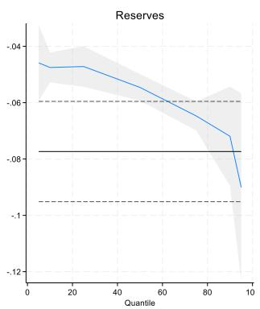

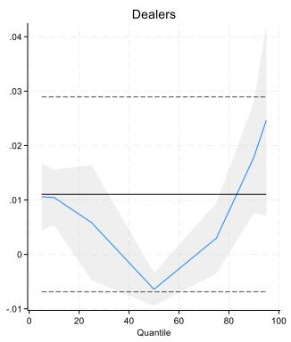

## b. Excluding quarter ends and covid shock

(covid shock defined as the observations that fall between March 1, 2020 and April 30, 2020)

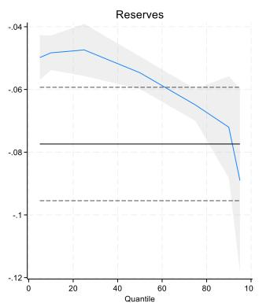

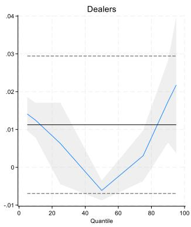

## c. Excluding September 2019 repo spike

(September 2019 repo spike defined as the observations that fall between Sep. 16, 2019 and Oct. 10, 2019)

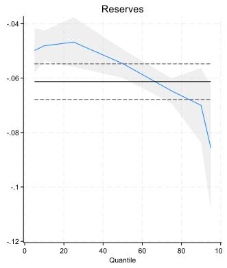

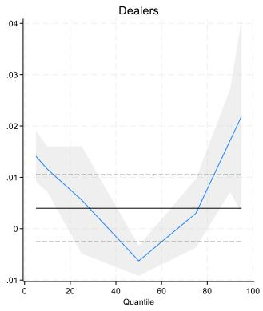

Notes: The panels present the regression results from Equation 1 for different sample periods. The left panels show the quantile regression coefficient $\beta_{1}$ of SOFR-RRP spreads on standardized reserves (Reserves), while the right panel shows coefficient $\beta_{2}$ on standardized dealer position deviations (Dealer). In each panel, the blue line traces coefficient estimates across quantiles. The gray shaded area represents the 95 percent confidence intervals for the quantile regression estimates (bootstrapped standard errors, 500 replications). The solid black line denotes the corresponding OLS estimate, and the dashed black lines indicate the 95 percent confidence interval of the OLS estimate. Quantiles range is $5\%$ , $10\%$ , $25\%$ , $50\%$ , $75\%$ , $90\%$ , $95\%$ . All quantities variables are standardized. The sample contains weekly data (Wednesday), includes quarter-end dates, and begins in May 2018 through December 2025. Sources: Federal Reserve, Bloomberg, and Author's calculations.

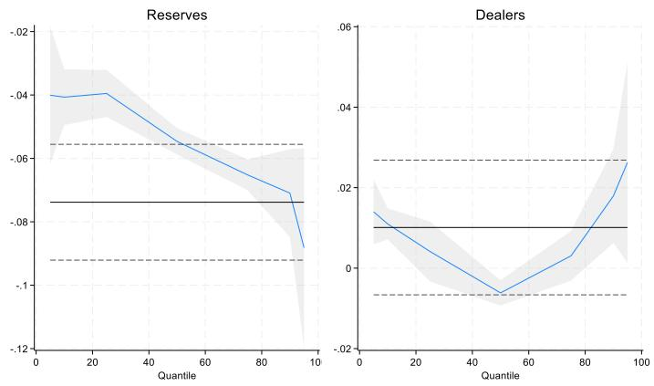

## d. Including VIX

Notes: The panels present the regression results from $Spread_{t} = \alpha_{q} + \beta_{1,q} Reserves_{t} + \beta_{2,q} DP_{t} + \theta_{q} VIX_{t} + \varepsilon_{q,t}$ . The left panels show the quantile regression coefficient $\beta_{1}$ of SOFR-RRP spread on standardized reserves (Reserves), while the right panel shows coefficient $\beta_{2}$ on standardized dealer position deviations (Dealer). In each panel, the blue line traces coefficient estimates across quantiles. The gray shaded area represents the 95 percent confidence intervals for the quantile regression estimates (bootstrapped standard errors, 500 replications). The solid black line denotes the corresponding OLS estimate, and the dashed black lines indicate the 95 percent confidence interval of the OLS estimate. Quantiles range is 5%, 10%, 25%, 50%, 75%, 90%, 95%. All quantities variables and the VIX are standardized. The sample contains weekly data (Wednesday), includes quarter-end dates, and begins in May 2018 through December 2025. Sources: Federal Reserve, Bloomberg, and Author's calculations.

## Figure A2 - Hedge Fund Amplification: RepoSpread Sensitivity to Reserves and Dealer Positions, by Quantile

## a. Using a residualized measure of hedge fund activity

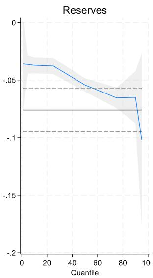

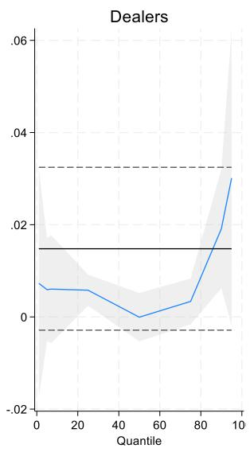

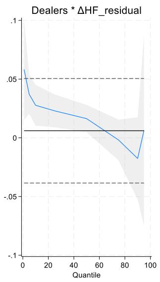

Notes: The panels present the regression results from $Spread_{t} = \alpha_{q} + \beta_{1,q} Reserves_{t} + \beta_{2,q} DP_{t} + \beta_{3,q} \Delta HF_{t} + \gamma_{q}(DP_{t} \times \Delta HF\_res_{t}) + \varepsilon_{q,t}$ . This is the same specification as Equation 2, but with $\Delta HF\_res_{t}$ replacing $\Delta HF_{t}$ . $\Delta HF\_res_{t}$ is a residualized measure of hedge fund activity constructed as follows. Three-month changes in hedge fund Treasury futures positions are regressed on three-month changes in dealer balance-sheet usage, and the residual component is retained. This orthogonalized measure isolates the portion of hedge fund activity driven by hedge-fund-specific demand rather than by the shared funding environment that simultaneously affects dealer positions. Using this residualized measure in the interaction term ensures that the estimated amplification effect captures the independent contribution of hedge fund demand to dealer balance-sheet pressures, rather than mechanical co-movement between the two series.

Similar to previous charts, the left panel reports quantile regression coefficient $\beta_{1}$ of SOFR-RRP spreads on standardized reserves (Reserves), the middle panel shows coefficient $\beta_{2}$ on standardized dealer position deviations (Dealer) and the right panel reports coefficient $\gamma$ on the interaction between standardized dealer position deviations and hedge fund position growth (Dealers $\times$ $\Delta$ HF). In each panel, the blue line traces coefficient estimates across quantiles. The gray shaded area represents the 95 percent confidence intervals for the quantile regression estimates (bootstrapped standard errors, 500 replications). The solid black line denotes the corresponding OLS estimate, and the dashed black lines indicate the 95 percent confidence interval of the OLS estimate. Quantiles range is 5%, 10%, 25%, 50%, 75%, 90%, 95%. All quantities variables are standardized. The sample contains weekly data (Wednesday), includes quarter-end dates, and begins in May 2018 through December 2025. Sources: Federal Reserve, Bloomberg, and Author's calculations.

## b. Using one-month lagged $\Delta HF$ variables instead of the $\Delta HF$

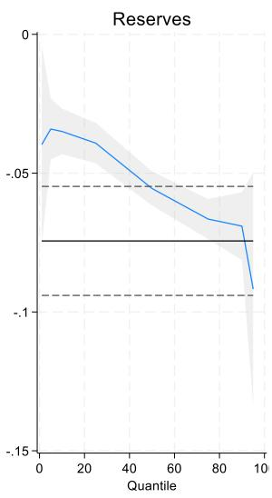

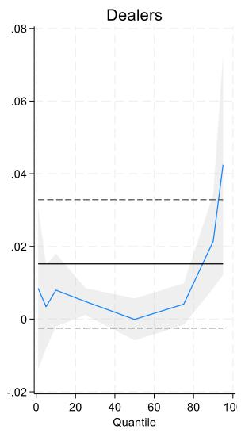

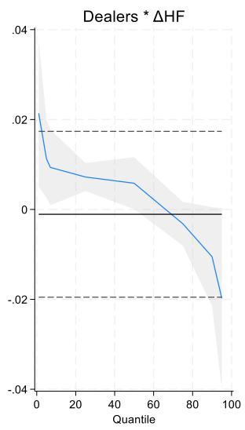

Notes: The panels present the regression results from Equation 2, where the $\Delta$ HF variable is lagged by four weeks. The left panel reports quantile regression coefficient $\beta_{1}$ of SOFR-RRP spreads on standardized reserves (Reserves), the middle panel shows coefficient $\beta_{2}$ on standardized dealer position deviations (Dealer) and the right panel reports coefficient $\gamma$ on the interaction between standardized dealer position deviations and hedge fund position growth (Dealers $\times$ $\Delta$ HF). In each panel, the blue line traces coefficient estimates across quantiles. The gray shaded area represents the 95 percent confidence intervals for the quantile regression estimates (bootstrapped standard errors, 500 replications). The solid black line denotes the corresponding OLS estimate, and the dashed black lines indicate the 95 percent confidence interval of the OLS estimate. Quantiles range is $5\%$ , $10\%$ , $25\%$ , $50\%$ , $75\%$ , $90\%$ , $95\%$ . All quantities variables are standardized. The sample contains weekly data (Wednesday), includes quarter-end dates, and begins in May 2018 through December 2025. Sources: Federal Reserve, Bloomberg, and Author's calculations.

Figure A3: Treasury Issuance Amplification of SOFR-RRP Spread Sensitivity to Reserves and Dealer Positions, by Quantile

## a. Capturing reserve-drain effects from Treasury Issuance

Issuance may also affect repo spreads through a reserve-drain channel. Treasury settlements can temporarily reduce reserve balances through the Treasury's general account (TGA), a mechanism described by Langowski (2023), while simultaneously increasing the volume of securities that must be financed and intermediated in repo markets (the collateral channel explored in the main text).

As a robustness check I added an interaction term for reserves and issuance activity. As in the main text, the issuance variable is lagged by a quarter. The specification takes the form:

$$
\begin{array}{r l} {S p r e a d _ {t} =} & {\alpha_ {q} + \beta_ {1, q} R e s e r v e s _ {t} + \beta_ {2, q} D P _ {t} + \beta_ {3, q} \varDelta H F _ {t} + \beta_ {4, q} I s s _ {t} + \dots} \\ & {\ldots + \varphi_ {q} (R e s e r v e s _ {t} \times I s s _ {t}) + \gamma_ {q} (D P _ {t} \times \varDelta H F _ {t}) + \delta_ {q} (D P _ {t} \times I s s _ {t}) + \varepsilon_ {q}} \end{array}\tag{Eq(4}
$$

Figure 4.2 presents some evidence consistent with the reserve-drain mechanism emphasized by Langowski (2023) at lower quantiles of the spread distribution, where higher issuance partially offsets the stabilizing effect of reserves. While reserves (left panel) exert a stronger stabilizing effect, there is a positive amplification mechanism present at the interaction of reserves with issuance (middle panel). However, as spreads rise and funding conditions tighten the interaction weakens considerably and becomes insignificant, suggesting that the dominant transmission channel shifts toward dealer intermediation capacity, with issuance amplifying the impact of dealer balance-sheet usage on repo spreads. Consistent with this interpretation, the dealers-issuance interaction (right panel) becomes stronger in the upper quantiles.

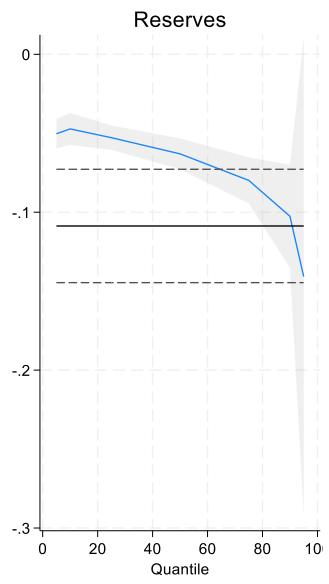

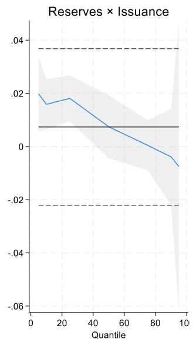

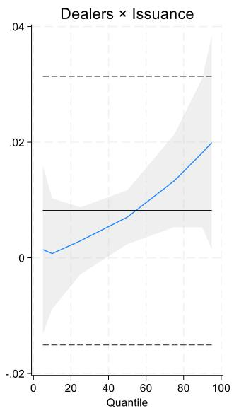

Notes: The left panel reports quantile regression coefficient $\varphi$ on the interaction between standardized reserves and issuance (Reserves $\times$ Issuance), in Equation 4. The right panel reports coefficient $\delta$ on the interaction between standardized dealer position deviations and lagged Treasury issuance (Dealers $\times$ Issuance). In each panel, the blue line traces the quantile regression coefficient estimates across quantiles. The gray shaded area represents the 95 percent confidence intervals for the quantile regression estimates (bootstrapped standard errors, 500 replications). The solid black line denotes the corresponding OLS estimate, and the dashed black lines indicate the 95 percent confidence interval of the OLS estimate. Quantiles range is 5%, 10%, 25%, 50%, 75%, 90%, 95%. All quantities variables are standardized. The sample contains weekly data (Wednesday), includes quarter-end dates, and begins in May 2018 through December 2025. Sources: Federal Reserve, Bloomberg, and Author's calculations.

## b. Placebo test using MBS repo

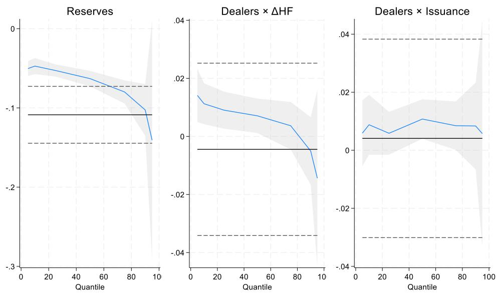

Notes: The panels present the regression results from Equation 3, using the spreads of the MBS repo spread instead of the SOFR spread as a dependent variable: $Spread_{t} = \alpha_{q} + \beta_{1,q} Reserves_{t} + \beta_{2,q} DP_{t} + \beta_{3,q} \Delta HF_{t} + \beta_{4,q} Iss_{t} + +\gamma_{q}(DP_{t} \times \Delta HF_{t}) + \delta_{q}(DP_{t} \times Iss_{t}) + \varepsilon_{q,t}$ . The left panel reports quantile regression coefficient $\beta_{1}$ of MBS-RRP spreads on standardized reserves (Reserves). The middle panel reports coefficient $\gamma$ on the interaction between standardized dealer position deviations and hedge fund position growth (Dealers $\times \Delta HF$ ), while the right panel reports coefficient $\delta$ on the interaction between standardized dealer position deviations and lagged Treasury issuance (Dealers $\times$ Issuance). In each panel, the blue line traces the quantile regression coefficient estimates across quantiles. The gray shaded area represents the 95 percent confidence intervals for the quantile regression estimates (bootstrapped standard errors, 500 replications). The solid black line denotes the corresponding OLS estimate, and the dashed black lines indicate the 95 percent confidence interval of the OLS estimate. Quantiles range is 5%, 10%, 25%, 50%, 75%, 90%, 95%. All quantities variables are standardized. The sample contains weekly data (Wednesday), includes quarter-end dates, and begins in May 2018 through December 2025. Sources: Federal Reserve, Bloomberg, and Author's calculations.

## Tables: Quantile Regression Results

Table 1: Baseline Quantile Regression Results (Bootstrap Standard Errors)

<table><tr><td>Variable</td><td>Q05</td><td>Q10</td><td>Q25</td><td>Q50</td><td>Q75</td><td>Q90</td><td>Q95</td></tr><tr><td>Reserves</td><td>-0.0461***(0.0120)</td><td>-0.0472***(0.0039)</td><td>-0.0466***(0.0040)</td><td>-0.0548***(0.0023)</td><td>-0.0638***(0.0027)</td><td>-0.0696***(0.0064)</td><td>-0.0896***(0.0121)</td></tr><tr><td>Dealers</td><td>0.0165***(0.0049)</td><td>0.0154***(0.0045)</td><td>0.0071(0.0083)</td><td>-0.0096***(0.0024)</td><td>0.0029(0.0055)</td><td>0.0242***(0.0067)</td><td>0.0293***(0.0098)</td></tr><tr><td>Constant</td><td>0.0059(0.0046)</td><td>0.0124***(0.0017)</td><td>0.0296***(0.0044)</td><td>0.0634***(0.0024)</td><td>0.0955***(0.0051)</td><td>0.1285***(0.0092)</td><td>0.1672***(0.0154)</td></tr></table>

No obs: 386

Table 2: Impact of Hedge Funds: Quantile Regression Results (Bootstrap Standard Errors)

<table><tr><td>Variable</td><td>Q05</td><td>Q10</td><td>Q25</td><td>Q50</td><td>Q75</td><td>Q90</td><td>Q95</td></tr><tr><td>Reserves</td><td>-0.0368***(0.0044)</td><td>-0.0428***(0.0045)</td><td>-0.0412***(0.0038)</td><td>-0.0553***(0.0029)</td><td>-0.0669***(0.0042)</td><td>-0.0694***(0.0092)</td><td>-0.0796**(0.0346)</td></tr><tr><td>Dealers</td><td>0.0091(0.0091)</td><td>0.0141*(0.0085)</td><td>0.0087**(0.0035)</td><td>-0.0012(0.0041)</td><td>0.0038(0.0038)</td><td>0.0222***(0.0085)</td><td>0.0302(0.0183)</td></tr><tr><td>Hedge Funds</td><td>-0.0081**(0.0038)</td><td>-0.0072*(0.0043)</td><td>-0.0127***(0.0016)</td><td>-0.0104***(0.0032)</td><td>-0.0080**(0.0040)</td><td>-0.0152(0.0098)</td><td>-0.0056(0.0245)</td></tr><tr><td>Dealers × Hedge Funds</td><td>0.0199***(0.0071)</td><td>0.0117*(0.0070)</td><td>0.0104***(0.0028)</td><td>0.0094*(0.0050)</td><td>-0.0037(0.0039)</td><td>-0.0138*(0.0075)</td><td>-0.0169(0.0169)</td></tr><tr><td>Constant</td><td>-0.0008(0.0045)</td><td>0.0113***(0.0039)</td><td>0.0294***(0.0026)</td><td>0.0587***(0.0030)</td><td>0.0948***(0.0040)</td><td>0.1249***(0.0134)</td><td>0.1613***(0.0441)</td></tr></table>

No obs: 374

Table 3: Impact of Issuance: Quantile Regression Results (Bootstrap Standard Errors)

<table><tr><td>Variable</td><td>Q05</td><td>Q10</td><td>Q25</td><td>Q50</td><td>Q75</td><td>Q90</td><td>Q95</td></tr><tr><td>Reserves</td><td>-0.0348***(0.0063)</td><td>-0.0389***(0.0047)</td><td>-0.0427***(0.0036)</td><td>-0.0575***(0.0040)</td><td>-0.0723***(0.0071)</td><td>-0.0822***(0.0089)</td><td>-0.1181***(0.0332)</td></tr><tr><td>Dealers</td><td>0.0101(0.0098)</td><td>0.0243**(0.0102)</td><td>0.0209***(0.0061)</td><td>0.0112**(0.0048)</td><td>0.0092*(0.0051)</td><td>0.0258***(0.0085)</td><td>0.0372(0.0246)</td></tr><tr><td>Hedge Funds</td><td>-0.0078*(0.0046)</td><td>-0.0091*(0.0047)</td><td>-0.0118***(0.0017)</td><td>-0.0144***(0.0029)</td><td>-0.0066(0.0048)</td><td>-0.0081(0.0077)</td><td>-0.0116(0.0191)</td></tr><tr><td>Dealers × Hedge Funds</td><td>0.0187***(0.0062)</td><td>0.0152***(0.0051)</td><td>0.0124***(0.0035)</td><td>0.0149***(0.0037)</td><td>0.0072(0.0058)</td><td>-0.0096(0.0082)</td><td>-0.0136(0.0230)</td></tr><tr><td>Issuance</td><td>0.0026(0.0053)</td><td>0.0076*(0.0045)</td><td>0.0105***(0.0024)</td><td>0.0115***(0.0026)</td><td>0.0155***(0.0044)</td><td>0.0293***(0.0087)</td><td>0.0493***(0.0160)</td></tr><tr><td>Dealers × Issuance</td><td>0.0023(0.0081)</td><td>0.0001(0.0074)</td><td>0.0077(0.0055)</td><td>0.0171***(0.0045)</td><td>0.0198***(0.0064)</td><td>0.0211**(0.0100)</td><td>0.0368(0.0274)</td></tr><tr><td>Constant</td><td>0.0005(0.0057)</td><td>0.0171***(0.0055)</td><td>0.0322***(0.0029)</td><td>0.0603***(0.0038)</td><td>0.0942***(0.0057)</td><td>0.1299***(0.0096)</td><td>0.1878***(0.0296)</td></tr></table>

No obs: 374

Notes: Quantile regression estimates of SOFR-RRP spreads. Tables 1–3 present results based on specifications in Equations 1–3. Reserves are defined as total banking sector balances held at the Federal Reserve divided by the US banks' total assets. Dealers proxies dealer balance sheet usage, measured as dealer net positions in credit markets plus gross repo financing, relative to their rolling 1-year historical average. Hedge Funds are measured by the 3-month change in hedge fund Treasury futures (short) positions. Issuance is measured by the quarterly changes of coupon securities outstanding, lagged by one quarter. All volume variables are standardized. Bootstrap standard errors in parentheses (500 replications). The sample includes quarter-end dates from May 2018 through December 2025. All variables are standardized. \*\*\* p<0.01, \*\* p<0.05, \* p<0.1.

## References

Adrian, Tobias, and Hyun Song Shin. 2014. "Procyclical Leverage and Endogenous Financial Stability." Journal of Political Economy 122 (2): 373–415.

Adrian, Tobias, Michael Fleming, and Kleopatra Nikolaou. 2025. "US Treasury Market Functioning from the GFC to the Pandemic." Annual Review of Financial Economics, Vol. 17:49-76.

Afonso, Gara, Domenico Giannone, Gabriele La Spada, and John C. Williams. 2025. "Scarce, Abundant, or Ample? A Time-Varying Model of the Reserve Demand Curve." Federal Reserve Bank of New York Staff Report No. 1019.

Bailey, Andrew. 2024. "The Importance of Central Bank Reserves." Speech delivered at the London School of Economics, London, October 2024. Bank of England.

Barth, Daniel, and R. Jay Kahn. 2021. "Hedge Funds and the Treasury Cash-Futures Disconnect." OFR Working Paper No. 21-01. Washington, DC: Office of Financial Research.

Barth, Daniel, and R. Jay Kahn. 2025. "Hedge Funds and the Treasury Cash-Futures Basis Trade." Journal of Monetary Economics 155: 103823., https://doi.org/10.1016/j.jmoneco.2025.103823.

Barth, Daniel, R. Jay Kahn, and Robert Mann (2023). "Recent Developments in Hedge Funds' Treasury Futures and Repo Positions: is the Basis Trade "Back"?," FEDS Notes. Washington: Board of Governors of the Federal Reserve System, August 30, 2023, https://doi.org/10.17016/2380-7172.3355.

Besugo, Rita, Benoit Nguyen, Andrea Poinelli, and Martin Scheicher. 2025. "Dealers' Costs of Intermediation in Fixed Income Markets: Empirical Results for the Euro Area." SUERF Policy Brief No. 1226. Frankfurt: European Central Bank.

Chabot, Marianne, Sebastian Infante, James Orr, and Zack Saravay. 2024. "Dealer Balance Sheet Constraints: Evidence from Dealer-Level Data across Repo Market Segments." FEDS Notes. Washington, DC: Board of Governors of the Federal Reserve System.

Cochran, Paul, Sebastian Infante, Lubomir Petrasek, Zack Saravay, and Mary Tian. 2023. "Dealers' Treasury Market Intermediation and the Supplementary Leverage Ratio." Finance and Economics Discussion Series 2023. Washington, DC: Board of Governors of the Federal Reserve System.

Copeland, Adam, Darrell Duffie, and Yilin Yang. 2025. "Reserves Were Not So Ample After All." Quarterly Journal of Economics, Volume 140, Issue 1, February 2025, Pages 239–281, https://doi.org/10.1093/qje/qjae034

Cordes, Lucy, and Sebastian Infante. 2025. 'Repo Rate Sensitivity to Treasury Issuance and Quantitative Tightening.' FEDS Notes, February 12. Washington, DC: Board of Governors of the Federal Reserve System. https://doi.org/10.17016/2380-7172.3707.

Du, Wenxin, Benjamin Hébert, Wenhao Li. (2023). "Intermediary Balance Sheets and the Treasury Yield Curve.", Journal of Financial Economics, Volume 150, Issue 3, 103722, ISSN 0304-405X, https://doi.org/10.1016/j.jfineco.2023.103722.

Duffie, Darrell, Michael Fleming, Frank Keane, Claire Nelson, Or Shachar, and Peter Van Tassel. 2023. "Dealer Capacity and U.S. Treasury Market Functionality." Federal Reserve Bank of New York Staff Report No. 1070. New York: Federal Reserve Bank of New York.

Favara, Giovanni and Infante, Sebastian and Rezende, Marcelo. 2025. Leverage Regulations and Treasury Market Participation: Evidence from Credit Line Drawdowns. Available at SSRN: https://ssrn.com/abstract=4175429 or http://dx.doi.org/10.2139/ssrn.4175429

Financial Stability Board (FSB). 2021. Lessons Learnt from the COVID-19 Pandemic from a Financial Stability Perspective. Basel: Financial Stability Board.

Financial Stability Board (FSB). 2026. Vulnerabilities in Government Bond-Backed Repo Markets. Basel: Financial Stability Board.

Fleming, Michael, Giang Nguyen, and Joshua Rosenberg. 2024. "How Do Treasury Dealers Manage Their Positions?" Journal of Financial Economics 158: 103885.

Hempel Samuel J., R. Jay Kahn, Robert Mann, and Mark E. Paddrik. 2024. "Repo Market Intermediation: Dealer Cash and Collateral Flow Management across the U.S. Repo Market". OFR Brief Series, November 14, 2024.

Sam Hempel, R. Jay Kahn, Julia Shephard (2025). "The \$12 Trillion US Repo Market: Evidence from a Novel Panel of Intermediaries," FEDS Notes. Washington: Board of Governors of the Federal Reserve System, July 11, 2025, https://doi.org/10.17016/2380-7172.3843.

International Monetary Fund. 2025. Global Financial Stability Report: Safeguarding Financial Stability amid High Uncertainty. Washington, DC: International Monetary Fund, October.

International Monetary Fund. 2026. Global Financial Stability Report. Washington, DC: International Monetary Fund, April.

Kashyap, Anil K., Jeremy C. Stein, Jonathan Wallen, and Joshua Younger. 2025. "Treasury Market Dysfunction and the Role of the Central Bank." Brookings Papers on Economic Activity, Spring.

Langowski, Philipp. 2023. "Reserve Demand, Quantitative Tightening, and the Fed Funds Rate." Job Market Paper.

Logan, Lorie. 2025. “The case for modernizing the FOMC’s operating target rate”. Speech available at https://www.dallasfed.org/news/speeches/logan/2025/Ikl250925

Lopez-Salido, David, and Annette Vissing-Jorgensen. 2025. "Reserve Demand and Quantitative Tightening." mimeo

