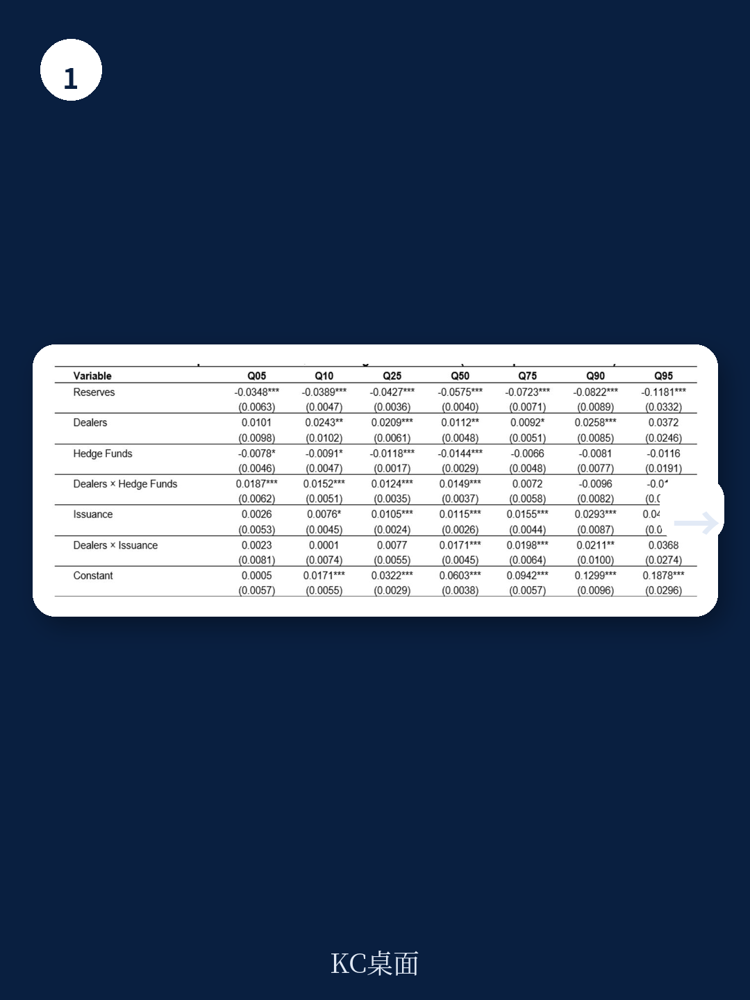
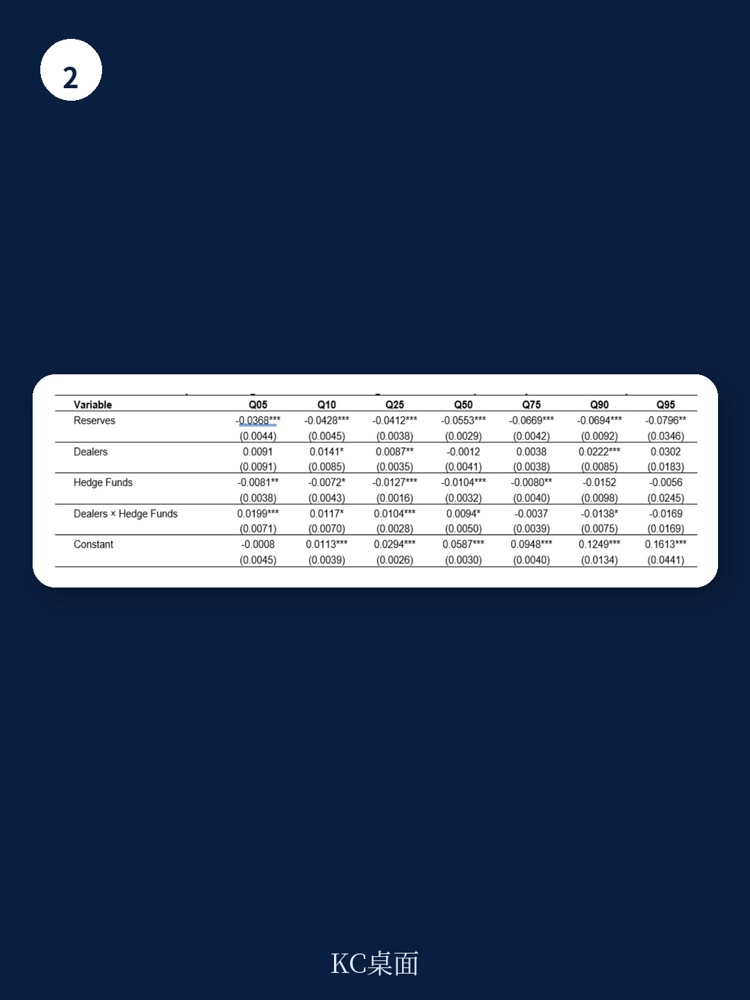

# IMF：回购利率的驱动力，比你想的更依赖“状态”

一份来自国际货币产品组织（IMF）的最新工作论文，系统拆解了美国回购市场利差的驱动因素。结论并不复杂，但含义值得细品：准备金依然是回购市场最核心的稳定器，但它的效果并非在所有市场环境下都相同。真正决定回购利率走向的，是准备金、交易商资产负债表使用率、对冲产品杠杆与国债发行这四个变量在不同资金紧张程度下的“交互反应”。

这份报告的价值在于，它没有停留在“流动性充足则回购利率低”的常识层面，而是通过分位数回归框架，揭示了这些因素在不同市场状态下如何切换主导角色。对于关注美国短期融资市场、美联储资产负债表正常化以及国债市场微观结构的读者，这是一篇不可多得的实证分析。

## 1. 准备金是“压舱石”，但它在紧张时作用最大

报告最核心的发现之一，是准备金对回购利差的压缩效应具有明显的“逆周期性”。在资金条件相对宽松时，更高水平的准备金对利差的压低作用有限；但当市场转向紧张、利差走高时，准备金的效果显著增强。这与已有文献中关于准备金需求曲线非线性的论述一致——当准备金从“充裕”滑向“稀缺”时，其对短期利率的边际影响会急剧放大。

这意味着，美联储在缩表过程中，不能简单用一个静态的“准备金充裕水平”来评估市场不确定性。当对冲产品活动或国债发行冲击交易商资产负债表时，市场对准备金缓冲的需求会突然上升。若缩表恰好将准备金推至这一阈值附近，回购市场的波动率可能迅速飙升。

> **KC评论：** 这份报告用数据支持了一个直觉：准备金不是越多越好，而是刚好够用最好。但“刚好够用”这个点，会随着交易商资产负债表不确定性和杠杆需求的变化而移动。美联储缩表的“终点”，可能比想象中更动态。

## 2. 对冲产品与国债发行：两种不同的“放大器”

报告的一个重要贡献，是区分了对冲产品杠杆与国债发行对回购利差的不同传导路径。在资金条件较为宽松、利差较低时，对冲产品通过国债期货基差交易等策略大量借入回购资金，会显著推高交易商的资产负债表使用率，从而对回购利差形成上行不确定性。但在资金条件已经紧张、利差较高时，对冲产品往往会主动降低杠杆，其对利差的影响反而减弱。

相反，国债发行的影响模式与之互补。在正常市场条件下，国债发行对回购利差的直接效应并不显著；但当资金条件收紧时，新发国债带来的库存不确定性会通过交易商资产负债表这一渠道被放大，从而推高回购利差。报告将其描述为“供应驱动的库存不确定性”——当交易商已经捉襟见肘时，再多的国债供给只会让融资成本更高。

这两种“放大器”的切换，意味着回购市场的不确定性来源是动态的：低利差时，不确定性来自杠杆需求；高利差时，不确定性来自供给冲击。

## 3. 报告尚未完全回答的关键问题：分布效应是否稳定？

尽管分位数回归框架提供了丰富的洞察，但报告本身也坦诚其局限性——所有结果都是条件相关关系，而非结构性因果关系。一个未被充分讨论的问题是：这些状态依赖的系数是否随时间稳定？过去几年中，美国国债市场的结构发生了显著变化——对冲产品基差交易规模从2020年后的快速膨胀，到2024-2025年监管关注下的部分收敛，再到交易商杠杆率规则的调整，都可能改变这些变量之间的互动强度。

换言之，报告揭示的“在低分位数时对冲产品影响更大，在高分位数时国债发行影响更大”这一模式，可能并非永久性的市场规律，而是特定制度环境下的阶段性特征。如果美联储或美国标的交易委员会进一步收紧对基差交易的监管，或调整补充杠杆率规则，这些系数的方向甚至可能反转。

对于读者而言，这份报告提供了一个分析框架，而非一个固定公式。理解回购市场，需要同时关注三个维度：流动性供给（准备金）、中介能力（交易商资产负债表）和杠杆需求（对冲产品与供给冲击）。三者之间的相对权重，取决于市场当时所处的“状态”。而判断这个状态本身，就是最难的功课。