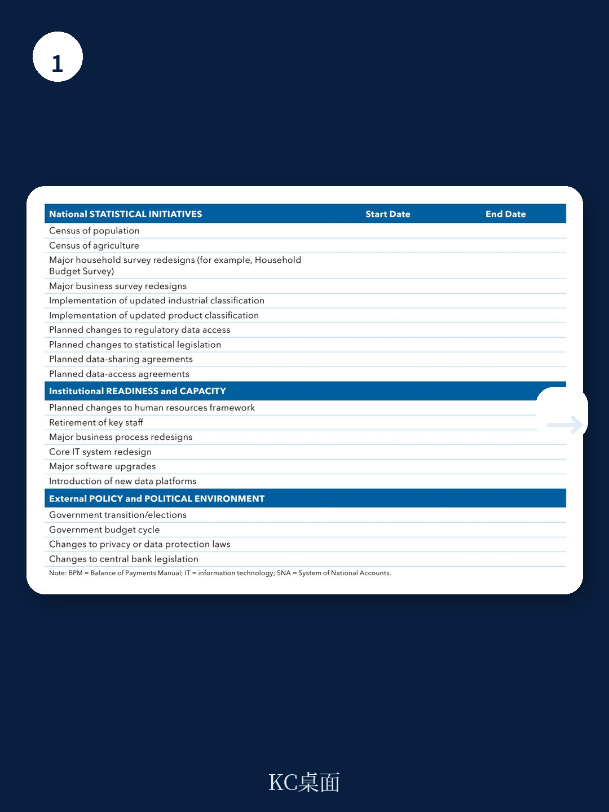
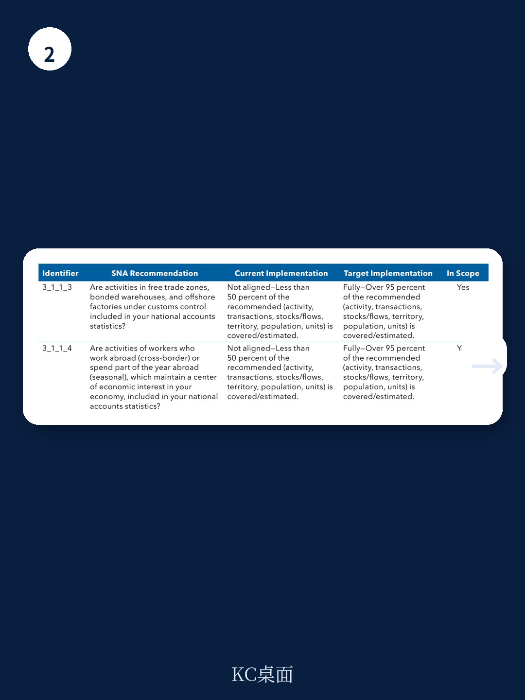

# IMF：联合国与IMF同步更新统计标准，真正的挑战不是方法论，而是协调

2025年3月，联合国统计委员会与国际货币产品组织同步发布了国民账户体系和国际收支手册的最新版本。对大多数国家的统计机构而言，这不仅仅是一次技术升级，而是一场需要跨部门协调、用户参与和资源重新配置的系统工程。IMF统计部门最新发布的《SNA/BPM实施规划手册》给出了一个清晰的信号：真正决定更新成败的，不是方法论本身，而是统计机构能否把这件事当作一个可管理、可衡量、可沟通的项目来推进。

这份手册没有停留在“应该做什么”的层面，而是提供了从利益相关方识别到不确定性管理的完整工具框架。它提醒所有统计系统的管理者：更新标准是一个战略机遇，但前提是你有一套能落地的规划。

## 1. 用户参与不是附加项，而是范围界定的前置条件

手册明确将利益相关方和用户参与放在规划流程的起点。这不是一句空话，而是一个操作原则：在决定“更新什么”之前，必须先弄清楚“谁需要这些数据、用来做什么、优先级如何”。

手册给出了四类核心原则：早期且持续参与、包容且差异化参与、结构化且持续参与、聚焦于优先级和权衡的参与。其中最有价值的一点是，它要求统计机构建立正式的咨询机制——比如成立SNA/BPM实施咨询委员会——而不仅仅是做一次问卷调查。委员会的角色不仅限于确认用户需求，还包括测试方法论选择、帮助争取预算、在过程中充当“测试版”受众。

> **KC评论：** 很多统计机构习惯把用户沟通放在更新结束后的发布阶段，但手册的逻辑是反过来的：用户参与越早，后续的优先级排序和资源分配就越有依据。完整报告中的利益相关方参与规划工具表（Table 1）值得仔细看，它把每个机构的角色、接触议题、沟通频率和方式都列成了可操作选项。

## 2. 范围界定不是“能做什么”，而是“应该先做什么”

手册给出了一个核心判断：没有哪个国家能够一次性实施所有更新建议。资源、时间和能力的约束是真实的。因此，范围界定的本质是一个优先排序问题。

手册提供了两个关键工具：一个是与SNA/BPM统计标准对齐程度的评估工具，帮助机构看清当前体系与新版标准之间的差距；另一个是实施范围界定工具，要求机构从宏观环境相关性、可行性、用户需求和时间框架四个维度来评估每项更新建议。这实际上是在推动统计机构从“技术合规”转向“战略选择”——不是被动接受所有变化，而是主动决定哪些变化最能提升数据对决策的价值。

报告没有完全展开的一个问题是：当不同用户群体的优先级出现冲突时，如何做出取舍？手册提到了“权衡”的必要性，但没有给出具体的决策框架。这可能是每个国家在实操中最需要自己补上的部分。

## 3. 不确定性识别应该从规划阶段就开始，而不是等到问题出现

手册的第九章专门讨论了实施过程中的不确定性识别与评估，并将其与常规的组织不确定性管理体系挂钩。它识别了技术、组织、财务、法律、声誉、数据保密、外部政治等七类不确定性，并要求机构对每个不确定性进行“可能性 x 影响”的评级，同时指定不确定性负责人和监控频率。

一个值得注意的细节是：手册强调不确定性识别不应是一次性工作，而应在实施的关键节点重复进行。这背后的逻辑是，统计系统更新周期长、参与方多、外部环境变化快，初始阶段识别出的不确定性可能在执行过程中发生变化，甚至出现新的不确定性类别。

> **KC评论：** 手册中的不确定性识别工具表（Table 17）结构清晰，但它的真正价值在于迫使机构把“不确定性”从抽象概念变成可追踪、可分配责任的具体条目。对于统计机构的管理者来说，这可能是整份手册中最容易被低估但最实用的工具。

## 4. 报告尚未完全回答的关键问题：如何衡量“成功”？

手册提供了从规划到执行的全套工具，但有一个关键问题留给了读者自己思考：如何定义和衡量SNA/BPM实施的成功？手册提到了“提升数据质量”“增强可信度”“建立信任”等目标，但没有给出具体的绩效指标或评估框架。

这或许不是手册的疏漏，而是一个有意留白。每个国家的统计系统起点不同、用户结构不同、资源禀赋不同，成功的标准自然也不同。但这也意味着，统计机构在规划阶段就需要自己设计一套评估逻辑——哪些指标能反映数据质量提升？哪些信号说明用户满意度改善？哪些里程碑意味着项目进度正常？

对读者而言，这份手册最有价值的阅读方式，不是把它当作一套现成的模板，而是当作一个提问清单：我们有没有真正的用户参与机制？我们的范围界定是基于数据还是基于习惯？我们的不确定性管理是形式还是实质？答案在哪，规划就在哪。

For informational purposes only. Portions may be generated,translated,summarized,or edited with AI assistance based on source materials and may contain omissions or errors. Please verify independently. This is not investment,legal,tax,accounting,or other professional advice.
