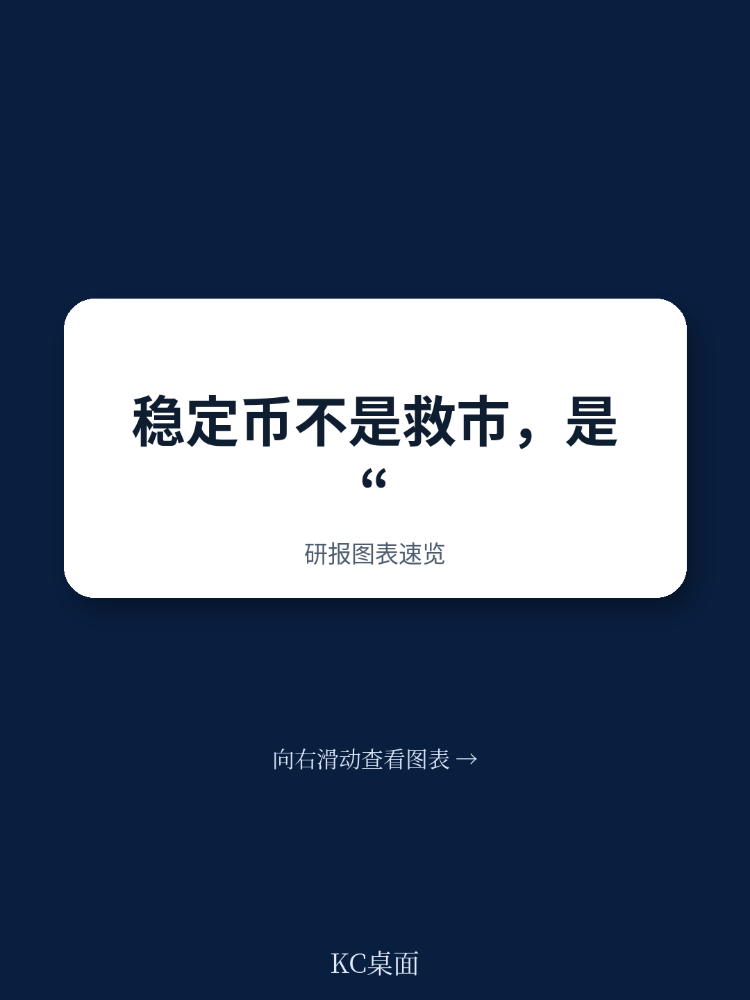
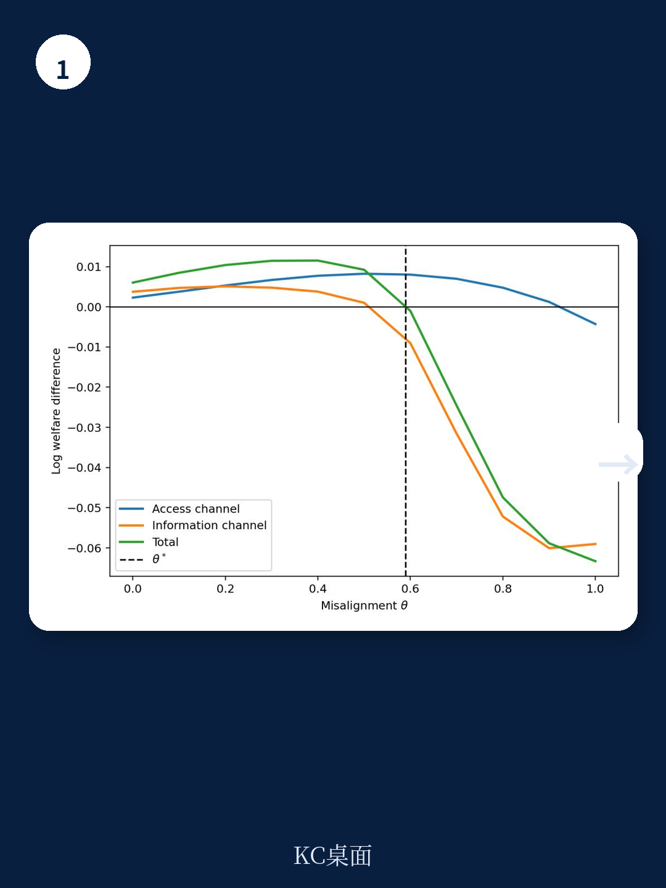
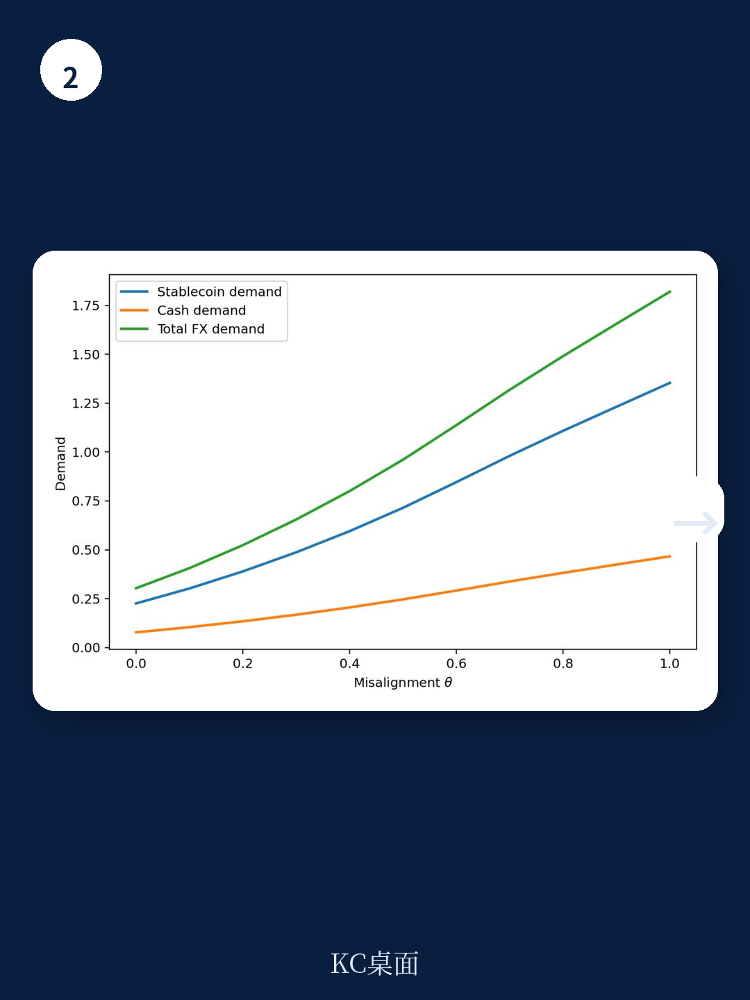

# IMF：稳定币不是中性工具，其角色取决于宏观状态

一份来自国际货币产品组织（IMF）的最新工作论文，为理解稳定币在新兴市场的角色提供了一个意想不到的分析框架。报告的核心判断是：稳定币既是改善外汇准入和价格发现的技术工具，也可能成为协调资本外逃的“公共信号放大器”——其福利效应取决于汇率失衡的程度。

当官方汇率与市场出清价格之间存在缺口时，外汇被配给。传统平行市场虽然能反映这一缺口，但信息分散在双边、私密的交易机会中，没有一个公开价格能完整揭示真实的汇率失衡程度。美元稳定币改变了这一信息结构：它创造了一个公共交易场所，将分散的需求汇聚成一个可见的高频价格。在玻利维亚2024年允许虚拟资产交易后，USDT/BOB的价格迅速成为平行美元的实际参考指标——这正是报告所描述的机制。

但问题在于，这个价格既是信息，也是协调工具。

## 1. 稳定币的双重效应取决于失衡的严重程度

报告构建了一个全球博弈模型。家庭无法直接观察真实的汇率失衡程度，只能接收来自传统市场的分散私人信号，以及来自稳定币市场的公共信号。稳定币的深度决定了公共信号的精确度——深度越深，信号越精确。

模型的福利结果取决于失衡程度。当失衡较低时，稳定币降低外汇获取成本、改善对冲配置，福利效应为正。但当失衡较高时，同样的公共价格会压缩信念的分散度，让更多家庭同步采取行动，从而放大挤兑不确定性。此时，协调外部性超过了准入收益，稳定币反而降低了福利。

> **KC评论：** 这个结论的关键在于“公共信号”的双刃剑属性。当市场已经脆弱时，一个更清晰的定价信号可能不是帮助市场出清，而是让更多人同时意识到“该跑了”。报告没有给出具体的失衡阈值，但指出了这一反转发生的条件——公共信息效应越强、扰动损失越大，反转点就越低。

## 2. 信息渠道的净效应：从中性到负值

报告的定量模拟进一步拆解了福利变化的来源。在安全状态下，信息渠道的净效应接近中性或微弱为正——更好的价格发现帮助家庭更精准地对冲。但当宏观环境进入脆弱区间，信息渠道迅速转负，因为稳定币信号协调了挤兑行为。

这一机制与传统的货币扰动模型有本质区别。在Obstfeld（1996）的自我实现扰动框架中，信念的协调来自基本面本身的不确定性。而在本报告中，稳定币市场深度内生地改变了信息的公共性——深度越高，公共信号越精确，信念同步性越强，扰动门槛反而降低。

这意味着，稳定币的普及本身可能改变扰动的触发条件。即便宏观基本面没有出现变化，一个更透明的平行市场价格也可能让原本不会发生的挤兑成为现实。

## 3. 报告尚未完全回答的关键问题：政策干预的时机与工具

报告提出了一个“状态依赖”的政策框架：在正常状态下保留低成本的准入，在高失衡时采取临时、有针对性的措施管理大规模或挤兑式资金流出。但报告没有详细讨论两个关键问题。

第一，如何判断“高失衡”的阈值？模型给出了理论条件，但实际操作中，决策者需要可观测的先行指标。报告提到的玻利维亚案例提供了一些线索，但没有形成可操作的政策规则。

第二，临时措施的退出机制是什么？如果稳定币市场在扰动中被限制，当失衡缓解后如何恢复市场信任？报告承认，稳定币监管不能替代宏观宏观环境调整——减少失衡本身才是首要任务。但政策干预与市场退出之间的时序安排，仍是一个开放问题。

## 4. 一个值得关注的观察框架：区分准入效应与信息效应

对于研究者和市场参与者而言，这份报告提供了一个有价值的分析透镜：不要将稳定币市场视为单一的外汇渠道，而要区分它的“准入功能”和“信息功能”。

准入功能降低交易成本，扩大外汇获取范围，这是直观的福利改进。信息功能则更为复杂——它改善价格发现，但也可能同步信念、放大脆弱性。评估一个地区的稳定币不确定性，关键在于判断当前处于“低失衡”还是“高失衡”状态。

报告还指出，在异质性准入的扩展中，准入收益更多流向传统外汇市场摩擦最高的群体（如无银行账户者），但信息外部性由整个地区承担。这意味着，限制措施在准入维度可能是累退的，而放任不管则可能让整个地区在脆弱状态下面临更大的扰动不确定性外部性。

这份报告没有给出简单的政策答案。但它清楚地表明：稳定币不是中性的技术工具，它在固定汇率制下的角色取决于宏观状态本身。对于一个正在经历外汇短缺、同时稳定币使用快速增长的开放地区而言，这个结论值得反复推敲。

For informational purposes only. Portions may be generated,translated,summarized,or edited with AI assistance based on source materials and may contain omissions or errors. Please verify independently. This is not investment,legal,tax,accounting,or other professional advice.
