# What Drives Crypto Mining? Evidence from Hardware Imports

Prepared by Andras Komaromi, Federico Grinberg, Diego A. Cerdeiro, and Yang Liu

WP/26/146

IMF Working Papers describe research in progress by the author(s) and are published to elicit comments and to encourage debate. The views expressed in IMF Working Papers are those of the author(s) and do not necessarily represent the views of the IMF, its Executive Board, or IMF management.

2026
JUL

IMF Working Paper
Monetary and Capital Markets

What Drives Crypto Mining? Evidence from Hardware Imports Prepared by Andras Komaroni, Federico Grinberg, Diego Cerdeiro, and Yang Liu\*

Authorized for distribution by Tobias Adrian
July 2026

IMF Working Papers describe research in progress by the author(s) and are published to elicit comments and to encourage debate. The views expressed in IMF Working Papers are those of the author(s) and do not necessarily represent the views of the IMF, its Executive Board, or IMF management.

ABSTRACT: Understanding financial activity beyond traditional regulatory frameworks is essential for policymakers. Yet crypto assets mining—which offers a direct entry point into the crypto ecosystem without relying on traditional financial intermediaries—remains highly opaque. We propose a novel measurement approach using detailed customs data that tracks exports of crypto mining hardware from the world’s dominant producers. This trade-based proxy allows us to analyze the global distribution of mining hardware imports and identify their key drivers, guided by a stylized model. Empirically, mining surges respond strongly to global factors such as crypto assets prices and hardware costs, while domestic factors—including electricity prices and ambient temperature—shape the cross-country distribution of activity. Our findings highlight how global crypto markets, natural endowments, and policy choices jointly influence mining incentives, offering valuable insights for policymakers concerned with financial stability risks and energy subsidy misuse.

JEL Classification Numbers:

F14, F21, G11

Keywords:

Crypto assets; Crypto mining; Bitcoin; Capital controls

Authors' email addresses:

akomaromi@imf.org@IMF.org
fgrinberg@IMF.org
dcerdeiro@imf.org
yliu10@imf.org

# What Drives Crypto Mining? Evidence from Hardware Imports\*

Andras Komaromi $^{i}$ Federico Grinberg $^{ii}$

Diego A. Cerdeiro $^{iii}$ Yang Liu $^{iv}$

June 4, 2026

## Abstract

Understanding financial activity beyond traditional regulatory frameworks is essential for policymakers. Yet crypto assets mining—which offers a direct entry point into the crypto ecosystem without relying on traditional financial intermediaries—remains highly opaque. We propose a novel measurement approach using detailed customs data that tracks exports of crypto mining hardware from the world’s dominant producers. This trade-based proxy allows us to analyze the global distribution of mining hardware imports and identify their key drivers, guided by a stylized model. Empirically, mining surges respond strongly to global factors such as crypto assets prices and hardware costs, while domestic factors—including electricity prices and ambient temperature—shape the cross-country distribution of activity. Our findings highlight how global crypto markets, natural endowments, and policy choices jointly influence mining incentives, offering valuable insights for policymakers concerned with financial stability risks and energy subsidy misuse.

JEL Classification: F14; F21; G11

Keywords: Crypto assets; Crypto mining; Bitcoin; Capital controls

## 1 Introduction

Understanding financial activities beyond traditional regulatory frameworks is essential for crisis prevention, illicit finance mitigation, and effective macroeconomic management. Among such activities, the crypto ecosystem, particularly crypto assets mining, remains highly opaque. Pseudonymous participation is foundational to most crypto assets, and mining provides a direct entry point into the ecosystem by generating new assets through the protocol itself, rather than acquiring them through financial intermediaries or counterparties. As a result, policymakers have struggled to quantify mining activity across jurisdictions and assess its macroeconomic implications.

This paper introduces a novel measurement approach that leverages detailed customs data from the dominant producers of crypto mining hardware—the Chinese mainland, Hong Kong SAR, and Taiwan Province of China—to track international flows of mining hardware. By focusing on carefully selected product codes, we construct country-level indices of mining hardware imports as a proxy for mining activity. This method offers a transparent and reproducible alternative to existing self-reported or IP-based estimates, which are often inconsistent and susceptible to manipulation.

To interpret the country-level variation of our import-based measure of mining activity, we develop a simple portfolio choice model. Investors allocate wealth across domestic assets, foreign assets, and crypto mining hardware, based on relative returns and risks shaped by both global conditions and local fundamentals. Returns to mining depend on crypto assets prices and mining costs, which are affected by hardware prices, electricity costs, and ambient temperature (through cooling efficiency). In this framework, stricter capital controls or lower domestic risk-adjusted returns push portfolios toward crypto mining investments, particularly in regions where low temperatures and cheap electricity make mining more profitable.

In our empirical analysis, we identify periods of unusual surges in mining hardware imports and test the theoretical predictions on the determinants of mining activity. We primarily focus on Bitcoin, which accounts for over 60% of global crypto assets market capitalization, though we show that our results are robust to the inclusion of hardware used for mining other cryptocurrencies. To tackle an important data gap, we build a quality-adjusted and network difficulty-scaled price index of mining hardware (see Appendix A.3) which represents, to the best of our knowledge, the first attempt in the literature to create a comparable time series of mining hardware cost.

We find statistical evidence for most predictions of the stylized model. Our results suggest that global factors—crypto assets and hardware prices—are the primary drivers of surges in mining hardware imports, but favorable local conditions such as cool climate and cheap electricity amplify global crypto cycles. The empirical estimates can quantitatively explain the 2021-early-2022 synchronized crypto mining boom as well as a large share of the cross-country heterogeneity. Furthermore, our results are robust to alternative definitions of crypto mining-related imports extracted from customs data.

From a policy perspective, our results provide suggestive evidence that crypto mining has macroeconomic and financial stability implications. In particular, it can undermine capital controls by offering an alternative, borderless investment channel for residents in financially constrained economies. Moreover, cheap electricity, often due to untargeted subsidies, can further incentivize mining, exacerbating financial and environmental distortions. These insights highlight the need for policymakers to consider both financial and energy policy dimensions when assessing the risks posed by crypto mining.

When interpreting our results, it is important to acknowledge three caveats of our trade-based approach.

First, although highly detailed, 8-digit customs data may still include goods beyond crypto mining equipment. We mitigate this concern by focusing on “surges” in mining hardware imports, which are less likely to reflect unrelated demand. Second, by construction, we cannot infer mining activity in the primary exporting economies themselves. Third, hardware shipments from the main producer economies may not always coincide with the final location of mining activity. In our baseline, we therefore treat recorded export destinations as the best available proxy for the country of use, while explicitly accounting for Hong Kong SAR as a re-export hub in constructing the trade dataset. We also abstract from cross-border trade in second-hand machines. This would affect our conclusions only if the geographic distribution of second-hand ASIC trade differs materially from that of the primary market. Our results are also robust to aggregating customs-union members into synthetic units, suggesting that potential re-exports within customs unions are not first-order for the main findings.

Relation to the literature While we focus on measuring crypto mining activity, our findings align with research on the use of crypto assets in transactions. For example, Yu and Zhang (2022) document a ‘flight-to-Bitcoin’ effect, where Bitcoin demand rises with economic policy uncertainty, particularly in countries with high corruption. Alnasaa et al. (2022) confirm this link, showing that crypto usage also correlates with capital controls. Hu et al. (2021) and Chen and Sarkar (2022) further argue that cryptocurrencies facilitate capital flight in China, creating a Bitcoin price premium against the Yuan. Cerutti et al. (2024), Cardozo et al. (2024), and Reuter (2025) describe different methodologies, assumptions, and datasets to quantify cross-border crypto asset transactions.

Meanwhile, efforts to quantify crypto mining at the country level remain limited. A now discontinued effort to track mining activity came from the Cambridge Centre for Alternative Finance (CCAF), which inferred hashrate shares from IP addresses of miners connecting to a set of participating pools, making results sensitive to VPN use, hosting arrangements, and the representativeness of cooperating pools. $^{1}$ A second class of approaches uses blockchain-based heuristics to trace miners' reward flows to exchanges, inferring location from the jurisdiction of these exchanges, relying on strong assumptions about address clustering and cash-out behavior that need not match the physical location of rigs and are hard to scale into a consistent global panel. $^{2}$ A third line of work detects mining activity from network-layer signals such as DNS patterns, traffic fingerprints, or mining-protocol communication, which can identify mining traffic at specific vantage points but is inherently partial and vulnerable to obfuscation. $^{3}$ In contrast, our approach relies on observable cross-border trade flows of specialized mining hardware, which aggregate naturally at the country level, are harder to disguise than IP addresses or exchange choices, and thus provide a globally comparable measure of mining-related investment that we show correlates well with the Cambridge estimates.

Our study builds on prior work showing that electricity costs and climate conditions influence mining location choices (e.g., Sun et al. (2022); Arslanian (2022)). Given the energy-intensive nature of mining, operators seek locations with abundant, low-cost electricity and favorable cooling conditions. We contribute by providing systematic cross-country evidence on these factors, while also considering additional determinants related to policy choices and macroeconomic fundamentals.

Finally, our theoretical approach connects to studies on the pricing of mining hardware through the lens of “real options” theory (e.g., Hashimoto and Noda (2019); Yaish and Zohar (2023)). We also treat mining hardware analogous to financial assets, but we frame the problem within a portfolio allocation model. Abstracting from the option-like nature of hardware, we assume the price of mining equipment is given and explore the factors shaping its risk-return profile relative to other domestic and foreign assets.

The rest of the paper is organized as follows. Section 2 describes the construction of our trade-based measure of mining activity and presents some stylized facts. Section 3 develops a simple model to guide our empirical estimation. Section 4 presents a methodology to identify surges in mining hardware imports and provides empirical evidence on their drivers. Section 5 concludes. The Appendix includes additional information on the sources and construction of the trade data used in the empirical analysis.

## 2 Data and Measurement

This section provides background on the mechanics of crypto mining, describes how specialized mining hardware can be identified in customs data, and outlines the construction of value and volume indices for mining hardware flows. It also presents stylized facts based on our constructed measures and compares them to alternative proxies used in the literature.

## 2.1 Background on Crypto Mining

Blockchain, together with a consensus protocol, is the technology that underpins the decentralized validation and recording of transactions in crypto asset networks. The name derives from the fact that transaction records are grouped into blocks, which are cryptographically linked to form a continuously growing chain. This can be thought of as a lengthy public record, similar to an ongoing receipt.

In blockchains using the proof-of-work (PoW) consensus protocol, such as Bitcoin, specialized nodes called miners compete to solve a computationally intensive puzzle—finding a valid cryptographic hash. $^{4}$ The first to find a valid solution earns the right to append a new block to the chain and is rewarded with newly issued coins. This mechanism not only ensures consensus and security but also represents the sole channel through which new crypto assets are created. $^{5}$ Solving the puzzle requires substantial computational power and becomes progressively more difficult as network participation grows, maintaining a relatively stable rate of block creation.

In the early stages of Bitcoin, mining could be performed using standard CPUs. However, growing competition and algorithmic difficulty soon rendered general-purpose processors obsolete. Today, virtually all mining for major PoW-based cryptocurrencies is conducted using application-specific integrated circuits (ASICs)—custom-built chips that offer vastly higher hash rates and energy efficiency (Bedford Taylor, 2017; Mueller, 2020). As individual mining became less profitable, most activity migrated to mining pools, where participants combine computational power and receive predictable income (in bitcoin terms) by splitting the block rewards according to their contribution. As of January 2025, the top 10 pools accounted for approximately 95% of the Bitcoin network's hash rate. $^{6}$

Our empirical strategy exploits the specificity of currently used mining hardware. While mining is not directly observable, the specialized hardware it requires leaves detectable traces of where it occurs. By way of analogy, we can imagine a hypothetical observer who is unaware of which US state was home to the 19th century gold rush. Such an observer could infer that the gold rush took place in California by looking at the flow of gold mining inputs, such as pickaxes and sluices, rather than the gold itself. $^{7}$

## 2.2 Identifying Mining Hardware Imports in Customs Data

All major producers of crypto mining ASICs are located in the Chinese mainland (Tiwari and Green, 2022). To monitor international shipments of mining hardware, we collect 8-digit Harmonized System (HS) export data, disaggregated by destination country and product code, directly from China's customs authority. $^{8}$

Drawing on publicly available information on China's use of HS lines and guidance from Bitmain's website (the largest Chinese manufacturer of mining machines), we identify three candidate codes for ASIC exports: 8471.41.90, 8471.50.40, and 8473.30.90. Based on further investigation, we find that 8473.30.90 likely corresponds to ASIC components or accessories, as evidenced by significantly lower unit values. We therefore focus our baseline analysis on codes 8471.41.90 and 8471.50.40, though we check that results are robust to including the broader set.

Approximately 32 percent of the Chinese mainland's reported ASIC exports are shipped to Hong Kong SAR. Given Hong Kong SAR's well-known role as a logistics and re-export hub for Chinese goods, and the lack of evidence that it hosts significant crypto mining activity, we treat Hong Kong SAR primarily as a pass-through location. Specifically, exports from the Chinese mainland to Hong Kong SAR are excluded from our bilateral dataset, and Hong Kong SAR is not treated as a final destination in the analysis. Instead, we incorporate Hong Kong SAR's own re-exports of the relevant HS codes, as reported in UN COMTRADE, on the same footing as exports originating from the Chinese mainland. Because Hong Kong SAR uses slightly different HS codes than the Chinese mainland, we manually map product codes across the two systems using official documentation from the Hong Kong SAR Census and Statistics Department, as shown in Table 1.

Outside this special case, we treat recorded export destinations as the best available proxy for the location where mining hardware is ultimately used. In Section A.5, we assess the sensitivity of this assumption for customs unions in a robustness exercise.

In the Appendix, we also describe supplementary trade data, including from Taiwan Province of China, that we collected to track exports of graphics processing units (GPUs). GPUs have historically been used to mine certain cryptocurrencies, most notably Ethereum prior to its transition to proof-of-stake. Given their multipurpose nature and limited specificity to crypto mining, we use these data solely for robustness analysis.

Table 1: Mapping ASIC-related HS 8-digit codes between the Chinese mainland and Hong Kong SAR  
The Chinese mainland Hong Kong SAR Description

<table><tr><td>8471.41.90</td><td>8471.41.00</td><td>Other automatic data processing machines; comprising in the same housing at least a CPU and an input and output unit, including combined</td></tr><tr><td>8471.50.40</td><td>8471.50.00</td><td>Processing units other than those of subheading 8471.41 and 8471.49, whether or not containing in the same housing one or two of the following types of units: storage units, input units, output units</td></tr><tr><td>8473.30.90</td><td>8473.30.90</td><td>Parts and accessories for automatic data processing machines and units thereof, magnetic or optical readers, transcribing machines, etc., nesoi</td></tr></table>

Note: The table shows our correspondence between HS codes used by the Chinese mainland and Hong Kong SAR for mining hardware and related components.

Aggregation The bilateral structure of Chinese and Hong Kong SAR export data allows us to construct country-level time series on the importation of mining hardware, providing a proxy for local crypto mining activity. For each country, we aggregate monthly imports under the identified HS8 codes into a single “synthetic” product that captures the overall import of mining hardware.

We develop two aggregate indicators. First, we simply add up the dollar value of all relevant HS codes and create a value index of mining-related imports for each country. Aggregating values is straightforward but it conflates changes in quantities and prices.

We therefore construct a Laspeyres-type volume index to capture the changes in quantity of mining-related hardware imports. Our trade data provides quantities either in number of units or in kilograms. $^{9}$ We treat each exporter-HS8 code pair as a separate product and use the year 2018 as the base period. That is, our monthly import volume index $I_{j}^{q}$ for any country j is given by

$$
I _ {j} ^ {q} (t) = \sum_ {i} s _ {i, j} ^ {2 0 1 8} \frac {q _ {i , j} (t)}{\bar {q} _ {i , j} ^ {2 0 1 8}} \times 1 0 0,\tag{1}
$$

where i indexes the distinct exporter-HS code pairs, $s_{i,j}^{2018}$ is the expenditure share of product i in 2018, and $\bar{q}_{i,j}^{2018}$ is the average monthly import quantity of product i for country j. This formulation ensures that the average value of the index in 2018 is 100.

These aggregated data form the basis for constructing a monthly panel dataset of mining hardware imports from January 2018 to August 2023.

## 2.3 Stylized Facts

This section presents stylized facts based on our constructed series of mining hardware imports. These facts both validate the use of trade data as a proxy for mining activity and motivate the empirical analysis that follows.

Fact 1: Import shares are correlated with independent estimates of country-level hashrates. Figure 1 shows a strong correlation between our import-based proxy and country-level hashrate estimates from the Cambridge Centre for Alternative Finance (CCAF), which monitored Bitcoin mining activity between September 2019 and January 2022 using data from multiple mining pools. $^{10}$ For the CCAF estimates to reliably reflect the cross-country distribution of mining, two key assumptions must hold: (i) the IP addresses reported to mining pools accurately reflect miners' physical locations, and (ii) the membership of mining pools included in the sample is representative of Bitcoin's global hashrate distribution. These assumptions may be particularly fragile in jurisdictions where mining is prohibited or heavily regulated, as miners in such locations are more likely to obscure their IP addresses using VPNs.

In contrast, our approach draws on customs records from hardware-exporting countries—data that are more difficult to mask or manipulate. While our method cannot detect re-exports or the final country of use, the strong correlation with CCAF estimates provides validation for our proxy.

Fact 2: Global imports of mining hardware surged in 2021–2022, coinciding with large swings in crypto assets prices. Figure 2 reveals three distinct phases of mining hardware imports in our sample period:

1. 2018-20 (stable and deflationary): The volume of mining hardware imports hovered around its 2018 average, while the value index drifted down in line with declining unit costs due to technological improvements.

2. 2021–early 2022 (boom): The volume of mining hardware surged, with the 12-month moving average climbing to about 25% above its baseline by early 2022. Import values rebounded even more strongly, reflecting rising hardware prices as demand outpaced ongoing efficiency gains amid the crypto rally (right panel).

3. Late 2022–23 (retrenchment): Both indices trended back toward their pre-pandemic average.

The surge in hardware imports during 2021–2022 occurs during a period of rapidly rising crypto assets prices, while the subsequent retrenchment coincides with the decline in crypto assets prices. Although the figure does not establish a causal relationship, the comovement is consistent with the idea that investment in mining hardware responds to conditions in crypto assets markets.

An alternative interpretation is that the surge reflects the normalization of global supply chains following COVID-19 disruptions, particularly given that China and Hong Kong SAR were among the regions most affected. To assess this possibility, Appendix Figure 7 compares ASIC-related exports with aggregate Chinese exports alongside the Bitcoin price. While total exports increased steadily as global trade recovered beginning in mid-2020, ASIC exports display a markedly different pattern: the surge occurs later, is substantially sharper, and is followed by a pronounced decline in 2022–2023. In contrast, aggregate exports remain elevated after the pandemic recovery. The timing of the boom-bust cycle in ASIC exports also closely mirrors movements in the Bitcoin price. These patterns suggest that the surge in mining hardware trade is unlikely to reflect only a broad post-pandemic catch-up effect and instead at least partly reflects crypto-specific investment dynamics.

Figure 1: Mining hardware imports and hashrate estimates  
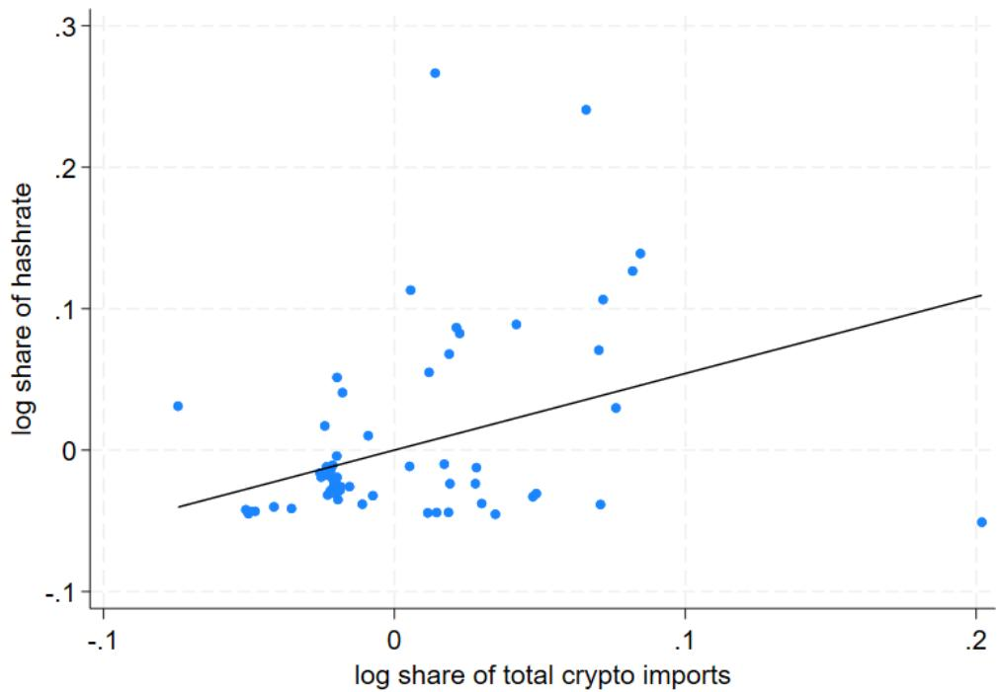  
beta=0.54; p-value=0.01  
Note: The figure shows the partial relationship between country's (log) share in mining hardware imports and (log) hashrate share, controlling for (log) GDP. Data are annual, 2019–2022.

Figure 2: Global mining hardware trade and Bitcoin prices  
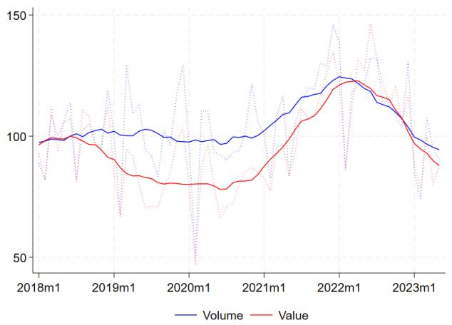

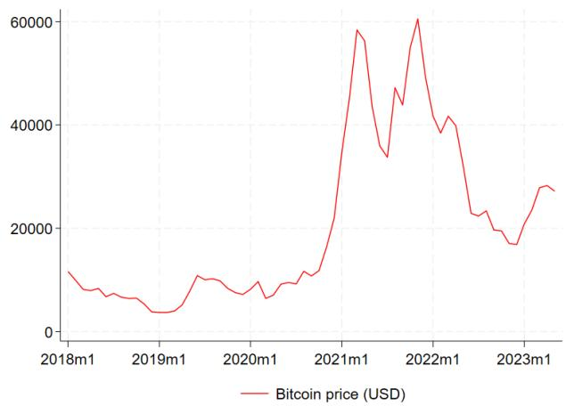  
Note: The left panel shows volume and value indices of global crypto mining hardware imports (dotted lines) and their 12-month centered moving average (solid lines), normalized to 100 in 2018. The right panel shows average Bitcoin prices.

Fact 3: Import growth rates vary widely across countries and over time. As shown in Figure 3, annual growth rates of mining hardware imports display substantial cross-country variation, underscoring the importance of local factors that will be explored later in our empirical analysis. At the same time, the synchronized shifts in the distribution of growth rates over time suggest that global factors, such as cycles in crypto prices, play a crucial role. For example, in 2021 many countries experienced a boom in imports of crypto mining equipment, with a median growth rate of 43 percent.

Figure 3: Annual growth rates of mining hardware imports (volumes, percent)  
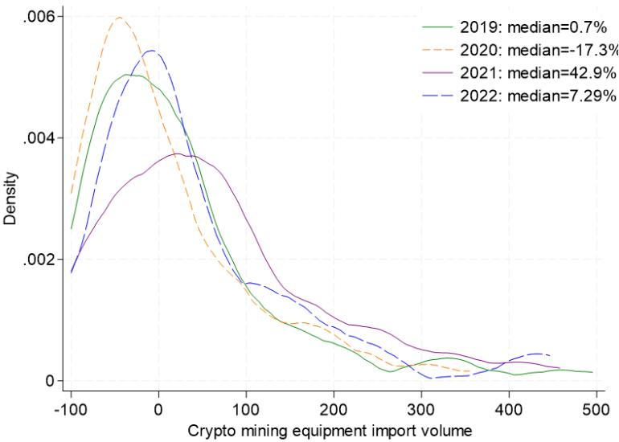  
Note: Kernel density plot of country-level annual growth rates in mining hardware import volumes.

Figure 4 provides country-level examples illustrating that these surges often align with the CCAF hashrate estimates, where available. For example, Argentina was a prominent and extreme case of the 2021-2022 crypto mining surge with roughly 700 percent higher annual mining hardware imports than the 2018-2020 average. The temporal alignment with CCAF's estimates reinforces the validity of our trade-based measure as a reliable proxy for mining investment.

With these stylized facts in place, we next develop a theoretical framework to formally analyze the determinants of mining investment decisions.

Figure 4: Country examples: Import volumes and hashrates  
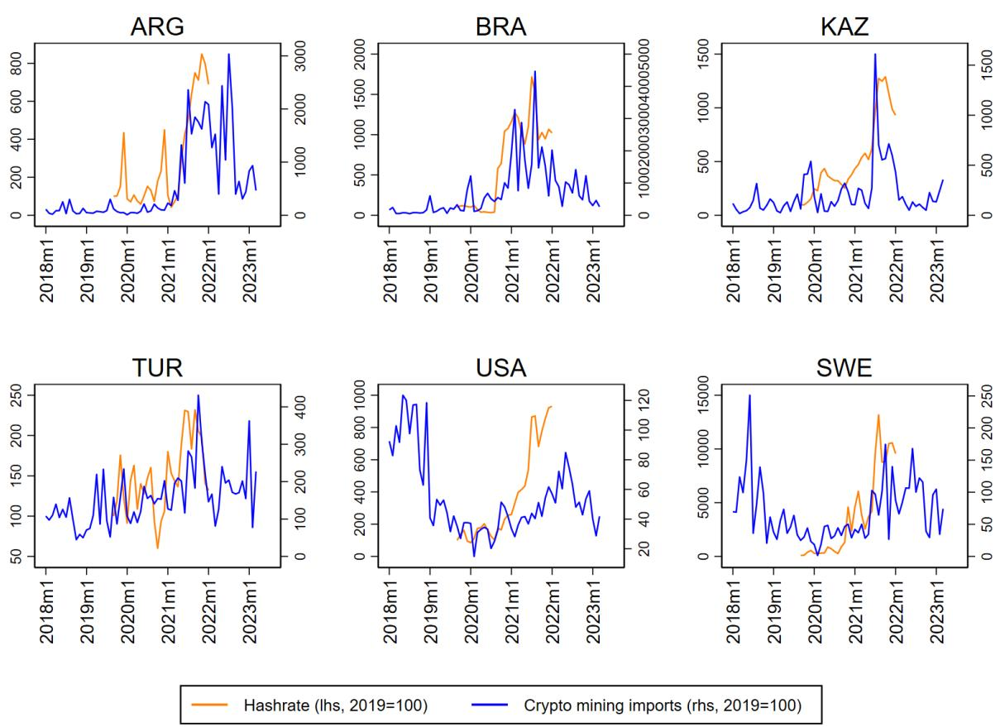  
Note: Selected countries' mining hardware import volumes plotted alongside CCAF's estimated hashrate.

## 3 Theoretical Framework: A Simple Model

To interpret the mining import patterns documented above, we develop a stylized portfolio choice model that captures the economic incentives behind investment in crypto mining hardware. Although mining equipment is a physical input, we treat it as a financial asset: an investor acquires it to generate a stream of expected income. This abstraction allows us to transparently incorporate key determinants such as crypto prices, hardware costs, temperature, electricity prices, and policy distortions through the risk-return profile of the relevant assets. This is conceptually analogous to an investor choosing between acquiring a gold mine to access a tradable commodity and allocating funds to traditional financial assets.

## 3.1 Setup

The representative investor allocates wealth among three assets: a foreign asset $(f)$ , a domestic asset $(d)$ , and Bitcoin mining hardware $(b)$ which we will call ASIC for simplicity. The expected returns and return variances are denoted by $\mu_{i}$ and $\sigma_{i}^{2}$ with i = f, d, b, respectively. The investor evaluates all returns in foreign currency, reflecting the globally traded nature of crypto assets and the widespread use of hard currencies as reference units. The foreign asset is risk free ( $\sigma_{f}^{2} = 0$ ) and the two risky assets have uncorrelated returns. $^{11}$ The determinants of these returns will be specified in detail, along with further elaboration on our assumptions, after solving the general problem.

The investor has mean-variance preferences and chooses portfolio shares $(x_{f}, x_{d}, x_{b})$ to maximize:

$$
U = E (R _ {p}) - \frac {\rho}{2} \operatorname{Var} (R _ {p}),\tag{2}
$$

where $R_{p}$ is the portfolio return and $\rho$ captures risk aversion. The shares must satisfy the budget constraint:

$$
x _ {f} + x _ {d} + x _ {b} = 1.
$$

We introduce capital account frictions by assuming that foreign asset holdings incur a convex cost:

$$
c (x _ {f}) = \frac {\gamma}{2} x _ {f} ^ {2},
$$

where $\gamma > 0$ captures the stringency of controls. This penalty captures any administrative and regulatory barriers to holding foreign assets, such as special registration and reporting requirements, investment caps, or taxes on foreign investments. It can also reflect informal costs associated with circumventing capital controls to move (potentially illicit) money into hard currency.

## 3.2 Solution

The investor's problem is to maximize:

$$
\mathcal {L} = (x _ {f} \mu_ {f} + x _ {d} \mu_ {d} + x _ {b} \mu_ {b}) - \frac {\rho}{2} \left(x _ {d} ^ {2} \sigma_ {d} ^ {2} + x _ {b} ^ {2} \sigma_ {b} ^ {2}\right) - \frac {\gamma}{2} x _ {f} ^ {2} + \lambda \left(1 - x _ {f} - x _ {d} - x _ {b}\right),
$$

where $\lambda$ is the Lagrange multiplier on the budget constraint.

No capital controls $(\gamma = 0)$ : As a benchmark, it is useful to consider the case without any capital controls, denoted by a superscript 0. In this case the risk-free asset sets the baseline marginal utility of wealth and one immediately obtains $\lambda^{0} = \mu_{f}$ . The optimal portfolio shares are then given by the familiar formulas for a mean-variance investor with a risk-free asset:

$$
x _ {d} ^ {0} = \frac {\mu_ {d} - \mu_ {f}}{\rho \sigma_ {d} ^ {2}}, \qquad x _ {b} ^ {0} = \frac {\mu_ {b} - \mu_ {f}}{\rho \sigma_ {b} ^ {2}}, \qquad x _ {f} ^ {0} = 1 - x _ {d} ^ {0} - x _ {b} ^ {0}.
$$

Capital controls ( $\gamma > 0$ ): When capital controls are present, the first-order conditions yield:

$$
x _ {d} = \frac {\mu_ {d} - \lambda}{\rho \sigma_ {d} ^ {2}}, \qquad x _ {b} = \frac {\mu_ {b} - \lambda}{\rho \sigma_ {b} ^ {2}}, \qquad x _ {f} = \frac {\mu_ {f} - \lambda}{\gamma}.
$$

Using the budget constraint, we solve for the modified marginal utility of wealth:

$$
\lambda = \mu_ {f} - \frac {x _ {f} ^ {0}}{\frac {1}{\gamma} + \frac {1}{\rho \sigma_ {d} ^ {2}} + \frac {1}{\rho \sigma_ {b} ^ {2}}},
$$

where $x_{f}^{0}$ represents the optimal foreign asset share in the frictionless case as shown above. For the subsequent analysis we assume $x_{f}^{0} > 0$ , capturing the empirically more relevant scenario in which the investor prefers holding some foreign safe assets, and $\mu_{b} > \mu_{f}$ , ruling out short positions in mining hardware.

The additional term in the solution for $\lambda$ encapsulates how capital controls—interacting with the risk-return profile of the other available assets—dampen the marginal utility of wealth. As expected, the adjustment term increases with the stringency of capital controls. For a given $\gamma$ , the negative impact on marginal utility is higher if the investor would like to hold more foreign assets in the absence of capital controls. Moreover, the effect of capital controls on the shadow price of wealth is magnified if the investor is pushed towards highly unattractive risky alternatives. $^{12}$

Using the adjusted marginal utility of wealth, we can derive the optimal portfolio shares. In particular, the solution for ASIC investment takes the following form:

$$
x _ {b} = x _ {b} ^ {0} + \frac {x _ {f} ^ {0}}{\frac {\rho \sigma_ {b} ^ {2}}{\gamma} + \frac {\sigma_ {b} ^ {2}}{\sigma_ {d} ^ {2}} + 1},\tag{3}
$$

where $x_{b}^{0}$ is again the no-capital-control benchmark. This formulation further highlights that the cost of investing abroad forces the investor to reallocate wealth toward locally available risky assets, including

ASICs. This portfolio rebalancing increases $x_{b}$ relative to the benchmark share.

All model parameters have an intuitive impact on the ASIC investment share. Stricter capital controls, lower domestic excess return, and higher domestic asset risk directly increase the second adjustment term, leading to higher $x_{b}$ . Although the excess return and riskiness of ASICs affect both the benchmark share and the adjustment factor, simple algebra shows that under our assumptions $x_{b}$ is increasing in the former and decreasing in the latter. $^{13}$

## 3.3 Unpacking Risky Returns and Comparative Statics

So far, we have not specified what factors affect the return of the two risky investment opportunities. In this section, we link these returns to observable variables and provide numerical illustrations of how changes in key parameters affect the demand for ASICs in our stylized model.

The return on the domestic asset, measured in foreign currency, depends on the domestic interest rate $(r)$ and the ratio between future and present exchange rates $(S_{1}$ and $S_{0}$ , respectively):

$$
\mu_ {d} = \mathbb {E} \left\{\frac {1 + r}{S _ {1} / S _ {0}} \right\}.
$$

If the domestic interest rate is risk-free in local currency, all risk comes from unexpected exchange rate movements. However, we may also interpret randomness as general uncertainty about domestic financial markets.

The return on mining hardware is determined by the initial cost of the ASIC and the profit from selling the newly minted Bitcoin after deducting the electricity cost of operating the mining equipment. Assuming the miner joins a mining pool, we can treat the number of generated bitcoins as non-random. Without loss of generality, we normalize the units such that 1 ASIC produces 1 bitcoin. $^{14}$ The amount of electricity needed to operate the ASIC depends on temperature $(T)$ and is given by the positive-valued increasing function $e(T)$ . This captures the real-world feature that at higher temperatures it takes more electricity to operate ASICs, for example, due to cooling costs. Then, the expected return on the Bitcoin mining hardware is:

$$
\mu_ {b} = \mathbb {E} \left\{\frac {P _ {b} - P _ {e} e (T)}{P _ {a}} \right\},
$$

where $P_{a}$ , $P_{b}$ , and $P_{e}$ are the prices of ASICs, Bitcoin, and electricity, each denominated in foreign currency. $^{15}$ We can assume that $P_{a}$ and $P_{e}$ are known with certainty when the investment decision is made. Hence, all risk comes from the future Bitcoin price. This price is determined on the global Bitcoin market, rationalizing our earlier assumption that the return on the domestic asset and Bitcoin mining are uncorrelated.

$$
x _ {b} = \frac {1 + (\mu_ {b} - \mu_ {f}) / \gamma + (\mu_ {b} - \mu_ {d}) / (\rho \sigma_ {d} ^ {2})}{1 + \sigma_ {b} ^ {2} / \sigma_ {d} ^ {2} + (\rho \sigma_ {b} ^ {2}) / \gamma}
$$

Figure 5 summarizes the model's predictions for the determinants of Bitcoin investment using a numerical illustration of its comparative statics. $^{16}$ Elevated domestic uncertainty and suppressed returns encourage crypto mining. High expected Bitcoin price with low perceived risk and cheap hardware also make mining more attractive. Countries with low electricity prices and cooler climates provide a favorable environment for transforming electricity into crypto assets. Finally, crypto mining expands with stronger capital controls as it offers a way around financial account restrictions.

Guided by this framework, our empirical strategy focuses on identifying surges in mining hardware imports and estimating how the aforementioned factors influence the timing and intensity of such surges.

## 4 Empirical Analysis

This section describes our methodology for identifying sharp increases in imports of mining hardware, which we label as surges. We then explain how we bring the theoretical model to the data, including the construction of new variables, and finally present our regression results.

## 4.1 Identifying Surges in Mining Hardware Imports

To sharpen the identification of crypto mining drivers, we focus on periods when countries experience unusually high imports of mining hardware. Following the literature on capital flow episodes (e.g., Agénor (1998)), we label these events as “surges.” The concept is operationalized by identifying deviations from a country-specific trend in import volumes. Specifically, we define excess imports as the percentage deviation of actual imports from their predicted trend, scaled by the root mean squared error (RMSE) of the pre-surge fit.

For each country j, we implement this trend deviation algorithm as follows:

1. Let $m_t$ denote the log volume of the country's mining hardware imports in month $t$ , based on the synthetic HS8 product index constructed in Section 2.2.

2. For each candidate surge start month $\tau$ between January 2020 and May 2023:

(a) Estimate a linear time trend on $m_{t}$ using data from January 2018 to month $\tau-1$ . Let $RMSE_{\tau}$ denote the root mean squared error of this linear trend on the estimation sample.

(b) Let $\hat{m}_{\tau, t}$ denote the predicted value of the country's imports for month $t \geq \tau$ , and define the normalized deviation (excess imports) as:

$$
\epsilon_ {\tau , t} = \frac {m _ {t} - \max \{\hat {m} _ {\tau , t} , 0 \}}{R M S E _ {\tau}}.
$$

(c) Compute the average excess imports over the post- $\tau$ window:

$$
E _ {\tau} = \frac {1}{(T - \tau + 1)} \sum_ {t = \tau} ^ {T} \epsilon_ {\tau , t},
$$

$^{16}$ In the numerical illustration we assume $e(T) = a + bT + cT^{2}$ . We calibrate this convex electricity consumption function to align with estimates from ASIC operators. See, for example, https://brains.com/blog/impact-of-temperature-on-efficiency-of-antminer-s19-models.

Figure 5: Determinants of crypto mining equipment (ASIC) demand  
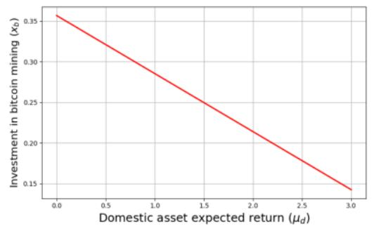

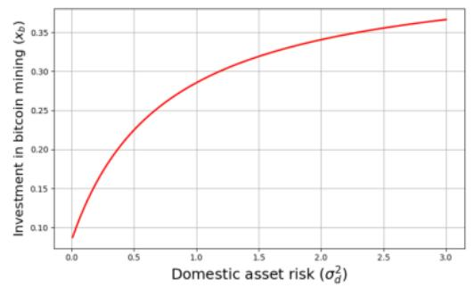

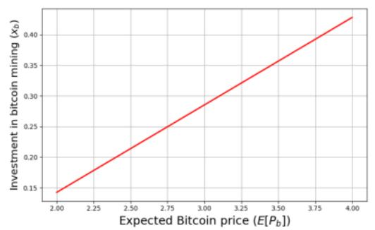

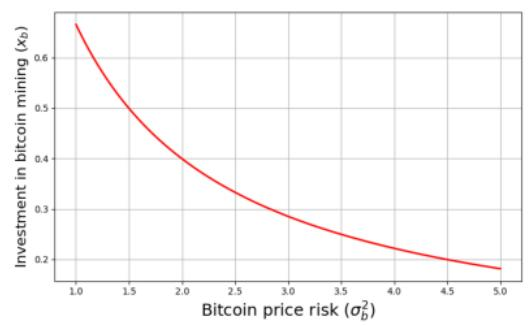

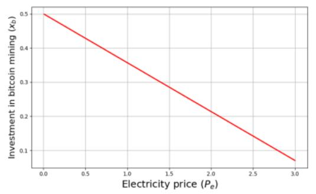

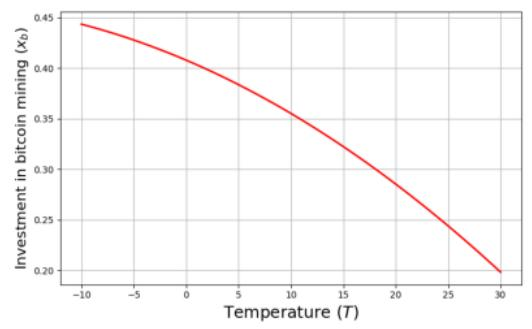

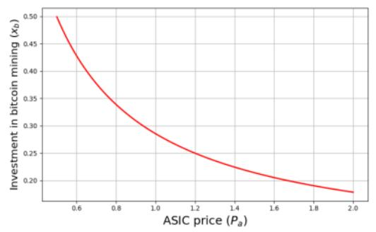

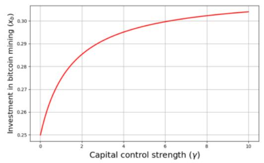  
Note: These figures show the comparative statistics from the theoretical model. In all graphs only one parameter varies, while keeping the others constant at $\mu_{f}=0,\mu_{d}=1,\sigma_{d}^{2}=1,E(P_{b})=3,\sigma_{b}^{2}=3,P_{e}=1.5,T=20,P_{a}=1,\gamma=2,\rho=2,e(T)=0.43+0.0206T+0.0004T^{2}$ .

where $T$ is the final month in the sample (August 2023).

3. Select the surge start month $\tau^{*}$ that maximizes $E_{\tau}$ . We set $\epsilon_{\tau^{*},t} = 0$ for all $t < \tau^{*}$ , and treat all subsequent excess imports as part of the country's surge episode.

This approach produces a time series of excess imports that captures the intensity and persistence of hardware inflows beyond historical norms. Importantly, the procedure adjusts for baseline differences in import behavior. For instance, advanced economies may consistently import crypto-capable IT equipment due to unrelated demand. Similarly, the normalization by RMSE ensures that only significant shifts relative to past patterns are contributing to surges, thus improving the comparability of mining activity across countries.

Our choice to begin the search for surges in January 2020, using the pre-pandemic period (2018–2019) as baseline, is motivated by both data availability and economic reasoning. The global crypto boom during the COVID-19 pandemic, combined with China's regulatory crackdown on mining, marked a structural break and led to significant reshuffling in mining activity. $^{17}$ Furthermore, given the relatively short sample, we do not attempt to explicitly identify a surge end date. All deviations from trend after the surge onset are included in the excess import calculation.

Figure 6 provides an overview of the results produced by our surge algorithm. The left panel shows that most identified surges began in 2020, although around 30% of sample countries entered a surge episode in subsequent years. Consistent with global trends in mining hardware imports (Figure 2), median excess imports across countries rose initially, peaked in 2021, and gradually declined starting in the second half of 2022. The right panel displays the distribution of excess imports, indicating that our normalized measure overwhelmingly falls within the 0 to 4 range.

Figure 6: Surges and excess imports of mining hardware  
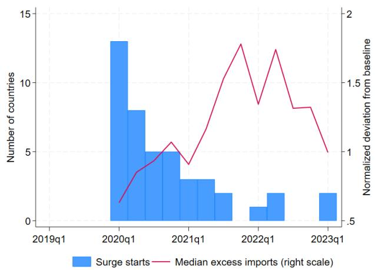

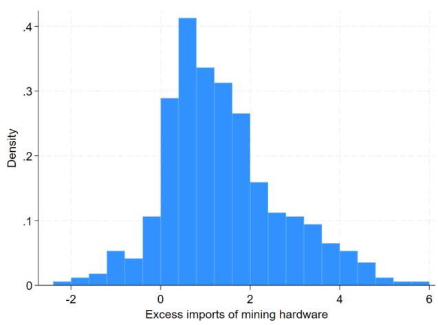  
Note: The left panel shows the number of countries with surge start dates in a given quarter (left scale) and the cross-country median of the normalized excess imports measure (right scale). Only countries experiencing a surge episode are included in the median calculation. The right panel shows the distribution of our excess imports measure, pooled across countries and quarters, as described in 4.1.

## 4.2 Specification and Additional Data

Our empirical specification is guided by the optimal ASIC investment in equation (3) and the subsequent discussion on the determinants of asset returns and risks. To connect the model to our empirical surge measure, we interpret excess mining hardware imports relative to trend, $\epsilon_{j,t}$ , as an increase in country j's ASIC-share, $x_{b}$ . This motivates the following regression:

$$
\begin{array}{r l} & {\epsilon_ {j, t} = a _ {0} + a _ {1} \ln P _ {b, t} + a _ {2} \sigma_ {b, t} + a _ {3} \ln P _ {a, t}} \\ & {\qquad + a _ {4} \ln T _ {j} + a _ {5} \ln P _ {e, j, t} + a _ {6} \mu_ {d, j, t} + a _ {7} \sigma_ {d, j, t} + a _ {8} \gamma_ {j}.} \end{array}\tag{4}
$$

The interpretation of coefficients is as follows: $a_1$ , $a_2$ and $a_3$ capture the role of global factors affecting mining profitability: Bitcoin price, Bitcoin return volatility, and the effective price of mining hardware. $^{18}$ Coefficients $a_4$ and $a_5$ represent operating cost determinants, average temperature and electricity prices, while $a_6$ and $a_7$ reflect the domestic asset's return and riskiness. Finally, $a_8$ captures capital account frictions. Based on the model, we expect $a_1$ , $a_7$ , and $a_8$ to be positive, while the remaining coefficients should be negative.

We estimate our regressions at the quarterly frequency, averaging relevant variables within each quarter. The daily Bitcoin price $(P_{b,t})$ was obtained from Haver Analytics, and $\sigma_{b,t}$ was computed as the standard deviation of daily returns within each quarter. The construction of the effective ASIC price index $(P_{a,t})$ is described below. We take average temperature $(T_{j})$ from Redivis $^{19}$ and electricity prices from Global Petrol Prices. $^{20}$

The expected excess return on domestic assets in foreign currency terms $(\mu_{d,j,t})$ is measured by the Uncovered Interest Parity (UIP) wedge based on survey expectations:

$$
\mu_ {d, j, t} = r _ {j, t} - (s _ {j, t + 1} ^ {e} - s _ {j, t}) - r _ {t} ^ {*}\tag{5}
$$

where $r_{j,t}$ and $r_{t}^{*}$ are domestic and US interest rates, and $s_{j,t}$ and $s_{j,t+1}^{e}$ are the spot and expected log exchange rate (local currency per USD). Nominal exchange rates are retrieved from the International Financial Statistics (IFS) database. We use 12-month ahead Consensus Economics survey forecasts to proxy for exchange rate expectations. Interest rates are deposit interest rates retrieved from IFS when available and Haver otherwise. The riskiness of domestic asset in foreign currency ( $\sigma_{d,j}^{2}$ ) is measured using the 12-month backward-looking volatility of the UIP wedge. The strength of capital outflow constraints ( $\gamma_{j}$ ) is measured by the capital control indices of Fernández et al. (2016), using the last-available 2019 value for each country. The appendix lists the 45 countries included in the estimation, which are determined by data availability across the variables required for the analysis.

A caveat is that the quarterly panel is short and spans a period dominated by common global shocks. Our dependent variable is not the level of mining-hardware imports, but a country-specific deviation from its pre-surge trend, normalized by the RMSE of the pre-surge fit. This transformation reduces the scope for the results to be driven mechanically by shared trends in levels, although it does not fully remove broader concerns related to persistence and common shocks. Accordingly, we interpret the regression as reducedform evidence on the determinants of abnormal mining-hardware inflows during the 2020–2023 boom-bust episode, rather than as a long-run equilibrium relationship.

Effective ASIC Price Index In our stylized model, we normalize units such that one ASIC produces one bitcoin using a fixed amount of electricity (depending on temperature). In reality, ASICs differ in efficiency (measured in Joules per Terahash, J/TH), and network difficulty varies over time, affecting the number of hashes required to mine a block. To construct a model-consistent effective ASIC price index, we:

1. Compile public data on ASIC prices by energy efficiency tiers.

2. Weight these prices by efficiency-adjusted performance, penalizing inefficient hardware.

3. Scale the index by the evolving difficulty of the Bitcoin network.

This results in a time series of ASIC prices that reflects the true hardware cost of generating new bitcoins. Full details for constructing the effective ASIC price index are provided in Appendix A.3.

We now turn to the regression results, aiming to test the hypothesized impact of the variables discussed above.

## 4.3 Results

Table 2 reports the regression results for equation (4), examining the determinants of quarterly excess imports of mining hardware. One potential concern is reverse causality: large mining hardware flows could, in theory, affect Bitcoin or ASIC prices. However, this endogeneity issue is likely negligible at the country-quarter level given the scale of the global crypto market. To address autocorrelation in the constructed mining hardware imports series, we cluster standard errors by country and conduct both asymptotic and bootstrap inference for the baseline regression.

Columns 1–3 use the narrowest set of HS codes specifically associated with ASICs, while Columns 4–5 gradually expand the product list to include GPU-related items. The Appendix details how we map HS codes to GPUs, which are predominantly produced and exported by Taiwan Province of China. Column 3 replaces the model-suggested capital control index on outflows (kao) with the broader index of Fernández et al. (2016), which includes both inflows and outflows (ka).

Most estimated coefficients in columns 1 to 3 align with the model's predictions and are generally statistically significant, with a few exceptions discussed below.

\- Global Drivers The results show strong support for the theoretical predictions, with statistically significant coefficients in the baseline (narrow product group) specification. An increase in the Bitcoin price is associated with higher mining hardware imports, relative to the pre-surge trend. As expected, greater volatility in Bitcoin returns significantly reduces mining investment. Similarly, an increase in the price of mining hardware lowers excess imports.

The relative magnitudes of the point estimates suggest that proportional increases in Bitcoin and ASIC prices still result in higher mining hardware imports. Notably, this scenario closely mirrors developments during 2020–2021. This finding is also consistent with our stylized model, where a rise in the Bitcoin price increases miners' expected profit more than proportionally.

\- Domestic Fundamentals and Policies Local operating conditions also matter. The significant negative coefficients on average temperature and energy prices indicate that higher costs of converting electricity into crypto assets reduce mining hardware imports.

By contrast, we find limited statistical evidence for the role of domestic returns and their volatility. The coefficient on expected domestic return has the expected sign but is statistically insignificant. The volatility term has a counterintuitive sign, although it is only marginally significant under bootstrapped standard errors at the 10% level. The coefficient on capital controls is positive, as predicted, but statistically insignificant. Replacing the capital control measure with the broader index that includes both inflows and outflows yields very similar results (column 3). The imprecise estimates for capital controls likely reflect a measurement issue—specifically, the lack of time variation in this variable.

Characterizing the magnitude of the estimated coefficients directly is challenging because our normalized outcome variable (excess imports) and some regressors (e.g., capital control indices) do not have intuitive units. To interpret the magnitude of the estimated effects, we use illustrative changes in explanatory variables and compute their partial impact on excess imports. In particular, we consider a scenario where global crypto market conditions (prices and volatility) move from the 2020 average to the 2021 average. Similarly, we compare countries at the 10th and 90th percentiles of the cross-sectional distribution to illustrate the impact of country-specific factors.

Panel A of Table 3 shows that from 2020 to 2021, both the Bitcoin price and ASIC prices roughly quadrupled while the volatility of returns slightly decreased. These proportional price increases and lower perceived risk are estimated to have a positive net effect on mining hardware imports. Specifically, the change in global market conditions mirroring the averages of 2020 and 2021 would imply a 0.75 increase in our excess imports measure. Interestingly, this increase closely matches the change in the median country's excess imports over this period.

Panel B of Table 3 presents a similar exercise focused on country-specific fundamentals. To ensure intuitive comparisons, we reverse the direction of some percentile comparisons (e.g., from 90th to 10th) so that the implied effects are positive. For instance, we consider lowering temperature (from p90 to p10) as favorable for mining. Due to the incorrectly signed and statistically insignificant coefficient on domestic return volatility, we omit this factor. The decomposition shows that temperature and electricity prices have the largest impacts in the cross-section of countries. A hypothetical country with the most favorable mining conditions—cool climate, cheap electricity, low domestic returns, stringent capital controls—would experience excess imports that are 1.6 units higher, on average, than a country with the least favorable mix.

Robustness As discussed, HS 8-digit customs data are not sufficiently granular to precisely isolate crypto mining hardware, and reporting conventions may vary across countries. We adopt two strategies to mitigate this concern. First, our empirical design focuses on surges in identified HS groups rather than levels, reducing the likelihood that results are driven by unrelated demand. Second, we re-estimate the regressions using broader sets of HS codes, including those related to GPUs that may be partially used in mining.

The baseline results remain robust when expanding the product set to include broader HS categories. As shown in columns 4 and 5 of Table 2, global factors retain their expected signs and statistical significance, though effect sizes are somewhat lower. Domestic variables generally retain their signs but lose significance. This pattern is consistent with our expectations: ASIC imports are more directly linked to mining activity,

Table 2: Determinants of Crypto Mining Hardware Import Surges

<table><tr><td>Std. errors Product group</td><td>(1) Clustered Narrow</td><td>(2) Bootstrap Narrow</td><td>(3) Clustered Narrow</td><td>(4) Clustered Medium</td><td>(5) Clustered Broad</td></tr><tr><td> $\ln(P_{b,t})$ </td><td>0.837***(0.148)</td><td>0.837***(0.151)</td><td>0.834***(0.147)</td><td>0.663***(0.115)</td><td>0.647***(0.105)</td></tr><tr><td> $σ_{b,t}$ </td><td>-0.977***(0.264)</td><td>-0.977***(0.272)</td><td>-0.980***(0.263)</td><td>-0.787***(0.182)</td><td>-0.804***(0.180)</td></tr><tr><td> $\ln(P_{a,t})$ </td><td>-0.467***(0.148)</td><td>-0.467***(0.144)</td><td>-0.465***(0.148)</td><td>-0.281**(0.120)</td><td>-0.249**(0.105)</td></tr><tr><td> $\ln(T_j)$ </td><td>-1.846***(0.573)</td><td>-1.846***(0.588)</td><td>-1.869***(0.576)</td><td>-0.547(0.634)</td><td>-0.787*(0.438)</td></tr><tr><td> $\ln(P_{e,j,t})$ </td><td>-3.393*(1.878)</td><td>-3.393*(2.025)</td><td>-3.347*(1.881)</td><td>-3.108(2.119)</td><td>-2.803(2.046)</td></tr><tr><td> $μ_{d,j,t}$ </td><td>-0.021(0.035)</td><td>-0.021(0.033)</td><td>-0.021(0.034)</td><td>-0.040(0.032)</td><td>-0.031(0.031)</td></tr><tr><td> $σ_{d,j,t}$ </td><td>-0.211(0.137)</td><td>-0.211*(0.121)</td><td>-0.218(0.139)</td><td>0.041(0.090)</td><td>0.020(0.086)</td></tr><tr><td> $F_{j}^{kao}$ </td><td>0.264(0.304)</td><td>0.264(0.344)</td><td></td><td>0.093(0.371)</td><td>-0.032(0.354)</td></tr><tr><td> $F_{j}^{ka}$ </td><td></td><td></td><td>0.333(0.371)</td><td></td><td></td></tr><tr><td>Constant</td><td>10.892**(5.336)</td><td>10.892**(5.156)</td><td>10.931**(5.317)</td><td>6.693(4.650)</td><td>6.635*(3.886)</td></tr><tr><td>Observations</td><td>725</td><td>725</td><td>725</td><td>725</td><td>725</td></tr><tr><td>R-squared</td><td>0.265</td><td>0.265</td><td>0.266</td><td>0.209</td><td>0.230</td></tr></table>

Clustered/Bootstrapped standard errors in parentheses
\*\*\* p<0.01, \*\* p<0.05, \* p<0.1  
Note: The table presents regression results from estimating equation (4) using different HS 8-digit product codes for mining-related imports. The “Narrow” group includes ASIC-related HS codes, “Medium” adds ASIC accessories and parts (see Section 2.2 and Table 1); “Broad” also includes GPU-related codes (see Appendix A.4). Sample: 2019Q1-2023Q1.

Table 3: Illustrative Impact of Global and Local Factors on Mining Hardware Import Surges

<table><tr><td colspan="4">A. Global factors (time series):2020 vs 2021 average values</td></tr><tr><td></td><td>2020</td><td>2021</td><td>Implied effect</td></tr><tr><td>Bitcoin price (USD/BTC)</td><td>10,931</td><td>46,959</td><td>1.22</td></tr><tr><td>Bitcoin return volatility</td><td>4.04</td><td>3.87</td><td>0.17</td></tr><tr><td>ASIC price index (2020 avg=100)</td><td>100</td><td>394.69</td><td>-0.64</td></tr><tr><td>Total effect</td><td></td><td></td><td>0.75</td></tr><tr><td>Memo:</td><td></td><td></td><td></td></tr><tr><td>Median excess imports</td><td>0.40</td><td>1.16</td><td>0.76</td></tr></table>

B. Country-specific factors (cross-section):

10th vs 90th percentile values

<table><tr><td></td><td>p10</td><td>p90</td><td>Implied effect</td></tr><tr><td>Temperature (°C)</td><td>9.6</td><td>26.6</td><td>0.84</td></tr><tr><td>Electricity price (USD/kWh)</td><td>0.07</td><td>0.21</td><td>0.4</td></tr><tr><td>Domestic excess return in FX (%)</td><td>-0.29</td><td>4.73</td><td>0.11</td></tr><tr><td>Capital controls on outflows</td><td>0</td><td>0.95</td><td>0.25</td></tr><tr><td>Total effect</td><td></td><td></td><td>1.60</td></tr><tr><td>Memo:</td><td></td><td></td><td></td></tr><tr><td>Average excess imports</td><td>0.03</td><td>1.95</td><td>1.92</td></tr></table>

Note: The table presents illustrative decompositions of excess imports using estimates from Table 2, column (1). Panel A shows partial effects from shifting Bitcoin price, volatility, and ASIC price from 2020 to 2021 average levels. Panel B shows effects from shifting country-specific variables between the 10th and 90th percentiles of the cross-sectional distribution of country-level averages (each variable is first averaged over 2019Q1–2023Q1). The direction of comparison is chosen so that the implied effect is positive. The total effect compares two hypothetical countries with the most and least favorable mix of 10th and 90th percentile values for mining.

while broader IT hardware categories likely attenuate the mining signal due to alternative uses of multi-purpose hardware like GPUs.

Results are also robust to allowing for potential re-exports within customs unions. Our baseline approach assumes that recorded export destinations correspond to the countries where mining hardware is ultimately operated. $^{21}$ This assumption is potentially more restrictive for members of customs unions, where goods may enter through one member state and then circulate internally with relatively low barriers. To assess the importance of this issue, we re-estimate the baseline regressions after aggregating Mercosur countries and European Union countries into synthetic customs-union units. As shown in Table 4 in Appendix A.5, the coefficient estimates and significance are very similar to the baseline results.

Overall, the empirical analysis suggests that global crypto dynamics strongly shape mining surges across countries, while local fundamentals and policies modulate their intensity and location.

## 5 Conclusion

This paper develops a novel approach to measuring crypto mining activity based on publicly available customs data from the dominant exporters of crypto mining hardware. Our methodology provides a transparent and globally consistent alternative to proprietary IP-based tracking.

We construct country-level indices of mining hardware imports and use them to identify surges—sharp increases in hardware inflows that proxy for large-scale investment in mining capacity. Drawing on a stylized portfolio model, we empirically examine the economic and policy determinants of these surges.

Our findings reveal that both global and domestic factors shape mining activity. Global drivers—particularly crypto assets prices and ASIC hardware costs—strongly influence the timing and magnitude of mining investment. Across countries, cooler temperatures and cheaper electricity help explain where mining activity is more pronounced. We also find suggestive evidence that mining may be more attractive where domestic investment opportunities are weaker and capital flows are more restricted.

These results highlight how domestic policy settings and macroeconomic fundamentals interact with global crypto market dynamics. For example, the theoretical framework and point estimates are consistent with the idea that crypto mining can serve as a form of capital flight in countries with stringent capital controls and weak domestic investment opportunities. Additionally, artificially low electricity prices—often due to untargeted subsidies—can encourage excessive mining activity, exacerbating financial distortions and environmental costs.

In sum, this paper contributes to the growing literature on crypto assets by providing a transparent empirical framework for tracking mining activity and documenting how mining surges co-move with global and domestic economic forces. Future research could build on this framework to examine regulatory changes, mining bans, and the link between mining intensity and illicit financial flows.

## References

Agénor, P.-R. (1998). The surge in capital flows: analysis of ‘pull’ and ‘push’ factors. International Journal of Finance & Economics, 3(1):39–57.

Alnasaa, M., Gueorguiev, N., Honda, J., Imamoglu, E., Mauro, P., Primus, K., and Rozhkov, D. (2022). Crypto-assets, corruption, and capital controls: Cross-country correlations. Economics Letters, 215:110492.

Arslanian, H. (2022). Bitcoin and crypto mining. In The Book of Crypto: The Complete Guide to Understanding Bitcoin, Cryptocurrencies and Digital Assets, pages 259–276. Springer.

Bedford Taylor, M. (2017). The evolution of bitcoin hardware. Computer, 50(9):58–66.

Cambridge Centre for Alternative Finance (2025). Bitcoin mining map. https://cbeci.org/mining\_map. Accessed 23 May 2025.

Cardozo, P., Fernández, A., Jiang, J., and Rojas, F. D. (2024). On cross-border crypto flows: Measurement drivers and policy implications. IMF Working Papers 2024/261, International Monetary Fund.

Cerutti, E. M., Chen, J., and Hengge, M. (2024). A Primer on Bitcoin Cross-Border Flows: Measurement and Drivers. International Monetary Fund.

Chen, J. and Sarkar, A. (2022). Slowed-down capital: Using bitcoin to avoid capital controls. Mimeo.

Fernández, A., Klein, M. W., Rebucci, A., Schindler, M., and Uribe Arbelaez, M. (2016). Capital control measures: A new dataset. IMF Economic Review, 64(3):548–574.

Hashimoto, Y. and Noda, S. (2019). Pricing of mining asic and its implication to the high volatility of cryptocurrency prices. Available at SSRN 3368286.

Hu, M., Lee, A. D., and Putniņš, T. J. (2021). Evading capital controls via cryptocurrencies: evidence from the blockchain. Available at SSRN 3956933.

Makarov, I. and Schoar, A. (2021). Blockchain analysis of the bitcoin market. NBER Working Paper 29396, National Bureau of Economic Research.

Mueller, P. (2020). Cryptocurrency mining: asymmetric response to price movement. Available at SSRN 3733026.

Reuter, M. (2025). Decrypting Crypto. IMF Working Papers, 2025(141):1.

Sachan, R. K., Agarwal, R., and Shukla, S. K. (2022). DNS based in-browser cryptojacking detection. arXiv preprint.

Sun, W., Jin, H., Jin, F., Kong, L., Peng, Y., and Dai, Z. (2022). Spatial analysis of global bitcoin mining. Scientific Reports, 12(1):10694.

Tiwari, P. R. and Green, M. (2022). Algorithm-substitution attacks on cryptographic puzzles. Cryptology ePrint Archive.

Wilson, C. (2024). Beyond the ledger: A cross-platform analysis of cryptocurrency dynamics. Master's thesis, University of Colorado at Boulder.

Yaish, A. and Zohar, A. (2023). Correct cryptocurrency asic pricing: Are miners overpaying? In 5th Conference on Advances in Financial Technologies (AFT 2023). Schloss Dagstuhl-Leibniz-Zentrum für Informatik.

Yu, G. Y. and Zhang, J. (2022). Flight to bitcoin. Available at SSRN 3278469.

## Appendix

## A.1 Countries in the Sample

The empirical analysis in Section 4 draws on a panel of 45 countries, listed below: Argentina, Austria, Bangladesh, Belgium, Brazil, Canada, Colombia, Costa Rica, Dominican Republic, Ecuador, Egypt, El Salvador, Finland, France, Germany, Greece, India, Indonesia, Ireland, Israel, Italy, Japan, Latvia, Malaysia, Malta, Mexico, Nicaragua, Nigeria, Pakistan, Panama, Paraguay, Peru, Philippines, Portugal, Saudi Arabia, Singapore, Slovenia, South Africa, Spain, Thailand, Turkey, United Kingdom, United States of America, Uruguay, Vietnam.

## A.2 Mining hardware exports and post-pandemic recovery

One possible interpretation of the 2021–2022 surge in mining hardware imports is that it reflects the normalization of global supply chains following COVID-19 disruptions. To evaluate this possibility, Appendix Figure 7 compares the dynamics of ASIC-related exports with aggregate Chinese goods exports alongside the Bitcoin price.

Two features of the data argue against a broad supply-chain catch-up explanation. First, while aggregate exports rise steadily as global trade recovers from the pandemic beginning in mid-2020, the increase in ASIC exports occurs later and is substantially more pronounced. Second, ASIC exports display a clear boom-bust cycle: they rise sharply during the crypto assets price surge of 2020–2021 and decline markedly in 2022–2023 as crypto assets prices fall. In contrast, aggregate exports remain elevated following the pandemic recovery. Taken together, these patterns are difficult to reconcile with a broad post-pandemic rebound in trade and are instead consistent with crypto-specific investment dynamics influencing mining hardware demand.

## A.3 Constructing a Model-Consistent ASIC Price Index

ASIC models operate with different levels of energy efficiency, expressed in Joule per Terahash (J/TH). Furthermore, the expected number of hashes to produce a new block and receive the block reward varies over time as miners' total computational power changes and the network difficulty adjusts to maintain a stable block production time. To derive a model-consistent and comparable time series of ASIC prices, we account for these factors in two steps. $^{22}$

Figure 7: Mining hardware exports and aggregate Chinese exports during the post-pandemic recovery  
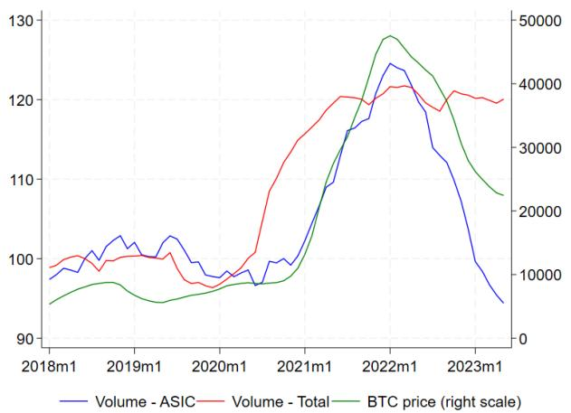

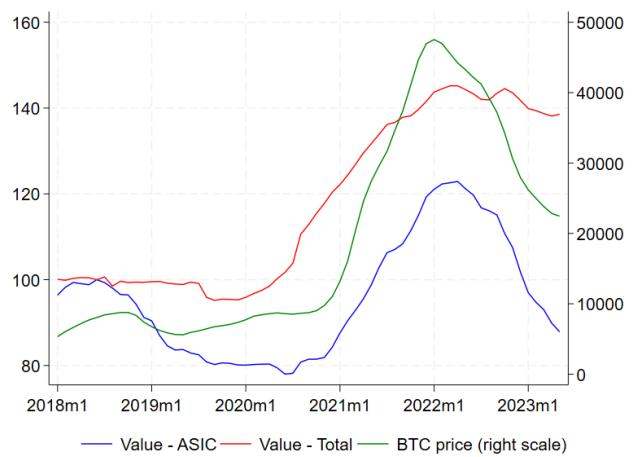  
Note: The figure compares mining hardware exports (blue) with aggregate Chinese exports (red) and the Bitcoin price (green, right axis). While aggregate exports rise gradually following the pandemic recovery, mining hardware exports exhibit a pronounced boom-bust cycle that broadly mirrors movements in Bitcoin prices. All export series are normalized to 2018=100. Export volumes (left panel) and export values (right panel) are smoothed using a 12-month centered moving average, while the Bitcoin price is smoothed using a trailing 12-month moving average.

First, we think of energy efficiency as a quality metric of ASICs and create a quality-adjusted price index. This index offers a more accurate measure of hardware input costs by controlling for improvements in chip performance—analogous to hedonic adjustments in capital goods price indices. Observe that an ASIC with price P and efficiency E (expressed in J/TH) delivers only 1/E terahash of computational power from a one-joule energy input, yielding an effective cost of $P/(1/E) = P * E$ per quality unit. Intuitively, this transformation penalizes less efficient hardware (high E) and rewards more efficient hardware (low E) when calculating the quality-adjusted price. Hashrate Index publishes weekly updates of average ASIC prices grouped into five efficiency tiers. We use the midpoints of these efficiency tiers, and calculate the unweighted mean of the quality-adjusted prices to create an overall price index. $^{23}$

Second, we rescale the quality-adjusted ASIC price index to account for the difficulty of mining one new bitcoin. This scaling is necessary, because when miners purchase an ASIC, they ultimately care about the number of bitcoins they will receive and not about the number of hashes they can churn out. The Bitcoin network difficulty, which we obtain from Blockchain.com, represents how much more difficult it is to mine a block compared to the initial difficulty level when Bitcoin was first launched. Our final effective ASIC price index is the product of the network difficulty and the quality-adjusted index derived in the previous step.

## A.4 Tracing GPUs in Trade Statistics

While the main analysis focuses on Bitcoin and ASIC imports, GPUs have also been used in crypto assets mining, notably for Ethereum. With about 7 percent share of total crypto assets market capitalization as of May 2025, Ethereum is the second most important crypto assets after Bitcoin. Until its protocol change in September 2022, Ethereum employed a proof-of-work (PoW) consensus mechanism designed specifically to resist ASIC mining, encouraging the use of general-purpose graphics processing units (GPUs) instead (Mueller, 2020; Wilson, 2024). $^{24}$

Identifying the origin countries for GPU exports is more difficult than for ASICs. To our knowledge, no comprehensive public data exist on the geographic distribution of GPU manufacturing and exports. However, industry estimates for the broader semiconductor sector suggest that most downstream assembly and testing are concentrated in East Asia. According to a 2024 Deloitte report, approximately three-quarters of global revenue in this segment was generated in Taiwan Province of China, with the remainder attributable to the Chinese mainland. $^{25}$

The multi-purpose nature of GPUs further complicates efforts to link them specifically to crypto mining. Originally designed for graphics-intensive tasks such as gaming and video editing, GPUs are now widely used in machine learning, AI, and scientific computing. Nevertheless, during Ethereum's PoW era, they served as a critical input for mining activity.

To capture this channel in our robustness checks (see Table 2), we identified relevant HS 8-digit codes for GPU-related products. The sample period largely precedes the surge in AI demand (e.g., ChatGPT was released in November 2022), which helps reduce concerns that import spikes were driven by non-mining applications.

For the relevant period, we obtained GPU export data as follows:

\- From Taiwan Province of China (customs agency $^{26}$ ): exports under HS code 8471.80.00. $^{27}$

\- From the Chinese mainland (customs agency): exports under HS code 8471.80.00. $^{28}$

\- From Hong Kong SAR (UN COMTRADE): re-exports of GPU-related equipment using HS code 8471.80.90, based on a similar mapping as for Bitcoin (see Table 1).

These additional product definitions allow us to test the robustness of our results to broader hardware classifications that may have supported mining during the sample period.

## A.5 Robustness to potential re-exports within customs unions

Because recorded export destinations may be a weaker proxy for the final country of use within customs unions, we assess the sensitivity of our baseline results by aggregating customs-union members into synthetic units. Table 4 reports the results for Mercosur, the European Union, and both jointly. The estimated coefficients remain close to the baseline specification in both sign and significance.

## A.6 Additional Exploration of the Trade Data

Figure 8 shows monthly export values from the Chinese mainland, Hong Kong SAR, and Taiwan Province of China, aggregating across all HS codes that we identified as related to crypto mining hardware (ASICs and GPUs). The next few charts break down these aggregates by hardware type using the relevant HS codes.

Figure 8: Total export value by origin, USD bn  
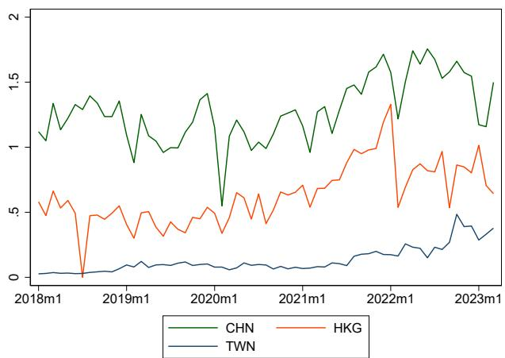  
Note: The figure shows monthly export values, in USD billion, of HS codes related to crypto mining hardware from the Chinese mainland, Hong Kong SAR, and Taiwan Province of China. It excludes trade between these economies.

## A.6.1 ASICs

Figure 9 shows the annual value of ASIC-related exports by origin and HS codes. In all cases, trade among exporters is excluded. The surge in 2022 is visible even in value terms even though ASIC prices were falling in this period (see Figures 2 and 10).

Figure 10 shows the cross-country median of unit values for the different HS codes we identified as ASIC-related. The ASIC product with HS code ending in 5000 exported from Hong Kong SAR has a somewhat higher unit value in general, but all four products' unit values are nonetheless of the same order of magnitude.

## A.6.2 GPUs

While GPUs are not the focus of our analysis, they were relevant for Ethereum mining prior to 2022 and we included them in robustness checks. Figure 11 shows that the GPU-related product groups constituted between 20 and 50 percent of the value of all crypto mining-related exports (ASICs and GPUs), and the share was increasing in the sample period. In value terms, most GPU-related HS codes are exported by

Table 4: Determinants of Crypto Mining Hardware Import Surges - Aggregating Customs Unions

<table><tr><td>Std. errorsProduct Group</td><td>(1)ClusteredNarrow</td><td>(2)ClusteredNarrow</td><td>(3)ClusteredNarrow</td></tr><tr><td>Customs Union</td><td>Mercosur</td><td>EU</td><td>Mercosur and EU</td></tr><tr><td> $\ln(P_{b,t})$ </td><td>0.804***(0.152)</td><td>0.681***(0.169)</td><td>0.697***(0.190)</td></tr><tr><td> $σ_{b,t}$ </td><td>-0.965***(0.281)</td><td>-0.787***(0.283)</td><td>-0.787**(0.302)</td></tr><tr><td> $\ln(P_{a,t})$ </td><td>-0.447***(0.150)</td><td>-0.299*(0.176)</td><td>-0.348*(0.189)</td></tr><tr><td> $\ln(T_j)$ </td><td>-1.834***(0.592)</td><td>-2.073***(0.709)</td><td>-2.167***(0.742)</td></tr><tr><td> $\ln(P_{e,j,t})$ </td><td>-3.212*(1.821)</td><td>-6.942***(2.175)</td><td>-6.320**(2.498)</td></tr><tr><td> $μ_{d,j,t}$ </td><td>-0.020(0.038)</td><td>-0.022(0.038)</td><td>-0.027(0.041)</td></tr><tr><td> $σ_{d,j,t}$ </td><td>-0.212(0.156)</td><td>-0.220(0.149)</td><td>-0.236(0.169)</td></tr><tr><td> $F_j^{kao}$ </td><td>0.357(0.316)</td><td>0.058(0.345)</td><td>0.128(0.364)</td></tr><tr><td>Constant</td><td>10.692*(5.989)</td><td>11.380*(6.119)</td><td>12.487*(6.767)</td></tr><tr><td>Observations</td><td>699</td><td>562</td><td>511</td></tr><tr><td>R-squared</td><td>0.249</td><td>0.286</td><td>0.272</td></tr></table>

Robust standard errors in parentheses  
\*\*\* p<0.01, \*\* p<0.05, \* p<0.1  
Note: The table presents regression results from estimating equation (4) using the narrow ASIC-related HS 8-digit product group (see Section 2.2 and Table 1). To assess whether re-exports within customs unions affect the baseline results, we aggregate member countries into a single synthetic unit using simple averages of the country-level variables. Mercosur includes Argentina, Brazil, Paraguay, and Uruguay. The European Union (EU) includes Austria, Belgium, France, Germany, Italy, Finland, Greece, Malta, Portugal, Spain, Latvia, and Slovenia. Sample: 2019Q1–2023Q1.

Figure 9: Exports of ASICs by origin and HS code (in USD billion)  
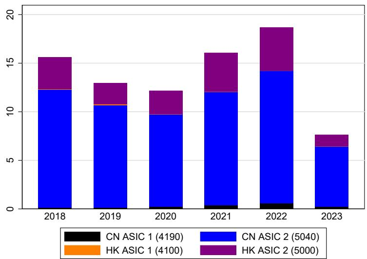  
Note: The figure shows ASIC exports by origin in USD billion. The numbers in parenthesis indicate the last 4 digits of the product lines under HS heading 8471 as used by each country.

Figure 10: ASIC unit values (USD)  
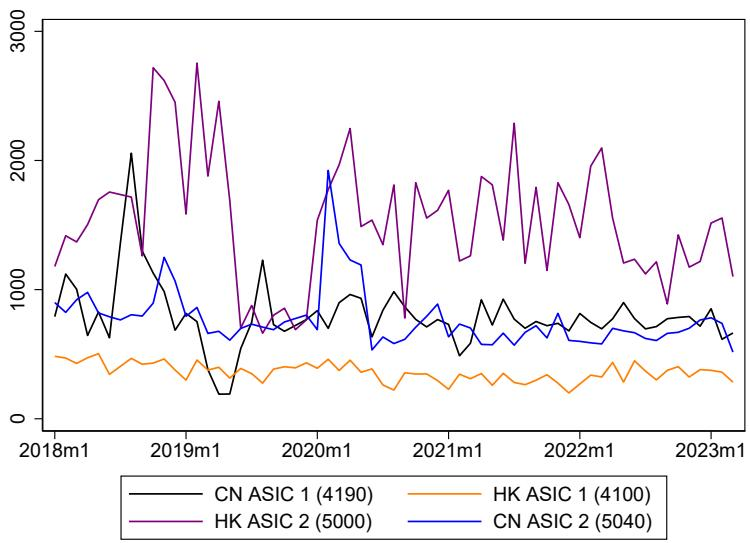  
Note: The figure shows median unit values of the different ASIC codes across importing countries. The numbers in parenthesis indicate the last 4 digits of the product lines under HS heading 8471 as used by each country.

Figure 11: GPUs: Share of total crypto-related hardware exports  
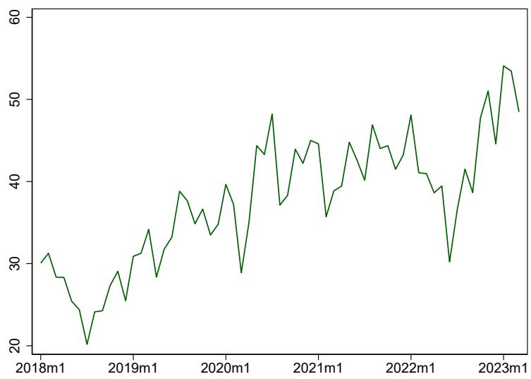  
Note: The figure shows the share of GPUs in total mining hardware exports value from the Chinese mainland, Hong Kong SAR, and Taiwan Province of China.

Hong Kong SAR and the Chinese mainland, with a recent significant rise in exports from Taiwan Province of China (Figure 12).

Figure 13 shows the cross-country median of unit values for the exported goods under the GPU-related product lines. The GPU-related code from the Chinese mainland exhibits a unit value that is significantly below that of the other two economies, suggesting that the code is likely used also for other products besides GPUs.

## A.6.3 Country-Level Dynamics of Mining-Related Imports

Figure 14 shows the size of mining-related imports as a share of the importer country's GDP (horizontal axis) and the share of that destination country in total exports of these HS codes (vertical axis), both on average over 2018-2022. Starting from the latter (share of exports by destination), around one-quarter of exports are destined to the U.S., and virtually all countries in the top 20 are advanced economies or have industrial bases where some of the products imported under these HS codes may be used in other industrial applications. For some countries, the imports represent a significant fraction of their GDP, including some small economies (Marshall Islands, Bhutan), as well as some advanced economies that are international trade hubs (Singapore, the Netherlands).

Figure 15 provides insights on which countries increased their crypto mining imports the most compared to their size. The figure focuses on the top 30 economies which are ranked according to the change in the share of crypto mining imports as percent of GDP, from 2019 to 2021. With a few exceptions, the list is dominated by developing countries. In some cases, imports increase from virtually nothing to large shares of GDP (e.g. Bhutan).

Figure 12: Exports of GPUs by origin and HS code (USD billion)  
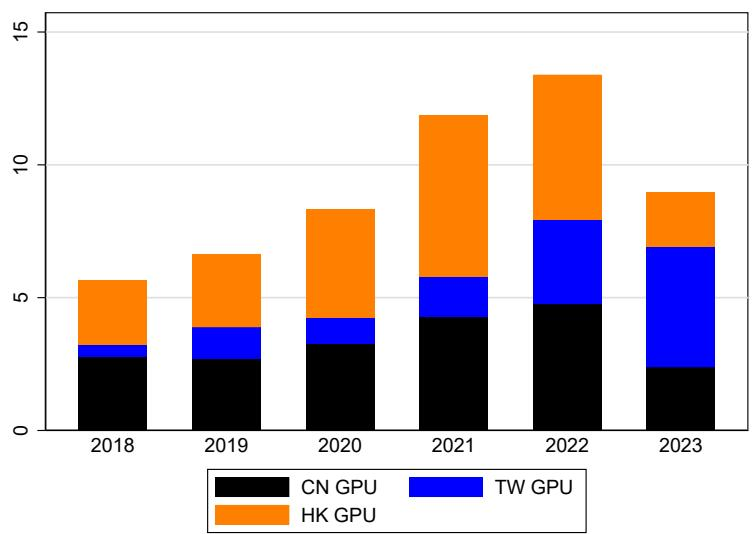  
Note: The figure shows the value of GPU exports by origin.

Figure 13: Unit values of GPU exports by origin (USD)  
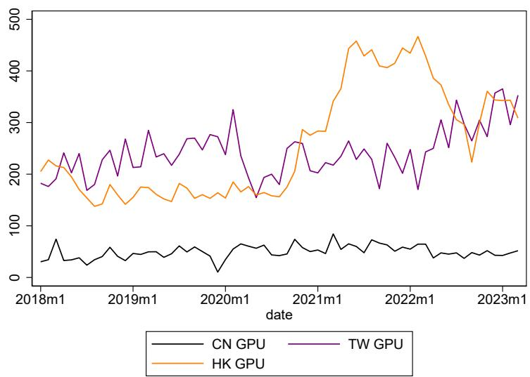  
Note: The figure shows median unit values of the different GPU-related HS codes across importing countries.

Figure 14: Country-level mining hardware imports: Share of importer's GDP and share of total imports  
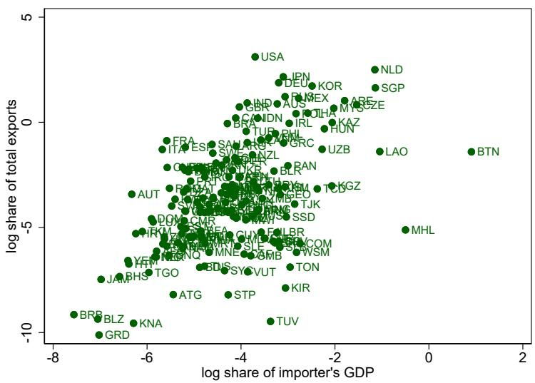  
Note: The figure shows on the horizontal axis the import value of crypto mining-related HS codes as percent of the importer country's GDP (horizontal axis) and as percent of global crypto mining-related imports. The shares are averaged over 2018-2022 and logged.

Figure 15: Change in imports as percent of GDP, 2021 v. 2019  
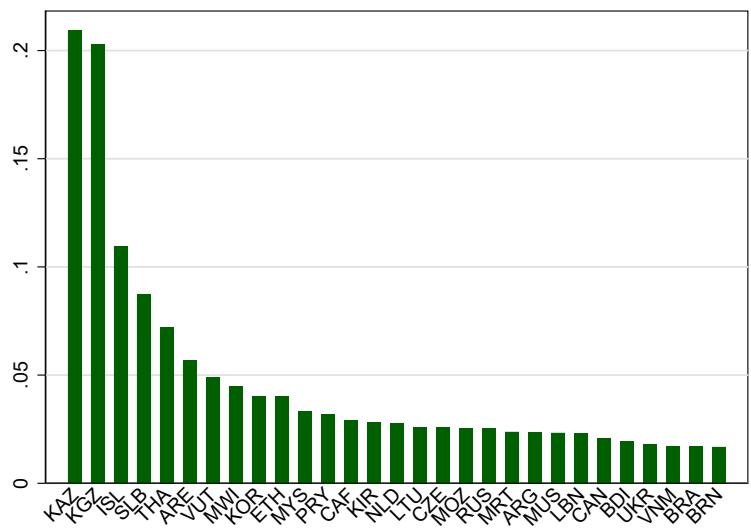  
Note: The figure shows the top 30 countries ranked by the change in mining-related imports as share of GDP from 2019 to 2021 (excluding Bhutan, for which exports to GDP grew by more than one percent).

