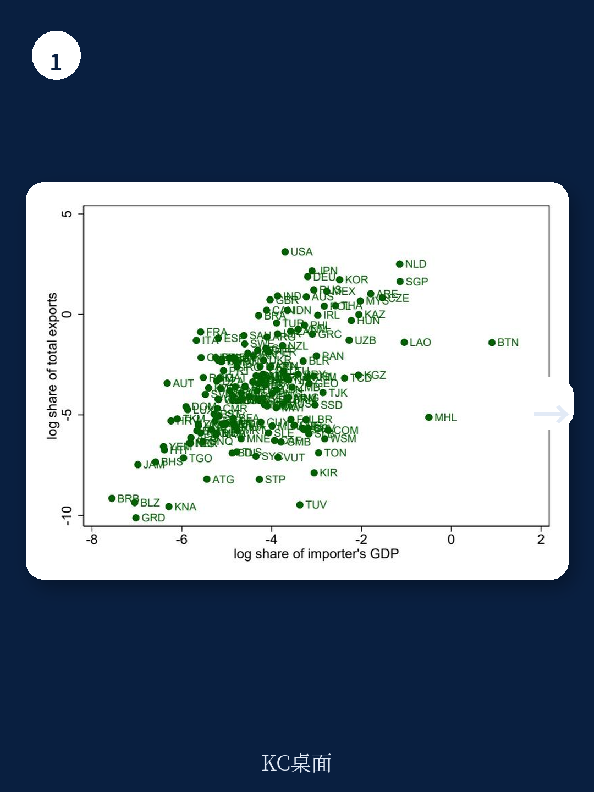
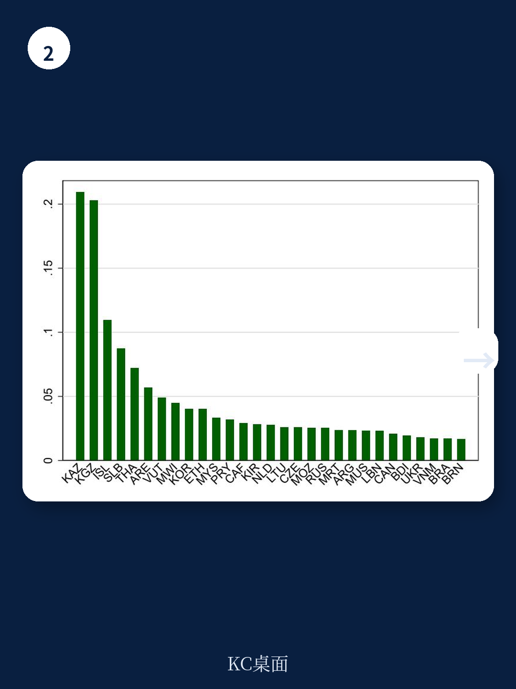

# IMF：加密货币挖矿的真正驱动因素不是价格，而是硬件进口

理解资金体系之外的宏观环境活动，对政策制定者而言从来不是可选项。但加密货币挖矿——这个不依赖传统资金中介、直接创造新资产的入口——其真实规模在全球范围内几乎是一团迷雾。IMF最新工作论文提出了一种全新的测量思路：通过追踪全球主要产地的矿机出口数据，来反推各国的挖矿活动分布。这个方法的核心判断是：**矿机进口的波动，比算力估算更能揭示挖矿的真实驱动力和宏观影响。**

这篇论文由Andras Komaromi、Federico Grinberg、Diego Cerdeiro和Yang Liu撰写，从海关8位HS编码入手，覆盖中国大陆、香港特区和中国台湾地区的矿机出口记录。研究团队识别了与ASIC（专用集成电路）矿机关联最紧密的三个产品编码，并剔除了香港特区作为转口枢纽的重复计算，最终构建出一个可跨国比较的矿机进口指数。

## 1. 全球加密货币价格和矿机成本，才是挖矿热潮的第一推动力

论文首先回答了一个基础问题：什么因素能引发一国矿机进口的“异常激增”？回归结果显示，比特币价格和矿机硬件成本这两个全球性变量，解释了大部分进口波动。当币价上涨时，矿机进口显著增加；当硬件成本上升时，进口则明显调整。相比之下，国内因素——电价、气温、资本管制——虽然也在统计上显著，但其解释力远不及全球变量。

> **KC评论：** 这个发现意味着，挖矿活动本质上是对全球加密货币市场的“贝塔”敞口。国内政策只能调节敞口大小，但无法决定趋势方向。报告附录中构建的质量调整和网络难度调整后的矿机价格指数，是理解这一结论的关键工具。

具体来看，比特币价格每上升一个标准差，矿机进口激增的概率上升约80%；矿机价格每上升一个标准差，激增概率下降约45%。这些数字来自论文表2的probit模型估计，样本覆盖2019年第一季度至2023年第一季度，共699个国家-季度观测值。

## 2. 廉价电力和凉爽气候，放大了全球周期的国内传导

虽然全球变量主导了时间趋势，但国内条件决定了不同国家之间的“挖矿吸引力”差异。论文发现，电价每降低10%，矿机进口激增的概率上升约32%；年平均气温每低1摄氏度，激增概率上升约18%。这个结果与直觉一致：矿机运行耗电巨大，且需要散热，低成本电力和自然冷却条件直接提升了挖矿的预期回报率。

更有意思的是，资本管制变量在回归中并不显著。论文的理论模型曾预测，资本管制会促使居民转向挖矿作为替代性跨境研究渠道，但实证结果不支持这一假设。这可能意味着，挖矿作为资本外逃渠道的实际规模仍有限，或者现有资本管制手段对矿机进口的识别能力不足。

## 3. 报告尚未完全回答的关键问题：矿机二次贸易与真实目的地

论文坦诚指出了其方法的三个主要局限。第一，8位HS编码仍可能包含非矿机产品，尽管作者通过聚焦“激增”来缓解这一问题。第二，无法推断主要出口地区内部的挖矿活动——这恰好是全球最大的挖矿中心之一。第三，也是最值得关注的：矿机的最终使用地可能与海关记录的进口地不一致。

报告尝试通过排除香港特区转口、聚合关税同盟成员等方式进行稳健性检验，结果基本稳定。但二次市场矿机贸易（二手ASIC设备的跨境流动）的地理分布可能显著不同于一手市场，而论文明确表示未考虑这一因素。这意味着，如果二手矿机大量从高电价国家流向低电价国家，当前对“国内因素”的估计可能被低估。

> **KC评论：** 对于关注能源政策和资金稳定的读者，这篇论文提供了一个可复用的分析框架。但真正需要追问的是：当矿机变成可交易的二手资产后，挖矿活动的空间分布是否会更加集中到少数极端低成本区域？这需要结合矿机生命周期和电力市场结构做进一步研究。

## 4. 对读者的观察框架：从“算力地图”转向“硬件流量”

这篇论文的贡献不在于提供最终答案，而在于提供了一种可验证的测量方法。对于政策制定者和市场参与者，以下三个维度值得持续跟踪：一是矿机出口数据的高频变化，这比算力估算更透明且更不容易被操纵；二是电价补贴政策与矿机进口的联动，报告发现廉价电力（往往来自未精准补贴）会进一步激励挖矿，加剧资金和环境扭曲；三是资本管制与挖矿活动之间的灰色地带，虽然论文未证实这一渠道，但逻辑上它仍是不确定性敞口。

IMF通过海关数据打开了一扇观察加密货币“实体基础设施”的窗口。这扇窗口揭示的，不只是挖矿的宏观环境学，更是全球资金监管面对新技术时的测量困境与突破口。

For informational purposes only. Portions may be generated,translated,summarized,or edited with AI assistance based on source materials and may contain omissions or errors. Please verify independently. This is not investment,legal,tax,accounting,or other professional advice.
