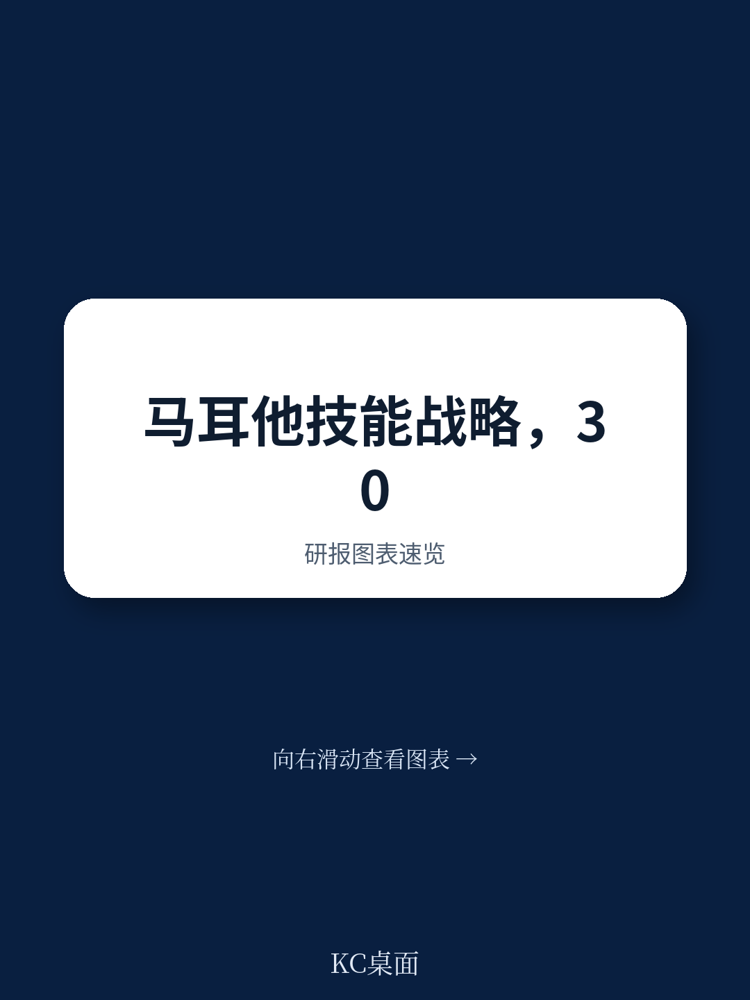
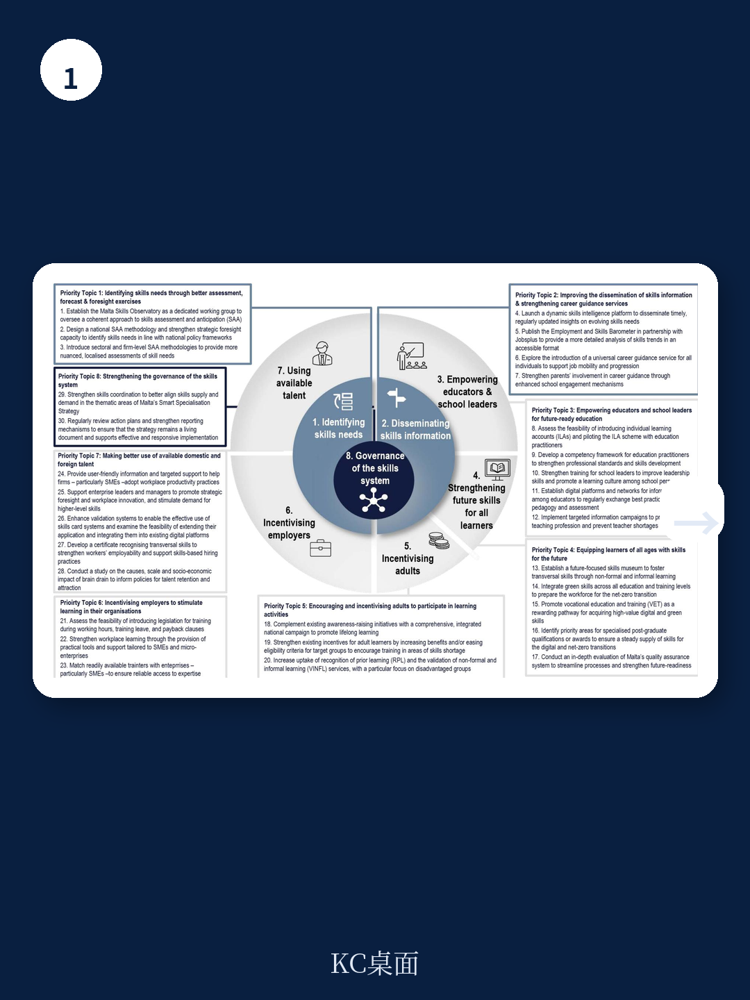
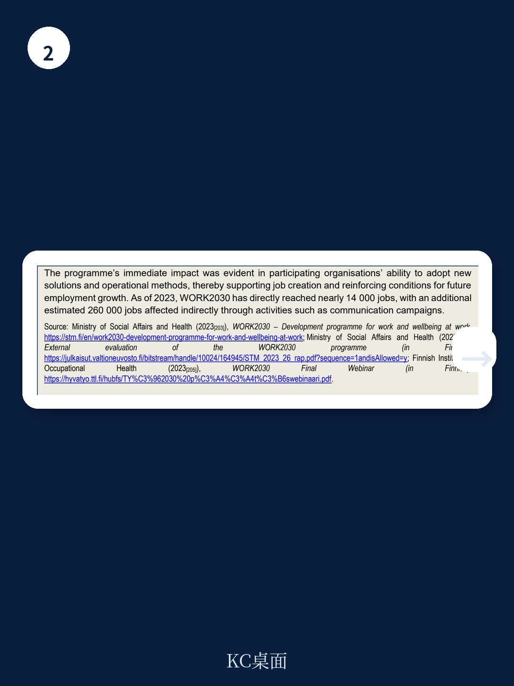

# 经合组织：经合组织给马耳他开方，技能瓶颈不是投入，是协调

一份由经合组织（OECD）为马耳他撰写的技能战略报告，看起来像是一份标准的小国政策建议。但仔细读完30条建议和背后的诊断，你会发现一个反直觉的判断：马耳他技能体系的核心瓶颈，不是资金不足，不是学校太少，不是培训机会不够，而是“谁在负责”这件事从未被真正回答。

报告明确指出，马耳他过去十年在教育获取和成人学习参与率上已经达到欧盟目标水平。早期辍学率明显下降，劳动力市场需求旺盛。但与此同时，大量成年人基础技能水平偏低，青年学习成果仍低于OECD平均水平，技能错配持续存在。换句话说，供给端在扩量，但质量、匹配度和使用效率没有跟上。

> **KC评论：** 这是很多快速增长的劳动力市场共有的困境——就业率高不代表技能体系健康。马耳他的问题在于，当宏观环境结构从传统服务业向数字化和绿色转型时，现有技能储备无法平滑过渡。

## 1. 八个优先主题背后只有一个核心问题：治理碎片化

报告将30条建议分布在八个优先主题下，从技能需求评估到职业指导，从教师赋能到成人学习激励，从雇主参与到人才引进。听起来面面俱到，但真正把所有这些串起来的，是第八个主题：治理。

马耳他的技能系统涉及多个部委、机构、委员会和行业组织。报告中的利益相关者图谱显示，决策权分散在教育部、宏观环境部、交通部、国家技能委员会、Jobsplus、MCAST等多个主体之间。没有一个实体拥有跨部门协调的正式授权。结果就是：数据不共享，需求预测与培训供给脱节，职业指导信息分散，雇主反馈难以转化为课程调整。

报告建议“建立正式协调机构”，这听起来平淡，但在马耳他的语境下，这是所有其他建议能否落地的前提。没有治理层面的突破，其他29条建议很可能沦为部门各自为政的补充清单。

## 2. 报告没有完全回答的关键问题：政治周期与执行惯性

经合组织的建议逻辑严密，但有一个变量它没有充分展开：马耳他的政策执行往往受制于选举周期和部门利益。报告建议的“实施路线图”跨度为5-10年，但任何一届政府的注意力窗口可能只有18个月。

更值得追问的是：即便成立了协调机构，它如何避免成为又一个“开会部门”？报告提到了监控与评估框架，包括输入、输出、结果和影响四个层次的指标。但指标本身不产生协调意愿，不改变部门之间的预算竞争关系。这里需要的是政治层面的推动力，而这是技术报告无法提供的。

> **KC评论：** 对于关注政策落地的读者，值得仔细看报告第三章的监控框架设计。它给出了每个优先主题的可量化指标，比如“成人学习参与率”“职业指导服务覆盖率”“教师满意度变化”。这些指标的真实价值不在于数字本身，而在于它们能否成为部门间对账的工具。

## 3. 一个值得行业借鉴的试点：海事部门的技能联盟

报告的另一个亮点是海事部门的专项策略。马耳他是全球重要的船舶注册地和海事服务中心，但该行业同样面临技能数据缺失、培训与需求脱节的问题。报告建议成立“海事技能联盟”（Maritime Skills Alliance），作为跨部门协作的试点平台。

这个建议的巧妙之处在于：它把国家层面的治理难题缩小到一个行业，用“试点”来降低政治阻力。如果海事联盟能跑通数据共享、需求预测和培训调整的闭环，它就可以成为其他战略行业的模板。对于其他小国或地区而言，这种“行业先试、再推全国”的路径，比一步到位的治理改革更具可操作性。

## 4. 对读者的观察框架：三个值得持续追踪的信号

这份报告给出了马耳他技能体系的基线诊断，但真正的价值在于后续的执行。如果你关注这个案例，可以留意三个信号

第一，国家技能委员会的角色是否从“咨询”转向“协调”。报告建议它承担更多执行职能，这是治理变革的试金石。

第二，海事技能联盟是否在两年内启动并产出第一份行业技能预测。这是“行业试点”逻辑能否兑现的第一步。

第三，成人学习激励措施（如个人学习账户）的设计细节。报告建议引入激励机制，但具体是补贴、税收优惠还是带薪培训假，效果差异巨大。

这三件事如果推进顺利，马耳他可能成为小国技能体系改革的参考案例。如果停滞，则说明治理碎片化不是技术问题，而是政治问题。

For informational purposes only. Portions may be generated,translated,summarized,or edited with AI assistance based on source materials and may contain omissions or errors. Please verify independently. This is not investment,legal,tax,accounting,or other professional advice.
