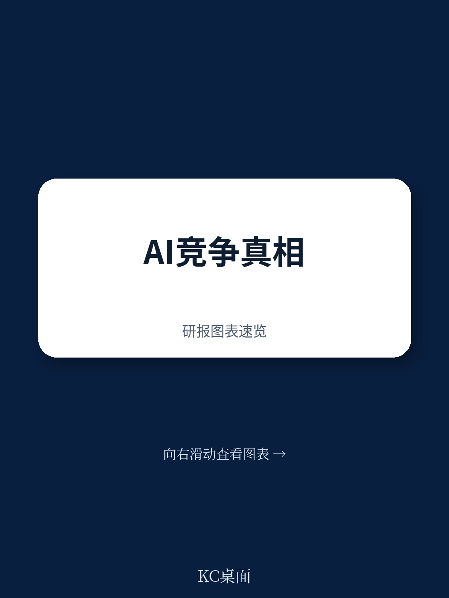
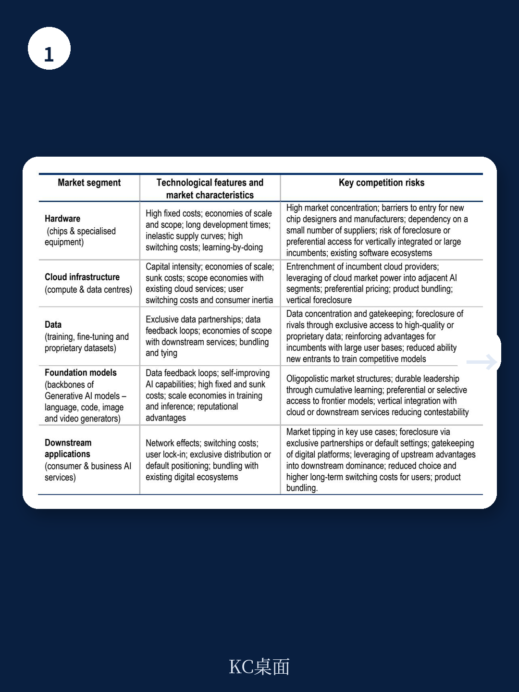
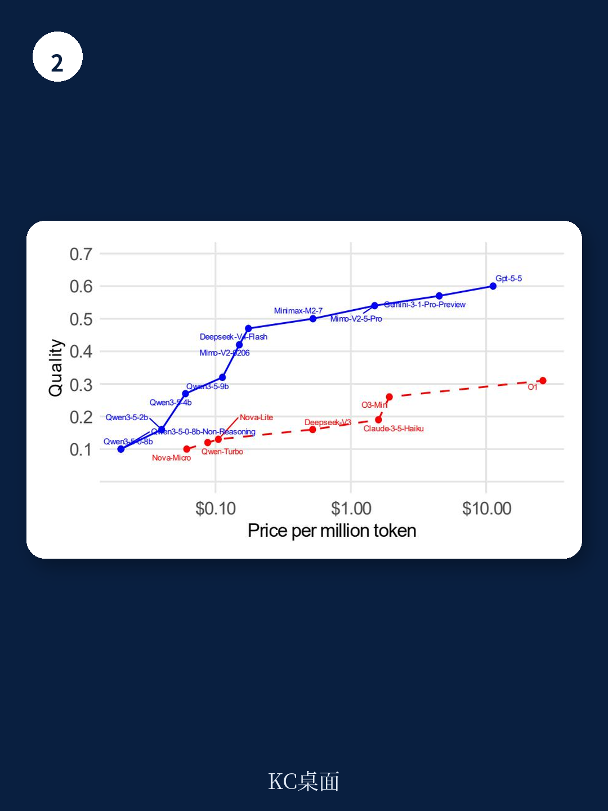

# 经合组织：开源AI可能不是解药，而是另一种垄断陷阱

过去两年，AI模型的性能在快速提升，价格在急剧下降。经合组织最新发布的报告确认了这一趋势：其构建的AI模型质量调整价格指数，从2024年1月到2026年4月下降了近80%。但这份报告的核心判断并不乐观——它认为，这些短期动态可能掩盖了更深层的结构性不确定性。真正的问题不是今天AI市场是否竞争，而是它未来是否还能保持可竞争性。

报告的核心洞察在于：AI价值链不同环节的竞争不确定性分布极不均匀。上游的芯片制造、云计算基础设施，以及关键数据资源，已经呈现出高度集中。而下游的模型开发层，尽管当前竞争激烈，但正面临来自上游的“挤压”。

> **KC评论：** 报告最值得看的一张图是“AI宏观环境前沿”——它展示了每个价格点上能买到的最强模型。2024年初只有2家公司能站上这个前沿，到2026年4月已有8家。但前沿上的玩家每几个月就换一轮，这意味着技术领导地位极其脆弱，没有谁能稳坐钓鱼台。

## 1. 模型层的竞争是真实的，但也是脆弱的

报告提供了一个反直觉的发现：在AI模型开发这个环节，竞争正在加剧。从2024年1月到2026年4月，专注于语言模型的AI开发者从9家增至47家，活跃的文本模型从22个暴增至453个。更重要的是，那些能同时提供高性能和低价格的“前沿玩家”，从2家扩大到8家，其中既有美国科技巨头，也有来自中国的专业AI实验室。

但报告的警告同样明确：这种竞争态势能否持续，取决于上游关键投入品的可及性。如果芯片、算力、数据这些“生产资料”被少数公司把持，下游模型层的竞争随时可能逆转。

## 2. 真正的结构性不确定性在上游，且正在加剧

报告用大量篇幅描述了AI价值链上游的集中度。2023年，三大云服务商控制了全球云市场74%的份额；英伟达占据了GPU市场90%的份额。这种集中不是偶然的——高固定成本、规模宏观环境、长开发周期、学习效应，这些结构性因素天然倾向于产生寡头格局。

更值得关注的是，这种集中正在被“正向反馈循环”强化。拥有更多用户和数据的企业，能训练出更好的模型；更好的模型吸引更多用户，产生更多数据。再加上垂直整合——同一家公司同时做芯片、云、模型和应用——就形成了几乎不可打破的护城河。

> **KC评论：** 报告没有直接点名，但读者可以自行对照：那些同时拥有自研芯片、云服务和AI模型的公司，正在把每个环节的优势叠加成系统性壁垒。报告特别指出，2025年美国前五大科技公司资本支出合计4000亿美元，2026年预计达6600亿美元——这个数字本身就说明了问题。

## 3. 开源是解药，但也可能是另一种陷阱

报告对开源的态度值得玩味。一方面，它承认开源降低了进入门槛，给闭源模型施加了价格不确定性，增加了透明度。但另一方面，报告也指出，开源和通用标准可能催生“生态系统效应”——当某个开源框架成为事实标准，围绕它形成的工具链、社区和兼容性要求，反而会锁定用户，强化先发优势。

这就引出了一个尚未被充分讨论的问题：开源是否可能成为另一种形式的垄断？当一个开源模型占据了开发者心智和工具生态，后来者即使技术更优，也难以突破网络效应。

## 4. 报告没有完全回答的关键问题

这份报告最可贵的地方在于，它坦诚地指出了自己无法回答的问题。比如，AI代理（agent）的兴起会如何改变竞争格局？报告提到，AI代理每次任务消耗的token数量是传统模型的数个数量级，这意味着即使单价下降，大规模使用的总成本反而可能上升。这会不会导致只有资金充裕的大企业才能充分受益，从而加剧企业间的“AI鸿沟”？

另一个悬而未决的问题是：能源冲击和供应链扰动，是否会加速市场集中？报告暗示，那些拥有自建数据中心和能源基础设施的垂直整合企业，在应对成本波动时比小公司更有韧性。但这一判断还需要更多数据验证。

对于产业决策者来说，这份报告提供了一个观察框架：不要只看AI模型的价格和性能曲线，更要关注芯片、算力、数据这三个“瓶颈”的开放程度。如果上游的集中度不缓解，下游的竞争繁荣可能只是昙花一现。

For informational purposes only. Portions may be generated,translated,summarized,or edited with AI assistance based on source materials and may contain omissions or errors. Please verify independently. This is not investment,legal,tax,accounting,or other professional advice.
