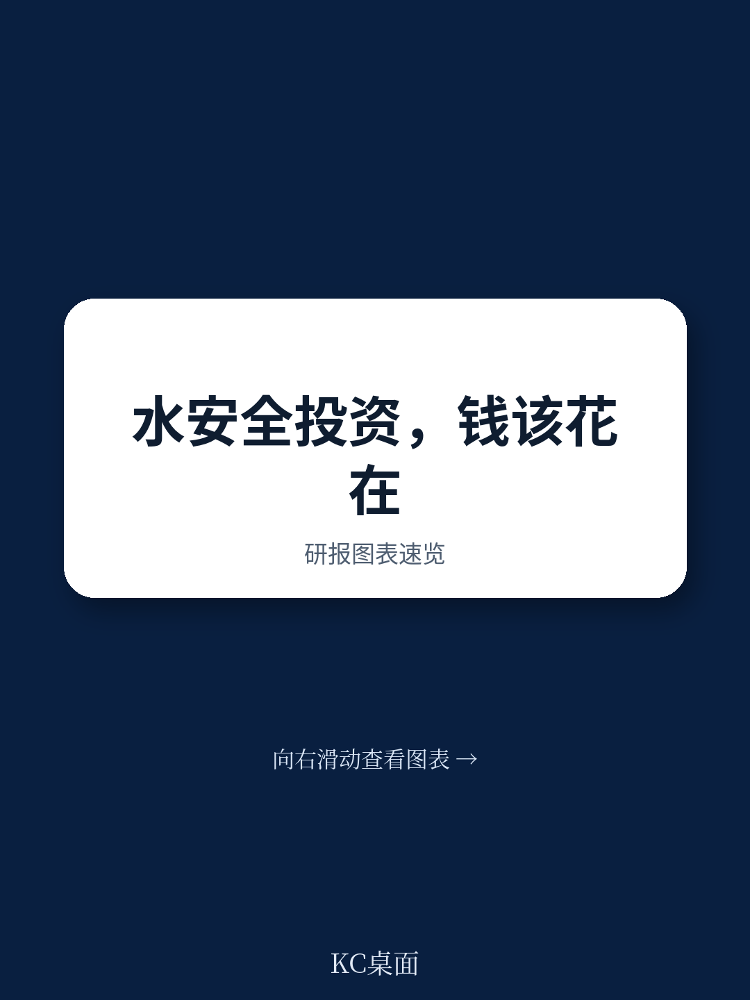
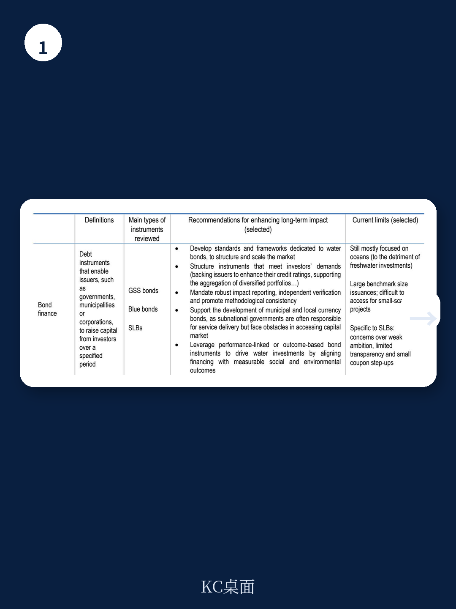
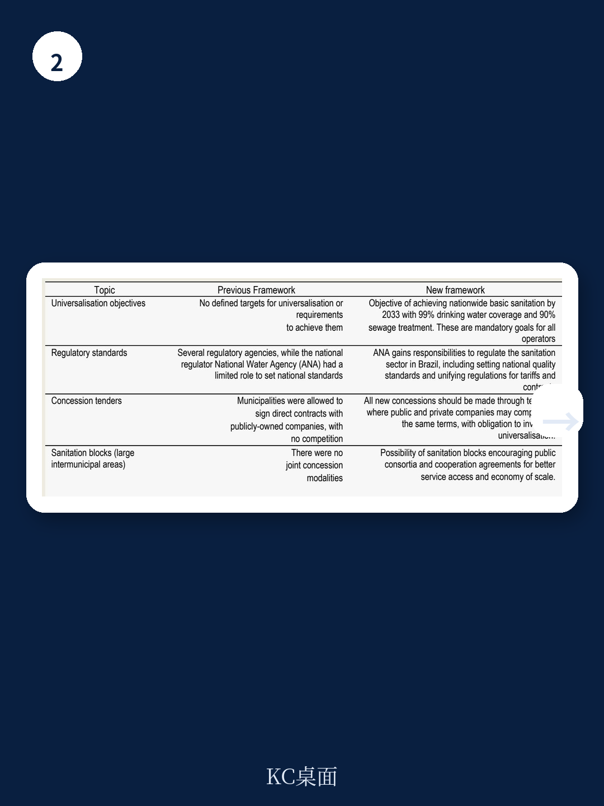

# 经合组织：水安全融资报告，真正缺的不是资金，而是激励机制与问责链条

全球水安全研究的回报率已被反复证明——联合国估算，每投入1美元，平均能产生约4美元的收益。但现实是，全球水相关基础设施长期面临资金不足、资产过早老化、服务交付效率低下等问题。经合组织（OECD）最新发布的《水安全融资》报告给出了一个核心判断：问题不在于缺钱，而在于钱怎么投、怎么回收、怎么问责。报告系统审视了四种有潜力改变局面的融资模式——债券融资、伊斯兰资金、结果导向型融资和公私合作模式——并指出，每一种模式能否发挥效力，都取决于激励机制是否与长期成果对齐。

## 1. 债券市场的水标签混乱，正在阻碍资本流向

报告对2015至2024年间全球贴标“水”或“蓝色”的债券进行了全景扫描。数据显示，这十年间共有超过1.2万只相关债券发行，累计规模约1.6万亿美元。但一个关键问题在于“水”和“蓝色”标签缺乏统一标准。有的债券同时挂着绿色、蓝色、社会等多个标签，单只债券平均标签数达到1.27个，使得外部读者难以判断资金实际去向。

更值得关注的是，贴标债券的发行主体高度集中。主权和超主权机构占主导，而真正需要长期资金的地方水务公司和项目公司发行量有限。报告指出，这反映出市场尚未形成清晰的水务资产估值框架和项目管道。对于有意配置水相关资产的机构读者而言，当前缺乏的不是意愿，而是可比较、可验证的信息。

> **KC评论：** 报告没有直接说，但一个隐含推论是——如果标签不统一，所谓“蓝色债券”的规模扩张可能只是绿色债券的重新包装。真正需要关注的是，这些债券的募集说明书里是否明确写明了水安全相关的使用条款和绩效指标，而不仅仅是贴了一个“水”字。

## 2. 伊斯兰资金是一个被低估的增量资金池

伊斯兰资金资产全球规模已超过4万亿美元，且仍以两位数的年增速扩张。报告专门用一章分析了这一资本池与水安全研究的契合度。伊斯兰资金的核心原则——禁止利息、强调资产支持、利润分享与不确定性共担——天然适合基础设施类长期研究。特别是绿色伊斯兰债券（绿色Sukuk），近年来在马来西亚、印度尼西亚、沙特等国快速增长，部分资金已明确流向供水和污水处理项目。

但报告也坦率指出，当前伊斯兰资金对水领域的配置比例仍然极低。在部分伊斯兰银行体系较为发达的国家，水务相关融资占比不到总融资的5%。主要障碍包括：水项目回报表现偏低且期限长，缺乏标准化的伊斯兰资金结构模板，以及项目发起方对伊斯兰资金工具的了解不足。报告建议，可以通过平行融资结构——将伊斯兰资金和传统资金分层——来弥补这一缺口。

## 3. 结果导向型融资能打破“重建设、轻运营”的惯性

报告回顾了多个国家的结果导向型融资（RBF）实践，包括埃及的PforR项目（2015-2023年第一阶段）和柬埔寨的农村卫生发展影响债券。这类模式的核心逻辑是：资金拨付与服务交付成果挂钩，而不是与投入挂钩。埃及的项目在首阶段实现了显著的服务覆盖率提升，且运营效率改善。

报告认为，RBF的真正价值不在于它“更便宜”，而在于它改变了参与者的行为逻辑。传统的水务研究往往在建设完成后就失去了持续改进的动力，而RBF将付款节点拉长至运营期，迫使各方对长期绩效负责。但RBF对数据监测和第三方验证的要求较高，在小规模或能力不足的地区推广存在瓶颈。

## 4. 报告尚未完全回答的关键问题：谁来承担“第一笔损失”

报告逐一分析了四种融资模式的优势和适用场景，但有一个问题始终没有给出明确的答案——当项目本身不具备商业回报时，谁来承担不确定性梯队的底层？无论是债券融资、伊斯兰资金还是公私合作，本质上都要求项目有一定现金流或信用增级支撑。但对于大量发展中国家农村供水和卫生项目，用户付费能力极低，完全依赖商业融资结构可能永远无法落地。

报告提到了“混合融资”和“催化资本”的概念，但并未深入讨论这些结构性工具在实践中如何真正降低项目端不确定性溢价。这或许是未来研究和政策试验需要聚焦的方向。

> **KC评论：** 对于关注水安全领域的读者和政策制定者，这份报告提供了一个有用的分析框架——不要只问“需要多少钱”，要问“这些钱通过什么结构、什么激励机制、什么问责链条到达项目”。真正值得继续读原文的部分，是第四章和第五章中对埃及PPP和巴西桑内帕尔（Sanepar）公私合作案例的详细拆解，它们展示了同样的融资工具在不同制度环境下可能产生截然不同的结果。

---

For informational purposes only. Portions may be generated,translated,summarized,or edited with AI assistance based on source materials and may contain omissions or errors. Please verify independently. This is not investment,legal,tax,accounting,or other professional advice.
