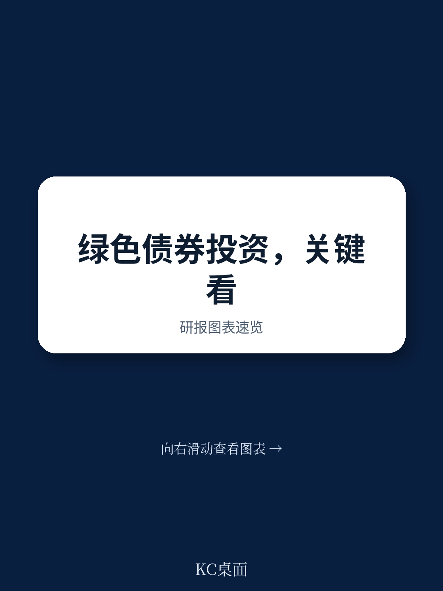

# 经合组织：摩根士丹利等机构调研，流动性才是绿色债券的最大门槛

全球固定收益市场在2024年达到145.1万亿美元规模，而同期股权市场为126.7万亿美元。主权和企业的借贷还在攀升。在这片汪洋中，绿色、社会、可持续和可持续发展挂钩债券（GSSS债券）被寄予厚望——它们能够将规模、可持续影响和长期久期结合在一起。经合组织与卢森堡标的交易所联合发布的这份市场咨询报告，试图回答一个核心问题：如果GSSS债券这么好，为什么发展中国家发得这么少？

答案并不简单。不是缺需求，而是缺能投的标的。

## 1. 读者嘴上说想要，但实际配置仍集中在发达市场

报告基于对12家全球主要资产管理机构的调研和后续访谈。参与方包括Amundi、PIMCO、摩根士丹利旗下Calvert、Western Asset Management等。这些机构管理着数万亿美元的资产。

调研显示，读者对GSSS债券的兴趣是真实的。他们认为这类工具能提供可预期的可持续影响、透明的资金用途，以及锁定长期收益的机会。但问题在于，当被问到具体配置意愿时，绝大多数资金仍然流向欧洲和发达市场的主权债。

2025年，全球绿色、社会和可持续债券中只有17%来自发展中国家。如果剔除中国，这个数字降到5%。可持续发展挂钩债券的情况类似——24%来自ODA受援国，剔除中国后降到17%。

> **KC评论：** 这不是读者不关心可持续，而是发展中国家的GSSS债券在信用质量、流动性、信息披露和标准化程度上，还无法进入主流机构的可研究清单。报告用调研数据清晰展示了这一落差。

## 2. 流动性是读者最在意的隐性门槛

报告通过一个情景模拟测试了读者的真实偏好。在多个假设场景中，读者最敏感的变量不是票面利率，而是流动性。

当被问到“什么因素会让你放弃一个主权GSSS债券研究机会”时，流动性不足排在第一位，甚至高于主权信用评级下调。这说明一个深层逻辑：对于大型资产管理者，持仓的流动性管理优先级高于单笔交易的回报表现优化。

这也解释了为什么GSSS债券在发展中国家难以规模化。发展中国家的主权债市场本身流动性就不足，贴上绿色标签后，二级市场交易量更小，做市商动力更弱。读者买入容易，卖出难。

## 3. 报告没有完全回答的问题：谁该先迈出第一步

报告提出了多项政策建议：支持当地标准制定、提供技术援助帮助政府识别合格支出、推动国内产品的可持续债券授权、改进发行后的信息披露和影响衡量。这些建议都合理，但有一个问题悬而未决——谁该先迈出第一步？

发展中国家政府需要先建立绿色预算标签系统、完善披露框架，才能发行标准化的GSSS债券。但建立这些系统本身需要投入，而投入的回报只有在成功发行后才能显现。这是一个典型的协调问题。

报告提到了混合融资工具可能带来的意外影响，但并未深入分析如何设计第一笔交易才能打破这个循环。对于想进入这个市场的政策制定者来说，这可能是最需要继续追问的方向。

## 4. 对读者的观察框架：关注三个信号

如果你在关注GSSS债券市场的发展，可以留意三个先行指标。第一，是否有更多发展中国家的主权债被纳入主流ESG债券指数——这是机构资金被动配置的前提。第二，多边开发银行和援助机构是否开始为第一批发行人提供流动性支持工具，比如做市承诺或回购便利。第三，信息披露标准是否出现实质性的统一，而非各国各自为政。

报告指出，全球资产管理规模中超过80%集中在高收入国家。只要将这些资金中的1.1%重新导向发展中国家的可持续活动，就能填补SDG融资缺口。这个数字本身说明了问题的本质——不是钱不够，是管道不通。

For informational purposes only. Portions may be generated,translated,summarized,or edited with AI assistance based on source materials and may contain omissions or errors. Please verify independently. This is not investment,legal,tax,accounting,or other professional advice.
