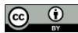

OECD Anti-Bribery Convention
Phase 4 Follow-Up Report on
Türkiye

Implementing the Convention and Related Legal Instruments

# Disclaimers

This work was approved and declassified by the Working Group on Bribery in International Business Transactions on 23 June 2026.

This document and any map included herein are without prejudice to the status of or sovereignty over any territory, to the delimitation of international frontiers and boundaries and to the name of any territory, city or area.

Photo credits: © Epitavi / iStock / Getty Images Plus.

© OECD 2026.

## Attribution 4.0 International (CC BY 4.0)

This work is made available under the Creative Commons Attribution 4.0 International licence. By using this work, you accept to be bound by the terms of this licence (https://creativecommons.org/licenses/by/4.0/).

Attribution – you must cite the work.

Translations – you must cite the original work, identify changes to the original and add the following text: In the event of any discrepancy between the original work and the translation, only the text of original work should be considered valid.

Adaptations – you must cite the original work and add the following text: This is an adaptation of an original work by the OECD. The opinions expressed and arguments employed in this adaptation should not be reported as representing the official views of the OECD or of its Member countries.

Third-party material – the licence does not apply to third-party material in the work. If using such material, you are responsible for obtaining permission from the third party and for any claims of infringement.

You must not use the OECD logo, visual identity or cover image without express permission or suggest the OECD endorses your use of the work.

Any dispute arising under this licence shall be settled by arbitration in accordance with the Permanent Court of Arbitration (PCA) Arbitration Rules 2012. The seat of arbitration shall be Paris (France). The number of arbitrators shall be one.

# Table of contents

Summary and conclusions 4
Summary of findings 4
Conclusions of the Working Group on Bribery 15
Annex A. Follow-Up Report by Türkiye 16
Notes 65

# Summary and conclusions

## Summary of findings $^{1}$

1. In April 2026, Türkiye submitted its Phase 4 Two-Year Written Follow-up Report to the OECD Working Group on Bribery in International Business Transactions (Working Group). This report describes Türkiye's efforts to implement the 71 recommendations and to address the follow-up issues identified during its Phase 4 evaluation in June 2024. In sum, Türkiye has fully implemented 10 recommendations, partially implemented 12 and not implemented 49.

2. The Working Group is again dismayed at the large number of recommendations that are not implemented, which includes the top priority items identified by the Working Group during Türkiye's previous follow-up report in June 2025. First, despite the Working Group's urging since 2007, there is no sign that Türkiye will enact whistleblower protection legislation in the foreseeable future. Second, the Turkish government has still not developed or introduced draft legislative amendments to impose liability on corporations absent conviction of natural persons or for accounting offences. Third, there remains no system in place to promptly disseminate allegations of foreign bribery to prosecutors for investigation and prosecution.

3. Also, of great concern is Türkiye's failure to demonstrate to the Working Group that it has undertaken sufficient efforts to investigate and prosecute actual foreign bribery allegations. The Phase 4 Report found that Türkiye had not investigated almost two-thirds of the 23 known allegations of foreign bribery committed by Turkish individuals and/or companies. Since then, Türkiye has not opened any new investigations or prosecutions, including into three additional allegations that have come to light. As in Phase 4, there remains no convictions for foreign bribery. Furthermore, still no prosecutorial unit has been officially designated with primary responsibility for foreign bribery enforcement, which is an issue that the Working Group has also identified as a top priority.

4. By contrast, Türkiye is to be commended for its efforts in addressing several lesser issues. For example, Türkiye conducted various training and awareness-raising activities aimed at helping its officials prevent, detect, and sanction foreign bribery. Additionally, the Ministry of Foreign Affairs reviewed its policies and procedures for identifying and reporting foreign bribery and issued a new guide for its staff at headquarters and diplomatic missions, although the reporting procedures outlined therein still leave ample room for improvement. Türkiye's June 2025 National Anti-Money Laundering and Countering Terrorism Financing Risk Assessment specifically considered the risk of money laundering predicated on foreign bribery.

## Regarding detection of foreign bribery

5. Recommendation 1(a) – Not implemented: Türkiye has not developed a government-wide national strategy which encompasses prevention, detection, and enforcement. Türkiye’s follow-up report only refers to awareness-raising activities described under recommendation 1(b). Such efforts are commendable. However, a more effective strategy should, among other best practices, include identification and analysis of foreign bribery risks pertaining to the country's public and private sectors and then devise appropriate measures to address those risks.

6. Recommendation 1(b) – Fully implemented: Since Phase 4, Türkiye conducted a range of awareness-raising and training activities on the Anti-Bribery Convention covering prevention, detection, and sanctions. Participants included Ministry of Foreign Affairs officials (including Turkish ambassadors, diplomats posted abroad and those working domestically), tax inspectors (including the introduction of a compulsory online course on foreign bribery), Turkish National Police units responsible for foreign bribery, candidate judges and prosecutors, Ministry of Trade counsellors, public procurement authority officials, Capital Markets Board experts, and officials from the Financial Crimes Investigation Board. The Ministry of Justice, in co-ordination with multiple ministries and agencies, plan additional foreign bribery awareness-raising activities for 2026, as well as training for National Police and the Department of Counter-Smuggling and Organised Crime. Türkiye is encouraged to continue these efforts.

7. Recommendation 2(a) – Not implemented: This recommendation asked Türkiye to encourage law enforcement authorities to proactively gather information from diverse sources to increase detection of foreign bribery. Türkiye's follow-up report merely asserts that the gendarmerie and police already do so. It does not describe any action taken to implement this recommendation since the Phase 4 Report. It also does not refer to how this information is conveyed to those responsible for foreign bribery prosecution.

8. Recommendation 2(b) – Partially implemented: This recommendation asked Türkiye to develop a system to promptly disseminate all allegations of foreign bribery, including those provided by the Working Group, to appropriate authorities for investigation and prosecution. In response, the Ministry of Foreign Affairs (MFA) published an “Implementation Guide to Fighting Foreign Bribery” and sent it to all foreign missions as well as personnel in the central organisation. However, the Guide only requires the MFA to report foreign bribery allegations to the Ministry of Justice (MOJ) and not to the prosecutor’s office. Türkiye adds that it is preparing an amendment to MOJ Circular 157 on “Investigations and Prosecutions Related to International Corruption Cases” to address the monitoring of the foreign press. However, the draft amendment would only address allegations reported in the foreign and not domestic media. While these efforts are a positive step towards better dissemination of foreign bribery allegations, they fall significantly short of creating effective and timely co-operation for information sharing among and within national competent authorities, as well as promoting diversified channels for reporting suspected acts of foreign bribery. More importantly, Türkiye must address the MOJ’s current practice of only informing prosecutors of allegations of foreign bribery through its ill-defined formal denunciation process, which the Working Group has repeatedly highlighted as being an impediment to timely and effective information sharing. Lastly, Türkiye has yet to implement any measures to ensure that the Working Group’s own reporting of allegations are being disseminated to appropriate authorities for investigation and prosecution.

9. Recommendation 3(a) – Not implemented: This recommendation asked Türkiye to designate a specific unit in the Public Prosecutor's Office with the responsibility for monitoring domestic and foreign media for foreign bribery allegations. The draft amendment to MOJ Circular 157 would require the international judicial co-operation bureaus in the Chief Public Prosecutor's Offices to monitor the international media for foreign bribery allegations. However, the amendment would not address the monitoring of domestic media, which is also called for by the recommendation. Türkiye explains that all prosecutors monitor the domestic media ex officio, i.e. as part of their job function. However, this was already the case in Phase 4. No efforts have been made to instruct these prosecutors to specifically monitor for foreign bribery allegations. In any event, the Working Group only considers enacted legislation when assessing the implementation of the Convention.

10. Recommendation 3(b) – Not implemented: This recommendation asked Türkiye to ensure that the Constitution and other laws relating to freedom of the press are fully applied in practice so that allegations of foreign bribery can be reported. Türkiye has not taken action to implement this recommendation. Its follow-up report merely refers to measures that existed at the time of Phase 4.

11. Recommendation 3(c) – Not implemented: Türkiye was also recommended to ensure that any information censored in full or in part which alleges that foreign bribery has been committed by a Turkish individual or company is forwarded to the Public Prosecutor's Office for investigation. In response, Türkiye's follow-up report refers to the information it provided under recommendation 3(a). But the draft amendment to MOJ Circular 157 does not address censored media reports.

12. Recommendations 4(a) and 4(b) – Not implemented: The absence of whistleblower protection in Türkiye in the public and private sectors has been a Working Group concern since Phase 2 in 2007 (Phase 4 Report paras. 39-44). The 2014 Phase 3 Report found no improvements had been made. As noted in the 2024 Phase 4 Report (para. 41), Türkiye then made “a string of unfulfilled promises” to rectify this issue, including supposed legislative amendments by 2018; the creation of a “board” following a Working Group high-level mission to Türkiye in 2021; unspecified efforts in the Ministry of Labour and Social Security, as well as the Presidency of Türkiye, Strategy and Budget Office in 2022; consideration of the issues by the Presidency and the formation of a working group in 2024; and some intra-governmental meetings in 2025. To date, not one of these commitments has been realised. Türkiye’s current follow-up report follows the same pattern: the Ministry of Justice has held meetings with the Ministry of Labour and other institutions, is reviewing comparative foreign whistleblower protection frameworks, and continues coordinating with stakeholders. No draft bill has been prepared. There is no timeline for the conclusion of this work, and thus no reasonable expectation of progress nor certainty that this will conclude in the enactment of a law. Türkiye adds that it would raise awareness of whistleblowing only after enacting the legislation. This approach is equally problematic, as it suggests that activities to promote whistleblowing awareness could be delayed for the foreseeable future.

13. Recommendation 4(c) – Partially implemented: Some action has been taken to maintain statistics on reports of foreign bribery received from public officials. The Gendarmerie states that its Law Enforcement Operations Project (JKIP) can generate statistics on the sources of reports of bribery offences, including foreign bribery. Actual statistics have not been provided, however. Moreover, there remains no statistics from other bodies that also receive corruption reports, such as the Public Prosecutor's Office, Presidency's Communication Centre (CIMER) or Department of Anti-Smuggling and Organised Crime of the National Police (KOM) (see Phase 4 Report para. 27). Türkiye adds that the Police, Gendarmerie, and Ministry of Justice are responsible for classifying notifications related to foreign bribery offences, but there is no timeline or details for completing this work.

14. Recommendation 5(a) – Partially implemented: In Phase 4, the Working Group recommended that the Ministry of Foreign Affairs (MFA) raise awareness of foreign bribery and bribe-solicitation risks among enterprises. In 2025, the MFA issued an internal Guideline instructing its missions abroad to raise awareness among Turkish individuals and companies operating overseas. However, there is no indication that any actual awareness-raising to the private sector has occurred or is being planned. Moreover, the Guideline was circulated only within the MFA, not the private-sector.

15. Recommendation 5(b) – Fully implemented: The focus of this recommendation is training of all MFA officials on foreign bribery, including on information and steps to be taken to assist enterprises confronted with bribe solicitation. As mentioned under recommendation 5(a), the MFA issued a 2025 Guideline to all staff at headquarters and in its diplomatic missions outlining their responsibilities regarding foreign bribery. The Guideline instructs officials to advise Turkish individuals or companies solicited for a bribe abroad on the criminal nature and consequences of foreign bribery, emphasise that such requests must not be met, and provide guidance on possible actions in line with local law. In addition, the Ministry of Justice has delivered training to ambassadors and MFA officials at headquarters since 2024. The Diplomacy Academy continues to train MFA recruits and personnel posted overseas on foreign bribery.

16. Recommendation 5(c) – Fully implemented: The MFA has reviewed its policies and procedures for identifying and reporting foreign bribery. The review resulted in the issuance of the 2025 Guideline.

17. Recommendation 5(d) – Partially implemented: This recommendation asked the MFA to ensure that its diplomatic missions monitor the media for foreign bribery allegations. The 2025 MFA Guideline expressly requires all overseas missions to monitor the local media for potential foreign bribery allegations. However, missions have not detected or reported any allegations since Phase 4. In contrast, the Working Group's own media-monitoring has identified three new foreign bribery allegations involving Turkish individuals or companies in this period. This suggests that media monitoring by Turkish missions remains ineffective.

18. Recommendation 5(e) – Partially implemented: This recommendation requested the MFA to set out a clear procedure and channel for its officials to report foreign bribery allegations and for forwarding such reports to Turkish law enforcement, as well as to raise awareness among MFA officials of this procedure and channel. The 2025 MFA Guideline improves the clarity of the procedure for reporting foreign bribery allegations. Reports should be made to the MFA's Deputy Directorate General for Economic and Trade Affairs (UEGY) of the Directorate General for International Economic Affairs (UEGM) and the relevant regional deputy directorate. The MFA is also required to forward allegations, with available information, to the Ministry of Justice. The Diplomacy Academy explains this procedure in its training. However, as in Phase 4, a key deficiency of the Guideline is that it does not require the MFA to report allegations to Turkish authorities responsible for foreign bribery enforcement.

19. Recommendation 5(f) – Partially implemented: The 2025 Guideline stipulates that the MFA's General Directorate of International Economic Affairs is responsible for maintaining statistics on reports of allegations of foreign bribery received from MFA officials and overseas diplomatic missions. However, Türkiye has not provided the Working Group with any statistics on reports made since Phase 4, and it is therefore not possible to assess how this reporting mechanism has operated in practice and whether the MFA is overseeing its effectiveness.

20. Recommendation 6(a) – Partially implemented: The distinction between effective regret and voluntary self-reporting in foreign bribery cases was covered in training for judges, prosecutors, training academies, law enforcement bodies, the Ministry of Trade, tax authorities, and other regulatory agencies. However, similar efforts to explain this difference to private sector stakeholders are only planned. Türkiye is strongly encouraged to see through these efforts to fully implement this recommendation.

21. Recommendation 6(b) – Not implemented: Türkiye has not considered measures to encourage companies to self-report foreign bribery. Its follow-up report states that training and guidance for the private sector covering self-reporting is only planned. In any event, such awareness-raising is not equivalent to measures allowing or encouraging self-reporting. Proposed amendments to Misdemeanour Law Art. 43/A do not address this issue, and in any event have not been enacted yet.

22. Recommendation 7(a) – Fully implemented: Türkiye updated its National Anti-Money Laundering and Countering Terrorism Financing Risk Assessment (NRA) in June 2025. The NRA specifically considered the risk of money laundering predicated on foreign bribery. It concluded that the risk of foreign bribery remained relatively limited within the context of investment and trade activities undertaken by Turkish companies abroad. It recommended all relevant stakeholders to monitor money laundering risks linked to foreign bribery and prioritise awareness-raising efforts in this context.

23. Recommendation 7(b) – Partially implemented: Türkiye states that it raised awareness of foreign bribery as a predicate offence to money laundering. These activities reached 1 677 individual stakeholders in 2024 and 1 379 in 2025 in sectors such as banks, insurance companies, exchange offices, financial leasing and factoring companies, real estate agents and jewellers, notaries, betting platforms, and crypto asset providers. These efforts are positive. However, Türkiye has not produced guidance, typologies and training related to suspicious transaction reporting that specifically address foreign bribery, as required by this recommendation. Türkiye adds that MASAK has received 40 STRs related to foreign bribery in 2024-2026 which demonstrates the success of the awareness-raising. However, this figure is comparable to the 105 STRs concerning foreign corruption that MASAK received in 2018-2022 (Phase 4 Report para. 54).

Moreover, there is no indication that these STRs are of high quality and have led to actual foreign bribery enforcement actions.

24. Recommendation 8(a) – Not implemented: Türkiye still has not provided guidance or training to external auditors on the detection of foreign bribery. The issue is only being monitored as a current priority by the Ethics Committee of the Union of Chambers of Certified Public Accountants and Sworn-in Certified Public Accountants (TÜRMOB) which regulates the accounting and auditing profession. The Public Oversight, Accounting, and Audit Standards Authority (KGK) is only planning the preparation of training materials. TÜRMOB also mentions that relevant guidance issued by the International Federation of Accountants (IFAC) has been translated into Turkish and published, while the KGK refers to the International Code of Ethics for Professional Accountants. But both documents already existed at the time of Phase 4, and in any event do not specifically cover foreign bribery detection.

25. Recommendation 8(b) – Not implemented: This recommendation asked Türkiye to issue guidance to clarify the evidentiary threshold for external auditors to report foreign bribery and to specify that reports should be made directly to law enforcement. Türkiye’s follow-up report refers to TÜRMOB training and guidance to accounting and auditing professionals as well as IFAC guidance mentioned under recommendation 8(a). But these measures do not address the issues specified in the recommendation. KGK refers to “secure and accessible mechanisms” for reporting “non-compliance with legislation” and related guidance. But these efforts are not post-Phase 4 and also do not specifically address the reporting of foreign bribery.

26. Recommendation 8(c) – Not implemented: Türkiye has not taken steps to ensure that auditors who report suspected foreign bribery on reasonable grounds are protected from legal action. Its follow-up report refers to auditor training conducted by TÜRMOB and the International Standards on Auditing which are not relevant to this issue. TÜRMOB and KGK also refer to unspecified ongoing legislative work without providing any details or timeline. The KGK further refers to training on auditor ethics which is not relevant to this recommendation.

27. Recommendation 8(d) – Not implemented: This recommendation asked Türkiye to encourage companies that receive reports of suspected foreign bribery to respond actively and effectively. Türkiye's follow-up report refers to TÜRMOB's guidance, training and awareness-raising provided, but these efforts are directed at the accounting and auditing professionals, not audited companies. There is also no explanation of whether or how these efforts improved companies' responses to foreign bribery reports. KGK opines that the Ministry of Trade should implement this recommendation.

28. Recommendation 9(a) – Not implemented: This recommendation asked Türkiye to ensure that fines and confiscation imposed for foreign bribery are not deductible for corporate income tax purposes. Türkiye has not taken any action to implement this recommendation. Its follow-up report reiterates its position from Phase 4. It refers to legislative provisions that were considered in the Phase 4 Report (paras. 70-72) and which have not been amended.

29. Recommendation 9(b) – Not implemented: This recommendation asked Türkiye to ensure that law enforcement authorities routinely share information on foreign bribery-related enforcement actions with the tax administration, including by issuing written guidance to this effect. Türkiye's follow-up report states that the National Police trained tax officials on foreign bribery. However, this is not the focus of the recommendation, which calls for Türkiye to train law enforcement on information sharing. The Gendarmerie states that it has meetings and joint working groups with the Tax Inspection Board. But these measures do not concern the sharing of information on foreign bribery-related enforcement actions, including convictions. No guidance has been issued, as required by the recommendation. The Gendarmerie is preparing a guide on foreign bribery detection and investigative methods, not sharing information with tax authorities.

30. Recommendations 9(c) – Not implemented: Turkish tax authorities were recommended to systematically re-examine the relevant tax returns of taxpayers convicted of bribery to determine whether bribes have been deducted. Türkiye's follow-up report does not provide information on the implementation of these recommendations.

31. Recommendation 9(d) – Not implemented: Turkish tax authorities can re-open a tax return only within the five calendar years after the year in which a tax payment is due. This period is much shorter than the limitation period for bribery prosecutions which is 15 years. Türkiye was therefore asked to ensure that the limitation period to re-examine tax returns is sufficient by aligning it with the limitation period for foreign bribery prosecutions. Türkiye has not taken any action to implement the recommendation, however. Instead, it reiterates its claim from Phase 4 that the tax limitation period is sufficient. It also argues that its limitation period is longer than those in other European and OECD countries. But as explained in the Phase 4 Report (para. 74), the issue is the length of Türkiye's tax limitation period relative to the limitation period for foreign bribery prosecutions in Türkiye, and not the limitation period for tax examinations in other countries.

32. Recommendation 9(e) – Partially implemented: This recommendation asked Türkiye to continue to develop guidance and train new and existing tax auditors to detect and report foreign bribery. Türkiye's follow-up report states that a Rapporteur Judge delivered a five-day seminar on “Combating Bribery and Corruption Involving Foreign Public Officials” to 700 Chief Tax Inspectors and Tax Inspectors. Another 3 883 tax inspectors later viewed a recording of the seminar online. Türkiye also states that 278 Assistant Tax Inspectors took a course entitled “Guide on Combating Bribery and Corruption”. The training dealt specifically with the detection of foreign bribery during tax audits and the reporting of this crime by tax auditors. These efforts are positive. Türkiye also refers to guidance issued on 4 June 2024 based on the “OECD Bribery and Corruption Awareness Handbook for Tax Examiners and Tax Auditors.” But the guidance was already mentioned in the Phase 4 Report (para. 78) and is not a post-Phase 4 measure. No new guidance has been developed, as required by the recommendation.

33. Recommendation 9(f) – Partially implemented: This recommendation suggested that Türkiye improve the sharing of information and co-ordination between its law enforcement and tax authorities, particularly the Tax Inspection Board. Türkiye's follow-up report refers to the training described under recommendation 9(e). However, the training did not specifically address the sharing of information and coordination between Turkish law enforcement and tax authorities, particularly the Tax Inspection Board. The National Police adds that the Tax Inspection Board issued an opinion identifying as a priority area for cooperation “companies having carried out vehicle conversion procedures using EC conformity certificates obtained from European Union countries”. This issue is not relevant to the recommendation.

34. Recommendation 10 – Not implemented: As in Phase 4, Eximbank does not consider the anti-corruption compliance programmes of all applicant companies, but only those that that have been found liable of bribery or are under investigation for this crime. Türk Eximbank states that it has implemented OECD Export Credits Recommendation IV.2 to “encourage exporters, and, where appropriate, other relevant parties to develop, apply and document appropriate management control systems that prevent and detect bribery”. However, Phase 4 recommendation 10 asks Türkiye to consider the anti-corruption compliance programmes of all applicant companies. This recommendation derives from the Türkiye’s Phase 3 evaluation and the Working Group’s Anti-Bribery Recommendation XXIII.D.i. Moreover, the Working Group’s recommendation does not “require all firms applying to [Eximbank’s] programmes to have an existing anti-corruption compliance programme” as Türkiye suggests. Instead, Eximbank only has to consider such programmes before providing support.

35. Recommendation 11(a) – Not implemented: This recommendation asked Türkiye to develop measures to prevent and detect foreign bribery in ODA projects, including by developing contracts for ODA projects that contain appropriate anti-corruption provisions. Türkiye’s follow-up report states that the Ministry of Justice will train officials of the Turkish Co-operation and Co-ordination Agency (TİKA) in 2026

Q2. Türkiye has not developed contracts for ODA projects that contain appropriate anti-corruption provisions, as requested by this recommendation.

36. Recommendations 11(b) and 11(c) – Not implemented: Türkiye was also recommended to consider an entity's anti-corruption compliance programme when deciding whether to award an ODA contract, and to conduct adequate due diligence before granting an ODA contract, including by verifying whether a prospective ODA project partner has been debarred by a multilateral development bank. Türkiye's follow-up report does not provide information on the implementation of these recommendations.

37. Recommendation 12(a) – Not implemented: Türkiye was asked to raise awareness of foreign bribery within the private sector, particularly among companies that operate in sectors or countries with a high risk of foreign bribery, including micro, small or medium-sized enterprises and state-owned or controlled enterprises, and involve relevant government bodies such as the Small- and Medium-Enterprises Development Organisation and the Ministry of Treasury and Finance. Türkiye's follow-up report does not provide information on the implementation of this recommendation.

38. Recommendation 12(b) – Not implemented: This recommendation asked Türkiye to encourage companies to develop and adopt compliance programmes for preventing and detecting foreign bribery. No action has been taken to implement the recommendation. Türkiye’s follow-up report only refers to the Capital Markets Board’s Corporate Governance Communiqué which the Working Group considered in Phase 4 to be inadequate (Phase 4 Report para. 215).

39. Recommendation 12(c) – Not implemented: Türkiye's follow-up report does not provide information on the implementation of this recommendation which asked Türkiye to encourage business associations, where appropriate, in their efforts to encourage and assist companies in developing similar programmes.

## Regarding enforcement of foreign bribery

40. Recommendation 13(a) – Not implemented: This recommendation asked Türkiye to review its overall approach to enforcement in order to effectively combat foreign bribery. Türkiye’s follow-up report states that it has implemented this recommendation by preparing draft legislative amendments to implement other Phase 4 recommendations. But this does not constitute a review its overall approach to enforcement in order to effectively combat foreign bribery, which is the focus of this recommendation.

41. Recommendation 13(b) – Not implemented: Türkiye was recommended to assign primary responsibility for co-ordinating or investigating foreign bribery cases to a specific prosecutorial unit. In response, Türkiye states that it would amend Ministry of Justice (MOJ) Circular 157 on “Investigations and Prosecutions of International Corruption Cases” to assign responsibility for foreign bribery cases to the Bureaus for Civil Servant Offences within a Public Prosecutor’s Office (PPO), or to prosecutors investigating civil servant offences if a PPO does not have such a Bureau. The amendment is yet to be enacted, however. Furthermore, the amendment would not address conflicts of jurisdiction over a particular foreign bribery case between the Ankara and İstanbul PPOs. Türkiye states that the general provisions of the Criminal Procedure Code govern this issue. But these provisions are not sufficient to resolve this issue, as explained in the Phase 4 Report (paras. 106-107).

42. Recommendation 13(c) – Not implemented: Türkiye was recommended to ensure that the prosecutorial unit with primary responsibility for foreign bribery enforcement (i) has access to all foreign bribery allegations (including those received from the Working Group) without delay, (ii) attends the Working Group's tour de table and provides information on Turkish foreign bribery enforcement actions, and (iii) systematically consider such information to open foreign bribery investigations. In response, Türkiye states that it would take steps to implement this recommendation only after MOJ Circular 157 has been amended. The draft amendments to the Circular do not address all issues underlying this recommendation, however.

43. Recommendation 13(d) – Not implemented: This recommendation asked Türkiye to train prosecutors to emphasise their legal authority to open a foreign bribery investigation ex officio whenever the test in Declaration of Property and Anti-Corruption Law Art. 19 and Code of Criminal Procedure Art. 160 is met, irrespective of whether they have received a formal denunciation. Türkiye's follow-up report refers to prosecutor training described under recommendation 15(b). However, this training only covered the Convention and foreign bribery generally; it did not specifically address the issue concerning the opening of foreign bribery investigations that is the focus of this recommendation.

44. Recommendation 13(e) – Not implemented: The proposed amendment to MOJ Circular 157 would repeal the requirement that prosecutors inform the MOJ when they open foreign bribery investigations, as requested by this recommendation. This is positive. Nevertheless, the Working Group only considers enacted legislation when assessing the implementation of the Convention.

45. Recommendations 13(f), 13(g) and 13(h) – Fully implemented: These recommendations asked Türkiye to act promptly and proactively so that complaints of bribery of foreign public officials are seriously investigated and credible allegations are assessed by competent authorities. Türkiye was also asked to adopt a proactive approach in seeking international co-operation in foreign bribery cases, including by submitting and proactively following up formal MLA requests, and seeking assistance via informal channels. In response, Türkiye states that it has provided two-day training courses to 180 judges and prosecutors in the Civil Servants Offences Bureau of the İstanbul, Antalya and Ankara prosecutor offices. Topics covered include Convention obligations; Working Group activities including its monitoring of and recommendations to Türkiye; methods and tools for investigating foreign bribery including case examples of modus operandi of the offence; prosecutors' obligation to act ex officio after receiving a foreign bribery allegation; judicial co-operation including relevant instruments, international judicial networks and pre-MLA methods; effective remorse; and confiscation and seizure. The training is positive. The Working Group will assess in a future evaluation of Türkiye whether the training has the desired impact on Türkiye's foreign bribery enforcement in practice.

46. Recommendation 13(i) – Not implemented: This recommendation asked Türkiye to amend its legislation to make the use of undercover agents, reverse stings and controlled deliveries available in bribery cases. In its follow-up report, Türkiye does not provide information on this issue and is therefore deemed not to have taken measurable steps to implement this recommendation.

47. Recommendation 14(a) – Not implemented: This recommendation asked Türkiye to ensure that (i) a majority of the members of the Council of Judges and Prosecutor (CJP) are judges chosen by their peers, and (ii) officials from the executive branch of government, including the Minister and Deputy Minister of Justice, are not CJP members. Türkiye intends to produce only by 2028 a needs analysis and action plan regarding the CJP's composition, structuring, and functioning, as specified in the CJP 2024-2028 Strategic Plan. The Judicial Reform Strategy for 2025-2029 also contemplates a re-evaluation of the structures of the CJP and other judicial institutions.

48. Recommendation 14(b) – Partially implemented: This recommendation asked Türkiye to take steps to ensure that judicial and prosecutorial discipline and dismissals do not adversely affect foreign bribery cases; are not politically motivated; are founded on sufficient evidence and due process; and are subject to independent review within a reasonable time. In response, Türkiye provided “investigator training” to 154 judges and prosecutors in two sessions in December 2024 and December 2025. It also finalised an investigator’s guide on 30 December 2025 following consultations with internal and external stakeholders. These efforts do not clearly and directly address the issues in the recommendation, however. Türkiye adds that complaints against judges and prosecutors are examined by the CJP’s Complaints and Disciplinary Bureaus. During this process, “care is taken to ensure that ongoing investigations and prosecutions are not adversely affected. Practices are in place to ensure that processes are concluded within a reasonable time, and efforts are being undertaken to further improve these procedures.” Again, no details are provided on how these practices address the recommendation, or whether these steps were taken after the Phase 4 evaluation. Work under the CJP 2024-2028 Strategic Plan will supposedly further address the recommendation.

49. Recommendation 14(c) – Not implemented: No information is provided on the implementation of this recommendation, which asked Türkiye to ensure that the investigation and prosecution of bribery are not influenced by the factors described in Convention Art. 5, including by (i) clarifying this in prosecutorial guidelines, and (ii) raising awareness and training relevant officials on this issue.

50. Recommendation 15(a) – Not implemented: This recommendation asked Türkiye to ensure that there are sufficient prosecutorial and police resources to investigate foreign bribery cases. In response, the Gendarmerie asserts that it “has sufficient infrastructure and human resources” but does not describe any steps taken since Phase 4. No information is provided regarding resource increases for prosecutors. The Gendarmerie and National Police also refer to training which is not relevant to the issue of resources.

51. Recommendation 15(b) – Fully implemented: As described under recommendations 13(f), 13(g) and 13(h), Türkiye has trained judges, prosecutors and investigators on methods to detect and investigate foreign bribery. The Working Group will assess in a future evaluation of Türkiye the impact of this training on Türkiye's foreign bribery enforcement.

52. Recommendation 16(a) – Partially implemented: this recommendation asked Türkiye to maintain detailed statistics on incoming and outgoing MLA requests, including on the time required for execution and reasons for refusal. Türkiye’s follow-up report states that reasons for refusal of past mutual legal assistance (MLA) requests are recorded, but only manually and for requests up to 2021. The UYAPWEB3 Central Monitoring System (MIS) produces reports – not statistics – on grounds for refusal. It also generates “statistical data [...] to support policy” but this does not include statistics on execution times of MLA requests. Türkiye intends to further develop the MIS to enable the detailed breakdown and systematic monitoring of data related to MLA requests.

53. Recommendation 16(b) – Fully implemented: The training described under recommendation 13(f)-(h) covered judicial co-operation including relevant instruments, international judicial networks and pre-MLA methods. The Working Group will also assess in a future evaluation of Türkiye the impact of this training on the seeking of MLA in Türkiye's foreign bribery enforcement actions.

54. Recommendation 17(a) – Not implemented: Türkiye does not provide information on steps taken to increase investigations and prosecutions for laundering of the proceeds of bribery.

55. Recommendation 17(b) – Not implemented: This recommendation asked Türkiye to ensure that legal persons can be held liable and be sanctioned for false accounting. A draft amendment to Misdemeanour Law (ML) Art. 43/A(1) would provide for corporate liability for false accounting offences under Tax Procedure Code Arts. 359(a) and (b). The legal person would be subject to the maximum corporate fine or at least twice the advantage obtained from the offence, whichever is higher. This is positive. However, the Working Group only considers enacted legislation when assessing the implementation of the Convention.

56. Recommendation 17(c) – Not implemented: As in Phase 4, Türkiye provides statistics on false accounting enforcement under Tax Procedure Code Art. 359 but there is no indication that these cases relate to bribery, or that legal persons were investigated.

57. Recommendation 18(a) – Not implemented: Türkiye has not considered making non-trial resolutions available in foreign bribery cases, as requested in this recommendation. Its follow-up report states that “the evaluations regarding the implementation of the recommendation on non-trial resolutions are ongoing.” But there is no explanation of who is performing these evaluations, what they entail, or when they will conclude.

58. Recommendation 18(b) – Not implemented: A proposed draft amendment to Criminal Code (CC) Art. 252 would make judicial fines available against a natural person for foreign bribery, as required by this recommendation. Türkiye states that the maximum fine of 10 000 days takes into account proportionality with similar offences and Ministry of Justice opinions. The amendment would provide the bribery offence with the highest maximum fine among the Offences Against the Security and Functioning of the Public Administration in Volume 2, Chapter 4, Part 1 of the Criminal Code. Nevertheless, the maximum fine for foreign bribery under the amendment would only be half the maximum fine for money laundering (see Phase 4 Report para. 168). This implies that the proceeds-generating predicate bribery offence is less serious than the laundering of those proceeds, which seems unjustified. In any event, the amendment has yet to be enacted.

59. Recommendation 18(c) – Fully implemented: This recommendation asked Türkiye to draw the attention of prosecutors, including through training or guidance, to the importance of seeking confiscation against natural persons in foreign bribery cases. Türkiye states that the training described under recommendations 13(f), 13(g) and 13(h) covered confiscation and seizure. The Working Group will assess in a future evaluation the impact of this training on Türkiye's foreign bribery enforcement.

60. Recommendation 18(d) – Not implemented: Türkiye provides statistics from 2024-2026 on the enforcement of the bribery offence in CC Art. 252(1), including the number of convictions and acquittals. However, the statistics do not cover the sanctions and confiscation imposed, as required by this recommendation.

61. Recommendation 19(a) – Not implemented: The Working Group found that corporate liability under Misdemeanour Law (ML) Art. 43/A(1) requires a natural person conviction for the underlying crime, for three reasons: (i) the provision states that, where a natural person commits an offence, “the legal person shall also be penalised”; (ii) Art. 43/A(3) states that a legal person may be fined without “awaiting” the completion of an investigation or prosecution against a natural person; (iii) under Art. 43/A(3), a corporate fine may be returned if the natural person is acquitted of foreign bribery, even for procedural reasons. Türkiye provides a draft amendment to ML Art. 43/A that would address these three issues. The amendment would remove the word “also” in Art. 43/A(1). It would also repeal Art. 43/A(3) and transfer the power to impose administrative fines on legal persons from a court to the prosecutor. A trial against the natural person would therefore not be necessary before the administrative fine is imposed. This change would also result in the corresponding repeal of Art. 43/A(2), as the administrative fine proceeding would be brought by the prosecutor. The draft amendments are welcome but Türkiye does not provide a timeline for their enactment. In any event, the Working Group only considers enacted legislation when assessing the implementation of the Convention.

62. Recommendation 19(b) – Not implemented: Türkiye does not provide for successor liability. Türkiye states that “the evaluations regarding the necessary legislative amendment to implement this recommendation are ongoing.” Türkiye did not provide a timeline for concrete steps towards implementation of such an amendment.

63. Recommendation 19(c) – Not implemented: No legal person has been held liable for foreign bribery or domestic bribery under ML Art. 43/A, despite the provision having been in force for over 17 years. Data in Phase 4 also indicated that prosecutors preferred to seek “security measures” against legal persons under CC Art. 253. But the Working Group has found that this latter provision did not comply with the Convention. Türkiye was therefore recommended to enhance the use of ML Art. 43/A, especially in foreign bribery cases. Türkiye’s follow-up report refers again to the training of judges and prosecutors described under recommendations 13 (f)-(h) and 15(b). However, this training did not specifically address corporate liability or the use of ML Art. 43/A over CC Art. 253. Moreover, Türkiye does not provide any enforcement data, such as investigations, proceedings, or sanctions imposed on legal persons under ML Art. 43/A. Only data on CC Art. 253 are provided.

64. Recommendation 19(d) – Not implemented: A 2020 amendment to ML Art. 43/A(1) increased the maximum corporate fine and also provided that the fine “shall not be less than twice the advantage” obtained through the crime. The Phase 4 Report (paras. 195-197) questioned whether Turkish courts had the capacity to determine the value of the advantage in a specific foreign bribery case. It also observed that the provision was unclear if the maximum fine stipulated in the provision is less than twice the value of the advantage. Türkiye was thus asked to train relevant prosecutors and judges on corporate liability and sanctions for foreign bribery, including the application of the provision on corporate fine. Türkiye's follow-up report refers again to the training of judges and prosecutors described under recommendations 13 (f)-(h) and 15(b). As mentioned under the previous recommendation, this training did not specifically address corporate liability or the application of ML Art. 43/A.

65. Recommendations 20(a) and 20(b) – Not implemented: Türkiye does not provide information on these recommendations regarding confiscation against legal persons and state-owned enterprises.

66. Recommendation 20(c) – Not implemented: This recommendation asked Türkiye to draw the attention of prosecutors, including through training or guidance, to the importance of seeking confiscation against legal persons in foreign bribery cases. Türkiye refers to the training described under recommendations 13(f)-(h) and 15(b). However, this training did not specifically address confiscation against legal persons. Türkiye also provides statistics on the use of security measures against legal persons under CC Art. 253 but there is no information on whether confiscation was used in these cases. Regardless, Türkiye does not provide data on the enforcement of ML Art. 43/A, which is the relevant corporate liability provision for the purposes of the Convention (see recommendation 19(c)).

67. Recommendation 21(a) – Not implemented: This recommendation asked Türkiye to amend the Public Procurement Law to clearly specify the length of debarment applicable to entities convicted of foreign bribery. Türkiye states that the process of drafting such an amendment is ongoing but has given no indication of any specific timeline or realistic steps towards implementation.

68. Recommendation 21(b) – Not implemented: Legislative amendments to require the verification of the debarment lists of multilateral development banks are only planned. Türkiye adds that Regulation 32500 of 18 May 2024 provides that the absence of debarment against a prospective contractor in the past five years may be used as a non-price criterion in determining the most economically advantageous tender. But the recommendation asks procuring authorities to consider a prospective contractor's anti-corruption compliance programme, not its debarment history.

69. Recommendation 21(c) – Not implemented: The Public Procurement Authority states that debarment is regulated by Public Procurement Law 4734 and the Public Procurement Contracts Law 4735. The Authority does not have the duty or authority to ask procuring authorities to consider a prospective contractor's anti-corruption compliance programme as a mitigating factor in deciding debarment. However, Türkiye has not considered whether to amend its legislation to allow the consideration of this factor, as requested by this recommendation.

70. Recommendation 21(d) – Not implemented: No action has been taken to maintain statistics on the number of debarred entities. Türkiye's follow-up report merely states that the Public Procurement Authority is responsible for maintaining records of debarments.

## Regarding foreign bribery enforcement actions

71. The Phase 4 Report (paras. 14) found that there had been 23 known allegations of foreign bribery committed by Turkish individuals and/or companies since 2000, when Türkiye became a Party to the Convention. Almost two-thirds (15) had not been investigated, 6 were concluded without charge and 2 produced acquittals. There have not been convictions. The Working Group made several recommendations to Türkiye to improve this abysmal enforcement record. Türkiye was also asked to report on its foreign bribery enforcement actions as part of its two-year follow up report. Since Phase 4, three new allegations of foreign bribery implicating Turkish entities have surfaced, bringing the total to 26.

72. However, Türkiye does not provide an update on any of its foreign bribery enforcement actions in its follow-up report as requested. It states that it would provide the information only after responsibility for foreign bribery enforcement has been designated to a specific prosecutorial unit (see recommendation 13(b)). In the meantime, existing prosecutors will pursue foreign bribery allegations until the new unit is designated. This explanation is unacceptable. The absence of such a unit in Phase 4 did not preclude Türkiye from reporting on its foreign bribery actions. More importantly, Türkiye is required by the Convention to investigate and prosecute foreign bribery regardless of whether a prosecutorial unit responsible for this crime has been designated. The absence of any information in Türkiye's follow-up report leads to the logical conclusion that Türkiye has not taken any steps to investigate any foreign bribery allegations since the Phase 4 Report.

## Conclusions of the Working Group on Bribery

73. Based on these findings, the Working Group concludes that recommendations 1(b), 5(b)-(c), 7(a), 13(f)-(h), 15(b), 16(b) and 18(c) have been fully implemented; recommendations 2(b), 4(c), 5(a), 5(d)-(f), 6(a), 7(b), 9(e)-(f), 14(b) and 16(a) partially implemented; and the remaining recommendations not implemented. The Working Group invites Türkiye to report back in writing in December 2026 on its implementation of recommendations 1(a), 2(b), 3(a), 4(a), 13(a)-(c), 17(b), 18(b), 19(a)-(b), 20(a)-(b). Türkiye will report its foreign bribery enforcement actions annually during Working Group meetings. The Working Group will continue to monitor the other follow-up issues identified in the Phase 4 Report as case law and practice develop.

# Annex A. Follow-Up Report by Türkiye

## PHASE 4 EVALUATION OF TÜRKİYE: TWO-YEAR FOLLOW-UP REPORT

## Instructions

This document seeks to obtain information on the progress each participating country has made in implementing the recommendations of its Phase 4 evaluation report. Countries are asked to answer all recommendations as completely as possible. Further details concerning the written follow-up process is in the Phase 4 Evaluation Procedure (paragraphs 55-67).

Please submit completed answers to the Secretariat on or before 30 March 2026.

Name of country: Türkiye

Date of approval of Phase 4 evaluation report: 13 June 2024

Date of information: [06.04.2026]

## PART I: RECOMMENDATIONS FOR ACTION

Regarding Part I, responses to the first question should reflect the current situation in your country, not any future or desired situation or a situation based on conditions which have not yet been met. For each recommendation, separate space has been allocated for describing future situations or policy intentions.

## Recommendations for enhancing the detection of foreign bribery

## Text of recommendation 1(a):

1. Regarding general awareness-raising and strategy to fight foreign bribery, the Working Group recommends that Türkiye

(a) urgently develop a government-wide national strategy which encompasses prevention, detection, awareness-raising and enforcement (Anti-Bribery Recommendation III and IV)

Action taken as of the date of the follow-up report to implement this recommendation:

With respect to awareness-raising activities: See Recommendation 1.(b) responses.

If no action has been taken to implement this recommendation, please specify in the space below the measures you intend to take to comply with the recommendation and the timing of such measures or the reasons why no action will be taken:

With respect to the steps planned to be taken concerning awareness-raising activities: See Recommendation 1.(b) responses.

## Text of recommendation 1(b)

1. Regarding general awareness-raising and strategy to fight foreign bribery, the Working Group recommends that Türkiye

(b) raise the awareness of and train relevant public officials on detecting and reporting foreign bribery (Anti-Bribery Recommendation IV.i and XXI.vi).

## Action taken as of the date of the follow-up report to implement this recommendation:

## Responses of the Ministry of Justice / Directorate General for Foreign Relations and European Union Affairs:

Awareness-raising activities have been carried out, in cooperation with all stakeholders engaged in nationwide coordination on combating foreign bribery, in the areas of prevention, detection, awareness-raising, and sanctions. In this context:

\- Within the framework of the 15th Ambassadors Conference held in Ankara on 10 December 2024, a presentation on the “Convention on Combating Bribery of Foreign Public Officials in International Business Transactions” was delivered to all ambassadors representing our country before foreign states and international organizations (270 Ambassadors), with the objective of raising awareness at the highest level within foreign missions.

\- Within the framework of the Diplomatic Academy operating under the Ministry of Foreign Affairs, the training sessions on the “Convention on Combating Bribery of Foreign Public Officials” were provided to a total of 880 individuals, comprising candidate career/consular officers and counsellors from all ministries serving in Türkiye’s foreign missions abroad, across four separate training programs.

\- Furthermore, within six training programs conducted for personnel of the central organization of the Ministry of Foreign Affairs, a total of 445 individuals received training on the afore-mentioned Convention.

\- Face-to-face and comprehensive training on the “Convention on Combating Bribery of Foreign Public Officials and Detection of Bribery through Tax Authorities” was delivered to 700 tax inspectors and chief tax inspectors serving within the Tax Inspection Board, across five separate sessions.

\- In addition, completion of the afore-mentioned training in digital format was made mandatory within the online platform, where all tax inspectors in Türkiye are registered. Without completing this compulsory training on foreign bribery, it will not be possible to assume inspection duties. As of the date of response, the number of tax inspectors who have undertaken this training online is 3883.

\- Moreover, within the in-service training program for Assistant Tax Inspectors, a total of 278 Assistant Tax Inspectors participated in the training, entitled “Guide on Combating Bribery and Corruption” in 2024 and 2025.

\- Within the Justice Academy of Türkiye, the training on the “Convention on Combating Bribery of Foreign Public Officials and Türkiye’s Evaluation Process” was provided to 750 candidate judges and prosecutors.

\- Furthermore, within the Ministry of Trade, the detection and awareness-raising trainings on combating foreign bribery were delivered to 135 trade counsellors serving abroad, thereby emphasizing the importance of the issue from the perspective of the private sector.

\- Comprehensive trainings on raising awareness and detecting offences related to foreign bribery in public procurement were delivered to 30 senior executives and expert personnel within the Public Procurement Authority.

\- Furthermore, 80 experts working at the Capital Markets Board received training on the Convention on Combating Bribery of Foreign Public Officials.

\- In addition, the awareness-raising training was conducted for 67 expert personnel working at the Financial Crimes Investigation Board.

It must be reiterated that all these awareness-raising activities were carried out following the Phase 4 Evaluation.

As the coordinating institution, the Ministry of Justice will continue to organize awareness-raising training activities in cooperation with all ministries as well as the stakeholder institutions and organizations.

## Responses of the Gendarmerie General Command:

Training on the bribery offence has been provided. However, in order to raise awareness specifically regarding the detection of foreign bribery, it is planned to include this topic in the curriculum of the Basic, Financial Crime Prevention and Combating the Proceeds of Offences courses of the Department of Counter Smuggling and Organized Crime, which will be delivered by the General Command of the Gendarmerie's Department of Counter Smuggling and Organized Crime in 2026.

## Responses of Turkish National Police Organization:

Under the coordination of the Turkish International Academy against Drugs and Organized Crime (TADOC), operating within the Anti-Smuggling and Organized Crime Department, within the framework of the subheading “Financial Expertise Training” concerning “Offences of Bribery and Corruption of Foreign Public Officials”:

-Training was provided to a total of 43 personnel in 2 sessions in 2024.

-Training was provided to a total of 88 personnel in 4 sessions in 2025.

For 2026, further training programs on the “Offence of Bribery of Foreign Public Officials” are planned.

In addition, under the coordination of the TADOC:

In 2024, training on the “Offence of Bribery of Foreign Public Officials” was provided to 20 personnel in 1 session.

In 2025, training was provided to 58 personnel in 2 sessions.

## Responses of the Ministry of Trade:

On 16–17 April 2025, training for Commercial Representatives posted abroad was held in cooperation with the Ministry of Justice to raise awareness of the “OECD Convention on Combating Bribery of Foreign Public Officials in International Business Transactions”, and the fight against bribery.

If no action has been taken to implement this recommendation, please specify in the space below the measures you intend to take to comply with the recommendation and the timing of such measures or the reasons why no action will be taken:

Responses of the Ministry of Justice / Directorate General for Foreign Relations and European Union Affairs:

\- It was undertaken activities to prepare online awareness-raising training videos on the detection of foreign bribery and general awareness, to be made available for the benefit of all relevant institutions.

\- In addition, planning was carried out jointly with the Ministry of Trade for training activities and the preparation of guides, aiming at raising awareness in the private sector.

\- Awareness-raising trainings were planned in cooperation with the Gendarmerie and Coast Guard Academy, particularly for law enforcement officers serving in regions with intensive maritime trade.

\- Plans were made to prepare practical and informative guides for the judges and public prosecutors, which also address the envisaged legislative reforms, and to make these guides available online for the benefit of judges and public prosecutors.

\- Furthermore, the training activities are envisaged for experts of the Turkish Cooperation and Coordination Agency as well as representatives of institutions providing development financing.

\- In addition, it is planned by the Directorate General for State-Owned Enterprises of the Ministry of Treasury and Finance, together with our Ministry, the preparation of training materials to be sent to all state-owned enterprises, with the objective of ensuring their dissemination to all state-owned enterprises.

It is aimed that the planned training activities in relation to this recommendation will be completed by December 2026.

## Text of recommendation 2(a):

2. Regarding detection generally, the Working Group recommends that Türkiye:

(a) encourage law enforcement authorities to proactively gather information from diverse sources to increase detection of foreign bribery (Anti-Bribery Recommendation VIII)

## Action taken as of the date of the follow-up report to implement this recommendation:

## Responses of the Gendarmerie General Command and the Turkish National Police Organization:

The personnel of gendarmerie and police proactively gather information from all sources relating to bribery offence, including the press, social media, intelligence sources, denunciation mechanisms, and information obtained through the law enforcement's own investigations. Institutional reward methods are sufficient to incentivise personnel in this regard.

## If no action has been taken to implement this recommendation, please specify in the space below

the measures you intend to take to comply with the recommendation and the timing of such measures or the reasons why no action will be taken:

## Text of recommendation 2(b):

2. Regarding detection generally, the Working Group recommends that Türkiye:

(b) develop a system to disseminate without delay all allegations of foreign bribery, including those provided by the Working Group, to appropriate authorities for investigation and prosecution (Anti-Bribery Recommendation XI and XXI.iv).

## Action taken as of the date of the follow-up report to implement this recommendation:

Responses of the Ministry of Justice / Directorate General for Foreign Relations and European Union Affairs:

\- A joint working group was established with the Ministry of Foreign Affairs after the Phase 4 Evaluation in order to refer the acts identified in relation to this crime to the competent judicial authorities.

\- As a result of the meetings, it was agreed that it would be appropriate to prepare a systematic step-by-step guide on how to identify and bring foreign bribery allegations before the competent authorities.

\- As a result of the work carried out in collaboration with our Ministry, the Ministry of Foreign Affairs published a guide titled “Implementation Guide to Fighting Foreign Bribery” in April 2025 regarding the detection of allegations of foreign bribery and their referral to the competent authorities. The aforementioned guide was shared with the Working Group during the plenary session of Türkiye’s 2025 written follow-up report in June. The aforementioned guide was sent by the Ministry of Foreign Affairs to all our foreign missions as well as to personnel working within the central organization.

\- In addition, with the amendment to Circular No. 157 on “Investigations and Prosecutions Related to International Corruption Cases” (see explanations regarding Recommendation 3(a)), the International Judicial Cooperation Offices within the Chief Public Prosecutor's Offices will be assigned the task of continuously monitoring the foreign press. This is expected to result in a more effective system for detecting foreign bribery and referring it to the competent investigative authorities.

If no action has been taken to implement this recommendation, please specify in the space below the measures you intend to take to comply with the recommendation and the timing of such measures or the reasons why no action will be taken:

Responses of the Ministry of Justice / Directorate General for Foreign Relations and European Union Affairs:

\- Technical meetings regarding amendments to Circular No. 157 on “Investigations and Prosecutions Related to International Corruption Cases” were completed, and the draft amendments to the Circular were submitted to the Minister of Justice. However, within the Ministry of Justice, which carries out the coordination duties under the activities of the Working Group, the changes of office were taken place involving the Minister of Justice, the Deputy Ministers of Justice, and senior officials of the Ministry, jointly conducting the coordination process. For this reason, the draft texts prepared regarding amendments to the circular have had to be re-submitted to the relevant officials of our Ministry, and therefore the work in this regard has not yet been finalized.

Once the afore-mentioned drafts are submitted to the Minister, the necessary steps will be taken without delay to ensure their enactment.

\- The “Implementation Guide to Fighting Foreign Bribery”, prepared by the Ministry of Foreign Affairs, entered into force in July 2025 and was notified by the Ministry of Foreign Affairs to all our foreign missions as well as to personnel working within the central organization.

## Text of recommendation 3(a):

3. Regarding the detection through media reports, the Working Group recommends that Türkiye:

(a) designate a specific unit in the Public Prosecutor's Office with the responsibility for effectively and systematically monitoring domestic and foreign media for allegations of foreign bribery committed by Turkish citizens or companies (Anti-Bribery Recommendations VIII and XXI.iv)

Action taken as of the date of the follow-up report to implement this recommendation:

Responses of the Ministry of Justice / Directorate General for Foreign Relations and European Union Affairs:

-After Phase 4 Evaluation, Türkiye takes the following step in relation to monitoring foreign bribery through media.

The following amendment will be made to the Circular of the Ministry of Justice numbered 157 whose subject is “Investigation and Prosecution for International Corruption Cases”.

“Effective and systematic monitoring of the offence of foreign bribery allegations take place in foreign media and considered to fall into jurisdiction of our country will be carried out by international judicial cooperation bureaus established within the scope of the Circular numbered 183 and consisting of personnel who have adequate foreign language level.”

According to that, monitoring of foreign media will be carried out by the international judicial cooperation bureaus in the Chief Public Prosecutor's Offices consisting of judges, prosecutors and auxiliary personnel having adequate language level. Foreign bribery allegations which are detected will be transmitted to the prosecutor's office unit which is assigned by the amendment made to the same Circular. (See explanations regarding Recommendation 13(b))

If no action has been taken to implement this recommendation, please specify in the space below the measures you intend to take to comply with the recommendation and the timing of such measures or the reasons why no action will be taken:

\- Technical meetings regarding amendments to Circular No. 157 on “Investigations and Prosecutions Related to International Corruption Cases” were completed, and the draft amendments to the Circular were submitted to the Minister of Justice. However, within the Ministry of Justice, which carries out the coordination duties under the activities of the Working Group, the changes of office were taken place involving the Minister of Justice, the Deputy Ministers of Justice, and senior officials of the Ministry, jointly conducting the coordination process. For this reason, the draft texts prepared regarding amendments to the circular have had to be re-submitted to the relevant officials of our Ministry, and therefore the work in this regard has not yet been finalized.

Once the afore-mentioned drafts are submitted to the Minister, the necessary steps will be taken without delay to ensure their enactment.

## Text of recommendation 3(b):

3. Regarding the detection through media reports, the Working Group recommends that Türkiye:

<table><tr><td>(b) ensure that the Constitution and other laws relating to freedom of the press are fully applied in practice so that allegations of foreign bribery can be reported (Anti-Bribery Recommendations VIII and XXI.iv)</td></tr><tr><td>Action taken as of the date of the follow-up report to implement this recommendation:Responses of the Ministry of Justice / Directorate General for Foreign Relations and European Union Affairs:Under the Article 28 of the Constitution, within the heading “Freedom of the Press”, it is constitutionally guaranteed that the news published in the press cannot be censored; and the detailed provisions were established regarding the conditions, under which precautionary measures may be applied.Freedom of the press is safeguarded under the Articles 26 and 28 of the Constitution, and the Article 10 of the European Convention on Human Rights is directly applicable in Türkiye. From this perspective, the media functions as a source of information of a denunciatory nature, operating under judicial and legal guarantees.In terms of monitoring and application mechanisms:The Constitutional Court supervises violations concerning freedom of expression and freedom of the press through the individual application procedure.The Radio and Television Supreme Council assumes a regulatory and supervisory role in the field of broadcasting.Judicial bodies, and in particular the case-law of the European Court of Human Rights, ensure the effective implementation of freedom of the press.In this context, there exists sufficient legal and institutional infrastructure for the reveal, reporting, and assessment by competent authorities of foreign bribery allegations through the media. It would therefore be appropriate to consider this recommendation as a matter for follow-up.</td></tr><tr><td>If no action has been taken to implement this recommendation, please specify in the space below the measures you intend to take to comply with the recommendation and the timing of such measures or the reasons why no action will be taken:</td></tr></table>

<table><tr><td>Text of recommendation 3(c):3. Regarding the detection through media reports, the Working Group recommends that Türkiye:(c) ensure that any information censored in full or in part which alleges that foreign bribery has been committed by a Turkish individual or company is forwarded to the Public Prosecutor&#x27;s Office for investigation (Anti-Bribery Recommendations VIII, XXI.iii, and XXI.iv)</td></tr><tr><td>Action taken as of the date of the follow-up report to implement this recommendation:See also the explanations regarding Recommendation 3(a).</td></tr><tr><td>If no action has been taken to implement this recommendation, please specify in the space below the measures you intend to take to comply with the recommendation and the timing of such measures or the reasons why no action will be taken:See also the explanations regarding Recommendation 3(a)</td></tr></table>

## Text of recommendation 4(a):

4. Regarding the reporting and whistleblowing of foreign bribery, the Working Group recommends that Türkiye:

(a) urgently enact comprehensive legislation to protect and provide remedy against retaliatory action to persons working in the public or private sector who report suspected acts of foreign bribery (Anti-Bribery Recommendation XX.II)

Action taken as of the date of the follow-up report to implement this recommendation:

## Responses of the Ministry of Justice / Directorate General for Foreign Relations and European Union Affairs:

Within the scope of this recommendation, the meetings were held with the Ministry of Labour and relevant institutions.

The legislation of foreign countries regarding the protection of whistleblowers is currently under examination.

Coordination efforts with the relevant stakeholders are ongoing.

If no action has been taken to implement this recommendation, please specify in the space below the measures you intend to take to comply with the recommendation and the timing of such measures or the reasons why no action will be taken:

As this recommendation requires comprehensive steps for both the private and public sectors, the activities relating to the coordination process are ongoing. In this respect, joint efforts of the Ministry of Justice, the Presidency, the Ministry of Trade, and the Ministry of Labour and Social Security continue.

## Text of recommendation 4(b):

4. Regarding the reporting and whistleblowing of foreign bribery, the Working Group recommends that Türkiye:

(b) once enacted, raise awareness of whistleblowing provisions and encourage companies and government bodies to implement whistleblower reporting channels and protection frameworks (Anti-Bribery Recommendation XXIII.C.v)

## Action taken as of the date of the follow-up report to implement this recommendation:

## If no action has been taken to implement this recommendation, please specify in the space below the measures you intend to take to comply with the recommendation and the timing of such measures or the reasons why no action will be taken:

Following the necessary steps to be taken with regard to Recommendation 4(a), the efforts will be made towards the implementation of this recommendation.

## Text of recommendation 4(c):

4. Regarding the reporting and whistleblowing of foreign bribery, the Working Group recommends that Türkiye:

(c) maintain statistics on reports of foreign bribery received from public officials (Anti-Bribery Recommendation XX.II)

## Action taken as of the date of the follow-up report to implement this recommendation:

## If no action has been taken to implement this recommendation, please specify in the space below the measures you intend to take to comply with the recommendation and the timing of such measures or the reasons why no action will be taken:

Through coordination by the Police, the Gendarmerie, and the Directorate General for Criminal Records and Statistics as well as the Directorate General for Information Technologies of the Ministry of Justice, the work will be undertaken regarding the classification of notifications concerning foreign bribery offences.

## Text of recommendation 5(a):

5. Regarding the Ministry of Foreign Affairs, the Working Group recommends that Türkiye:

(a) raise awareness of foreign bribery and bribe solicitation risks among the private sector (Anti-Bribery Recommendation IV.ii)

## Action taken as of the date of the follow-up report to implement this recommendation:

Responses of the Ministry of Foreign Affairs:

With regard to the responsibilities that the OECD Working Group on Bribery expects the Ministry of Foreign Affairs of the Republic of Türkiye (hereinafter referred to as the Ministry) to fulfill, a comprehensive guideline was prepared in 2025 for all personnel serving both at headquarters and in diplomatic missions abroad of the Ministry. The Guideline has been formally communicated, against signature, to all relevant staff. To date, it has been disseminated to 1,153 personnel at headquarters, and to a total of 4,084 personnel abroad, including 2,582 Ministry staff and 1,502 staff from other institutions serving in our 170 diplomatic missions. The Guideline contains provisions regarding the role of Turkish diplomatic missions abroad in informing the private sector about foreign bribery offences, which are duly observed by the missions.

If no action has been taken to implement this recommendation, please specify in the space below the measures you intend to take to comply with the recommendation and the timing of such measures or the reasons why no action will be taken:

## Text of recommendation 5(b):

5. Regarding the Ministry of Foreign Affairs, the Working Group recommends that Türkiye:

(b) train all MFA officials, including those posted abroad, on fighting foreign bribery and the Convention, including on information and steps to be taken to assist enterprises confronted with bribe solicitation, where appropriate (Anti-Bribery Recommendation XII.ii and Annex I.A.3)

## Action taken as of the date of the follow-up report to implement this recommendation:

Responses of the Ministry of Foreign Affairs:

As part of the Ministry's efforts to raise awareness on combating foreign bribery, particularly in relation to the OECD Convention on Combating Bribery of Foreign Public Officials in International Business Transactions, regular training sessions are conducted by the Diplomacy Academy of the Ministry, with contributions from the Ministry of Justice of the Republic of Türkiye (hereinafter referred to as the Ministry of Justice). These trainings are provided to newly recruited personnel, staff assigned to missions abroad, individuals appointed for the first time as Heads of Mission (Ambassadors or Consuls General), as well as personnel from other public institutions preparing for assignments abroad.

These trainings provide detailed explanations of the Ministry's obligations under the Convention, including the identification and reporting of foreign bribery, efforts to inform and guide Turkish business circles on foreign bribery offences to the extent possible, and the maintenance of relevant statistical data. All the information provided in the trainings is included in the Guideline.

Furthermore, during the 15th Ambassadors Conference held in Ankara on 9-13 December 2024, a comprehensive presentation on combating foreign bribery was delivered by the Ministry of Justice to Turkish Ambassadors serving both at headquarters and abroad.

Data regarding personnel of the Ministry and other public institutions assigned to Turkish diplomatic missions abroad who have received training on the Convention from the Ministry's Diplomacy Academy since the beginning of 2025 are presented below:

During the period in question, a total of 657 public officials received training on the said Convention, including 445 Ministry personnel trained through six training programs and 212 personnel from other public institutions trained through four training programs.

If no action has been taken to implement this recommendation, please specify in the space below the measures you intend to take to comply with the recommendation and the timing of such measures or the reasons why no action will be taken:

## Text of recommendation 5(c):

5. Regarding the Ministry of Foreign Affairs, the Working Group recommends that Türkiye:

(c) review existing policies and procedures on detecting and reporting of foreign bribery (Anti-Bribery Recommendation XXI.v)

Action taken as of the date of the follow-up report to implement this recommendation:

Responses of the Ministry of Foreign Affairs:

The methods and practices that may be employed by the Ministry to better inform personnel and enhance awareness regarding the identification and reporting of foreign bribery are regularly reviewed and updated as appropriate. In this context, the 2025 Guideline issued to all personnel serving at headquarters and in diplomatic missions abroad includes detailed guidance on how to identify foreign bribery and how to report it to the relevant authorities.

In addition, the practical functioning of the process for identifying and reporting foreign bribery offences is explained during training sessions delivered by the Ministry's Diplomacy Academy to our personnel and to staff from other public institutions assigned abroad.

If no action has been taken to implement this recommendation, please specify in the space below the measures you intend to take to comply with the recommendation and the timing of such measures or the reasons why no action will be taken:

## Text of recommendation 5(d):

5. Regarding the Ministry of Foreign Affairs, the Working Group recommends that Türkiye:

(d) take steps to ensure that its diplomatic missions monitor the media for foreign bribery allegations implicating Turkish individuals or businesses (Anti-Bribery Recommendations VIII and XXI.iv)

## Action taken as of the date of the follow-up report to implement this recommendation:

## Responses of the Ministry of Foreign Affairs:

Personnel working in Turkish diplomatic missions abroad are duly instructed and trained to pay particular attention, in their routine media monitoring activities, to allegations of foreign bribery involving Turkish individuals and companies in the countries where they are posted. This issue is also specifically emphasized in the training programs conducted by the Ministry's Diplomacy Academy, thereby further strengthening awareness among both our personnel and staff from other public institutions assigned abroad.

The Guideline also specifically highlights the importance of monitoring media sources for allegations of foreign bribery involving Turkish individuals and companies.

If no action has been taken to implement this recommendation, please specify in the space below the measures you intend to take to comply with the recommendation and the timing of such measures or the reasons why no action will be taken:

## Text of recommendation 5(e):

5. Regarding the Ministry of Foreign Affairs, the Working Group recommends that Türkiye:

(e) set out a clear procedure and channel for MFA officials to report foreign bribery allegations and for forwarding such reports to Turkish law enforcement, and raise awareness among MFA officials of this procedure and channel (Anti-Bribery Recommendation XXI)

## Action taken as of the date of the follow-up report to implement this recommendation:

## Responses of the Ministry of Foreign Affairs:

The 2025 Guideline issued to all personnel at headquarters and in diplomatic missions abroad sets out in detail the procedures to be followed for the identification and reporting of foreign bribery.

If no action has been taken to implement this recommendation, please specify in the space below the measures you intend to take to comply with the recommendation and the timing of such measures or the reasons why no action will be taken:

Text of recommendation 5(f):

5. Regarding the Ministry of Foreign Affairs, the Working Group recommends that Türkiye:

(f) maintain statistics on reports of allegations of foreign bribery received from MFA officials and overseas diplomatic missions (Anti-Bribery Recommendation XXI).

## Action taken as of the date of the follow-up report to implement this recommendation:

## Responses of the Ministry of Foreign Affairs:

The responsibility for maintaining statistics on these reports lies with the Ministry's General Directorate of International Economic Affairs. This requirement is also included in the Guideline.

If no action has been taken to implement this recommendation, please specify in the space below the measures you intend to take to comply with the recommendation and the timing of such measures or the reasons why no action will be taken:

## Text of recommendation 6(a):

6. Regarding self-reporting by companies, the Working Group recommends that Türkiye:

(a) take steps to explain to relevant stakeholders the difference between the defence of effective regret and corporate self-reporting, and that the former is not available in foreign bribery cases (Anti-Bribery Recommendation X.iii and XV.ii)

## Action taken as of the date of the follow-up report to implement this recommendation:

Responses of the Ministry of Justice / Directorate General for Foreign Relations and European Union Affairs:

Provisions on effective remorse are not applicable to foreign bribery offences. However, in cases where individuals voluntarily report foreign bribery offences and thereby contribute to their detection, the court may apply a reduction of sentence under the Article 62 of the Turkish Penal Code.

In all trainings delivered under the coordination of the Directorate General for Foreign Relations and the European Union Affairs of the Ministry of Justice, the relevant stakeholders (Judges and Public Prosecutors, the Justice Academy of Türkiye, the Diplomacy Academy, the Ministry of Trade, the Tax Inspection Board, the Revenue Administration, the Public Procurement Authority, the Capital Markets Board, the Turkish National Police Organization, the Financial Crimes Investigation Board) are informed about the distinctions between the application of provisions on effective remorse in foreign bribery offences and the issue of self-reporting.

If no action has been taken to implement this recommendation, please specify in the space below the measures you intend to take to comply with the recommendation and the timing of such measures or the reasons why no action will be taken:

Text of recommendation 6(b):

6. Regarding self-reporting by companies, the Working Group recommends that Türkiye:

(b) consider measures to encourage companies that participated in, or have been associated with the commission of foreign bribery, to supply information useful to competent authorities for investigating and prosecuting foreign bribery, and ensure that appropriate mechanisms are in place for the application of such measures in foreign bribery investigations and prosecutions (Anti-Bribery Recommendations X.iii and XV.ii).

## Action taken as of the date of the follow-up report to implement this recommendation:

If no action has been taken to implement this recommendation, please specify in the space below the measures you intend to take to comply with the recommendation and the timing of such measures or the reasons why no action will be taken:

Responses of the Ministry of Justice / Directorate General for Foreign Relations and European Union Affairs:

Planning was made with the Ministry of Trade for training activities and the preparation of guides aimed at raising awareness in the private sector. These trainings will include content on self-reporting and the reporting of foreign bribery.

## Text of recommendation 7(a):

7. Regarding money laundering, the Working Group recommends that Türkiye:

(a) include foreign bribery as a specific threat in its next national money laundering risk assessment; disseminate the results of this assessment to all relevant anti-corruption stakeholders; and use its findings to inform Türkiye's policies for preventing, detecting and investigating bribery and related money laundering (Anti-Bribery Recommendation IV.ii and VIII)

## Action taken as of the date of the follow-up report to implement this recommendation:

## Responses of the Financial Crimes Investigation Board (MASAK):

Türkiye's National Anti-Money Laundering and Countering Terrorism Financing (AML/CFT) Risk Assessment (NRA) study was updated as part of its national AML/CFT strategy and as a component of FATF mutual evaluation process (In the context of Rec.1) in 2024 and the NRA Report was approved by the Minister of Treasury and Finance in June 2025. In the NRA study, which analyzed the data between 2021 and 2024, malpractice, bid rigging, embezzlement, extortion, bribery and trading in influence, among others, were identified and assessed as corruption offences. Additionally, the study also covered foreign bribery as a specific corruption offence. As a result of the analysis and assessment of the findings/data obtained, the report concluded that that the risk of foreign bribery remained relatively limited within the context of investment and trade activities undertaken by Turkish companies abroad. Given the level of risk associated with the corruption, the Report recommended all relevant stakeholders to monitor money laundering risks linked to foreign bribery and prioritize awareness raising efforts in this context. Please refer to the explanation made for 7(b) for the statistics on awareness raising activities. Result of the assessment was disseminated to all relevant stakeholders including but not limited to Revenue Administration, Tax Inspection Board, financial sector supervisory authorities, relevant General Directorates of the Ministry of Justice, Ministry of Interior, Ministry of Foreign Affairs and Ministry of Trade, all relevant departments of law enforcement authorities (42 stakeholders in total). In addition, the summary of NRA Report was published in MASAK website for the stakeholders in private sector.

If no action has been taken to implement this recommendation, please specify in the space below the measures you intend to take to comply with the recommendation and the timing of such measures or the reasons why no action will be taken:

Text of recommendation 7(b):

7. Regarding money laundering, the Working Group recommends that Türkiye:

<table><tr><td colspan="3">(b) raise awareness among reporting entities of foreign bribery as a predicate offence to money laundering, including by providing guidance, typologies and training that specifically address foreign bribery (Anti-Bribery Recommendation IV.ii and VIII).</td></tr><tr><td colspan="3">Action taken as of the date of the follow-up report to implement this recommendation:Responses of the Financial Crimes Investigation Board (MASAK):Based on the results of the National Risk Assessment Report and Report on Türkiye of the Working Group on Bribery, the following awareness-raising activities were carried out with regard to foreign bribery as a predicate offence to money laundering:2024</td></tr><tr><td>Date</td><td>Institution</td><td>Number of Participants</td></tr><tr><td>20.04.2024</td><td>Exchange offices</td><td>250</td></tr><tr><td>18-19.10.2024</td><td>Crypto-asset service providers</td><td>48</td></tr><tr><td>5.11.2024</td><td>Notaries</td><td>330</td></tr><tr><td>20.11.2024</td><td>Capital market intermediary institutions &amp; financial leasing, factoring and finance companies</td><td>158</td></tr><tr><td>21.11.2024</td><td>Legal betting platforms</td><td>106</td></tr><tr><td>29.11.2024</td><td>Real estate agents &amp; jewellers</td><td>127</td></tr><tr><td>9-10.12.2024</td><td>Banks &amp; participation banks</td><td>129</td></tr><tr><td>11-12.12.2024</td><td>Payment institutions &amp; electronic money institutions</td><td>143</td></tr><tr><td>25-28.11.2024</td><td>Law enforcement authorities (Police, Gendarmerie, Coast Guard, and Customs authorities)</td><td>183</td></tr><tr><td>13.12.2024</td><td>Insurance companies</td><td>69</td></tr><tr><td>17.12.2024</td><td>Public internal auditors</td><td>65</td></tr><tr><td>25.12.2024</td><td>Supervisory authorities</td><td>69</td></tr><tr><td colspan="3">2025</td></tr><tr><td>Date</td><td>Institution</td><td>Number of Participants</td></tr><tr><td>10.01.2025</td><td>Real estate agents &amp; jewellers (Istanbul)</td><td>430</td></tr><tr><td>28.02.2025</td><td>Real estate agents &amp; jewellers (Izmir)</td><td>85</td></tr><tr><td>9.05.2025</td><td>Real estate agents &amp; jewellers (Antalya)</td><td>100</td></tr><tr><td>29-30.09.2025</td><td>Banks &amp; participation banks</td><td>130</td></tr><tr><td>30.09.2025</td><td>Financial leasing, factoring and finance companies</td><td>83</td></tr><tr><td>30.09.2025</td><td>Exchange offices</td><td>156</td></tr><tr><td>30.09.2025</td><td>Legal betting platforms</td><td>59</td></tr><tr><td>01-02.10.2025</td><td>Payment institutions &amp; electronic money institutions</td><td>140</td></tr><tr><td>2.10.2025</td><td>Crypto-asset service providers</td><td>52</td></tr><tr><td>2.10.2025</td><td>Insurance companies</td><td>83</td></tr><tr><td>3.10.2025</td><td>Capital market intermediary institutions</td><td>61</td></tr></table>

<table><tr><td>Text of recommendation 8(a):</td></tr><tr><td>8. Regarding accounting and auditing, the Working Group recommends that Türkiye: (a) issue guidance for external auditors setting out red flags for foreign bribery and train external auditors on the detection of foreign bribery (Anti-Bribery Recommendation IV.ii and XXIII)</td></tr><tr><td>Action taken as of the date of the follow-up report to implement this recommendation: Responses of the Union of Chambers of Certified Public Accountants in Türkiye (TÜRMOB):</td></tr></table>

The issue is being monitored as a current priority by the TÜRMOB Ethics Committee, and relevant guidelines and guidance issued by the International Federation of Accountants (IFAC) are translated into Turkish and published.

If no action has been taken to implement this recommendation, please specify in the space below the measures you intend to take to comply with the recommendation and the timing of such measures or the reasons why no action will be taken:

## Responses of the Public Oversight, Accounting and Auditing Standards Authority (KGK):

An assessment was carried out by our Institution with the aim of providing training to auditors and preparing explanatory materials on this matter; and the work on the training and materials is currently at the preparatory stage. Within this scope, it is planned, in coordination with the Ministry of Justice, to prepare materials for auditors and to publish training materials openly accessible to auditors through the Institution's online platforms with the support of expert trainers.

## Text of recommendation 8(b):

8. Regarding accounting and auditing, the Working Group recommends that Türkiye:

(b) issue guidance to external auditors explaining that (i) their duty is to report reasonable suspicions of foreign bribery in good faith and that certainty is not required, and (ii) reports of foreign bribery should be made directly to law enforcement (Anti-Bribery Recommendation XXIII.B.v)

Action taken as of the date of the follow-up report to implement this recommendation:

## Responses of the Union of Chambers of Certified Public Accountants in Türkiye (TÜRMOB):

In Türkiye, TÜRMOB, through its Continuous Professional Development Centre (SÜRGEM), conducts various capacity-building and awareness-raising activities to encourage accounting and auditing professionals to respond effectively to reports of suspected foreign bribery.

## In this context:

\- Within the framework of continuing professional development (CPD) programmes, training is provided to professionals on ethics, anti-corruption, compliance systems, and the detection and reporting of suspicious transactions.

\- Guidance is provided to professionals, within the scope of their advisory services to clients, to support companies in establishing ethical mechanisms (whistleblowing mechanisms), risk management frameworks, and compliance programmes.

If no action has been taken to implement this recommendation, please specify in the space below the measures you intend to take to comply with the recommendation and the timing of such measures or the reasons why no action will be taken:

Responses of the Public Oversight, Accounting and Auditing Standards Authority (KGK):

See our explanations regarding Recommendation 8(a).

## Text of recommendation 8(c):

8. Regarding accounting and auditing, the Working Group recommends that Türkiye:

(c) take steps to ensure that auditors who report suspected foreign bribery on reasonable grounds are protected from legal action (Anti-Bribery Recommendation XXIII.B.v)

## Action taken as of the date of the follow-up report to implement this recommendation:

## Responses of the Union of Chambers of Certified Public Accountants in Türkiye (TÜRMOB):

Preparations are underway to participate in and contribute to legislative workshops to be held under the auspices of the Public Oversight, Accounting and Auditing Standards Authority and the Capital Markets Board.

In addition, in cooperation with relevant regulatory authorities, professionals are informed about reporting obligations and good practices concerning the communication of suspicious cases to competent authorities.

In this context, the necessary engagement has been established with relevant institutions and organizations, and training programs aimed at strengthening cooperation, enhancing professionals' awareness, and developing their expertise - particularly in compliance - have been developed and are expected to be implemented in the near term.

If no action has been taken to implement this recommendation, please specify in the space below the measures you intend to take to comply with the recommendation and the timing of such measures or the reasons why no action will be taken:

## Responses of the Public Oversight, Accounting and Auditing Standards Authority (KGK):

Auditors conduct audits in accordance with international auditing standards, and within this framework, matters related to audits, including reporting to legal authorities, are covered by the standards (see: ISA 240, ISA 250). Nevertheless, legislative work is ongoing to establish regulations aimed at protecting auditors who report suspicions of foreign bribery.

## Text of recommendation 8(d):

## 8. Regarding accounting and auditing, the Working Group recommends that Türkiye:

(d) encourage companies that receive reports of suspected foreign bribery to respond actively and effectively (Anti-Bribery Recommendation XXIII.B.iv)

## Action taken as of the date of the follow-up report to implement this recommendation:

## Responses of the Union of Chambers of Certified Public Accountants in Türkiye (TÜRMOB):

In Türkiye, TÜRMOB, through its Continuous Professional Development Center (SÜRGEM), conducts various capacity-building and awareness-raising activities to encourage companies operating in the field of accounting and auditing to respond effectively to reports of suspected foreign bribery.

In this context:

\- Awareness is raised, particularly among accounting professionals serving internationally active companies, on identifying bribery risks involving foreign public officials and addressing such suspicions through appropriate mechanisms.

\- Training content emphasizes the importance of the effective use of internal control, internal audit, and whistleblowing mechanisms, and encourages timely and effective responses to reports received through these channels.

\- Guidance is provided to professionals, within the scope of their advisory services to clients, to support companies in establishing ethical mechanisms (whistleblowing mechanisms), risk management frameworks, and compliance programs.

Through these activities, companies are encouraged to move beyond passive handling of reports of suspected foreign bribery and to adopt systematic, transparent, and accountable approaches.

If no action has been taken to implement this recommendation, please specify in the space below the measures you intend to take to comply with the recommendation and the timing of such measures or the reasons why no action will be taken:

## Text of recommendation 9(a):

9. Regarding tax, the Working Group recommends that Türkiye:

(a) take steps, through a legally binding instrument, to ensure that fines and confiscation imposed for foreign bribery are not deductible for corporate income tax purposes (Anti-Bribery Recommendation XX)

## Action taken as of the date of the follow-up report to implement this recommendation:

## Responses of the Revenue Administration:

\- Regarding the non-deduction of foreign bribes from taxes;

Article 4 of the Corporate Tax General Communiqué No. 3 added a section titled "Expenses incurred due to acts prohibited by law" to the Corporate Tax General Communiqué No. 1. In this section, it is stated: "Expenses incurred due to acts prohibited by law are not considered expenses related to the generation and continuation of commercial income, and therefore, these expenses cannot be deducted from income or corporate earnings. Therefore, since the act of bribery is defined as a crime under Article 252 of the Turkish Penal Code, any expenses related to bribery will not be considered as deductible expenses when determining taxable commercial income."

In our current legislation and previous opinions, it has been clearly stated that bribery cannot be deducted from taxes. The act of bribery is considered a crime according to the Turkish Penal Code. In the Corporate Tax General Communiqué No. 1, it is evident that bribery, which is considered a crime, and any expenses related to it, cannot be written off as expenses when determining taxable commercial income. Therefore, it is a matter of domestic legislation that bribery cannot be subject to tax deduction. Moreover, there is no distinction made between foreign and domestic bribery in our domestic legislation. In this context, since no distinction is made between bribing a foreign public official or a domestic public official, it can be understood that foreign bribes also cannot be deducted from taxes.

\- Regarding the measures to ensure that fines and confiscations imposed due to foreign bribery cannot be deducted from corporate income tax:

According to Article 11, paragraph 1, subparagraph (d) of the Corporate Tax Law No. 5520, it is stipulated that "corporate income tax calculated under this Law, as well as any kind of monetary fines; fines, late fees, and interest paid under the provisions of the Law No. 6183 on the Collection Procedure of Public Claims dated 21/7/1953; as well as late payment interest paid under the provisions of the Tax Procedure Law cannot be deducted from the corporate earnings.

Therefore, as can be clearly understood from this provision, the phrase "any kind of monetary fines" also includes fines imposed for foreign bribery, which is defined as a crime under our legal system. Hence, it is clearly stated in our legislation that fines imposed due to foreign bribery cannot be deducted from corporate income.

Responses of the Tax Inspection Board:

The existing legal regulations on the matter are given out below:

According to Article 6/2 of the Corporate Tax Law (CTL), in determining the net corporate income, the provisions of the Income Tax Law (ITL) regarding commercial income shall apply. Due to this reference, Article 40 of the ITL, which regulates deductible expenses for commercial income, and Article 41, which regulates non-deductible expenses, are also applicable to corporate taxpayers. Therefore, in determining corporate income, corporate taxpayers must take into account, in addition to the non-deductible allowances set out in Article 11 of the CTL, the provisions contained in Article 41 of the ITL.

Article 41/6 of the Income Tax Law (ITL) explicitly stipulates that all types of monetary fines and tax penalties, as well as compensations arising from the offences of the entrepreneur, shall not be accepted as deductible expenses.

In the section titled “11.12 Expenses incurred due to acts prohibited by law” of the Corporate Tax General Communiqué, it is stated as follows: “Since expenses incurred due to acts prohibited by law are not considered expenses related to the generation and maintenance of commercial income, such expenses cannot be deducted from income or corporate earnings. Therefore, as the act of giving a bribe is defined as an offence under the Article 252 of the Turkish Penal Code, bribes and any expenses related to bribery shall not be taken into account as deductible expenses in determining taxable commercial income.”

Therefore, the Article 41/6 of the Income Tax Law (ITL) and the Article 11 of the Corporate Tax Law (CTL) should be considered together.

Accordingly, taking into account the relevant legislative provisions, for the offence of bribery as defined under the Article 252 of the Turkish Penal Code, any expenses, monetary fines (whether imposed under the Penal Code, the Misdemeanours Law, etc.), or sanctions under the name of confiscation are not accepted as deductible from tax, either for income taxpayers or for corporate taxpayers.

If no action has been taken to implement this recommendation, please specify in the space below the measures you intend to take to comply with the recommendation and the timing of such measures or the reasons why no action will be taken:

## Text of recommendation 9(b):

9. Regarding tax, the Working Group recommends that Türkiye:

(b) ensure that law enforcement authorities routinely share information on foreign bribery-related enforcement actions with the tax administration, including by issuing written guidance to this effect (Anti-Bribery Recommendation XI)

Action taken as of the date of the follow-up report to implement this recommendation:

Responses of the Turkish National Police Organization:

In coordination with the TADOC and the Financial Crimes Division of the Anti-Smuggling and Organized Crime Department, a total of seventy-four (74) personnel of the Tax Inspection Board were provided with information on the offence of ‘Bribery of Foreign Public Officials’ within the scope of the course contents on ‘Investigation of Corruption Offences,’ conducted in three (3) separate terms.

## Responses of the Gendarmerie General Command:

The coordination is provided with the Tax Inspection Board. Channels for regular information exchange are actively utilised (meetings, joint working groups, etc.).

If no action has been taken to implement this recommendation, please specify in the space below the measures you intend to take to comply with the recommendation and the timing of such measures or the reasons why no action will be taken:

Responses of the Gendarmerie General Command:

A Guideline to Combating Economic Crimes will be prepared and published in 2026. The bribery offence is included in this category of crimes. This guideline will also specifically address the concept of foreign bribery.

## Text of recommendation 9(c):

9. Regarding tax, the Working Group recommends that Türkiye:

(c) Turkish tax authorities systematically re-examine the relevant tax returns of taxpayers convicted of bribery to determine whether bribes have been deducted (Anti-Bribery Recommendation XX)

Action taken as of the date of the follow-up report to implement this recommendation:

If no action has been taken to implement this recommendation, please specify in the space below the measures you intend to take to comply with the recommendation and the timing of such measures or the reasons why no action will be taken:

## Text of recommendation 9(d):

9. Regarding tax, the Working Group recommends that Türkiye:

(d) the limitation period to re-examine tax returns is sufficient by aligning it with the limitation period for foreign bribery prosecutions (Anti-Bribery Recommendation XX)

Action taken as of the date of the follow-up report to implement this recommendation:

If no action has been taken to implement this recommendation, please specify in the space below the measures you intend to take to comply with the recommendation and the timing of such measures or the reasons why no action will be taken:

## Text of recommendation 9(e):

9. Regarding tax, the Working Group recommends that Türkiye:

(e) continue to develop guidance and train new and existing tax auditors to detect and report foreign bribery (Anti-Bribery Recommendations IV.i, XXI and XX)

## Action taken as of the date of the follow-up report to implement this recommendation:

## Responses of the Tax Inspection Board:

A five-day seminar on “Combating Bribery and Corruption Involving Foreign Public Officials” was organized. The seminar was delivered by a Rapporteur Judge assigned by the Ministry of Justice and the Head of the relevant Department of the Tax Inspection Board (VDK), with a total of 700 Chief Tax Inspectors and Tax Inspectors participating.

In addition, the seminar, conducted face-to-face in the Conference Hall of our Board, was recorded and uploaded to the online training platform at ‘akademi.vdk.gov.tr’. Since 2024, a total of 3.883 Chief Tax Inspectors, Tax Inspectors, and Assistant Tax Inspectors have participated in the seminar offline.

Furthermore, within the framework of the in-service training program for Assistant Tax Inspectors, a training course entitled “Guide on Combating Bribery and Corruption” was attended by a total of 278 Assistant Tax Inspectors in 2024 and 2025.

If no action has been taken to implement this recommendation, please specify in the space below the measures you intend to take to comply with the recommendation and the timing of such measures or the reasons why no action will be taken:

## Text of recommendation 9(f):

9. Regarding tax, the Working Group recommends that Türkiye:

(f) improve the sharing of information and co-ordination between Turkish law enforcement and tax authorities, particularly the Tax Inspection Board (VDK) (Anti-Bribery Recommendation XI)

## Action taken as of the date of the follow-up report to implement this recommendation:

Responses of Turkish National Police Organization:

An opinion is being requested from the Tax Inspection Board regarding the investigations carried out by the Anti-Corruption Bureau of the Financial Crimes Division under the Anti-Smuggling and Organized Crime Department, when needed.

Responses of the Gendarmerie General Command:

Information sharing and coordination between the Tax Inspection Board (VDK) and the Gendarmerie General Command are ensured, when necessary

If no action has been taken to implement this recommendation, please specify in the space below the measures you intend to take to comply with the recommendation and the timing of such measures or the reasons why no action will be taken:

## Responses of the Tax Inspection Board:

As part of its routine practice, our Board refers all notifications and complaints concerning matters, considered criminal under the Turkish Penal Code, to the competent authorities by filing a criminal complaint, without distinguishing between domestic and foreign bribery. In cases where the Tax Inspection Board (VDK) is the addressee of such process, the follow-up procedures are carried out by the Department of Chief Legal Counsel and Directorate General of Litigation (BAHUM).

## Text of recommendation 10:

10. Regarding export credits, the Working Group recommends that Eximbank consider the anti-corruption compliance programmes of all applicant companies (Anti-Bribery Recommendations XXIII.D.i and XXV)

## Action taken as of the date of the follow-up report to implement this recommendation:

## Responses of EXIMBANK:

Türk Eximbank does not require all firms applying to its programs to have an existing anti-corruption compliance program in place and the current practice continues.

If no action has been taken to implement this recommendation, please specify in the space below the measures you intend to take to comply with the recommendation and the timing of such measures or the reasons why no action will be taken:

## Responses of EXIMBANK:

\- Türk Eximbank has adapted the Recommendation of the Council on Bribery and Officially Supported Export Credits, issued by the OECD Export Credit Group ("ECG") on March 14 $^{th}$ , 2019, to its internal regulations and implemented the "Turk Eximbank Codes of Practice for Anti-Bribery in International Business Transactions" in December 2019. In line with the recommendation No. 10 of the OECD Secretariat, Article IV.2 of the 2019 OECD Recommendation, which states "Encourage exporters, and, where appropriate, other relevant parties to develop, apply and document appropriate management control systems that prevent and detect bribery," has been equally translated in the Article 2.c. of our Codes of Practice as follows: "It is targeted to establish an effective risk management process by taking the necessary measures to encourage exporters and related parties to create and effectively implement appropriate internal administrative control mechanisms to combat bribery."

\- In addition, in parallel with the Recommendation, in the Bank's Codes of Practice, among the requirements for companies that have any ongoing trial or investigation by official authorities for the crime of bribery, or a conviction decision or arbitration decision or an administrative penalty related to criminal proceedings, including investigations, issued by any Turkish or foreign court within the last five years for violations of laws prohibiting the giving of bribes, the implementation of an effective administrative control mechanism to combat bribery is also included.

\- Requiring every applicant company to have an existing anti-bribery control system in place would result in additional documentation, time loss and cost, given that many of our clients are small-sized businesses. However, the importance of establishing such a system is emphasized and encouraged in contracts signed with firms and in face-to-face meetings and the Bank currently conducts daily checks of its blacklist database for corruption-related issues with the firms it already works with.

## Text of recommendation 11(a):

11. Regarding official development assistance (ODA), the Working Group recommends that Türkiye:

(a) develop measures to prevent and detect foreign bribery in ODA projects, including by developing contracts for ODA projects that contain appropriate anti-corruption provisions (Anti-Bribery Recommendation XXIV.v)

Action taken as of the date of the follow-up report to implement this recommendation:

If no action has been taken to implement this recommendation, please specify in the space below the measures you intend to take to comply with the recommendation and the timing of such measures or the reasons why no action will be taken:

## Responses of The Turkish Cooperation and Coordination Agency:

A training program on combating corruption and foreign bribery will be provided to TIKA personnel by the Ministry of Justice during the second quarter of 2026. The training plan has been finalized.

## Text of recommendation 11(b):

11. Regarding official development assistance (ODA), the Working Group recommends that Türkiye:

(b) consider an entity's anti-corruption compliance programme when deciding whether to award an ODA contract (Anti-Bribery Recommendation XXIII.D.i)

## Action taken as of the date of the follow-up report to implement this recommendation:

If no action has been taken to implement this recommendation, please specify in the space below the measures you intend to take to comply with the recommendation and the timing of such measures or the reasons why no action will be taken:

## Text of recommendation 11(c):

11. Regarding official development assistance (ODA), the Working Group recommends that Türkiye:

(c) conduct adequate due diligence before granting an ODA contract, including by verifying whether a prospective ODA project partner has been debarred by a multilateral development bank (Anti-Bribery Recommendation XXIV.v)

## Action taken as of the date of the follow-up report to implement this recommendation:

If no action has been taken to implement this recommendation, please specify in the space below the measures you intend to take to comply with the recommendation and the timing of such measures or the reasons why no action will be taken:

## Text of recommendation 12(a):

12. Regarding private sector engagement, the Working Group recommends that Türkiye, as a matter of priority:

(a) raise awareness of foreign bribery within the private sector, particularly among companies that operate in sectors or countries with a high risk of foreign bribery, including micro, small or medium-sized enterprises and state-owned or controlled enterprises, and involve relevant government bodies such as KOSGEB and the Ministry of Treasury and Finance (Anti-Bribery Recommendation IV.ii)

Action taken as of the date of the follow-up report to implement this recommendation:

If no action has been taken to implement this recommendation, please specify in the space below the measures you intend to take to comply with the recommendation and the timing of such measures or the reasons why no action will be taken:

## Text of recommendation 12(b):

12. Regarding private sector engagement, the Working Group recommends that Türkiye, as a matter of priority:

(b) encourage companies to develop and adopt adequate internal controls, ethics and compliance programmes or measures for the purpose of preventing and detecting foreign bribery, taking into account the Good Practice Guidance on Internal Controls, Ethics and Compliance (Anti-Bribery Recommendation XXIII.C.i and Annex II)

## Action taken as of the date of the follow-up report to implement this recommendation:

## Responses of the Capital Markets Board:

Under the Corporate Governance Communiqué issued pursuant to the Capital Markets Law, it is stipulated in the article titled “Company Policy Regarding Stakeholders” that the Company shall establish the necessary mechanisms to enable stakeholders to report any transactions of the Company that are in violation of the applicable legislation or are ethically inappropriate to the Corporate Governance Committee or the Audit Committee. Furthermore, in the article titled “Ethical Rules and Social Responsibility,” it is provided that the Company shall combat all forms of corruption, including bribery and extortion.

If no action has been taken to implement this recommendation, please specify in the space below the measures you intend to take to comply with the recommendation and the timing of such measures or the reasons why no action will be taken:

## Text of recommendation 12(c):

12. Regarding private sector engagement, the Working Group recommends that Türkiye, as a matter of priority:

(c) encourage business associations, where appropriate, in their efforts to encourage and assist companies in developing similar programmes (Anti-Bribery Recommendation XXIII.C.ii and Annex II.B)

Action taken as of the date of the follow-up report to implement this recommendation:

If no action has been taken to implement this recommendation, please specify in the space below the measures you intend to take to comply with the recommendation and the timing of such measures or the reasons why no action will be taken:

Recommendations for enhancing the enforcement of foreign bribery and related offences

Text of recommendation 13(a):

13. Regarding investigation and prosecution of foreign bribery, the Working Group recommends that Türkiye:

(a) review its overall approach to enforcement in order to effectively combat foreign bribery (Anti-Bribery Recommendation VI.i)

## Action taken as of the date of the follow-up report to implement this recommendation:

Responses of the Ministry of Justice / Directorate General for Foreign Relations and European Union Affairs:

Accordingly, our country is substantially reviewing its legal approach by preparing draft legislative amendments in response to the recommendations requiring legislative amendments from the Phase 4 Evaluation, namely recommendations 2(b), 3(a), 5(a–f), 13(b, e, f), 17(b), 18(a–b), 19(a–b), and 21(a–b).

If no action has been taken to implement this recommendation, please specify in the space below the measures you intend to take to comply with the recommendation and the timing of such measures or the reasons why no action will be taken:

Responses of the Ministry of Justice / Directorate General for Foreign Relations and European Union Affairs:

Within the Ministry of Justice, which carries out the coordination duties under the activities of the Working Group, the changes of office were taken place involving the Minister of Justice, the Deputy Ministers of Justice, and senior officials of the Ministry, jointly conducting the coordination process. For this reason, the draft texts prepared regarding legislative amendments and the amendments to the circular have had to be re-submitted to the relevant officials of our Ministry, and therefore the work in this regard has not yet been finalized.

Once the afore-mentioned drafts are submitted to the Minister, the necessary steps will be taken without delay to ensure their entry into force.

## Text of recommendation 13(b):

13. Regarding investigation and prosecution of foreign bribery, the Working Group recommends that Türkiye:

(b) assign primary responsibility for co-ordinating or investigating foreign bribery cases to a specific prosecutorial unit (Convention Art. 5; Anti-Bribery Recommendation XI)

Action taken as of the date of the follow-up report to implement this recommendation:

Responses of the Ministry of Justice / Directorate General for Foreign Relations and European Union Affairs:

With a view to meeting this recommendation, the Ministry of Justice Circular No. 157 on “Investigations and Prosecutions of International Corruption Cases” will be amended as follows:

"The investigations to be carried out in relation to the offence of bribery of a foreign public official shall be carried out by the Public Prosecutors assigned to the investigation bureau for offences of civil servants within the Public Prosecutor's Offices, and in the absence of this bureau, by the Public Prosecutors assigned to handle offences of civil servants."

With this amendment, the public prosecution unit in charge of handling the offence of foreign bribery has been clearly determined.

If no action has been taken to implement this recommendation, please specify in the space below the measures you intend to take to comply with the recommendation and the timing of such measures or the reasons why no action will be taken:

Responses of the Ministry of Justice / Directorate General for Foreign Relations and European Union Affairs:

Within the Ministry of Justice, which carries out the coordination duties under the activities of the Working Group, the changes of office were taken place involving the Minister of Justice, the Deputy Ministers of Justice, and senior officials of the Ministry, jointly conducting the coordination process. For this reason, the draft texts prepared regarding amendments to the circular have had to be re-submitted to the relevant officials of our Ministry, and therefore the work in this regard has not yet been finalized.

Once the afore-mentioned drafts are submitted to the Minister, the necessary steps will be taken without delay to ensure their entry into force.

## Text of recommendation 13(c):

13. Regarding investigation and prosecution of foreign bribery, the Working Group recommends that Türkiye:

(c) ensure that the prosecutorial unit with primary responsibility for foreign bribery enforcement (i) has access to all foreign bribery allegations (including those received from the Working Group) without delay, (ii) attends the Working Group's tour de table and provides information on Turkish foreign bribery enforcement actions, and (iii) systematically consider such information to open foreign bribery investigations (Convention Art. 5; Anti-Bribery Recommendations VI.ii and XI)

Action taken as of the date of the follow-up report to implement this recommendation:

## Responses of the Ministry of Justice / Directorate General for Foreign Relations and European Union Affairs:

Following the revision and publication of Circular No. 157, the prosecution unit responsible for handling foreign bribery offences will be the Bureau for the Investigation of Offences Committed by the Public Officials. It is planned to take further steps, once the appointment of the Public Prosecutors to be assigned to this Bureau has been completed.

If no action has been taken to implement this recommendation, please specify in the space below the measures you intend to take to comply with the recommendation and the timing of such measures or the reasons why no action will be taken:

Responses of the Ministry of Justice / Directorate General for Foreign Relations and European Union Affairs:

Within the Ministry of Justice, which carries out the coordination duties under the activities of the Working Group, the changes of office were taken place involving the Minister of Justice, the Deputy Ministers of

Justice, and senior officials of the Ministry, jointly conducting the coordination process. For this reason, the draft texts prepared regarding amendments to the circular have had to be re-submitted to the relevant officials of our Ministry, and therefore the work in this regard has not yet been finalized.

Once the afore-mentioned drafts are submitted to the Minister, the necessary steps will be taken without delay to ensure their entry into force.

Text of recommendation 13(d):

13. Regarding investigation and prosecution of foreign bribery, the Working Group recommends that Türkiye:

(d) train prosecutors to emphasise their legal authority to open a foreign bribery investigation ex officio whenever information (including media reports) is sufficient to meet the test in DPACL Art. 19 and CCP Art. 160, irrespective of whether they have received a formal denunciation (Anti-Bribery Recommendation Annex I.D.2)

Action taken as of the date of the follow-up report to implement this recommendation:

Responses of the Ministry of Justice / Directorate General for Foreign Relations and European Union Affairs:

See the explanations under Recommendation 14(c) regarding the training activities carried out to emphasize to the public prosecutors their legal authority to initiate foreign bribery investigations.

If no action has been taken to implement this recommendation, please specify in the space below the measures you intend to take to comply with the recommendation and the timing of such measures or the reasons why no action will be taken:

Responses of the Ministry of Justice / Directorate General for Foreign Relations and European Union Affairs:

See the explanations under Recommendation 14(c), Part 2, regarding the planned training activities to emphasize to the public prosecutors their legal authority to initiate foreign bribery investigations.

Text of recommendation 13(e):

13. Regarding investigation and prosecution of foreign bribery, the Working Group recommends that Türkiye:

(e) repeal the requirement in Ministry of Justice Circular 157 of 20 February 2015 that prosecutors inform the Ministry when they open foreign bribery investigations (Convention Art. 5)

Action taken as of the date of the follow-up report to implement this recommendation:

Responses of the Ministry of Justice / Directorate General for Foreign Relations and European Union Affairs:

It is aimed to fully implement Recommendation 13(e) by abolishing the provision in Circular No. 157 of 20 February 2015 issued by the Ministry of Justice, which required the public prosecutors to inform the Ministry when initiating foreign bribery investigations, through the removal of the final part of Article 1 and the entire provision of Article 2 of the afore-mentioned Circular.

Planned amendment:

"1) Maximum effort shall be made to ensure that the investigations are not left to the law enforcement units but are conducted diligently and without delay by the Public Prosecutors assigned to the Bureaus for the Investigation of Offences Committed by the Public Officials, or, where such a bureau does not exist, by the Public Prosecutors responsible for the offences committed by the public officials. Regular information on the initiation, stages, and outcome of the investigation shall be provided to the Directorate General for Foreign Relations and the European Union Affairs of the Ministry of Justice.

2) When an investigation is initiated concerning allegations that foreign real or legal persons have bribed public officials in our country, as this situation will require, under the Convention, that the countries party to it also initiate investigations against those foreign real or legal persons for the offence of bribery of foreign public officials; the stage and outcome of the investigation shall be reported to the Directorate General for Foreign Relations and European Union Affairs of the Ministry of Justice, for the purpose of informing the OECD Working Group on Bribery and the relevant foreign country."

If no action has been taken to implement this recommendation, please specify in the space below the measures you intend to take to comply with the recommendation and the timing of such measures or the reasons why no action will be taken:

Responses of the Ministry of Justice / Directorate General for Foreign Relations and European Union Affairs:

Within the Ministry of Justice, which carries out the coordination duties under the activities of the Working Group, the changes of office were taken place involving the Minister of Justice, the Deputy Ministers of Justice, and senior officials of the Ministry, jointly conducting the coordination process. For this reason, the draft texts prepared regarding amendments to the circular have had to be re-submitted to the relevant officials of our Ministry, and therefore the work in this regard has not yet been finalized.

Once the afore-mentioned drafts are submitted to the Minister, the necessary steps will be taken without delay to ensure their entry into force.

## Text of recommendation 13(f)

13. Regarding investigation and prosecution of foreign bribery, the Working Group recommends that Türkiye:

(f) act promptly and proactively so that complaints of bribery of foreign public officials are seriously investigated and credible allegations are assessed by competent authorities (Anti-Bribery Recommendation VI.ii)

## Action taken as of the date of the follow-up report to implement this recommendation:

Responses of the Ministry of Justice / Directorate General for Foreign Relations and European Union Affairs:

In order to ensure the prompt and effective investigation of complaints concerning foreign bribery offences, the training activities have been planned for the public prosecutors to be assigned to the Bureau for the Investigation of Offences Committed by the Public Officials. These trainings cover foreign bribery offences, effective investigation methods, and applicable judicial cooperation mechanisms. The first of these activities was carried out in Antalya and Ankara, with a total of 120 Judges and Public Prosecutors receiving training.

See our explanations under Recommendation 3(a).

See our explanations under Recommendation 13(b).

If no action has been taken to implement this recommendation, please specify in the space below the measures you intend to take to comply with the recommendation and the timing of such measures or the reasons why no action will be taken:

Responses of the Ministry of Justice / Directorate General for Foreign Relations and European Union Affairs:

In order to ensure the prompt and effective investigation of complaints concerning foreign bribery offences, five additional training sessions have been planned for the public prosecutors to be assigned to the Bureau for the Investigation of Offences Committed by the Public Officials. These trainings will cover foreign bribery offences, effective investigation methods, and applicable judicial cooperation mechanisms. The schedule for these activities is attached.

With respect to our explanations regarding Recommendations 3(a) and 13(b): See the responses under Recommendation 13(a), Part 2.

## Text of recommendation 13(g)

13. Regarding investigation and prosecution of foreign bribery, the Working Group recommends that Türkiye:

(g) take a proactive approach to the investigation and prosecution of foreign bribery (Anti-Bribery Recommendation VI.iii)

Action taken as of the date of the follow-up report to implement this recommendation:

Responses of the Ministry of Justice / Directorate General for Foreign Relations and European Union Affairs:

Please review the previously submitted draft amendments regarding the recommendation headings referenced in our explanations on Recommendation 13(a).

If no action has been taken to implement this recommendation, please specify in the space below the measures you intend to take to comply with the recommendation and the timing of such measures or the reasons why no action will be taken:

Responses of the Ministry of Justice / Directorate General for Foreign Relations and European Union Affairs:

See the responses under Recommendation 13(a), Part 2.

## Text of recommendation 13(h)

13. Regarding investigation and prosecution of foreign bribery, the Working Group recommends that Türkiye:

(h) adopt a proactive approach in seeking international co-operation in foreign bribery cases, including by submitting and proactively following up formal MLA requests, and seeking assistance via informal channels (Anti-Bribery Recommendation XIX)

Action taken as of the date of the follow-up report to implement this recommendation:

Responses of the Ministry of Justice / Directorate General for Foreign Relations and European Union Affairs:

Training activities are being provided to the Public Prosecutors and Judges to emphasize the use of international/mutual legal assistance and other mechanisms (through EPPO and EJN contact points) in the investigations and prosecutions they conduct concerning foreign bribery offences.

See the explanations of the Directorate General for Foreign Relations and European Union Affairs under Recommendation 15(b).

If no action has been taken to implement this recommendation, please specify in the space below the measures you intend to take to comply with the recommendation and the timing of such measures or the reasons why no action will be taken:

Responses of the Ministry of Justice / Directorate General for Foreign Relations and European Union Affairs:

See the explanations of the Directorate General for Foreign Relations and European Union Affairs under Recommendation 15(b).

## Text of recommendation 13(i)

13. Regarding investigation and prosecution of foreign bribery, the Working Group recommends that Türkiye:

(i) amend its legislation to make the use of undercover agents, reverse stings and controlled deliveries available in bribery cases (Anti-Bribery Recommendation X.i)

## Action taken as of the date of the follow-up report to implement this recommendation:

If no action has been taken to implement this recommendation, please specify in the space below the measures you intend to take to comply with the recommendation and the timing of such measures or the reasons why no action will be taken:

Text of recommendation 14(a):

14. Regarding judicial and prosecutorial independence, the Working Group recommends that Türkiye:

(a) ensure that (i) a majority of the members of the Council of Judges and Prosecutor (CJP) are judges chosen by their peers, and (ii) officials from the executive branch of government, including the Minister and Deputy Minister of Justice, are not CJP members (Convention Art. 5 and Commentary 27)

Action taken as of the date of the follow-up report to implement this recommendation:

Responses of the Council of Judges and Prosecutors (CJP):

Within the scope of Objective (1) titled “Strengthening Judicial Independence and Impartiality” in the CJP 2024–2028 Strategic Plan, Strategy number (3) of Target (1.1) stating “Efforts will be undertaken to strengthen judicial independence and impartiality” was determined as “A needs analysis will be conducted regarding the composition, structuring, and functioning of the Council.” and Strategy 4 was determined as “An action plan will be prepared in light of the output obtained”. It is stipulated that

## the process will produce results until 2028.

In the Judicial Reform Strategy covering the years 2025–2029, under Objective 1 titled “Strengthening Institutional Structure and Restructuring Processes”, Target 1 stated as “Within the scope of preparations for a new Constitution;” includes the issue of “Re-evaluating the structures of the Council of Judges and Prosecutors and judicial institutions”.

In this context, evaluations on the matter are ongoing both in line with the goals and strategies included in our Council's Strategic Plan and in accordance with the target set out in the Judicial Reform Strategy.

If no action has been taken to implement this recommendation, please specify in the space below the measures you intend to take to comply with the recommendation and the timing of such measures or the reasons why no action will be taken:

## Responses of the Council of Judges and Prosecutors (CJP):

Within the scope of Objective (1) titled “Strengthening Judicial Independence and Impartiality” in the CJP 2024–2028 Strategic Plan, Strategy number (3) of Target (1.1) stating “Efforts will be undertaken to strengthen judicial independence and impartiality” was determined as “A needs analysis will be conducted regarding the composition, structuring, and functioning of the Council.”

For the fulfillment of the abovementioned strategy, necessary works will be carried out by the bureaus of our Secretarial General in charge (Strategy Development Bureau, Foreign Relations and Project Bureau) within the framework of the foreseen timetable.

## Text of recommendation 14(b):

14. Regarding judicial and prosecutorial independence, the Working Group recommends that Türkiye:

(b) take steps to ensure that suspensions, transfers, detentions and dismissals of judges and prosecutors

(i) do not adversely affect the effectiveness of foreign bribery investigations and prosecutions,

(ii) are not motivated by Convention Art. 5 factors,

(iii) are underpinned by sufficient evidence of actual, individual wrongdoing, and respect principles of due process, and

(iv) are subject to review by an independent body within a reasonable time (Convention Art. 5 and Commentary 27)

## Action taken as of the date of the follow-up report to implement this recommendation:

## Responses of the Council of Judges and Prosecutors (CJP):

In general, with respect to Recommendation 14(b) and 14(b)(i):

Within the framework of the objective of “restructuring complaint and disciplinary procedures” set out in the Council of Judges and Prosecutors Strategic Plan 2024–2028, investigator training was conducted face-to-face on 18 December 2024 with the participation of 76 judges and prosecutors, and online on 8 December 2025 with the participation of 78 judges and prosecutors. The investigator’s guide, finalized in line with the views received from internal and external stakeholders, was adopted by the First Chamber of our Council by decision dated 30 December 2025 and numbered 2025/319.

Reports and complaints submitted to the Complaints Bureau are examined within the framework of the applicable legislation, taking into account the characteristics of the specific case as well as the available information and documents. Applications are received, recorded, and reviewed in accordance with the relevant procedures and principles, and matters that may constitute grounds for disciplinary investigation are promptly referred to the Disciplinary Bureau. In the course of examination and assessment, care is taken to ensure that ongoing investigations and prosecutions are not adversely affected. Practices are in place to ensure that processes are concluded within a reasonable time, and efforts are being undertaken to further improve these procedures.

If no action has been taken to implement this recommendation, please specify in the space below the measures you intend to take to comply with the recommendation and the timing of such measures or the reasons why no action will be taken:

Responses of the Council of Judges and Prosecutors (CJP):

In general, with respect to Recommendation 14(b) and 14(b)(i):

It is understood that the recommendation paragraph generally reflects an expectation for the improvement of disciplinary processes concerning judges and prosecutors.

Within the scope of Objective (3) titled “Strengthening the Security of Tenure of Judges and Prosecutors” in the CJP 2024–2028 Strategic Plan, and Target (3.3) stating “Complaint and disciplinary processes will be restructured,” numerous were determined. In order to achieve this target, the relevant bureaus of our Secretarial General (Disciplinary Bureau, Judges and Prosecutors Complaints Bureau) will carry out the necessary work according to the envisaged timetable.

With respect to Recommendation 14(b)(ii):

Convention on Combating Bribery of Foreign Public Officials in International Business Transactions

Article 5 – Enforcement

In the event of bribery of a foreign public official, investigations and prosecutions shall be carried out in accordance with the applicable rules and principles of each Party. Prosecutions shall not be influenced by considerations of national economic interest, the potential effect upon relations with another State, or the identity of the natural or legal persons involved.

The relevant provision of the Convention generally addresses the need to ensure an environment in which foreign bribery proceedings are not influenced by interference from the executive or legislative branches, or by other circumstances, thereby reflecting the expectation of full judicial independence.

The recommendation, on the other hand, emphasizes that disciplinary procedures concerning judicial authorities should not be applied or used in a manner that would disrupt or obstruct the prosecution of such offences.

In the course of the work to be undertaken in relation to Recommendation (i), this recommendation shall likewise be addressed and taken into consideration within the scope of the endeavour.

With respect to Recommendation 14(b)(iii):

The recommendation generally pertains to the improvement of disciplinary proceedings concerning judges and prosecutors, and in particular reflects the expectation that procedural rules be duly observed and that fault be clearly and fully established.

In the course of the work to be undertaken in relation to Recommendation (i), this recommendation shall likewise be addressed and taken into consideration within the scope of the endeavour.

With respect to Recommendation 14(b)(iv):

The recommendation generally concerns the improvement of disciplinary proceedings with respect to judges and prosecutors, and in particular reflects the expectation that decisions rendered in this context be subject to review by an independent authority other than the Council of Judges and Prosecutors (CJP).

In the course of the work to be undertaken in relation to Recommendation (i), this recommendation shall likewise be addressed and taken into consideration within the scope of the endeavour.

## Text of recommendation 14(c):

14. Regarding judicial and prosecutorial independence, the Working Group recommends that Türkiye:

(c) ensure that the investigation and prosecution of bribery are not influenced by the factors described in Convention Art. 5, including by

(i) clarifying this in prosecutorial guidelines, and

(ii) raising awareness and training relevant officials on this issue (Convention Art. 5 and Commentary 27)

## Action taken as of the date of the follow-up report to implement this recommendation:

If no action has been taken to implement this recommendation, please specify in the space below the measures you intend to take to comply with the recommendation and the timing of such measures or the reasons why no action will be taken:

## Text of recommendation 15(a):

15. Regarding law enforcement resources, training and expertise, the Working Group recommends that Türkiye ensure that:

(a) prosecutorial and police resources are sufficient for investigating foreign bribery cases (Convention Art. 5; Anti-Bribery Recommendation VII)

## Action taken as of the date of the follow-up report to implement this recommendation:

## Responses of Turkish National Police Organization:

Under the coordination of the Turkish International Academy against Smuggling and Organized Crimes (TADOC) within the Turkish National Police Organization of the Ministry of Interior, the regular training programs concerning the “Offence of Foreign Bribery” are being organized.

## Response of the Gendarmerie General Command:

The Gendarmerie has sufficient infrastructure and human resources to investigate cases of foreign bribery. During investigations, communication channels for international cooperation of law enforcement (INTERPOL, EUROPOL, GlobE Network) are actively utilised. The General Command of the

Gendarmerie became the first Turkish member of the “GlobE Network SCP” – the communication network of law enforcement units combating corruption in UN member states – on 15.01.2026.

If no action has been taken to implement this recommendation, please specify in the space below the measures you intend to take to comply with the recommendation and the timing of such measures or the reasons why no action will be taken:

## Text of recommendation 15(b):

15. Regarding law enforcement resources, training and expertise, the Working Group recommends that Türkiye ensure that:

(b) judges, prosecutors and police responsible for foreign bribery cases are provided with adequate training on effective methods to detect and investigate foreign bribery (Anti-Bribery Recommendation VI.ii).

## Action taken as of the date of the follow-up report to implement this recommendation:

## Response of the Gendarmerie General Command:

Training on combating bribery offence and foreign bribery is provided to specialist staff through the Basic, Financial Crime Prevention and Combating the Proceeds of Offences courses delivered by the Department of Counter Smuggling and Organized Crime.

## Responses of Turkish National Police Organization:

Under the coordination of the Turkish International Academy against Smuggling and Organized Crimes (TADOC) within the Turkish National Police Organization of the Ministry of Interior, the regular training programs concerning the “Offence of Foreign Bribery” are being organized. The judges serving at the Ministry of Justice also participate as trainers in the training programs conducted on the offence of bribery of foreign public officials.

In 2024, training was provided to 20 personnel in (1) session.

In 2025, training was delivered to 58 personnel in (2) sessions.

## Responses of the Ministry of Justice / Directorate General for Foreign Relations and European Union Affairs:

Since the main evaluation period of 2024:

\- Within the Justice Academy of Türkiye, the training on the “Convention on Combating Bribery of Foreign Public Officials and Türkiye’s Evaluation Process” was provided to 750 candidate judges and prosecutors.

\- As of 2026, the training activities were initiated for Judges and Public Prosecutors on foreign bribery offences. A total of 120 judges in criminal courts and public prosecutors received training in Antalya and Ankara.

\- The awareness-raising training was conducted for 67 expert personnel working at the Financial Crimes Investigation Board.

In addition, with respect to training activities: See our explanations under Recommendation 1(b).

If no action has been taken to implement this recommendation, please specify in the space below the measures you intend to take to comply with the recommendation and the timing of such measures or the reasons why no action will be taken:

Responses of the Ministry of Justice / Directorate General for Foreign Relations and European Union Affairs:

Training activities on foreign bribery offences for Judges and Public Prosecutors will continue in five additional Chief Public Prosecutor's Offices, where the bureaus for international judicial cooperation in criminal matters are established. The schedule for these trainings is attached.

In line with the training calendar to be prepared by law enforcement authorities, trainings will continue to be provided by experts from our Ministry who are members of the OECD/WGB delegation, in order to meet the requests. For candidate judges and prosecutors, regular trainings will be re-scheduled once their new academic calendar has been determined.

Text of recommendation 16(a):

16. Regarding mutual legal assistance (MLA), the Working Group recommends that Türkiye:

(a) maintain detailed statistics on incoming and outgoing MLA requests, including on the time required for execution and reasons for refusal (Convention Art. 9(1))

Action taken as of the date of the follow-up report to implement this recommendation:

## Responses of the Ministry of Justice / Directorate General for Foreign Relations and European Union Affairs:

The Directorate General for Foreign Relations and European Union Affairs of the Ministry of Justice, which is responsible for handling MLA requests, is conducting studies both retrospectively and prospectively to identify the grounds for refusal of MLA requests. In this context, the reasons for refusal of past MLA requests up to 2021 have been identified and their records are being kept manually.

In addition, within the framework of the recently launched UYAPWEB3 system, a Central Monitoring System (MIS) has been implemented to ensure that judicial cooperation requests are received, processed, monitored, and reported more effectively, with statistical data generated to support policy-making. On the MIS screens, data entry regarding the grounds for refusal is made for each newly registered MLA request, and the reports can be generated accordingly. However, as the system is new, improvements are being carried out in coordination with the Directorate General for Information Technologies.

If no action has been taken to implement this recommendation, please specify in the space below the measures you intend to take to comply with the recommendation and the timing of such measures or the reasons why no action will be taken:

Responses of the Ministry of Justice / Directorate General for Foreign Relations and European Union Affairs:

Türkiye continues to regularly develop the Central Monitoring System, which enables the detailed breakdown and systematic monitoring of data related to MLA requests.

Text of recommendation 16(b):

16. Regarding mutual legal assistance (MLA), the Working Group recommends that Türkiye:

(b) train prosecutors on obtaining MLA in foreign bribery cases (Anti-Bribery Recommendation VI.iii)

## Action taken as of the date of the follow-up report to implement this recommendation:

See the explanations of the Directorate General for Foreign Relations and European Union Affairs under Recommendation 15(b).

If no action has been taken to implement this recommendation, please specify in the space below the measures you intend to take to comply with the recommendation and the timing of such measures or the reasons why no action will be taken:

See the explanations of the Directorate General for Foreign Relations and European Union Affairs under Recommendation 15(b).

## Text of recommendation 17(a):

17. Regarding the offences related to foreign bribery, the Working Group recommends that Türkiye:

(a) take steps to increase investigations and prosecutions for laundering of the proceeds of bribery (Convention Art. 7)

## Action taken as of the date of the follow-up report to implement this recommendation:

## Responses of the Financial Crimes Investigation Board (MASAK):

As an administrative body attached to the Minister of Treasury and Finance, MASAK does not conduct criminal investigation and/or prosecution for laundering of the proceeds of bribery. However, as the Turkish FIU, MASAK collects data, receives suspicious transaction reports, conducts analysis and evaluation on them, produces intelligence and disseminates the intelligence produced to relevant authorities including public prosecutor offices on laundering of the proceeds of crimes including corruption. Please refer to the explanation made for 7(b) for the statistics on analysis conducted by MASAK.

If no action has been taken to implement this recommendation, please specify in the space below the measures you intend to take to comply with the recommendation and the timing of such measures or the reasons why no action will be taken:

## Text of recommendation 17(b):

17. Regarding the offences related to foreign bribery, the Working Group recommends that Türkiye:

(b) ensure that legal persons can be held liable for the full range of conduct described in Convention Art. 8(1) and are subject to effective, proportionate and dissuasive sanctions (Convention Art. 8; Anti-Bribery Recommendation XXIII.A.i)

Action taken as of the date of the follow-up report to implement this recommendation:

Responses of the Ministry of Justice / Directorate General for Foreign Relations and European Union Affairs:

It is aimed to align our legislation with the Article 8 of the Convention by adding to the offences listed in Article 43/A of the Misdemeanours Law No. 5326, which regulates the liability of legal persons, the offences of Counterfeiting Official Documents and Counterfeiting Private Documents regulated under the Turkish Penal Code, as well as all offences regulated under the Article 359(a-b) of the Tax Procedure Law No. 213.

As is known, as a result of the 2025 follow-up report, the inclusion of the Article 359(b) of the Tax Procedure Law No. 213 was also recommended. The relevant legislative study has been updated accordingly and is planned to be submitted to the newly appointed Minister of Justice.

In order to implement the recommendation, the following sentence will be added to article 43/A paragraph 1 of the Law on Misdemeanours No. 5326, and therefore, it is aimed to ensure the liability for foreign bribery is not restricted to cases where the natural person perpetrator is prosecuted or convicted.

## "Liability of the legal persons

## Article 43/A

(1) If it is found out during an investigation that the [...] offences were committed for the benefit of a legal person, the public prosecutor shall impose an administrative fine from ten thousand to fifty million Turkish Liras on that legal person. (Added sentence by the Law dated 27/12/2020 - No. 7262/Art. 19) However, the administrative fine shall not be less than twice the value of the benefit involved in the transaction or action.

In line with the recommendation to our country, the competence to impose administrative fine on legal persons for the foreign bribery offence is transferred from the trial court to the Public Prosecutor directly. Therefore, it is aimed to remove the requirement of the trial against the real person.

If no action has been taken to implement this recommendation, please specify in the space below the measures you intend to take to comply with the recommendation and the timing of such measures or the reasons why no action will be taken:

Within the Ministry of Justice, which carries out the coordination duties under the activities of the Working Group, the changes of office were taken place involving the Minister of Justice, the Deputy Ministers of Justice, and senior officials of the Ministry, jointly conducting the coordination process. For this reason, the draft texts prepared regarding legislative amendments have had to be re-submitted to the relevant officials of our Ministry, and therefore the work in this regard has not yet been finalized.

Once the afore-mentioned drafts are submitted to the Minister, the necessary steps will be taken without delay to ensure their enactment.

## Text of recommendation 17(c):

17. Regarding the offences related to foreign bribery, the Working Group recommends that Türkiye:

(c) maintain statistics on the investigations, prosecutions and convictions against natural and legal persons for bribery-related false accounting (Convention Art. 8; Anti-Bribery Recommendation XXIII.A.i)

## Action taken as of the date of the follow-up report to implement this recommendation:

If no action has been taken to implement this recommendation, please specify in the space below the measures you intend to take to comply with the recommendation and the timing of such measures or the reasons why no action will be taken:

## Text of recommendation 18(a):

18. Regarding the sanctions against natural persons for foreign bribery, the Working Group recommends that Türkiye:

(a) consider making non-trial resolutions (such as deferred and non-prosecution agreements) available in foreign bribery cases (Anti-Bribery Recommendation XVII)

Action taken as of the date of the follow-up report to implement this recommendation:

If no action has been taken to implement this recommendation, please specify in the space below the measures you intend to take to comply with the recommendation and the timing of such measures or the reasons why no action will be taken:

Responses of the Ministry of Justice / Directorate General for Foreign Relations and European Union Affairs:

The evaluations regarding the implementation of the recommendation on non-trial resolutions are ongoing.

## Text of recommendation 18(b):

18. Regarding the sanctions against natural persons for foreign bribery, the Working Group recommends that Türkiye:

(b) amend its legislation to allow fines to be imposed against natural persons for foreign bribery in addition to imprisonment (Convention Art. 3(1))

Action taken as of the date of the follow-up report to implement this recommendation:

Responses of the Ministry of Justice / Directorate General for Foreign Relations and European Union Affairs:

In line with the recommendation, the Article 252 of the Turkish Penal Code will be amended to provide for the imposition of a judicial fine in addition to imprisonment for real persons. Accordingly, once the draft previously submitted during the follow-up period is enacted, both domestic bribery and foreign bribery offences will be subject to judicial fines in addition to imprisonment.

Planned Amendment:

Bribery

Article 252 (Amended on 02/07/2012 by Law No. 6352 Art. 87)

(1) Any person who secures, directly or through other persons, an undue advantage to a public official or another person indicated by the public official to perform or not to perform a task with regard to his duty shall be sentenced to a penalty of imprisonment for a term of four years to twelve years and a judicial fine ranging from one thousand to ten thousand days.

If no action has been taken to implement this recommendation, please specify in the space below the measures you intend to take to comply with the recommendation and the timing of such measures or the reasons why no action will be taken:

Within the Ministry of Justice, which carries out the coordination duties under the activities of the Working Group, the changes of office were taken place involving the Minister of Justice, the Deputy Ministers of Justice, and senior officials of the Ministry, jointly conducting the coordination process. For this reason, the draft texts prepared regarding legislative amendments have had to be re-submitted to the relevant officials of our Ministry, and therefore the work in this regard has not yet been finalized.

Once the afore-mentioned drafts are submitted to the Minister, the necessary steps will be taken without delay to ensure their enactment.

## Text of recommendation 18(c):

18. Regarding the sanctions against natural persons for foreign bribery, the Working Group recommends that Türkiye:

(c) draw the attention of prosecutors, including through training or guidance, to the importance of seeking confiscation against natural persons in foreign bribery cases (Convention Art. 3(1); Anti-Bribery Recommendation XVI.iii)

## Action taken as of the date of the follow-up report to implement this recommendation:

See the explanations of the Directorate General for Foreign Relations and European Union Affairs under Recommendation 15(b).

If no action has been taken to implement this recommendation, please specify in the space below the measures you intend to take to comply with the recommendation and the timing of such measures or the reasons why no action will be taken:

See the explanations of the Directorate General for Foreign Relations and European Union Affairs under Recommendation 15(b).

## Text of recommendation 18(d):

18. Regarding the sanctions against natural persons for foreign bribery, the Working Group recommends that Türkiye:

(d) maintain detailed statistics on the sanctions and confiscation imposed in practice for bribery (Convention Art. 3).

Action taken as of the date of the follow-up report to implement this recommendation:

If no action has been taken to implement this recommendation, please specify in the space below the measures you intend to take to comply with the recommendation and the timing of such measures or the reasons why no action will be taken:

## Text of recommendation 19(a):

19. Regarding the corporate liability for foreign bribery, the Working Group recommends that Türkiye:

(a) amend its legislation to ensure that corporate liability for foreign bribery is not restricted to cases where the natural person perpetrator is prosecuted or convicted (Convention Art. 2; Anti-Bribery Recommendation Annex I.B.2)

Action taken as of the date of the follow-up report to implement this recommendation:

## Responses of the Ministry of Justice / Directorate General for Foreign Relations and European Union Affairs:

In order to implement the recommendation, the following sentence will be added to article 43/A paragraph 1 of the Law on Misdemeanours No. 5326, and therefore, it is aimed to ensure the liability for foreign bribery is not restricted to cases where the natural person perpetrator is prosecuted or convicted.

## "Liability of the legal persons

## Article 43/A

(1) If it is found out during an investigation that the [...] offences were committed for the benefit of a legal person, the public prosecutor shall impose an administrative fine from ten thousand to fifty million Turkish Liras on that legal person. (Added sentence by the Law dated 27/12/2020 - No. 7262/Art. 19) However, the administrative fine shall not be less than twice the value of the benefit involved in the transaction or action.

In line with the principal recommendation to our country, the competence to impose administrative fine on legal persons for the foreign bribery offence is transferred from the trial court to the Public Prosecutor directly. Therefore, it is aimed to remove the requirement of the trial against the real person.

## If no action has been taken to implement this recommendation, please specify in the space below the measures you intend to take to comply with the recommendation and the timing of such measures or the reasons why no action will be taken:

Responses of the Ministry of Justice / Directorate General for Foreign Relations and European Union Affairs:

Within the Ministry of Justice, which carries out the coordination duties under the activities of the Working Group, the changes of office were taken place involving the Minister of Justice, the Deputy Ministers of Justice, and senior officials of the Ministry, jointly conducting the coordination process. For this reason, the draft texts prepared regarding legislative amendments have had to be re-submitted to the relevant officials of our Ministry, and therefore the work in this regard has not yet been finalized.

Once the afore-mentioned drafts are submitted to the Minister, the necessary steps will be taken without delay to ensure their enactment.

## Text of recommendation 19(b):

19. Regarding the corporate liability for foreign bribery, the Working Group recommends that Türkiye:

(b) ensure that legal persons cannot avoid liability or sanctions for foreign bribery and related offences by restructuring, merging, being acquired, or otherwise altering their corporate identity (Convention Art. 2; Anti-Bribery Recommendation Annex I.B.5)

## Action taken as of the date of the follow-up report to implement this recommendation:

Responses of the Ministry of Justice / Directorate General for Foreign Relations and European Union Affairs:

The evaluations regarding the necessary legislative amendment to implement this recommendation are ongoing.

If no action has been taken to implement this recommendation, please specify in the space below the measures you intend to take to comply with the recommendation and the timing of such measures or the reasons why no action will be taken:

Responses of the Ministry of Justice / Directorate General for Foreign Relations and European Union Affairs:

Within the Ministry of Justice, which carries out the coordination duties under the activities of the Working Group, the changes of office were taken place involving the Minister of Justice, the Deputy Ministers of Justice, and senior officials of the Ministry, jointly conducting the coordination process. For this reason, the draft texts prepared regarding legislative amendments have had to be re-submitted to the relevant officials of our Ministry, and therefore the work in this regard has not yet been finalized.

Once the afore-mentioned drafts are submitted to the Minister, the necessary steps will be taken without delay to ensure their enactment.

## Text of recommendation 19(c):

19. Regarding the corporate liability for foreign bribery, the Working Group recommends that Türkiye:

(c) enhance the use of ML Art. 43/A, especially in foreign bribery cases (Convention Art. 2; Anti-Bribery Recommendation VI(iii))

## Action taken as of the date of the follow-up report to implement this recommendation:

Responses of the Ministry of Justice / Directorate General for Foreign Relations and European Union Affairs:

Training is provided to incumbent public prosecutors and judges on the effective use of the Article 43/A of the Misdemeanours Law in the investigations and prosecutions concerning foreign bribery offences.

See the explanations of the Directorate General for Foreign Relations and European Union Affairs under the Recommendation 15(b).

If no action has been taken to implement this recommendation, please specify in the space below the measures you intend to take to comply with the recommendation and the timing of such measures or the reasons why no action will be taken:

See the explanations of the Directorate General for Foreign Relations and European Union Affairs under the Recommendation 15(b).

## Text of recommendation 19(d):

19. Regarding the corporate liability for foreign bribery, the Working Group recommends that Türkiye:

(d) train relevant prosecutors and judges on corporate liability and sanctions for foreign bribery, including the application of the provision on corporate fine (Convention Art. 2; Anti-Bribery Recommendation Annex I)

Action taken as of the date of the follow-up report to implement this recommendation:

Responses of the Ministry of Justice / Directorate General for Foreign Relations and European Union Affairs:

It is provided training to incumbent public prosecutors and judges on institutional liability, sanctions, and the imposition of judicial fines in relation to foreign bribery offences during the investigations and prosecutions concerning foreign bribery offences.

See the explanations of the Directorate General for Foreign Relations and European Union Affairs under the Recommendation 15(b).

If no action has been taken to implement this recommendation, please specify in the space below the measures you intend to take to comply with the recommendation and the timing of such measures or the reasons why no action will be taken:

See the explanations of the Directorate General for Foreign Relations and European Union Affairs under the Recommendation 15(b).

Text of recommendation 20(a):

20. Regarding confiscation against legal persons, the Working Group recommends that Türkiye:

(a) ensure that confiscation may be imposed on legal persons without a prior conviction of a natural person (Convention Art. 3(3); Anti-Bribery Recommendation Annex I.B.2)

Action taken as of the date of the follow-up report to implement this recommendation:

If no action has been taken to implement this recommendation, please specify in the space below the measures you intend to take to comply with the recommendation and the timing of such measures or the reasons why no action will be taken:

## Text of recommendation 20(b):

20. Regarding confiscation against legal persons, the Working Group recommends that Türkiye:

(b) provide for confiscation against state-owned enterprises (Convention Art. 3(3); Anti-Bribery Recommendation Annex I.B.1)

Action taken as of the date of the follow-up report to implement this recommendation:

If no action has been taken to implement this recommendation, please specify in the space below the measures you intend to take to comply with the recommendation and the timing of such measures or the reasons why no action will be taken:

## Text of recommendation 20(c):

20. Regarding confiscation against legal persons, the Working Group recommends that Türkiye:

(c) draw the attention of prosecutors, including through training or guidance, to the importance of seeking confiscation against legal persons in foreign bribery cases (Convention Art. 3(3); Anti-Bribery Recommendation XVI.iii)

## Action taken as of the date of the follow-up report to implement this recommendation:

Responses of the Ministry of Justice / Directorate General for Foreign Relations and European Union Affairs:

It is provided training to incumbent public prosecutors and judges on the importance of requesting confiscation measures against legal persons during the investigations and prosecutions concerning foreign bribery offences.

See the explanations of the Directorate General for Foreign Relations and European Union Affairs under the Recommendation 15(b).

If no action has been taken to implement this recommendation, please specify in the space below the measures you intend to take to comply with the recommendation and the timing of such measures or the reasons why no action will be taken:

See the explanations of the Directorate General for Foreign Relations and European Union Affairs under the Recommendation 15(b).

## Text of recommendation 21(a):

21. Regarding debarment from public procurement, the Working Group recommends that Türkiye:

(a) amend the Public Procurement Law to clearly specify the length of debarment applicable to entities convicted of foreign bribery (Convention Art. 3(4); Anti-Bribery Recommendation XXIV.i)

## Action taken as of the date of the follow-up report to implement this recommendation:

## Responses of the Public Procurement Authority:

The Medium-Term Programme covering the years 2025–2027 sets out the following objectives: ensuring that public procurement legislation complies with international standards; updating it in line with digitalization, innovation and sustainability; and implementing sector-specific public procurement regulations. Currently, a conviction for bribery prevents participation in procurements, but in line with this objective, a draft amendment to the Law clarifies the period during which individuals convicted of bribery offences against public officials in a foreign country will be ineligible to participate in procurements. The legislative process for this draft is ongoing.

If no action has been taken to implement this recommendation, please specify in the space below the measures you intend to take to comply with the recommendation and the timing of such measures or the reasons why no action will be taken:

## Text of recommendation 21(b):

21. Regarding debarment from public procurement, the Working Group recommends that Türkiye:

(b) take steps to ensure that its procuring authorities, when deciding whether to award a procurement contract,

(i) check the debarment lists of multilateral development banks, and

(ii) consider a prospective contractor's anti-corruption compliance programme (Anti-Bribery

Recommendation XXIII.D.i and XXIV.v)

## Action taken as of the date of the follow-up report to implement this recommendation:

## Responses of the Public Procurement Authority:

(i) Amendments to secondary legislation are planned to verify whether tenderers participating in public procurements are on the prohibition lists of multilateral development banks; this work will be finalised following the collection of stakeholder feedback on the relevant drafts.

(ii) Under the secondary regulation published in the Official Gazette dated 18 May 2024 and numbered 32550, it has been stipulated that, in procurements for services and works, the fact that no decision has been made to prohibit the tenderer from participating in public procurement within the five years preceding the tender date may be used as a non-price criterion in determining the most economically advantageous tender.

If no action has been taken to implement this recommendation, please specify in the space below the measures you intend to take to comply with the recommendation and the timing of such measures or the reasons why no action will be taken:

## Text of recommendation 21(c):

21. Regarding debarment from public procurement, the Working Group recommends that Türkiye:

(c) consider compliance programmes as a mitigating factor in debarment proceedings (Anti-Bribery Recommendation XXIV.iii)

Action taken as of the date of the follow-up report to implement this recommendation:

If no action has been taken to implement this recommendation, please specify in the space below the measures you intend to take to comply with the recommendation and the timing of such measures or the reasons why no action will be taken:

## Responses of the Public Procurement Authority:

Prohibited acts and conduct in public procurements, as well as the minimum and maximum durations of disqualification periods, are regulated by the Public Procurement Law No. 4734 and the Public Procurement Contracts Law No. 4735. Accordingly, the duration of the prohibition is determined by the contracting authorities, taking into account the nature and severity of the act; however, as this matter has already been shaped by the case law of administrative courts within the context of the principle of proportionality in administrative sanctions, the Public Procurement Authority or any other body does not have the duty or authority to provide guidance on this matter.

## Text of recommendation 21(d):

21. Regarding debarment from public procurement, the Working Group recommends that Türkiye:

(d) maintain statistics on the number of entities debarred due to a conviction for foreign bribery (Convention Art. 3(4); Anti-Bribery Recommendation XXIV.i).

Action taken as of the date of the follow-up report to implement this recommendation:

If no action has been taken to implement this recommendation, please specify in the space below the measures you intend to take to comply with the recommendation and the timing of such measures or the reasons why no action will be taken:

## Responses of the Public Procurement Authority:

Pursuant to Article 53 of the Public Procurement Law No. 4734, the Public Procurement Authority is responsible for keeping records of those against whom a decision has been issued prohibiting participation in procurements. Information regarding those subject to a decision prohibiting participation in procurements is published in the Official Gazette by the relevant authorities in accordance with Article 58 of the same Law; furthermore, information regarding those prohibited by court order is reported to the Authority in accordance with Article 59. Similar provisions are also set out in the Public Procurement Contracts Law No. 4735. Prohibitions published or notified to the Authority in accordance with the relevant provisions are classified in a manner appropriate to their nature.

# PART II: ISSUES FOR FOLLOW-UP BY THE WORKING GROUP

Regarding Part II, countries are invited to provide information with regard to any follow-up issue identified below where there have been relevant developments since Phase 4.

Please describe/include any new case law, legislative, administrative, doctrinal or other relevant developments since the adoption of the report. Please provide relevant statistics as appropriate.

## Text of issue for follow-up issue 22(a):

(a) application of CC Arts. 252(4) and 252(9) to cases where a foreign public official is offered or promised but does not accept a bribe (Convention Art. 1)

## Text of issue for follow-up issue 22(b):

(b) interpretation of the term “to be indicated” in CC Art. 252(1) (Convention Art. 1)

## Text of issue for follow-up issue 22(c):

(c) follow up whether the evidentiary threshold for wiretapping, surveillance and asset freezing hinders foreign bribery investigations (Convention Art. 5; Anti-Bribery Recommendation X.i)

## Text of issue for follow-up issue 22(d):

(d) refusals of mutual legal assistance pursuant to Law 6706 Art. 8(1)(f) (Convention Art. 9)

## Text of issue for follow-up issue 22(e):

(e) whether Türkiye provides prompt and effective legal assistance to another Party for non-criminal proceedings within the scope of the Convention brought by a Party against a legal person (Convention Art. 9(1); Anti-Bribery Recommendation XIX.A.iv)

## Text of issue for follow-up issue 22(f):

(f) whether Türkiye submits a case to its competent authorities for prosecution where extradition has been declined solely on the ground that the person is a Turkish national (Convention Art. 10(3))

## Responses of the Ministry of Justice / Directorate General for Foreign Relations and European Union Affairs:

In the examination conducted by our Ministry, which acts as the Central Authority for extradition proceedings, it was identified that in four cases, the investigations were initiated in our country after the rejection of the extradition requests solely on the grounds of the person's Turkish nationality.

Furthermore, even in cases where the extradition documents have not yet been transmitted to our country; it was determined that, upon detecting that the person subject to a red notice is a Turkish national, the criminal complaints were filed in numerous cases to initiate investigations in our country without awaiting a formal decision rejecting the extradition request.

## Text of issue for follow-up issue 22(g):

(g) application of ML Art. 43/A to state-owned enterprises (Convention Art. 2; Anti-Bribery Recommendation Annex I.B.1)

## Text of issue for follow-up issue 22(h):

(h) the level of a natural person's authority that would trigger corporate liability (Convention Art. 2; Anti-Bribery Recommendation Annex I.B.3)

## Text of issue for follow-up issue 22(i):

(i) corporate liability for foreign bribery committed using an intermediary, including related legal persons (Convention Art. 2; Anti-Bribery Recommendation Annex I.C.1)

## Text of issue for follow-up issue 22(j):

(j) the meaning of “benefit” in ML Art. 43/A (Convention Art. 2; Anti-Bribery Recommendation Annex I.C.1);

## Text of issue for follow-up issue 22(k):

(k) jurisdiction over legal persons for foreign bribery under ML Art. 43/A (Convention Arts. 2 and 4; Anti-Bribery Recommendation Annex I.B.4)

## Text of issue for follow-up issue 22(I):

(I) sanctions imposed under ML Art. 43/A (Convention Arts. 2 and 3)

# PART III: ADDITIONAL ISSUES FOR INFORMATION

## 1. Foreign bribery and related enforcement actions since Phase 4

To this end, we would kindly ask you to please provide information on:

\- The foreign bribery investigations and prosecutions mentioned in paragraphs 13-15 and Annex 1 of Türkiye's Phase 4 Report; and

• The foreign bribery cases in the extract (attached).

Please update the information contained in these documents and add information on any additional investigations underway or terminated since Phase 4.

Information may be provided below or in a separate document.

## Action taken as of the date of the follow-up report:

## 2. Efforts made to publicise and disseminate Türkiye's Phase 4 report, for example, through public

announcements, press events, sharing with relevant stakeholders, particularly those involved in the on-site visit [Phase 4 Evaluation Procedures, para. 50]

## Action taken as of the date of the follow-up report:

Türkiye circulated the OECD/WGB Phase 4 Report to all relevant stakeholder institutions on 5 August 2024, along with its Turkish translation.