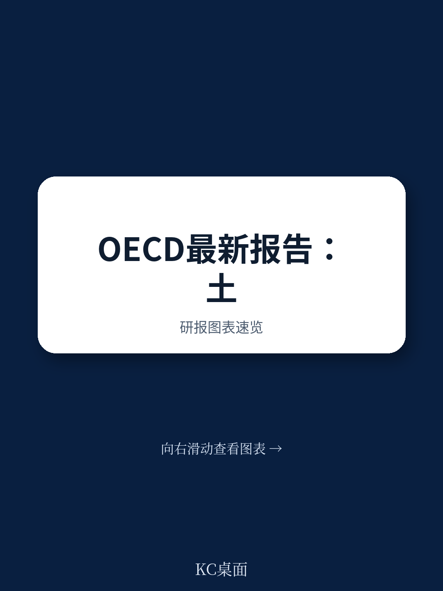
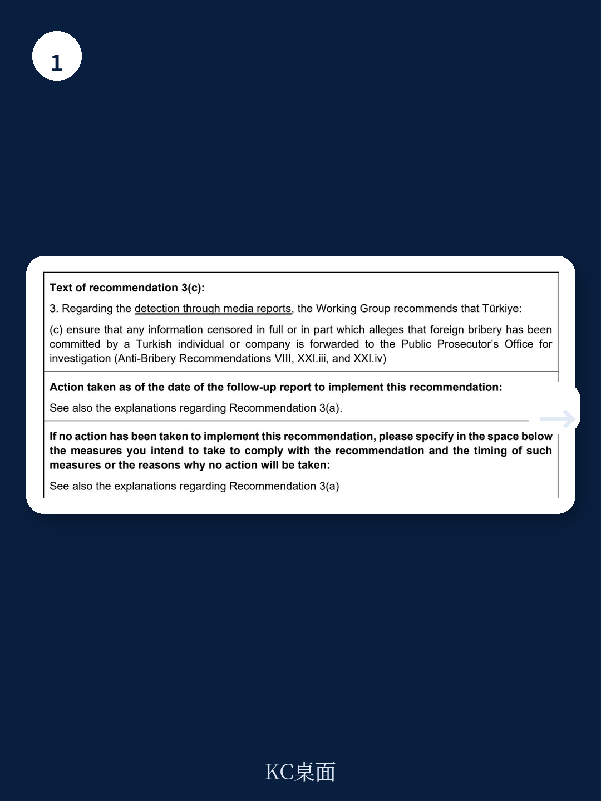
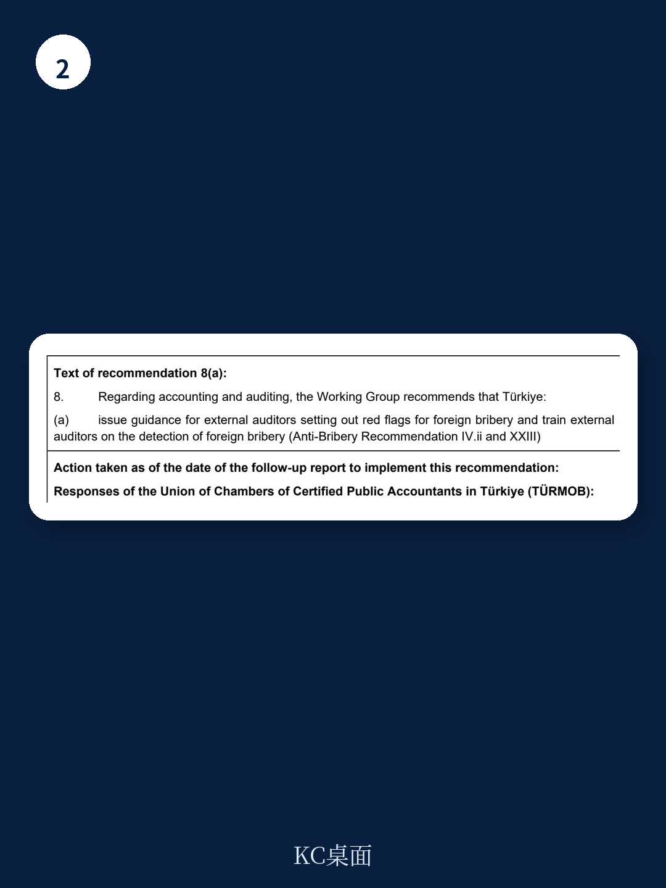

# 经合组织：跨国企业在土耳其面临被低估的法律不确定性

一份来自经合组织的最新跟进报告揭示了土耳其反海外贿赂体系中的一个尖锐矛盾：政府持续做出改革承诺，但实际执行进展却几近停滞。在2024年第四轮评估提出的71项建议中，土耳其仅完全落实了10项，仍有49项未采取任何实质性行动。这是该工作组自2007年以来反复敦促却始终未见突破的领域。

报告的核心判断是：土耳其的反海外贿赂制度正面临“制度性执行赤字”——立法承诺与执法实践之间的差距不仅没有缩小，反而在关键领域进一步扩大。对于任何在土耳其有业务布局或与土耳其企业有跨境合作的公司而言，这意味着一项被低估的法律不确定性敞口依然存在，且短期内看不到系统性改善的信号。

## 1. 三大优先建议全部落空，制度堵点集中在三个领域

工作组明确将三项建议列为最高优先级，但土耳其在这三个方向上的进展均为零。首先是吹哨人保护立法。自2007年工作组首次提出以来，土耳其政府做出过一系列承诺——2021年成立专门委员会、2022年劳动与社会保障部介入、2024年总统府牵头成立工作组——但至今没有一部草案进入立法程序。报告指出，土耳其还计划在立法通过后才开展吹哨意识宣传，这让整个机制的建设变得更加遥遥无期。

其次是企业刑事责任条款。土耳其至今未修改法律，未能实现“不依赖自然人定罪即可追究公司责任”的国际标准。这意味着，即使一家土耳其公司在海外行贿行为证据确凿，只要无法证明具体是哪位员工的行为，公司本身就可以免于刑事追责。

第三是海外贿赂指控的及时传递机制。土耳其外交部2025年发布了《打击海外贿赂实施指南》，但这份指南要求外交部仅向司法部报告，而非直接送达检察官办公室。工作组指出，司法部目前仍通过“定义模糊的正式告发程序”传递信息，这已被多次证实是信息共享的障碍。

> **KC评论：** 这三项制度堵点叠加的结果是，土耳其的海外贿赂执法系统从“发现线索”到“启动调查”的链条几乎断裂。对于跨国企业而言，如果其土耳其合作方涉及海外贿赂，调查启动的时滞可能长达数年，期间相关证据可能已经灭失或转移。

## 2. 执法层面：零定罪、零新案件、零专门机构

报告中最令人担忧的部分在于执法实践。在第四轮评估时，工作组已发现土耳其对23起已知海外贿赂指控中近三分之二未开展调查。而在此后的两年中，土耳其没有启动任何新的调查或起诉，包括工作组在此期间发现的3起新增指控。至今，土耳其没有一起海外贿赂定罪案例。

更值得关注的是，土耳其仍未指定一个专门负责海外贿赂执法的检察机构。工作组将此列为最高优先事项，但土耳其的回应中没有任何实质性的机构调整计划。这意味着，即使有指控进入司法系统，也没有一个团队具备处理这类跨境案件的专门经验和资源。

对于在土耳其运营的外国公司而言，这种执法真空带来的不是“低不确定性”，而是“不可预测的不确定性”。当执法是零散且无规律的，合规投入的回报就变得难以量化，企业难以判断自己是否处于灰色地带。

## 3. 报告尚未回答的关键问题：国内媒体监控如何破局？

工作组建议土耳其要求检察机关监控国内外媒体中的海外贿赂指控。土耳其的回应是：所有检察官都已依职权监控国内媒体。但工作组指出，这在其第四轮评估时就已经存在，问题在于没有专门指示检察官关注海外贿赂线索。土耳其提出的修正案草案只要求监控国际媒体，国内媒体仍处于“泛泛监控”而非“专项筛查”的状态。

这里存在一个未解的结构性矛盾：如果国内媒体是海外贿赂线索的重要来源，而检察机关又没有专项筛查机制，那么大量线索可能被淹没在日常信息流中。工作组反复强调，只有颁布的法律才能被纳入评估，而土耳其至今没有拿出任何立法成果。

## 4. 给跨国企业的观察框架：从“合规投入”转向“不确定性情景测试”

这份报告的价值不在于提供新的合规要求，而在于揭示了土耳其执法体系的真实运作逻辑。对于在土耳其有直接业务、或通过土耳其中间商进行海外交易的公司，建议关注三个层面

第一，不要依赖土耳其国内执法作为不确定性缓冲。零定罪和零新案件的现实意味着，海外贿赂不确定性只能通过企业自身的尽职调查来管理。第二，关注土耳其企业在第三国的行为。工作组新发现的3起指控均来自媒体监控，且涉及土耳其个人或公司在海外的不当行为。第三，评估吹哨人机制缺失带来的内部管控漏洞。在没有法律保护的情况下，员工举报海外贿赂的意愿和安全性都存疑，这要求企业建立更强大的内部举报通道和调查能力。

报告没有给出任何乐观的时间表。土耳其的49项未落实建议中，没有一项有明确的立法时间节点。对于跨国企业而言，这意味着土耳其反海外贿赂的制度性不确定性，预计将持续存在至少3至5年。

For informational purposes only. Portions may be generated,translated,summarized,or edited with AI assistance based on source materials and may contain omissions or errors. Please verify independently. This is not investment,legal,tax,accounting,or other professional advice.
