## Trends in Global Value Chains

July 2026

## Trends in Global Value Chains

ISBN 978-92-64-53411-7 (PDF)
ISBN 978-92-64-86232-6 (HTML)

Photo credits: Cover © GE\_4530/Shutterstock.com.

Corrigenda to OECD publications may be found at: https://www.oecd.org/en/publications/support/corrigenda.html.

## Attribution 4.0 International (CC BY 4.0)

This work is made available under the Creative Commons Attribution 4.0 International licence. By using this work, you accept to be bound by the terms of this licence (https://creativecommons.org/licenses/by/4.0/).

Attribution – you must cite the work.

Translations – you must cite the original work, identify changes to the original and add the following text: In the event of any discrepancy between the original work and the translation, only the text of the original work should be considered valid.

Adaptations – you must cite the original work and add the following text: This is an adaptation of an original work by the OECD. The opinions expressed and arguments employed in this adaptation should not be reported as representing the official views of the OECD or of its Member countries.

Third-party material – the licence does not apply to third-party material in the work. If using such material, you are responsible for obtaining permission from the third party and for any claims of infringement.

You must not use the OECD logo, visual identity or cover image without express permission or suggest the OECD endorses your use of the work.

Any dispute arising under this licence shall be settled by arbitration in accordance with the Permanent Court of Arbitration (PCA) Arbitration Rules 2012. The seat of arbitration shall be Paris (France). The number of arbitrators shall be one.

## Acknowledgements

Trends in Global Value Chains was prepared by a team comprising Charles Cadestin, Mattia Cai, Ricardo Chiapin Pechansky, Xue Han, Sébastien Miroudot and Carmen Zürcher from the OECD Trade and Agriculture Directorate. Caitlin Boros, Hilary Gaboriau and Marc Regnier prepared the report for publication and dissemination. Théa Chubinidze provided administrative assistance.

The data presented in this report come from the OECD Previous Year's Prices Inter-Country Input-Output (PYP ICIO) tables, OECD Analytical Activities of Multinational Enterprises (AMNE) database and its derived Trade in Value-Added indicators for services by mode of supply (TiVA-MoS). These datasets are constructed by the OECD Trade and Agriculture Directorate and build on the OECD Inter-Country Input-Output tables developed by the OECD Directorate for Science, Technology and Innovation (Norihiko Yamano, Agnès Cimper, Eleanor Keeble, Rodrigo Pazos, Akash Kohli and Colin Webb) with inputs from the Statistics and Data Directorate (Catherine La Rosa, Ambra de Bayser, Israel Guttierrez, Frederic Parrot and Katia Sarrazin).

## Table of contents

Acknowledgements 3
Abbreviations and acronyms 6
Key findings 7
1 Measuring global value chains in an era of reconfiguration 8
2 Key trends in GVCs in nominal and real terms 10
Trade via global value chains has reached historical highs in 2024 in real terms 10
Industries differ markedly in their reliance on trade via GVCs, with some remaining highly globally integrated 12
Most economies rely more on foreign inputs in 2024 than in 2011, although patterns differ widely 13
Post-pandemic changes in global value chain participation reflect shifts in sourcing and production structures 16
Gross and value-added trade point to different bilateral dynamics among major economies 18
3 Key trends in multinational production 19
Multinational production is comparable in scale to world trade 19
Multinational enterprises are disproportionately important in trade 20
The location and ownership of foreign affiliate production remain unevenly distributed 21
Foreign-owned firms are more internationally embedded than domestic-owned firms 23
Foreign affiliates matter most in manufacturing and selected services 25
4 Key trends in services trade by mode of supply 26
International trade in services is growing faster than trade in goods 26
Mode 3 remains the largest channel of international services supply 27
Different services industries rely on different modes of supply 28
Services global value chain participation differs across countries and modes of supply 29
Manufacturing exports embody substantial services content, including through Mode 3 30
Domestic consumption of services involves a different mix of modes of supply across countries 32
5 Implications: Towards a more nuanced assessment of supply chain trends 34
6 About the GVC datasets presented in this report 35
The OECD PYP ICIO dataset 35
The Analytical AMNE database 36

The Trade in Value Added Indicators for Services by Mode of Supply (TiVA-MoS) database 37
Interpreting input-output-based GVC indicators: Key caveats and limitations 38
Annex A. Projection of ICIO tables in current and previous year's prices 40
Glossary 42
References 43
Notes 45

## FIGURES

Figure 2.1. Trade via global value chains has reached historical highs in the post-pandemic period in real terms 11
Figure 2.2. Commodity price swings distort nominal measures of trade via GVCs 12
Figure 2.3. Industries differ markedly in their reliance on trade via GVCs 13
Figure 2.4. Most economies have become more reliant on foreign value added in their exports 15
Figure 2.5. Post-pandemic increases in GVC participation reflect structural change more than greater foreign sourcing 17
Figure 2.6. Value-added linkages among major economies persist beyond direct bilateral trade 18
Figure 3.1. Multinational production is comparable in scale to world trade 20
Figure 3.2. Multinational enterprises account for a disproportionate share of world trade 21
Figure 3.3. Foreign affiliate production remains concentrated in a small group of host and parent economies 22
Figure 3.4. The geography of multinational production is becoming more diversified 23
Figure 3.5. Foreign-owned firms are more internationally embedded but remain closely linked to domestic suppliers 24
Figure 3.6. Foreign affiliates matter most in manufacturing and selected services 25
Figure 4.1. International trade in services is growing faster than trade in goods 27
Figure 4.2. Commercial presence is the largest channel for supplying services internationally 28
Figure 4.3. The dominant mode of international supply differs sharply across services industries 29
Figure 4.4. Services GVC participation depends on both cross-border trade and foreign affiliate activity 30
Figure 4.5. Foreign services make a substantial contribution to manufacturing exports 31
Figure 4.6. Countries rely on markedly different modes to meet domestic demand for foreign services 32

## Abbreviations and acronyms

AMNE Activity of Multinational Enterprises
ARIMA Autoregressive Integrated Moving Average
BOP Balance of Payments
FATS Foreign AffiliaTes Statistics
FDI Foreign Direct Investment
FIGARO Full International and Global Accounts for Research in input-Output analysis
GATS General Agreement on Trade in Services
GRAS Generalised RAS
GVC Global Value Chain
ICIO Inter-Country Input-Output
ICT Information and Communication Technology
IMF International Monetary Fund
IT Information Technology
KLEMS Capital (K), Labour (L), Energy (E), Materials (M) and Services (S)
MNE Multinational Enterprise
OECD Organisation for Economic Co-operation and Development
PYP Previous Year's Prices
USD United States Dollar
STAN SStructural ANalysis
SUT Supply-Use Table
TEC Trade by Enterprise Characteristics
TiVA Trade in Value Added
TiVA-MoS Trade in Value Added for services by Mode of Supply
MOS Mode Of Supply
UN United Nations
UN AMA United Nations Analysis of Main Aggregates
VA Value Added
WIOD World Input-Output Database

## Key findings

\- Trade via global value chains (GVCs) has reached historical highs in 2024. Its share in global GDP remained stable at around 17% in real terms between 2022 and 2024 (i.e. adjusted for inflation), up from about 16% in 2008, prior to the Global Financial Crisis.

\- Sectors have responded differently to changes in global trade and trade policy, with some increasing and others reducing their reliance on imported inputs between 2011 and 2024. Trade via GVCs remained particularly high in manufacturing and transport-related industries. The manufacture of coke and refined petroleum products was the sector relying most on trade via GVCs at both the beginning and end of the period. The motor vehicles industry reduced its reliance on imported inputs between 2011 and 2024, falling from $6^{\text{th}}$ place in 2011 to $10^{\text{th}}$ by 2024. By contrast, the pharmaceutical industry became more globally integrated over the same period.

\- Participation in global value chains has increased in most economies. In 2024, 49 of 80 economies covered in the report recorded a higher foreign value-added (VA) share in exports than in 2011. In the post-pandemic period, changes in the structure and composition of GVCs also contributed to higher levels of foreign VA in trade.

\- Multinational enterprises (MNEs) play a central role in GVCs. Domestic MNEs and their foreign affiliates established abroad together account for more than half of world exports. Around 85% of foreign affiliate production is in the hands of OECD-headquartered MNEs.

\- Foreign affiliate production is comparable in scale to world trade. In 2023, the gross output of foreign affiliates reached about USD 25.6 trillion, only slightly lower than the total value of world trade in goods and cross-border trade in services (USD 26.6 trillion). This represents one quarter of global GDP. Together, trade and foreign affiliate production account for $45\%$ of global GDP (removing the double counting corresponding to exports of foreign affiliates).

\- Foreign affiliate activity is concentrated in manufacturing and selected services such as finance, information and communication and business services.

\- Services are a growing dimension of GVCs. Between 2011 and 2023, services trade grew faster than goods trade, whether measured through cross-border supply or the sales of foreign affiliates (i.e. services supplied through commercial presence). Adding cross-border trade and foreign affiliate activity, trade in services accounts for 21% of global GDP (removing the double counting corresponding to exports of foreign affiliates).

1

# Measuring global value chains in an era of reconfiguration

In a context of changing trade policy patterns and increased frequency of shocks to international supply chains, it is increasingly important for policymakers to understand where value is created, where vulnerabilities arise, how shocks travel through production networks and how firms reorganise when confronted with geopolitical tensions, price volatility, technological change and new policy priorities.

The OECD Trade in Value Added (TiVA) initiative has helped policymakers better understand these questions for more than a decade. Building on inter-country input-output tables $^{1}$ , TiVA indicators show that exports are not only final products sold abroad. They also embody foreign inputs, domestic value added used in other countries and services that support production, logistics, finance, design, distribution and after-sales activities. This makes value-added data essential for understanding modern trade, including because they make it possible to identify which countries are positioned upstream or downstream within global supply chains.

Trends in Global Value Chains introduces three complementary datasets that facilitate a thorough understanding of how global production is organised.

The first is the OECD Previous Year's Prices Inter-Country Input-Output database (OECD PYP ICIO). It allows GVC indicators to be analysed in real terms, making it possible to distinguish changes in prices from changes in volumes. This is essential in the current inflationary environment.

The second is the OECD Analytical Activities of Multinational Enterprises database (Analytical AMNE). GVCs are not organised only through trade. A large part of international integration takes place through firms that establish affiliates abroad, transfer knowledge and technology within corporate networks, and combine production, trade and investment across jurisdictions. Ownership-based indicators make this dimension of global production visible. $^{2}$

The third is a new set of TiVA indicators for services by mode of supply (TiVA-MoS), derived from the Analytical AMNE database. Services are a central component of GVCs. They are traded across borders, embedded in goods, supplied digitally, and delivered through affiliates established abroad. New indicators presented in this report provide a comprehensive picture of how services are supplied internationally, including through commercial presence abroad.

These three datasets respond to a common policy need: to better understand GVCs at a time when they are under pressure and undergoing change. Taken together, they provide a comprehensive view of how economies participate in GVCs. They provide tools for identifying exposure to foreign inputs, assessing the domestic value generated by exports, analysing the role of multinational enterprises, and measuring the international supply of services more comprehensively. These tools can inform policies on trade, investment, industrial development, services regulation, economic security and supply chain resilience.

The value of these datasets also lies in their international comparability. GVCs are, by definition, cross-border phenomena. No single country can fully understand its position in production networks using national data alone. Comparable OECD datasets allow governments to benchmark their economies, identify sectoral patterns, assess bilateral and regional linkages, and understand how domestic policies interact with global production structures. They also provide a common statistical foundation for international dialogue.

# 2 Key trends in GVCs in nominal and real terms

The years since the COVID-19 pandemic have renewed policy attention to the resilience and reconfiguration of GVCs. Supply disruptions, logistics bottlenecks, geopolitical tensions and sharp movements in energy and commodity prices have all contributed to a perception that international production networks are becoming more fragile and less global. Nevertheless, GVCs have not disappeared, nor has there been a uniform retreat from international sourcing (Jaax, Miroudot and van Lieshout, 2023[1]; OECD, 2025[2]; Altman and Bastian, 2026[3]).

## Trade via global value chains has reached historical highs in 2024 in real terms

Figure 2.1 compares the evolution of total trade in goods and services and trade in intermediate goods and services (the products traded within GVCs) between 1995 and 2024 in current prices and in real terms, as a percentage of world GDP. $^{3}$ The distinction between current prices and real indicators is particularly important because the post-pandemic period was a period of high inflation and large relative price shocks. In such an environment, nominal trade values can rise or fall because prices have changed, not because firms have fundamentally reorganised production.

The OECD PYP ICIO dataset directly addresses this measurement challenge. It provides ICIO tables both in current prices and in previous year's prices, allowing indicators to be constructed in nominal terms and in chain-linked volume terms. In addition, the PYP dataset includes projections $^{4}$ to look at more recent years (2024 in the 2026 edition).

Before the global financial crisis, both nominal and real measures show a strong increase in trade via GVCs, confirming their rapid expansion during the period of “hyperglobalisation” (Subramanian and Kessler, 2014[4]). After 2011, however, the two series diverge: the current price indicator suggests a more pronounced decline, while the real indicator points instead to a stabilisation of trade via GVCs at a historically high level.

This divergence becomes especially important after the COVID-19 pandemic. In current prices, trade via GVCs increased sharply in 2021 and 2022, partly reflecting the surge in prices for imported intermediate inputs, especially energy and commodities (see Box 2.1). The current price indicator declined in 2023 and 2024. However, in real terms, trade via GVCs remained high, close to its 2022 peak, at about 17%. The volume-based indicator suggests that, despite pandemic-related disruptions and geopolitical tensions, world production continued to rely heavily on foreign intermediate inputs. In 2024, total trade accounts for about 31% of world GDP in real terms, as compared to 17% for trade via GVCs. A significant share of total trade is thus related to activities of firms within GVCs, importing intermediate inputs to produce final goods and services. While total trade in real terms has slightly declined since 2022, it is not the case for trade via GVCs.

Figure 2.1. Trade via global value chains has reached historical highs in the post-pandemic period in real terms

Total trade and trade via GVCs in nominal and real terms, 1995-2024, as a percentage of world GDP

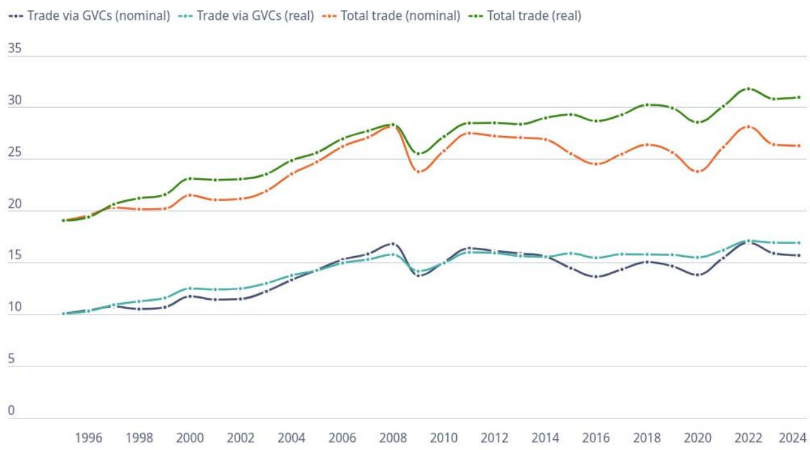  
Note: Total trade measures world gross trade flows of goods and services, while trade via GVCs is the sum of gross trade flows of intermediate goods and services. Data in real terms are obtained by chain-linking the indicator with its current and PYP values (chain volume measure) with 1995 as reference year.  
Source: calculations based on OECD PYP ICIO dataset, 2026 edition.

## Box 2.1. Commodities price fluctuations and their impact on GVC measurement

The relationship between trade via GVCs in current prices and the price of commodities (including both fuel and non-fuel) can be understood by looking at Figure 2.2. Trade via GVCs in current prices (right scale) tends to follow the fluctuations of the IMF all commodities price index.

When there is a drop in prices of raw materials (as during the Global Financial Crisis in 2008-2009 or in the mid-2010s), trade via GVCs is going down. When there is a surge in prices of commodities (as during the COVID-19 period), the indicator is increasing.

Figure 2.2. Commodity price swings distort nominal measures of trade via GVCs

Commodity price index, 2016 = 100; trade via GVCs as a percentage of gross output (right scale)  
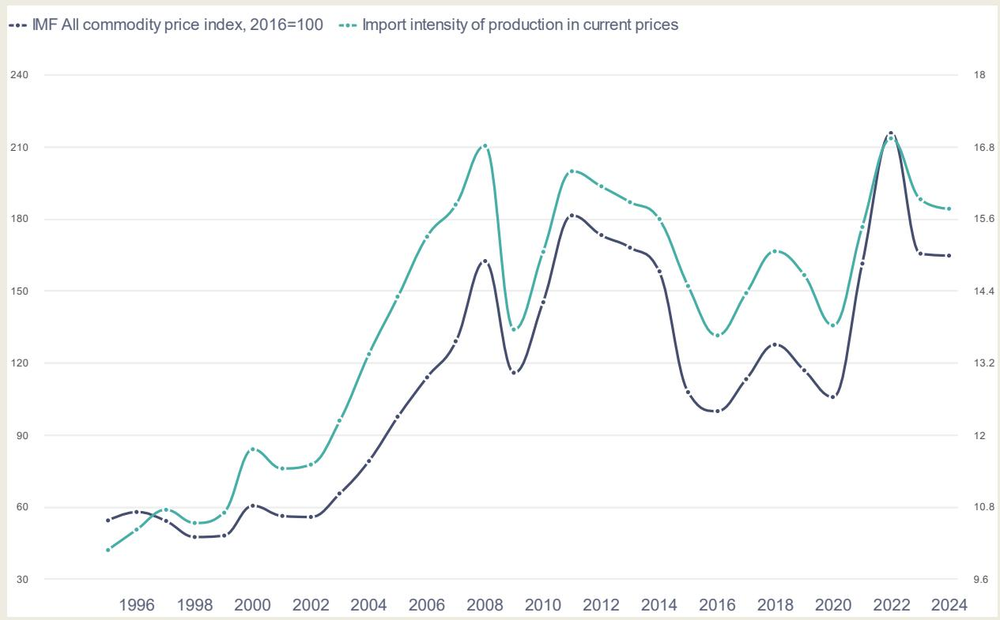  
Source: IMF Primary Commodity Price System, March 2026 update and OECD PYP ICIO dataset, 2026 edition.

## Industries differ markedly in their reliance on trade via GVCs, with some remaining highly globally integrated

The aggregate stability of trade via GVCs in real terms masks important differences across industries. Figure 2.3 compares trade via GVCs by industry in 2011 on x-axis and 2024 on y-axis in real terms. Industries above the 45-degree line are those where production has become more import intensive, while industries below the line record a decline in the foreign input content of production. This sectoral perspective complements the aggregate evidence from Figure 2.1 and shows that notwithstanding the series of supply chain disruptions and trade policy changes witnessed since the Global Financial Crisis, certain sectors increase their global integration.

The industries with the highest trade via GVCs in 2024 remain concentrated in manufacturing and transport-related activities. Coke and petroleum products, water transport, air transport, ICT and electronics, rubber and plastics, chemicals, basic metals and motor vehicles all record values above 35% of gross output. These sectors typically rely on internationally traded inputs, specialised components, energy-related products or cross-border logistics services. Their position in the upper part of the chart confirms that, even after the pandemic and recent geopolitical shocks, several core GVC industries continue to rely significantly on foreign intermediate inputs.

That said, trade via GVCs in the motor vehicle sector declined over the observation period. Whereas it was the $6^{th}$ most internationalised sector in 2011, it slipped to the $10^{th}$ place in 2024 and was overtaken by chemicals, air transport and electronic equipment.

Over the period 2011-24, trade via GVCs increased most visibly in air transport, warehousing, pharmaceuticals, electricity, rubber and plastics, recreation, non-metallic minerals, paper and printing, IT services and postal services. The increase in pharmaceuticals is notable in the context of recent policy attention to medical supply chains: despite discussions on increasing domestic capacity, the sector's production has become more internationally input-intensive in real terms. The increase in logistics-related activities such as air transport and warehousing also points to the continuing importance of internationally connected services in supporting production networks.

By contrast, several sectors moved below the 45-degree line. The largest declines are observed in coke and petroleum products, water transport, basic metals, energy mining, fabricated metals and mining services.

## Figure 2.3. Industries differ markedly in their reliance on trade via GVCs

Trade via GVCs by industry, 2011 and 2024, as a percentage of industry's gross output

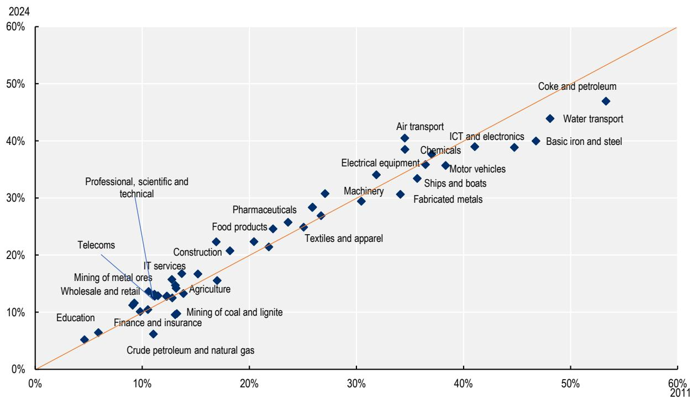  
Note: Industries above the 45-degree line are those where production became more import intensive in 2024 compared to 2011, while industries below the line record a decline in the foreign input content of production.
Source: calculations based on OECD PYP ICIO dataset, 2026 edition.

## Most economies rely more on foreign inputs in 2024 than in 2011, although patterns differ widely

Figure 2.4 presents backward and forward GVC participation rates for OECD and G20 economies, comparing 2011 and 2024. While backward GVC participation measures the share of foreign value added embodied in a country's exports, forward GVC participation measures the share of domestic value added used as an input in other countries' exports. Taken together, the two panels provide a comprehensive picture of how deeply economies are embedded in international production, both as buyers and as sellers of intermediate inputs.

Across the full sample, backward participation rates are generally higher than forward participation rates, reflecting the fact that most economies are more deeply integrated as assemblers of imported inputs than as upstream suppliers to others. The dominant pattern between 2011 and 2024 is one of broad-based increase on the backward side: the majority of economies record a higher share of foreign value added in their exports in 2024 than in 2011. The forward side presents a more heterogeneous picture, with some economies — particularly commodity exporters and upstream producers — maintaining or slightly expanding their role as value-added suppliers to third-country exporters, while others record declines comparable in magnitude to those observed on the backward side.

Several country-level patterns are worth highlighting. Luxembourg records the highest backward participation in the sample in both years, a reflection of its position as a small, highly open economy deeply integrated into cross-border financial and business services value chains. At the other end of the size spectrum, large economies such as the United States, the People's Republic of China (hereafter "China") and Brazil display among the lowest backward participation rates, consistent with their more self-sufficient production structures and greater reliance on domestic intermediate inputs. On the forward side, Kazakhstan and Norway stand out with among the highest forward GVC participation rates in 2024, driven by their upstream roles as major energy exporters whose domestic VA feeds extensively into the production processes of partner economies.

China's decrease in backward participation between 2011 and 2024 may be reflecting a well-documented shift toward greater domestic value chain development. However, this decrease in 1.8 percentage points is smaller than that for current-price statistics (3.3 percentage points). This could partly reflect the end of the commodity boom cycle, whose price effects may overestimate the extent to which backward GVC participation has decreased in emerging markets like China.

Figure 2.4. Most economies have become more reliant on foreign value added in their exports

GVC participation by country, OECD and G20 economies, 2011 and 2024, as a percentage of gross exports  
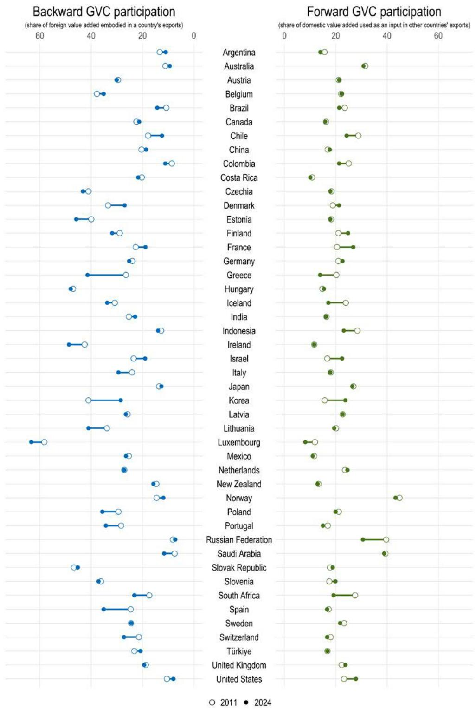  
Note: Backward GVC participation is calculated as the share of foreign value added in the country's exports. Forward GVC participation is calculated as the share of domestic value added in other countries' exports. Values are expressed in percentages. Volume series are chain-linked using the Laspeyres method, referenced to 2011. The European Union and African Union are not included.
Source: calculations based on OECD PYP ICIO dataset, 2026 edition.

## Post-pandemic changes in global value chain participation reflect shifts in sourcing and production structures

Changes in the foreign VA content of exports can come from several sources. Firms may change where they buy inputs. They may also change what types of inputs they use, how much VA is generated domestically, or which product they export. Figure 2.5 separates these channels $^{5}$ for China, Japan, the United States and the European Union, comparing the pre-pandemic period, 2011-19, with the pandemic and post-pandemic period, 2019-24.

The main finding is that the post-pandemic increase in foreign VA embodied in exports was not mainly driven by a general shift towards more foreign sourcing. Between 2019 and 2024, foreign VA shares increased in all four economies shown. However, changes in input sourcing made a negative contribution in all four cases. This suggests that, at the margin, firms or sectors were not simply switching towards more foreign suppliers.

Instead, the increase came mainly from changes in production structures and export composition. In other words, economies exported more of the products and activities that tend to embody foreign VA, or they used technologies and input combinations that rely more on internationally produced inputs. It shows that GVC participation can rise even when some firms are trying to reduce foreign sourcing in specific areas. Structural changes in what economies produce and export can offset changes in sourcing behaviour.

Before the pandemic, the patterns were more differentiated. Between 2011 and 2019, China and the United States recorded declines in the foreign VA content of exports, while the European Union recorded an increase and Japan remained broadly stable. In China, the decline was mainly associated with sourcing changes, consistent with the development of domestic supplier capabilities. In the European Union, the increase reflected continued integration in cross-border production networks and changes in export composition.

Figure 2.5. Post-pandemic increases in GVC participation reflect structural change more than greater foreign sourcing

Percentage-point contributions to the change in backward GVC participation between 2011 and 2019 (pre-COVID-19) and between 2019 and 2024 (COVID-19 and post-pandemic period), main economies

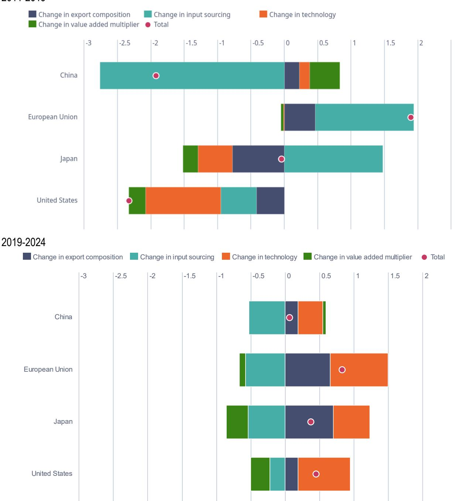

Note: The overall change in the backward GVC participation indicator is decomposed into contributions from changes in technology, input sourcing, value-added multipliers and export composition. Changes in technology and input sourcing are derived from a decomposition of the global Leontief inverse: changes in the industry mix of intermediate inputs are used as a proxy for technology, while changes in intermediate trade flows across countries capture shifts in input sourcing. The value-added component refers to changes in the share of value added in gross output. Export composition refers to changes in the industry composition of a country's gross exports. The left panel refers to changes over the pre-pandemic period, 2011-2019; the right panel refers to changes between 2019 and 2024, covering the pandemic and subsequent economic disruptions.

Source: calculations based on OECD PYP ICIO dataset, 2026 edition.

## Gross and value-added trade point to different bilateral dynamics among major economies

Gross exports capture the value of direct shipments between two economies, while VA exports capture the domestic value ultimately embodied in partner demand, including through indirect routes via third economies. A widening gap between the two series can point to changes in the role of “connector” economies that intermediate trade and production linkages across major markets.

Figure 2.6 compares bilateral manufacturing exports among China, the European Union and the United States in gross and VA terms, in real terms and indexed to 2011. The Figure highlights that bilateral GVC linkages among the three major economies remain substantial, but their configuration has changed. China's manufacturing exports to the European Union increased most strongly, with both gross and VA exports reaching about 2.2 times their 2011 level by 2024. China's exports to the United States also increased, but with value-added exports rising faster than gross exports. This suggests that Chinese domestic VA has continued to reach US demand, including potentially through indirect production and trade channels.

Figure 2.6. Value-added linkages among major economies persist beyond direct bilateral trade

Manufacturing gross and value-added exports in real terms, 2011-2024, index 2011=100

China gross trade China VA trade European Union gross trade European Union VA trade United States gross trade United States VA trade

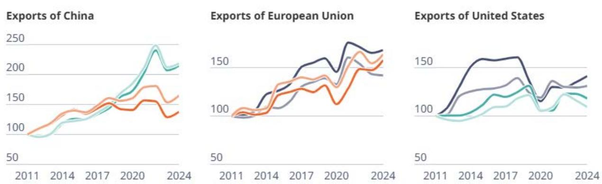  
Note: Value-added trade flows are calculated based on final demand, as in Johnson and Noguera (2012[5]). Source: calculations based on OECD PYP ICIO dataset, 2026 edition.

For the European Union, manufacturing exports to China and the United States also expanded, but gross and VA measures do not always move in parallel. EU gross exports to China increased more rapidly than EU VA exports, suggesting a larger role for foreign inputs embodied in EU shipments or changes in export composition. By contrast, EU exports to the United States show a smaller gap, with VA exports growing broadly in line with gross exports.

The United States shows more subdued dynamics. US manufacturing exports to China remain above their 2011 level in both gross and VA terms, but the increase is smaller than for China's exports to either major partner. By 2024, US gross exports to the European Union were only moderately above their 2011 level, while US VA exports were close to their starting point.

Overall, Figure 2.6 shows that changes in bilateral gross trade do not necessarily mean that underlying interdependence has fallen. Value added can continue to move through indirect channels, especially when connector economies become more important in production and trade. Connector economies are countries that assemble, process, re-export or embed foreign inputs into their own exports. This is particularly relevant in a context of geopolitical tensions, trade policy changes and efforts by firms to reorganise supply chains.

3

# Key trends in multinational production

A complete assessment of global value chains requires looking beyond trade flows alone. International production networks are not only organised through arm's-length transactions between firms located in different countries; they are also shaped by MNEs that establish affiliates abroad, source inputs across borders, transfer technology and intangible assets within firm networks, and combine local production with international sales. This is particularly important in the post-pandemic period. While discussions on supply chain resilience often focus on trade disruptions, transport bottlenecks or the sourcing of critical inputs, multinational production (i.e. the production of firms outside of their country of origin) provides an additional channel through which firms manage risks, diversify locations, maintain market access and reorganise production in response to shocks.

The OECD Analytical AMNE database is designed to capture this dimension of globalisation. It extends the OECD ICIO framework by introducing an ownership split between domestic-owned and foreign-owned firms, and, for some indicators, by distinguishing domestic MNEs from non-MNEs. This makes it possible to assess not only where value added is produced and traded, but also which type of firm is responsible for production, exports, imports of intermediates and value creation (Cadestin et al., 2018[6]).

## Multinational production is comparable in scale to world trade

Multinational production is a major channel of international integration in its own right. Figure 3.1 shows the evolution of the world gross output of foreign affiliates between 2000 and 2023 (multinational production), compared with world trade in goods and services. There is an overlap between the two that corresponds to exports of foreign affiliates (about 28% of the production of foreign affiliates is exported, while the rest goes to domestic sales in the host economy). In 2023, the gross output of foreign affiliates reached about USD 25.6 trillion (including the overlap with trade), equivalent to 25% of world GDP. This is a bit lower but comparable with world trade in goods and services (estimated at USD 26.6 trillion in the TiVA framework). This comparison highlights that foreign affiliate production is not a secondary channel of internationalisation. It is a major form of global economic integration, comparable in magnitude to international trade. Together, world trade and production of foreign affiliates account for 45% of global GDP (removing the overlap between the two).

The post-pandemic period shows both the resilience and the cyclical sensitivity of multinational production. The gross output of foreign affiliates (in nominal terms) fell from USD 20.2 trillion in 2019 to USD 18.8 trillion in 2020, reflecting the contraction in global activity during the COVID-19 shock. It then recovered rapidly, reaching USD 21.9 trillion in 2021 and USD 25.0 trillion in 2022. This rebound suggests that multinational production remained an important channel of global integration after the pandemic, even as firms and governments reassessed risks linked to supply chain concentration, geopolitical tensions and strategic dependencies.

Figure 3.1. Multinational production is comparable in scale to world trade  
World trade and production of foreign affiliates in USD trillion (left scale) and change over time (2011=100, right scale), 2000-2024  
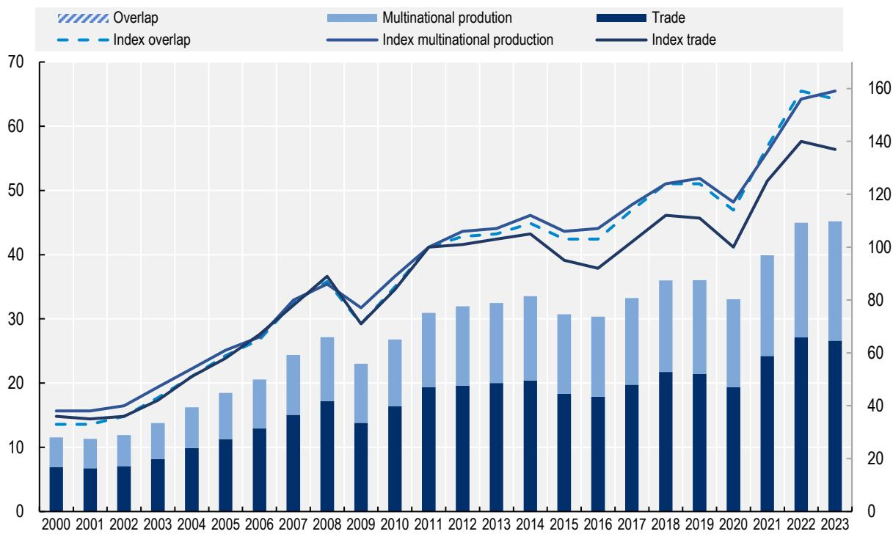

Note: Multinational production is measured as the gross output of foreign affiliates. The overlap between trade and multinational production corresponds to exports of foreign affiliates, as measured in the Analytical AMNE dataset.
Source: calculations based on OECD Analytical AMNE database, 2026 edition.

## Multinational enterprises are disproportionately important in trade

While multinational production measures the activities of MNEs through their foreign affiliates, MNEs also produce in their domestic economy. Figure 3.2 compares the contribution of foreign affiliates, domestic MNEs and non-MNEs to world gross output, exports and imports of intermediate inputs in 2023. The results show that MNEs are much more important in trade than in production. Foreign affiliates account for about 12.3% of world gross output, but for 26.6% of world exports and 23.8% of imports of intermediate inputs. Domestic MNEs show a similar pattern: they account for 23.1% of gross output, but for 33.4% of exports and 29.1% of intermediate imports.

Taken together, foreign affiliates and domestic MNEs account for about one-third of world output, but more than half of world exports. By contrast, non-MNEs account for 64.5% of gross output, but only 40.0% of exports. This confirms the central role of MNEs in international trade and GVC participation. MNEs are not only large producers; they are disproportionately involved in cross-border transactions, both as exporters and as importers of intermediate inputs.

Figure 3.2. Multinational enterprises account for a disproportionate share of world trade
Share of multinational enterprises in gross output and trade, in %  
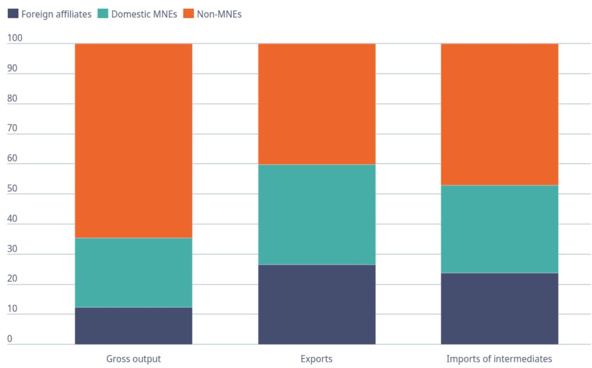  
Source: calculations based on OECD Analytical AMNE database, 2026 edition.

## The location and ownership of foreign affiliate production remain unevenly distributed

The Analytical AMNE database provides a unique lens through which to examine the global footprint of MNEs, enabling the decomposing of world output according to both where foreign affiliates operate and who owns them. Figure 3.3 draws on this framework to present, for 2023, the share of world foreign affiliate output accounted for by the largest host economies (inward) and the largest ownership economies (outward). Together, the two panels reveal the geography of MNE activity across the global economy and highlight the degree to which the ownership and location of international production remain concentrated among a small number of economies.

The United States stands out as a pivotal economy in both dimensions, hosting 17% of world foreign affiliate output while accounting for 23.2% of world outward ownership — the largest shares in both panels by a significant margin. An asymmetry between inward and outward positions is also observed across major European economies. Germany, France, the Netherlands, and Switzerland each record outward ownership shares that exceed their inward host shares, reflecting the global reach of their MNE sectors relative to the foreign affiliate activity they attract domestically. In turn, China presents a contrasting profile: as the world's second-largest host economy with 14.4% of inward foreign affiliate output, it remains a structurally important destination for international production, yet its world outward ownership share of 3.8% is considerably smaller, reflecting decades of inward FDI-led growth.

The OECD and non-OECD breakdown also reveals interesting patterns. On the inward side, non-OECD economies — led by China, Brazil, and a broad range of emerging markets — account for a substantial portion of world foreign affiliate output, reflecting their integration into global production as important host locations. On the outward side, however, non-OECD economies are much less present, with China remaining the only significant exception. This structural asymmetry underscores a trend in trade-based development strategies: while many non-OECD economies have succeeded in attracting FDI and embedding themselves in international production networks, the ownership of that production remains concentrated in OECD headquarter economies.

## Figure 3.3. Foreign affiliate production remains concentrated in a small group of host and parent economies

Production of foreign affiliates by country, inward and outward, 2023

## Inward

Share of world output of foreign affiliates, by host country

<table><tr><td rowspan="3">United States17%</td><td colspan="3">United Kingdom5.9%</td><td colspan="5">Germany5.7%</td><td colspan="3">Canada3.2%</td></tr><tr><td colspan="2">Rest of the World3.1%</td><td colspan="3">France3%</td><td colspan="3">Italy3%</td><td colspan="3">Switzerland2.4%</td></tr><tr><td>Netherlands2.4%</td><td colspan="3">Brazil2.2%</td><td colspan="3">Mexico2%</td><td colspan="2">Poland1.7%</td><td colspan="2">India1.5%</td></tr><tr><td rowspan="6">China14.4%</td><td rowspan="2">Spain2.3%</td><td rowspan="2">Singapore1.5%</td><td colspan="3">Belgium1.1%</td><td colspan="2">Hong Kong1%</td><td colspan="2">Chinese Taipei1%</td><td colspan="2">Austria0.8%</td></tr><tr><td colspan="2">Korea0.8%</td><td colspan="2">Viet Nam0.7%</td><td colspan="2">Malaysia0.7%</td><td colspan="2">Hungary0.7%</td><td>Türkiye0.7%</td></tr><tr><td rowspan="2">Ireland2.3%</td><td>Japan1.4%</td><td colspan="2">Russian Federation0.8%</td><td colspan="2">Luxembourg0.7%</td><td colspan="2">Norway0.6%</td><td colspan="2">Saudi Arabia0.6%</td><td>Denmark0.5%</td></tr><tr><td>Sweden1.1%</td><td colspan="2">Thailand0.7%</td><td colspan="2"></td><td colspan="2"></td><td colspan="2"></td><td></td></tr><tr><td rowspan="2">Australia2.2%</td><td rowspan="2">Czechia1.1%</td><td colspan="2">Romania0.8%</td><td colspan="2">United Arab Emirates0.6%</td><td colspan="2"></td><td colspan="2"></td><td></td></tr><tr><td colspan="2">Indonesia0.8%</td><td colspan="2">Argentina0.6%</td><td colspan="2"></td><td colspan="2"></td><td></td></tr></table>

## Outward

Share of world output of foreign affiliates, by country of ownership

<table><tr><td rowspan="4">United States 23.2%</td><td colspan="2">Japan 7.3%</td><td colspan="5">France 7%</td></tr><tr><td>United Kingdom 5.7%</td><td colspan="3">Korea 5.4%</td><td colspan="3">Switzerland 4.9%</td></tr><tr><td rowspan="2">Netherlands 4.4%</td><td colspan="2">Singapore 2.5%</td><td colspan="2">Spain 1.7%</td><td colspan="2">Rest of the World 1.7%</td></tr><tr><td>Italy 1.6%</td><td colspan="2">Austria 1.1%</td><td colspan="2">Denmark 1%</td><td>Luxembourg 0.9%</td></tr><tr><td rowspan="4">Germany 10.6%</td><td>China 3.8%</td><td>Sweden 1.6%</td><td>Ireland 0.9%</td><td colspan="2">Hong Kong 0.8%</td><td>United Arab Emirates 0.7%</td><td>Belgium 0.7%</td></tr><tr><td rowspan="3">Canada 3.8%</td><td rowspan="3">Chinese Taipei 1.1%</td><td>Saudi Arabia 0.9%</td><td>Finland 0.6%</td><td colspan="2"></td><td></td></tr><tr><td rowspan="2">Australia 0.9%</td><td>Mexico 0.6%</td><td></td><td></td><td></td></tr><tr><td>Norway 0.5%</td><td></td><td></td><td></td></tr></table>

Source: calculations based on OECD Analytical AMNE dataset, 2026 edition.

Figure 3.4 further shows the distribution of foreign affiliate production according to the location of parent firms and host economies in 2011 and 2023. The results indicate that, while foreign affiliate activity remains strongly anchored in OECD economies, its geography has become more diversified over time.

In 2023, foreign affiliates with an OECD parent operating in an OECD host economy generated about 60.9% of global foreign affiliate output. When including the activity of affiliates with an OECD parent in non-

OECD host economies, OECD-based MNEs accounted for nearly 85% of total foreign affiliate output worldwide.

However, this share has declined over time, pointing to the growing importance of non-OECD markets, both as host economies and as sources of MNEs. The share of affiliates with non-OECD parents operating in non-OECD host economies increased significantly, from 4.9% in 2011 to 9.3% in 2023. This is a notable development. A growing share of foreign affiliate production now reflects investment by non-OECD multinationals, including within non-OECD regions. The share of non-OECD parent firms operating in OECD host economies increased more modestly, from 3.8% to 5.0%.

Figure 3.4. The geography of multinational production is becoming more diversified  
Share of OECD and non-OECD countries in the gross output of foreign affiliates, as host and parent economies 2011 and 2023, as a percentage of total output of foreign affiliates  
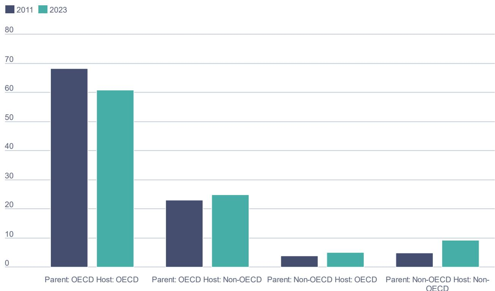  
Source: calculations based on OECD Analytical AMNE dataset, 2026 edition.

## Foreign-owned firms are more internationally embedded than domestic-owned firms

Ownership-based ICIO tables also show how foreign-owned and domestic-owned firms differ in their production structures and sales destinations. Figure 3.5 decomposes production and sales by ownership, comparing domestic-owned and foreign-owned firms. The first part of the chart shows the VA content of gross output. The second part decomposes sales according to whether output is sold domestically or exported, and whether it is used for final demand or as an intermediate input by domestic-owned or foreign-owned firms.

The VA decomposition shows that foreign-owned firms rely more heavily on foreign VA than domestic-owned firms. For domestic-owned firms, own VA accounts for about 49.6% of gross output in 2023, while foreign VA accounts for around 10.9% coming from imported intermediate inputs produced by domestic-owned and foreign-owned firms abroad. For foreign-owned firms, own VA is lower, at 39.4%, while foreign VA is higher, at about 21.6% of gross output (coming from imported intermediate inputs produced by domestic-owned and foreign-owned firms abroad).

Foreign-owned firms also draw substantially on domestic VA. Domestic VA from domestic-owned firms accounts for about 33.2% of their gross output, while domestic VA from other foreign-owned firms accounts for 5.7%. This confirms that foreign affiliates are not isolated enclaves. They combine foreign inputs with domestic suppliers and their own production activities. The contribution of domestic suppliers to foreign-owned firms is important for host economies, because it indicates potential spillovers and linkages between foreign affiliates and local production systems.

Figure 3.5. Foreign-owned firms are more internationally embedded but remain closely linked to domestic suppliers

Origin of value added and destination of gross output, domestic-owned vs. foreign-owned firms, average over all countries and industries, 2023

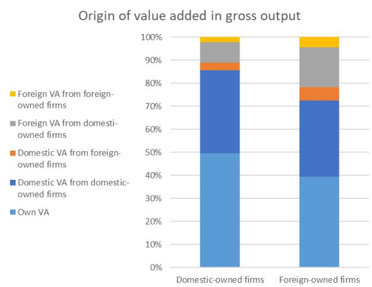

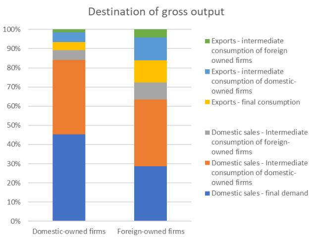  
Note: The origin of VA is obtained from a VA decomposition of output using the global Leontief inverse of the ownership-split ICIO tables in the Analytical AMNE database. Destination of gross output is directly extracted from the ICIO tables and is in gross terms.
Source: $^{1}$ calculations based on OECD Analytical AMNE dataset, 2026 edition.

The sales decomposition reinforces this point. Domestic-owned firms sell a larger share of output to domestic final demand: 45.3% of their sales, compared with 28.7% for foreign-owned firms. Foreign-owned firms, by contrast, are more export-oriented. Exports account for 27.6% of their sales when exports for final consumption and intermediate use are combined, compared with 10.7% for domestic-owned firms. This is consistent with the evidence in Figure 3.2 showing that multinational enterprises account for a disproportionately large share of exports.

Foreign-owned firms are also more involved in intermediate transactions. A sizeable share of their sales is directed to intermediate consumption by domestic-owned firms and other foreign-owned firms, both domestically and abroad. This indicates that foreign affiliates occupy important positions within production networks, supplying inputs to other firms rather than only selling final products.

## Foreign affiliates matter most in manufacturing and selected services

The ownership-based ICIO tables can also provide further insights at the industry level. Figure 3.6 decomposes the VA embodied in final demand across OECD economies by industry and by origin of ownership. It distinguishes three components: VA generated by domestic-owned firms operating in the domestic economy, VA generated by foreign-owned firms established domestically, and VA sourced from abroad. This decomposition extends standard TiVA analysis by separating the contribution of foreign affiliates operating within the domestic economy from foreign VA embodied through cross-border supply chains.

Across the OECD as a whole, domestic-owned VA accounts for the large majority of final demand, with the foreign-owned domestic component and cross-border foreign VA each representing comparatively modest shares. This aggregate picture, however, conceals substantial sectoral heterogeneity. In manufacturing, the foreign-owned domestic component is markedly more prominent than in services. Within manufacturing, transport equipment, machinery and equipment, and chemicals and pharmaceuticals display particularly elevated combined foreign shares. Mining stands apart with a high foreign-owned domestic share, pointing to the significant role of foreign capital in natural resource extraction.

Across most services activities, domestic-owned VA is overwhelmingly dominant. Nevertheless, this is mainly due to lower shares of foreign VA, which reveals a stronger relative importance of commercial presence (foreign-owned VA) compared to cross-border trade (foreign VA). In this context, the sector of finance and insurance stands out, presenting the highest share of foreign-owned VA across all reported OECD services sectors.

Figure 3.6. Foreign affiliates matter most in manufacturing and selected services

Decomposition of final demand by origin of value added, by industry, OECD average in 2023, as a percentage of total final demand

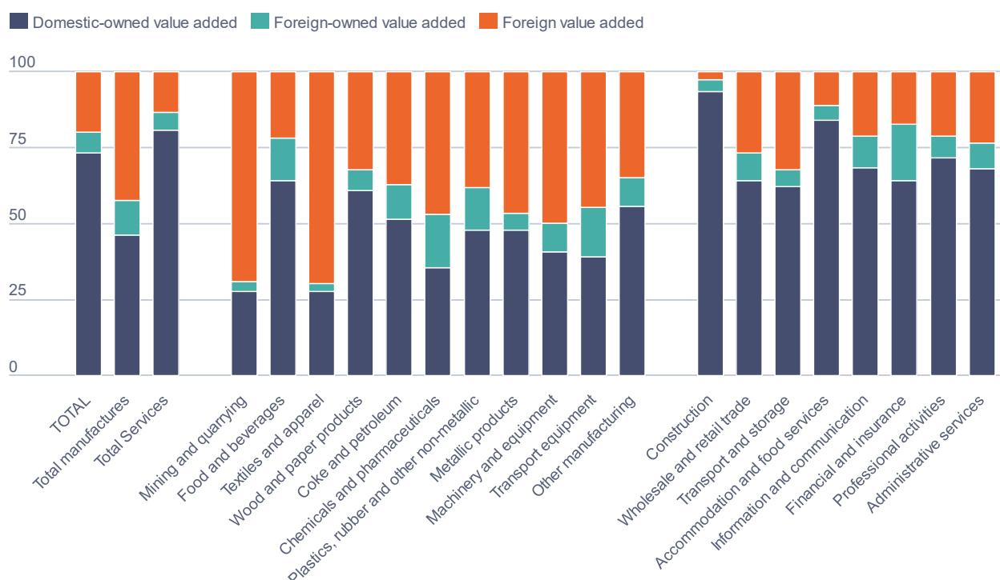  
Note: OECD aggregate represents a weighted average of OECD countries, by size of final demand. Source: calculations based on OECD Analytical AMNE dataset, 2026 edition.

# 4 Key trends in services trade by mode of supply

International integration is no longer driven only by the shipment of goods across borders, but increasingly by the ability of firms to deliver, source and combine services across countries. Business services, finance, telecommunications, transport, logistics, professional services and intellectual property related activities are now essential inputs into production and trade (Francois and Hoekman, 2010[7]; Miroudot and Cadestin, 2017[8]). Digitalisation has further accelerated this transformation. Improvements in data infrastructure, cloud computing, digital platforms, remote delivery technologies and artificial intelligence have expanded the range of services that can be traded internationally without the physical movement of either suppliers or consumers (López González, Sorescu and Kaynak, 2023[9]).

At the same time, the internationalisation of services extends beyond cross-border digital delivery. Many services continue to require proximity to customers, regulatory authorisation, local knowledge or a commercial presence in the destination market. For this reason, the supply of services through foreign affiliates is a critical component of global services trade. Measuring services trade therefore requires going beyond conventional cross-border transactions to capture the full range of ways in which firms serve foreign markets.

The OECD Trade in Value Added Indicators for Services by Mode of Supply (TiVA-MoS) dataset provides a comprehensive framework to analyse these developments by distinguishing the four modes defined in the WTO General Agreement on Trade in Services (GATS). Mode 1 refers to cross-border supply, when services are supplied from one economy into another, for example through digital delivery, telecommunications or transport networks. Mode 2 captures consumption abroad, such as tourism, education or health services consumed by residents of one economy while physically present in another. Mode 3 captures services supplied through commercial presence, when a firm supplies a service through an affiliate established in the foreign market. Mode 4 refers to the temporary movement of natural persons to supply a service abroad. The distinction matter because Modes 1, 2 and 4 are usually recorded through balance-of-payments statistics, while Mode 3 requires information on foreign affiliates.

## International trade in services is growing faster than trade in goods

Services trade has expanded more rapidly than goods trade. Figure 4.1 highlights a structural shift in the composition and dynamism of international trade. While trade in goods remains the largest component of gross trade flows, trade in services has become the more dynamic margin of globalisation. This is consistent with the increasing tradability of knowledge-intensive, digitally deliverable and business-support services, as well as with the growing role of services as intermediate inputs in global production.

In cumulative terms, services trade expanded by about 64% between 2011 and 2023, compared with about 26% for goods trade. The difference is particularly visible after the mid-2010s, when goods trade weakened while both cross-border services and Mode 3 services continued to expand.

Figure 4.1. International trade in services is growing faster than trade in goods
Annual growth rate of gross trade flows, 2011 = 100  
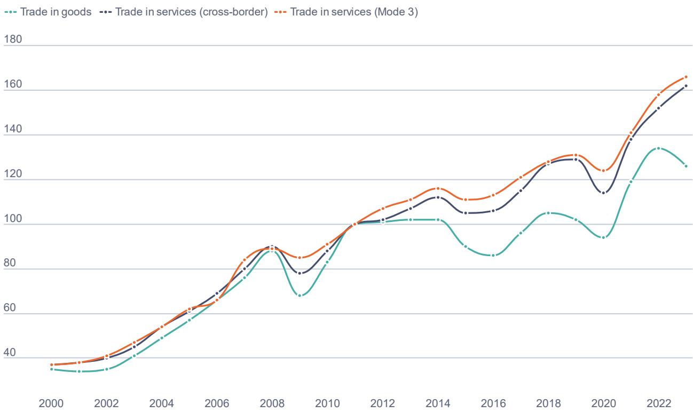  
Note: Mode 3 captures services supplied through commercial presence. Cross-border trade in services covers Modes 1, 2 and 4. Source: OECD TiVA-MoS and PYP ICIO dataset, 2026 edition.

## Mode 3 remains the largest channel of international services supply

The modal breakdown shows that commercial presence abroad is the largest channel of international services supply. Figure 4.2 shows that, in 2023, services supplied through commercial presence reached about USD 8.8 trillion, compared with USD 6.9 trillion for Modes 1 and 4 combined and USD 0.7 trillion for Mode 2. Adding the estimated overlap between Mode 3 and cross-border trade (USD 2.4 trillion), total international services supply reached around USD 18.9 trillion.

The pandemic shock had a different sectoral and modal profile. In 2020, Mode 2 fell by almost 60%, from USD 0.9 trillion in 2019 to USD 0.4 trillion, reflecting the collapse in travel, tourism and other forms of consumption abroad. Modes 1 and 4 declined only moderately, while Mode 3 fell by around 5%. The recovery was strong after 2020. By 2023, Modes 1 and 4 had reached their highest level in the series, while Mode 3 exceeded its pre-pandemic level by more than USD 1 trillion. This suggests that the pandemic accelerated some digitally deliverable services while confirming the continuing importance of foreign affiliate activity.

The chart also includes an overlap between Mode 3 and cross-border trade, highlighting that some transactions involving foreign affiliates may also be recorded in balance of payments statistics, for example when a foreign affiliate exports services cross-border. Without accounting for this overlap, total services trade by mode would be overestimated. The overlap reached about USD 2.4 trillion in 2023, underlining the need for careful integration of cross-border trade statistics and foreign affiliate statistics when measuring services globalisation. Adding cross-border trade and foreign affiliate activity (and considering the overlap between the two), trade in services accounts for 21% of global GDP (as compared to 26% for goods).

Figure 4.2. Commercial presence is the largest channel for supplying services internationally
World trade in services by mode of supply, 2000-2023, USD trillion  
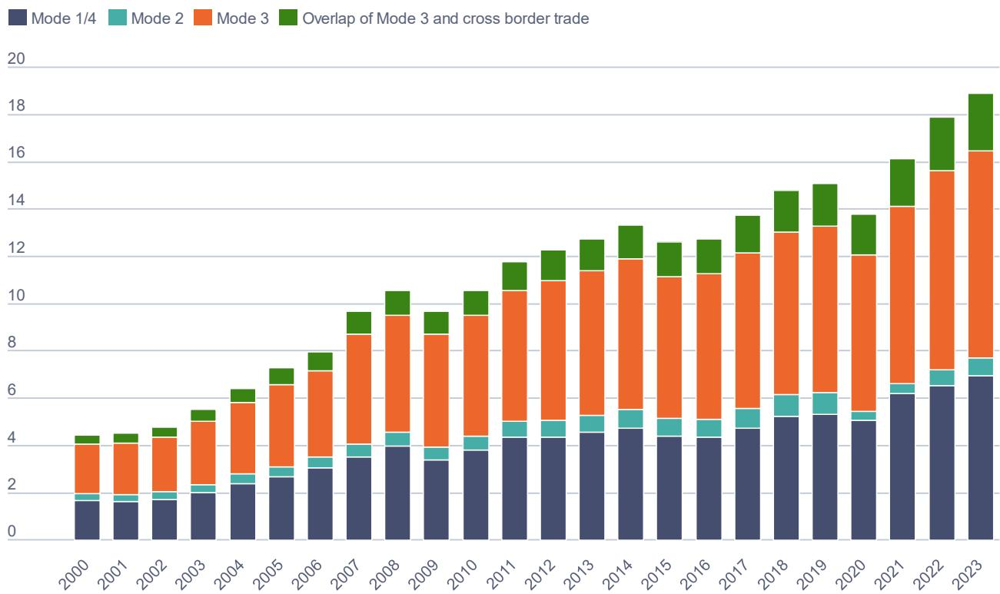  
Note: Modes of supply are defined as in the GATS agreement. Modes 1 and 4 are aggregated in one category. Source: OECD TiVA-MoS, 2026 edition.

## Different services industries rely on different modes of supply

The relative importance of each mode varies substantially across services industries. Figure 4.3 shows world trade in services by industry and mode of supply in 2023, expressed as a percentage of industry output. It illustrates that the preferred mode of international supply is highly sector specific.

Transport services are the clearest example of cross-border intensity. In water transport, Modes 1 and 4 accounted for around 36% of industry output in 2023, the highest value among the industries shown. Air transport followed, at about 27%. By contrast, Mode 3 is especially important in sectors where market access often requires local establishment, regulatory authorisation, proximity to clients or a local network. Finance and insurance had the highest Mode 3 intensity, at around 18% of industry output. IT services, warehousing, wholesale and retail trade, publishing and broadcasting, administrative support services and telecommunications also showed relatively high Mode 3 shares.

Mode 2 is concentrated in a narrower set of activities. Hotels and restaurants had the largest Mode 2 share, at about 6% of industry output, followed by air transport, recreation and education. This reflects the nature of consumption abroad, which is closely linked to tourism, travel, international students and other situations in which the consumer moves to the territory of the supplier.

Figure 4.3. The dominant mode of international supply differs sharply across services industries
World trade in services by industry and mode of supply, 2023, as a percentage of industry output  
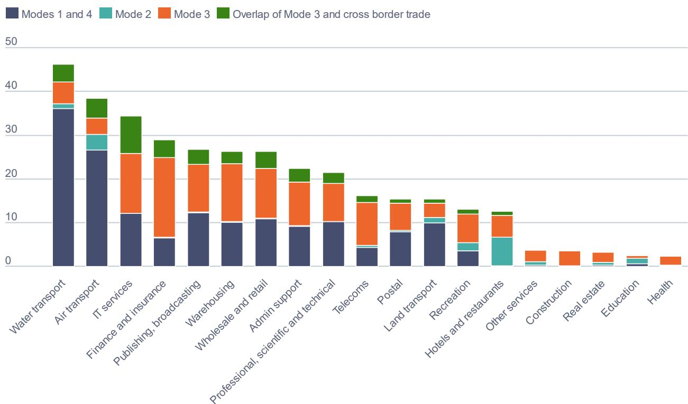  
Note: Modes of supply are defined as in the GATS agreement. Modes 1 and 4 are aggregated in one category. Source: OECD TiVA-MoS and Analytical AMNE database, 2026 edition.

The chart also shows that overlap between Mode 3 and cross-border trade is highest in information technology services, pointing to some complementarity in modes of supply where digital firms rely on foreign affiliates not only to serve host markets but also to export to third countries.

## Services global value chain participation differs across countries and modes of supply

Data by mode of supply also change the picture of services participation in GVCs. Figure 4.4 distinguishes backward participation (the foreign services content embodied in a country's gross exports) and forward participation (the domestic services value added embodied in other countries' exports). Both dimensions are reported separately for cross-border trade and Mode 3.

Small open economies tend to record the highest overall services GVC participation. Luxembourg stands out, with very high backward participation through cross-border services. Switzerland, the Netherlands, the United Kingdom and Ireland also show high participation when the four components are considered together. This reflects the role of small open economies, financial centres and MNE hubs in importing, exporting and intermediating services VA.

Backward participation is generally more pronounced through cross-border services than through Mode 3. Across the countries shown, the average backward cross-border component is around 15% of gross exports, compared with around 10% for Mode 3. This suggests that imported services inputs used in exports are often sourced cross-border, particularly in smaller economies and in economies with strong international business services linkages. Luxembourg, Ireland, Denmark, Belgium, Hungary and the Slovak Republic are among the economies with the highest backward cross-border services participation.

Mode 3 is nevertheless central for several economies. Switzerland, the United Kingdom, Ireland, Latvia, Romania, Costa Rica, Croatia and New Zealand show relatively high backward participation through Mode 3.

Figure 4.4. Services GVC participation depends on both cross-border trade and foreign affiliate activity

Services global value chain participation, by mode of supply, as a percentage of country's gross exports, 2023

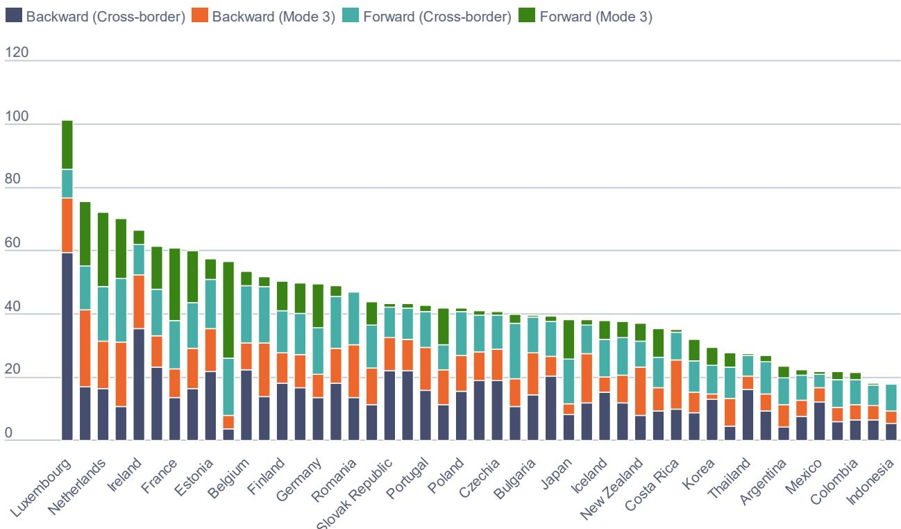  
Note: Modes of supply are defined as in the GATS agreement. Cross-border refers to Modes 1, 2 and 4. Source: OECD TiVA-MoS, 2026 edition.

The forward participation indicators reveal a different geography. The United States has the highest forward participation through Mode 3, at close to 31% of gross exports, followed by the Netherlands, France, Switzerland and the United Kingdom. This suggests that domestic services VA supplied through affiliates abroad is embodied in the exports of other countries. Large economies with internationally active services multinationals therefore contribute to foreign production networks not only by exporting services directly, but also through the activities of their affiliates abroad.

## Manufacturing exports embody substantial services content, including through Mode 3

The importance of services in manufacturing is clearer when services are decomposed by source and mode of supply. Figure 4.5 focuses on the services content of manufacturing gross exports in 2023. It distinguishes domestic services VA, foreign services VA supplied through Modes 1 and 4, and foreign services VA supplied through Mode 3. The results confirm that manufacturing exports rely heavily on services, both domestic and foreign.

For many economies, services account for a very large share of the value of manufacturing exports. Luxembourg records the highest total services content among the countries shown, at 65% of manufacturing gross exports. Belgium, Spain, France, Switzerland, New Zealand, Portugal and the Slovak Republic also record total services content of around 39-44%. This reflects the growing role of design, logistics, finance, distribution, management, research and development, software, telecommunications and other business services in manufacturing production and export performance.

Figure 4.5. Foreign services make a substantial contribution to manufacturing exports

Services content of manufacturing exports, by mode of supply, as a percentage of manufacturing gross exports, 2023, OECD and accession countries

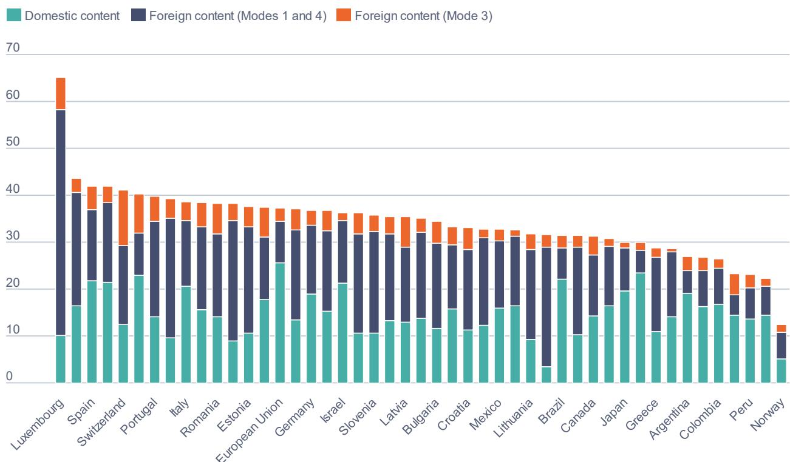

Note: The figure shows the services content of manufacturing exports, decomposed by source of value added and mode of supply. Taken together, the Domestic component and the Foreign Mode 3 component correspond to domestic services value added embodied in manufacturing exports, as in standard TiVA indicators: both refer to value added generated by services activities in the exporting country. The distinction is one of ownership, with the Domestic component referring to domestically controlled activities and Foreign Mode 3 to foreign-controlled activities. By contrast, Foreign Modes 1 and 4 refers to services value added generated abroad and embodied in manufacturing exports, whether imported directly or indirectly, regardless of ownership. Modes of supply are defined as in the GATS agreement. Modes 1 and 4 are aggregated in one category.

Source: OECD TiVA-MoS, 2026 edition.

The composition of services content differs across countries. Domestic services content is especially high in the European Union aggregate (where intra-EU trade is regarded as “domestic”), the United States, New Zealand, Brazil, Spain, France and Israel. This indicates that domestic services sectors provide an important foundation for manufacturing competitiveness.

Foreign services content supplied through Modes 1 and 4 is particularly important in small and highly integrated economies. Luxembourg, Hungary, Ireland, the Slovak Republic, Belgium and Estonia record the highest shares of foreign cross-border services content in manufacturing exports. Foreign services content supplied through Mode 3 is smaller on average, but economically meaningful. Switzerland records the highest Mode 3 foreign services content in manufacturing exports, at around 12% of manufacturing gross exports, highlighting the key role of MNEs in Swiss trade.

## Domestic consumption of services involves a different mix of modes of supply across countries

Domestic final demand provides a complementary perspective to export-based indicators. Figure 4.6 looks at how services are domestically consumed across countries. It shows foreign services VA embodied in domestic final demand for services by final mode of supply in 2023. The indicator captures the extent to which households, firms and governments rely on foreign services VA, either through cross-border supply, consumption abroad or Mode 3.

Figure 4.6. Countries rely on markedly different modes to meet domestic demand for foreign services

Foreign service value added in domestic final demand, by final mode of supply, as a percentage of country's value added, 2023, OECD and accession countries

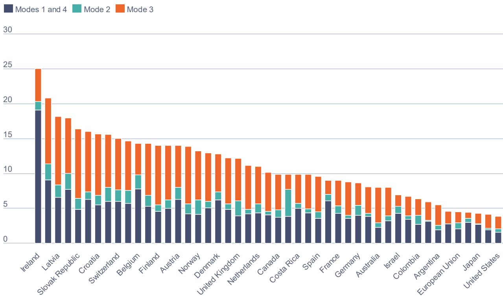  
Note: Modes of supply are defined as in the GATS agreement. Modes 1 and 4 are aggregated in one category. Source: OECD TiVA-MoS, 2026 edition.

Ireland records the highest total foreign services VA in domestic final demand among the economies shown, at 25% of national VA. Estonia, Latvia, Luxembourg, the Slovak Republic, Lithuania, Croatia, Sweden and Switzerland also record high values. These results point to the importance of foreign services inputs not only in exports, but also in domestic consumption and investment. In smaller open economies, domestic final demand for services is often deeply connected to foreign providers, foreign affiliates and imported digital or business services.

Modes 1 and 4 are particularly important for Ireland, Estonia, Belgium, Luxembourg and Thailand. This likely reflects the role of cross-border business, digital and intellectual property related services in domestic demand. More generally, high Modes 1 and 4 values indicate that cross-border services supply is an important channel through which domestic users access foreign services.

Mode 3 is also highly significant. The Slovak Republic, Latvia, Estonia, Croatia and Lithuania all record high Mode 3 foreign services VA in domestic final demand. This shows that foreign affiliates are important suppliers of services to domestic consumers and firms.

Mode 2 is smaller in most countries but important in specific cases. Iceland has the highest Mode 2 share, followed by Estonia, Luxembourg, the United Kingdom and Norway. This reflects the importance of travel-related consumption and the movement of consumers across borders.

# Implications: Towards a more nuanced assessment of supply chain trends

The evidence in this publication points to a clear conclusion: GVCs remain a central feature of the world economy, but they are changing in ways that require better measurement. The first message is that trade via global value chains stands at a historical peak.

The second message is that across sectors, responses to shifts in global trade and trade policy have been uneven, with some industries increasing and others reducing their reliance on imported inputs between 2011 and 2024. Trade via GVCs has remained particularly pronounced in manufacturing and transport-related activities, with the manufacture of coke and refined petroleum products consistently standing out as the most GVC-dependent sector throughout the period. At the same time, sectoral trajectories have diverged: the motor vehicles industry has notably reduced its reliance on GVCs, dropping in relative importance from sixth to tenth place, whereas the pharmaceutical industry has moved in the opposite direction, becoming more deeply integrated into global production networks.

The third message is that multinational production is as important as trade for understanding globalisation. MNEs account for more than half of world exports. Around 85% of foreign affiliate production abroad is controlled by OECD-headquartered MNEs. This means that decision taken by MNEs on investment, sourcing, technology, and the location of production continue to shape the geography and resilience of GVCs.

The fourth message is that services globalisation is larger and more complex than traditional services trade statistics suggest. Services are supplied across borders, embedded in manufacturing exports and delivered through affiliates established abroad. International investment and commercial presence are becoming increasingly important alongside cross-border digital and professional services trade.

The value of the updated OECD GVC datasets is that they allow policymakers to ask sharper questions. Are observed changes in trade values driven by real restructuring or by prices? Where is domestic VA created? Which firms organise production abroad? How important are services supplied through foreign affiliates? Where do indirect VA flows reveal continuing interdependence despite changes in direct trade? Answering these questions is essential for moving beyond simple narratives of globalisation or deglobalisation and towards more targeted, proportionate and internationally informed policy choices.

6

# About the GVC datasets presented in this report

## The OECD PYP ICIO dataset

GVC analysis relies heavily on inter-country input-output (ICIO) tables, a statistical framework that traces flows of goods and services between industries and across countries, covering both intermediate consumption and final uses.

The OECD has routinely published ICIO tables in current prices for several years, with annual time series stretching back to 1995 (https://oe.cd/icio). Current price values, however, conflate changes in real economic activity with movements in relative prices, making it difficult to assess how production networks have evolved in volume terms over time. Separating these two components requires tables in which each year's flows are expressed in the previous year's prices (PYP).

This publication marks the first release of the OECD PYP ICIO tables. Unlike constant price tables, which remain anchored to base year prices that become increasingly unrepresentative over time (especially in fast-changing sectors such as ICT and electronics), PYP tables form the natural input for chain-linking, whereby volume indices for TiVA and related GVC indicators are constructed by linking together successive one-year comparisons. This release covers the period 1996-2024 at the same country and industry resolution as the current price series.

Finally, ICIO compilation draws on a wide range of data sources that, due to the constraints of statistical production, are not available with the desired timeliness and industry detail in all countries. The PYP tables for 2023 and 2024 are therefore based on a projection procedure whereby aggregate trade and GDP data for 2023 and 2024 are incorporated and gaps are filled using econometric techniques (see Annex A).

The OECD PYP ICIO tables are available at https://oe.cd/pyp-icio.

## Sources of deflator data

The construction of PYP tables requires industry-level deflators for gross output and value added, as well as aggregate deflators for each category of final demand. Deflators are assembled from multiple sources, with priority assigned according to data quality and country coverage. For OECD members and a number of non-member economies, the primary source is the OECD Structural Analysis Database (STAN) (https://oe.cd/stan), which provides output and value-added deflators at a detailed industry level. For economies not covered by STAN, deflators are drawn from the United Nations National Accounts databases, supplemented where necessary by national sources and KLEMS productivity accounts. Deflators for the “rest of the world” aggregate are constructed as trade-weighted averages of the ten largest economies in that residual grouping, using output shares from the UN National Accounts.

Where industry-level deflators are not available for a given economy, missing values are imputed from the nearest available aggregate in the ISIC industry classification hierarchy. For example, a missing deflator for the chemicals industry may be approximated using the deflator for the chemicals and pharmaceuticals aggregate. Output deflators are similarly imputed from value-added deflators when only the latter is available. The assembled deflator dataset is then subject to a series of consistency checks to identify implausible year-on-year changes and internal inconsistencies between industry-level and aggregate deflators.

## Construction procedure

Once complete annual deflator series are available, the construction of the PYP tables builds on the methodology developed by the WIOD project (Los et al., 2014[10]). The WIOD project was a widely respected ICIO-style statistical effort that served as a key venue for methodological development in the field of input-output data compilation.

As a first step, industry gross output and value added, as well as final use aggregates, are extracted from the current-price tables and deflated using the appropriate deflators to obtain time series of the corresponding aggregates in previous years' prices. In any given year, the deflated aggregates yield the row and column totals of the PYP ICIO table to be estimated. The full PYP table is then obtained by applying an algorithm of the RAS family to identify the deflated ICIO that deviates the least from the current-price table while satisfying those marginal totals. Implicitly, this balancing procedure assigns a cell-specific deflator to each flow, which may differ from the aggregate deflators used for the marginal totals. The specific variant of the RAS algorithm used is GRAS, which naturally accommodates the negative elements that arise in particular in the changes-in-inventories columns (Junius and Oosterhaven, 2003[11]; Lenzen, Wood and Gallego, 2007[12]; Temurshoev, Miller and Bouwmeester, 2013[13]).

## The Analytical AMNE database

Multinational enterprises (MNEs) play an important role in international trade, yet the challenge of collecting empirical evidence on their activities has meant we have not always had the full picture of key issues in trade and industrial policy such as the role of MNEs in GVCs and how firms combine trade and investment in their cross-border activities. A better understanding of MNEs allows for more informed debates about the role of these companies in the economy and in society more broadly.

To help address the data deficit, the OECD developed a comprehensive database on MNE activities across countries and industries. Linking statistics on the activities of multinational enterprises (AMNE) with the OECD Inter-country Input-Output (ICIO) tables, the Analytical AMNE database allows for the analysis of MNE activities in value-added terms, providing insights into production functions and sales activities of MNEs across the global economy.

The dataset considers three different types of firms, which we can illustrate based on the French motor vehicle industry:

\- Foreign affiliates: Firms with more than 50% foreign ownership. To determine the parent country or country of control, the chain of control is traced from the affiliate back to the country of residence of the affiliate's ultimate controlling institutional unit (UCI) as outlined in OECD and Eurostat handbooks. For example, a subsidiary of a German motor vehicle manufacturer in France, in which the German firm holds a controlling stake.

\- Domestic-owned MNEs or parent companies: Firms which are majority domestic-owned and themselves have more than 50% ownership stakes in affiliates abroad. For example, a French car manufacturer with majority-owned subsidiaries abroad.

\- Other domestic-owned firms that are not recipients of significant international investment nor hold controlling stakes in any firm abroad. For example, a majority French-owned automotive parts supplier with no foreign affiliates.

In its 2026 edition, the database covers 81 countries plus a rest of the world aggregate and 41 industries for the period of 2000-2023. The release includes harmonised and complete analytical AMNE statistics for gross output, value added, exports and imports of intermediate inputs for the three firm types, as well as ICIO tables split by domestic- and foreign-ownership. The database also includes a bilateral output matrix, which contains information on gross output by host economy, industry and parent economy. The breakdown of domestic-owned firms into domestic MNEs and non-MNEs is only available for the period of 2008-2023, due to the limited availability of data on the activities of parent companies. All Analytical AMNE database components are consistent with the 2025 release of the OECD ICIO tables, with the exception of the ICIO tables for 2023 which are based on the projections of the OECD PYP ICIO dataset (see Annex A).

The database is available at https://oe.cd/gvc-mne.

## Sources and methods

The construction of the Analytical AMNE database draws on foreign affiliate statistics from the OECD AMNE database, the Eurostat FATS dataset, OECD-Eurostat Trade by Enterprise Characteristics (TEC) Database, as well as from national sources. These are supplemented by Foreign Direct Investment (FDI) statistics from the IMF Direct Investment by Counterpart Economy Database and the OECD Benchmark Definition Foreign Direct Investment dataset. This data is used to estimate an initial set of harmonised AMNE statistics. In a second step, the initial estimates are linked to the OECD ICIO tables and used as constraints in a quadratic optimisation approach to estimate production functions and sales activities by firm type, resulting in ownership-split ICIO tables. Details on data sources and the construction of the Analytical AMNE database are available in Cadestin et al. (2018[6]) and Cai et al. (2023[14]).

## The Trade in Value Added Indicators for Services by Mode of Supply (TiVA-MoS) database

Services play a central role in GVCs, both as direct outputs and as key intermediate inputs embodied in goods and other services. However, their international delivery is not fully captured by conventional trade statistics. In particular, standard Balance of Payments (BOP) statistics record only transactions between residents and non-residents and therefore do not fully reflect several important channels through which services are supplied internationally, such as sales by foreign-owned firms operating in host economies.

These different channels of international service delivery are commonly referred to as modes of supply. The General Agreement on Trade in Services (GATS) distinguishes four modes: (1) cross-border supply, where services are delivered from one country to another without requiring the movement of suppliers or consumers, broadly comparable to conventional merchandise trade; (2) consumption abroad, which occurs when consumers move to another country to consume services, for example in the case of tourism, education or health services; (3) commercial presence, which corresponds to services supplied through a locally established foreign affiliate; and (4) presence of natural persons, whereby individual service suppliers temporarily move to the country of the consumer to deliver the service.

For policymakers and analysts, a quantitative understanding of these modes of supply is essential to properly assess how countries and their trading partners engage in services trade, the role of foreign direct investment in services markets and the integration of services into GVCs.

## The TiVA-MoS database

The Trade in Value Added Indicators for Services by Mode of Supply (TiVA-MoS) database addresses this measurement challenge by integrating the GATS modes of supply into the OECD Trade in Value Added (TiVA) framework (Cai et al., 2025[15]). By doing so, it provides a consistent value-added perspective on international trade in services that goes beyond gross flows recorded in traditional statistics and traditional TiVA measures that only cover cross-border trade in services (i.e. modes 1, 2 and 4 without distinguishing them).

The TiVA-MoS 2026 vintage provides bilateral trade values by mode of supply for modes 1 and 4 (combined), 2 and 3, covering 19 service industries across 82 economies, plus a “rest of the world”, over the period 2000-2023. In addition to gross trade values, the database includes a range of TiVA-based indicators that shed light on the domestic and foreign services value added embodied in trade, across the different modes of supply. The dataset allows for a detailed analysis of trade in services along GVCs.

TiVA-MoS indicators and methodological documentation are available at: https://oe.cd/tivamos.

## Sources and methods underlying TiVA-MoS

While modes of supply are analytically important for understanding services trade, their direct identification following the GATS classification requires information that is not typically reported in national statistical systems. As a result, TiVA-MoS indicators are estimates that combine and reconcile information from several sources, notably national accounts, balance of payments statistics and the OECD Inter-Country Input-Output (ICIO) framework.

More specifically, TiVA-MoS indicators are derived by applying standard techniques of value-added decomposition to input-output variables computed from the Analytical Activities of Multinational Enterprises (AMNE) ICIO tables, which are split by firm ownership (domestically-owned versus foreign-owned). These ownership-split input-output tables are combined with information from the AMNE bilateral output matrix, which further decomposes the gross output of foreign-owned firms according to the country of the ultimate controlling entity.

Standard ICIO tables provide information on non-resident expenditures, which allows the identification and estimation of Mode 2 (consumption abroad). The Analytical AMNE data, in turn, enable the identification of Mode 3 (commercial presence), by isolating the production of services foreign-owned firms in host economies. To obtain a complete bilateral breakdown of Mode 3 by parent country, the foreign-owned components of the split ICIO tables are further disaggregated using the bilateral output matrix under a proportionality assumption. Specifically, for a given host country and industry, the exports of foreign-owned firms are allocated across parent countries in proportion to each country's share in the foreign-owned gross output of that industry.

## Interpreting input-output-based GVC indicators: Key caveats and limitations

ICIO tables are powerful tools for analysing production linkages across countries and sectors, but they are not designed to capture every detail of firm-level supply chains. They operate at relatively aggregated sectoral levels, which can mask important differences across products, firms and technologies within the same industry. This lack of granularity is particularly relevant when analysing critical goods, strategic inputs or highly specialised supply chains, where vulnerabilities may arise at a product, firm or facility level that is not visible in aggregate data.

Input-output analysis also relies on proportionality assumptions. In most applications, industries are assumed to use the same input structure for all outputs and destination markets, and imported inputs are allocated proportionally across using industries. These assumptions are necessary to construct consistent international tables, but they may not always reflect the behaviour of individual firms or the specific sourcing patterns of particular products. As a result, GVC indicators should be understood as economy-wide and sector-level estimates rather than direct measures of individual supply chains.

Timeliness is another important consideration. Building high-quality ICIO tables requires the integration, balancing and reconciliation of many national and international data sources. This inevitably creates time lags. While this publication includes projections that improve timeliness, it should be understood that input-output based indicators are well suited to analysing structural patterns and medium-term trends. They are less appropriate for real-time monitoring during fast-moving disruptions. For crisis management or short-term supply chain monitoring, they need to be complemented by more timely sources.

There are also measurement challenges related to services, multinational enterprises and intangible assets. Services are increasingly embedded in goods, supplied digitally, bundled with products, or provided through affiliates abroad. Multinational enterprises organise production through complex ownership structures, intra-firm transactions and intangible assets that are difficult to capture fully in national accounts and input-output systems. The new OECD datasets make significant progress in addressing these challenges, but they should still be interpreted as part of a broader evidence base rather than as a complete representation of all international business activity.

These limitations do not reduce the value of the GVC indicators presented in this publication. On the contrary, they clarify how the indicators should be used. Input-output data are especially valuable for identifying broad structural linkages, quantifying value-added relationships, comparing countries and sectors, and assessing how trade, investment and services are connected across economies. They are less suitable for drawing conclusions about specific products, individual firms or immediate operational risks without additional information. Used appropriately, they provide an indispensable foundation for evidence-based policymaking.

# Annex A. Projection of ICIO tables in current and previous year's prices

In a context of heightened global uncertainty, there is strong demand for timely insights into how trade and production networks are evolving. Input-output databases such as the OECD Inter-Country Input-Output (ICIO) tables and the related Trade in Value Added (TiVA) indicators are essential tools for such analysis. However, the construction of global input-output systems inevitably involves a time lag. For example, the recent 2025 OECD TiVA release only covers data up to 2022. $^{6}$ Because ICIO compilation – whether in current or previous year's prices – draws on a wide range of national and international statistical sources, its timeliness is ultimately limited by the least up-to-date components.

While this time lag is not problematic for many analytical uses, it does constrain the ability of policymakers to monitor recent GVC developments. To mitigate this, the OECD Trade and Agriculture Directorate has begun developing approaches to produce early estimates of the ICIO using a smaller set of more timely data sources. The objective is to support more frequent updates of the OECD PYP ICIO, Analytical AMNE and TiVA-MOS datasets.

## Projection framework

The construction of OECD ICIO tables relies on a wide range of statistical inputs (Yamano et al., 2023[16]) that can be grouped into three broad categories:

1. National accounts data, providing country-level macroeconomic aggregates such as gross output, value added, and the components of final demand.

2. International trade statistics, covering goods and services, and providing the bilateral flows needed to populate the inter-country dimension of the tables.

3. National supply and use tables (SUTs), which describe the industry-by-industry relationships within each economy and determine the technical coefficients used in the ICIO.

Among these three components, the main obstacle to producing timely ICIO updates is the availability of SUTs. SUTs are by far the most time-consuming to compile, with lags of three years or more not uncommon across national statistical offices. National accounts aggregates and trade statistics, by contrast, are typically available within one to two years. The timeliness of harmonised trade data has also improved substantially in recent years, supported by OECD initiatives such as the Balanced International Merchandise Trade dataset (OECD, 2025[17]) and the Balanced Trade in Services database (OECD, 2025[18]).

The ICIO projection framework exploits this asymmetry: rather than waiting for SUTs, it uses more timely national accounts and trade data to update the observable parts of the ICIO, and relies on a statistical balancing procedure (an extension of the GRAS algorithm) to infer the implied adjustments to the inter-industry structure.

This approach represents a natural extension of the methodology already used to construct the ICIO in previous year's prices, which similarly retrieves observable marginal totals and uses balancing techniques to fill in the unobserved cells (see Section 6). Other international organisations, including the European

Commission (FIGARO) and the Asian Development Bank, routinely publish similar early projections of their multi-country input-output frameworks.

## Data sources and methodology

The main data sources for the current implementation are the United Nations Analysis of Main Aggregates (UN AMA) database, and the OECD BIMTS and BATIS databases. The UN AMA data provide timely national accounts information for virtually all economies covered in the ICIO, including value added by broad industry group, total imports and exports, and the components of final demand. OECD BIMTS and BATIS provide data on bilateral trade in goods and services, respectively.

Because of structural and methodological differences between datasets, the data obtained from these sources cannot be treated simply as drop-in replacements for the corresponding out-of-date ICIO components. The UN AMA data, for example, are available at a coarser industry aggregation than the ICIO. Conversely, BIMTS and BATIS use different accounting principles from the ICIO to measure international trade, including with respect to the role of change of ownership versus border crossing, the treatment of trade and transport margins, and related issues.

To address these differences, the timely exogenous data are used as proxy variables in bridge regressions. Series by series, an econometric relationship is estimated between an ICIO variable of interest and the corresponding proxy over the period 1995-2022. The estimated model is then used, together with the observed proxy, to predict the ICIO component for 2023 and 2024. In the case of value added, for example, each ICIO country-industry series is modelled on the basis of the corresponding UN AMA aggregate. Gross output is projected using the same approach, subject to constraints that prevent implausible shifts in the ratio of value added to gross output. International trade flows are also modelled using bridge regressions, with bilateral trade in goods and services in the ICIO proxied by the corresponding series from BIMTS and BATIS, respectively. In all cases, the disturbance term is modelled as an ARIMA process, with orders selected automatically through information-criterion minimisation. By contrast, aggregate final-use series are extended forward using growth rates calculated from UN AMA, as preliminary testing suggested little gain from the additional complexity of bridge regressions.

Before entering the final balancing step, the bilateral trade estimates are scaled using RAS to match each country's national-accounts-consistent export and import totals. This ensures that the bilateral and aggregate constraints imposed on the GRAS procedure are mutually consistent and that the balancing problem is feasible.

The methodology has been validated both retrospectively — for example, by projecting year t from data available through year t-1 and comparing the results with the published tables — and against independent estimates from Eurostat FIGARO and the Asian Development Bank, with encouraging results. The projected tables for 2023 and 2024 should nonetheless be treated as preliminary, particularly at the full level of country-industry disaggregation, where projections are naturally subject to greater uncertainty.

Work is underway to extend the projection framework to make use of a broader set of data inputs. One line of development focuses on incorporating more granular national accounts data from OECD SNA databases and national statistical offices, so as to progressively replace estimates derived from UN AMA aggregates with more authoritative national data where available. A second focuses on integrating more detailed trade data, covering both merchandise trade at the product level and services trade broken down by detailed balance-of-payments categories. This will strengthen the alignment of the projected tables with observed bilateral trade patterns.

<table><tr><td>Establishment</td><td>An establishment is an enterprise, or part of an enterprise, that is situated in a single location and in which only a single productive activity is carried out or in which the principal productive activity accounts for most of the value added.</td></tr><tr><td>Final demand</td><td>Final demand, in the context of inter-country input-output (ICIO) tables, refers to the final consumption of households, government, non-profit institutions serving households (NPISHs) and direct purchases abroad by residents, as well as gross fixed capital formation. Trade in value added (TiVA) indicators often also include changes in inventory in final demand.</td></tr><tr><td>Gross output</td><td>Output consists of goods or services that are produced within an establishment that become available for use outside that establishment, plus any goods and services produced for own final use.</td></tr><tr><td>Intermediate inputs</td><td>Intermediate inputs or intermediate consumption consists of the goods and services that are used up, transformed, or fully consumed in the production process of other goods or services within a given accounting period. They exclude fixed assets (i.e. investment goods and services) whose consumption is recorded as consumption of fixed capital. Intermediate inputs include, for example, raw materials, components, energy and purchased services.</td></tr><tr><td>Value added</td><td>Value added (at basic prices) reflects the value added by an industry in producing goods and services. Consistent with the definitions of the 2008 System of National Accounts (2008 SNA), it is equal to gross output (at basic prices) minus intermediate consumption of goods and services (at purchasers&#x27; prices). Value added comprises compensation of employees, gross operating surplus, as well as a component for &#x27;other taxes, less subsidies, on production&#x27;.</td></tr></table>

## Glossary

## References

Altman, S. and C. Bastian (2026), DHL Global Connectedness Report 2026, DHL Group. [3]

Cadestin, C. et al. (2018), “Multinational enterprises and global value chains: the OECD analytical AMNE database”, OECD Trade Policy Papers, No. 211, OECD Publishing, Paris, https://doi.org/10.1787/d9de288d-en.

Cai, M. et al. (2025), “Towards new Trade in Value-Added (TiVA) indicators that account for modes of supply in services trade: The TiVA-MoS database”, OECD Trade Policy Papers, No. 298, OECD Publishing, Paris, https://doi.org/10.1787/84181329-en.

Cai, M., S. Miroudot and C. Zürcher (2023), The 2023 edition of the OECD Analytical AMNE database: methodology and new evidence on the role of multinational production in global value chains, Paper presented at the 29th IIOA conference in Alghero. [14]

Francois, J. and B. Hoekman (2010), “Services Trade and Policy”, Journal of Economic Literature, Vol. 48/3, pp. 642-692, https://doi.org/10.1257/jel.48.3.642.

Jaax, A., S. Miroudot and E. van Lieshout (2023), “Deglobalisation? The reorganisation of global value chains in a changing world”, OECD Trade Policy Papers, No. 272, OECD Publishing, Paris, https://doi.org/10.1787/b15b74fe-en.

Johnson, R. and G. Noguera (2012), “Accounting for intermediates: Production sharing and trade in value added”, Journal of International Economics, Vol. 86/2, pp. 224-236, https://doi.org/10.1016/j.jinteco.2011.10.003.

Junius, T. and J. Oosterhaven (2003), “The solution of updating or regionalizing a matrix with both positive and negative entries”, Economic Systems Research, Vol. 15/1, pp. 87-96, https://doi.org/10.1080/0953531032000056954.

Lenzen, M., R. Wood and B. Gallego (2007), “Some comments on the GRAS method”, Economic Systems Research, Vol. 19/4, pp. 461-465. [12]

López González, J., S. Sorescu and P. Kaynak (2023), “Of bytes and trade: Quantifying the impact of digitalisation on trade”, OECD Trade Policy Papers, No. 273, OECD Publishing, Paris, https://doi.org/10.1787/11889f2a-en.

Los, B. et al. (2014), Note on the Construction of WIOTs in Previous Year's Prices, [10] https://dataverse.nl/api/access/datafile/199087.

Miroudot, S. and C. Cadestin (2017), “Services In Global Value Chains: From Inputs to Value-Creating Activities”, OECD Trade Policy Papers, No. 197, OECD Publishing, Paris, https://doi.org/10.1787/465f0d8b-en.

OECD (2025), OECD Supply Chain Resilience Review: Navigating Risks, OECD Publishing, Paris, https://doi.org/10.1787/94e3a8ea-en. [2]

OECD (2025), The OECD Balanced International Merchandise Trade Dataset (BIMTS), OECD Publishing, Paris, https://doi.org/10.1787/07518168-en. [17]

OECD (2025), The OECD-WTO Balanced Trade in Services Database (BaTIS), OECD Publishing, Paris, https://doi.org/10.1787/c321a7a7-en. [18]

Subramanian, A. and M. Kessler (2014), “The Hyperglobalization of Trade and Its Future”, in Towards a Better Global Economy, Oxford University PressOxford, https://doi.org/10.1093/acprof:oso/9780198723455.003.0004.

Temurshoev, U., R. Miller and M. Bouwmeester (2013), “A note of on the GRAS method”, Economic Systems Research, Vol. 25/3, pp. 361-367, https://doi.org/10.1080/09535314.2012.746645.

Timmer, M. et al. (2021), “Supply Chain Fragmentation and the Global Trade Elasticity: A New Accounting Framework”, IMF Economic Review, Vol. 69/4, pp. 656-680, https://doi.org/10.1057/s41308-021-00134-8.

Yamano, N. et al. (2023), “Development of the OECD Inter Country Input-Output Database, 2023”, OECD Science, Technology and Industry Working Papers, https://doi.org/10.1787/5a5d0665-en.

$^{1}$ See Glossary for technical terms used in input-output analysis.

$^{2}$ The Analytical AMNE dataset introduces an ownership split into input-output tables, distinguishing domestic-owned firms from foreign-owned firms and, for some indicators, domestic multinational enterprise (MNEs) from non-MNEs.

$^{3}$ Expressed as a share of world GDP, trade via GVCs can be understood as a measure of the import intensity of production, i.e. how many cents of imported inputs are needed in order to produce one dollar of output in the world (Timmer et al., 2021 $^{[19]}$ ).

$^{4}$ Tables both in current and previous year's prices are projected using more recent aggregate information from national accounts and international trade statistics. See Annex A for the methodology.

$^{5}$ The decomposition separates four channels that can explain the increase or decrease in backward GVC participation. First, the technology component reflects changes in the types of intermediate inputs used to produce output. This matters because some inputs are more likely than others to embody foreign value added. For example, if inputs such as software, cloud services, and specialised electronic components draw heavily on foreign supply chains, a shift towards more digitalised production processes will tend to increase backward participation. Second, the input-sourcing component reflects changes in where inputs are sourced from, including shifts between domestic and foreign suppliers and across foreign supplier countries. Third, the value-added component measures the role of changes in the share of value added in gross output. Finally, the export-composition component reflects changes in the mix of products exported by a country, since backward participation may increase if exports shift towards industries that typically embody greater foreign content. The results should be interpreted as a descriptive accounting exercise rather than as causal evidence: they indicate which components of the GVC participation indicators account for observed changes.

## Trends in Global Value Chains

Global value chains (GVCs) remain highly globalised in the post-COVID-19 era but are being reconfigured in more complex ways. New OECD evidence shows that, in real terms, the use of imported goods and services in world production is near its historical peak in 2024. Recent changes are driven more by shifts across sectors and sourcing structures than by post-pandemic shortening or reshoring of supply chains. This report highlights changing bilateral dynamics among major economies and the growing role of connector economies. It shows that multinational enterprises remain central to international production, with foreign affiliate output rebounding after 2020. In addition, services – especially those supplied through foreign affiliates – are shown to be a larger and more complex dimension of GVCs than cross-border statistics alone suggest. These findings draw on three complementary OECD datasets: real-terms GVC indicators, ownership-based input-output tables and services trade by mode of supply.