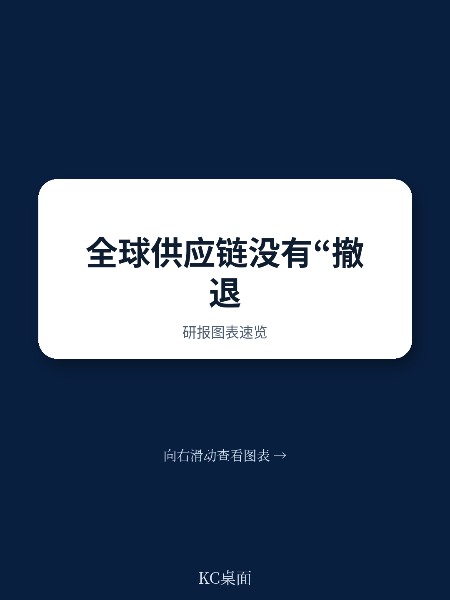
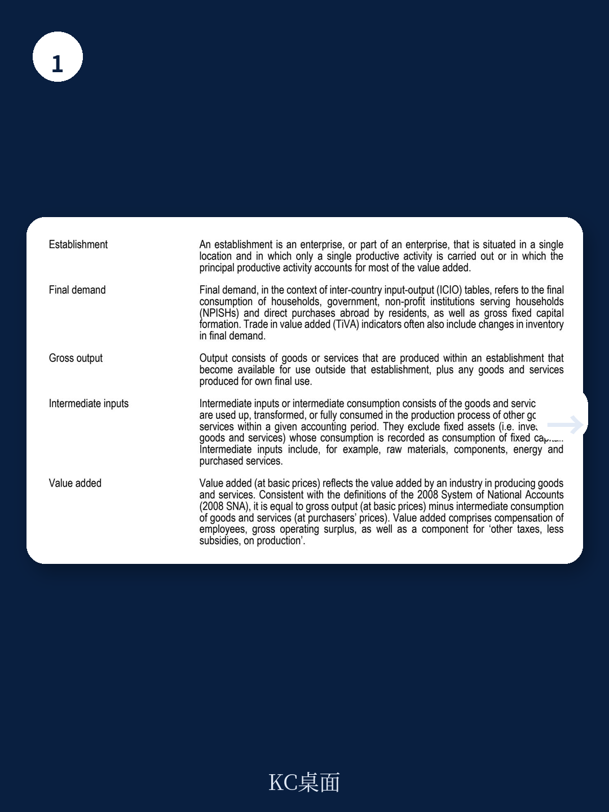
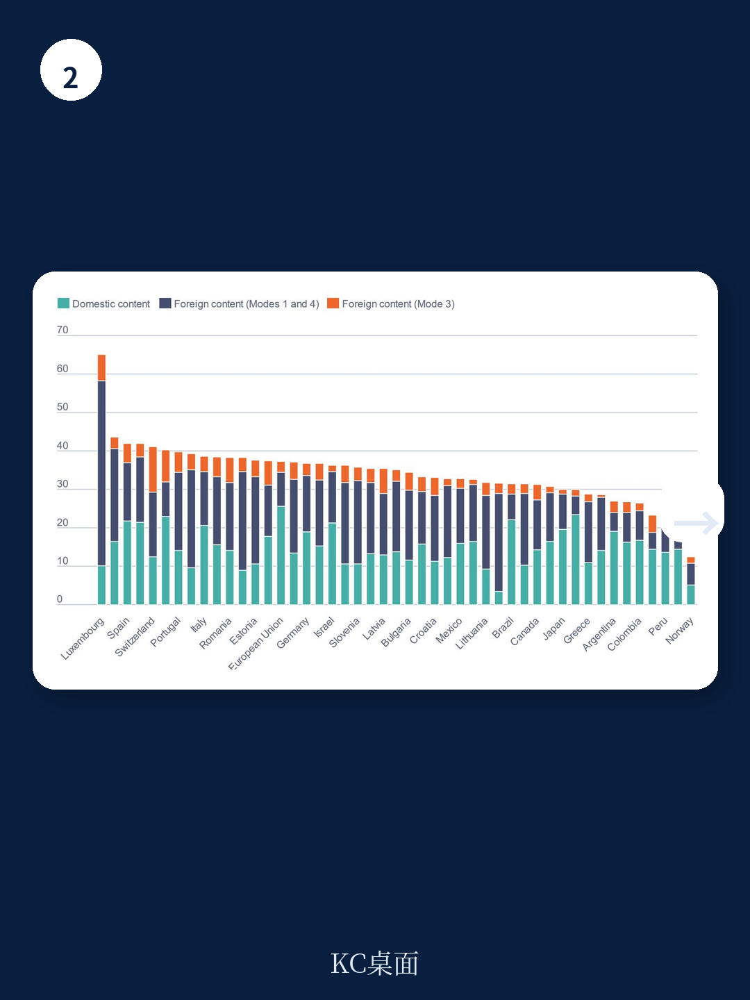

# 经合组织：跨国公司海外产出25万亿美元，全球供应链骨架未动摇

全球供应链“脱钩”或“缩短”的叙事，过去几年被反复提及。但经合组织最新发布的《全球价值链趋势》报告，用一套新的数据框架给出了一个更复杂的答案：以实际值衡量，2024年全球价值链贸易占全球GDP的比重仍维持在17%的历史高位附近，并未出现系统性下降。真正发生的，不是总量的调整，而是结构的重组——产业之间、国家之间、企业所有权之间的连接方式正在发生静默但深刻的转变。

这份报告的核心贡献在于，它首次提供了经合组织编制的“上年价格”投入产出表（PYP ICIO），从而将价格波动与数量变化剥离开来。在高通胀和能源价格剧烈波动的环境下，名义贸易数据严重失真，而实际值才揭示了全球生产的真实连接度。

## 1. 名义值与实际值的背离，是理解当前全球贸易的关键

报告最值得注意的发现，是名义与实际两条曲线的明显分化。2022年后，按现价计算的全球价值链贸易占GDP比重出现下滑，但实际值却基本持平。原因在于，2021-2022年贸易额飙升主要来自能源和原材料价格暴涨，而非生产网络扩张。当价格回落，名义值自然下降，但企业实际进口的中间品数量并未减少。

> **KC评论：** 这意味着，那些仅凭海关统计或名义贸易额就判断“全球化退潮”的分析，很可能误读了真实情况。经合组织的数据提醒我们，区分“价格效应”和“数量效应”是判断供应链走向的前提。完整报告中的图2.1和图2.2对这两条曲线的对比，值得仔细看。

这一结论的政策含义是：企业并未大规模放弃跨境采购，全球生产网络的物理连接依然牢固。所谓“脱钩”，更多是局部和战略性的，而非系统性现象。

## 2. 产业层面的分化远比“回流”叙事复杂

不同行业对全球价值链的依赖程度在2011年至2024年间呈现出截然不同的走向。报告显示，汽车制造业的进口中间品依赖度显著下降，从2011年的第6位滑落至2024年的第10位。这很可能反映了该行业在疫情后加速本土化采购或区域化布局。而制药行业则相反，其全球整合程度在此期间不降反升。

这种分化说明，不存在一个统一的“去全球化”趋势。每个行业的供应链逻辑受制于其技术特性、监管环境和地缘政治敏感度。汽车业受补贴和关税政策影响更大，而制药业仍高度依赖全球分工的规模效应。

## 3. 跨国公司才是全球价值链的真正“底盘”

报告另一个被低估的洞察是，跨国公司及其海外子公司的生产规模，几乎与全球贸易总量相当。2023年，海外子公司的总产出约为25.6万亿美元，仅略低于全球商品和跨境服务贸易总值（26.6万亿美元），占全球GDP的四分之一。加上贸易，两者合计占全球GDP的45%。

更关键的是，超过一半的全球出口是由跨国公司及其海外子公司完成的。这意味着，即便双边贸易数据出现波动，只要跨国公司的内部网络和海外生产布局不变，全球价值链的骨架就不会动摇。报告特别指出，约85%的海外子公司产出仍掌握在总部位于经合组织国家的跨国公司手中。

> **KC评论：** 对于关注中美供应链转移的读者，报告中的图3.3和图3.4值得细看。它们展示了海外子公司生产的集中度正在缓慢分散，但主导格局未变。这提示我们，“友岸外包”或“近岸外包”更多是增量调整，而非存量替代。

## 4. 报告尚未完全回答的关键问题：服务贸易的“隐形”深度

报告花了大量篇幅讨论服务贸易，尤其是通过商业存在（Mode 3，即海外子公司提供服务）这一渠道。数据显示，服务贸易增速快于商品贸易，且Mode 3是服务国际供应的最大渠道。但报告也坦诚，现有的投入产出框架在捕捉服务价值链的“隐形”深度方面仍有局限。例如，嵌入在制造业出口中的服务含量（如研发、设计、软件）究竟如何流动，目前的数据颗粒度仍不够。

这恰恰是未来研究的一个关键缺口：如果全球价值链的重组更多发生在服务环节（尤其是数字化服务），那么现有的贸易和研究统计可能系统性低估了真实的宏观环境相互依赖程度。

## 5. 对读者的观察框架：从“总量叙事”转向“结构拆解”

这份报告给产业决策者和研究者的最大启发，是提供了一个更精细的分析框架。与其追问“全球化是否在倒退”，不如关注三个具体变量

第一，**价格与数量的分离**。任何关于供应链趋势的判断，都应先排除大宗商品和汇率波动的影响。第二，**所有权与贸易的区分**。跨国公司的海外生产活动，是衡量全球整合度更稳定的指标。第三，**服务与制造的叠加**。制造业出口中嵌入的服务价值，以及通过海外子公司提供的服务，可能是未来全球价值链重构最活跃的领域。

报告没有给出简单的答案，但它提供了一个更扎实的起点。

For informational purposes only. Portions may be generated,translated,summarized,or edited with AI assistance based on source materials and may contain omissions or errors. Please verify independently. This is not investment,legal,tax,accounting,or other professional advice.
