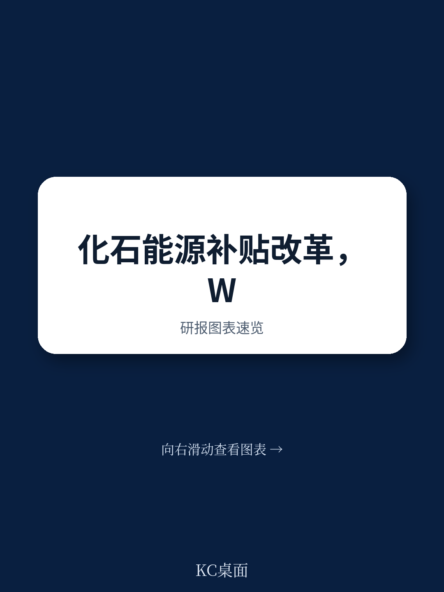

# 世界贸易组织：不是承诺而是执行，WTO部长级会议推动化石燃料补贴改革进入实操阶段

2025年全球政府对化石燃料的补贴规模估算达到0.92万亿美元。这个数字本身并不新鲜，新鲜的是世界贸易组织在2026年3月的部长级会议上，将这一议题从“联合声明”推进到了“产出文件”阶段。这意味着，围绕化石燃料补贴的改革，正在从原则性承诺转向可操作的规则工具箱。

这份由21个WTO成员联署的部长声明，核心信号是：透明化、扰动应对、识别有害补贴，这三个支柱已经分别有了具体产出。对于全球贸易体系和能源行业而言，这不仅仅是多边场合的一次表态。

## 1. 透明机制进入“提问清单”阶段，贸易政策审议将变厚

WTO的贸易政策审议机制，过去更多聚焦关税、非关税壁垒等传统贸易议题。现在，化石燃料补贴正式被纳入标准化的“提问框架”。

声明附件一列出了一套非强制性的样本问题，覆盖三大类：现有或计划中的补贴措施、改革进展、补贴影响。这意味着，在未来的贸易政策审议中，成员方可以依据这套清单，系统性地询问另一成员的补贴细节，包括政策目标、受益人、实施方式、财政成本，以及改革对弱势群体的影响。

这套清单的价值不在于强制力，而在于它创造了一个可比较、可追踪的信息披露基线。对于跨国企业而言，这意味着评估一国能源成本、竞争环境时，又多了一个公开可查的官方信息来源。

## 2. 扰动补贴有了“临时性”设计指南，能源转型的规则细节在落地

2021年的能源扰动暴露了一个普遍问题：各国在应对价格冲击时，往往匆忙推出大规模补贴，事后却难以退出。声明附件二专门为“扰动支持措施”制定了设计指南，核心原则只有三个词：透明、精准、临时。

透明要求遵循良好监管实践并提前公布退出时间表。精准要求补贴必须聚焦最受影响的群体，避免扭曲化石燃料与替代能源的相对价格。临时则要求设置明确的终止日期和定期审查条款。

> **KC评论：** 这份指南读起来像一份“政策设计检查表”。它没有禁止扰动补贴，但要求补贴设计之初就规划好退出路径。对于读者而言，这意味着未来各国在能源扰动中推出的补贴，更可能附带“日落条款”，而非无限期延续。完整报告中的“替代措施”部分值得细读，它列出了收入支持、清洁能源支持等替代方案，这些才是真正影响能源结构长期走向的变量。

## 3. 报告尚未完全回答的关键问题：谁来定义“有害”

声明中反复出现“harmful fossil fuel subsidies”一词，但整个文件没有给出一个统一的定义标准。附件一的样本问题中，要求成员说明补贴的“政策目标、设计、受益人”，也要求分析“宏观环境、社会和环境影响”，但并未明确哪些补贴属于“必须淘汰”的范畴。

这个问题不是技术细节，而是核心分歧所在。不同国家对“有害”的理解差异巨大：一些发展中国家可能将能源普惠性补贴视为社会福利，而非“有害”；部分产油国可能将生产端补贴视为产业政策，而非贸易扭曲。WTO框架下的多边谈判历来在定义问题上耗时最长。文件没有解决这一分歧，而是选择先推进透明化和扰动管理，把定义问题留到后续谈判。

对于关注该议题的读者，接下来的观察重点可以放在两个维度：一是贸易政策审议中，哪些国家会被反复追问补贴细节，这种“点名”本身就会形成改革不确定性；二是2026年之后，是否有成员方启动争端解决机制，以“补贴与反补贴措施协定”为依据挑战特定化石燃料补贴。如果出现第一个案例，这个议题的推进速度将显著加快。

For informational purposes only. Portions may be generated,translated,summarized,or edited with AI assistance based on source materials and may contain omissions or errors. Please verify independently. This is not investment,legal,tax,accounting,or other professional advice.
