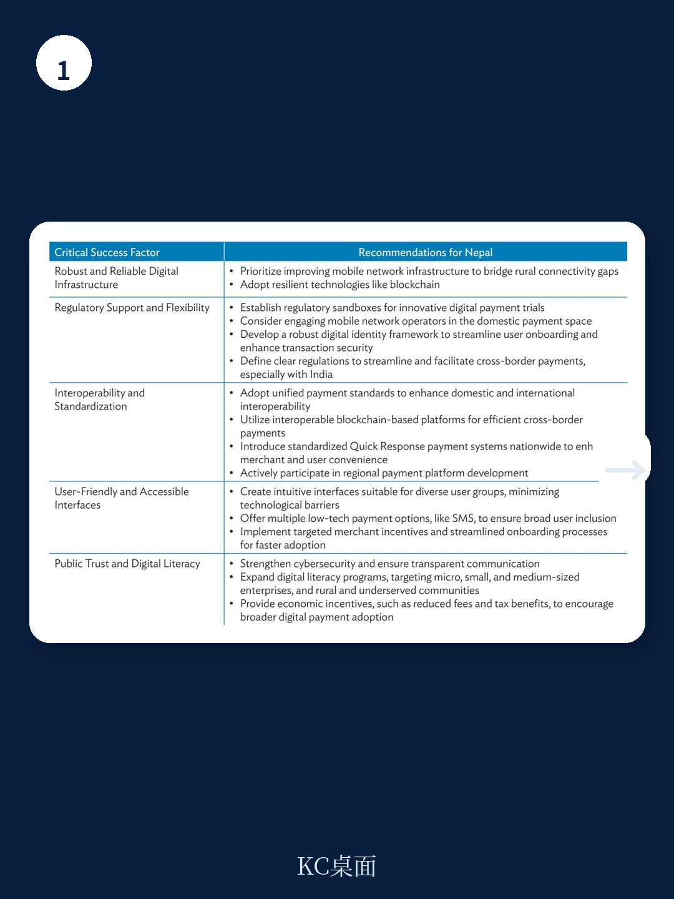

# 亚洲开发银行：推进尼泊尔数字支付基础设施升级

尼泊尔正在经历一场数字支付的基础设施升级。亚洲开发银行最新发布的报告指出，该国在移动银行、互联网银行和二维码支付方面的用户采纳率已快速攀升，与印度统一支付接口的跨境支付连通也已初步实现。但这些进展并未自然转化为一个高效、可扩展的数字支付生态。问题出在系统层面：多个支付系统运营商各自为政，支付服务提供商需要逐一接入不同平台，导致商户和消费者经常被迫切换应用才能完成交易。报告的核心判断是，尼泊尔数字支付的下一个瓶颈不是技术能力，而是基础设施的统一与互操作性。

这份报告由南亚次区域宏观环境合作计划委托亚洲开发银行支持完成，与尼泊尔第16个五年计划和数字尼泊尔框架保持一致。报告不仅评估了国内数字支付生态的现状与挑战，还从全球数字资金实践中提炼出适用于尼泊尔的策略建议，并给出了分阶段实施路线图。

## 1. 尼泊尔央行已明确转向统一基础设施模式

尼泊尔央行在2025年发布了国家支付交换机和国家支付生态主参考文件，为互操作性标准和共享基础设施制定了蓝图。这一举措标志着从分散系统向共享数字公共基础设施的转变。报告特别指出，尼泊尔央行正在推动开放应用程序接口规则手册的最终确定和强制实施，以创建连接银行、企业和政府机构的标准化接口。同时，市场范围的NEPALPAY二维码标准也在推进中，旨在解决当前碎片化问题，并为与主要贸易伙伴的跨境二维码支付铺平道路。

> **KC评论：** 这份报告最有价值的部分不是技术细节，而是它揭示了“统一”与“互操作”之间的区别。统一是强制标准，互操作是技术连接。尼泊尔目前的问题是，多个系统之间可以连接，但缺乏一个强制性的底层标准，导致连接成本高、用户体验差。央行的新文件试图从“互操作”走向“统一”，这是质变。

## 2. 跨境支付走廊是贸易便利化的优先突破口

报告将跨境支付基础设施列为贸易便利化的首要任务。具体而言，尼泊尔需要尽快解决与印度二维码支付中的佣金结构问题，使已开发的互惠功能能够真正落地——让尼泊尔人在印度也能使用本国支付应用。此外，报告建议为旅游和侨汇这两个宏观环境命脉部门部署专门的支付解决方案，包括多币种能力和简化的用户入驻流程。国际支付网关的可靠性也需要提升，报告指出中间件问题和缺乏冗余基础设施是当前的主要短板。

## 3. 农村地区和中小企业的数字支付采纳仍不均衡

尽管整体数字支付使用量在增长，但农村人口和中小企业的进展速度明显落后。报告提到，部分支付服务提供商已推出离线支付创新，试图在连接不稳定的地区扩展数字支付覆盖。但这只是权宜之计。更根本的挑战在于数字和资金素养的差异，以及最后一公里基础设施的缺失。报告建议建立全国性的现金存取代理网络，并开发针对不同用户群体的多语言数字和资金素养培训材料。

## 4. 人才储备和监管框架是长期竞争力的关键

报告在更广泛的数字支付系统发展建议中，特别强调了人才问题。它指出，继续创新支付处理系统和基础设施需要研究培养具备数字资金、支付技术、网络安全、数据治理和互操作性等多学科能力的未来型劳动力。除了技术专长，公共和私营部门还需要战略领导和政策能力来引导创新和管理新兴不确定性。在监管层面，报告建议制定全面的个人数据保护法、建立数字资金服务的消费者保护规则，并创建正式的监管沙盒以促进受控创新。

这份报告的核心洞察可以概括为一句话：尼泊尔数字支付的基础设施已经搭建，但要让这些基础设施真正服务于贸易便利化和宏观环境包容性，下一步的关键不是铺设更多管道，而是让现有管道能够互联互通、统一标准、并配备足够的人才和监管保障。对于关注南亚数字宏观环境和跨境贸易的观察者来说，尼泊尔的这一转型过程本身就是一个值得跟踪的案例——它展示了发展中国家在数字公共基础设施建设中面临的典型挑战和可能的解决路径。

For informational purposes only. Portions may be generated,translated,summarized,or edited with AI assistance based on source materials and may contain omissions or errors. Please verify independently. This is not investment,legal,tax,accounting,or other professional advice.

