ENHANCING DIGITAL
SERVICES TRADE

THE CASE OF THE PEOPLE'S REPUBLIC OF CHINA

Rolando Avendano and Hildegunn Kyvik Nordås

NO. 855

July 2026

ADB ECONOMICS

WORKING PAPER SERIES

# Enhancing Digital Services Trade: The Case of the People's Republic of China

Rolando Avendano and Hildegunn Kyvik Nordås

No. 855 | July 2026

The ADB Economics Working Paper Series presents research in progress to elicit comments and encourage debate on development issues in Asia and the Pacific. The views expressed are those of the authors and do not necessarily reflect the views and policies of ADB or its Board of Governors or the governments they represent.

Rolando Avendano (ravendano@adb.org) is a senior economist at the Economic Research and Development Impact Department, Asian Development Bank. Hildegunn Kyvik Nordås (hildegunn.kyviknordas@oru.se) is an adjunct professor at the School of Business Administration, Örebro University (Sweden), and a senior associate at the Council on Economic Policies (Switzerland).

© 2026 Asian Development Bank

6 ADB Avenue, Mandaluyong City, 1550 Metro Manila, Philippines

Tel +63 2 8632 4444; Fax +63 2 8636 2444

www.adb.org

Some rights reserved. Published in 2026.

ISSN 2313-6537 (print), 2313-6545 (PDF)

Publication Stock No. WPS260321-2

DOI: http://dx.doi.org/10.22617/WPS260321-2

The views expressed in this publication are those of the authors and do not necessarily reflect the views and policies of the Asian Development Bank (ADB) or its Board of Governors or the governments they represent.

ADB does not guarantee the accuracy of the data included in this publication and accepts no responsibility for any consequence of their use. The mention of specific companies or products of manufacturers does not imply that they are endorsed or recommended by ADB in preference to others of a similar nature that are not mentioned.

By making any designation of or reference to a particular territory or geographic area in this document, ADB does not intend to make any judgments as to the legal or other status of any territory or area.

This publication is available under the Creative Commons Attribution 3.0 IGO license (CC BY 3.0 IGO) https://creativecommons.org/licenses/by/3.0/igo/. By using the content of this publication, you agree to be bound by the terms of this license. For attribution, translations, adaptations, and permissions, please read the provisions and terms of use at https://www.adb.org/terms-use#openaccess.

This CC license does not apply to non-ADB copyright materials in this publication. If the material is attributed to another source, please contact the copyright owner or publisher of that source for permission to reproduce it. ADB cannot be held liable for any claims that arise as a result of your use of the material.

Please contact pubsmarketing@adb.org if you have questions or comments with respect to content, or if you wish to obtain copyright permission for your intended use that does not fall within these terms, or for permission to use the ADB logo.

Corrigenda to ADB publications may be found at http://www.adb.org/publications/corrigenda.

## ABSTRACT

This paper studies the drivers of trade in services with a focus on the People's Republic of China (PRC). It explores how the digital transformation of services has made services more easily tradable across borders and the policies that facilitate or hinder services trade. The paper starts with a descriptive analysis of new data on bilateral trade and sales from foreign affiliate trade statistics (FATS). Using structural gravity, it then studies the impact of regulatory reform on services trade flows as well as foreign affiliates at a granular level. Finally it applies general equilibrium structural gravity to simulate the impact of (i) regulatory reform in the information and communication technology (ICT) sector in the PRC and ii) implementation of the Regional Comprehensive Economic Partnership on trade, sales and output in services across all economies for which data are available. The largest effect stems from regulatory reforms of the ICT sector in the PRC, which benefit all economies.

Keywords: PRC, digital, services trade, policy

JEL codes: F13, F14

## 1 INTRODUCTION

The economic landscape in the People's Republic of China (PRC) has experienced significant shifts in recent decades. Economic reforms, combined with rapid industrialization, allowed the country to consolidate its position as a global industrial hub, with exports in manufacturing goods as a key driver. With the contribution of the manufacturing sector to GDP and exports declining, the services sector has emerged a potential engine to support its economic development model. As the PRC enters a tertiarization process, with service industries growing faster than agriculture and manufacturing, the importance of opening-up service industries has increased.

Opening-up of service industries has been an important element for the modernization and diversification of the PRC economy, driving innovation and enhancing efficiency, but also for integrating more fully into global markets. Domestically, while services industries providing inputs to the industry sector have increased, the consolidation of the middle class has also prompted higher demand for personal services, such as in health and education. Abroad, the PRC has become a competitive services provider in industries that hitherto have largely been confined to the local market, including information services, telecommunications and other business services.

Together with these developments, digitalization has brought down barriers to services trade and investment and deepened access to a new range of products. The PRC has been at the forefront of the expansion in digital services trade, with the sector growing above 9% from 2010 to 2023. While structural reforms in areas such as human capital development, digital connectivity and information, communication and technology (ICT) investment have been associated to digital services trade in the PRC and Asia, the role of regulatory reforms on services competitiveness requires further analysis.

This paper proposes scenarios for opening-up the PRC's service industries and looks at the implications for digital services trade. Considering different areas of reform, it provides estimates on the impact of regulatory reforms, as well as their importance in the opening-up process.

The rest of the paper is organized as follows: The next section offers a descriptive analysis of cross-border services trade and foreign direct investment (FDI) focusing on digitally deliverable services. Section three analyses the services trade policy framework in a comparative perspective. In addition to a discussion of the services and services related provisions in RCEP, it presents and compares policy indices for services trade openness as well as regulatory performance in telecommunications. Providing network and infrastructure services over which all digital services are transmitted within and across borders, telecommunications are of particular interest. Having described services trade patterns and the policy framework governing such trade and investment patterns, the next sections study how the trade policy framework shapes trade flows. We start in Section 4 with a description of the data that we use, followed by an outline of the analytical framework, which draws on the most recent development in gravity modeling and estimation techniques. The results of the gravity regressions are presented and discussed in Section 5. Section 6 extends the analysis to predicting the outcomes for exports and services

(b) Imports

output of unilateral regulatory reforms in the ICT sector as well as a full implementation of the provisions in RCEP using a general equilibrium gravity framework. Finally, Section 7 summarizes, draws policy implications and concludes.

## 2 PATTERNS OF TRADE

Figure 1 depicts the PRC's trade in digitally deliverable services over 2000 to 2019. The data cover cross-border trade, movement of natural persons and consumption abroad. Both exports and imports grew very rapidly from a low base at the turn of the century. Other business services dominate exports and are also among the largest import categories. However, the largest import category for digitally deliverable services is charges for the use of intellectual property rights. This reflects the importance of imported technology in all sectors, including manufacturing, mining and agriculture. $^{1}$

Figure 1: The PRC's Trade in Digitally Deliverable Services By Sector  
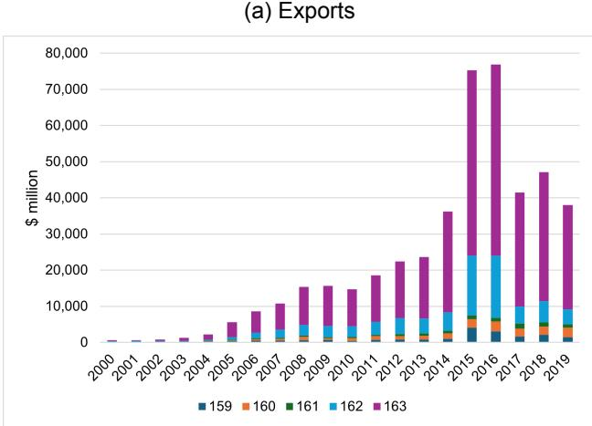

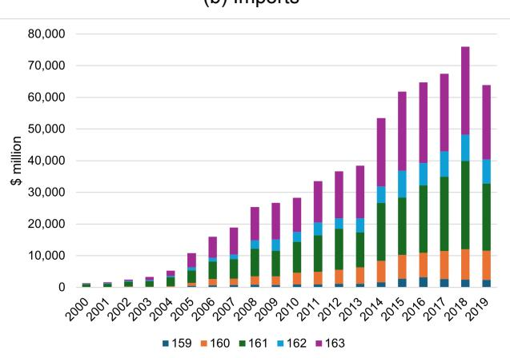  
PRC = People's Republic of China.  
Note: The sector ID: 159, Insurance and pension services; 160, Financial services; 161, Charges for the use of intellectual property n.i.e; 162, Telecommunications, computer and information services; 163, Other business services.
Source: International Trade and Production Database for Estimation.

A recently released database, the Multinational Revenue, Employment and Investment Database (MREID) provides information on bilateral affiliate sales, number of affiliates, foreign assets and employment in multinationals for 25 NAICS industries and 185 economies for 2010-2021 $^{2}$ . We used this database to analyze trends in FDI and foreign affiliate sales (Mode 3 in the terminology of the General Agreement on Trade in Services, or GATS).

Comparing the statistics for trade by foreign affiliates against other categories of trade data gives a rough idea of the importance of Mode 3 relative to the other modes, and differences in the sector composition of trade and FATS. First, we notice that similar to global services trade patterns FATS dwarfs trade through other modes. $^{3}$ Second, while imports are larger than exports on both counts, the gap is much larger for affiliate sales. Third, while information services account for the bulk of outward affiliate sales, finance dominated inward sales in the first years for which data are available. Information services have, however, gained prominence in recent years also for inward affiliate sales.

Figure 2: The PRC's Trade in Digitally Deliverable Services By Region  
(a) Exports  
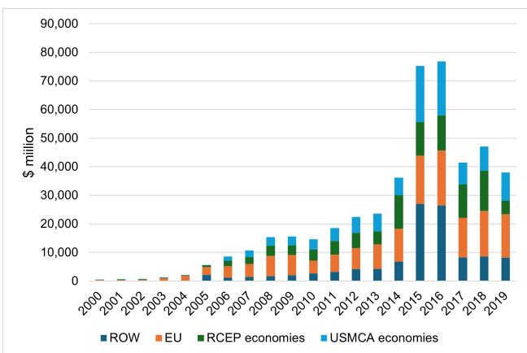

(b) Imports  
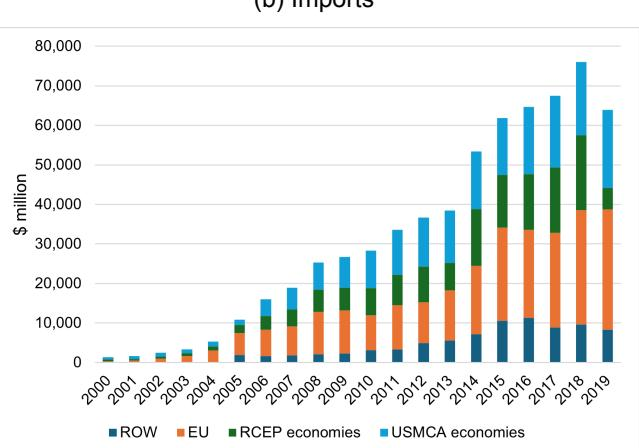  
DDS = digitally deliverable services, EU = European Union, PRC = People's Republic of China, RCEP = Regional Comprehensive Economic Partnership, ROW = rest of the world, USMCA = United States–Mexico–Canada Agreement.
Note: The sectors are the same as in Figure 1.  
Source: International Trade and Production Database for Estimation.

Figure 3: The PRC's Affiliate Sales of Digitally Deliverable Services by Sector  
(a) Outward  
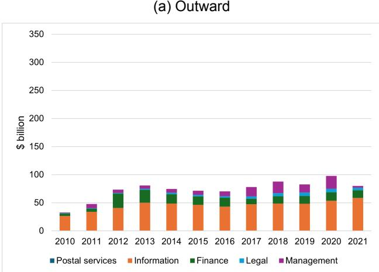

(b) Inward  
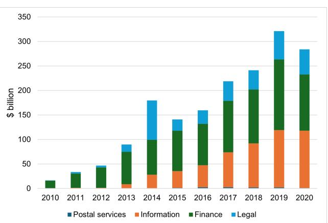  
Source: Multinational Revenue, Employment and Investment Database.

Figure 4: The PRC's Affiliate Sales of Digitally Deliverable Services by Region  
(a) Outward  
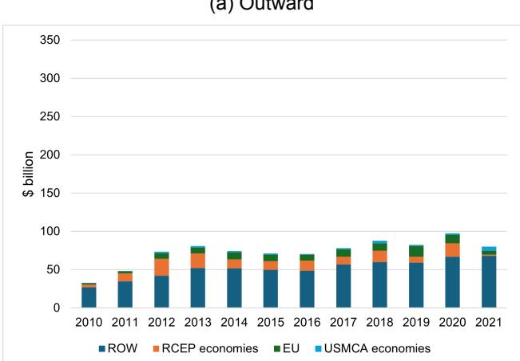

(b) Inward  
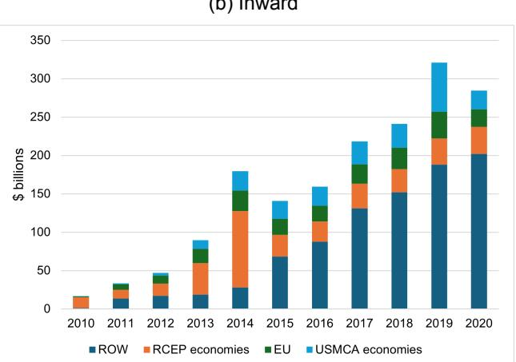  
EU = European Union, PRC = People's Republic of China, RCEP = Regional Comprehensive Economic Partnership, ROW = rest of the world, USMCA = United States–Mexico–Canada Agreement.
Notes: Outward refers to sales by the PRC multinationals. Inward refers to sales in the PRC by foreign affiliates.
Source: Multinational Revenue, Employment and Investment Database.

Analyzing trade in digitally deliverable services across modes by partner regions, we split the global market into four regions, the economies of the Regional Comprehensive Economic Partnership (RCEP), the European Union, the United States-Mexico-Canada Agreement (USMCA), and the rest of the world. Figures 2 and 4 respectively show trade and FATS by region. While the three USMCA economies dominate both exports and imports, the rest of the world accounts for the better part of outward and inward FATS. Detailed FATS data reveals that Hong Kong, China and the Cayman Islands and Bermuda account for the bulk of rest of the world. $^{4}$

As in most economies, the domestic market is the most important for Chinese multinationals. Furthermore, Chinese multinationals have become more inward-oriented during the past decade or so. Home market sales were on average slightly above 60% in 2010 for all sectors and increased to about 80% in 2020. Services followed the same pattern. As illustrated in Figure 5 digitally deliverable services also depict the same pattern, although with an interesting dispersion of home market reliance. Postal and legal services have been strongly inward oriented throughout the period, but information services and finance and insurance have become much more inward oriented over time. Only management of companies and enterprise multinationals have become more outward oriented over time. These enterprises probably provide Chinese affiliates abroad with management services and constitute a relatively small sector, accounting for less than 1% percent of Chinese affiliate sales.

Figure 5: The PRC Multinationals Home Market Sales, Share of Total Sales  
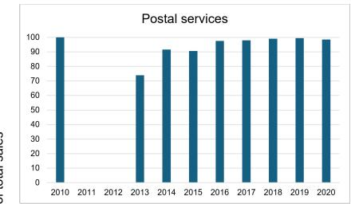

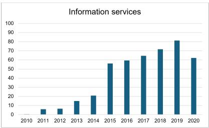

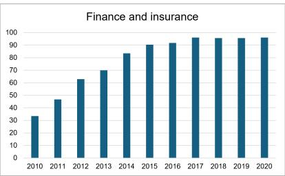

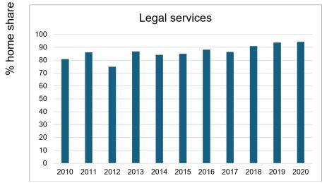  
PRC = People's Republic of China.

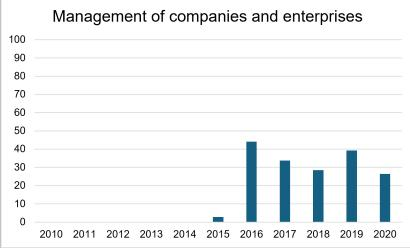  
Source: Multinational Revenue, Employment and Investment Database.

We finally look at the role of foreign affiliates in employment creation in the PRC. Employment is concentrated in foreign manufacturing affiliates and peaked at about six million workers in 2018. "Other" consists of agriculture forestry and fisheries, oil and gas, and utilities.

Figure 6: Employment in Foreign Affiliates in the PRC by Sector  
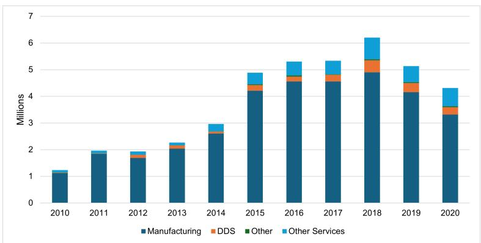  
DDS = digitally deliverable services, PRC = People's Republic of China. Source: Multinational Revenue, Employment and Investment Database.

## 3 DIGITAL SERVICES SECTOR OPENNESS

## 3.1 Domestic Regulation and Most-Favored Nation Provisions

This section presents the PRC's openness to trade and investment in digitally deliverable services in comparison to the other G20 members, RCEP and the Comprehensive and Progressive Agreement for Trans-Pacific Partnership (CPTPP). It starts with studying information provided in the Organisation for Economic Co-operation and Development (OECD)'s Digital Services Trade Restrictiveness Index (DSTRI) and the regulatory tracker of the International Telecommunication Union (ITU). Then it looks into the provisions in RCEP relevant to trade in digitally deliverable services. The DSTRI takes value between zero and one, where zero represents no restrictions while one represents the case where all the measures covered are restrictive. The largest contribution to the PRC's restrictiveness as measured by the DSTRI comes from infrastructure, which refers to restrictions on cross-border data flows and data localization requirements. Turning to the ITU regulatory tracker, its scores run from zero to 100, where a higher score represents better regulation. On this metric, the PRC comes closest to the other economies on 'regulatory regime', which records tools and measures the regulator has at its disposal. Examples are licensing, mandating a reference offer for access and interconnection with telecoms networks, number portability and secondary spectrum trading to mention but a few. $^{5}$ The PRC falls short on the 'regulatory authority' metric, which refers to the presence and independence of a regulator for the ICT sector. The PRC also falls short on competition, which reflects the state of competition in each market segment. As this is an outcome pillar, we exclude it from regressions presented in the next sections.

Figure 7: Digital STRI Scores, G20, RCEP and CPTPP economies, 2023  
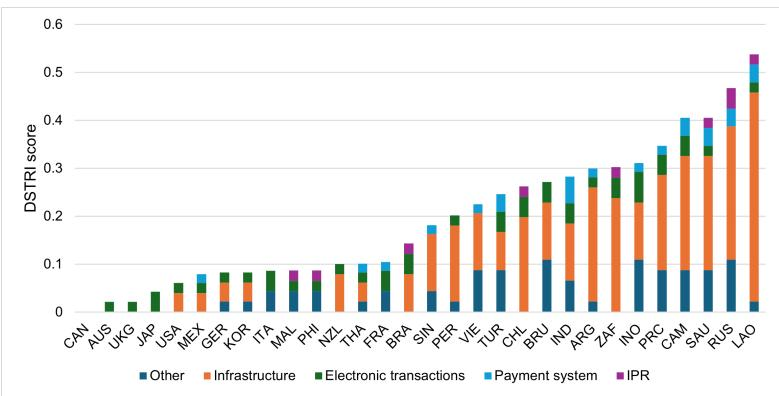

CPTPP = Comprehensive and Progressive Agreement for Trans-Pacific Partnership, IPR = intellectual property rights, RCEP = Regional Comprehensive Economic Partnership, STRI = OECD Services Trade Restrictiveness Index.

Notes: The figure shows the score on the OECD Services Trade Restrictiveness Index for 2023 by policy area. Scores range from 0 (completely open) to 1 (completely closed). Infrastructure refers Infrastructure and connectivity, Payment to Payment systems Electr. trans to Electronic transactions, IPR to intellectual property right and Other to Other barriers affecting trade in digitally enabled services. The three-letter codes are a combination of the Asian Development Bank and ISO 3166-1 alpha-3 codes. Source: Organisation for Economic Co-operation and Development.

Figure 8: Score on ITU Regulatory Tracker, G20, RCEP, and CPTPP Economies, 2022  
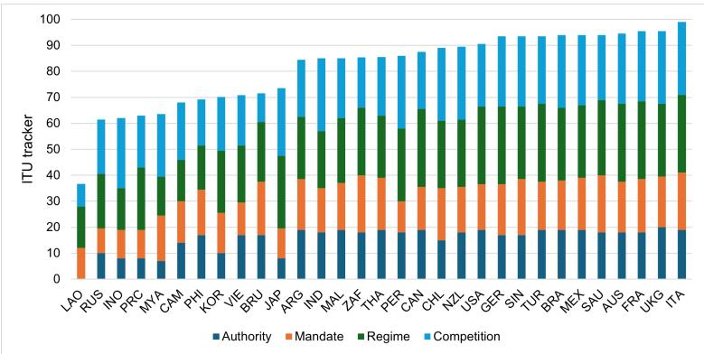  
CPTPP = Comprehensive and Progressive Agreement for Trans-Pacific Partnership, G20 = Group of 20, ITU = International Telecommunication Union, RCEP = Regional Comprehensive Economic Partnership. Notes: The figure shows the score on the ITU regulatory tracker for 2022 by policy area. Scores rank from zero to 100 where a higher score means more open and better regulated. The three-letter codes are a combination of the Asian Development Bank and ISO 3166-1 alpha-3 codes.
Source: International Telecommunication Union.

## 3.2 RCEP

The RCEP agreement consolidates into one framework free trade agreements (FTA) between the Association of Southeast Asian Nations (ASEAN) and its free trade partners (Australia, Japan, the Republic of Korea, New Zealand and the PRC). Among RCEP members, Japan and the Republic of Korea; and Japan and the PRC do not have other common FTAs. Thus, RCEP brings together the largest Asian economies in a trade agreement for the first time.

## 3.2.1 The services chapter

The services chapter covers all services sectors except air transport. Its architecture is similar to the GATS. Thus, as in the GATS, services trade is defined by the four modes of supply and is scheduled by mode, sector, market access, and national treatment. However, parties may choose between making commitments according to a positive list (Article 8.7, Schedules of Specific Commitments) or a negative list (Article 8.8, Schedules of Non-Conforming Measures). Economies that choose to make specific commitments according to article 8.7 must transition to a negative list within 3 years after the agreement has entered into force, while Cambodia, the Lao PDR and Myanmar have a 12 year transition period (Article 8.12). $^{6}$

While the services chapter covers all four modes of supply, there is an additional chapter on movement of people (Mode 4; chapter 9) and a separate chapter on investment (Mode 3; chapter 10). Both cover all sectors, including goods. While commitments under the movement of people are to follow a positive list, commitments under the investment chapter must follow a negative list.

The services chapter does not explicitly address digitally deliverable services, but the prohibition of local or commercial presence requirements for cross-border delivery (Article 8.11) has taken on a new relevance after cross-border digital delivery as a stand-alone business model has become feasible both technically and economically.

The GATS Annex on Telecommunications underscores its role as the “underlying transport means for other economic activities” and obliges members to ensure that all services providers have access to and use of telecommunications networks and services. This applies whether an economy has made specific commitments in telecommunications. In addition the GATS includes a reference paper on domestic regulation of the telecommunications sector which applies to members who have explicitly included it in their schedules of commitment.

Annex 8B in the RCEP agreement follows the GATS Annex on Telecommunications and the reference paper on telecommunications closely, although the RCEP annex is richer in detail and covers specific issues related to mobile technologies such as mobile roaming and number portability. Consistent with the chapter on electronic commerce (e-commerce) it also includes privacy and security exemptions, provided they are applied in a non-discriminatory manner and do not constitute a disguised restriction on trade in services. However, it is unclear if the specifications in Annex 8B on telecommunications go significantly beyond what Parties have already committed to in the GATS. Also, for the schedules of commitments, the PRC applies the same, dated sector classification as the GATS (CPC.prov from 1991) and maintains a number of restrictions on market access.

The services chapter also has an annex on professional services (annex 8C). As noted, professional services are among the services most conducive to digital transformation including through the adoption of AI-enabled applications (McElheran et al. 2024). The annex appears to build on the premises that professional services are (self)-regulated and governed by professional bodies that issue licenses and monitor code of conduct. The annex encourages such bodies to negotiate mutual recognition of qualifications and to consider issuing temporary or project-based licenses to professionals from other RCEP Parties. It does not explicitly address digital cross-border delivery through Mode 1. That said, the annex encourages relevant bodies to develop mutually acceptable standards and aligning them with international standards where relevant. This opens a path for deeper integration and could substantially facilitate cross-border trade in professional services. However, many RCEP Parties do require that professionals have obtained a license in their country to be allowed to provide cross-border services. Some also requires that they are physically present in the country during the project that they work on.

## 3.2.2 Electronic commerce

The chapter on electronic commerce contains all the elements of a modern digital economy agreement, including trade facilitation, online consumer protection, online personal information protection, no customs duties on electronic transmissions, cyber security, cross-border data flows and the localization of computing facilities. The objective of the chapter is to promote electronic commerce both among the Parties and globally, and to create an environment of trust in electronic commerce. Thus, in principle the agreement maintains that no country shall require the use of local computing facilities as a condition for exporting to that country. Nor shall a country prevent cross-border data flows when such flows are part of the conduct of business. However, the obligations in the e-commerce chapter do not take precedence over the commitments or reservations that the Parties have taken in their schedules on services in chapters 8 and 10 of the RCEP agreement. Furthermore, the chapter is not subject to dispute settlement. The Parties to RCEP may and do maintain measures that are not consistent with the provisions in the e-commerce chapter.

The trade facilitating parts of the agreement is quite similar to those of the newly agreed “stabilized text” of the Joint Statement Initiative (JSI) on e-commerce negotiated by WTO members. $^{7}$ On the more controversial measures related to cross-border data flows, localization of computing facilities and source code, the exemptions for national security and other legitimate policy objectives are such that the provisions are hardly enforceable. Thus, a party may introduce any measure inconsistent with the localization and cross-border data flows provisions that it considers necessary to achieve legitimate policy objectives. Furthermore, the necessity of such measures is to be decided by the implementing party. Finally, the General Review of the Agreement may consider whether to bring the e-commerce chapter under the dispute mechanism in the future. In the meantime, Parties may bring their differences to the RCEP Joint Committee for consultations. Source code is mentioned only in the context of issues for future dialogue (Article 12.16).

The WTO e-commerce program introduced a temporary moratorium on imposing tariffs on electronic transmissions in 1998. The moratorium was extended without much controversy. However, during the past 5 years, some countries have raised concerns, arguing that as e-commerce grows in both absolute and relative importance, the moratorium deprives developing countries from significant tariff revenues (Andrenelli and González 2019). In this context, the prohibition of tariffs on electronic transmission in RCEP chapter 12 is notable. It is also notable that this provision is introduced as a preferential provision, i.e., no customs duties on electronic transmissions between the Parties. $^{8}$ The provision also allows Parties to adjust their position to future outcomes in the WTO on this matter.

Despite the lack of binding, legally enforceable provisions in the e-commerce chapter, it is important that cross-border data flows are recognized as essential to digitally traded services, while localization of computing facilities requirements is considered a trade restriction. It is also notable that, as far as privacy is concerned, the Parties have committed to consider international standards, principles, guidelines and criteria of relevant international organizations or bodies. While are not mentioned by name, but it is natural to consider the APEC privacy framework as relevant.

This framework aligns with the values expressed in the OECD Guidelines on Privacy and sets voluntary standards for privacy protection in APEC (Greenleaf 2009; Sullivan 2019).

## 3.2.3 Competition

The objective of the competition chapter (13) is to promote competition through regional cooperation on the development and implementation of competition law. Recognizing that the Parties are at different development levels, capacity building is part and parcel of the chapter. It obliges Parties to adopt and maintain competition laws and to establish or maintain an independent competition authority. Furthermore, Parties cannot discriminate on the basis of nationality or ownership in their enforcement of competition laws. This implies that commercial state-owned enterprises should be subject to the full force of competition laws. The competition chapter is, however, not subject to dispute settlement, so it is not clear how and if this and other provisions could be enforced should concerns be raised.

Given the territorial nature of competition law and the global nature of the platforms over which digital services are traded, a framework for cooperation between competition authorities is important for supporting a rules-based market for digital services. It is also important for knowledge and best practice sharing and could become a tool for regulatory convergence in due course. Collaboration on competition policy issues is also mentioned in the e-commerce chapter under issues for future dialogue.

## 3.2.4 The PRC's RCEP schedule

The PRC's Schedule of Specific Commitments in services explains that the investment chapter does not cover services. Thus, all services commitments and reservations are found in the services schedule. Services are defined by CPC Prov from 1991 and the W/120. Services that fall under digitally deliverable services, with the notable exception of telecommunications are relatively open. There are no restrictions on Mode 1 in computer services, and several business services including management consulting, foreign law, advertising, and scheme design architectural services. Cross-border trade in financial services and insurance is unbound, while commercial presence is permitted subject to the same regulation as local firms, although Mode 3 in securities is unbound. In telecommunications, commercial presence is required for cross-border supply and is only allowed through minority stakes and joint ventures with local suppliers, which are state-owned.

## 4 EMPIRICAL TRADE POLICY ANALYSIS

In this section we present the analytical framework and data for a rigorous analysis of the relationship between trade policy as well as behind the border regulation for trade outcomes.

## 4.1 The Model

We use a standard structural gravity framework with three equations of three unknown as a starting point.

$$
X _ {i j} = \left(\frac {t _ {i j}}{\Pi_ {i} P _ {j}}\right) ^ {(1 - \sigma)} Y _ {i} E _ {j}\tag{1}
$$

$$
P _ {j} ^ {1 - \sigma} = \Sigma_ {i} \left(\frac {t _ {i j}}{\Pi_ {i}}\right) ^ {(1 - \sigma)} Y _ {i}\tag{2}
$$

$$
\Pi_ {i} ^ {1 - \sigma} = \Sigma_ {j} \left(\frac {t _ {i j}}{P _ {j}}\right) ^ {(1 - \sigma)} E _ {j}\tag{3}
$$

$X_{ij}$ represents exports from country i to country j, or sales in country j of affiliates originating in country i. Bilateral trade or investment costs are captured by $t_{ij}$ while $Y_i$ and $E_j$ denote output in the exporting country and expenditure in the importing country respectively. $\Pi_i$ and $P_j$ are price indices which are weighted CES aggregates of the bilateral trade costs with all other trading partners and are referred to as the outward and inward multilateral resistance (MR) respectively. These are important transmitters of relative trade costs throughout the global trading network and captures that changes in bilateral trade costs between two trading partners have repercussions for the entire network, although the impact is smaller the further from the initial shock one gets. The Armington elasticity of substitution between services from different origins is denoted $\sigma$ . As is well known, Equations 2 and 3 solve for the multilateral resistance terms up to a scalar, and we must therefore normalize to obtain a solution. The literature recommends to use a large country that is assumed not to be overly affected by the policy shock analyzed as a benchmark.

Structural gravity can be readily extended to a full general equilibrium framework (Anderson, Larch, and Yotov 2018) where the impact of trade policy shocks on expenditure and output can be studied as well. The general equilibrium conditions first equate global supply and demand, where $\psi_{j}$ is a distribution parameter for the underlying CES utility function:

$$
p _ {j} = \frac {Y _ {j} ^ {\frac {1}{1 - \sigma}}}{\psi_ {j} \Pi_ {j}}\tag{4}
$$

The next step is to construct baseline general equilibrium indices from the fixed effects and data on $Y_{i}$ and $E_{j}$ using Equations 2 and 3, and use them to estimate conditional gravity:

$$
X _ {i j} = e x p \left[ \hat {\alpha} t _ {i j} ^ {c} + \nu_ {i} ^ {c} + \lambda_ {j} ^ {c} \right] + \epsilon_ {i j} ^ {c}\tag{5}
$$

where superscript c symbolizes counterfactual variables. The coefficients $\alpha$ are constrained to those estimated for the baseline, while bilateral export data are the same as in the first regression. This step thus estimates MRs from the counterfactual trade costs that are consistent with the observed expenditure and output. The MRs are computed as follows:

$$
\widehat {P _ {j}} = \frac {E _ {j}}{E _ {0}} e x p (- \hat {\lambda_ {j}})\tag{6}
$$

$$
\widehat {\Pi_ {i}} = E _ {0} Y _ {i} e x p (- \hat {\nu_ {i}})\tag{7}
$$

where $E_{0}$ is expenditure in the numeraire or benchmark country. Using these results, counterfactual bilateral trade flows are predicted. At this step, total output and expenditure remain the same, but relative trade costs captured directly and indirectly through the re-estimated MRs redistribute global output across trading partners. Finally, the full general equilibrium trade effect which allows total expenditure and total output to adjust is constructed as follows:

$$
X _ {i j} ^ {c} = \frac {\left(t _ {i j} ^ {1 - \sigma}\right) ^ {c} Y _ {i} ^ {c} E _ {j} ^ {c}}{t _ {i j} ^ {1 - \sigma} Y _ {i} E _ {j}} \frac {\Pi_ {i} ^ {1 - \sigma} P _ {j} ^ {1 - \sigma}}{\left(\Pi_ {i} ^ {1 - \sigma}\right) ^ {c} \left(P _ {j} ^ {1 - \sigma}\right) ^ {c}} X _ {i j}\tag{8}
$$

These eight equations constitute a full general equilibrium framework which we use in empirical analysis in the next sections. As noted, gravity estimations, whether partial or general equilibrium, always solve relative to a benchmark, and do not give absolute values.

## 4.2 Data

The empirical gravity analysis and simulations draw on the ITPD-E database on cross-border trade, the MREID database for affiliate sales and the ITU regulatory tracker and the OECD Services Trade Restrictiviness Index (STRI) on domestic regulation and the Deep Trade Agreements database for information on trade policy measures. These sources have already been drawn upon in the descriptive analysis in Section 2. Here we provide more detail about the sources and the rationale for their use.

The ITPD-E database includes bilateral trade for 265 economies and 70 sectors, of which 17 are services sectors. The services sectors are covered for 2000 to 2019. This is preferred over the alternatives in the literature because it is less based on estimates than the BaTIS database, for example, and because it covers internal as well as external trade flows (Yotov 2022). We matched the sector classification in ITPD-E to the definition of digitally deliverable services in the WTO Handbook on Measuring Digital Trade with the following sectors included in our digitally deliverable services analyses:

• 159 Insurance and pension services

• 160 Financial services

• 161 Charges for the use of intellectual property n.i.e.

• 162 Telecommunications, computer, and information services

• 163 Other business services

The MREID database includes bilateral information on multinational enterprise activities including foreign affiliate sales (FATS) in host and home location, their assets, number of affiliates and employment. The database also makes a distinction between greenfield and M&A investments. We consider the following sectors as corresponding to digitally deliverable services from the MREID database:

• 49 Postal services

• 51 Information services

\- 52 Finance

• 54 Legal services

• 55 Management of companies and enterprises

The correspondence to the ITPD-E sectors is far from perfect. Since the activities of multinational enterprises are recorded by economic activities and trade is recorded by product, a perfect correspondence is not even possible. Nevertheless both databases cover finance and insurance, telecommunications and information services. The MREID database coverage of other business services is limited to legal services and management of companies and enterprises. The latter is a small sector in terms of FATS volume. This is clearly a challenge, since other business services are the largest category of digitally deliverable services in the trade data as well as in GDP and employment.

The ITU regulatory tracker provides detailed information on domestic regulation in the ICT sector for between 190 and 193 economies over 2007 – 2022. It includes 50 indicators categories into four pillars. The tracker takes values between zero and 100, where a higher score denotes better regulation. The ITU tracker scores the absence of a measure zero, the full implementation of a measure two, and partial implementation is scored one. $^{9}$ The ITU database is complemented by the OECD Digital Services Trade Restrictiveness Index (DSTRI) which covers horizontal measures affecting cross-border digital transactions for 90 economies for 2014, up to 2024. Examples of measures are limitations on cross-border data flows, data localization requirements, restrictions on electronic payments, or commercial presence requirements for cross-border trade.

For the general equilibrium analysis we use the OECD-WTO Balanced International Trade in Services (BaTIS) database, which is the most commonly used for this purpose. It covers about 200 economies and 12 services sectors for 2005-2021. However, it does not cover internal trade, which we derive from the Trade in Value Added (TiVA) database by subtracting exports from gross output. It covers 76 economies for 1995-2020. This gives us a database for internal and external bilateral trade covering 76 economies over 15 years. BaTIS has no missing data for international trade, but unfortunately, a significant share of the observations has been estimated in various ways, including using gravity. This may be a less severe problem than many anticipate. Thus, BaTIS data document which observations are estimated and how. Running the gravity regressions without the gravity estimated observations does not make much of a difference to the parameter estimates (Nordås 2023).

While data in BaTIS are recorded using the Extended Balance of Payments Services Classification (EBOPS) nomenclature, TiVA applies the ISIC rev 4. The first challenge for the general equilibrium exercise is thus to match the two databases. The Guide to the TiVA database provides documentation of the sector classification of the TiVA, while Liberatore and WTO (2021) does the same for the BaTIS database. Using the sector description in these two documents, we match the data as follows:

Table 1: Matching the BaTIS and TiVA Databases

<table><tr><td>Sector</td><td>BaTIS</td><td>TiVA</td></tr><tr><td>Transport</td><td>SC</td><td>H</td></tr><tr><td>Construction</td><td>SE</td><td>F</td></tr><tr><td>Financial services</td><td>SF + SG</td><td>K</td></tr><tr><td>Telecoms, computer services and information services</td><td>SI</td><td>J</td></tr><tr><td>Other business services</td><td>SJ</td><td>M + N</td></tr></table>

BaTIS = OECD-WTO Balanced International Trade in Services, TiVa = Trade in Value Added  
Source: OECD-WTO Balanced International Trade in Services and Trade in Value Added databases.

## 4.3 Empirical Strategy

The policy indices we analyze are mostly country-specific, while the gravity model explains bilateral trade and should ideally be estimated using exporter-year, importer-year and pair fixed effects (Yotov 2024). Three-way fixed effects do, however, pick up all country-specific time varying factors, including the trade policy measures of interest to this study. To identify the impact of the variables of interest, we need to distinguish between internal and external trade (Heid, Larch, and Yotov 2021; Yotov 2024). Following the most recent developments in the structural gravity literature, we interact our policy measures with a dummy denoted brdr that takes the value of zero for internal trade (i.e. $X_{ij}$ where $i = j$ ) and one for external trade. For affiliate sales, multinational companies' sales in their home market represent internal trade.

As shown by Beverelli et al. (2024) it is not possible to identify the impact of domestic regulation in the exporting and importing economy at the same time. We therefore focus on the exporting economy in the trade regressions and on the host economy in FATS regressions.

There are many gaps in the ITPD-E database, which means that a lot of observations are lost if we aggregate the five digitally deliverable services sectors into one sector. Therefore, the trade regressions are run on pooled data with sector fixed effects.

The policy variables of interest are composite indicators constructed from individual policy measures that are clustered into policy areas. Policy analysis are most useful when it can identify the impact of specific policy measures. The measures or policy areas may affect trade and output differently both in terms of magnitude and direction. We follow Bergstrand and Paniagua (2024) to identify the marginal impact of each pillar or individual measure. The regression equation is given by:

$$
X _ {i j s, t} = e x p \left[ \alpha + \beta_ {1} F T A + \beta_ {2} b r d r * P O L _ {i, t} + \nu_ {i, t} + \lambda_ {j, t} + \delta_ {i j} + \zeta_ {s} \right] * \epsilon_ {i j, t}\tag{9}
$$

where $POL_{i,t}$ is the policy variable of interest. It is multiplied with the border dummy to distinguish its effect on external trade relative to internal trade. The coefficient of interest is $\beta_{2}$ . The variables $\nu_{i,t}, \lambda_{j,t}, \delta_{ij}$ and $\zeta_{s}$ represent exporter-year, importer-year, country pair and sector fixed effects respectively. The next step is to disentangle the effects of different components of the policy index of interest, be it the ITU tracker or the trade restrictiveness indices. Following ibid. we estimate the impact of one measure at the time, controlling for the other measures.

$$
X _ {i j s, t} = e x p \left[ \alpha + \beta_ {1} F T A + \beta_ {2} b r d r * p n P O L _ {i, t} + \beta_ {3} b r d r * p l e s s n P O L _ {j, t} + \nu_ {i} + \lambda_ {j} + \delta_ {i j} + \zeta_ {s} \right] * \epsilon_ {i j, t}\tag{10}
$$

pnPOL represent measure or pillar n and plessnPOL represents the sum of the pillars less pillar n. A common problem in such policy analysis is that the components of the policy indicator may be highly correlated and therefore difficult to distinguish from each other. A solution proposed by Bergstrand and Paniagua (2024) and Lipovetsky and Conklin (2001), is to compute the Shapley Values of each pillar as follows:

$$
S V (k, P O L n) = \beta_ {P O L} \overline {{P O L}} - \beta_ {P O L - n} (\overline {{P O L - P O L n}})\tag{11}
$$

SV represents the Shapley Value of each POL pillar or individual indicator. It is computed by taking the estimated parameter $\beta_{2}$ from regression equation 9 times the average score of the aggregate POL. The final step of this analysis is to split the pillars into positive and negative contributions, and run the gravity regressions again with the new indicators generated:

$$
X _ {i j s, t} = e x p \left[ \alpha + \gamma_ {1} F T A _ {i j} + \gamma_ {2} b r d r * \sum P O L _ {i s v +, t} + \gamma_ {3} b r d r * \sum P O L _ {i s v -, t} + \nu_ {i} + \lambda_ {j} + \delta_ {i j} + \zeta_ {s} \right] * \epsilon_ {i j, t}\tag{12}
$$

where $\sum POL_{isv+,t}$ and $\sum POL_{isv-,t}$ aggregate the positive and negative SV values respectively.

## 5 RESULTS

This section presents the results of the structural gravity regressions for trade, FATS and the establishment of new affiliates. We start with the analysis of domestic reforms in the ICT sector, where POL corresponds to the ITU tracker. Next, we study trade liberalization where POL corresponds to the DSTRI.

## 5.1 Unilateral Reforms in the ICT Sector

The ITU regulatory tracker provides detailed information on how the ICT sector is regulated. We start by exploring the impact on services trade, FATS and the number of affiliates in digitally deliverable services, using the aggregate ITU tracker. The ITU regulatory tracker contains four pillars as illustrated in Figure 8. For policy reform purposes, it is interesting to explore the impact of each of the pillars on digitally deliverable services trade. However, the fourth pillar, competition, contains measures related to the status of competition in the market segments within the ICT sector, and thus represents policy outcomes. The pillar may therefore suffer from an endogeneity problem. To avoid this bias, we proceed with an analysis of the individual impact of the other three pillars, We start with estimating Equation 9 where POL is the sum of pillars one, two and three in the ITU tracker. We next break down the ITU tracker on the three remaining pillars, estimating Equation 10.

The results are reported in Table 2 for cross-border trade, Table 3 for FATS and Table 4 for the number of affiliates. The number of affiliates represents the extensive margin of affiliate sales.

Table 2: Structural Gravity, Digitally Deliverable Services Trade with ITU Regulatory Tracker by Pillar

<table><tr><td></td><td>(1)</td><td>(2)</td><td>(3)</td><td>(4)</td></tr><tr><td>FTA</td><td>0.138*(1.98)</td><td>0.139*(2.00)</td><td>0.128(1.82)</td><td>0.129(1.81)</td></tr><tr><td>ITU tracker</td><td>0.0314***(11.51)</td><td></td><td></td><td></td></tr><tr><td>Pillar 1</td><td></td><td>0.0523*(2.45)</td><td></td><td></td></tr><tr><td>ITU less pillar 1</td><td></td><td>0.0281***(7.22)</td><td></td><td></td></tr><tr><td>Pillar 2</td><td></td><td></td><td>0.0491**(2.64)</td><td></td></tr><tr><td>ITU less pillar 2</td><td></td><td></td><td>0.0264***(5.04)</td><td></td></tr><tr><td>Pillar 3</td><td></td><td></td><td></td><td>0.0234***(3.54)</td></tr><tr><td>ITU less pillar 3</td><td></td><td></td><td></td><td>0.0455***(3.58)</td></tr><tr><td>N</td><td>213160</td><td>213160</td><td>213160</td><td>213160</td></tr><tr><td>pseudo  $R^2$ </td><td>0.989</td><td>0.989</td><td>0.989</td><td>0.989</td></tr></table>

DDS = digitally deliverable services, FTA = free trade agreement, ITU = International Telecommunication Union. Note: All regressions are run with exporter, importer, pair, and sector fixed effects using the ppmlhdfe estimator. Standard errors are clustered on exporter-importer pairs. ITU policy areas are not logged. t statistics in parentheses.

\* p < 0.05, \*\* p < 0.01, \*\*\* p < 0.001.  
Source: Authors' calculations.

We first notice that affiliate sales in digitally deliverable services are not sensitive to the average free trade agreement. Also, the score on the overall ITU tracker contributes positively to exports as well as affiliate sales - the latter at both the intensive and the extensive margin. The effect is strongest for exports and weakest for the number of foreign affiliates. The marginal effect of adding one more measure is on average about 6% percent for exports, 3.5% for affiliate sales and 1.5% for the number of affiliates. $^{10}$ .

Table 3: Structural Gravity, Inward FATS, Digitally Deliverable Services with ITU Tracker by Pillar

<table><tr><td></td><td>(1)</td><td>(2)</td><td>(3)</td><td>(4)</td></tr><tr><td>FTA</td><td>-0.172(-1.20)</td><td>-0.172(-1.23)</td><td>-0.173(-1.30)</td><td>-0.173(-1.30)</td></tr><tr><td>ITU tracker</td><td>0.018**(3.03)</td><td></td><td></td><td></td></tr><tr><td>Pillar 1</td><td></td><td>0.060*(2.44)</td><td></td><td></td></tr><tr><td>ITU less pillar 1</td><td></td><td>0.007(0.75)</td><td></td><td></td></tr><tr><td>Pillar 2</td><td></td><td></td><td>0.095**(2.82)</td><td></td></tr><tr><td>ITU less pillar 2</td><td></td><td></td><td>-0.008(-0.66)</td><td></td></tr><tr><td>Pillar 3</td><td></td><td></td><td></td><td>-0.015(-0.99)</td></tr><tr><td>ITU less pillar 3</td><td></td><td></td><td></td><td>0.057***(3.49)</td></tr><tr><td>N</td><td>69697</td><td>69697</td><td>69697</td><td>69697</td></tr><tr><td>pseudo  $R^2$ </td><td>0.898</td><td>0.898</td><td>0.898</td><td>0.898</td></tr></table>

Note: All regressions are run with origin-year, destination-year, pair, and sector fixed effects using the ppmlhdfe estimator. Standard errors are clustered on exporter-importer pairs. ITU policy areas are not logged. t statistics in parentheses. $^{*}p<0.05$ , $^{**}p<0.01$ , $^{***}p<0.001$ .  
Source: Authors' calculations.

Unpacking the ITU tracker into its three pillars reveals interesting differences in the way domestic regulation of the ICT sector affects the composition of digitally delivered services by mode of supply. All three pillars appear to contribute positively to exports, while pillar 3 (regulatory regime) is negatively associated with FATS and pillar 1 (regulatory authority) is negatively associated with the number of affiliates established in the host economy. However, the three pillars are quite strongly correlated and the methodology expressed in Equation 10 may not fully solve the multicollinearity problem. To obtain an unbiased estimate of the sign and relative importance of the pillars, we calculate the Shapley Values (SVs) of each pillar.

The SVs confirm that all three pillars contribute positively to exports of digitally deliverable services (Appendix Table A6). Furthermore, the SV confirms that pillar 1 and 2 have a positive impact and pillar 3 a negative impact on FATS (i.e., affiliate sales), while pillar 1 has a small negative effect and the other two a positive effect on the number of affiliates. For all three sets of regressions, pillar 2 is the most important. This is the pillar that defines the mandate of the separate ICT regulator. In particular, it lists which areas of ICT regulation and policies fall under its mandate. The results thus suggest that the broader the mandate of the regulatory authority, the lower the barriers to trade through all modes of supply. A reasonable interpretation is that an integrated, wholistic regulation of the ICT sector, as recommended by the ITU, stimulates trade and investment in digitally deliverable services. However, as we shall see below, further unpacking the pillars into individual measures modifies this result somewhat.

Table 4: Structural Gravity, Number of Affiliates, Digitally Deliverable Services with ITU Tracker by Pillar

<table><tr><td></td><td>(1)</td><td>(2)</td><td>(3)</td><td>(4)</td></tr><tr><td>FTA</td><td>-0.0133(-0.079)</td><td>-0.0145(-0.87)</td><td>-0.0152(-0.90)</td><td>-0.0132(-0.79)</td></tr><tr><td>ITU tracker</td><td>0.00793***(4.36)</td><td></td><td></td><td></td></tr><tr><td>Pillar 1</td><td></td><td>-0.0105*(-2.27)</td><td></td><td></td></tr><tr><td>ITU less pillar 1</td><td></td><td>0.0120***(5.03)</td><td></td><td></td></tr><tr><td>Pillar 2</td><td></td><td></td><td>0.0201**(2.83)</td><td></td></tr><tr><td>ITU less pillar 2</td><td></td><td></td><td>0.00391(1.49)</td><td></td></tr><tr><td>Pillar 3</td><td></td><td></td><td></td><td>0.00872**(2.78)</td></tr><tr><td>ITU less pillar 3</td><td></td><td></td><td></td><td>0.00687(1.81)</td></tr><tr><td>N</td><td>73223</td><td>73223</td><td>73223</td><td>73223</td></tr><tr><td>pseudo  $R^2$ </td><td>0.921</td><td>0.921</td><td>0.921</td><td>0.921</td></tr></table>

Note: All regressions are run with origin-year, destination-year, pair, and sector fixed effects using the ppmlhdfe estimator. Standard errors are clustered on exporter-importer pairs. ITU policy areas are not logged. t statistics in parentheses. $^{*}p<0.05$ , $^{**}p<0.01$ , $^{***}p<0.001$ .  
Source: Authors' calculations.

Pillar 1 reflects the autonomy, accountability and operations of the regulatory authority. It also includes an indicator of the existence of a competition authority. It appears that a strong regulatory authority raises the establishment cost for foreign affiliates (i.e. the establishment of new affiliates), while at the same time lowering the cost of operations (i.e. affiliate sales). Pillar 3 captures the instruments the regulator has to its disposal, such as interconnection and access regulation, licensing requirements, number portability obligations and spectrum management. Most of these measures are obligations imposed on incumbent ICT providers, particularly telecommunication suppliers. Intuitively such measures favor content providers and impose obligations on network providers, which could explain the positive impact on cross-border trade and negative impact on affiliate sales, both relative to domestic sales. The second stage regression results estimating Equation 12 is reported in Table 5. We note that the ITU pillars are statistically significant only at the extensive margin, i.e., the number of affiliates established in the digitally deliverable services sectors.

Table 5: Second Step Regression, Number of Affiliates and FATS, Digital Deliverable Services with ITU Tracker by Pillar

<table><tr><td></td><td>(1) extensive</td><td>(2) FATS</td></tr><tr><td>FTA</td><td>-0.0111(-0.69)</td><td>-0.162(-1.15)</td></tr><tr><td>ITU positive</td><td>0.00872***(5.76)</td><td>0.00970(1.53)</td></tr><tr><td>ITU negative</td><td>-0.0236***(-5.93)</td><td>-0.00653(-0.40)</td></tr><tr><td>pseudo  $R^2$ </td><td>0.921</td><td>0.900</td></tr><tr><td>N</td><td>81090</td><td>78202</td></tr></table>

DDS = digitally deliverable services, FATs = foreign affiliate trade statistics, FTA = free trade agreement, ITU = International Telecommunication Union.  
Note: Both regressions are run with origin-year, destination-year, pair, and sector fixed effects using the ppmlhdfe estimator. Standard errors are clustered on origin-destination pairs. t statistics in parentheses. $^{*}p < 0.05$ , $^{**}p < 0.01$ , $^{***}p < 0.001$ .  
Source: Authors' calculations.

To gain further insights on the trade and investment impact of domestic regulation in the ICT sector, we estimate Equation 10 at the indicator level, i.e., all 36 indicators under pillars 1, 2 and 3. Appendix Table A2 reports the Shapley Value of each of the indicators in the ITU regulatory tracker for digitally deliverable cross-border services trade, FATS and number of affiliates. The SV establishes an unbiased estimate of the sign of the effect of each indicator and their relative importance. It is important to bear in mind that the gravity regressions estimates the impact of the explanatory variables on external trade relative to internal trade. For instance, a negative sign is compatible with gains for both local and foreign suppliers, but the locals gain more. By the same token, a positive sign is compatible with gains for both local and foreign suppliers, but the foreign suppliers gain the most.

Starting with cross-border trade, the SVs reveal that although all three pillars have a net positive impact, that is driven by a few indicators. The main drivers are accountability, the existence of a competition authority and the regulator being responsible for radio frequency allocation. It makes intuitively sense that such measures are more important for foreign suppliers, since local suppliers may have better tacit knowledge of the markets. The most important contributions to dampening the positive effect on trade is allowing band migration and requiring number portability. These greatly favor local sales. A reasonable interpretation of these results is that local supplies are in a better position to benefit from these measures that lower switching costs for consumers and introduces more flexibility for firms on how and for what they use bandwidth.

Turning to FATS, it is important to bear in mind that the data only includes multinational companies and their sales at home and through their foreign affiliates. The SVs thus indicate the sign and relative importance of the policy measures for multinationals' foreign sales. The results reveal less heterogeneity among the indicators within the pillars. The most important drivers of FATS among the ITU tracker measures are instances where internet content and the quality of services fall under the mandate of the regulator. It is difficult to interpret this result, but it might have to do with transparency and certainty about what is permitted. There is also a large literature finding that firms ship “the good apples out” (Hummels and Skiba 2004), which may advantage foreign sales in complying with quality and content requirements. A license is not required for providing ICT services benefits foreign affiliates and is the second most important driver of FATS. Mandatory public consultations on the other hand, mitigates the positive effect of regulation, suggesting that locals are in a better position to have their voices heard in the consultation process.

Finally, the regressions on the number of affiliates capture the impact of regulation on the establishment of new affiliates, and thus the extensive margin of FDI. One would expect that measures related to entry costs are the most important for this. Indeed, the metrics co-location mandated, and license exempt are the most important drivers of establishment of new affiliates while number portability and mandatory public consultations weigh down on the entry of affiliates.

Table 6: Second step regressions, exports, inward FATS and # of affiliates

<table><tr><td></td><td>(1) exports</td><td>(2) inward FATS</td><td>(3) # of affiliates</td></tr><tr><td>FTA</td><td>0.168**(2.82)</td><td>-0.123(-0.98)</td><td>-0.0191(-1.22)</td></tr><tr><td>ITU positive</td><td>0.0688***(11.37)</td><td>0.0682***(5.75)</td><td>0.0234***(7.33)</td></tr><tr><td>ITU negative</td><td>-0.00125(-0.32)</td><td>-0.0452**(-3.28)</td><td>-0.0130***(-3.99)</td></tr><tr><td>N</td><td>224610</td><td>69697</td><td>73223</td></tr><tr><td>pseudo  $R^2$ </td><td>0.989</td><td>0.898</td><td>0.921</td></tr></table>

Notes: t statistics in parentheses. \* p < 0.05, \*\* p < 0.01, \*\*\* p < 0.001.  
Source: Authors' calculations.

The final step in this analysis is to aggregate the indicators with a positive SV into one variable and those with a negative SV into another. These are entered into the structural gravity Equation 12 and the results are reported in Table 6. It appears that trade is the most sensitive to pro-competitive regulation as captured in the ITU tracker, with only the upside being statistically significant. For foreign direct investment, however, there are both upsides and downsides. It is important to bear in mind that the objective of the regulation is to create a competitive market for ICT services and infrastructure to the benefit of both consumers and downstream industries, not to promote trade and FDI per se. However, we know from the literature that trade and FDI contribute to competitive

Source: Authors' calculations.

markets, so further analysis of how policy measures affect local and foreign suppliers differently add valuable insights.

## 5.2 Trade policy barriers: The OECD Digital Services Trade Restrictiveness index

The DSTRI by policy area is depicted in Figure 7. In this section we estimate how such regulations affect trade, FATS and number of foreign affiliates in digitally deliverable services using the gold standard structural gravity methodology as portrayed in Equations 9 and 10, inserting the DSTRI as the POL variable. Surprisingly, we find that the DSTRI and all its policy areas are positively associated with cross border trade relative to domestic trade. Thus, a higher score on the DSTRI (and a more restrictive digital services trade policy) increases trade in digitally delivered services. A possible explanation is that more restrictive trade policies affect both local sales and trade negatively, and the impact on domestic sales is larger.

Turning to inward affiliate sales, the DSTRI takes the expected negative sign. Four of the five policy areas contribute to the negative effect, counter-weighted by the payment system policy area. Restrictions in this area has a large and positive effect on affiliate sales. The regressions are reported in Appendix Tables A3, A4 and A5, while the second stage results for affiliate sales are presented in Table 7.

Table 7: Second Step Regressions, Inward FATS and Number of Affiliates

<table><tr><td></td><td>(1) # of affiliates</td><td>(2) Inward FATS</td></tr><tr><td>FTA</td><td>-0.00791(-0.70)</td><td>-0.0760(-1.70)</td></tr><tr><td>DSTRI positive</td><td>1.026(1.82)</td><td>8.347***(3.82)</td></tr><tr><td>DSTRI negative</td><td>-0.0194(-0.11)</td><td>-1.636***(-3.51)</td></tr><tr><td>N</td><td>186987</td><td>185429</td></tr><tr><td>pseudo  $R^2$ </td><td>0.899</td><td>0.828</td></tr></table>

FATs = foreign affiliate trade statistics, FTA = free trade agreement, ITU = International Telecommunication Union. Note: Both regressions are run with origin-year, destination-year, pair, and sector fixed effects using the ppmlhdfe estimator. Standard errors are clustered on origin-destination pairs. ITU policy areas are not logged. t statistics in parentheses. \* p < 0.05, \*\* p < 0.01, \*\*\* p < 0.001. Source: Authors' calculations

From these regressions which robustly estimates the sign and relative importance of measures, it is clear that there is no systematic and robust relationship between the score on the DSTRI and cross-border trade (relative to domestic trade) or the number of foreign affiliates established in the country. There is, however a robust positive relationship between restrictions on payment systems and affiliate sales and a robust negative relationship between restrictions on infrastructure and connectivity, electronic transaction, intellectual property rights and other barriers, where the largest effect comes from other barriers. These are important market access and national treatment issues including performance requirements, commercial presence requirements, limitations on downloading and streaming and restrictions on advertising. It is notable that these restrictions mainly affects affiliate sales, or Mode 3.

## 6 GENERAL EQUILIBRIUM SCENARIO ANALYSIS

This section presents the full general equilibrium analysis of two scenarios: (i) The PRC undertakes unilateral regulatory reforms in the ICT sectors, introducing regulatory Generation 4 as defined by the ITU, and (ii) the services and digital chapters in RCEP are fully implemented. In both cases we simulate the impact on exports and output for total services trade.

## 6.1 Regulatory Reform of the PRC's ICT Sector

We start this analysis by studying the impact on total services export of a comprehensive reform in the ICT sector in the PRC. The PRC's regulatory regime is categorized as generation 2 (G2), "Early open markets". We simulate a counterfactual where the PRC takes the leap to generation 4 (G4) "Integrated regulation". We start by estimating the fixed effects structural gravity equation on a cross-section of data for 2020. The explanatory variables are the standard gravity variables (distance, contiguity, common language), and the border dummy introduced above. The explanatory variable of interest is the regulatory generation, G4, which is a dummy variable taking the value one if a country has adopted G4 regulation, zero otherwise. We then use the estimated parameters on the exporter and importer fixed effects to construct the baseline multilateral resistance terms (see section 3). A policy shock in the PRC being the second largest economy in the world is likely to have repercussions everywhere, but we choose the United States as the benchmark to which changes are compared. The result for selected economies is depicted in Figure 9. The simulated reform, when fully implemented and the economic agents have fully adjusted to the new regime, is predicted to substantially reduce services trade costs. We can think of it as opening a new digital highway to and within the world's second largest market. All the economies benefit, and the PRC benefits most.

Figure 9: Predicted Change in Total Services Exports following Regulatory Reforms in the ICT Sector in the PRC  
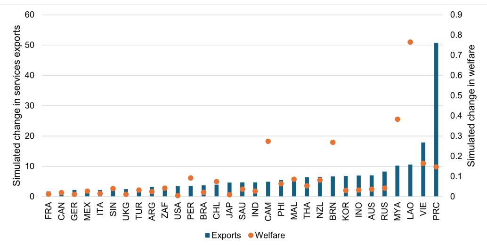  
ICT = information and communication technology, PRC = People's Republic of China.
Notes: The figure shows predicted changes in services exports for selected economies in simulation where the PRC introduced fourth generation regulation of the ICT sector, all things being equal. The three-letter codes are a combination of the Asian Development Bank and ISO 3166-1 alpha-3 codes.
Source: Authors' calculations.

## 6.2 The Impact of RCEP

We run two experiments on the impact of RCEP on services trade, output, and expenditure. The first counterfactual scenario change involves an FTA dummy to capture RCEP membership. The second experiment looks into the details of the RCEP protocols and matches them to applied policies as recorded in the STRI database for the RCEP members. The counterfactual scenario is constructed by changing applied policies that would not be in compliance with the full implementation of the RCEP. In all scenarios we estimate the impact on total services exports and total services output.

## 6.2.1 Experiment 1: An FTA Dummy

This experiment extrapolates how the average impact of an FTA applies to the RCEP members given the network of FTAs the members already participate in. FTA participation is represented by a dummy that takes the value 1 if a country pair is a member of the same FTA, and zero otherwise. The counterfactual is changing the FTA dummy to 1 where both countries in a country pair are members of RCEP. Since most of them already share a common FTA through ASEAN and its trade agreements, this will only change the dummy for Japan-PRC and Japan-Republic of Korea. We run the simulations with 2020 as the base year, which was before RCEP entered into force. The full equilibrium outcome of the experiment is depicted in Figure 10.

Figure 10: Predicted Change in Total Services Exports and Welfare following the Implementation of the RCEP  
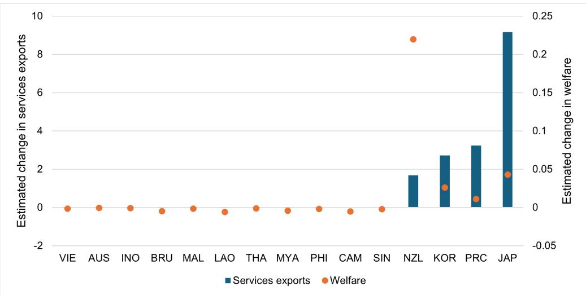  
RCEP = Regional Comprehensive Economic Partnership.  
Notes: The figure shows predicted changes in services exports for the RCEP countries and welfare as measured by changes in real services output. The predictions reflect the average impact of FTAs. The three-letter codes are a combination of the Asian Development Bank and ISO 3166-1 alpha-3 codes.  
Source: Authors' calculations.

As one would expect, the countries forming new preferential relationships, Japan, the Republic of Korea and the PRC, gain the most in terms of exports, but also New Zealand experiences a significant increase in exports. Furthermore, New Zealand gains the most in terms of changes in welfare.

## 6.2.2 Mapping the RCEP provisions to the STRI

The second experiment looks into the details of the RCEP services and digital chapters and matches the provisions in the agreement to applied trade policies as documented in the STRI/APEC index database. These scenarios do not consider reservations and limitations in the schedules and thus represent the long run maximum liberalization effect of RCEP. Appendix Table A7 lists the STRI/APEC index measures that have been modified in the RCEP scenario. Note that the changes under barriers to competition and regulatory transparency are considered non-discriminatory in nature and therefore apply on an most-favoured-nation (MFN) basis. Furthermore, such measures also apply to domestic suppliers and stifle competition in the local market. We think this is a useful scenario predicting the potential gains from a full implementation of the chapters relevant for services trade in RCEP. The first experiment creates a counterfactual scenario where we map the general provisions that apply to all services sectors to the

STRI/APEC index database. $^{[11]}$ The STRI/APEC index includes five policy areas (Restrictions on foreign entry; Restrictions on movement of people, Other discriminatory measures; Barriers to competition and Regulatory transparency). The first three policy areas mainly includes policy measures that can be implemented on a preferential basis, while barriers to competition and regulatory transparency usually apply to all services suppliers, including local firms. When matching the RCEP provisions to the STRI/APEC index we create a counterfactual scenario where the measures under barriers to competition and regulatory transparency are changed on an MFN basis. We also apply the restrictions under these two headings to internal trade. The horizontal counterfactual measures are depicted in Figure 11.

We note that only the Republic of Korea would need to change its MFN policies to fully implement the provisions in the RCEP agreement $^{12}$ . Both the degree of actual restrictions and the counterfactual preferential restrictions vary substantially across RCEP economies. The reason for this is that many of the measures are not covered by the RCEP agreement. For instance, nationality requirement for senior management is not permitted under the RCEP, but such requirements for board members are allowed. RCEP also does not require non-discrimination in public procurement while restrictions on movement of people are disciplined only on business travel and intra-corporate transferees. See Appendix Table A7 for details. The PRC is the RCEP member with the largest changes in applied horizontal policy measures, while Japan is the most open RCEP economy both before and after its implementation.

We present the outcome of the general equilibrium simulations in two steps. First, the reallocation of output following the direct change in relative trade costs as well as the indirect effect through multilateral resistance as explained in Equations 6 and 7. This step holds total output and expenditure constant. The next step lets the total output and expenditure adjust to the changes in relative prices and multilateral resistance. Both steps are depicted in Figure

During the first step, keeping total output and expenditure constant, services trade flows are redirected to reflect the new relative prices. For Singapore, trade diversion dominates. Thus, combined exports and imports from the PRC increases by 90%, while trade with India is reduced by 9.4% and for other third countries by between 8.5% and 9%. This trade diversion reduces real output slightly in Singapore. For the other RCEP countries, trade creation dominates and both trade and output increase. The PRC gains the most in terms of real output change, while Viet Nam sees the largest increase in exports. Also third countries gain in real output. The left-most observation in the graph shows the rest of the world average. The rest of the world gains from the boost in services trade, while its welfare is unaffected.

The second step captures the full equilibrium adjustments in output and expenditure following from lower services trade costs (orange bars and blue diamonds). The increase in output and expenditure lifts all boats. RCEP countries' exports increases by between almost 30% (Singapore) and about 50% (Viet Nam), with the PRC gaining 46.7% in exports and a small change in output.

Figure 11: Horizontal Policy Changes  
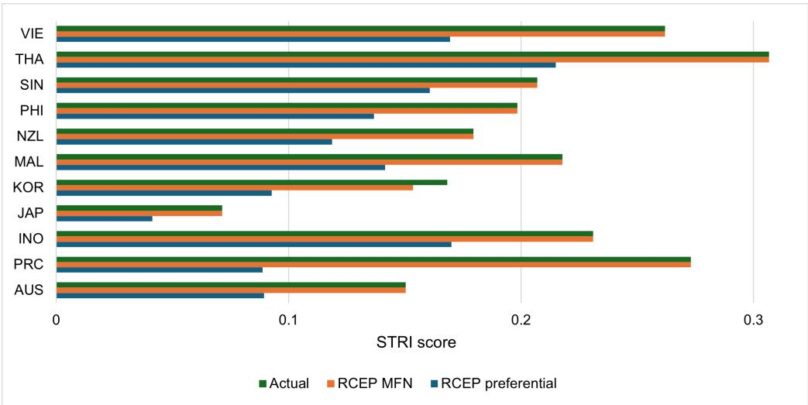  
MFN = most-favoured-nation, RCEP = Regional Comprehensive Economic Partnership, STRI = Services Trade Restrictiveness Index.  
Notes: The figure depicts the actual STRI for computer services for 2024 and the counterfactual matching the provisions in the services chapter and the digital chapter in RCEP to the STRI measures. The three-letter codes are a combination of the Asian Development Bank and ISO 3166-1 alpha-3 codes.
Source: Authorial calculations

Figure 12: Predicted Changes in Exports, Imports and Output, General Services Provisions  
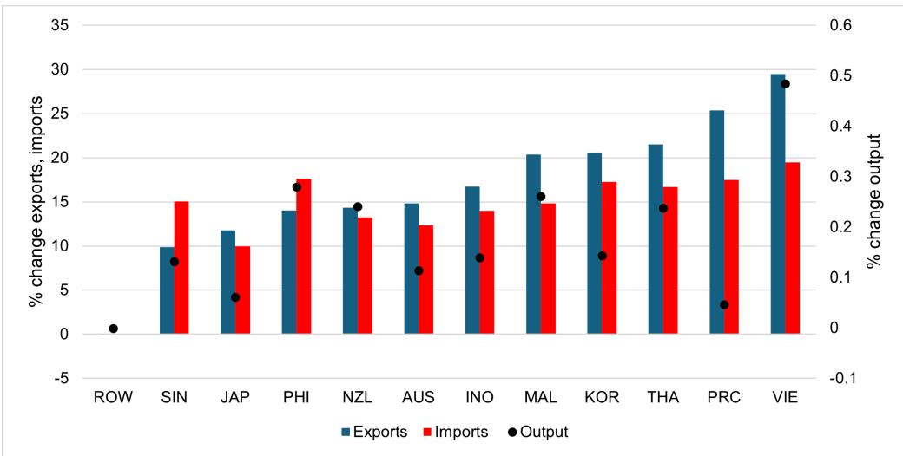  
Notes: The figure depicts the conditional and full export and output changes for total services following the full implementation of RCEP. The three-letter codes are a combination of the Asian Development Bank and ISO 3166-1 alpha-3 codes.
Source: Authors' calculations.

The next experiment adds the provisions in the RCEP telecommunications annex. As noted in Section 5, telecommunications reforms can have a substantial impact on services trade and services competitiveness. We now turn to assess the impact of committing telecommunications reforms in RCEP. To do so, we create a counterfactual STRI for telecommunications in the same manner as for total services above. We note that the list of measures in the STRI for telecommunications includes all the horizontal measures captured above, plus telecoms specific measures corresponding to Annex 8B in the RCEP agreement. The policy changes are depicted in Figure 13.

Figure 13: Policy Changes, Telecommunications  
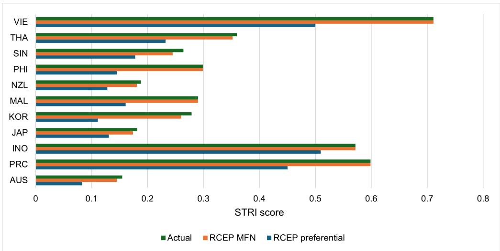  
MFN = most-favoured-nation, RCEP = Regional Comprehensive Economic Partnership, STRI = Services Trade Restrictiveness Index.  
Notes: The figure depicts the actual STRI for telecommunications services for 2024 and the counterfactual matching the provisions in the services chapter, its annex 8B, and the digital chapter in RCEP to the STRI measures. The three-letter codes are a combination of the Asian Development Bank and ISO 3166-1 alpha-3 codes.  
Source: Authors' calculations.

The overall restrictiveness is higher for telecommunications than for the services on average. Six countries would need to reform measures that apply on an MFN basis (Australia, the Republic of Korea, and Singapore on competitive bidding for universal services contracts; Japan, New Zealand and Thailand on setting a maximum time for regulatory decisions). The largest reduction in preferential barriers would be in the Republic of Korea where majority foreign ownership restrictions would have to be lifted towards RCEP partners with a full implementation of the agreement. Also the PRC would need to lift ownership restrictions, investment screening and joint venture requirements towards RCEP trading partners. The index remains high for the PRC, however, due to the presence of a dominant supplier in all telecoms markets, which means that the score on barriers to competition will not change. The counterfactual simulations adding telecommunications liberalization are reported in Table 8.

We finally run the experiment for commercial banking. Financial services are a sector that provides essential services to all sectors, including the payment services that underpins international transactions. The STRI/APEC index score includes all the horizontal measures captured in Figure 11. In addition it captures commercial banking specific measures in chapter 8A of the RCEP agreement. The counterfactual indices are depicted in Figure 14.

Figure 14: Policy changes, Commercial Banking  
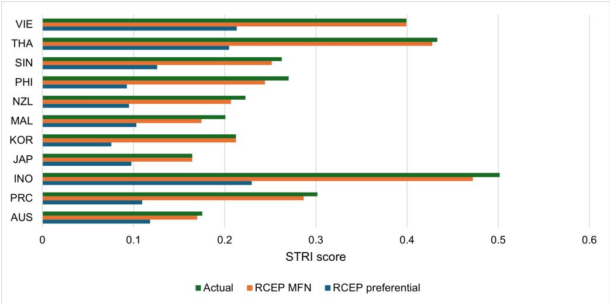  
MFN = most-favoured-nation, RCEP = Regional Comprehensive Economic Partnership, STRI = Services Trade Restrictiveness Index.  
Notes: The figure depicts the actual STRI for Commercial banking services for 2024 and the counterfactual matching the provisions in the services chapter, its annex 8A, and the digital chapter in RCEP to the STRI measures. The three-letter codes are a combination of the Asian Development Bank and ISO 3166-1 alpha-3 codes.  
Source: Authors' calculations.

We note that in this sector MFN measures are liberalized in all RCEP countries but Viet Nam. The measures that explain this change cover restrictions on legal form, restrictions on internet banking and the requirement that new products or services must be approved by the regulatory authority. Should RCEP provisions be implemented, the largest change would be in Indonesia, while the PRC would also substantially reduce restrictions. The results of the experiment for telecommunications and commercial banking are reported in Table 8.

In both experiments the changes are mainly a large shift in services trade flows within the RCEP area, while the rest of the world is not much affected. The fist step in the telecommunications experiment depicts trade diversion that negatively affect total output in Australia, Indonesia, Japan, New Zealand and Singapore. Once the full equilibrium effects, adjusting total output and expenditure, have taken hold, all economies gain.

Table 8: Simulation results, % change exports and output

<table><tr><td rowspan="2"></td><td colspan="4">Telecommunications</td><td colspan="4">Commercial banking</td></tr><tr><td colspan="2">Exports</td><td colspan="2">Output</td><td colspan="2">Exports</td><td colspan="2">Output</td></tr><tr><td>Economy</td><td>Cndl</td><td>Full</td><td>Cndl</td><td>Full</td><td>Cndl</td><td>Full</td><td>Cndl</td><td>Full</td></tr><tr><td>ROW avg</td><td>0.00</td><td>17.24</td><td>0.00</td><td>0.00</td><td>0.02</td><td>19.68</td><td>0.00</td><td>0.00</td></tr><tr><td>AUS</td><td>30.47</td><td>54.31</td><td>-0.47</td><td>0.20</td><td>24.38</td><td>45.83</td><td>0.48</td><td>0.17</td></tr><tr><td>PRC</td><td>39.05</td><td>59.21</td><td>1.69</td><td>0.08</td><td>34.45</td><td>52.23</td><td>2.84</td><td>0.08</td></tr><tr><td>INO</td><td>29.61</td><td>54.69</td><td>-1.16</td><td>0.21</td><td>106.60</td><td>118.21</td><td>9.71</td><td>0.71</td></tr><tr><td>JAP</td><td>26.48</td><td>50.84</td><td>-1.09</td><td>0.10</td><td>38.51</td><td>58.33</td><td>2.39</td><td>0.18</td></tr><tr><td>KOR</td><td>56.75</td><td>78.35</td><td>2.57</td><td>0.29</td><td>34.97</td><td>56.23</td><td>1.56</td><td>0.23</td></tr><tr><td>MAL</td><td>49.60</td><td>73.33</td><td>1.46</td><td>0.52</td><td>21.14</td><td>43.82</td><td>-0.54</td><td>0.27</td></tr><tr><td>NZL</td><td>26.39</td><td>50.32</td><td>-0.90</td><td>0.41</td><td>26.74</td><td>47.86</td><td>1.04</td><td>0.42</td></tr><tr><td>PHI</td><td>39.73</td><td>64.05</td><td>0.41</td><td>0.57</td><td>31.40</td><td>53.12</td><td>1.28</td><td>0.55</td></tr><tr><td>SIN</td><td>26.98</td><td>51.20</td><td>-1.01</td><td>0.31</td><td>22.91</td><td>44.62</td><td>0.22</td><td>0.25</td></tr><tr><td>THA</td><td>48.77</td><td>72.54</td><td>1.31</td><td>0.44</td><td>60.58</td><td>79.58</td><td>5.00</td><td>0.68</td></tr><tr><td>VIE</td><td>103.54</td><td>125.38</td><td>6.12</td><td>1.03</td><td>76.10</td><td>96.77</td><td>6.11</td><td>1.26</td></tr></table>

Note: The table reports the estimated change in exports and output for total services using the GEPPML counterfactuals matching the provisions in the RCEP text to the STRI for telecommunications and commercial banking respectively. Cndl represents the first step holding output and expenditure constant, while Full represents the full general equilibrium effect after output and expenditure have adjusted to the new trade costs and multilateral resistance terms. The three-letter codes are a combination of the Asian Development Bank and ISO 3166-1 alpha-3 codes. ROW avg represents the weighted average for the rest of the world.  
Source: Authors' calculations.

## 7 POLICY IMPLICATIONS AND CONCLUDING REMARKS

This paper explores the drivers of services trade in the PRC and the potential of digital and regulatory reforms for harnessing the benefits. The PRC's services sector has expanded rapidly both in terms of value added and employment, with productivity in services growing faster than in the industry sector. This underscores the importance of identifying policy reforms that support the growth of the PRC's services sector for economic resilience and long-term growth. Both domestic and international experience suggest that lowering restrictions on market access and reforming trade distorting domestic regulations can stimulate productivity and trade in services.

The paper explores two main scenarios by which the PRC can reap the benefits of services trade for enhancing productivity and output while contributing to consumption, employment creation and other relevant policy areas. While some policy reforms, in particular the expansion of Pilot Free Trade Zones (PFTZs) through commercial presence (FDI) remain a priority for some service sectors, the impact of structural and domestic regulatory reforms can be significant.

Reforms in the telecommunications regulatory regime can bring significant benefits to the PRC and other regional economies. Telecommunications are the backbone of digital infrastructure, offering a channel for foreign suppliers to reach customers, and offering consumers access to a variety of services. By upgrading the current early open market G2 regulations towards an integrated ICT G4 regime, the PRC can encourage further cross-border services trade and generate spillovers to neighboring economies in Asia. These reforms have the potential to improve the density, quality and cost-effectiveness of ICT infrastructure, resulting in a potential 50% increase in digital services trade and gains in market share both at home and abroad. These effects are driven by the positive spillovers of regulatory accountability, the existence of a competition authority and higher flexibility for consumers through measures such as number portability.

The scenario analysis also underscores that the PRC's neighboring trading partners such as the Lao PDR and Cambodia can experience significant trade and welfare gains. The modernization of ICT regulatory regimes can both increase the PRC foreign affiliate sales and favor the establishment of new foreign affiliates domestically. In this regard, the PRC's unilateral reforms in the ICT sector can be significant for enhancing regional integration in Asia and the Pacific.

The second scenario explores the PRC's implementation of services digital commitments under RCEP. The RCEP agreement reflects the commitment of Asian economies to take a gradual approach toward a free trade area of Asia and the Pacific. It was intended as a stepping stone toward more comprehensive integration, while deliberately leaving room for improvement. It also considers more flexibility on imposing disciplines on members at early stages of development.

The three scenarios proposed suggest positive impacts for different levels and degrees of implementation of RCEP commitments. Assuming simple FTA participation, the scenario suggests significant gains in services trade, in particular for the PRC, Japan and the Republic of Korea, who would form new preferential relationships. A second scenario creates a bilateral counterfactual by mapping RCEP provisions to the STRI/APEC index and provides a metric of the full potential of the agreement when fully implemented. The scenario analysis explores the implementation of both horizontal policy measures and sector measures, with a focus on telecommunications and banking services. Besides the potential gains in services trade and welfare, implementing RCEP commitments may also attract new FDI flows, reinforce the PRC's international credibility and support new trade negotiations.

## REFERENCES

Anderson, James E, Mario Larch, and Yoto V Yotov (2018). “GEPPML: General Equilibrium Analysis with PPML”. In: The World Economy 41.10, pp. 2750–2782.

Andrenelli, Andrea and Javier López González (2019). “Electronic Transmissions and International Trade-shedding new light on the moratorium debate”. In: Working Paper of the Trade Committee TAD/TC/WP(2019)19/FINAL.

Bergstrand, Jeffrey H and Jordi Paniagua (2024). “Do Deep Trade Agreements ‘Provisions Actually Increase—or Decrease—Trade and/or FDI?” In.

Beverelli, Cosimo et al. (2024). “Institutions, Trade, and Development: Identifying the Impact of Country-Specific Characteristics on International Trade”. In: Oxford Economic Papers 76.2, pp. 469–494.

Greenleaf, Graham (2009). “Five years of the APEC Privacy Framework: Failure or promise?” In: Computer Law & Security Review 25.1, pp. 28–43.

Heid, Benedikt, Mario Larch, and Yoto V Yotov (2021). “Estimating the Effects of Non-discriminatory Trade Policies Within Structural Gravity Models”. In: Canadian Journal of Economics/Revue canadienne d’économique 54.1, pp. 376–409.

Hummels, David and Alexandre Skiba (2004). “Shipping the Good Apples Out? An empirical Confirmation of the Alchian-Allen Conjecture”. In: Journal of political Economy 112.6, pp. 1384–1402.

Liberatore, Antonella and Steen Wettstein WTO (2021). “THE OECD-WTO Balanced Trade IN Services Database (BaTIS)”. In.

Lipovetsky, Stan and Michael Conklin (2001). “Analysis of Regression in Game Theory Approach”. In: Applied stochastic models in business and industry 17.4, pp. 319–330.

McElheran, Kristina et al. (2024). “AI Adoption in America: Who, what, and where”. In: Journal of Economics & Management Strategy.

Nordås, Hildegunn Kyvik (2023). “Services in the India-EU Free Trade Agreement”. In: International Economics 176, p. 100460.

Sullivan, Clare (2019). “EU GDPR or APEC CBPR? A comparative analysis of the approach of the EU and APEC to cross border data transfers and protection of personal data in the IoT era”. In: computer law & security review 35.4, pp. 380–397.

Yotov, Yoto V (2022). “On the Role of Domestic Trade Flows for Estimating the Gravity Model of Trade”. In: Contemporary Economic Policy 40.3, pp. 526–540.

— (2024). “The Evolution of Structural Gravity: The Workhorse Model of Trade”. In: Contemporary economic policy.

## Enhancing Digital Services Trade The Case of the People's Republic of China

This paper examines the drivers of digital services trade in the People's Republic of China and the role of regulatory reforms in shaping services competitiveness. Using new data on bilateral trade and foreign affiliate sales, the paper assesses the impact of information and communication technology (ICT) regulatory reforms and the implementation of the Regional Comprehensive Economic Partnership. Results show that both reforms would benefit Asian economies, with the largest effects stemming from reforms in the ICT sector.

## About the Asian Development Bank

ADB is a leading multilateral development bank supporting inclusive, resilient, and sustainable growth across Asia and the Pacific. Working with its members and partners to solve complex challenges together, ADB harnesses innovative financial tools and strategic partnerships to transform lives, build quality infrastructure, and safeguard our planet. Founded in 1966, ADB is owned by 69 members—50 from the region.