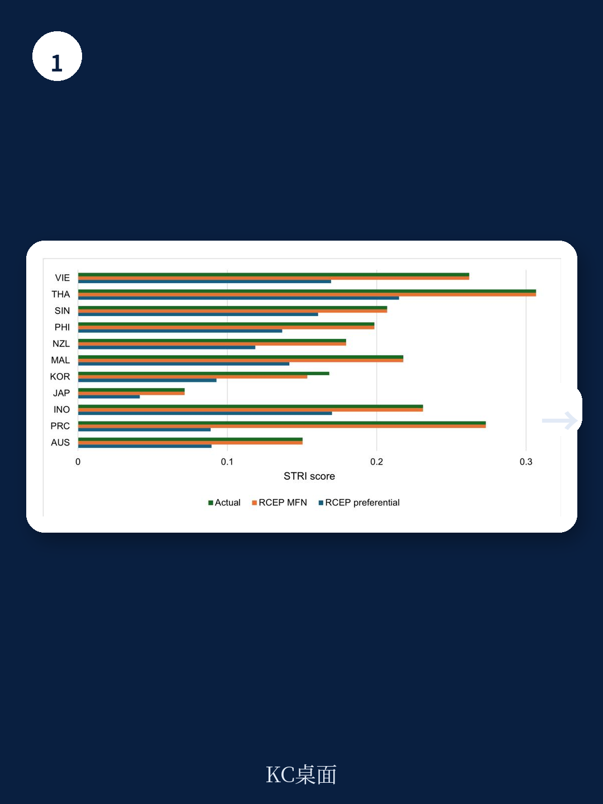
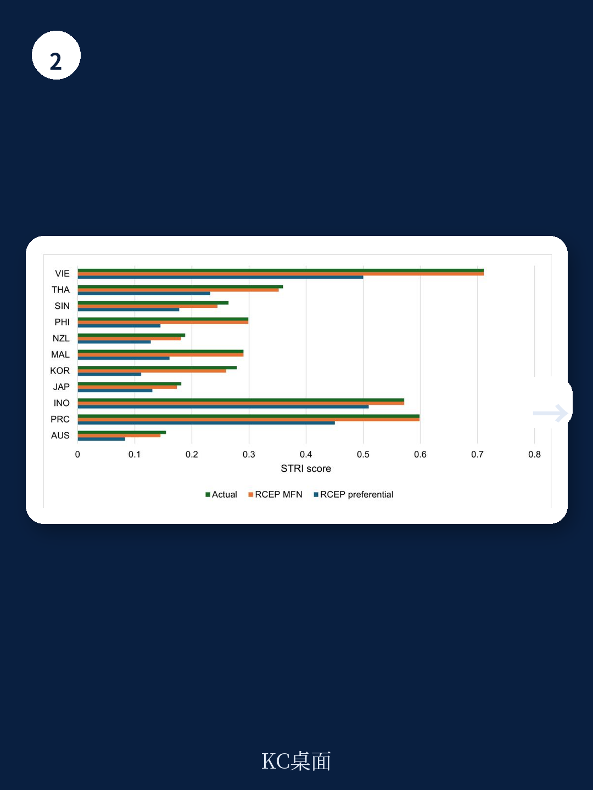

# 亚洲开发银行：增强数字服务贸易-以中国为例

亚洲开发银行一份以中国为案例的工作论文，用结构引力模型模拟了两个政策场景对数字服务贸易的影响。结论清晰：中国ICT行业的监管改革，其贸易拉动效应远超RCEP协定的实施。这不是一个关于“开放与否”的讨论，而是一个关于“改革顺序和杠杆效率”的量化判断。

报告首先拆解了中国数字服务贸易的现状。从2000年到2019年，中国数字可交付服务的进出口均从极低基数快速增长。出口以其他商业服务为主，进口中最大的类别是知识产权使用费——这反映了进口技术在所有行业中的渗透深度。但真正值得关注的是外资附属公司销售（GATS模式3）的规模：其体量远超跨境贸易，且中国外资附属公司的就业在2018年达到约600万人的峰值，主要集中在制造业。这意味着，数字服务贸易的竞争，很大程度上是跨国公司通过本地化运营实现的竞争。

报告的核心分析工具是OECD的数字服务贸易限制指数（DSTRI）和国际电信联盟的监管追踪器。中国在DSTRI上的限制主要来自“基础设施”领域，即跨境数据流动和数据本地化要求。而在ITU监管追踪器上，中国在“监管机构”和“竞争”两个维度得分偏低。这些政策指标被纳入结构引力模型，用于量化改革的影响。

> **KC评论：** 报告没有停留在“中国需要开放”的定性判断，而是把监管改革拆解为可量化的变量，并放入一般均衡框架中测算溢出效应。这种做法的价值在于，它让政策制定者看到：改革ICT监管，不仅是国内效率问题，更是区域贸易的乘数效应。

报告模拟的第一个场景是中国在ICT行业进行单边监管改革，重点包括：提高监管问责、建立独立的竞争主管机构、引入号码可携性等消费者灵活性措施。结果显示，这些改革有望使中国数字服务贸易增长50%，并产生区域溢出效应，尤其惠及老挝、柬埔寨等邻国。改革不仅会提升中国外资附属公司的海外销售，也会吸引更多外资进入中国。

第二个场景模拟中国全面实施RCEP服务贸易承诺。报告将RCEP条款映射到STRI/APEC指数，构建了一个“完全实施”的反事实。结果显示，RCEP的实施同样能带来显著的服务贸易增长，尤其对中国、日本和韩国这三个此前没有共同FTA的地区。但总体而言，其贸易拉动效应小于ICT单边改革。

这两个场景的对比揭示了一个关键判断：在数字服务贸易领域，国内监管改革的边际收益高于贸易协定的市场准入。RCEP的核心价值在于首次将亚洲主要地区纳入一个框架，但其条款本身留有余地，是一个“渐进式”的开放安排。而ICT监管改革直接作用于基础设施和竞争环境，是更具根本性的供给侧变量。

报告还指出，中国跨国公司的本土市场销售占比从2010年的约60%上升至2020年的约80%，数字服务领域也呈现类似趋势。这意味着，中国数字服务企业的国际化程度在下降，而非上升。监管改革若能降低跨境数据流动成本、提升电信基础设施质量，将直接改变这一格局。

对于关注亚洲数字贸易格局的读者而言，这份报告提供了一个可复用的观察框架：评估一个地区的数字服务竞争力，不应只看其贸易协定的覆盖范围，更应看其ICT监管的独立性和竞争政策的执行力度。中国在RCEP中的角色固然重要，但真正能撬动区域贸易增长的杠杆，可能藏在电信监管机构的独立性和数据本地化政策的调整空间里。

For informational purposes only. Portions may be generated,translated,summarized,or edited with AI assistance based on source materials and may contain omissions or errors. Please verify independently. This is not investment,legal,tax,accounting,or other professional advice.

