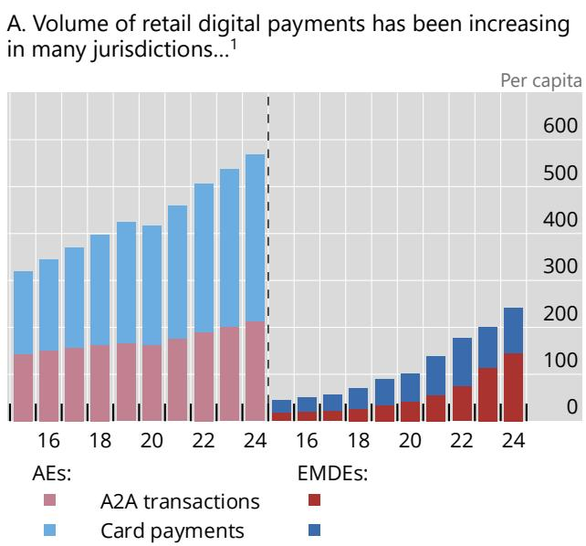
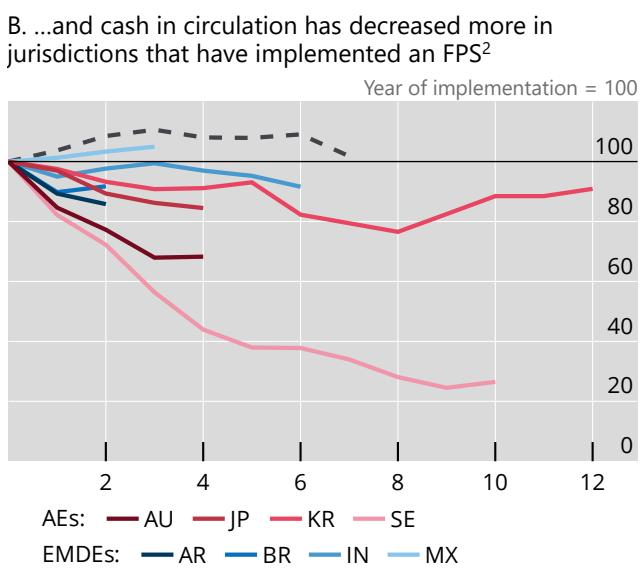
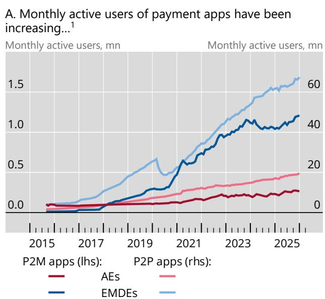
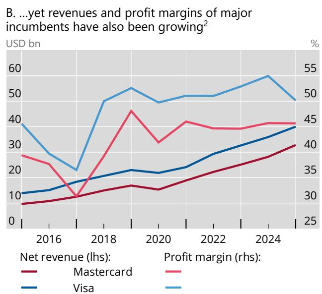

## BIS Bulletin

No 127

## Competition in retail digital payments

Daniele Natalizi and Vatsala Shreeti

13 July 2026

BIS Bulletins are written by staff members of the Bank for International Settlements, and from time to time by other economists, and are published by the Bank. The papers are on subjects of topical interest and are technical in character. The views expressed in this publication are those of the authors and do not necessarily reflect the views of the BIS or its member central banks. The authors are grateful to Iñaki Aldasoro, Jon Frost, Pablo Hernández de Cos, Gaston Gelos, Anneke Kosse, Thomas Lammer, Ulf Lewrick, Andrea Maechler, Benoit Mojon, Tara Rice, Tom Rosewall, Takeshi Shirakami, Peter Wierts and Leanne Zhang for comments, to Rudraksh Kansal for excellent research assistance, and to Nicola Faessler for administrative support.

The editors of the BIS Bulletin series are Gaston Gelos and Frank Smets.

This publication is available on the BIS website (www.bis.org).

# Competition in retail digital payments

## Key takeaways

\- Retail payments have digitalised rapidly in both advanced economies and emerging market and developing economies.

\- Digitalisation has altered the competitive landscape, with new entrants (eg fintechs and big techs) and new technologies, yet incumbent banks and card networks retain their dominant position in key markets.

\- In their role as operators, overseers and catalysts in payment systems, central banks support competition in diverse ways, depending on their mandates and institutional arrangements.

Digitalisation has transformed retail payments. Expanding internet and smartphone adoption, entry of new players like fintechs, big techs and other non-banks, innovations in underlying payment systems and the development of new payment technologies have changed the way households and businesses make payments. At the same time, these shifts are also altering the competitive landscape and the industrial organisation of retail digital payments.

Central banks play diverse roles in ensuring the safety and efficiency of retail payments – objectives that are influenced by the competitive landscape. This Bulletin examines recent trends in retail digital payments in advanced economies (AEs) and emerging market and developing economies (EMDEs). It highlights structural features of payment markets, the strategic behaviour of market participants and the ensuing risks of reduced competition. While mandates differ, several central banks support competition through direct interventions or close coordination with competition authorities.

## The changing landscape of retail payments

Retail digital payments are based on an architecture with three components: the user-facing front end, back-end retail payment systems and back-end wholesale settlement among payment service providers (PSPs) ((BIS (2020); OECD (2025)). This Bulletin focuses on domestic retail payments and analyses the first two components. $^{1}$

The user-facing front end refers to the interfaces, services and instruments through which end consumers, like households or businesses, initiate or accept digital payments. These can include payment cards, bank consortium apps (eg Swish in Sweden, TWINT in Switzerland), fintech payment services (eg PayPal, Revolut, PhonePe), big tech wallets (eg Apple Pay, Google Pay, Alipay, WeChat Pay) and mobile network operator-based systems (eg Airtel, M-Pesa, MTN). Some of these hold user funds in their ecosystem, while others transfer funds directly using the underlying retail payment system. These interfaces are usually compatible with various access technologies like near field communication (NFC) or quick response (QR) codes and can work remotely for e-commerce as well as at physical points of sale.

Retail payment systems refer to infrastructures and arrangements that route, authorise and clear retail transactions. These can include card networks, such as Visa, Mastercard, Cartes Bancaires, Bancomat or Rupay. They can also include account-to-account (A2A) transactions based on fast payment systems (FPS) such as Pix in Brazil, the Unified Payments Interface (UPI) in India or TARGET Instant Payment Settlement (TIPS) in Europe. Finally, they can include proprietary systems like the ones used by M-Pesa and other mobile money providers in East Africa for A2A payments.

Retail digital payments have taken off rapidly in both AEs and EMDEs, although important differences between them remain. In AEs, the increase in the volume of retail digital payments has been driven largely by card payments, while in EMDEs, A2A transactions dominate (Graph 1.A). At the same time, cash in circulation has fallen in many AEs and EMDEs, particularly those that launched an FPS (Graph 1.B).

Retail digital payments are increasingly popular in AEs and EMDEs  

Graph 1

  
- Global average, year 0 = 2015 (no FPS)  
Sources: Aksonthung et al (2026); Frost et al (2024); authors' calculations.

$^{1}$ Account-to-account (A2A) transactions include credit transfers, direct debit and e-money payments. AEs include Australia, Belgium, Canada, France, Germany, Hong Kong SAR, Italy, Japan, Korea, Netherlands, Singapore, Spain, Sweden, Switzerland, United Kingdom and United States. EMDEs include Argentina, Brazil, China, India, Indonesia, Mexico, Saudi Arabia, South Africa and Türkiye. $^{2}$ Banknotes and coins in circulation are shown as a percentage of narrow money (M1), except for KR for which currency in circulation/narrow money is shown. The dashed black line represents the average cash in circulation in jurisdictions that do not have a fast payment system (FPS).

Broader market changes have been important catalysts for rapid digitalisation of retail payments. These include rising smartphone penetration and mobile internet access, particularly in EMDEs. Mobile devices can also allow unbanked households and businesses to access digital payments (OECD (2025)). Moreover, the Covid-19 pandemic sharply accelerated digitalisation in several jurisdictions, as many individuals made their first retail digital payment during the pandemic (Demirgüç-Kunt et al (2022)).

Beyond these changes, the entry of new players in the payments market and the development of new technologies have also propelled retail digital payments. Mobile applications and wallet-based payment services provided by non-banks – including fintechs and big techs – have become popular. These are particularly prominent in economies with low penetration of alternative digital payment methods like cards (eg Alipay and WeChat Pay in China).

At the same time, new technologies like NFC and QR codes for contactless payments have made digital payments easier to make, increasing their popularity. Recent innovations in building alternative

Graph 2

retail-level payment systems, like the launch of FPS, have also led to greater uptake of retail digital payments. $^{2}$ Together, these forces have shifted the competitive landscape in retail payments and expanded the choices for households and businesses.

## Market structure and competition considerations

Markets for retail digital payments have become more contestable in many economies in the past decade. This has paved the way for new entrants. In the user-facing front end, mobile payment apps for both person-to-person (P2P) payments and person-to-merchant (P2M) payments (often provided by non-bank PSPs) have become popular in AEs and EMDEs alike, enabling greater choice for consumers (Graph 2.A). Contestability has also increased for back-end retail payment systems, supported by FPS that can provide alternatives to card networks. Yet the entry of new players does not guarantee effective competition by itself. In some cases, eg for card payments, incumbents continue to dominate retail digital payments. In the past decade, major global card networks have seen rising revenue and high margins (Graph 2.B). $^{3}$

Ensuring competition in payments markets can be inherently challenging. Many markets for front-end payment services, such as P2M payments, are two-sided (Rochet and Tirole (2003)). A wallet, app or card is valuable to consumers only if many merchants accept it and it is valuable to merchants only if

## The competitive landscape in retail digital payments

  
$^{1}$ Based on the top 100 person-to-person (P2P) and top 100 person-to-merchant (P2M) apps as classified by Sensor Tower for each AE and EMDE category. $^{2}$ The profit margins are expressed as a percentage, calculated as the ratio of net income to net revenue. AEs include Australia, Canada, Czechia, Denmark, euro area, Hong Kong SAR, Israel, Japan, Korea, New Zealand, Norway, Singapore, Sweden, Switzerland, United Kingdom and United States. EMDEs include Algeria, Argentina, Brazil, Chile, China, Colombia, Hungary, India, Indonesia, Kuwait, Malaysia, Mexico, Morocco, Peru, Philippines, Poland, Romania, Russia, Saudi Arabia, South Africa, Thailand, Türkiye, United Arab Emirates and Vietnam.  
Sources: Lubbersen (2026); Sensor Tower; authors' elaboration based on the annual reports of Visa and Mastercard (accessed online on 13 April 2026).

2 Other recent innovations include cryptoassets, stablecoins and retail central bank digital currencies, but their use in retail payments is currently limited (Hernández de Cos (2026)). Since the focus of this Bulletin is on gauging the current competitive landscape in retail digital payments, we do not focus on innovations that have not yet achieved scale.

3 The combined global market share of Mastercard and Visa, as measured by the annual number of card transactions in major jurisdictions (excluding China), has been stable at around 95% of all card transactions in the last decade. See Statista (2025), accessed on 25 April 2026.

consumers use it. This can give rise to significant direct and indirect network effects, organically creating barriers for new entrants and coordination failures, reinforcing the market power of incumbents. $^{4}$

At the same time, strategic behaviour by market participants in the front end can also stifle competition. Where digital payments rely on third-party providers, as with NFC technology for in-store payments, front-end competition can be constrained by gatekeepers that provide hardware. An example is Apple restricting third-party payment apps from accessing the NFC functionality on iPhones. $^{5}$

Fragmentation and lack of interoperability add to these challenges. If not addressed adequately, competing private payment interfaces may choose to keep their systems siloed, increasing costs for merchants and locking in consumers, ie reducing contestability. For example, prior to regulatory interventions in China and Peru, the biggest payment apps (eg WeChat Pay and Alipay in China and Yape and Plin in Peru) were incompatible with each other and with other payment apps.

Differences among PSPs in data access and usage capabilities, advantages from adjacent markets and strategic partnerships can be additional threats to competition in front-end payment markets. Banks hold detailed financial data. Fintechs may have superior data analytics tools but can lack the scale of banks. Big techs, when they provide payments, can combine transaction data with other data from their wider ecosystems (eg social media, search history). These differences in the scope and use of data can translate into competitive advantages, particularly when data-sharing obligations across market participants are also asymmetric. Participants can also leverage market power in adjacent markets to distort competition in payments by bundling, cross-selling or subsidising products and services. For example, Safaricom's market dominance in the Kenyan mobile money market has been sustained in part due to its control of the underlying telecom infrastructure (CAK (2016)). Traditional players like banks may also enter partnerships with their competitors like fintechs. In some cases, such partnerships can weaken competition (Puri et al (2024)).

The competitive forces shaping the market for underlying retail-level payment systems differ from front-end markets. Retail-level payment systems involve high fixed costs to build and maintain, and they exhibit strong network effects since a payment system's value for a participant depends on wide participation by other banks, non-banks, consumers and merchants. Payment systems also exhibit economies of scale in transaction processing (Bolt and Humphrey (2007)). These characteristics mean that the market structure can often tend towards a natural monopoly. As such, in many jurisdictions, particularly in AEs, incumbent card networks have retained their dominant positions, contestability is limited, and fees are high. More recently, FPS have increased contestability by providing alternative payment systems (especially in EMDEs), but competition challenges can re-emerge in the front end. $^{6}$

## The role of central banks in supporting competition

Central banks' engagement with retail digital payments varies significantly across jurisdictions. This reflects differences in mandates, institutional arrangements and market structures. Only a few central banks have explicit mandates to promote competition in retail payments (eg Reserve Bank of Australia). But many are responsible for the efficiency of payment systems, ultimately supporting competition.

Generally, central bank roles in payments fall into three broad categories: operator, overseer and catalyst (CPSS (2003); BIS (2020)). As operators, central banks build and run payment systems directly. As overseers (and regulators), they set requirements regarding access, risk management, governance, transparency and compliance in payment systems. As catalysts, they convene stakeholders, promote standards (eg ISO 20022) and encourage innovation without directly mandating outcomes. Despite these differences in roles, central banks are increasingly attentive to issues surrounding retail digital payments, particularly in EMDEs, as reflected in speeches on these issues (Graphs A.1.A and A.1.B in the online annex).

As operators, some central banks have built public payment systems that can directly reshape competitive dynamics at the retail level. For example, the Central Bank of Brazil (BCB) developed and operates Pix, an FPS that created a credible alternative to card networks. Pix enabled competitive entry by fintech companies and smaller banks (Duarte et al (2022)). Other examples include FedNow in the United States, SINPE Móvil in Costa Rica and TIPS in Europe. In these cases, central banks' direct operation of a retail payment system can enhance contestability. Some central banks have also introduced retail digital currencies, and others are actively experimenting with them. Their overall impact on the evolution of competition remains to be seen.

As regulators and overseers, central banks collaborate with the legislative bodies and can stimulate competition by fostering interoperability and non-discriminatory market access and regulating fees. For example, central banks in China, India and Peru mandated the interoperability of competing mobile wallets, which were previously closed-loop and incompatible with each other. In terms of market access, some central banks have issued explicit regulation to allow non-banks to participate in the payment system (eg BCB in 2013, Bank of England in 2017, ECB in 2025). $^{7}$ Several central banks also regulate prices of retail digital payments, particularly interchange fees and more unusually merchant fees. The overall effect of such regulation on competition is mixed (Mukharlyamov and Sarin (2025); Wang (2025)).

As catalysts, central banks have facilitated the development of standards and promoted coordination with the industry and other public authorities. In this role, many central banks sponsor national forums where stakeholders can convene to discuss issues related to coordination failures, a key risk arising in two-sided retail payment markets (for example, European Central Bank's Euro Retail Payments Board or the National Payments Council of India, a not-for-profit consortium of private and public banks supported by the Reserve Bank of India).

Central bank approaches to competition in retail digital payments reflect complex policy trade-offs. First is the trade-off between competition and fragmentation. Intense competition at the front end without interoperability can lead to fragmentation, limiting the benefits of economies of scale, reducing payment speed and fragmenting liquidity. Promoting and mandating interoperability can reduce consumer lock-in and switching costs but may not be effective if the market has already tipped towards the dominant participants. Second, central banks may also face stability and security concerns when expanding market access to non-banks. Opening payment systems to non-bank participants can spur innovation and improve efficiency but requires robust prudential and operational frameworks to manage the risks of operational outages, fraud, cyber attacks, money laundering or PSP default. Third, promoting competition at the retail payment system level, eg by launching an FPS with zero user fees and mandatory PSP participation, can accelerate adoption but may constrain the profitability of private sector participants.

Navigating these trade-offs can be challenging. Data on pricing schemes and the costs of different payment instruments remain scant. For central banks and other regulators, enhancing data collection and sharing efforts can address blind spots in decision-making. Another challenge concerns potential overlaps in the regulatory perimeter with competition authorities and other regulators. This makes close coordination between different regulatory authorities essential.

Aksonthung, C, A Kosse and I Mustafi (2026): "Tap a card, pay by phone, but cash still holds its own", CPMI Briefs, no 12.

Bank for International Settlements (BIS) (2020): "Central banks and payments in the digital era", Annual Economic Report 2020, Chapter III.

Bolt, W and D Humphrey (2007): "Payment network scale economies, SEPA, and cash replacement", Review of Network Economics, vol 6, no 4.

Claessens, S and T Rice (2026): "Cross-border payment technologies: innovations and challenges", BIS Papers, no 167.

Committee on Payment and Settlement Systems (CPSS) (2003): Policy issues for central banks in retail payments.

Competition Authority of Kenya (CAK) (2016): Competition inquiry into USSD service provision in Kenya.

Cornelli, G, J Frost, L Gambacorta, S Sinha and R Townsend (2024): "The organisation of digital payments in India – lessons from the Unified Payments Interface (UPI)", SUERF Policy Note, no 355.

Demirgüç-Kunt, A, L Klapper, D Singer and S Ansar (2022): The global 2021 findex database; financial inclusion, digital payments and resilience in the age of Covid-19, World Bank Group.

Duarte, A, J Frost, L Gambacorta, P K Wilkens and H S Shin (2022): "Central banks, the monetary system and public payment infrastructures: lessons from Brazil's Pix", BIS Bulletin, no 52, March.

Eroglu, H, G Cornelli, J Frost, F Rühmann and V Shreeti (2026): “Opening doors to open finance: evidence from the international experience”, BIS Papers, no 168.

Frost, J, P K Wilkens, A Kosse, V Shreeti and C Velásquez (2024): "Fast payments: design and adoption", BIS Quarterly Review, March.

Hernández de Cos, P (2026): "Stablecoins: framing the debate", speech at a Bank of Japan seminar, Tokyo, 20 April.

Lubbersen, V (2026): "Locked out by loyalty: entry deterrence through rebates in payment card markets", De Nederlandsche Bank Working Papers, no 856.

Mukharlyamov, V and N Sarin (2025): "Price regulation in two-sided markets: empirical evidence from debit cards", Journal of Financial Economics, vol 172, 104094.

Organisation for Economic Co-operation and Development (OECD) (2025): "Competition in mobile payment services", OECD Roundtables on Competition Policy Papers, no 324.

Puri, M, Y Qian and X Zheng (2024): "From competitors to partners: banks' venture investments in fintechs", NBER Working Papers, no 33297.

Rochet, J-C and J Tirole (2003): "Platform competition in two-sided markets", Journal of the European Economic Association, vol 1, no 4.

Statista (2025): "Number of purchase transactions on global general purpose card brands American Express, Diners/Discover, JCB, Mastercard, UnionPay and Visa from 2014 to 2024 (in billions)".

Vipps MobilePay (2026): "Vipps MobilePay close to profitability after strong turnaround", press release, 12 May.

Wang, L (2025): "Regulating competing payment networks", Kilts Center at Chicago Booth Marketing Data Center Paper.