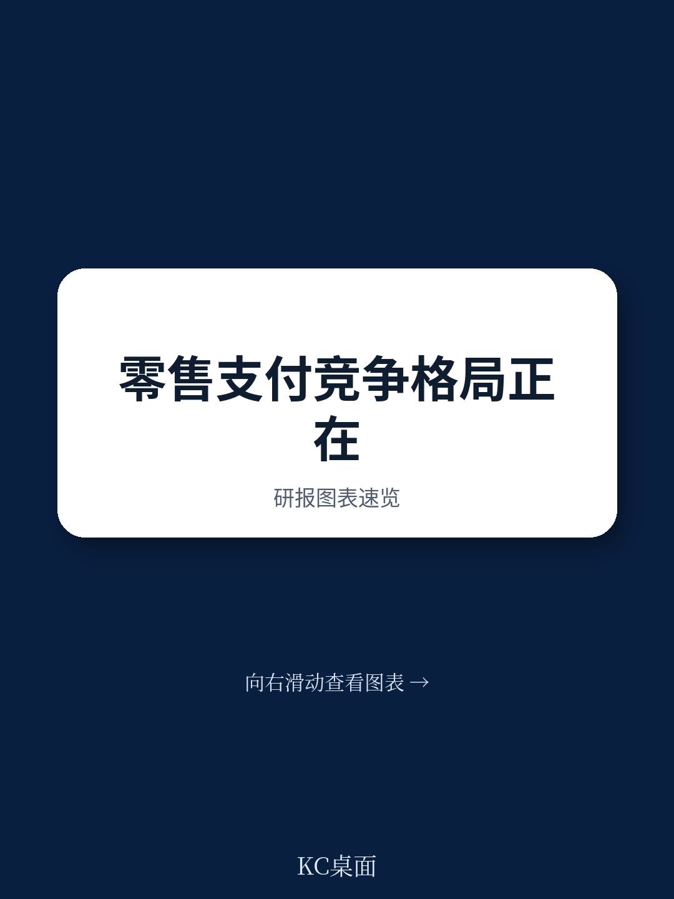

# 国际清算银行：零售数字支付竞争

零售支付正在经历有史以来最剧烈的数字化迁移。智能手机普及、疫情催化、新玩家涌入，这些变化让消费者和商户的支付选择大幅增加。但国际清算银行（BIS）最新发布的第127号公告指出，选择增多并不等于竞争格局已经改变。在关键市场，传统银行和卡组织依然牢牢占据主导地位，而新进入者带来的竞争不确定性，远没有表面看起来那么大。

这份报告的核心判断是：零售支付市场的数字化，正在改变竞争的形式，但尚未从根本上改变竞争的结构。对于政策制定者和市场参与者而言，真正需要关注的不是“谁进来了”，而是“谁还留在牌桌上”。

## 1. 卡组织的利润率和市场份额，说明竞争壁垒比想象中更高

报告引用的数据显示，过去十年，全球两大卡组织Visa和Mastercard的收入持续增长，利润率维持在较高水平。它们的合计市场份额（按主要地区卡交易笔数计算，不含中国）稳定在约95%。这个数字在过去十年几乎没有变化。

这意味着，尽管大量新玩家涌入前端应用层——比如各种手机钱包、支付App——但后端清算网络的控制权依然高度集中。卡组织作为底层基础设施的运营者，其市场地位并未因数字化而受到实质性挑战。报告特别指出，支付系统具有高固定成本和强网络效应的特征，市场结构天然倾向于自然垄断。新玩家在前端争夺用户，但后端通道的定价权和规则制定权，仍掌握在少数几家手中。

> **KC评论：** 这张图值得多看两眼。95%的市场份额在十年间纹丝不动，说明这不是技术问题，而是结构性问题。任何试图绕过卡组织的新方案，都需要面对一个已经完成规模效应的网络。

## 2. 快速支付系统正在改变游戏规则，但主要发生在新兴市场

报告区分了两种零售支付架构：基于卡的网络和基于账户对账户（A2A）的快速支付系统（FPS）。数据显示，在发达地区，零售数字支付的增量主要由卡支付驱动；而在新兴市场和发展中地区，A2A交易占主导。

巴西的Pix、印度的UPI、欧洲的TIPS，这些由中央银行直接运营或推动的快速支付系统，正在创造卡网络之外的替代通道。报告以巴西央行的Pix为例，指出其直接运营一个零售支付系统，能够有效增强市场的可竞争性——它让资金科技公司和小银行获得了参与竞争的基础设施。

但报告也提醒，快速支付系统本身并不能自动解决竞争问题。当底层通道开放后，竞争不确定性会转移到前端应用层。如果前端应用之间缺乏互操作性，市场可能再次走向碎片化，消费者和商户面临新的锁定效应。中国和秘鲁在监管介入之前，主要支付App之间互不兼容，就是典型的案例。

## 3. 数据不对称和相邻市场优势，正在制造新的竞争鸿沟

报告识别了一个容易被忽视的竞争不确定性：不同支付服务提供商在数据获取和使用能力上的差异。银行持有详细的财务数据，资金科技公司可能拥有更先进的数据分析工具，而大型科技公司（big techs）则可以将支付数据与社交、搜索、电商等生态数据打通。

这种数据能力的差异，在数据共享义务不对称的情况下，会转化为可持续的竞争优势。报告还指出，参与者可以利用在相邻市场的支配地位，通过捆绑销售、交叉补贴等方式扭曲支付市场的竞争。肯尼亚Safaricom在移动货币市场的持续主导地位，部分就源于其对底层电信基础设施的控制。

这意味着，支付市场的竞争问题，正在从“支付本身”扩展到“数据生态”和“基础设施控制权”。单纯关注支付环节的定价和准入，可能无法触及竞争扭曲的根源。

## 4. 中央银行的角色正在从旁观者变为参与者，但面临多重权衡

报告梳理了中央银行在零售支付领域的三种角色：运营者、监管者和催化剂。不同角色的选择，反映了各国在竞争、稳定、效率之间的不同权衡。

作为运营者，中央银行可以直接建设公共支付系统，如巴西的Pix、美国的FedNow。这种做法的好处是直接增强市场可竞争性，但报告也指出，如果快速支付系统设定零用户费用并强制参与者加入，可能会压缩私营部门的盈利空间，长期可能影响创新动力。

作为监管者，中央银行可以通过强制互操作性、开放非银行机构准入、监管交换费等方式干预市场。但报告引用研究指出，价格监管对竞争的影响是混合的，并非总是正向。

作为催化剂，中央银行可以搭建行业协调平台，推动标准制定。欧洲央行的欧元零售支付委员会和印度国家支付委员会，都是这种角色的典型实践。

报告特别强调了一个政策权衡：前端竞争如果不伴随互操作性，可能导致碎片化，反而损害规模宏观环境和支付效率。另一个权衡是，向非银行机构开放支付系统可以促进创新，但需要配套的审慎和操作不确定性管理框架。

对于政策制定者而言，报告提出的核心建议是：加强数据收集和共享，填补定价和成本信息的盲区，并与其他监管机构（尤其是竞争主管部门）保持密切协调。零售支付市场的竞争问题，已经超出了中央银行传统职能的边界。
