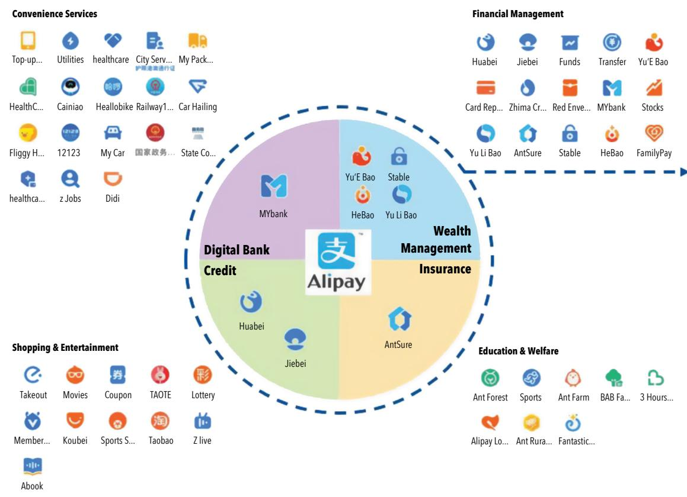

TECHNICAL

NOTES & MANUALS

# BigTech in Financial Services: Emerging Regulatory Considerations

Parma Bains, Gabriela Conde, Nobuyasu Sugimoto, and Caroline Wu

TNM/2026/09

The image is too blurry to recognize the content.

TECHNICAL NOTES AND MANUALS

# BigTech in Financial Services: Emerging Regulatory Considerations

Parma Bains, Gabriela Conde, Nobuyasu Sugimoto, and Caroline Wu

© 2026 International Monetary Fund
Cover Design: IMF Creative Solutions

BigTech in Financial Services: Emerging Regulatory Considerations
Parma Bains, Gabriela Conde, Nobuyasu Sugimoto, and Caroline Wu
TNM/2026/09

## DISCLAIMER:

Technical Notes and Manuals are aimed at a broad audience interested in technical assistance issues. The views expressed in Technical Notes and Manuals are those of the authors and do not necessarily represent the views of the IMF, its Executive Board, or IMF management.

## Abstract:

Large technology firms (BigTech) are increasingly expanding into consumer-facing financial services, particularly payments, credit, insurance, asset management, and financial SuperApps. Although their current financial stability implications remain limited in most jurisdictions, rapid growth, especially in emerging market and developing economies, raises new conduct, prudential, and systemic risks. This paper analyzes BigTech business models, key activities, and associated risks and assesses the adequacy of existing regulatory frameworks. It discusses practical options for supervisors to enhance risk identification, strengthen sector-based and groupwide supervision, expand the regulatory perimeter, improve data protection frameworks, and reinforce domestic and international coordination.

## Recommended Citation:

Bains, Parma, Gabriela Conde, Nobuyasu Sugimoto, and Caroline Wu. 2026. "BigTech in Financial Services: Emerging Regulatory Considerations." IMF Technical Notes and Manuals 2026/09, International Monetary Fund, Washington, DC.

ISBNs:

979-8-229-04516-2 (paper)

979-8-229-04531-5 (ePub)

979-8-229-04525-4 (web PDF)

## Contents

Abbreviations 1
Executive Summary 2
I. Recommendations 3
II. Introduction 4
III. Key BigTech Activities and Risks 8
IV. Regulation for BigTech 17
V. Conclusion 29
References 30
Figure
Figure 1. The Alipay "SuperApp" Ecosystem 15
Boxes
Box 1. Different Types of BigTech 6
Box 2. When Does an App Become a Financial SuperApp—from M-Pesa to M-Pesa SuperApp 15
Box 3. Supervising BigTech, the Brazilian Approach 25

The image is too blurry to recognize the content.

## Abbreviations

<table><tr><td>AE</td><td>advanced economy</td></tr><tr><td>API</td><td>application programming interface</td></tr><tr><td>BaaS</td><td>banking as a service</td></tr><tr><td>BHC</td><td>bank holding company</td></tr><tr><td>BNPL</td><td>buy now, pay later</td></tr><tr><td>CBK</td><td>Central Bank of Kenya</td></tr><tr><td>CFPB</td><td>Consumer Financial Protection Bureau</td></tr><tr><td>CNY</td><td>Chinese yuan</td></tr><tr><td>EMDE</td><td>emerging market and developing economy</td></tr><tr><td>FHC</td><td>financial holding company</td></tr><tr><td>KSh</td><td>Kenyan shilling</td></tr><tr><td>MMF</td><td>money market fund</td></tr><tr><td>SMEs</td><td>small and medium enterprises</td></tr><tr><td>SSBs</td><td>standard-setting bodies</td></tr></table>

## Executive Summary

Large technology conglomerates that primarily have business models in nonfinancial sectors (BigTech) are expanding into consumer-facing financial services. Although the range and scale of financial services provided by BigTech are currently modest, limiting their financial stability implications in most jurisdictions, they are growing rapidly in emerging market and developing economies. If current trends continue, BigTech could create financial stability risks across jurisdictions in four ways:

\- Some BigTech firms have established themselves as providers of systemically important financial services, such as digital retail transactions through mobile payments to consumers and micro and small enterprises, a critical service in some jurisdictions with little direct substitutability.

\- BigTech firms offer multiple services that may not be systemic on their own but could become so when combined with others within the group. For example, extracting information from payment data to support lending to previously excluded borrowers, thereby generating critical dependencies on BigTech services and a lack of substitutability for those borrowers.

\- Financial interconnectedness between BigTech and financial incumbents is growing through direct ownership in, or joint financial intermediation with, those incumbents.

\- Operational interconnectedness is increasing because of cloud, data, artificial intelligence, and other technology services provided by BigTech to financial institutions that may raise concentration risks if most financial institutions need to rely on a few providers for critical functions.

Payment service providers and nonbank lenders are typically subject to activity-based regulation, and supervision focuses on regulated activities conducted by licensed entities, not the group as a whole. Although good supervisory practices are emerging, they often do not consider the size, scale, interlinkages, and complexity of the services carried out by BigTech firms. The growth of BigTech in financial services generates not only some benefits, including greater financial inclusion, efficiencies through economies of scale, possible technological innovation, and potentially the delivery of cheaper and more tailored products, but also new risks. Given this growth and the potential implications for financial stability, regulators should take action to manage emerging risks. In countries where BigTech already provides material financial services, they should take actions in five areas: (1) enhance monitoring; (2) enhance coordination and cooperation domestically and globally; (3) strengthen financial regulation and supervision; (4) expand the regulatory perimeter; and (5) strengthen data protection frameworks. Some actions can be taken immediately without waiting for legislative amendments to reduce risks. Efforts in these areas can be launched in parallel, though they differ in complexity and implementation timelines.

No global financial standards apply specifically to BigTech, nor are existing standards tailored toward the specificities of BigTech, notably the fact that they combine payments with other financial services, such as microlending. Given the cross-border nature of BigTech activities, such as the provision of payment services, global standards should be developed to facilitate internationally consistent regulation and effective cross-border cooperation.

## I. Recommendations $^{1}$

## A. Improve Risk Identification and Horizon Scanning

Enhance monitoring through market studies and research, and by convening key stakeholders to improve their understanding of new business models developed by BigTech.

## B. Improve Domestic Coordination

Enhance domestic coordination on BigTech and improve the effectiveness of existing coordination mechanisms before creating new ones or reforming organizational setups.

## C. Strengthen/Implement Sector-Based Regulation

Ensure that BigTech's financial activities within jurisdictions are subject to robust sector-based regulation that is fit for purpose and in line with global standards (where they exist).

## D. Intensify Supervision of Prudential and Governance Requirements

Move toward risk-based supervision with active use of on-site and off-site supervision to improve the risk-management and governance practices of the regulated entities of BigTech.

## E. Strengthen Indirect Supervision and Address Contagion Risks

Regulators of financial institutions that are partnering with BigTech should monitor such partnerships and mitigate the contagion risks by fostering strong risk-management practices in regulated firms.

## F. Expand the Regulatory Perimeter

Apply conglomerate supervision proportionate to the corporate structure and activities, including segregating the financial activities of BigTech firms and subjecting them to financial regulation and supervision.

## G. Strengthen Data Protection and Privacy Frameworks

Promote and support the development of national data protection and privacy frameworks.

## H. Enhance Regional and International Cooperation

Regulators should use regional groups and supervisory colleges. Standard-setting bodies should consider updating the Joint Forum's 2012 Principles for the Supervision of Financial Conglomerates.

## II. Introduction

The term "BigTech" refers to large technology conglomerates that use platform-based business models and network effects centered around data creation to propel business growth. Specifically, their business models are geared toward maximizing interactions with users to generate data, which in turn drives more services and user activity, yielding ever more data. IMF (2022) defines BigTech as "platform-based business models [that] focus on maximizing interactions between a large number of mainly retail users," with a core business model "across markets." $^{2}$

BigTech's expansion into regulated financial markets has three main drivers (Box 1):

\- Commercial drivers. BigTech's nonfinancial activities generate commercial incentives to expand, notably into payment services for e-commerce transactions, lending facilities for buyers and merchants on BigTech platforms, and insurance intermediation for platform users. Such expansion does not necessarily compete with incumbent firms to the extent that BigTech serves the needs of new demographics composed largely of underserved or financially excluded users. Shifting demand away from their traditional nonfinancial offerings may also drive BigTech to explore new revenue streams. $^{3}$

\- Technology drivers. BigTech leverages technology and economies of scale to provide potentially better services and user experiences in the short term, responding to changes in user preferences and demand for customer-centric solutions. They partner with incumbents to provide banking and payment solutions (so-called embedded finance) $^{4}$ through application programming interfaces (APIs). Other examples of technological drivers are cloud computing, which facilitates the rapid expansion of new products, and machine learning, which enables the prediction of consumer behavioral patterns. In some emerging technologies, BigTech has large advantages based on the underlying data they hold (for generative artificial intelligence models) or the resources they have to deploy (for quantum computing).

\- Demand from incumbents. Incumbents such as banks use emerging technologies and third parties, including BigTech, to generate new revenue streams through modular banking—similar to what has already occurred in securities markets. Technologies such as cloud computing, APIs, and machine learning allow incumbents to generate new business models such as digital retail banks, banking as a platform, $^{5}$ and banking as a service (BaaS). $^{6}$ Banks traditionally integrate the four layers of the banking process: balance sheet or risk retention, product design, customer relationship, and distribution. Modular banking allows incumbents to specialize in some layers and outsource others, including to BigTech. Banks typically hold on to the balance sheet layer and, often, to the product layer, while outsourcing the customer relationship and the distribution layers.

The regulatory landscape has also influenced how BigTech firms have expanded into financial services. Nonbank financial service providers (incumbents, start-ups, and BigTech) are typically subject to activity-based conduct regulation and relatively simple entity-based prudential regulation, including payment service providers, micro and consumer credit providers, and insurance intermediaries. BigTech firms tend to avoid highly regulated activities, such as deposit taking or insurance underwriting. Instead, they intermediate payments, investment products, and insurance services with retail clients where the regulatory burden is less onerous and network effects with their nonfinancial activities are greater. They also provide technology services as so-called third parties to financial firms that are not subject to direct financial regulation. Such services include the provision of cloud platforms, data analytics, and technology products that support financial institutions' processes, such as RegTech for compliance.

The growth of BigTech in financial services has benefited some countries with large unbanked populations. Here, BigTech's expansion through large platform-based distribution networks has been associated with greater financial inclusion. BigTech firms are also able to drive efficiencies through economies of scale, technological innovation, and the delivery of cheaper and more tailored products and services that combine user data from financial and nonfinancial business lines, although it is not clear whether these benefits are long-lasting.

Network effects play a key role in allowing BigTech to scale quickly into products, services, and markets. Meta launched Threads, a Twitter/X-like social media application, in July 2023, and it took just 24 hours to reach 30 million users, and less than a week to reach 100 million, although not all these users were retained. In financial services, Sesame Credit, a credit rating product from Ant Group, took just 11 months to reach 100 million users, whereas Yu'e Bao, a money market fund (MMF) offering, took 20 months to reach the same figure.

Network effects create strong incentives for BigTech firms to dominate their targeted markets. In nonfinancial services, BigTech firms often bought or imitated rivals and embedded these products into their core offerings. Although initially innovative, this approach can lead to an eventual erosion of innovation and poorer outcomes for consumers and markets in the long term with regard to cost and product/service quality. $^{7}$ For example, over the past decade, Meta, the parent company of Facebook, has purchased rivals Instagram and WhatsApp, while imitating competitors through their core offerings, such as Stories (from Snap), Reels (from TikTok), and Threads (from Twitter/X).

Furthermore, many types of technology-driven services by BigTech firms are offered for "free" to customers, albeit with several indirect costs. First, users' rights and ability to control their data are often limited, resulting in value creation for BigTech for which data subjects are not compensated. $^{8}$ Second, firms pay to advertise their products to target consumers on BigTech platforms, and these costs are likely to be passed on to end users. Finally, the users of BigTech platform services may be subject to lock-in effects that raise their costs and concentration risks in the long term.

Strong network effects that BigTech firms rely on in financial services can also generate new risks and amplify existing ones in four ways. Three of these, as noted in IMF (2022), are as follows: (1) their multiple activities that increase risk through their cumulative effect; $^{9}$ (2) their operational interconnectedness; and (3) their financial interconnectedness with incumbent financial service providers. As a more recent development, we have seen in some countries that (4) they can grow to provide systemically important activities such as payment services or microlending.

This paper builds on the IMF's 2022 publication on BigTech (IMF 2022), looks at the expansion of BigTech into consumer-facing financial activities, and focuses on how regulators and supervisors can address the conduct and prudential risks arising from such activities. $^{10}$ With the pace of BigTech expansion being fastest in emerging market and developing economies (EMDEs), the paper explores the sectors that are most affected in those jurisdictions—payment intermediation, credit provision, insurance, and asset management—but the analysis is applicable more broadly across markets.

The first section of this paper explores key activities conducted by BigTech firms and covers customer-facing activities in payments, consumer credit, insurance, asset management, and the growth of financial SuperApps. The second section explores approaches that regulatory authorities, particularly "host" jurisdictions, can take to mitigate risks, while allowing sensible innovation to flourish. It also explores the need for regulatory cooperation across borders and greater focus on BigTech risks at a global level.

## Box 1. Different Types of BigTech

BigTech firms have diverse business models, enter financial markets in different ways, and might bring a different set of risks and benefits. Some BigTech firms rely more on data as a core part of their business model (Ant Group, Google), some rely on fees and commissions (Mercado Libre), and others rely on hardware (Apple). Likewise, their core businesses differ, including but not limited to social media and messaging (Tencent, Meta), e-commerce (Alibaba, Amazon), and search engines (Baidu, Google).

The core offering of BigTech firms may also affect how they approach expansion into regulated financial services. Although payments seem like a natural extension for all BigTech, it is particularly enticing for those with social media or messaging platforms as their core business model since they can allow users to carry out peer-to-peer transactions more quickly and easily within their platform, without any need to enter other applications. BigTech with e-commerce platforms or hardware sales as their core business might be better placed, or more likely, to offer credit and insurance products after first expanding to payments, given the need for finance and coverage for the products or services that the platforms offer or facilitate. This might explain why, in many jurisdictions, social media-driven platforms like Meta go down the route of obtaining e-money and payment licenses, whereas Apple and Amazon pursue lending and insurance licenses.

Developing a common understanding of what constitutes a BigTech firm helps ensure that where risks are similar, regulatory outcomes are as well, and where risks are unique, new approaches can be identified. This can be difficult given the diversity of business models and likely varied effect that they will have on financial markets. The European Commission has proposed qualifying criteria to determine which firms might fall within the perimeter of its Digital Markets Act. Considerations include the size and scope of activities; presence in multiple markets; combination of different data types, that is, both financial and nonfinancial; access to low-cost capital; and an established global user base. $^{1}$

It is important to separate BigTech from larger technology-enabled entities that operate purely in financial markets. Some technology-driven firms, such as PayPal and Monzo, have achieved significant scale in financial markets, but their core business models are in financial services with much smaller revenue generated from nonfinancial services. This fundamentally alters their risk profile and the ability to impose regulation, given the complexity of BigTech business models and the operation across multiple sectors. They are also less able to combine data from nonfinancial and financial activities to offer more tailored products and services.

## Source: IMF staff.

$^{1}$ The Act designates certain online platforms as “gatekeepers” if they have an annual turnover of a minimum of €7.5 billion in the European Union (EU) in the previous three years, or a market valuation of at least €75 billion; have at least 45 million monthly end users and at least 10,000 business users established in the European Union; control one or more core platform services in at least three European Union member states; have a strong economic position and significant effect on the internal market; provide a core platform service, which is an important gateway for business users to reach customers; and have an entrenched and durable position in the market, either now or in the near future.

## III. Key BigTech Activities and Risks

## A. Payment Activities

Payment activities have been a common entry point across jurisdictions for BigTech in financial services as a natural extension of their core business lines. $^{[11]}$ The pandemic supercharged the growth of some digital payment providers as countries around the world moved toward online transactions because of lockdowns, social distancing, and other restrictions and behavioral changes that made physical transactions difficult. In Latin America, Mercado Pago, the payment arm of e-commerce BigTech Mercado Libre, saw payment transactions on its platform increase from 838 million in 2019 to over 11 billion in 2024 (Statista 2026b).

Platforms such as social media, e-commerce, and ride hailing all require trusted exchange of value, so the ability of BigTech to create an environment that maximizes trust but minimizes friction incentivizes their entry into payment services. BigTech firms tend to focus on the interface with end users through the provision of digital wallets and other front-end services. They are conducting payment activities in advanced economies (AEs) as well as EMDEs, although the nature of the expansion is distinct across these two groups of countries.

In many AEs, the widespread use of card-based payments ensures ready availability of a digital alternative to cash. As a result, BigTech's entry into payment services has been slower and largely limited to the provision of digital wallets that store payment information in the form of tokenized data on mobile devices. $^{12}$ These wallets act only as a technology layer that is not directly regulated and does not have its own infrastructure, relying instead on third-party infrastructures (such as credit cards) that are regulated separately for value transfer. Some regulators are considering whether allowing digital wallets to remain outside the regulatory perimeter is sustainable given their growth across the products they support and their importance to users.

Across many EMDEs, BigTech has expanded faster and deeper into the payment space, given the relative paucity of card-based services (FSB 2020a). BigTech firms deliver payment services on non-card-based retail payment infrastructure, for example, using QR codes to initiate payments in real-time payment systems. In some countries, the volume of payments facilitated by BigTech is larger than that processed by banks.

Among EMDEs, China's experience is archetypal. Although card-based payments exist, merchants have traditionally been reluctant to accept credit cards because of their processing fees, resulting in reliance on cash-based payments. This was an environment ripe for disruption, and payment service providers, led by BigTech, began offering payment services initiated through QR codes and cleared initially through their proprietary systems, reducing interchange fees significantly.

Two large BigTech firms—Alipay and WeChat Pay—dominate the Chinese mobile payment market with close to a 95 percent share of retail mobile payment transaction volume. $^{13}$ In Kenya, Safaricom, a technology conglomerate that is mainly a mobile operator but also offers e-commerce, cloud, and music streaming services, had a 89.7 percent share of mobile payment transaction volume through its M-Pesa application in 2025, although this has fallen from highs of 95 percent in 2023 with increased competition and regulation (Communications Authority of Kenya 2025). GrabPay, the payment arm of ride hailing firm Grab, has a 35 percent market share of mobile payment transaction volumes in Singapore (Statista 2026a). In India, as of January 2025, Google Pay has a 35 percent market share for Unified Payments Interface usage (Statista 2025). The use of interoperable or clustered QR codes in some markets has allowed for greater competition.

Offering payment services can provide BigTech not only with a steady revenue stream (although with small margins) but also with data points that can be leveraged to personalize products and services. These data can be processed, packaged, and sold to third parties. Payment data are an important indicator of creditworthiness, particularly when combined with nonfinancial information such as e-commerce and social media data (sometimes called “alternative data”) to create more accurate user profiles, although alone it cannot provide a complete overview of a user’s financial health.

BigTech firms have the resources, expertise, and embedded user base to experiment and potentially deliver completely new ways of transacting. This can be achieved through both traditional and new technology stacks. M-Pesa's growth in Kenya was built on conventional technology through electronic mobile money transfers that solved the problem of access for rural, unbanked, and underbanked populations through a network of agents. The growth of BigTech in payments in China has been predicated on the use of QR codes, a technology that is almost three decades old. However, Alipay and WeChat Pay created an ecosystem where each individual, merchant, and other specific payment points have unique QR codes assigned to them to help deliver peer-to-peer transfers.

Some BigTech firms have used or are experimenting with emerging technology, such as distributed ledger technology, to transact value domestically and across borders, with limited success. Some have done this indirectly, for example, by providing a platform for third parties to offer crypto-related services, whereas others have taken a more direct approach of building their own infrastructure based on distributed ledger technology. The use of crypto assets, including stablecoins, is currently limited mainly within crypto markets, but there has been significant interest by BigTech in crypto markets to achieve new payment solutions. Most famously, Meta (then Facebook) announced the development of a so-called global stablecoin–Diem (then known as Libra). Diem aimed to become a new global crypto-based currency that could use Meta's significant user base to rapidly grow and offer new methods of domestic and cross-border payments, although it was not launched. Other BigTechs have also experimented with, or launched, crypto-related products, for example, Mercado Pago. More recently, Google has announced the development of the Google Unified Cloud Ledger as a layer 1 blockchain to support payments. $^{14}$

The growth of BigTech in payment activities has benefited users across markets, most notably in EMDEs. For example, between 2006 and 2019, the launch of M-Pesa played a key role in improving access to financial services in Kenya from 14 percent to 83 percent of the population (Schachter 2018). The use of BigTech payment services can also drive financial inclusion in other areas by allowing users to build up a history that can then help assess creditworthiness. For retail users, analyzing payment patterns, including regular gifts from family members, can allow BigTech to better understand whether a user is likely to be able to repay a loan. For small and medium enterprises (SMEs) that often struggle to get credit from traditional banks, payment volumes can also be a signal to BigTech to determine whether they are likely to be eligible for credit products. This in turn can act as a signal for banks that might in the future be more likely to offer credit to those firms.

The expansion of BigTech into consumer-facing payment services also presents risks:

\- Unlike smaller payment-focused start-ups or technology-driven firms that have their core business models in financial services, BigTech has the potential to become systemic quickly because of its large embedded user base. This potential for rapid growth, combined with a cross-border footprint, can challenge the ability of financial regulators to exercise oversight, especially if resources are scarce.

\- BigTech can cross-subsidize financial and nonfinancial activities to develop new products, initially at a loss. Although loss-leader strategies can reduce costs and increase choice in the short term, they may stifle competition and reduce consumer choice in the longer term.

\- Consumer protection and market integrity rules may lag behind in the face of rapid digitalization, leading to an increase in digital and payment fraud—as seen, for instance, in India with UPI and Brazil with Pix and more globally through social media advertisements or scams conducted on social media platforms (Reuters 2023). $^{15}$

\- Rapid digitalization can also challenge user privacy if data protection and privacy rules do not keep pace with increased digital financial inclusion.

"Open banking," which has proliferated globally, has the potential to facilitate the entry of BigTech in the financial services sector. $^{16}$ Open banking—the ability of third-party providers like payment-focused start-ups to access payment account and transaction data held by banks, with customer consent—aims to increase competition in payments by allowing the unbundling of customers' payment experience from banks. Given their resources, technology, and scale, BigTech could easily outcompete smaller start-ups and potentially increase market power in financial markets. "Open finance" can accelerate this trend by giving BigTech access to additional financial data, allowing them to develop more accurate user profiles. "Open data" frameworks allow data to flow in all directions, under consumer consent, and subject to national data protection frameworks and predicated on the use of privacy-preserving or privacy-enhancing technologies. Some jurisdictions, notably Australia, have included reciprocity within their open banking frameworks, forming the basis of broader open data-like frameworks, to allow a two-way flow of "equivalent" data, although determining data equivalence can be a challenge. $^{17}$

Where digital payments are available, they have traditionally been dominated by banks. Banks have taken different approaches to manage the competitive threat of BigTech. In some jurisdictions, they have partnered with BigTech, for example, by providing banking services to the payment arms of BigTech or providing them with access to the payment infrastructure operated by banks. In other cases, banks are competing directly with BigTech. In Argentina, the growth of Mercado Pago has led to the development of Modo, a digital wallet collaboration between large banks and payment service providers. In Sweden, Swish, a payment application launched by the six largest banks, dominates the payment sector, with over 85 percent of the population having active accounts. In the United States, a group of commercial banks launched Paze, a joint digital wallet that connects directly to customers' credit and debit accounts.

## B. Credit

In many EMDEs, BigTech is playing an increasing role in credit distribution, particularly for the unbanked and underbanked. BigTech can use data from their payment services and nonfinancial activities (notably e-commerce and social media) to build up an accurate picture of borrower characteristics and creditworthiness, allowing them to extend credit to users with thin credit files. They may also offer uncollateralized loans, leveraging borrowers' payment accounts to enforce repayment (through automatic deductions) or otherwise discouraging nonpayment (by threatening to exclude borrowers from their broader ecosystems, such as e-commerce platforms). This type of behavior could do harm to consumers, including locking them out of basic or fundamental services where BigTech provides a critical service or where there are few direct substitutes (FSB 2019). In some jurisdictions, 80 percent of the total financial sector revenues of BigTech are generated from consumer credit.

The expansion of BigTech into the credit sector is predicated on enabling policies and business models. Using enabling policies such as open banking, BigTech can receive consumers' data from banks through APIs, leading to the modularization of banking. They can also enter new business models, including BaaS as well as more traditional partnerships with incumbent financial institutions. For example, Amazon partnered with ING to offer loans to SMEs in Belgium and Germany. Using data collected in its e-commerce platform, Amazon offers loans to eligible merchants that are redirected to the bank's website for submitting credit applications.

BigTech has made significant strides in the provision of credit through both consumer credit and microfinance in several EMDEs. In some instances, lending to retail users as well as small and micro enterprises is the largest revenue generator for BigTech in financial services since profit margins in payment services are usually thin.

BigTech distributes credit through three main avenues: (1) originated and marketed by the BigTech (directly or through a licensed subsidiary); (2) offered jointly with an incumbent bank through joint risk sharing, with the majority of risk carried by the banks because of power imbalances; and (3) originated by a commercial bank but marketed and administered by BigTech firms on their platforms.

Although the provision of credit is an important revenue generator, growth in many jurisdictions is often constrained by lack of banking licenses and deposit taking on the part of BigTech firms, and corresponding higher funding costs of a BigTech's balance sheet. Funding costs for BigTech are often greater given they rely more heavily on market financing. This means that BigTech lending tends to be made at higher rates than bank loans, and so it targets higher-risk borrowers (potentially excluded or underserved) and could lead to higher nonperforming loans.

An area of the credit market where BigTech has potential to make advances is buy now, pay later (BNPL). This is short-term financing that allows consumers to pay for purchases at a later date and stands out as one of the new forms of BigTech's foray into credit provision. This general definition comprises different models such as split pay, pay later, long-term financing at 0 percent annual interest rate, or longer-term financing with subsidized interest or fee.

The expansion of e-commerce during the COVID-19 pandemic contributed to the widespread adoption of BNPL. A study conducted by the US Consumer Financial Protection Bureau showed that from 2022 to 2023, the number of loans increased by 23 percent, and the total dollar amount of loans originated increased by 26 percent (CFPB 2023). In the United Kingdom, 25 percent of adults used BNPL at least once during 2024 (UK Finance 2025). Other countries with significant uptake are Australia, China, Finland, Germany, The Netherlands, New Zealand, Norway, Singapore, and Sweden (BIS 2023b).

BNPL is present in AEs and EMDEs. In the United States, for example, Amazon Pay joined forces with the BNPL provider Affirm to enable Amazon Pay customers to choose between biweekly or bimonthly payments for purchases over \$50, starting at 0 percent APR. In Latin America, Mercado Libre's Mercado Crédito allows customers to finance in up to 12 monthly installments not only purchases within the platform but also QR payments and utility bills.

BNPL can pose risks to consumer protection, and market and financial integrity:

\- If BNPL providers do not contribute to credit bureaus, aggregate figures on household and SME indebtedness will be underestimated.

\- Interest charges for delayed repayments may be very high, as BNPL providers are often not bound by usury limits, which might be exacerbated by the usage of confusing pricing and fee structures.

\- Credit decisions based on algorithms trained on large databases may be biased and result in financial exclusion.

\- Dispute resolution mechanisms may be lacking or unclear, hurting consumers, for example, by requiring installment payments while disputes are being investigated.

\- Financial integrity concerns may arise if know-your-customer requirements do not apply to BNPL providers.

## C. Insurance

The insurance sector has been less attractive to BigTech, partly because of tight prudential and conduct regulation. Insurance underwriting entails large economies of scale and size, which are needed for effective diversification and risk management. User data, such as health-related data collected by wearable devices, can be particularly relevant for insurance underwriting and risk management.

BigTech firms enter the insurance space as intermediaries for, and service providers to, insurers. They often act as insurance intermediaries, including brokers and agents, marketing and selling insurance products underwritten by insurers. The insurers bear most risks (including underwriting, market, and credit risks), whereas BigTech bears conduct and operational risks. BigTech also provides services to insurance underwriters and intermediaries, such as cloud services and other information technology system support.

Most BigTech firms that have entered the sector started as insurance intermediaries (FSI 2023). From a sample of 18 BigTech firms, only five have established licensed insurance companies, and those are generally small. They are more active in non-life and health insurance than in life insurance, as those products are more closely linked to BigTech's ecosystem, for example, property and liability insurance related to the e-commerce businesses and health insurance for BigTech that are active in health care. Within the same sample, all but two BigTech firms have acquired an intermediary license for insurance product distribution. Insurance intermediaries typically have access to customer information. Although they are subject to license/registration requirements, those are mainly for conduct purposes, and prudential requirements (such as capital, valuation, and liquidity) are often absent or light.

BigTech intermediaries have developed an “embedded insurance” model whereby many BigTech business lines are involved in the marketing and distribution of insurance products. BigTech is leveraging its existing customer relationships, user interfaces, and other technologies to introduce insurance products and services—offering “insurance marketplaces” as a one-stop shop for insurance and other financial products. Some BigTech-owned insurance intermediaries have grown materially in size. For example, Ant Insurance has become the largest online insurance marketplace in China. Its gross written premiums reached \$7 billion in 2020, accounting for 10 percent of China’s internet insurance market and 1 percent of China’s total insurance market. $^{18}$ Some BigTechs are major shareholders of insurers that offer underwriting services. In China, Alibaba, Tencent, JD, and Didi are all major shareholders of insurance providers.

Although BigTech firms do not yet offer underwriting at scale, in some countries, they offer niche insurance policies. A potential growth area is joint underwriting services—similar to joint loans—with risks shared across incumbents and BigTech firms. In countries where insurance penetration is relatively low, this business strategy could see BigTech firms scale up quickly in the insurance market.

## D. Asset Management

In some jurisdictions, BigTech firms have also made inroads into asset management. As they intermediate payments, BigTech firms often hold funds on behalf of customers who may seek greater returns.

In China, Ant Group launched Yu'e Bao in 2013, an MMF, to respond to growing funds in its payment services e-float and unattractive returns from bank deposits. The fund is operated jointly with Tianghong Asset Management (majority owned by Ant Group). The MMF became popular with retail users as many wealth management products in China are subject to minimum investment thresholds, whereas Alipay users can invest as little as CNY 1 into Yu'e Bao and withdraw at any time. Earn+, a service offered by Singapore-based SuperApp Grab, is another example of an MMF that allows small investments and withdrawal flexibility. This service partners with two licensed asset management firms and offers an annual return of 2 percent to 2.5 percent, although the return is not guaranteed.

MMFs are required to invest in high-quality liquid assets such as government bills or highly rated corporate bonds. Their ability to offer daily liquidity can be challenged in the face of shocks, when the underlying assets are not as liquid as cash and highly liquid securities. The liquidity mismatch between assets and liabilities may be particularly important in countries with shallow capital markets. In addition, a financial safety net, notably access to central bank liquidity facilities, is generally not available to MMFs. Retail MMF investments integrated with payment services, which require full and immediate redemption in cash, can amplify risks through interconnectedness and contagion, a key source of systemic risks.

## E. Financial SuperApps

Financial SuperApps developed by BigTech have grown rapidly during the past decade, especially in EMDEs. Through integrated services developed in-house, partnerships with licensed entities, and hosting third-party functions on one platform, financial SuperApps such as WeChat Pay, Alipay, Gojek, and M-Pesa have grown quickly to dominate their home markets. Often starting with digital payment services, financial SuperApps offer lending, investment, and insurance and have expanded beyond core financial services into utility, social benefits, and other government services (Box 2). This bundling of services eliminates navigating through multiple apps for daily needs and offers consumers a highly personalized experience through big data. At the same time, such one-stop-shop models could become nonsubstitutable, bringing large concentration risks, and potentially affecting financial stability.

The rapid development and adoption of financial SuperApps in EMDEs are driven by three main factors. First, a large base of unbanked or underbanked customers who use BigTech's mobile phone-based payment services. Second, the ease of service—users do not need to navigate through multiple apps and perform repetitive tasks. Third, the creation of digital footprints, enabling a more efficient rating system compared with traditional credit bureaus, thereby fostering financial inclusion.

Financial applications can grow to become SuperApps in two main ways—either as “diversified” SuperApps or as “aggregation” SuperApps. Most SuperApps begin as payment applications (and more specifically digital wallets) such as Monzo, Revolut, PayPal, and N26. These applications then grow their services through two routes:

\- As diversified applications, the platform offers its own brand financial services through its own applications. These services are deeply integrated into the core offering of the SuperApp provider. Examples include WeChat Pay that offers loan and investment products originated and managed by its own group entities. Incumbent financial institutions, such as HSBC, have also developed diversified applications that offer several financial products from the same provider. This could limit user choice in the long term, potentially removing better, cheaper, or more appropriate products from consumers' radar (a little like not being on the first page of search engine results).

\- Aggregator SuperApps provide access to various third-party providers on their service, bringing together various products and services into one easy-to-access application. Examples include Gojek and Grab. It is important to note that the distinction between these two types of SuperApps may not always be clear. For example, Alipay has an integrated service built through its digital wallet platform, which not only offers several internally developed services (Figure 1) but also hosts third parties such as ride hailing firm Didi. The Alipay app links more than 1 million restaurants, 40,000 supermarkets, 1 million taxis, and 300 hospitals.

The most impactful SuperApps are those deployed by BigTech firms given their large embedded userbase and their ability to combine their own deeply integrated services, while also offering third-party services that are broader than financial services, for example, ride hailing. In China, about 640 million people use more than one category of product in a SuperApp ecosystem, whereas 190 million use five or more, rapidly allowing BigTech to play a key role in multiple financial sectors quickly. SuperApps can benefit their users by providing a convenient one-stop shop for the financial services. They can grow rapidly in their home jurisdictions, and although they have struggled to scale across countries, some BigTech firms have invested in SuperApp providers in host markets to expand their footprint.

There may be considerable risks to users when SuperApps offer complex financial products without appropriate user suitability assessments or reduce consumer choice for products and services that may be cheaper, better, and more suitable but not available on the SuperApp. This may entrench the power of SuperApp providers. In some jurisdictions, such as the European Union, regulation aimed at reducing the concentration risks of platform providers could constrain the growth of financial SuperApps. In many countries, such regulations are not in place, particularly if regulators are resource constrained.

Figure 1. The Alipay "SuperApp" Ecosystem  
  
Source: Ant Group disclosure.

## Box 2. When Does an App Become a Financial SuperApp—from M-Pesa to M-Pesa SuperApp

Although SuperApps may take different shapes and forms, how large do they need to become to transform from a payment service provider to a financial SuperApp? Safaricom's newly rolled out M-Pesa SuperApp may give a clue—whether this platform hosts any third-party services, some of which may extend beyond financial services.

Safaricom dominates the mobile money transfer market in Kenya, having over 34 million active subscribers and a 90 percent market share in Kenya (TechTrends 2020). M-Pesa is licensed by the Central Bank of Kenya (CBK) as a payment service provider to issue, process, store, send, and facilitate mobile money payments. In addition to mobile money services, M-Pesa offers two savings and loan products—M-Shwari with NCBA Bank Kenya (launched in 2013) and KCB M-Pesa with KCB Bank (launched in 2015). Both offer short-term, small-value loans to borrowers without a credit history, as well as “target” and “locked” savings accounts to M-Pesa subscribers. For both services, the bank working with M-Pesa is responsible for maintaining regulatory compliance, reporting to the credit bureau, and lending funds.

Despite the various financial services offered through M-Pesa, it was not considered a financial SuperApp until June 2021 when Safaricom announced a new platform with functions including offline transactions, access to customized statements, and mini apps that support a variety of financial and other services. Over 60 companies have partnered with Safaricom to provide their services through apps hosted on the platform. Safaricom provides hosting, distribution, and marketing support to these businesses, and more are expected to join the platform. The M-Pesa SuperApp had 3 million active customers as of July 2023 (CIO Africa 2023).

Since M-Pesa was first launched in 2007, the CBK has followed a “test and learn” approach. In the 2021 Bank Supervision Annual Report, CBK noted the rise of super apps and acknowledged their potential disruption to existing financial services. The SuperApp may lead customers to set aside banking apps and to reduce the use of cash or cards. CBK plans to closely monitor super apps that offer loans, insurance, and investment. So far, there is no clear framework for regulating super apps offering multiple financial services or whether a full-banking license is required. It is also unclear whether the daily transaction limit of KSh 300,000 through M-Pesa is applicable and monitored when using the SuperApp.

Source: IMF staff.

## IV. Regulation for BigTech

Regulatory authorities need to be able to identify, analyze, and manage the risks of BigTech, while allowing activities that can improve outcomes for consumers, markets, and financial stability. When risks from BigTech's financial activities are material, regulators can take several steps, and some have already done so, including in larger EMDEs, such as dedicated resources and legal reforms. Regulators in some jurisdictions have decided to adjust existing rules to capture new technologies and business models. Even where bespoke regulation is developed, existing rules may still form the foundation for sector-based regulation as new technologies and business models emerge. For example, crowdfunding could be captured under existing securities regulation (for equity-based crowdfunding), credit (for lending-based crowdfunding), be subject to new bespoke regulation (United Kingdom), or be restricted by regulation (China).

Many authorities continue to have limited powers and resources to oversee BigTech's financial activities. They can nonetheless take a range of concrete actions. These actions include (1) enhancing monitoring (through effective horizon scanning); (2) strengthening financial regulation and supervision—initially with a focus on existing sectoral regulation but with a view to moving to entity-based regulation and group-wide supervision; (3) introducing or upgrading broader data protection frameworks; and (4) enhancing coordination and cooperation domestically and globally. By covering as many of these actions as possible, regulatory authorities will be better positioned to address the risks arising from BigTech activities in their jurisdictions.

When taking these steps, financial authorities should communicate publicly and consult broadly. Regulators should share lessons learned from their experience on BigTech regulation publicly and regularly through lessons learned from reports or postimplementation reviews. Postimplementation reviews can also explore any unintended consequences of policy interventions.

## A. Improving Risk Identification and Horizon Scanning

Having a robust monitoring framework is key to identifying and analyzing existing and emerging risks posed by BigTech, as a first step toward supervision and regulation that better reflects the complexity of their business models. Monitoring group risks beyond just regulated entities and assessing contagion risks to local financial services is likely to be challenging in host jurisdictions, particularly if BigTech firms lack physical in-country presence. Even home supervisors might find it difficult to identify where risks arise and how best to monitor them, given the breadth of activities conducted by BigTech. In addition, where incumbent regulated firms rely heavily on outsourcing and third-party service providers for their critical services, supervision can be challenging as reporting and inspection powers against third parties are often limited. $^{19}$

Regulators and supervisors can enhance their monitoring by conducting market studies and convening key stakeholders to better understand the financial activities provided by BigTech. The typical components of such studies include defining and identifying BigTech, understanding which BigTech firms provide financial services to end users in the jurisdiction; collecting quantitative data and qualitative studies by the private sector, academia, and other research institutions; organizing study groups or roundtables; and publishing the results with potential regulatory and supervisory options as next steps. The use of demonstration days can help regulators better understand new products or services delivered by nonbank entities, including

BigTech. $^{20}$ The development of “digital twins” is at an early stage but shows promise in understanding new opportunities and risks. $^{21}$

Some regulatory authorities have launched innovation hubs and regulatory sandboxes to better understand new business models and activities. Although emerging evidence suggests that innovation hubs help authorities conduct outreach, particularly with firms outside the regulatory perimeter, there is no strong evidence that either approach materially improves supervisory monitoring. Product-testing regulatory sandboxes, in particular, are often resource intensive and may be unsuitable for supporting BigTech without suitably tailored guardrails. Creating these new institutional arrangements is neither necessary nor appropriate for resource-constrained authorities to monitor risks from BigTech. Such monitoring can be conducted through existing supervisory structures. Policy sandboxes could help develop regulatory responses to BigTech, albeit with a radically different design to regulatory sandboxes, whereas digital sandboxes could be useful in allowing smaller firms to offer data-heavy services such as services based on machine learning algorithms. $^{22}$

## B. Improving Domestic Coordination

Strengthening and broadening domestic coordination is critical. The risks arising from BigTech expansion into the financial sector must be addressed by multiple authorities, including financial regulators across sectors, as well as nonfinancial authorities, notably competition and data privacy and protection authorities. Actions by financial and nonfinancial authorities often support each other. Hence, it is useful to establish a regular dialogue, improve information and data sharing, and strengthen operational capabilities to do so. This would allow these authorities to work together to achieve multiple objectives, including financial stability and financial inclusion.

Balancing the potential financial inclusion benefits of BigTech, while managing the risks to financial stability, is important. In countries where prudential and conduct regulators are also in charge of fostering financial inclusion, potential friction between those mandates needs to be managed carefully. In countries where they are not, close interagency coordination is required. Financial regulators will also need to work closely with nonfinancial regulators to ensure adequate oversight of BigTech risks arising from the combination of nonfinancial and financial activities.

Financial regulators should identify which authorities—financial and nonfinancial—they should coordinate with and identify each authority's roles and responsibilities in relation to the financial services provided by BigTech. For financial regulators, the Joint Forum Principles for Financial Conglomerates call for "the group-level supervisor" to "take the lead in ensuring supervisory cooperation, coordination and information sharing." $^{23}$ This should be the authority with responsibility over BigTech's largest or most critical financial activity within that jurisdiction.

Financial and nonfinancial regulators should formalize their collaboration through a fintech cooperation agreement, memorandum of understanding, or interagency working group—although these arrangements are only as useful as the effort put in by members. Authorities should commit to working closely in practice by identifying key contact points and setting out a published workplan for accountability. Information sharing is critical for effective domestic coordination. Information sharing regimes under memorandums of understanding (that often have a legal underpinning) or fintech cooperation agreements (that often do not) can be helpful in this respect. Coordination must be both at the working level and the senior management level. $^{24}$

Domestic coordination forums that bring together financial and nonfinancial authorities have proven useful to discuss fintech-related opportunities and risks. For example, in South Africa, an intergovernmental working group on fintech involves the National Treasury, Financial Intelligence Centre, Financial Sector Conduct Authority, National Credit Regulator, South African Reserve Bank, South African Revenue Service, and Competition Commission. In the United Kingdom, the Digital Regulation Cooperation Forum, $^{25}$ launched in July 2020, comprises four regulatory agencies—the Competition and Markets Authority, the Financial Conduct Authority (United Kingdom), the Information Commissioner's Office, and the Office of Communications (Ofcom). The Digital Regulation Cooperation Forum does not have a separate legal underpinning and acts as a forum for discussion. It has allowed financial and nonfinancial regulators to pool resources, share expertise, and respond flexibly to new developments in the digital sphere. Similar forums are established to facilitate the cooperation between financial regulators and nonfinancial authorities in Australia, Ireland, and The Netherlands. The International Network for Digital Regulation Cooperation has also been launched to facilitate the sharing of information and exchange on best practices on digital regulation with founding members being coordination bodies from Australia, Canada, Ireland, The Netherlands, and the United Kingdom.

## C. Strengthening Financial Regulation and Supervision

## Sector-Based Regulation

Regulatory authorities should ensure that BigTech financial activities within their jurisdiction are subject to sector-based regulation, in line with the principle of same activity, same risks, same regulatory outcomes. Authorities should also ensure that sector-based regulation is fit for purpose and in line with global standards and recommendations, where they exist. Most countries have sector-based regulation, although not all of them may be fit for purpose given evolving digital markets with new firms and business models.

## Payment Services

Most regulators require all consumer-facing payment service providers (including BigTech) to hold payment services (or similar) licenses. This ensures that the payment-related activities of BigTech fall under the direct oversight of financial regulators and provide a path for regulatory authorities to better monitor and respond to their growth, while providing users with regulatory protections. The license is usually limited to the consumer-facing payment activity, and the regulatory perimeter captures the entities that interact with consumers directly. A licensed entity is typically subject to conduct regulation and simple prudential requirements, such as non-risk-sensitive minimum capital requirements.

Global regulatory standards exist for systemically important payment systems that could be relevant for payment service providers. Specifically, the Committee on Payments and Market Infrastructures and International Organization of Securities Commissions' principles for financial market infrastructures apply to BigTech that offer payment services at scale. Jurisdictions could also choose to apply certain principles of the principles for financial market infrastructures to payment instruments, schemes, and arrangements offered by BigTech. This activity-based approach follows the principle of same activity, same risks, and same regulatory outcomes applied to systemically important payment services, including those by BigTech. $^{26}$

Although useful, these global standards are not tailored to the specificities of BigTech, notably the fact that they combine payments with other financial services. An approach solely focused on individual activities could underplay group-wide risks, such as dependencies or the buildup of risks across business lines. Moreover, existing standards and corresponding payment regulations do not consider the risks arising from the combination of financial and nonfinancial activities. In addition, the regulations of national payment services may be outdated and not reflect the evolution of the sector over the past decade.

Authorities should strengthen prudential and conduct requirements to reflect business complexity, size, and interconnectedness of a licensed intermediary within a broader BigTech group that also reflects the increasing digital nature of payment services. This includes ensuring safekeeping and segregation of consumer funds, diligent and regular reconciliation, and robust governance and risk management, especially when credit is extended to users of payment services within the group (see "Credit" section). There should be minimum requirements for operational risk governance and management, outsourcing, fraud prevention, cybersecurity, business continuity, and disaster recovery, as well as fit-and-proper requirements for senior management. $^{27}$ Authorities should establish an oversight framework for payment instruments, schemes, and arrangements where these have reached systemic relevance to ensure appropriate safety, efficiency, and risk-management standards in their operations. Ideally, the oversight framework should be publicly available. Some jurisdictions have considered bank-like regulation for larger payment service providers. Ultimately, the development of global regulatory standards on payment service providers will allow for more consistent regulation that reflects emerging risks in this sector.

## Credit

Where the presence of nonbank credit providers is significant, regulators should apply proportional conduct and prudential regulation to lending services, including those provided by BigTech. Many jurisdictions impose risk-management and governance requirements on credit providers for both conduct and prudential purposes. In some jurisdictions, supervisory scrutiny has also increased, and regulators have announced plans to enhance consumer protection.

In the United Kingdom, the Financial Conduct Authority will begin regulating BNPL in July 2026. The European Union's revised Consumer Credit Directive 2, set for full application by November 2026, brings BNPL into regulated credit, mandating affordability checks and clearer, standardized disclosures for all member states. BNPL providers must conduct assessments in accordance with the European Banking Authority guidelines, considering factors such as income, repayment history, assets, liabilities, and other financial commitments (European Union 2023). In a 2022 circular to authorized institutions, the Hong Kong Monetary Authority stated that BNPL products entail lending by authorized institutions to customers and are basically credit products, and that consumer protection measures apply. In Australia, tailored regulation of BNPL under the National Credit Act became effective in June 2025. $^{28}$ Under this act, BNPL providers must obtain a credit license and comply with selected regulations. The framework imposes caps on fees for missed or late payments, alongside enhanced warnings and disclosure requirements. The Saudi Central Bank licenses BNPL providers and has issued rules covering cybersecurity, anti-money laundering/countering the financing of terrorism (AML/CFT), consumer protection, and activity limits, credit limits, and provisions for supervision and compliance.

There are no global regulatory standards for BNPL, or other credit and lending activities provided by nonbank and BigTech groups. Some jurisdictions have not adjusted or clarified that BNPL or lending by BigTech is subject to existing regulations applicable to lending firms. The risk profile of BNPL is similar to that of unsecured lending, and so high-quality risk-management and underwriting standards are necessary to keep the business fair, sound, and sustainable through the economic cycle.

It is important that regulations be updated to better respond to the risks generated by BigTech's credit provision. Nonbank lending services and BNPL should be subject to general obligations such as data privacy, competition, consumer protection, and prudential requirements. Requesting clear, public disclosure of BigTech lenders' loan terms and conditions and monitoring information submitted to credit bureaus can help authorities assess whether the activity would require tailored and specific rules. The use of SupTech tools could ease data collection and analysis of BNPL lending from structured and unstructured sources.

## Insurance and Asset Management

International standards exist for the regulation and supervision of insurance and asset management activities, including those conducted by BigTech—namely, the International Association of Insurance Supervisors' Insurance Core Principles and International Organization of Securities Commission's Objectives and Principles of Securities Regulation (IOSCO 2017; IAIS 2024). The two sets of principles address key elements including corporate governance, intermediaries, conduct of business and public disclosure, and supervisory cooperation and coordination, which are particularly relevant to BigTech's activities in these sectors. The challenge in many EMDEs is that implementation of these standards tends to lag behind for several reasons, including lack of resources and independence of insurance and securities regulators. Given BigTech's expansion in nonbank activities in these countries, it is critical that progress be made in the implementation of the relevant international standards. It is equally important that ongoing and future revisions to these standards reflect the lessons learned from BigTech activities in the nonbank sector.

Market conduct, including consumer protection, is a key challenge in countries where BigTech are entering insurance and asset management activities. Typically, regulated firms are subject to "customer duty" or "customer suitability" requirements, whereby they must assess whether a product or service is appropriate for their clients. It is important that securities and insurance authorities monitor the business practices of BigTech intermediaries and ensure that existing suitability requirements address the conduct risks arising from the BigTech intermediation services.

## D. Supervision of Prudential and Governance Requirements

Sector-based regulation addresses conduct and some prudential risks but may not be sufficient to address contagion risks from intragroup transactions, which can be material in the case of BigTech. To address these risks, regulatory authorities should impose enhanced prudential and governance requirements and strengthen supervision of intragroup transactions. Although ideally these requirements should be applied at the group level, they can also be imposed on regulated entities and activities, along with the use of risk-based supervision to consider the broader activities of BigTech. $^{29}$

Many supervisors in EMDEs (especially nonbank supervisors) have not completed their shift from compliance-based to risk-based supervision and, therefore, may not be allocating supervisory attention and resources in line with the size and growth of financial services provided by BigTech groups. This can result in insufficient reporting, monitoring, and on-site inspections of BigTech's financial entities. Accelerating and completing the shift toward risk-based supervision will help authorities tailor their supervisory programs to BigTech business models.

Following the shift toward risk-based supervision, supervisors should use both on-site inspections and off-site monitoring to ensure that the risk-management and governance practices of local financial entities within BigTech groups are adequate. On-site supervision is particularly important to validate regulatory reporting and data submissions, as well as carry out deep dives into areas (such as systems and controls) that are critical or give cause for concern. Although technology (SupTech) can be used to support supervisory monitoring, it should not replace on-site supervision (IMF 2023a). Furthermore, on-site supervisory presence is critical for understanding risk culture and governance standards. Thematic reviews could be useful, particularly given common operational and cyber risks across BigTech firms (Gaidosch and others 2026).

In terms of governance, senior management and boards of entities that provide financial services within BigTech should have sufficient skills, knowledge, and expertise to carry out financial activities and clear reporting lines and responsibilities. When BigTech firms conduct multiple financial activities, specialist skills within senior management and boards should be at the individual regulated entity as well as at the group level. The likely greater use of new and emerging technology compared with traditional financial firms should also be reflected in the presence of technology and data expertise at the Board level. Given that many BigTech firms partner with financial institutions or act as a distribution channel for the delivery of their products and services, it is important that there be clear relationships and demarcations of responsibilities between the various entities and that the Board is aware of each relationship as well as possible risks. Importantly, BigTech should ensure that it can carry out due diligence, oversight, and monitoring of firms that partner with it to deliver financial products or services.

## E. Indirect Supervision through Partnering Financial Institutions

The evolving roles played by BigTech in financial services could generate risks for partnering with regulated financial institutions. Take a case where a BigTech firm is the front-end consumer-facing distribution channel for a loan product, for which it receives a commission or fee, but risks remain at the back end, typically a bank (BaaS). It could be in the interest of BigTech to refer as many loan customers as possible regardless of eligibility or suitability; hence, the need for the partnering financial institution to carefully manage financial integrity and credit risks through customer due diligence.

Regulators can take an indirect approach to regulation and supervision for the front-end platform (often BigTech) through the regulated entity (often banks). As a first step, regulators should monitor the growth of partnerships through financial institutions' reporting, which helps gain a better understanding of the key terms and conditions, including compensation structure, governance frameworks, and accountability mechanisms of the partnership. When deficiencies are identified, supervisory actions could include prohibiting new partnerships, requiring a change to the terms and conditions, and ensuring that the regulated entities can access critical information needed for risk management and governance. For example, Chinese authorities aim to minimize a lack of "skin-in-the-game" risks by imposing minimum risk retention requirements on nonbank entities involved in consumer lending and microfinance.

## F. Expanding the Regulatory Perimeter

Banking supervisors have a long history of group-wide consolidated supervision. They typically have powers to impose reporting and other prudential requirements (including risk-management and governance requirements) and conduct supervisory inspections of the entities that are members of the banking group as well as having powers to request information from critical third-party service provider arrangements or members of a wider group in order to support prudential objectives of conglomerate supervision. Many regulators have established outsourcing requirements over regulated entities, especially banks, and such requirements should be extended to all regulated financial institutions (BCBS 2021, 2024; IOSCO 2021; BIS 2023a; FSB 2023; IAIS 2023, 2025). As part of these requirements, many regulators have powers to impose reporting from, and conduct on-site inspections of, critical outsourcing arrangements and can take action against the regulated financial institution if the arrangements create supervisory or financial stability concerns. The important lesson that banking supervisors learned is that it is crucial to have comparable authorities over entities that, while outside the financial conglomerate, belong to the same broader group (including understanding the group structures). This is essential to prevent the contagion of risks originating from their activities that could affect banks and members of the banking group, which are licensed financial institutions.

Insurance regulators in major jurisdictions are adopting or enhancing group-wide consolidated supervision, but the concept of group and exercise of powers over noninsurance entities and activities are still at an early stage. Securities regulators also traditionally focus on financial activities and regulated legal entities. Even banking regulators in EMDEs often lag behind on the implementation of group-wide consolidated supervision and transactions with related parties (IMF 2023a).

The implementation of group supervision by insurance and securities supervisors was expanded to address the risks arising from the emergence of bancassurance groups. $^{30}$ Those groups provide both banking and insurance services within a group. Such groups are subject to financial conglomerate supervision, which includes corporate governance, risk management, and potentially capital and liquidity requirements. Financial conglomerate supervision is applicable not only to financial groups that provide regulated activities (such as banking, insurance, or securities) but also to “wider groups” that operate within a group and provide both financial and nonfinancial activities.

Conglomerate supervision, which allows supervisors to oversee the parent company and group-level Board and senior management, can be useful for the regulation and supervision of BigTech's financial activities (Box 3). $^{31}$ Conglomerate supervision frameworks include the following five components:

\- Regulation clearly defines the concept of financial group—a financial conglomerate that combines several regulated activities (banking, insurance, and so on); and a mixed-activity group with both financial and nonfinancial activities. Regulation also specifies that the legal, managerial, operational, and ownership structures of the financial institution and its wider group shall not hinder effective supervision on both a solo and a consolidated basis (in line with the Basel Core Principles and the Insurance Core Principles).

\- Supervisors verify the suitability of directors and senior managers not just at the regulated entity but also at the parent company level, including relevant experience; absence of conflicts of interest; and a good understanding of the risks posed by unregulated entities within the group. This task requires adequate powers and resources related to licensing and change of ownership.

\- Supervisors assess (1) ownership structure and governance of the group; (2) suitability of any acquirer of the supervised entities, including their ability to provide financial support; (3) effect of the change of ownership on strategy, internal control, risk management, and future financial conditions of the supervised entity; and (4) fitness and propriety of Board members and senior management of the supervised entity. When financial institutions are owned by nonfinancial firms, financial regulators should ensure the safety and soundness of the regulated entity not only at the licensing stage but also through ongoing supervision and authorizations for any material ownership changes. The ability to verify ultimate beneficial ownership on an ongoing basis is critical and underlines the importance of transparency in corporate structures. Authorities should be able to address any concerns arising from ownership changes and fitness and propriety of Board members and senior management.

\- Risk-management and governance requirements are in place to address risks related to intragroup activities (intragroup transactions, shared data or technology, or any pooling of capital and liquidity). Rules around transparency, disclosure, and conflicts of interest are particularly important. Regulators and supervisors, users, and broader market participants should be able to easily determine which firm is providing a service and whether it is part of a broader group.

\- Finally, regulators set appropriate prudential requirements (such as capital) that reflect the size, scope, and complexity of conglomerate structure as well as business models of the group.

## Box 3. Supervising BigTech, the Brazilian Approach

In many countries, financial groups led by nonbank entities tend to be subject to less intensive prudential regulation, leading to regulatory arbitrage if those groups provide bank-like services.

In Brazil, a few large conglomerates (such as Mercado Libre) grew rapidly by offering deposit-like investment savings products. Their e-money issuers are required to fully safeguard clients' funds by holding them either in a dedicated e-money account at the central bank or in federal government bonds. To align prudential regulation with developments in the sector, the Central Bank of Brazil introduced in July 2023 a new conglomerate regulation, fully implemented in January 2025.

The new regime defines three types of financial conglomerates: (1) led by a financial institution (Type 1); (2) led by a payment institution and not comprising any institution authorized to operate by the Central Bank of Brazil (Type 2); and (3) led by a payment institution, securities broker, securities dealer, or foreign exchange dealer, and composed of financial institutions or other nonbank institutions (Type 3).

Type 2 conglomerates are recognized as less complex, riskier groups and subject to simplified prudential requirements. Type 3 conglomerates are aligned with Type 1 conglomerates and are allocated across five prudential segments based on their size and degree of international activity. Prudential requirements are applied proportionally to the segment of allocation. Regardless of whether an institution belongs to a Type 1 or Type 3 conglomerate, institutions within the same segment are subject to the same prudential rules. Type 3 institutions, however, cannot be allocated to Segment 1, which is restricted to banks and for which prudential requirements are aligned with the Basel III framework.

Source: IMF staff.

For small jurisdictions, implementing conglomerate supervision could result in the withdrawal of BigTech, reducing consumer choice and the ability of firms to access key technology infrastructure, such as cloud and artificial intelligence. Additional challenges are a lack of expertise and complexity. The provision of BaaS is one area where risks to users, markets, and financial stability may grow rapidly, and the concentrated provision of cloud services by BigTech could increase operational interconnectedness. Further international policy work appears to be needed in this regard. $^{32}$

Without international standards tailored to BigTech conglomerates, a practical approach for host authorities interested in implementing conglomerate supervision is to segregate BigTech financial activities (above a certain threshold) into a financial conglomerate typically led by a financial holding company (FHC). Conglomerate supervision can be tailored to the business models of the local FHC, its subsidiaries, and affiliates. In the United States, if a nonbank entity acquired control over a bank, the group is required to establish a bank holding company (BHC), and banking groups are prohibited from owing or being owned by commercial enterprises. The Federal Reserve has supervisory and regulatory authority for all BHCs. Certain

BHCs are subject to group-wide supervision, including capital and liquidity requirements. In China, an entity carrying out financial activities in two or more sectors (and meeting certain financial thresholds) is required to establish an FHC and be subject to prudential and conduct regulation, although it is important to note that FHC regulation has not been developed specifically with BigTech in mind. Regulators may also impose a limit on transactions between FHC and the rest of the group. The benefit of this approach is the ability to monitor and respond to risk across all of an entity's financial activities, including the effect on financial stability of its cumulative activities. Depending on how the FHC is carved out from the rest of the BigTech group, and how intragroup transactions are regulated, it would also help manage risks of contagion, market integrity, and operational resilience.

Another approach that some jurisdictions are taking is to impose data localization requirements, where data need to be stored within their territorial borders or implement limits that aim to prevent data sharing beyond their borders. This approach can help regulators better control the flow of data domestically and across borders, although fragmentation can potentially reduce efficiency and consumer choice. Seventy-five percent of jurisdictions have implemented some form of data localization requirements (McKinsey 2022), and these requirements can also help oversee BigTech by bringing BigTech entities within the perimeter of the local authorities. Smaller jurisdictions that could become commercially unattractive to BigTech if data localization requirements are implemented may consider allowing data storage in regional or international hubs, while imposing controls on data transfer. In the absence of well-established technologies that can preserve data privacy and relevant international standards on BigTech conglomerate supervision, data localization can be a sensible choice in the short term. However, data localization can impose economic costs on smaller countries without access to large data sets and reduce the ability to conduct effective suspicious activity monitoring and fraud. The Financial Stability Board (FSB) recommends that jurisdictions consider the effect of data restriction policies on cost, speed, transparency, and accessibility of data (FSB 2024b). Over the long term with the growth of privacy technologies to leverage the efficiencies that data portability can generate, and robust data protection and privacy frameworks, authorities may be able to move away from data localization. $^{33}$

Monitoring and supervising compliance with effective segregation between financial and nonfinancial entities, data localization, and controls on data transfer can be difficult for host jurisdictions. There are no well-established best practices on how best to mitigate (for example, through restrictions) contagion between financial and nonfinancial parts of a BigTech group. Although monitoring of intragroup financial transactions is relatively straightforward, restrictions on nonfinancial intragroup activities, such as data sharing, are difficult to enforce. Effective collaboration between financial and nonfinancial authorities, and between home and host authorities, is therefore essential.

## G. Strengthening Data Protection and Privacy Frameworks

Data are the elements that allow BigTech to grow rapidly, build an entrenched position, and potentially become too big to fail in financial services. Data are shared across BigTech business lines, for example, between financial and nonfinancial activities. It is the use of data gathered from nonfinancial activities that allows BigTech to offer many of its financial products and services more efficiently and cheaply. $^{34}$

Developing data protection and privacy frameworks $^{35}$ is fundamentally important and the first step for managing risks and allowing safe growth of the digital economy. Data protection frameworks aim to ensure that sensitive information is free from damage, loss, or corruption. Data privacy aims to provide users, firms, and regulatory authorities with the confidence that data can be shared upon the data subject's consent. Without rules on data protection, privacy, and portability (like open banking), authorities' ability to manage the risks, while harnessing the benefits of BigTech will be constrained.

Developing data protection frameworks is a complex undertaking. Agencies responsible for cross-industry data standards are often in the lead. $^{36}$ Financial regulatory authorities' role in this context is to share perspectives from the financial sector and help enforce data protection rules once in place. Data protection frameworks also aim to provide some level of trust and confidence in data subjects where their data are used or viewed by third parties.

Many jurisdictions lack foundational data frameworks, and their development should be a key regulatory priority. Data protection laws and regulations can take several years to develop and even more to implement. In the interim, authorities should use existing powers to ensure that information sharing is in line with the law. Authorities can encourage BigTech firms to have clear and transparent disclosures where information sharing is allowed. In particular, information critical for consumer protection, including dispute resolution, compensation structures, and fee allocations among service providers, should be clearly explained where third-party applications are embedded within their platform. Clear disclosures and allocations of responsibility are key to securing the trust of the users whose data are shared within the platform and used and viewed by third parties.

## H. Home-Host Collaboration and the Role of Standard-Setting Bodies

BigTech firms typically operate from global headquarters as well as regional hubs. Their presence in other jurisdictions is small, except in jurisdictions with large populations. For small jurisdictions, attempts to impose local requirements may be ineffective without close cooperation with the authorities where the regional hubs are located. Forums for enhanced regional cooperation on BigTech regulatory and supervisory issues may include the FSB's Regional Consultative Groups, existing regional cooperation groups, or new groups. The European Forum for Innovation Facilitators is a forum that provides a platform for supervisors to meet regularly to share experiences from engagement with firms through innovation facilitators (like sandboxes and innovation hubs).

Regional cooperation is particularly important for resource-constrained authorities that could benefit from pooling talent and expertise. Regional supervisory colleges could provide one practical approach to ensure that host jurisdictions have some input over BigTech oversight, where the financial regulator from the regional hub chairs a college covering markets where a BigTech has a material footprint. Cooperation may result in joint supervisory actions, such as reporting requirements, joint inspections, and joint orders of improvement in business practices.

At the global level, there is room to strengthen international standards to adapt them to the reality of BigTech in financial services. Currently, global standards apply in some of the sectors that BigTech is expanding into, including insurance and payment systems, but not all of them, for example, payment services and nonbank lending. Developing prudential standards on payment service providers would seem particularly important given the growing systemic importance of the sector in many EMDEs. Work has been done in this space related to cross-border payments (FSB 2024a), but it seems more necessary to establish baseline standards for payment service providers globally. The rapid expansion of BigTech into multiple financial sectors and its substantial cross-sectoral activities also call for looking holistically across the various activities carried out by these entities and how they might affect global financial markets. The Joint Forum Principles for the Supervision of Financial Conglomerates were last updated in 2012, with some limitations of the scope, $^{37}$ and the time appears ripe to update them for the digital age, notably with a focus on the provision of payment services and nonbank lending activities.

## V. Conclusion

The expansion of BigTech into financial markets, particularly in EMDEs, provides opportunities, including lower costs, financial inclusion, and tailored products and services across sectors. However, by carrying out multiple activities with limited oversight, BigTech firms are generating new risks. Activity-based regulation assumes that activities generate the same risks and entities do not pose systemic risks. BigTech's combination of financial and nonfinancial services is challenging such assumptions.

There are several actions regulators can take to manage these risks. They must work to improve risk identification and horizon scanning of new financial activities, including those carried out by BigTech. Although innovation units such as innovation hubs and regulatory sandboxes are often developed, resource-constrained authorities should focus on improving existing supervisory functions by embedding expertise into front-line supervisory teams. Regulatory authorities should also work to improve domestic coordination, given the breadth of activities carried out by BigTech. This means interacting with regulators and authorities of other sectors—both financial and nonfinancial—is indispensable.

Regulators should review, and strengthen as needed, sector-based regulation in areas where BigTech is expanding quickly, such as payments and credit. They should also intensify supervision of prudential and governance requirements to capture intragroup risks, supplemented by looking at broader contagion risks through indirect supervision based on third-party and outsourcing regulation.

Regulators should consider expanding their regulatory perimeter by assessing whether their regulatory and supervisory powers capture the key risks from BigTech activities. Cues can be taken from banking supervision for their experience and challenges related to consolidated/group-wide supervision. One approach is to require BigTech to separate financial from nonfinancial activities and subject the former to group-wide supervision. Another one is to impose data localization requirements in the short term, particularly if data protection and privacy frameworks in markets where data might be shared are weak.

The ability for authorities to regulate BigTech while also unlocking their innovation opportunities is predicated on the existence of national data privacy and protection frameworks. Action in this area is complex but critical. Financial and nonfinancial authorities must work with key stakeholders to develop or strengthen data protection frameworks that can form the basis for further policy, including putting control of data in the hands of data subjects.

Finally, it is important that regulators improve domestic coordination and international cooperation. Domestically, the breadth of activities carried out by BigTech means interacting with regulators from other sectors and industries is indispensable. Likewise, building strong working relationships with competition bodies and data agencies will allow financial regulators to influence developing domestic policies. The cross-border nature of BigTech activities means that the ability to work with peer regulators is important—both bilaterally and through regional organizations and international standard setters.

## References

Ant Group. 2020. "IPO Disclosure." https://www1.hkexnews.hk/listedco/listconews/sehk/2020/1026/2020102600165.pdf

Bains, Parma, and Tamas Gaidosch. 2025. "Privacy Technologies & The Digital Economy." Working Paper 2025/060. https://www.imf.org/en/publications/wp/issues/2025/03/28/privacy-technologies-the-digital-economy-565415

Bank for International Settlements (BIS). 2023a. "Principles for Sound Management of Operational Risk (PSMOR)—Executive Summary." https://www.bis.org/fsi/fsisummaries/psmor.htm

Bank for International Settlements (BIS). 2023b. "Quarterly Review: 'Buy Now, Pay Later: A Cross-Country Analysis.'" https://www.bis.org/publ/qtrpdf/r\_qt2312e.htm

Basel Committee on Banking Supervision (BCBS). 2021. "Principles for Operational Resilience." https://www.bis.org/bcbs/publ/d516.htm

Basel Committee on Banking Supervision (BCBS). 2024. "Principles for the Sound Management of Third-Party Risk." https://www.bis.org/bcbs/publ/d577.htm

CIO Africa. 2023. "M-Pesa Super App Surpasses 3 Million Active Users." https://cioafrica.co/m-pesa-super-app-surpasses-3-million-active-users/#:\~:text=More%20than%203%20million%20active,to%20Safaricom%27s%20latest%20financial%20report

Communications Authority of Kenya. 2025. "First Quarter Sector Statistics Report for the Financial Year 2025/2026 (1st July-30th September 2025)." https://www.ca.go.ke/sites/default/files/2025-12/SectorStatisticsReportQ12025-2026\_0.pdf

Consumer Financial Protection Bureau (CFPB). 2023. "Consumer Use of Buy Now, Pay Later." https://files.consumerfinance.gov/f/documents/cfpb\_consumer-use-of-buy-now-pay-later\_2023-03.pdf

Doctorow, Cory. 2022. "Social Quitting." https://doctorow.medium.com/social-quitting-1ce85b67b456

European Union 2023. "Directive (EU) 2023/2225 of the European Parliament and of the Council of 18 October 2023 on Credit Agreements for Consumers and Repealing Directive 2008/48/EC." https://eur-lex.europa.eu/legal-content/EN/TXT/PDF/?uri=OJ:L\_202302225&qid=1699861249729

Financial Stability Board (FSB). 2019. "BigTech in Finance: Market Developments and Potential Financial Stability Implications." https://www.fsb.org/2019/12/bigtech-in-finance-market-developments-and-potential-financial-stability-implications/

Financial Stability Board (FSB). 2020a. "BigTech Firms in Finance in Emerging Market and Developing Economies: Market Developments and Potential Financial Stability Implications." https://www.fsb.org/uploads/P121020-1.pdf

Financial Stability Board (FSB). 2020b. "Regulation, Supervision and Oversight of 'Global Stablecoin' Arrangements." https://www.fsb.org/2020/10/regulation-supervision-and-oversight-of-global-stablecoin-arrangements/

Financial Stability Board (FSB). 2023. "Final Report on Enhancing Third-party Risk Management and Oversight-A Toolkit for Financial Institutions and Financial Authorities." https://www.fsb.org/2023/12/final-report-on-enhancing-third-party-risk-management-and-oversight-a-toolkit-for-financial-institutions-and-financial-authorities/

Financial Stability Board (FSB). 2024a. "Recommendations for Regulating and Supervising Bank and Non-bank Payment Service Providers Offering Cross-border Payment Services: Consultation Report." https://www.fsb.org/2024/07/recommendations-for-regulating-and-supervising-bank-and-non-bank-payment-service-providers-offering-cross-border-payment-services-consultation-report/

Financial Stability Board (FSB). 2024b. "Recommendations to Promote Alignment and Interoperability Across Data Frameworks Related to Cross-border Payments." https://www.fsb.org/uploads/P121224-1.pdf

Financial Stability Institute (FSI). 2023. "From Clicks to Claims: Emerging Trends and Risks of Big Techs' Foray into Insurance." https://www.bis.org/fsi/publ/insights51.htm

Fleckenstein, Mike, Ali Obaidi, and Nektaria Tryfona. 2023. "A Review of Data Valuation Approaches and Building and Scoring a Data Valuation Model." https://hdsr.mitpress.mit.edu/pub/1qxkrnig/release/1

Gaidosch, Tamas, Emran Islam, Tanai Khiaonarong, and Rangachary Ravikumar. 2026. Christopher Wilson "Good Practices in Cyber Risk Regulation and Supervision." IMF Departmental Paper 2026/001. https://www.imf.org/en/publications/departmental-papers/issues/2026/01/02/good-practices-in-cyber-risk-regulation-and-supervision-571133

International Association of Insurance Supervisors (IAIS). 2023. "Issues Paper on Insurance Sector Operational Resilience." https://www.iaisweb.org/uploads/2023/05/Issues-Paper-on-Insurance-Sector-Operational-Resilience.pdf

International Association of Insurance Supervisors (IAIS). 2024. "ICP and ComFrame Online Tool." https://www.iaisweb.org/icp-online-tool/

International Association of Insurance Supervisors (IAIS). 2025. "Public Consultation on the Draft Application Paper on Operational Resilience Objectives [and Toolkit]." https://www.iais.org/2025/07/public-consultation-on-the-draft-application-paper-on-operational-resilience-objectives-and-toolkit/

International Monetary Fund (IMF). 2022. "BigTech in Financial Services: Regulatory Approaches and Architecture." IMF Fintech Note 2022/002. https://www.imf.org/en/Publications/fintech-notes/Issues/2022/01/22/BigTech-in-Financial-Services-498089

International Monetary Fund (IMF). 2023a. "Good Supervision: Lessons from the Field." IMF Working Paper 2023/181. https://www.imf.org/en/Publications/WP/Issues/2023/09/06/Good-Supervision-Lessons-from-the-Field-538611

International Monetary Fund (IMF). 2023b. "Institutional Arrangements for Fintech Regulation: Supervisory Monitoring." IMF Fintech Note 2023/004. https://www.imf.org/en/Publications/fintech-notes/Issues/2023/06/23/Institutional-Arrangements-for-Fintech-Regulation-Supervisory-Monitoring-534291

International Organization of Securities Commissions (IOSCO). 2017. "Methodology for Assessing Implementation of the IOSCO Objectives and Principles of Securities Regulation." https://www.iosco.org/library/pubdocs/pdf/IOSCOPD562.pdf

International Organization of Securities Commissions (IOSCO). 2021. "Principles on Outsourcing." https://www.iosco.org/library/pubdocs/pdf/IOSCOPD687.pdf

Joint Forum. 2012. "Principles for the Supervision of Financial Conglomerates." https://www.bis.org/publ/joint29.htm

J.P.Morgan. 2022. "The Future of BigTech." https://www.jpmorgan.com/insights/global-research/technology/future-of-big-tech

McKinsey. 2022. "Data Localization and New Competitive Opportunities." https://www.mckinsey.com/capabilities/risk-and-resilience/our-insights/localization-of-data-privacy-regulations-creates-competitive-opportunities

Reuters. 2023. “Pix Gangs’ Cash in on Brazil’s Mobile Payments Boom.” https://www.reuters.com/article/markets/feature-pix-gangs-cash-in-on-brazils-mobile-payments-boom-idUSL8N37Z4E1/

Schachter, Kara. 2018. "The Digitalization of Development: Understanding the Role of Technology and Innovation in Development through a Case Study of Kenya and M-Pesa." https://scholarship.claremont.edu/cmc\_theses/2062/

Statista. 2023. "Indians Use Mix of Foreign and Homegrown Digital Payments." https://www.statista.com/chart/30719/digital-payments-india/

Statista. 2025. "India: UPI Usage by Platform 2025." https://www.statista.com/statistics/1034443/india-upi-usage-by-platform/?srsltid=AfmBOoq7NPvM14gk9j4ygRXztseltW541HcDZdZuAwAgkBSPgNGoZKwd

Statista. 2026a. "Leading Mobile Wallet Brands in Singapore in 2020, by Market Share." https://www.statista.com/statistics/1325912/singapore-most-popular-mobile-wallet-brands-by-market-share/

Statista. 2026b. "Number of Payment Transactions Made Through Mercado Pago from 2015 to 2023." https://www.statista.com/statistics/1115038/mercado-pago/

TechTrends. 2020. "Mobile Money Market Continues to Grow in Kenya, M-Pesa Nears 99 Percent Market Share." https://techtrendske.co.ke/2020/07/06/mobile-money-market-continues-to-grow-in-kenya/#:\~:text=An%20increase%20from%2028.9%20million,from%200.07%20previously%20to%200.05

Treasury Australia. 2024. "Government Introduces Consumer Protections for Buy Now Pay Later." https://ministers.treasury.gov.au/ministers/stephen-jones-2022/media-releases/government-introduces-consumer-protections-buy-now-pay

UK Finance. 2025. "Buy Now Pay Later Trends in the UK: Growth, Usage and Regulatory Challenges." https://www.ukfinance.org.uk/system/files/2025-11/Buy Now Pay Later trends in the UK.pdf

The image is too blurry to recognize the content.

