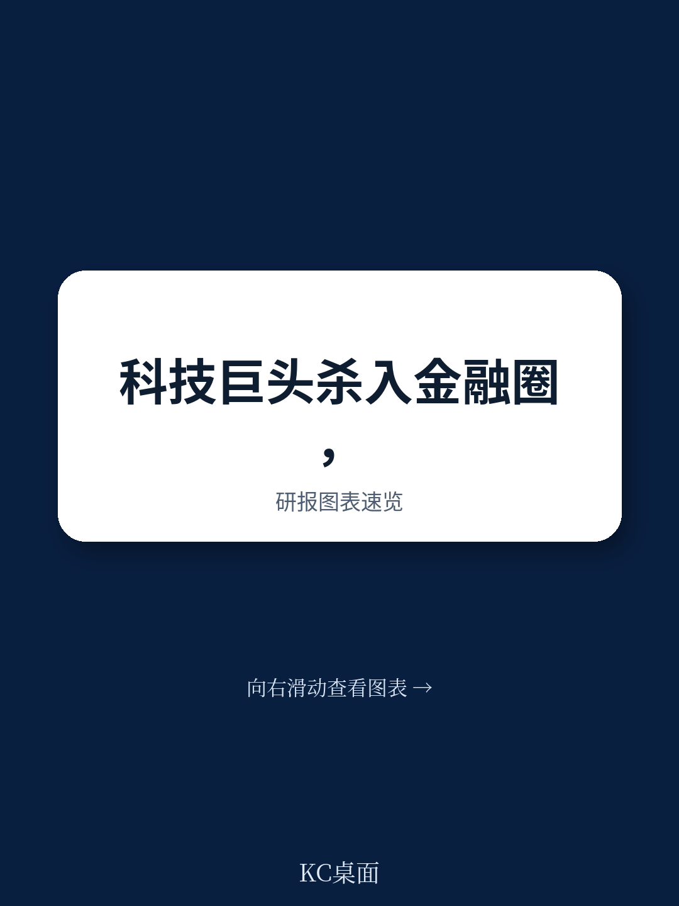
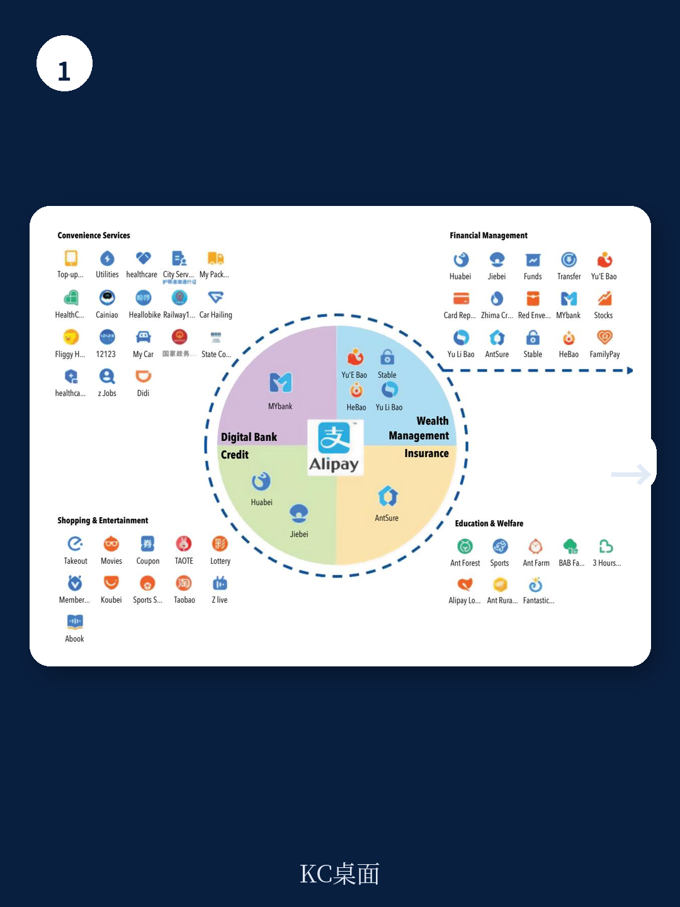
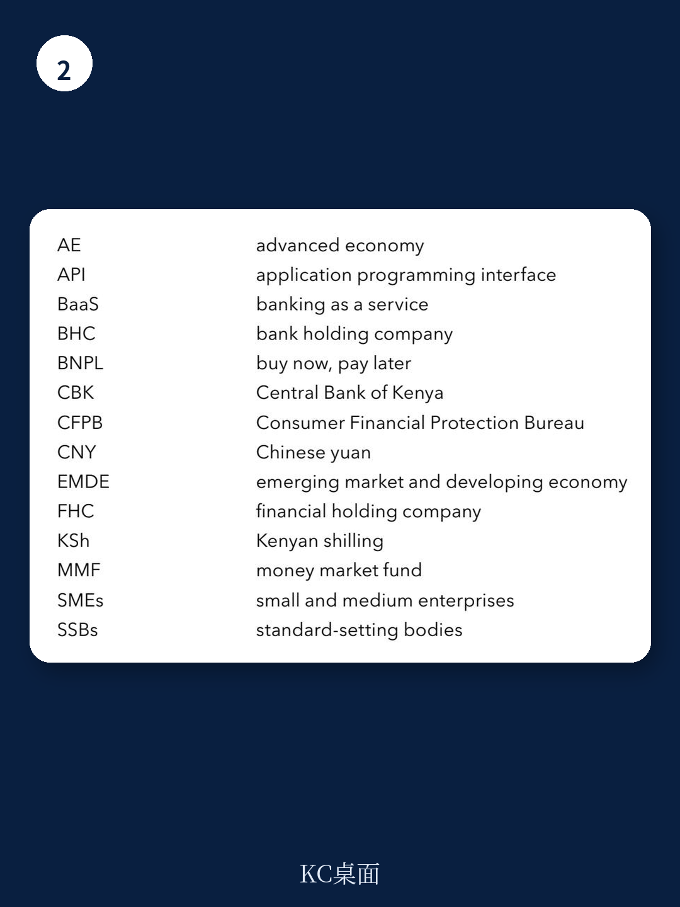

# IMF：大型科技公司金融服务监管考量

大型科技公司正在成为资金体系中不可忽视的参与者。IMF 最新技术说明指出，虽然 BigTech 在多数发达地区的资金稳定影响仍然有限，但在新兴市场和发展中地区，其增长速度和业务渗透已开始改变不确定性格局。报告的核心判断是：现有监管框架主要针对单一持牌实体设计，无法有效覆盖 BigTech 跨业务、跨市场的集团化运作模式，而这正是不确定性积累的根源。

BigTech 进入资金服务的路径并非直接挑战银行。它们避开存款吸收和保险承保等重监管领域，选择从支付、消费信贷、保险中介和资产管理等环节切入。这些业务单一看并不系统重要，但当它们通过同一平台、同一数据池、同一用户群叠加在一起时，不确定性开始累积。报告特别指出，网络效应让 BigTech 能在极短时间内规模化——蚂蚁集团的芝麻信用 11 个月达到 1 亿用户，余额宝用了 20 个月。这种速度是传统机构无法比拟的，也意味着监管窗口期可能比想象中更短。

> **KC评论：** 报告没有直接说“BigTech 会引发扰动”，而是强调“当前不确定性可控，但增长趋势和业务互联性正在改变不确定性性质”。这提醒监管者，不能等到 BigTech 大到不能倒再动手。

## 1. 支付和信贷是不确定性最集中的两条线，且相互强化

BigTech 在支付领域的渗透最深，也最容易被忽视。报告以肯尼亚 M-Pesa 为例，说明当一家 BigTech 控制全国近 99% 的移动支付市场份额时，支付服务已不再是可替代的商业产品，而是系统关键基础设施。更值得关注的是，支付数据被用于信贷决策——BigTech 通过分析用户交易行为，向此前被银行排除在外的群体提供贷款。这种模式在提升资金包容性的同时，也制造了新的依赖：借款人一旦脱离 BigTech 平台，可能无法获得任何信用记录或融资渠道。报告将此定义为“缺乏可替代性”的系统性不确定性来源。

## 2. 监管盲区不在业务本身，而在集团结构和第三方服务

报告识别了一个关键监管缺口：当前监管框架以“活动”为单位，关注的是持牌实体做了什么，而非 BigTech 集团整体在做什么。例如，一家 BigTech 旗下可能有支付牌照、小额贷款牌照和保险中介牌照，各自受不同部门监管，但集团层面将支付、信贷、保险、数据分析和云计算打包输出给机构的行为，却几乎没有被纳入监管视野。报告特别提到，BigTech 向机构提供的云服务、数据分析和人工智能工具，正在制造新的运营集中度不确定性——如果大部分银行依赖同一两家 BigTech 提供关键技术服务，一旦出现故障或中断，影响将远超单一机构。

## 3. 巴西的监管实践提供了一个可参考的框架

报告在多个章节中引用了巴西的监管经验。巴西央行对 BigTech 采取了“集团监管”思路：要求 BigTech 将其资金活动与非资金活动在法律和运营上隔离，并对资金子公司实施与银行类似的资本、流动性和治理要求。同时，巴西还建立了跨部门协调机制，将支付、信贷、保险和数据保护纳入统一监管视野。报告认为，这种“隔离+集团监管”的模式，在允许 BigTech 继续提供创新服务的同时，有效控制了不确定性跨业务传染的可能性。对于正在经历 BigTech 快速扩张的地区，巴西的做法提供了可操作的起点。

> **KC评论：** 报告没有提到“一刀切”的监管方案，而是强调监管力度应与 BigTech 的业务规模和系统性影响相匹配。对于 BigTech 刚刚起步的地区，加强监测和跨部门协调可能比匆忙立法更有效。

## 4. 全球标准缺失，跨境协调是最大短板

BigTech 的业务天然具有跨境属性——支付、数据流和云计算服务都不受国界限制。但报告指出，目前没有任何全球资金标准专门针对 BigTech 制定，现有标准也未考虑 BigTech 将支付与小额信贷、保险等业务组合在一起的特殊性。报告建议标准制定机构（如巴塞尔委员会、国际保险监管者协会）更新 2012 年《资金集团监管原则》，将 BigTech 纳入适用范围。同时，各国监管者应利用区域性合作机制和监管联席会议，在跨境数据流动、第三方不确定性管理和消费者保护等方面形成一致底线。

这份报告的核心价值不在于给出最终答案，而在于系统性地指出了“监管盲区在哪里”。对于产业决策者和政策研究者而言，它提供了一个清晰的观察框架：BigTech 的资金不确定性不是来自某一项业务，而是来自业务组合、数据闭环和集团结构之间的相互作用。监管的挑战，也正在于此。

For informational purposes only. Portions may be generated,translated,summarized,or edited with AI assistance based on source materials and may contain omissions or errors. Please verify independently. This is not investment,legal,tax,accounting,or other professional advice.

