INTERNATIONAL MONETARY FUND

EUROPEAN DEPARTMENT

Europe's Fiscal Squeeze
Tackling Rising Spending Pressures

Prepared by Luc Eyraud, Mahika Gandhi, Andrew Hodge, Giacomo Magistretti, Ian Stuart, Mengxue Wang, and Jiae Yoo

2026

# INTERNATIONAL MONETARY FUND

EUROPEAN DEPARTMENT

DEPARTMENTAL PAPER

Europe's Fiscal Squeeze

Tackling Rising Spending Pressures

Prepared by Luc Eyraud, Mahika Gandhi, Andrew Hodge, Giacomo Magistretti, Ian Stuart, Mengxue Wang, and Jiae Yoo.

# Cataloging-in-Publication Data IMF Library

Names: Eyraud, Luc, author. | Gandhi, Mahika, author. | Hodge, Andrew, author. | Magistretti, Giacomo, author. | Stuart, Ian C., author. | Wang, Mengxue, 1992-, author. | Yoo, Jiae, author. | International Monetary Fund, publisher.

Title: Europe's fiscal squeeze : tackling rising spending pressures / Prepared by Luc Eyraud, Mahika Gandhi, Andrew Hodge, Giacomo Magistretti, Ian Stuart, Mengxue Wang and Jiae Yoo.

Other titles: International Monetary Fund. European Department.

Description: Washington, DC : International Monetary Fund, 2026. | Includes bibliographical references. Identifiers: ISBN:

9798229049306 (paper)

9798229049344 (ePub)

9798229049320 (webPDF)

Subjects: LCSH: Fiscal policy–Europe. | Debts, public–Europe.

Classification: LCCHJ1000.E97 2026

The authors would like to thank Helge Berger, Stephan Danninger, Mark Horton, and Alfred Kammer for their overall guidance on the paper, which also benefited from the comments of Michal Andrle, Emine Boz, Yongquan Cao, Roberto Cardarelli, Nick Carroll, Oya Celasun, Diego Cerdeiro, Era Dabla Norris, Stephanie Eble, Davide Furceri, Nan Geng, Pierre-Olivier Gourinchas, Eva Graf, Mark Griffiths, Burcu Hacibedel, Amgad Hegazy, Gee Hee Hong, Leonardo Indraccolo, Faizaan Kisat, Petya Koeva Brooks, Kristina Kostial, Raphael Lam, Ana Lariau, Claire Lazarus, Charlotte Lundgren, Flora Lutz, Moheb Malak, Adil Mohommad, Zsuzsa Munkacsi, Malhar Nabar, Adrian Peralta, Camila Perez, Nico Pierri, Thomas Piontek, Alexander Pitt, Christine Richmond, Francisco Roldan, Mauricio Soto, Joseph Thornton, Sebastian Weber, and Rui Xu, as well as from comments by IMF seminar participants and colleagues at the Deutsche Bundesbank.

The Departmental Paper Series presents research by IMF staff on issues of broad regional or cross-country interest. The views expressed in this paper are those of the author(s) and do not necessarily represent the views of the IMF, its Executive Board, or IMF management.

Publication orders may be placed online or through the mail:
International Monetary Fund, Publication Services
P.O. Box 92780, Washington, DC 20090, USA
T. +(1) 202.623.7430
publications@IMF.org
IMFbookstore.org
elibrary.IMF.org

## Contents

Executive Summary....v
Abbreviations....vii
1. Europe's Greatest Financing Challenge....1
A. Rising Spending Pressures but Constrained Resources....1
B. Risk of Explosive Debt Trajectory....3
C. The Need for an Ambitious Policy Response....4
D. Scope of the Paper....5
2. A Sustainable Debt Path....7
A. The Importance of Anchoring Fiscal Policy....7
B. Estimating a Numerical Fiscal Anchor for the Region....10
C. A Reference Debt Path for the Average Country....11
D. Country Heterogeneity....14
3. The Critical Role of Structural Reforms....17
A. Growth-Enhancing Reforms....17
B. Fiscal-Structural Reforms....21
C. Putting It Altogether....25
D. Additional Reform Opportunities Not Included in the Simulations....27
4. Medium-Term Fiscal Consolidation....30
A. Size of the Adjustment Needs....30
B. Composition of the Adjustment....33
C. Cyclical and External Considerations....35
5. Rethinking the Role of Government....36
A. Beyond Reforms and Traditional Consolidation....36
B. Identifying and Understanding Very Large Fiscal Consolidations....38
C. Rethinking the Role of Government amid Rising Spending Pressures....44
6. Conclusion....50
A. Moving beyond "Muddling Through"...50
B. Toward a More Strategic Policy Response.....50
C. Making the Strategy Politically Feasible.....51
Annex 1: Conceptual Boundaries among the Three Pillars of the Policy Package....52
Annex 2: Anchors Used in European Fiscal Rule Frameworks....54
Annex 3: Fiscal Adjustment Formulas....56
Annex 4: The Economics of Public versus Private Financing....59
Annex 5: Large Fiscal Consolidations....61
References....67

## BOXES

Box 1. Definition of Spending Pressures....2
Box 2. Estimates of Debt Limits and Buffers in the Literature....11
Box 3. Constructing the Reference Debt Path....13
Box 4. The Fiscal Benefits of Growth-Enhancing Reforms....18
Box 5. Assumptions about the Effect of Reforms on the Debt Simulations....26
Box 6. Comparison with EU Medium-Term Fiscal Plans....31
Box 7. Size of Past Fiscal Consolidations in Europe....37
Box 8. Lessons from IMF Programs on Growth-Friendly Fiscal Consolidation....47

## FIGURES

Figure 1. Spending Pressures on the Rise in Europe .... 1
Figure 2. Europeans Support More Public Spending, but Not Higher Taxes or Deficits .... 3
Figure 3. Public Debt Will Surge without Policy Action .... 4
Figure 4. Policy Packages to Keep Debt Sustainable .... 5
Figure 5. European Public Debt.... 10
Figure 6. Reference Debt Path .... 12
Figure 7. Estimated Debt Limits and Buffers in European Countries .... 15
Figure 8. Reference Debt Paths and Heterogeneity of Initial Debt Levels and Anchors .... 16
Figure 9. Current Multiannual Financial Framework and IMF-Proposed Next MFF .... 24
Figure 10. Public Debt Paths under Various Scenarios .... 26
Figure 11. More Reform Means Less Fiscal Consolidation .... 32
Figure 12. Policy Adjustment in High Adjustment Needs Countries .... 36
Figure 13. Distribution of Consolidation Episodes .... 39
Figure 14. Ranking of "Large and Sustained" Episodes .... 39
Figure 15. Macroeconomic Indicators in Large and Sustained Fiscal Consolidations .... 40
Figure 16. Fiscal Indicators in Large and Sustained Fiscal Consolidations .... 41
Figure 17. Duration of Fiscal Consolidations .... 41
Figure 18. Pace of the Episodes.... 41
Figure 19. Composition of Large and Sustained Fiscal Consolidations .... 42
Figure 20. Public Financing Share .... 45
Annex Figure 2.1. Debt Rules in Europe .... 54

## TABLES

Table 1. Catalyzing Private Investment: EU Programs and National Promotional Institutions.... 23
Table 2. Characteristics of Consolidation Episodes: High and Upper Middle-Income Countries (1980-2024).... 39
Annex Table 5.1. Selected Large Consolidation Episodes.... 61

## Executive Summary

European governments are confronted with an unprecedented financing challenge. Countries are facing rapidly growing demands on public spending from aging populations, energy transition, and defense. Spending is expected to increase by close to 5 percent of GDP on average in the region by 2040. At the same time, public debt is elevated in many countries, and political appetite for higher taxation, lower spending, or privatization remains limited. How can European governments pay for growing needs while preserving fiscal sustainability?

Keeping public debt sustainable is the goal. If left unaddressed, public debt in the average European economy would double over the next 15 years, with average debt ratios across European countries reaching 130 percent by 2040. Action is needed to maintain debt on a sustainable path. As a benchmark for debt sustainability, we use a reference debt path for the average European economy that, over the longer term, does not exceed 90 percent of GDP. Although some countries may need to keep debt at lower levels depending on their circumstances (for example, market pressures), this benchmark reflects increased debt-carrying capacity in many countries over the past three decades. The key question is whether a feasible combination of policy actions can help countries' debt move from the unsustainable baseline to this reference trajectory.

The scale of financing pressures requires a three-pronged strategy involving reforms, consolidation, and long-term institutional evolution. We consider policy packages based on three pillars. First, structural reforms can lower a country's debt path in several ways: by strengthening the government's capacity to manage spending pressures through higher economic growth (for instance, with product market reforms); by directly addressing certain cost drivers like pensions; and by alleviating the burden falling on national budgets (for example, through reforms involving increased centralization of spending at the European Union [EU] level). Second, medium-term fiscal consolidation efforts—lower spending in nonpriority areas or higher revenues in nondistorting ways—create buffers that help absorb upcoming spending challenges. Third, if reforms and fiscal consolidation do not suffice to fill the financing gap, more drastic measures may involve reconsidering the scope of public services and other government activities, with possible implications for the social contract.

Structural reforms are vital to ease financing challenges. This paper considers a set of productivity-enhancing and fiscal reforms, comprising national product and labor market reforms, relatively modest steps to strengthen the EU single market, pension changes, measures to catalyze private investment, and increased centralization of spending at the EU level. Many of these reforms will take time to yield measurable fiscal gains; their effects are assumed to materialize largely in the decade after a five-year implementation period. Still, their long-term effect is significant: Even a moderate set of reforms could close roughly one-third of the gap between the explosive baseline debt path and the sustainable reference path for the typical European country. Simulations show that pension reforms and growth-enhancing domestic reforms are particularly important to reduce fiscal pressures. More ambitious reforms will further reduce the size of fiscal consolidation required to keep debt sustainable.

Medium-term fiscal consolidation, the second pillar of the policy package, is essential because structural reforms by themselves cannot fully address increasing spending demands in most countries. In this paper's simulations, nearly three-quarters of European countries require fiscal consolidation, even with moderate structural reforms. The magnitude of required consolidation depends heavily on how ambitious a country's reforms are. Without reforms, the typical European country will need to consolidate by about 5 percent of GDP cumulatively over five years (roughly 1 percent of GDP annually). When countries adopt the moderate set of reforms assumed in the analysis, the necessary consolidation falls to about $3 \frac{1}{2}$ percent of GDP over the same horizon ( $^{3}/_{4}$ percent of GDP per year), still substantial, but more in line with historical experience. However, reforms that are more ambitious will reduce the consolidation needs even more by boosting revenue further and reducing spending pressures. The reform-consolidation combination is ultimately a decision for each country, reflecting social preferences and political feasibility.

Delivering the required fiscal consolidation will be challenging, and careful design is essential to protect growth and equity. Even when the average adjustment needed appears achievable in historical terms, it still implies a sizable fiscal tightening over a relatively short period. This can weigh on activity, especially where economies are still operating below potential, financial conditions are tight, or monetary policy has limited room to offset fiscal contraction. Beyond macroeconomic headwinds, consolidation measures can have material distributional implications: Poorly targeted cuts to transfers and public services or increases in regressive taxes can disproportionately affect lower-income households and undermine social cohesion, risking reform fatigue and policy reversals. These risks underscore that fiscal strategies should prioritize growth-friendly and equitable measures, protect high-quality public investment, improve spending efficiency, broaden tax bases (rather than relying solely on rate hikes), and enhance targeting and compensation mechanisms to protect vulnerable groups.

Even with strong reforms and fiscal discipline, high-debt countries will likely face hard choices about the scope of public services and the government's role. In about a quarter of European countries, consolidation needs exceed what has historically been achieved, even with moderate reforms, bringing the paper's third pillar into focus. For these countries, a broader conversation about the sustainability of the European socioeconomic model, with its generous public services and expansive welfare state, seems unavoidable. Policymakers may need to reconsider the state perimeter pragmatically by shifting parts of financing from public to private sources, through tighter benefit targeting, subsidy reform, and higher user fees for higher-income groups, and restructuring or privatization of state-owned enterprises while protecting core services and vulnerable households. The potential savings from these fundamental changes are large. For instance, bringing the share of public financing in health, education, infrastructure, and climate into line with the Organisation for Economic Co-operation and Development average could save close to 3 percent of GDP for the average European country. Such changes, however, may cut to the heart of the social contract, and to be successful, will require careful deliberation, extensive consultation, clear communication, and embedding in well-sequenced medium-term plans.

## Abbreviations

<table><tr><td>AE</td><td>advanced economy $^{1}$ </td></tr><tr><td>CAPB</td><td>cyclically adjusted primary balance</td></tr><tr><td>CESEE</td><td>central, eastern, and south-eastern Europe $^{2}$ </td></tr><tr><td>EFSI</td><td>European Fund for Strategic Investments</td></tr><tr><td>EU</td><td>European Union</td></tr><tr><td>MFF</td><td>multiannual financial framework</td></tr><tr><td>MTFSP</td><td>medium-term fiscal-structural plan</td></tr><tr><td>OECD</td><td>Organisation for Economic Co-operation and Development</td></tr><tr><td>PPP</td><td>public-private partnership</td></tr><tr><td>SOE</td><td>state-owned enterprise</td></tr><tr><td>UNESCO</td><td>United Nations Educational, Scientific and Cultural Organization</td></tr><tr><td>VAT</td><td>value-added tax</td></tr><tr><td>WEO</td><td>World Economic Outlook</td></tr><tr><td>WHO</td><td>World Health Organization</td></tr></table>

## 1. Europe's Greatest Financing Challenge

European governments are facing an era of rapidly growing demands on public spending from aging populations, the energy transition, and defense. Mounting pressures in these areas will increase spending above current levels by close to 5 percent of GDP, on average, by 2040. At the same time, public debt ratios are already elevated in many European countries and are under further pressure from a rising interest bill and lackluster growth. Political appetite for higher taxation, lower spending, or privatization is limited. The question for policymakers is how to pay for growing needs while preserving fiscal sustainability.

## A. Rising Spending Pressures but Constrained Resources

Many European countries find themselves in a difficult budgetary position. They are facing new shocks, even as the legacy of past shocks still looms large, with public debt having increased sharply during the

COVID-19 pandemic and remaining high. As financial markets put fiscal positions under increasing scrutiny, rising bond yields combined with elevated debt levels expose many countries to increasing interest bills that threaten to crowd out essential spending. At the same time, the medium-term growth outlook remains subdued because of persistent structural challenges that constrain Europe's economic dynamism. As of 2025, European Union (EU) GDP per capita was nearly 30 percent below that of the United States (in purchasing-power-parity terms); without meaningful reform, the gap will widen further (October 2025 IMF European Regional Economic Outlook, Chapter 1).

Mounting spending pressures add to these already significant challenges (Box 1). An aging population continues to drive up spending on health and public pensions. Governments are also facing new demands, such as the recent North Atlantic Treaty Organization (NATO) commitment to increase “core” defense spending of members

Figure 1. Spending Pressures on the Rise in Europe (Average increase in government spending relative to 2025; percent of GDP)

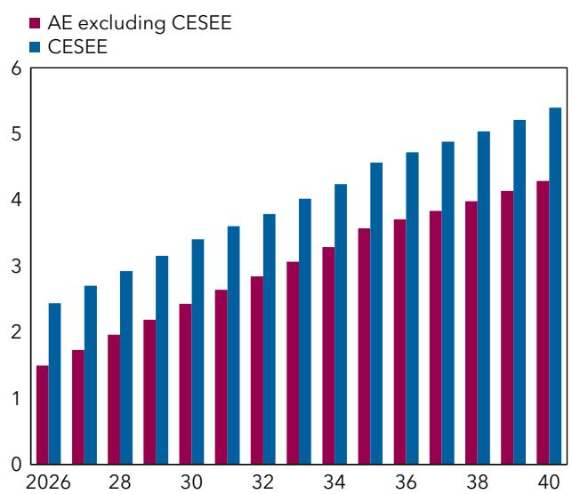  
Sources: Eble and others (2025); and authors' calculations.
Note: Spending pressures comprise health, pensions, defense, and climate. AE = advanced economy; CESEE = central, eastern, and south-eastern Europe.

to 3.5 percent of GDP by 2035, as well as increased costs of energy security and digitalization. This paper considers a nonexhaustive set of spending pressures in four areas: health, pensions, climate, and defense. $^{3}$ These pressures constitute the amount by which spending would need to increase above current levels by 2040 under existing policies. The 15-year horizon captures long-term fiscal trends while remaining relevant for today's policymakers.

Altogether, these spending pressures are estimated to increase expenditures above current levels by about 4½ percentage points of GDP by 2040 on average in advanced economies (AEs), excluding central, eastern, and south-eastern Europe (CESEE), and by 5½ percentage points of GDP in CESEE countries (Figure 1). The daunting scale of these pressures is immediately apparent, roughly equaling the size of today's education budget in the average European country. In the areas of health, pensions, and climate, the quantitative estimates of the pressures are taken from previous IMF analysis (Eble and others 2025).⁴ In that study, future health spending pressures are based on the 2024 European Commission Aging Report (2024b), supplemented by authors' calculations for non-EU countries. A similar approach is used to gauge required increases in the pension bill. In the climate space, the calculated spending pressures reflect the costs of the green transition, including the formal emissions reduction targets of EU countries. For defense spending needs, this paper updates the estimates of Eble and others (2025) to reflect the latest policy announcements, including the NATO 3.5 percent of GDP commitment.

## Box 1. Definition of Spending Pressures

Our paper relies on a broad definition of expenditure demands covering three types that are often conflated in policy discussions:

\- Expenditure pressures usually refer, in a narrow sense, to items with a gradual but potentially explosive growth trend. In many European countries, these pressures mainly stem from rising aging-related costs such as pensions, health care, and long-term care.

\- Expenditure needs cover spending related to new policy priorities that are expected to increase durably or permanently but do not exhibit explosive growth. Examples include climate transition initiatives and defense spending. There can also be a need for infrastructure investment to boost growth (for example, AI data centers), as well as investment in education (for example, more teachers) to improve human capital and lift labor productivity. Expenditure needs can also arise from the intensification of existing priorities.

\- Mandatory expenditure involves nondiscretionary spending that is expected to keep rising because of external factors, though not with the explosive pattern seen in aging costs. A key example is higher borrowing costs, driven by increased debt and rising interest rates in recent years.

Although there can be some overlap among these three categories, their policy implications differ significantly. Expenditure pressures must be actively controlled, whereas expenditure needs and mandatory spending should often be accommodated within the overall budget envelope, necessitating difficult fiscal trade-offs.

In aggregate, the assessed size of the pressures is broadly consistent with other studies, although all estimates are subject to some uncertainty, particularly in the long term. Studies differ depending on the set of pressures included, as well as on the time horizon studied and the assumed share of public financing. For instance, Draghi (2024) argues that 5 percent of EU GDP will need to be spent annually over the next decade by both public and private sectors for investments in defense, as well as the green and digital transitions. Bouabdallah and others (2024) evaluate spending pressures in these areas at 3.75 percent of EU GDP over the next seven years, whereas Zettelmeyer and others (2023) provide more conservative estimates that still suggest public spending pressures in these categories of more than 1 percent of GDP per year over the next 5 to 10 years. Across AEs, the April 2024 Fiscal Monitor estimates that by 2030, public spending needs could amount to an additional 6.0-7.4 percentage points of GDP (IMF 2024a). Other studies focus on the long term, with Guillemette and Turner (2021) concluding that without policy changes, maintaining current public

service standards and benefits would increase public spending in the median Organisation for Economic Co-operation and Development (OECD) country by nearly 8 percentage points of GDP by 2060. In terms of aging-related pressures specifically, Moshammer (2024) gauges that annual public spending in the euro area will need to be 1.4 percentage points of GDP higher than current levels on average across countries through 2070.

Europe now faces the thorny question of how to foot the bill for the higher spending demands. Borrowing more would likely be costly (as the era of very low interest rates is likely over) and potentially risky if a rapid surge in debt triggers adverse market reactions, which could be destabilizing for the financial system. On the other hand, raising taxes to fund higher spending will not be easy, with revenue levels currently close to historic highs in many AEs and taxpayers recovering from the cost-of-living crisis. Policymakers

Figure 2. Europeans Support More Public Spending, but Not Higher Taxes or Deficits (Percent of respondents)  
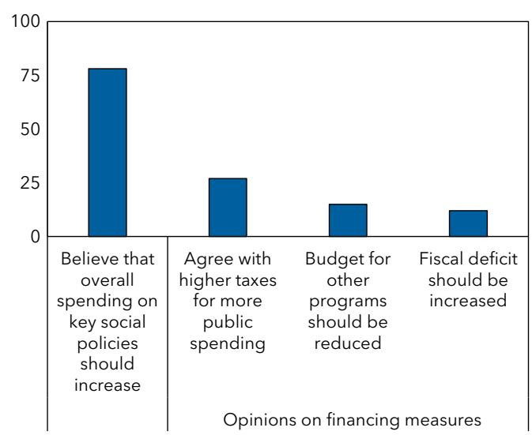  
Sources: European Commission (2023); Special Eurobarometer 529, except for the question on taxation, which is from European Commission (2025b); and Flash Eurobarometer 562.

also face a challenging political economy environment, and public trust in institutions is fraying. Voters expect governments to spend more to improve public services while being reluctant to accept higher taxes and raising legitimate concerns about public debt levels (Figure 2). This will make it difficult to build political support for policies that shore up public finances. The remainder of this paper explores how various policy measures—both fiscal and nonfiscal—could help countries address the challenge.

## B. Risk of Explosive Debt Trajectory

If left unchecked, public debt will be on an unsustainable path. Under unchanged policy, the debt of the average European country will reach 130 percent of GDP by 2040, roughly doubling from today (Figure 3). On a GDP-weighted average basis, the figure is even higher–155 percent of GDP—as some of the larger European economies have the highest debt ratios. The simulation is a “no policy action” counterfactual and assumes that the primary deficit excluding spending pressures remains constant as a share of GDP, but the debt ratio would still increase because the additional spending related to aging, defense, and energy security adds to deficit levels, and this effect grows over time (see European Commission [2024a], which takes a similar approach). This stylized exercise, which illustrates the scale of the task for policymakers, is not based on the IMF staff projections in the World Economic Outlook, nor does it reflect or assess countries’ existing medium-term adjustment and reform plans, including those submitted under the EU’s fiscal governance framework. $^{5}$

This “unchanged policy” debt trajectory is subject to considerable uncertainty, given the difficulty in predicting key parameters. It could be even steeper if the deteriorating fiscal position slows economic growth, which is already anemic, and raises borrowing costs further. The economic literature suggests that public debt can lower growth, particularly when it reaches high levels. This is because higher debt can lead to higher interest rates on government bonds, including by stoking inflation expectations, thereby tightening financing conditions and crowding out productive investment. It may lead to expectations of higher

distortionary taxes in the future, weighing on investment plans. A weaker government balance sheet can also pose financial stability risks through banks' exposure to sovereign debt. On average, studies find that a 10 percentage point increase in the debt ratio lowers annual real GDP growth by 0.05-0.2 percentage point once debt exceeds 75 percent of GDP (Salmon 2025). Taking this into account, the projected increase in debt that would occur without policy action could slow annual GDP growth by around half a percentage point by 2040, considerable given potential growth of around 2 percent on average across European countries. In turn, lower growth and higher interest rates would worsen debt dynamics: The average debt ratio would reach about 150 percent of GDP by 2040 (or close to 190 percent GDP-weighted) (Figure 3). $^{6}$ These negative feedback loops between debt, growth, and borrowing costs will hurt living standards.

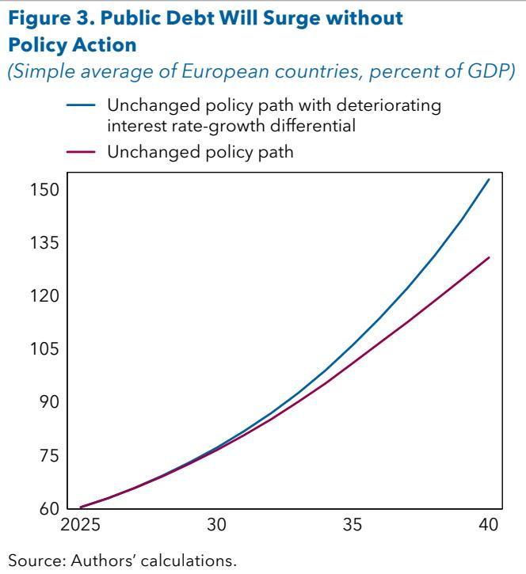

Furthermore, this stylized exercise does not take

into account the possibility of future adverse shocks that will create unforeseen spending needs and drive debt even higher, such as those that materialized during the global financial crisis or the COVID-19 pandemic.

## C. The Need for an Ambitious Policy Response

The core question posed by the paper is whether a feasible combination of reforms and policy tools can help countries manage the growing spending pressures while keeping debt under control and protecting growth. Governments can manage these pressures in various ways. Some pressures can be reduced or eliminated through targeted policy actions. For example, pension and entitlement reforms—such as raising the retirement age or adjusting benefit formulas—aim to slow cost growth and ensure long-term sustainability. Certain pressures can be accommodated by either borrowing more (if there is fiscal space), reprioritizing government services and activities, or strengthening the fiscal position. Strengthening the fiscal position could involve fiscal consolidation or boosting revenue potential through growth-enhancing reforms, enabling the government to absorb future spending demands while keeping debt on a sustainable path. Finally, some pressures can be effectively “removed” from the public sector balance sheet by transferring responsibilities to the private sector or to other government layers, including supranational entities in Europe. In short, new spending demands can be lessened, absorbed, or outsourced.

To achieve these objectives, the paper groups policy measures into three main pillars for simplicity. We recognize there may be some overlap among these three pillars, and the classification of individual measures involves a degree of judgment (see Figure 4 and Annex 1):

\- First, we consider a broad set of productivity-enhancing and fiscal structural reforms. These increase the government's ability to handle spending pressures by boosting economic growth (for example, product market, labor market, and governance reforms, as well as a deeper EU single market), tackle some spending pressures (for example, adjusting pension systems to mitigate the cost of aging and increased

longevity), and alleviate the burden falling on national budgets (for example, through increased centralization of spending at the EU level, and catalyzation of private investment).

\- Second, medium-term fiscal consolidation on both the revenue and spending sides has typically been used to address fiscal imbalances, although not ones as large as those facing many European countries today. Consolidation measures encompass revenue mobilization through tax policy reform and improved revenue administration, as well as stricter spending prioritization—with expenditure cuts in some areas—along with improvements in spending efficiency.

Figure 4. Policy Packages to Keep Debt Sustainable  
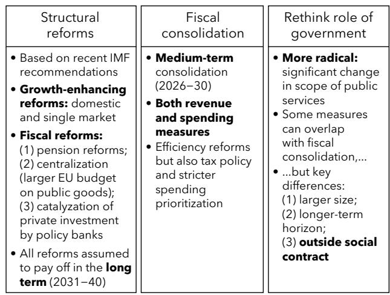  
Source: Authors' calculations.

## - Third, a rethink of the role of government

may be unavoidable in some countries: If reforms and conventional medium-term consolidation are insufficient, then more radical fiscal measures could include reassessing the scope of public services and other government functions, potentially affecting the social contract.

The simulations presented in this paper assess the relative contributions of these measures to manage the spending pressures and keep debt sustainable. $^{7}$ The following chapters define a reference debt trajectory for the typical European country and evaluate combinations of policies necessary to bring down debt from the explosive path under unchanged policy to the reference path.

## D. Scope of the Paper

This paper develops a stylized analytical framework intended to apply to the average European country, and—by extension—to the region as a whole. The objective is not to generate a comprehensive set of country-by-country prescriptions, but rather to provide a clear, transparent framework that can be used to think about Europe's fiscal challenge in aggregate and to illustrate the orders of magnitude involved when rising spending pressures meet elevated initial debt.

Consistent with this goal, the analysis focuses first on calibrating and simulating a representative "typical" European economy. The paper: (1) calibrates a debt anchor (and discusses why the numerical anchor may deviate from the historical 60 percent benchmark); (2) constructs a reference debt path consistent with that anchor; (3) computes implied consolidation needs over a medium-term horizon to bring debt dynamics into line with the reference path; and (4) quantifies the contribution of structural reforms—both growth-enhancing and fiscal-structural reforms—to easing the required fiscal adjustment. This framework allows us to compare various policy packages consistently, including combinations of reforms and consolidation, and to provide a clear narrative on how much each pillar may contribute to closing the fiscal gap.

A deliberate implication of this approach is that the paper does not provide country-specific adjustment paths or country-tailored policy mixes. European economies differ substantially in ways that are of critical importance for fiscal strategy design: initial debt levels and financing needs, demographic profiles and spending pressures, fiscal institutions and credibility, exposure to shocks, monetary and exchange rate regimes, external positions, and political economy constraints. Moreover, the appropriate calibration of a debt anchor, the speed and composition of consolidation, and the scope and sequencing of reforms require country-specific assumptions. Producing robust country-level results therefore requires deeper country diagnostics and more granular calibration beyond the scope of this paper.

That said, focusing on a “typical” European country does not imply ignoring heterogeneity. Where relevant to the interpretation of results, the paper discusses cross-country dispersion around the average, including differences across advanced European economies and CESEE countries, and the ways in which heterogeneity affects the scale of anchors, buffers, and adjustment needs. These discussions are meant to clarify how far one can extrapolate from the typical-country framework and to highlight that country-level policy conclusions should not be drawn mechanically from the stylized results.

## 2. A Sustainable Debt Path

To calibrate the size of the policy response to spending pressures, it is important to define a debt trajectory that is sustainable. There are, of course, many possible sustainable debt paths; this chapter discusses the assumptions underlying a “reference” debt path used in the analysis for the rest of the paper.

## A. The Importance of Anchoring Fiscal Policy

## What Is an Anchor?

Anchoring fiscal policy means establishing a credible and sustainable fiscal framework that serves as a stable reference point for fiscal decisions over the medium to long term. This creates predictability, helps maintain fiscal discipline, supports macroeconomic stability, and fosters market confidence. In the European context, the need for a clear and credible fiscal anchor has become more pressing than ever. The COVID-19 crisis led to a temporary suspension of existing EU fiscal rules and the invocation of escape clauses in many national rules, weakening their role in guiding expectations. As public debt levels have risen sharply across the region, particularly during the COVID-19 pandemic, markets have become increasingly sensitive to signs of fiscal slippage as financing conditions tighten. Several high-debt countries have experienced episodes of heightened market scrutiny in recent years, underscoring risks of ambiguous or weak fiscal guidance. Against this backdrop, reanchoring fiscal policy is essential to restore credibility, contain borrowing costs, and ensure that medium-term fiscal strategies remain robust in an environment of elevated spending pressures and greater uncertainty.

The literature distinguishes between "fiscal anchors" and "operational targets" (see Eyraud and others 2018) $^{8}$ :

\- Fiscal anchor: This is an indicator used to shape medium-term expectations about fiscal policy, and if properly calibrated, ensures sustainability. Typically, the anchor is a stock variable, with the general government gross debt-to-GDP ratio being the most common. Some countries use a net debt anchor that deducts selected financial assets, sometimes based on a broader public sector perimeter, as seen in the United Kingdom, where the fiscal rule framework requires net debt to stabilize and begin to decline over the medium term. Annex 2 reviews how fiscal anchors are currently used in Europe.

\- Operational targets: Since a fiscal anchor does not provide short-term guidance, fiscal frameworks also include operational targets or rules that apply to flow variables like the fiscal balance, expenditures, or revenues expressed in levels, growth rates, or ratios to GDP. These variables should be directly controlled by the government and tightly linked to the behavior of the anchor. In the current EU fiscal framework, the net expenditure path is the main operational target, with the anchor being that the debt ratio is put on or remains on a plausibly downward path after a four-to-seven-year adjustment period or remains below 60 percent of GDP (Darvas, Welslau, and Zettelmeyer 2024).

Operational targets can be calibrated so that fiscal policy remains consistent with the anchor over the medium to long term (IMF 2018). When the European Stability and Growth Pact was first established in the

1990s, the 60 percent of GDP debt anchor was linked to a 3 percent of GDP deficit ceiling: Under the macro-economic and fiscal conditions prevailing at the time, maintaining a deficit at 3 percent indefinitely would lead the debt ratio to stabilize at around 60 percent of GDP, assuming 5 percent nominal GDP growth—then the estimated potential growth rate.

Because the fiscal anchor represents a medium-term target or ceiling, it is not expected to be met at every point in time. For example, if fiscal policy is anchored by a medium- to long-term debt target, it is not necessarily problematic for debt to be above the anchor in the short term, provided that a credible fiscal framework (supported by policies) is in place to guide a return to the anchor over the medium term. Guiding fiscal policy toward the anchor in the medium to long term is precisely its purpose. In fact, deviations from the anchor are to be expected, particularly when an anchor is first adopted or in the face of large negative shocks that worsen the fiscal position. Accordingly, in the analysis that follows, it is not assumed that the anchor is enforced as a binding annual ceiling but is a medium-term objective assessed on a forward-looking basis—requiring compliance with the debt ceiling over the medium term rather than in the current year.

## How to Anchor Fiscal Policy?

There are many ways to design a debt anchor. It can be a precise target or ceiling to be met by a particular time or take the form of a particular shape for the medium- to long-term debt path. Each type of anchor has pros and cons, and the design can differ depending on the objectives of policymakers. The EU fiscal framework has itself featured a mix of different types of anchors in recent decades.

Targeting a debt level or a debt trajectory? Historically, many fiscal frameworks—especially in Europe—have been anchored to numerical debt ceilings, such as the Stability and Growth Pact's 60 percent of GDP debt rule. Recently, the appeal of strict numerical rules has waned, with more emphasis placed on sound debt trajectories. The EU fiscal framework is now anchored by a requirement to stabilize debt in the medium term and reduce it over the long term, with less emphasis on a specific numerical target (Annex 2).

Shifting from fixed numerical targets (or ceilings) to debt trajectory anchors offers several advantages, including (1) greater room for judgment and flexibility when setting fiscal policy over time with scope to tailor policy to economic conditions and shocks, potentially enhancing the framework's credibility; (2) a stronger analytical foundation, as debt stabilization is a fundamental condition for fiscal sustainability, whereas numerical ceilings often appear arbitrary; and (3) debates about a "safe" debt level can be avoided, given they are inherently uncertain and hard to measure.

However, targeting a debt trajectory has also downsides. The anchor may be weaker since there is no direct or simple mapping from a trajectory to an “appropriate” fiscal deficit level. Furthermore, greater judgment introduces flexibility but also risks making it too easy to justify looser policy in the short term and repeatedly. Policymakers may stretch the interpretation of fiscal frameworks, especially if the anchor is based on forward-looking forecasts, without sufficiently assessing compliance ex post. Political cycles may intercede and weaken discipline. Backloaded consolidation paths or optimistic macroeconomic projections may yield superficial compliance with low credibility. Finally, debt could stabilize but at dangerously high levels, where there is risk of liquidity stress and adverse market responses.

Medium-term or long-term anchor? Another key consideration is the time horizon of the debt anchor. For example, the United Kingdom uses a five-year horizon for its debt rule, whereas the EU's framework is now focused on a longer-term debt path—up to 10 years after an initial four-to-seven-year adjustment period.

There can be good reasons for the fiscal framework to look beyond the medium term—either through a long-term debt ceiling or a requirement for long-term debt reduction. This enables fiscal strategies to consider sustained spending pressures, particularly those from aging populations, such as those that are currently mounting in Europe. This avoids the potential trap of an anchor focused only on the near or medium term, whereby fiscal policy can appear to be consistent with the anchor, even though there are forces waiting to drive up debt beyond the horizon.

However, long-term debt anchors face credibility challenges. Policymakers may pledge compliance with the anchor through backloaded adjustment plans that are well beyond their terms in office and lack credibility. Long-term spending and growth projections also carry a higher degree of inherent uncertainty. This is evident in the estimates of the fiscal cost of achieving Europe's climate targets, which vary widely (Carton and others 2026). Future policy shifts and reprioritizations are inherently unpredictable, making "unchanged policy" assumptions dubious at longer horizons.

Given these challenges, medium-term anchors are frequently regarded as a more pragmatic goal. Although they may not fully capture extended fiscal pressures, they implicitly recognize that large adjustments can be achieved in several stages, and a medium-term anchor helps calibrate the size of first-step measures. Considering uncertainty and the possibility of structural reforms improving fiscal positions over time, a gradual consolidation strategy focusing initially on the next, say, five years appears reasonable. The EU fiscal framework is designed to achieve this balance, with a medium-term adjustment period and a longer-term debt reduction path.

Stabilizing or reducing debt? Even if fiscal policy is anchored by a debt trajectory, an important question is whether the focus should be on stabilizing debt or on actively reducing it. In some resource-rich countries, debt may initially be allowed to rise to finance a scaling-up of capital spending, but such frameworks are more common in developing economies, especially those with access to concessional financing. Here, we focus on the distinction between debt stabilization and reduction.

In theory, debt stabilization is a sufficient condition for fiscal sustainability (Escolano 2010). For some European countries, stabilizing debt already requires significant adjustments, especially over the long term as age-related spending pressures accumulate. Keeping the debt ratio from increasing despite mounting spending pressures is a reasonable fiscal objective, particularly for countries with low fiscal vulnerabilities.

However, there can be good reasons to go beyond debt stabilization in some countries and to put debt on a downward path. Debt reduction may be needed to build important fiscal buffers—for insurance against future shocks or risks of market pressures—or to accommodate future spending pressures while maintaining sustainability. Achieving lower debt levels can also reduce financing needs for those European governments facing financial market scrutiny, mitigate liquidity pressures, and contain the rise in borrowing costs.

Therefore, the optimal approach will vary depending on the specific circumstances. Countries with weaker fiscal positions may need to target a clear downward debt path, including in the near term, whereas countries with fiscal space have more leeway to weigh the benefits of increasing buffers against scaling up growth-enhancing investments and responding to negative shocks through debt. This balance may imply a debt stabilization goal in some cases; it may also allow a period of debt increases in lower-debt countries with significant capital needs.

A hybrid approach. The discussion above highlights the trade-offs inherent in designing a fiscal anchor—between simplicity and flexibility and between short-term operability and long-term discipline. There is no “one-size-fits-all” model, and optimal design is always country-specific. One way to manage trade-offs could be to take a hybrid approach and combine a trajectory-based constraint with a numerical benchmark while building in both medium- and longer-term requirements. For example, the anchor could require debt to stabilize in the medium term while also committing to converge toward (or stay below) a numerical debt level over the longer term. Such a hybrid design would preserve operational guidance for near-term policy while ensuring that the debt path remains firmly oriented toward sustainability. The remainder of the paper adopts this approach, as set out in the next section.

Source: IMF WEO October 2025.
Note: AE = advanced economies; CESEE = central, eastern, and south-eastern Europe; WEO = World Economic Outlook.

## B. Estimating a Numerical Fiscal Anchor for the Region

## Methodology

In this paper, a sustainable debt trajectory is defined for each European country to assess the scale of the policy action needed to meet the fiscal challenge. These trajectories are anchored by a numerical debt target. The IMF has developed a set of tools to calibrate prudent debt targets, taking into account country-specific circumstances, to manage the risk of debt spiraling out of control.

The general approach is to set the anchor at a level that is sufficiently low so that, even if adverse shocks materialize, debt would remain in safe territory (Acalin and others 2025). The calibration is conducted in two steps:

\- Identifying a debt "cliff." The first step consists of estimating the maximum debt limit (cliff) that should not be exceeded without endangering fiscal sustainability. The main method used to identify country-specific debt limits is the model-based approach of Cao and others (2025), under baseline parameters, applied to 43 European countries. In this model-based approach, limits are related to macroeconomic and financial fundamentals, including the cost of borrowing, as well as the government's ability to raise revenue to meet its obligations. This approach yields an average limit of around 110 percent of GDP across all European countries. Broadly consistent results are also obtained from a simple benchmark, dividing the maximum feasible primary balance by the interest rate-growth differential under stress, relying on data over 2000-25.

\- Maintaining a safety buffer. The second step sets the debt anchor well below the cliff to provide a buffer, so that if adverse shocks occur, debt would remain below the cliff with high probability. The main method used to compute country-specific buffers is the debt-at-risk framework of Furceri and others (2025), which is used to compute the full distribution of future public debt outcomes in a given country. Using this tool,

the buffer is calibrated as the difference between the predicted 95th percentile debt ratio and the median, both three years ahead. Applying this method to 40 European countries and taking a simple average, the buffer of the typical country is close to 20 percent of GDP. As a robustness check, we also apply an alternative approach based on stochastic debt simulations (IMF 2018), which produces a similar average buffer based on a subset of European countries.

Although the debt anchors implied by this two-step analysis differ across countries, the anchor for the average European country is 90 percent of GDP, to maintain a buffer of 20 percent of GDP below the typical debt limit of 110 percent of GDP. This is well above the current debt ratio in most European countries, with the exception of several high-debt AEs and Ukraine (Figure 5).

The 90 percent average anchor is also notably higher than the 60 percent of GDP threshold insti-

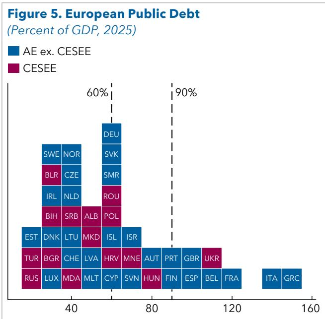

tutionally embedded in the EU Stability and Growth Pact since the 1990s, which remains legally binding. $^{9}$ There are good reasons for the debt anchor to have risen in recent decades. Debt-carrying capacity has likely increased in many countries over the past three decades because of factors such as deeper financial markets, larger government revenue bases, and lower borrowing costs, even considering recent increases. This 90 percent threshold was discussed recently in the context of the updated EU fiscal framework (see Pench 2025; Steinbach and Zettelmeyer 2025). Box 2 compares the estimates to other debt limits and buffers in the literature.

The 90 percent anchor is used for all European countries in the scenarios presented in this paper. Adopting a common anchor is an assumption made for analytical convenience and should not be interpreted as an IMF policy recommendation for the region. In practice, anchors are country-specific and can also change over time; calibrating them robustly is subject to considerable uncertainty. The tools discussed in this section for estimating debt limits and buffers can be readily used to account for country heterogeneity and guide country-specific calibration.

## C. A Reference Debt Path for the Average Country

## Box 2. Estimates of Debt Limits and Buffers in the Literature

There is a substantial literature estimating debt limits and buffers, including a specific focus on European countries.

Debt limits. Past estimates of debt limits vary widely depending on the methodology used. Collard and others (2023) report debt limits for euro area countries using a structural modeling approach and find an average debt limit close to 110 percent of GDP under some calibrations. Ostry and others (2011) find substantially higher debt limits in a sample of 23 advanced economies (AEs), ranging from 150 to 250 percent of GDP, using a stochastic model of sovereign default and data from 1985 to 2007, in which the government's ability to increase the primary balance in response to rising debt declines as debt reaches high levels ("fiscal fatigue"). Another strand of literature has identified debt limits by focusing on the level beyond which growth slows down; these tend to be lower. For instance, Cecchetti, Mohanty, and Zampolli (2011) find that debt becomes a drag on growth when it exceeds around 85 percent of GDP in Organisation for Economic Co-operation and Development countries. Reinhart and Rogoff (2010) find that public debt ratios exceeding 90 percent are associated with a significant nonlinear drop-off in growth for both AEs and emerging markets. Overall, our estimate of 110 percent of GDP for the typical European country falls toward the center of estimates in the literature.

Safety buffers. Studies in the literature have applied stochastic approaches and found similar-sized buffers for European countries to those estimated in this paper. For instance, Debrun, Jarmuzek, and Shabunina (2020), using a similar methodology to IMF (2018), identify buffers based on past macroeconomic volatility, and mostly find a range of 10-40 percent of GDP in a subset of European countries. Other estimates tend to be larger when the buffer accounts for contingent liabilities and other stock-flow adjustments. Bova, Medas, and Poghosyan (2018) show that the median realization of a contingent liability in AEs and EMs was about $2 \frac{1}{2}$ percent of GDP during 1990-2014, with liabilities arising from the financial sector being particularly large (averaging 10 percent of GDP). Debrun, Jarmuzek, and Shabunina (2020) focus on these financial-sector liabilities and find that shocks equivalent to 10 percent of bank assets could increase the required buffer by roughly 25 percentage points of GDP, on average, in a sample of European AEs. Overall, our 20 percent buffer is consistent with estimates based on macroeconomic volatility but remains lower than buffers needed to absorb sizable contingent liability realizations.

With a numerical debt anchor of 90 percent of GDP estimated for the region, the next step is to define a sustainable debt trajectory for 2026-40 for each European country consistent with this anchor (the “reference path”). This sustainable path will then be used to quantify the policy action needed to keep debt sustainable.

The shape of the reference debt trajectory is designed to reflect the following key principles, which broadly reflect the conceptual considerations discussed at the beginning of the chapter. First, we assume that debt dynamics should be brought under control in the medium term—the five-year period 2026-30. Within this horizon, the objective is not to achieve any particular debt level, but to ensure that the debt ratio stabilizes by the end of the fifth year at the latest. Targeting medium-term debt stabilization is a sound policy objective, in the spirit of the latest EU and UK fiscal frameworks, which helps preserve fiscal sustainability.

Second, we assume that countries consolidate their public finances over this five-year period by gradually reducing the cyclically adjusted primary balance. This consolidation, possibly supported by structural reforms, is necessary not only to stabilize the debt ratio within five years but also to avoid it resuming an upward trajectory in the long term as spending pressures intensify. The five-year horizon is broadly similar to the four-to-seven-year adjustment period in the EU fiscal framework. Notably, consolidation efforts over longer horizons have proved unrealistic in the past (Box 7).

Finally, in the longer term—the subsequent decade after 2030—debt is anchored by the 90 percent target, so that debt of all countries is on a path toward this level by 2040 (even though they may not reach it at this horizon). This anchor ensures that the debt of the European region remains at a manageable level, so that shocks can be absorbed without pushing debt into dangerous territory, the motivation behind the approach of identifying an anchor as a debt limit minus a buffer.

Although these principles define the reference debt trajectory for Europe as a whole, operationalizing this trajectory will mean different things in different countries, depending on their initial debt level:

\- Countries with debt currently above 90 percent of GDP are assumed to target debt stabilization over the next five years and put debt on a declining path in the subsequent decade, although not necessarily reaching 90 percent of GDP by 2040, broadly in the spirit of current EU practices (Box 3). This reflects the policy priority for high-debt countries to reduce sustainability risks.

\- Countries that currently have debt below 90 percent of GDP are assumed not to change policy along the reference debt path, provided debt remains below the long-term target of 90 percent by 2040, in this scenario. If debt would exceed 90 percent of GDP before 2040 under current policies, then these countries are assumed to adjust so that debt does not exceed 90 percent of GDP along the reference path. This condition ensures that countries with lower debt are not automatically assumed to undertake more fiscal consolidation than high-debt countries.

This way of operationalizing the reference trajectory, particularly for low-debt countries, is simplistic and, although useful for the aggregate analysis in this paper, does not reflect country-specific circumstances. In particular, several countries with debt below 90 percent of GDP

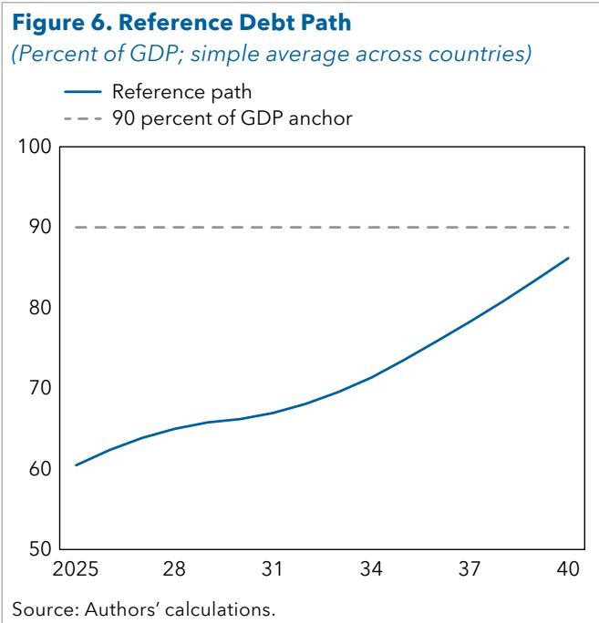

need to rebuild fiscal buffers given their financing constraints, exposure to shocks, and other vulnerabilities (for example, Hungary and Romania); others may have fiscal space for spending priorities beyond the pressures that are considered in this paper, like infrastructure investment (for example, Germany).

The reference path for the average European country slopes upward through 2040 but remains below 90 percent of GDP (Figure 6). This upward slope may seem surprising, given that debt stabilization is an overarching objective of the framework. However, the reference path for the region is an average across countries, and the overall shape reflects the different behavior of high- versus low-debt countries along the path. More specifically, the majority of countries in the sample have initial debt levels below 90 percent of GDP, so their debt on the reference path is allowed to drift up during 2026-40 toward the long-term debt target. This explains the shape of the path for the average country, even though high-debt countries with initial debt above 90 percent stabilize their debt over the medium term and put it on a downward path. If the chart was extended beyond 2040, the reference debt path would converge to 90 percent of GDP, as high-debt countries keep reducing debt, whereas the debt trajectory of low-debt countries does not rise above 90 percent.

## Box 3. Constructing the Reference Debt Path

The reference debt path is calibrated using the following simulations for each country over 2026-40:

\- The starting point for the primary balance is the country's average cyclically adjusted primary balance during 2023-25 (rather than 2025) to smooth cyclical and one-off factors.

Each year, the primary balance evolves because of four factors: (1) Annual adjustment needs (see Annex 3 for formulas). For countries with debt initially below 90 percent of GDP at the end of 2025, no adjustment is required, unless needed to keep debt below 90 percent of GDP during 2026-40. Countries with debt above 90 percent of GDP in 2025 are assumed to consolidate in a linear way over the first 5 years to just stabilize debt by the fifth year, and put it on a continuously declining path for the next 10 years (while not falling below 90 percent of GDP). (2) Spending pressures during 2026-40, in the areas of health, pensions, defense, and climate, based on estimates in Eble and others (2025). Defense pressures have been updated to reflect the NATO commitment to increase core spending to 3.5 percent of GDP by 2035. These pressures cause the initial primary balance to deteriorate over time, implying additional spending of approximately $4 \frac{1}{2}$ percentage points of GDP by 2040 on average in AEs (excluding central, eastern, and south-eastern Europe) and $5 \frac{1}{2}$ percentage points of GDP in central, eastern, and south-eastern Europe countries. (3) A cyclical component during 2026-30, based on World Economic Outlook projections. (4) Stock-flow adjustments, based on the country-specific medians over time during 2001-24 (0.7 percent of GDP per year, on average across countries).

\- Macroeconomic assumptions for GDP growth and the effective interest rate on government debt in each country are based on World Economic Outlook projections until 2030. From 2031 to 40, GDP growth is assumed to remain at its 2030 pace, whereas the effective interest rate is adjusted gradually to align with yields on each country's ten-year bonds during 2023-25, where available, to reflect recent borrowing costs. The average interest rate-growth differential is close to $-1$ percent in the sample by 2040.

Note: Albania, Andorra, Kosovo, Moldova, Montenegro, Norway, San Marino, and Ukraine are excluded from the calculations because of incomplete data, mostly on the cyclically adjusted primary balance.

## D. Country Heterogeneity

The debt anchor and reference debt path presented in the previous sections are constructed for a typical European country and can be interpreted as an average benchmark for the region. This is useful to frame the scale of the fiscal challenge and to provide a transparent reference scenario. However, a sustainable debt path is inherently country-specific. In practice, the appropriate anchor and the pace and shape of convergence should be tailored to national circumstances. As discussed in the scope of the paper section, this paper does not produce country-by-country calibrations, but it is still important to clarify how country differences would affect the analysis and to distinguish the typical-country results from what a country-specific exercise could imply.

At a higher level, countries differ in at least three key dimensions that jointly determine their prudent debt anchor and the corresponding debt path: (1) debt-carrying capacity, which determines the level of debt that could become unsafe ("debt limit"); (2) the size of the safety buffer, which reflects the need for insurance against adverse shocks; and (3) the initial debt level, which determines the urgency of adjustment and shapes the transition dynamics toward the anchor.

## Debt Limit

Debt-carrying capacity varies widely across Europe and translates into heterogeneity in estimated debt limits (the “cliff” beyond which debt is more likely to become unsustainable).

Using the model-based approach of Cao and others (2025), most European countries are estimated to have debt limits between 85 and 125 percent of GDP, with a midpoint of around 110 percent of GDP. European AEs (excluding CESEE) countries are found to have higher limits—around 120 percent of GDP on average—compared with approximately 95 percent of GDP in CESEE countries (Figure 7).

The main reason for the disparity between AEs and CESEE is that tax capacity—the ability to raise revenue, including to meet rising spending pressures—is higher in AEs than in EMs and is a critical variable in the model. Tax capacity is typically stronger where income levels are higher, formalization is greater, and tax administration is more effective. Other factors that raise debt-carrying capacity include deeper domestic financial markets, stronger policy credibility, and longer debt maturities.

These differences matter as a one-size-fits-all numerical anchor is only a simplifying benchmark. A country with stronger debt-carrying capacity can plausibly operate with a higher prudent anchor (all else equal), whereas a country with weaker capacity would need a lower anchor to remain safely away from the cliff.

## Safety Buffer

Even for countries with similar estimated debt limits, prudent anchors can differ because the buffer below the debt limit should reflect country-specific exposures to shocks and macrofinancial volatility. Applying the debt-at-risk tool of Furceri and others (2025) reveals substantial cross-country heterogeneity with buffers ranging from 10 to 45 percent of GDP, around an average of 20 percent. Using the approach of the IMF (2018) produces a similar range when applied to a subset of European countries.

Buffers tend to be larger where countries have historically faced (or remain exposed to) larger shocks to growth, interest rates, exchange rates, or contingent liabilities. Exposure can be shaped by multiple structural features, including reliance on external financing, sensitivity to commodity and energy prices, vulnerability to sudden stops, concentrated banking systems with strong sovereign-bank linkages, or large risks from state-owned enterprises (SOEs) or public guarantees. Importantly, this heterogeneity is not purely an “income group” story: Countries with similar income levels may require very different buffers if their past volatility and structural exposures differ. The calculations also reveal that the average buffer among AEs (for example, CESEE) is similar to that among CESEE countries.

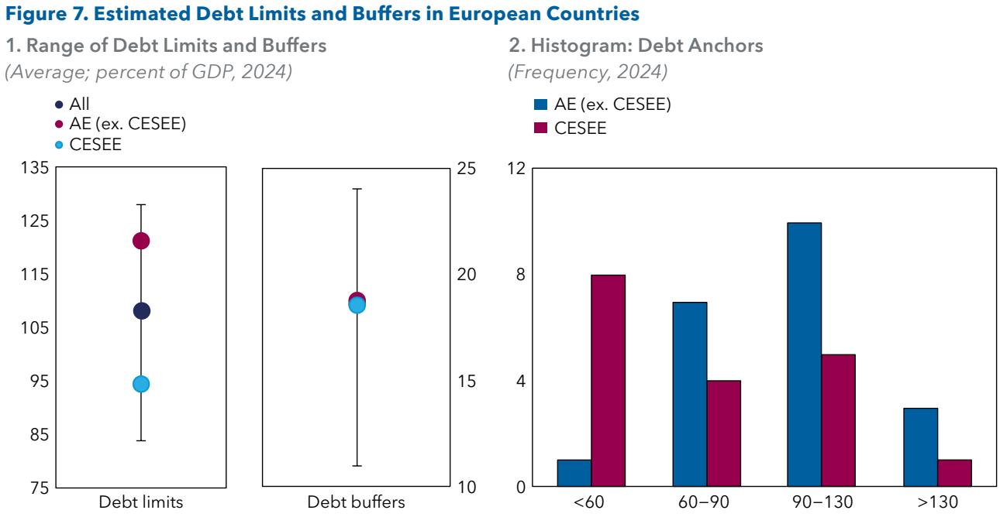  
Sources: Debt limits are estimated using Cao and others (2025). Debt buffers are estimated based on Furceri and others (2025). There are 41 European countries in the sample.  
Note: In the left panel, the error bars show the interquartile range (25th-75th percentile) for all countries in the sample. AE = advanced economies; CESEE = central, eastern, and south-eastern Europe.

## Initial Debt Level

A third source of heterogeneity comes from initial debt positions, which determine how demanding the transition is under any given long-term anchor. In the framework used in this paper, high-debt countries (those starting above the anchor) are assumed to stabilize debt within five years and then put it on a declining path thereafter, whereas countries starting well below the anchor are assumed to be able to accommodate some of the spending pressures—provided debt remains below the anchor over the longer horizon.

This simplifying asymmetry captures an important intuition: High-debt countries typically need to create space to absorb future pressures, whereas low-debt countries may have room to accommodate part of those pressures without immediate tightening.

## Putting Countries into Buckets

Taken together, these three dimensions provide a useful way to think about country heterogeneity, without full country-by-country calibration. Combinations of initial debt position (high versus low relative to the anchor) with the anchor implied by debt limits and buffers (higher versus lower) yield four country “buckets”:

\- High debt-low anchor (most challenging cases). These countries face a "double constraint": They start with elevated debt and have limited debt-carrying capacity or high shock exposure, calling for a lower, prudent anchor. They typically require stronger consolidation, faster rebuilding of fiscal space, and a premium on credibility-enhancing reforms (fiscal institutions, expenditure control, revenue administration).

\- High debt-high anchor (high debt, but stronger capacity). These countries start from high debt but benefit from stronger debt-carrying capacity, deeper markets, and/or stronger institutions that allow for a higher prudent anchor (Figure 8, left panel). They still need a credible downward or stabilizing debt strategy, but the trade-offs are different: The main focus is often on the pace and composition of adjustment (protecting growth-enhancing spending, improving spending efficiency, sequencing reforms), rather than on a very low terminal anchor.

\- Low debt-low anchor (room today, but limited capacity or high risk). These countries may appear to have fiscal space based on their relatively low starting debt ratio alone, but a lower prudent anchor implies that space may be more limited than it looks (Figure 8, right panel). They should avoid complacency, given exposure to external shocks, exchange rate risks, or financial-sector contingent liabilities. In this bucket, medium-term policy often emphasizes building buffers preemptively, strengthening resilience, and ensuring that any accommodation of new spending needs is matched by durable financing.

\- Low debt-high anchor (most room for accommodation and investment). These countries combine relatively low initial debt with stronger capacity or lower volatility/vulnerability. They can, in principle, accommodate a larger share of future spending pressures (and possibly additional investment needs beyond those modeled here) and may choose a more gradual fiscal path.

Looking at these four buckets, the "average" reference path used in this paper is a benchmark not a prescription. It shows the kinds of policy packages that will be required to keep debt sustainable across the region and illustrates the mechanics and orders of magnitude involved. A country-specific assessment would: (1) estimate a debt limit and buffer using country-specific inputs; (2) consider risks (volatility, contingent liabilities, and external vulnerabilities); and (3) formulate a debt anchor and an adjustment path consistent with institutions, political economy constraints, and growth priorities. This tailored approach is essential to move from simple regional benchmarks to country-specific policy design.

For the remainder of this paper, the stylized framework in this paper is based on a reference path anchored by a 90 percent of GDP long-term debt target for all European countries. This simplified approach can be used to clarify the mechanics and illustrate the orders of magnitude involved.

Figure 8. Reference Debt Paths and Heterogeneity of Initial Debt Levels and Anchors  
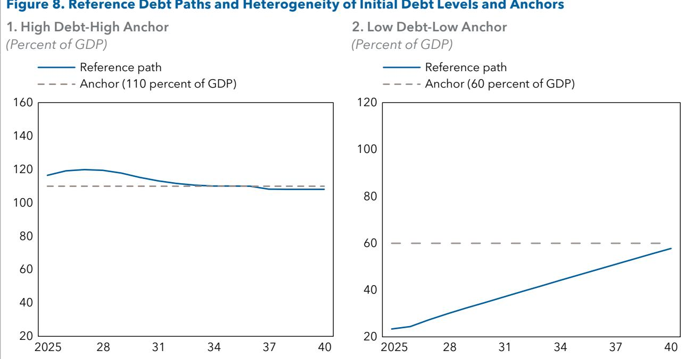  
Source: Authors' calculations.  
Note: The High Debt-High Anchor scenario shows the debt path of the country with the initial debt level that was the 95th percentile among European countries in 2025, given a long-term debt target of 110 percent of GDP, which was the 75th percentile among European countries using the main estimation method outlined in this paper. The Low Debt-Low Anchor scenario shows the debt path of the country with the initial debt level that was the 5th percentile among European countries in 2025, given a long-term debt target of 60 percent of GDP, which was the 25th percentile among European countries using the main estimation method outlined in this paper.

## 3. The Critical Role of Structural Reforms

Structural reforms will play a central role in easing Europe's fiscal challenge by both strengthening growth and directly containing key spending pressures. A broad set of domestic and EU-level reforms would significantly improve debt dynamics over the long term. Although not all reforms are motivated primarily by fiscal sustainability, their combined effect is substantial: Even a moderate reform package would close around a third of the gap between the unchanged policy debt trajectory and the sustainable reference path for the typical European country. However, reforms take time to pay off, and on their own, are insufficient in most countries, underscoring that they must complement—and not replace—medium-term fiscal consolidation.

This chapter considers a set of growth-enhancing and fiscal reforms. These are selected based on their macro-economic and fiscal relevance for European countries, as well as on the availability of empirical evidence quantifying their effects. The list is not exhaustive and does not, for instance, cover policies affecting demographics (Clements and others 2015) or financial-sector reforms (IMF 2025a, b, c). The chapter describes the main reform areas and their effect channels, reviews evidence on their effects, and incorporates them into the debt simulations to assess how far they go in easing Europe's fiscal pressures.

## A. Growth-Enhancing Reforms

Europe faces a persistent gap in living standards compared with the United States, with GDP per capita 30 percent lower, driven by weaker productivity and subdued growth potential (October 2025 IMF European Regional Economic Outlook, Note 2). Addressing these challenges requires growth-enhancing reforms both at the EU and national levels with important complementarities. EU initiatives, with funding instruments like NextGenerationEU, can incentivize domestic reforms, foster a deeper single market, and boost cross-border investment and labor mobility.

Recent IMF analysis finds potential gains from these reforms to be very large. The October 2025 IMF European Regional Economic Outlook (Note 2) considers a bold agenda of reforms that erases domestic structural policy gaps in EU countries to the global frontier, reduces cross-border barriers among EU product markets to align with those among US states, and improves cross-country labor mobility to intra-US levels. This far-reaching set of reforms could raise EU productivity by 20 percent. Taking into account additional investment triggered by higher capital productivity, gains from these reforms nearly eliminate the current EU-US GDP per capita gap.

Although the principal aim of structural reforms is often to raise growth and improve living standards, they also generate important fiscal benefits by broadening tax bases, enhancing revenue collection, and placing downward pressure on public debt ratios (Box 4). Crucially, the sequencing of reforms matters for success. This is because of complementarities across reforms, and because some have immediate benefits, whereas others have large upfront costs and take time to bear fruit. Other reforms can exacerbate cyclical downturns, so their timing should be flexible.

## Box 4. The Fiscal Benefits of Growth-Enhancing Reforms

Achieving faster economic growth through structural reforms can lower the public debt-to-GDP ratio through three mutually reinforcing channels.

First, higher growth of nominal GDP raises the denominator of the debt ratio. Mechanically, this lowers the ratio in any given year, all else equal.

Second, faster growth can improve the interest rate-growth differential, which is a key driver of how the debt ratio evolves over time. In the standard debt accumulation identity, the change in the debt ratio depends on the primary balance and a “snowball” term proportional to $(i-g)/(1+g)$ times last year’s debt, where i is the effective interest rate and g is nominal GDP growth. Higher growth reduces this snowball effect and therefore lowers the primary surplus required to stabilize—or reduce—the debt ratio (Escolano 2010; November 2010 Fiscal Monitor, Appendix 1). However, this “g” effect may be partly offset if higher-growth countries also face higher interest rates (for example, reflecting stronger investment and higher demand for capital), so the net effect on i - g could be more limited, and g should not be viewed in isolation.

Third, fiscal balances also tend to improve with stronger growth. As output and employment rise, tax bases expand, and revenue collection typically increases, while some cyclically sensitive spending (for example, unemployment-related outlays) declines. If the associated revenue windfall is partly or fully saved—that is, not matched by discretionary spending increases or tax cuts—the primary deficit ratio narrows, and debt falls faster over time.

In principle, the increase in the primary balance ratio from a 1 percentage point increase in growth should be close to half a percentage point if revenues were fully saved. This assumes an elasticity of one of revenue-to-GDP (meaning that the revenue-to-GDP ratio is constant) and an elasticity of 0 of spending to GDP (meaning that nominal expenditure is unchanged), as demonstrated by the following equation:

$$
\Delta (\text { deficit } / Y) = \Delta (\text { Exp } / Y) - \Delta (\text { Rev } / Y) = \Delta (\text { Exp } / Y)
$$

$$
= (E x p / Y). (\Delta E x p / E x p - \Delta Y / Y) = - (E x p / Y). (\Delta Y / Y) = \propto . (1 - Y ^ {s c e n a r i o} / Y ^ {b a s e l i n e}),
$$

where $\Delta$ (deficit/Y), $\Delta$ (Exp/Y) $\Delta$ (Rev/Y) are the changes in the primary deficit, revenue, and expenditure ratios, relative to a baseline, and $\alpha$ is a semi-elasticity relating the change in output to the change in the primary deficit ratio, that is equal to the primary expenditure ratio, which in the average European country is around 42 percent of GDP. It is assumed that $\Delta$ (Rev/Y) = 0.

In practice, part of the revenue windfall is generally spent, and the debt-reducing effect is correspondingly smaller. An analysis of past literature that studied the effect of higher growth on fiscal balances in practice indicates that a 1 percentage point increase in GDP tends to reduce the primary deficit ratio by around 0.17 percentage point, on average (Heimberger 2023). This broadly suggests that half of the additional revenue is spent and half is saved (since 0.17 is close to half of 0.4).

Overall, growth-enhancing reforms can materially support debt reduction, but the gains tend to accrue gradually and are strongest when complemented by prudent fiscal policy that preserves windfalls and contains structural spending pressures.

## Domestic Reforms

Type of reforms. Recent IMF analysis by Budina and others (2025) highlights the role of structural reforms in tackling Europe's persistent regulatory and institutional weaknesses, which hinder innovation, labor mobility, and efficient investment. The analysis identifies three priorities with the largest growth effect: labor market reforms, product market reforms (notably business deregulation), and governance improvements. The need for reform differs across countries: CESEE and Western Balkan economies typically face deeper institutional gaps, including judicial inefficiencies and weak governance, whereas AEs are more constrained by labor market rigidities and regulatory burdens that limit participation. Some progress is being made in these areas, but sizable gaps remain, calling for deeper, more comprehensive implementation.

Effects. The growth benefit of these reforms is potentially substantial. Budina and others (2025) consider the effect of closing half of the distance to the efficiency frontier in the three critical areas and find that this would raise average annual GDP growth by about 0.5 percent in AEs and 0.7 percent in CESEE countries during 2030-40. Labor market and human-capital reforms contribute the largest share of additional growth, both by increasing labor inputs through greater participation and by boosting productivity via improved skills and inclusion. Product market reforms would reduce regulatory burdens and enhance competition, and lower compliance costs, fostering firm dynamism. Governance reforms are most impactful in lower-income countries, strengthening investor confidence and institutional quality.

The effect of these reforms on public debt trajectories operates through several channels (Box 4). By lifting productivity and potential output, reforms expand the tax base and improve revenue collection, reducing the fiscal deficit. Higher growth will also make the interest rate-growth differential more favorable, which, together with lower deficits, will moderate the debt burden over time. Governance reforms contribute to stronger public finances through better spending efficiency, reducing waste, and improving the quality of fiscal control, leading to lower deficits. Although the fiscal benefits of growth-enhancing reforms are important, they tend to materialize gradually and thus should be seen as complementary to sound fiscal policies addressing aging-related and other structural spending pressures.

Implementation and constraints. The sequencing of reforms is critical to maximizing macroeconomic and fiscal gains while limiting the risk of being procyclical. Product market and governance reforms are broadly cycle-neutral and do not exacerbate economic slack, making them suitable to prioritize early (Duval and Furceri 2018). Governance reforms can deliver relatively rapid benefits—particularly in EMs—by strengthening institutions, improving the business climate, and boosting investor confidence. Product market reforms, by contrast, typically take longer to affect growth, with productivity gains materializing only after several years. Labor market reforms may need to be phased carefully and aligned with (improving) cyclical conditions. Their short-term effects vary: Stricter employment protection can deepen downturns, whereas active labor market policies and reductions in labor tax wedges tend to be countercyclical and support employment. Unemployment benefit reforms are generally neutral. Many labor market reforms also entail upfront fiscal costs, including spending on training, education, or policies to raise labor force participation. Careful sequencing is therefore needed to manage near-term fiscal pressures while securing longer-term growth and fiscal dividends.

Implementation constraints may hinder reforms' effectiveness. In CESEE and Western Balkan countries, political uncertainty and uneven institutional capacity complicate efforts to crowd in private investment through reform, slowing productive capital formation. Labor market reforms can face political resistance, leading to delays or dilution. Deep governance reforms—especially judicial and other institutional overhauls—are technically complex and administratively demanding, which can undermine their effectiveness. Finally, labor activation and education programs can entail fiscal costs that strain budgets.

Overall, growth-enhancing domestic reforms have significant potential to ease Europe's fiscal burden, notwithstanding implementation risks. For AEs, reforms would be particularly beneficial by helping counterbalance aging challenges through productivity gains. There will be additional benefits in CESEE and Western Balkan countries, where governance reforms can address structural weaknesses and institutional shortcomings. Supported by EU funds, these reforms are key pillars in the region's long-term economic resilience and sustainable public finances.

## EU Single Market Reform

Type of reforms. The single market remains a key engine of Europe's growth, facilitating cross-border trade, investment and migration. It provides EU firms with larger markets and consumers with greater choice. Yet significant structural barriers persist that limit its full potential. IMF analysis has identified several key constraints hindering the ability of European firms to operate and expand across the region, including fragmented regulations, inefficient financial intermediation, limited labor mobility, and a poorly integrated energy market (Adilbish and others 2025; Arnold and others 2025; October 2025 European Regional Economic Outlook, Note 2). These obstacles increase costs for businesses, reduce cross-border investment and innovation, and limit productivity growth throughout the region.

The IMF has proposed four key avenues of reform that address each of the main bottlenecks:

\- A key reform to reduce regulatory fragmentation is the harmonized framework known as the "28th regime" to replace a patchwork of national rules with a uniform framework for creation, running, and winding up of firms (Dizioli, Fotiou, and Garrido 2026). The framework proposed by the European Commission in March 2026, into which firms may "opt in," is a substantive step in this direction.

\- Advancing the Capital Markets Union (CMU) would achieve more effective financial intermediation, addressing the EU's overreliance on bank financing by fostering greater cross-border capital flows and improving access to long-term financing, crucial for scaling up innovative firms (Brandão-Marques and others 2026).

\- Labor mobility may be enhanced through reforms delivering better mutual recognition of professional qualifications and by tackling housing affordability barriers, which currently discourage workforce relocation despite open borders. Although labor mobility has improved over the past few decades, disparities remain.

\- Finally, integrating the EU energy market would harmonize electricity and gas markets and reduce price volatility and supply risks. This is vital given Europe's energy transition ambitions and recurrent energy shocks (Bartolini and others 2026).

Effects. A far-reaching package of domestic and EU-level reforms would have a major effect on the EU's productivity and income per capita gap with the United States. A substantial but less demanding package of EU-level reforms alone would still have a meaningful effect. Arnold and others (2025) use a semistructural model calibrated to the EU to assess the growth effect of a set of "first step" EU reforms over a decade. The results show that EU GDP would rise by around 3 percent above the baseline by 2040, with virtually all member states benefiting. Output gains range from 2 to 5 percent across countries, depending on country-specific initial conditions and integration levels. Smaller or less integrated economies would experience proportionally larger benefits from lower regulatory barriers and more accessible capital markets; larger economies gain significantly through efficiency and productivity improvements. On average, roughly 20 percent of the benefit is attributable to higher total factor productivity, reflecting efficiency improvements and technology diffusion enabled by deeper integration. The remaining 80 percent would result from increased labor input through higher employment or working hours and capital deepening, fostered by the more efficient allocation of resources and better financial intermediation.

Like the domestic reforms highlighted in the previous section, the main motivations for single-market reform are related to growth, resilience, and cohesion, not fiscal sustainability. But these reforms improve fiscal trajectories in the same way as domestic reforms, by expanding tax bases, boosting revenues, and improving the interest rate-growth differential, contributing to slower debt accumulation (Box 4). By lowering energy prices and reducing volatility through market integration, reforms also help to contain inflationary pressures that can complicate fiscal consolidation.

Implementation and constraints. Sequencing of EU-level reforms matters, as it does at the national level. Prioritizing regulatory harmonization and financial market integration would create a conducive environment for labor mobility and energy market reforms to gain traction and deliver their full potential. Country heterogeneity also suggests tailoring support for reforms. CESEE countries would particularly benefit from enhanced financial intermediation and recognition of qualifications; Western and Northern Europe would gain more from energy market integration.

Despite strong economic prospects, implementing these reforms will be challenging. Regulatory harmonization requires overcoming divergent national interests and legal traditions that complicate agreement on common standards, as previous efforts under the EU Services Directive and the Digital Single Market have shown. Progress toward CMU has been slow, hindered by fragmented supervisory frameworks and disagreements over the perceived risk involved. Labor mobility reforms confront deep-rooted social and cultural barriers, as well as structural issues like housing shortages, which are not quickly resolved. Energy integration depends on complex infrastructure investments and political consensus on energy transition paths, with member states differing on priorities such as nuclear energy or renewables.

Overall, deepening the single market–like domestic reforms–offers meaningful growth potential. "First-step" EU-level reforms would generate substantial gains. A bolder package would go much further (October 2025 European Regional Economic Outlook, Note 2). Beyond raising growth, advancing these reforms would strengthen Europe's resilience to long-term fiscal and demographic pressures, making single-market deepening an essential complement to national efforts to support debt sustainability.

## B. Fiscal-Structural Reforms

## Pension Reforms

Type of reforms. Rapid aging and worsening old age to working age dependency ratios pose sustainability challenges for public Pay-as-you-go pension systems. Pressures arise because an increasing share of the population is retiring and drawing pensions for longer periods, while the relative size of working-age contributors declines, creating a growing imbalance. Some countries have pursued reforms to some degree to keep pension systems financially viable and avoid sharp increases in fiscal burdens (for example, Denmark, Sweden, and the United Kingdom). Reforms include raising the retirement age, lowering benefits, and increasing contributions. Increasing the retirement age responds to rising life expectancy, better aligning working life with longevity, encouraging longer labor force participation, and reducing the ratio of pensioners to contributors, easing financing pressures. Similarly, adjustments to benefits—reducing replacement rates, tightening eligibility criteria, linking benefits more explicitly to lifetime contributions—contain long-term spending growth. Increasing contribution rates is another lever, albeit with labor market trade-offs (IMF 2011).

These reforms can be supported by EU-level coordination and funds. The European Semester and country-specific recommendations regularly emphasize pension sustainability, and the European Social Fund may support active aging and labor participation measures complementary to pension reforms. Past waves of pension reforms across Europe, particularly after the 2008 global financial crisis, set the stage, but challenges remain, especially in countries with less integrated social protection systems.

Effects. The immediate effect of pension reforms is a stabilization or reduction of pension expenditure relative to GDP, slowing the growth of an otherwise escalating fiscal burden tied to aging populations. Savings unfold gradually, reflecting demographic transitions and phased policy implementation. Raising the retirement age tends to have a delayed but persistent effect; contribution rate increases impact revenues more quickly but may have adverse labor market effects if implemented too abruptly. Benefit cuts may reduce costs but often face political resistance and need careful design to protect income adequacy. Fiscal effects vary across countries, but may entail savings of several percentage points of GDP (IMF 2011; Fouejieu and others 2021). In CESEE countries, where aging is rapid but pension systems vary widely, pension reforms may differ compared with AEs.

By slowing the growth of pension spending, these reforms directly alleviate fiscal pressures, contributing to improved debt dynamics and preserving fiscal space for other priorities (health, education, and investment). Although pension reforms are not typically growth-enhancing themselves, by incentivizing longer labor market participation, they may indirectly support higher potential output, amplifying fiscal benefits over time.

Constraints and Implementation. Pension reforms often face significant hurdles. Political economy factors often slow or soften implementation, because of resistance to benefit cuts or retirement age increases. Some reforms risk increasing old-age poverty if social safety nets are insufficiently adjusted, requiring complementary social policies. Labor market rigidities or limited employment opportunities for older workers can limit the effectiveness of retirement age hikes. Moreover, increases in contribution rates may have distortionary effects on employment and competitiveness and can fuel perceptions of unfairness to younger generations.

Effective pension reforms are best embedded within a comprehensive reform package–sequenced and paced to balance fiscal consolidation with social fairness and economic growth objectives. Supported by EU-level policy guidance and structural funds, these reforms can play a pivotal role in tackling Europe's long-term spending pressures, helping to maintain social cohesion while preserving fiscal space for emerging priorities.

## Catalyzing Private Investment

Type of reforms. Catalyzing private investment entails the strategic use of public resources to unlock significantly larger volumes of private funds that would otherwise not be committed because of market failures. The primary objective is usually to enable financing for commercially viable projects that face constraints in accessing capital, thus promoting sustainable growth with indirect fiscal benefits.

In the European context, catalyzation has been increasingly adopted both at the EU and national levels. At the EU level, it is embedded within the framework of flagship initiatives like the European Fund for Strategic Investments (EFSI) and its successor InvestEU. These programs leverage EU budgetary guarantees to allow entities such as the European Investment Bank and national promotional banks to provide enhanced financing terms and risk-sharing mechanisms, fostering investments primarily in priority sectors such as clean energy, digital infrastructure, innovation, and small- and medium-sized enterprises. This illustrates the EU's commitment to lean public spending while seeking to crowd in private financing in alignment with broader policy agendas like the Green Deal and Digital Agenda. At the national level, promotional institutions also leverage public resources to advance government policy objectives and provide financing where commercial banks are unwilling or unable to do so.

Effects. The economic effects of catalyzation arise primarily through improved capital allocation and increased private investments, which stimulate innovation, infrastructure development, and employment growth. By shifting part of the financing burden of this investment to the private sector, catalyzation can indirectly strengthen public finances, provided that the catalyzed funds address spending pressures previously borne by the government. The most relevant pressures are those related to the climate and energy transition. The overall leverage ratios observed in European initiatives provide a practical measure of catalyzation's effectiveness: For instance, EFSI mobilized €2.6 of private capital for every euro of public resources, whereas InvestEU's ratio stands at around 1.8. National promotional banks exhibit varying leverage ratios, ranging from around one to four in recent years (Table 1).

Catalyzation can be complementary with other EU-level and national reforms, such as those that improve regulatory harmonization and financial market integration, to reduce investment risks and transaction costs. Moreover, heterogeneity across Europe means that economies with less developed financial markets or institutional frameworks—for example, CESEE countries—may derive greater benefits from catalyzation instruments. However, these benefits tend to materialize with lags because of project implementation times and the necessary institutional capacity building.

Table 1. Catalyzing Private Investment: EU Programs and National Promotional Institutions

<table><tr><td>National Promotional Institution/EU program</td><td>EFSI &quot;Juncker plan&quot;</td><td>InvestEU</td><td>KfW (Germany)</td><td>CDP (Italy)</td><td>BPI (France)</td><td>UK National Wealth Fund (UK)</td></tr><tr><td>Period of operation</td><td>2015–20</td><td>2021–27</td><td>1948–present</td><td> $1850^3$ -present</td><td>2012–present</td><td>2021–present (former UKIB)</td></tr><tr><td>Annual public resources for climate projects $^1$ </td><td>0.01% EU GDP (54% of total EU budget guarantee)</td><td>0.01% EU GDP (51% of total EU budget guarantee)</td><td>0.5% GDP (20% of the bank&#x27;s annual operations)</td><td>0.06% GDP planned annually for the next three years (6% of annual operations)</td><td>0.2% GDP (10% of annual operations)</td><td>0.05% GDP (78% of annual operations)</td></tr><tr><td>Leverage ratio $^2$ (Total private investment/public contribution)</td><td>2.6</td><td>1.8</td><td>NA</td><td>1.8</td><td>3–4</td><td>1.4</td></tr><tr><td colspan="7">Sources: European Commission; official websites of national promotional institutions; and authors&#x27; calculations.Note: EU = European Union; EFSI = European Fund for Strategic Investments; KfW = Kreditanstalt für Wiederaufbau; CDP = Cassa Depositi e Prestiti; BPI = Banque Publique d&#x27;Investissement; UKIB = United Kingdom Infrastructure Bank; NWF = National Wealth Fund. $^1$  Annual averages over the period of operation, unless otherwise specified, based on authors&#x27; estimates using the latest publicly available data for climate-related projects, which are most relevant for alleviating public spending pressures. EFSI and InvestEU figures are average annual resources over their respective program periods. KfW and BPI figures refer to 2024. CDP figures are based on its 2025-27 strategic plan. UK NWF figures refer to its financial year 2023-24. $^2$  Leverage ratios relate to all projects, not limited to climate, and are based on authors&#x27; estimates. The leverage ratios pertain to the following time periods: EFSI (2015-20); InvestEU (2021-27 projected); CDP (2024); BPI (sourced from its most recent 10-year audit report); UK National Wealth Fund (2024). $^3$  CDP was founded in the Kingdom of Sardinia, prior to Italian unification. After 1861, it became an institution of the unified Italian state.</td></tr></table>

Implementation and constraints. Despite these promising effects, the scope of catalyzation is often constrained. The pool of projects that are simultaneously commercially viable, additional (would not happen without this public support), and fiscally prudent is limited. Establishing additionality is challenging, with robust evidence often lacking to demonstrate that public intervention would supplement private investment and not displace it. Catalyzation instruments, especially risk-sharing mechanisms such as guarantees, also generate contingent fiscal liabilities that broaden government exposure, even if direct budget appropriations remain low. Moreover, national promotional banks, even if operationally independent and funded by market borrowing, introduce contingent risks that require careful monitoring.

The recent experience with catalyzation in Europe suggests limited potential to alleviate fiscal pressures on national budgets. As shown in Table 1, EU-level initiatives and national promotional institutions have committed only modest amounts to areas relevant to spending pressures, namely climate and the energy transition, and overall leverage ratios have been relatively low. Other key areas creating budgetary strain, like health care, have mostly not been a focus of these institutions. Overall, although catalyzation is a worthwhile strategy and can overcome barriers to private investment, its fiscal benefits are likely to remain modest.

## Centralizing

Type of reforms. EU funds play a critical role in supporting cross-border policy initiatives. This includes NextGenerationEU funding for post-pandemic recovery, which has contributed to economic stabilization. The EU budget (multiannual financial framework), on the other hand, is particularly suitable for providing European public goods, such as support for research and innovation, energy transition and security, and EU security and defense, exploiting positive externalities and economies of scale, as well as enhanced coordination, while reducing duplication. The EU budget nonetheless remains small, just over 1 percent of gross national income, as most public spending in the EU still occurs at the national level.

The IMF has proposed reforms to the EU budget for the 2028-34 MFF (Figure 9). Based on a needs assessment, the IMF has proposed doubling EU spending on European public goods, namely climate, defense, and innovation (Busse and others 2025). This would entail shifting some spending responsibilities upward from national budgets to the EU level, 0.3%-0.4% of GDP in climate and defense. This could be funded by borrowing by the EU itself, through securities issued jointly by all member countries. This would not only provide resources for the additional spending but also could improve market liquidity and elevate the role of EU securities as safe assets.

Effects. The main motivation for centralizing spending and borrowing at the EU level is to increase efficiency in the ways described above. There could nonetheless be fiscal savings for national governments through several channels, depending on the design of the reform:

\- First, there could be budgetary savings because of the efficiency gains from centralization. These efficiency gains could be achieved by internalizing cross-border spillovers of national policies, exploiting economies of scale, removing intra-EU

Figure 9. Current Multiannual Financial Framework and IMF-Proposed Next MFF (Percent of EU gross national income)  
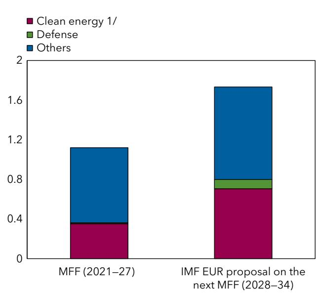  
Sources: European Commission; and Busse and others (2025).  
Note: EU = European Union; EUR = European Department; IMF = International Monetary Fund; MFF = multiannual financial framework.  
$^{1}$ Consolidating EU budget spending for climate objectives across all EU programs, according to the Commission's Climate Mainstreaming estimates.

barriers and avoiding duplication, and mitigating costly coordination failures. It could nonetheless take time for these savings to accumulate, so centralization may have a limited initial effect through this channel.

\- Second, there could also be lower interest costs on centralized spending. Interest savings could arise because the cost of borrowing for national governments may be higher at the national level. Interest savings would differ across countries, depending on national borrowing costs.

Third, shifting selected spending responsibilities to the EU level, funded by EU-level borrowing, could alleviate pressures on national budgets in the short term. $^{10}$ However, there should be clear safeguards to ensure that this reallocation of responsibilities does not undermine countries' fiscal sustainability in the longer term—since member states are ultimately responsible for servicing EU debt through future payments to the EU budget. In this regard, the proposed increase in EU-level spending by Busse and others (2025) is targeted to European public goods in shared priority areas, especially where central provision yields efficiency gains through positive spillovers, economies of scale, and helps avoid more costly duplication of national spending. The use of EU borrowing should be explicitly conditioned on strengthening the EU budget's own resources. Moreover, strengthening transparency and oversight of EU-level borrowing—including improved consolidated fiscal reporting and systematic monitoring of contingent liabilities—would ensure that any expanded use of EU-level financing remains consistent with fiscal sustainability.

Savings generated by centralization are nonetheless likely to be relatively limited. This is because the amount of spending transferred to the EU-level would be small (0.3%-0.4% of GDP) under the IMF staff proposal, and it represents a redistribution, not alleviation, of the fiscal burden (Busse and others 2025). Efficiency gains from centralized defense and energy spending are also estimated to be contained, around 10 percent of unit costs, reflecting savings of approximately 7 percent from EU-level coordination of energy investment (IMF 2024b) and up to 30 percent from greater defense co-operation (European Commission 2017; Müller 2024). Assuming that EU-level borrowing is, on average, 35 basis points cheaper than national borrowing—the difference between EU-level rates and the weighted-average 10-year sovereign yields of EU countries during 2023-25, interest savings would provide only a modest further benefit.

Implementation and constraints. Institutional and political economy factors constrain additional centralization. Expanding the EU budget requires unanimous agreement among member states and complex and protracted negotiations. Scaling up joint borrowing and expanding the EU's central fiscal capacity also requires reforms to the EU budget framework and will likely lead to debate about burden sharing across countries.

Overall, under current reform proposals, greater centralization is unlikely to be a silver bullet for countries facing problems with the sustainability of public finances. The size of the savings will likely be modest, and implementation challenges are substantial. It is nonetheless a worthwhile complement to other savings discussed in this chapter and may have real efficiency benefits for the EU while contributing to closer European integration and cohesion.

## C. Putting It Altogether

As discussed in Chapter 1, under unchanged policies, public debt in Europe could move onto an unsustainable path, reflecting already high debt in some countries, rising interest burdens, and mounting spending pressures. Although this points to the need for fiscal consolidation, delivering large and durable adjustment is politically and economically difficult—making it essential to assess how far other policies can help ease the burden. This chapter has shown that domestic and EU-level structural reforms can improve fiscal outcomes while also lifting growth. A key question, then, is how large the combined effect of these reforms could be on the debt trajectory.

This section considers the fiscal impact of implementing all of the five types of reforms discussed in this chapter. It is assumed that this set of reforms is implemented over a five-year horizon with effects on the debt path after 2030. As discussed earlier in this chapter, the reforms influence the evolution of debt by improving the interest rate-growth differential or reducing budgetary pressure and lowering the deficit.

Some reforms do both. To incorporate the reforms in the long-term debt simulations presented in this paper, some further assumptions about the size, design, and sequencing of each reform need to be made, which are outlined in Box 5.

Simulations show that the reforms would have a meaningful effect on the debt path. A moderate effort, scaling the full set of reforms by 50 percent, would deliver one-third of the required adjustment for the average European country. This means that the moderate reform package would bring the country's debt trajectory one-third of the way toward the reference path. Debt in 2040 would be 115 percent of GDP, rather than 130 percent of GDP on the unchanged policy path (Figure 10). This is an important step toward keeping debt sustainable, and there is scope to be even more ambitious. The more far-reaching the reforms are, the larger will be their effect.

In terms of relative contributions of each reform, we find that the largest effect comes from pension

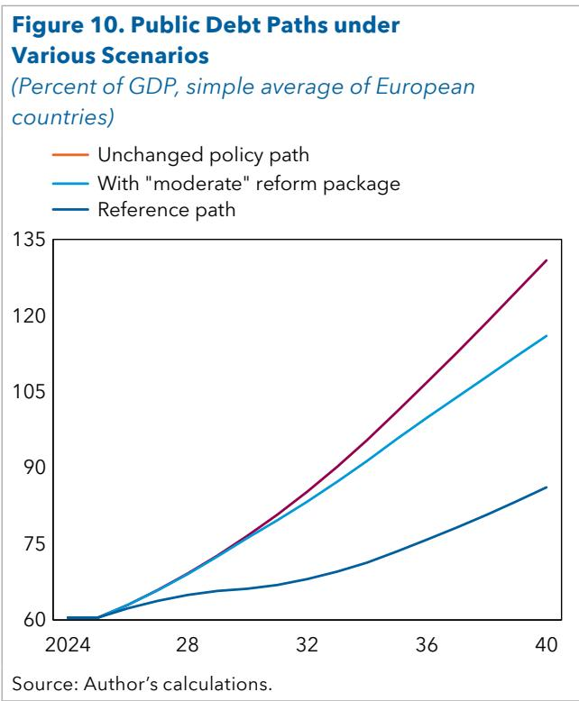

reforms and growth-enhancing reforms, whereas the enlargement of the EU budget and catalyzation of private investment play a more complementary role. $^{11}$

Still, while implementing structural reforms is clearly important for keeping debt sustainable, it will not be enough for most countries to achieve the sustainable reference debt path. In the next chapter, we estimate the size of the fiscal consolidation required to close the residual gap to the reference debt path when countries adopt the moderate set of reforms.

## Box 5. Assumptions about the Effect of Reforms on the Debt Simulations

The simulations assume that, although fiscal consolidation occurs over five years (2026-30), most structural reforms are implemented gradually and pay off over the longer term (during 2031-40). Reforms affect the debt path through their effect on the interest rate-growth differential and the fiscal deficit. Although some reforms affect the deficit by directly reducing spending pressures (for example, pension reforms), the effect of growth-enhancing reforms on the deficit is calibrated using the empirically estimated elasticity of Heimberger (2023). The simulations incorporate the following reforms:

(continued)

\- Domestic reforms. It is assumed that three structural reforms with the largest payoff identified by Budina and others (2025) are implemented in the simulations over the next 15 years, beginning to affect growth after 2030. The reforms are to (1) product markets, through changes to business regulation, such as planning reform, cutting red tape, and easier firm entry; (2) labor markets, focusing on training, loosening employment protection, and lowering labor tax wedges; and (3) governance (control of corruption). Product market reforms and governance reforms are implemented first since their initial effect is judged to be neither procyclical nor countercyclical. Governance reforms are assumed to yield growth benefits faster (from 2031), whereas the lift to growth from product market reforms materializes from 2034. Since labor market reforms can be procyclical (for example, employment protection) or countercyclical (for example, lower tax wedges), and have fiscal implementation costs, it is assumed that these reforms are implemented last (from 2030), when output gaps have closed, and economies are closer to the steady state. The labor market reforms have a growth effect after 2036. The quantitative effect of reforms is country-specific, and the sequencing of reform implementation determines how the growth effect builds over time. The cumulative effect is an increase in the level of GDP by $4 \frac{3}{4}$ percent on average across European countries by 2040.

\- Single market. Reforms that strengthen the single market are assumed to be implemented over the next five years and affect growth during 2031-40. The specific set of “first step” reforms comprises (1) a high-quality insolvency regime for all firms across the European Union; (2) a deeper capital market union, leading to a higher level of venture capital investment in Europe; (3) higher labor mobility creating a positive labor supply shock in advanced economies and a corresponding negative shock in others, which prompts more investment in skills in emerging market economies; and (4) energy market integration that produces lower and more stable energy prices. The effect on the level of output accumulates gradually over time, so that by 2040 the reforms lift the level of GDP in EU countries by 3 percent by 2040, as in Arnold and others (2025).

\- Centralization. The simulations assume a doubling of the EU budget allocation to defense and climate, shifting some spending responsibilities in these areas upward from national budgets to the EU level, financed by joint EU borrowing, as proposed by Busse and others (2025). It is assumed that this reallocation delivers lower overall public spending (national plus supranational) in Europe through efficiency gains and interest savings for some countries. The size of the savings is close to half a percent of GDP, during 2030–40.

\- Catalyzation. Policy banks in all countries are assumed to increase their investment by 0.3 percent of GDP (calibrated on the difference between BPI-France and KfW-Germany for climate projects). Given a typical leverage ratio of slightly less than 2, this would crowd in additional private investment of about 0.25 percent of GDP, so that spending pressures are estimated to be reduced each year by this amount in all countries during 2031-40 on a net basis.

\- Pensions. Reforms to public pensions are assumed to generate immediate fiscal savings from 2026 and gradually eliminate all spending pressures from pensions by 2030. This means that pension spending as a share of GDP stabilizes by 2030 and remains unchanged thereafter (IMF 2011; Fouejieu and others 2021).

## D. Additional Reform Opportunities Not Included in the Simulations

Reform packages quantified in the simulations focus on a narrow set of measures, for which the empirical literature provides sufficiently robust estimates of macroeconomic and fiscal effects. This enhances transparency and comparability across scenarios but also implies that the simulations do not capture the full menu of reforms that could lift growth or affect long-term spending pressures. This section discusses other reform areas not included in the simulations.

## Health Sector Reforms

Health spending is one of the most important—and most complex—drivers of long-term fiscal pressures in Europe. Unlike pensions, where spending dynamics are closely linked to demographic parameters and entitlement formulas, health expenditure growth depends on aging and also on technology, medical practice patterns, relative prices, and institutional incentives. This makes it harder to translate individual reform measures into simple and robust savings estimates suitable for the simulations. Some reforms improve health outcomes or financial protection but not total spending. For these reasons, health reforms are not included in the quantified packages in this paper.

IMF guidance (for example, Soto and others 2023) suggests several levers that can improve spending efficiency and contain spending growth without undermining access or outcomes, especially when paired with strong governance and data systems.

\- Strengthening primary care and prevention. A common source of inefficiency is excessive reliance on hospital-based and specialist care for conditions that could be managed earlier and more cheaply. Policies that strengthen primary care–gatekeeping arrangements, expanded multidisciplinary primary care teams, better chronic disease management, and improved access outside hospitals—can reduce avoidable emergency visits and admissions (Hallaert and Queyranne 2016; Hallaert 2023, 2025). Prevention policies (for example, vaccination and screening) can also reduce the future burden of disease. Although these reforms may raise costs initially (workforce, information technology, and access expansion), they generate fiscal dividends over time by reducing expensive downstream treatments and improving population health.

\- Payment and provider incentives. Many health systems reward activity rather than value, encouraging overprovision of tests, procedures, or hospital stays. Reforms that adjust provider payment–stronger use of diagnosis-related groups with well-designed tariffs, capitation for primary care, bundled payments for episodes of care, pay-for-quality components, and tighter budget constraints–may reduce unnecessary volume and improve care coordination. These reforms are often central to cost containment, but their effect depends heavily on design details (risk adjustment, safeguards against underprovision, and monitoring).

\- Pharmaceutical policy and procurement. Drug spending is a major and fast-growing component of health budgets, driven partly by innovation and market power. Policy options include centralized or joint procurement, stronger use of generics and biosimilars, reference pricing, health technology assessment to link reimbursement to value for money, and managed-entry agreements for high-cost medicines. These reforms can deliver meaningful savings, but quantification is challenging because it depends on pipeline innovation, negotiation outcomes, and enforcement.

Governance, digitalization, and data-driven efficiency. Digital health and better information systems can improve efficiency—for example, interoperable electronic health records, e-prescribing, fraud detection, referral management, and data analytics to benchmark provider performance. However, technology is a double-edged sword: Although it can raise productivity and reduce waste, it can also enable additional service use. The net fiscal effect depends on whether digital tools are paired with incentive reforms and effective management.

\- Workforce and wage-bill management. Health systems are labor-intensive, and workforce shortages are increasingly binding in many European countries. Reforms that improve workforce planning, skill mix (using nurses and allied health professionals effectively), retention, and productivity may contain cost pressures while protecting service quality. However, these policies must balance fiscal restraint with the need to maintain staffing and avoid bottlenecks that may raise costs elsewhere (for example, delayed care leading to more acute episodes).

## Other Reforms

Although health deserves special attention, several other reform areas may also ease spending pressures but are not quantified in this paper:

\- Climate and energy transition spending pressures. The simulations capture a stylized need for public climate spending and allow for some relief through catalyzing private investment and EU-level centralization. However, a broader set of reforms may reduce the required public outlays while still delivering climate objectives. These include: (1) pricing and regulatory reforms that shift incentives to the private sector (carbon pricing, fee bates, and regulatory standards), thereby reducing reliance on budgetary subsidies; (2) improving the design of support programs (moving from open-ended subsidies toward competitive auctions, contract-for-difference mechanisms, and better targeting of compensation for vulnerable households); and (3) reforms that accelerate permitting and grid connection, reducing overall system costs and the need for fiscal support.

\- Long-term care (LTC). Aging pressures increasingly operate through LTC. Reforms can include better home-based and community care (often cheaper than institutional care), integrated health-LTC budgets to reduce cost shifting, support for informal caregivers, and improved needs assessment and targeting. These can affect both spending levels and the distribution of costs across households and the state.

\- Education sector efficiency and human-capital delivery. Even if education is not the main source of long-term spending pressures, it is a large spending envelope. Efficiency reforms–school network rationalization in regions with shrinking student cohorts, better teacher allocation and incentives, curriculum modernization, and stronger performance evaluation—can generate savings or allow redeployment toward quality improvements.

\- Defense spending. The paper treats defense mainly as an exogenous spending need. In practice, however, reforms can influence the unit cost of delivering a given level of defense capability. Options include procurement modernization (multiyear procurement planning, competitive tendering, life cycle costing), reducing fragmentation and duplication (including through joint European procurement and standardization), and improving force structure and personnel policies to raise readiness per euro spent.

\- Interest bill pressures. The paper treats the interest-growth differential largely as an assumption in the stylized projections. However, countries can influence interest-spending dynamics through reforms that reduce refinancing risks and strengthen credibility. Relevant measures include: lengthening maturities and smoothing redemption profiles, improving debt management frameworks, strengthening fiscal institutions and medium-term frameworks (which can lower risk premiums), and—in countries where relevant—reducing contingent liabilities (for example, from SOEs or the financial sector) that markets may price into sovereign spreads.

## 4. Medium-Term Fiscal Consolidation

This chapter computes the size of the consolidation required in European countries to bring debt in line with the sustainable reference path. Structural reforms lead to a reduced need for consolidation: With a moderate set of reforms, the average European country would have to consolidate by around 3½ percent of GDP over five years (¾ percent per year), compared with 5 percent with no reforms. A balanced approach to consolidation is preferable, drawing on both revenue and expenditure measures, including efficiency improvements. Growth-friendly and well-targeted consolidation measures are important to keep debt sustainable, support potential growth, and protect the vulnerable.

## A. Size of the Adjustment Needs

## Baseline Results

To meet Europe's fiscal challenge, the second pillar of the policy response is consolidation. With spending pressures rising and debt levels already high in many European countries, the question is no longer whether adjustment will be needed, but how large it must be, how quickly it can be delivered, and how it can be sustained politically. Fiscal consolidation can take the form of measures that increase revenue collection or reduce expenditure, including by improving spending efficiency. In the exercise presented in this paper, the required consolidation is made over 2026-30, so that by 2030, there is a sufficient buffer to absorb future spending pressures and achieve the reference debt path. Past consolidation episodes suggest that it is unlikely that fiscal effort can be sustained beyond a five-year period, so the exercise does not involve consolidation continuing beyond 2030 (Box 6).

Simulations indicate that, even with the moderate set of reforms, medium-term fiscal consolidation is needed in three-quarters of European countries to achieve the reference debt path. The average effort corresponds to an improvement in the cyclically adjusted primary balance (CAPB) of about $\frac{3}{4}$ percent of GDP per year over 2026–30, slightly above $3\frac{1}{2}$ percent of GDP cumulatively. Although structural reforms ease the fiscal challenge, their budgetary gains are not sufficient to offset the projected spending pressures and stabilize debt dynamics.

This estimate may understate the true consolidation needs since it relies on conservative assumptions. For instance, it is not assumed that increases in the debt ratio over time translate into a worsening of the interest-rate-growth differential. Consolidation needs would also be larger in countries that choose to adopt a lower long-term debt target than the 90 percent of GDP used across the region in this analysis. Later in this chapter, the effect of relaxing some of these assumptions is discussed in a section on sensitivity analysis.

The analysis also shows that consolidation requirements across the region are heterogeneous. Although 3½ percent of GDP is the average, the needs estimated differ across countries. Many smaller AEs have either no adjustment needs or modest ones of less than 2 percent of GDP cumulatively. CESEE countries tend to require more consolidation—in the 2%-5% of GDP range. Several large AEs are found to have among the biggest consolidation needs, by more than 5 percent of GDP over five years, to comply with our anchor. It is worth noting that these results do not always align with recommendations in IMF country reports, which may take into account announced policy plans.

The exercise finds that the share of European countries with medium-term consolidation needs and the size of these needs are larger than incorporated in the medium-term macro-fiscal plans of EU member states, which are prepared under different assumptions about the long-term debt target, the time period for consolidation, the size of spending pressures, and the effect of reforms (Box 6).

## Box 6. Comparison with EU Medium-Term Fiscal Plans

This paper's analysis is based on a highly stylized exercise designed to illustrate the kinds of policy packages that would be needed to keep debt in sustainable territory. The simulations are not based on the EU's fiscal framework, nor do they take account of consolidation measures in medium-term fiscal-structural plans (MTFSPs) of EU member states.

A simple comparison suggests that the consolidation needs calculated in this paper for EU member states are larger than the consolidation plans in MTFSPs. Specifically, we compare the medium-term adjustment needs during 2036-30 of EU countries, after implementing the "moderate set of reforms," and the consolidation planned during this period according to the corresponding MTFSPs. We find that the share of EU countries that are found to require medium-term consolidation is roughly the same as that intending to consolidate under MTFSPs (around two-thirds). However, the average consolidation requirement for EU countries (about 4 percent of GDP cumulatively during 2026-30) is larger than under the EU MTFSPs (around 2 percent of GDP).

The differences between our stylized exercise and the MTFSPs can reflect many factors, including:

\- Spending pressures. The analysis in this paper takes account of spending pressures over a 15-year horizon to 2040, based on previous IMF analysis (Eble and others 2025), as well as reflecting recent North Atlantic Treaty Organization defense spending commitments, which may not be incorporated into the MTFSPs.

\- Adjustment horizon. Fiscal consolidation is assumed to occur over a five-year medium-term horizon in the calculations, whereas it is four to seven years in the EU framework.

\- Anchor. This paper uses a common 90 percent of GDP anchor across countries, rather than the 60 percent target that remains embedded in the EU fiscal framework (although the anchoring criteria are, in fact, much more complex and multifaceted).

■ Reforms. The stylized exercise in this paper takes into account the effect of growth-enhancing and fiscal reforms that may differ from what is assumed in MTFSPs, which tend to treat the benefits of reforms as an upside risk.

## Combining Reforms and Adjustment

The size of required consolidation will depend on the ambition of reforms. More ambitious reforms have a larger fiscal effect because of the additional increase in GDP, which boosts revenue, and greater reduction in spending pressures. This lowers the consolidation required to achieve the reference debt path.

Figure 11 shows different combinations of reform ambition and consolidation size in the average European country that potentially achieve the same reference debt path. Reform ambition is characterized by an "intensity index" on the horizontal axis, normalized to one when reforms consist of the moderate set. If reforms are bigger than in the "moderate" set, then the index exceeds one.

Our simulations show that, without any reforms, the medium-term consolidation needs of the average European country would be approximately 5 percent of GDP cumulatively during 2026-30. Increasing the intensity of reforms up to the moderate set reduces the cumulative consolidation needs by around $1 \frac{1}{2}$ percentage points (from 5 to $3 \frac{1}{2}$ percent of GDP). More far-reaching reforms with greater intensity would lower consolidation needs further.

For the vast majority of countries, a combination of reforms and consolidation will be needed. The exact combination is ultimately a decision for each country. Both policies require political effort, and relevant considerations include social preferences, relative feasibility, and political acceptability, which differ across countries and over time. Policymakers should be mindful that growth and fiscal effect of reforms develop over time, whereas adverse shocks may occur before the benefits are realized. Neglecting or delaying fiscal consolidation may therefore be risky.

## Sensitivity Analysis

The exercise in this paper is highly stylized and based on a set of assumptions, including the common debt anchor of 90 percent of GDP, asymmetric behavior of high-versus-low-debt countries along the reference debt path and the medium-term time frame over which reforms and consolidation occur. These assumptions are conservative, and sensitivity analysis reveals

Figure 11. More Reform Means Less Fiscal Consolidation
(Simple average of European countries)

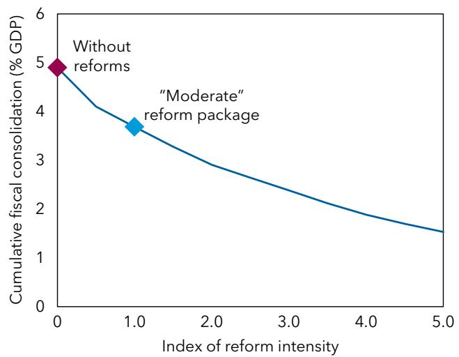  
Source: Authors' calculations.  
Note: Fiscal consolidation is measured on a cumulative basis over 2026-30. The isoquant is computed using the constant sample of countries that need to adjust under the moderate reforms. No multiplier is assumed. Along the horizontal axis, more “intense” reforms have a progressively larger effect on growth and spending pressures. Index = 1 for moderate reforms.

that the consolidation needs will be higher if these assumptions are relaxed. Annex 3 describes the formulas used for this analysis.

A different reference path. An alternative approach entails operationalizing the 90 percent of GDP anchor as a target to be achieved by 2040 regardless of the current level of debt (applying the anchor symmetrically for high and low-debt countries). This would be in the spirit of the S1 indicator in the European Commission's Debt Sustainability Monitor (European Commission 2024a). After implementing moderate reforms, the consolidation needs of the typical country would be higher under this S1-type approach, at almost 4 percent of GDP over five years (versus baseline $3 \frac{1}{2}$ percent of GDP). This average result is driven by the higher adjustment needs for high-debt countries to reach a 90 percent debt-to-GDP ratio by 2040, rather than simply converging toward it.

Another alternative is similar to the UK's debt rule, which requires public debt to be stabilized over the medium term and does not take into account the effect of spending pressures in the long term. Requiring all countries in the sample to stabilize debt by the fifth year, irrespective of their initial debt level, would increase the medium-term consolidation need of the typical country to almost 5 percent of GDP, with the moderate reform package. The adjustment in this exercise is higher than the baseline because debt stabilization in the medium term is a more stringent requirement than ensuring a debt-to-GDP ratio not exceeding 90 percent for low- and medium-debt countries.

Different anchor. Another key assumption of our analysis is a common debt anchor of 90 percent of GDP. This is notably higher than the 60 percent of GDP target embedded in the EU fiscal framework. Under a 60 percent anchor, the medium-term consolidation needs of the typical European country, with moderate reforms, would be more than $4 \frac{1}{2}$ percent of GDP cumulatively over 2026-30, 1 percentage point of GDP larger than under the 90 percent anchor.

Feedback from debt to r - g. It has so far been assumed that rising debt levels do not directly feed back into the pace of growth nor into borrowing costs for national governments—the interest rate-growth differential was kept constant in the long term. If the differential were also allowed to rise by four basis points for every percentage point that debt rises during 2026-40, $^{12}$ then consolidation needs under moderate reforms would increase by 1 percentage point of GDP, relative to the baseline simulation.

Implementation delay. The paper assumes that reforms and consolidation are implemented promptly during 2026-30. Assuming instead that all countries conduct unchanged fiscal policy $^{13}$ over the next five years, with reforms and consolidation beginning only in 2030 (but keeping the 15-year horizon until 2045), would raise the average medium-term consolidation required from $\frac{3}{4}$ percent of GDP per year to over 1 percent of GDP per year. Failing to act now will exacerbate the fiscal challenge, allowing spending pressures to materialize, debt to build up faster, and borrowing costs to rise. In this scenario, the market could force a disorderly adjustment.

## B. Composition of the Adjustment

## Revenue versus Spending Measures

With the scale of consolidation needs identified, the critical policy question shifts to the composition of the adjustment. This section provides an overview of recommendations for Europe drawing from recent IMF country reports to shed light on the balance between revenue and expenditure measures and efficiency improvements.

Overall composition. Successful adjustment strategies require carefully managing trade-offs between achieving debt sustainability, preserving growth, and protecting the vulnerable. This involves not only deciding how much consolidation is needed but also determining the best mix of measures to ensure durability, inclusiveness, and minimal adverse effects. The IMF has tended to recommend a balanced approach to consolidation in Europe, combining both revenue and expenditure measures. This is consistent with cross-country studies, which have found that sizable and durable improvements require both types of instruments (Molnár 2012).

Revenue measures. There is scope for revenue-based consolidation in Europe and particularly in EMs. Recent IMF analysis estimates average tax gaps in European AEs at about 3.2 percentage points of GDP, with country estimates ranging from 2 to 6 percentage points of GDP (Benitez and others 2023). Across the region's EMs, larger gains are possible, with the average revenue gap estimated at about 6.6 percentage points of GDP, though with substantial cross-country variation, ranging from roughly 3.5 to 13.1 percentage points of GDP.

In terms of revenue measures, a central part of IMF advice is to broaden tax bases in both AEs and CESEE countries. Closing exemptions and loopholes can raise revenues while minimizing adverse effects on efficiency that could be caused by higher rates. In some AEs, there is often limited scope to increase rates since tax ratios are already close to historical highs. In CESEE countries, although broadening the tax base is also a common IMF recommendation, there is typically greater scope to raise revenues from relatively low starting levels. Policy options include increasing personal income tax rates and progressivity (Bulgaria, Hungary, and Romania), raising corporate income tax rates (Hungary), and strengthening property taxation (Albania, Poland, and Romania).

Where tax rises are required in AEs, focusing on less distortionary instruments—such as carbon taxes and recurrent property taxes—is often recommended (Austria, Luxembourg, and Sweden). IMF reports for

Europe highlight the role of stronger carbon pricing and environmental taxation, alongside the phaseout of environmentally harmful subsidies in supporting the energy transition in a fiscally sustainable manner (Finland, France, Greece, and Latvia). Strengthening revenue administration—particularly to address tax evasion—is an important complement to tax policy measures that has the potential to raise revenue collection in countries of all income levels.

Expenditure measures. A common recommendation is stricter prioritization. Fiscal institutions can help support prioritization, such as through periodic spending reviews with a medium-term focus (Doherty and Sayegh 2022). In many AEs, the IMF has advised that consolidation be more expenditure-based (Austria, Belgium, and France).

In addition to stricter spending prioritization, improving the efficiency of spending has the potential to not only improve the fiscal position but have wider economic benefits. Across Europe, potential efficiency gains in public health and education delivery are estimated at 1 $^{3/4}$ percentage points of GDP on average, with larger savings in some large AEs (Kapsoli and Teodoru 2017). These efficiency improvements, as well as those in delivering infrastructure and R&D, have been shown to boost economic performance (October 2025 Fiscal Monitor, Chapter 1). Improving the targeting of social spending and containing the wage bill, through increasing the productivity of public sector workers, including by automation, are further examples of efficiency improvements.

## Composition, Fiscal Multipliers, and Adjustment Needs

Consolidation tends to affect growth adversely, at least in the short to medium term. The bigger the growth effect, the more difficult the task of stabilizing debt, and the larger the consolidation effort that may be required. So far in this paper, estimates of the adjustment required to keep debt sustainable have not assumed that consolidation will worsen economic performance. $^{14}$ In this section, we relax the assumption that the consolidation itself does not affect growth and explicitly incorporate this possibility into the debt simulations.

The amount of consolidation required is now recalculated, using fiscal multipliers to take account of its effect on economic growth over time. In this scenario, consolidation is assumed to occur at a gradual pace over the medium term, as before. The amount of additional consolidation done each year is then assumed to be associated with a fiscal multiplier of one, on impact, which decays to zero over five years. This means that a reduction of the cyclically adjusted primary deficit by 1 euro, this year, lowers output in the same year by 1 euro, with progressively smaller effects on output in the subsequent years. $^{15}$

With this multiplier effect, the necessary fiscal consolidation for the typical European country would be larger by about $\frac{1}{4}$ percent of GDP per year, bringing the cumulative fiscal consolidation close to 5 percent of GDP, with the moderate set of reforms (compared with the previous estimate of $3\frac{1}{2}$ percent of GDP). A consolidation effort of this size is beyond what has usually been possible in the past in European countries (Box 7). If many European countries were to consolidate simultaneously, as the exercise in this paper suggests is necessary to preserve debt sustainability, it is possible that the multiplier effect could be even larger because of spillover effects—particularly through the trade channel, as consolidation measures can reduce import demand.

One way to lower the size of this consolidation effort is to go further with growth-enhancing and fiscal reforms, as discussed earlier in this chapter. Another way is to make the measures used to consolidate as growth-friendly as possible to dampen the adverse feedback to the economy. Past literature on fiscal multipliers can be a useful guide as to which tax and spending instruments have the most benign effects on growth.

On the expenditure side, the literature suggests that public investment should be prioritized and shielded from cuts since it can provide potentially large and persistent support to growth (Deleidi, lafrate, and Levrero 2023). Reducing recurrent government spending and untargeted cash transfers can be more growth-friendly since they tend to have smaller multipliers (Corsetti, Meier, and Müller 2012; Ramey and Zubairy 2018). On the revenue side, increases in labor income tax have been found to be more distortionary and harmful to growth than raising corporation tax and VAT (Kilponen and others 2019). In the next chapter, the design of large fiscal consolidations is discussed in detail, drawing on past experience to show what works and what to avoid.

## C. Cyclical and External Considerations

The size of the medium-term consolidation needs computed in this paper is derived from a single guiding principle: Anchoring public debt to a reference path that is deemed sustainable. This is a legitimate and analytically coherent objective. It provides a clear metric for assessing the magnitude of the fiscal effort required to prevent debt dynamics from becoming unstable in the face of rising spending pressures. However, debt anchoring is not the only consideration that can (and often should) influence the calibration of medium-term fiscal adjustment. In practice, governments and institutions typically weigh a broader set of objectives and constraints—macroeconomic, financial, and political—when determining the fiscal stance over the medium term.

A key consideration is the cyclical position of the economy. The simulations in this paper are not designed to provide cyclical stabilization guidance; they focus on the structural effort needed to deliver a sustainable debt path. Yet in practice, the size (and pace) of consolidation over a five-year horizon is often informed by whether the economy is initially operating below potential, whether monetary policy can offset fiscal tightening, and whether financial conditions are tightening or easing. When output gaps are negative and monetary policy space is limited, overly ambitious or front-loaded consolidation may entail significant short-term costs and may even be self-defeating if it depresses growth and worsens debt dynamics.

Another consideration is external imbalances, notably the current account balance and the net international investment position. Countries running large current account deficits may face external financing vulnerabilities, especially in periods of tighter global financial conditions. In these cases, a tighter fiscal stance can support external adjustment by compressing domestic demand and imports, thereby helping to narrow the deficit and reduce reliance on external funding. This channel can be particularly relevant for economies with high external debt, elevated risk premiums, or exposure to sudden stops. Conversely, countries with large and persistent current account surpluses may face the opposite issue: Domestic demand may be structurally weak relative to savings, contributing to external imbalances and, in some contexts, generating spillovers to trading partners. In such cases, a somewhat less restrictive fiscal stance—for example, through higher public investment or targeted spending—can help strengthen domestic demand and facilitate rebalancing.

(Percentage point of GDP, cumulative 2026-30, simple avg.)

## 5. Rethinking the Role of Government

Even with structural reforms and sustained fiscal consolidation, some European countries—particularly those with high debt and large spending pressures—are likely to face residual financing gaps that cannot be closed through conventional policy tools alone. This chapter explores how countries can go beyond typical consolidation to realign spending with available resources. Shifting financing between the public and private sectors—for example, through more targeted benefits, subsidy changes, SOE restructuring, and user fees—can yield significant savings. Larger adjustments have often been implemented in crisis situations and have encountered strong resistance. Success requires careful planning, protection for vulnerable groups, robust fiscal institutions, and clear communication for lasting effect.

The scale of adjustment faced by some countries raises a fundamental question: Are large fiscal adjustments possible without causing destabilizing levels of economic hardship? If so, what makes these very large consolidations successful? The authorities of countries in such circumstances will have to ask whether the current scope of government activities and financing arrangements is sustainable. Rethinking the role of government does not necessarily imply a retreat of the state or a dismantling of the European social model. Rather, it involves a pragmatic reassessment of which services are best financed publicly, which may be more efficiently or equitably financed through greater private participation, and how responsibilities can be reallocated across levels of government. This chapter explores why such questions are becoming unavoidable for some countries, how changes to the perimeter of the state may help close residual financing gaps, and what lessons from past experience suggest about designing these changes in a way that preserves efficiency, equity, and cohesion.

## A. Beyond Reforms and Traditional Consolidation

## Tough Decisions Ahead for a Quarter of European Countries

For countries that have high levels of debt, reforms and conventional fiscal consolidation likely will not be enough to align spending needs with available resources.

Focusing on the quarter of countries with the largest adjustment needs, Figure 12 illustrates the challenge. In the absence of structural reforms, adjustment needs would amount to 8 percent of GDP on average in these countries (red bar). The key question is how much of this gap can be closed through reforms and consolidation.

In the past four decades, the median consolidation episode in Europe has delivered a CAPB improvement of 1-1½ percentage

Figure 12. Policy Adjustment in High Adjustment Needs Countries

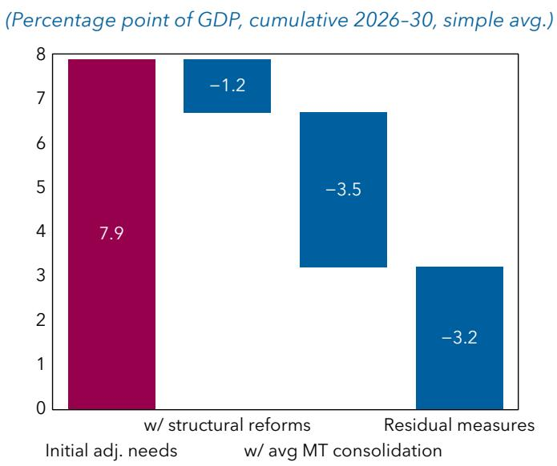  
Source: Authors' calculations.  
Note: Assumes a 90 percent debt anchor and moderate reforms. Constant country sample: top quarter of countries with the largest adjustment needs after moderate reforms (top quartile: >5 percent of GDP). MT consolidation= medium term consolidation.

points of GDP per year for three years (Box 7). In high-debt countries, even after implementing the moderate reform package and undertaking a conventional medium-term fiscal consolidation of 3%-4% of GDP, a residual gap of about 3 percent of GDP would remain on average, shown by the rightmost blue bar. Meeting the challenge will require going beyond conventional consolidation. Deeper adjustments of the role of government will be required to realign spending with resources, as is explored in the remainder of this chapter.

## Box 7. Size of Past Fiscal Consolidations in Europe

Reviewing the scale and duration of Europe's past fiscal consolidations highlights what has been possible, under which circumstances, and over what periods. This history helps set realistic goals for fiscal policy and informs strategies that balance fiscal stability with economic growth.

Fiscal consolidation episodes are defined as periods where the cyclically adjusted primary balance (CAPB) rises by at least 0.1 percentage point of potential GDP annually for two consecutive years, with minor slippages permitted. The study also identifies “sustained” episodes, which satisfy two additional criteria: (1) average yearly CAPB gains of at least 0.5 percent of GDP; and (2) less than 25 percent deterioration of the CAPB in the year after the end of the episode. These definitions are based on David and others (2023), which provides further details.

The analysis examines 40 European countries using data for the period 1980-2024 from the January 2026 IMF World Economic Outlook $^{1}$ . The average consolidation episode lasts for three years, during which the CAPB improves by around 1 percentage point of GDP per year (3 percentage points in total), with European emerging market economies achieving larger consolidations. The median “sustained” adjustment is still three years but with an average cumulative consolidation of slightly more than 4 percent of GDP.

$^{1}$ The sample includes 40 European countries. Albania, Andorra, Moldova, Montenegro, Liechtenstein, and San Marino are excluded because of limited data coverage.

## Perimeter of the State and Social Contract

Closing a gap of this scale will require fiscal adjustments that are not only historically large but sustained, going well beyond the scope of typical and even most large consolidation episodes. Such large adjustments imply difficult choices over taxes and spending priorities. Across countries, such debates invariably run up against an implicit or explicit understanding of the perimeter of the state: The set of spending and tax commitments and social protections that are often treated as politically sacrosanct or "off limits" and can only be approached and reformed at political cost.

Although the terminology differs across countries, the underlying logic is remarkably similar. In some systems, the boundaries of the state are framed as historically earned and quasi-inalienable entitlements, France's acquis sociaux, Italy's diritti acquisiti, and Spain's derechos adquiridos. In others, the boundaries are anchored in legal or constitutional principles, such as Germany's Sozialstaat obligation (in the Basic Law). Elsewhere, especially in Anglo-Saxon systems, the limits are more informal and political than legal: The UK's "red lines" and oft-repeated pledges to protect emblematic programs such as the National Health Service, or the United States "third rail" of Social Security and Medicare. Nordic countries illustrate yet another variant, where fewer programs are explicitly untouchable, but universality, fairness, and procedural trust serve as de facto constraints on adjustment.

Despite differences, the common theme is that every country operates with a perceived boundary to state retrenchment, and fiscal consolidations succeed politically not by ignoring these limits but by working around the social contract. Consolidations that fail to account for these constraints risk social backlash, reform reversal, or loss of credibility, whereas those that succeed typically do so by rethinking the perimeter. Understanding the nature of these “off-limits” commitments, and whether they are historical, legal, or mainly political, is therefore essential for designing feasible and durable fiscal strategies, particularly in environments where adjustment needs are large and sustained.

More generally, Europe is often discussed as embodying a recognizable social and economic model—one that combines extensive public provision of goods and services and redistribution—and it is the long-term sustainability of that model that now comes into focus. There are recurring features across countries, including relatively large governments, comprehensive welfare programs with extensive social protection and redistribution, universal health care, and free or very affordable education. These features have played a critical role in supporting growth, social cohesion, and long-term stability in the post-World War II period. However, for countries with very large adjustment needs, this model will come under increasing pressure. The next section explores how countries have approached such challenges in past very large consolidations and what this implies for designing feasible strategies to deliver adjustment at the required scale.

## B. Identifying and Understanding Very Large Fiscal Consolidations

Considering that conventional fiscal consolidation typically ranges from 3 to 4 percent of GDP and the significant adjustment requirements faced by some highly indebted nations—often between 6 and 8 percent of GDP—it is reasonable to question the feasibility of implementing such substantial fiscal adjustments. This section examines historical precedents for sustained large fiscal consolidations. The first part provides stylized facts based on statistical analysis. The second part assesses factors contributing to success, including the role of complementary institutional reforms and strategies employed by governments to garner public support for these initiatives.

## Stylized Facts

The identification of large and sustained fiscal consolidations expands on Box 7's methodology and extends the sample to include relevant comparator countries for Europe: $^{16}$ (1) A fiscal consolidation is defined as CAPB improvements of at least 0.1 percentage point of potential GDP per year over two years (225 episodes). (2) Within this sample, sustained consolidations involve average annual CAPB gains of at least 0.5 percent of potential GDP with minimal reversal in the following year (89 episodes). (3) The top third of the distribution is defined as large and sustained, which covers 21 episodes with a more than $6 \frac{1}{2}$ percentage point improvement in the CAPB (Figures 13 and 14). This approach accurately detects many well-known cases of major fiscal consolidations noted in past research (Blöchliger, Song, and Sutherland 2012; Balasundharam and others 2023). $^{17}$ The rest of the section describes some characteristics of these episodes.

Cumulative CAPB improvement (pp potential GDP)

Figure 13. Distribution of Consolidation Episodes  
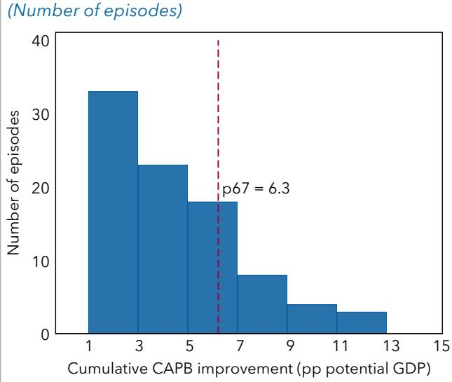  
Sources: WEO; and authors' calculations.

Figure 14. Ranking of "Large and Sustained" Episodes  
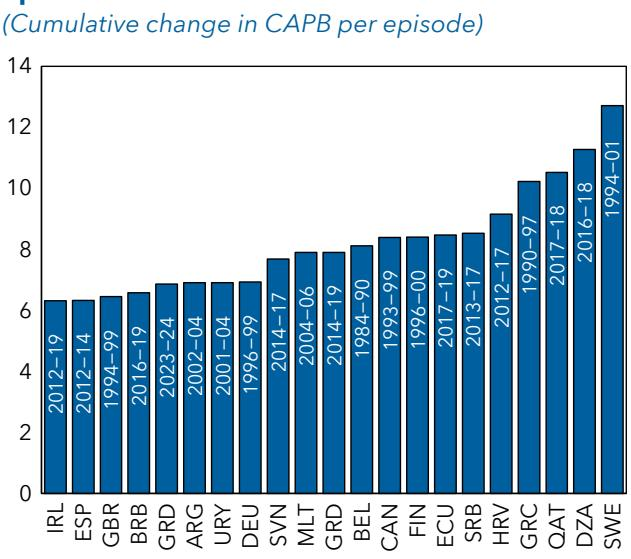  
Note: Data labels in the figure use International Organization for Standardization (ISO) country codes. CAPB = cyclically adjusted primary balance; WEO = World Economic Outlook.

Size and frequency. Large and sustained fiscal consolidations are not common, making up less than 10 percent of total consolidations in the data set (Table 2). Roughly half were in Europe, with the largest being Sweden's post-banking-crisis 12 percentage point improvement in the CAPB ratio between 1994 and 2001. For the entire sample of 21 episodes, the CAPB improved by an average of 8.2 percentage points over a five-year period, almost double the size of a typical sustained adjustment.

Table 2. Characteristics of Consolidation Episodes: High and Upper Middle-Income Countries (1980–2024) $^{1}$

<table><tr><td></td><td>Number of episodes</td><td>Change in CAPB ratio</td><td>Change in primary expenditure-to-potential GDP ratio</td><td>Change in the cyclically adjusted revenue  $ratio^2$ </td><td>Share of expenditure adjusted in CAPB improvement</td><td>Debt-to-GDP ratio (t-1)</td><td>Average real GDP growth</td><td>Duration (years)</td></tr><tr><td>All episodes</td><td>225</td><td>3.3</td><td>-1.7</td><td>1.6</td><td>52%</td><td>56.1</td><td>3.1</td><td>3.1</td></tr><tr><td>Sustained</td><td>89</td><td>4.6</td><td>-2.8</td><td>1.8</td><td>61%</td><td>67.0</td><td>2.6</td><td>3.5</td></tr><tr><td>Large and sustained</td><td>21</td><td>8.2</td><td>-5.4</td><td>2.8</td><td>66%</td><td>66.7</td><td>2.3</td><td>4.8</td></tr><tr><td colspan="9">Sources: WEO and authors&#x27; calculations.Note: Unless otherwise specified, all variables show average cumulative change as a percentage of potential GDP from the start of the episode (t=0), until the last year of the episode. CAPB = cyclically adjusted primary balance. $^1$ The analysis includes 40 European countries (as in Box 7), as well as non-European high- and upper-middle-income countries (per World Bank classification). $^2$ The cyclically adjusted revenue ratio is calculated as the difference between the CAPB ratio (in percent of potential GDP) and the expenditure ratio (in percent of potential GDP).</td></tr></table>

Sources: WEO; and authors' calculations.
Note: WEO = World Economic Outlook.

Macroeconomic conditions. The episodes were almost always preceded by a recession in the three years leading up to the consolidation. $^{18}$ In the first year of consolidation (year t), half of the countries experienced a further slowdown in GDP growth, with a quarter in recession. By year $t + 1$ , however, the share of countries in recession had fallen to 10 percent. Most economies continued to recover over the adjustment period (Figure 15, panel 1). Inflation tended to be higher before the start of the consolidation, before declining and stabilizing during the episode. About three-quarters of the countries experienced low inflation (between -1 and 3 percent) over the course of the consolidation episode (Figure 15, panel 2).

Figure 15. Macroeconomic Indicators in Large and Sustained Fiscal Consolidations  
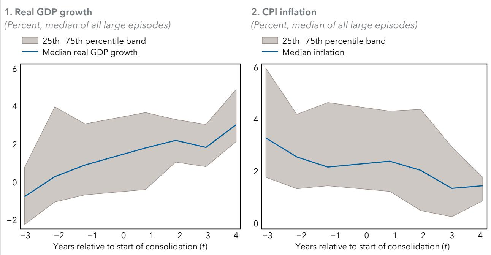

Fiscal conditions. Before the start of the consolidation, the debt-to-GDP ratio was rising rapidly for almost all countries (Figure 16, panel 1). Introduction of consolidation measures reduced the rate of increase, but the debt-to-GDP ratio continued to grow at first, taking a few years to stabilize or decline. In almost all cases, the CAPB worsened sharply in the year before consolidation measures were introduced (Figure 16, panel 2).

Figure 16. Fiscal Indicators in Large and Sustained Fiscal Consolidations  
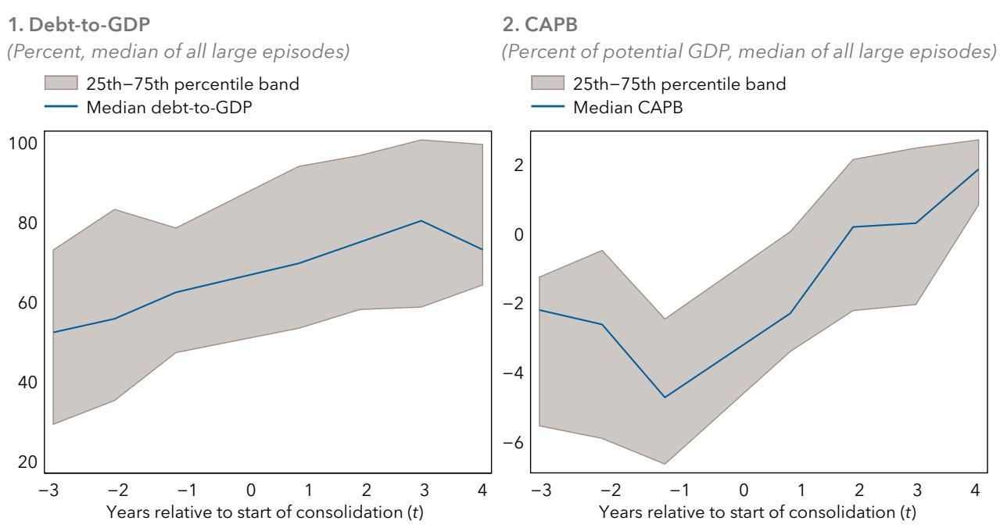  
Sources: WEO; and authors' calculations.  
Note: CAPB = cyclically adjusted primary balance; WEO = World Economic Outlook.

Duration and pace. "Large and sustained" consolidations were both longer on average (by more than a year) than "sustained" consolidations (Figure 17) and tended to be more front-loaded (Figure 18), with a larger share of the total CAPB improvement occurring in the first half of the episode. Despite introducing big changes early in the process, countries were able to sustain sizable consolidation efforts over the entire period.

Figure 17. Duration of Fiscal Consolidations (Density)

Source: Authors' calculations.

Figure 18. Pace of the Episodes

(Number of episodes; share of consolidation that happened in the first half of episode)

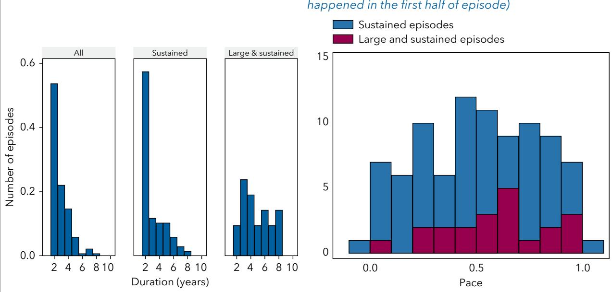  
Note: The histogram is scaled to show density; the area under the distribution equals one.

Composition. On average, expenditure measures accounted for two-thirds of the CAPB improvement (Table 2) during the episodes—on par with all sustained consolidations, and a higher share than for all consolidations (about 50 percent). $^{19}$ Primary expenditure declined by over 5 percent of potential GDP on average, whereas revenue increased by almost 3 percentage points. In almost all cases, governments reduced public wages and capital investment, whereas more than half reduced social transfers. Revenue measures also played a role, with more than half of the countries increasing their value-added tax (VAT) rates and introducing or expanding other smaller taxes (for example, excises and levies). Personal income tax (PIT) measures also appear in a meaningful subset of countries.

Figure 19. Composition of Large and Sustained Fiscal Consolidations  
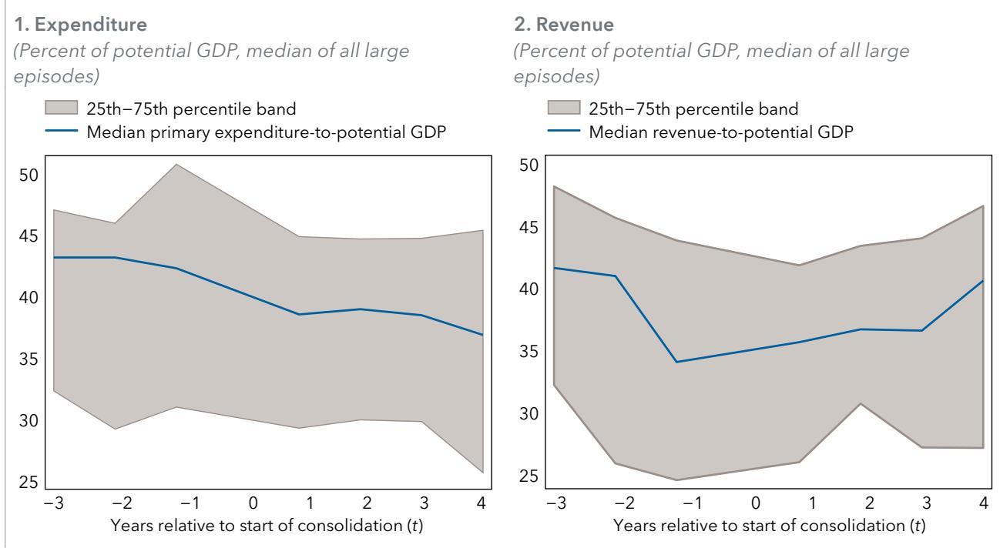  
Sources: WEO; and authors' calculations.  
Note: WEO = World Economic Outlook.

## What Made Large Consolidations Successful?

For the analysis, success is defined as a government's ability to sustain a significant improvement in the fiscal position—typically several percentage points of GDP over multiple years—that is politically durable, not subsequently reversed, and achieved without socially destabilizing levels of economic hardship. The lessons are drawn from the previously identified episodes, expanded with a broader sample of recognized case studies. $^{20}$ A striking feature of these cases is the length of time over which consolidation efforts were maintained, as well as the persistence of political support for the reforms—contrasting with other, more short-lived adjustment attempts (see Okwuokei 2014). The remainder of this section explores the key factors that help explain this durability. $^{21}$

## Initial Conditions

In general, large and sustained consolidations were triggered by a forcing event or externally imposed political constraints. Consolidations were typically introduced in crisis or near-crisis situations triggered by a combination of rising deficits and debt (for example, Canada 1993-99), banking crises (for example, Ireland 2012-19 and Slovenia 2014-17), currency crises (for example, Sweden 1994-2001), or from other external pressures (for example, Malta's EU convergence criteria, 2004-06). New governments (or existing governments with fresh mandates) introduced multiyear adjustment plans with clear targets, launched when the status quo was untenable (Kumar, Leigh, and Plekhanov 2007). External oversight and incentives also played a role in maintaining broad political backing. Progress toward widely accepted goals—like meeting EU requirements—helped to sustain support, whereas other countries (for example, Barbados, 2016-19) were on an IMF program.

Favorable macroeconomic conditions, including economic recovery, often played an important role in sustaining adjustment efforts. In Canada, Sweden, and Finland, consolidation coincided with economic recoveries supported by credibility gains, accommodative monetary policy, exchange rate depreciation, and strong external demand (Alesina and Ardagna 1998; Tsibouris and others 2006; Blöchliger, Song, and Sutherland 2012; Abbas and others 2013). These recoveries helped to defuse political concerns around difficult reforms while supporting the narrowing of the deficit. Inflation did not play a significant role in boosting revenues or eroding debt burdens; instead, consolidation relied on primary surpluses, real growth, and declining interest rates (see, for example, Perotti 2011). In countries where fiscal measures triggered or coincided with a severe economic downturn, political resistance intensified, and consolidation efforts were more likely to stall or reverse (for example, Japan 1997–99).

## Design

Beyond short-term controls, successful consolidations implemented lasting expenditure reforms that affected the size of government and redefined the role of the state. Although early efforts focused on quick actions—wage restraint, reduced capital spending, subsidy rationalization—long-term success required governments to pursue broader reforms, such as reevaluating public services and entitlement systems (for example, pensions). Consolidation often shifted the social contract toward targeted support, stricter eligibility, and stronger work incentives (Tsibouris and others 2006). Examples include Ireland's post-2009 pay and welfare reductions, Finland's 1990s cuts to transfers and benefits, and subsidy reforms aimed at limiting aid to high-income groups (Blöchliger, Song, and Sutherland 2012). Several countries introduced higher user fees for public services, and privatized or restructured SOEs and expanded use of public-private partnerships (PPPs).

Tax increases played a secondary but important role (Gupta and others 2003). For example, the composition of Sweden's consolidation was roughly three-quarters of expenditure reductions, and a quarter from new revenue measures (for example, broadening the VAT base, increases in PIT, and higher specific excises). Similarly, Finland's 1990s adjustment achieved about 85 percent of its deficit improvement through reductions to the public wage bill, social benefits, and capital spending. At the same time, revenue measures like higher VAT or income taxes provided a smaller but important contribution. Italy's 1990s fiscal plan, for instance, boosted revenues by raising VAT rates and introducing a one-off income surtax while tightening spending to meet EU budget targets.

Fairness considerations played an important role in sustaining political support and ensuring stability. Governments frequently emphasized burden sharing, with senior officials and public employees subject to wage freezes or cuts, as in Canada (1993–99), Ireland (2012–19), $^{22}$ and Finland (Tsibouris and others 2006). Some countries combined consolidation with explicitly pro-poor fiscal policies, protecting or expanding targeted social spending (Balasundharam and others 2023). Others relied on gradual implementation of complex reforms to enhance perceived fairness. Sweden's pension reform phased in benefit reductions and raised retirement ages over time, whereas Italy adopted incremental pension changes that preserved accrued rights (OECD 2012).

## Supporting Measures

Consolidation efforts were often supported by complementary public financial management reforms. A defining common element was the strengthening of fiscal institutions, including the adoption of multi-year expenditure ceilings, medium-term budgetary frameworks, fiscal rules (sometimes constitutional), independent fiscal councils, and tighter subnational controls, often aligned with EU fiscal governance frameworks. In Sweden, Finland, and Canada, strengthened budget frameworks, expenditure controls, and medium-term planning helped sustain politically difficult adjustments (Tsibouris and others 2006). Independent voices—such as external experts and international institutions—also reinforced credibility by validating the need for reform and bolstering market confidence. $^{23}$

Persuasive communication gave credibility to difficult reforms. Governments crafted narratives centered on national survival, fairness, future prosperity, and the avoidance of crisis (for example, Ireland, 1987–89). Consolidation was frequently framed as restoring domestic economic autonomy and credibility (for example, Ireland, 1987–89), or as necessary to meet externally imposed targets (for example, Greece's convergence criteria for euro adoption). Messaging relied on clear, simple language and emphasized the urgency of reform. Governments actively involved key stakeholders—such as trade unions, businesses, and civil society—to ensure consistent communication across political, civic, and technical channels. After implementation began, public support was sustained by meeting announced targets and by repeatedly and transparently communicating these achievements.

## C. Rethinking the Role of Government amid Rising Spending Pressures

Drawing on past experience, this section sets out a forward-looking road map for Europe. It focuses both on the what—the types of policy measures that may be required as fiscal pressures intensify—and the how: the conditions under which such measures can be implemented and communicated in a socially and politically sustainable way.

## Public and Private Financing Split

Beyond questions of affordability, debates about the perimeter of the state are ultimately about how spending pressures are financed, rather than whether they should be curtailed. As discussed in Annex 4, public and private financing represent alternative ways of allocating costs, risks, and incentives, with distinct implications for efficiency, equity, and political feasibility. In many areas—such as health, education, pensions, and infrastructure—financing arrangements span a continuum between fully public and fully private models, with numerous hybrid forms in between. Reconsidering the scope of public services therefore does not necessarily imply a retreat of the state from service provision, but may involve reassessing the balance between tax-financed provision and greater cost-sharing, cofinancing, or complementary private schemes. This perspective helps reframe perimeter debates away from blunt notions of retrenchment toward a more granular discussion of financing design and burden sharing under rising fiscal pressures. A key caveat is that the scope for shifting financing to the private sector is not uniform across spending categories. For items with public good characteristics or strong externalities, private financing may be insufficient—even with well-designed incentives—so a predominantly public financing role may remain necessary.

The simulations presented in this paper show that many European countries will have no choice but to reassess the balance between public and private finance to keep public debt on a sustainable path. Indeed, even with strong reforms and fiscal discipline, high-debt countries may struggle to keep debt under control unless some of the cost of the new spending pressures is borne directly by households and businesses.

In many European countries, the public sector is currently playing a larger financing role in certain sectors, such as health care, education, pensions, and infrastructure, than is common in other OECD countries (Figure 20). Some large European AEs (for example, France, Germany) and the Nordic countries tend to have higher public financing shares for health and education than the OECD average. The public sector also plays a markedly large role in AE's pension systems (Italy, Portugal, and Spain).

The savings created by rebalancing the public-private split are potentially significant, as illustrated by a simple exercise: For countries with public financing shares above the OECD average in one or

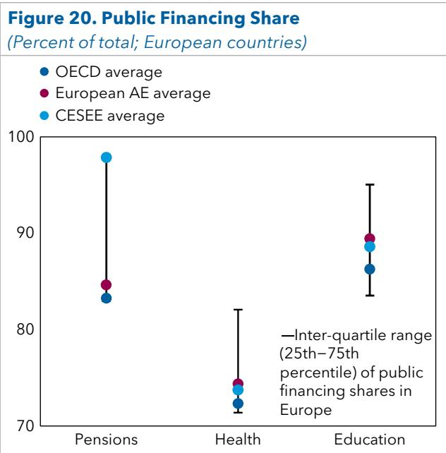  
Sources: OECD; UNESCO; WHO; World Bank; and authors' calculations.  
Note: AE = advanced economy; CESEE = central, eastern, and south-eastern Europe; OECD = Organisation for Economic Co-operation and Development; UNESCO = United Nations Educational, Scientific and Cultural Organization; WHO = World Health Organization.

more of health, education, pensions, infrastructure, and climate, aligning with the OECD average could generate fiscal savings of close to 3 percent of GDP per year for the average European country. This could help bridge the gap between the large adjustment needs of high-debt countries and the contributions of a typical fiscal consolidation and a moderate package of reforms.

## Options for Deep Tax and Spending Reforms

Incremental adjustments may not be sufficient to address structurally rising spending needs in some European countries. Deeper reforms, including explicit changes to what the state provides, how benefits are targeted, and how services are financed, have increasingly featured in policy discussions between the IMF and country authorities. These reforms, discussed in recent IMF country reports over the past five years, could play an important role in restoring fiscal sustainability while preserving space for priority spending. Although these reforms are most relevant for countries with high adjustment needs, they can also be viable options for countries with more modest ones.

On the expenditure side, some countries may have room for significant retrenchment or restructuring of public provision. Public wage bills have been identified as a potential area for adjustment in countries such as Austria and Croatia. In Moldova, Serbia, and Ukraine, loss-making SOEs are identified as a persistent drain on public resources and a source of fiscal risks, strengthening the case for privatization, restructuring, or closure. In Belgium, France, and Norway, there is scope to improve targeting and efficiency of social spending, notably by adjusting social benefits to better align support with need and strengthen work incentives. Substantial scope for cutting broad-based energy subsidies has been highlighted in Germany, the Slovak Republic, and Türkiye, where such subsidies have been costly, poorly targeted, and distortionary. In several countries, shifting part of the cost of publicly provided services to higher-income users—through higher charges or co-payments—has been discussed to contain spending growth while protecting access for vulnerable groups, notably in health care in the United Kingdom and the Netherlands, and noncritical social security services in France.

A useful approach to achieve spending reprioritization is to differentiate between basic and premium services across sectors such as health, education, pensions, and social protection. The package of basic services could remain publicly funded and free at the point of use; premium services would be financed privately by individuals, especially those with higher incomes. In this context, systematic expenditure reviews can guide country-specific strategies by examining the government's role and the cost-effectiveness of policy interventions, thereby supporting long-term state reform (Doherty and Sayegh 2022).

In some cases, tax measures may lead to a notable shift in the “socially agreed” scope of the state. In the Baltic countries, for example, tensions have emerged between maintaining a competitive, low-tax environment and moving toward a broader provision of public services and a stronger social safety net. Options to support revenue mobilization should be explored to support rising spending needs. IMF reports have also recommended moving away from flat PIT rates and introducing a higher marginal rate for high earners in Bulgaria, Hungary, Romania, and Poland, and a higher corporate income tax rate in Bulgaria.

## Minimizing the Risks to Growth and Equity

Well-designed state reforms can support long-term growth and raise living standards by strengthening efficiency, macroeconomic stability, and policy credibility (IMF 2016). Such reforms reduce policy uncertainty by enhancing the quality and sustainability of public finances—an important prerequisite for private investment and durable growth. Keeping debt under control is critical to contain the interest bill, creating more space for public spending on human capital and infrastructure. In selected areas, greater private participation can also improve the allocation of resources, efficiency, service quality, and innovation, for example, by drawing on private sector expertise in pension management or infrastructure provision while allowing public resources to be redirected toward core priorities.

Nonetheless, despite these long-term gains, changes in the perimeter of the state create short-term risks to growth and social cohesion, particularly when the adjustment is rapid and front-loaded, poorly targeted, or relies heavily on blunt expenditure cuts. Empirical evidence suggests that fiscal consolidation can weigh on activity in the short term, especially in weak cyclical conditions, whereas poorly designed measures may exacerbate inequality by disproportionately affecting lower-income households. Past experiences with privatization also highlight some risks. Poorly sequenced or weakly regulated privatizations have, in some cases, led to adverse distributional outcomes, reduced access to essential services, or the emergence of private monopolies.

These experiences underscore that changes to the government's role are not a fiscal shortcut: To support growth and equity, shifts should be embedded in a broad reform strategy, accompanied by strong institutions and safeguards to ensure continued access and affordability for vulnerable groups. This approach can help overcome opposition to the policy packages required, increasing the likelihood that they are durable and successful.

\- Risks to growth. Large fiscal adjustments are less likely to hurt growth when they rely on measures that enhance efficiency rather than blunt expenditure cuts, protect high-quality public investment, and are implemented at a pace that avoids exacerbating cyclical weakness. Reforms that improve spending quality—such as rationalization of poorly designed subsidies, and strengthened public investment management—can generate durable fiscal savings while supporting potential growth. The experience from IMF-supported programs suggests several ways to help make fiscal consolidation more growth-friendly (Box 8).

\- Risks to equity. Adjustments to the role of the public sector inevitably affect access to services, income distribution, and social cohesion. Thus, it should be implemented in a manner that is fair and takes account of distributional consequences. For instance, means-testing some benefits and introducing user charges for those on higher incomes could reallocate some costs to the private sector while ensuring that lower-income households continue to access services free at the point of use or are, at least, protected from large out-of-pocket expenses. Lower public wage growth can be equitable in countries where there is a substantial public sector wage premium (see, for example, Abdallah, Coady, and Jirasavetakul 2023). Linking pension parameters to life expectancy helps safeguard system sustainability and strengthens intergenerational equity by sharing adjustment burdens more evenly (Arbatli and others 2016). On the revenue side, deep tax reforms can be designed in a progressive way to make the tax system fairer for all.

Together, these principles point to an approach in which fiscal sustainability, growth, and equity are treated as complementary objectives rather than trade-offs, provided that large adjustments are embedded in a coherent, well-sequenced policy strategy. In fact, deeper reforms can provide an opportunity to rethink fiscal systems more holistically, rather than relying on piecemeal consolidation measures. This is particularly relevant for tax policy, where incremental rate increases or ad hoc measures often prove distortionary and politically fragile. The IMF's work on medium-term revenue strategies highlights the benefits of comprehensive, sequenced reform plans that align revenue mobilization with broader objectives such as growth, equity, and administrative capacity (Gaspar 2019). By anchoring tax reform in a medium-term framework-covering base broadening, simplification, improved compliance, and a more progressive tax mix-countries can raise revenues in a more durable, efficient, and socially acceptable way while reducing uncertainty and supporting investment and growth.

A similarly holistic approach can be beneficial on the spending side. Rather than across-the-board cuts, systematic spending reviews can help governments reassess priorities, identify inefficient or low-value expenditures, and reallocate resources toward high-impact public services (Doherty and Sayegh 2022). IMF experience shows that well-designed spending reviews can support fiscal adjustment while protecting growth-enhancing investment and essential social spending, and by making trade-offs explicit, they can also strengthen transparency and public buy-in. Taken together, medium-term tax strategies and spending reviews provide a coherent framework for large fiscal adjustments—one that supports sustainability while improving the efficiency, fairness, and credibility of fiscal policy.

## Box 8. Lessons from IMF Programs on Growth-Friendly Fiscal Consolidation

Experience from IMF-supported programs and cross-country evidence points to several principles that can help limit the short-term costs of fiscal consolidation while supporting medium-term growth:

\- Choose the timing of consolidation to minimize short-term growth costs whenever fiscal policy space allows. Where possible, fiscal consolidation is less damaging to growth when it occurs under favorable cyclical conditions or when external demand can help offset weaker domestic demand. Consolidations undertaken during recoveries, or when exchange rate flexibility and external conditions support exports, tend to be associated with smaller short-term output losses and better growth outcomes than consolidations undertaken in downturns or under tight macroeconomic constraints.

\- Favor a more gradual pace of adjustment where feasible. Gradual consolidations—spreading adjustment over time and avoiding very large annual fiscal tightening—are generally associated with lower short-term output costs and more durable debt stabilization, particularly when financing constraints are limited. Gradual adjustment allows time to implement higher-quality fiscal measures and supporting reforms. However, IMF experience also shows that front-loaded consolidation may be unavoidable in countries facing acute financing pressures, high-risk premiums, or credibility concerns, where restoring confidence and macroeconomic stability is a prerequisite for growth.

\- Anchor consolidation in high-quality fiscal measures that deliver durable adjustment with limited distortions. The composition and quality of measures matter as much as the size of adjustment. High-quality fiscal measures are those that deliver durable deficit reduction while improving efficiency and equity. On the revenue side, broadening tax bases, reducing exemptions, and strengthening tax administration tend to raise revenues with fewer distortions than increases in statutory rates. On the expenditure side, improving spending efficiency and targeting is critical. IMF evidence does not point to a single optimal mix of revenue versus expenditure measures; the appropriate composition depends on country-specific conditions, institutional capacity, and distributional objectives.

\- Preserve and reorient public spending toward activities that support long-term growth. Safeguarding productive public investment and priority social spending during consolidation is central to preserving medium-term growth. IMF experience indicates that consolidations that protect—or reorient spending toward—infrastructure, education, and health tend to be associated with better post-program growth outcomes, especially when supported by strong public financial management and project selection. Conversely, sharp cuts to public investment can undermine growth potential and weaken the durability of consolidation.

\- Support consolidation with institutions and complementary policies. Strong fiscal institutions and credible medium-term fiscal frameworks increase the likelihood that consolidation is sustained and growth-friendly. Weak implementation capacity or low institutional quality can significantly reduce the growth benefits of consolidation. IMF-supported programs also highlight the importance of complementary policies—such as accommodative monetary policy where warranted under the monetary policy framework, exchange rate flexibility, and structural reforms—to mitigate short-term costs and strengthen confidence.

Sources: IMF 2016; IEO 2021; Balasundharam and others 2023.

## Making Deep State Reforms Socially Acceptable and Sustained

Deep reforms that alter the scope, financing, or delivery of public services are among the most politically sensitive policy actions governments can undertake. In Europe, where social contracts are deeply embedded and trust in institutions varies widely across countries, the success of such reforms would depend at least as much on how they are implemented as on what they entail. Past experience suggests that very large fiscal consolidations are achievable, but reforms are more likely to be accepted and sustained when governments adopt a deliberate implementation strategy building on the following policy actions.

A first priority is to anchor reforms in a credible medium-term narrative centered on preservation and sustainability rather than retrenchment. Successful adjustments are usually presented as necessary to safeguard the system's sustainability and fairness. Governments need to clearly articulate how today's reforms are necessary to preserve valued public services and core social commitments, maintain intergenerational fairness, and avoid more disruptive adjustment in the future. Explicitly communicating the costs of inaction—including the risk of declining service quality, loss of policy autonomy, or forced adjustment under market pressure (Eble and others 2025)—helps reframe reforms as preventive rather than punitive. Using long-term projections on debt, aging, and spending pressures produced by independent or semi-independent institutions can further depoliticize the diagnosis and strengthen public trust by grounding reform efforts in objective constraints rather than discretionary choices.

Effective consultation is indispensable throughout the reform process. Early and meaningful engagement with social partners, subnational governments, and civil society is especially important in countries with strong traditions of social dialogue. Transparency during implementation—through regular progress reports, monitoring indicators, and ex post evaluations—helps reinforce trust that reforms are delivering their intended outcomes and that adjustment efforts are being shared fairly.

The sequencing of reforms also plays a critical role in shaping public acceptance and credibility. Successful strategies typically combine early, visible actions that signal commitment—such as governance improvements or efficiency-enhancing measures—with more gradual implementation of reforms that affect entitlements or access to services. Phasing reforms in over time, particularly when they have significant distributional effects, allows households and firms to adjust and reduces social resistance. At the same time, excessive backloading can undermine credibility and increase the risk of reform reversal; durable reforms generally require an upfront signal of resolve alongside a clearly communicated transition path.

Ensuring that reforms are perceived as fair is essential for their political sustainability. Implementation plans should explicitly protect vulnerable groups (Eble and others 2025), for example, through targeted compensation, exemptions, or strengthened safety nets. Emphasizing burden sharing across income groups and generations—by safeguarding minimum benefits while adjusting parameters for higher-income households or future beneficiaries—can help sustain social cohesion. Accompanying reforms with transparent distributional analysis and clearly communicating how equity concerns are addressed is particularly important in countries with high inequality or low trust in public institutions.

Governments can further reduce political resistance by making the strategic use of grandfathering and differentiation. Applying reforms primarily to new beneficiaries, future cohorts, or newly introduced services—while preserving accrued rights where feasible—can lower immediate opposition and ease implementation. Differentiating between basic services that remain universally accessible and premium services that allow greater cost-sharing or private participation can also help preserve the core of the social model while containing fiscal pressures. Where possible, parametric adjustments—such as changes to eligibility, indexation, or co-payments—tend to be more acceptable than abrupt nominal cuts or outright service withdrawal.

Strong institutions are critical to locking in reforms over time and preventing policy reversals. Embedding reforms in medium-term fiscal frameworks, multiyear budget plans, or expenditure ceilings can help anchor annual policy decisions in longer-term objectives. Independent oversight bodies, including fiscal councils and audit institutions, play an important role in monitoring implementation, assessing compliance, and maintaining public confidence in the reform process. In decentralized systems, close coordination across levels of government is essential to ensure consistency in implementation.

Finally, further aligning national reforms with European frameworks and incentives could enhance their legitimacy and feasibility. As discussed earlier, large fiscal adjustments have at times been facilitated by external anchors, including the prospect of EU accession. Framing reforms within EU-level commitments—such as fiscal frameworks or common investment priorities—can provide external validation for difficult measures. EU disbursements and grants can also be used to strengthen incentives for fiscal reforms. For instance, under the EU’s Recovery and Resilience Facility, Spain undertook parametric pension reforms in 2021 to access disbursements.

Taken together, these implementation practices can help governments navigate the political economy constraints surrounding deep state reforms. By anchoring reforms in credible frameworks, protecting fairness, sequencing carefully, strengthening institutions, and investing in transparent communication, European countries can increase the likelihood that necessary adjustments are not only adopted but also sustained over time—preserving both fiscal sustainability and social cohesion.

## 6. Conclusion

Europe's fiscal challenge is not the result of a single shock or policy mistake. Rather, it reflects the cumulative interaction of long-term forces that are unlikely to reverse: rising age-related spending, new defense and climate investment needs, higher interest costs, and already elevated public debt levels in many countries. These pressures are unfolding in a context of modest growth and limited appetite for higher taxation or large-scale spending retrenchment. Addressing them, therefore, requires moving beyond short-term fixes or ad hoc adjustments toward a more deliberate, forward-looking strategy—one that combines reforms, fiscal consolidation, and, where necessary, deeper choices about the scope and financing of public services. With the cost of delay rising, the benefits of a strategic approach are increasingly clear.

Europe is entering a period in which fiscal choices will become increasingly constrained, contested, and consequential. Rising spending pressures from aging, climate transition, defense, and interest costs are colliding with already elevated debt levels and limited political appetite for higher taxation or large-scale retrenchment. Left unaddressed, these forces would place public debt on an unsustainable trajectory and gradually erode the quality and credibility of public services. The analysis in this paper suggests that continuing to respond to these challenges in a piecemeal or reactive manner—the “muddling through” approach that many countries have adopted so far—is reaching its limits.

## A. Moving beyond "Muddling Through"

The paper's simulations illustrate that, if long-term spending pressures are left unaddressed, debt dynamics could be placed on an explosive path in many European countries. The implication is not that incremental measures are irrelevant, but that tinkering at the margin is likely to be insufficient given the scale of the necessary adjustment while potentially causing reform fatigue.

A piecemeal approach based on ad hoc fixes and short-term political compromises may delay difficult decisions, but it also risks compounding fiscal vulnerabilities over time. As spending pressures accumulate, postponing action tends to narrow future policy options, increase adjustment costs, and heighten the risk of disorderly correction driven by market pressure.

Moreover, muddling through can produce undesirable distributional outcomes, as fiscal space is increasingly absorbed by age-related spending and interest costs, crowding out resources for growth-enhancing investment and services that benefit younger generations. Spending could become increasingly skewed toward particular groups—notably the elderly people—at the expense of others, and services could deteriorate under mounting budget pressures.

## B. Toward a More Strategic Policy Response

There is no silver bullet for Europe's fiscal challenge. A multipronged strategy that combines structural reforms and fiscal policy is essential in most European countries. Although individual measures—such as mobilizing private finance or joint EU financing—are sometimes presented as game changers, no single instrument can close the financing gap on its own.

Structural reforms and fiscal consolidation are therefore complements, not substitutes: Both are typically required, and both involve politically difficult choices. The greater the progress on reforms, the less onerous the task of fiscal consolidation is likely to be, but relying on reforms alone would leave fiscal sustainability risks unaddressed. Reforms take time to pay off and, in most countries, cannot substitute for fiscal adjustment in the near term. Medium-term fiscal consolidation therefore remains unavoidable for a large share of European countries, even under reasonably ambitious reform assumptions.

The analysis also points toward the growing importance of a broader reassessment of the role of government in some countries. Even with reforms and fiscal discipline, a subset of high-debt countries is likely to face residual financing gaps. Addressing these gaps may require deeper reprioritization decisions, including reconsideration of how certain services are financed and the appropriate balance between public and private contributions. This will leave little choice but to adapt socioeconomic models. Spending reviews can be instrumental to identify space for new policy priorities.

## C. Making the Strategy Politically Feasible

Adopting a more strategic approach does not imply ignoring political economy constraints—on the contrary, it requires confronting them explicitly. The experience reviewed in this paper highlights that large and sustained policy adjustments are more likely to succeed when they are anchored in credible medium-term frameworks, perceived as fair, and supported by strong institutions. Transparent communication, careful sequencing, and protection of vulnerable groups are not ancillary considerations; they are central to implementation.

It will be important to initiate a public discussion about the scale of the problem, the damaging consequences of inaction, and the composition of the proposed policy package, to illustrate how the tough decisions ahead will pay off and put public finances on a more sustainable footing, with lasting economic and social benefits for the population. To better inform the public, credible long-term fiscal forecasts and strategic plans should be produced and published regularly.

At the European level, common frameworks and incentives can play a supportive role. EU fiscal governance, recovery instruments, and common investment priorities can help anchor national strategies and smooth adjustment costs. At the same time, national ownership remains critical: Durable fiscal strategies ultimately depend on domestic consensus around the sustainability of the social contract and the trade-offs it entails.

## Annex 1: Conceptual Boundaries among the Three Pillars of the Policy Package

We recognize that there may be some overlap among the pillars of the policy package considered to meet the fiscal challenge, and a degree of judgment. A few examples illustrate our approach:

Structural reforms, fiscal consolidation, and changes to the role of government are conceptually distinct pillars, but in practice, the boundaries between them can be fluid. Starting with the first two, structural reforms are often distinguished from macroeconomic policy in the literature. Although macroeconomic policy primarily influences the demand side of the economy, structural reforms target the supply side by altering the institutional and regulatory frameworks within which businesses and individuals operate. It is clear that nonfiscal-structural reforms, like product market reforms, differ from fiscal policy. However, the distinction between fiscal-structural reforms and fiscal consolidation is more subtle. Fiscal consolidation refers to medium-term measures aimed at reducing the fiscal deficit and debt accumulation, whereas fiscal-structural reforms involve deeper changes to the underlying fiscal framework or institutions to improve the efficiency, sustainability, and effectiveness of public finances over the long term (for example, changes in the budget process and tax administration, restructuring of the pension system and social safety nets, and so on).

The differentiation between pillars 2 and 3 is even less clear cut. In our framework, the concept of “fiscal consolidation” has a medium-term horizon and entails policy measures that remain within the socially agreed scope of revenue and expenditure. By comparison, “changes to the role of government” entail more fundamental measures that (1) involve a shift in the social contract by changing substantially the agreed perimeter of government activities and services, (2) are more sizable, and (3) have a longer-term horizon for implementation (possibly beyond five years).

In some cases, the distinction between these pillars depends more on the underlying policy motivation than on the specific measures employed. For instance, a public employment and compensation reform could be classified as either pillar 1, 2, or 3 based on its motivation—be it efficiency, flexibility, and competitiveness considerations under pillar 1, fiscal savings under pillar 2, or a desire to reduce the government's role in the economy under pillar 3—even if the reforms appear similar.

\- Catalyzing the private sector. Although catalyzing the private sector (pillar 1) versus reducing the perimeter of the state (pillar 3) could be seen as mirror strategies, their motivations are clearly different. For instance, policy banks primarily focus on mobilizing private finance for projects without the primary intention of reducing the government's footprint in the economy or addressing affordability/sustainability problems. Similarly, industrial policy interventions aim at tackling important economic and social challenges that private markets cannot address on their own, but the main objective of industrial policy is not to downsize the public sector. Conversely, radical state reforms (for example, privatization) that reduce the state's role may create a vacuum and do not necessarily try to incentivize the private sector to fill this gap. A differentiating factor between these two pillars is the role of "additionality." For instance, public-private partnerships, which entail joint ventures between public and private sectors (pillar 3), are not primarily meant to catalyze private finance; in fact, the additionality criterion is not a requirement for PPPs, whereas it is for policy bank projects classified under pillar 1.

\- Entitlement reforms. As a general rule, reforms of entitlement programs would be classified under pillar 1, except if they shift, on purpose, some of the financing to the private sector. For instance, raising the retirement age is categorized under pillar 1, whereas establishing a privately funded pension system to complement a reduction in public (pay-as-you-go) pensions would fall under pillar 3. Enhancing the cost-effectiveness of medical treatments and implementing IT reforms would be viewed as fiscal-structural reforms (pillar 1), whereas promoting out-of-pocket financing for certain health care services could be classified as pillar 3. Nonetheless, benefit cuts present a gray area: If benefits are reduced to achieve fiscal sustainability—such as linking pension benefits to contributions to maintain actuarial balance—or as a way to enhance efficiency (for example, means-testing to improve the targeting of social welfare payments to the needy), this would align with our definition of the first pillar; but, if benefits are cut or eligibility is tightened because of governmental affordability problems, it would be considered as a change in the perimeter of the state (third pillar). This conceptual distinction is challenging to operationalize, as the criteria for sustainability, affordability, and efficiency often overlap. For instance, means-testing benefits occupies this gray zone.

# Annex 2: Anchors Used in European Fiscal Rule Frameworks

This annex reviews country experiences with debt rules, which constitute an important anchor for fiscal policy. The analysis is based on the 37 European countries with fiscal rules recorded in the IMF fiscal rules data set (Alonso and others 2025). Debt rules, both supranational and national, are widespread in Europe but not universal (Annex Figure 2.1). In the database, 27 countries are EU member states and therefore subject to the EU supranational fiscal rule framework, which requires public debt to be placed on a downward trajectory in the long term. Among the 27 EU member states, more than half (16) also maintain a national-level debt rule, whereas the remaining countries rely on national rules defined in other terms, such as budget balance or expenditure. Among the 10 non-EU countries, about half (6) have national-level debt rules. Overall, close to two-thirds of the countries (22 of 37) operate a national-level

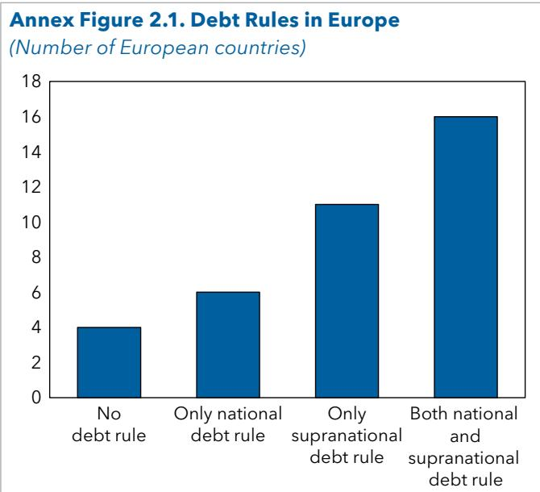  
Sources: Alonso and others, 2025; and IMF Fiscal Rules database. Note: IMF = International Monetary Fund.

debt rule. The design of debt rules varies significantly across countries.

Numerical debt thresholds. Most countries with a national-level debt rule (18 out of 22) define the anchor around a fixed numerical debt ceiling, typically at or close to 60 percent of GDP (Austria, Bulgaria, Czech Republic, Latvia, Poland, Romania, and Slovakia). Several frameworks establish early warning thresholds to create a buffer before the hard limit is reached. Poland and the Czech Republic require corrective action at 55 percent of GDP. The Slovak Republic operates a tiered system of escalating obligations as debt approaches 50 percent. Hungary requires public debt to be reduced until it falls below 50 percent of GDP.

In practice, these debt rules function primarily as legal backstops against sustained fiscal slippage, whereas day-to-day fiscal policy is guided by complementary expenditure or balance rules. The extent of legal backing for the rules varies across countries. Poland's 60 percent debt ceiling is embedded in the constitution, with a minimum annual adjustment of 0.5 percent of GDP when debt exceeds the ceiling (or deficit exceeds 3 percent of GDP) unless the economy is in recession or the European Council recommends a smaller adjustment. Sweden, at the other end of the spectrum, specifies a debt anchor at 35 percent of GDP for Maastricht debt, as a reference point for medium-term strategy and public accountability, rather than as a binding anchor that triggers automatic correction.

Debt trajectory rules. Under the reformed EU fiscal framework, the Treaty-based 60 percent reference value for the debt ratio remains a benchmark for identifying elevated risks and the need for adjustment. The framework, however, is anchored around a debt sustainability assessment rather than mechanical convergence to a fixed numerical target. At the start of the planning period (currently 2025-28), member states submit medium-term fiscal-structural plans committing to a net primary expenditure path that places debt on a downward trajectory (or keeps debt at prudent levels), assessed over a 10-year horizon, after an adjustment period of four to seven years. Compliance is then monitored annually based on the single indicator, net primary expenditure growth. For countries with debt above 60 percent of GDP, the requirements are more demanding: Additional safeguards require a minimum annual debt reduction of 0.5-1 percentage point of GDP. Some countries have anchored their national-level debt rule to the EU framework by requiring compliance with it or by transposing it into domestic law.

Debt trajectory rules are rare at the national level. The United Kingdom operates a forward-looking, trajectory-based national net debt rule. It requires net public sector financial liabilities, in percent of GDP, to be falling in the final year of the forecast horizon relative to the previous year. Compliance is assessed based on forecasts; if forecasts show a breach, the government must adjust policy, though there is no automatic adjustment mechanism. In Finland, the government has set a goal of stabilizing the general government debt ratio and, over the long term, placing it on a downward path toward the levels observed in other Nordic countries.

Other anchors. Where a national-level debt rule is absent, debt stabilization often operates as an implicit background objective—pursued indirectly through constraints on, for example, the structural balance as in Switzerland and Germany. Norway represents a more fundamental departure: Fiscal policy is anchored not to debt but to net financial wealth (to preserve national oil wealth over time): The structural nonoil budget deficit is limited to the expected long-term real return on the sovereign wealth fund's assets.

## Annex 3: Fiscal Adjustment Formulas

This annex provides technical information about how the long-term debt simulations in this paper are carried out, including how the effect of reforms is incorporated, and how the required amount of consolidation to keep debt sustainable is computed.

## Formula for the Evolution of the Debt Ratio

The methodology is based on the standard debt accumulation equation of the public sector:

$$
D _ {t} = (1 + \lambda_ {t}) D _ {t - 1} - P B _ {t} + S F A _ {t ^ {\prime}}\tag{1}
$$

where $D_{t}$ is the debt-to-GDP ratio at the end of period t; $\lambda_{t}$ is the interest-growth differential, defined as $1 + \lambda_{t} = \frac{1 + r_{t}}{1 + g_{t}}$ , where $r_{t}$ is the nominal interest rate on public debt and $g_{t}$ is the nominal growth rate of GDP; $PB_{t}$ is the ratio of the primary balance to GDP; and $SFA_{t}$ are any debt stock-flow adjustments (as a share of GDP), which encompass changes in public debt not reflected in the primary balance, including net acquisition of financial assets, valuation and other debt adjustment effects, and statistical discrepancies. $^{24}$

Repeated substitution of $D_{t}$ in equation (1) yields the following equation:

$$
D _ {T} = \alpha_ {0; T} D _ {0} - \sum_ {i = 1} ^ {T} \alpha_ {i; T} P B _ {i} + \sum_ {i = 1} ^ {T} \alpha_ {i; T} S F A _ {i},\tag{2}
$$

where $\alpha_{s;v}=(1+\lambda_{s+1})(1+\lambda_{s+s})\ldots(1+\lambda_{v})$ , with $\alpha_{i,j}=1$ . This equation calculates the debt-to-GDP ratio at time T as the accumulation of primary surpluses and stock-flow adjustments occurring between time t=0 and T. In this paper, t=0 corresponds to 2025 and time T corresponds to 2040.

In the context of the paper, it is useful to further decompose the primary balance as:

$$
P B _ {t} = \widehat {S P B} - \Delta A _ {t} + C C _ {t} + O _ {t} + c _ {t ^ {\prime}}\tag{3}
$$

where $\widehat{SPB}$ is a reference structural primary balance as a share of GDP net of spending pressures, cyclical components, and one-offs; $\Delta A_{t}$ is the increase in spending demands, as a share of GDP, at time t relative to t = 0; $CC_{t}$ is the cyclical component of the primary balance, as a share of GDP; $O_{t}$ are one-off effects that account for any discrepancies between the CAPB and the structural balance at time t; and $c_{t}$ is the amount of fiscal adjustment (if any) undertaken in period t.

Denote by $t = t_{0}$ the period before the beginning of any fiscal adjustment, $t_{1}$ the last period of fiscal adjustment, and T a future post-adjustment period at the end of the horizon of interest (defined as the long term). Moreover, assume $O_{t} = 0$ and a gradual and constant adjustment in primary balance from $t_{0} + 1$ until $t_{1}$ in the amount of c, such that $PB_{t} = \widehat{SPB} + c(t - t_{0}) - \Delta A_{t} + CC_{t}$ for $t_{0} + 1 \leq t \leq t_{1}$ , and $PB_{t} = \widehat{SPB} + c(t_{1} - t_{0}) - \Delta A_{t} + CC_{t}$ for $t_{1} \leq t \leq T$ . Then equation (2) becomes:

$$
D _ {T} (c) = \alpha_ {t _ {0}; T} D _ {t _ {0}} - \sum_ {i = t _ {0} + 1} ^ {t _ {1}} \alpha_ {t; T} (\widehat {S P B} + c (i - t _ {0}) - \Delta A _ {i} + C C _ {i} - S F A _ {i}) - \sum_ {i = t _ {1} + 1} ^ {T} \alpha_ {t; T} (\widehat {S P B} + c (t _ {1} - t _ {0}) - \Delta A _ {i} + C C _ {i} - S F A _ {i}).\tag{4}
$$

The left-hand side of equation (4) explicitly shows the dependence of $D_{T}$ on the amount of fiscal adjustment c. The next part of this annex describes how c is calculated in the various cases of adjustment considered in the paper, which depend on $\overline{D}$ , the debt anchor described in Section 2.

## Debt Path under Current Policies, with No Consolidation

The “no adjustment” path for the debt-to-GDP ratio is derived under the assumptions that c = 0. Namely, debt grows with rising spending pressures (net of cyclical components and stock-flow adjustments), reaching a level $\tilde{D}_{T}$ in the long term.

## The Reference Debt Path

As discussed in Chapter 2, the reference debt path for Europe is an average of country-specific debt paths, which differ depending on how a country's initial and projected debt ratios compare with the common fiscal anchor of 90 percent of GDP used in this paper.

## Low-Debt Countries

Countries are assumed not to consolidate along the reference debt path if their initial debt ratio is below the 90 percent anchor and their debt is projected to remain below 90 percent of GDP in the long term, including with the effect of spending pressures.

## Countries with Debt Breaching 90 Percent of GDP by 2040 (Medium-Debt Countries)

Countries with initial debt below the anchor but with spending pressures that will push their debt above the anchor in the long term without adjustment (that is, with $D_{t_{0}} \leq \overline{D}$ and $\overline{D} < \widetilde{D}_{T}$ ) are assumed to carry out fiscal consolidation such that $D_{T}(c) = \overline{D}$ . The amount of the required annual consolidation is found by setting $D_{T}(c) = \overline{D}$ in the left-hand side of equation (4) and solving for c:

$$
c = \frac {\left(\alpha_ {t _ {0} ; T - 1}\right) D _ {t _ {0}} - \overline {{S P B}} \sum_ {i = t _ {0}} ^ {T} \alpha_ {i ; t _ {2}} + \sum_ {i = t _ {0}} ^ {T} \alpha_ {i ; T} \Big (S F A _ {i} - C C _ {i} \Big) + \Big (D _ {t _ {0}} - \overline {{D}} \Big) + \sum_ {i = t _ {0}} ^ {T} \alpha_ {i ; T} \Delta A _ {i}}{\sum_ {i = t _ {0} + 1} ^ {t _ {1}} \alpha_ {i ; T} \Big (i - t _ {0} \Big) + \Big (t _ {1} - t _ {0} \Big) \sum_ {i = t _ {1} + 1} ^ {T} \alpha_ {i ; T}}.\tag{5}
$$

The amount c solved with this formula is akin to the S1 indicator of long-term sustainability calculated by the European Commission in its debt sustainability reports (see, for example, European Commission 2025a). Note how the level of adjustment depends on the initial budgetary position (the first three terms in the formula), the distance between the initial level of debt and the anchor (second-to-last term), and the accumulating future spending pressures (last term).

## High-Debt Countries

Countries with high initial debt-to-GDP ratios (that is, $D_{t_{0}} > \overline{D}$ ) are assumed to carry out an amount of annual fiscal consolidation between $t_{0} + 1$ and $t_{1}$ that puts debt on a monotonically downward path from $t_{1} + 1$ to T. $^{25}$ Specifically, the amount of consolidation c solves:

$$
D _ {i + 1} (c) \leq D _ {i} (c) \text {   for   all   } i = t _ {1}, t _ {1} + 1, \dots , T.
$$

There is no requirement for the consolidation to yield $D_{T} = \overline{D}$ . Namely, a country can end up with debt in the long term above the anchor, as long as debt has been put on a monotonically downward path by the end of the adjustment period. However, the adjustment required is capped at the amount that brings debt to the level of the debt anchor in the long term—no country is expected to carry out an adjustment that reduces debt below $\overline{D}$ (90 percent of GDP, in this paper) in the long term.

The solution to the problem just described is found by calculating the $c_{i}$ that sets $D_{i+1}(c_{i}) = D_{i}(c_{i})$ for all $i = t_{1}$ , $t_{1} + 1, \ldots, T$ , and then taking the minimum among them and the $\overline{c}$ that solves $D_{T}(\overline{c}) = \overline{D}$ .

## Other Assumptions for the Long-Term Debt Simulations

Time horizon. As explained in Chapter 2, the implementation of fiscal consolidation formulas is carried out with is defined at yearly frequency. The starting period for the exercise is $t_{0}=2025$ , fiscal consolidations are carried out between $t_{0}+1=2026$ and $t_{1}=2030$ , and the end period is T=2040.

Fiscal variables. As discussed in Chapter 2 and Box 3, the size of spending pressures in health, pensions, and energy (climate) are taken from Eble and others (2025), with defense spending incremented by the latest commitments. The cyclical component of the primary balance is calculated from World Economic Outlook projections until 2030 and set to zero thereafter. Stock-flow adjustments are kept constant and equal to their country-specific average value observed between 2001 and 2024. The reference primary balance is set at the average value of the CAPB observed in each country between 2023 and 2025.

Macroeconomic variables. These are based on the October 2025 vintage of the IMF World Economic Outlook database, which, together with historical data, contains forecasts of countries' main macroeconomic variables up to the year 2030. In particular, the nominal growth rate of GDP and the nominal interest rate (calculated as the implicit interest rate on public debt) needed to calculate $\lambda_{t}$ are taken from the World Economic Outlook until 2030. The nominal growth rate is then assumed to remain constant thereafter. The nominal interest rate between 2031 and 2035 is set to converge to the market rates observed in 2023-25, $^{26}$ under the assumption that as old debt issued at lower interest rates matures, it will be rolled over at the currently higher rates (which are assumed to remain constant in the upcoming years).

Reforms. Chapter 3 set out the set of growth-enhancing and fiscal reforms incorporated in some of the long-term debt simulations (Box 5). The growth-enhancing reforms affect the evolution of debt by directly improving the interest rate-growth differential and reducing the deficit. For the latter, the assumption is that a 1 percentage point increase in GDP reduces the primary deficit ratio by around 0.17 percentage point, based on findings in past literature (Heimberger 2023). This implies that half of the additional revenue generated from higher economic growth is spent, and half is saved (Heimberger 2023). Fiscal reforms also reduce the deficit by lowering expenditure.

## Alternative Ways to Compute Fiscal Consolidation Needs

We consider two alternative approaches to calculate the adjustment needs.

The first is the S1-type indicator used in the European Commission Debt Sustainability Reports. It assumes that countries consolidate by the amount needed for debt to exactly reach the anchor at time T. No adjustment is assumed for countries for which c in equation (5) is negative.

A second alternative method, in the spirit of the UK fiscal framework, is to compute the consolidation required between $t_{0} + 1$ and $t_{1}$ to stabilize the debt-to-GDP ratio at time $t_{1}$ , without any requirement after $t_{1}$ . The amount of adjustment is the value of c that solves $D_{t_{1}-1}(c) = D_{t_{1}}(c)$ . Again, no adjustment is assumed for countries for which c is negative.

# Annex 4: The Economics of Public versus Private Financing

Although the size of the public sector varies according to national preferences, it carries significant economic implications. This annex focuses specifically on the key question of who–public or private sectors–should bear the costs associated with rising spending pressures. Unlike most studies that emphasize private sector participation in service delivery, this discussion centers on the financing of goods and services. Given countries' limited fiscal space, it is essential to consider whether there is scope to increase the share of private financing in some areas.

There are multiple ways to mobilize private financing for the spending pressures identified at the beginning of the paper. Examples include: (1) the private sector filling the gap when the public sector reduces or freezes spending because of affordability constraints—such as second-pillar pensions complementing strained pay-as-you-go systems; (2) the public sector introducing user fees for specific services like certain medical treatments; (3) more targeted social transfers focused on vulnerable groups, with other groups bearing higher costs or receiving fewer benefits; (4) private sector provision of services funded directly by households or businesses, such as private education or toll roads; and (5) individuals or businesses opting to pay for privately produced goods or services, provided costs remain reasonable compared with alternatives (for example, electric vehicles versus gasoline cars) or paying a premium for higher-quality private services, such as in health care and education.

Financing arrangements can be viewed along a continuum ranging from fully public to fully private. This spectrum is not binary but includes various hybrid forms, such as cofinancing structures like PPPs. Between fully public and fully private projects, numerous intermediate models exist that involve the private sector to varying degrees through increased delegation of responsibility and risk. The extent and nature of private financing can differ widely depending on the expenditure type. For example, defense spending typically remains fully publicly financed because of its characteristics, whereas private financing is more feasible for areas like tertiary education or premium medical treatments. Each type of expenditure can be positioned along this continuum according to its “natural habitat.”

Several criteria can help define the optimal split between private and public financing by considering efficiency, equity, and feasibility:

\- Public good and externality content (market failure test). A stronger case for public financing exists when the service has important public good characteristics (nonrival and nonexcludable) or generates large positive externalities that private decisions would underprovide—such as basic public health functions, core education, or defense. In these cases, reliance on private financing can lead to underinvestment from a social perspective.

\- Value for money for the public sector. The primary consideration is “value for money”—a concept originating in PPPs but relevant more broadly. The idea is that cofinancing with the private sector should cost the government less than full public financing. This is a higher bar than one might expect, as some arrangements with higher private financing may ultimately be more expensive to the public sector because of factors like contingent liabilities or classification issues in PPPs (Hemming and others 2006; Irwin, Mazraani, and Saxena 2018).

\- Adequate returns for the private sector. A condition for private sector involvement is that adequate private returns can be generated and retained. Individuals and businesses are more willing to pay when they receive clear benefits in return, such as improved education or pensions. Conversely, for nonexcludable and nonrivalrous public goods (for example, defense), credible private financing models are difficult to establish. For example, tertiary education is often financed privately because the returns—measured by future salaries—are high enough to justify student loans that can be repaid. Moreover, private financing must not only be advantageous on a cost-benefit basis but also competitive relative to public financing alternatives since full public financing also entails returns and tax costs for the private sector. Thus, the split between public and private financing arrangements should weigh both options. For instance, wealthy individuals may prefer to pay out-of-pocket for perceived higher-quality services compared with perceived low-quality services paid through taxation.

\- Adequacy of spending. "Spending adequacy" refers to whether public expenditure sufficiently provides essential quality services aligned with social policy goals. According to this criterion, the optimal financing split may rely on the differentiation between basic and premium services across sectors like health, education, pensions, and social protection. Basic services—such as primary and secondary education or minimum public pensions—should remain publicly funded and free at the point of use, whereas premium services could be privately financed, especially by higher-income individuals.

\- Equity considerations. Shifts in public sector roles affect access, income distribution, and social cohesion and must be implemented fairly, with attention to distributional effects. For instance, means-testing benefits and charging user fees to higher-income groups can shift some costs to the private sector while protecting lower-income households from large out-of-pocket expenses. Similarly, progressive tax reforms can enhance fairness broadly.

\- Demand control. Increasing the share of private financing can help control demand. Co-payments in health care, for example, are often introduced not chiefly to reduce public costs—since copays cover only part of expenses—but to discourage excessive or unnecessary use of services. By sharing costs, co-payments mitigate moral hazard and encourage more prudent use, easing fiscal pressures by limiting service volume (Soto and others 2023).

\- Technical feasibility. Adequate infrastructure and markets must exist for private financing systems to be viable. Establishing second-pillar pensions or a credit market for tertiary education are instructive examples.

\- Political acceptability and social preferences toward risk sharing. This is a crucial factor shaped by social contracts and national norms. Preferences between mutualization (tax-financed) and privatization (out-of-pocket) reflect deeper views on the state's role and individuals' risk tolerance. A shift toward private financing typically increases the share of risk borne by households. These preferences influence the weight assigned to all the previous criteria, such as equity and efficiency. Consequently, shifting the financing balance can be challenging and contentious, even when economically justified.

A caveat is that the economic criteria set out above are not equally applicable across all spending categories, and their relevance is inherently sector-specific. Furthermore, moving financing off-budget does not mechanically reduce the fiscal burden: If private arrangements are poorly designed, they can generate new direct public outlays (through subsidies or compensation programs) or create sizable contingent liabilities (through guarantees, revenue backstops, or contract renegotiations), shifting financing risk to the state rather than sustainably reducing it. For example, in health care, allowing complementary private financing for “premium” services may increase total costs when it induces additional utilization, and there is a public subsidy.

(continued)

Annex 5: Large Fiscal Consolidations  
Annex Table 5.1. Selected Large Consolidation Episodes

<table><tr><td>Country and Years</td><td>Initial Conditions (Macro + Public Finances)</td><td>Main Revenue Measures</td><td>Main Expenditure Measures</td><td>Institutional Reforms</td><td>Communication</td></tr><tr><td>Sweden (1994-2001)</td><td>Macro: 1980s and 1990s crisis (banking/currency) and deep recession; Public finances: Very large deficits and rising debt early in episode.</td><td>Value-added tax (VAT): Broadened the VAT base and increased indirect taxes.PIT: Implemented increases in personal income taxation.Other taxes: Increased specific excises and other revenue measures.</td><td>Social benefits: Replaced the old Allmän tilläggspension (ATP) Defined Benefit system with an Notional Defined Contribution / income-pension system.Public jobs/wages: Executed broad public sector efficiency measures and wage restraints.Subsidies/transfers: Cut business and agricultural subsidies.Capital spending: Restrained public investment as part of comprehensive spending cuts.State-owned enterprises (SOE)/ privatization: Partially privatized holdings, though the state retained significant control.</td><td>Implemented strict, top-down, multiyear expenditure ceilings.</td><td>Unavoidable national emergency, communicated with transparency and cross-party consensus, to protect-rather than dismantle-the welfare state through credible, rule-based reforms.</td></tr><tr><td>Greece (1990-97)</td><td>Macro: Disinflation and European Union (EU) convergence strategy; high inflation and weak growth.Public finances: Very high debt and large deficits.</td><td>VAT: Increased VAT rates and broadened the base across several budgets.PIT: Broadened the personal income tax base and improved collection mechanisms.Other taxes: Broadened and increased various excise taxes.Social Security Contributions (SSC): Increased National Insurance contributions as part of the 1992 pension reform.</td><td>Social benefits: Raised retirement ages and capped the pension-to-salary ratio at 60%.Public jobs/wages: Enforced strict public sector wage restraint and staffing controls.Subsidies/transfers: Reduced untargeted subsidies to enterprises.Capital spending: Restrained public investment to meet deficit targets.SOE/privatization: Executed a broad privatization program of SOE assets to raise capital.</td><td>Improved tax administration and aligned fiscal governance with EU convergence criteria.</td><td>Anchored the necessity of painful reforms to the strategic goal of EMU convergence.</td></tr></table>

Annex Table 5.1. Selected Large Consolidation Episodes (continued)

<table><tr><td>Country and Years</td><td>Initial Conditions (Macro + Public Finances)</td><td>Main Revenue Measures</td><td>Main Expenditure Measures</td><td>Institutional Reforms</td><td>Communication</td></tr><tr><td>Croatia (2012-17)</td><td>Macro: Transition from a prolonged post-global financial crisis recession to recovery, with high unemployment.Public finances: High deficits and rising debt; consolidation contributed to exiting the EU excessive deficit procedure (EDP) in 2017.</td><td>VAT: Aggressively raised the standard VAT rate to 25% in 2012.Other taxes: Implemented higher excises on specific goods.</td><td>Public jobs/wages: Frozen hiring and imposed strict public sector wage restraint.Subsidies/transfers: Reduced agricultural and enterprise subsidies.Capital spending: Restrained government investment and capital spending.SOE/privatization: Initiated restructuring of SOE assets and portfolios.</td><td>Strengthened fiscal governance to comply with the EUEDP.</td><td>Necessary, EU-anchored responsibility-first to comply with the EDP and restore credibility, and later as a prerequisite for euro adoption and long-term economic stability</td></tr><tr><td>Finland (1996-2000)</td><td>Macro: Severe early-1990s recession and banking stress after the late 1980s bubble economy and the disruption of trade with the Soviet Union; unemployment spike.Public finances: Large deficits/debt increase after recession; Economic and Monetary Union (EMU) entry pressures.</td><td>VAT: Shifted tax burden to indirect taxes, maintaining the 22% VAT rate.Other taxes: Introduced a uniform capital gains tax in 1993.</td><td>Social benefits: Reduced grants to municipalities, leading to cuts in local health and social services; pension reforms.Public jobs/wages: Imposed strict wage restraint agreements across the public sector.Subsidies/transfers: Ruthlessly cut enterprise, investment, and agricultural subsidies.Capital spending: Contained and reprioritized public investment.SOE/privatization: Partially privatized major SEOs in telecom.</td><td>Introduced binding multiyear expenditure ceilings in 1991 to control parliamentary spending.</td><td>Shared national responsibility in the face of an existential economic crisis, necessary to restore competitiveness, repair the welfare state&#x27;s finances, and qualify for EU/EMU membership</td></tr></table>

(continued)

<table><tr><td>Belgium(1984-90)</td><td>Macro: 1982 recovery plan;competitiveness pressures;weak growth and highunemployment earlyin period.Public finances: Very highdebt and deficits; largegovernment spending.</td><td>VAT: Increased indirect taxesto compensate for targetedemployer tax reliefs.PIT: Increased direct personalincome taxes to close thedeficit gap.Other taxes: Imposed a “wagerestraint levy” requiringcompanies to transfer wagesavings to the government.SSC: Adjusted social securitycontributions upward.</td><td>Social benefits: Skipped automaticindexation increases to curb theautomatic growth of social securitybenefits.Public jobs/wages: Implementeda real-terms wage freeze andskipped automatic indexationincreases to civil servant salaries.Subsidies/transfers: Reducedstructural subsidies and budgettransfers to municipalities.Capital spending: Executed deep,structural cuts to public sectorinvestment spending.SOE/privatization: Initiatedstrategic privatizations of stateenterprises in the late 1980s.</td><td>Implementedthe multiyearSainte-AnnePlan toformalize deficitreductiontargets.</td><td>Unavoidable effortto restore nationalcompetitiveness andfinancial credibilityafter a debt crisis,presenting austerityas the necessaryprice to defend thecurrency and keepthe economy viable.</td></tr><tr><td>Malta(2004-06)</td><td>Macro: EU accession(2004); very weak growthand a slack labor market.Public finances: Highdeficits and debt, largelybecause of a one-offshipyard restructuring/liability assumption and EUEDP pressures.</td><td>VAT: Raised the standard VATrate from 15% to 18% in 2004.Other taxes: Introduced eco-contributions and raised exciseduties.</td><td>Social benefits: Consolidated andreviewed means-testing.Public jobs/wages: Restrictedpublic employment in nonessentialcategories and controlled salaryincreases.Subsidies/transfers: Reducedstructural subsidies, notablydemanding the Malta Drydocksbecome financially viable.Capital spending: Reprioritizedand contained capital spendingwithin strict limits.SOE/privatization: PrivatizedMaltacom and restructured otherpublic entities.</td><td>Strengthenedfiscal reportingand medium-term budgetingto align with EUframeworks.</td><td>Necessary step tomeet EU accessionand Maastrichtconvergencerequirements,presentingadjustment as theprice of Europeanintegration, stability,and eventual euroadoption.</td></tr></table>

Annex Table 5.1. Selected Large Consolidation Episodes (continued)

<table><tr><td>Country and Years</td><td>Initial Conditions (Macro + Public Finances)</td><td>Main Revenue Measures</td><td>Main Expenditure Measures</td><td>Institutional Reforms</td><td>Communication</td></tr><tr><td>Slovenia (2014-17)</td><td>Macro: Weak domestic demand, 2013 banking crisis and bank support operations, slack labor market.Public finances: Deficits elevated because of bank support; Debt rose sharply; EU EDP pressures.</td><td>VAT: Benefited from carry-over revenue effects from a VAT rate hike enacted in 2013.PIT: Adjusted capital gains taxation parameters.</td><td>Social benefits: Curtailed the indexation of pensions and social transfers to inflation.Public jobs/wages: Imposed public sector wage cuts and hiring freezes through the Fiscal Balance Act that was passed in 2012.Subsidies/transfers: Reduced structural subsidies to state-owned enterprises and businesses.Capital spending: Restrained capital spending, particularly by cutting non-EU-financed public investments.SOE/privatization: Transferred Non-Performing Loans to the bank asset management company and initiated bank sales.</td><td>Endorsed a medium-term fiscal rule directly into the national constitution.</td><td>Prudent, rules-based discipline required for EU accession and early euro adoption, presenting fiscal restraint as the path to credibility, stability, and &quot;core Europe&quot; membership.</td></tr><tr><td>Germany (1996-99)</td><td>Macro: Postunification slowdown; high unemployment; efforts to meet Maastricht criteria and support growth/competitiveness.Public finances: Deficit above the Maastricht threshold, need urgent consolidation to meet EMU entry conditions; Debt near the 60% reference value.</td><td>VAT: Raised the standard VAT rate from 15% to 16% in 1998.PIT: Maintained and applied the &quot;solidarity surcharge&quot; on personal incomes to fund reunification.SSC: Raised payroll taxes to fund expanding social security obligations.</td><td>Social benefits: Tightened pension parameters and health system benefits to curb aging-related spending.Public jobs/wages: Exercised strict restraint on the public wage bill and civil service employment growth.Subsidies/transfers: Curtailed targeted industrial subsidies, particularly in construction and legacy sectors.Capital spending: Tightly restrained public investment, particularly in construction projects.SOE/privatization: Advanced major privatizations, notably the sell-off of federal holdings in telecommunications.</td><td>Adopted multiyear consolidation packages specifically designed for Euro area entry.</td><td>Unavoidable act of solidarity to finance reunification while restoring credibility to meet Maastricht criteria, presenting fiscal discipline as essential for European monetary leadership and long-term stability.</td></tr></table>

(continued)

<table><tr><td>United Kingdom (1994-99)</td><td>Macro: Early-1990s recession and disinflation followed by recovery; Post-Exchange Rate Mechanism exit (Sept 1992), macro policy mix had shifted to looser monetary conditions alongside planned fiscal tightening.Public finances: Public finances were severely weakened by the recession; the overall deficit/ borrowing peaked around 7.7%. Debt was rising quickly: public sector net debt was about 38.4% of GDP in 1993/94.</td><td>VAT: Extended to domestic fuel and power, starting at 8% in April 1994, with a planned increase to 17.5%.PIT: Reduced mortgage interest relief.Other taxes: Levied a major, one-off windfall tax on privatized utilities in 1997.</td><td>Social benefits: Replaced unemployment benefits with jobseeker&#x27;s allowance, limiting contributory period to six months.Public jobs/wages: Exercised public sector pay restraint within strict multiyear departmental expenditure limits.Subsidies/transfers: Broad cuts to industrial and housing subsidies.Capital spending: Restrained capital spending tightly within multiyear departmental envelopes.SOE/privatization: Privatized rail and energy sectors in 1993; partially commercialized postal services in 2000/2001.Public-private/outsourcing: Executed a massive shift toward the private finance initiative for public infrastructure.</td><td>Introduced multiyear expenditure ceilings and the Code for Fiscal Stability.</td><td>Necessary break with past &quot;boom-and-bust&quot; politics to restore market credibility and macroeconomic stability, presenting discipline as essential for low inflation, lower borrowing costs, and sustainable growth.</td></tr><tr><td>Spain (2012-14)</td><td>Macro: Recession, bursting of real estate bubble, extremely high unemployment, and subsequent slow recovery.Public finances: Severe deficit deterioration and regional finance stress; loss of market confidence required EU ESM bailout and strict EDP targets.</td><td>VAT: Standard VAT rate aggressively raised from 18% to 21% in 2012.PIT: Applied temporary personal income tax surcharges and removed the mortgage interest deduction.Other taxes: Increased tobacco excises and broadened tax bases by removing corporate deductions.SSC: Initially raised but later introduced targeted cuts to employer SSCs to spur permanent hiring.</td><td>Social benefits: Unemployment benefit replacement rates dropped from 60% to 50% after the first six months.Public jobs/wages: Enacted broad hiring freezes/wage cuts.Subsidies/transfers: Reduced costly renewable energy subsidies.Capital spending: Slashed capital expenditure and public investment.SOE/privatization: Restructured and divested nationalized banking assets (for example, Bankia).Public-private/outsourcing: Expanded private operation allowances in public utilities</td><td>Enforced the new Budget Stability Law, imposing strict limits on regional governments.</td><td>Unavoidable European responsibility to restore market confidence and avoid a sovereign bailout, presenting austerity as the necessary price of staying in the euro and regaining credibility.</td></tr></table>

Annex Table 5.1. Selected Large Consolidation Episodes (continued)

<table><tr><td>Country and Years</td><td>Initial Conditions (Macro + Public Finances)</td><td>Main Revenue Measures</td><td>Main Expenditure Measures</td><td>Institutional Reforms</td><td>Communication</td></tr><tr><td>Ireland (2012-19)</td><td>Macro: Post-2008 severe property and banking bust, deep recession, high unemployment rate.Public finances: Extreme deficit and debt spike from bank bailouts/revenue collapse; EU-IMF Troika program anchored strict consolidation path.</td><td>VAT: Standard VAT rate increased to 23% effective January 2012.PIT: Introduced Universal Social Charge in 2011 to widen the income tax base.Other taxes: Introduced the Local Property Tax and other household fees in 2013.SSC: Pay-related social insurance adjustments applied.</td><td>Social benefits: Welfare rate and eligibility changes were implemented as part of Budget 2012-13.Public jobs/wages: Public pay bill restraint through explicit pay cuts, new pay agreements, and strict staffing controls.Subsidies/transfers: Reduced targeted industrial and operational subsidies.Capital spending: Severe cuts to capital spending, significantly affecting water systems and public works.SOE/privatization: Partial privatization of noncore state assets to raise revenues.Public-private/outsourcing: Promoted PPPs for large-scale health and education infrastructure.</td><td>Established the independent Irish Fiscal Advisory Council and strengthened medium-term frameworks.</td><td>National effort to “regain sovereignty,” restore credibility with markets and EU partners, and protect the long-term viability of the Irish social model after the banking crisis.</td></tr></table>

## References

Abbas, S. Ali., Bernardin Akitoby, Jochen Andritzky, Helge Berger, Takuji Komatsuzaki, and Justin Tyson. 2013. "Dealing with High Debt in an Era of Low Growth." IMF Staff Discussion Notes 13/07, International Monetary Fund, Washington, DC.

Abdallah, Chadi, David Coady, and La-Bhus Fah Jirasavetakul. 2023. "Public-Private Wage Differentials and Interactions Across Countries and Time." IMF Working Paper 23/64, International Monetary Fund, Washington, DC.

Acalin, Julien, Virginia Alonso-Albarran, Clara Arroyo, Waikei Raphael Lam, Leonardo Martinez, Anh D. M. Nguyen, Francisco Roch, Galen Sher, and Alexandra Solovyeva. 2025. "Fiscal Guardrails against High Debt and Looming Spending Pressures." IMF Staff Discussion Notes 2025/004, International Monetary Fund, Washington, DC.

Adilbish, Oyun Erdene, Diego A. Cerdeiro, Romain A. Duval, Gee Hee Hong, Luca Mazzone, Lorenzo Rotunno, Hasan H. Toprak, and Maryam Vaziri. 2025. "Europe's Productivity Weakness: Firm-Level Roots and Remedies." IMF Working Paper 25/040, International Monetary Fund, Washington, DC.

Alesina, Alberto, and Silvia Ardagna. 1998. "Tales of Fiscal Adjustment." Economic Policy 13 (27): 489-585.

Alesina, Alberto, and Silvia Ardagna. 2009. "Large Changes in Fiscal Policy: Taxes Versus Spending." NBER Working Paper 15438, National Bureau of Economic Research, Cambridge, MA.

Alonso, Virginia, Clara Arroyo, Ozlem Aydin, Vybhavi Balasundharam, Hamid R. Davoodi, Gabriel Hegab, W. Raphael Lam, and others. 2025. Fiscal Rules Dataset: 1985-2024. Washington, DC: IMF.

Arbatli, Elif C., Csaba Feher, Jack J. K. Ree, Ikuo Saito, and Mauricio Soto. 2016. "Automatic Adjustment Mechanisms in Asian Pension Systems?" IMF Working Paper 16/242, International Monetary Fund, Washington, DC.

Arnold, Nathaniel, Allan Dizioli, Alexandra Fotiou, Jan Frie, Burcu Hacibedel, Tara Iyer, Huidan Lin, Malhar Nabar, Hui Tong, and Frederik Toscani. 2025. "Lifting Binding Constraints on Growth in Europe: Actionable Priorities to Deepen the Single Market." IMF Working Paper 25/113, International Monetary Fund, Washington, DC.

Balasundharam, Vybhai, Olivier Basdevant, Dalmacio Benicio, Andrew Ceber, Yujin Kim, Luca Mazzone, Hoda Selim, and Yongzheng Yang. 2023. "Fiscal Consolidation: Taking Stock of Success Factors, Impact, and Design." IMF Working Paper 23/63, International Monetary Fund, Washington, DC.

Bartolini, David, Filippo Maria D'Arcangelo, Gabriel Di Bella, Xun Li, Hugo Rojas-Romagosa, and Frederik Toscani. 2026 (forthcoming). "Energy Prices, Market Fragmentation, and the Macroeconomics of Electricity Market Integration in Europe." IMF European Departmental Paper, International Monetary Fund, Washington, DC.

Benitez, Juan Carlos, Mario Mansour, Miguel Pecho, and Charles Vellutini. 2023. "Building Tax Capacity in Developing Countries." IMF Staff Discussion Note 23/006, International Monetary Fund, Washington, DC.

Blöchliger, Hansjörg, Dae-Ho Song, and Douglas Sutherland. 2012. "Fiscal Consolidation: Part 4. Case Studies of Large Fiscal Consolidation Episodes." OECD Economics Department Working Paper 935, Organisation for Economic Co-operation and Development, Paris.

Bohn, Henning. 1998. "The Behavior of U.S. Public Debt and Deficits." Quarterly Journal of Economics 113(3): 949-63.

Bouabdallah, Othman, Cristina Checherita-Westphal, Sebastian Hauptmeier, and Philip Muggenthaler. 2024. "The Reformed EU Fiscal Framework: Potential Macroeconomic Implications for the Euro Area." ECB Economic Bulletin Issue 3/2024 (Box), European Central Bank, Frankfurt.

Bova, Elva, Paulo Medas, and Tigran Poghosyan. 2018. "Macroeconomic Stability in Resource-rich Countries: The Role of Fiscal Policy." Journal of Banking and Financial Economics 2018 (9): 103-22.

Brandão-Marques, Luis, Damien Capelle, Diego Cerdeiro, Adriano Fernandes, Alexandra Fotiou, Yueling Huang, Claire Yi Li, and others. 2026. "Deeper Financial Integration to Foster Growth and Resilience in Europe." IMF Staff Discussion Note, International Monetary Fund, Washington, DC, forthcoming.

Budina, Nina, Oyun Adilbish, Diego Cerdeiro, Romain Duval, Balázs Égert, Dmitriy Kovtun, Anh Thi Ngoc Nguyen, Augustus Panton, and Catalina Michelle Tejada. 2025. "Europe's National Level Structural Reform Priorities." IMF Working Paper 25/104, International Monetary Fund, Washington, DC.

Busse, Matthias, Huidan Lin, Malhar Nabar, and Jiae Yoo. 2025. "Making the EU's Multiannual Financial Framework Fit for Purpose." IMF Working Paper 25/114, International Monetary Fund, Washington, DC.

Cao, Yongquan, Wei Jiang, W. Raphael Lam, and Neng Wang. 2025. "Maximum Sustainable Debt across Countries: An Assessment using P-Theory." IMF Working Paper, International Monetary Fund, Washington, DC, forthcoming.

Carton, Benjamin, Geoffroy Dolphin, Romain Duval, Andrew Hodge, Amit Kara, Simon Voigts, and Sebastian Wende. 2026. "The EU's Energy Transition: Investment Impact and Role of Carbon Pricing Revenue Recycling." IMF Working Paper 26/46, International Monetary Fund, Washington, DC.

Cecchetti, Stephen G., M. S. Mohanty, and Fabrizio Zampolli. 2011. "The Real Effects of Debt." BIS Working Paper 352, Bank for International Settlements, Basel.

Checherita-Westphal, Cristina, and João Domingues Semeano. 2020. "Interest Rate-Growth Differentials on Government Debt: An Empirical Investigation for the Euro Area." ECB Working Paper Series 2486, European Central Bank, Frankfurt.

Clements, Ben. Kamil Dybczak, Vitor Gaspar, Sanjeev Gupta, and Mauricio Soto. 2015. "The Fiscal Consequences of Shrinking Populations." IMF Staff Discussion Note 2015/021, International Monetary Fund, Washington, DC.

Collard, Fabrice, Michel Habib, Ugo Panizza, and Jean-Charles Rochet. 2023. "Assessing Debt Sustainability in the Euro Area." VoxEU Column.

Corsetti, Giancarlo, André Meier, and Gernot J. Müller. 2012. "What Determines Government Spending Multipliers?" Economic Policy 27 (72): 521-65.

Darvas, Zsolt, Lennard Welslau, and Jeromin Zettelmeyer. 2024. "The Implications of the European Union's New Fiscal Rules." Bruegel Policy Brief 10/2024 (June).

David, Antonio, Luc Eyraud, Fabio Comelli, Peter Kovacs, Jimena Montoya, and Arthur Sode, 2023. "Navigating Fiscal Challenges in Sub-Saharan Africa Resilient: Strategies and Credible Anchors in Turbulent Waters." IMF Departmental Paper 2023/007, International Monetary Fund, Washington, DC.

Debrun, Xavier, Mariusz Jarmuzek, and Anna Shabunina. 2020. "Public Debt: Safe at Any Speed?" Economic Review 2:97-130.

Deleidi, Matteo, Francesca Iafrate, and Enrico Sergio Levrero. 2023. "Government Investment Fiscal Multipliers: Evidence from Euro-Area Countries." Macroeconomic Dynamics 27 (2): 331-49.

Dizioli, Allan, Alexandra Fotiou, and Jose Garrido. 2026 "Toward a 28th European Enterprise Regime: A Single Rulebook to Enable Cross-Border Scale-Up in Europe" IMF Working Paper, International Monetary Fund, Washington, DC, forthcoming.

Doherty, Laura, and Amanda Sayegh. 2022. "How to Design and Institutionalize Spending Reviews." IMF How-To Notes 2022/004, International Monetary Fund, Washington, DC.

Draghi, Mario. 2024. The Future of European Competitiveness: A Competitiveness Strategy for Europe. Brussels: European Commission.

Duval, Romain, and Davide Furceri. 2018. "The Effects of Labor and Product Market Reforms: The Role of Macroeconomic Conditions and Policies." IMF Economic Review 66 (1): 31-69.

Eble, Stephanie, Irina Bunda, Oyun Erdene Adilbish, Nina Budina, Gee Hee Hong, Moheb Malak, Sabiha Mohona, Alla Myrvoda, Alexander Pitt, and Keyra Primus. 2025. "Long-Term Spending Pressures in Europe." IMF European Departmental Paper, International Monetary Fund, Washington, DC.

Escolano, Julio. 2010. "A Practical Guide to Public Debt Dynamics, Fiscal Sustainability, and Cyclical Adjustment of Budgetary Aggregates." IMF Technical Notes and Manuals, International Monetary Fund, Washington, DC.

European Commission. 2017. Reflection Paper on the Future of European Defence. Brussels.

European Commission. 2023. Fairness, Inequality and Inter-Generational Mobility. Special Eurobarometer 529. Brussels.

European Commission. 2024a. "Debt Sustainability Monitor 2023." European Commission, Directorate-General for Economic and Financial Affairs, Institutional Paper 271, Brussels.

European Commission. 2024b. "2024 Ageing Report." Economic and Budgetary Projections for the EU Member States (2022–2070), Institutional Paper 279, Brussels.

European Commission. 2025a. "Debt Sustainability Monitor 2024." European Economy Institutional Paper 306, Directorate-General for Economic and Financial Affairs, Brussels.

European Commission. 2025b. Europeans' Attitudes Towards Culture. Flash Eurobarometer 562. Brussels.

Eyraud, Luc, Xavier Debrun, Andrew Hodge, Victor Lledó, and Catherine Pattillo. 2018. "Second-Generation Fiscal Rules: Balancing Simplicity, Flexibility, and Enforceability." IMF Staff Discussion Note 18/04, International Monetary Fund, Washington, DC.

Fouejieu, Armand, Alvar Kangur, Samuel Martinez, and Mauricio Soto. 2021. "Pension Reforms in Europe: How Far Have We Come and Gone?" IMF Departmental Paper 2021/016, International Monetary Fund, Washington, DC.

Furceri, Davide, Domenico Giannone, Faizaan Kisat, Waikei R. Lam, and Hongchi Li. 2025. "Debt-at-Risk." IMF Working Paper 2025/086, International Monetary Fund, Washington, DC.

Gaspar, Vitor. 2019, "Medium-Term Revenue Strategy (MTRS)-Taxation and Development." Speech Delivered at the Conference of "Medium Term Revenue Strategy (MTRS)-Building More Effective Tax Systems," October 29-30. Vienna, Austria.

Guillemette, Yvan, and David Turner. 2021. "The Long Game: Fiscal Outlooks to 2060 Underline Need for Structural Reform." OECD Economic Policy Paper 29, Organisation for Economic Co-operation and Development, Paris.

Gupta, Sanjeev, Emanuele Baldacci, Benedict Clements, and Erwin Tiongson. 2003. "What Sustains Fiscal Consolidations in Emerging Market Countries?" IMF Working Paper 03/224, International Monetary Fund, Washington, DC.

Hallaert, Jean-Jacques. 2023. "The Fiscal Cost of Aging in Belgium: Pensions and Healthcare." IMF Selected Issues Paper 2023/065, International Monetary Fund, Washington, DC.

Hallaert, Jean-Jacques. 2025. "Improving Investment in Human Capital in Croatia: Efficiency of Public Spending on Education and Healthcare." IMF Selected Issues Paper 2025/159, International Monetary Fund, Washington, DC.

Hallaert, Jean-Jacques, and Maximilien Queyranne. 2016. "From Containment to Rationalization: Increasing Public Expenditure Efficiency in France." IMF Working Paper 16/7, International Monetary Fund, Washington, DC.

Heimberger, Philipp. 2023. "The Cyclical Behaviour of Fiscal Policy: A Meta-analysis." Economic Modelling 123:106259.

Hemming, Richard, and an IMF Staff Team. 2006. Public-Private Partnerships, Government Guarantees, and Fiscal Risk. Washington, DC: International Monetary Fund.

Independent Evaluation Office (IEO). 2021. Growth and Adjustment in IMF Supported Programs. Washington, DC: IMF.

International Monetary Fund (IMF). 2011. "The Challenge of Public Pension Reform in Advanced and Emerging Economies" IMF Policy Paper, International Monetary Fund, Washington, DC.

International Monetary Fund (IMF). 2016. "Fiscal Policy and Long-Term Growth." IMF Policy Paper, Washington, DC.

International Monetary Fund (IMF). 2018. "How to Calibrate Fiscal Rules: A Primer." IMF How-To Notes, Washington, DC.

International Monetary Fund (IMF). 2024a. Fiscal Policy in the Great Election Year. Fiscal Monitor. Washington, DC.

International Monetary Fund (IMF). 2024b. "Euro Area Policies: 2024 Annual Consultation–Staff Report." IMF Country Report 24/248, Washington, DC.

International Monetary Fund (IMF). 2025a. "Euro Area Policies: Financial System Stability Assessment." IMF Staff Country Reports, Washington, DC.

International Monetary Fund (IMF). 2025b. Europe–Overcoming Europe's Policy Drift: From Recognition to Action. Regional Economic Outlook. Washington, DC.

International Monetary Fund (IMF). 2025c. Spending Smarter–How Efficient and Well-Allocated Public Spending Can Boost Economic Growth. Fiscal Monitor. Washington, DC.

Irwin, Timothy C., Samah Mazraani, and Sandeep Saxena. 2018. "How to Control the Fiscal Costs of Public-Private Partnerships." IMF How-To Note 18/04, International Monetary Fund, Fiscal Affairs Department, Washington, DC.

Kapsoli, Javier, and Iulia Ruxandra Teodoru. 2017. "Benchmarking Social Spending Using Efficiency Frontiers." IMF Working Paper 17/197, International Monetary Fund, Washington, DC.

Kilponen, Juha, Massimiliano Pisani, Sebastian Schmidt, Vesna Corbo, Tibor Hledik, Josef Hollmayr, Samuel Hurtado, and others. 2019. "Comparing Fiscal Consolidation Multipliers across Models in Europe." International Journal of Central Banking 15 (3): 285-320.

Kumar, Manmohan, Daniel Leigh, and Alexander Plekhanov. 2007. "Fiscal Adjustments: Determinants and Macroeconomic Consequences." IMF Working Paper 07/178, International Monetary Fund, Washington, DC.

Molnár, Margit. 2012. "Fiscal Consolidation: What Factors Determine the Success of Consolidation Efforts?" OECD Journal: Economic Studies 2012 (1): 123-49.

Moshammer, Edmund. 2024. "Longer-Term Challenges for Fiscal Policy in the Euro Area." Economic Bulletin Articles Issue 4, European Central Bank, Frankfurt.

Müller, Tobias. 2024. "Drivers and Impact of European Defence Market Integration: A Literature Meta-Synthesis with Economic Focus." Defence and Peace Economics 36 (5): 577-612.

OECD (2012), OECD Pensions Outlook 2012, OECD Publishing, Paris.

Okwuokei, Joel Chiedu. 2014. "Fiscal Consolidation: Country Experiences and Lessons from the Empirical Literature." In Caribbean Renewal: Tackling Fiscal and Debt Challenges, edited by Charles Amo-Yartey and Therese Turner-Jones. Washington, DC: IMF.

Ostry, Jonathan D., Atish R. Ghosh, Jun I. Kim, and Mahvash S. Qureshi. 2011. "Fiscal Space." IMF Staff Position Note 11/11, International Monetary Fund, Washington, DC.

Pench, Lucio. 2025. "European Union Fiscal Rules: It's Already Time to Reform the Reform." Bruegel Analysis, 15 July.

Perotti, Roberto. 2011. "The 'Austerity Myth': Gain Without Pain?" NBER Working Paper 17571, National Bureau of Economic Research, Cambridge, MA.

Ramey, Valerie A., and Sarah Zubairy. 2018. "Government Spending Multipliers in Good Times and in Bad: Evidence from U.S. Historical Data." Journal of Political Economy 126 (2): 850-901.

Reinhart, Carmen M., and Kenneth S. Rogoff. 2010. "Growth in a Time of Debt." American Economic Review: Papers & Proceedings 100 (2): 573-78.

Salmon, Jack. 2025. "The Impact of Public Debt on Economic Growth: What the Empirical Literature Tells Us." Mercatus Center Policy Brief, Mercatus Center at George Mason University, Fairfax, VA.

Soto, Mauricio, Geremia Palomba, Carolina Bloch, Nick Carroll, Tohid Atashbar, Deeksha Kale, Baoping Shang, Kiichi Tokuoka, Ruud de Mooij, and Guillaume Chabert. 2023. "IMF Engagement on Health Spending Issues in Surveillance and Program Work." IMF Technical Notes and Manuals 2023/08, International Monetary Fund, Washington, DC.

Steinbach, Armin, and Jeromin Zettelmeyer. 2025. "Germany's Fiscal Rules Dilemma." Bruegel Analysis, Bruegel, Brussels, 24 April.

Tsibouris, George, Mark Horton, Mark Flanagan, and Wojciech Maliszewski. 2006. "Experience with Large Fiscal Adjustments." IMF Occasional Papers 2006/003, International Monetary Fund, Washington, DC.

Zettelmeyer, Jeromin, Grégory Claeys, Zsolt Darvas, Lennard Welslau, and Stavros Zenios. 2023. "The Longer-Term Fiscal Challenges Facing the European Union." Bruegel Policy Brief 10/2023, Bruegel, Brussels.