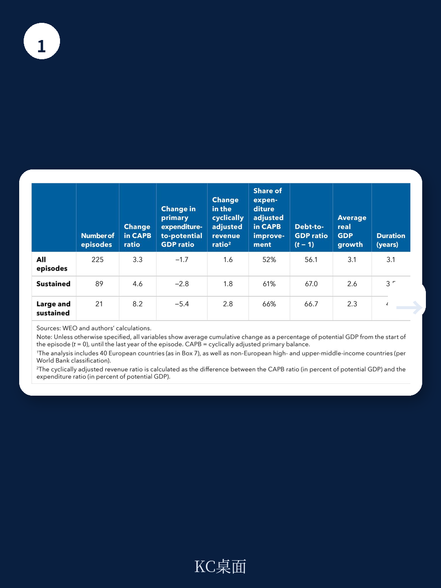
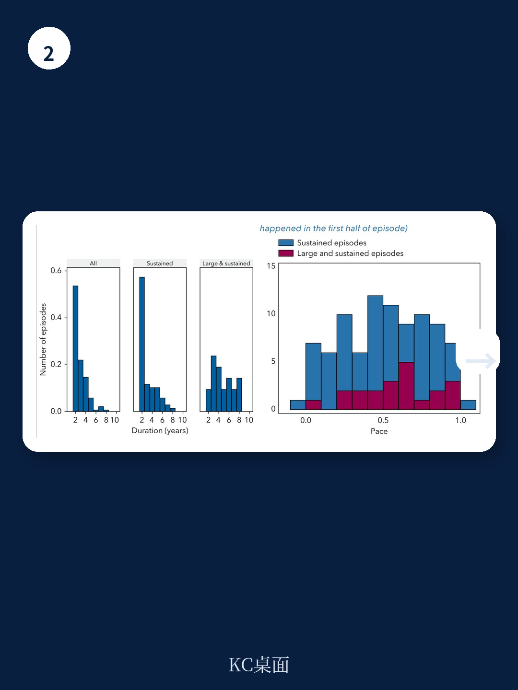

# IMF：欧洲财政紧缩-应对不断上升的支出压力

欧洲政府正面临一个前所未有的融资挑战。国际货币产品组织（IMF）最新发布的部门报告《Europe's Fiscal Squeeze》给出了一个清晰的量化判断：到2040年，老龄化、能源转型和国防这三项刚性支出，将推动欧洲平均政府支出比当前水平增加约5个百分点的GDP。这个数字大致相当于当前欧洲国家平均的教育预算规模。

问题的严峻性在于，这些新增需求并非发生在财政宽裕时期。欧洲多数国家的公共债务在新冠疫情后仍处高位，利息支出正在挤压其他必要开支，而政治层面对增税、减支或私有化的意愿普遍有限。IMF指出，若不采取行动，欧洲平均债务率将在未来15年内翻倍，到2040年达到130%的GDP。

报告的核心主张是：欧洲需要一套“三支柱”策略——结构性改革、中期财政整顿，以及重新思考政府边界——才能在不引爆债务的前提下，为这些新增支出找到融资来源。

## 1. 结构性改革能填补约三分之一的缺口，但无法单独解决问题

IMF的模拟显示，即使采取一套“中等力度”的改革组合——包括国内产品市场改革、劳动力市场改革、欧盟单一市场深化、养老金调整以及促进私人研究的措施——其长期财政效果仍然显著。这些改革的效果主要在实施后的第二个十年显现，但足以将欧洲典型国家从“爆炸性”债务路径拉回可持续路径的约三分之一。

报告特别强调，养老金改革和促进增长的国内改革在缓解财政仍在调整方面效果最为突出。但改革需要时间，而支出不确定性是即时的。因此，结构性改革只能作为第一支柱，不能替代财政整顿。

> **KC评论：** 这里的关键不是改革本身能否见效，而是时间错配。改革的效果滞后，而支出不确定性在前五年就会集中释放。这意味着，即使改革方向正确，中期内仍需要其他工具来“撑住”财政。

## 2. 即使有改革，近四分之三的欧洲国家仍需财政整顿

这是报告中最具操作性的判断之一。IMF的模拟显示，即使采用中等力度的改革，仍有约四分之三的欧洲国家需要进行财政整顿。在不改革的情况下，典型欧洲国家需要在五年内累计完成约5个百分点的GDP的财政整顿（年均约1个百分点）。如果采用中等改革方案，这一数字降至约3.5个百分点的GDP（年均约0.75个百分点），更接近历史经验。

但报告同时警告，即使这一数字在历史上看似可行，它仍然意味着在相对较短的时期内实施大幅财政紧缩。这可能在宏观环境增长仍低于潜力、资金条件偏紧、货币政策空间有限的情况下，对宏观环境活动造成影响。此外，不当的整顿措施——如削减转移支付或提高累退税——可能对低收入家庭造成不成比例的冲击，削弱社会凝聚力，甚至引发政策逆转。

## 3. 高债务国家可能不得不重新定义“政府该做什么”

报告最值得关注的判断出现在第三支柱。IMF指出，即使在改革和整顿之后，仍有约四分之一的欧洲国家的财政整顿需求超过了历史最高水平。对这些国家而言，关于欧洲社会福利模式可持续性的讨论似乎不可避免。

报告提出了一条相对务实的路径：将部分公共融资转向私人来源。具体手段包括：更严格的福利瞄准、补贴改革、对高收入群体提高使用费，以及国有企业重组或私有化。IMF估算，如果欧洲国家在医疗、教育、基础设施和气候领域的公共融资比例降至OECD平均水平，平均每个欧洲国家可以节省约3个百分点的GDP。

这听起来像是一个技术性调整，但报告承认，这些变化可能触及社会契约的核心。成功的关键在于：充分的协商、清晰的沟通，以及将其嵌入一个有序的中期计划。

> **KC评论：** 3个百分点的GDP不是小数字。它大致相当于欧洲国家当前在国防上的总支出。但问题在于，这些领域的私人融资替代——如提高大学学费或医疗自付比例——在政治上极其敏感。报告没有给出“如何做到”的答案，但指出了“如果不做，债务路径将不可持续”的后果。

## 4. 一个可复用的观察框架：改革力度决定整顿幅度

报告提供了一个简洁但实用的分析框架：改革力度与财政整顿幅度之间存在明确的替代关系。改革越激进，所需的财政整顿就越少。这一关系并非线性，而是存在一个“边际收益递减”的区域——当改革力度达到一定程度后，进一步改革对减少整顿需求的效果会减弱。

这意味着，每个国家都需要根据自身的社会偏好和政治可行性，在改革与整顿之间做出选择。报告没有给出“最优组合”，而是提供了量化工具，让决策者自己权衡。

对于观察者而言，这个框架提供了一个判断各国财政可信度的标尺：如果某个国家既没有推进实质性改革，也没有启动财政整顿，那么其债务可持续性就值得怀疑。反之，如果两者都在推进，即使短期数据需要继续观察看，长期路径也可能是可控的。

For informational purposes only. Portions may be generated,translated,summarized,or edited with AI assistance based on source materials and may contain omissions or errors. Please verify independently. This is not investment,legal,tax,accounting,or other professional advice.

