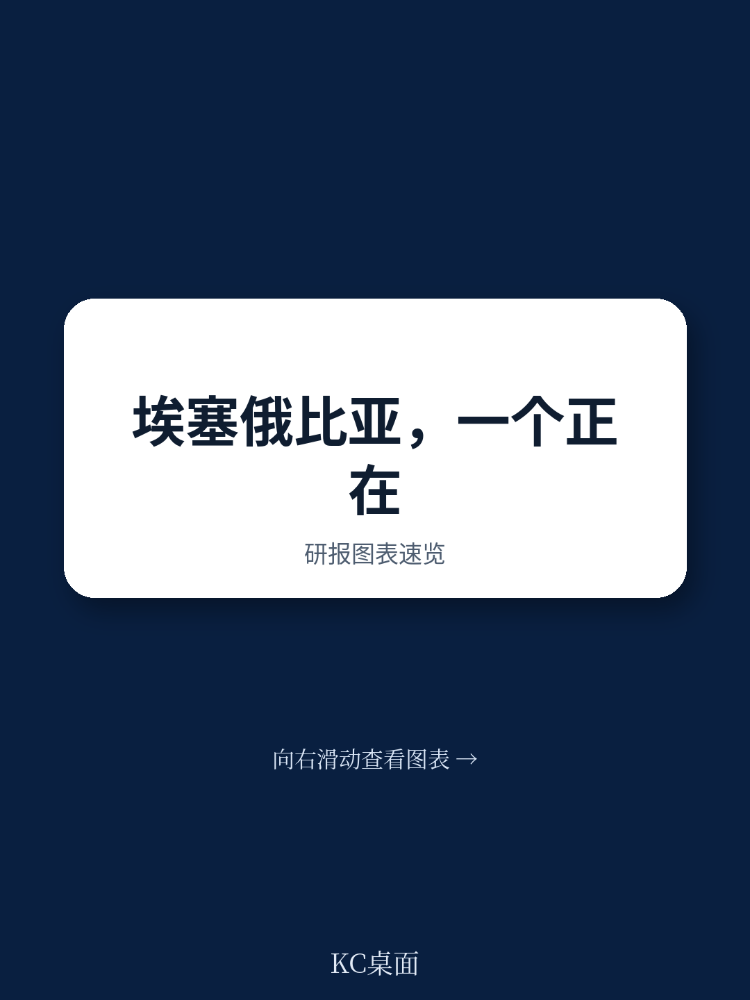
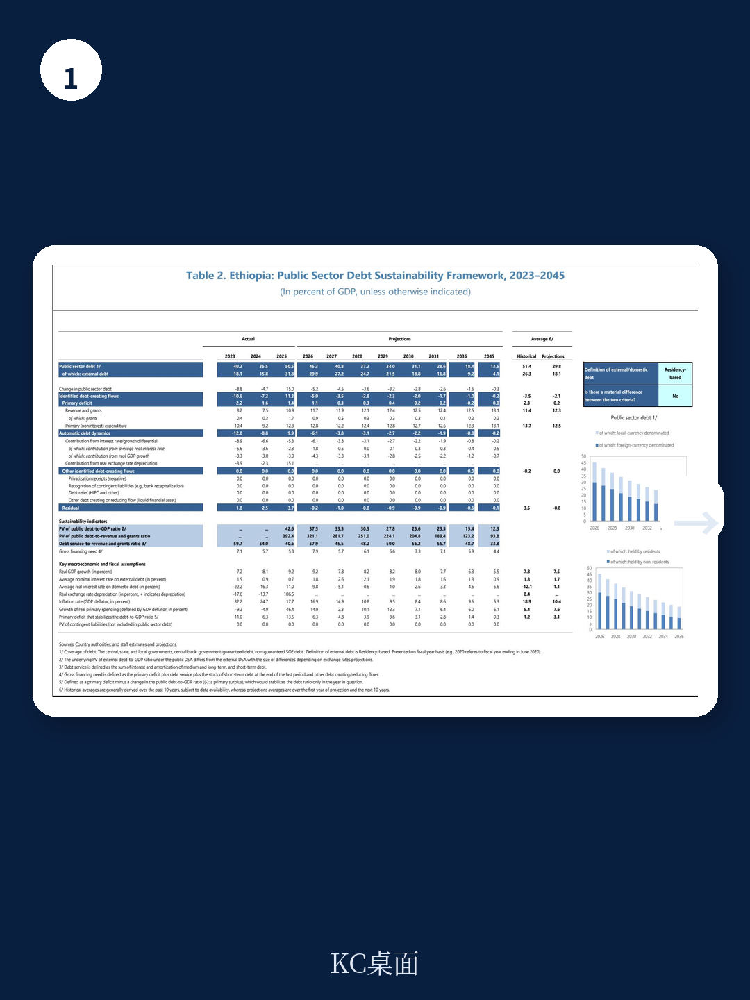
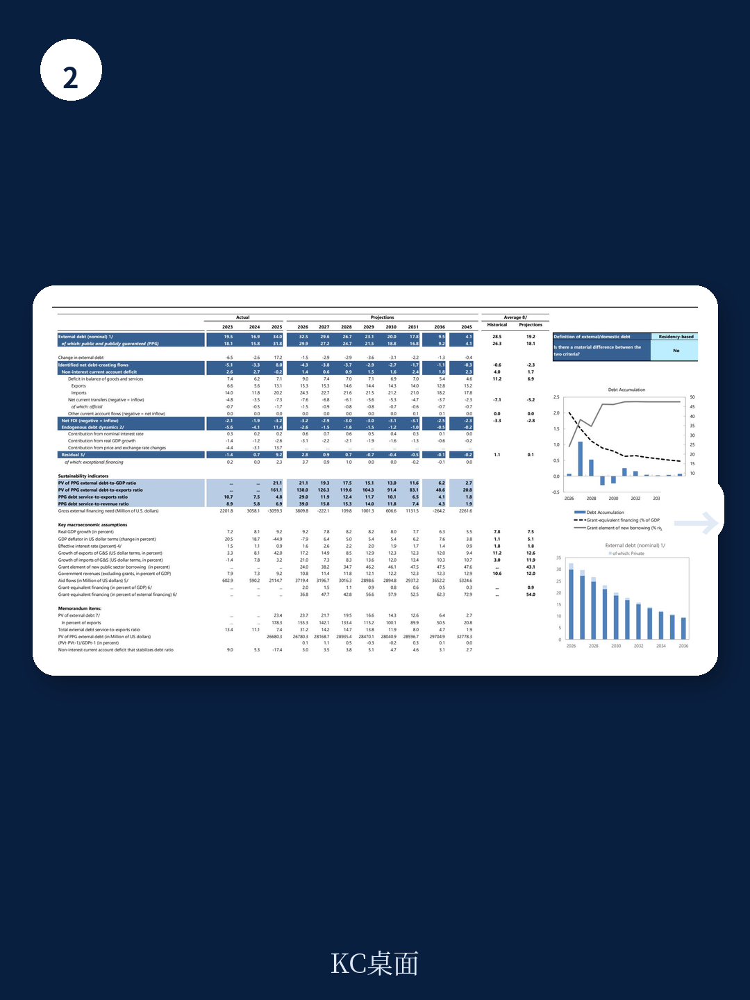

# IMF：埃塞俄比亚联邦民主共和国第五次审议

2026年7月1日，IMF执行董事会完成了对埃塞俄比亚48个月扩展信贷安排（ECF）的第五次审议，批准立即拨付约4.64亿美元。这笔资金中，约2亿美元是应埃塞当局请求重新调整拨付节奏后提前到位的——直接用于应对中东战争带来的燃料进口价格冲击。

这不是一次常规审议。报告显示，埃塞俄比亚所有量化绩效指标均达标，多数指示性目标也已完成。但真正值得关注的不是“达标”本身，而是达标背后的条件：一个正在经历外部战争冲击、内部安全局势紧张、同时坚持推进汇率市场化改革的地区，如何在多重不确定性下维持改革节奏。

这份报告提供了一个少见的观察窗口——当一个低收入国家在IMF项目框架下同时面对外部冲击、国内选举和结构性改革时，政策取舍的真实逻辑是什么。

## 1. 中东战争通过三条具体渠道传导至埃塞俄比亚宏观环境

报告在Box 1中详细拆解了传导机制，比通常的“地缘政治不确定性”表述要具体得多。

第一条是燃料。埃塞俄比亚所有石油燃料依赖进口，且高度集中于两个供应商，其中一家已宣布不可抗力。由于只能通过红海港口进口，物流和仓储限制推高了单位成本。今年4月，柴油现货采购价格一度飙升至每桶约270美元，航空燃油达到300美元。即便近期有所回落，将部分采购转为即期付款虽然能降低溢价，但也直接增加了外汇流动性需求。

第二条是化肥。化肥进口约占GDP的1%，年度需求的一半以上已交付，足以覆盖即将到来的种植季节。但下一轮采购将在2026年秋季启动，届时价格和供应链的不确定性仍然存在。

第三条是出口市场中断。中东占埃塞非黄金商品出口的约19%。黄金出口依赖包机运往迪拜——这是埃塞黄金的唯一精炼和进口地。报告指出，黄金价格预测已显著高于第四次审议时的水平，只要运输能持续，这部分收入可以对冲部分冲击。

这三条渠道叠加，意味着埃塞俄比亚面对的不是单一价格冲击，而是进口成本上升、出口收入承压、物流通道受限的复合型不确定性。

> **KC评论：** 报告对冲击的量化分析值得注意——它没有笼统说“外部环境出现变化”，而是具体到每桶柴油270美元、化肥进口占GDP1%、黄金出口依赖单一航线。这种颗粒度让读者能自行判断冲击的严重程度和可持续性。

## 2. 汇率改革正在产生可验证的效果，但远未到放松时刻

报告最引人注目的数据之一是实际有效汇率的变化：2023/24年度升值12.4%，2024/25年度大幅贬值44.2%。这一剧烈调整是2024年7月启动的汇率市场化改革的结果。

改革的效果正在显现。报告提到，平行市场溢价已经收窄，所有银行都满足了监管的净外汇头寸要求。新推出的银行间外汇自动交易平台有助于提升价格发现和竞争。央行继续通过透明、竞争的拍卖向市场出售外汇，资金来源于超预期的黄金出口带来的储备超额表现。

但报告也明确指出了约束条件。央行需要继续维持紧缩的货币立场以锚定通胀预期——2023/24年度平均通胀率为26.6%，2024/25年度降至16.0%，2025/26年度预计进一步降至11.7%。如果第二轮通胀不确定性出现，央行需要准备进一步收紧。

这意味着汇率改革不是一放了之。报告强调，央行需要制定一个精心设计的计划来改善黄金市场操作，并最终退出黄金市场——这与储备积累目标一致。同时，逐步放松剩余的外汇上缴要求和长期存在的汇兑限制，也需要按顺序推进。

## 3. 债务重组取得实质性进展，但融资缺口仍然存在

报告披露了几个关键进展：与官方债权人签署了多项双边协议，与多个外部商业债权人取得了重大进展，与欧洲债券持有人达成了原则性协议。

公共债务占GDP的比重从2024/25年度的50.5%预计降至2025/26年度的45.3%，并在此后持续下降至2030/31年度的28.6%。外部债务占比从31.8%降至29.9%，同样呈下降趋势。

但融资需求依然紧迫。2025/26年度经常账户赤字预计为GDP的2.5%，2026/27年度收窄至1.3%。外汇储备从2023/24年度的仅覆盖0.7个月进口，提升至2024/25年度的1.7个月，预计2025/26年度达到2.1个月——这仍然是一个偏低的水平。

报告在债务可持续性分析中保持谨慎：新债务的审慎举借，以及发展流动性本币市场，对于限制债务脆弱性至关重要。

## 4. 结构性改革正在产生可量化的微观效果

报告提供了一个值得关注的微观指标：企业产能利用率从改革前的不到50%提升至目前的约70%。2026年3月举办的“研究埃塞俄比亚”大会吸引了131亿美元的研究承诺。新的出口产品开始出现。

这些变化的背后是一系列制度性改革：外汇可获取性改善、电力供应增强、贸易物流和海关管理的法律和监管改革。国有企业治理、透明度和财务可持续性的改革也在推进，埃塞俄比亚研究控股公司（EIH）在其中发挥了催化作用。

报告还提到，私营企业对首次公开募股（IPO）的兴趣在增加——这在新兴资本市场中是一个积极的信号，表明资金部门改革正在创造新的融资渠道。

> **KC评论：** 产能利用率从50%到70%这个数字，比GDP增速更能说明改革对实体宏观环境的影响。它反映的不是宏观统计的改善，而是企业层面真实的运营改善——外汇可获取、电力稳定、物流效率提升，这些才是私营部门增长的微观基础。

## 5. 气候韧性被纳入改革议程的核心位置

报告在结尾部分专门讨论了气候议题。埃塞俄比亚宏观环境结构使其对极端气候事件高度敏感。当局已将气候适应置于改革议程的前沿，同时大力研究可再生能源。

一个值得关注的信号是：埃塞俄比亚正在积极筹备主办2027年联合国COP32气候峰会，并已表示有意申请IMF的韧性与可持续性安排（RSF），以支持其气候议程、增强宏观环境韧性，并撬动更多气候融资。

这意味着，埃塞俄比亚正在将气候议题从“外部约束”转化为“改革工具”——通过国际气候融资框架来补充传统发展融资的不足。

这份报告的真正价值，不在于它确认了埃塞俄比亚“达标”，而在于它展示了一个低收入国家如何在外部冲击、内部安全不确定性和结构性改革之间寻找平衡。改革不是线性推进的，而是在每一次冲击中重新校准。对于关注新兴市场改革进程的读者来说，埃塞俄比亚的案例提供了一个难得的、可追踪的参照系。

For informational purposes only. Portions may be generated,translated,summarized,or edited with AI assistance based on source materials and may contain omissions or errors. Please verify independently. This is not investment,legal,tax,accounting,or other professional advice.

