# The Impact of Artificial Intelligence on Israel's Labor Market

Ece Ozge Emeksiz

SIP/2026/061

IMF Selected Issues Papers are prepared by IMF staff as background documentation for periodic consultations with member countries. It is based on the information available at the time it was completed on June 10, 2026. This paper is also published separately as IMF Country Report No 26/162.

2026
JUL

# IMF Selected Issues Paper European Department

# The Impact of Artificial Intelligence on Israel's Labor Market Prepared by Ece Ozge Emeksiz\*

Authorized for distribution by Kotaro Ishi
July 2026

IMF Selected Issues Papers are prepared by IMF staff as background documentation for periodic consultations with member countries. It is based on the information available at the time it was completed on June 10, 2026. This paper is also published separately as IMF Country Report No 26/162.

ABSTRACT: Artificial intelligence (AI)-particularly Generative AI -has the potential to raise productivity but could reshape workplaces across sectors. Using occupational microdata, this paper assesses the potential impact of Generative AI on Israel's labor market and benchmarks it against selected European economies. The results indicate that most Israeli workers are likely to benefit from AI adoption. However, about one-fifth of the workforce faces high exposure with low complementarity, indicating their vulnerability to displacement. To assist workers at risk of job displacement, a comprehensive lifelong learning strategy—including reskilling, upskilling, and mid-career training—is essential.

RECOMMENDED CITATION: The impact of Artificial Intelligence on Israel's Labor Market; Emeksiz, Ece Ozge; IMF Selected Issues Paper (SIP/2026/061); Washington, D.C.

JEL Classification Numbers:

J21, J24, O32

Keywords:

Artificial Intelligence, AI, Digitalization, Labor Markets, Israel

Author's E-Mail Address:

eemeksiz@imf.org

SELECTED ISSUES PAPERS

# The Impact of Artificial Intelligence on Israel's Labor Market

Israel

Prepared by Ece Ozge Emeksiz $^{1}$

References 12

# ISRAEL

SELECTED ISSUES

June 10, 2026

## Approved By

Prepared by Ece Ozge Emeksiz

European Department

## CONTENTS

THE IMPACT OF ARTIFICIAL INTELLIGENCE ON ISRAEL'S LABOR MARKET \_\_\_\_ 2
A. Context \_\_\_\_ 2
B. Preparedness and Challenges \_\_\_\_ 2
C. Labor Market Exposure and Complementary to AI \_\_\_\_ 4
D. Conclusions and Policy Considerations \_\_\_\_ 11

## FIGURES

1. AI Preparedness and Investment \_\_\_\_ 3

2. Skill Readiness, Educational Attainment, and Workforce Composition \_\_\_\_ 5

3. Exposure and Complementarity to AI \_\_\_\_ 8

4. Sectoral Differences 9

5. Gender, Education, and Age Differences \_\_\_\_ 10

## ANNEX

I. Measuring Exposure and Complementarity to AI \_\_\_\_ 13

# THE IMPACT OF ARTIFICIAL INTELLIGENCE ON ISRAEL'S LABOR MARKET $^{1}$

Artificial intelligence (AI)-particularly Generative AI $^{2}$ -has the potential to raise productivity but could reshape workplaces across sectors. Using occupational microdata, this paper assesses the potential impact of Generative AI on Israel's labor market and benchmarks it against selected European economies. The results indicate that most Israeli workers are likely to benefit from AI adoption. However, about one-fifth of the workforce faces high exposure with low complementarity, indicating their vulnerability to displacement. To assist workers at risk of job displacement, a comprehensive lifelong learning strategy—including reskilling, upskilling, and mid-career training—is essential.

## A. Context

1. Artificial intelligence (AI), including Generative AI models, has advanced rapidly in recent years. These developments have expanded AI's scope beyond conventional machine-learning applications to encompass a wide range of cognitive tasks, such as pattern recognition, content creation, and decision support, thereby opening the door to sizable productivity gains. AI has diffused relatively quickly across firms and occupations (Mish et al., 2025). However, it remains unclear whether AI will primarily complement or substitute specific occupations, and how quickly these effects will materialize.

2. Israel is well-positioned to navigate this transition, both as a producer and a user of AI technologies. The country plays a prominent role in the global AI ecosystem, supported by a dense ecosystem of AI-focused startups and multinational R&D centers. On the adoption side, the widespread diffusion of AI across sectors—including traditional industries and the public sector—has the potential to boost Israel's aggregate productivity.

3. This chapter examines how AI diffusion across occupations may affect labor market outcomes. Section B assesses Israel's preparedness and challenges, while Section C analyzes the characteristics of the Israeli labor market, mapping measures of AI exposure and complementarity onto occupational microdata. Section D concludes and discusses policy implications.

## B. Preparedness and Challenges

4. Israel is relatively well prepared for AI adoption. The IMF's AI Preparedness Index ranks Israel 18th globally, reflecting strong innovation capacity and a supportive environment, while the Stanford AI Index places Israel among the top in AI-related private investment and newly funded AI Companies (Figure 1). AI adoption is relatively high, particularly in the high-tech sector. Across all

sectors, about 28 percent of Israeli firms report using AI. $^{3}$ Moreover, Israel is among the leading OECD countries in both current and projected business-sector AI adoption (Filippucci and others, 2026).

AI Preparedness Index (Index)

  
Sources: Cazzaniga and others (2024); and IMF staff estimates.

Figure 1. AI Preparedness and Investment  
  
Sources: Cazzaniga and others (2024); and IMF staff estimates.  
Total Private Investment for AI (2013-2024, percent of of GDP)

  
Sources: Stanford AI Index 2025; and IMF Staff estimates.  
Number Newly Funded AI Companies (2013-2024, relative to GDP)

  
Sources: Stanford AI Index 2025; and IMF Staff estimates.  
AI Adoption of Firms by Industry-Israel (Share of firms reporting AI use)

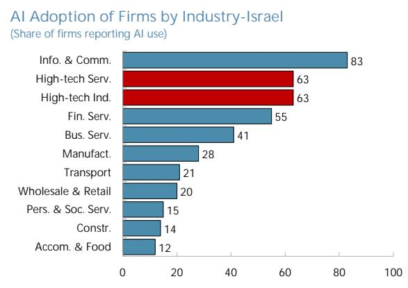  
Source: Israel Central Bureau of Statistics (CBS), Business Tendency Survey 2025.  
AI Adoption of Firms by Industry-European Peers (Share of firms reporting AI use)

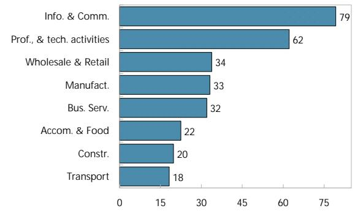  
Source: Eurostat, ICT Usage in Enterprises 2025; and IMF Staff estimates. Note: Average of Austria, Denmark, Finland, Sweden, and the Netherlands.

5. However, skill shortages and Israel's "dual economy" structure could constrain economy-wide AI diffusion and limit macroeconomic gains.

\- The IMF's Skill Readiness and Imbalance Index—measuring the gap between projected new skill demand and the share of graduates with new skills (relative to the United States)—indicates that demand significantly exceeds supply (Figure 2). $^{4}$ The gap is larger than in many advanced economies, reflecting a relatively low number of graduates in AI-relevant fields.

\- AI diffusion across broader sectors may be hindered by Israel's dual economy. While skills and productivity are high in the high-tech sector, they are weaker elsewhere, where digitization, including AI adoption, has lagged. AI use is concentrated in high-tech and information and communication technology (ICT) sectors; although European peers exhibit a similar pattern, sectoral disparities are more pronounced in Israel.

\- Significant skill gaps persist across population groups, especially among Arab-Israeli and Haredi populations. Despite rising labor participation among women in these groups, alongside improved education and skills, many workers remain employed in lower-skilled level occupations. Arab-Israeli and Haredi men exhibit low tertiary attainment and remain concentrated in secondary education, limiting access to higher-productivity jobs. For Haredi men, limited participation in core studies (mathematics, science, and English) poses an additional constraint. As a result, these groups also remain underrepresented in the high-tech sector, where productivity and wages are higher (Figure 2). $^{5}$

## C. Labor Market Exposure and Complementary to AI

6. We evaluate occupational exposure to AI and its potential for complementarity or substitution. Building on Felten et al. (2021), who construct occupation-level measures by mapping AI capabilities to workplace tasks, Pizzinelli et al. (2023) broaden the approach by incorporating the social, ethical, and physical characteristics of jobs. This extension allows for a distinction between tasks that are likely to be augmented by AI and those that may be more easily automated. Occupations are grouped into three categories: high exposure with high complementarity (HEHC), high exposure with low complementarity (HELC), and low exposure (see Annex 1). $^{6}$

\- These measures are applied to the 2023 Israel, Eurostat and U.K. Labor Force Surveys to assess AI exposure and complementarity in Israel and benchmark it against the selected European

Share of Graduates with New Skills (Percent)

peers (Austria, Denmark, Finland, and Sweden), the United Kingdom, and other European countries.

\- The analysis is undertaken at the ISCO two-digit level and covers 36 occupations, 19 economic activities, three age groups, gender, three educational levels, and three population groups.

\- The results should be interpreted as reflecting the transition toward a new technological equilibrium as AI adoption and labor market adjustments unfold.

Figure 2. Skill Readiness, Educational Attainment, and Workforce Composition

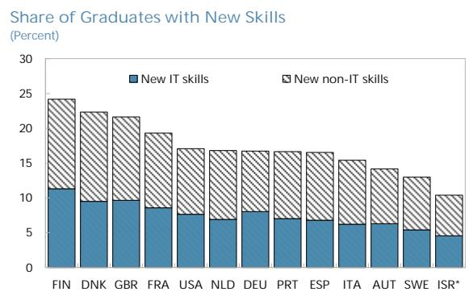  
Sources: Jaumotte and others (2026)

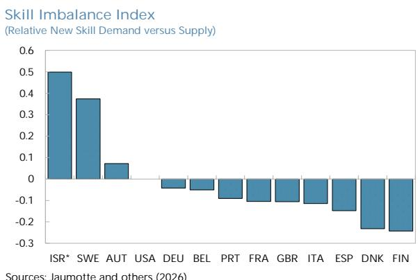  
Sources: Jaumotte and others (2026)  
Educational Attainment by Pop. Group-Men (Share of population ages 25-64 by group, percent)

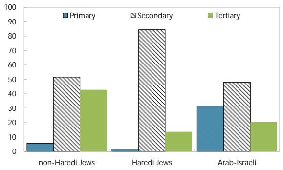  
Sources: Israel Labor Force Survey 2023; and IMF Staff estimates.  
Educational Attainment by Group-Female (Share of population ages 25-64 by group, percent)

  
Sources: Israel Labor Force Survey 2023; and IMF Staff estimates.  
Relative Representation of Population Groups in High-Tech (Index)

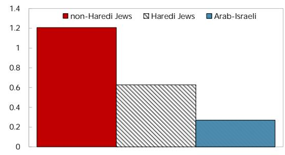  
Sources: Israel Labor Force Survey 2023; and IMF Staff estimates.  
Female Labor Force Participation (Percent)

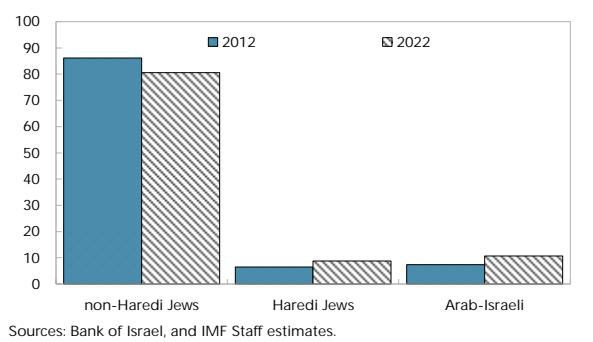

## Key Results

Israel's labor force is comparatively more exposed to AI than those of most European peers (Figure 3). About two-thirds of Israeli workers face high AI exposure—broadly in line with the U.K., but higher than other European countries.

\- Among highly exposed workers, roughly two-thirds are employed in occupations with complementarity—including education, business and administration associate professionals, science and engineering, and health professions—making them more likely to benefit from AI adoption. $^{7}$

\- The remaining third exhibits lower complementarity, partly reflecting the sizable employment share in ICT professionals and sales occupations, and faces higher job displacement risks. $^{8}$

\- About one-third of the Israeli workforce has low AI exposure, primarily in personal care, personal services, and manual labor.

\- Israel's higher share of high-exposure and complementary occupations reflects its demographic and sectoral composition: a younger population increases employment in education, while a large high-tech sector and a higher share of legal, social, and cultural professionals also contribute.

7. In the private sector, about one-third of employment faces high displacement risks. The riskiest occupations—characterized by high exposure and low complementarity—include business and administration professionals, sales workers, and ICT specialists. ICT, finance, and insurance are expected to be the most affected sectors. Together, they account for about 12 percent of total employment, suggesting potentially significant labor market impacts (Figure 4).

8. By contrast, the public sector is likely to benefit from AI. Public services account for about one-third of total employment, with more than half of public sector workers employed in occupations with high exposure and high complementarity, such as education and healthcare. Compared with peers, displacement risks in Israel are lower than in the United Kingdom and other European economies. However, realizing these upside potentials will depend on effective adoption of AI. $^{9}$

9. By gender, women are expected to benefit from AI more than men. Nearly three-quarters of female workers are highly exposed to AI, with most employed in occupations exhibiting high complementarity, including education, business and administration associate professions, legal, social, cultural services, and healthcare. Israeli women are likely to gain more than women in Europe, partly reflecting their greater concentration in education and healthcare—predominantly public-sector activities.

## 10. AI-related displacement risks vary across population groups and education levels.

\- Jewish populations face higher displacement risks than Arab-Israelis, reflecting substantially greater AI exposure. Around 25 percent of non-Haredi Jewish workers and 20 percent of Haredi workers are employed in occupations with high exposure and low complementarity. The lower share among Haredi workers reflects the concentration of women in education, where AI is more likely to be complementary. Arab-Israelis are less exposed overall, due to their concentration in lower-skill occupations.

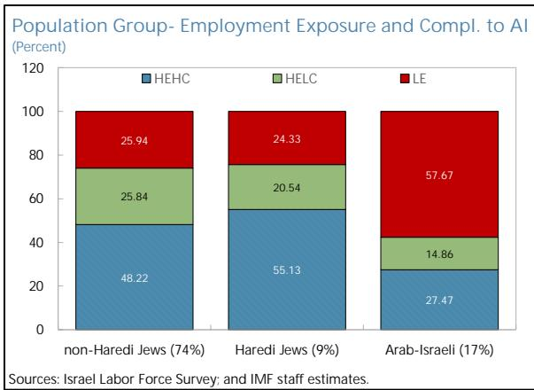

\- Highly educated workers, despite being best positioned to benefit, also face meaningful risks: nearly 90 percent are exposed to AI, and about one-quarter may experience displacement pressures. Younger workers appear more vulnerable than older cohorts, as higher exposure is not consistently offset by task complementarity.

Figure 3. Exposure and Complementarity to AI

Employment Exposure and Complementarity to AI (Percent)

  
Sources: Israel Labor Force Survey 2023; and IMF staff estimates.  
Comparison with Other Countries (Percent)

  
Sources: Eurostat, Israel, UK Labor Force Surveys 2023; and IMF staff estimates.  
Employment Exposure and Compl. to AI by Occupation (Main 1-digit occupations, employment share)

  
Exposure and Complementarity to AI (Index, dotted lines = median)

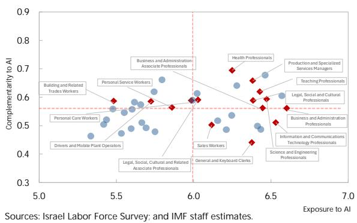

Figure 4. Sectoral Differences

Exposure and Complementarity to AI by Broad Sectors (Percent)

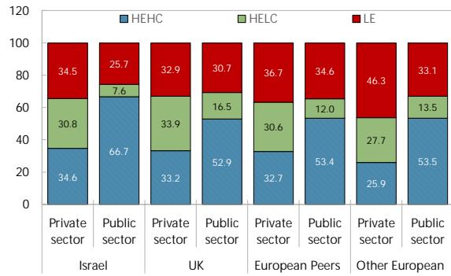  
Sources: Eurostat, Israel, UK Labor Force Surveys 2023; and IMF staff estimates.  
Main Occupations in Israel  
Exposure and Complementarity to AI by Sector (Percent)

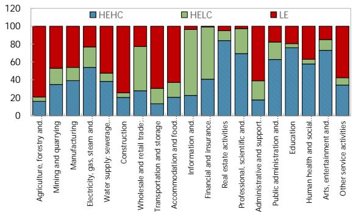  
Sources: Israel Labor Force Survey 2023; and IMF staff estimates.

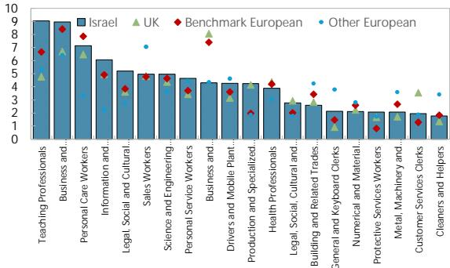  
Sources: Eurostat, Israel, UK Labor Force Surveys 2023; and IMF staff estimates.

Employment by Sector
(Percentage of total employment, 2023)  
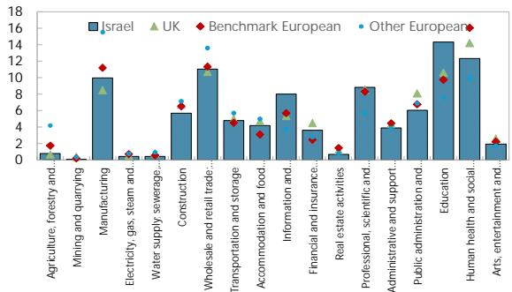  
Sources: Eurostat, Israel, UK Labor Force Surveys 2023; and IMF staff estimates.

## Figure 5. Gender, Education, and Age Differences

Exposure and Complementarity to AI for Women (Percent)  
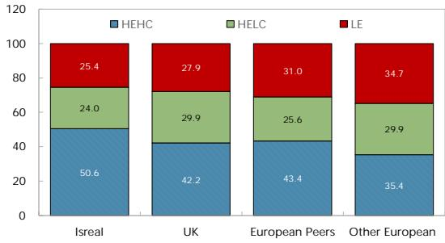  
Sources: Eurostat, Israel, UK Labor Force Surveys 2023; and IMF staff estimates.

Exposure and Complementarity to AI for Men (Percent)  
  
Sources: Eurostat, Israel, UK Labor Force Surveys 2023; and IMF staff estimates.

Main Occupations for Female (Main 1-digit occupations, employment share)  
  
Sources: Israel Labor Force Survey 2023; and IMF staff estimates.

Main Occupations for Men
(Main 1-digit occupations, employment share)  
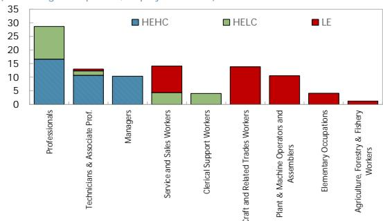  
Sources: Israel Labor Force Survey 2023; and IMF staff estimates.

Education - Employment Exposure and Compl. to AI (Percent)  
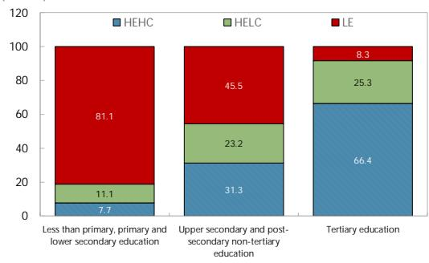  
Sources: Israel Labor Force Survey 2023; and IMF staff estimates.

Age - Employment Exposure and Compl. to AI (Percent)  
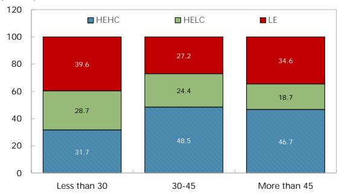  
Sources: Israel Labor Force Survey 2023; and IMF staff estimates.

## D. Conclusions and Policy Considerations

11. AI offers significant potential to raise productivity, including in traditional industries and the public sector, but it also poses adjustment challenges. $^{10}$ Rapid technological change has increased demand for skilled workers beyond supply. While Israel's labor market is less susceptible to AI-related job displacement than those of other European economies—due to higher complementarity—around one-fifth of workers remain at risk. Vulnerabilities are concentrated among employees in high-value added industries (e.g., ICT, finance, and professional services),

younger workers, and those with tertiary education.

12. Continued efforts to align workforce skills with evolving needs are therefore essential. Education reforms should focus on expanding STEM enrollment, updating mathematics and science curricula, and introducing AI education at earlier stages. Spending for active labor market policies in Israel remains low compared to peers. To assist workers at risk of displacement, a comprehensive lifelong

learning strategy is essential, including reskilling, upskilling, and mid-career training.

13. Targeted policies are also needed to enable Arab-Israeli and Haredi populations to benefit from AI. The past initiatives, including MAHAT technological training programs, gap-year transition programs for Arab-Israeli youth, and employment support through Ryan Centers and Haredi-focused coding and placement initiatives, have helped narrow gaps in line with the 2022 Perlmutter Committee's recommendations, including upgrading seminary training and better aligning vocational education and training programs with evolving labor market needs.

## References

Bank of Israel, 2025, Annual Report 2024, Box 5.1, "The expected effect of generative Artificial Intelligent on employees: Implications for labor market policy," March.

EMPLOYEES: IMPLICATIONS FOR LABOR MARKET POLICY

Cazzaniga M., F. Jaumotte, L. Li, G. Melina, A. J. Panton, C. Pizzinelli, E. Rockall, and M. M. Tavares, 2024, "Gen-AI: Artificial Intelligence and the Future of Work", IMF Staff Discussion Note SDN2024/001, International Monetary Fund, Washington, DC.

Felten E., M. Raj and R. Seamans, 2021, "Occupational, industry, and geographic exposure to artificial intelligence: A novel dataset and its potential uses", Strategic Management Journal, 2021;1-23.

Filippucci, F., Gal, P., Laengle, K., Schief, M. and Yildirim, M.A., 2026. AI meets trade: Global linkages and the cross-country distribution of the gains from AI. OECD Artificial Intelligence Papers No. 57. Paris: OECD Publishing.

Institute for National Security Studies (INSS), 2025, Recommendations of the Nagel Committee: Rushing Toward the Al Abyss, Memorandum No. 2048.

International Monetary Fund (IMF). 2026. Bridging Skill Gaps for the Future: New Jobs Creation in the AI Age. Staff Discussion Notes, No. 2026/001. Washington, DC: International Monetary Fund.

Israel Central Bureau of Statistics (CBS), 2025, “Business Tendency Survey: Artificial Intelligence Module”, June.

Mish F., B. Park, C. Pizzinelli, and G. Sher., 2025 AI and Productivity in Europe, IMF Working Papers 2025/067, International Monetary Fund, Washington, DC.

Organisation for Economic Co-operation and Development (OECD), 2025, OECD Economic Surveys: Israel 2025, OECD Publishing, Paris.

Pizzinelli C., A. Panton, M. M. Tavares, M. Cazzaniga, and L. Li. 2023. "Labor Market Exposure to AI: Cross-Country Differences and Distributional Implications." IMF Working Paper 2023/216, International Monetary Fund, Washington, DC.

Stanford Institute for Human-Centered Artificial Intelligence (HAI), 2025, AI Index Report 2025, Stanford University, Stanford, CA.

State Comptroller of Israel, 2024, “Artificial Intelligence: National Preparedness”, Special Report.

## Annex I. Measuring Exposure and Complementarity to AI

1. Assessing Occupational Exposure to AI. Felten et al. (2021) introduce an approach to assessing AI exposure across occupations by associating a set of AI capabilities. such as image recognition and text generation, with a broad range of underlying worker abilities identified in the U.S. O\*NET database. The framework treats occupations as portfolios of skills, where each ability contributes to job performance with varying degrees of importance and complexity, allowing exposure to AI to be quantified at the occupational level.

2. Assessing Complementarity with AI. Pizzinelli et al. (2023) construct an index capturing how AI interacts with different occupations by incorporating two additional dimensions from the O\*NET database: work contexts and job zones. The authors identify eleven AI-relevant work contexts and combine them with job-zone classifications to form six broader components—communication, responsibility, physical conditions, criticality, routine intensity, and skills. This framework allows for an evaluation of the extent to which AI technologies are likely to complement or substitute tasks performed within specific occupations.

3. Combining Exposure and Complementarity. Exposure and complementarity measures can be jointly interpreted within a three-category framework that classifies occupations according to their degree of AI exposure and complementarity. Using the median values of both indicators as thresholds, occupations are grouped into: high exposure–high complementarity (HEHC), high exposure–low complementarity (HELC), and low exposure (LE). Occupations in the high exposure–low complementarity category are considered more susceptible to AI-driven job displacement, as AI technologies are more likely to substitute for, rather than complement, the tasks they perform.