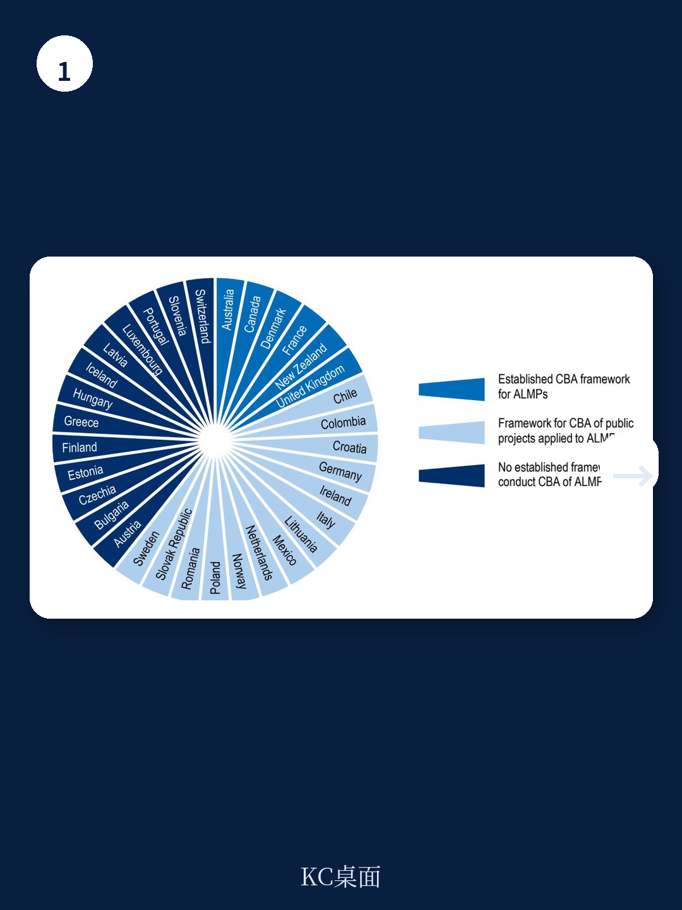
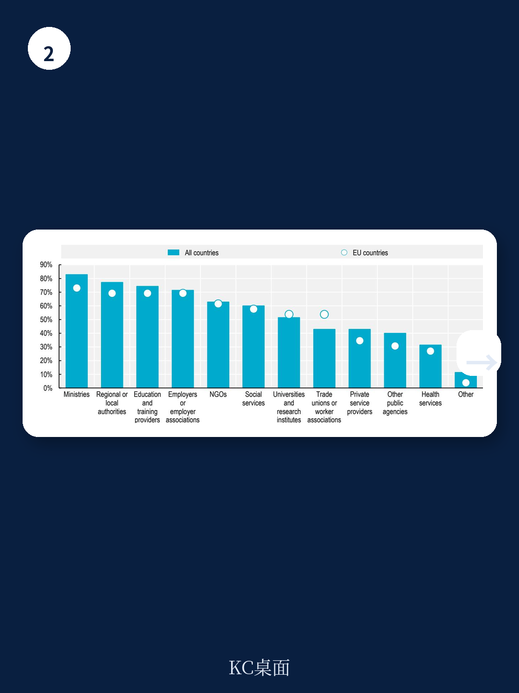

# 经合组织：成本有效的积极劳动力市场政策

一份来自经合组织（OECD）的新工作论文，系统梳理了37个OECD和欧盟国家在2025年实施的200多项带有明确社会目标的积极劳动力市场政策（ALMP）。这些政策不再只盯着就业率，而是试图同时解决求职者面临的社会障碍——从自信心缺失、社会孤立到身心健康问题。但报告揭示了一个核心矛盾：政策设计已经拓宽，评估体系却几乎没有跟上。超过半数国家会常规评估就业效果，但只有大约十分之一会系统评估社会效果。这意味着，大量公共支出的“真实回报”可能被系统性低估。

## 1. 超过200项政策已嵌入社会目标，但评估仍以就业为单一标尺

报告通过专项问卷发现，37个国家的ALMP已经覆盖了从培训、就业激励到创业支持等几乎所有政策类别，且明确将社会目标写入设计。最集中的目标群体是长期失业者、残疾人和青年，其次是移民、低技能者和有健康问题或照护责任的人群。在这些政策中，最普遍的社会目标是“增强求职者的主体感”——包括动机、自信心和自主性。心理健康和身体健康则更多通过专门干预项目来回应。

然而，当被问及是否对这些社会效果进行反事实影响评估（CIE）时，情况截然不同。报告指出，虽然超过一半的国家会常规评估就业效果，但只有约十分之一的国家会常规评估社会效果。这种“设计先行、评估滞后”的格局，使得政策制定者很难判断哪些项目在改善社会福祉方面真正物有所值。

> **KC评论：** 这里的核心不是评估技术不够先进，而是数据基础设施的错位。许多国家已经能链接健康、教育或移民的行政数据与失业登记数据，但这些链接主要用于行政管理，而非用于评估政策的社会效果。数据有，但评估框架没有。

## 2. 成本效益分析仍属例外，数据缺口是最大障碍

要全面判断一项ALMP是否“划算”，就需要进行综合成本效益分析（CBA），将就业收益、社会收益和所有成本放在一起衡量。但报告发现，只有20%的受访国家报告拥有专门的ALMP成本效益分析框架，而定期开展CBA的国家不到五分之一。

各国列出的最大障碍是数据问题。具体来说，非货币化结果（如健康改善）的数据难以获取，ALMP的交付成本数据也不够精细。报告特别指出，直接成本（如培训费用）的数据相对容易获得，但间接成本（如行政管理、参与者机会成本）的数据则普遍缺失。方法论挑战也被频繁提及，例如如何将健康改善等非市场结果货币化，以及如何准确归因政策效果。

## 3. 健康和社会参与的证据最丰富，但结论因群体和干预类型而异

在少数开展了社会效果评估的研究中，健康结果是被研究最多的领域，但结论并不统一。报告提到，ALMP对求职者社会技能的影响通常呈现正面效果，而对生活质量的改善效果在提供补贴就业的项目中最为明显。关于犯罪率降低的证据仍然非常有限。

这些发现意味着，即使在同一政策类别下，不同目标群体和干预强度的效果差异可能很大。报告没有给出一个“一刀切”的结论，而是强调需要更细颗粒度的评估来指导政策设计。

## 4. 四个优先事项：从数据互操作到方法论框架

报告在结论部分提出了四个明确的优先行动方向：第一，将社会效果更系统地纳入ALMP的监测和评估框架；第二，加强数据互操作性和跨机构合作，以更好地利用已有的行政数据；第三，为ALMP的成本效益分析开发专门的方法论框架；第四，改进ALMP成本数据的收集工作。

这四点环环相扣。没有更好的数据，就无法进行更全面的评估；没有评估框架，数据就只是沉睡的资产。报告的核心判断是，如果社会效果被持续忽略，政策资源可能会被错误配置——那些在就业效果上表现一般、但在改善健康或社会参与上效果显著的项目，可能因此被低估甚至放弃。

> **KC评论：** 对于关注公共财政效率和福利改革的读者，这份报告提供了一个可复用的观察框架：判断一项劳动力市场政策是否“划算”，不能只看就业率变化，还要看它是否减少了医疗支出、降低了犯罪率、提升了社会参与。报告虽然没有给出具体国家的案例数据，但它指出了实现这种综合评估所需的数据和方法论条件。这比任何单一结论都更有长期参考价值。

For informational purposes only. Portions may be generated,translated,summarized,or edited with AI assistance based on source materials and may contain omissions or errors. Please verify independently. This is not investment,legal,tax,accounting,or other professional advice.

