OECD Economics Department Working Papers

# Non-compete and related clauses in Canada

By: Dan Andrews, Andrea Garnero and Sara Holttinen

OECD Economics Department Working Papers

# Non-compete and related clauses in Canada

No. 1872

This work is issued under the responsibility of the Secretary-General of the OECD and does not necessarily reflect the official views of OECD Member countries

Working Papers describe preliminary results or research in progress and are published to stimulate discussion on a broad range of issues on which the OECD works.

Comments on Working Papers are welcomed, and may be sent to the OECD Economics Department.

This document and any map included herein are without prejudice to the status of or sovereignty over any territory, to the delimitation of international frontiers and boundaries and to the name of any territory, city or area.

## Cover image: © Shutterstock / whiteMocca

## © OECD 2026

## CC BY Attribution 4.0 International (CC BY 4.0)

This work is made available under the Creative Commons Attribution 4.0 International licence. By using this work, you accept to be bound by the terms of this licence (https://creativecommons.org/licenses/by/4.0/).

Attribution – you must cite the work.

Translations – you must cite the original work, identify changes to the original and add the following text: In the event of any discrepancy between the original work and the translation, only the text of original work should be considered valid.

Adaptations – you must cite the original work and add the following text: This is an adaptation of an original work by the OECD. The opinions expressed and arguments employed in this adaptation should not be reported as representing the official views of the OECD or of its Member countries.

Third-party material – the licence does not apply to third-party material in the work. If using such material, you are responsible for obtaining permission from the third party and for any claims of infringement.

You must not use the OECD logo, visual identity or cover image without express permission or suggest the OECD endorses your use of the work.

Any dispute arising under this licence shall be settled by arbitration in accordance with the Permanent Court of Arbitration (PCA) Arbitration Rules 2012. The seat of arbitration shall be Paris (France). The number of arbitrators shall be one.

# ABSTRACT/RÉSUMÉ

# Non-compete and related clauses in Canada

This paper provides new evidence on the prevalence and potential effects of non-compete and related clauses in Canada using OECD surveys of workers and firms. It finds that these clauses are widespread, increasingly used, and often applied beyond roles where they are most justified. Many appear overly broad and legally weak, yet a substantial share of workers report having been prevented from changing jobs or starting a business. Their impact is reinforced by behavioural factors, including reputational and ethical concerns. The findings also bring into closer focus the use of (firm-to-firm) no-poaching and wage fixing agreements that restrict labour market competition and, thus, raise broader concerns for the Canadian Competition Bureau.

JEL Codes: J62, K31, L41.

Keywords: Non-compete clauses; labour market competition; job mobility.

\*\*\*\*\*\*\*\*\*\*\*\*\*\*\*\*\*\*\*\*\*\*\*\*\*\*\*\*\*\*\*\*\*\*\*\*\*\*\*\*\*\*\*\*\*\*\*\*\*\*\*\*\*\*\*\*\*\*\*\*\*\*\*\*\*\*\*\*\*\*\*\*\*\*\*\*\*\*\*\*\*\*\*\*\*\*\*\*\*\*

## Les clauses de non-concurrence et les clauses connexes au Canada

Cet article apporte de nouvelles données sur la prévalence et les effets potentiels des clauses de non-concurrence et des clauses connexes au Canada, en s'appuyant sur des enquêtes de l'OCDE menées auprès des travailleurs et des entreprises. Il révèle que ces clauses sont très répandues, de plus en plus utilisées et souvent appliquées au-delà des fonctions pour lesquelles elles se justifient le plus. Bon nombre de ces clauses semblent trop générales et juridiquement fragiles. Or, une part importante des travailleurs déclare avoir été empêchée de changer d'emploi ou de créer une entreprise. Leur impact est renforcé par des facteurs comportementaux, notamment des préoccupations liées à la réputation et à l'éthique. Ces résultats mettent également en lumière le recours aux accords (entre entreprises) de non-débauchage et de fixation des salaires qui restreignent la concurrence sur le marché du travail, soulevant ainsi des préoccupations plus générales pour le Bureau de la concurrence du Canada.

Codes JEL: J62, K31, L41.

Mots-clés: Clauses de non-concurrence; concurrence sur le marché du travail; mobilité professionnelle.

# Table of contents

Non-compete and related clauses in Canada 5
1. Introduction 5
2. The economics of post-employment restraints 6
3. The regulation of post-employment restraints in Canada 7
4. The prevalence and the characteristics of post-employment restraints in Canada 9
5. Concluding remarks 19

## References

## FIGURES

Figure 1. Non-compete and related clauses are relatively common in Canada 10  
Figure 2. The use of non-compete clauses is rising in Canada 11  
Figure 3. The use of non-compete clauses extends well past executives and specialized professionals in Canada 13  
Figure 4. Non-compete and related clauses are frequently grouped together and applied to all workers in Canada 14  
Figure 5. Non-compete clauses could have meaningful effects on job mobility and business entry in Canada 15  
Figure 6. Reported reasons for complying with non-compete clause in Canada 16  
Figure 7. Non-compete clauses can be expansive in scope and fall short of legal requirements in Canada 17  
Figure 8. Employees often believe non-compete clauses are binding even when they fall short of legal requirements in Canada 18  
Figure 9. Knowledge of no-poaching or wage fixing agreements is widespread in Canada 19

## TABLE

Table 1. Regulation of non-compete clauses in Canada 9

## BOXES

Box 1. Contractual clauses regulating post-employment activity 6  
Box 2. The 2021 reform of non-compete clause in Ontario 8  
Box 3. The OECD worker and employer surveys on non-compete and related clauses 11

## Executive Summary

Across OECD countries, slowing productivity growth and declining labour market dynamism have renewed interest in factors that may hinder the efficient allocation of talent. Post-employment restraint clauses – particularly non-compete clauses – have emerged as a potentially important, yet underexplored factor. While such clauses can serve legitimate purposes – including the protection of trade secrets and incentives for investment in training – their widespread and often broad application raises concerns about their effects on labour mobility, competition and innovation.

This paper provides the first comprehensive evidence for Canada, drawing on new OECD surveys of workers and firms to examine the prevalence, design and economic implications of non-compete and related clauses, as well as firm-to-firm agreements that may restrict labour market competition.

The main findings are as follows:

\- Non-compete clauses are widespread and increasingly common: Between 29% and 39% of private-sector workers are covered by non-compete clauses, with evidence suggesting that their use is on the rise.

\- Use extends beyond roles where such clauses are most easily justified: Non-compete clauses are common not only among high-skilled workers, but also among low-paid and non-specialised workers workers, employees on fixed-term contracts, and workers without access to confidential information.

\- Restrictive clauses are often bundled and broadly applied: More than one-half of covered workers are subject to three or more restrictive clauses, and many firms report applying them broadly across their workforce.

\- Many clauses appear overly broad or legally uncertain: A substantial share of clauses lack clear limits on duration or scope and are not accompanied by compensation, making them unlikely to satisfy enforceability standards under Canadian law.

\- Non-compete clauses have economically significant effects: Around 7% of workers report having been prevented from changing jobs and 4% from starting a business, suggesting material effects on labour mobility and entrepreneurship.

\- Behavioural factors may amplify their effects: Workers' compliance appears to reflect not only legal considerations, but also reputational concerns and perceptions of fairness, contributing to a “chilling effect” even where enforceability is uncertain.

\- Firm-to-firm restraints raise additional competition concerns: A significant share of employers report awareness of no-poaching and wage-fixing agreements, pointing to the need for continued competition policy scrutiny.

Overall, the evidence suggests that non-compete and related clauses are widespread, broadly applied and economically significant in Canada, often extending beyond circumstances in which their use is likely to be justified. Strengthening guidance, transparency and enforcement could help ensure that these clauses remain targeted and proportionate, while supporting labour mobility, competition and productivity growth.

# Non-compete and related clauses in Canada

Dan Andrews, Andrea Garnero and Sara Holttinen

## 1. Introduction

Across OECD economies, productivity growth has slowed markedly over the past two decades, and its benefits have become less evenly shared (OECD, 2025[1]). This has been underpinned by a broad decline in economic dynamism – reflected in lower rates of firm entry, job mobility, and resource reallocation – that has weakened innovation and the efficient allocation of talent across the economy. One factor that could help explain these trends is the spread of post-employment restraint clauses – most notably non-compete agreements – that prevent workers from joining or starting a competing firm, limiting their ability to move to jobs where their skills are most productively used.

The growing use of non-compete and related clauses has attracted increasing attention in the United States (Prescott, Bishara and Starr, 2016[2]) and, more recently, in other OECD countries (Andrews and Garnero, 2025[3]). While such clauses can serve legitimate purposes – such as protecting trade secrets, client relationships, or investments in training – there is mounting evidence that they are often applied far beyond such contexts, potentially stifling job mobility, wage growth, and innovation (Starr, 2026[4]). Evidence from the United States, Australia, Italy, and the United Kingdom shows that these clauses are not limited to high-skilled or confidential occupations but are also used among low- and medium-wage workers, often without compensation or a clear business justification.

It is useful to distinguish between two types of restraints on worker mobility. The first consists of non-compete and related clauses included in individual employment contracts, which restrict post-employment activities. These clauses have been regulated and debated for centuries, including in Canada. Their longstanding regulation reflects efforts to balance employers' legitimate interests with workers' freedom to pursue their occupation. The second type consists of firm-to-firm practices that restrict competition for labour, such as no-poaching or wage-fixing arrangements. Unlike contractual non-compete clauses, these practices have only recently come under closer scrutiny by competition authorities in Canada as well as Europe and the United States, as awareness has grown that labour market competition can also be restricted through coordination among employers.

Despite these international developments, there is currently no systematic evidence for Canada on how prevalent non-compete or related clauses are, which workers they affect, or how they are applied in practice with the exception of the Angus Reid poll in 2023 which found that 27% of people have been subject to a non-compete clause at least once in the past (Angus Reid Institute, 2023[5]). This evidence gap makes it difficult to assess whether such restrictions primarily protect legitimate business interests or whether they also constrain worker mobility and labour market dynamism. To address this gap, this policy paper provides the first comprehensive overview of the prevalence and characteristics of non-compete and related clauses in Canada drawing on two novel surveys of workers and firms. It also provides initial evidence on firm-to-firm practices such as no-poaching or wage-fixing arrangements.

## 2. The economics of post-employment restraints

Non-compete and related clauses are contractual provisions that restrict employees' activities after leaving a job – for example, by preventing them from working for competitors, starting a competing business, or soliciting clients or colleagues. They may appear in initial employment contracts or be introduced later and often define a time and geographic scope.

Box 1. Contractual clauses regulating post-employment activity

\- Non-compete clause: contract clause (or a stand-alone agreement) which prevents employees from working for a competitor or starting a new company after they separate from their employer.

\- Non-disclosure agreement: a contract or clause that establishes that the sensitive information an employee may obtain during the employment relationship will not be made available to any other employer.

\- Non-poaching of co-workers or non-recruitment/non-solicitation of colleagues: a contract or clause that prevents employees from reaching back to their former colleagues and recruit them in their new business.

\- Non-solicitation of clients: a contract in which an employee agrees not to solicit with the company's clients or customers after leaving the company.

\- Repayment of training costs clause: a contract or clause which provides for the employee to repay the costs associated with attending training courses – that the employer has paid for – if the employee ceases employment within a certain period of time.

\- Repayment of benefits and bonuses clause: a contract or clause which provides for the employee to repay certain benefits and bonuses (for instance, a signing bonus) if the employee ceases employment within a certain period of time.

Traditionally, such clauses are justified as a way to protect legitimate business interests, including trade secrets $^{1}$ , client relationships, and firm-specific training investments (Starr, Prescott and Bishara, 2021 $^{[6]}$ ). By safeguarding these assets, they can help resolve “hold-up” problems that discourage employers from investing in workers and, in principle, promote productivity-enhancing training and knowledge sharing.

However, non-compete and related clauses can also restrict competition by reducing workers' outside options and firms' ability to hire experienced staff. In labour markets, this may weaken workers' bargaining power and slow wage growth, since job-to-job mobility is a key driver of pay progression (Moscarini and Postel-Vinay, 2016[7]). In product markets, widespread use of restraints may hinder firm entry, innovation, and the reallocation of resources toward more productive activities (Davis and Haltiwanger, 2014[8]).

NDAs are typically viewed as more benign than non-compete clauses, since they are less distortive of job mobility and competition, even if NDAs – when written broadly – can potentially act as de facto non-compete clauses (Hrdy and Seaman, 2024[9]). Similarly, training repayment agreements are sometimes viewed as a more targeted alternative to non-compete clauses, since they apply only when a worker leaves before the employer has recouped its training investment. However, recent research cautions that such agreements may also restrict mobility, as firms can inflate training costs or workers may not fully understand repayment obligations, effectively imposing high exit costs that can deter job changes even when no competitive harm is involved (Harris, 2021 $^{[10]}$ ). $^{2}$

If non-compete and related clauses primarily protect legitimate interests, they should be concentrated among workers with access to confidential information and accompanied by compensation or wage premia. If, instead, they are used to limit worker mobility, they are likely to appear across a broader range of occupations, often without compensation or enforceability, but still effective in deterring job moves.

## 3. The regulation of post-employment restraints in Canada

The regulation of non-compete clauses is essential to balancing legitimate business interests with labour market dynamism. Legal frameworks determine when employers may rely on such clauses and under what conditions they are enforceable. Across OECD countries, non-compete clauses are regulated either by statute or case law, with varying degrees of enforceability (Andrews et al., 2026[11]). Most frameworks require that restrictions be reasonable in duration, scope, and geography, and that they not impose undue hardship on workers or harm the public interest. The regulatory spectrum across OECD countries spans from jurisdictions that ban non-compete clauses entirely (e.g. California in the United States, Chile and Mexico) to those where they can be used with only few restrictions (e.g. Korea and several US states). In between, some jurisdictions impose strict limits – such as wage thresholds, or mandatory compensation – but most rely heavily on judicial discretion.

In Canada, there is currently no federal statute of general application governing the enforceability of non-compete clauses and regulation remains largely provincial. Two provinces have specific rules. In Québec, Article 2089 of the Civil Code requires that non-compete clauses be justified by the employer's legitimate interests and limited in time, geographic scope, and the nature of the activities restricted. In Ontario, amendments to the Employment Standards Act introduced through the Working for Workers Act, 2021 prohibit non-compete agreements for employees, with narrow exceptions for executive positions and the sale of a business – see Box 2 for more details.

Following in the footsteps of Ontario's 2021 legislation, the federal government proposed in May 2026 to significantly restrict the use of non-compete clauses and other employment-related restrictions in federally regulated sectors (e.g. banking, telecommunications and international and interprovincial transportation transports) $^{3}$ as part of a set of budget measures flowing out of Budget 2025.

## Box 2. The 2021 reform of non-compete clause in Ontario

Ontario introduced one of the most restrictive regimes on non-compete clauses among OECD countries through the Working for Workers Act, 2021 (Bill 27). The reform establishes a general prohibition on the use of non-compete agreements in employment contracts, with only narrow exceptions. In particular, non-compete clauses are permitted solely for a limited category of senior executives (e.g. CEOs, CFOs, COOs or equivalent roles) and in the context of the sale of a business. For the vast majority of employees, such clauses are therefore void and unenforceable.

For the remaining permissible cases, Ontario courts continue to apply a stringent common law framework. Non-compete clauses must protect a legitimate proprietary interest and be reasonable in duration, geographic scope and scope of restricted activities. The employer bears the burden of demonstrating that the restriction is necessary and not broader than required. Courts generally require “fresh consideration” where new restrictive covenants are introduced during employment. While compensation is not formally required, continued employment alone is typically insufficient to support enforceability.

In the rest of Canada, non-compete clauses are assessed under common law. Courts begin from the presumption that such clauses constitute a restraint of trade and are therefore unenforceable unless the employer demonstrates that the restriction is reasonable and necessary in the circumstances. To be upheld, the clause must be drafted in clear and precise terms, protect a legitimate proprietary interest (such as trade secrets, confidential information, or customer relationships), and be reasonable in duration, geographic scope, and occupational reach. Courts also require that the clause be no broader than necessary and generally prefer less restrictive instruments – such as non-solicitation or confidentiality agreements – where these can adequately protect the employer's interests.

Canadian courts generally do not require employers to provide specific financial compensation for a non-compete clause to be enforceable. At the same time, courts are reluctant to rewrite or narrow overly broad restrictions: if a clause is ambiguous or excessive, it will typically be struck down rather than modified. Preliminary evidence suggests that some collective agreements address post-employment restrictions, including non-compete provisions, at the firm level; however, their prevalence and scope appear limited and require further empirical analysis.

Employers can also rely on a range of alternative mechanisms to protect legitimate business interests. These include garden leave arrangements, non-disclosure agreements, non-solicitation covenants covering clients or former co-workers, training-repayment provisions, and clauses requiring forfeiture of bonuses or benefits upon joining a competitor. In addition, amendments to the federal Competition Act adopted in 2022 prohibit agreements between employers to fix wages or restrict job mobility, and subsequent reforms in 2023 clarified that potential harms to competition in labour markets must be considered in merger reviews.

Table 1. Regulation of non-compete clauses in Canada

<table><tr><td>Key dimension</td><td>Regulatory framework</td></tr><tr><td>Statute of general applicability</td><td>No federal statute regulates the use of non-compete clauses in Canada (two out of the ten Canadian provinces regulate the use of non-compete clauses by law).</td></tr><tr><td>Role of collective agreements</td><td>Preliminary evidence indicates that some collective agreements may play a role in regulating the use of non-compete clauses at the company level.</td></tr><tr><td>Employer&#x27;s protectable interest</td><td>A non-compete clause is void and unenforceable, unless the employer has a “real proprietary interest” (such as trade secrets, confidential information, and customer lists).</td></tr><tr><td>Compensation</td><td>Compensation is not formally required.</td></tr><tr><td>Change in terms / continued employment</td><td>There must be a new “fresh mutual consideration”.</td></tr><tr><td>Plaintiff burden of proof</td><td>Non-compete must be reasonable.</td></tr><tr><td>Judicial modification (“blue pencilling”)</td><td>Courts generally do not amend or modify an ambiguous or overly broad non-compete; however, courts have sometimes accepted that “blue-pencil” severance may be applied in limited circumstances.</td></tr><tr><td>Enforceability in case of dismissal</td><td>Courts have ruled that when an employer commits a repudiatory breach of an employment contract (e.g. a wrongful dismissal), the employee will be released from the obligations of a non-compete clause.</td></tr><tr><td>Sanctions</td><td>(Except for Ontario), there are no explicit penalties, fines or other sanctions for employers using overly broad or unenforceable agreements.</td></tr></table>

## 4. The prevalence and the characteristics of post-employment restraints in Canada

This section presents new evidence on the use of non-compete and related clauses in Canada, drawing on two surveys representative of the entire country, developed by the OECD and implemented by a professional survey firm – see Box 3 for more detail. Findings from the employer and worker surveys converge around six key findings.

## 4.1. The prevalence of non-compete and related clauses is high and rising

Non-compete clauses are widely used in Canada. According to employers (Panel A in Figure 1), between 29% and 39% of private-sector employees are currently bound by a non-compete agreement. Results from the employee survey also confirm that the prevalence of non-compete clauses in the Canadian labour market is surprisingly high: 20% of workers say they are bound by a non-compete, with an additional 21% who believe they “probably” are (Panel B in Figure 1). The larger uncertainty on the employee side may reflect differences in survey design, limited recall of contract details, lack of understanding of non-compete clauses or some degree of employer under-reporting. Even among recent hires, who would have recently reviewed the terms of their contract, uncertainty persists: 17% report having a non-compete and another 19% report “probably” having one. $^{4}$

Even when focusing on the most conservative estimates (i.e. workers who report being definitely bound by a non-compete), the Canadian prevalence is broadly consistent with findings from other OECD countries using comparable surveys. These international estimates point to a “surprisingly high” use of non-compete clauses across advanced economies, with reported rates of 21–22% in Australia, 18% in the United States, 16% in Italy and 23–34% in Japan – see Andrews and Garnero (2025[3]) for a summary of the evidence in OECD countries.

## Figure 1. Non-compete and related clauses are relatively common in Canada

Share of workers bound by each employment contract clause  
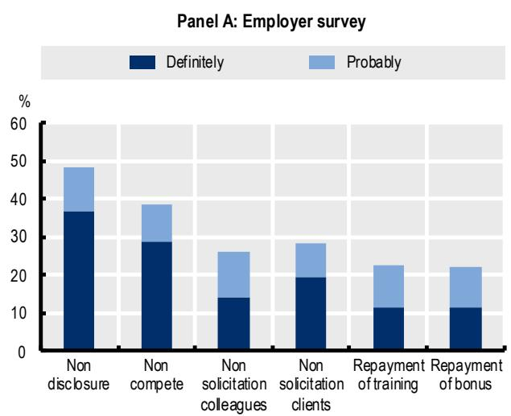  
Source: OECD employer and employee surveys on non-compete and related clauses.

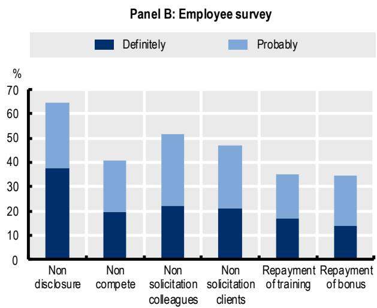

A comparison of workers with and without non-compete clauses shows that these agreements are present across all types of employees. Once industry, occupation, worker characteristics (such as education and work experience, job tenure and contract type) and employer characteristics are accounted for, there is little variation in non-compete prevalence by other demographics, including sex, ethnicity and disability. Nevertheless, when controlling for the aforementioned characteristics, non-compete clauses seem to be more common amongst immigrant workers (who are 19% more likely to be subject to a non-compete than natives) and trade union members (8% more likely to have a non-compete clause than non-members).

Non-compete clauses are only one of several contractual tools regulating post-employment conduct. Figure 1 shows that in Canada, non-disclosure agreements (NDAs) are by far the most common: employers report that almost one-half of private-sector employees are covered by an NDA. Other restrictive clauses are also relatively common: 28% of employees are covered by a non-solicitation of clients clause; 22% by a repayment of benefits or bonuses clause; 26% by a non-solicitation of colleagues clause; 22% by a training-cost repayment clause. Worker-reported figures are generally higher but show a similar ranking of clauses as well as greater uncertainty in self-reports. Importantly, reliance on such contractual restrictions in Canadian labour markets is growing. Figure 2 shows a significantly larger share of employers declaring having increased the use of each type of clause over the past five years than those declaring a decrease.

Figure 2. The use of non-compete clauses is rising in Canada  
Share of companies declaring that the use of non-compete and related clauses has increased or decreased over the last 5 years  
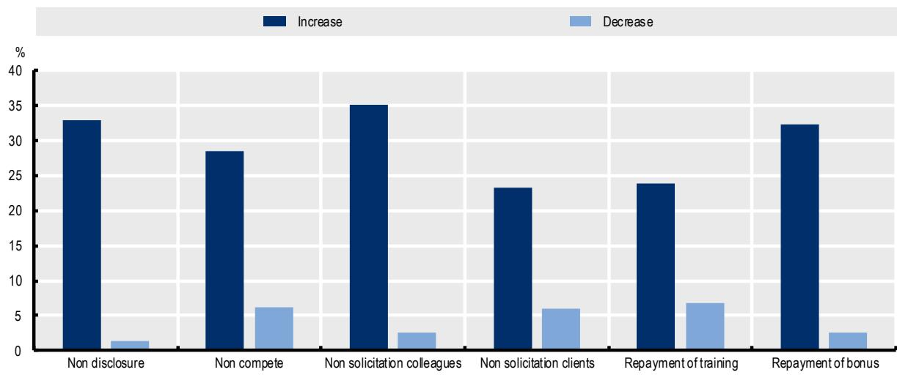  
Source: OECD employer survey on non-compete and related clauses.

## Box 3. The OECD worker and employer surveys on non-compete and related clauses

The surveys follow the methodology used in comparable exercises previously undertaken in the United States (Prescott, Bishara and Starr, 2016[2]), Australia (Buckley, Rankin and Andrews, 2024[12]; Andrews and Jarvis, 2023[13]) and Italy (Boeri, Garnero and Luisetto, 2024[14]).

## Worker survey

The worker-level survey targeted private-sector employees aged 18–64. It combined: (i) a general population sample of private-sector employees to measure the overall incidence of non-compete clauses; and (ii) a boost sample of workers known to have signed a non-compete clause, enabling detailed analysis of clause content and worker experiences. Sampling used non-probability online access panels, with respondents selected through a mix of targeted and random draws. Panels applied extensive quality-control checks to ensure respondents were real, recent and unique. The sample was stratified by age, gender and region (following official statistics), with additional efforts to balance education level and sector of employment. A pilot test preceded fieldwork. Data collection ran from 28 July to 8 September 2025, yielding 2,146 completed interviews. Post-stratification weights were constructed to align the sample to the socio-demographic profile of the target population. As with any online survey, the Canadian data may be subject to sample selection. Three potential sources are relevant: incomplete internet coverage, self-selection into online panels, and survey non-response. In practice, these risks appear limited in the Canadian context. Nearly all households in Canada have internet access, reducing concerns about digital exclusion. While panel membership may reflect unobservable characteristics, the panel used is broadly representative of the population on observable traits and is primarily designed for general consumer research rather than labour market topics, making systematic bias related to non-compete coverage unlikely. Finally, standard non-response remains a concern, but the neutral framing of the survey invitation and the very low dropout rate once questions on non-compete clauses were introduced (about 1%) suggest that selective attrition is limited.

## Employer survey

The employer-level survey targeted individuals responsible for employment contracts, retention and hiring practices in for-profit firms with five or more employees. Non-profit organisations, micro-employers (1–4 employees) and selected sectors (public administration and defence, education, health and social work, household services, and extraterritorial organisations) were excluded. The sampling frame was drawn from Dun & Bradstreet, complemented with Orbis, based on NACE codes and firm size. A stratified random sampling design was applied across 16 cells, defined by four firm-size classes (5–9; 10–49; 50–249; 250+) and four top-level NACE sector groups. The Canadian sample followed a 75% employee-proportional / 25% firm-proportional allocation. A pilot test preceded fieldwork, which ran from 24 June to 5 September 2025, resulting in 411 completed interviews. Final weights were constructed based on the stratification cells (industry and firm size). Since the employer survey is based on random sampling, the first two sources of potential selection bias discussed before – limited internet access and self-selection into online panels – do not apply. While standard non-response bias remains possible, the neutral framing of the survey invitation and the very low drop-out rate after employers were first presented with questions on non-compete clauses suggests that this risk is limited.

The two surveys have been made possible thanks to financial support from Employment and Social Development Canada (ESDC) and Coefficient Giving (formerly known as Open Philanthropy). This forms part of a wider OECD project on non-compete and related clauses, the results of which will be published in July 2026.

## 4.2. Non-compete clauses are being deployed in a fashion that is difficult to reconcile with the traditional view

A second key finding concerns the breadth with which non-compete clauses have diffused across the Canadian economy. In line with the traditional view, the prevalence of non-compete clauses is highest among managers and professionals and increases with earnings and access to confidential information. They also appear more frequently in large firms and in knowledge-intensive sectors, where firms may have a stronger need to protect legitimate business interests.

However, the surveys show that the use of non-compete clauses extends well beyond these groups. The share of low-skill or low-pay workers covered by non-compete clauses is far from negligible. Specifically:

\- Between 14 and $31\%$ of workers in non-managerial/non-professional occupations report being bound by a non-compete;

\- Between 22 and $51\%$ of workers on fixed-term contracts report a non-compete;

\- Between 15 and $26\%$ of low-pay workers (i.e. workers earning less than 3000 CAD per month, which broadly corresponds to the bottom $10\%$ of the labour income distribution) are covered;

\- Between 13 and 25% of workers with no access to confidential information nonetheless declare having signed a non-compete.

These patterns indicate that, in Canada as in several other OECD countries, non-compete clauses have spread into parts of the labour market where the traditional justification (protecting sensitive information or high-value investments) appears weak or absent.

## Figure 3. The use of non-compete clauses extends well past executives and specialized professionals in Canada

Share of workers bound by non-compete clauses

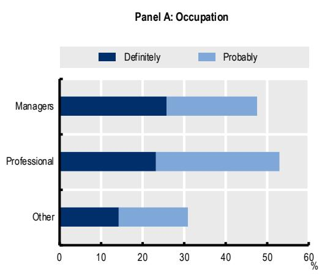  
Panel B: Monthly income (thousands of CAD)

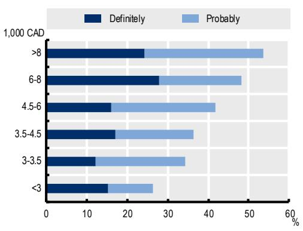

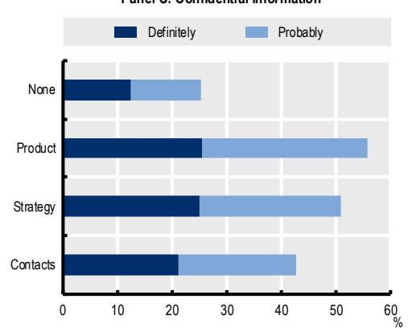

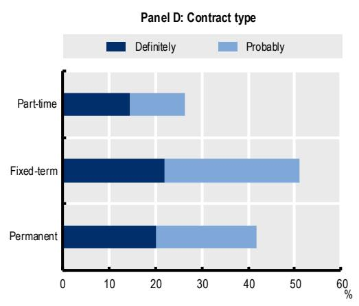

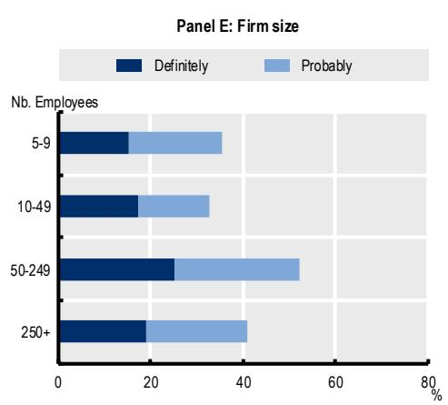  
Source: OECD employee surveys on non-compete and related clauses.

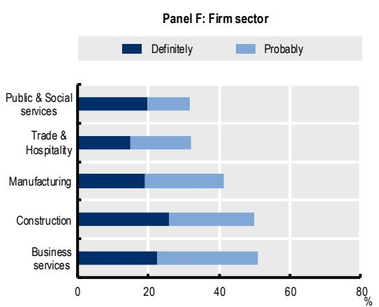

## 4.3. Restraint clauses are often bundled together and used indiscriminately

The policy debate on restrictive employment covenants typically focuses on clauses that directly limit worker mobility, such as non-compete clauses. However, as shown above, firms can use a wider set of contractual tools to protect information or deter movement (see Error! Reference source not found.) and these clauses are often used simultaneously. Among private-sector employees, 23% report not being covered by any clause, 14% are covered by one clause only (typically an NDA), 10% by two clauses, and a striking 52% by three or more clauses. This pattern closely mirrors previous findings from Australia, Italy and the United States, where bundling of restraint clauses is also common.

Figure 4. Non-compete and related clauses are frequently grouped together and applied to all workers in Canada  
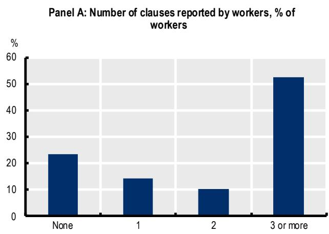

Panel B: % of clause-using firms that apply the respective clause to all their employees  
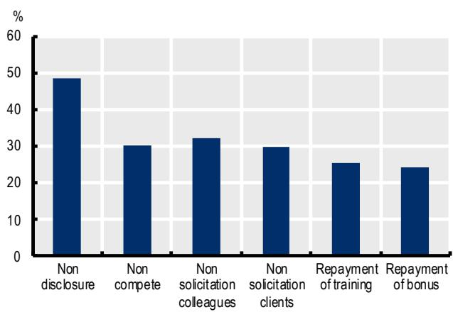  
Source: OECD employer and employee surveys on non-compete and related clauses.

Firms differ in their overall use and combination of clause types. About only 3% of firms use no restraints at all, 11% rely on one clause only (most commonly an NDA), while the rest bundle several clause types together. In addition, clauses are often applied indiscriminately across the workforce. Among firms that use non-compete clauses, 30% report applying them to all employees, regardless of role or seniority. For non-disclosure agreements the share rises to 49%, and indiscriminate use of other clauses is also relatively common. In Canada, larger firms are more likely than smaller ones to use restrictive clauses overall.

Non-compete clauses can be broad in scope and not fulfil the legal requirements, as shown by Figure 7. According to workers' reports, non-compete clauses often last for one year or less and are applicable in the region of work, but a non-trivial share apply to broader geographical areas, including the entire country or even international territories. Similarly, a number of clauses extend beyond the firm's main sector of activity. Although Canadian legislation does not require employers to provide financial compensation for a non-compete, it is noteworthy that around one-third of workers report that no compensation is foreseen for the presence of the clause (either as a top-up to the regular wage or a lump sum at the end of the employment relationship), despite the breadth of restrictions imposed. Overall, non-compete clauses in Canada can be wide in scope and are not necessarily accompanied by compensatory measures.

## 4.4. Non-compete clauses appear to deter job mobility and business creation

The evidence discussed so far shows that the prevalence of non-compete clauses is high and on the rise in Canada. But do non-compete clauses matter in practice? Are they merely an obscure but benign contractual feature, or do they impact worker and firm behaviour? Direct evidence from the surveys suggests that they do, as shown in Figure 5. Amongst workers with a non-compete clause in either their current or a previous job, over 23% report that their non-compete clause has prevented them from moving jobs; and around 12% have been stopped from opening a business. Some 23% have faced legal action in the past, and 39% of respondents say that they would turn down a future job offer if it violated their non-compete clause.

These figures, combined with the high prevalence of non-compete clauses, imply that an economically meaningful share of the entire private-sector labour force has been directly affected by non-compete clauses. Over 7% of all workers surveyed report having been stopped from moving jobs by a current or past non-compete clause while almost 4% have been stopped from opening a business, and around 7% have faced legal action. Close to 8% of all workers would not accept a competing job offer out of fear of violating a non-compete clause. These magnitudes are significant in the context of overall job-to-job transition rates (close to 6% per annum $^{5}$ ) and new business formation (around 9 per 1000 working aged people per annum in Canada $^{6}$ ). The employer-level survey lends support to these results: 61% of firms report that they would enforce their non-compete clauses if workers tried to join a competing firm. The survey evidence is consistent with previous causal evidence on the negative effect of non-compete clauses on job mobility and wages – e.g. Greenwood et al. (forthcoming $^{[15]}$ ) and Johnson et al. (2025 $^{[16]}$ ) for the United States or Young (2021 $^{[17]}$ ) for Austria.

Figure 5. Non-compete clauses could have meaningful effects on job mobility and business entry in Canada  
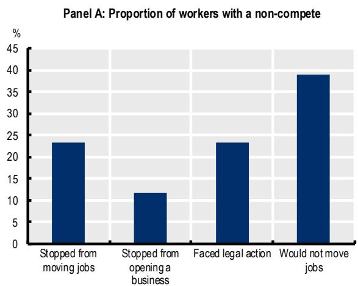

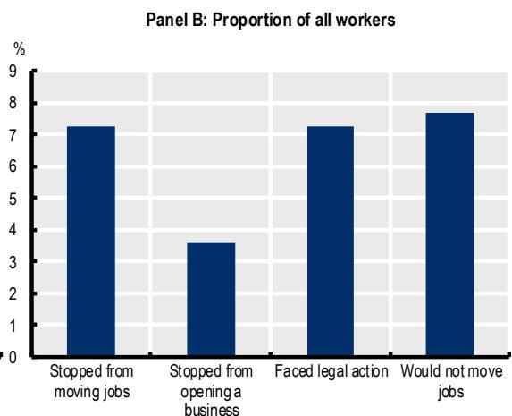  
Note: The charts display the proportion of employees who have ever been stopped from moving jobs, from starting a business or have faced legal action due to a current or a past non-compete clause. The fourth column shows the proportion of employees that would not accept a job offer if it violated their current non-compete clause. Panel A displays these statistics as a proportion of workers that definitely have a non-compete clause or have definitely had one in the past, except for the rightmost column that displays the proportion of workers who would not violate their non-compete clause as a proportion of workers that currently have a non-compete clause. Panel B shows the statistics as a proportion of all surveyed workers.

Source: OECD employee survey of non-compete and related clauses.

The survey also asked respondents to report the reason(s) why they would not be willing to accept a job offer that violated their non-compete clause. The responses are displayed in Figure 6. Many were worried about possible legal consequences or the stress of legal disputes (45%), however, fear of reputational consequences or damage to the relationship with their current employer were among the most common responses, with 52% of respondents picking at least one of these options. About 37% of respondents also indicated that honouring the clause would be “the right thing to do”. Professional, reputational and ethical reasons therefore seem as – or even more important – than the fear of legal consequences in shaping the behaviour of workers.

Figure 6. Reported reasons for complying with non-compete clause in Canada  
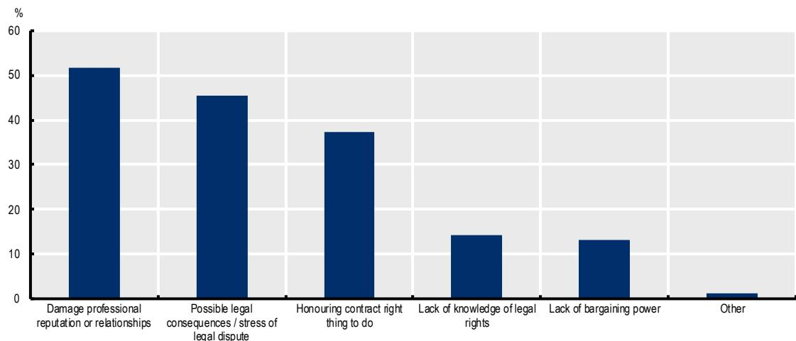  
Note: Employees who indicated that they would not accept a competing job offer if it violated their non-compete clause were asked to select reason(s) why. Respondents could select multiple reasons.  
Source: OECD employee survey of non-compete and related clauses

## 4.5. A large share of non-compete clauses appear unenforceable under Canadian law

A further concern is the prevalence of clauses that appear unenforceable. Under Canadian law, non-compete agreements must specify duration as well as their geographical or sectoral scope to be enforceable. $^{7}$ While survey responses may contain some noise, the results displayed in Figure 7 show that many clauses may not fulfil these legal requirements. Both employers and employees indicate that a sizeable share of non-compete clauses do not specify a duration or fail to define the geographical or sectoral scope. Such omissions make the clause highly unlikely to be upheld in court. Importantly, these incomplete or non-compliant clauses are not confined to a particular group of workers or firms: they are found across different sectors, occupations, firm sizes and regions. In contrast, unenforceable clauses appear more frequently in small firms. Moreover, low-skilled workers report more often to be covered by clauses that do not meet legal standards, despite being precisely the group for whom a non-compete is least likely to be justifiable. This pattern suggests that firms may be less attentive to legal compliance when the non-compete clause is unlikely to be needed to protect firm interests, such as trade secrets or investments. Instead of intending to enforce these clauses in court, firms may include unenforceable clauses in their employment contracts for other reasons, for example due to lack of resources to create more targeted clauses or to explicitly deter worker mobility. Alternatively, or additionally, low-skilled workers may be less aware of their rights or less familiar with the content of the clause they have signed. International evidence places these findings in context. In the United States, non-compete clauses are common even in states where they are formally banned (Starr, Prescott and Bishara, 2021[6]). In Italy, a large share of non-compete clauses appear to be unenforceable under existing legislation (Boeri, Garnero and Luisetto, 2024[14]). However, what shapes behaviour is often not actual enforceability but workers' perceptions about the likelihood of enforcement, the so-called in terrorem or "chilling" effect, noting that even unenforceable clauses can deter workers from changing jobs (Starr, Prescott and Bishara, 2020[18]; Prescott and Starr, 2021[19]).

Consistent with this, Figure 8 shows that non-compete clauses that are unlikely to be upheld in court can still impact worker behaviour. The dark blue bars display the share of workers who say they would not accept a competing job offer in the future that violates their non-compete clause. This share is even higher (over 40%) among those covered by a non-compete clause that is unlikely to be upheld in court, in comparison to those covered by a potentially valid one (33%). At the same time, the light blue bars in Figure 8 show that employees with valid clauses are much more likely to report having been prevented from moving to another job or from opening a business in the past (50%). One reason for this could be that employers are more likely to enforce non-compete clauses that are likely to be valid. Nevertheless, 27% of workers with likely unenforceable clauses still report having been stopped from moving to or starting a competing business because of their non-compete clause.

In addition, as demonstrated by Figure 6, many workers fear not only legal consequences if they were to violate their non-compete clause, but also potential damage to professional relationships or reputation, amongst other non-legal reasons. Taken together, this evidence helps to reconcile the findings that a large share of workers has been directly affected by non-compete clauses, while many clauses appear unenforceable. The economic impact of non-compete clauses therefore cannot be assessed solely on the basis of their formal validity because employees may interpret them differently and act accordingly.

Figure 7. Non-compete clauses can be expansive in scope and fall short of legal requirements in Canada

Panel A: Share of non-compete agreements specifying compensation/duration/scope  
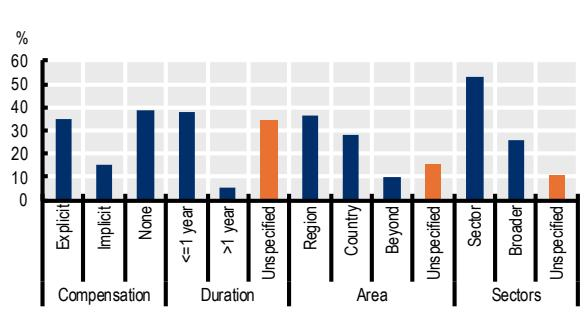

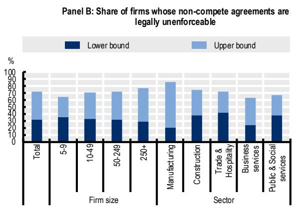

Note: In Panel A, columns do not sum to 100% because ‘Don’t know/Prefer not to answer’ responses are not shown. The bars highlighted in orange show the contractual features which make a non-compete likely unenforceable (unspecified duration, or unspecified geographic and sectoral scope). In Panel B, the lower bound classifies all clauses used by a firm as likely to be upheld by courts if the firm “sometimes” includes the required conditions. For the upper bound, only firms that “always” include all required conditions are classified as having enforceable non-compete clauses.

Source: Panel A: OECD employee surveys on non-compete and related clauses. Panel B: OECD employer surveys on non-compete and related clauses.

Figure 8. Employees often believe non-compete clauses are binding even when they fall short of legal requirements in Canada

Share of employees bound by a non-compete clause, by the likelihood to be upheld in court of the clause

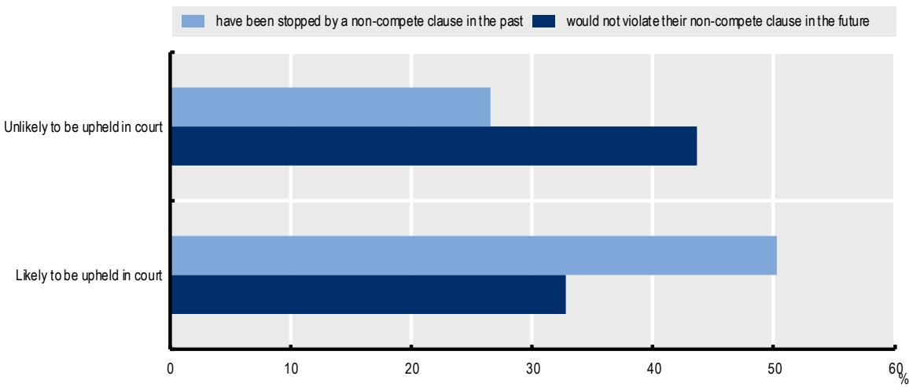  
Note: "Likely / unlikely to be upheld in court" refers to whether the non-compete clause meets the legal requirements for enforceability in the worker's jurisdiction (e.g. scope, duration, compensation). Light blue bars show the share of employees who report having been prevented in the past from moving to a competing job or starting a competing business because of their clause (the survey asked employees if they have previously been stopped from moving jobs or from opening a competing business because of their non-compete clause). Dark blue bars show the share who say they would not accept a competing job offer that violates their clause in the future (employees were asked if they would accept a job offer even if it violated their non-compete clause). Reading example: among employees who's non-compete clause is unlikely to be upheld in court, 27% report having been stopped in the past and 44% say they would not violate it in the future.
Source: OECD employee surveys on non-compete and related clauses.

## 4.6. There is evidence of (firm-to-firm) no poaching and wage fixing agreements

The survey evidence also raises concerns about the potential presence of firm-to-firm no-poaching and wage-fixing agreements in Canada. No-poaching agreements involve employers agreeing not to recruit each other's employees. These can take different forms: pure no-hire agreements, where employers agree not to hire workers from other parties to the agreement, either actively or passively; or non-solicit or no-cold-calling agreements, where employers commit not to actively approach another firm's employees with job offers. Wage-fixing agreements involve employers agreeing to set wages or other forms of compensation or benefits at certain levels.

Since June 2023, Canada has introduced criminal prohibitions on wage-fixing and no-poach agreements between employers, establishing penalties that include imprisonment and fines without statutory limits (with some exceptions in the case of subsidiaries under the same corporate group). In light of the sensitive nature of these questions, the employer survey did not ask firms directly whether they engaged in them. Instead, respondents were asked whether they were aware of such practices in their industry.

The results suggest that these practices may be more prevalent than expected: almost half of surveyed firms report knowledge of either no-poaching, wage-fixing, or both occurring within their industry. This does not imply that half of firms engage in these practices themselves. High reported awareness may reflect a small number of cases within each sector that are well known to industry participants. Nevertheless, the responses indicate that such agreements are likely to be relatively widespread, particularly in service sectors. This is confirmed by what employees report: 17% of employees report having been prevented from moving to another company because of a no-poaching agreement between your employer and another company. Further 25% declare to have heard of such practices.

These findings, while at this stage essentially suggestive, align with the increasing attention that the Canadian Competition Bureau has devoted to labour market conduct. In 2023, the Competition Bureau issued guidelines, providing clarity on the application of Canada's new criminal prohibitions on wage-fixing and no-poach agreements, outlining the scope of the offence, applicable exceptions and the Bureau's enforcement priorities.

Figure 9. Knowledge of no-poaching or wage fixing agreements is widespread in Canada
Share of companies reporting knowledge of no-poaching or wage fixing agreements in their industry  
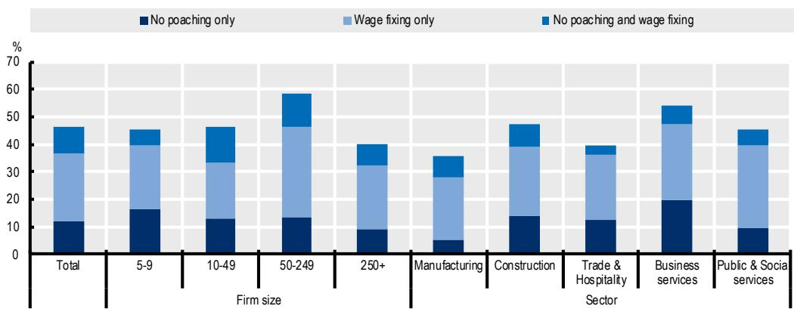  
Source: OECD employer survey on non-compete and related clauses

## 5. Concluding remarks

The evidence presented in this note shows that non-compete and related clauses included in individual employment contracts are relatively common in Canada, often in ways that go beyond the traditional rationale for their deployment. As found in other OECD countries before (Andrews and Garnero, 2025[3]), their prevalence is high and appears to be rising. Such clauses are used not only for managers, highly skilled workers and those with access to confidential information, but also for low-skilled and low-paid workers, for whom such restrictions appear more difficult to justify. Firms frequently bundle multiple restraint clauses together and, in many cases, apply them indiscriminately across their workforce. Moreover, a significant share of non-compete clauses appear to be overly broad or incomplete, raising questions about their enforceability under Canadian law. Separately, and distinct from contractual non-compete clauses, the survey evidence also points to the presence of firm-to-firm practices – such as no-poaching and wage-fixing agreements – that restrict competition for labour between companies, underscoring the importance of ongoing antitrust scrutiny.

Except for Ontario, Canada continues to rely largely on case-by-case judicial interpretation to govern non-compete clauses. Survey evidence indicates that both employers and workers often have an incomplete understanding of the legal requirements and limitations associated with these clauses. The federal government's May 2026 proposal to restrict the use of non-compete clauses to senior executives in federally regulated private sectors would mark a shift away from reliance on case law towards a clearer statutory prohibition model, similar to approaches adopted in several other OECD countries and US states. However, clear guidance and accessible information for both firms and workers will remain important to ensure that the rules are properly understood and applied, particularly given evidence that even unenforceable clauses may deter worker mobility. At the same time, restrictions on worker mobility arising from agreements between firms fall within the scope of competition policy and require continued monitoring and enforcement by the Competition Bureau.

## References

Andrews, D. et al. (2026), “The regulation of non-compete clauses across OECD countries”, [11] OECD Publishing, Paris.

Andrews, D. and A. Garnero (2025), “Five facts on non-compete and related clauses in OECD countries”, OECD Economics Department Working Papers, No. 1833, OECD Publishing, Paris, https://doi.org/10.1787/727da13e-en.

Andrews, D. and B. Jarvis (2023), The Ghosts of Employers past: How Prevalent Are Non-Compete Clauses in Australia?, e61 Micro Note. [13]

Angus Reid Institute (2023), Labour Mobility: By two-to-one margin, Canadians support banning non-compete clauses, Angus Reid Institute. [5]

Boeri, T., A. Garnero and L. Luisetto (2024), “Noncompete agreements in a rigid labor market: the case of Italy”, The Journal of Law, Economics, and Organization, Vol. 41/3, pp. 930-958, https://doi.org/10.1093/jleo/ewae012.

Buckley, J., E. Rankin and D. Andrews (2024), Non-compete clauses, job mobility and wages in Australia, e61 Research Note. [12]

Causa, O., N. Luu and M. Abendschein (2021), “Labour market transitions across OECD countries: Stylised facts”, OECD Economics Department Working Papers, No. 1692, OECD Publishing, Paris, https://doi.org/10.1787/62c85872-en.

Davis, S. and J. Haltiwanger (2014), Labor Market Fluidity and Economic Performance, National Bureau of Economic Research, Cambridge, MA, https://doi.org/10.3386/w20479. [8]

Greenwood, B., B. Kobayashi and E. Starr (forthcoming), “Can You Keep a Secret? Banning Noncompetes Does Not Increase Trade Secret Litigation”, Journal of Law, Economics, and Organization. [15]

Harris, J. (2021), “Unconscionability in Contracting for Worker Training”, Alabama Law Review, Vol. 72/4, pp. 723-783. [10]

Hrdy, C. and C. Seaman (2024), “Beyond Trade Secrecy: Confidentiality Agreements That Act Like Noncompetes”, 133 Yale Law Journal. [9]

Johnson, M., K. Lavetti and M. Lipsitz (2025), “The Labor Market Effects of Legal Restrictions on Worker Mobility”, Journal of Political Economy, Vol. 133/9, pp. 2735-2793, https://doi.org/10.1086/736217.

Moscarini, G. and F. Postel-Vinay (2016), “Wage Posting and Business Cycles”, American Economic Review, Vol. 106/5, pp. 208-213, https://doi.org/10.1257/aer.p20161051. [7]

OECD (2025), OECD Compendium of Productivity Indicators 2025, OECD Publishing, Paris, [1] https://doi.org/10.1787/b024d9e1-en.

Prescott, J., N. Bishara and E. Starr (2016), “Understanding Noncompetition Agreements: The 2014 Noncompete Survey Project”, Michigan State Law Review, Vol. 2, pp. 369-464.

Prescott, J. and E. Starr (2021), “Subjective Beliefs about Contract Enforceability”, SSRN Electronic Journal, https://doi.org/10.2139/ssrn.3873638. [19]

Starr, E. (2026), “The Economics of Noncompete Clauses”, Journal of Economic Perspectives, Vol. 40/1. [4]

Starr, E., J. Prescott and N. Bishara (2021), “Noncompete Agreements in the US Labor Force”, The Journal of Law and Economics, Vol. 64/1, pp. 53-84, https://doi.org/10.1086/712206.

Starr, E., J. Prescott and N. Bishara (2020), “The Behavioral Effects of (Unenforceable) Contracts”, The Journal of Law, Economics, and Organization, Vol. 36/3, pp. 633-687, https://doi.org/10.1093/jleo/ewaa018. [18]

Vincent, N. (2026), Canada's labour market: between cycles and structural change, [21] https://www.bankofcanada.ca/2026/05/canadas-labour-market-between-cycles-structural-change.

Young, S. (2021), “Noncompete Clauses, Job Mobility, and Job Quality: Evidence from a Low-Earning Noncompete Ban in Austria”, SSRN Electronic Journal, https://doi.org/10.2139/ssrn.3811459. [17]