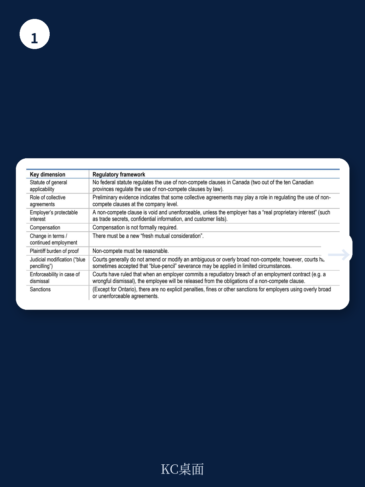

# 经合组织：加拿大竞业限制条款法律脆弱但约束力强

加拿大劳动力市场正在面对一个被低估的结构性问题：竞业限制条款的覆盖面远超合理范围，且其实际约束力并不完全依赖法律可执行性。经合组织最新工作论文基于对加拿大工人和企业的专项调查，首次系统呈现了这一现象的规模与机制。

调查覆盖了加拿大私营部门工人，结果显示29%至39%的工人受到竞业限制条款约束，且这一比例仍在上升。更值得关注的是，这些条款并非集中在高管或核心技术岗位——低薪工人、固定期限合同工、甚至无法接触商业机密的岗位同样频繁出现。报告指出，超过一半受约束的工人同时被施加三项或以上的限制性条款，许多企业将其不加区分地应用于全体员工。

> **KC评论：** 这里的核心矛盾在于，竞业限制的传统正当性——保护商业秘密和培训研究——在低薪和低技能岗位几乎不成立。但企业仍然广泛使用，说明其真实动机更接近降低员工流动率，而非保护商业利益。

调查还揭示了行为因素在条款执行中的放大效应。约7%的工人表示曾因竞业限制被阻止更换工作，4%被阻止创业。但报告特别强调，许多条款在加拿大法律框架下可能无法执行——它们缺乏明确的期限、地域范围或补偿安排。然而工人仍然选择遵守，原因包括对声誉的担忧、对合同效力的误判，以及道德层面的自我约束。

## 1. 条款的“法律脆弱性”并未削弱其实际约束力

报告对条款内容进行了法律合规性分析。大量竞业限制条款在加拿大法律下存在明显缺陷：没有明确的时间限制，没有地理范围界定，也没有提供任何补偿。在安大略省，2021年已立法禁止对普通员工使用竞业限制，仅允许高管和业务出售场景例外。但即便如此，调查显示工人对这些条款的认知仍然模糊——许多人认为即使条款在法律上站不住脚，自己仍然有义务遵守。

这种“寒蝉效应”意味着，即使政策层面收紧，只要工人和企业对条款的理解存在信息不对称，实际约束力就不会自动消失。报告建议，除了立法禁止，还需要配套的透明度和信息指引，帮助工人识别哪些条款不具备法律效力。

## 2. 企业间的“互不挖角”协议同样值得关注

除了雇佣合同中的限制条款，报告还首次系统调查了企业之间的限制性安排。相当比例的雇主承认了解或参与过“互不挖角”或“工资固定”协议。这类协议不写入个人合同，而是企业之间直接约定不互相招聘对方员工，或协调薪酬水平。

这类行为在加拿大竞争法框架下属于反竞争行为，但实际监管难度较大。报告认为，竞争局需要持续关注这类隐性安排，因为它们对劳动力市场流动性的损害可能比个人合同条款更为隐蔽和系统。

## 3. 联邦层面的政策转向正在酝酿

2026年5月，加拿大联邦政府提出在联邦监管行业（如银行、电信、跨省运输）限制竞业限制条款的使用，仅允许高管保留。这一提案标志着从依赖个案司法审查向明确法定禁止的转变。但报告同时提醒，即使立法到位，如果企业和工人对规则的理解仍然有限，实际效果可能打折扣。

> **KC评论：** 从国际经验看，加州等全面禁止竞业限制的地区并未出现商业秘密诉讼激增，说明保护商业秘密可以通过更精准的保密协议实现。加拿大如果推进改革，可以参考这一路径，但关键在于执行和信息普及。

整体来看，这份报告揭示了一个容易被忽视的结构性问题：劳动力市场的流动性不仅受宏观宏观环境影响，也受合同条款的隐性约束。竞业限制条款的广泛使用，可能正在拖慢人才向更高生产率岗位的再配置，而这恰恰是加拿大乃至许多OECD国家生产率增长节奏变化的一个微观解释。

For informational purposes only. Portions may be generated,translated,summarized,or edited with AI assistance based on source materials and may contain omissions or errors. Please verify independently. This is not investment,legal,tax,accounting,or other professional advice.

