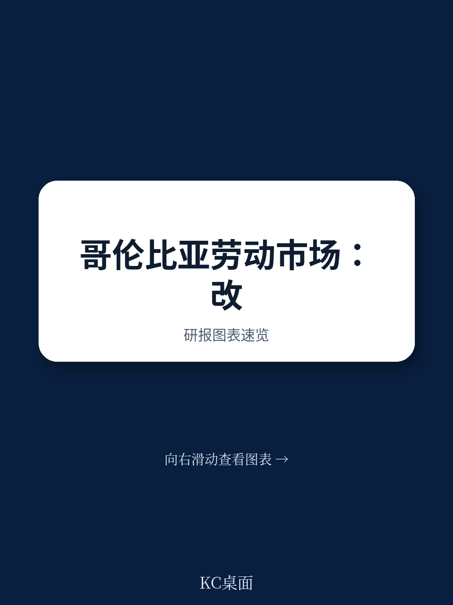
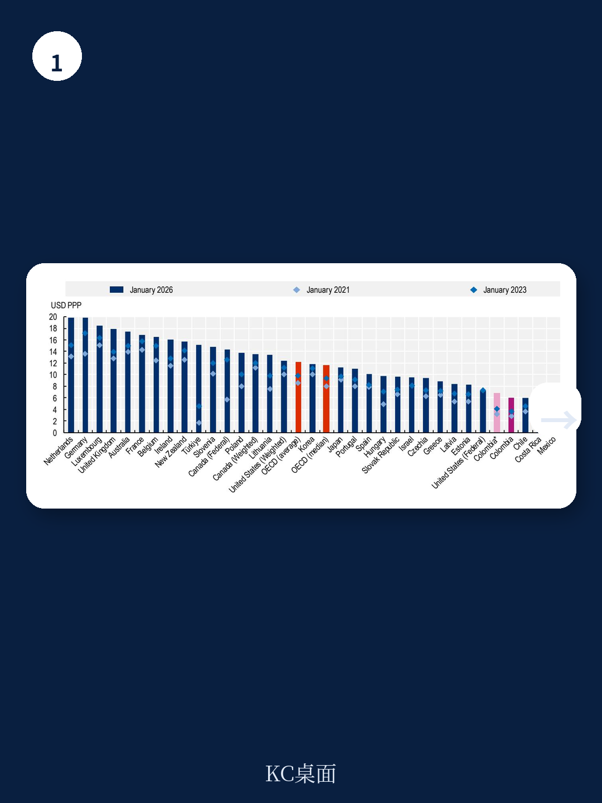
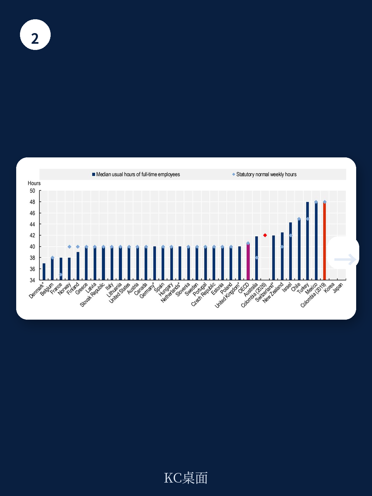

# 经合组织：哥伦比亚劳动市场与社会政策评估

哥伦比亚的劳动市场在过去十年取得了显著进步，但这份经合组织2026年发布的评估报告揭示了一个关键矛盾：2025年通过的综合劳动改革大幅提升了合规标准，但结构性挑战——尤其是高昂的正式用工成本——并未得到有效解决，反而可能加剧了非正规就业的停滞。报告数据显示，截至2025年底，仍有57%的劳动者未缴纳养老金，这一比例在农村地区高达84%。改革带来的成本上升，正在抵消制度进步带来的正面效应。

## 1. 非正规就业的停滞：改革未能触及成本核心

报告明确指出，非正规就业率自2024年中以来已停止下降。2025年通过的劳动改革虽然在工时、合同类型等方面向经合组织标准靠拢，但并未降低企业雇佣正式员工的门槛。相反，改革增加了带薪休假、加班补偿等条款，直接推高了劳动成本。报告认为，只要正式用工的成本高于非正规渠道，企业就有动力规避合规。农村地区84%的非正规率，恰恰说明改革在覆盖最脆弱群体方面存在盲区。这意味着，未来政策的重心需要从“加码合规”转向“降低合规成本”，否则非正规就业的存量问题将持续存在。

> **KC评论：** 这张图（图2.1）显示的非正规率停滞，是理解整份报告的关键。它说明，单纯依靠法律条文来“管住”企业，效果有限。真正需要回答的问题是：如何让雇佣一个正式员工，比雇佣一个非正式员工更划算？报告没有给出答案，但指出了这个方向。

## 2. 劳动监察：资源瓶颈与效果之间的剪刀差

劳动监察部门在过去两年取得了显著进展：针对少数标志性案件的专项检查增加，罚款金额和收缴率均有所提升。SISINFO电子案件管理系统的升级，以及FIVICOT产品的整合，提高了行政效率。然而，结构性制约同样突出。自2022年以来，监察员数量持续下降，虽然计划招聘新员，但当前水平仍低于国际基准。预算约束限制了运营能力。更值得关注的是，尽管检查次数增加，但调查和制裁程序的数量在过去十年大幅下降。这形成了一个“高检查、低处罚”的剪刀差，削弱了执法的威慑力。报告建议，未来必须持续投入人力和财力，并加强预防性执法与纠正性执法的协同。

## 3. 集体谈判：最低工资的“锚”正在偏离其功能

哥伦比亚的工会密度仅为4.7%，是经合组织国家中最低的之一。尽管2024年和2026年分别出台了公共和私营部门的新规，试图建立“行业+企业”两级谈判框架，但集体协议覆盖率依然极低。一个更突出的问题是最低工资。2026年1月，哥伦比亚将法定最低工资提高了23%，远超通胀、生产率和宏观环境增长的支撑，甚至超过了雇主和工会的提案。这一调整与国际劳工组织的“生活工资”估算接近，但报告指出，其减贫效果有限，因为大多数工作贫困人口处于非正规部门。更关键的是，最低工资与中位工资的比率已升至经合组织最高水平，这压缩了工资差距，可能进一步抑制正式雇佣。最低工资正在从“安全网”变为“天花板”，扭曲了劳动力市场的定价机制。

## 4. 工会成员安全：进步与隐忧并存

在保护工会成员免受暴力侵害方面，哥伦比亚取得了实质性进展。总检察长办公室采取了更制度化的策略，包括案件优先排序、设立专门部门以及加强机构间协调。保护计划的资源得以维持，集体保护机制也有所扩大。公共秩序管理改革，包括将原ESMAD改组为对话与秩序维护单位，旨在减少抗议中的过度武力。然而，2025年仍有12名工会成员被杀害，较前两年有所增加。威胁依然存在。报告强调，不仅要追查行凶者，更要识别幕后主使，并评估现有法律程序（如强制调解阶段）的有效性。安全环境的改善，是集体谈判制度能否真正运转的前提条件。

> **KC评论：** 报告将“工会成员安全”单独成章，说明这不仅是人权问题，更是劳动力市场制度有效性的基础。没有安全的组织环境，任何关于集体谈判的设计都只是纸上谈兵。这一点，对于理解哥伦比亚劳动改革的整体逻辑至关重要。

这份报告的核心贡献在于，它没有停留在“改革是否进步”的简单判断上，而是揭示了进步背后的结构性代价。哥伦比亚的劳动改革正在经历一个“合规成本上升”与“非正规就业固化”并存的阶段。未来的政策选择，将决定这个南美国家能否真正跨越中等收入陷阱，建立起一个既有竞争力又有包容性的劳动力市场。

For informational purposes only. Portions may be generated,translated,summarized,or edited with AI assistance based on source materials and may contain omissions or errors. Please verify independently. This is not investment,legal,tax,accounting,or other professional advice.

