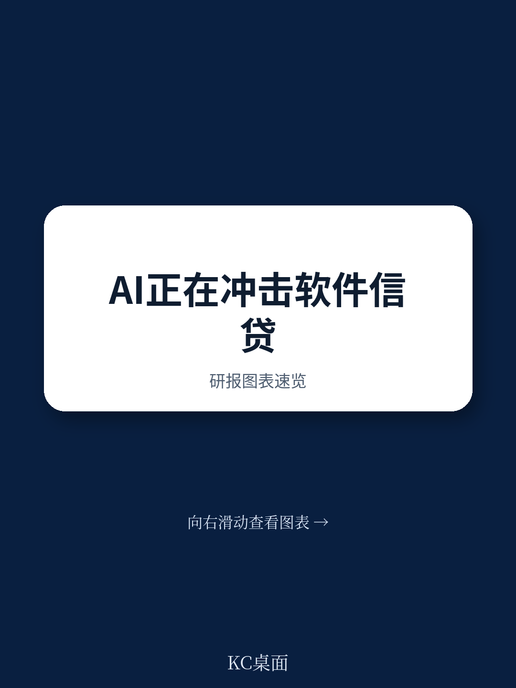
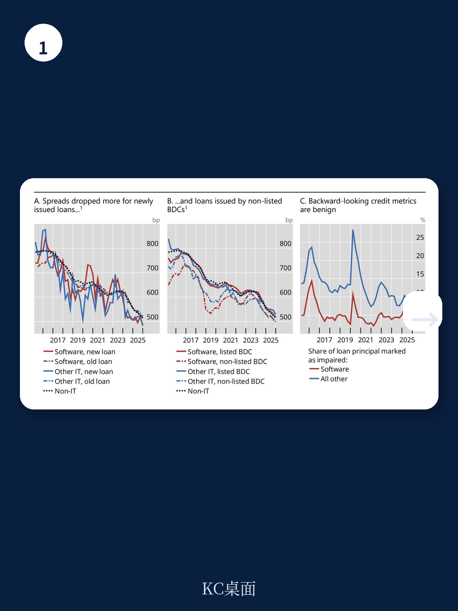
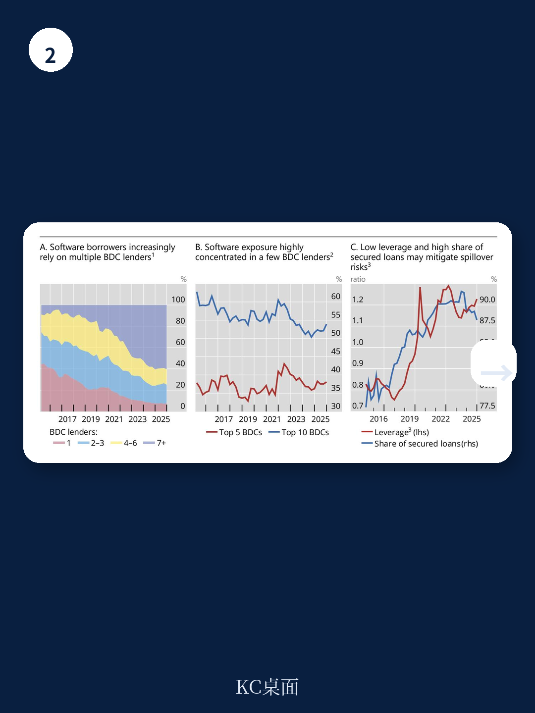

# 国际清算银行：AI颠覆私人信贷中的软件企业敞口

私人信贷市场正在积累一个不易察觉的不确定性敞口：软件行业贷款。国际清算银行最新发布的专题报告，以美国商业发展公司为样本，揭示了一个令人不安的事实——直接贷款机构对软件企业的贷款总额已达约1150亿美元，占其全部贷款的五分之一，更占其科技组合的80%以上。而生成式人工智能正在从产品替代和成本压缩两个方向，直接冲击这些借款企业的现金流确定性。

报告的核心判断是：当前信用指标和定价信号均未显示不确定性，但这可能只是表象。软件贷款的利差与其他行业贷款已基本趋同，上市BDC的估值也未因软件敞口大小而分化。换句话说，市场尚未对AI带来的不确定性进行差异化定价。

> **KC评论：** 报告的核心洞察不在于“不确定性有多大”，而在于“不确定性为何未被定价”。它提醒读者，当一种系统性冲击尚未在滞后指标中显现时，定价信号可能正在制造虚假的安全感。

## 1. 软件贷款规模已大到不能忽视，但不确定性定价却毫无区分

过去十年，BDC的科技贷款从零增长至近1400亿美元，其中软件占比超过80%。这一趋势与美国宏观环境中IT行业相对稳定的产出份额形成鲜明对比。报告指出，软件曾是现金流最可靠的行业之一——订阅制收入、高毛利、低资本需求——这使得它成为直接贷款机构理想的放贷对象。

但生成式AI正在改变这一前提。AI工具可以直接替代部分软件产品，也可以降低开发成本、加剧竞争、压缩利润率。无论哪种路径，借款企业的现金流不确定性都在上升。然而，截至2025年底，软件贷款的信用利差与其他行业贷款已基本持平，新发放贷款的利差甚至下降得更快。非上市BDC发放的贷款利差更低，而这一部分恰恰是市场监督最薄弱的环节。

报告还发现，不到1%的软件贷款出现逾期，这一比例甚至低于其他行业贷款。但报告提醒，这些指标是向后看的，且由管理人自行评估。收入冲击转化为实际违约需要时间，而实物支付安排可以进一步推迟违约信号的出现。

## 2. 股权市场已给出信号，但BDC读者尚未跟进

一个值得注意的对比是：软件公司的公司估值已经反映了AI冲击。自2022年11月ChatGPT发布以来，软件板块相对科技大盘的估值溢价持续收窄，到2025年底已转为折价。但BDC的估值并未出现类似分化——高软件敞口和低软件敞口的BDC，其价格/股息比率几乎一致。

报告给出了两种可能的解释。乐观的看法是，BDC只向基本面与其它借款人一致的软件企业放贷，因此相同利差是合理的。另一种可能性是，私人信贷市场的长期繁荣导致竞争加剧、放贷标准松动，不确定性被系统性低估。如果是后者，一旦冲击发生，损失将是相关的、集中的，且可能伴随突然的重新定价。

## 3. 集中度、利差压缩和透明度不足构成三重隐患

即便当前指标无虞，报告识别了三个结构性脆弱点。

第一，利差压缩侵蚀了吸收损失的缓冲。软件贷款的利差不仅没有因AI不确定性上升而扩大，反而收窄了。这意味着，如果信用质量出现变化，贷款利息收入几乎没有回旋余地。

第二，敞口在借款人和贷款人两端都高度集中。约60%的软件贷款流向同时从7家以上BDC借款的企业，这意味着一个行业冲击会同时出现在多个资产负债表上。同时，前五大BDC持有约37%的软件贷款，前十大持有超过一半。损失将集中在少数机构。

第三，非上市BDC的流动性不确定性可能被低估。约四分之一的软件贷款由非上市BDC持有，其读者只能通过赎回退出。季度赎回上限通常设定为管理资产的5%，但报告引用的研究表明，现金缓冲和贷款还款通常不足以支撑连续5%的赎回。2026年初，一家大型非上市BDC首次突破赎回上限，说明这种结构性脆弱在风平浪静时也可能爆发。

> **KC评论：** 报告最值得关注的不是BDC本身，而是它作为“可见部分”所反映的更大问题。私人信贷中更不透明的部分——那些不受SEC披露要求的产品——可能积累了类似的软件敞口，而它们与银行和其他贷款人的关联更难追踪。真正的系统性不确定性可能藏在那里。

## 4. 一个可复用的观察框架：当不确定性定价信号与基本面信号背离时

这份报告提供了一个可以迁移到其他市场的分析框架：当一种系统性冲击（如AI、监管变化、地缘政治）正在改变某个行业的基本面时，如果信用市场没有做出差异化定价，读者应该追问三个问题。

第一，滞后指标是否在制造假象？当前逾期率、违约率等指标是向后看的，而冲击的影响需要时间传导。实物支付安排、展期等结构可以进一步延迟信号的出现。

第二，股权市场和信用市场为何出现分歧？如果公司已经重新定价而信用没有，可能是信用市场的定价机制不同（如持有到期、盯市频率低），也可能是信用市场正在犯错误。

第三，集中度和透明度是否放大了尾部不确定性？即使平均不确定性可控，如果敞口集中在少数机构，且这些机构的透明度有限，那么一个尾部事件可能通过不透明的渠道扩散。

这份报告没有给出“AI将导致私人信贷扰动”的结论。它只是冷静地指出：不确定性在积累，但市场尚未定价。对于关注私人信贷市场的读者而言，这本身就是一个值得警惕的信号。

For informational purposes only. Portions may be generated,translated,summarized,or edited with AI assistance based on source materials and may contain omissions or errors. Please verify independently. This is not investment,legal,tax,accounting,or other professional advice.

