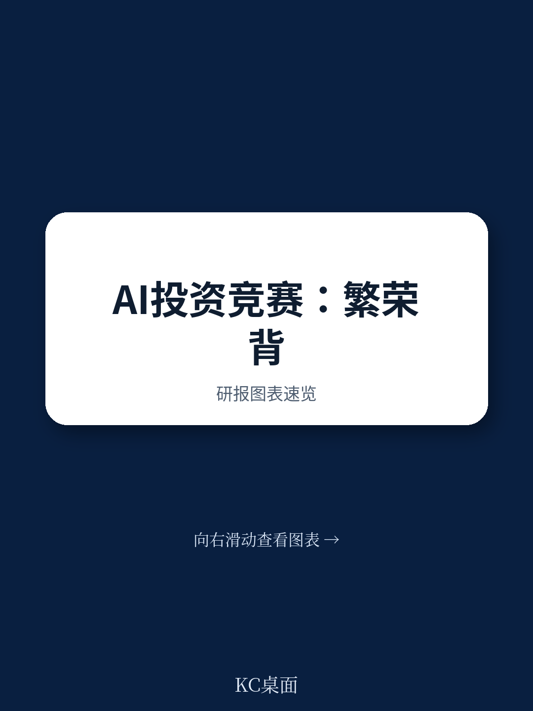
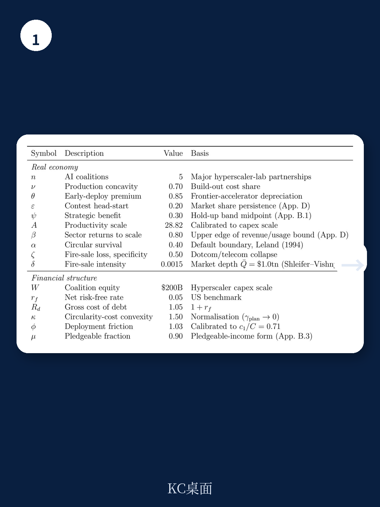
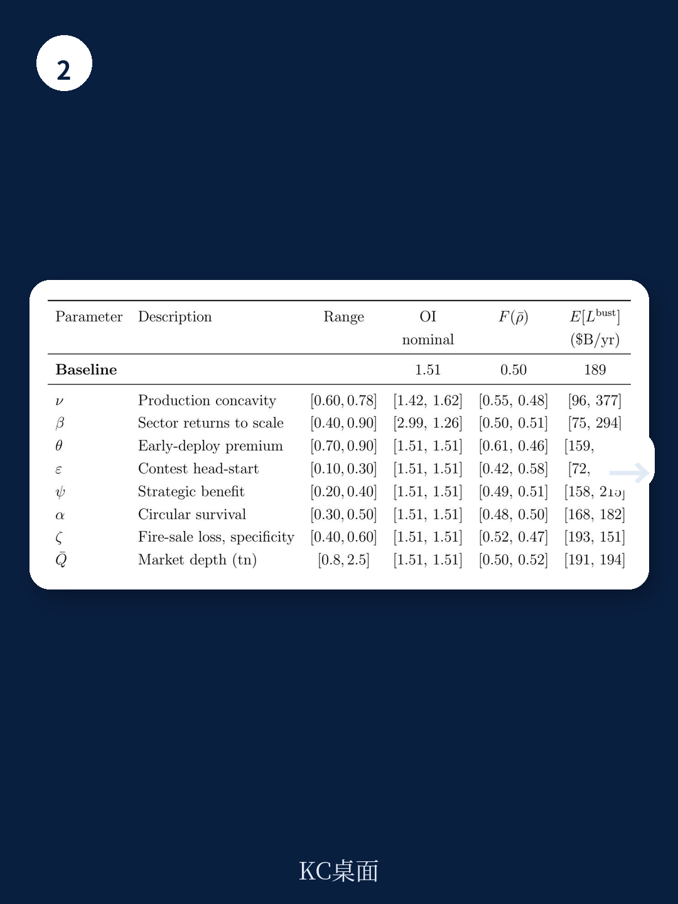

# 国际清算银行：AI投资竞赛-7000亿美元资本开支

2026年全球AI基础设施资本开支预计将突破7000亿美元，未来几年累计研究可能达到数万亿美元。规模本身不是问题——真正令人不安的是这笔钱如何被花掉、如何被借来、以及一旦收入不及预期会发生什么。

国际清算银行（BIS）最新工作论文《The AI Investment Race》构建了一个动态竞赛模型，试图回答一个核心问题：当几家巨头为争夺少数几个赢家通吃的席位而竞相投入时，整个系统的脆弱性从何而来，又有多大。

答案并不令人安慰。模型显示，当前的AI研究规模已经超出社会最优水平约1.5倍，在需求弹性较低的情景下甚至可能达到3倍。更关键的是，这场竞赛的结构性特征——早期投入的不可逆性、债务融资的依赖、以及通过股权交叉持有形成的“循环融资”——使得泡沫越大，破裂时的破坏就越深。

## 1. 竞赛逻辑导致过度投入，且规模越大越难自我维持

这篇论文的核心机制建立在一个简单的洞察上：当只有少数几个赢家能瓜分大部分市场回报时，每个参与者都有动机投入远超社会最优水平的资源。这不是因为对AI前景过度乐观，而是因为每一块钱的边际回报中，有一部分是从竞争对手那里抢来的份额，而非新增产出。

模型将这一过程动态化。企业在第一期投入大量资本建设算力基础设施，这部分投入一旦沉没，就面临第二期生产力参数的不确定性。如果AI生产力低于预期，整个系统就面临产能过剩和资产减值。论文的关键发现是：生产力必须达到的“及格线”会随着研究规模上升而上升——这意味着越大的泡沫，越容易自我击穿。

校准结果显示，在基准参数下，竞赛外部性导致的过度研究约为社会最优水平的1.5倍。如果AI服务需求弹性较低——即市场对算力扩张的吸收能力有限——这一倍数可能升至3倍左右。

> **KC评论：** 这里容易被忽略的是“需求弹性”这个变量。模型假设AI服务的需求并非无限，而是存在饱和边界。如果企业预期的AI应用场景（如企业级软件、广告、自动驾驶）实际落地速度慢于算力扩张，那么过度研究的不确定性会急剧放大。这不是一个关于技术是否伟大的问题，而是一个关于时间错配的问题。

## 2. 债务与循环融资放大了脆弱性，而非分散了不确定性

当前AI研究的融资结构有两个显著特征。其一是债务依赖：尽管主要云服务商持有大量现金，但快速扩张的资本开支已迫使部分企业通过债券发行、特殊目的载体和非银贷款来融资。其二是所谓的“循环融资”：一家建设基础设施的企业向AI实验室投入股权，作为交换，实验室承诺未来购买算力。

模型揭示了这种结构的双重作用。一方面，它确实推动了更大规模的资本部署；另一方面，它创造了资金互联性——一家企业的不确定性可以通过股权链条传导至其他企业。论文特别指出，循环融资中的股权交叉持有并不能分散不确定性，反而成为不确定性传导的通道。

当债务融资的资本是高度专业化的（如专用芯片、数据中心），一旦行业同步调整，这些资产只能进入流动性极薄的二手市场，回收率会随着整个行业的负债水平上升而下降。企业虽然预见到这种“甩卖”不确定性并会相应减少借贷，但竞赛动机仍然使它们过度建设。

模型估算，一旦累计研究规模达到约3万亿美元，整个行业的预期净宏观环境盈余（总产出减去资本成本）将转为负值。而行业普遍预期的未来几年总研究在3至4万亿美元之间——这意味着系统已经进入了显著的节奏变化不确定性区域。

## 3. 网络分析揭示：单一企业的不确定性可能演变为系统性不确定性

论文在基准模型之外，进一步放松了“联盟”假设，考虑了超大规模云服务商、AI实验室、芯片公司和“新云”之间的双边资金联系。一个此前未被充分讨论的脆弱性由此浮现：冲击可以通过股权网络级联放大。

具体机制如下：一家超大规模云服务商持有其研究的AI实验室的股权。如果其中一家实验室失败，该服务商的资产负债表将受到冲击，进而可能被迫从其他实验室撤资，将不确定性进一步扩散。这种级联效应的范围会随着建设规模的扩大而扩大，也会随着资金集中在连接多个实验室的“枢纽”服务商身上而扩大。

论文引用了公开的股权和算力购买承诺数据，绘制了当前AI领域的资金网络图。虽然这些数据本身并非机密，但将其纳入一个系统性不确定性框架进行分析，是这篇工作论文的独特贡献。

> **KC评论：** 网络分析的关键不在于识别“哪家公司最脆弱”，而在于揭示一个结构性问题：当融资结构将多家公司的命运捆绑在一起时，任何单一节点的失败都可能触发连锁反应。这不同于传统的“大到不能倒”，而是“连接得太紧而不能倒”。对于关注AI基础设施研究的决策者来说，这意味着需要从系统层面审视融资结构的集中度和互联性，而非仅关注单家公司的资产负债表。

## 4. 一个可复用的观察框架：从融资结构反推系统韧性

这篇论文提供了一个可供产业观察者和政策制定者使用的分析框架。核心变量有三个：研究规模相对于社会最优水平的偏离程度、债务在融资结构中的占比、以及循环融资形成的网络连接密度。

当这三个变量同时处于高位时，系统进入脆弱区间。论文的校准结果显示，当前AI研究已经处于这一区间。但这并不意味着必然发生扰动——生产力参数仍有可能高于预期，从而消化过剩产能。关键在于，模型揭示了一个内在的不对称性：如果生产力超预期，收益是线性的；如果不及预期，损失是非线性的，且会通过资金网络放大。

对于企业决策者而言，这一框架的启示是：在竞赛不确定性下，单家公司的理性选择可能导致系统性的非理性结果。过度研究不是源于对未来的误判，而是源于竞争结构本身。理解这一点，有助于在制定资本开支计划时，将“如果所有人都这样做”的宏观后果纳入考量，而非仅关注自身相对于竞争对手的排位。
