BIS Working Papers
No 1368

# Geopolitical risk and emerging market sovereign risk premia

by Fredy Gamboa-Estrada and José Vicente Romero
Monetary and Economic Department

July 2026

JEL classification: C23, C54, F34, G15

Keywords: sovereign risk, credit default swaps, EMBI, emerging markets, geopolitical risk, panel local projections, state-dependent transmission

BIS Working Papers are written by members of the Monetary and Economic Department of the Bank for International Settlements, and from time to time by other economists, and are published by the Bank. The papers are on subjects of topical interest and are technical in character. The views expressed in this publication are those of the authors and do not necessarily reflect the views of the BIS or its member central banks.

This publication is available on the BIS website (www.bis.org).

ISSN 1020-0959 (print)
ISSN 1682-7678 (online)

# Geopolitical Risk and Emerging Market Sovereign Risk Premia\*

Fredy Gamboa-Estrada $^{\dagger}$ José Vicente Romero $^{\ddagger}$

## Abstract

This study examines how geopolitical risk (GPR) transmits to sovereign credit risk in emerging market economies (EMEs), using monthly data on the 5-year sovereign credit default swap (SCDS) and the J.P. Morgan Emerging Markets Bond Index (EMBI) spread for 13 EMEs over the period of January 2005–October 2025. Using fixed-effects panel local projections, the framework is extended to allow for state-dependent transmission. Differences in impulse responses across states are attributed to specific macro-financial fundamentals. Three main findings are identified. First, an increase in the GPR index raises both SCDS and EMBI spreads. Second, disaggregating the index into its subcomponents reveals a larger response to threats than to acts, consistent with the possibility of anticipation effects in sovereign credit markets. Third, evaluating the state-dependent impulse response around the Russian invasion of Ukraine yields substantially different responses, with the post-invasion configuration increasing the sovereign risk premia response. Our findings show the importance of modeling the state-dependent transmission of geopolitical shocks and provide a useful tool for incorporating geopolitical scenarios into sovereign risk analysis.

JEL Clasification: C23, C54, F34, G15.

Keywords: Sovereign risk, credit default swaps, EMBI, emerging markets, geopolitical risk, panel local projections, state-dependent transmission.

## 1 Introduction

Sovereign credit default swaps (SCDS) and the J.P. Morgan Emerging Markets Bond Index (EMBI) spread are widely used by policymakers and market participants as proxies for sovereign risk in emerging market economies (EMEs). SCDS, as financial derivatives, represent the cost of insuring against sovereign default and therefore directly capture sovereign credit risk. Meanwhile, the EMBI spread tracks the performance of sovereign bonds issued by EMEs, reflecting sovereign credit risk via stripped yield spreads relative to U.S. Treasuries. Both measures are indicators of investor perceptions of sovereign creditworthiness and are closely monitored, particularly given the additional risk premia investors face in EMEs, stemming from weaker fiscal fundamentals and external financial conditions. Despite their widespread use, the simultaneous analysis of these two indicators remains uncommon, leaving a gap in understanding their combined insights into sovereign risk.

In periods of heightened political and economic uncertainty, investors demand a higher premium to hedge their portfolios against the increased probability of sovereign default. This drives both the SCDS and EMBI spreads higher. Among the factors influencing sovereign risk premia, geopolitical factors can play a significant role. Rising geopolitical risk, by increasing instability, can further widen SCDS and EMBI spreads.

This paper examines how geopolitical risk transmits to sovereign risk in EMEs. Understanding the mechanisms through which geopolitical events influence sovereign credit markets is important for policymakers and practitioners alike. Such insights are increasingly important in light of a growing body of literature and policy discussions, including contributions by Caldara and Iacoviello (2022), Ortiz et al. (2026), International Monetary Fund (2025) and Niepmann and Shen (2025).

The contribution of this study to the literature is threefold. First, we jointly analyze the responses of SCDS and EMBI spreads to geopolitical risk across a panel of 13 EMEs, a relatively underexplored topic in the literature on EMEs' risk premia. While we treat SCDS as our primary outcome, we also include EMBI results as a complementary exercise, given SCDS spreads' greater responsiveness to geopolitical risk. Second, we exploit the threats and acts subindices of the Caldara and Iacoviello (2022) geopolitical risk index and examine whether each transmits differently to sovereign spreads. This decomposition captures both the realization of adverse geopolitical events and threats of future events, which may convey different information to sovereign credit markets. Third, we extend the local projections framework of Jordà (2005) to a state-dependent panel setting following Cloyne et al. (2023), allowing the response to vary with macro-financial fundamentals. We then compare responses before and after Russia's 2022 invasion of Ukraine since two configurations of these fundamentals differ sharply.

We obtain three main findings. First, geopolitical risk significantly raises both the SCDS and EMBI spreads, with the larger effect on SCDS. Second, within the geopolitical risk index, threats drive larger increases in spreads than acts, particularly for EMBI spreads, consistent with the possibility of anticipation effects. Finally, the post-invasion configuration, following Russia's invasion of Ukraine, amplifies SCDS and EMBI responses, underlining how geopolitical events interact with sovereign risk fundamentals to raise sovereign risk.

The article has five sections, including this introduction. Section 2 reviews the related literature, the theoretical motivation, and the channels through which geopolitical risk affects sovereign risk in EMEs. Section 3 describes the data and presents stylized facts on the dynamics and co-movement of SCDS and EMBI spreads in the 13 EMEs in our sample. Section 4 details the econometric approach and presents the main results. The final section summarizes the findings and discusses policy implications.

## 2 Assessing the importance of geopolitical risk for EMEs' risk premia

Why is it important to study the impact of geopolitical shocks on EMEs' risk premia? Recent literature on the impact of geopolitical risk has highlighted that such shocks can significantly affect asset prices. According to Klement (2021), geopolitical shocks affect an asset's fair value by altering the sovereign risk premium. Pástor and Veronesi (2013) argue that investors may demand extra returns to hold riskier assets in a politically uncertain environment. In this case, geopolitical shocks may command a risk premium unrelated to economic shocks but tied to heightened uncertainty, as economic sentiment falls and markets tend to pull back.

In its Global Financial Stability Report, the IMF (International Monetary Fund, 2025) explains that geopolitical risks affect financial asset prices through two key channels: the economic channel and the market sentiment channel. The economic channel captures the impact of disruptions to trade, supply chains, and financial transactions, as well as increased fiscal vulnerabilities from higher military spending and reduced economic activity. These factors can raise sovereign borrowing costs by widening SCDS spreads and sovereign bond yields. The market sentiment channel reflects heightened uncertainty and risk aversion, which can lead to capital outflows and a flight to safety, further influencing sovereign risk premia.

Although there is extensive literature on the impact of geopolitical risk on equity prices, fixed income, and commodities (Fernández-Villaverde et al., 2024; Caldara and Iacoviello, 2022; Umar et al., 2022; Iyke et al., 2022; Nonejad, 2022; Gong and Xu, 2022; Wang et al., 2022; Zaremba et al., 2022; Jung et al., 2021), few studies have specifically analyzed the effect of geopolitical risk shocks on sovereign risk premia (either the SCDS or EMBI spreads) in EMEs, which is the focus of this paper. For example, Klement (2021) suggests that, according to the evidence found by Caldara and Iacoviello (2022) regarding the effects of an increase in the GPR index on financial markets, geopolitical risk shocks tend to have long-lasting impacts on the risk premium when the shock persistently affects economic growth and other variables such as the inflation rate and the risk-free rate. Simonyan and Bayraktar (2022) analyze the relationship between CDS and country-specific and global factors, including geopolitical risk. The authors find that equity indices, international reserves, the VIX, and oil prices are the most important determinants of CDS spreads across 11 EMEs. However, the impact of geopolitical risk is not significant in their estimations. Subramaniam (2022) finds that the impact of geopolitical uncertainty on the sovereign bond spreads of BRICS economies depends on the interest rate regime. Decomposing sovereign bond yields into long-, medium-, and short-term factors, the author shows that geopolitical risk positively affects the yield-curve factors in extremely high-rate regimes, whereas in extremely low-rate regimes, the effects are concentrated in the yield curve's curvature and slope.

Naifar and Aljarba (2023) analyze the potential co-movement between sovereign credit risk and geopolitical risk in 19 advanced economies and EMEs. Using a quantile approach, the authors find that geopolitical risk has a heterogeneous, asymmetric, and mainly positive effect on the CDS spread, and that countries with larger sovereign wealth funds are less affected than others. Demiralay et al. (2024) provide global evidence that country-specific geopolitical risk significantly increases CDS spreads, with the effect being more pronounced during periods of heightened market volatility, sovereign credit risk, and weaker economic performance.

Bratis et al. (2024) find evidence of volatility spillovers between a global geopolitical index and sovereign risk during the crisis period of 2009–2012 for core and periphery Economic and Monetary Union (EMU) countries, and show that geopolitical risk has a greater influence on CDS spreads than on sovereign bond yields. Similarly, Afonso et al. (2024) show that geopolitical tensions in border countries increase the sovereign risk of European economies, with the effect being more pronounced during periods of market turbulence, such as the subprime crisis. Papavassiliou (2025) study the relationship between geopolitical risks and euro-area sovereign bond yields and find a positive association. Markets demand higher risk premia during geopolitical events, and this effect remains significant even after accounting for key economic factors.

Aslam and Newaz (2025) provide further evidence that sovereign bonds are particularly sensitive to geopolitical risks, highlighting that bonds respond more strongly to threats than to realized geopolitical events. Ortiz et al. (2026) add to this growing body of evidence by showing that geopolitical shocks primarily affect risk premia through direct sovereign repricing, whereas geoeconomic shocks are transmitted via financial conditions, policy uncertainty, and domestic amplification.

While existing studies have explored the relationship between geopolitical risk and sovereign risk premia, they often focus on aggregate risk measures or a single instrument such as SCDS spreads. Our paper distinguishes itself by jointly analyzing the SCDS and EMBI spreads, enabling a more comprehensive understanding of sovereign risk dynamics. Additionally, by exploiting the threats and acts subindices of the geopolitical risk index, we uncover asymmetric responses that studies using only the aggregate index cannot detect. Finally, our state-dependent framework highlights the role of sovereign risk fundamentals in shaping the transmission of geopolitical shocks, offering insights that static models miss.

One important consideration regarding the dynamics of sovereign risk premia is that the SCDS and EMBI spreads depend on the joint behavior of the valuation discount factor and default probabilities (Chernov et al., 2020). Default probabilities reflect the economy's endogenous responses to shocks and to government debt. When adverse shock realizations and increases in government debt occur, investors require compensation for potential losses from default during such episodes. In this context, a crucial determinant of the value of expected payments is the hazard rate, the probability of default conditional on the event not yet having occurred. This hazard rate depends on the variables that determine the ability to pay (Gamboa and Romero, 2024). In EMEs, the variables most used as fundamentals of default probabilities are debt levels, commodity prices, regional financial conditions, and factors tied to the global financial cycle, all of which directly affect economic performance, creditworthiness, and the discount factor used in valuation. These variables, in turn, can be influenced by geopolitical developments.

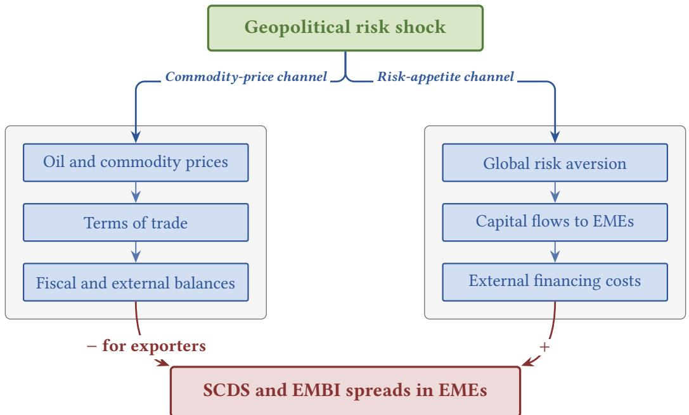  
Figure 1: Transmission of geopolitical risk shocks to sovereign risk premia in EMEs  
Source: Authors' elaboration.

Nonetheless, given the complex nature of geopolitical shocks, several channels may affect the determinants of sovereign credit risk, and ex ante, it is not clear how these shocks might impact a specific country's sovereign risk, as shown in Figure 1. The figure maps the two channels identified in the IMF's Global Financial Stability Report (International Monetary Fund, 2025): an economic channel, operating through commodity prices, terms of trade, and fiscal and external balances, and a market sentiment channel, operating through global risk aversion, capital flows, and external financing costs. For example, certain geopolitical shocks could raise oil prices, potentially improving the risk profile of an oil-exporting EME. Conversely, some geopolitical shocks may reduce international investors' appetite for EME risk, leading to tighter external financial conditions and higher SCDS and EMBI spreads for

## 3 Data and Stylized Facts

## 3.1 Geopolitical Risk (GPR) Index

Although there is no straightforward method for measuring geopolitical uncertainty, the GPR index developed by Caldara and Iacoviello (2022) has become a widely adopted indicator for assessing this risk. According to the authors, geopolitical risk encompasses the “threat, realization, and escalation of adverse events associated with wars, terrorism, and any tensions among states and political actors that affect the peaceful course of international relations.”

The GPR index quantifies geopolitical risk by tracking the frequency of relevant terms in leading international newspapers. $^{1}$ It captures a broad spectrum of geopolitical events and serves as a comprehensive summary measure of global geopolitical uncertainty, highlighting periods of heightened tensions, as illustrated in Figure 2. $^{2}$

From 2005 onwards, the index remained at a moderate baseline until the Russian invasion of Ukraine in early 2022, after which geopolitical tensions have remained significantly elevated. For our econometric analysis, we standardize the index to a mean of 0 and a variance of 1, using it as our measure of geopolitical risk. Caldara and Iacoviello (2022) further decompose the index into two sub-indices: Threats and Acts. The Threats sub-index captures anticipatory geopolitical risks, such as war risks and military tensions, while the Acts sub-index reflects the materialization of adverse events, such as terrorist attacks and military escalations.

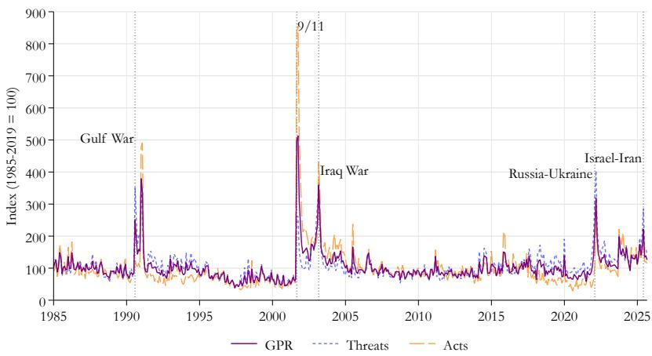  
Figure 2: Geopolitical Risk (GPR) index of Caldara and Iacoviello (2022) and main geopolitical events, January 1985–October 2025.

## 3.2 Emerging Market Sovereign Risk Premia and Control Variables

In our empirical analysis, we investigate sovereign risk premia across a panel of 13 emerging market economies, using the 5-year SCDS and EMBI spreads. The sample includes Brazil, Chile, China, Colombia, Hungary, Indonesia, Malaysia, Mexico, Peru, the Philippines, Poland, South Africa, and Türkiye, covering the period from January 2005 to October 2025. These countries were selected because they are part of the MSCI Emerging Markets Index and have data available for both SCDS and EMBI spreads. Spreads are measured in basis points, with higher values indicating greater perceived default risk. Building on the empirical specifications of Gamboa and Romero (2024) and Vargas-Herrera et al. (2022), we include each country's commodity terms-of-trade cycle, public-debt position relative to global levels, global financial conditions, and a country-specific common component of EME sovereign spreads as controls.

Commodity terms of trade, as calculated by the IMF, reflect the relative price movements of a country's commodity exports and imports. This serves as an indicator for assessing economic performance, particularly in commodity-dependent economies. To capture exposure to commodity-price fluctuations, we rely on each country's commodity terms-of-trade cycle. $^{3}$ As a measure of debt and fiscal position, we include the cyclical component of each country's gross debt position relative to the global average, derived from IMF data. $^{4}$

To approximate the global financial cycle, we use the Chicago Fed National Financial Conditions Index (NFCI). The NFCI, calculated by the Federal Reserve Bank of Chicago, is a comprehensive indicator that reflects overall risk, liquidity, and leverage conditions in the U.S. financial system. $^{5}$ As a measure of emerging-market-specific financial conditions, or the appetite of international investors for foreign-currency-denominated emerging-market debt, we construct a country-specific indicator based on the dynamic factor of emerging-market SCDS and EMBI spreads, following the approach of Gamboa and Romero (2024). $^{6}$

## 4 Econometric Approach

## 4.1 Impact of Geopolitical Risk on EME Risk Premia: A Panel Approach

We employ local projections to evaluate the effects of geopolitical risk on EME risk premia, as measured by the SCDS and EMBI spreads. Introduced by Jordà (2005), this method offers a flexible approach for estimating impulse response functions without requiring a specific structural form for the data-generating process. Local projections estimate dynamic responses through a series of horizon-specific regressions, where the outcome variable, shifted forward in time, is regressed on the contemporaneous regressor of interest, its own lags, and control variables. The key regressor of interest is the standardized geopolitical-risk index of Caldara and Iacoviello (2022), which measures global geopolitical risk.

Following Inoue et al. (2022), let $Y_{t}$ be a vector of macroeconomic variables affected by structural shocks $\epsilon_{t}$ , with structural moving-average representation

$$
Y _ {t} = \Theta (L) \epsilon_ {t},\tag{1}
$$

where L denotes the lag operator, $\Theta(L)=\Theta_{0}+\Theta_{1}L+\Theta_{2}L^{2}+\ldots$ , and $\Theta_{h}$ is a $(K\times K)$ matrix of coefficients. Plagborg-Møller and Wolf (2021) and Inoue et al. (2022) demonstrate that the coefficients $\Theta_{h}$ represent the structural impulse responses, or equivalently, the dynamic causal effects of the structural shocks. The horizon-h impulse response can be obtained through direct linear regression of future outcomes on current covariates, yielding the panel local projection:

$$
\begin{array}{r l} & Y _ {R P, i, t + h} = \alpha_ {i, h} + \delta_ {i, h} t + \Theta_ {h, R P} \mathrm{GPR} _ {t} + \gamma_ {h} ^ {\prime} \mathbf {W} _ {i, t} \\ & \qquad + \sum_ {p = 1} ^ {P} \phi_ {h, p} Y _ {R P, i, t - p} + \sum_ {p = 1} ^ {P} \psi_ {h, p} ^ {\prime} \mathbf {W} _ {i, t - p} + e _ {R P, i, t + h} ^ {h}. \end{array}\tag{2}
$$

where $Y_{RP,i,t + h}$ is the risk-premium measure, either the SCDS or EMBI spread, of country $i$ at horizon $t + h$ ; $\alpha_{i,h}$ is a country fixed effect; $\delta_{i,h}t$ is a country-specific linear trend; $\mathrm{GPR}_t$ is the standardized geopolitical-risk index, which we treat as exogenous to any individual country's sovereign spread given its global construction; and $\mathbf{W}_{i,t}$ is a vector of control variables. The coefficient of interest, $\Theta_{h,RP}$ , measures the response of the spread at horizon $h$ to a one-standard-deviation increase in geopolitical risk.

The control vector $W_{i,t}$ includes the country-specific cyclical components of government debt and commodity terms of trade, an EME common factor of sovereign-risk premia computed following Gamboa and Romero (2024) and Vargas-Herrera et al. (2022), the NFCI, and a COVID-19 indicator. The VIX is used in place of the NFCI in robustness exercises. The lag order is based on information criteria. Country-specific linear trends are included in the SCDS specification to absorb low-frequency, country-level movements, since SCDS spreads are trend stationary; they are omitted from the EMBI specification because the pre-tests do not support their inclusion (i.e., EMBI spreads are stationary without a deterministic trend over the sample) $^{7}$ .

Since the reduced-form residuals $e_{RP,i,t+h}^{h}$ are linear combinations of shocks across horizons and countries, they are likely to exhibit serial and cross-sectional correlation. To address this, we report Driscoll–Kraay standard errors with a bandwidth of $\max(h+1,1)$ (Driscoll and Kraay, 1998). These standard errors are robust to heteroskedasticity, autocorrelation, and cross-sectional dependence. The estimation sample spans January 2005 to October 2025 and includes the 13 EMEs in our panel. The sequence of estimated coefficients $\{\Theta_{h,RP}\}_{h=0}^{H}$ constitutes the panel impulse response of risk premia to a one-standard-deviation increase in the GPR index, averaged over the empirical distribution of fundamentals.

Pooling slopes across countries is a deliberate methodological choice. Given the limited time dimension and the lag structure required for inference, country-by-country estimation would lack precision. The pooled specification, therefore, provides a parsimonious estimate of the average transmission mechanism across the EMEs in our sample.

## State-Dependent Local Projections

Equation (2) provides the response for the whole sample period, capturing the effect of an increase in geopolitical risk averaged over the empirical distribution of fundamentals. The linear specification implicitly assumes that the response is invariant across macro-financial states. However, the transmission of geopolitical risk to sovereign risk premia may vary depending on prevailing conditions, such as the level of global financial stress, domestic fiscal vulnerabilities, commodity-price dynamics, or the existing level of sovereign risk premia.

Building on Cloyne et al. (2020) and the unified state-dependent framework of Cloyne et al. (2023), we extend Equation (2) by allowing the GPR coefficient to vary with a vector of predetermined state variables:

$$
\begin{array}{r l} & Y _ {R P, i, t + h} = \alpha_ {i, h} + \beta_ {h} \mathrm{GPR} _ {t} + \sum_ {k} \theta_ {h, k} (\mathrm{GPR} _ {t} \times \tilde {x} _ {k, i, t - 1}) + \gamma_ {h} ^ {\prime} \mathbf {W} _ {i, t} \\ & \qquad + \sum_ {p = 1} ^ {P} \phi_ {h, p} Y _ {R P, i, t - p} + \sum_ {p = 1} ^ {P} \psi_ {h, p} ^ {\prime} \mathbf {W} _ {i, t - p} + e _ {R P, i, t + h} ^ {h}, \end{array}\tag{3}
$$

where $\tilde{x}_{k,i,t-1} = x_{k,i,t-1} - \bar{x}_{k,i}$ represents state variable k lagged by one period and demeaned by its country-specific mean. For global state variables, demeaning is performed relative to the full-sample mean. The predetermined timing ensures that the state variables do not mechanically incorporate contemporaneous responses to $GPR_{t}$ , thereby addressing simultaneity concerns.

Demeaning ensures that the coefficient $\beta_{h}$ captures the response of sovereign risk premia to changes in the control variables when they are at their average levels. In the fixed-effects panel, centring the interacted states implies that the coefficient on $GPR_{t}$ reflects the response when the state variables are evaluated at their means, while the interaction coefficients $\theta_{h,k}$ capture how the response varies as each state variable deviates from its average value.

The state vector $X_{i,t-1}$ comprises four of the controls in $W_{i,t}$ : the EME common factor of sovereign risk, the public-debt-gap cyclical component, the commodity-terms-of-trade cyclical component, and the financial conditions index (NFCI). The COVID-19 indicator is excluded from the interaction set. Aligning the interaction set with the conditioning set allows the transmission of geopolitical risk to vary with the same macro-financial fundamentals used as controls, mitigating concerns about omitted interactions.

The state-dependent impulse response for any configuration $\mathbf{X}^{*} = (x_{1}^{*}, \ldots, x_{K}^{*})$ is derived directly from the coefficients in Equation (3) as

$$
\mathrm{IRF} _ {h} (\mathbf {X} ^ {*}) = \hat {\beta} _ {h} + \sum_ {k} \hat {\theta} _ {h, k} \tilde {x} _ {k} ^ {*},\tag{4}
$$

where $\tilde{x}_{k}^{*}=x_{k}^{*}-\bar{x}_{k}$ is the demeaned counterpart of the conditioning value. Confidence bands are constructed by applying a linear restriction, implemented with Stata's lincom command, to the joint covariance matrix of the estimated $\{\hat{\beta}_{h},\hat{\theta}_{h,k}\}$ vector. $^{8}$

Following Cloyne et al. (2023), we interpret Equation (4) as projection-based rather than purely structural. It answers the question: given currently observed fundamentals $X^{*}$ , what is the expected response of risk premia to an increase in geopolitical risk? This interpretation is valuable for policy and forecasting purposes without requiring full exogeneity of all state variables, which would be necessary for a strictly structural interpretation.

We use the framework along two dimensions. First, we evaluate Equation (4) at panel-averaged state values observed on two dates: December 2021, representing the pre-invasion escalation phase of the Russia–Ukraine conflict, and June 2022, four months into the post-invasion period. The contrast between these two configurations highlights the role of prevailing fundamentals in shaping how a given increase in geopolitical risk propagates to sovereign risk premia. These dates were selected because the Russia–Ukraine conflict provides a larger number of observations in the data to analyse state-dependent responses of sovereign risk premia to geopolitical risk, compared to other events such as the escalation of the Israel–Hamas conflict in October 2023, where fewer observations are available. Second, by comparing these state-dependent responses with the impulse response function (IRF) for the whole sample from Equation (2), we assess the extent to which prevailing fundamentals shape the transmission of geopolitical risk. This approach complements the average-effect interpretation with state-specific magnitudes.

In the following subsections, we present the estimation results from Equations (2)-(4), including average IRFs and state-dependent IRFs at selected event dates.

## 4.2 Baseline results

We begin by estimating equation (2) to establish the average effect of geopolitical risk on sovereign risk premia in emerging markets, before addressing the state-dependent responses in the following subsection. We present two complementary sets of results: the contemporaneous coefficients on GPR and the control variables at horizon h = 0, summarized in Table 1, and the full sequence of dynamic responses $\{\hat{\Theta}_{h,RP}\}_{h=0}^{12}$ , shown in Figure 3.

Contemporaneous responses and controls. Table 1 indicates that an increase in the overall GPR index by one standard deviation raises SCDS spreads by approximately 5.7 basis points and EMBI spreads by approximately 4.6 basis points on impact, both statistically significant at the 1% level (columns 1 and 4). Examining the Threats and Acts subindices separately reveals two patterns. First, the contemporaneous SCDS response is broadly symmetric between the two subindices: Threats and Acts each raise SCDS spreads by roughly 5 basis points, with comparable statistical significance (columns 2–3). Second, the EMBI response is asymmetric. Threats produce a sizable and significant impact of about 5.2 basis points, while Acts generate a smaller response of 2.3 basis points, which is not statistically significant (columns 5–6). This asymmetry suggests that EMBI investors primarily react to anticipated geopolitical risk rather than to the materialization of adverse events. This finding aligns with the view that bond markets price in information during the threat-formation stage, with sovereign spreads widening in response to anticipated damage. Once adverse events materialize, they are treated as partially anticipated, resulting in a muted market reaction. This is consistent with Aslam and Newaz (2025), who highlights that bond markets are particularly sensitive to geopolitical threats due to their forward-looking nature.

The control variables enter with the expected signs and magnitudes in both blocks. The NFCI loads positively and significantly, indicating that a one-unit tightening of the NFCI raises SCDS spreads by approximately 20 basis points and EMBI spreads by about 39 basis points. This underscores the prominent role of the global financial cycle in driving EME sovereign risk (Rey, 2015). The country-specific common factor of sovereign risk premia also enters with statistically significant coefficients, around 0.7 for SCDS and 0.5 for EMBI spreads. This highlights the substantial cross-country co-movement in sovereign risk pricing that is not fully accounted for by global financial conditions, capturing shared regional or global risks faced by EMEs.

Commodity terms-of-trade improvements have a dampening effect on both spreads, with coefficients of approximately -1.4 for SCDS and -3.5 for EMBI spreads. However, the effect is statistically significant only for EMBI spreads, likely reflecting the more direct pricing of commodity exposure in sovereign bond cash flows. The debt-gap cyclical component has a positive and significant effect on both spreads, raising them by roughly 3.6–3.8 basis points per unit. This result aligns with the standard channel through which fiscal deterioration is priced into sovereign risk, as higher debt levels increase perceived default probabilities. The COVID-19 dummy variable captures the sharp re-pricing of sovereign risk during the early pandemic period. While the effect is significant for both SCDS and EMBI spreads in most specifications, it is more pronounced for EMBI spreads, with an increase of approximately 31.6–33.8 basis points compared to 10.4–10.8 basis points for SCDS spreads.

Overall, the estimates confirm the role of geopolitical risk, global financial conditions, regional co-movement, and domestic fiscal vulnerabilities in shaping EME sovereign risk premia. These findings provide a robust foundation for the subsequent analysis of geopolitical risk transmission.

Dynamic responses. Figure 3 illustrates the dynamic response of SCDS and EMBI spreads to a one-standard-deviation increase in the overall GPR index over a 12-month horizon. Two key features emerge. First, the response intensifies over the first few months: both spreads continue to rise after h = 0 before peaking. SCDS spreads reach a maximum of approximately 10 basis points around month 3, while EMBI spreads peak at roughly 7 basis points over the same horizon. This delayed peak aligns with the gradual incorporation of geopolitical information into sovereign risk pricing as geopolitical developments unfold. Second, the responses are persistent but not permanent: both spreads gradually decline over the

Table 1: Sovereign spreads and geopolitical risk: baseline panel local projections

<table><tr><td rowspan="2"></td><td colspan="3">SCDS spread</td><td colspan="3">EMBI spread</td></tr><tr><td>(1) GPR</td><td>(2) Threats</td><td>(3) Acts</td><td>(4) GPR</td><td>(5) Threats</td><td>(6) Acts</td></tr><tr><td>GPR</td><td>5.709***(1.890)</td><td></td><td></td><td>4.610***(1.162)</td><td></td><td></td></tr><tr><td>GPR Threats</td><td></td><td>5.015***(1.695)</td><td></td><td></td><td>5.187***(1.303)</td><td></td></tr><tr><td>GPR Acts</td><td></td><td></td><td>4.834***(1.809)</td><td></td><td></td><td>2.337(1.431)</td></tr><tr><td>NFCI</td><td>20.264***(4.586)</td><td>20.024***(4.677)</td><td>20.819***(4.590)</td><td>38.657***(7.841)</td><td>39.597***(7.943)</td><td>36.757***(7.876)</td></tr><tr><td>Common factor</td><td>0.727***(0.049)</td><td>0.729***(0.050)</td><td>0.713***(0.050)</td><td>0.519***(0.070)</td><td>0.511***(0.071)</td><td>0.530***(0.070)</td></tr><tr><td>Commodity ToT (cyclical)</td><td>-1.399(0.949)</td><td>-1.390(0.954)</td><td>-1.343(0.935)</td><td>-3.498***(1.106)</td><td>-3.519***(1.113)</td><td>-3.435***(1.091)</td></tr><tr><td>Debt gap (cyclical)</td><td>3.629***(0.465)</td><td>3.572***(0.455)</td><td>3.633***(0.469)</td><td>3.782***(0.521)</td><td>3.769***(0.510)</td><td>3.712***(0.532)</td></tr><tr><td>COVID-19 dummy</td><td>10.814**(5.365)</td><td>7.522(4.703)</td><td>10.367*(5.623)</td><td>33.764***(9.092)</td><td>31.671***(9.124)</td><td>32.141***(9.086)</td></tr><tr><td>Constant</td><td>47.654***(10.629)</td><td>48.077***(10.750)</td><td>46.652***(10.606)</td><td>109.795***(17.890)</td><td>111.833***(18.116)</td><td>107.019***(17.928)</td></tr><tr><td>Observations</td><td>3,250</td><td>3,250</td><td>3,250</td><td>3,250</td><td>3,250</td><td>3,250</td></tr><tr><td>Within  $R^2$ </td><td>0.558</td><td>0.557</td><td>0.557</td><td>0.334</td><td>0.335</td><td>0.333</td></tr><tr><td>Country FE</td><td>Yes</td><td>Yes</td><td>Yes</td><td>Yes</td><td>Yes</td><td>Yes</td></tr></table>

Notes: The dependent variable in columns (1)–(3) is the 5-year sovereign CDS spread (SCDS); in columns (4)–(6) the J.P. Morgan Emerging Markets Bond Index (EMBI) spread. Both are expressed in basis points. The regressors of interest are the standardized global geopolitical-risk index of Caldara and Iacoviello (2022) and its Threats and Acts subindices. The SCDS specifications include country-specific linear trends; the EMBI specifications include only country fixed effects, as panel unit-root and trend-stationarity tests do not support deterministic country-specific trends in EMBI spreads (see Table 2 of Appendix A.2). The “Common factor” row reports the coefficient on cds\_ex in columns (1)–(3) and on embi\_ex in columns (4)–(6); these are the country-specific common components extracted from the respective spreads. Driscoll–Kraay standard errors are reported in parentheses. \*, \*\*, and \*\*\* denote significance at the 10%, 5%, and 1% levels, respectively.

remainder of the horizon, with the response approaching zero by month 8 for SCDS and by month 6 for EMBI spreads, while remaining positive throughout the period.

A cross-asset comparison reveals that SCDS spreads exhibit a somewhat larger and more persistent response to geopolitical risk than EMBI spreads. This pattern reflects the differences between the two instruments: SCDS markets are more liquid (Amstad et al. (2016)) and directly used for hedging tail risk (Henricot and Piquard (2022)), resulting in sharper repricing under geopolitical stress. In contrast, EMBI spreads aggregate bonds of varying maturities and liquidity profiles, leading to more gradual adjustments. The 68%, 90%, and 95% Driscoll–Kraay confidence bands confirm that the response is statistically significant over the initial months of the horizon in both markets, with the strongest influence at short horizons where the Driscoll–Kraay bandwidth is smallest.

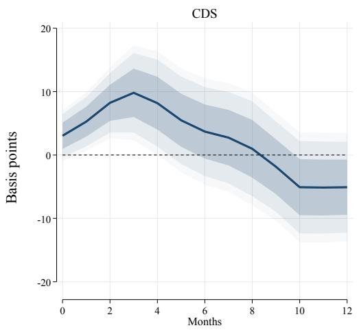

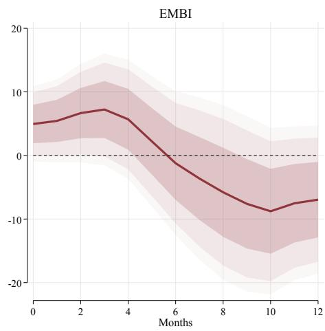  
Figure 3: Response of SCDS spreads (left) and EMBI spreads (right) to a one-standard-deviation increase in the overall GPR index. Solid lines represent average responses evaluated at the panel-mean state. Shaded areas represent 68%, 90%, and 95% confidence bands based on Driscoll–Kraay standard errors. Impulse responses are smoothed using a 3-month moving average. The SCDS specification includes country fixed effects and country-specific linear trends; the EMBI specification includes only country fixed effects. Sample: 13 emerging market economies, monthly data 2005m1–2025m10.

Overall, the baseline results establish two stylized facts. First, geopolitical risk leads to economically meaningful and statistically significant increases in EME sovereign risk premia, with effects that unfold over several months rather than concentrating at the time of impact. Second, the responses are not uniform across instruments or GPR subindices: EMBI spreads primarily react to Threats, whereas SCDS spreads respond to both Threats and Acts. These findings raise a natural question that the linear specification cannot address: do these average responses conceal substantial heterogeneity in the transmission of geopolitical risk across different macro-financial states? This question is explored further in Section 4.3.

Figure 4 extends the dynamic analysis to the Threats and Acts subindices and confirms that the contrast observed on impact in Table 1, broad symmetry for SCDS and asymmetry for EMBI, persists across the full response horizon. For SCDS spreads (top row), the three GPR measures (Overall GPR, Threats, and Acts) exhibit broadly similar dynamic profiles. All responses peak within the first few months of the horizon at comparable magnitudes and decay at similar rates. The confidence bands overlap throughout the horizon, indicating that SCDS markets price geopolitical risk similarly whether it reflects anticipated threats or realized events. In contrast, EMBI spreads (bottom row) show a pronounced and persistent asymmetry between the Threats and Acts subindices.

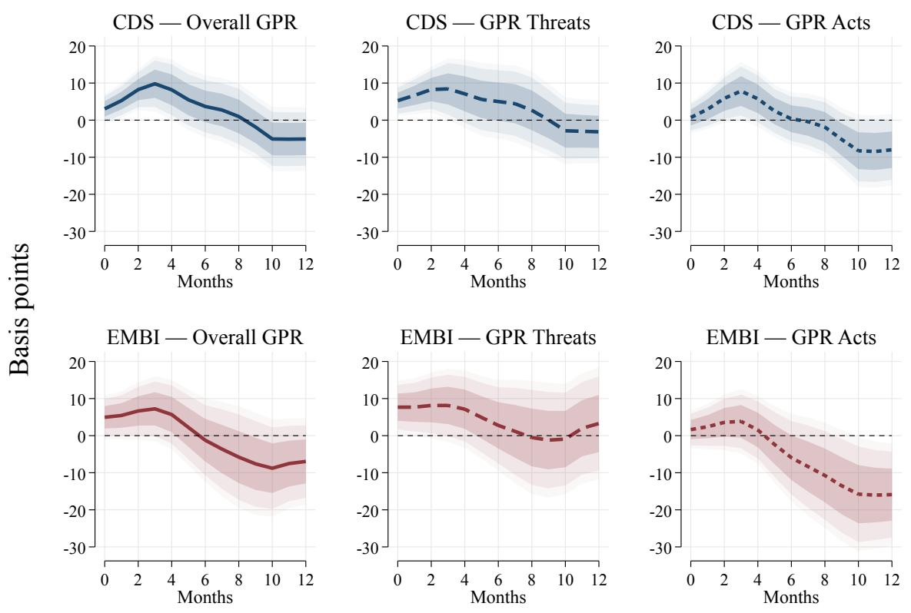  
Figure 4: Response of SCDS spreads (top row) and EMBI spreads (bottom row) to a one-standard-deviation increase in alternative GPR measures: the overall GPR index (left), GPR Threats (center), and GPR Acts (right). Solid, dashed, and short-dashed lines represent the average responses (at the panel-mean state) for each GPR measure, respectively. Shaded areas represent 68%, 90%, and 95% confidence bands based on Driscoll–Kraay standard errors.

The response to Threats closely mirrors the Overall GPR response, remaining statistically significant across most of the horizon. By comparison, the response to Acts is noticeably smaller in magnitude, with confidence bands that include zero for the majority of the horizon, indicating limited statistical significance. This divergence highlights that EMBI spreads are primarily sensitive to the anticipation of geopolitical risk (Threats) rather than its realisation (Acts). This finding underscores the distinct mechanisms through which the two markets price geopolitical information, and highlights the critical role of expectations

in sovereign risk pricing.

## 4.3 State-dependent results

Having established the average dynamic response of sovereign risk premia to GPR, we now examine whether this response varies under prevailing macro-financial conditions. We evaluate the state-dependent impulse response of Equation (4) at three configurations of the conditioning vector $X^{*}$ : the panel-mean state, which recovers the response described in Section 4.2; the cross-country average state observed in December 2021, in the run-up to the Russian invasion of Ukraine; and the state observed in June 2022, four months into the post-invasion period. These two event dates bracket a sharp reconfiguration of global geopolitical risk and, crucially, the macro-financial fundamentals through which it is transmitted to emerging markets. Figure 5 reports the responses for both SCDS and EMBI spreads.

Two patterns emerge. First, the state-dependent responses at both event dates deviate substantially from the panel-average response, indicating that the transmission of geopolitical risk depends on the prevailing macro-financial state. For SCDS spreads (top row of Figure 5), the conflict-onset response is lower than the panel-average response and decays more slowly, indicating a delayed adjustment. In contrast, the aftermath response peaks at a substantially higher magnitude than the panel-average response and remains elevated over a longer horizon. For EMBI spreads (bottom row of Figure 5), the pattern is qualitatively similar though the onset response is amplified relative to the average, particularly in the second half of the horizon, while the aftermath response moderates back toward the baseline.

Second, the contrast between the onset and aftermath states is both economically meaningful and consistent across instruments. The aftermath configuration corresponds to a period of elevated U.S. financial stress, deteriorating commodity terms of trade for net-importing EMEs, and increased sovereign-risk co-movement across the panel. Each of these fundamentals is included in the interaction set, so the larger aftermath response reflects the cumulative effect of evaluating equation (4) in a configuration where multiple state variables move in adverse directions. By contrast, the onset configuration reflects more tranquil conditions, as markets had not yet fully absorbed the initial escalation or the materialization of policy responses. This dynamic compresses the state-dependent multiplier. The consistent vertical scale across the six panels facilitates a direct comparison of the magnitude of these state-induced shifts relative to the panel's response for the whole sample.

These results carry two important implications for interpreting the baseline estimates. First, the IRFs reported in Section 4.2 average over substantial heterogeneity in transmission. The same increase in geopolitical risk can produce markedly different responses depending on the macro-financial environment in which it occurs. Second, for policy and forecasting purposes, the state-dependent framework provides a practical and tractable way to translate a prevailing configuration of fundamentals into a projected response without requiring a fully specified structural model. These findings underscore the importance of considering state dependence when assessing the impact of geopolitical risk on sovereign risk premia.

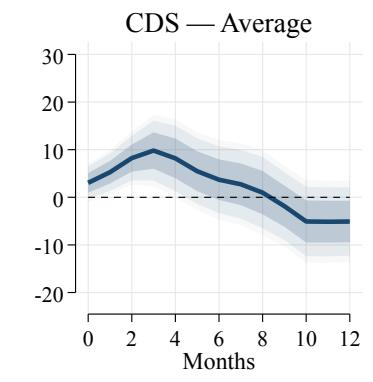

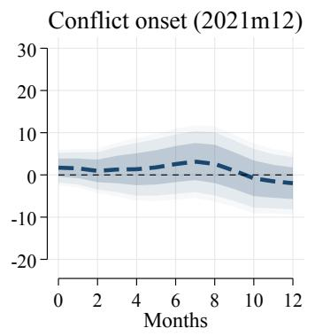

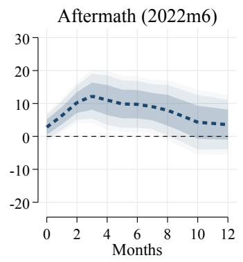

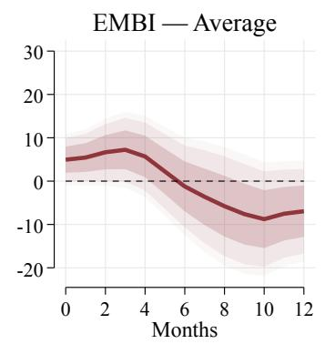

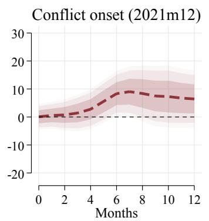

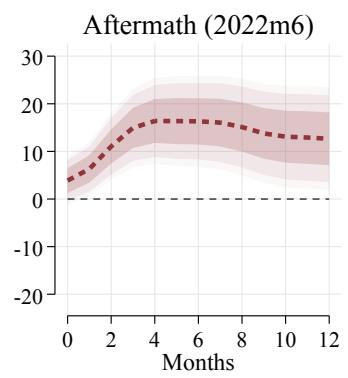  
Figure 5: State-dependent responses of SCDS spreads (top row) and EMBI spreads (bottom row) to a one-standard-deviation increase in the Overall GPR index, evaluated at three conditioning states: the panel-mean state (left), the Russia–Ukraine conflict onset in 2021m12 (center), and the post-onset aftermath in 2022m6 (right). Shaded areas represent 68%, 90%, and 95% confidence bands based on Driscoll–Kraay standard errors.

## 5 Conclusion

This study examines how geopolitical risk transmits to sovereign risk premia in emerging market economies, focusing on the 5-year SCDS and EMBI spreads across 13 countries from 2005 to 2025. Using a state-dependent panel local projections framework, we evaluate how macro-financial fundamentals shape sovereign risk premia's responses to geopolitical shocks.

Three key findings emerge. First, higher geopolitical risk leads to significant increases in SCDS and EMBI spreads on impact, with effects persisting for several months. SCDS spreads exhibit stronger responses due to their greater liquidity and role in hedging sovereign risk. Second, sovereign risk premia measures are more sensitive to geopolitical

Threats than to Acts. Anticipated risks (Threats) drive larger and more prolonged increases in spreads, while realized geopolitical events (Acts) elicit more muted responses, reflecting the forward-looking nature of bond markets. Third, the macro-financial environment plays a critical role in shaping the transmission of geopolitical shocks. During the onset of the Russia–Ukraine conflict, when markets had not yet fully absorbed the initial shock or policy responses, the responses were moderate. By contrast, the aftermath phase, marked by heightened financial stress, worsening commodity terms of trade for net-importing EMEs, and increased sovereign-risk co-movement, amplified the impact on both SCDS and EMBI spreads. These findings underscore the importance of accounting for state-dependent dynamics in understanding sovereign risk.

These results carry several implications. For policymakers, monitoring geopolitical developments alongside macro-financial conditions is essential for managing external borrowing costs. The state-dependent framework offers a practical tool for translating prevailing fundamentals into projected responses without requiring a fully specified structural model. For market participants, the observed Threats-Acts asymmetry in EMBI pricing has implications for hedging strategies that combine SCDS and bonds. For researchers, the methodology provides a robust framework to explore the conditional transmission of other global shocks, such as those related to monetary policy, commodities, or trade.

This study also opens several avenues for future research. Using higher-frequency data, particularly around event windows, could enhance shock identification and allow for more precise Threats-versus-Acts comparisons. Also, integrating the state-dependent framework with country-level data on monetary policy, exchange rates, or capital flows could shed light on the specific channels through which geopolitical risk affects sovereign-risk pricing in EMEs.

## References

Afonso, A., Alves, J., and Monteiro, S. (2024). Beyond borders: Assessing the influence of geopolitical tensions on sovereign risk dynamics. European Journal of Political Economy, 83:102550.

Amstad, M., Remolona, E., and Shek, J. (2016). How do global investors differentiate between sovereign risks? the new normal versus the old. Journal of international money and finance, 66:32–48.

Aslam, A. and Newaz, M. K. (2025). Geopolitical risk and bond market dynamics: Assessing the impact of threats and realized events. The Quarterly Review of Economics and Finance, page 102032.

Bratis, T., Kouretas, G. P., Laopodis, N. T., and Vlamis, P. (2024). Sovereign credit and geopolitical risks during and after the emu crisis. International Journal of Finance & Economics, 29(3):3692–3712.

Caldara, D. and Iacoviello, M. (2022). Measuring geopolitical risk. American Economic Review, 112(4):1194–1225.

Chernov, M., Schmid, L., and Schneider, A. (2020). A macrofinance view of us sovereign cds premiums. The Journal of Finance, 75(5):2809–2844.

Cloyne, J., Jordà, Ô., and Taylor, A. M. (2023). State-dependent local projections: Understanding impulse response heterogeneity. Technical report, National Bureau of Economic Research.

Cloyne, J. S., Jorda, O., and Taylor, A. M. (2020). Decomposing the fiscal multiplier. Technical report, National Bureau of Economic Research.

Demiralay, S., Kaawach, S., Kilincarslan, E., and Semeyutin, A. (2024). Geopolitical tensions and sovereign credit risks. Economics Letters, 236:111609.

Driscoll, J. C. and Kraay, A. C. (1998). Consistent covariance matrix estimation with spatially dependent panel data. Review of Economics and Statistics, 80(4):549–560.

Fernández-Villaverde, J., Mineyama, T., and Song, D. (2024). Are we fragmented yet? measuring geopolitical fragmentation and its causal effect. Technical report, National Bureau of Economic Research.

Gamboa, F. and Romero, J. V. (2024). Modelling cds volatility at different tenures: An application for latin-american countries. Borsa Istanbul Review, 24(4):772–786.

Gong, X. and Xu, J. (2022). Geopolitical risk and dynamic connectedness between commodity markets. Energy Economics, 110:106028.

Henricot, D. and Piquard, T. (2022). Cds trading strategies and credit risk reallocation.

Im, K. S., Pesaran, M. H., and Shin, Y. (2003). Testing for unit roots in heterogeneous panels. Journal of Econometrics, 115(1):53–74.

Inoue, A., Rossi, B., and Wang, Y. (2022). Local projections in unstable environments: How effective is fiscal policy? CEPR Discussion Papers.

International Monetary Fund (2025). Geopolitical risks: Implications for asset prices and financial stability. In Global Financial Stability Report, April 2025, chapter 2. International Monetary Fund, Washington, DC.

Iyke, B. N., Phan, D. H. B., and Narayan, P. K. (2022). Exchange rate return predictability in times of geopolitical risk. International Review of Financial Analysis, 81:102099.

Jordà, Ô. (2005). Estimation and inference of impulse responses by local projections. American economic review, 95(1):161–182.

Jung, S., Lee, J., and Lee, S. (2021). Geopolitical Risk on Stock Returns: Evidence from Inter-Korea Geopolitics. International Monetary Fund.

Klement, J. (2021). Geo-Economics: The Interplay between Geopolitics, Economics, and Investments. CFA Institute Research Foundation.

Naifar, N. and Aljarba, S. (2023). Does geopolitical risk matter for sovereign credit risk? fresh evidence from nonlinear analysis. Journal of Risk and Financial Management, 16(3):1–17.

Niepmann, F. and Shen, L. S. (2025). Geopolitical risk and global banking. Technical report, Federal Reserve Bank of Boston.

Nonejad, N. (2022). An interesting finding about the ability of geopolitical risk to forecast aggregate equity return volatility out-of-sample. Finance Research Letters, 47:102710.

Ortiz, A., Rodrigo, T. R., and Saborido, P. (2026). Geopolitics, geoeconomics, and sovereign risk: different shocks, different channels. BBVA Research Report.

Papavassiliou, V. G. (2025). On the relationship between geopolitical risks and euro area sovereign bond yields. Finance Research Letters, 75:106877.

Pástor, L. and Veronesi, P. (2013). Political uncertainty and risk premia. Journal of financial Economics, 110(3):520–545.

Plagborg-Møller, M. and Wolf, C. K. (2021). Local projections and vars estimate the same impulse responses. Econometrica, 89(2):955–980.

Rey, H. (2015). Dilemma not trilemma: the global financial cycle and monetary policy independence. Technical report, National Bureau of Economic Research.

Simonyan, S. and Bayraktar, S. (2022). Asymmetric dynamics in sovereign credit default swaps pricing: evidence from emerging countries. International Journal of Emerging Markets.

Subramaniam, S. (2022). Geopolitical uncertainty and sovereign bond yields of brics economies. Studies in Economics and Finance, 39(2):311–330.

Umar, Z., Bossman, A., Choi, S.-Y., and Teplova, T. (2022). Does geopolitical risk matter for global asset returns? evidence from quantile-on-quantile regression. Finance Research Letters, 48:102991.

Vargas-Herrera, H., Ospina-Tejeiro, J., and Romero, J. V. (2022). The covid-19 shock and the monetary policy response in colombia. In Settlements, B. f. I., editor, The monetary-fiscal policy nexus in the wake of the pandemic, volume 122, pages 79–114. Bank for International Settlements.

Wang, Y., Bouri, E., Fareed, Z., and Dai, Y. (2022). Geopolitical risk and the systemic risk in the commodity markets under the war in ukraine. Finance Research Letters, 49:103066.

Zaremba, A., Cakici, N., Demir, E., and Long, H. (2022). When bad news is good news: Geopolitical risk and the cross-section of emerging market stock returns. Journal of Financial Stability, 58:100964.

## A Appendix

## A.1 Emerging market risk premia fundamentals

This appendix documents the country-specific and global series used in the empirical analysis. The sample comprises 13 EMEs—Brazil, Chile, China, Colombia, Hungary, Indonesia, Malaysia, Mexico, Peru, the Philippines, Poland, South Africa, and Türkiye.

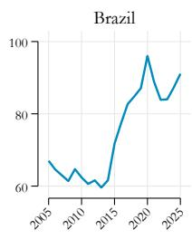

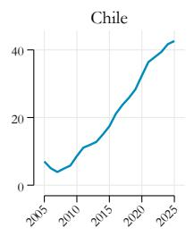

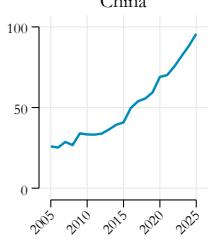

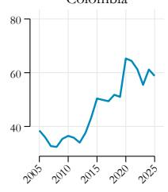

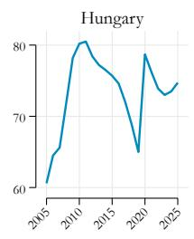

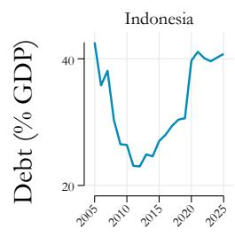

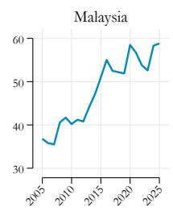

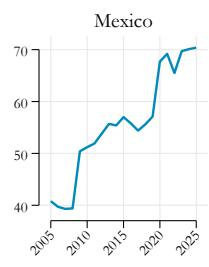

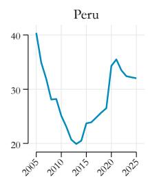

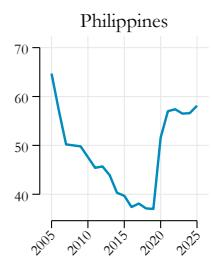

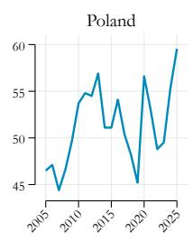

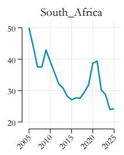

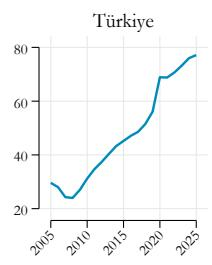  
Figure A.1: Public debt as a share of GDP by country (2005–2025).  
Notes: Gross general-government debt-to-GDP ratio for each of the 13 EMEs in the sample. Cross-country heterogeneity in levels and trends motivates the decomposition of debt levels into a country-specific deterministic trend and a stationary cyclical residual used in the panel local projections (Section 4). Source: IMF World Economic Outlook database; authors' calculations.

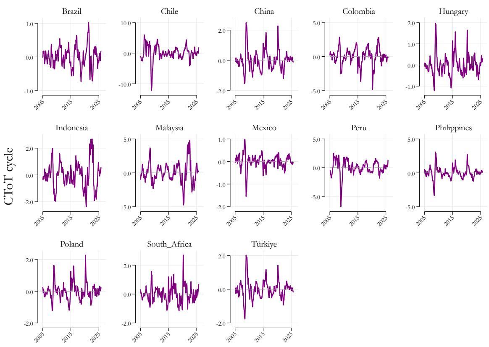  
Figure A.2: Commodity terms of trade—cyclical component by country (2005–2025).  
Notes: Cyclical component of each country's commodity terms-of-trade index (ctot\_cycle). The series captures country-specific movements in commodity export and import prices weighted by their share in trade, and enters the baseline specification as a control for real external shocks. Source: IMF Commodity Terms of Trade database; authors' calculations.

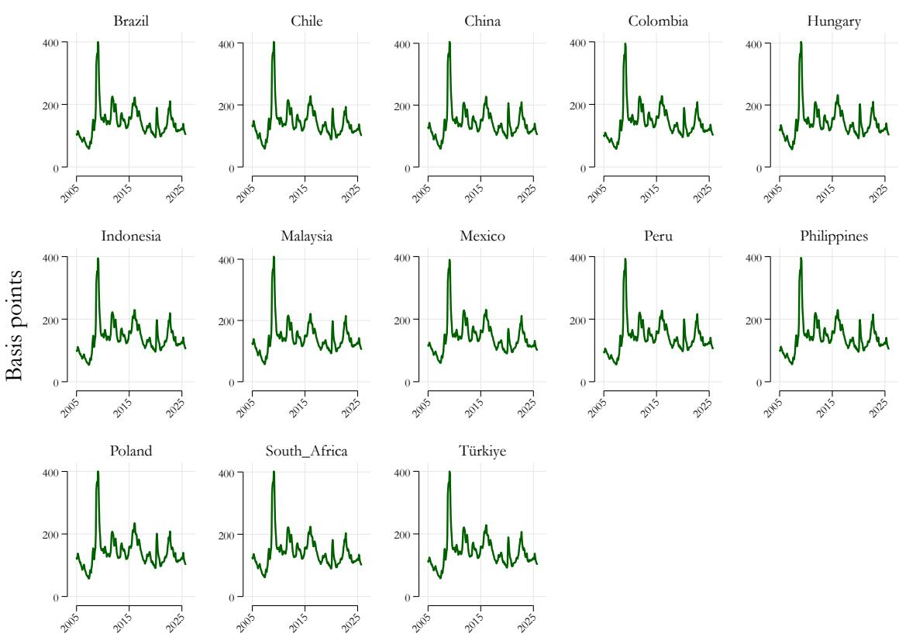  
Figure A.3: Country-specific common component of sovereign CDS spreads

Notes: Each line plots the country-specific common component of the 5-year sovereign CDS spread (cds\_ex) for one of the 13 EMEs in the sample, monthly, January 2005 to October 2025. The common component for a given country is extracted as the first principal component of the spreads of the other 12 economies, excluding the country itself. This leave-one-out construction prevents a country's own spread from entering its common factor. Source: authors' calculations based on Bloomberg data.

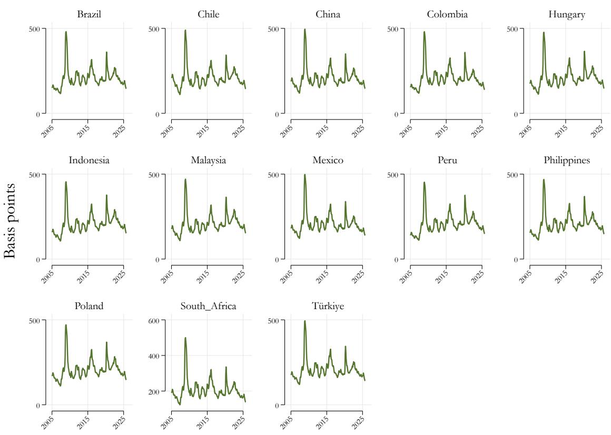  
Figure A.4: Country-specific common component of EMBI spreads

Notes: Each line plots the country-specific common component of EMBI spreads (embi\_ex) for one of the 13 EMEs in the sample, monthly, January 2005 to October 2025. The common component for a given country is extracted as the first principal component of the spreads of the other 12 economies, excluding the country itself. This leave-one-out construction prevents a country's own spread from entering its common factor. Source: authors' calculations based on Bloomberg data.

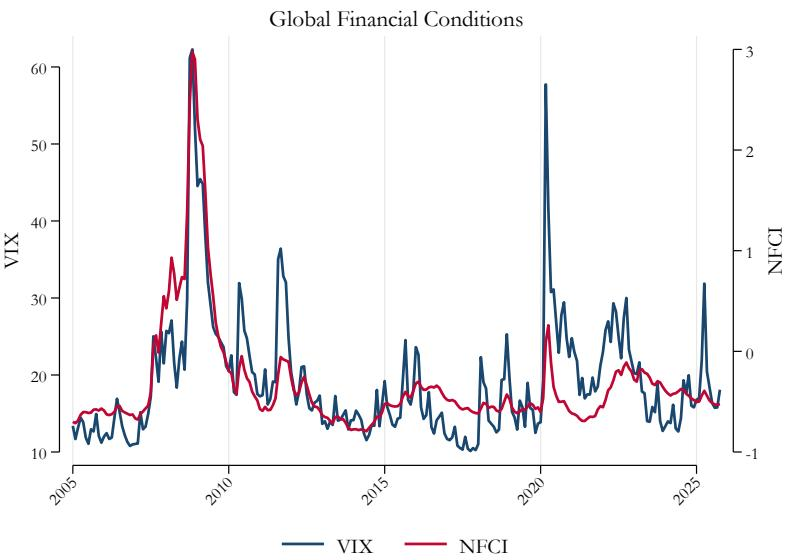  
Notes: the CBOE Volatility Index (VIX, left axis) and the Chicago Fed National Financial Conditions Index (NFCI, right axis). Both series serve as global financial-stress controls in the empirical specification. The NFCI is included as the primary measure. Source: Federal Reserve Bank of Chicago; CBOE.  
Figure A.5: Global financial conditions: VIX and NFCI (2005–2025).

## A.2 Descriptive statistics and unit root tests

Table 2: Im–Pesaran–Shin panel unit root tests

<table><tr><td>Variable</td><td>Description</td><td>Trend</td><td>Lags</td><td> $W_{\bar{t}}$ </td><td>p-value</td></tr><tr><td>cds</td><td>SCDS spread</td><td>Yes</td><td>1.69</td><td>-6.7504</td><td>0.000***</td></tr><tr><td>cds_ex</td><td>SCDS country-specific component</td><td>Yes</td><td>3.00</td><td>-8.6874</td><td>0.000***</td></tr><tr><td>embi</td><td>EMBI spread</td><td>No</td><td>2.08</td><td>-6.5754</td><td>0.000***</td></tr><tr><td>embi_ex</td><td>EMBI country-specific component</td><td>No</td><td>3.00</td><td>-11.2290</td><td>0.000***</td></tr><tr><td>nfci</td><td>National Financial Conditions Index</td><td>No</td><td>3.00</td><td>-9.2963</td><td>0.000***</td></tr><tr><td>ctot_cycle</td><td>Commodity terms of trade (cyclical)</td><td>No</td><td>1.38</td><td>-16.0926</td><td>0.000***</td></tr><tr><td>debt2_cycle</td><td>Public debt gap (cyclical)</td><td>No</td><td>3.00</td><td>-1.9274</td><td>0.027**</td></tr></table>

Notes: The table reports panel unit-root tests following Im et al. (2003). The null hypothesis is that all panels contain a unit root; the alternative is that some panels are stationary. The sample comprises N = 13 EMEs and T = 250 months (January 2005 to October 2025). All specifications include panel-specific means; trend inclusion is reported in the third column. The trend specification differs between the SCDS and EMBI spread: the SCDS test includes a deterministic trend, consistent with the trend-inclusive LP specification used for SCDS, while the EMBI test omits the trend, consistent with the LP specification that retains only country fixed effects. Lag lengths in the underlying ADF regressions are selected by AIC (cross-country average reported in column 4). $W_{\tilde{t}}$ is the standardized t-bar statistic, asymptotically distributed as $\mathcal{N}(0,1)$ under the null, with rejection in the left tail. \*, \*\*, and \*\*\* denote rejection of the unit-root null at the 10%, 5%, and 1% levels, respectively.

Table 3: Pairwise correlations: baseline variables

<table><tr><td></td><td>(1)</td><td>(2)</td><td>(3)</td><td>(4)</td><td>(5)</td><td>(6)</td><td>(7)</td><td>(8)</td></tr><tr><td>(1) cds</td><td>1.000</td><td></td><td></td><td></td><td></td><td></td><td></td><td></td></tr><tr><td>(2) embi</td><td>0.893***</td><td>1.000</td><td></td><td></td><td></td><td></td><td></td><td></td></tr><tr><td>(3) u1_gpr_s</td><td>-0.045**</td><td>-0.056***</td><td>1.000</td><td></td><td></td><td></td><td></td><td></td></tr><tr><td>(4) cds_ex</td><td>0.453***</td><td>0.424***</td><td>-0.132***</td><td>1.000</td><td></td><td></td><td></td><td></td></tr><tr><td>(5) embi_ex</td><td>0.396***</td><td>0.432***</td><td>-0.112***</td><td>0.895***</td><td>1.000</td><td></td><td></td><td></td></tr><tr><td>(6) debt2_cycle</td><td>0.218***</td><td>0.181***</td><td>-0.130***</td><td>0.148***</td><td>0.094***</td><td>1.000</td><td></td><td></td></tr><tr><td>(7) ctot_cycle</td><td>-0.070***</td><td>-0.084***</td><td>0.025</td><td>-0.125***</td><td>-0.129***</td><td>0.017</td><td>1.000</td><td></td></tr><tr><td>(8) nfci</td><td>0.370***</td><td>0.378***</td><td>-0.151***</td><td>0.718***</td><td>0.730***</td><td>-0.007</td><td>-0.118***</td><td>1.000</td></tr></table>

Notes: The table reports pairwise Pearson correlation coefficients across the 13 EMEs in the sample at monthly frequency (January 2005 to October 2025; $N = 3,250$ ). cds denotes the 5-year sovereign CDS spread; embi denotes the J.P. Morgan Emerging Markets Bond Index (EMBI) spread; u1\_gpr\_s is the standardized global geopolitical risk shock; cds\_ex and embi\_ex are the country-specific common components extracted from CDS and EMBI spreads, respectively; debt2\_cycle is the cyclical component of the country's public-debt gap relative to the IMF EM average; ctot\_cycle is the cyclical component of the commodity terms of trade; and nfci is the Chicago Fed National Financial Conditions Index. \*, \*\*, and \*\*\* denote significance at the 10%, 5%, and 1% levels, respectively.

Table 4: Sovereign CDS spreads: descriptive statistics by country

<table><tr><td>Country</td><td>Mean</td><td>Std. dev.</td><td>Min</td><td>Median</td><td>Max</td><td>N</td></tr><tr><td>Brazil</td><td>191.8</td><td>81.2</td><td>66.6</td><td>170.3</td><td>480.1</td><td>250</td></tr><tr><td>Chile</td><td>72.9</td><td>39.5</td><td>12.8</td><td>68.6</td><td>257.0</td><td>250</td></tr><tr><td>China</td><td>69.2</td><td>36.4</td><td>9.9</td><td>65.2</td><td>231.5</td><td>250</td></tr><tr><td>Colombia</td><td>166.9</td><td>70.9</td><td>74.5</td><td>145.1</td><td>439.6</td><td>250</td></tr><tr><td>Hungary</td><td>166.8</td><td>132.9</td><td>12.2</td><td>127.0</td><td>642.2</td><td>250</td></tr><tr><td>Indonesia</td><td>162.0</td><td>103.2</td><td>63.5</td><td>142.9</td><td>774.3</td><td>250</td></tr><tr><td>Malaysia</td><td>83.2</td><td>48.9</td><td>13.1</td><td>77.7</td><td>282.8</td><td>250</td></tr><tr><td>Mexico</td><td>120.3</td><td>53.8</td><td>30.8</td><td>111.7</td><td>420.4</td><td>250</td></tr><tr><td>Peru</td><td>120.1</td><td>57.3</td><td>43.8</td><td>106.1</td><td>409.4</td><td>250</td></tr><tr><td>Philippines</td><td>131.0</td><td>90.0</td><td>36.0</td><td>102.1</td><td>487.4</td><td>250</td></tr><tr><td>Poland</td><td>83.9</td><td>59.4</td><td>8.0</td><td>67.6</td><td>362.8</td><td>250</td></tr><tr><td>South Africa</td><td>187.7</td><td>81.1</td><td>26.3</td><td>188.5</td><td>455.9</td><td>250</td></tr><tr><td>Türkiye</td><td>289.1</td><td>137.6</td><td>119.0</td><td>256.2</td><td>863.3</td><td>250</td></tr><tr><td>Total</td><td>141.9</td><td>101.5</td><td>8.0</td><td>117.7</td><td>863.3</td><td>3,250</td></tr></table>

Notes: The table reports descriptive statistics for the 5-year sovereign CDS spread (in basis points) for the 13 EMEs in the sample at monthly frequency (January 2005 to October 2025; T = 250 months per country). Source: Bloomberg; authors' calculations.

Table 5: EMBI spreads: descriptive statistics by country

<table><tr><td>Country</td><td>Mean</td><td>Std. dev.</td><td>Min</td><td>Median</td><td>Max</td><td>N</td></tr><tr><td>Brazil</td><td>262.6</td><td>78.9</td><td>143.5</td><td>241.6</td><td>557.6</td><td>250</td></tr><tr><td>Chile</td><td>146.7</td><td>52.0</td><td>54.8</td><td>138.0</td><td>383.0</td><td>250</td></tr><tr><td>China</td><td>147.1</td><td>55.0</td><td>37.5</td><td>157.1</td><td>287.1</td><td>250</td></tr><tr><td>Colombia</td><td>244.1</td><td>89.6</td><td>108.4</td><td>215.8</td><td>551.1</td><td>250</td></tr><tr><td>Hungary</td><td>197.6</td><td>125.8</td><td>25.3</td><td>159.2</td><td>650.1</td><td>250</td></tr><tr><td>Indonesia</td><td>231.5</td><td>119.2</td><td>72.9</td><td>205.0</td><td>890.8</td><td>250</td></tr><tr><td>Malaysia</td><td>137.3</td><td>60.2</td><td>57.6</td><td>123.6</td><td>428.3</td><td>250</td></tr><tr><td>Mexico</td><td>263.5</td><td>101.0</td><td>97.6</td><td>244.6</td><td>676.3</td><td>250</td></tr><tr><td>Peru</td><td>182.7</td><td>59.9</td><td>103.8</td><td>169.5</td><td>523.7</td><td>250</td></tr><tr><td>Philippines</td><td>166.5</td><td>99.3</td><td>56.2</td><td>129.8</td><td>566.0</td><td>250</td></tr><tr><td>Poland</td><td>102.0</td><td>66.0</td><td>-1.8</td><td>94.2</td><td>324.8</td><td>250</td></tr><tr><td>South Africa</td><td>270.2</td><td>117.2</td><td>57.8</td><td>270.0</td><td>682.5</td><td>250</td></tr><tr><td>Türkiye</td><td>338.1</td><td>125.9</td><td>162.4</td><td>298.4</td><td>744.4</td><td>250</td></tr><tr><td>Total</td><td>206.9</td><td>112.9</td><td>-1.8</td><td>182.6</td><td>890.8</td><td>3,250</td></tr></table>

Notes: The table reports descriptive statistics for the J.P. Morgan Emerging Markets Bond Index spread (in basis points) for the 13 EMEs in the sample at monthly frequency (January 2005 to October 2025; T = 250 months per country). Source: Bloomberg; authors' calculations.

Table 6: Descriptive Statistics: SCDS and EMBI Spreads

<table><tr><td></td><td>CDS spread (bps)</td><td>EMBI spread (bps)</td></tr><tr><td>Mean</td><td>141.91</td><td>206.91</td></tr><tr><td>Std. dev.</td><td>101.54</td><td>112.91</td></tr><tr><td>Minimum</td><td>7.98</td><td>-1.84</td></tr><tr><td>Maximum</td><td>863.27</td><td>890.78</td></tr><tr><td colspan="3">Percentiles</td></tr><tr><td>1%</td><td>14.86</td><td>37.47</td></tr><tr><td>5%</td><td>30.37</td><td>67.78</td></tr><tr><td>10%</td><td>48.77</td><td>86.67</td></tr><tr><td>25%</td><td>73.95</td><td>129.98</td></tr><tr><td>50%</td><td>117.69</td><td>182.59</td></tr><tr><td>75%</td><td>180.00</td><td>262.04</td></tr><tr><td>90%</td><td>262.67</td><td>351.10</td></tr><tr><td>95%</td><td>337.84</td><td>427.83</td></tr><tr><td>99%</td><td>537.02</td><td>582.68</td></tr><tr><td colspan="3">Distributional shape</td></tr><tr><td>Skewness</td><td>2.01</td><td>1.36</td></tr><tr><td>Kurtosis</td><td>9.24</td><td>5.94</td></tr><tr><td>Observations</td><td>3,250</td><td>3,250</td></tr></table>

Notes: Sample covers 13 EMEs at monthly frequency from 2005m1 to 2025m10 (perfectly balanced panel, $N = 13 \times 250 = 3,250$ ). Spreads are expressed in basis points.  
Source: Authors' calculations based on Bloomberg and JPMorgan EMBI Global data.

Table 7: Within and Between Variation in Sovereign Spreads

<table><tr><td>Variable</td><td>Dimension</td><td>Mean</td><td>Std. dev.</td><td>Min</td><td>Max</td><td>N</td></tr><tr><td rowspan="3">CDS</td><td>Overall</td><td>141.91</td><td>101.54</td><td>7.98</td><td>863.27</td><td>N = 3,250</td></tr><tr><td>Between</td><td></td><td>61.79</td><td>69.21</td><td>289.14</td><td>n = 13</td></tr><tr><td>Within</td><td></td><td>82.37</td><td>-28.27</td><td>754.24</td><td>T = 250</td></tr><tr><td rowspan="3">EMBI</td><td>Overall</td><td>206.91</td><td>112.91</td><td>-1.84</td><td>890.78</td><td>N = 3,250</td></tr><tr><td>Between</td><td></td><td>67.62</td><td>102.02</td><td>338.12</td><td>n = 13</td></tr><tr><td>Within</td><td></td><td>92.34</td><td>-5.51</td><td>866.20</td><td>T = 250</td></tr></table>

Notes: Decomposition of total variation into between-country and within-country components, computed via Stata's xtsum. Within-country variation exceeds between-country variation for both spreads, indicating substantial time-series variation remains after absorbing country fixed effects. Negative within-dimension minima reflect deviations from country-specific means and do not imply negative spreads.
Source: Authors' calculations.