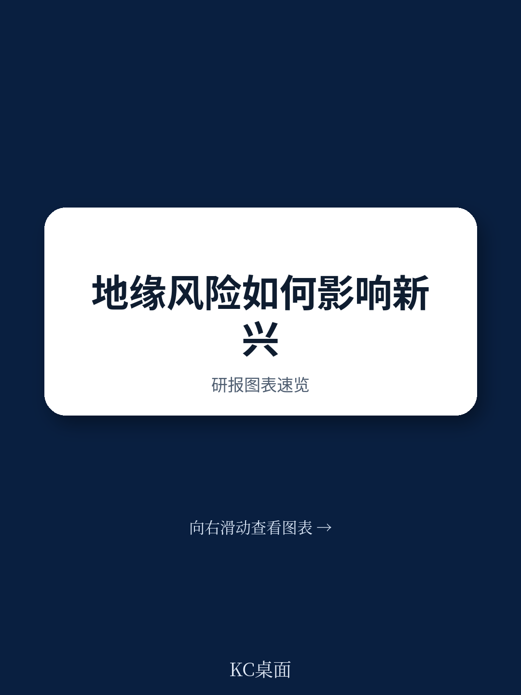
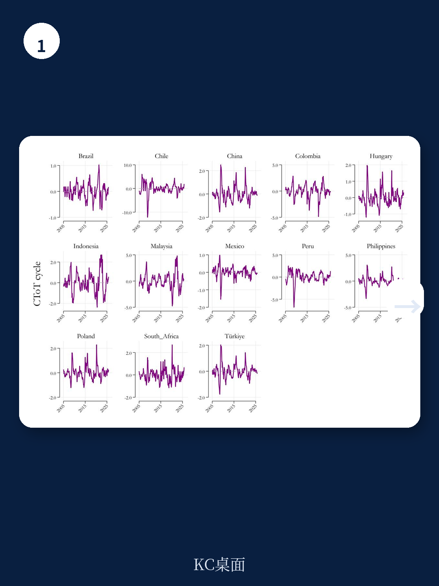
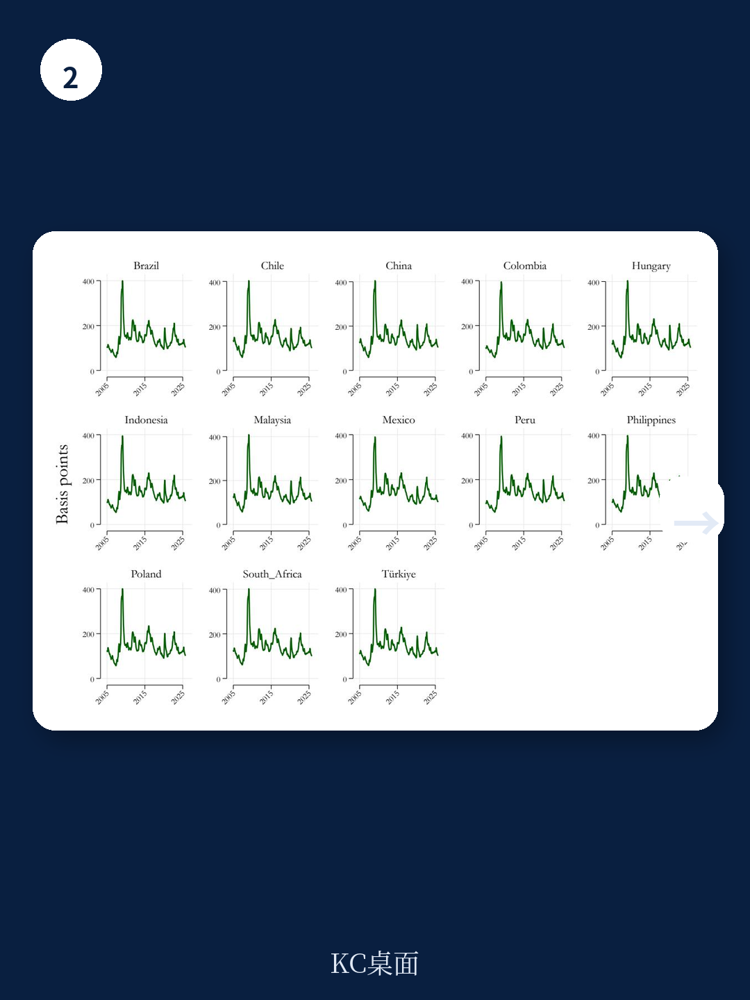

# 国际清算银行：地缘政治风险与新兴市场主权风险溢价

地缘政治不确定性如何传导至新兴市场的主权信用定价，这份来自国际清算银行的工作论文给出了一个反直觉的答案：市场对“威胁”的反应远大于对“实际行动”的反应。研究覆盖2005年至2025年13个新兴地区的月度数据，发现威胁类地缘政治事件对主权CDS和EMBI利差的推升效应显著高于已发生的军事行动。这一发现意味着，主权信用市场的定价机制中，预期调整比事后反应更为关键。

论文采用固定效应面板局部投影法，并引入状态依赖框架，以俄罗斯入侵乌克兰为分界点进行对比。结果显示，2022年2月之后，新兴市场主权不确定性对地缘政治冲击的敏感度大幅上升。这并非简单的不确定性厌恶情绪扩散，而是宏观资金基本面——债务水平、大宗商品贸易条件、全球资金条件——在特定地缘政治配置下被放大后的结果。

## 1. 威胁比行动更贵：主权信用市场的预期定价逻辑

将地缘政治不确定性指数拆分为“威胁”和“行动”两个子指数后，论文发现一个清晰的非对称模式。威胁类事件——如战争威胁、军事紧张局势升级——对主权CDS和EMBI利差的推升幅度，显著高于恐怖袭击或军事行动等实际发生的事件。这一结果在统计上稳健，且对EMBI利差的影响尤为突出。

背后的逻辑并不复杂。主权信用市场交易的是对未来违约概率的预期。威胁意味着不确定性上升，而市场对不确定性的定价往往比确定性事件更为激进。一旦威胁转化为实际行动，部分不确定性被消除，市场反而可能开始评估实际影响，而非无限放大不确定性溢价。

> **KC评论：** 这一发现对组合观察管理有直接含义。当市场只关注已发生的地缘事件时，真正的不确定性溢价可能已经体现在威胁阶段。论文中威胁子指数的脉冲响应曲线比行动子指数高出约30%-50%，这一差距在EMBI利差上更为明显。

## 2. 俄乌冲突后的状态切换：基本面配置放大了冲击

论文的关键创新在于状态依赖框架。以俄罗斯入侵乌克兰为分界点，研究比较了冲突前后新兴市场主权不确定性对地缘政治冲击的响应差异。结果清晰：后冲突时期，同样的地缘政治冲击导致CDS和EMBI利差的上升幅度显著更大。

原因在于，冲突改变了新兴市场的宏观资金基本面配置。大宗商品价格波动加剧、全球资金条件收紧、部分国家债务水平上升——这些变量本身就会影响主权违约概率。当这些基本面已经处于不利状态时，地缘政治冲击的边际效应被放大。论文的脉冲响应图显示，后冲突时期CDS利差的峰值响应约为前冲突时期的两倍。

这一发现提供了一个可复用的观察框架：评估地缘政治不确定性对主权信用的影响时，不能只看事件本身，还要看事件发生时宏观资金基本面的“状态”。同样的冲击，在不同基本面配置下，结果可能截然不同。

## 3. 两个传导渠道：宏观环境渠道与市场情绪渠道如何叠加

论文借鉴IMF全球资金稳定报告的分析框架，将地缘政治不确定性传导至主权信用的路径分为两条。宏观环境渠道通过大宗商品价格、贸易条件、财政和外部平衡发挥作用。市场情绪渠道则通过全球不确定性偏好、资本流动和外部融资成本传导。

两条渠道并非独立运行。以石油出口国为例，地缘政治冲击推高油价，宏观环境渠道可能改善其主权信用状况；但市场情绪渠道同时收紧外部融资条件，两个方向相反的效应相互抵消。论文的实证结果支持这一复杂性：不同国家、不同时期的响应存在显著异质性，单一渠道的解释力有限。

这意味着，读者和决策者需要同时追踪两条渠道的净效应，而非仅关注其中一条。论文提供的面板局部投影框架，实际上为这种多维度评估提供了方法论基础。

## 4. 对主权不确定性分析框架的启示

论文最实用的贡献，或许在于它提供了一个将地缘政治情景纳入主权不确定性分析的工具体系。传统的主权信用分析往往聚焦于债务水平、宏观环境增长、经常账户等基本面变量，地缘政治不确定性常被视为外生冲击，难以量化纳入模型。

这篇论文证明，地缘政治不确定性并非外生不可测。通过状态依赖框架，分析师可以模拟不同地缘政治情景下主权不确定性溢价的可能路径。关键在于识别哪些宏观资金基本面变量在当前状态下最为脆弱，以及地缘政治冲击会通过哪条渠道放大这些脆弱性。

对于主权债券和CDS市场的参与者而言，这意味着需要建立一套动态的情景分析能力，而非依赖静态的不确定性评级或利差模型。论文中13个新兴地区的样本显示，国家间的响应差异巨大——土耳其的CDS利差均值接近290个基点，而马来西亚仅为83个基点——这种差异本身就说明，地缘政治不确定性的影响高度依赖于每个国家的基本面配置。

For informational purposes only. Portions may be generated,translated,summarized,or edited with AI assistance based on source materials and may contain omissions or errors. Please verify independently. This is not investment,legal,tax,accounting,or other professional advice.

