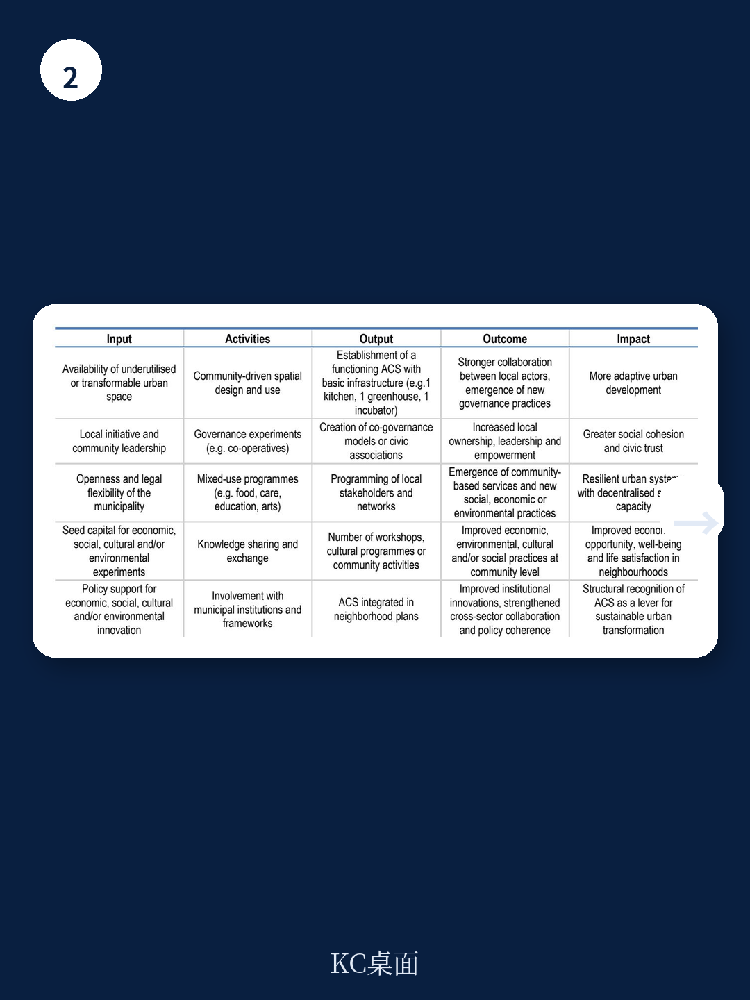

# 经合组织：城市可适应公共空间

城市管理者面临一个共同困境：大量公共空间建成后迅速固化，无法回应社区不断变化的需求。经合组织最新区域发展报告提出一个反直觉的判断——真正提升城市韧性的，不是更多、更大的公共空间，而是那些能被社区集体塑造、管理和使用的“可适应公共空间”（Adaptive Communal Space,ACS）。报告基于对阿姆斯特丹、柏林、布鲁塞尔、伊斯坦布尔、卢布尔雅那、巴黎和横滨七座城市的访谈与案例研究，指出这类空间的价值不取决于物理形态，而取决于制度条件是否允许社区成为空间的共同创造者而非单纯使用者。

## 1. 可适应公共空间的核心不是空间，是治理逻辑的转换

报告将ACS定义为由当地社区根据自身需求变化而共同塑造和管理的（半）公共空间。典型形态包括社区花园、文化创意中心、循环宏观环境修复站点等。但报告强调，ACS并非一种新的空间类型学，而是一种治理逻辑的转换——从自上而下的公共服务交付，转向社区与政府共同承担空间管理责任。

这种转换之所以重要，是因为传统公共空间在应对自然灾害、宏观环境波动、社会碎片化和信任下降等叠加不确定性时，往往暴露出刚性不足。ACS则通过激活闲置资产、降低共享使用成本、减少本地创业门槛，在六个公共价值领域产生贡献：社会连接、环境管理与资源效率、宏观环境机会、文化活动、时间适应性和制度自主性。报告特别指出，ACS的连续性“更少取决于空间形式，更多取决于有利的制度条件”，包括法律确定性、有效治理、财政能力和政策协调。

## 2. 制度条件比空间设计更能决定ACS成败

报告通过四个深度案例——阿姆斯特丹、柏林、卢布尔雅那和横滨——检验了ACS在不同治理模式和法律框架下的演化路径。一个关键发现是：法律认可、财务连续性和共同治理安排三者之间的互动，决定了ACS能否从临时实验走向制度化基础设施。

以阿姆斯特丹为例，该市通过“自由空间实验”（Expeditie Vrije Ruimte）项目，为社区主导的空间使用提供了法律灵活性和财政支持，使ACS得以在正式规划体系之外生长。柏林则更多依赖公民自发行动与市政的松散合作。报告认为，这些差异并非优劣之分，而是反映了不同制度环境下ACS的适应性策略。对于政策制定者而言，核心任务不是设计空间，而是设计让空间能够被社区持续塑造的制度框架。

> **KC评论：** 这一判断对国内城市管理者有直接参考价值。许多城市在推动社区更新时，往往先投入大量资金改造物理空间，却忽略了后续治理机制的设计。报告提醒：空间能否“活”起来，取决于社区是否有权、有钱、有法律保障去持续调整它的用途。

## 3. 政策工具箱：从“支持空间”转向“支持治理能力”

报告在第三章提出了一个可操作的公共行动检查清单，涵盖四个政策领域：法律框架、治理、财政和政策整合。其中最具启发性的是对评估方式的重新设计。报告建议采用基于六个公共价值领域的多维评估框架，将社会连接、环境管理、宏观环境机会、文化活动、时间适应性和制度自主性纳入评价体系，而非仅仅衡量空间使用率或建设成本。

这意味着，城市管理者需要从“项目审批者”转变为“治理能力读者”。报告建议的政策方向包括：在保持社区自主性的前提下提供支持、研究于治理能力、保障社区对空间和程序的准入、推动跨部门和跨层级的制度协作、通过参与式方法重新设计评估实践，以及通过适应性迭代的政策框架支持实验。

这些建议看似温和，实则指向一个更根本的转变：将ACS视为“公民基础设施”（civic infrastructure），而非临时性的社区项目。只有当城市政府将ACS纳入长期城市战略，而非作为短期社会实验来对待时，其韧性价值才能真正释放。

For informational purposes only. Portions may be generated,translated,summarized,or edited with AI assistance based on source materials and may contain omissions or errors. Please verify independently. This is not investment,legal,tax,accounting,or other professional advice.

