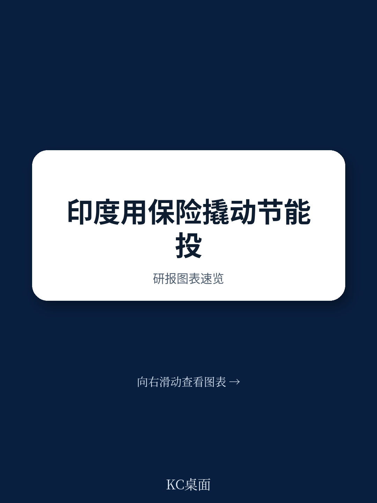
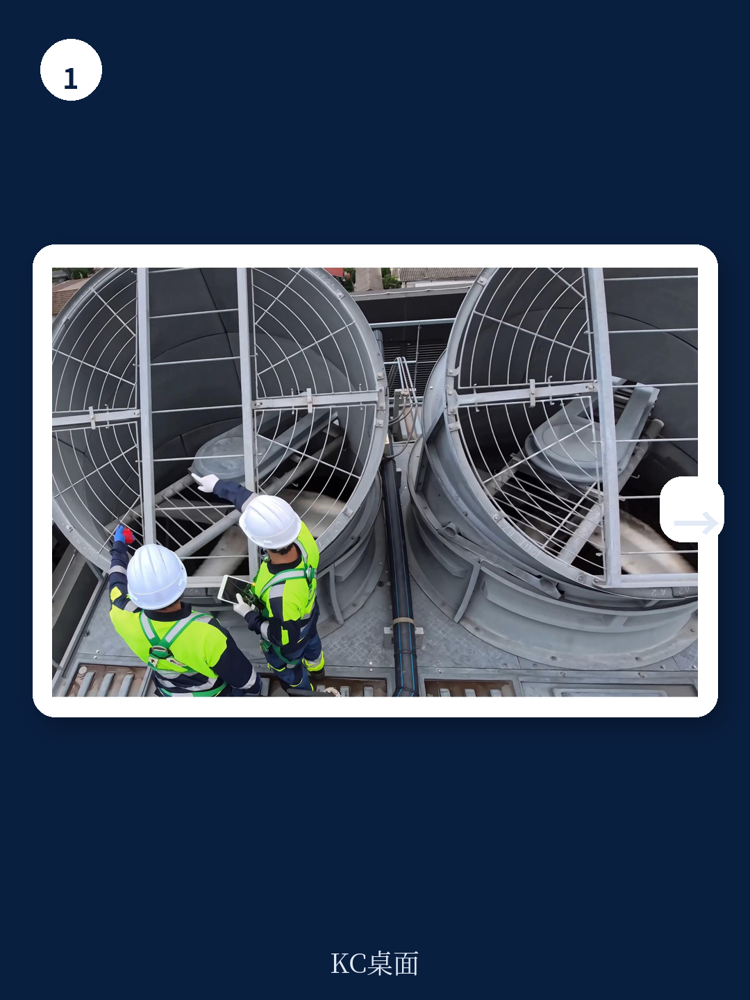
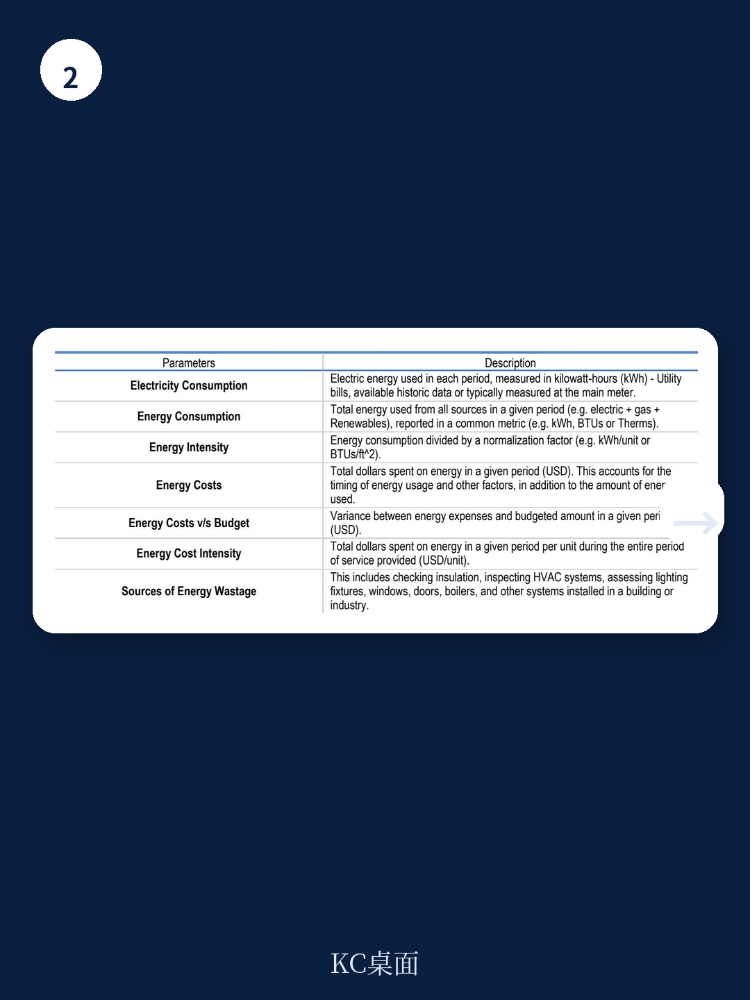

# 经合组织：印度节能保险实施路线图

印度在节能领域已经走得很远。2025年，其一次能源强度改善超过4%，是全球领先水平之一。到2026年3月，非化石能源装机容量已占53.21%，提前接近2035年60%的目标。但经合组织最新发布的《印度节能保险实施路线图》指出，真正制约节能研究从政策目标转化为市场行为的，不是技术，不是政策，而是机构对“节能收益能否兑现”的深层不信任。

这份路线图是印度能效局与经合组织CEFIM项目两年多协作的成果，核心是设计一套名为“节能保险”的资金去不确定性工具。报告认为，如果这套机制能落地，印度中小企业每年可释放的节能研究潜力将远超当前水平。

## 1. 中小企业是节能保险最合适的首发市场，但银行不愿放贷

印度中小企业贡献了约30%的GDP和45%的制造业产出，是宏观环境的重要支柱。但报告数据显示，这些企业在节能改造上面临一个典型困境：节能技术研究回收期短、内部回报率高，但银行仍将其视为高不确定性贷款。

原因在于，节能项目的收益不是现金流入，而是电费账单上的减少。银行无法直接监控“少用了多少电”，也无法在借款人违约时收回“省下来的电”。这种收益的不可见性和不可抵押性，使得中小企业即便有意愿，也难以获得融资。

经合组织认为，节能保险要解决的核心问题，就是这个信息不对称和不确定性分配问题。

> **KC评论：** 报告在多个案例中反复验证一个逻辑——节能项目的财务模型本身是成立的，问题出在银行对“节能收益”这个标的物的估值能力不足。保险在这里不是兜底，而是把不可见的收益转化为可抵押的信用增级。

## 2. 节能保险的结构设计：三方参与，但银行是真正的客户

路线图提出了一个清晰的实施架构。核心参与方包括：节能服务公司、保险公司和银行。节能服务公司负责技术方案和节能承诺，保险公司对承诺的节能效果提供担保，银行基于保险保单发放贷款。

这个结构在国际上已有先例。报告引用了美国HSB为一家医院提供的节能保险案例：项目总研究240万美元，保险覆盖了每年26万美元预期节能量的90%，贷款期限10年。保险的存在使项目的信用评级显著提升，融资成本随之下降。

但报告也坦诚指出，印度市场的特殊性在于，保险公司对节能技术缺乏定价经验，银行对保险保单的接受度也需要培育。路线图建议，先在一个行业集群内试点，比如锻造行业，积累数据后再逐步推广。

## 3. 实施路线图的核心不是技术，是建立一套可验证的基线

报告用大量篇幅讨论了“如何测量节能效果”这个看似基础的问题。它建议采用国际绩效测量与验证协议，并要求所有项目在改造前完成至少12个月的能耗基线数据采集。

这个细节恰恰揭示了节能保险落地的真正难点。节能不是一次性的工程交付，而是一个持续的过程。如果基线不准确，后续的保险赔付、银行贷款、项目评估都会失去依据。报告提出，印度能效局需要牵头建立标准化的基线数据库，并指定第三方验证机构。

从经合组织的视角看，这套机制能否成功，取决于印度能否在银行、保险、节能服务公司之间建立起一个可重复、可审计、可定价的闭环。保险只是这个闭环中的一个节点，但它承担了将“节能”这个抽象概念转化为资金产品信用锚点的功能。

路线图没有给出具体的保费定价或赔付率假设，而是把重点放在实施步骤和利益相关方的角色分配上。这本身就是一个信号：对于印度这样的市场，节能保险的落地不是产品设计问题，而是制度协调问题。
