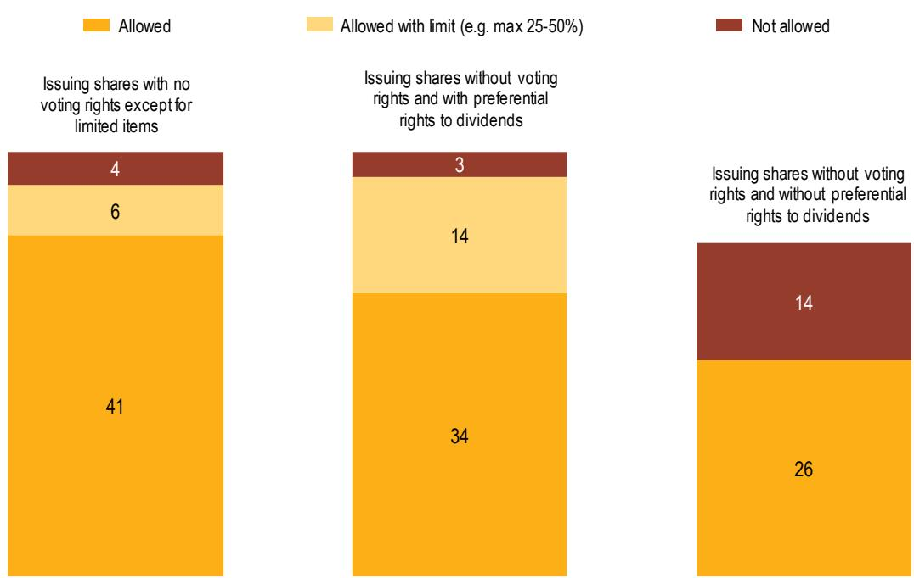
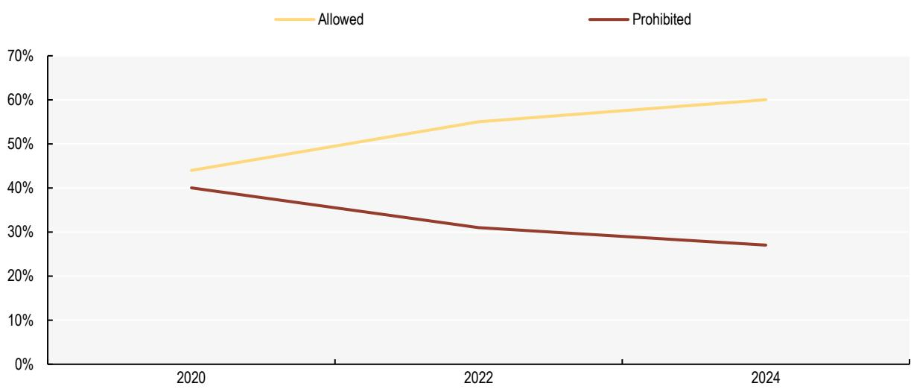

# Flexibility and investor protection in share class structures

15 July 2026

## Key messages

\- The one-share-one-vote model links voting power to economic ownership and has been the traditional approach to shareholder voting. However, flexible voting structures have deep historical roots and are increasingly accepted across many jurisdictions.

\- Global regulatory trends show growing flexibility: most jurisdictions allow non-voting shares and 60% permit shares with multiple-voting power. Regulatory competition and the need to attract innovative companies to public markets have influenced this shift.

\- Flexible equity structures can support capital market development, innovation and long-term growth. However, they may also amplify governance risks that already exist in companies with a single share class, such as entrenchment and tunneling, particularly in jurisdictions where minority shareholder protection is less developed.

\- Safeguards can help balance flexibility with investor protection, including by:

o supporting disclosure requirements by controlling shareholders, majority-abuse clauses and oversight of related-party transactions

moderating controlling shareholders' rights, for example through sunset clauses for multiple-voting shares

\- protecting low- or non-voting shareholders, for example through qualified majority approval in matters affecting their enhanced economic rights.

\- Flexible equity structures vary in design but share a common objective: enabling companies to tailor control and equity structures to their ownership profiles and strategic needs. Divergent rules may foster disparate approaches among jurisdictions on issues such as multiple-voting and non-voting shares. Policymakers may want to consider regulatory frameworks focused on transparency, fairness and safeguards, rather than promoting specific capital structures. This can support market attractiveness and efficiency while protecting investors.

## What's the issue?

The debate over the one-share-one-vote model versus more flexible equity structures raises a fundamental policy question: should voting power strictly follow equity ownership, or can deviations from this principle improve corporate performance, capital formation and market outcomes?

The one-share-one-vote model entails that voting power is proportional to economic ownership. Under this model, shareholders who bear the economic risk of the residual value of a company's cashflows exercise a corresponding degree of control. This corporate governance structure has been often associated with alignment of voting power with economic interest among investors, transparency in decision making and the mitigation of agency problems between controlling and minority shareholders.

Differentiated voting structures are not new. The French Code de Commerce of 1807 already allowed exceptions (Ventoruzzo, 2015[1]). Over time, however, many jurisdictions moved in the opposite direction, tightening rules or banning such structures altogether. In the United States, for example, the New York Stock Exchange barred dual-class share companies from 1940 to 1986, covering both multiple-voting and non-voting shares. Similar restrictions appeared elsewhere, driven by concerns that unequal voting rights could undermine shareholder protections and corporate accountability (Ghezzi, Mosca and Passador, 2022[2]; Hopt and Kals, 2024[3]).

In recent years, however, a growing number of jurisdictions have moved away from strict adherence to the one-share-one-vote principle and have embraced more flexible equity structures. These arrangements are an expression of contractual freedom in corporate law, allowing companies to tailor their governance and control structures to company-specific characteristics, ownership profiles or strategic needs. The G20/OECD Principles of Corporate Governance acknowledge that companies may issue different classes of shares, as long as shareholders within each class are treated equally, that the use of such structures is disclosed, and that any changes in economic or voting rights are subject to approval by those classes of shares that are negatively affected (OECD, 2023[4])

Evidence from the OECD Corporate Governance Factbook 2025 suggests that such flexibility is widespread: no less than $90\%$ of jurisdictions allow companies to issue shares with no voting rights (except for limited items). Ninety-two per cent also permit listed companies to issue shares with preferential rights to dividends, with some jurisdictions limiting them to a certain percentage of the equity capital (Figure 1). In addition, $60\%$ of jurisdictions now allow companies to issue shares with different voting power, up from $44\%$ in 2020 (Figure 2). Examples of countries that have recently updated their regulatory frameworks to permit shares with multiple-voting rights include the People's Republic of China, Ireland, Mexico and Saudi Arabia (OECD, 2025[5]).

More flexible equity capital structures, including non-voting shares and multiple-voting rights, are increasingly used by publicly traded companies in several markets. Since the early 2000s, a growing number of new listed companies, particularly in innovation-driven sectors, have adopted differentiated voting structures at the time of their initial public offerings (Tallarita, 2024[6]).

Policymakers may want to also consider which safeguards can effectively manage the governance risks that unequal voting structures may enhance. The challenge is to increase market efficiency by encouraging competitiveness, flexibility and market access while maintaining investor protection, accountability, and trust.

Figure 1. Issuance of shares with limited or no voting rights  
  
Note: Based on 52 jurisdictions. For the category “Issuing shares with no voting rights except for limited items” data are presented for the 51 jurisdictions which specify whether the category is allowed or not. For the category “Issuing shares without voting rights and with preferential rights to dividends” data are presented for 51 jurisdictions which specify whether the category is allowed or not for the category “Issuing shares without voting rights and without preferential rights to dividends” data are presented for the 40 jurisdictions that specify whether the category is allowed or not.

Source: OECD (2025[5]), OECD Corporate Governance Factbook 2025, https://doi.org/10.1787/f4f43735-en.

## Potential benefits and risks associated with different share class structures

## What are the potential benefits of flexible equity structures and multiple-voting shares?

An important argument in favour of flexible equity structures such as multiple-voting rights shares is for cases where founders may generate value in retaining strategic control after listing to preserve their long-term vision for the company. In sectors like tech or life sciences, founders' expertise and vision are often critical assets, and retaining control can help secure their time commitment to the company and strategic continuity. As long as the value created by their vision and expertise surpasses any risks or losses created by the misalignment of interests caused by the differentiated voting rights, such an equity structure could maximise the value of the company.

A second, related but more pragmatic, argument concerns situations in which the value created by the vision and expertise of a company's controlling shareholder may be uncertain, yet investors may still be willing to invest in a company with a multiple-voting share structure. This may be the case where the valuation discount associated with the misalignment of interests created by such rights is sufficiently large (Cremers, Lauterbach and Pajuste, 2018[7]), or where the company offers meaningful diversification benefits to investors. In these circumstances, allowing multiple-voting shares may be even beneficial for the economy as a whole as more companies would be encouraged to access public markets rather than remaining private or delaying their initial public offerings (Anderson et al., 2024[8]).

Empirical evidence suggests that these governance arrangements may be associated with higher levels of innovative activity. For example, dual-class share structures are associated with greater corporate risktaking, such as a higher propensity to engage in mergers and acquisitions (M&A) compared to single class firms (Kim, 2023[9]). Further, research also finds positive association with innovation such as patent output, patent citations and the breadth of industries affected by patented technologies. While such structures may be associated with lower firm valuation on average, increased innovation may partly offset these effects (Baran, Forst and Via, 2018[10]).

## What are the potential risks and governance concerns associated with these structures?

Unequal voting rights, as well as low-vote or non-voting shareholders (e.g. preference shares), may raise the risk of decisions that disadvantage minority shareholders. This divergence may weaken the alignment between risk-bearing and control, increasing agency costs and raising concerns about the equitable treatment of shareholders.

Such structures may also lead to entrenchment of controlling shareholders holding less than half of the shares. Research highlights how the costs of entrenchment tend to rise as companies mature and founder-related benefits diminish (Bebchuk and Kastiel, 2017[11]). Empirical evidence also shows that firms with dual-class or multiple-voting rights structures may trade at a valuation discount, particularly when the gap between control and ownership is large or persistent (Cremers, Lauterbach and Pajuste, 2018[7]).

Another dimension of the debate relates to the complexity and diversity of flexible equity structures. Variations such as multiple-voting rights shares, loyalty or tenure shares can all significantly affect the degree of control. However, while they may all allow for a minority of equity owners to have corporate controlling power, they do so in different ways, potentially increasing the analytical costs of an investor understanding the specific equity capital structure when deciding how to value its shares.

In light of the above, overly restrictive regimes may discourage founder-led companies from going public, potentially affecting the attractiveness and competitiveness of public capital markets. These considerations underline the need for carefully calibrated regulatory frameworks that address governance risks while avoiding unintended market distortions.

## A range of flexible equity structures

Flexible equity structures encompass a range of mechanisms that depart from the one-share-one-vote principle by allowing voting power to differ from economic ownership. These arrangements vary in design but often share a common objective: enabling companies to tailor control and equity structures to their specific ownership profiles and strategic needs.

The most considered form are multiple-voting rights shares, under which companies issue at least two classes of shares with different voting rights. Typically, founders or early-stage investors hold shares with enhanced voting power, while public investors hold shares with lower voting rights. Variations of this model include super-voting shares, which may carry significantly higher voting power, often combined with safeguards such as transfer restrictions for the super-voting shares or automatic conversion into ordinary shares upon sale.

Another approach is the use of loyalty or tenure voting rights, under which shareholders who hold their shares for a specified period are granted additional voting power. Belgium, France, Italy and Spain allow loyalty share schemes for listed companies with a minimum holding period of two years and a standard double-voting ratio. In France and Italy, higher multipliers are also permitted (OECD, 2025[5]). Unlike dual-class structures, which concentrate control in specific shareholders, loyalty voting rights are generally available to all shareholders and lapse upon transfer of shares with the intention of encouraging long-term ownership. The OECD Corporate Governance Factbook shows that the share of jurisdictions that allow multiple-voting rights or fractional shares rose from $44\%$ in 2020 to $60\%$ in 2024 (Figure 2). This number includes also jurisdictions that only allow loyalty voting rights (OECD, 2025[5]).

Figure 2. Issuance of shares with a different number of votes per share, 2020-2024  
  
Note: The data are for 52 jurisdictions in 2024, 49 in 2022 and 50 in 2020.  
Source: OECD (2025[5]), OECD Corporate Governance Factbook 2025, https://doi.org/10.1787/f4f43735-en.

Companies may also issue non-voting or low-voting shares. These shares offer stronger economic rights, such as priority or fixed dividends, while offering limited or no influence over corporate decisions. The OECD Corporate Governance Factbook shows that 92% of jurisdictions permit such preference shares, up from 73% in 2014. Some jurisdictions impose a share capital limit for these shares. For instance, three countries (France, Korea, Romania) allow them only up to 25% of the share capital, nine countries allow them up to 50%, and Czechia allows them up to 90% (Figure 1) (OECD, 2025[5]).

Compared with multiple-voting rights structures, non-voting or low-voting shares are more widely allowed by jurisdictions as shown above. Owners of preference shares may be more focused on the enhanced economic rights that are generally provided through their dividends, rather than on control. However, as multiple-voting structures, non-voting or low-voting shares may also generate similar governance concerns related to the divergence between share ownership and related economic rights versus control rights (Tallarita, 2024[6]).

The following examples illustrate this:

\- In company A, shareholders holding 100 shares with ten votes each would control the company if the ordinary shareholders owned 900 shares with only one vote each. The owners of the multiple-voting shares would have 53% of the votes, and only 10% of the equity share.

\- In company B, shareholders holding 100 ordinary shares with one vote each would also control the company if the preferential shareholders owned 900 shares. The owners of the ordinary shares would have 100% of the votes, and, just like the owners of multiple-voting shares in company A, only 10% of the equity share.

What is also interesting is how limits to the number of votes per share or the ratio of preferred shares over all shares established by some jurisdictions can be easily circumvented in practice, considering flexibility in economic rights for preferred shares:

\- In company C, incorporated in a jurisdiction that allows preference shares only up to 25% of the share capital, shareholders holding 100 ordinary shares with one vote each would also control the company if the preferential shareholders owned 33 shares in conformance with the threshold. The owners of the ordinary shares would have 100% of the votes, and just like the owners of multiple- and ordinary voting shares in companies A and B, would receive only 10% of dividends, if preferential shareholders were provided with a high enough dividend ratio (in this case, 27 times) to obtain the same outcome.

## Differences in timing of adoption of voting structures

Regulatory frameworks differ significantly in their treatment of when flexible voting rights structures may be introduced, particularly distinguishing between arrangements established at the time of the initial public offering and those introduced after a company is listed.

In some jurisdictions that permit multiple-voting rights structures, classes with multiple votes must be established prior to the initial public offering and disclosed at listing (OECD, 2025[5]). This approach reflects the principle that investors should be able to assess and price the governance structure when deciding whether to participate in the offering. Markets such as Hong Kong (China), Singapore, the United Kingdom, and the United States follow this model, allowing differentiated voting rights at listing but generally restricting, or placing significant regulatory burdens on the introduction of new or modified structures once a company is public (OECD, 2025[5]). As part of the European Listing Act, which came into force in December 2024, the EU approved the Multiple-Vote Share Structures Directive to be implemented by December 2026. This EU Directive establishes common rules on multiple-vote share structures for companies seeking admission to trading of their shares on multilateral trading facilities (MTFs), where those companies do not already have shares admitted to trading on an MTF or a regulated market, while leaving it to member countries to adopt safeguards for shareholders without multiple-voting rights (articles 1 and 4).

By contrast, the issuance of multiple-voting shares after listing is often restricted or subject to strict approval requirements. Such changes may dilute the voting power of existing shareholders who invested under a different governance structure, raising concerns about fairness and investor protection if shareholders do not have the right to block the issuance of multiple-voting shares. An important exception concerns loyalty or tenure-based voting rights, which can typically be introduced after listing, as they apply equally to all shareholders and reward long-term ownership rather than nominally privileging a specific group. For example, in Spain, loyalty shares can be introduced with a qualified majority, and the provision must be renewed every five years (OECD, 2025[5]).

This distinction has become a key dimension of corporate governance policy. Multiple-voting rights structures may be considered more acceptable at the initial public offering stage, as investors may, for instance, voluntarily choose to preserve commitment and the long-term vision of founders. By contrast, introducing or expanding such structures after listing may be more contentious, notably if it is done without the explicit consent of all investors.

In recent years, there has been a trend towards greater flexibility at the initial public offering stage, driven in part by regulatory competition among jurisdictions seeking to enhance the attractiveness of their markets. At the same time, ongoing policy and academic discussions emphasise the need to balance the potential benefits of deviations from the one-share-one-vote model with the risks associated with the separation of voting rights from economic ownership.

## Safeguards and regulatory design across different equity capital structures

The use of flexible equity capital structures, whether through multiple-voting rights or non-voting shares, raises important questions about how to mitigate governance risks while preserving their potential benefits. When such frameworks are allowed, regulatory frameworks therefore typically combine flexibility with a range of safeguards aimed at limiting the separation between control and economic ownership and protecting minority investors.

For multiple-voting rights structures, safeguards primarily focus on addressing the risks of entrenchment and the long-term divergence between control and ownership. One example of such a safeguard is the use of sunset clauses, which automatically eliminate or convert enhanced voting rights after a specified period or triggering event. As noted also above, research suggests that the advantages of these voting structures tend to diminish over time, while associated costs, such as agency problems, increase as controllers reduce their economic stake without giving up control (Bebchuk and Kastiel, 2017[11]).

Sunset clauses may take different forms, including:

• time-based sunsets (e.g. 5-10 years after initial public offering)

• event-based sunsets (e.g. departure or death of the founder)

\- ownership-based sunsets, where multiple-voting rights lapse once the controlling shareholder's economic stake falls below a specified threshold or when enhanced voting rights granted on the basis of an individual shareholder's specific characteristics are transferred to another shareholder.

Another example of a safeguard is an event-based or resolution-specific voting sterilisation, which aims to temporarily neutralise multiple-voting right structures for exceptional corporate decisions. In Italy, a 2026 Italian reform introduced such limitations on both multiple-voting and loyalty shares for specific general meeting resolutions, which can have significant implications for minority shareholders. Specifically, multiple-voting and loyalty shares are temporarily neutralised for resolutions such as M&A transactions, leading to delisting, cross-border seat transfers or transferring of listing to an alternative market, which therefore require approval under the one-share-one-vote principle.

For loyalty shares, some jurisdictions require periodic renewal of loyalty voting rights through shareholder approval, ensuring that such mechanisms remain subject to ongoing investor consent.

Jurisdictions often rely on a broader set of policies with the goal of protecting minority shareholders. These include voting ratio caps, which limit the voting power of individual shareholders, and transfer restrictions on multiple-voting shares.

For example, in Denmark, Finland, Norway and Sweden, the long-standing use of multiple-voting shares is combined with strong minority shareholder rights to mitigate potential risks (Eckbo, Paone and Urheim, 2011[12]) (Lekvall, 2019[13]). In these Nordic countries, corporate law provides strong protection for investors holding non-multiple-voting shares through a combination of safeguards, including: a robust principle of equal and fair treatment, qualified majority requirements for major decisions, high transparency standards, shareholder pre-emption rights, and meaningful minority rights such as to request minimum dividends, appoint minority auditors, or seek special examinations (Svenskt Näringsliv, 2023[14]).

Safeguards for non-voting and low-voting shares, including preference shares, focus on protecting investors who have limited or no governance influence. These mechanisms typically rely more on contractual and economic protections than on voting rights. A key safeguard is the use of class approval rights, whereby holders of such shares must approve changes that directly affect their rights, such as dividend entitlements or liquidation preferences. Additional safeguards include:

\- priority to receive fixed dividends or cumulative dividend rights if dividends are not received in a specific year

\- clear disclosure of share class rights, including voting limitations and economic entitlements

\- conversion or contingency rights, allowing shares to gain voting rights in certain circumstances (e.g. non-payment of dividends)

• right to elect one board member

\- share capital limits, which restrict the proportion of non-voting shares in total equity capital to prevent excessive dilution of voting rights.

As these instruments are more widely accepted across jurisdictions (OECD, 2025[5]), the key policy concern is less about concentration of control and more about protecting investors with reduced governance rights. Policymakers must also consider circumvention risks, as limits on multiple-voting rights may prompt firms to adopt alternative tools, such as non-voting shares, as an alternative to preserve control (Bebchuk and Kastiel, 2017[11]).

Overall, the design of safeguards reflects a broader policy objective: to balance flexibility in equity capital structures with investor protection and market confidence. As a result, policymakers increasingly focus not only on whether such structures should be permitted, but also on how safeguards can be calibrated across instruments to achieve consistent outcomes.

## What issues policymakers and other stakeholders may consider?

\- The increasing use of flexible equity capital structures, including multiple-voting rights and non-voting shares, highlights the need for carefully calibrated regulatory frameworks that balance flexibility with investor protection ensuring that their use supports capital market development and innovation. Rather than focusing solely on whether such structures should be permitted, the debate is increasingly centred on how they are designed and implemented.

\- The effective protection of minority shareholders in companies with different classes of shares benefits from requirements or recommendations applicable to good corporate governance also seen in companies with only ordinary shares, such as the transparency of ownership structures and oversight of related-party transactions. For example, policymakers may consider the role of clear and effective disclosure of different share class structures, including where and how such information is presented to investors, such as in prospectuses, regulatory filings, corporate governance reports, or company websites.

\- Policymakers and companies may consider allowing the post-IPO adoption of multiple-voting rights only with safeguards ensuring the approval of shareholders whose rights may be affected. They may also consider time- or event-based safeguards, such as sunset clauses or periodic shareholder approval, to address the potentially decreasing benefits of founder control as companies mature.

\- Additional safeguards may help balance flexibility with investor protection, such as those directly connected to the rights of low- or non-voting shareholders, for example by requiring a qualified majority of shareholders in a class in matters affecting their enhanced economic rights. Development and dissemination of guidance on responsible founder practices may also help respect contractual freedom while identifying good practices to protect investors and mitigate risks of abuse of controlling power.

\- Policymakers may also consider reducing the risk of regulatory arbitrage between different capital structures. For instance, minority shareholders in companies with multiple-voting rights and those in companies with non-voting shares but no multiple-voting rights may face very similar risks. Policymakers may therefore wish to assess whether comparable protections are available in both cases.

## References

Anderson, R. et al. (2024), Control risk premium: Dual-class shares, family ownership, and minority investor returns, https://onlinelibrary.wiley.com/doi/10.1111/fima.12481.

Baran, L., A. Forst and M. Via (2018), How Dual Class Share Structures Affect Innovation, https://clsbluesky.law.columbia.edu/2018/07/16/how-dual-class-share-structures-affect-innovation/.

Bebchuk, L. and K. Kastiel (2017), “The untenable case for perpetual dual-class stocks”, Virginia Law Review, Vol. 103/4, https://virginialawreview.org/wp-content/uploads/2020/12/Bebchuk%20&%20Kastiel\_Book.pdf.

Cremers, M., B. Lauterbach and A. Pajuste (2018), The Life-Cycle of Dual Class Firm Valuations, https://www.ecqi.global/sites/default/files/The%20Life-Cycle%20of%20Dual%20Class%20Firm%20Valuations-%20Paper.pdf.

Eckbo, B., G. Paone and R. Urheim (2011), Efficiency of Share-Voting Systems: Report on Sweden, https://papers.ssrn.com/sol3/papers.cfm?abstract\_id=1651582.

Ghezzi, F., C. Mosca and M. Passador (2022), “Rereading the “One Share, One Vote” Principle: [2] Is It Also a Matter of Competition?”, The University of Chicago Business Law Review, Vol. 1, pp. 157-193.

Hopt, K. and S. Kals (2024), Multiple-voting shares in Europe - A comparative law and economic analysis, https://papers.ssrn.com/sol3/papers.cfm?abstract\_id=4887591. [3]

Kim, S. (2023), “Dual-class share structure and firm risks”, Pacific-Basin Finance Journal, https://www.sciencedirect.com/science/article/pii/S0927538X23001506?via%3Dihub.

Lekvall, P. (2019), The Swedish Corporate Governance Model, [13] https://bolagsstyrning.se/Userfiles/Publikationer/Artiklar\_och\_presentationer/Eng/the\_swedish\_corporate\_governance\_model - article\_in\_the\_iod\_2019.pdf.

OECD (2025), OECD Corporate Governance Factbook 2025, OECD Publishing, Paris, [5] https://doi.org/10.1787/f4f43735-en.

OECD (2023), G20/OECD Principles of Corporate Governance 2023, OECD Publishing, Paris, [4] https://doi.org/10.1787/ed750b30-en.

Svenskt Näringsliv (2023), Dual class share structures with differentiated voting rights, https://www.svensktnaringsliv.se/bilder\_och\_dokument/evagop\_final-february-2023-dual-class-share-structurespdf\_1195673.html/FINAL+February+2023+Dual+class+share+structures\_1.pdf. [14]

Tallarita, R. (2024), “Dual-Class Contracting”, The Journal of Corporation Law, Vol. 49:5, pp. 971-1041, https://jcl.law.uiowa.edu/sites/jcl.law.uiowa.edu/files/2024-09/Tallarita\_Final.pdf.

Ventoruzzo, M. (2015), “The Disappearing Taboo of Multiple Voting Shares: Regulatory Responses to the Migration of Chrysler-Fiat”, Vol. 288/Law Working Paper, https://www.ecgi.global/sites/default/files/working\_papers/documents/SSRN-id2574236.pdf.

This work is issued under the responsibility of the Secretary-General of the OECD, and does not necessarily reflect the official views of OECD Member countries.

This document, as well as any data and map included herein, are without prejudice to the status of or sovereignty over any territory, to the delimitation of international frontiers and boundaries and to the name of any territory, city or area.

The statistical data for Israel are supplied by and under the responsibility of the relevant Israeli authorities. The use of such data by the OECD is without prejudice to the status of the Golan Heights, East Jerusalem and Israeli settlements in the West Bank under the terms of international law.

© OECD 2026

## Attribution 4.0 International (CC BY 4.0)

This work is made available under the Creative Commons Attribution 4.0 International licence. By using this work, you accept to be bound by the terms of this licence (https://creativecommons.org/licenses/by/4.0/).

Attribution – you must cite the work.

Translations – you must cite the original work, identify changes to the original and add the following text: In the event of any discrepancy between the original work and the translation, only the text of original work should be considered valid.

Adaptations – you must cite the original work and add the following text: This is an adaptation of an original work by the OECD. The opinions expressed and arguments employed in this adaptation should not be reported as representing the official views of the OECD or of its Member countries.

Third-party material – the licence does not apply to third-party material in the work. If using such material, you are responsible for obtaining permission from the third party and for any claims of infringement.

You must not use the OECD logo, visual identity or cover image without express permission or suggest the OECD endorses your use of the work.

Any dispute arising under this licence shall be settled by arbitration in accordance with the Permanent Court of Arbitration (PCA) Arbitration Rules 2012. The seat of arbitration shall be Paris (France). The number of arbitrators shall be one.