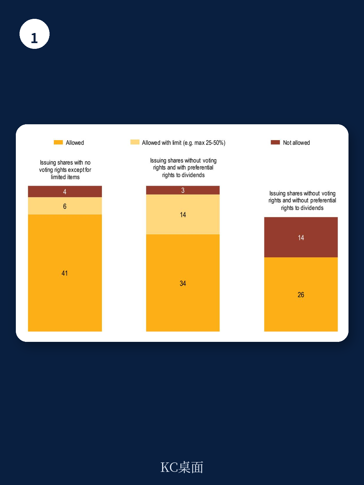

# 经合组织：股权结构中的灵活性与投资者保护

全球公司治理正在经历一场静默但深刻的转向。经合组织最新发布的报告揭示了一个关键事实：截至2024年，60%的司法管辖区允许公司发行不同投票权的股份，这一比例在2020年仅为44%。更值得注意的是，92%的辖区允许发行无投票权或有限投票权的优先股。这股潮流并非突然兴起，而是过去二十年间，从创新驱动型行业的IPO开始，逐步向更广泛的资本市场蔓延。

报告的核心判断是：灵活的股权结构本身不是问题，问题在于缺乏配套的读者保护机制。经合组织并未简单站队支持或反对一股一票，而是提供了一个分析框架——当创始人控制权带来的长期价值创造超过代理成本时，差异化投票权结构可以提升公司价值；但当公司成熟、创始人优势消退后，控制权与现金流权的持续偏离则可能带来估值折价和少数股东利益受损的不确定性。

## 1. 这股趋势的驱动力来自监管竞争与创新企业的IPO需求

经合组织的数据显示，允许多重投票权股份的辖区占比在四年间从44%跃升至60%，中国、爱尔兰、墨西哥和沙特阿拉伯是近期更新监管框架的典型代表。背后的逻辑并不复杂：全球交易所为了争夺高增长、创始人主导的科技和生命科学公司上市，不得不放宽对一股一票的严格限制。香港、新加坡、英国和美国都允许在IPO时设立差异化投票权，但通常限制或严格监管上市后引入新结构。

报告特别指出，欧盟2024年12月生效的《上市法案》中包含了多重投票权股份指令，要求成员国在2026年底前实施，这标志着欧洲大陆正式加入这场监管竞争。对于政策制定者而言，核心权衡在于：过于严格的制度可能迫使创始人公司留在私募市场，损害公开市场的吸引力和竞争力。

> **KC评论：** 报告提供了一个容易被忽略的视角——限制优先股占总股本比例的辖区，在实践中可能被轻易规避。例如，一个辖区规定优先股不得超过股本的25%，但通过将优先股股息率设定为普通股的27倍，同样可以实现10%的股权控制100%投票权的效果。这意味着，单纯的数量限制不如关注宏观环境权利与控制权的实质偏离。

## 2. 差异化投票权与无投票权股份在不确定性上趋同，但监管待遇可能不同

报告通过三个假设案例清晰地展示了这一点：在A公司中，持有10倍投票权的股东用10%的股权控制了53%的投票权；在B公司中，持有普通股的股东同样用10%的股权控制了100%的投票权，因为优先股股东放弃了投票权以换取更高的股息。两种结构在“控制权与现金流权偏离”这一核心不确定性上完全等价，但许多辖区对两者的监管却截然不同。

经合组织提醒政策制定者，应当评估两种结构下的读者保护是否具有可比性。如果无投票权优先股被广泛允许而多重投票权受到严格限制，可能产生监管套利空间——公司可以通过调整股权结构设计，在形式上合规的同时实现实质上相同的控制权集中。

## 3. 日落条款和分类表决是平衡灵活性与读者保护的关键工具

报告没有停留在不确定性描述层面，而是给出了具体的政策工具箱。对于多重投票权股份，日落条款是最直接的制衡机制——当创始人离职、股份转让或经过特定年限后，超级投票权自动失效。实证研究表明，随着公司成熟，创始人相关收益递减而控制权固化成本递增，日落条款恰好回应了这一生命周期问题。

对于无投票权或低投票权股东，报告建议赋予他们在影响其宏观环境权利的重大事项上的分类表决权。这包括股息政策变更、股份合并或优先权调整等。此外，关联交易监督、控股股东信息披露义务和多数股东滥用条款，构成了保护少数股东的三道防线。

## 4. 忠诚投票权正在成为一股一票与多重投票权之间的第三条道路

法国、意大利、比利时和西班牙允许上市公司实施忠诚投票权制度——持股满两年的股东自动获得双倍投票权，且这一权利对所有股东平等开放。与多重投票权不同，忠诚投票权可以在上市后引入，因为它不针对特定股东群体，而是奖励长期持有行为。西班牙甚至要求该条款每五年重新获得股东批准。

经合组织认为，这种结构在理论上更接近一股一票的精神，因为投票权的差异源于持股时间而非股东身份。但它同样需要警惕：如果机构读者或短期交易者被排除在控制权之外，长期股东可能形成新的固化利益集团。报告没有给出结论，但提出了一个值得观察的方向。

---

For informational purposes only. Portions may be generated,translated,summarized,or edited with AI assistance based on source materials and may contain omissions or errors. Please verify independently. This is not investment,legal,tax,accounting,or other professional advice.

