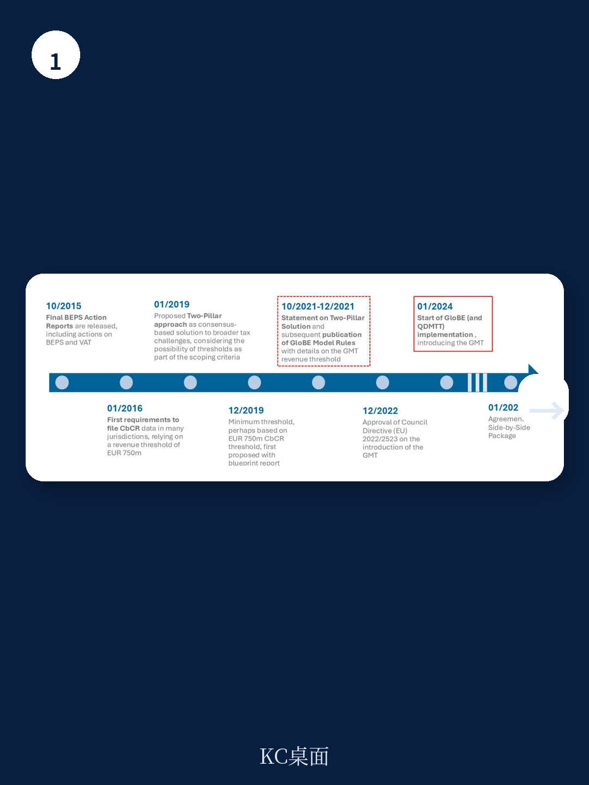
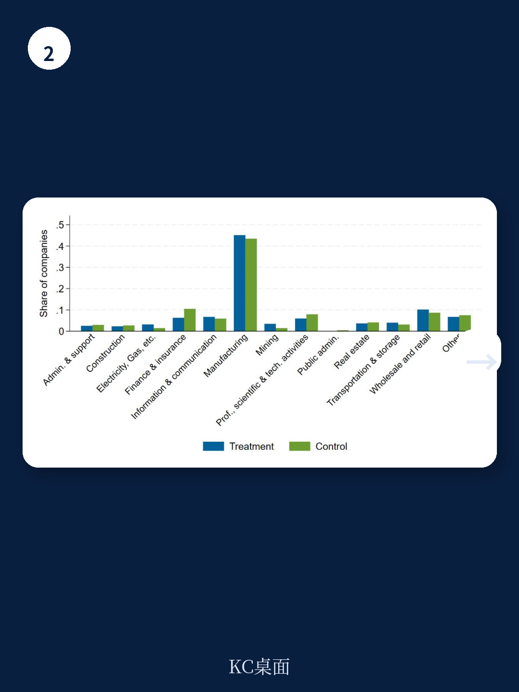

# 经合组织：跨国企业对全球最低税的反应

2024年全球最低税（GMT）正式生效，这是国际税收体系数十年来最根本的一次变革。经合组织最新工作论文首次基于实施后的实际数据，给出了一个既在预期之内又超出部分预判的答案：受该规则覆盖的大型跨国企业，其合并有效税率在首年上升了1.4至1.7个百分点，但集团层面的研究和就业并未出现统计上显著的下降。这一结果与许多事前模拟中“加税必然抑制研究”的线性推演形成了对照。

论文采用双重差分方法，利用GMT覆盖门槛（营收7.5亿欧元）两侧的企业作为处理组和对照组。样本涵盖2022至2024年的集团层面财务数据，这是目前最早一批能够检验GMT实际效果的经验研究。研究区分了两个时期：2022至2023年的“公告期”（规则已公布但未生效）和2024年的“实施期”。结果显示，公告期并未引发企业提前调整行为，真正的变化发生在规则落地之后。

> **KC评论：** 公告期无反应这一点值得注意。它暗示企业可能直到规则正式执行前，仍对补税机制的实际力度存有观望，或者调整税负结构需要更长的准备周期。这对理解未来几年政策传导节奏有参考价值。

## 1. 有效税率上升集中于高税筹倾向企业，并非均匀分布

整体1.4个百分点的有效税率上升，背后存在显著的结构性差异。论文将样本按行业税筹密集度、无形资产占比、利润与有形资产比率等维度做了异质性分析。结果清晰指向一个群体：那些在规则实施前有效税率较低、更可能从事激进税务规划的企业，其税率上升幅度最大。具体而言，此前低税率跨国企业的有效税率上升约1.7个百分点，高于全样本均值。

无形资产密集型企业同样是税率上升的集中领域。这与GMT的设计逻辑一致——该规则通过“基于实质的 carve-out”排除了部分有形资产和工资对应的利润，使得高利润、低实质的企业成为补税的主要目标。论文的数据印证了这一机制正在发挥作用。

## 2. 研究与就业未现调整，短期“无痛加税”可能来自规则设计

这是整份报告最可能引发讨论的发现。在实施首年，处理组企业的资本支出和员工人数相对于对照组没有显著变化。论文进一步检验了不同规模、不同总部所在地（是否已实施收入纳入规则）的子样本，结果基本一致。

研究者给出了几种可能的解释。最直接的一条是：GMT的“基于实质的 carve-out”降低了边际有效税率对研究的扭曲。换句话说，规则允许企业从税基中扣除与实质宏观环境活动（有形资产和工资）相关的回报，这使得额外研究所面临的边际税率并未显著上升。此外，首年数据可能只反映了短期调整，企业尚未完成对全球架构的重新配置，真正的研究效应可能需要更长时间才能显现。

> **KC评论：** 这里需要区分“集团总研究不变”和“研究地点不变”。论文明确承认，其分析聚焦于集团层面的合并数据，无法排除企业将研究从低税区转移到高税区的可能性。如果后续研究用国别数据检验，发现研究在地区间发生了再分配，那么整体研究不变并不意味着所有地区都受益。

## 3. 首年全球税收增量约790至1090亿欧元，低于事前预测但量级相近

基于有效税率上升幅度和全球大型跨国企业利润总额，论文估算GMT在2024年带来了790亿至1090亿欧元的额外企业所得税收入，相当于全球企业所得税总收入的2.4%至3.4%。这一数字低于Hugger等人（2024）基于事前数据预测的长期增量，但量级相当。

研究者提醒，这一估算仅基于首年数据，后续可能因三个因素而变化：更多辖区完成国内立法、基于实质的 carve-out 逐步缩减、以及低税利润规则（UTPR）和Side-by-Side协议全面生效。这些机制目前尚未完全运转，意味着税收增量仍有上行空间。

论文没有回避数据的局限性。Orbis数据库的覆盖范围、集团层面数据无法捕捉的跨境利润再分配、以及首年可能存在的合规滞后，都意味着当前结论需要后续年份的数据来验证。但对于政策制定者和跨国企业而言，这份报告提供了一个难得的锚点：全球最低税不是一次性的税收冲击，而是一个正在逐步嵌入企业决策框架的制度变量。
