# OECD Economic Surveys: United Kingdom 2026

July 2026

Volume 2026/20

## OECD Economic Surveys: United Kingdom 2026

This work was approved and declassified by the Economic and Development Review Committee on 9 June 2026.

This document, as well as any data and map included herein, are without prejudice to the status of or sovereignty over any territory, to the delimitation of international frontiers and boundaries and to the name of any territory, city or area.

The statistical data for Israel are supplied by and under the responsibility of the relevant Israeli authorities. The use of such data by the OECD is without prejudice to the status of the Golan Heights, East Jerusalem and Israeli settlements in the West Bank under the terms of international law.

## Note by the Republic of Türkiye

The information in this document with reference to “Cyprus” relates to the southern part of the Island. There is no single authority representing both Turkish and Greek Cypriot people on the Island. Türkiye recognises the Turkish Republic of Northern Cyprus (TRNC). Until a lasting and equitable solution is found within the context of the United Nations, Türkiye shall preserve its position concerning the “Cyprus issue”.

Note by all the European Union Member States of the OECD and the European Union

The Republic of Cyprus is recognised by all members of the United Nations with the exception of Türkiye. The information in this document relates to the area under the effective control of the Government of the Republic of Cyprus.

Kosovo\*: This designation is without prejudice to positions on status, and is in line with United Nations Security Council Resolution 1244/99 and the Advisory Opinion of the International Court of Justice on Kosovo's declaration of independence.

## Please cite this publication as:

OECD (2026), OECD Economic Surveys: United Kingdom 2026, OECD Publishing, Paris, https://doi.org/10.1787/aa997c6e-en.

ISBN 978-92-64-64848-7 (print)
ISBN 978-92-64-45314-2 (PDF)
ISBN 978-92-64-76494-1 (HTML)

OECD Economic Surveys
ISSN 0376-6438 (print)
ISSN 1609-7513 (online)

OECD Economic Surveys: United Kingdom
ISSN 1995-3445 (print)
ISSN 1999-0502 (online)

Photo credits: Cover © Sergii Figurnyi/Shutterstock.com.
Chapter 1 © Claudia8c/Shutterstock.com.
Chapter 2 © I Wei Huang/Shutterstock.com.
Chapter 3 © Robert Harding Video/Shutterstock.com.
Chapter 4 © mark stephens photography/Shutterstock.com.

Corrigenda to OECD publications may be found at: https://www.oecd.org/en/publications/support/corrigenda.html.

© OECD 2026

## Attribution 4.0 International (CC BY 4.0)

This work is made available under the Creative Commons Attribution 4.0 International licence. By using this work, you accept to be bound by the terms of this licence (https://creativecommons.org/licenses/by/4.0/).

Attribution – you must cite the work.

Translations – you must cite the original work, identify changes to the original and add the following text: In the event of any discrepancy between the original work and the translation, only the text of the original work should be considered valid.

Adaptations – you must cite the original work and add the following text: This is an adaptation of an original work by the OECD. The opinions expressed and arguments employed in this adaptation should not be reported as representing the official views of the OECD or of its Member countries.

Third-party material – the licence does not apply to third-party material in the work. If using such material, you are responsible for obtaining permission from the third party and for any claims of infringement.

You must not use the OECD logo, visual identity or cover image without express permission or suggest the OECD endorses your use of the work.

Any dispute arising under this licence shall be settled by arbitration in accordance with the Permanent Court of Arbitration (PCA) Arbitration Rules 2012. The seat of arbitration shall be Paris (France). The number of arbitrators shall be one.

The Secretariat's draft report was prepared for the Committee by Daniela Glocker and Nicolas Gonne under the supervision of Aida Caldera-Sanchez. Research inputs from Lucia Russo and Karine Perset from the OECD Directorate for Science, Technology and Innovation, as well as from Mike Cressey from the OECD Governance Directorate are gratefully acknowledged. Research assistance was provided by Monica Quinza Armenta, editorial assistance was provided by Rosario Cruz Hernando and Michelle Ortiz, and communication assistance was provided by Laura Fortin and François Iglesias.

This Survey is published under the responsibility of the Economic and Development Review Committee of the OECD, which is in charge of the examination of the economic situation of member countries.

The economic situation and policies of the United Kingdom were reviewed by the Committee on 9 June 2026 with the participation of representatives of the UK authorities. The draft report was then revised in light of the discussions and given final approval as the agreed report of the whole Committee on 1 July 2026.

The cut-off date for data used in the Survey is 25 June 2026.

The previous Survey of the United Kingdom was issued in September 2024. Information about this and previous Surveys and more information about how Surveys are prepared is available at https://www.oecd.org/en/topics/economic-surveys.html.

## Table of contents

Foreword 3   
Basic statistics of the United Kingdom, 2025 7   
Executive summary 8   
1 Strengthening growth while ensuring fiscal sustainability 17   
1.1. The economy has improved but faces major challenges 18   
1.2. Monetary restriction remains needed until inflation is durably under control 28   
1.3. Heightened financial market risks call for continued vigilance 30   
1.4. Fiscal discipline and reforms will be key to sustaining growth 34   
Recommendations on strengthening growth while ensuring fiscal sustainability 49   
References 50   
2 Ensuring state pension sustainability while closing gaps in private pension savings 55   
2.1. The pension system features strengths and weaknesses 56   
2.2. Long-term fiscal vulnerabilities in state pensions must be addressed 59   
2.3. Supporting private pension savings for groups with coverage gaps is key 65   
Recommendations on ensuring pension sustainability and affordability 68   
References 69   
3 Strengthening energy security in the transition to net zero 73   
3.1. The green transition is reshaping energy security challenges 74   
3.2. Enhancing energy security through coordinated decarbonisation 75   
3.3. Embedding climate resilience in electricity system planning 86   
Recommendations to strengthen energy security 88   
References 89   
4 Reducing regional productivity gaps to raise aggregate growth 92   
4.1. Raising aggregate productivity by narrowing regional gaps 93   
4.2. Addressing structural drivers of regional productivity gaps 98   
4.3. Improving the financial and administrative capacity of subnational governments to deliver regional productivity gains 117   
Recommendations to reduce regional productivity disparities 131   
References 132

## FIGURES

Figure 1. Per capita growth has gradually strengthened but remains subdued
Figure 2. The triple lock creates significant fiscal risks
Figure 3. Electricity prices remain high
Figure 4. Regional productivity disparities persist
Figure 1.1. Per capita growth has stagnated, reflecting structural constraints
Figure 1.2. Domestic demand supported the recovery from the 2021-2023 energy shock
Figure 1.3. Domestic price pressures persist
Figure 1.4. Trade remains weak in goods and strong in services
Figure 1.5. Monetary policy has eased, while inflation expectations remain elevated
Figure 1.6. Household and non-financial corporation risks are contained
Figure 1.7. The banking system appears sound
Figure 1.8. The public finances are under pressure
Figure 1.9. Structural reforms are key to ensuring fiscal sustainability
Figure 1.10. Public spending is relatively high in health and in defence
Figure 1.11. Spending pressures from health-related welfare are significant
Figure 1.12. The tax structure appears balanced and conducive to growth
Figure 1.13. Small firms' weak compliance reflects both system complexity and tax avoidance
Figure 1.14. Large tax expenditures entail unnecessary economic distortions
Figure 1.15. The additionality of public support for R&D activities could be evaluated
Figure 2.1. A sound system and better demography underpin adequate pension outcomes
Figure 2.2. Fiscal risks and pockets of inadequate savings weigh on affordability
Figure 2.3. The triple lock introduces significant uncertainty to public pension expenditure
Figure 2.4. Fiscal risks from the triple lock are asymmetrically skewed to the upside
Figure 2.5. Subdued employment could start weighing on the sustainability of state pensions
Figure 2.6. The self-employed participate less in private pensions
Figure 2.7. Gender gaps are large in both retirement income and part-time employment
Figure 3.1. The United Kingdom is a global leader in reducing emissions, but electricity prices are high
Figure 3.2. Electricity remains more expensive than gas for industry and households
Figure 3.3. Heat pump deployment remains below levels required to reduce gas dependence
Figure 3.4. Strong carbon pricing has supported EV uptake
Figure 3.5. Carbon price disparities weaken incentives to electrify heating
Figure 3.6. Grid connection backlogs constrain renewable deployment
Figure 3.7. Renewables and short-duration flexibility will need to expand until 2030
Figure 3.8. Wind has replaced coal in electricity generation
Figure 3.9. As renewables increase, system flexibility requirements need to adjust
Figure 4.1. Productivity growth in the United Kingdom has been weak over the past decade
Figure 4.2. UK labour productivity disparities are in line with the OECD average
Figure 4.3. Labour productivity varies widely across UK regions
Figure 4.4. Most productivity differences across the United Kingdom arise from differences within regions rather than between regions
Figure 4.5. Productivity and employment are concentrated within few regions and sectors
Figure 4.6. Educational outcomes differ across regions at early stages
Figure 4.7. Adult skills are above the OECD average in most regions
Figure 4.8. Skills shortages and vacancy rates differ markedly across UK regions
Figure 4.9. Transport infrastructure investment is concentrated in the London region
Figure 4.10. Digital connectivity has improved across England, with some remaining regional gaps
Figure 4.11. SMEs in the London region lead in adopting digital technologies
Figure 4.12. UK R&D spending is around the OECD average but highly spatially concentrated
Figure 4.13. Business dynamism is around EU peers but has declined over time
Figure 4.14. Equity investment is highly concentrated in the London region
Figure 4.15. Devolution plan to streamline government in England
Figure 4.16. Local authorities real available funding remains below 2010 levels
Figure 4.17. Local revenues are limited in the United Kingdom
Figure 4.18. Vertical fiscal imbalances are large in the United Kingdom
Figure 4.19. Trust in government has declined over time
Figure 4.20. Control of corruption remains high by OECD standards but has weakened

## TABLES

Table 1. Growth will slow temporarily 10  
Table 1.1. Estimated GDP impact of selected structural reforms 19  
Table 1.2. Macroeconomic indicators and projections 26  
Table 1.3. Low-probability events that could lead to major changes in the outlook 27  
Table 1.4. General government fiscal indicators and projections 36  
Table 1.5. Estimated budgetary impact of selected tax and spending measures 40  
Table 1.6. Previous recommendations on improving efficiency in the tax system 47  
Table 2.1. Previous recommendations on pro-work reforms in benefits, tax, and skills policy 64  
Table 2.2. Previous recommendations on support for childcare provision and family policy 67  
Table 3.1. Past recommendations on price signals, heat pump and EV adoption 79  
Table 4.1. Past recommendations on education and lifelong learning 105  
Table 4.2. Past recommendations on improving businesses access to finance 117  
Table 4.3. Past recommendations on raising local authorities' funds 127

## BOXES

Box 1.1. The government's Growth Mission 20  
Box 1.2. Progress on trade agreements and the new UK Trade Strategy 25  
Box 1.3. Adapting financial supervision to climate and cyber-risks 34  
Box 1.4. Fiscal rules under the Charter for Budget Responsibility 38  
Box 1.5. Reviews of tax expenditure: the cases of France and Canada 45  
Box 2.1. Structure, main features and recent reforms of the UK pension system 57  
Box 2.2. Asymmetric fiscal risks from triple-lock indexation: stochastic simulations 61  
Box 2.3. Australia's pension indexation system: balancing adequacy and fiscal sustainability 62  
Box 3.1. Moving from reactive to anticipatory grid investment in Europe 81  
Box 4.1. Renewed focus on the young through the reform to the UK apprenticeship levy (Growth and Skills Levy) and the Youth Guarantee 101  
Box 4.2. The UK: Leveraging Artificial Intelligence for Growth, Skills and Regional Development 110  
Box 4.3. International Examples of Staged Digital Adoption Support for SMEs 111  
Box 4.4. The UK Catapult network in international perspective 116  
Box 4.5. An asymmetric devolution process across the United Kingdom 119  
Box 4.6. Ten guidelines for effective assignment of responsibilities to make decentralisation work 122  
Box 4.7. Local government funding reform in England 127

Basic statistics of the United Kingdom, 2025 (Numbers in parentheses refer to the OECD average)

<table><tr><td colspan="6">LAND, PEOPLE AND ELECTORAL CYCLE</td></tr><tr><td>Population (million, 2024)</td><td>69.2</td><td></td><td>Population density per km2 (2024)</td><td>286.1</td><td>(39.6)</td></tr><tr><td>Under 15 (%, 2024)</td><td>17.2</td><td>(16.7)</td><td>Life expectancy at birth (years, 2023)</td><td>81.0</td><td>(81.2)</td></tr><tr><td>Over 65 (%, 2024)</td><td>19.5</td><td>(18.6)</td><td>Men (2023)</td><td>79.0</td><td>(78.6)</td></tr><tr><td>International migrant stock (% of population, 2024)</td><td>17.1</td><td>(15.7)</td><td>Women (2023)</td><td>82.9</td><td>(83.8)</td></tr><tr><td>Latest 5-year average growth (%)</td><td>0.8</td><td>(0.5)</td><td>Latest general election</td><td colspan="2">July 2024</td></tr><tr><td colspan="6">ECONOMY</td></tr><tr><td>Gross domestic product (GDP)</td><td></td><td></td><td>Value added shares (%, 2024)</td><td></td><td></td></tr><tr><td>In current prices (billion USD)</td><td>4 003.8</td><td></td><td>Agriculture, forestry and fishing</td><td>0.7</td><td>(2.5)</td></tr><tr><td>In current prices (billion GBP)</td><td>3 036.9</td><td></td><td>Industry including construction</td><td>18.3</td><td>(25.7)</td></tr><tr><td>Latest 5-year average real growth (%)</td><td>3.2</td><td>(3.0)</td><td>Services</td><td>81.0</td><td>(71.8)</td></tr><tr><td>Per capita (thousand USD PPP)2</td><td>65.3</td><td>(64.9)</td><td></td><td></td><td></td></tr><tr><td colspan="6">GENERAL GOVERNMENT</td></tr><tr><td>Expenditure (OECD: 2024)</td><td>46.1</td><td>(42.6)</td><td>Gross financial debt (OECD: 2024)</td><td>102.3</td><td>(109.5)</td></tr><tr><td>Revenue (OECD: 2024)</td><td>40.6</td><td>(37.8)</td><td>Net financial debt (OECD: 2024)</td><td>75.7</td><td>(65.8)</td></tr><tr><td colspan="6">EXTERNAL ACCOUNTS</td></tr><tr><td>Exchange rate (GBP per USD)</td><td>0.76</td><td></td><td>Main exports (% of total merchandise exports)3</td><td></td><td></td></tr><tr><td>PPP exchange rate (USA = 1)</td><td>0.67</td><td></td><td>Machinery and electronics</td><td>25.2</td><td></td></tr><tr><td>In per cent of GDP</td><td></td><td></td><td>Stone, glass and precious materials</td><td>19.5</td><td></td></tr><tr><td>Exports of goods and services</td><td>30.6</td><td>(29.9)</td><td>Transportation</td><td>10.9</td><td></td></tr><tr><td>Imports of goods and services</td><td>31.9</td><td>(29.7)</td><td>Main imports (% of total merchandise imports)3</td><td></td><td></td></tr><tr><td>Current account balance</td><td>-2.4</td><td>(-0.4)</td><td>Machinery and electronics</td><td>20.2</td><td></td></tr><tr><td>Net international investment position</td><td>-6.7</td><td></td><td>Stone, glass and precious materials</td><td>19.8</td><td></td></tr><tr><td></td><td></td><td></td><td>Transportation</td><td>11.5</td><td></td></tr><tr><td colspan="6">LABOUR MARKET, SKILLS AND INNOVATION</td></tr><tr><td>Employment rate (aged 15 and over, %, OECD: 2024)</td><td>60.7</td><td>(58.0)</td><td>Unemployment rate, Labour Force Survey (aged 15 and over, %, OECD: 2024)</td><td>4.8</td><td>(4.9)</td></tr><tr><td>Men (OECD: 2024)</td><td>64.2</td><td>(65.4)</td><td>Youth (aged 15-24, %, OECD: 2024)</td><td>15.0</td><td>(11.1)</td></tr><tr><td>Women (OECD: 2024)</td><td>57.4</td><td>(51.0)</td><td>Long-term unemployed (1 year and over, %, OECD: 2024)</td><td>1.0</td><td>(1.0)</td></tr><tr><td>Participation rate (aged 15 and over, %, OECD: 2024)</td><td>63.8</td><td>(61.0)</td><td>Tertiary educational attainment (aged 25-64, %, 2024)</td><td>53.8</td><td>(41.8)</td></tr><tr><td>Average hours worked per year</td><td>1,533</td><td>(1 736)</td><td>Gross domestic expenditure on R&amp;D (% of GDP, 2023, OECD:2024)</td><td>2.8</td><td>(2.7)</td></tr><tr><td colspan="6">ENVIRONMENT</td></tr><tr><td>Total primary energy supply per capita (toe, 2024)</td><td>2.1</td><td>(3.7)</td><td>CO2 emissions from fuel combustion per capita (tonnes, 2024)</td><td>4.1</td><td>(7.5)</td></tr><tr><td>Renewables (%, 2024)</td><td>15.3</td><td>(13.1)</td><td>Water abstractions per capita (1 000 m3, 2014)</td><td>0.1</td><td></td></tr><tr><td>Exposure to air pollution (more than 10 μg/m3of PM 2.5, % of population, 2020)</td><td>51.0</td><td>(56.5)</td><td>Municipal waste per capita (tonnes, 2023, OECD: 2024)</td><td>0.4</td><td>(0.5)</td></tr><tr><td colspan="6">SOCIETY</td></tr><tr><td>Income inequality (Gini coefficient, 2023, OECD: latest available)</td><td>0.367</td><td>(0.316)</td><td>Education outcomes (PISA 2022 score)</td><td></td><td></td></tr><tr><td>Relative poverty rate (%, 2023, OECD: 2022)</td><td>12.6</td><td>(11.4)</td><td>Reading</td><td>494</td><td>(476)</td></tr><tr><td>Median disposable household income (thousand USD PPP, 2023, OECD: 2022)</td><td>31.7</td><td>(32.5)</td><td>Mathematics</td><td>489</td><td>(472)</td></tr><tr><td>Public and private spending (% of GDP)</td><td></td><td></td><td>Science</td><td>500</td><td>(485)</td></tr><tr><td>Health care (2024)</td><td>11.1</td><td>(9.3)</td><td>Share of women in parliament (%, 2024)</td><td>40.5</td><td>(33.3)</td></tr><tr><td>Pensions (2022, OECD: 2021)</td><td>8.0</td><td>(9.9)</td><td>Net official development assistance (% of GNI)</td><td>0.4</td><td>(0.4)</td></tr><tr><td>Education (total spending, 2020)</td><td>6.3</td><td>(5.1)</td><td></td><td></td><td></td></tr></table>

Note: The year is indicated in parenthesis if it deviates from the year in the main title of this table. Where the OECD aggregate is not provided in the source database, a simple OECD average of latest available data is calculated where data exist for at least 80% of member countries.
1. OECD aggregate refers to weighted average.  
2. Based on HS2 classification and labelling from the World Bank, World Integrated Trade Solution (WITS).  
Source: Calculations based on data extracted from databases of the following organisations: OECD, International Energy Agency, International Labour Organisation, International Monetary Fund, United Nations, World Bank.

# Executive summary

## Key messages

The UK economy has stabilised, but activity remains subdued and the evolving conflict in the Middle East is testing its resilience. High and volatile energy prices, rising fiscal pressures, weak productivity growth and large regional disparities continue to weigh on economic performance and living standards. The government's pro-growth agenda is broadly appropriate and aligned with past OECD recommendations. Success will hinge on sustaining the structural reform momentum while maintaining sound macroeconomic and fiscal policies.

\- Fiscal discipline remains essential, building on recent improvements to the fiscal framework. High public debt, high interest payments and rising spending pressures, particularly in health and social care, limit fiscal space. Continuing to strengthen the fiscal framework, reallocating spending towards productivity-enhancing investment and improving tax efficiency would help to rebuild fiscal buffers and support long-term growth.

\- Rising long-term spending pressures also call for pension reforms. Preserving pension adequacy while containing fiscal risks will require reviewing state pension indexation over time, strengthening work incentives, and improving private pension savings for groups with coverage gaps.

\- Strengthening energy security is essential for growth, competitiveness and resilience to external shocks. While progress in decarbonising electricity generation is reducing reliance on fossil fuels, energy costs remain high and continue to weigh on households and firms. Better-aligned price signals, alongside faster investment in electricity networks and system flexibility are needed to support rapid electrification and reduce exposure to gas price volatility.

\- Reducing regional productivity gaps is key to raising growth and living standards. Progress requires a coherent long-term strategy that aligns skills, infrastructure, innovation and finance, supported by strong local governance capacities to unlock the full productivity potential of all regions.

## The economy has improved but faces external headwinds and enduring structural constraints

The United Kingdom faces a challenging economic environment, as past supply shocks and adverse external conditions, including high energy prices, trade tensions and the exit from the EU single market, continue to weigh on activity and public finances. The government's ambitious and comprehensive pro-growth reform agenda, focused on investment, planning and labour supply, provides a strong basis for a gradual recovery. Sustaining stronger growth and higher living standards will require continued structural reforms alongside macroeconomic discipline.

Long-standing structural weaknesses continue to weigh on the UK economy (Figure 1). Weak productivity growth since the mid-2010s has eroded potential output, reflecting subdued business investment, lower EU trade intensity, skill mismatches and persistent regional disparities. Fewer people are participating in the labour market, partly due to rising health-related inactivity and lower inward migration. Continued reliance on gas leaves the economy exposed to global energy shocks, weighing on competitiveness and affordability.

Structural reforms are critical to boost growth and living standards amidst persistent fiscal pressures. The government's Growth Mission aims to strengthen economic potential through public investment, planning reform, industrial policy and labour market measures. Achieving stronger and more durable growth will require sustained implementation of structural reforms to raise productivity and improve economic resilience. Priorities include increasing labour supply, accelerating infrastructure and electricity network investment, reducing barriers to trade and enhancing local governance to support growth across regions.

Figure 1. Per capita growth has gradually strengthened but remains subdued
Real GDP per capita, 2016 = 100  
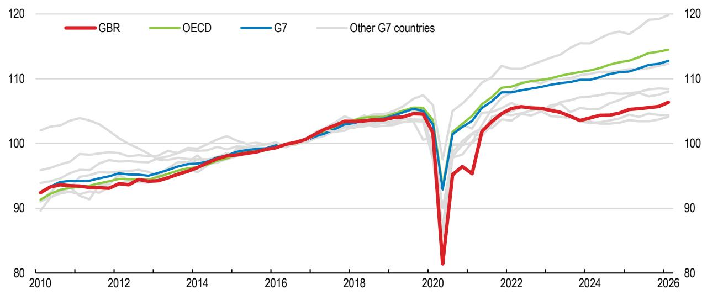  
Note: OECD and G7 refer to weighted averages.  
Source: OECD Economic Outlook: Statistics and Projections (database).  
StatLink https://stat.link/dm0yfl

The growth outlook remains modest amidst global uncertainty and renewed energy inflation

GDP growth will slow temporarily in the near term as renewed inflationary pressures due to the evolving conflict in the Middle East and uncertainty weigh on demand. Tight financial conditions and weak external demand are expected to restrain investment and exports. Growth is expected to strengthen gradually from 2027 as inflation pressures ease.

Growth strengthened following the 2021-2023 energy crisis. Stronger domestic demand led the recovery, supported by disinflation and rising real wages. It more than offset subdued external demand, which reflects especially weak goods exports. Service activity expanded as household consumption recovered.

Renewed energy inflation due to the evolving conflict in the Middle East has weakened near-term growth prospects (Table 1). This comes on top of continued global trade uncertainty and still tight financial conditions, which are weighing on investment and exports. Growth is expected to strengthen gradually from 2027 as price pressures ease, real incomes recover further and financial conditions become less restrictive. Risks remain tilted

to the downside, particularly if a prolonged Middle East conflict further increases energy prices or global trade fragmentation intensifies.

The monetary and fiscal policy mix is appropriately restrictive given lingering inflationary pressures and high public debt. The Bank of England has begun to gradually withdraw monetary restriction while remaining attentive to inflation risks. In parallel, the government has started to remove budgetary support and rebuild fiscal buffers. Careful calibration of macroeconomic policies remains essential given significant downside risks to economic activity and upside risks to inflation. The government's fiscal response to the energy shock is appropriately targeted and preserves price signals, thus minimising the negative impact on the fiscal position.

Table 1. Growth will slow temporarily
Annual growth rates (%), unless specified

<table><tr><td></td><td>2023</td><td>2024</td><td>2025</td><td>2026</td><td>2027</td></tr><tr><td>Real GDP</td><td>0.3</td><td>1.0</td><td>1.4</td><td>0.9</td><td>1.1</td></tr><tr><td>Private consumption</td><td>-0.4</td><td>-0.2</td><td>1.0</td><td>0.4</td><td>0.5</td></tr><tr><td>Government consumption</td><td>2.1</td><td>2.9</td><td>1.6</td><td>1.7</td><td>2.8</td></tr><tr><td>Investment</td><td>0.5</td><td>1.7</td><td>4.3</td><td>0.0</td><td>1.5</td></tr><tr><td>Net trade contribution (% points)</td><td>-0.2</td><td>-0.5</td><td>-0.7</td><td>-0.3</td><td>-0.1</td></tr><tr><td>Current account balance (% of GDP)</td><td>-3.6</td><td>-3.0</td><td>-2.4</td><td>-3.5</td><td>-3.8</td></tr><tr><td>Consumer price index</td><td>7.3</td><td>2.5</td><td>3.4</td><td>3.7</td><td>2.4</td></tr><tr><td>Unemployment rate (%)</td><td>4.0</td><td>4.3</td><td>4.8</td><td>5.5</td><td>5.3</td></tr><tr><td>Fiscal balance (% of GDP)</td><td>-6.0</td><td>-6.1</td><td>-5.5</td><td>-5.1</td><td>-4.4</td></tr><tr><td>Public debt (% of GDP)</td><td>98.8</td><td>99.9</td><td>102.3</td><td>103.9</td><td>105.4</td></tr></table>

Source: OECD Economic Outlook: Statistics and Projections (database).

The financial sector appears broadly resilient, but growing reliance on non-bank finance has increased exposure to liquidity risks. Banks maintain strong capital and liquidity positions, and aggregate household and corporate indebtedness remains relatively low. However, increased interconnectedness with non-bank financial intermediaries and the growing importance of liquidity backstops heighten vulnerability to liquidity shocks. The gilt market is also exposed, as non-banks are major holders of government debt. Strengthening oversight of non-bank financial intermediaries would further support financial stability.

## Tax and spending reforms are needed to rebuild fiscal space and support growth

Modest growth, high public debt, high interest payments and increasing spending pressures from ageing, climate and defence are limiting fiscal space. Recent changes to the fiscal framework provide greater flexibility for productivity-enhancing investment, but further improvements are needed to strengthen the predictability of fiscal decisions, alongside targeted spending restraint and reforms to improve tax efficiency. At the same time, raising long term growth will depend on effective implementation of the government's supply-side reforms.

Current fiscal plans aim to support growth while rebuilding fiscal space, but leave limited room for manoeuvre. Public investment is set to rise over 2025-27, largely financed through borrowing, while compliance with fiscal targets depends on higher revenues and spending restraint towards the end of the decade. Although the revised fiscal framework is an improvement, fiscal policy messaging remains overly focused on short-term headroom against fiscal rules, encouraging short-term fiscal decisions and weakening predictability. Relying on a broader assessment of fiscal sustainability would support more stable decision-making and improve the effectiveness of the framework.

Long term fiscal sustainability will require reforms to contain rising spending pressures in pensions, healthcare and disability. With taxes already at historically high levels, expenditure-led consolidation will be essential. Adhering to planned departmental spending paths will be necessary but insufficient. Rising healthcare, disability and special education costs reflect demographic pressures and structural inefficiencies. Improving public sector productivity through targeted reforms and spending reductions will be key to preserve service quality within tighter budgets.

Tax reforms should prioritise strengthening efficiency and revenues rather than raising headline rates. The tax burden is already high, while the system remains complex and distortionary. Many tax expenditures narrow the tax base and are not systematically evaluated, while persistent compliance gaps point to weaknesses in enforcement. Strengthening tax administration, reducing inefficient tax expenditures and differences across legal forms would improve revenues while supporting growth.

## Pension reforms are needed to ensure the sustainability and adequacy of the system

The pension system delivers adequate outcomes on average, supported by the complementarity between the state and private pensions. However, rising fiscal pressures from state pensions and insufficient private pension savings among some groups create growing challenges. Addressing them will require reforming state pension indexation, strengthening work incentives to broaden the financing base, and supporting private pension savings, particularly among the self-employed.

Under the triple lock, state pensions have risen significantly faster than earnings, adding fiscal pressures and uncertainty, particularly during periods of macroeconomic volatility or weak growth (Figure 2). Reforming the triple lock is necessary to reduce fiscal risks, but requires careful preparation and consideration of public acceptability.

Weakness in labour market participation risks eroding the financing base of state pensions. Youth employment has remained subdued since the pandemic and long-term sickness due to mental ill-health is high. The reform of work incentives within the health-related welfare system has stalled, with a review underway to address the gatekeeping of disability benefits. Advancing these reforms is critical to support higher employment and ensure a broad contribution base for the pension system.

Private pension participation has increased significantly through automatic enrolment, but coverage among some groups remains low. Participation is weak among the self-employed, partly reflecting heterogeneity in income, including for those with low and volatile earnings. Extending automatic enrolment to the self-employed, while preserving the right to opt-out, could help broaden private pension coverage and improve retirement incomes.

Figure 2. The triple lock creates significant fiscal risks
OBR projections of state pension expenditure, % of GDP  
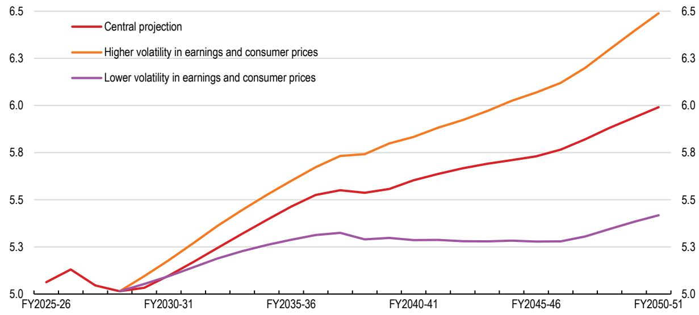  
Source: OBR (2025[1]) Fiscal Risk and Sustainability: July 2025.  
StatLink https://stat.link/h0s1le

## Decarbonising power generation is central to energy security and competitiveness

Greenhouse gas emissions halved since 1990, and renewables now generate more than half of electricity supply. However, recent energy price spikes have highlighted the economy's continued exposure to volatile fossil fuel prices. Decarbonisation reduces reliance on imported fossil fuels, but also changes the nature of energy security risks. As electricity becomes the central energy source, ensuring affordable, reliable and resilient supply will require reforms that address price stability, expand grid capacity, and improve system flexibility and climate resilience.

Electricity prices remain high and closely linked to international gas markets (Figure 3), weakening incentives to electrify and prolonging exposure to fossil fuel price volatility. Gas-fired plants frequently set marginal wholesale prices, while policy and network charges fall more heavily on electricity. Narrowing the electricity–gas price gap by reducing electricity levies, phasing out fossil fuel support and expanding carbon pricing would improve price signals while preserving incentives to reduce emissions. Any support measures introduced in response to future energy price shocks should remain temporary and targeted to vulnerable households.

Removing grid bottlenecks is essential to support rapid electrification and unlock clean energy investment. Rapid growth in renewable generation and electricity demand has turned the grid into a binding constraint and a central energy security risk. Although enough projects have been in the pipeline to meet the government's ambition of a largely clean power system by 2030, the previous first come first served connection process did not prioritise projects that were already built or strategically important. Recent reforms prioritising ready-to-proceed projects should help accelerate clean energy investment where it is most needed. Swift implementation and clear communication with investors will be important, along with monitoring and potentially linking connection priority with developer's delivery progress on milestones.

Strengthening the climate resilience of the electricity grid is essential for energy security as extreme weather events become more frequent. Although transmission and distribution operators have developed adaptation plans, implementation remains uneven and oversight limited. Regular cross-sectoral stress testing, stronger reporting and better data sharing will be essential for monitoring progress and improving emergency response.

Figure 3. Electricity prices remain high  
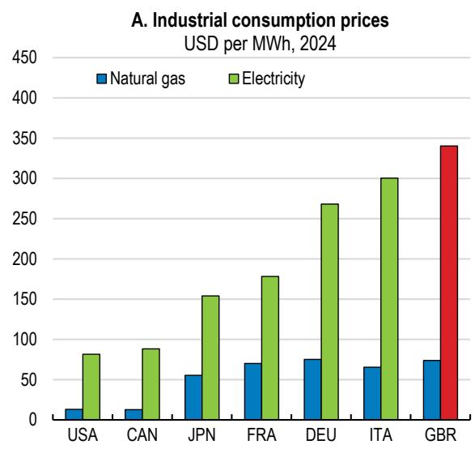  
Source: IEA Energy Prices (database).

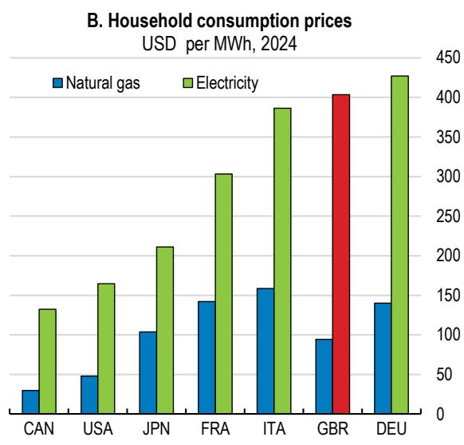  
StatLink https://stat.link/1zx4i5

## Reducing regional productivity gaps would raise aggregate growth

Regional productivity gaps continue to weigh on overall economic performance. Although interregional gaps are broadly in line with OECD averages, recent convergence has largely reflected stagnation in high-performing areas rather than sustained catch-up in lagging regions (Figure 4). Sustained productivity convergence will require consistent implementation of recent government strategies and ongoing devolution efforts across England. A coherent long-term approach that aligns skills, infrastructure, innovation, finance and governance is essential to unlock productivity growth across regions.

Figure 4. Regional productivity disparities persist
GVA per worker, in thousand GBP  
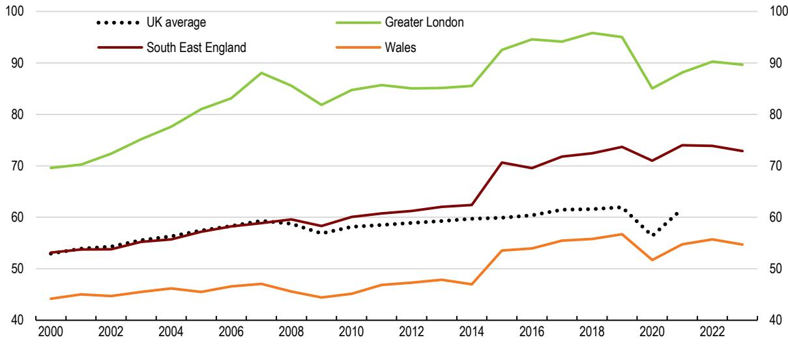  
Note: No data is available for Northern Ireland for 2022 and 2023 and therefore for the UK average. Source: OECD Regional, Cities and Local Areas (database).  
StatLink https://stat.link/l26uhe

Strengthening local skills systems is essential for supporting productivity growth in all regions. Despite strong average educational attainment, the share of young people not in employment, education or training (NEET) remains above the OECD average in all English regions. Recent reforms to improve school-to-work transitions, including changes to the apprenticeship levy and the Youth Guarantee, are steps forward, but regions with high NEET rates often face delivery capacity constraints. Targeted support to strengthen local implementation would help translate national programmes into durable employment outcomes.

Better physical and digital connectivity is crucial to unlock regional economic potential. Public transport investment has long been concentrated in London, limiting productivity gains elsewhere and reinforcing existing divides. Planned reforms to accelerate major infrastructure approvals could support investment, but their effectiveness depends on aligning new projects with regional development strategies, housing supply and local transport integration.

Accelerating the diffusion of innovation among firms would boost productivity across regions. Despite strong national research strengths and high-performing frontier firms, digital adoption by SMEs remains uneven. More structured and locally tailored support can help firms progress through stages of digital maturity and allow them to better connect with skills provision, innovation facilities and finance.

Stronger coordination across all levels of government is essential for delivering regional productivity gains. Responsibilities shaping regional outcomes remain dispersed across departments, agencies and non-departmental bodies, weakening policy coherence and complicating delivery for local authorities. Evaluation practices have been inconsistent, limiting the ability to learn from past programmes. Embedding a coherent monitoring and evaluation framework within the government's mission-based approach would strengthen accountability, shared learning and strategic alignment.

Building stronger local institutional capacity must accompany the devolution of power. Capacity varies widely across local authorities, with many areas lacking the analytical capability, staffing and institutional stability needed for long-term planning. Prioritising training, staffing support and long-term capacity building would help all places make effective use of devolved responsibilities and contribute to more balanced productivity growth.

<table><tr><td>MAIN FINDINGS</td><td>KEY RECOMMENDATIONS</td></tr><tr><td colspan="2">Strengthening growth while ensuring fiscal sustainability</td></tr><tr><td>Weak goods exports and persistent trade frictions are weighing on growth.</td><td>Reduce non-tariff barriers to EU-UK trade, improve global market access for services and expand market opportunities under the UK Trade Strategy.</td></tr><tr><td>Underlying inflation remains elevated, driven by persistent wage growth and services inflation.</td><td>Maintain a restrictive, data-dependent monetary policy stance until underlying price pressures fall sustainably to target-consistent levels to ensure that inflation expectations remain well-anchored.</td></tr><tr><td>Banks&#x27; capital and liquidity positions appear sound, but interconnectedness with the large non-bank sector increases exposure to liquidity shocks.</td><td>Stress-test the entire private market ecosystem systematically within the broader UK financial system, as part of the Bank of England&#x27;s System-Wide Exploratory Scenario.</td></tr><tr><td>The fiscal stance is moderately restrictive while inflation remains above target.</td><td>Maintain a restrictive fiscal stance to support disinflation and rebuild fiscal buffers.</td></tr><tr><td>The fiscal rules introduced in 2024 allow for investment, limit borrowing-financed consumption and align with spending reviews. However, fiscal policy decisions remain highly sensitive to short term changes in the headroom against fiscal rules, which can weaken predictability and encourage frequent adjustments.</td><td>Strengthen the effective use of the fiscal framework by focussing less on short term headroom, relying more on broader indicators of medium-term fiscal sustainability and showcasing uncertainty around point estimates.</td></tr><tr><td>The government&#x27;s plans to raise public sector efficiency rely on quasi-uniform cuts across departments despite bespoke efficiency targets, casting doubt about deliverability and public service preservation.</td><td>Allocate spending cuts based on actual scope for efficiency gains, accounting for changes in departmental responsibilities and past savings in administrative spending.</td></tr><tr><td>Numerous tax expenditures, including reduced VAT rates and homeownership relief, narrow the tax base, cost about 7% of GDP, and are not systematically evaluated.</td><td>Systematically review tax expenditures and gradually phase out those inefficient or poorly targeted.</td></tr><tr><td>Small companies account for a rising share of uncollected tax liabilities, partly reflecting tax system complexity, despite increased enforcement efforts.</td><td>Reduce tax differences across legal forms to reduce small companies&#x27; incentives for tax-motivated incorporation, which have more complex tax liabilities.</td></tr><tr><td colspan="2">Preserving affordability in the pension system</td></tr><tr><td>The triple-lock indexation mechanism for state pensions is unusually generous, exerts upward pressure on public spending, and adds significant fiscal risk.</td><td>Prepare a medium-term reform of the triple lock that preserves pension adequacy while improving fiscal sustainability and reducing expenditure volatility.</td></tr><tr><td>Subdued employment among younger cohorts and persistent health related inactivity risk weakening the financing base of state pensions.</td><td>Continue advancing pro-work reforms, including gatekeeping disability benefits, supporting school-to-work transitions and enhancing lifelong learning support.</td></tr><tr><td>The participation of the self-employed in private pensions is low and many have inadequate pension savings.</td><td>Consider extending automatic enrolment in the private pension system to the self-employed, while preserving the right to opt out.</td></tr><tr><td colspan="2">Strengthening energy security</td></tr><tr><td>Electricity prices remain closely linked to gas prices because gas-fired generation frequently sets the marginal wholesale price. Final prices do not reflect relative carbon content, as electricity bears a higher share of policy costs and carbon pricing than gas.</td><td>Gradually narrow the electricity-gas price differential by explicitly pricing emissions from fossil fuels, while continuing to reduce levies on electricity.</td></tr><tr><td>Grid infrastructure has become a binding constraint on the clean power transition, with long planning timelines and severe connection backlogs.</td><td>Swiftly implement grid connection reform and link connection permissions to progress in delivery milestones.</td></tr><tr><td>Electricity infrastructure is increasingly exposed to flooding, heat and storm risks, while adaptation planning and implementation remain uneven.</td><td>Embed climate resilience standards into grid planning and require regular system wide stress tests to assess critical infrastructure resilience.</td></tr><tr><td colspan="2">Reducing regional productivity disparities</td></tr><tr><td>The share of young people not in employment, education or training is above the OECD average in all English regions. While reforms to strengthen school-to-work transitions are important, regions with high NEET rates face capacity and employer-engagement constraints.</td><td>Provide targeted additional support to regions with high NEET rates to strengthen local implementation capacity, expand access to high-quality training and employment opportunities, and deepen engagement with local employers and delivery partners.</td></tr><tr><td>Transport infrastructure investment has been disproportionately concentrated in London, reinforcing its agglomeration advantages while limiting connectivity gains elsewhere.</td><td>Ensure capital spending targets long-standing transport connectivity gaps in lagging areas and aligns with regional economic strategies, housing supply and local transport integration.</td></tr><tr><td>Uneven adoption of digital technologies among SMEs, particularly outside London and the South East, slows productivity diffusion within and across regions.</td><td>Develop an integrated programme to guide SMEs through progressive levels of digital maturity, combining tailored advisory services, targeted financial incentives, and sector-specific resources.</td></tr><tr><td>Weak and fragmented evaluation of regional policies limits accountability, learning and effective reallocation of resources.</td><td>Create a cross-government framework to monitor and evaluate policy outcomes and encourage shared learning across departments and levels of governments.</td></tr><tr><td>Devolution plans envision a more consistent structure for regional and local governments, but institutional capacity varies widely.</td><td>Prioritise training and staffing support to enable better policy planning, evaluation, and local delivery, particularly in lagging areas.</td></tr></table>

# Strengthening growth while ensuring fiscal sustainability

Nicolas Gonne, OECD

The government has introduced a broad set of growth-enhancing policies under its “Growth Mission”, focusing on public investment, planning reform and infrastructure delivery, simplified financial regulation, and a new industrial strategy. These structural reforms appropriately target long-standing weaknesses in productivity and persistent regional disparities. However, renewed geopolitical tensions and higher energy prices have compounded challenges for economic activity, inflation and public finances. Delivering the government’s priorities sustainably will require rebuilding fiscal space at a time of high public debt and rising long-term spending pressures. Further strengthening the fiscal framework, restraining expenditure based on effective scope for savings, and improving tax efficiency would help rebuild fiscal buffers and support long-term growth.

## 1.1. The economy has improved but faces major challenges

## 1.1.1. External shocks and structural constraints have eroded living standards

The UK economy has experienced weak growth over the past decade (Figure 1.1, Panel A), resulting in broadly stagnant living standards. This reflects a succession of major exogenous shocks, including the exit from the EU Single Market, the COVID-19 pandemic, sharp increases in global energy prices and new US tariffs, which have weighed on business investment, private consumption and external demand. Elevated uncertainty and frequent policy shifts have further stifled business sentiment and consumer confidence. At the same time, energy-driven inflationary pressures have been stronger than in many OECD economies, squeezing real incomes. These developments have exposed and amplified underlying supply-side weaknesses, which continue to constrain growth.

Potential growth has weakened since the mid-2010s (Figure 1.1, Panel B), reflecting structural constraints. This slowdown has been primarily driven by weak productivity growth, linked to a long-standing weakness in business investment, lower trade intensity, skill mismatches and persistent regional disparities. More recently, labour supply has also weakened, with lower participation linked to health-related inactivity and reduced inward labour migration, further constraining working-age population growth. Together these factors have reduced the economy's potential to expand, while persistent pressures on public finances further limit the government's capacity to finance growth-enhancing reforms.

Figure 1.1. Per capita growth has stagnated, reflecting structural constraints  
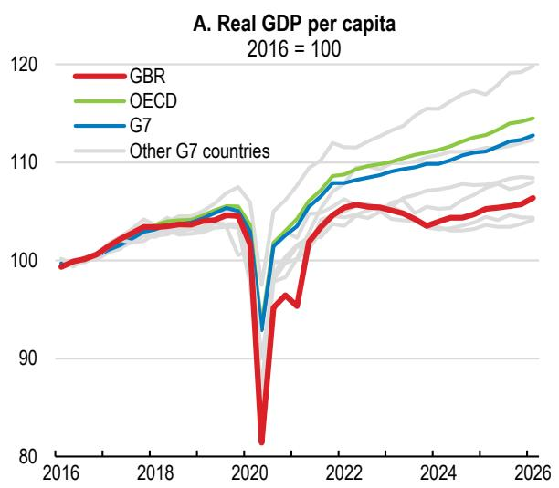

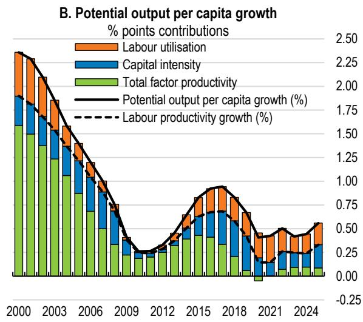  
Note: G7 and OECD refer to weighted averages.  
Source: OECD Economic Outlook: Statistics and Projections (database).  
StatLink https://stat.link/4kgjrl

The government's Growth Mission is broadly aligned with past OECD recommendations and provides an appropriate framework to address many of the UK economy's long-standing weaknesses (Box 1.1). The strategy, which rightly recognises that stronger growth requires coordinated action across multiple policy areas, is being implemented. Sustaining the reform momentum is key, as success will depend on effective implementation, improved public sector delivery capacity, and ensuring that higher public investment remains consistent with medium term fiscal sustainability. In addition, maintaining a strong, competition-friendly business environment and revitalising business dynamism, including by reducing barriers to firm entry and scaling, will be important to support investment, innovation and the diffusion of productivity gains across firms and regions.

In this context, complementary reforms discussed in this Survey to improve tax and spending efficiency, address long-term spending pressures (this chapter), strengthen work incentives and promote the adequacy and sustainability of retirement incomes (Chapter 2), accelerate investment in clean energy and electricity networks (Chapter 3) and reduce regional productivity gaps (Chapter 4) would support the effectiveness of the Growth Mission. OECD simulations suggest that a coherent and well implemented reform package, combining measures already under way with additional complementary reforms, could raise the level of potential GDP by about 4% within a decade (Table 1.1).

## Table 1.1. Estimated GDP impact of selected structural reforms

Relative to baseline level of potential GDP, %

<table><tr><td>Selected structural policy recommendations</td><td>10-year impact</td><td>25-year impact</td></tr><tr><td>Productivity: reduction in trade barriers (1), improved R&amp;D support (2)</td><td>+0.5</td><td>+1.7</td></tr><tr><td>Labour utilisation: activation of the long-term sick (2)</td><td>+1.4</td><td>+1.6</td></tr><tr><td>Capital deepening: planning reform, extension of full expensing, access to finance (3)</td><td>+2.1</td><td>+4.4</td></tr><tr><td>Total estimated impact on GDP</td><td>+4.0</td><td>+7.7</td></tr></table>

Note: Quantification of structural reforms based on simulations using the OECD Long-Term Model and using cross-country econometric estimates of the relationship between policy indicators and trend labour efficiency, capital deepening and employment rates. Many assumptions and uncertainties underlie these estimates. Only some of the reform recommendations are covered. See OECD (2025[1]) and references therein for details. Quantification: (1) Recovery of one half of the decline in the economic globalisation index relative to the EU average. (2) Reallocation of R&D expenditure to ensure additionality, equivalent to an increase in total expenditure of $1\%$ point over 5 years. (3) Increase in expenditure on active labour market policies by $15\%$ points of GDP per capita per unemployed. (5) Equivalent to an increase of about $2\%$ of GDP in business (two thirds) and public (one third) investment.

Renewed energy price increases linked to the evolving conflict in the Middle East have compounded existing challenges, underscoring the UK economy's continued exposure to external supply shocks and the need to strengthen both the supply side and public finances. The country was particularly affected by lasting price pressures in the wake of the 2021-2023 energy crisis, partly due to its dependence on natural gas, but also to an exceptionally tight labour market in the post-pandemic recovery, which led to significant second-round effects. The resulting lingering inflation and weak growth have been constraining monetary and fiscal policy choices. At the same time, broad-based energy support measures in response to the crisis, while helping to cushion households and firms, also reduced fiscal space and weakened price signals for energy efficiency.

As the latest energy price shock unfolds, the policy challenge is to cushion vulnerable households while preserving incentives to reduce energy consumption and rebuild fiscal buffers. Support measures should remain temporary and targeted to households most in need and to viable firms, and incorporate clear expiry mechanisms. The government's fiscal response is appropriately targeted, in line with OECD advice (OECD, 2026[2]). At the same time, renewed energy price volatility reinforces the importance of strengthening domestic energy security and reducing exposure to external shocks.

## Box 1.1. The government's Growth Mission

The Growth Mission places economic growth at the centre of the government's policymaking, with the objective of higher productivity and living standards across the United Kingdom. The strategy seeks to address long-standing weaknesses in business investment, infrastructure delivery, labour supply and regional productivity through a broad reform agenda. Growth is seen as the main channel for raising real household incomes, improving fiscal sustainability and supporting public services after a prolonged period of weak productivity and business investment.

## Key policy pillars

\- Fiscal and macroeconomic stability: Strengthened fiscal rules and predictable tax and spending policy aiming to support confidence among households, firms and investors.

\- Public and private investment: Increase and improve the allocation of investment across sectors and regions.

\- Structural reform: Reduce long-standing barriers to growth, particularly in planning, infrastructure delivery and regulation.

\- Industrial policy: A renewed ten-year industrial strategy (Invest 2035) seeks to improve investment certainty and support sectoral and cluster-based specialisation, aligned with net zero, economic security and regional development objectives.

\- Labour supply and skills: Increase effective labour input and reduce skill mismatches that constrain productive capacity.

Effective implementation will depend on strengthening administrative capacity and coordination across levels of government, addressing persistent planning and infrastructure bottlenecks, and ensuring that public initiatives crowd in private investment in a higher-cost capital environment. The government has initiated reforms in key areas, including planning, investment frameworks and labour supply, but translating these measures into sustained productivity and growth gains will take time. Skills shortages and uneven local capacity may limit the impact of reforms, while maintaining fiscal discipline and political support will be essential to achieving the strategy's objectives.

Source: HM Government (2024[3]; 2025[4]).

## 1.1.2. GDP recovered, though modestly

After a standstill during the 2021-2023 energy crisis, economic growth strengthened gradually over 2024-2025. Real GDP grew by about $2.5\%$ cumulatively since the last Economic Survey (OECD, 2026[5]). Domestic demand led the recovery, more than offsetting the negative contribution from external demand (Figure 1.2, Panel A). Declining energy and food price inflation boosted real household income and supported a broad-based expansion in services (Figure 1.2, Panel B). At the same time, productivity strengthened over 2025 (ONS, 2026[6]). By contrast, slowing global trade growth and higher trade barriers held back goods exports (Figure 1.2, Panel C). Momentum remains uncertain in 2026. Before the start of the evolving conflict in the Middle East, survey-based leading indicators pointed to improving conditions since the beginning of the year, while GDP grew by $0.6\%$ in the first quarter. Consumer confidence and business sentiment had strengthened overall, although from low levels and despite anticipations of fiscal consolidation.

Monetary and fiscal policy settings jointly supported the recovery between mid-2024 and mid-2025, before fiscal policy started tightening (Figure 1.2, Panel D). Monetary easing supported GDP growth by reducing the drag on demand, contributing to a recovery in credit growth to the private sector and helping construction activity. By contrast, fiscal policy has become more restrictive, with frozen tax thresholds reducing household disposable income and the recent increase in employer social security contributions partly borne by workers.

At the same time, the higher minimum wage, together with elevated global uncertainty, have been weighing on business activity.

Figure 1.2. Domestic demand supported the recovery from the 2021-2023 energy shock  
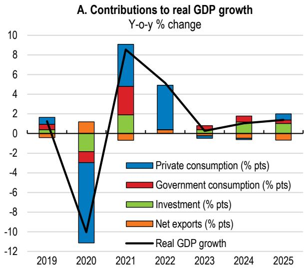

B. Household income and consumer confidence  
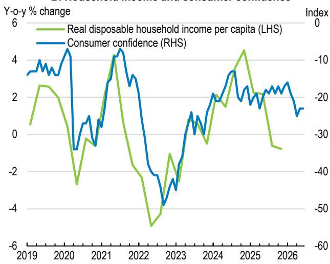

C. Exports of goods and services
2019Q4 = 100  
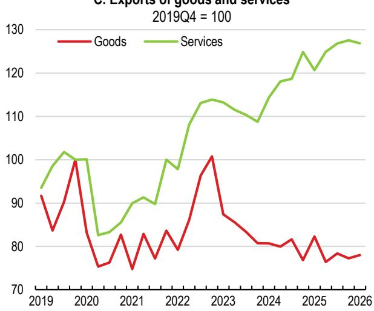

D. Monetary and fiscal conditions  
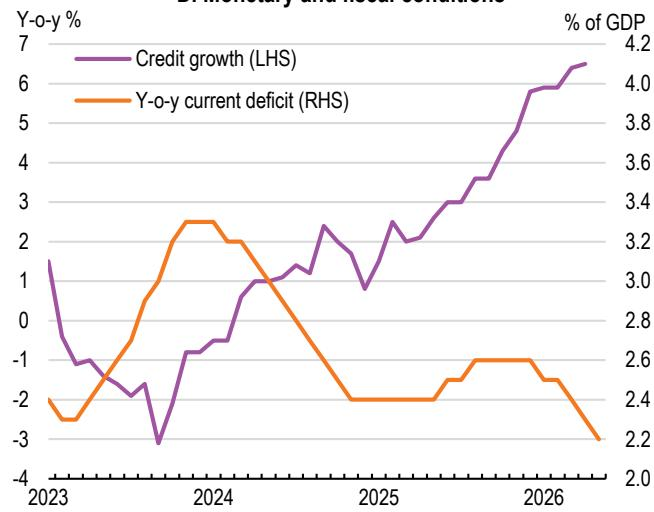  
Note: Panel D refers to monetary financial institutions' sterling net lending to private sector companies and households excluding intermediate OFCs and to the 12-month rolling average of public sector current budget deficit excluding public sector banks, respectively.
Source: Bank of England; Bloomberg; OECD Economic Outlook: Statistics and Projections (database); and Office for National Statistics.  
StatLink https://stat.link/fph1jz

## 1.1.3. Renewed imported inflation is adding to sticky domestic price pressures

Imported price pressures are rising again, interrupting the earlier disinflationary trend. The evolving conflict in the Middle East has pushed up oil and gas prices, with passthrough effects already visible. Still, headline price pressures have declined from its 2022 peak, with CPI inflation hovering around 3% in early 2026, reflecting the prior unwinding of imported price pressures before the start of the conflict (Figure 1.3, Panel A). Core inflation has also moderated but remains above 2.5%, largely owing to domestic cost pressures, as reflected in elevated services inflation.

Nominal wage growth has declined slowly since its 2023 peak, reflecting a protracted normalisation from unprecedented labour market tightness, with the vacancy-to-unemployment ratio below its estimated equilibrium level (BoE, 2025[7]). The available data point to growing slack in the labour market (Figure 1.3, Panel B), with the uptick in unemployment reflecting not only slowing labour demand, but also inflows out of inactivity and, increasingly, redundancies (ONS, 2026[8]). However, quality issues with the labour force survey remain, complicating assessments of the balance of demand and supply (OECD, 2024[9]).

Figure 1.3. Domestic price pressures persist  
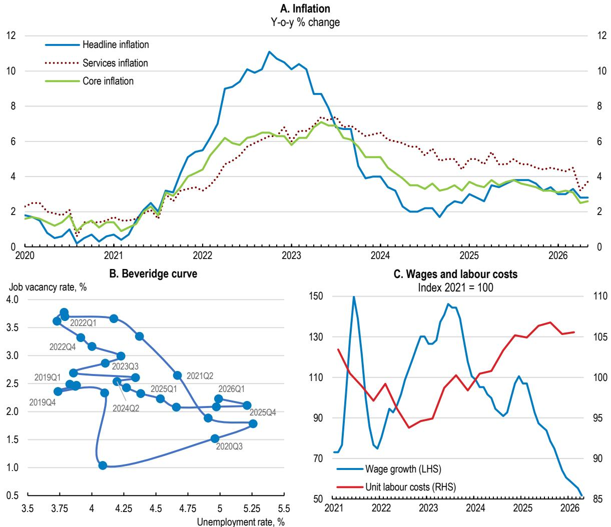  
Source: Bank of England; OECD Economic Outlook: Statistics and Projections (database); and Office for National Statistics.

## StatLink https://stat.link/e02zhi

Containing labour costs is key for both price stability and competitiveness. Significant increases in the minimum wage over 2024-2025 contributed to higher labour costs as productivity growth remained subdued (Figure 1.3, Panel C), while new “day-one” employment rights could push them even higher. Other factors have sustained the rise in labour costs, including weakness in labour market participation and a rise in the medium-term equilibrium unemployment rate, which have increased workers’ bargaining power, as well as pockets of skill shortages in specific areas and occupations (Chapter 4). At the same time, UK unit labour costs have not diverged significantly from those of main trading partners (OECD, 2026[10]).

The government should ensure that increases in the minimum wage remain in line with productivity growth. Delaying further minimum wage raises could be necessary to avoid exacerbating the current energy price shock, reduce the risk of second-round effects and safeguard competitiveness. The minimum wage grew steadily since 2020, largely reflecting the policy to raise it to two-thirds of median earnings, but it is expected to slow as the target was reached and will not be raised. Still, close monitoring of unit labour cost developments is particularly important given both still-elevated inflation expectations and growing slack in the economy.

Over the medium term, raising output potential is essential to sustainably reduce domestic inflationary pressures. Structural reforms to boost investment, support employment and improve productivity (Chapter 4) are therefore key to durably easing inflationary pressures while raising living standards.

## 1.1.4. Trade weakness is structural

Subdued trade performance, especially the persistent weakness in goods exports, is largely due to the permanent increase in trade costs following the exit from the EU single market (WTO, 2025[11]; OECD, 2024[9]), with the EU remaining the country's largest trading partner (Figure 1.4, Panel A). Such weakness is only partly offset by the strong performance in services exports, given the country's global leadership in financial services and digital trade (Figure 1.4, Panel B). Global trade fragmentation and the rise in tariffs compound post-Brexit challenges, given the importance of the US market for UK exporters (Figure 1.4, Panel C).

Other factors, including higher real unit labour costs (above) and elevated industrial electricity prices (Chapter 3), have added a further drag on competitiveness in the recovery from the 2022-23 energy crisis. The appreciation of the exchange rate also weighed on exports, with the real effective exchange rate assessed to be overvalued by about $6.5\%$ in 2024, mostly driven by the nominal exchange rate (IMF, 2025[12]). In addition, UK exporters' switch from sterling to US dollar invoicing for non-EU trade after the exit from the EU single market could have structurally depressed demand for UK exports, given the appreciation of the dollar relative to the pound until late 2024 (Garofalo, Rosso and Vicquéry, 2024[13]).

Trade barriers with the EU market are particularly detrimental to the United Kingdom's export performance. While the European Union remains a key export market, the United Kingdom's relative importance for EU trade has declined markedly (Figure 1.4, Panel D). Despite the Trade and Co-operation Agreement, which allows for zero-tariff, zero-quota trade between the European Union and the United Kingdom, UK exporters face significantly higher trade costs than under EU membership, due to new border checks, requirements and other frictions (OECD, 2024[9]). These higher costs have disproportionately affected small firms, while exports by large firms, including multinationals, appear largely unaffected (WTO, 2025[11]). They have also contributed to imported inflationary pressures, especially due to higher imported food items (Bakker, Datta and Davies, 2023[14]).

Efforts should continue to reduce non-tariff barriers for EU-UK trade and to improve mutual market access for services. In 2023, the Trade and Co-operation Agreement was supplemented with the Windsor Agreement, a set of joint solutions designed to address issues regarding the movement of products and people in Northern Ireland. In 2025, it was further supplemented with the so-called Joint Statement, Common Understanding, and Security and Defence Partnership package, which sets out commitments towards establishing a common sanitary and phytosanitary area, linking the UK and EU emissions trading schemes, exploring a UK participation in the EU internal electricity market, and other areas to strengthen bilateral cooperation, including in defence and education. These are important steps in the right direction.

Continuing to expand market opportunities through new trade agreements, as part of the new UK Trade Strategy (Box 1.2), while cutting non-tariff barriers that raise trade costs, would further support competitiveness. The most recent deals include the new regional trade agreements with India, and the so-called “General Terms for the United States of America and the United Kingdom of Great Britain and Northern Ireland Economic Prosperity Deal” with the United States, though the benefits from the latter are surrounded by uncertainty following the recent US Supreme Court ruling against some of the tariffs imposed on foreign competitors in the US market. By contrast, the complexity of the UK Most Favoured Nation tariff framework (“UK Global Tariff”) pushes up trade costs, with dozens of ad valorem rates, non-ad valorem duties, tariff rate quotas, and seasonal tariffs (WTO, 2025[11]). Streamlining the tariff framework, or even suspending duties on inputs for domestic production, would support competitiveness.

F. Savings-investment balance
% of GDP  
Figure 1.4. Trade remains weak in goods and strong in services  
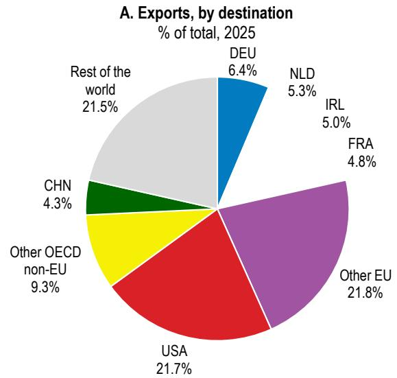

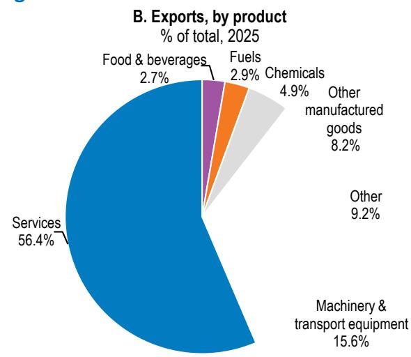

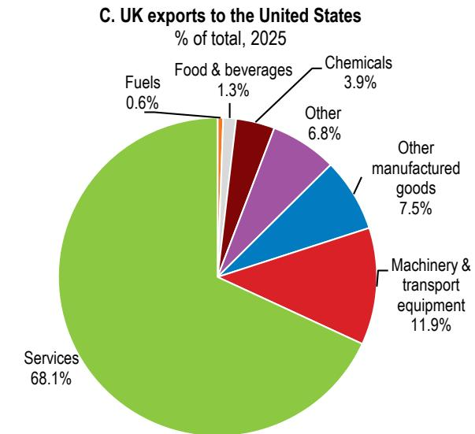

D. Goods imports and exports  
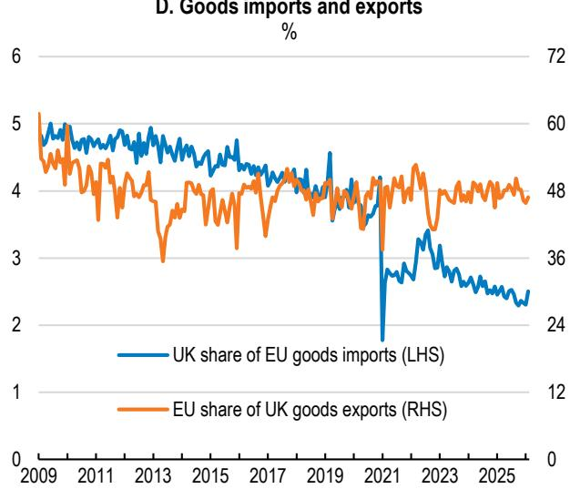

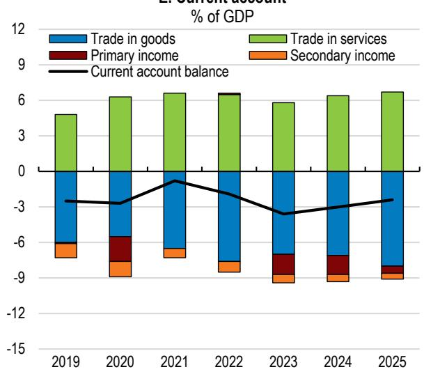

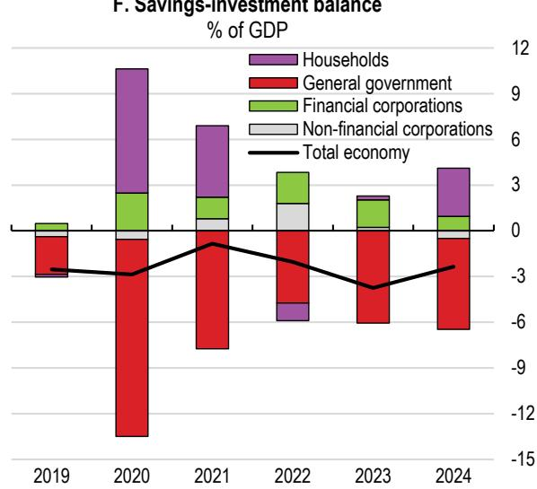  
Source: UN Comtrade; OECD International Trade in Services (database); IMF International Trade in Goods (database); Office for National Statistics (ONS); and OECD National Accounts (database).  
StatLink https://stat.link/3ck9es

The current account deficit remains relatively high, largely reflecting structural trade weakness (Figure 1.4, Panel E). This is despite the normalisation of the primary income balance, after a deterioration in the recovery from the energy crisis, as rising yields on debt liabilities outweigh returns on external assets. Overall, the external position is moderately weaker than the level implied by medium-term fundamentals and desirable policies (IMF, 2025[15]). Large government deficits are the key driver of the current account deficit (Figure 1.4, Panel F). Thus, ongoing fiscal consolidation will contribute to narrowing the current account gap.

## Box 1.2. Progress on trade agreements and the new UK Trade Strategy

In June 2025, the United Kingdom launched a comprehensive Trade Strategy marking a transition from a singular focus on broad Free Trade Agreements (FTAs) to a more agile, sector-specific approach. Termed "pragmatic patriotism," the strategy prioritizes the UK's "services superpower" status and advanced manufacturing base while navigating increasing geoeconomic fragmentation. Key pillars include the alignment of trade with national industrial priorities—particularly green growth and digital innovation—and the deployment of a new "Ricardo Fund" to dismantle technical and regulatory barriers in high-potential markets.

Progress since April 2025 reflects this accelerated, multifaceted engagement. A landmark Free Trade Agreement with India was signed in July 2025, anticipated to bolster bilateral trade by an estimated £25.5 billion through significant tariff reductions in automotive, spirits, and life sciences sectors. Simultaneously, the UK secured an "Economic Prosperity Deal" with the United States in May 2025, aimed at mitigating specific tariff burdens and strengthening critical technology partnerships. Relations with the European Union have also seen a pragmatic reset, highlighted by the May 2025 agreement on a Sanitary and Phytosanitary (SPS) framework, which facilitates trade in agri-food products by reducing border frictions.

Institutionally, the UK joined the Multi-Party Interim Appeal Arbitration Arrangement (MPIA) in late 2025 to safeguard dispute settlement amid World Trade Organization (WTO) challenges. This, coupled with the full integration into the CPTPP as of December 2024, positions the UK to leverage deeper supply-chain integration across the Asia-Pacific. The strategic focus remains on securing "nimble" arrangements that provide immediate market access improvements, ensuring that trade policy acts as a direct catalyst for domestic economic security and long-term productivity.

Source: HM Government; and World Trade Organisation.

## 1.1.5. Growth will slow as the evolving conflict in the Middle East unfolds

Economic activity will slow temporarily in the near term (Table 1.2), reflecting not only the supply shock from the surge in global energy prices, like in most other OECD countries, but also tight fiscal policy, remaining monetary restriction, and persistent structural constraints. GDP growth is projected to moderate to 0.9% in 2026, due to renewed global energy price inflation, the drag from global uncertainty, as well as the continued effect of fiscal consolidation on household disposable income and consumption. It will then pick up to 1.1% in 2027, mainly supported by government expenditure despite consolidation, but also business investment and exports as lower interest rates, stronger financial conditions and a gradual improvement in global trade start providing moderate tailwinds to the economy. Monetary policy is assumed to look through the energy shock in 2026 and continue easing towards a neutral stance in 2027, reducing but not eliminating the drag on growth as fiscal policy will remain restrictive.

Inflation will remain elevated and above the 2% target over the projection horizon. Annual headline inflation is projected to reach 3.7% in 2026, due to renewed global energy inflation owing to the evolving conflict in the Middle East, before moderating to 2.4% in 2027, as energy prices ease from the second half of 2026. The United Kingdom is particularly exposed to volatility in global energy prices, given its high dependence on natural gas for energy generation, high reset frequency of retail energy contracts, and low storage and hedging. Easing labour market conditions are expected to continue supporting disinflation, with core inflation slowing from 3.5% in 2025 to 2.7% in 2027.

Significant slack in the labour market will help contain domestic price pressures but also dampen income growth and consumption. This is in stark contrast with the previous energy shock of 2021-2023, when the labour market was unprecedentedly tight due to the post-pandemic recovery. Unemployment is set to rise to $5.5\%$ in 2026 and $5.3\%$ in 2027, reflecting lower labour demand as the economy slows, but also the extension of childcare support, which promotes labour force participation (OECD, 2024[9]).

## Table 1.2. Macroeconomic indicators and projections

Annual % change, unless specified

<table><tr><td></td><td>2023</td><td>2024</td><td>2025</td><td>2026</td><td>2027</td></tr><tr><td></td><td>Current prices (GBP billions)</td><td colspan="4">Volume (2023 prices)</td></tr><tr><td>Output</td><td></td><td></td><td></td><td></td><td></td></tr><tr><td>Gross domestic product</td><td>2752</td><td>1.0</td><td>1.4</td><td>0.9</td><td>1.1</td></tr><tr><td>Private consumption</td><td>1709</td><td>-0.2</td><td>1.0</td><td>0.4</td><td>0.5</td></tr><tr><td>Government consumption</td><td>567</td><td>2.9</td><td>1.6</td><td>1.7</td><td>2.8</td></tr><tr><td>Gross fixed capital formation</td><td>520</td><td>1.7</td><td>4.3</td><td>0.0</td><td>1.5</td></tr><tr><td>Housing investment</td><td>141</td><td>-1.6</td><td>3.7</td><td>-0.9</td><td>1.1</td></tr><tr><td>Business investment</td><td>291</td><td>2.6</td><td>4.3</td><td>-0.7</td><td>1.6</td></tr><tr><td>Government investment</td><td>88</td><td>4.2</td><td>4.9</td><td>3.9</td><td>1.5</td></tr><tr><td>Final domestic demand</td><td>2796</td><td>0.8</td><td>1.8</td><td>0.6</td><td>1.2</td></tr><tr><td> $Stockbuilding^1$ (% points)</td><td>-12</td><td>0.9</td><td>0.2</td><td>0.5</td><td>0.0</td></tr><tr><td>Total domestic demand</td><td>2784</td><td>1.7</td><td>2.0</td><td>1.2</td><td>1.2</td></tr><tr><td>Exports of goods and services</td><td>878</td><td>1.3</td><td>2.1</td><td>1.0</td><td>1.4</td></tr><tr><td>Imports of goods and services</td><td>910</td><td>2.7</td><td>4.2</td><td>1.9</td><td>1.6</td></tr><tr><td> $Net\ exports^1$ (% points)</td><td>-32</td><td>-0.5</td><td>-0.7</td><td>-0.3</td><td>-0.1</td></tr><tr><td>Potential GDP</td><td>2,745</td><td>1.4</td><td>1.3</td><td>1.2</td><td>1.2</td></tr><tr><td>Output gap (% of potential GDP)</td><td></td><td>-0.1</td><td>-0.1</td><td>-0.4</td><td>-0.5</td></tr><tr><td colspan="6">Other indicators</td></tr><tr><td>GDP deflator</td><td>..</td><td>4.0</td><td>3.6</td><td>3.3</td><td>2.1</td></tr><tr><td>Harmonised consumer price index</td><td>..</td><td>2.5</td><td>3.4</td><td>3.7</td><td>2.4</td></tr><tr><td>Harmonised core consumer price index</td><td>..</td><td>3.7</td><td>3.5</td><td>3.1</td><td>2.7</td></tr><tr><td>Terms of trade</td><td>..</td><td>2.7</td><td>0.2</td><td>-2.4</td><td>-0.9</td></tr><tr><td>Trade balance (% of GDP)</td><td>..</td><td>-0.7</td><td>-1.3</td><td>-2.3</td><td>-2.7</td></tr><tr><td>Current account balance (% of GDP)</td><td>..</td><td>-3.0</td><td>-2.4</td><td>-3.5</td><td>-3.8</td></tr><tr><td>Employment</td><td>..</td><td>0.8</td><td>1.6</td><td>0.6</td><td>0.8</td></tr><tr><td>Unemployment rate (% of labour force)</td><td>..</td><td>4.3</td><td>4.8</td><td>5.5</td><td>5.3</td></tr><tr><td>Real household disposable income</td><td></td><td>4.2</td><td>1.3</td><td>-0.5</td><td>2.2</td></tr><tr><td>Household saving ratio, net (% of disp. income)</td><td>..</td><td>4.5</td><td>4.5</td><td>3.4</td><td>4.8</td></tr><tr><td>General government financial balance (% of GDP)</td><td>..</td><td>-6.1</td><td>-5.5</td><td>-5.1</td><td>-4.4</td></tr><tr><td>General government primary balance (% of GDP)</td><td>..</td><td>-3.8</td><td>-2.6</td><td>-2.2</td><td>-1.4</td></tr><tr><td>Cyclically-adjusted primary balance (% of potential GDP)</td><td>..</td><td>-3.7</td><td>-2.6</td><td>-1.9</td><td>-1.1</td></tr><tr><td>General government gross debt (% of GDP)</td><td>..</td><td>99.9</td><td>102.3</td><td>103.9</td><td>105.4</td></tr><tr><td>General government net debt (% of GDP)</td><td>..</td><td>74.2</td><td>75.7</td><td>77.3</td><td>78.8</td></tr></table>

1. Contributions to changes in real GDP; actual amount in the first column. Source: OECD Economic Outlook: Statistics and Projections (database).

Risks to the outlook are tilted to the downside, mainly reflecting external shocks in conjunction with the limited fiscal space. The main downside risk to growth stems from geopolitical tensions. Higher global energy prices for longer due to a protracted conflict in the Middle East would weigh on real incomes and result in a larger rise in unemployment and higher precautionary savings. This would also worsen business sentiment and depress energy-intensive industries, weighing on business activity. In such a prolonged disruption scenario, global growth is expected to slow significantly, pushing several economies into or close to recession (OECD, 2026[2]). In addition, prolonged constraints on fertiliser supply would push up food inflation. At the same time, a more pronounced slowdown would widen the output gap and reduce domestic inflationary pressures.

Further trade fragmentation is the other key external risk. With exports and imports of goods and services accounting for more than 60% of UK GDP in 2024, renewed trade uncertainty and higher US tariffs on goods from key sectors (such as machinery and transport equipment, including cars and car parts, and of pharmaceutical products) would directly weaken export growth, even as the large share of services in total exports provides some mitigation. Moreover, higher input costs for UK importers of US intermediate goods, including semiconductors and metals, would depress competitiveness in other UK export markets, hence weaken export growth indirectly. In addition, worsening trade tensions could entail an economic downturn in key trading partners, hence dampen external demand further and weigh on business confidence and investment, which could spill over into weaker private consumption. On the upside, trade diversion could lead to lower UK import prices, reducing inflationary pressures and supporting competitiveness.

Domestically, elevated inflation expectations and potential second-round effects from increases in global energy prices, as well as from past rises in payroll taxes and the minimum wage, constitute an upside risk to prices. This could require the monetary stance to stay tighter for longer, posing a downside risk to output. Downside risks also arise from the limited scope for the government to provide support in the event of adverse shocks, for instance to attenuate the impact of higher energy prices on households, given persistent pressures on the public finances.

Lower-than-expected returns from artificial intelligence investment could trigger more widespread risk repricing in financial markets, with adverse consequences for private demand. By contrast, sustained productivity growth is an upside risk, given the weight of those sectors that have been the greatest adopters of artificial intelligence technologies in the UK economy, such as finance and professional services. Relatively high excess savings remain an upside risk to private consumption and housing investment. Several low-probability events could alter the outlook significantly (Table 1.3).

Table 1.3. Low-probability events that could lead to major changes in the outlook

<table><tr><td>Event</td><td>Possible impact</td></tr><tr><td>Acute liquidity stress in non-banks</td><td>Financial market instability and forced asset sales. Adverse impact on public finances, as gilts are sold off. Contagion to banks due to interconnectedness and other consequences of exposed vulnerabilities in the financial system.</td></tr><tr><td>Severe correction of real estate prices</td><td>Reduction in bank profitability. Lower consumption, as households cut consumption to service debt. Adverse impact on public finances, as automatic stabilisers push up expenditure.</td></tr><tr><td>Large-scale cyber attack</td><td>Disruption of business operations. Shutdown of vital domestic infrastructure. Adverse impact on business sentiment. Severe financial and legal repercussions, as the country is a global financial centre.</td></tr><tr><td>Extreme weather event</td><td>Local drop in output and/or temporary lower productivity. Pressure on public finances, as physical infrastructure is replaced. Slowdown in green transition, as necessary investments are crowded out.</td></tr></table>

## 1.2. Monetary restriction remains needed until inflation is durably under control

## 1.2.1. The balance of inflation risks is highly uncertain

The monetary policy stance has eased, with the Bank Rate reduced gradually from its summer 2024 peak, as significant monetary policy restriction helped to reduce inflation (Figure 1.5, Panel A). The real policy rate, measured as Bank Rate deflated by one-year ahead annual core inflation, has stabilised close to or within the range of estimates for the real neutral rate defined as the rate at which the policy stance is neither accommodative nor restrictive (OECD, 2025[16]; BoE, 2026[17]). Policy remains restrictive, albeit significantly less than before, with past tightening still weighing on demand and contributing to the disinflationary process. Real short-term interest rates edged up after easing significantly while, like in many other advanced OECD economies, forward-looking long-term real rates remain well above pre-pandemic norms (Figure 1.5, Panel B).

Figure 1.5. Monetary policy has eased, while inflation expectations remain elevated  
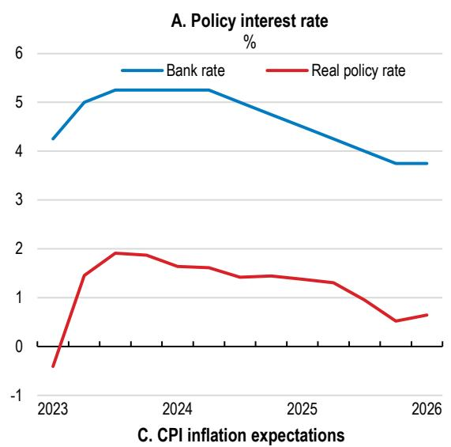

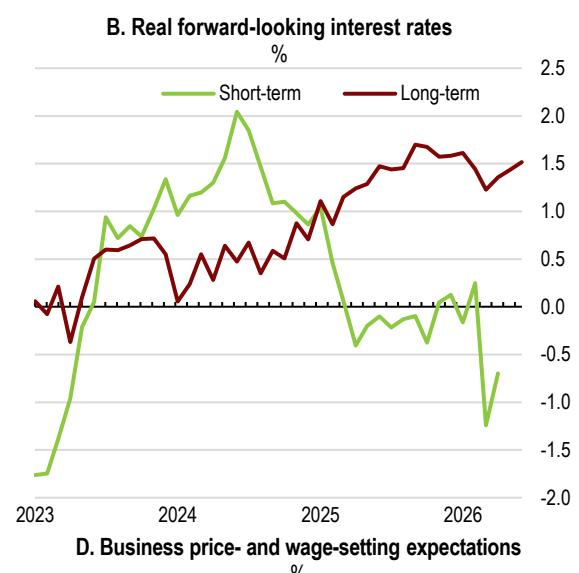

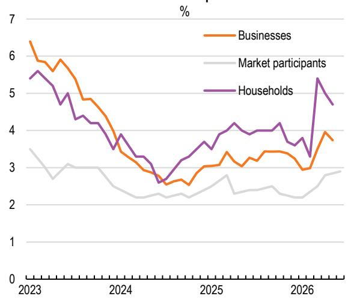

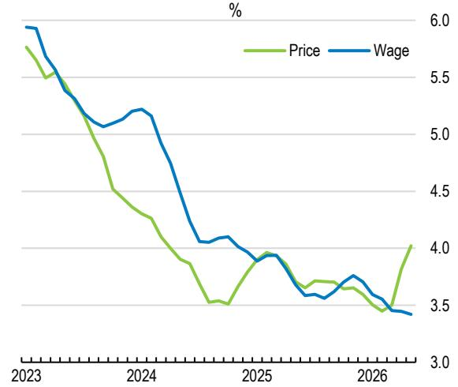  
Note: Panel A refers to Bank Rate and to Bank Rate deflated by one-year-ahead annual core inflation (realised or projected). Panel B refers to nominal one-year gilt yields deflated by consumer one-year-ahead inflation expectations and to 10-year index-linked gilt yields. Panel C refers to survey measures of one-year ahead inflation expectations. Panel D refers to firms' own price and wage growth expectations over the next year.
Source: Bank of England; OECD Economic Outlook: Statistics and Projections (database); OECD calculations; and YouGov/Citigroup.  
StatLink https://stat.link/ihx21e

Maintaining a restrictive monetary policy stance remains warranted until underlying price pressures fall sustainably to levels consistent with the 2% inflation target. The inflation outlook strengthened again in early 2026, owing to the surge in global energy prices and given their salience for consumer expectations. This could add to persistent underlying domestic price pressures, particularly from wages and services, and already elevated inflation expectations (Figure 1.5, Panel C), with firms continuing to anticipate elevated wage and price growth (Figure 1.5, Panel D). At the same time, the growth outlook weakened significantly, with rising spare capacity and labour market slack, which will contribute to attenuating medium-term inflationary pressures as it limits second-round effects.

Monetary policy should therefore remain cautious and vigilant to shifts in the balance of risks. Transitory price developments, such as the current supply-induced rise in energy prices or a one-off tariff-induced increase in the relative price of tradeable goods, can be looked through provided inflation expectations remain well anchored (OECD, 2026[10]). However, monetary tightening would be needed if inflation expectations continued edging up and there were signs of broader price pressures feeding through domestic wages. By contrast, weaker labour market conditions and downward wage pressures may call for monetary loosening.

The Bank of England's approach to setting Bank Rate adequately addresses inflation risks, given high inflation expectations and uncertainty around the true levels of the neutral interest rate. By framing policy decisions as meeting-by-meeting calls rather than following a pre-set path of gradual cuts, this approach balances the short-term upside risk to inflation from underlying price pressures and the medium-term downside risk from weaker demand. Such a flexible, data-dependent strategy is well suited to manage the withdrawal of remaining policy restriction. It also minimises the risk of mistakes, as it lowers the risk of reducing Bank Rate by too much, so requiring a policy reversal that would undermine credibility.

## 1.2.2. Quantitative tightening has supported the normalisation of monetary policy

The Bank of England has proceeded with quantitative tightening, through both active sales and redemptions of government bonds (“gilts”) held in the Asset Purchase Facility. Gradual and predictable implementation has contributed towards the normalisation of the Bank’s balance sheet, while limiting market disruption. The quantitative tightening cycle also promoted the effectiveness of potential future quantitative easing cycles, by reinforcing the principle of a countercyclical tool to be used when support is needed and be unwound when conditions allow.

At the same time, quantitative tightening has raised borrowing costs and generated fiscal spillovers, with estimates ranging from a 15–25 basis points increase on long-term interest rates (BoE, 2025[18]) to a cumulative impact of 44–70 basis points on gilt yields at maturities of one year and longer (Du, Forbes and Luzzetti, 2024[19]). In addition, higher Bank Rate and asset sales have led to income and capital losses for the Bank. These entail a significant fiscal cost to the public finances (about 0.5% of GDP in FY2025-26), given the indemnification arrangement between HM Treasury and the Bank of England. Yet, any cost-benefit analysis should account for the broader impact on the economy of the whole unconventional monetary policy cycle.

The ongoing transition to a repo-led monetary framework reduces risks for both the Bank of England and the public finances. Operations have shifted from a supply-driven regime, in which reserves were created in fixed quantities through outright asset purchases, to a demand-driven regime, in which reserves are supplied elastically at a price through asset repurchase agreements (BoE, 2024[20]). This significantly reduces the Bank's exposure to interest rate risks by better aligning the interest rate sensitivity of assets and liabilities, as repo contracts are indexed to Bank Rate. Fiscal risks to the public finances are also attenuated, as the repo framework is backed by capital rather than indemnified. Finally, the demand-driven framework supports financial stability by design because it fully meets commercial banks' demand for payments and precautionary purposes.

Completing the transition to the new monetary framework is key to maintaining effective monetary control at lower risk. The short-term repo and indexed long-term repo facilities have become the primary source of additional liquidity to the banking system. However, the transition can only be complete when the Bank of England's reserves fall to the level needed to satisfy demand from commercial banks through repo (so-called "preferred minimum reserve requirement"). Continuing to improve high-frequency indicators of reserve capacity, possibly based on spreads between Bank Rate and private repo market rates, would further improve the management of reserve scarcity and help to conclude quantitative tightening smoothly. Recent measures to reduce the stigma associated with commercial banks using standing liquidity facilities, especially the discount window facility, through lower pricing and proactive communication will help to enhance the efficiency and resilience of the overall framework.

## 1.2.3. Better forecasting and communication will help monetary policy effectiveness

Ongoing reforms to the Bank of England's forecasting and communication are improving the effectiveness of monetary policy. The Bank is implementing the recommendations from the independent review of its forecasting, policy and communication processes to improve the management of long-term inflation expectations (Bernanke, 2024[21]). Investments to update the forecasting infrastructure, including data systems, analytical tools and software are underway, alongside efforts to improve transparency about how forecasts inform policy decisions. Moreover, greater emphasis on scenario-based communication, instead of a single market-conditioned central forecast, better reflects uncertainty around inflation persistence. In addition, systematic forecast evaluations were carried out (BoE, 2026[22]).

The Bank of England should continue implementing the reforms to strengthen forecasting capacity and communication. Swiftly migrating analytical functions to the new infrastructure and phasing in new software and models is necessary to embed them into the monetary decision-making process. Improving the presentation of risks and scenarios would help anchor expectations and reinforce the effectiveness of a cautious, data-driven monetary policy strategy. Communication could also be improved by establishing high-level principles for selecting and/or changing the central scenario.

## 1.3. Heightened financial market risks call for continued vigilance

## 1.3.1. Households and corporates are resilient, but pockets of debt vulnerabilities exist

Household balance sheets remain resilient in aggregate, but vulnerabilities have emerged among specific groups. Household debt is moderate (Figure 1.6, Panel A) and relatively few households are in arrears or face high debt-servicing burdens (BoE, 2025[23]). In addition, aggregate household savings remain elevated, supporting households' ability to absorb adverse shocks. However, downward pressure on real incomes owing to the evolving conflict in the Middle East could strain household finances (Table 1.2). In addition, vulnerabilities persist among some groups, particularly renters, as reflected in a widening gap in median savings-to-income ratios between outright owners and renters. In the event of an adverse economic shock, sudden spending cuts or higher default rates among renters could amplify macro-financial risks and pose challenges to financial stability (BoE, 2025[23]).

Housing market risks appear contained, but mortgage refinancing and rental affordability remain sources of pressure. House prices have strengthened moderately and mortgage approvals have returned to pre-pandemic levels, while quoted mortgage rates have declined from their post-pandemic peak but shot up again in the wake of the evolving conflict in the Middle East (Figure 1.6, Panels B and C). However, the full pass-through of higher interest rates has yet to materialise for some mortgage holders, with around four out of ten mortgage accounts still expected to refix at higher rates, implying continued pressure on a subset of households (BoE, 2025[23]). At the same time, rents have continued to rise amid constrained housing supply, exacerbating affordability challenges for lower-income households (OECD, 2024[9]).

Corporate sector risks are limited overall and remain concentrated among high-risk borrowers. Non-financial corporate debt is relatively low (Figure 1.6, Panel D), while aggregate net debt-to-earnings ratios remain well below their pandemic and post-global financial crisis peaks (BoE, 2025[23]). Funding conditions for corporates have been benign, insolvency rates remain below their long-term average, and credit spreads are compressed (OECD, 2025[16]). Spillovers to the United Kingdom from two recent high-profile corporate defaults in the United States have been limited. Nevertheless, refinancing costs have increased for corporate bond issuers, particularly for higher-risk borrowers reliant on leveraged loans and private credit, which typically have shorter maturities and are therefore more exposed to higher interest rates. This creates pockets of vulnerability and warrants close monitoring.

Figure 1.6. Household and non-financial corporation risks are contained  
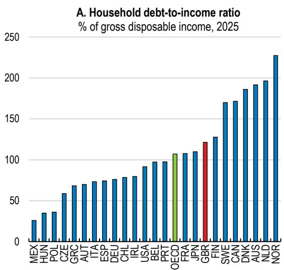

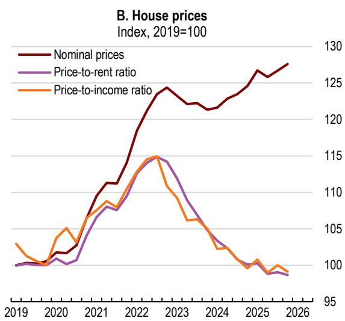

C. Lending growth and borrowing costs  
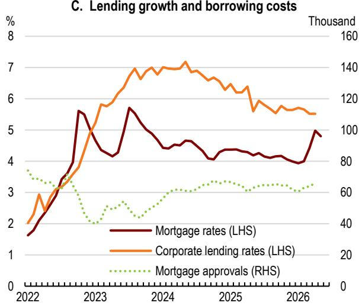

D. Corporate debt to gross operating surplus ratio 2024 or latest  
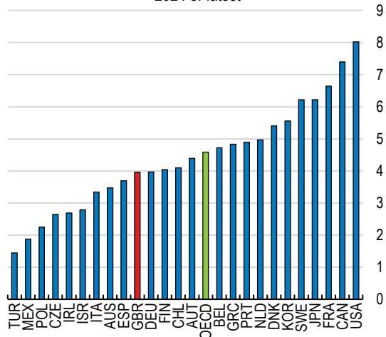  
Note: Panel C refers to average quotes for 5-year fixed rate (75% LTV), to sterling weighted average rates on loans and new advances to private non-financial corporations, and to mortgage approvals for house purchase to individuals.  
Source: Bank of England; OECD Analytical House Prices Indicators (database); and OECD National Accounts (database).

StatLink https://stat.link/4xfhe6

## 1.3.2. Prudential policy needs to balance global risks and domestic credit supply

The banking system is well capitalised, asset quality is strong and non-performing loans remain low (Figure 1.7, Panels A to D), ensuring substantial loss-absorption capacity against potential systemic shocks. Liquidity conditions remain robust, as commercial banks have maintained adequate levels of liquidity throughout the structural transition to the demand-driven monetary framework (BoE, 2025[23]). According to the Bank of England's 2025 main Bank Capital Stress Tests, the system is sufficiently resilient to support households and businesses in significantly worse economic conditions than currently expected, with bank capital remaining well above the sum of aggregate regulatory minima and systemic buffers even under severe stress (a hypothetical global supply shock leading to a $5\%$ contraction in UK GDP and a sharp rise in inflation). In addition, the Bank Resolution (Recapitalisation) Act, in force since July 2025, further supports the resilience of the banking sector by setting a new recapitalisation mechanism based on industry levies, designed to limit market disruption from failures of small UK commercial banks and to facilitate orderly resolution.

Figure 1.7. The banking system appears sound  
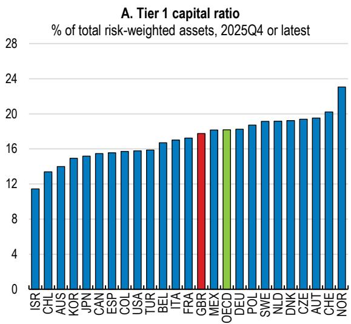

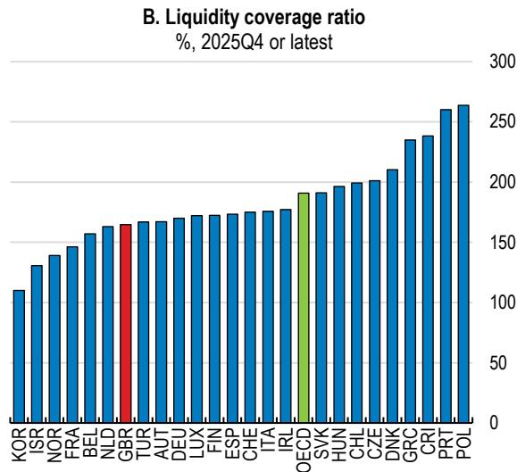

C. Non-performing loans
% of gross loans, 2025Q4 or latest  
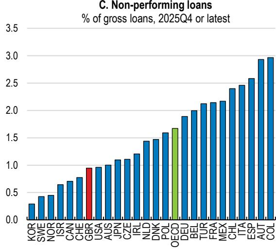

D. Return on equity %, 2025Q4 or latest  
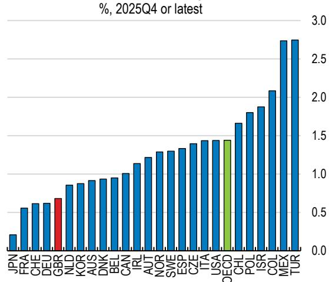  
Note: OECD refers to the average of countries with available data.
Source: International Monetary Fund.

The counter-cyclical capital buffer has been maintained at its neutral setting of 2%. This is appropriate, as immediate risks are concentrated in financial markets, reflecting elevated global risks, including from stretched asset valuations (mostly AI-related) and compressed credit spreads (BoE, 2025 $^{[23]}$ ). In addition, the Bank of England has revised down its benchmark level of capital requirements, with the appropriate system-wide Tier 1 capital ratio assessed at around 13% of risk-weighted assets, 1% point lower than the previous benchmark. Moreover, the Prudential Regulation Authority has postponed the implementation of the Basel III.1 standards, which include tighter restrictions on commercial banks' use of internal models to calculate risk-weighted assets. These adjustments balance supportive domestic credit conditions and financial stability. Yet, continued macroprudential oversight remains necessary to mitigate risks stemming from prevailing global financial volatility, especially as the evolving conflict in the Middle East has raised repricing risks.

The financial supervisory authorities should continue to dynamically calibrate macroprudential settings while appropriately accounting for global financial risks. Higher capital buffers would help to contain the transmission of financial shocks as financial stability risks have increased, while lower buffers support credit growth, as well as the competitiveness of UK commercial banks. Close surveillance of credit aggregates and financial conditions is essential for the timely recalibration of the counter-cyclical capital buffer in response to changes in the risk environment. Swiftly easing prudential policy if financial conditions tighten and credit defaults rise would help to attenuate a credit-driven downturn.

Prudence is required in the ongoing modernisation of financial services regulation. While simplifying complex and obsolete rules can support growth and competitiveness in the financial sector, the primary objective of supervisory authorities should remain the preservation of stability and soundness. The ongoing consolidation of numerous relatively small pension funds is welcome as it will improve efficiency by reducing transaction fees and enabling investments in a wider range of assets. However, as highlighted in the last Economic Survey, plans for mobilising pension funds for domestic investment should not interfere with pension funds' fiduciary duty to act in the best interest of their members (OECD, 2024[9]).

## 1.3.3. The growth in private credit requires closer oversight

Non-bank financial intermediation is a central feature of UK corporate funding, accounting for more than half of total corporate debt (BoE, 2025[23]). It brings strong benefits for the private sector in terms of competition, diversification and risk allocation. Moreover, growing linkages between commercial banks and non-banks support credit provision to businesses, playing a critical role in the functioning of core UK markets, especially during periods of stress (BoE, 2025[23]). At the same time, this exacerbates interconnectedness and channels of risk transmission (FSB, 2025[24]).

Monitoring non-banks and improving their resilience is crucial to ensuring that the financial system can absorb shocks, rather than amplify them. The stability of non-bank finance in a broad-based macroeconomic stress is untested at its current size. Yet, high interest rates and a modest growth outlook can strain the liquidity of non-bank financial intermediaries. In addition, the growth in private credit, with less transparent transmission channels than market-based finance, obscures aggregate leverage and complicates risk assessments. The recent high-profile default of two non-bank US corporates with significant private credit footprint highlighted potential risks arising from excessive reliance on credit ratings providers as a substitute to appropriate due diligence.

The financial supervisory authorities should integrate private credit markets in system-wide stress-testing exercises. Stronger oversight of private credit is warranted to understand the propagation of potential shocks through the financial system, given the interconnectedness between commercial banks and non-banks. The first system-wide exploratory scenario, run in 2024, has already improved the understanding of how non-banks react under liquidity stress. The second such exercise, launched in December 2025, specifically focuses on financial intermediaries active in private markets. This is a welcomed step in the direction of stress-testing the entire private market ecosystem, adding to the assessment of other “new” systemic risks (Box 1.3).

Non-bank financial intermediaries have a large footprint in the gilt and gilt repo markets, which are critical to the smooth functioning of the UK financial system. However, institutional investors like pension funds and insurers have reduced their holdings, while hedge funds and non-resident holders have increased their exposure. In addition, the Bank of England's holdings are significantly lower than before quantitative tightening. The new prominence of more speculative and interest-sensitive holders tends to increase gilt yield volatility, hence the government's borrowing costs.

The growing footprint of non-banks in the gilt market creates new risks to financial stability. Leveraged borrowing by hedge funds in gilt repo markets remains elevated, largely reflecting very high volumes of cash-futures basis trade concentrated in a small number of hedge funds (BoE, 2025[23]). These trades typically operate with very small margins, minimal collateral haircuts and very short maturities, requiring constant refinancing and creating significant vulnerabilities to a tightening of financial conditions.

## Box 1.3. Adapting financial supervision to climate and cyber-risks

The United Kingdom remains a global leader in stress-testing "non-traditional" systemic risks, specifically cyber-resilience and climate change. As geopolitical tensions escalate, the Bank of England has intensified its scrutiny of cyber-threats that pose significant risks to economic and financial stability. Following a 2022 exploratory test on retail payments, the BoE launched a subsequent exercise in 2024 targeting data integrity within wholesale payments and settlement. These initiatives, alongside the Financial Policy Committee's 2024 macroprudential approach to operational resilience, are critical for quantifying the potential systemic impacts of sophisticated digital disruptions.

Simultaneously, the Bank of England is pioneering the assessment of climate-related financial risks and their cross-sectoral impacts on banks and insurers. Physical risks, including infrastructure damage and supply chain disruptions caused by extreme weather, threaten to erode institutional profitability and asset values. While current capital models and credit ratings increasingly incorporate climate variables, the complexity of long-term environmental forecasting suggests that existing risk capture remains incomplete.

The Bank's proactive data collection on these emerging vulnerabilities is a necessary step towards maintaining financial integrity. To ensure the resilience of the UK's financial centre, the BoE must continue to dynamically adapt its regulatory and supervisory frameworks. This evolution should be guided by the empirical insights gained from exploratory stress tests, ensuring that oversight keeps pace as "non-traditional" vulnerabilities transition into documented systemic threats.

Source: Bank of England; and OECD (2024[9]) OECD Economic Surveys: United Kingdom 2024.

The authorities should continue to enhance the resilience of the gilt and gilt repo markets as global uncertainty remains elevated. A range of structural reforms is under consideration, including greater central clearing of gilt repo and minimum margin requirements on non-centrally cleared gilt repo transactions (BoE, 2025[25]). However, given long implementation lags, preparedness should be strengthened in the interim. Conditional on adequate supervision and regulation, expanding access to the Contingent Non-Bank Financial Institution Repo Facility to a broader range of non-banks with significant footprint in the gilt market could help mitigate liquidity stress in case of shocks that temporarily increase non-banks' market-wide demand for liquidity.

## 1.4. Fiscal discipline and reforms will be key to sustaining growth

## 1.4.1. The fiscal stance remains moderately and adequately restrictive

The government deficit is set to improve over 2026-2027 as fiscal tightening continues (Figure 1.8, Panel A). The more-than-proportional increase in the cyclically-adjusted balance reflects discretionary adjustments in taxes and spending after the deterioration of 2023-2024. While the resulting fiscal stance is moderately restrictive, headline deficits improve only slowly, as subdued growth, pressure from welfare spending and high public debt interest partly offset the impact of fiscal consolidation on public finances (Figure 1.8, Panel B). At the same time, transfers from HM Treasury to the Bank of England under the Asset Purchase Facility indemnification arrangement continue to weigh on the deficit, although to a diminishing extent (see above).

The moderately restrictive fiscal stance remains adequate and should be maintained, despite the effects of the evolving conflict in the Middle East. Support for economic activity should continue to be gradually withdrawn as underlying inflation remains above target and the public finances are under pressure, with the government deficit among the highest in the OECD and gross public debt above 100% of GDP (Figure 1.8, Panels C to F). Monetary policy can handle supply shocks by balancing the rise in imported inflation and the transitory slowdown in economic activity. The pace of fiscal consolidation should, however, remain gradual given the ongoing energy shock and automatic stabilisers should be fully allowed to cushion the overall impact on the economy in the short run.

A. Fiscal balances
% of GDP

Figure 1.8. The public finances are under pressure  
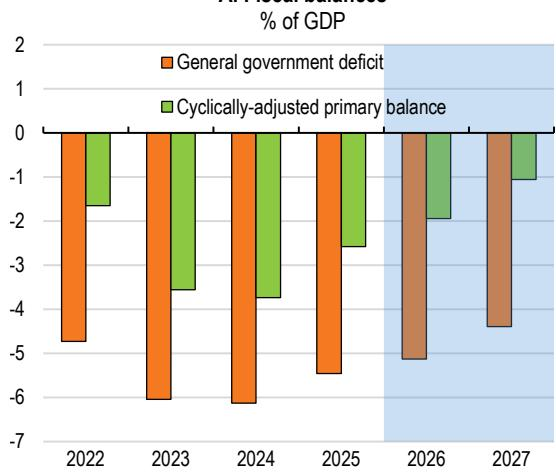

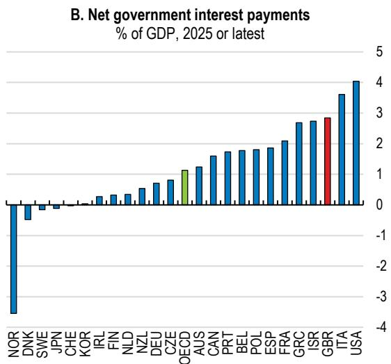

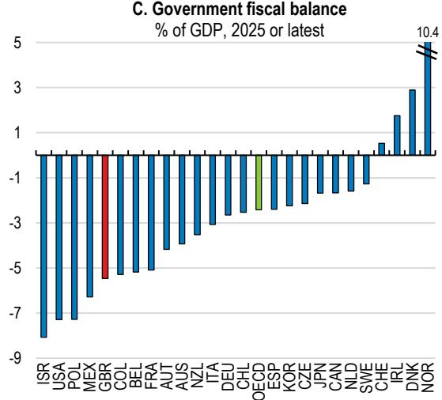

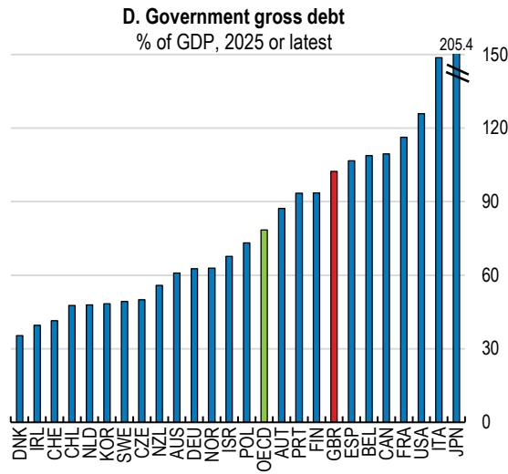

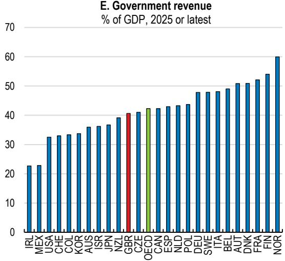

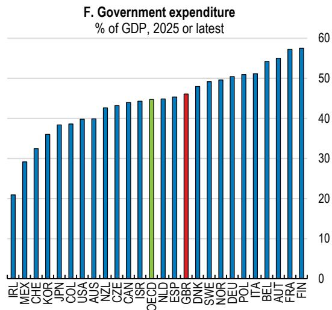  
Note: Panel A refers to OECD forecast for 2026-2027. All figures refer to the general government. Source: OECD Economic Outlook: Statistics and Projections (database).

StatLink https://stat.link/2im86c

If needed, any new discretionary measures should be well-targeted on households most in need and on viable firms, preserve incentives to lower energy use, and have clear expiry mechanisms. Additionally, temporary measures aimed at lowering headline inflation, such as the freeze of administered prices in energy and transport, or the extension of the fuel duty freeze, should be avoided. While they may ease cost of living pressures and provide a visible relief to households in the short term, they are fiscally costly, weaken energy and transport price signals and do not address underlying inflationary pressures.

## 1.4.2. The medium-term fiscal strategy aims to balance demand and public finances

The government's medium-term fiscal strategy aims to support growth while restoring fiscal sustainability by increasing public investment and improving public service delivery, financed through a combination of higher taxes, additional borrowing and, over time, tighter control of current spending (Table 1.4). The strategy requires effective sequencing and hinges on the growth effect of new spending outweighing the adverse impact of some of the new taxes. The strategy appropriately prioritises investment and supply-side reforms, but its success depends on effective containment of spending growth across departments in later years, which may prove politically and economically challenging and require additional measures to ensure fiscal sustainability. Maintaining a sufficiently restrictive fiscal stance in the near term remains important to support the disinflation process and ensure a consistent macroeconomic policy mix.

## Table 1.4. General government fiscal indicators and projections

% of GDP, unless specified

<table><tr><td></td><td>2023</td><td>2024</td><td>2025</td><td>2026</td><td>2027</td></tr><tr><td colspan="6">Revenue and expenditure</td></tr><tr><td>Total revenue</td><td>40.2</td><td>39.9</td><td>40.6</td><td>41.0</td><td>41.3</td></tr><tr><td>Taxes</td><td>28.1</td><td>28.0</td><td>28.3</td><td>28.4</td><td>28.4</td></tr><tr><td>Social contributions</td><td>8.4</td><td>8.0</td><td>8.5</td><td>8.5</td><td>8.5</td></tr><tr><td>Other</td><td>3.7</td><td>3.9</td><td>3.8</td><td>4.1</td><td>4.4</td></tr><tr><td>Total expenditure</td><td>46.3</td><td>46.0</td><td>46.1</td><td>46.1</td><td>45.7</td></tr><tr><td>Government consumption</td><td>20.6</td><td>20.9</td><td>21.2</td><td>21.5</td><td>21.9</td></tr><tr><td>Social transfers</td><td>12.9</td><td>13.4</td><td>13.6</td><td>13.7</td><td>13.4</td></tr><tr><td> $Investment^1$ </td><td>1.2</td><td>1.2</td><td>1.2</td><td>0.9</td><td>1.0</td></tr><tr><td> $Debt interest^2$ </td><td>3.2</td><td>2.9</td><td>3.3</td><td>3.3</td><td>3.4</td></tr><tr><td>Other</td><td>8.4</td><td>7.6</td><td>6.7</td><td>6.7</td><td>5.9</td></tr><tr><td colspan="6">Balances</td></tr><tr><td>Financial balance</td><td>-6.0</td><td>-6.1</td><td>-5.5</td><td>-5.1</td><td>-4.4</td></tr><tr><td>Primary balance</td><td>-3.4</td><td>-3.8</td><td>-2.6</td><td>-2.2</td><td>-1.4</td></tr><tr><td>Cyclically-adjusted primary balance (% of potential GDP)</td><td>-3.6</td><td>-3.7</td><td>-2.6</td><td>-1.9</td><td>-1.1</td></tr><tr><td colspan="6">Public debt</td></tr><tr><td>Gross  $debt^3$ </td><td>98.8</td><td>99.9</td><td>102.3</td><td>103.9</td><td>105.4</td></tr><tr><td>Gross financial assets (EUR billion)</td><td>753.4</td><td>742.0</td><td>807.5</td><td>841.2</td><td>868.3</td></tr><tr><td>Net debt</td><td>71.5</td><td>74.2</td><td>75.7</td><td>77.3</td><td>78.8</td></tr></table>

1. Gross fixed capital formation minus consumption of fixed capital.  
2. General government gross interest paid.  
3. National Accounts definition; includes state guarantees, among other items.  
Source: OECD Economic Outlook: Statistics and Projections (database).

The credibility of the strategy depends on the effective implementation of the planned restraint in current spending. The 2025 spending review sets expenditure paths for this adjustment by capping real growth in current discretionary spending at 1.2% per year through FY2028-29, while allowing capital spending to grow by 1.8% annually over the same period, with a focus on infrastructure investment. Most of the increase in current spending is allocated to health and long-term care, particularly the National Health Service (HM Treasury, 2025). If delivered as planned, these measures would partly reverse the steady decline in real per capita spending on public services of the 2010s (OECD, 2025 $^{[26]}$ ).

The strategy is subject to important risks. If economic conditions weaken or political pressures intensify, future spending restraint may prove difficult to implement. Planning contingent fiscal measures would therefore help ensure that fiscal consolidation remains on track. Several options exist for immediate consolidation with limited adverse effects on growth or inequality. These include a temporary suspension of state pension indexation, as already done in FY2022-23 (Chapter 2), or a temporary windfall tax on energy producers, given the current energy supply shock. While these measures could support fiscal consolidation, additional adjustments will be required over time to ensure public debt remains on a sustainable path (see below). Given that the tax burden is already high, consolidation should rely primarily on expenditure restraint and improvements in tax efficiency rather than further increases in statutory tax rates.

Delivering the government's reform agenda to expand supply will be essential for the fiscal strategy to succeed, as stronger growth would offset the adverse effects of higher taxes and rising spending pressures. Planned investment in infrastructure, innovation, industry support and skills under the Growth Mission, together with policies aimed at strengthening labour market participation under the Get Britain Working strategy are largely consistent with recommendations in previous Economic Surveys (OECD, 2024[9]; 2022[27]; 2020[28]). However, some policy measures have weakened supply incentives. In particular, the increase in employer social security contributions raises labour costs, while the indefinite pause in tightening eligibility for health-related benefits may reduce incentives to work.

## 1.4.3. The fiscal framework has improved, but gaps remain

The fiscal framework introduced in 2024 strengthens the credibility of fiscal policy (Box 1.4). The revised framework remains centred on a small number of well-defined rules, supported by transparent monitoring from the Office for Budget Responsibility, providing a clear and easily communicable anchor for fiscal policy that enhances public understanding and accountability. The rules make greater space for public investment while limiting borrowing for day-to-day public spending, by replacing the previous deficit target with a current balance target. The framework also enhances the medium-term consistency of fiscal policy by shortening the target horizon to three years and aligning it with spending reviews. At the same time, the three-year horizon allows to look through the business cycle, avoiding the risk of pro-cyclicality. These reforms are broadly aligned with recommendations in the last survey (OECD, 2024[9]). However, while the extension of the debt target perimeter to encompass all financial assets and liabilities incentivises productive public investments, it also makes the framework less restrictive (OBR, 2024[29]).

The simplicity and clarity of the framework, while beneficial for transparency and accountability, also involve drawbacks, as the excessive focus on headline indicators continues to undermine the effectiveness of medium-term fiscal strategies. In particular, the emphasis on the fiscal headroom against fiscal targets at annual fiscal events encourages headline-focused announcements and short-term adjustment in tax and spending decisions in response to small forecast revisions. Treating headroom as a proxy for fiscal space in policy discussions also creates political pressure to announce new tax and spending measures when the margin against fiscal rules appears to increase. As a result, policy discussions risk focusing on short term rule compliance rather than broader assessments of fiscal sustainability (van Geest, 2025[30]).

Reducing the emphasis on headroom would allow for a broader assessment of the fiscal situation and strengthen the effectiveness of the fiscal framework. One option would be to showcase forecast uncertainty alongside central projections of the fiscal headroom, for example by giving greater prominence to fan charts already produced in official forecasts. Complementing fiscal rules with additional indicators, such as gross financing needs, and of long-term sustainability, such as the required adjustment in primary revenue or equivalent saving to stabilise the debt-to-GDP ratio, would also provide a more comprehensive picture of fiscal risks.

New legislation limiting major tax and spending policy decisions to a single annual fiscal event streamlines the fiscal policy process, a welcome step towards greater predictability. Consistently treating the spring statement primarily as an update on the implementation of measures announced in the autumn budget will strengthen the stability of fiscal policy. At the same time, keeping two official forecasts per year remains important to support the transparency and credibility of the government's fiscal strategy. The Office for Budget Responsibility has played a crucial role in fiscal discipline, including during challenging times of economic turmoil and political pressure (van Geest, 2025[30]). Ensuring that its resources remain commensurate with its mandate will be important to maintain its independence and effectiveness (OECD, 2025[31]).

## Box 1.4. Fiscal rules under the Charter for Budget Responsibility

The 2024 update to the Charter for Budget Responsibility introduced a refined fiscal architecture designed to reconcile long-term public investment with debt sustainability. This framework is anchored by two primary "fiscal rules" that shift the focus towards a more comprehensive balance-sheet perspective and a shorter horizon for day-to-day fiscal discipline.

The Stability Rule mandates that the current budget (the balance of day-to-day expenditure against tax receipts) must be in surplus or balance by the third year of the rolling forecast. By excluding capital investment from this target, the rule aims to prevent the historical tendency of "procyclical" cuts to infrastructure during periods of fiscal consolidation, ensuring that operational spending is fully funded by contemporary revenue.

The Investment Rule targets a reduction in public sector net financial liabilities (PSNFL) as a percentage of GDP by the fifth year of the forecast. This represents a strategic shift from the previous metric (PSND ex BoE). PSNFL provides a broader view of the national balance sheet by accounting for the value of financial assets, such as student loans and equity stakes, alongside liabilities. This "net" approach is intended to incentivize productive public investment, recognizing that expenditures which create liquid financial assets do not necessarily weaken the state's long-term fiscal solvency.

Underpinning these targets is a strengthened "fiscal lock," which legally mandates an independent assessment by the Office for Budget Responsibility (OBR) for any significant, permanent fiscal policy changes. This institutional safeguard enhances market credibility and transparency, ensuring that the transition towards a "pro-investment" stance remains anchored in a realistic and disciplined macroeconomic trajectory.

The Charter for Fiscal Responsibility was updated in February 2026 to deliver the government's commitment to one major fiscal event per year.

Source: HM Treasury. (HMT, 2024[32])

Official forecasts may also be subject to a built-in optimistic bias because they are conditioned on the government's stated policies (van Geest, 2025[30]). The risk is particularly evident when assumptions rely on announced future adjustments that have consistently been postponed. Fuel duty is one example: the baseline assumes indexation to inflation, but successive governments have repeatedly opted for nominal freezes. Such gaps between stated and actual policy can lead to systematic overstatements of future revenue or understatements of expenditure. Recent steps by the Office for Budget Responsibility and HM Treasury to improve transparency around assumptions for current discretionary spending in the later years of the forecast are welcome and will help increase scrutiny and communicate risks more clearly (OBR, 2024[33]), but more could be done. The Office for Budget Responsibility could account for the government's revealed preferences to test the realism of baseline projections, as already done for fuel duty. With the backing of the Treasury Select Committee, this approach could be extended to other areas, such as planned cuts to central administration budgets.

## 1.4.4. Long-term spending pressures must be addressed to preserve fiscal space

Beyond the short- and medium-term fiscal outlook, significant long-term spending pressures will weigh on the sustainability of public finances. These pressures are primarily driven by ageing, which is projected to lead to one of the largest increases in health and long-term care expenditure in the OECD, estimated at about 2% of potential GDP by 2060, alongside rising and uncertain cost of state pensions due to the triple lock (Chapter 2). Additional non-demographic pressures will compound these trends. The fiscal cost of climate change mitigation is estimated at close to 1% of 2025 GDP annually until 2050, with lost revenue accounting for about two-thirds of the total, mainly due to the trend decline in fuel duty receipts (Chapter 3). Defence spending is also scheduled to rise by around 0.8% of GDP by 2035. Finally, the high level of public debt and higher gilt yields imply structurally elevated debt-servicing costs.

Under current policies, public debt is projected to be unsustainable over the long term. Plans set out in the medium-term fiscal strategy help to reduce debt only temporarily. In the absence of policy changes and considering ageing costs and climate damage, general government gross debt as a share of GDP would begin to rise from the mid-2030s onwards, reaching close to 200% by 2050 (Figure 1.9, Panel A, red line). This is despite important measures announced by the government, including the planned introduction of the electric vehicle excise duty (eVED) in April 2028, a key step in the direction of offsetting the shrinking of the fuel duty tax base.

Figure 1.9. Structural reforms are key to ensuring fiscal sustainability  
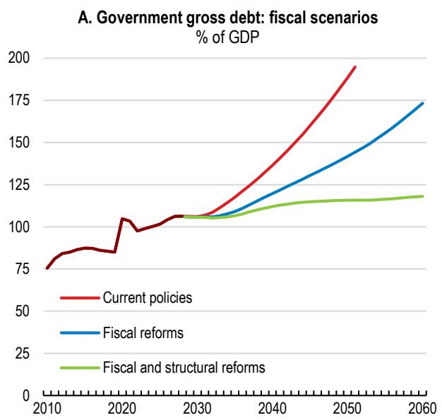

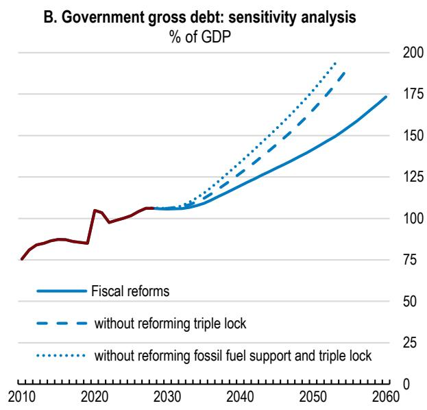  
Note: The “Current policies” scenario assumes existing and planned spending and tax policies. The “Fiscal reforms” scenario assumes the implementation of fiscal recommendations listed in Table 1.5. The “Fiscal and structural reforms” scenario further assumes the structural reforms listed in Table 1.1. The sensitivity analysis assumes the implementation of fiscal recommendations listed in Table 1.4 except the reform of the triple lock, the phasing out of fossil fuel support and the indexation of duty freeze. Figures refer to the general government. All scenarios account for ageing costs.  
Source: OECD calculations based on the OECD Long-Term Baseline (database); and OECD Long-Term Model.

## StatLink https://stat.link/9n5b3t

A comprehensive package of fiscal and structural reforms could help to restore long-term sustainability while supporting potential output and productivity. It would include measures to both contain expenditure, especially health and pension spending (e.g., improving hospital efficiency, tightening access to disability benefits, and reforming the state pension triple lock), and strengthen revenue by broadening tax bases while limiting distortions (e.g., phasing out fossil fuel support measures, reducing the tax compliance gap and removing inefficient tax expenditure). With these fiscal reforms, the structural primary balance could improve by close to 2% of GDP over the medium term (Table 1.5), helping to contain the rise in the debt-to-GDP ratio (Figure 1.9, Panel A, blue line). Complementary structural reforms to boost labour supply, investment and productivity (Table 1.1) would further reinforce fiscal sustainability through higher growth and lower spending, and put public debt on a sustainable path (Figure 1.9, Panel A, green line).

Long-term fiscal projections are subject to significant uncertainty regarding the scale and timing of potential savings. Reforming the triple lock account for a significant share of the projected improvement in long-term debt dynamics (Figure 1.9, Panel B, long-dashed line) but such reform is politically difficult to implement and fiscal savings are highly sensitive to future volatility of consumer price inflation and earnings growth (Chapter 2). Efficiency gains in healthcare may also prove difficult to realise. In addition, reforms to phase out fossil fuel support might be politically unfeasible in the short term given the ongoing energy price shock (Figure 1.9, Panel B, short-dashed line). Moreover, these projections do not account for the additional public expenditure required for climate change adaptation (Chapter 3), owing to limited data availability and the absence of an analytical framework to link adaptation investments to reduced climate-related damage costs (OBR, 2025[34]; Guillemette and Château, 2023[35]). These uncertainties underscore the importance of early and sustained policy action to strengthen fiscal resilience.

## Table 1.5. Estimated budgetary impact of selected tax and spending measures

Estimated savings (+) and costs (-), % of GDP

<table><tr><td>Selected fiscal policy recommendations</td><td>Medium-term budgetary impact</td><td>Long-term budgetary impact</td></tr><tr><td>Estimated impact on revenue</td><td>+1.5</td><td>+1.2</td></tr><tr><td>Phase out fossil fuel support measures with partial offset of shrinking bases (1)</td><td>+0.9</td><td>+0.5</td></tr><tr><td>Reduce the tax compliance gap (3)</td><td>+0.3</td><td>+0.4</td></tr><tr><td>Reduce the private residence relief for capital gain tax (4)</td><td>+0.3</td><td>+0.3</td></tr><tr><td>Estimated impact on expenditure</td><td>+0.4</td><td>+2.1</td></tr><tr><td>Raise NICs for high self-employment income to align with employees (5)</td><td>+0.5</td><td>+0.4</td></tr><tr><td>Improve productivity in hospitals (6)</td><td>+0.2</td><td>+0.4</td></tr><tr><td>Index pensions to the average of CPI inflation and wage growth instead of triple lock (7)</td><td>+0.3</td><td>+2.0</td></tr><tr><td>Reform council tax (8); cut the main stamp duty rate (9)</td><td>(0)</td><td>(0)</td></tr><tr><td>Tighten access to disability benefits (10)</td><td>+0.2</td><td>+0.1</td></tr><tr><td>Extend full childcare support to job seekers (11)</td><td>(-)</td><td>(-)</td></tr><tr><td>Introduce funding uplift for apprenticeship and develop new modular courses (12)</td><td>-0.1</td><td>-0.1</td></tr><tr><td>Index personal income tax and NICs thresholds from FY2028-29 (13)</td><td>-0.3</td><td>-0.3</td></tr><tr><td>Increase in public R&amp;D spending (14)</td><td>-0.4</td><td>-0.4</td></tr><tr><td>Total estimated impact on primary balance</td><td>+1.9</td><td>+3.3</td></tr></table>

Note: Estimates refer to the direct budgetary impact in the medium term (after 5-10 years) and the long term (10-25 years). Assumptions: (1) initially, 50% reduction in tax expenditure and in budgetary transfers, incl. reduced VAT rates on domestic fuel and power and indexation of fuel duty; then, gradual and partial offset of shrinking base with new taxes, incl. mileage charge; based on OECD Fossil Fuel Support database and on OBR data. (2) Short-term revenue of 0.1% of GDP, decreasing over time due to EV uptake and partly offset by rising mileage charge; based on OBR data. (3) 50% reduction in compliance gap for corporate income tax and for VAT; based on HRMC data. (4) Set threshold for relief such that forgone revenue is reduced by one third; based on HRMC data. (4) (5) Figure from OECD (2024). (6) 20% of model-implied savings on hospital spending; estimate from Barnes, Cournède and Hanmer (2025). (7) Estimate after 10 years, fiscal saving grows due to population ageing; see Chapter 2. (8) Estimate is +0.2; based on OECD (2024). (9) Estimate is -02; based on OBR (2025). (10) Reduce growth in spending on disability benefit to that of Universal Credit; based on OBR data. (11) Estimate below 0.05% of GDP. (12) Sum of gap between levy revenue and apprenticeship budget and two thirds of cost of new modules to universities; see Chapter 4. (13) Figure from OECD (2024). (14) Equivalent to a total R&D increase of 1% of GDP to OECD average; based on a crowding-in coefficient of 1.5 and OECD Main Science and Technology Indicators.
Source: OECD calculations.

## 1.4.5. Reforms to contain long-term spending pressures

Containing long-term spending pressures will require reforms that both restrain spending growth and improve the efficiency of public spending. With taxes revenues already at historically high levels, broad based tax increases would be difficult to sustain and could weigh on economic activity. Instead, safeguarding fiscal sustainability will depend on targeted spending restraint and efficiency-enhancing spending reallocation across government functions. In this context, strengthening efficiency in areas where spending is relatively high (Figure 1.10), and better targeting welfare programmes will be key to containing spending pressures while preserving the quality of public services.

Figure 1.10. Public spending is relatively high in health and in defence
Government spending by function, 2024, % of GDP  
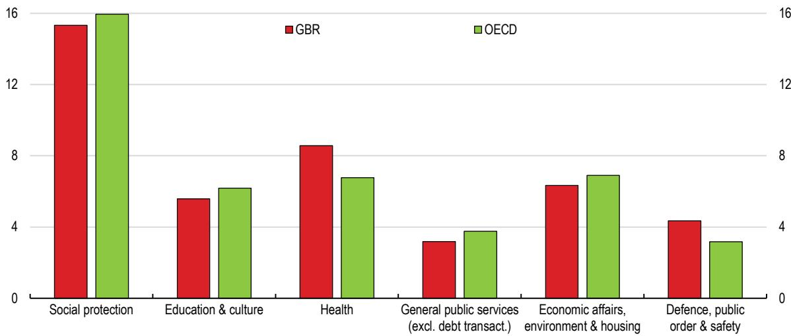  
Note: OECD refers to the average of the latest outturns by function for countries with available data. Source: OECD Annual Government Expenditure by Function (COFOG) (database).

StatLink https://stat.link/deomjh

## Containing welfare spending

Welfare spending accounts for 11% of GDP and has increased significantly since the pandemic and is projected to continue rising faster than nominal GDP. Spending on health and disability benefits has become a major driver of welfare expenditure growth. While part of this reflects the high incidence of self-reported disability (Figure 1.11, Panel A), cross-country comparisons suggest that programme design and incentives also play an important role. Gaps in activation requirements and higher benefit levels relative to unemployment benefits create incentives to claim and maintain long-term incapacity status. Strengthening the eligibility assessment framework for health-related benefits (Chapter 2), alongside improved activation and skills support (Chapter 4) would help ensure adequate support while containing fiscal pressures.

A related and fast-growing component of spending pressures arises from special educational needs and disabilities (SEND). The share of children and young people requiring special schools (a so-called “education, health and care plan”), has doubled over the past decade, creating significant cost pressures for local authorities and leading the central government to fully fund it from FY2028-29 (Chapter 4). Central government funding is a welcome development, but further action is needed. Without reform, spending on special education support is expected to continue rising, potentially crowding out resources for mainstream education. Improving the effectiveness of support and strengthening accountability for outcomes would help ensure that students receive appropriate support while containing costs. The government recently published a white paper laying out its plan to reform the SEND system (HM Government, 2026[36]).

Expanding state capacity in special education could deliver savings over the long term. Limited availability of state-funded places has led local authorities to depend on the private sector (so-called “independent special schools”), which often operate at significantly higher cost (Farquharson et al., 2026[37]). Building more state-funded special schools would help and is possible under the fiscal rules, which preserve capital expenditure. At the same time, as much of the increase in assessed needs reflects greater awareness and lower diagnostic thresholds (Latimer, Sibieta and Snape, 2025[38]), adequate gatekeeping of special education support is essential to both contain costs and ensure that pupils with special needs achieve better outcomes.

Figure 1.11. Spending pressures from health-related welfare are significant  
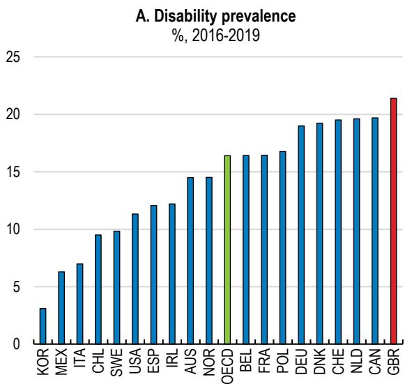

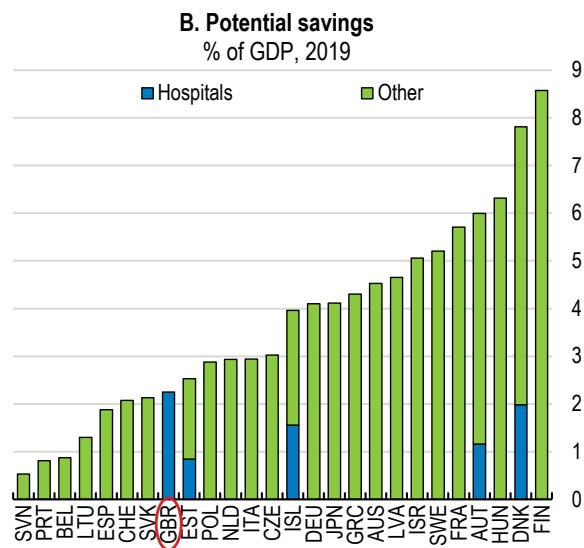  
Note: Panel A refers to averages over 2016-2019; OECD is the average of 32 countries with available data; see source for details. Panel B refers to positive deviations from model-implied spending by function of government, conditional on income per capita, age structure, total public expenditure and function-specific controls (including the share of private health expenditure); estimates smaller than one standard deviation are not reported; see Barnes, Cournède and Hanmer (2025[39]) for details.  
Source: OECD (2022[40]) Disability, Work and Inclusion: Mainstreaming in All Policies and Practices; and Barnes, Cournède and Hanmer (2025[39]) "Assessing government spending in OECD countries and searching for savings".

StatLink https://stat.link/fs0pt1

## Improving public sector efficiency

Improving public sector efficiency will be essential to contain spending pressures while maintaining the quality of public services. The government has announced plans to increase public sector productivity by 5% by FY2028-29, through efficiency gains in the delivery of public services and reductions in central administration budgets (HMT, 2025 $^{[41]}$ ). Advances in digital technologies, including artificial intelligence and telework, offer new opportunities to improve service delivery and administrative processes.

Productivity improvements should focus on areas where there is clear scope for efficiency gains rather than relying on uniform spending cuts across departments. Even though the Spending Review 2025 includes bespoke efficiency targets for each department, across-the-board reductions in administrative budgets, as currently planned, risk undermining service quality and ultimately prove counterproductive. Instead, reforms should be guided by careful assessment of departmental responsibilities, operational needs and past efficiency improvements. This would contribute to preserving services quality, and ensure that departments with expanding programmes, such as the Ministry of Defence, do not face disproportionate reductions. Strengthening coordination across departments and continuing efforts to improve the measurement of public sector productivity would also help identify opportunities for efficiency gains.

Healthcare will play a central role in containing long-term spending pressures. Health and long-term care account for a large share of public expenditure and cost pressures are set to increase with population ageing, rising demand for services, and more expensive medical technology. As two thirds of planned productivity gains are expected to come from the National Health Service (HMT, 2025[41]), improving efficiency is therefore essential.

International comparisons suggest that spending in hospitals is particularly high in international comparison. Cross-country OECD analysis shows that UK hospital spending is significantly above model-implied benchmarks, even after accounting for income, age structure, total public expenditure and private health-spending shares (Figure 1.11, Panel B). Moreover, hospital productivity remains below pre-pandemic levels (Harvey-Rich and Warner, 2025[42]). This indicates that there may be scope to improve the efficiency of hospital operations. Operational improvements could include better coordination of patient discharges, at the right time to the right location, especially as capacity is constrained in out-of-hospital care (Nuffield Trust, 2025[43]). Moreover, there is room for achieving savings in non-core areas, especially local social and community care (DHSC, 2024[44]), where the National Health Service has been increasingly involved to close gaps in local public services over the 2010s (Chapter 4).

Exercising prudence is key when searching for savings in the administration of health and social care. Untargeted cuts to administrative budgets could have detrimental knock-on effect on healthcare productivity, as the efficient delivery of front-line services depends on administrative quality. Maintaining adequate administrative capacity is essential for central procurement of drugs and equipment, effective management of large capital projects and overall system performance.

## 1.4.6. Higher tax efficiency would raise growth potential and support fiscal sustainability

Strengthening tax efficiency can complement efforts to contain spending pressures and support not only fiscal sustainability, but also growth potential. Tax revenues are already high by historical standards, limiting the scope for broad-based tax increases. The current tax structure appears balanced and relatively conducive to growth in international comparison, with relatively low revenue from corporate income taxes and social security contributions, average revenue from indirect taxes, and high revenue from property taxes (Figure 1.12). Continuing to improve compliance gaps, reducing distortions and broadening tax bases would therefore help to raise revenue, while supporting economic efficiency and growth, as discussed in previous Economic Surveys (OECD, 2024[9]; 2022[27]; 2020[28]).

## Figure 1.12. The tax structure appears balanced and conducive to growth

Tax revenue by source, 2024, % of GDP  
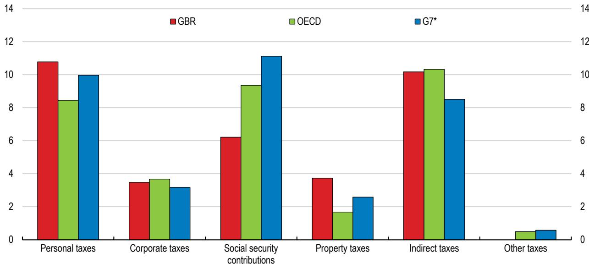  
Note: Category “social security contributions” includes taxes on payroll and workforce; category “other taxes” includes sources un-allocatable between taxes on income, profits and capital gains of individual and corporations; G7\* and OECD average the latest available outturns by source; G7\* refers to the average of G7 member countries excluding the United Kingdom.  
Source: OECD Global Revenue Statistics (database).

StatLink https://stat.link/5n43u6

## Improving tax compliance

The gap between tax collected and theoretical tax liabilities remains significant at about 1.5% of GDP (Figure 1.13, Panel A). This reflects a two-fold increase in the corporation tax gap, from about 0.25% to about 0.5% of GDP, entirely driven by the increase in uncollected tax liabilities from small firms (Figure 1.13, Panel B). This partially offsets the marked improvement in VAT collection over the past decade, which was due to the decline in cash transactions and a set of policy measures to bolster collection. In addition, the flow of tax debt at about 3% of GDP in FY2023-24 more than doubled since the pandemic (HMRC, 2025).

Figure 1.13. Small firms' weak compliance reflects both system complexity and tax avoidance  
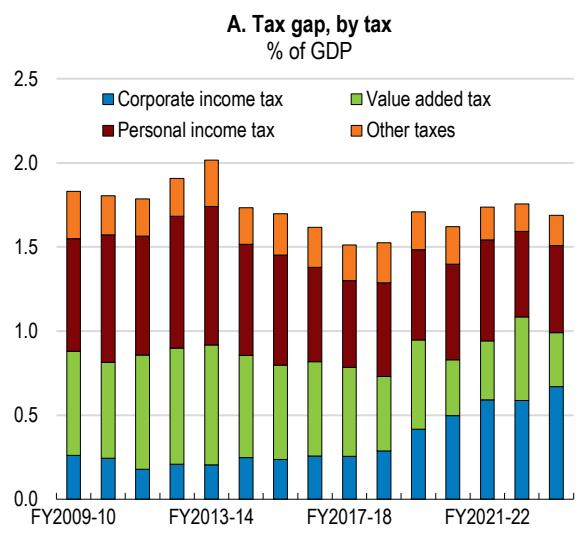

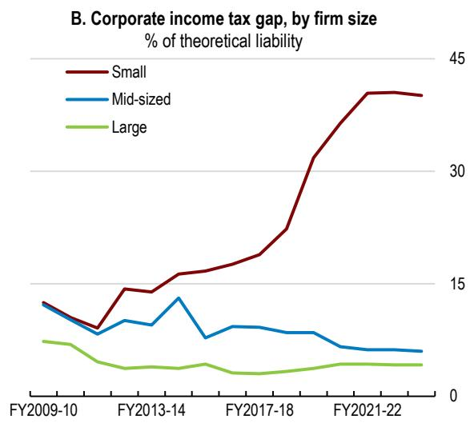  
Note: Figures refer to the gap between tax collected and theoretical tax liabilities.  
Source: HM Revenue & Customs, OECD Economic Outlook: Statistics and Projections (database); and OECD calculations.

## StatLink https://stat.link/5o6lzu

The government rightly increased resources for tackling non-compliance and debt collection as part of its tax plans, with several measures designed to narrow the corporate tax gap. New measures, including additional staff, more frequent recourse to private debt collection agencies, higher interest rates on tax debt and reforms to reduce fraudulent activities, specifically address non-compliance from SMEs and are expected to bring 0.2-0.3% of GDP in net revenue by FY2029-30 (OBR, 2025[45]; 2025[46]; 2024[29]).

Swiftly implementing announced anti-non-compliance measures for small businesses should be a priority, but improving the design of the tax system is also needed to supplement enforcement activities. Parts of the tax system are overly complex, entailing large compliance costs and increasing the likelihood of error or diverging legal interpretation, especially for small businesses. Moreover, significant tax differences across legal forms of income create incentives for tax-motivated incorporation (Adam, Delestre and Miller, 2025[47]). This tends to increase the number of people working through companies, with typically more complex tax liabilities than under the employee pay-as-you-earn system.

## Broadening tax bases

Inefficiencies in the tax system partly stem from relatively large tax expenditures in international comparison (Figure 1.14, Panel A), which tend to reduce tax bases and weigh on revenue. Distortions generally arise from the hundreds of so-called “non-structural” tax reliefs, which are designed to advance specific economic or social objectives. A list of all existing non-structural reliefs is updated annually, with stated objectives and estimated costs where available. In its 2026 report, HM Revenue & Customs listed close to 300 non-structural tax reliefs, accounting for about 7% of GDP (HMRC, 2026).

Evolving current costing exercises into full-fledged reviews of tax expenditures would help identify scope for both fiscal savings and efficiency improvements. At minimum, such reviews should go beyond mere cost estimates under the current HMRC Evaluation Framework and assess non-structural reliefs against their stated objective, additionality and cost efficiency, as is done in several OECD countries including Canada and the Netherlands. Integrating these assessments into the budget process, as in Canada and France (Box 1.5), would increase transparency and facilitate the phase-out of reliefs that either run counter to overarching government objectives, have limited impact or could be delivered at lower cost. More ambitious and systematic value-for-money evaluations could be envisaged, including an assessment of distortions and distributional issues. These could be based on the expertise of the National Audit Office, subject to adequate resourcing.

## Box 1.5. Reviews of tax expenditure: the cases of France and Canada

Tax expenditures tend to be easier to introduce, harder to control and less likely to be subjected to scrutiny than direct spending (OECD, 2025[48]). Therefore, regular reviews are key to improving transparency, ensuring policy effectiveness and helping governments identify inefficient or poorly targeted tax relief.

In France, tax expenditures are reported by policy objective within the budget process, as an annex to the finance bill prepared by the Ministry of Economy and Finance. This contributes to stronger oversight by parliament and other institutions.

In Canada, the federal government's annual Tax Expenditures and Evaluations report prepared by the Department of Finance Canada not only provides cost reporting, but also in-depth evaluations assessing the policy rationale, distributional effects and effectiveness in achieving stated objectives of selected measures. This helps to compare the costs and benefits of different tax expenditures and with direct spending programmes.

Source: OECD (2025[48]) Quality Budget Institutions.

Strengthening efforts to reduce distortions, close loopholes and make the system fairer remains necessary. A comprehensive tax review could help, as recommended in the last Economic Survey (OECD, 2024[9]). Priority areas for reform include:

\- Eliminating some reduced VAT rates. Lower (5%) rates, zero rates and exemptions from the headline 20% rate weigh on the yield of value-added taxation, which accounts for a third of non-structural tax reliefs (HMRC, 2026). The VAT revenue ratio is particularly low in international comparison, reflecting not only revenue lost to reduced rates, but also fraud and non-compliance (Figure 1.14, Panel B). Although lower VAT rates are often justified on distributional grounds, as they apply in part to goods and services consumed disproportionately by lower-income households, they are ill-targeted tools for redistribution. Moreover, lower rates distort consumption decisions and entail large social costs, as is especially the case for the lower rate on domestic energy consumption.

\- Updating council tax and abolishing stamp duty land tax. Although property taxation accounts for a relatively large share of total revenue, room for efficiency improvements is substantial (Chapter 4). Council tax (the local tax on domestic property determined by valuation bands) is still based on 1991 values. Updating property valuation and adjusting bands as recommended in previous surveys is long overdue (OECD, 2024[9]; 2022[27]; 2020[28]). Consequences for local public finances must be carefully monitored (Chapter 4).

\- Simplifying the personal income tax system. The income tax schedule features many arbitrary kink points, disparities across legal form and other complexities that distort labour supply. Priority reforms, discussed in depth in the last Economic Survey (OECD, 2024[9]), include further efforts to abolish the high-income child benefit charge and to align national insurance contributions for employees and the self-employed (Table 1.6).

Figure 1.14. Large tax expenditures entail unnecessary economic distortions  
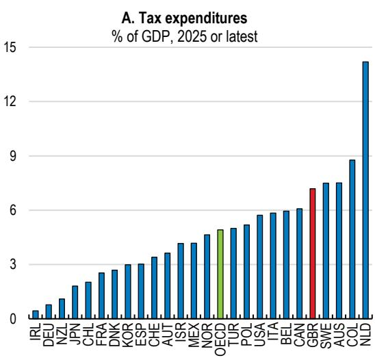  
Source: Global Tax Expenditure Database; and OECD (2024[49]) Consumption Tax Trends 2024.

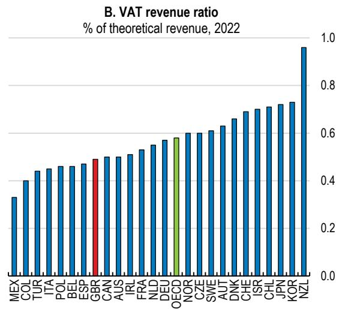

## StatLink https://stat.link/va5q2n

Preparing a comprehensive medium-term reform of the corporate tax system should also be considered, with a clear emphasis on predictability and along the lines of the in-depth discussion in the last Economic Survey (OECD, 2024[9]). Reforms and stability should be carefully balanced, given the importance of certainty for business investment decisions. Thus, it is sensible for the government to start preparatory work while respecting its commitment to leave most the current system of corporate tax reliefs unchanged (HMT, 2024[50]), despite significant inefficiencies. Key reforms include, but are not limited to:

\- Attenuating biases in the corporate income tax system. The corporate tax system distorts investment decisions towards certain types of assets and funding decisions towards debt. Reducing the deductibility of interest against corporate income tax and broadening qualifying asset class for full expensing is necessary to attenuate these distortions (Table 1.6).

\- Ensuring the additionality of R&D tax credits and patent box. The R&D tax regime is generous in international comparison and implies a large marginal tax subsidy on R&D activity (Figure 1.15, Panels A and B). Moreover, recent reforms to contain the rising cost of R&D tax credits for SMEs rebalanced overall support towards large firms (NAO, 2024[51]), which tend to have routine R&D activities that are less responsive at the margin. Capping the value of the tax credit, like in Canada, would contribute to limiting windfall gains for large companies, subject to a new evaluation of additionality under the current system (Chapter 4).

Table 1.6. Previous recommendations on improving efficiency in the tax system

<table><tr><td>Recommendations in previous Economic Surveys</td><td>Actions taken since the last Economic Survey</td></tr><tr><td>Conduct an in-depth tax review to make the tax system more efficient by reducing distortions, closing loopholes, and ending reliefs and exemptions that do not serve economic or social objectives.</td><td>The Government keeps all tax reliefs under review and has taken steps to improve the transparency of reliefs. Of the 340 tax reliefs with social or economic objectives, HMRC have reviewed the cost of 335, and published the estimated cost of 270, to help raise awareness. In addition, HMRC has published a specific evaluation plan for reliefs and published 24 evaluations covering 27 unique reliefs. At Budget 2025, the Government tackled reliefs that were costing far more than intended by limiting Capital Gains Tax relief to 50% for business disposals to Employee Ownership Trusts and reforming salary sacrifice for pensions by capping NICs relief on salary sacrifice into pensions schemes to the first £2,000 pension contributions from 2029.</td></tr><tr><td>Raise more revenues from recurrent taxes on property by adjusting thresholds for higher property values and by updating property valuation.</td><td>At Budget 2025 the Government announced the High Value Council Tax Surcharge (HVCTS); a new annual charge on residential property in England worth £2m or more, based on property values in 2026. The HVCTS will raise around £430m from 2028-29.</td></tr><tr><td>Broaden the VAT base by phasing out exemptions and compensate low-income households through targeted transfers.</td><td>The Government keeps the VAT base under review and assesses the effectiveness and value for money of existing reliefs. Since the last Survey, the VAT exemption for private school fees has been removed and VAT will apply to certain top up payments under the Motability Scheme from July 2026.</td></tr><tr><td>Reduce the gap between the rates of National Insurance Contributions between employed and self-employed people.</td><td>Reduction in Class 1 employee main rate from 12% to 8%, and in Class 4 self-employed main rate from 9% to 6% between April 2023 and April 2024.</td></tr><tr><td>Monitor investment incentivised through full expensing and reduce interest deductibility to avoid subsidising unprofitable investment.</td><td>Following the commitments in the 2024 Corporate Tax Roadmap, the government continues to maintain the parts of the UK corporate tax offer that are most important for attracting new investment: a low Corporation Tax main rate of 25% and the generous full expensing offer for plant and machinery. The Government keeps all taxes under review to ensure the best value for money for taxpayers.</td></tr><tr><td>Consider broadening qualifying assets for full expensing when fiscal space allows</td><td>At Budget 2025, the Government announced a new 40% First Year Allowance for main rate expenditure from 1 January 2026 - including most expenditure on assets for leasing and expenditure by unincorporated businesses, which are excluded from Full Expensing.</td></tr><tr><td>Assess and address the complexities created by the marginal relief corporate system and the small profit rate and potential disincentives for firms to increase profits.</td><td>No action taken.</td></tr><tr><td>Streamline the business rate system by ending reliefs and exemptions that are not effective.</td><td>The Government is committed to creating a fairer business rates system over the course of this Parliament that protects the high street, supports investment, and is fit for the  $21^{st}$  century. Since the last survey, the Government has introduced permanently lower multipliers for eligible retail, hospitality and leisure properties, replacing the temporary RHL relief that had been winding down since the pandemic, thereby providing ratepayers with greater certainty and support.</td></tr><tr><td>Evaluate whether a move towards a land value tax would be feasible in the longer term.</td><td>No action taken.</td></tr></table>

Further reviewing costly and distortionary tax reliefs remains important, despite political constraints due to capture by specific groups who benefit disproportionately. Potential reforms include, among others:

\- Removing reliefs for homeownership and/or construction that do not increase housing supply. The private residence relief, which exempts the sale of the main home from capital gains tax, costs about 1% of GDP in foregone revenue (HMRC, 2026) with little evidence of impact on transaction volumes. Zero-rate VAT on the construction of new homes costs about 0.5% of GDP (HMRC, 2026) but risks merely boosting prices as supply is constrained, worsening affordability issues.

\- Streamlining the business property taxation system. Business rates based on estimated rental value discourage investment, while frequent changes to reliefs create complexity. Moving to a land value tax would provide better development incentives, as discussed in the last Economic Survey (OECD, 2024[9]).

Figure 1.15. The additionality of public support for R&D activities could be evaluated  
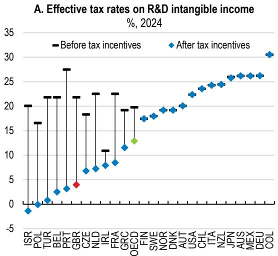  
Source: OECD Corporate Tax Statistics Database; and OECD R&D Tax Incentives Database.

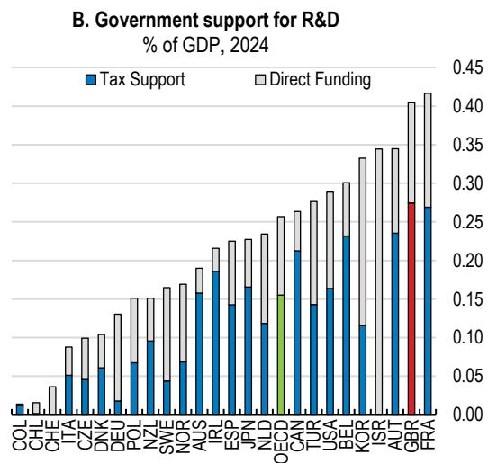  
StatLink https://stat.link/d3pk4w

## Exercising prudence with tax increases

In case raising tax becomes a last-resort necessity, carefully assessing behavioural responses and the broader context is key to minimising detrimental effect on efficiency and inequality (Cournède, Fournier and Hoeller, 2018[52]). The most straightforward option to yield large additional tax revenue consists of implementing a small rate increase on a large base, namely income tax, national insurance contributions or VAT. Raising other taxes would have particularly damaging effects on growth and welfare due to inefficient tax bases and strong behavioural responses (Adam, Delestre and Miller, 2025[47]).

Further raising national insurance contributions should be avoided, due to particularly detrimental labour supply effects and as the recent increase already pushed up labour costs. Raising income tax would in principle be less distortive for the same additional revenue, but the stealth effect of frozen thresholds has effectively increased income tax already. In addition, there is little room for straightforward progressivity adjustments, as taxation is relatively low for middle earners by design, while a relatively small number of taxpayers at the top of the income distribution account for a large share of revenue (Adam, Miller and Upton, 2024[53]). Thus, raising VAT seems the most prudent option.

Recommendations on strengthening growth while ensuring fiscal sustainability

<table><tr><td>MAIN FINDINGS</td><td>RECOMMENDATIONS (Key recommendations in bold)</td></tr><tr><td colspan="2">Trade and competitiveness</td></tr><tr><td>Rising labour costs are adding to domestic inflation pressures, driven by recent policy changes, including higher minimum wage and employer&#x27;s social security contributions, as well as &quot;day-one&quot; employment rights.</td><td>Contain the rise in labour costs to safeguard competitiveness, including by aligning minimum wage increases with productivity growth and reviewing the rise in employer national insurance contributions.</td></tr><tr><td>Weak goods exports and persistent trade frictions are weighing on growth, only partially offset by services exports.</td><td>Reduce non-tariff barriers to EU-UK trade, improve global market access for services and expand market opportunities under the UK Trade Strategy.</td></tr><tr><td>A complex tariff framework raises import costs and reduces competitiveness.</td><td>Streamline the tariff framework, and suspend duties on inputs for domestic production, to support competitiveness.</td></tr><tr><td colspan="2">Monetary and financial policies</td></tr><tr><td>Underlying price pressures remain elevated, driven by persistent wage growth and services inflation.</td><td>Maintain a restrictive, data-dependent monetary policy stance until underlying price pressures fall sustainably to target-consistent levels to ensure that inflation expectations remain well-anchored.</td></tr><tr><td>Monetary policy faces uncertainty about the neutral rate and inflation persistence.</td><td>Ensure an orderly and predictable reduction of central bank balance sheet while safeguarding adequate reserve levels.Continue to improve high-frequency indicators of reserve capacity, possibly based on spreads between Bank Rate and private repo market rates.</td></tr><tr><td>High interest rates continue to pose risks for some mortgage holders.</td><td>Strengthen monitoring of mortgage refinancing risks, especially for vulnerable cohorts.</td></tr><tr><td>Banks&#x27; capital and liquidity positions appear sound, but interconnectedness with the large non-bank sector increases exposure to liquidity shocks.</td><td>Stress-test the entire private market ecosystem systematically within the broader UK financial system, as part of the Bank of England&#x27;s System-Wide Exploratory Scenario.</td></tr><tr><td>The recommended system-wide Tier 1 capital benchmark was revised down and appropriately supports credit growth as financial conditions have tightened, but global financial risks have increased.</td><td>Closely monitor credit aggregates and financial conditions to allow for the timely recalibration of the counter-cyclical capital buffer in response to changes in the risk environment.</td></tr><tr><td colspan="2">Fiscal framework</td></tr><tr><td>The fiscal stance is moderately restrictive while inflation remains above target.</td><td>Maintain a restrictive fiscal stance to support disinflation and rebuild fiscal buffers.</td></tr><tr><td>Reliance on politically difficult spending restraint creates risks for the credibility of the government&#x27;s medium-term fiscal consolidation strategy.</td><td>Strengthen the credibility of the medium-term fiscal strategy by adhering to the expenditure paths defined in the spending review and preparing contingency tax and spending measures.</td></tr><tr><td>The fiscal rules introduced in 2024 allow for investment, limit borrowing-financed consumption and align with spending reviews. However, fiscal policy decisions remain highly sensitive to short term changes in the headroom against fiscal rules, which can weaken predictability and encourage frequent adjustments.</td><td>Strengthen the effective use of the fiscal framework by focussing less on short-term headroom, relying more on broader indicators of medium-term fiscal sustainability and showcasing uncertainty around point estimates.</td></tr><tr><td colspan="2">Tax and spending</td></tr><tr><td>Rising spending on health and disability benefits, as well as on special educational needs, is the main driver of the unsustainable growth in welfare spending in the medium term.Spending on special educational needs and disabilities will add further strain on expenditure. The supply of special education depends on costly delivery by the private sector due to capacity constraints in the public sector.</td><td>Strengthen the design of the health-related welfare system by closing activation gaps and benefit levels relative to unemployment, and by tightening the eligibility assessment framework for disability benefits.Improve state capacity to support children with special needs by building more state-funded special schools and setting clear quality objectives, with accountability on outcomes.</td></tr><tr><td>The government&#x27;s plans to raise public sector efficiency rely on quasi-uniform cuts across departments, despite bespoke efficiency targets, casting doubt about deliverability and public service preservation.</td><td>Allocate spending cuts based on actual scope for efficiency gains, accounting for changes in departmental responsibilities and past savings in administrative spending.</td></tr><tr><td>Small companies account for a rising share of uncollected tax liabilities, partly reflecting tax system complexity, despite increased enforcement efforts.</td><td>Reduce tax differences across legal forms to reduce incentives for tax-motivated incorporation, which have more complex tax liabilities.</td></tr><tr><td>Numerous tax expenditures, including reduced VAT rates and homeownership relief, narrow the tax base, cost about 7% of GDP, and are not systematically evaluated.</td><td>Systematically review tax expenditures and gradually phase out those inefficient or poorly targeted.</td></tr><tr><td>The tax system features many distortions and exemptions, entailing large social and fiscal costs.</td><td>Prioritise reforms that are both strongly efficiency-enhancing, including eliminating reduced VAT rates, updating council tax and abolishing stamp duty land tax, abolishing the high-income child benefit charge and aligning national insurance contributions for employees and the self-employed.</td></tr><tr><td>The tax ratio has been rising close to OECD average, while long-term spending pressures will continue straining public finances.</td><td>Prioritise expenditure restraint if further fiscal consolidation is needed.</td></tr></table>

## References

Adam, S., I. Delestre and H. Miller (2025), “Options for tax increases”, in Emmerson, C., K. Ogden and B. Zaranko (eds.), IFS Green Budget 2025, Institute for Fiscal Studies, London, https://ifs.org.uk/publications/options-tax-increases.

Adam, S., H. Miller and B. Upton (2024), “The government’s record on tax 2010-24”, Institute for Fiscal Studies, London, https://ifs.org.uk/publications/governments-record-tax-2010-24. [53]

Bakker, J., N. Datta and R. Davies (2023), Brexit and consumer food prices: May 2023 update, https://cep.lse.ac.uk/pubs/download/brexit18.pdf.

Barnes, S., B. Cournède and F. Hanmer (2025), “Assessing government spending in OECD countries and searching for savings”, OECD Economics Department Working Papers, No. 1845, OECD Publishing, Paris, https://doi.org/10.1787/0697f1d7-en.

Bernanke, B. (2024), Forecasting for monetary policy making and communication at the Bank of England: A review, Bank of England, https://www.bankofengland.co.uk/independent-evaluation-office/forecasting-for-monetary-policy-making-and-communication-at-the-bank-of-england-a-review.

BoE (2026), “Forecast evaluation report”, Bank of England, London, [22] https://www.bankofengland.co.uk/paper/2026/forecast-evaluation-report-january-2026.

BoE (2026), Monetary Policy Report: February 2026, Bank of England, London, https://www.bankofengland.co.uk/monetary-policy-report/2026/february-2026.

BoE (2025), Enhancing the resilience of the gilt repo market, Bank of England, London, https://www.bankofengland.co.uk/paper/2025/discussion-paper/enhancing-the-resilience-of-the-gilt-repo-market. [25]

BoE (2025), Financial Stability Report: December 2025, Bank of England, London, https://www.bankofengland.co.uk/financial-stability-report/2025/december-2025.

BoE (2025), Monetary Policy Report: August 2025, Bank of England, London, [18] https://www.bankofengland.co.uk/monetary-policy-report/2025/august-2025.

BoE (2025), Monetary Policy Report: November 2025, Bank of England, London, https://www.bankofengland.co.uk/monetary-policy-report/2025/november-2025. [7]

BoE (2024), “Transitioning to a repo-led operating framework”, Bank of England, London, [20] https://www.bankofengland.co.uk/paper/2024/dp/transitioning-to-a-repo-led-operating-framework.

Cournède, B., J. Fournier and P. Hoeller (2018), “Public finance structure and inclusive growth”, OECD Economic Policy Papers, No. 25, OECD Publishing, Paris, https://doi.org/10.1787/e99683b5-en. [52]

DHSC (2024), Independent investigation of the NHS in England, Department of Health and Social Care, [44] https://www.gov.uk/government/publications/independent-investigation-of-the-nhs-in-england.

Du, W., K. Forbes and M. Luzzetti (2024), “Quantitative tightening around the globe: What have we learned?”, [19] National Bureau of Economic Research, Cambridge, MA, https://doi.org/10.3386/w32321.

Farquharson, C. et al. (2026), “Annual report on education spending in England: 2025-26”, Institute for Fiscal Studies, London, https://ifs.org.uk/publications/annual-report-education-spending-england-2025-26. [37]

FSB (2025), Global Monitoring Report on Nonbank Financial Intermediation 2025, Financial Stability Board, Basel, [24] https://www.fsb.org/uploads/P161225.pdf.

Garofalo, M., G. Rosso and R. Vicquéry (2024), “Dominant currency pricing transition”, Bank Staff Working Papers, No. 1074, Bank of England, London, https://www.bankofengland.co.uk/-/media/boe/files/working-paper/2024/dominant-currency-pricing-transition.

Guillemette, Y. and J. Château (2023), “Long-term scenarios: incorporating the energy transition”, OECD Economic Policy Papers, No. 33, OECD Publishing, Paris, https://doi.org/10.1787/153ab87c-en.

Harvey-Rich, O. and M. Warner (2025), “The outlook for public sector productivity”, in Emmerson, C., K. Ogden and B. Zaranko (eds.), IFS Green Budget 2025, Institute for Fiscal Studies, London, https://ifs.org.uk/publications/outlook-public-sector-productivity.

HM Government (2026), Every Child Achieving and Thriving, Department for Education, https://www.gov.uk/government/publications/every-child-achieving-and-thriving. [36]
HM Government (2025), The UK's Modern Industrial Strategy 2025, Department for Business and Trade, https://www.gov.uk/government/collections/the-uks-modern-industrial-strategy-2025. [4]
HM Government (2024), Plan for Change: Milestones for Mission-Led Government, Prime Minister's Office, https://www.gov.uk/missions. [3]
HMT (2025), "Spending review 2025", HM Treasury, https://www.gov.uk/government/publications/spending-review-2025-document. [41]
HMT (2024), "Charter for Budget Responsibility: Autumn 2024", HM Treasury, https://www.gov.uk/government/publications/draft-charter-for-budget-responsibility-autumn-2024. [32]
HMT (2024), "Corporate Tax Roadmap 2024", HM Treasury, https://www.gov.uk/government/publications/corporate-tax-roadmap-2024. [50]
IMF (2025), 2025 Article IV Consultation: Staff Report, International Monetary Fund, Washington, DC, https://www.imf.org/en/publications/cr/issues/2025/07/24/united-kingdom-2025-article-iv-consultation-press-release-staff-report-and-statement-by-the-568905. [12]
IMF (2025), External balance assessment (Data and estimates), International Monetary Fund, Washington, DC, https://www.imf.org/external/np/res/eba/data.htm. [15]
Latimer, E., L. Sibieta and D. Snape (2025), "Support for children with disabilities and special educational needs", in Emmerson, C., K. Ogden and B. Zaranko (eds.), IFS Green Budget 2025, Institute for Fiscal Studies, London, https://ifs.org.uk/publications/support-children-disabilities-and-special-educational-needs. [38]
NAO (2024), "Tax measures to encourage economic growth", National Audit Office, London, http://www.nao.org.uk/reports/tax-measures-to-encourage-economic-growth. [51]
Nuffield Trust (2025), "Delayed discharges from hospital", https://www.nuffieldtrust.org.uk/resource/delayed-discharges-from-hospital. [43]
OBR (2025), Economic and Fiscal Outlook: March 2025, Office for Budget Responsibility, London, https://obr.uk/efo/economic-and-fiscal-outlook-march-2025/. [46]
OBR (2025), Economic and Fiscal Outlook: November 2025, Office for Budget Responsibility, London, https://obr.uk/frs/economic-and-fiscal-outlook-november-2025/. [45]
OBR (2025), Fiscal Risk and Sustainability: July 2025, Office for Budget Responsibility, London, https://obr.uk/frs/fiscal-risks-and-sustainability-july-2025/. [34]
OBR (2024), Economic and Fiscal Outlook: October 2024, Office for Budget Responsibility, London, https://obr.uk/efo/economic-and-fiscal-outlook-october-2024/. [29]
OBR (2024), "Review of the March 2024 forecast for departmental expenditure limits", Office for Budget Responsibility, London, https://obr.uk/review-of-the-march-2024-forecast-for-departmental-expenditure-limits/. [33]
OECD (2026), OECD Economic Outlook, Interim Report March 2026: Testing Resilience, OECD Publishing, Paris, https://doi.org/10.1787/d4623013-en. [10]
OECD (2026), OECD Economic Outlook, Volume 2026 Issue 1: Under Pressure, OECD Publishing, Paris, https://doi.org/10.1787/2d1956f0-en. [2]
OECD (2026), OECD National Accounts (database), OECD Publishing, Paris, https://data-explorer.oecd.org/s/4qm (accessed on 12 June 2026). [5]
OECD (2025), Attitudes Towards Social Risks and Social Protection in the United Kingdom: Insights from the OECD Risks that Matter Survey, OECD Publishing, Paris, https://doi.org/10.1787/5b197489-en. [26]
OECD (2025), OECD Economic Outlook, Volume 2025 Issue 2: Resilient Growth but with Increasing Fragilities, OECD Publishing, Paris, https://doi.org/10.1787/9f653ca1-en. [16]
OECD (2025), "OECD global long-run economic scenarios: 2025 update", OECD Economic Policy Papers, No. 36, OECD Publishing, Paris, https://doi.org/10.1787/00353678-en. [1]

OECD (2025), Quality Budget Institutions: Developments in OECD countries, OECD Publishing, Paris, https://doi.org/10.1787/8e811202-en.
[48]
OECD (2025), “Recommendation of the Council on Principles for Independent Fiscal Institutions”, OECD/LEGAL/0401.
[31]
OECD (2024), Consumption Tax Trends 2024: VAT/GST and Excise, Core Design Features and Trends, OECD Publishing, Paris, https://doi.org/10.1787/dcd4dd36-en.
[49]
OECD (2024), OECD Economic Surveys: United Kingdom 2024, OECD Publishing, Paris, https://doi.org/10.1787/709e70b8-en.
[9]
OECD (2022), Disability, Work and Inclusion: Mainstreaming in All Policies and Practices, OECD Publishing, Paris, https://doi.org/10.1787/1eaa5e9c-en.
[40]
OECD (2022), OECD Economic Surveys: United Kingdom 2022, OECD Publishing, Paris, https://doi.org/10.1787/7c0f1268-en.
[27]
OECD (2020), OECD Economic Surveys: United Kingdom 2020, OECD Publishing, Paris, https://doi.org/10.1787/2f684241-en.
[28]
ONS (2026), Labour market overview (Statistical bulletin), Office for National Statistics, https://www.ons.gov.uk/employmentandlabourmarket/peopleinwork/employmentandemployeetypes/bulletins/uklabourmarket/previousreleases.
[8]
ONS (2026), Productivity flash estimate and overview (Statistical bulletin), Office for National Statistics, London, https://www.ons.gov.uk/employmentandlabourmarket/peopleinwork/labourproductivity/articles/ukproductivityintroduction/previousreleases (accessed on 12 June 2026).
[6]
van Geest, L. (2025), “External review of the Office for Budget Responsibility”, Office for Budget Responsibility, London, https://obr.uk/docs/dlm\_uploads/External-review-of-the-Office-for-Budget-Responsibility-2025.pdf.
[30]
WTO (2025), Trade Policy Reviews: United Kingdom 2025, World Trade Organization, Geneva, https://www.wto.org/english/tratop\_e/tpr\_e/tpr\_gbr\_28oct25\_e.htm.
[11]

## 2 Ensuring state pension sustainability while closing gaps in private pension savings

Nicolas Gonne, OECD

The pension system performs well overall, supported by the complementarity between the pay-as-you-go state pension and asset-backed private pensions. However, it faces a dual challenge of preserving fiscal sustainability and strengthening private pension savings, particularly among groups with coverage gaps. The triple lock indexation of state pensions puts upward pressure on public expenditure and adds significant fiscal risks by exposing public finances to supply shocks, thus requiring a timely reform that overcomes political economy constraints. At the same time, strengthening work incentives is key to maintaining a robust pay-as-you-go financing base by supporting strong employment. In addition, extending automatic enrolment while preserving the right to opt out would help to increase private pension savings among the self-employed, while completing the childcare reform would boost female hours worked and lifetime earnings, hence contribute to narrowing the gender pension gap.

## 2.1. The pension system features strengths and weaknesses

The UK pension system comprises a public, pay-as-you-go state pension scheme and an extensive private pension sector, ensuring that most individuals have adequate income in old age. Replacement rates are on par with the OECD average, especially for individuals with low lifetime earnings (Figure 2.1, Panel A). In addition, non-contributory benefits provide supplementary financial support to pensioners, notably the means-tested pension credit and housing benefit, as well as winter fuel payment. Pensioners may also be eligible for several health-related benefits.

Figure 2.1. A sound system and better demography underpin adequate pension outcomes  
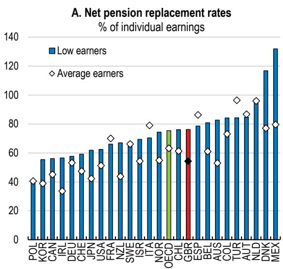

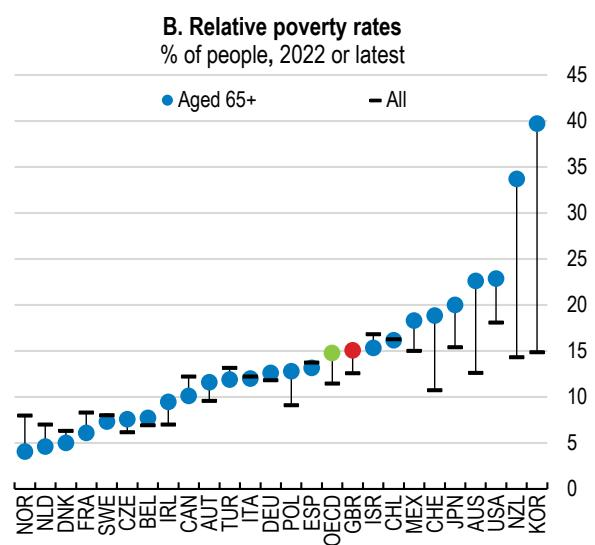

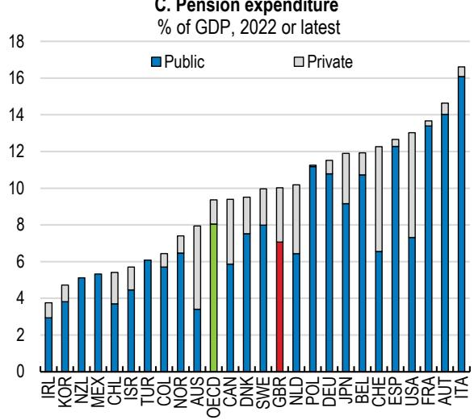

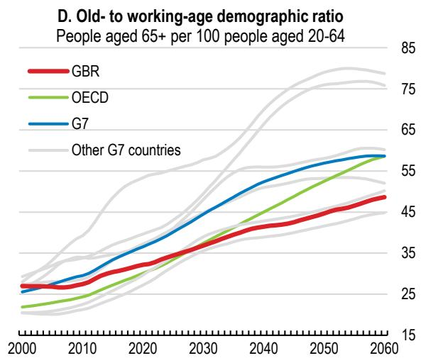

Note: Panel A refers to the value of pension entitlements from (quasi-)mandatory public and private schemes relative to earnings, net of personal income taxes and of employee and pensioner social security contributions; in the United Kingdom, these comprise both state and occupational pensions; see OECD (2025[1]) for details. Panel B refers to the share of people with equivalised household disposable income below half of the median. Panel C refers to direct (cash) public expenditure and payments from private pension schemes. Panel D refers to the medium variant of the United Nations' 2024 population forecast; OECD and G7 refer to simple averages.
Source: OECD Pensions at a Glance (database).

StatLink https://stat.link/9yjdug

Reforms implemented in the 2010s strengthened adequacy. The introduction of the new state pension increased the level, coverage and indexation of the basic entitlement, reducing pensioners' reliance on means-tested benefits (OBR, 2025[2]). Automatic enrolment into occupational pensions increased private pension participation considerably, from $42\%$ of private-sector employees in 2012 to $89\%$ in 2024.

The resulting safety net against old-age poverty appears broadly sufficient. Relative poverty for people aged 65 and over is only slightly higher than for the rest of the population (Figure 2.1, Panel B). Moreover, relative disposable income in old age is close to the OECD average by most measures, despite higher income inequality in the United Kingdom overall (OECD, 2025[3]).

The design of the system contributes to these outcomes (Box 2.1). The quasi-universal state pension provides a relatively high, flat-rate entitlement, mitigating disparities in lifetime earnings (OECD, 2025[1]). Private, quasi-mandatory occupational and personal pensions provide an earnings-related supplement to the state pension for most employees. At the same time, tax incentives for private pension disproportionately benefit higher-income individuals (OECD, 2024[4]).

## Box 2.1. Structure, main features and recent reforms of the UK pension system

The UK pension system comprises three pillars:

\- The state pension is a flat-rate entitlement from the public pay-as-you-go pension scheme. Although contributory in form, it is effectively quasi-universal, as periods of unemployment, sickness, disability and caring are credited towards the 35 qualifying years of national insurance contributions required for a full pension; it is payable from a single state pension age, currently 66 and legislated to rise to 67 by 2028.

\- Occupational pensions consist of a large set of private, quasi-mandatory funded schemes, with significant tax incentives for contributions up to an annual allowance. Defined contribution schemes account for a rising share of funded pensions; drawing down from individual pension savings or converting them into an annuity is authorised from age 55 (57 by 2028). Defined benefit schemes are largely closed to new contributions for private sector workers; by contrast, most public sector workers are in a pay-as-you-go defined benefit scheme.

\- Personal pensions allow individuals to save in private, voluntary pension plans, outside of occupational schemes but with otherwise similar features.

Major reforms were implemented in the 2010s following the work of the 2002-2006 Pensions Commission:

\- The new state pension, introduced in 2016, reduces pension income disparities by providing a higher basic entitlement than the previous state pension, removing the earnings-related component, and simplifying rules regarding qualifying national insurance contributions.

\- Regular state pension age reviews, required by the Pensions Act 2014, constitute a safety valve for the system by regularly assessing whether rules about the pension age remain appropriate, including regarding life expectancy.

\- The triple-lock guarantee, in effect since FY2012-13, supports pensioners' purchasing power by ensuring that the state pension is indexed annually by the highest of earnings growth, consumer price inflation or 2.5%.

\- Automatic enrolment, introduced in 2012 and fully implemented since 2019, boosts pension participation by requiring enrolment in occupational pensions for most private sector employees, with a right to opt out and compulsory minimum contributions by employers and employees.

Source: Department for Work and Pensions; HM Treasury; and OECD (2025[1]) Pensions at a Glance 2025.

The complementarity between pay-as-you-go state pensions and funded private pensions contributes to the system's soundness. Although total pension expenditure is close to the OECD average, public expenditure is relatively low whereas private expenditure is relatively high (Figure 2.1, Panel C). Consequently, fiscal pressures from public pension expenditure are more contained than in many OECD countries (Chapter 1). In fact, the projected increase in spending on health and long-term care exceeds that on pensions (OBR, 2025[5]).

Demographic trends are also comparatively more favourable than in many other OECD countries. Although ageing is adding substantial pressure on the pay-as-you-go financing base of public pensions (OECD, 2025[6]), the projected increase in the old- to working-age ratio over the next 25 years is moderate (Figure 2.1, Panel D), reflecting higher past fertility and working-age immigration (OECD, 2025[1]). Moreover, regular reviews of the state pension age since the Pension Act 2014 constitute a safety valve for the system.

However, significant fiscal risks remain. The “triple-lock guarantee”, whereby the pension entitlement is indexed annually by the highest of earnings growth, consumer price inflation or 2.5%, exposes public finances to macroeconomic volatility and turned out substantially more costly than initially anticipated (Figure 2.2, Panel A). Moreover, despite high employment levels in international comparison, weakness in labour force participation since the pandemic puts pressure on the pay-as-you-go financing base (OECD, 2024[7]).

Figure 2.2. Fiscal risks and pockets of inadequate savings weigh on affordability  
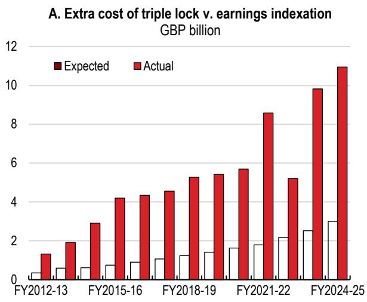

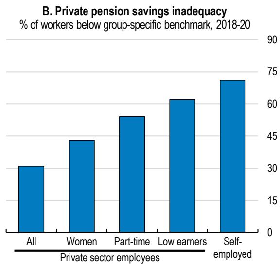  
Note: Panel A refers to the additional fiscal cost of indexing state pensions by the triple lock relative to earnings indexation; expected refers to the Office for Budget Responsibility's initial costing; amounts are in nominal terms; see OBR (2025[2]) for details. Panel B refers to the share of people aged 35-59 with projected pension incomes below Pensions UK's minimum living standards; categories overlap; see Cribb et al. (2024[8]) and O'Brien et al (2024[9]) for details.  
Source: Institute for Fiscal Studies; Office for Budget Responsibility; and OECD calculations.

StatLink https://stat.link/ob1857

In addition, some demographic groups, including women, save too little to achieve adequate retirement incomes, measured by either the Pensions Commission's “target replacement rates” (DWP, 2025[10]) or the occupational pension industry body’s “minimum living standards” (Figure 2.2, Panel B). The self-employed are at high risk of inadequate private pension savings, mostly reflecting low enrolment rates. Low earners and people in part-time employment are also more likely to fall short of minimum living standards.

Preserving the pension system therefore requires addressing both fiscal sustainability in state pensions and adequacy gaps in private pensions. This chapter focuses on four priorities: reforming the indexation rule of the state pension to mitigate fiscal risks; promoting labour market participation and employment to strengthen the pay-as-you-go financing base; extending automatic enrolment in private pensions for the self-employed; and enhancing family policy to reduce pension gaps between men and women.

Other pension-related issues are discussed elsewhere in this Survey or in previous issues. These include the long-run impact of pension reforms on public debt sustainability (Chapter 1); the effect of pension funds' declining demand for government debt on borrowing costs (Chapter 1); and the government-led impulse to leverage pension funds and support domestic investment (Chapter 1). Finally, pensions largely reflect past labour market participation and outcomes. Issues related to labour market disparities, especially for people with self-reported work-limiting conditions, care-taking responsibilities or low skills, were discussed in-depth in the special chapter of the last Economic Survey (OECD, 2024[7]).

## 2.2. Long-term fiscal vulnerabilities in state pensions must be addressed

Public expenditure on state pensions and other pensioner benefits was close to 6% of GDP in FY2024-25 (OBR, 2025[2]). Although lower than in many OECD countries (Figure 2.1, Panel D above) and growing more slowly than spending on health and long-term care (Chapter 1), pension spending remains a key component of public finances. Addressing fiscal vulnerabilities associated with the triple lock and ageing is essential to avoid future tax increases or cuts to other public programmes (Chapter 1).

## 2.2.1. Reforming the triple lock is necessary to reduce fiscal uncertainty

Following reforms that effectively transformed the state pension into a quasi-universal, flat-rate benefit (Box 2.1 above), two main policy levers remain to manage long term fiscal costs: the indexation rule and the state pension age.

The value of the state pension has grown substantially faster than earnings over the past 15 years (Figure 2.3, Panel A). This reflects the triple-lock guarantee, under which the pension increases annually by the highest of earnings growth, consumer price inflation or 2.5%. Together with the introduction of the new state pension, this reversed the trend decline in the value of the basic pension entitlement observed in the three decades prior to its implementation in FY2011-12 (Cribb, Emmerson and Karjalainen, 2025[11]).

Figure 2.3. The triple lock introduces significant uncertainty to public pension expenditure  
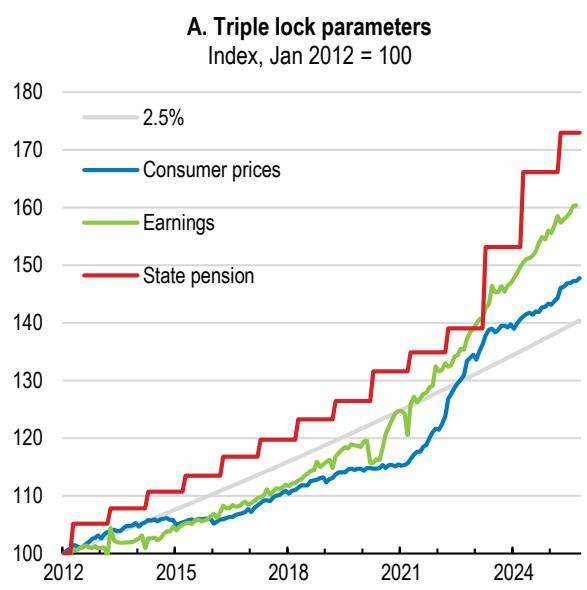

B. OBR projections of state pension expenditure % of GDP  
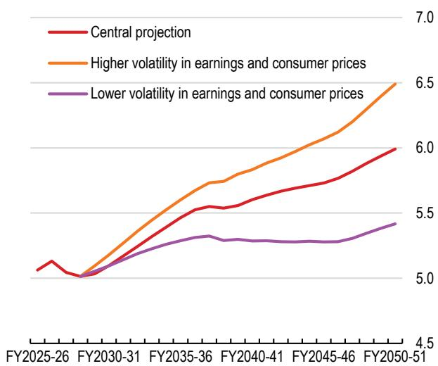  
Note: Panel B refers to the Office for Budget Responsibility's long-term projections of state pension spending as of July 2025; the central projection assumes that annual indexation by the triple lock averages 0.53 percentage points above earnings growth in the long run; the lower (resp. higher) volatility scenario assumes that the annual indexation averages 0.11 (resp. 0.93) percentage points above earnings growth; see source for details. Source: OBR (2025[2]) Fiscal Risk and Sustainability: July 2025; Office for National Statistics; and OECD calculations.

StatLink https://stat.link/4c0f6j

The triple-lock indexation mechanism is unusually generous in international comparison. Most OECD countries rely primarily on price indexation, leading to a decline in benefit ratios as real wages grow (OECD, 2025[1]). By contrast, in the United Kingdom, state pensions have increased annually by about 0.5 percentage points more than earnings and by almost 1.2 percentage points faster than inflation since FY2012-13. Generous indexation also has regressive distributional implications, benefitting wealthier and higher-income individuals more as they tend to live longer (Bozio, Rabaté and Tô, 2024[12]).

On top of adding upward pressure on public expenditure, the triple lock amplifies fiscal uncertainty by increasing the sensitivity of pension spending to earnings and inflation shocks (Figure 2.3, Panel B). In periods of macroeconomic volatility, when earnings growth and consumer price inflation exhibit large swings, the mechanism can generate sharp and unpredictable increases in pension expenditure. The issue is particularly acute following adverse terms-of-trade shocks, as during the 2021-2023 energy crisis, when prices first spike and then wages catch up, skewing risks upwards (Box 2.2). The mechanism had to be suspended in FY2022-23 following an exceptional spike in earnings growth to 8.4% due to the recovery from furlough and other pandemic-related measures.

The renewed increase in energy prices linked to the evolving conflict in the Middle East highlights the vulnerability of public finances to macroeconomic volatility due to supply shocks. In this context, reducing uncertainty around future pension spending would strengthen fiscal resilience and support more stable medium-term fiscal planning. A well-designed reform of pension indexation could help to smooth the fiscal impact of future inflation and earnings shocks while continuing to protect pensioners' living standards

The government should prepare a medium-term reform of the triple lock. Given political economy challenges and the existing commitment to the triple-lock guarantee over the current Parliament, the government's effort should focus on setting the ground for lasting reform. The current Pensions Commission could be tasked with initiating this work and draw on the experience of the 2002-2006 Pensions Commission, whose analytical foundations and independence are broadly regarded as instrumental to ensuing reforms (Massala and Pearce, 2021[13]). Careful consideration of phasing-in arrangements for a smooth transition, as well as of distributional impacts, is an essential part of such preparations. Comprehensive consultations and clear communication with all relevant stakeholders are also required to build reform momentum.

Explaining how a new indexation mechanism will be designed to be both effective and fair is key to ensuring the public acceptability of the reform. An emphasis on distributional considerations will be important, including the fact that wealthier individuals live longer on average and thus benefit more from generous indexation. Clearly describing trade-offs will also be necessary, such as further rises in state pension age in the absence of reform or the need to increase taxes or cut public spending to address fiscal risks in the absence of reform. The new OECD Public Acceptability Tool can help to articulate the main dimensions that matter for improving acceptability (OECD, 2025[14]).

One possible reform approach would replace the triple lock with indexation based on the average of consumer price inflation and wage growth, as recommended in previous Economic Surveys (OECD, 2024[7]; 2022[15]; 2020[16]). Such an approach would reduce the sensitivity of pension spending to temporary macroeconomic shocks while continuing to allow pension incomes to grow over time. Back-of-the-envelope calculations suggest that, had such a mechanism been in place since FY2012-13, state pension spending would have been about $0.7\%$ of GDP lower in FY2024-25 despite significant macroeconomic volatility over the period. At the same time, the value of the state pension would have grown by $3.1\%$ per year on average, below earnings growth, but more than 0.3 percentage points above consumer price inflation.

## Box 2.2. Asymmetric fiscal risks from triple-lock indexation: stochastic simulations

The triple-lock indexation rule for state pensions creates a nonlinear and asymmetric link between macroeconomic outcomes and fiscal costs, which standard deterministic projections do not capture. Ongoing OECD research develops a policy-focused stochastic simulation framework to assess ensuing risks to state pension expenditure.

The framework relies on simulating the triple-lock indexation parameters (headline inflation and earnings growth) using simple autoregressive processes and contemporaneous correlations, calibrated to historical volatility and persistence. For each simulation path, annual indexation is applied as specified in legislation, i.e., the maximum of simulated inflation, simulated earnings growth, and 2.5%. It is then used to project state pension expenditure in the OECD Long-Term Model (Guillemette, 2019 $^{[17]}$ ).

Results show how the triple lock amplifies fiscal risks upwards, as well as the persistence of inflation and earnings shocks for medium-term expenditure paths (Figure 2.4). The framework allows to simulate the impact of potential indexation reforms on fiscal risks, including a smooth earnings link or an average of headline inflation and wage growth.

## Figure 2.4. Fiscal risks from the triple lock are asymmetrically skewed to the upside

State pension expenditure (% of potential GDP)

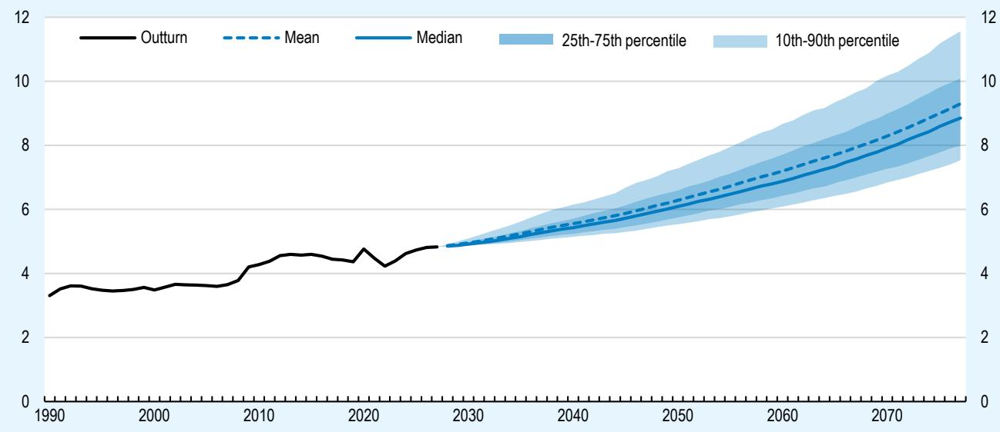  
Source: Department for Work and Pensions; OECD Long-Term Model; Office for National Statistics; and OECD calculations.  
StatLink https://stat.link/r3ypia

More gradual reform options could preserve a clearer link between pensions and earnings, while reducing fiscal volatility over time. One approach would be to index pensions to consumer price inflation, combined with periodic adjustments to maintain a stable relationship with average earnings over time, as in Australia (Box 2.3). Compared to the triple lock, this would reduce sensitivity to short-term inflation and wage fluctuations while still ensuring that pensioners are not left behind as wages and living standards rise over time. A gradual transition could preserve the current triple lock until pensions reach a targeted level relative to average earnings before moving to a benchmark indexation framework. Recent proposals of a “smooth earnings link” broadly follow this logic (IFS, 2025[18]; Resolution Foundation, 2020[19]).

## Box 2.3. Australia's pension indexation system: balancing adequacy and fiscal sustainability

Australia's state pension system combines regular inflation protection with periodic adjustments linked to earnings growth. Pensions are indexed to consumer prices twice a year, preserving purchasing power. In addition, pension levels are periodically reviewed against a pre-agreed earnings benchmark and adjusted upwards if they fall below that level to ensure that pensioners continue to benefit from improvements in living standards.

This benchmark indexation mechanism balances adequacy and fiscal sustainability. On the one hand, the combination of price indexation with a level floor linked to an earnings benchmark prevents any decline in pension benefits relative to prices or wages, ensuring that pensioners share in real wage growth. On the other hand, the absence of a direct link to earnings growth limits fiscal risks stemming from macroeconomic volatility.

However, the choice of the earnings benchmark (currently about 30% of men average weekly earnings) involves a trade-off between adequacy and fiscal cost, and creates political economy challenges.

Source: OECD (2025[20]) Pensions country profiles: Australia 2025.

The statutory pension age constitutes the second main policy lever. It is effectively linked to life expectancy through regular reviews by an independent commission, with the guiding principle that individuals should expect to spend up to one-third of their adult lives in retirement. The state pension age is set to rise to 67 between 2026 and 2028, above the OECD average (OECD, 2025[1]). This helps to contain long-term spending pressures, as each one-year increase in the state pension age (conditional on demographic trends) is estimated to reduce state pension spending by $0.3\%$ of GDP (OBR, 2025[2]).

The government should update legislation regarding future increases in state pension age, following the conclusions of the ongoing independent review expected in 2027. Ensuring that legislation reflects the appropriate timetable for changes to the state pension age would not only clarify long-term fiscal assessments, but also enable people to plan effectively for retirement, in line with the convention of providing a ten-year notice of changes. Prompt legislation would help to secure the current political consensus supporting a link between the statutory retirement age and life expectancy. In addition, maintaining regular and independent assessments of the rules regarding the pensionable age is key, considering factors such as life expectancy, fairness, and long-term fiscal sustainability.

Early retirement does not directly add pressure on public pension expenditure, as benefits cannot be claimed before the statutory pension age, contrary to many OECD countries. Moreover, the pension system provides an actuarially significant bonus to delay retirement beyond that age (OECD, 2025[1]). Nevertheless, the effective labour market exit age remained more than two years below the state pension age in 2024 (OECD, 2025[1]), weakening the financing base of the pay-as-you-go scheme, even though more recent LFS data suggests a slightly smaller gap. Strengthening labour market participation at older ages would reinforce the sustainability effect of increases in state pension age.

## 2.2.2. Maintaining high employment would bolster the pension financing base

Beyond indexation rules, the fiscal sustainability of the pay-as-you-go state pension system depends on the strength of the contribution base. Sustained labour market participation across cohorts, including both young and old, is therefore critical, as higher employment supports revenue from social security contributions and mitigates the fiscal impact of ageing.

The financing of state pensions remains robust, thanks to relatively high employment and wages, but recent weakness in labour market participation could start adding pressure (OECD, 2026[21]; 2026[22]). National insurance contributions, at $5.9\%$ of GDP in FY2024-25, still cover state pensions and other contributory benefits (OBR, 2025[5]), although the line between social security contributions and general taxation has become increasingly blurred (Chapter 1). However, the employment rate remains below pre-pandemic levels, in sharp contrast with most other economies (Figure 2.5, Panel A), weighing on national insurance contributions receipts.

Figure 2.5. Subdued employment could start weighing on the sustainability of state pensions  
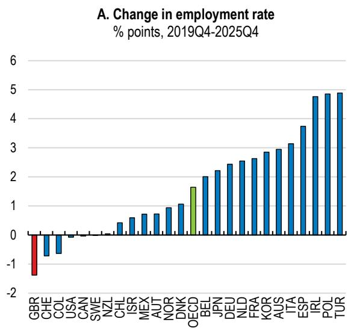  
Note: Panel A refers to the share of population aged 15-64.

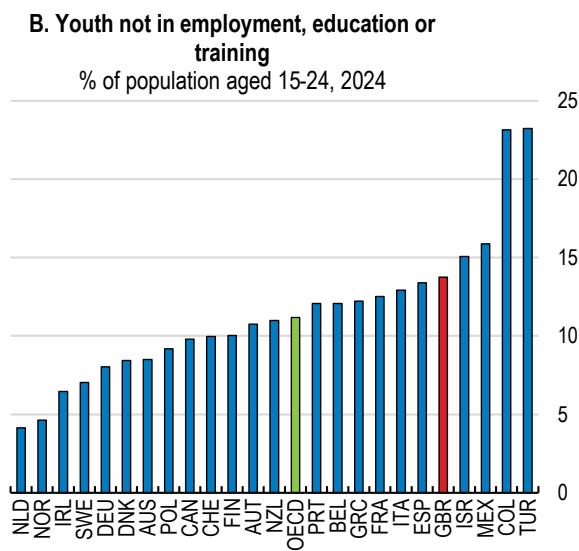  
Source: OECD Education at a Glance (database); and OECD Labour Force Statistics (database).

## StatLink https://stat.link/n2t7sc

Youth detachment from the labour market poses a particular concern for long-term sustainability. Labour market outcomes for younger cohorts have remained weak since the pandemic, with a particularly high prevalence of long-term sickness due to mental ill-health and neurodivergent conditions (DWP, 2025[23]; Banks, Karjalainen and Waters, 2024[24]). This is reflected in the relatively large share of youth not in employment, education or training (Figure 2.5, Panel B) and raises further concerns regarding future skills supply, hence productivity (Chapter 4).

Older workers' labour force participation and employment have largely recovered following the pandemic, yet the effective retirement age remains more than two years below the state pension age on average (OECD, 2025[1]). While early retirement partly reflects the availability of private pension savings and wealth effects, weaker labour market participation for older cohorts is also due to occupational strain, with health limitations frequently reported as the main reason for inactivity (ONS, 2026).

Tackling inactivity has been one of the government's priorities, especially among young people. The new Get Britain Working strategy acknowledges persistent regional disparities and reallocates some responsibilities and funding to subnational governments to better address local labour market needs, a welcome development (Chapter 4). In addition, the government announced a set of policies to improve school-to-work transitions by continuing to reform lifelong learning and apprenticeship (DfE, DWP & DSIT, 2025[25]), adding to policies advanced in successive fiscal events. Finally, the youth guarantee aims to ensure that all 16 to 24-year-olds have access to education, training, or help to find a job or an apprenticeship (DWP, HMT & DfE, 2025[26]). Monitoring outcomes will be key to ensure additionality and value-for-money.

However, incentives within the health-related welfare system continue weighing on labour supply, as discussed in depth in the last Economic Survey (OECD, 2024[7]). Progress on the necessary gatekeeping reform of the system has been constrained due to political pressure: while the government remains committed to strengthening incentives for people on incapacity benefits to re-enter the labour market by removing the work capability assessment, as recommended, it excluded the tightening of disability benefits from the reform package. A review is underway to tackle the issue of incapacity and disability benefits, in consultation with stakeholders (DWP, 2025[27]).

The government should sustain the impetus for advancing pro-work reforms in the health-related welfare system and in skills policy (Table 2.1). Swiftly following up on the conclusions from the ongoing Timms and Milburn Reviews is critical to deliver on the gatekeeping reform of incapacity and disability benefits, under which eligibility would depend solely on the personal independence payment assessment. Occupational health support, workplace adaptations, and return-to-work pathways after illness can help to support labour market participation for older cohorts (OECD, 2024[7]).

Attention to further work incentive issues in the wider tax-benefits system remains necessary, as the interaction between different income support schemes creates inactivity traps. The rise in health-related inactivity and resulting detachment from the labour market is partly due to changes in the relative level and conditionality of different forms of income support (Cribb et al., 2025[28]; OECD, 2024[7]). The recent removal of the two-child limit, which restricts child-related benefits to the first two children in a family, deserves scrutiny regarding potential disincentives to work: a significant share of households that are no longer bound by the limit are expected to become bound by the household welfare cap, from which those eligible for disability benefits can obtain an exemption.

When the fiscal situation allows (Chapter 1), indexing personal tax thresholds, especially for national insurance contributions, would strengthen incentives, especially at lower income levels. Reducing the complexity of the personal income tax system would also improve work incentives. In particular, the high-income child benefit charge (a tax that reduces or eliminates child benefit for households with income above a threshold) should be abolished, and the fiscal cost offset by raising the higher rate for income tax, as recommended in the last Economic Survey (OECD, 2024[7]).

Table 2.1. Previous recommendations on pro-work reforms in benefits, tax, and skills policy

<table><tr><td>Recommendations in previous Economic Surveys</td><td>Actions taken since the last Economic Survey</td></tr><tr><td>Reform the work capability assessment so that income support is not conditioned on being found incapacitated for work.Strengthen early interventions and formal return-to-work pathways, and introduce transitional disability programmes.</td><td>The government has rebalanced Universal Credit by lowering the generosity of specific disability income support for new claimants since April 2026. It has also published the Pathways to Work white paper and is setting out the Get Britain Working strategy, alongside the ongoing Timms and Milburn Reviews of disability and welfare reforms.</td></tr><tr><td>Index personal tax thresholds to inflation, prioritising national insurance contributions thresholds if fiscal space is constrained.Consider abolishing the high-income child benefit charge and offsetting the fiscal cost by raising the higher rate for income tax.</td><td>No action taken.</td></tr><tr><td>Reduce subsidy rates for current employees under the apprenticeship levy scheme and channel support to young people.Use statistical tools to target training to people with low skills who are most affected by digitalisation and the green transition.</td><td>The government has refocused apprenticeships on young people, with new foundation pathways in priority sectors, up to GBP 2 000 incentives for non-levy employers hiring 16–24 year-olds, and fully funded SME training from August 2026, alongside a new Level 2 Administrative Assistant apprenticeship and a GBP 140 million pilot with Mayoral Strategic Authorities to connect more young people to local apprenticeships.</td></tr></table>

## 2.3. Supporting private pension savings for groups with coverage gaps is key

Private pensions are an important complement to the state pension system and play a key role in supporting retirement incomes and limiting future fiscal pressures from ageing. They represent a significant component of the system, with expenditure around 3% of GDP and accounting for roughly a third of disposable income for retired households in their late 60s, while tax relief for private pension savings amounts to about 2% of GDP. However, private pensions disproportionately benefit richer households, leaving persistent adequacy gaps at the bottom of the income distribution and across groups, including the self-employed and women. Strengthening participation and contribution adequacy in private pensions will therefore be important to support living standards in retirement, particularly in the context of reforms to the triple lock, which could slow the growth of state pensions. The Pensions Commission has published a review of retirement income adequacy in spring 2026, with a particular focus on low earners.

## 2.3.1. Automatically enrolling the self-employed would boost replacement rates

Many self-employed have too little private pension savings to achieve adequate retirement incomes (Cribb et al., 2024[8]). Average pensions for the self-employed relative to those of employees are among the lowest in the OECD (Figure 2.6, Panel A). Lower pensions for the self-employed reflect their lower participation in private pensions (Figure 2.6, Panel B).

Figure 2.6. The self-employed participate less in private pensions  
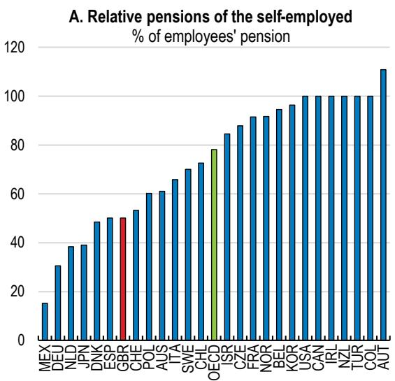

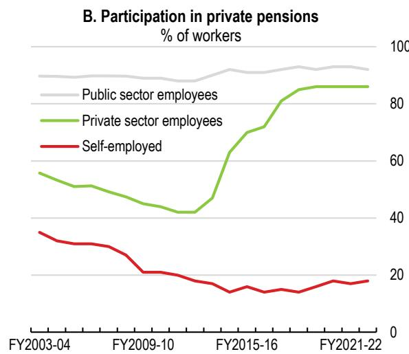  
Note: Panel A refers to the theoretical pension of self-employed people with pension contributions equal to the (quasi-)mandatory amount; see OECD (2025[1]) for details. Panel B refers to enrolment by eligible employees and the self-employed; see source for details.
Source: OECD Pension at a Glance (database); and OBR (2025[2]) Fiscal Risk and Sustainability: July 2025.

## StatLink https://stat.link/gdo3w1

Voluntary pension saving arrangements deliver comparatively weak contribution rates among the self-employed. This is partly due to the rising share of self-employed with lower and more volatile earnings, which might have depressed savings at the bottom of the distribution and is estimated to account for about a third of the decline in self-employed participation observed until the mid-2010s (Karjalainen, 2023[29]). In addition, the self-employed who participate in private pensions tend to make constant contributions in nominal terms over the career, in contrast with employees, whose nominal contributions mechanically increase with earnings.

The government should extend automatic enrolment to the self-employed to boost pension participation and improve savings adequacy. Such a reform could leverage the National Employment Savings Trust, which has a public service obligation to accept the self-employed, and be implemented through the self-assessment tax return. Alternatively, a less ambitious approach would require the self-employed to actively select their pension contribution rate when filing their tax return, introducing a behavioural nudge that is expected to increase participation relative to the current fully voluntary system (IFS, 2025[18]).

As the self-employed form a heterogeneous group, preserving the right to opt out of pension savings is important. For the self-employed with low lifetime earnings, low retirement incomes primarily reflect weak labour market outcomes rather than inadequate savings. In that case, requiring disproportionately high pension contributions does not improve welfare. While improvements to pension design, such as automatic enrolment, can contribute to addressing participation gaps, labour market policies remain key to boosting earnings, hence retirement incomes. Closing unwarranted tax and regulatory gaps between regular and non-standard forms of employment would also help (Chapter 1). For small business owners, many of whom face liquidity constraints, compulsory pension contributions would reduce the cash flow available to fund operations. By contrast, for the self-employed at the top of the earnings distribution, the accumulation of savings other than pensions, including business assets and financial wealth, weaken the case for further savings.

## 2.3.2. Completing the childcare reform could help to narrow the gender pension gap

Women are less likely than men to reach minimum living standards in retirement, reflected in one of the largest gender pension gaps in the OECD (Figure 2.7, Panel A). This mostly reflects differences in hours worked over the career (Figure 2.7, Panel B), as gender gaps in both career duration and hourly wages are close to the OECD average (OECD, 2025[1]). Private pensions tend to amplify these labour market disparities, while state pensions attenuate them, in part thanks to the decreasing importance of the earnings-related component (Box 2.1 above).

Figure 2.7. Gender gaps are large in both retirement income and part-time employment  
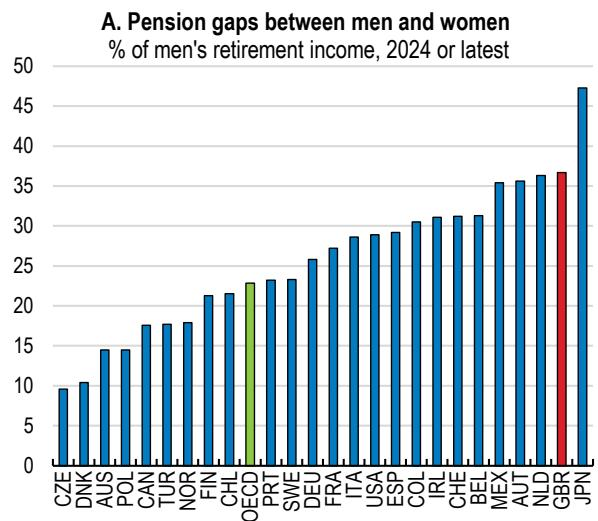

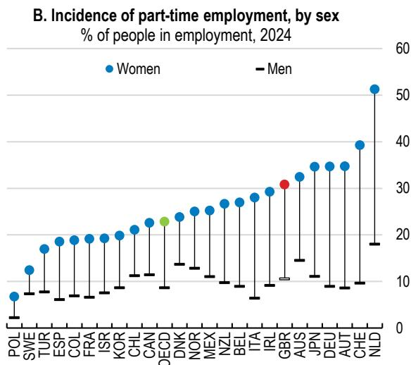  
Note: Panel A refers to the difference in mean retirement income between male and female pension beneficiaries aged 65+ as a share of men's mean retirement income. Panel B refers to the share of workers aged 15-64 who usually work less than 30 hours per week in the main job. Source: OECD Labour Force Statistics (database); and OECD Pensions at a Glance (database).  
StatLink https://stat.link/4fwjuh

Gender pension gaps due to low hours worked over the career are exacerbated by the current design of auto-enrolment, as it excludes employees earning less than GBP 10 000, disproportionately women. Removing this floor and ensuring that employers contribute irrespective of earnings level would contribute to reducing the gaps. It would also support private pension savings among the self-employed when automatic enrolment is extended to them (see above).

Women's lower hours worked reflect disproportionate family or caring responsibilities, as discussed in the last Economic Survey (OECD, 2024[7]). The combination of unequal sharing of unpaid work and limited availability of affordable childcare creates barriers to female labour supply, as it raises the opportunity cost of gainful employment (Gonne and Trincão, 2024[30]). This results in part-time employment and labour market detachment for many women, hence in lower lifetime private pension contributions. Paid parental leave entitlements are also particularly low in international comparison (OECD, 2024[31]).

The recent childcare expansion improves affordability significantly and promotes labour market participation (OECD, 2024[7]). The expanded entitlement provides working parents with 30 hours of childcare per week for 38 weeks per year for each child aged nine months to five years. The expansion was successfully phased in, meeting all interim implementation milestones.

Risks from childcare supply bottlenecks remain, considering the scale-up needed to accommodate the increase in demand and widespread labour shortages in the care sector. This could slow and constrain the reform, as discussed in the last Economic Survey (OECD, 2024[7]). Moreover, concerns regarding low funding rates have not been addressed yet, although they could incentivise childcare providers to prefer hours above the entitlement at a premium to the free entitlement, hence pricing out the less well-off. The government intends to create enough new nurseries in unused primary school classrooms to address the issue by FY2028-29 (HMT, 2025[32]), but a prioritisation strategy is lacking for the transition.

The government should enhance the tracking of childcare demand at the local level to better identify where supply constraints are most binding. Combining existing information on childcare provision, already collected through registered childcare providers, with more systematic data on unmet demand, including waiting lists maintained by local authorities, would support the prioritisation of resources to areas with the most excess demand. Continuing to step up family policy is warranted, notably regarding childcare support for jobseekers and parental leave (Table 2.2).

Table 2.2. Previous recommendations on support for childcare provision and family policy

<table><tr><td>Recommendations in previous Economic Surveys</td><td>Actions taken since the last Economic Survey</td></tr><tr><td>Set and monitor interim implementation milestones, and prioritise low-income households if childcare supply falls short of demand.Review childcare funding rates regularly to strike the balance between limiting fiscal costs and ensuring quality access.Extend full childcare support to active jobseekers.</td><td>The government started monitoring childcare sufficiency and allocated additional funding for school-based nurseries. Funding support for disadvantaged children was raised by 15% in FY2026-27, following a substantial increase in the previous year, while average childcare funding rates were increased by 4.3% for children under two and by close to 5% for 3- and 4-year-olds. An ongoing review of childcare provision aims to simplify the system for providers and families.</td></tr><tr><td>Increase the cap on paternity pay to limit earnings shortfall for fathers.Improve the collection of data on parental leave uptake to design and evaluate impacts on gender gaps.</td><td>The Government has published a summary of evidence to support the Parental Leave and Pay Review. In addition, mandatory large employer gender pay gap reporting allows monitoring of longer-term impacts of leave system design on pay and career progression.</td></tr><tr><td>Assess the impact of the threshold for childcare entitlement on labour supply, demand for childcare services, and public finances.</td><td>No action taken.</td></tr></table>

Recommendations on ensuring pension sustainability and affordability

<table><tr><td>MAIN FINDINGS</td><td>RECOMMENDATIONS (key in bold)</td></tr><tr><td colspan="2">Addressing long-term fiscal vulnerabilities in state pensions</td></tr><tr><td>The triple-lock indexation mechanism for state pensions is unusually generous, exerts upward pressure on public spending, and adds significant fiscal risk.The statutory retirement age is linked to life expectancy, but an ongoing independent review is assessing whether the timetable of future increases remains adequate.</td><td>Prepare a medium-term reform of the triple lock that preserves pension adequacy while improving fiscal sustainability and reducing expenditure volatility.Swiftly update legislation on future state pension age following the conclusions of the independent review.</td></tr><tr><td>Subdued employment among younger cohorts and persistent health-related inactivity risk weakening the financing base of state pensions.The effective retirement age remains below the statutory pension age.The freeze of personal tax thresholds and the complexity of the tax-benefits system weaken work incentives.</td><td>Continue advancing pro-work reforms, including gatekeeping disability benefits, supporting school-to-work transitions and enhancing lifelong learning support.Strengthen policies that support longer working lives, including occupational health, workplace adaptation, and return to work pathways.When fiscal conditions allow, index personal tax thresholds to inflation, prioritising national insurance contributions.Simplify elements of the tax system that weaken labour supply, including fully abolishing the high-income child benefit charge and offset the fiscal cost by raising the higher rate for income tax.</td></tr><tr><td colspan="2">Supporting private pension savings for groups with coverage gaps</td></tr><tr><td>The participation of the self-employed in private pensions is low and many have inadequate pension savings.</td><td>Consider extending automatic enrolment in the private pension system to the self-employed, while preserving the right to opt out.</td></tr><tr><td>Gender pension gaps reflect disparities in childcare constraints, and while the recent childcare reform has boosted take-up, implementation challenges remain.Auto-enrolment in private pensions currently applies only for earnings above GBP 10 000, exacerbating gender pension gaps due to differences in hours worked.</td><td>Enhance tracking of childcare demand at the local level and prioritise resources to areas where supply constraints are most binding.Remove the earnings floor for private pensions auto-enrolment and ensure that employers contribute, irrespective of earnings level.</td></tr></table>

## References

Banks, J., H. Karjalainen and T. Waters (2024), “Inequalities in disability”, Oxford Open Economics, Vol. 3/S1, pp. i529-48, https://doi.org/10.1093/ooec/odad091.

Bozio, A., S. Rabaté and M. Tô (2024), “Inequality in life expectancy and the design of pension systems”, in Giupponi, G. and A. Seibold (eds.), Rethinking Pension Reform, Centre for Economic Policy Research, London and Paris, https://cepr.org/publications/books-and-reports/rethinking-pension-reform.

Cribb, J., C. Emmerson and H. Karjalainen (2025), “The future of public pension provision in the UK: Challenges and trade-offs”, Oxford Review of Economic Policy, Vol. 41/1, pp. 153-166, https://doi.org/10.1093/oxrep/graf008.

Cribb, J. et al. (2024), “Private pensions for the self-employed: Challenges and options for reform”, Institute for Fiscal Studies, London, https://ifs.org.uk/publications/private-pensions-self-employed-challenges-and-options-reform.

Cribb, J. et al. (2025), “Do disability benefit claims rise when other benefits are cut?”, Institute for Fiscal Studies, London, https://ifs.org.uk/publications/do-disability-benefit-claims-rise-when-other-benefits-are-cut.

DfE, DWP & DSIT (2025), “Post-16 education and skills white paper”, Department for Education, Department for Work and Pensions & Department for Science, Innovation and Technology, https://www.gov.uk/government/publications/post-16-education-and-skills-white-paper.

DWP (2025), “Analysis of future pension incomes 2025”, Department for Work and Pensions, https://www.gov.uk/government/statistics/analysis-of-future-pension-incomes-2025/analysis-of-future-pension-incomes-2025.

DWP (2025), “Personal independence payment: Official statistics to October 2025”, Department for Work and Pensions, https://www.gov.uk/government/statistics/personal-independence-payment-statistics-april-2013-to-october-2025.

DWP (2025), “The Timms review”, Department for Work and Pensions, https://www.gov.uk/government/collections/the-timms-review.

DWP, HMT & DfE (2025), “Get Britain working white paper”, Department for Work and Pensions, HM Treasury, and Department for Education, https://www.gov.uk/government/publications/get-britain-working-white-paper. [26]

Gonne, N. and M. Trincão (2024), “Gender mainstreaming in OECD Economic Surveys”, OECD Economics Department Working Papers, No. 1831, OECD Publishing, Paris, https://doi.org/10.1787/4d7041d7-en. [30]

Guillemette, Y. (2019), “Recent improvements to the public finance block of the OECD’s long-term global model”, [17] OECD Economics Department Working Papers, No. 1581, OECD Publishing, Paris, https://doi.org/10.1787/4f07fb8d-en.

HMRC (2025), “Private pension statistics commentary: July 2025”, HM Revenue & Customs, https://www.gov.uk/government/statistics/personal-and-stakeholder-pensions-statistics.

HMT (2025), “Spending review 2025”, HM Treasury, https://www.gov.uk/government/publications/spending-review-2025-document. [32]

IFS (2025), “The pensions review: Final recommendations”, Institute for Fiscal Studies, London, https://ifs.org.uk/publications/pensions-review-final-recommendations.

Karjalainen, H. (2023), “Trends in pensions savings among the long-term self-employed”, Institute for Fiscal Studies, London, https://ifs.org.uk/publications/trends-pension-saving-among-long-term-self-employed. [29]

Massala, T. and N. Pearce (2021), “Statecraft and incremental change: Explaining the success of pension reforms in the United Kingdom”, The British Journal of Politics and International Relations, Vol. 24/4, pp. 649-667, https://doi.org/10.1177/13691481211044655.

OBR (2025), Economic and Fiscal Outlook: November 2025, Office for Budget Responsibility, London, [5] https://obr.uk/frs/economic-and-fiscal-outlook-november-2025/.

OBR (2025), Fiscal Risk and Sustainability: July 2025, Office for Budget Responsibility, London, [2] https://obr.uk/frs/fiscal-risks-and-sustainability-july-2025/.

O'Brien, L., D. Sturrock and J. Cribb (2024), "Adequacy of future retirement incomes: New evidence for private sector employees", Institute for Fiscal Studies, London, https://ifs.org.uk/publications/adequacy-future-retirement-incomes-new-evidence-private-sector-employees.

OECD (2026), Average Annual Wages (database), https://data-explorer.oecd.org/s/3qa (accessed on 9 January 2026).

OECD (2026), Labour Force Statistics Indicators (database), https://data-explorer.oecd.org/s/3q9 (accessed on 9 January 2026).

OECD (2025), Getting the Public on Side: How to Make Reforms Acceptable by Design, OECD Publishing, Paris, https://doi.org/10.1787/262255fd-en.

OECD (2025), Income Distribution Database, https://data-explorer.oecd.org/s/3no (accessed on 16 December 2025).

OECD (2025), Pensions at a Glance (database), https://data-explorer.oecd.org/s/3pd (accessed on 16 December 2025).

OECD (2025), Pensions at a Glance 2025: OECD and G20 Indicators, OECD Publishing, Paris, https://doi.org/10.1787/e40274c1-en.

OECD (2025), "Pensions country profiles: Australia 2025", https://www.oecd.org/en/publications/pensions-at-a-glance-2025\_e40274c1-en/support-materials.html.

OECD (2024), OECD Economic Surveys: United Kingdom 2024, OECD Publishing, Paris, https://doi.org/10.1787/709e70b8-en.

OECD (2024), OECD Family Database, https://www.oecd.org/en/data/datasets/oecd-family-database.html (accessed on 9 January 2026).

OECD (2024), OECD Pensions Outlook 2024: Improving Asset-backed Pensions for Better Retirement Outcomes and More Resilient Pension Systems, OECD Publishing, Paris, https://doi.org/10.1787/51510909-en.

OECD (2022), OECD Economic Surveys: United Kingdom 2022, OECD Publishing, Paris, https://doi.org/10.1787/7c0f1268-en.

OECD (2020), OECD Economic Surveys: United Kingdom 2020, OECD Publishing, Paris, https://doi.org/10.1787/2f684241-en.

Resolution Foundation (2020), "Locked in? The triple lock on the state pension in light of the coronavirus crisis", Resolution Foundation, London, https://www.resolutionfoundation.org/app/uploads/2020/06/Triple-Lock-Spotlight-briefing.pdf.

# Strengthening energy security in the transition to net zero

Daniela Glocker, OECD

The United Kingdom has made substantial progress in decarbonising its economy, shifting the nature of energy security from access to fossil fuels to ensuring that an increasingly electrified, low-carbon power system can deliver affordable, reliable and resilient electricity. However, recent energy price spikes due to the conflict in the Middle East, as well as the 2021–23 global energy price shock have exposed persistent vulnerabilities linked to the United Kingdom's continued reliance on natural gas. The government has responded with the ambition to deliver a largely clean power system by 2030, seeking to reconcile energy security, affordability and net zero objectives. Achieving this compressed timeline requires correcting price signals that slow electrification, while accelerating grid capacity expansion and strengthening short-term flexibility so that clean generation can displace gas reliably. Beyond 2030, securing durable energy security will depend on sustained investment in reliable low-carbon generation capacity, long-duration storage and climate resilient infrastructure.

## 3.1. The green transition is reshaping energy security challenges

The United Kingdom has made substantial progress in reducing greenhouse gas emissions, cutting them by half since 1990 (Figure 3.1, Panel A), largely through the phase out of coal and the rapid expansion of renewable electricity (Figure 3.1, Panel B). However, recent energy price spikes, driven by the conflict in the Middle East and the 2021-2023 global energy price shock, exposed persistent vulnerabilities linked to the continued reliance on natural gas, particularly for residential heating. While decarbonisation can reduce exposure to fossil fuel price volatility, it also reshapes the nature of energy security risks. As electricity becomes the backbone of the energy system, security increasingly depends not only on fuel supply but also on the capacity of the low-carbon power system to deliver affordable, reliable and resilient electricity. Key challenges include maintaining price stability, expanding grid capacity, enhancing system flexibility and strengthening resilience to climate shocks.

Figure 3.1. The United Kingdom is a global leader in reducing emissions, but electricity prices are high  
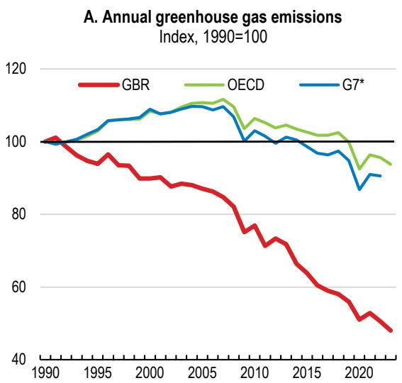  
B. Share of renewable in generating electricity %

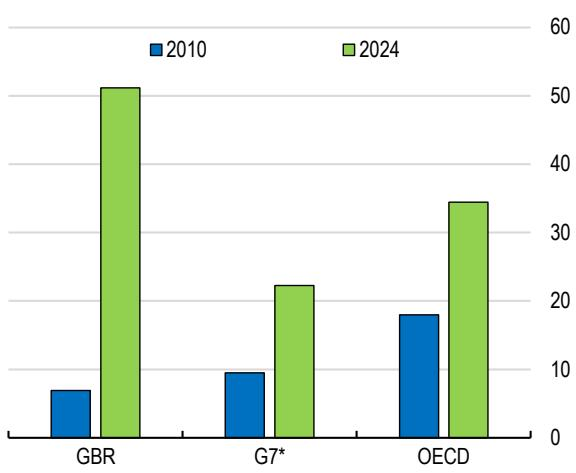

C. Residential end use electricity prices USD per MWh  
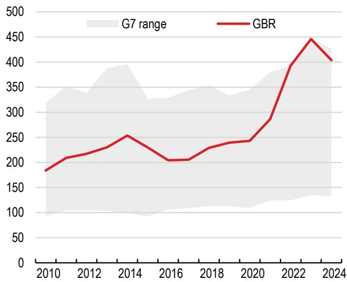

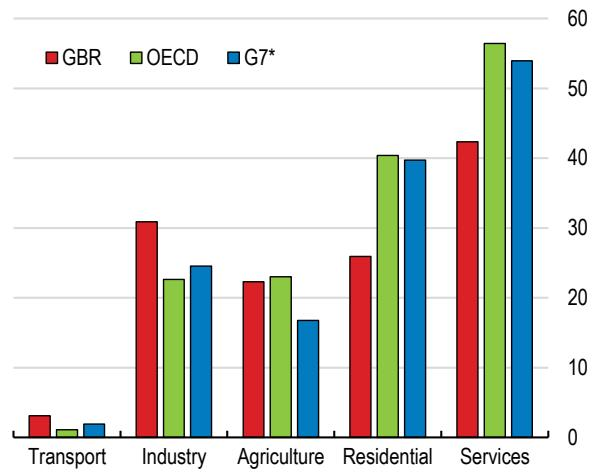  
Note: Panel A refers to territorial (production-based) greenhouse gas emissions. In Panel C, prices include all taxes where not refundable on purchase. The G7 range refers to the range between the minimum and maximum prices between the available G7 countries per year. Panel D: Figures refer to the share of total final energy consumption. “Industry” includes non-energy use. OECD is a weighted average of all OECD member countries. G7\* refers to a simple average of G7 countries without the United Kingdom.  
Source: OECD (2026), Environment database; IEA World Energy Balances (database); and Department for Energy Security and Net Zero.

StatLink https://stat.link/wiki70

Despite the significant growth in renewable generation, electricity prices remain high and closely linked to international gas markets (Figure 3.1, Panel C). Two features of the current pricing system weaken the link between renewable deployment and lower consumer prices: wholesale electricity prices remain tied to gas through marginal pricing, and retail price structures place a higher burden on electricity. Natural gas still accounts for almost a third of total electricity generation, meaning that gas-fired plants frequently set the marginal wholesale price (IEA, 2024[1]). At the retail level, electricity prices remain significantly higher than gas prices, partly because policy levies and network charges are allocated more heavily on electricity. This price differential weakens incentives to electrify energy consumption, particularly for heating in residential, commercial and public sector buildings (Figure 3.1, Panel D). With about $60\%$ of the United Kingdom's natural gas supply consumed by households (IEA, 2024[1]), reliance on gas remains especially high in residential heating, prolonging households' exposure to fossil fuel price shocks and adding to affordability concerns.

The government has set out a series of strategies to reconcile energy security, affordability and net-zero objectives, including the Energy Security Strategy, the 2024 Growth Mission, the 2025 Industrial strategy, and the Clean Power Action Plan 2030 (HM Government, 2022[2]; 2024[3]; 2025[4]; 2025[5]). Accelerating the transition to a largely clean power system by 2030 can strengthen long-term energy security by reducing reliance on fossil fuels and exposure to volatile gas markets. However, achieving this objective requires not only continued renewable deployment, but also credible price signals, timely investments in grid reinforcement and system balancing and careful sequencing to maintain affordability. Without credible policy frameworks and careful sequencing, short-term cost pressures and delivery bottlenecks could slow electrification and prolong exposure to gas price volatility.

This chapter examines how the United Kingdom's net zero transition is reshaping energy security challenges and policy priorities. It first assesses whether current pricing and carbon frameworks sufficiently support electrification and reduce exposure to fossil fuel price shocks. It then analyses current electricity supply-side constraints, focusing on electricity networks, system flexibility, and low-carbon generation capacity. Finally, it examines whether climate adaptation is sufficiently embedded in energy system planning to ensure reliability of an increasingly electrified economy under more frequent extreme weather events.

## 3.2. Enhancing energy security through coordinated decarbonisation

The government's strategy to strengthen energy security focuses on delivering a largely clean power system by 2030, requiring simultaneous transformation on both demand and supply sides of the energy system. On the demand side, electrification of industry, transport and heating is essential to reduce exposure to fossil fuel price volatility and put the economy on a credible path to net zero. This will significantly increase electricity demand and load patterns. On the supply side, higher demand must be met by expanding clean generation, reinforcing transmission and distribution networks, and scaling up storage and system flexibility. Delivering this transformation will require substantial upfront investment, estimated at around GBP 26 billion (0.9% of GDP in 2025) per year until 2050 under a central scenario, with low-carbon technologies and infrastructure needing to be deployed rapidly over the coming decade (Climate Change Committee, 2025[6]).

Because the 2030 Clean Power objective substantially compresses the timeline for system transformation, demand and supply must move in parallel. Electrification lowers emissions and reduces exposure to fossil fuel imports only if clean power capacity and grid infrastructure scale at pace. Likewise, expanding renewables improves energy security and long-term affordability, but requires sufficient demand and system flexibility to absorb new capacity efficiently. Delivering largely clean power by 2030 requires aligned demand-side incentives, including aligning energy pricing across fuels, reducing supply-side constraints, notably grid capacity, flexibility and supply chains. Weaknesses on either side reinforce gas dependence and exposure to price volatility.

## 3.2.1. Aligning price signals to accelerate electrification and reduce gas dependence

Weak and uneven price signals slow electrification and prolong reliance on natural gas, limiting near-term gains in energy security despite increasing clean energy investment. Electricity prices remain closely linked to gas prices, despite the rapid expansion of low-marginal cost renewable generation. Wholesale electricity markets operate through marginal pricing, with gas-fired generation often determining the clearing price. As renewable penetration increases and as long-duration storage and interconnection expand, the proportion of hours in which gas-fired generation sets the marginal price is expected to decline. Recent government measures in response to the evolving conflict in the Middle East further aim to reduce gas price pass-through, including through greater use of long-term fixed contracts for low-carbon generators. These steps support a gradual delinking of electricity prices from international gas markets (HM Government, 2026[7]), although exposure to gas price volatility remains material as long as gas remains a significant part of the generation mix.

At the retail level, policy design further shapes relative energy prices. Final prices vary significantly across fuels due to differences in tax treatment, network charges, policy levies and the extent of carbon pricing, rather than reflecting underlying system costs alone. Electricity is subject to carbon pricing under the UK Emission Trading Scheme (ETS) at production stage and faces additional policy levies at the consumption stage. By contrast, other energy carriers continue to benefit from government support measures that lower the consumption price, such as reduced VAT on households' fuels, lower fuel duties, and consumption and production support reliefs for fossil fuels. According to the OECD's inventory of support measures (OECD, 2025[8]), such support covered about $22\%$ of emissions in 2023. As a result, electricity remains not only more expensive than in peer countries, but also structurally more expensive than gas for consumers (Figure 3.2), even as renewable generation expands. These asymmetries in policy treatment weaken relative investment incentives in electrification and prolong exposure to fossil fuel price volatility.

Figure 3.2. Electricity remains more expensive than gas for industry and households  
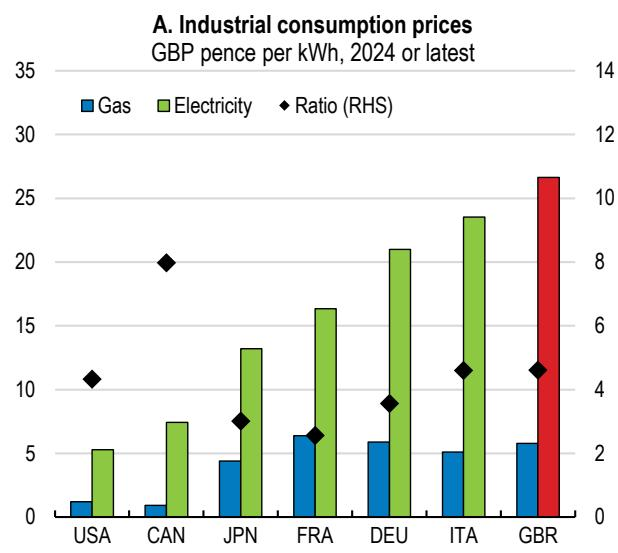  
Note: End Prices. In Panel A, data for the United States Prices excluding refunds.
Source: IEA Energy Prices Database.

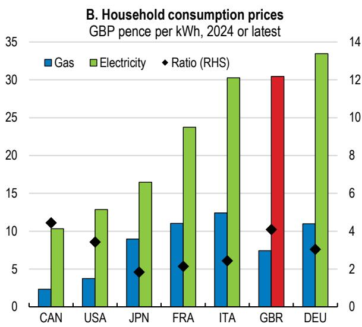

The government's 2025 Industrial Strategy recognises that UK electricity prices are high by international standards and the government introduced measures to reduce them, including lowering network charges and targeted relief for energy-intensive users from certain levies on electricity used to fund renewables and other green programmes, while keeping the balance between affordability, competitiveness and the net zero transition under review (HM Government, $2025_{[5]}$ ). These first steps are welcome, but reducing the prices of electricity alone does not correct the underlying distortion. Strengthening incentives for electrification also requires gradually increasing the effective cost of gas through greater alignment of emissions pricing that would narrow the electricity–gas price differential.

The price differential is particularly consequential in residential heating, which accounts for the largest share of UK gas consumption (IEA, 2024[1]). Despite expanded government schemes supporting heat pump installations, uptake remains low by international standards (Figure 3.3, Panel A). While the new installations of heat-pumps in 2024 have been in line with the Climate Change Committee's milestones path (Figure 3.3, Panel B), a significant acceleration is needed to reach the government's objective of 600 000 installations annually by 2028 (Climate Change Committee, 2025[9]). While relative energy prices are a key determinant of heat pump adoption, uptake also depends on delivery side factors as discussed in the previous Economic Survey (OECD, 2024[10]), including upfront costs, installer availability and consumer experience. Ongoing government efforts to strengthen delivery alongside price incentives will therefore remain essential. The removal of $75\%$ of the Renewables Obligation Levy from electricity bills between April 2026 until April 2029 (HM Government, 2025[11]) is also a positive step, but only narrows the price gap between gas and electricity from about 4.7 in the first quarter of 2026 to 4.3 in the second quarter. Moving forward, the government could consider to permanently remove the remaining policy levy on electricity at the consumption stage and integrating it into the broader tax base, following a transparent strategy. Consistent with findings from OECD research (OECD, 2022[12]; Hodok and Kozluk, 2024[13]) that climate policies can have significant distributional impacts, particularly on low-income households, the government should continue to systematically assess potential impacts and embed findings in climate policy design to inform targeted assistance and strengthen public support.

Figure 3.3. Heat pump deployment remains below levels required to reduce gas dependence  
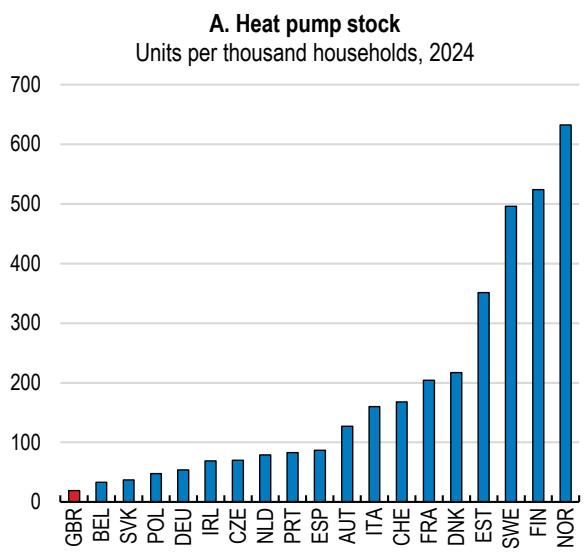

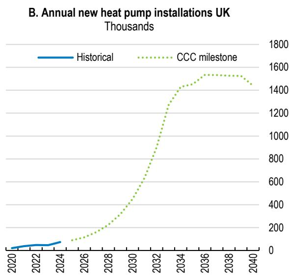  
Source: European Heat Pump Association; and Climate Change Committee 2025, Progress report 2025.

Transport policy illustrates how more consistent price signals can support electrification. Fuel duties result in one of the highest net effective carbon rates in the UK economy, even after persistent fuel duty freezes. Together with regulatory measures such as the Zero Emission Vehicle Mandate, this has supported growth in the uptake of electric vehicles (EV), which in 2024 has been in line with the OECD average (Figure 3.4). This has allowed policy to gradually shift from broad tax exemptions towards a more balanced mix of targeted purchase support and integration of EVs into the standard tax base through a new mileage-based tax introduced in the 2025 Budget (HM Government, 2025[11]). The government should continue to monitor progress towards ZEV Mandate targets, which requires that $80\%$ of new car sales be zero-emission by 2030 and $100\%$ by 2035, and phase out support as market maturity increases.

Figure 3.4. Strong carbon pricing has supported EV uptake  
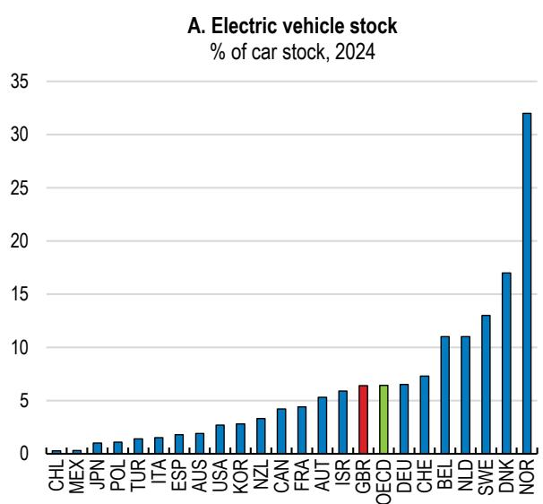

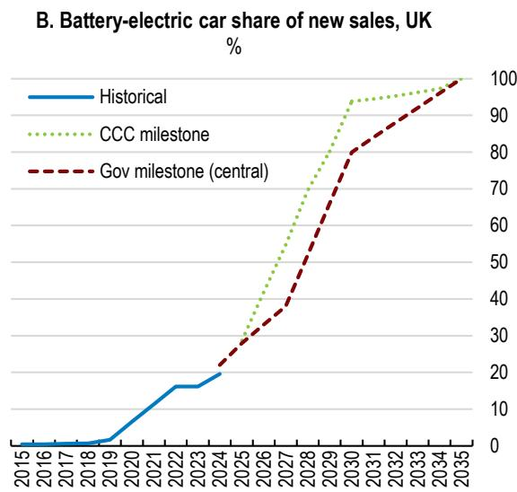  
Source: IEA Global EV Outlook (database); and Climate Change Committee 2025, Progress report 2025.

## StatLink https://stat.link/qlbn7i

Reducing incentives towards gas-based heating and power generation needs adjustments to relative carbon pricing and fossil fuel support. Phasing out environmentally harmful fossil fuel support and broadening the scope of carbon pricing to sectors where effective net carbon rates remain low (Figure 3.5), would improve consistency. For example, explicitly pricing emissions from heating fuels by broadening the scope of the UK ETS to cover heating fuels according to their carbon content would strengthen incentives to electrify, as recommended in the previous Economic Survey (OECD, 2024[10]). Gradually increasing carbon prices over time would give households and businesses time to adapt. Carbon related revenues and wider public resources within the overall budget framework could support clean energy investment and targeted assistance for lower income households to improve public acceptability of increased carbon prices (OECD, 2022[12]). Greater coherence across carbon and energy taxation, including linking of the UK and EU Emission Target Schemes (ETS) as announced by the UK government and the EU Commission, could further enhance market liquidity, price stability, and provide clearer incentives for emissions reduction and low-carbon investment across sectors (HM Government, 2026[14]).

Figure 3.5. Carbon price disparities weaken incentives to electrify heating
Carbon pricing by sector  
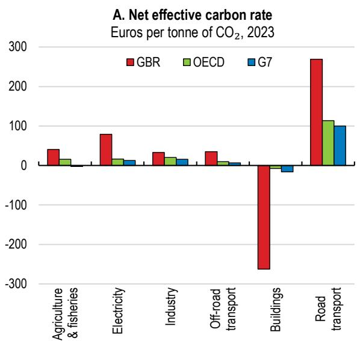

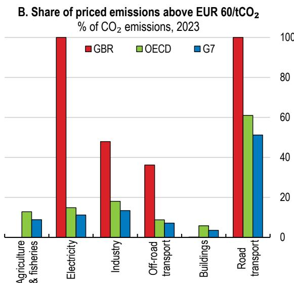  
Note: The net ECR equals the ECR minus fossil fuel subsidies that decrease pre-tax fossil fuel prices. Emissions cover all sources excluding biofuels and other GHG emissions.  
Source: OECD Effective Carbon Rates (database); and OECD Share of Emissions Priced (database).

StatLink https://stat.link/sjpqof

Table 3.1. Past recommendations on price signals, heat pump and EV adoption

<table><tr><td>Past recommendations</td><td>Action taken since last survey.</td></tr><tr><td>Update the 2021 Heat and Building strategy with a concrete and credible timeline for tightened energy efficiency standards and clean heating regulation.</td><td>The Warm Homes Plan sets out minimum energy efficiency standards for private and social rented homes to meet higher standards by 2030 (EPC C). A gradual approach to reducing fossil fuel heating is adopted by using regulation and incentives, including expanded support for heat pumps and electrified heating, alongside planning and regulatory reforms. The Warm Homes Plan is also aligned with the Future Homes Standard, ensuring new-build homes are low-carbon by default.</td></tr><tr><td>Prioritise household grants for energy efficiency improvements and the installation of heat pumps based on income, and over the medium-term target based on means-testing.</td><td>In response to the evolving conflict in the Middle East, the government announced an increase to the Boiler Upgrade Scheme (BUS) grant for properties heated by oil and LPG, taking the total grant to GBP 9 000.</td></tr></table>

## 3.2.2. Securing energy supply in an increasingly electrified system

## Removing grid bottlenecks to support electrification

Beyond aligning price signals, the successful electrification of the UK economy also depends on removing physical bottlenecks in electricity infrastructure. As the share of variable renewable generation and electrification of demand has increased, the electricity grid has become the key binding constraint on the United Kingdom's clean energy transition and a central risk to energy security (Figure 3.6). The existing grid was largely designed in the 1960s and 1970s to transport power from centralised coal and nuclear plants to consumers. While it remains reliable, it is not yet configured for a system dominated by wind, solar and two-way power flows (NESO, $2025_{[15]}$ ). Significant new high-voltage transmission capacity is needed to connect offshore wind generation in the North Sea and onshore renewable clusters, particularly in Scotland, to industrial and population centres in England and Wales. In addition, regional and local networks need to be upgraded to accommodate distributive electrification of transport, heating, and industry, while the rapid expansion of rooftop solar and community energy schemes is making power flows more variable. Yet most distribution grids were designed for one-way power delivery and limited flexibility (NESO, 2025[16]). As a result, energy security risks are no longer primarily driven by shortages of generation, but by whether electricity can be delivered where and when it is needed, and at affordable cost.

Grid expansion is challenged by long planning and delivery timelines. Transmission projects can take 10-15 years from planning to commissioning, while renewable generation projects often progress in 3-5 years. This mismatch has contributed to a severe grid-connection backlog, which exceeded 750 GW of projects in 2025 (HM Government, 2025[4]). Thus, sufficient projects were in the waiting list to meet the requirements to reach a largely Clean Power System by 2030, but as the queue included both already built as well as speculative projects, the first-come first-served rule did not guarantee that strategically more important and already built projects were prioritised in grid connection (Figure 3.6). The establishment of the National Energy System Operator (NESO) in 2025 is a welcome step to not only address the long-standing problems of fragmented planning, but also the issue of slow grid connections. Recent reforms to the grid connection process to prioritise ready-to-go projects and discourage speculative connection requests, should improve investors and developers confidence and help unlock clean energy investment in areas most needed (NESO, 2025[17]; HM Government, 2026[18]). Swift and credible implementation is needed, including informing investors in the pipeline. It should also be monitored that delivery timelines evolve within priorities, while considering to further tighten connection priority to developers' delivery progress on milestones.

Figure 3.6. Grid connection backlogs constrain renewable deployment  
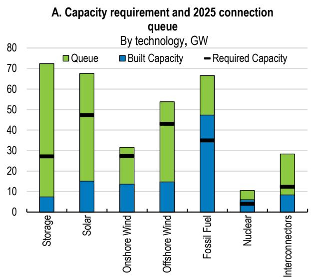

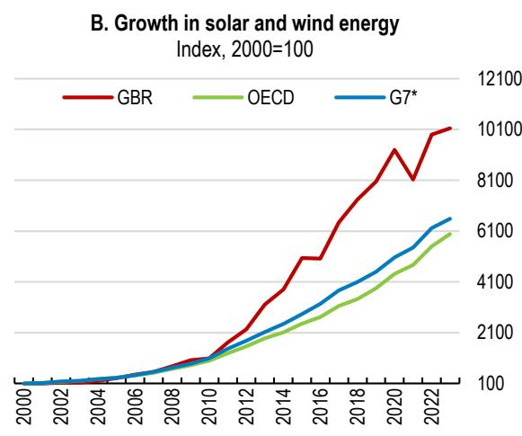  
Note: Panel A, capacity requirements refer to NESOs New Dispatch scenario for needed capacity by 2030. Panel B: data refers to electricity generation from solar PV, solar thermal, offshore wind, and onshore wind. G7\* refers to G7 average excluding the United Kingdom.
Source: International Renewable Energy Agency (database); and NESO, Clean Power 2030.

StatLink https://stat.link/8yhx9d

Progress has been made in sustaining investment within a strengthened regulatory framework that supports rapid, cost-effective delivery of electricity network upgrade. The Office of Gas and Electricity Markets (Ofgem) is overseeing one of the largest modernisation and expansion programmes in the history of Great Britain's electricity networks. With initial approvals of around GBP 24 billion for the 2026–31 period under the RIIO-T3 framework, and total investment projected to reach GBP 80-90 billion by 2031 (Ofgem, 2025[19]; 2025[20]), Ofgem attempts to balance cost discipline with the need for rapid delivery. It uses investment allowances, performance incentives and regulatory parameters for electricity transmission and distribution operators, as well as including provisions for increasing transmission investment to accelerate offshore grid connections, reinforce onshore capacity, and strengthen asset resilience in line with net-zero objectives (Ofgem, 2025[20]). At the distribution level, reforms under the forthcoming RIIOD-ED3 framework (2028-33 period) are expected to place greater emphasis on anticipatory investment, enabling operators to build ahead of demand in areas with high projected electrification. Shifting to an anticipatory approach in planning and approving transmission and connection infrastructure would be welcomed. More forward-looking allowances and clearer strategic guidance could reduce connection delays and avoid costly reactive upgrades once demand has already materialised (Ofgem, 2025[20]; 2025[21]), and is an approach that is being increasingly implemented in Europe (Box 3.1). New plans under the EU Anticipatory Investment Approach reflect a broader shift from reactive, connection driven grid expansion, towards strategic, scenario-based planning that better supports timely decarbonisation and energy security.

## Box 3.1. Moving from reactive to anticipatory grid investment in Europe

The rapid expansion of renewable energy and electrification requires electricity networks to be reinforced. Traditional grid planning models, which expand infrastructure only after firm connection requests are received, risk creating bottlenecks and delays. Several European countries are therefore shifting towards more anticipatory approaches to grid investment, following the formal guidance on anticipatory investment published by the European Commission.

In Austria and Denmark, long-term network development plans are aligned with national decarbonisation scenarios allowing grid operators to invest based on forward looking demand scenarios rather than confirmed projects accounting for socio economic cost benefit analyses.

In Belgium, parts of planned infrastructure can be included in the regulatory asset base before full utilisation, reducing the financial risk of early investment.

In Germany and Ireland, grid operators undertake case-by-case anticipatory reinforcement, particularly to accommodate renewable generation hubs or electrification clusters, supported by regulatory mechanisms that mitigate under-utilisation risk.

Source: https://eur-lex.europa.eu/legal-content/EN/TXT/?uri=OJ%3AC\_202503179

Despite these recent advances in financing and regulation, delivery risks remain. Planning and permitting procedures constitute an important bottleneck for grid expansion, due to planning issues and local capacity constraints. With the National Infrastructure Bill introduced in 2025, the government aims to streamline approval paths for national critical energy infrastructure, clarify strategic priorities and reduce procedural delays. As these reforms are critical to meet the 2030 timeline for Clean Power delivery, the government should monitor implementation and identify emerging bottlenecks early. Furthermore, it remains important that decisions at the national level maintain community consent and are in line with envisioned growth plans at the local and regional level (Chapter 4).

Supply chain and labour constraints are another significant risk to timely grid modernisation. Domestically, grid expansion competes for skilled labour, construction capacity and specialised equipment with other large infrastructure programmes including housing, transport and industrial development. At the same time, global demand for high voltage cables, transformers and substations is rising rapidly, increasing lead times and exposing projects to price volatility and import delays. These pressures risk slowing grid reinforcement, delaying renewable integration and constraining system flexibility, with indirect implications for energy security and affordability. To mitigate these risks, the government has announced to strengthen domestic supply chains, including expanding domestic cable manufacturing capacity, strengthen logistics for high-voltage equipment, and developing a skilled workforce capable of delivering major infrastructure projects. Progress on supply-chain resilience will require continuous monitoring, coordination across government and industry to ensure that grid expansion keeps pace with renewable generation and electrification of demand. In addition, the government should track and regularly assess trade dependencies through enhanced data collection and regularly updated tools to better understand emerging dependencies from shifting global supply chains.

## Ensuring operational reliability in a high-renewables system

Even with timely grid reinforcement, system reliability under the Clean Power Plan 2030 objective will depend on the ability to balance demand and supply in real time. As renewable generation increases, managing short-term fluctuations and longer stress periods becomes a central pillar of energy security and affordability. Short peak imbalances, such as intraday fluctuations in wind and solar output, can be managed through demand-side flexibility and short-duration battery storage. By contrast, longer stress periods, such as cold winter weeks when generation might be low and demand high, require a sequence of responses, including demand reduction, short- and long-duration storage, interconnector imports and low-carbon dispatchable generation (NESO, 2025 $^{[15]}$ ). Ensuring that these flexibility options scale in line with renewable expansion is central to maintaining energy security.

Under current project timelines and system projections, nuclear capacity and large scale long-duration storage are unlikely to contribute materially before 2030 (Figure 3.7). Operational reliability over the remainder of this decade will therefore depend primarily on renewable expansion, short-duration flexibility, interconnection and the continued availability of existing gas-fired capacity for balancing. While nuclear and long-term duration storage remain important components of the longer-term system architecture (see below), they will play only a limited role in addressing near-term variability risks.

## Figure 3.7. Renewables and short-duration flexibility will need to expand until 2030

Installed and projected installed capacity, GW, by technology under different scenarios

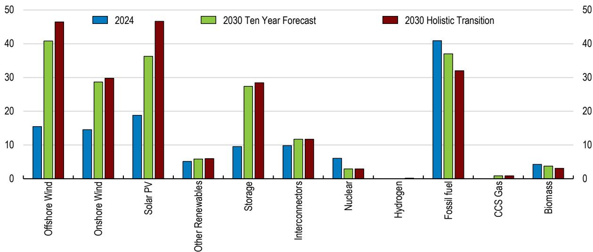

Note: The 10-year forecast reflects NESO's central planning outlook based on current and announced policy, existing project pipelines, realistic technology deployment rates, and expected electrification-driven demand growth, rather than the full range of long-term net-zero scenarios. In the Holistic Transition Scenario, net zero is met through a mix of electrification and hydrogen, with hydrogen mainly used around industrial clusters. Hydrogen is not used for heat except as a secondary fuel for heat networks in small quantities. Consumer engagement is very strong through adoption of energy efficiency improvements and demand shifting, with smart homes and electric vehicles providing flexibility. A high-renewable capacity pathway, with unabated gas dropping sharply. Pathway sees moderate levels of nuclear capacity and lowest levels of hydrogen dispatchable power. Supply-side flexibility is high, delivered through electricity storage and interconnectors. No unabated gas remains on the network in 2050. Source: NESO 2025, Future Energy Scenarios.

StatLink https://stat.link/opwmad

Accelerated renewable deployment represents the central supply-side lever for reducing structural reliance on gas-fired generation before 2030. The United Kingdom has already made remarkable progress in expanding renewable electricity generation, with wind and solar together supplying over $40\%$ of grid electricity in 2024 (Figure 3.8, IEA $(2025_{[22]})$ ). As an early leader in offshore wind deployment, its capacity has almost quadrupled over the past decade from 3.7GW to more than 14 GW in 2024, turning the country into one of the world's largest offshore wind markets (IEA, $2025_{[22]}$ ). This expansion has been supported by the Contracts for Difference (CfD) scheme, the country's main policy instrument for incentivising renewable investment. CfDs provide long-term price certainty by guaranteeing project developers a fixed price for electricity, shielding investors from market volatility while helping to stabilise costs for consumers. The government aims to deploy up to 50GW of wind capacity by 2030 and up to 70GW of solar by 2034, more than tripling and quadrupling today's respective capacities. In its latest auction round (AR7), 8.4GW of offshore wind capacity was secured putting the country on track to achieve its clean power mission by 2030 (HM Government, $2026_{[23]}$ ). This will help reduce the structural need for gas-based generation and lower exposure to international fossil fuel price volatility. However, higher renewable penetration also increases variability in supply, reinforcing the need for complementary flexibility.

## Figure 3.8. Wind has replaced coal in electricity generation

Electricity generation by source and net trade, TWh  
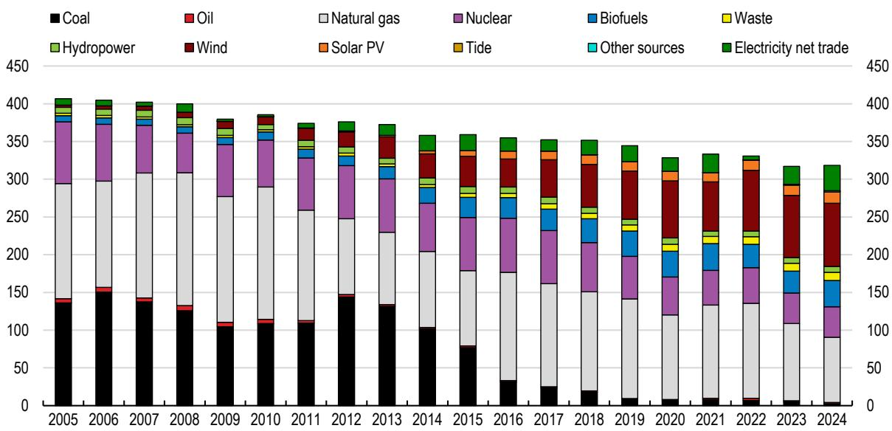  
Source: IEA Electricity Statistics (database); and Electricity Information (database).

## StatLink https://stat.link/f61dmr

Progress has been most visible in short-duration flexibility. Grid-scale battery capacity has expanded rapidly (House of Commons, 2025[24]) and increasingly provides frequency response and intraday balancing services, reducing renewable curtailment and stabilising the system during short peak imbalances. Demand-side response mechanisms have also been developed and will play an increasingly important role as households and firms both consume and generate electricity. Home battery storage, including from electric vehicles (“Vehicle-to-grid”), combined with smart meters and smart contracts, can help households shift demand and even feed the grid in times of high demand, if barriers to flexibility on the grid are removed. Smart meters, time-of-use tariffs and digital control systems already incentivise consumers to shift demand. However, participation remains below envisioned targets (NESO, 2025[25]; HM Government, 2025[26]), reflecting weak price signals, limited rewards for rapid response, and network charging arrangements that insufficiently value flexibility. As smart meter rollout progresses, the government should consider strengthening incentives by making the time of use tariffs more reflective of grid pressures, as they have proven effective in shifting electricity demand to off-peak periods when the grid is under less strain. The development of a smart data scheme, as the government is currently exploring, should be advanced as improved access to real-time system data would further help households and businesses to participate in demand-side flexibility. Moreover, the Market-wide Half-Hourly Settlement (MHHS) programme that is being rolled out from 2025-27, means half-hourly consumption data will be the default basis for billing and settlement. This could serve as enabler for more innovative tariffs and price signals to consumers provided they consent to share data.

Interconnection provides an additional layer of resilience during prolonged stress periods. The United Kingdom is well-integrated with neighbouring European countries through a robust network of interconnections (HM Government, 2025[26]), allowing the UK to import electricity when output is low and to export surplus generation during high-output periods. The government's target to expand interconnection capacity to at least 18 GW by 2030 will further support system flexibility. As previously recommended by the IEA (2024[1]), the government should continue to support multi-purpose interconnectors (offshore wind farms combined with interconnectors) in addition to point-to-point interconnectors. As UK offshore wind capacity grows, the country could thereby strengthen its role as net exporter of clean electricity, supporting emissions reductions and energy security in the rest of Europe.

## Building durable system resilience beyond 2030

Reliance on short-duration flexibility and residual gas balancing may be sufficient to deliver largely Clean Power by 2030, but maintaining energy security over the longer term will require structural reinforcement of the low-carbon system. As renewable penetration increases further in the 2030s, a system dependent on short-duration flexibility and gas-fired balancing would expose the system to rising balancing costs and continued price volatility. Strengthening structural resilience therefore will depend on expanding firm low-carbon capacity, scaling long-duration storage and reinforcing institutional frameworks that support strategic investment (Figure 3.9).

Nuclear power and long-duration storage are expected to play a more central role in the post-2030 electricity mix. As low-carbon dispatchable resources, they can reduce structural reliance on gas during prolonged periods of low renewable output and limit the need for sustained balancing through fossil-fired generation. Nuclear remains central in the UK government's electricity strategy, but new nuclear projects face long development timelines, complex planning procedures and significant capital requirements. For example, the Hinkley Point C project, which was initially expected to begin generating power by around 2025 is now projected to come online closer to 2030. To ensure that Nuclear can increase capacity by end 2030, clear signals are needed now. Plans for Sizewell C have recently advanced with a final investment decision and significant government funding committed (GBP 14.2 billion over the Spending Review Period), and in parallel, the government is supporting the development of small modular reactors (SMRs) as a longer-term option to expand nuclear capacity. At the same time, continued attention to waste management, decommissioning and accident risks underscores the importance of transparent life-cycle cost-benefit assessments. In this regard, the government's commitment of GBP 13.9 billion of capital investment funding set in the Spending Review to the Nuclear Decommissioning Authority over the Spending Review period is a positive step towards addressing legacy costs and risks.

Long-duration energy storage (LDES) will become increasingly important as renewable shares rise. Technologies such as pumped hydro and emerging hydrogen-based storage can provide multi-day or seasonal balancing, but deployment remains limited (NESO, 2025[27]). High upfront capital costs, uncertain revenue streams and planning constraints continue to weigh on investment decisions. The government has taken steps to address these barriers through targeted LDES support initiatives, including a cap and floor investment support scheme, which reduces downside revenue risk while limiting excess returns, thereby improving bankability (HM Government, 2025[4]). Moreover, the government has introduced new public investment vehicles to help crowd in private capital by absorbing early-stage risks. The National Wealth Fund, established in 2024 as the successor to the UK Infrastructure Bank, is mandated to support infrastructure aligned with net zero and regional growth objectives. Great British Energy, created in early 2025, is intended to act as a strategic public investor in clean electricity and critical energy infrastructure. As these institutions are relatively new, their effectiveness should be monitored and if necessary, their mandates adjusted to ensure that they are sufficiently empowered to take risk-tolerant, early-stage positions where public capital is needed to unlock private delivery.

Figure 3.9. As renewables increase, system flexibility requirements need to adjust  
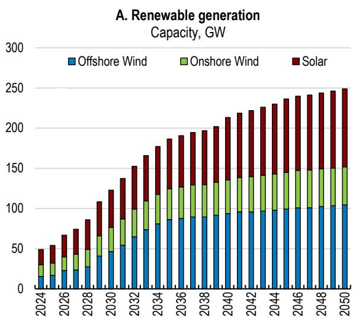

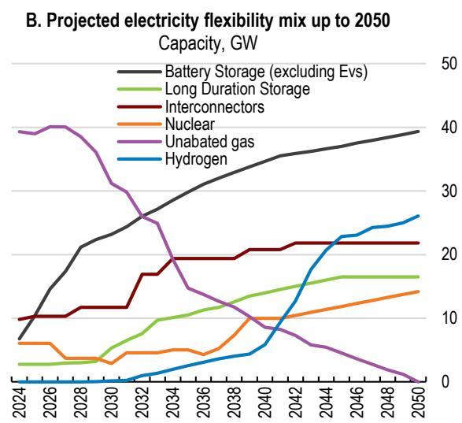  
C. Projected electricity demand and total electricity output by technology

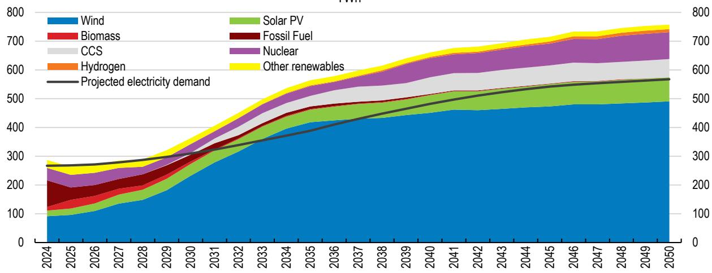  
Note: All Panels refer to NESO's scenario for a holistic transition, where the following is assumed: net zero is met through a mix of electrification and hydrogen, with hydrogen mainly used around industrial clusters. Hydrogen is not used for heat except as a secondary fuel for heat networks in small quantities. Consumer engagement is very strong through adoption of energy efficiency improvements and demand shifting, with smart homes and electric vehicles providing flexibility. A high-renewable capacity pathway, with unabated gas dropping sharply. Pathway sees moderate levels of nuclear capacity and lowest levels of hydrogen dispatchable power. Supply-side flexibility is high, delivered through electricity storage and interconnectors. No unabated gas remains on the network in 2050.  
Source: NESO Future Energy Scenarios 2025.

## StatLink https://stat.link/p93wfb

Delivering on medium- and long-term climate objectives in a way that strengthens energy security increasingly depends on policy frameworks that remain effective as economic conditions, technologies and behaviours evolve, and that provide credible, predictable and well-sequenced signals while managing the trade-offs between near-term costs and long-term benefits. In the United Kingdom, the overall decarbonisation framework, including statutory carbon budgets and the net zero target, is strong and enjoys a high degree of credibility. However, weaknesses in the sequencing of measures and in the ability to adjust instruments over time risk slowing delivery, increasing short-term cost pressures, and prolonging reliance on natural gas. While 2030 targets are clear, intermediate milestones beyond 2030 and policy interactions across power, heat and buildings are not always sufficiently aligned (Climate Change Committee, 2025[9]). In the past, adjustments to policy timelines, including changes to the planned phase-out of fossil fuel boilers, have illustrated how regulatory reversals or unclear sequencing can weaken expectations, delay household and firm decisions, and reduce investor confidence (OECD, 2024[10]). In energy security terms, such uncertainty slows electrification and extends dependence on gas for heating and power generation. More adaptive regulation could help manage these risks. Adaptive regulation refers to frameworks that incorporate structured, evidence-based review mechanisms, allowing timelines and instruments to be adjusted as technologies mature, costs evolve and delivery constraints emerge, without undermining long-term direction. At present, the UK framework lacks a systematic approach to recalibrating policies in response to implementation challenges, such as grid bottlenecks or affordability pressures, even when these threaten delivery.

As the government updates its policy package in preparation for the Seventh Carbon Budget, due in June 2026, it should ensure clear regulatory sequencing and strengthen adaptability. Clearer staging of milestones would help households, firms and investors to plan for transitions towards low-carbon solutions. The government should also consider strengthening the use of adaptive regulation by embedding mechanisms that allow regulatory settings, timelines and policy instruments to be periodically reviewed and adjusted based on clear performance metrics and emerging evidence. This would help improve delivery, maintain policy credibility and help ensure that short-term affordability pressures are managed in a way that accelerates electrification, reduces exposure to gas price shocks and strengthens energy security over the longer term.

## 3.3. Embedding climate resilience in electricity system planning

Strengthening the climate resilience of the electricity grid is essential for energy security and economic stability. Much of the UK electricity grid was designed for historical weather conditions and lower electricity loads. As climate change increases the frequency and intensity of storms, floods, and heatwaves, physical risks to the grid are rising. Adapting the grid to these changing conditions is not only an environmental priority but a prerequisite for power reliability and productivity of regions and industries increasingly dependent on continuous electricity supply.

The UK climate resilience framework, anchored in the National Adaptation Plan (NAP), identifies electricity infrastructure as a critical priority and calls for coordinated action among government, regulators, and network operators to embed climate risk management into all stages of planning, investment, and operation. This framework is supported by the Committee on Climate Change's (CCC) assessments and the institutional role of the National Energy System Operator (NESO) in spatial planning. Together these provide a sound basis for integrating climate resilience into the electricity grid. Resilience considerations should be balanced against cost considerations, including potential impacts on households through higher electricity prices.

Despite this framework, preparedness in the electricity sector remains partial and uneven. Electricity infrastructure faces vulnerabilities along multiple points of the network. Transmission towers and overhead lines are exposed to high winds, lightning and ice; substations in flood-prone or coastal areas face flood and erosion risks; and rising temperatures reduce the efficiency and lifespan of both overhead conductors and underground cables; drought and extreme heat can constrain cooling capacity in generation and transmission systems. These hazards could increasingly affect reliable supply as electrification deepens, with cascading effects on critical services such as water supply, transport, and digital communications (Climate Change Committee, 2025[28]). While most transmission and distribution operators have developed adaptation plans under the Adaptation Reporting Power, implementation remains inconsistent and oversight weak (Climate Change Committee, 2025[28]). Moreover, adaptation efforts have largely focused on flood and storm resilience, with less attention to heat stress, drought impacts on cooling, and cross-sector interdependencies (Climate Change Committee, 2023[29]; 2025[28]), which are likely to become more relevant.

Recent institutional developments offer opportunities to better integrate adaptation into system planning. NESO's Strategic Spatial Energy Plan (SSEP) sets out how electricity, hydrogen, and storage infrastructure will be planned from 2030 to 2050, embedding system resilience and coordination across jurisdictions (NESO, 2025[30]). While still under development, the SSEP commits to integrating climate risk factors such as flooding and heat stress into infrastructure siting and design, representing a welcomed step towards climate-resilient, coordinated energy planning. Once published, clear implementation timelines should be set together with concrete investment priorities.

Effective implementation will be key to translating the SSEP into tangible improvements in climate resilience across the electricity system. NESO is required to produce strategic whole-energy system plans that inform long-term network investment and support resilience, including addressing climate risks. As highlighted by the Climate Change Committee, NESO's planning processes should integrate climate-stress testing of grid assets and prioritise reinforcement or other mitigation measures in areas exposed to high climate risk, enabling clearer identification of vulnerabilities and adaptation needs. Given Ofgem's central role in shaping network investment behaviour, it is welcome that the regulator is strengthening expectations around climate resilience strategies, scenario planning and reporting, and is working with network companies to develop Climate Resilience Metrics and Indicators (CRMIs) that can inform investment decisions and performance assessment under RIIO-3 (Ofgem, 2025[20]). The effectiveness of RIIO-3's climate adaptation and resilience provisions will depend on how fully these emerging mechanisms are operationalised in practice, including through robust output-based resilience metrics, their integration into performance incentives and allowed returns, and systematic monitoring to ensure that resilience objectives translate into timely, location-specific network reinforcement. To support consistent progress on climate resilience, Ofgem should require mandatory and standardised adaptation reporting across all network operators, aligned with NESO's spatial planning and risk assessments, to strengthen accountability, data sharing, and evidence-based regulatory oversight.

Climate resilience also requires stronger cross sector coordination for critical infrastructure. Reporting should explicitly stretch across sectors to identify interdependencies, as weaknesses in one network can cascade through others. Recent outages, including the North Hyde Substation early 2025, resulted in the loss of supply to 70 000 domestic and commercial customers including Heathrow Airport. Larger scale electricity disruptions could affect water pumping, transport signalling, and digital communications amongst other with serious impacts on people and businesses as seen for example during the outage in the Iberian Peninsula (2024) and in parts of Berlin, Germany, in early 2026. Following the North Hyde incident, the government announced to publish an Energy Resilience Strategy. NESO investigated the incident and recommended stronger cross-sector coordination with respect to critical infrastructure. Swift implementation, supported by regular system-wide stress testing, strengthened public reporting and data sharing to enable transparent monitoring of adjustments of emergency responses, will be essential.

Adaptation and decarbonisation must proceed in a coordinated and integrated way. The rapid build-out of electricity infrastructure required for net zero provides an opportunity to design a system resilient to future climate conditions but may also face the risk of locking in new vulnerabilities if adaptation is not embedded from the outset. The expansion of transmission lines, substations, and interconnectors under NESO's strategic framework should therefore integrate resilience standards from the design phase, ensuring assets can withstand more extreme weather over their operational lifetime.

Recommendations to strengthen energy security

<table><tr><td>MAIN FINDINGS</td><td>RECOMMENDATIONS (Key recommendations in bold)</td></tr><tr><td colspan="2">Enhancing energy security through coordinated decarbonisation</td></tr><tr><td>Electricity prices remain closely linked to gas prices because gas-fired generation frequently sets the marginal wholesale price. Final prices do not reflect relative carbon content, as electricity bears a higher share of policy costs and carbon pricing than gas.Heat-pump uptake remains below levels required to materially reduce gas dependence in residential heating due to weak price signals.</td><td>Gradually narrow the electricity-gas price differential by explicitly pricing emissions from fossil fuels, while continuing to reduce levies on electricity.Expand targeted support for clean energy investment and for lower income households making green investments.Explicitly price emissions in the building sector by broadening the scope of the UK ETS to cover heating fuels according to their carbon content.</td></tr><tr><td>Grid infrastructure has become a binding constraint on the clean power transition, with long planning timelines and severe connection backlogs.The National Energy System Operator has started grid connection reforms to reduce the grid backlog and the National Infrastructure Bill was introduced to streamline planning procedures for critical grid infrastructure.</td><td>Swiftly implement grid connection reform and link connection permissions to progress in delivery milestones.Align streamlined planning procedures with local and regional growth plans while maintaining community consent.</td></tr><tr><td>Transmission and distribution expansion face long lead times slowing electrification as well as the deployment of renewables and short and long-duration storage.</td><td>Shift towards an anticipatory approach in planning and approving transmission and connection infrastructure.</td></tr><tr><td>Supply chains for critical minerals and clean energy components remain concentrated and exposed to geopolitical and trade risks, while global competition for key grid components is rising rapidly.</td><td>Regularly assess trade dependencies and supply chain risks through enhanced data collection and monitoring.</td></tr><tr><td>Domestically, grid expansion competes for skilled labour, construction capacity and specialised equipment with other large infrastructure programmes, such as housing, transport and industrial development.</td><td>Facilitate coordination across government and industry to ensure that grid expansion keeps pace with renewable generation and electrification of demand.</td></tr><tr><td>Current levels of demand-side flexibility are insufficient to support a high renewables electricity system.</td><td>Strengthen incentives through time-of-use tariffs that are more reflective of grid pressures.</td></tr><tr><td>Policy uncertainty and unclear sequencing beyond 2030 risk delaying investment in firm low-carbon capacity, long-term storage and system resilience.</td><td>Provide clear regulatory sequencing while strengthening adaptability based on clear performance metrics and emerging evidence.</td></tr><tr><td colspan="2">Embedding climate resilience into electricity system planning</td></tr><tr><td>Electricity infrastructure is increasingly exposed to flooding, heat and storm risks, while adaptation planning and implementation remain uneven.</td><td>Embed climate resilience standards into grid planning and require regular system wide stress tests to assess critical infrastructure resilience.</td></tr></table>

## References

Climate Change Committee (2025), Progress in adapting to climate change - 2025 report to Parliament, https://www.theccc.org.uk/publication/progress-in-adapting-to-climate-change-2025/.
Climate Change Committee (2025), Progress in reducing emissions - 2025 report to Parliament, https://www.theccc.org.uk/publication/progress-in-reducing-emissions-2025-report-to-parliament/.
Climate Change Committee (2025), The seventh carbon budget, https://www.theccc.org.uk/wp-content/uploads/2025/02/The-Seventh-Carbon-Budget.pdf.
Climate Change Committee (2023), Delivering a reliable decarbonised power system, https://www.theccc.org.uk/wp-content/uploads/2023/03/Delivering-a-reliable-decarbonised-power-system.pdf.
HM Government (2026), Accelerating electricity network connections for strategic demand, Department for Energy Security and Net Zero, https://www.gov.uk/government/consultations/accelerating-electricity-network-connections-for-strategic-demand/accelerating-electricity-network-connections-for-strategic-demand-accessible-webpage.
HM Government (2026), Decisive action to break influence of gas on electricity prices, Department for Energy Security and Net Zero; The Rt Hon Rachel Reeves MP; The Rt Hon Sir Keir Starmer KCB KC MP; The Rt Hon Ed Miliband MP, https://www.gov.uk/government/news/decisive-action-to-break-influence-of-gas-on-electricity-prices.
HM Government (2026), Record breaking auction for offshore wind secured to take back control of Britain's energy, https://www.gov.uk/government/news/record-breaking-auction-for-offshore-wind-secured-to-take-back-control-of-britains-energy.
HM Government (2026), UK Emissions Trading Scheme (UK ETS): a policy overview, Department for Energy Security and Net Zero, https://www.gov.uk/government/publications/uk-emissions-trading-scheme-uk-ets-policy-overview/uk-emissions-trading-scheme-uk-ets-a-policy-overview.
HM Government (2025), Budget 2025, HM Treasury, https://www.gov.uk/government/collections/budget-2025.
HM Government (2025), Clean Flexibility Roadmap, Department for Energy Security and Net Zero, https://assets.publishing.service.gov.uk/media/68874ddeb0e1dfe5b5f0e431/clean-flexibility-roadmap.pdf.
HM Government (2025), Clean Power 2030 Action Plan: A new era of clean electricity – main report, Department for Energy Security and Net Zero, https://www.gov.uk/government/publications/clean-power-2030-action-plan/clean-power-2030-action-plan-a-new-era-of-clean-electricity-main-report.
HM Government (2025), The UK's Modern Industrial Strategy 2025, Department for Business and Trade, https://www.gov.uk/government/collections/the-ucks-modern-industrial-strategy-2025.
HM Government (2024), Plan for Change - Milestones for Mission-Led Government, Prime Minister's Office, https://www.gov.uk/missions.
HM Government (2022), British Energy Security Strategy, Department for Energy Security & Net Zero; Prime Minister's Office; Department for Business, Energy and Industrial Strategy, https://www.gov.uk/government/publications/british-energy-security-strategy/british-energy-security-strategy.
Hodok, J. and T. Kozluk (2024), "Distributional impacts of energy transition pathways and climate change", OECD Economics Department Working Papers, No. 1820, OECD Publishing, Paris, https://doi.org/10.1787/56e93f3e-en.
House of Commons (2025), Clean Power targets, https://researchbriefings.files.parliament.uk/documents/CBP-10182/CBP-10182.pdf.
IEA (2025), World Energy Statistics and Balances, IEA, https://www.iea.org/data-and-statistics/data-product/world-energy-statistics-and-balances.
IEA (2024), United Kingdom 2024 - Energy Policy Review, IEA, https://www.iea.org/reports/united-kingdom-2024.

NESO (2025), Clean Power 2030 - Advice on achieving clean power for Great Britain by 2030, https://www.neso.energy/document/346651/download.
NESO (2025), Clean Power 2030 - Annex 1: Electricity demand and supply analysis, https://www.neso.energy/document/346791/download.
NESO (2025), Clean Power 2030 - Annex 2: Networks, connections and network access analysis, https://www.neso.energy/document/346796/download.
NESO (2025), Connections Reform, https://www.neso.energy/industry-information/connections-reform.
NESO (2025), Demand-Side Flexibility Routes to Market Review, https://www.neso.energy/publications/markets-roadmap/demand-side-flexibility-routes-market-review.
NESO (2025), Strategic Spatial Energy Plan - Methodology, https://www.neso.energy/document/360501/download.
OECD (2025), Environment at a Glance: United Kingdom, https://www.oecd.org/en/publications/environment-at-a-glance-country-notes\_59ce6fe6-en/united-kingdom\_a8cf0616-en.html#section-d1e588.
OECD (2024), OECD Economic Surveys: United Kingdom 2024, OECD Publishing, Paris, https://doi.org/10.1787/709e70b8-en.
OECD (2022), OECD Economic Surveys: United Kingdom 2022, OECD Publishing, Paris, https://doi.org/10.1787/7c0f1268-en.
Ofgem (2025), Framework decision: electricity distribution price control (ED3), https://www.ofgem.gov.uk/decision/framework-decision-electricity-distribution-price-control-ed3.
Ofgem (2025), Ofgem approves initial £24 billion to operate and maintain critical gas networks and upgrade Britain's electricity supergrid, https://www.ofgem.gov.uk/cy/press-release/ofgem-approves-initial-ps24-billion-operate-and-maintain-critical-gas-networks-and-upgrade-britains-electricity-supergrid.
Ofgem (2025), RIIO-3 Final Determinations for the Electricity Transmission, Gas Distribution and Gas Transmission sectors, https://www.ofgem.gov.uk/decision/riio-3-final-determinations-electricity-transmission-gas-distribution-and-gas-transmission-sectors.

# Reducing regional productivity gaps to raise aggregate growth

Daniela Glocker, OECD

Regional productivity disparities are a major constraint on the United Kingdom's overall productivity performance. Although interregional gaps are broadly in line with OECD averages, recent convergence has largely reflected stagnation in high-performing areas rather than sustained catch-up in lagging regions. These gaps reflect more than sectoral differences between regions. They stem from persistent structural weaknesses within regions in skills accumulation, transport and digital connectivity, spatially concentrated innovation and finance, and complex governance arrangements. Recent policy initiatives, including the 2024 Growth Mission, 2025 Industrial Strategy, as well as ongoing devolution efforts across England, seek to empower local economies through targeted investments in skills, infrastructure, and innovation ecosystems. However, sustaining productivity convergence will require consistent implementation, stronger local institutional capacity and stable multiyear frameworks that extend beyond electoral cycles. A coherent long-term approach that aligns skills, infrastructure, innovation, finance and governance is essential to unlock productivity growth across all regions.

## 4.1. Raising aggregate productivity by narrowing regional gaps

The United Kingdom has experienced weak economic growth since the Global Financial Crisis. Over the past decade, GDP growth has been driven mainly by increases in labour supply rather than productivity-enhancing investment, while productivity growth has lagged that of many OECD peers (Figure 4.1). This reflects both slow technological progress and weak diffusion of innovation, combined with policy uncertainty and frequent changes to the economic policy framework, which have dampened business investment and reduced the effectiveness of long-term growth strategies as described in the last Economic Survey (OECD, 2024[1]).

Productivity gains are essential to increasing output, improving living standards and strengthening public finances without fuelling inflation. This is particularly important in the current context of limited fiscal space and high debt-servicing costs. Employment rates in the United Kingdom are already relatively high by international standards, leaving limited scope to boost growth through further increases in labour utilisation (OECD, 2024[1]). With demographic ageing projected to intensify pressure on public services and the labour market, future growth will depend increasingly on improving how effectively labour and capital are used, alongside adequate levels of investment, rather than on expanding factor inputs alone (see Chapter 1, (OECD, 2024[1])).

Figure 4.1. Productivity growth in the United Kingdom has been weak over the past decade  
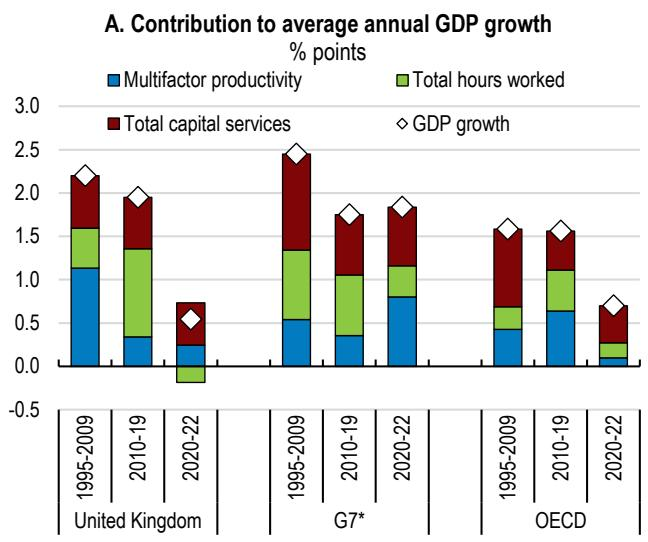  
Note: G7\* refers to a simple average of G7 countries without the United Kingdom. Source: OECD Productivity Compendium (database).

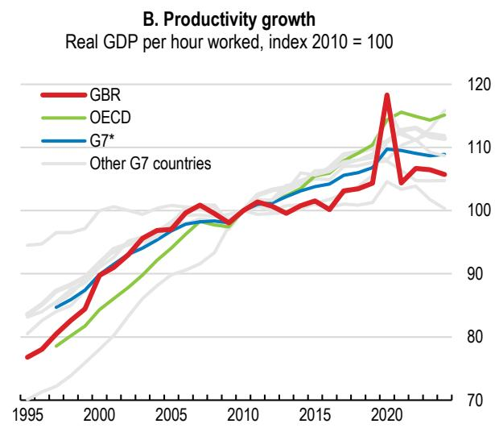  
StatLink https://stat.link/k2hntc

Aggregate productivity trends mask substantial regional disparities within the United Kingdom. Productivity levels in Greater London and the South East remain significantly higher than in the rest of the country, while many regions continue to lag behind. In international comparison, however, the extent of regional productivity inequality in the United Kingdom is broadly aligned with the OECD average (Figure 4.2).

Figure 4.2. UK labour productivity disparities are in line with the OECD average GVA per worker, by region (TL2 level), index average level across regions=100, 2023 or latest  
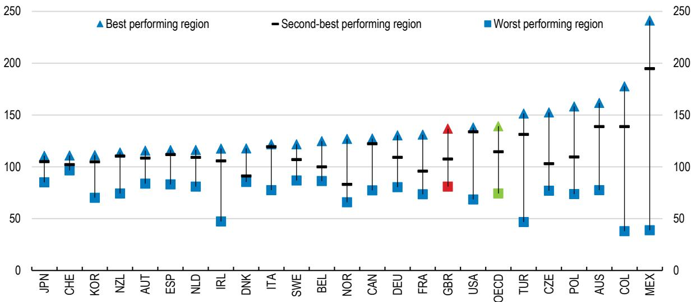  
Note: GVA=Gross value added. Territorial level 2 (TL2) refers to large regions within a country. In the United Kingdom there are 12 regions (i.e. North East England, North West England, Yorkshire and The Humber, East Midlands, West Midlands, East of England, Greater London, South East England, South West England, Wales, Scotland and Northern Ireland) at TL2 level. Chile, where regional disparities in labour productivity are very high, is excluded from the chart. The OECD average is calculated as an unweighted average of the OECD regions for which data are available.
Source: OECD Regional, Cities and Local Areas (database).

StatLink https://stat.link/ipj8c5

The United Kingdom's weak aggregate productivity performance reflects not only persistent underperformance in lagging regions, but also prolonged stagnation in some traditionally high-performing areas. Since the Global Financial Crisis, productivity growth in Greater London has contributed negatively to national productivity growth, reflecting both weak productivity growth dynamics and the region's large weight in the economy, with around a quarter of UK gross value added (GVA) generated in London (Figure 4.3). This pattern highlights that the country's productivity challenge has become increasingly national in scope, rather than being confined to a narrow set of lagging regions.

At the same time, strengthening productivity performance in lagging regions remains important for raising aggregate growth and reducing spatial inequalities. Estimates suggest that narrowing productivity gaps through performance improvements in lagging regions could increase national output by several percentage points, with significant benefits for living standards and public finances (Resolution Foundation, 2019[2]). Strengthening productivity across regions is therefore not only important from an equity perspective, but also a key component of a sustainable national growth strategy.

Figure 4.3. Labour productivity varies widely across UK regions  
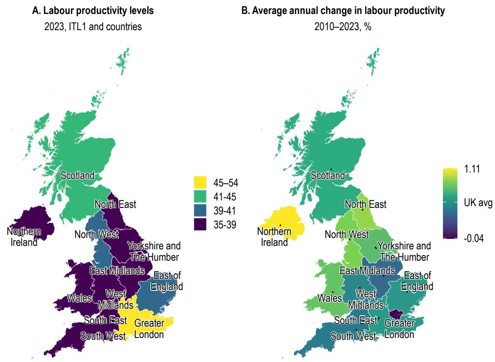  
Note: Labour productivity measured as GVA per hour worked.
Source: ONS Local Indicators -Experimental (database).  
StatLink https://stat.link/x5yvkq

Differences in industrial and sectoral structure play a central role in shaping regional productivity outcomes in the United Kingdom. Most of the observed productivity dispersion arises from differences within regions across sectors, rather than from differences between regions (Figure 4.4). This suggests that productivity disparities are driven less by broad region-wide characteristics than by uneven performance across firms and activities within the same places. Firm-level evidence points in the same direction, showing that recent productivity growth in the United Kingdom has been driven primarily by firms at the top of the productivity distribution, while lower-productivity firms have exhibited limited catch-up. Productivity dispersion between frontier and laggard firms has widened over time, with growth at the top outpacing that at the bottom, and business dynamism remaining subdued across industries (ONS, 2025[3]). This pattern points to weak diffusion of productivity-enhancing technologies and practices across firms, including smaller firms, helping to explain why productivity gains in leading activities do not translate into broader regional convergence.

Figure 4.4. Most productivity differences across the United Kingdom arise from differences within regions rather than between regions  
Theil index decomposition of labour productivity into within and between inequalities, 2020 constant PPP  
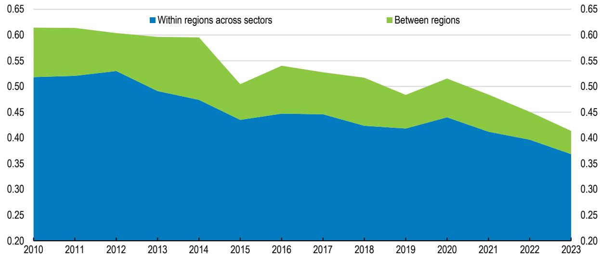  
Notes: Labour productivity is measured as GVA per worker at the level of TL2 regions and sectors, US dollars, constant prices, 2020 ROPI adjusted, and does not include Northern Ireland due to incomplete data from 2020 onwards.
Source: OECD Regions, Cities and Local Areas (database).

## StatLink https://stat.link/meyobw

High-productivity, knowledge-intensive activities are concentrated in a relatively small number of region-sector combinations, while a substantial share of employment remains located in sectors with weaker productivity performance (Figure 4.5). In several regions, advanced services and technology intensive manufacturing have high productivity levels but employment is not necessarily concentrated within those sectors relative to the national average. By contrast, sectors with large employment concentration, including parts of retail, hospitality and administrative services tend to exhibit lower productivity across most regions (Figure 4.5). While some degree of co-location between high-productivity activities and locally consumed services is expected in dense regional economies, the persistence of large productivity gaps across firms within potentially scalable and tradable activities points to weak diffusion rather than sectoral composition alone.

The concentration of high-productivity activities alongside large employment shares in lower-productivity sectors within the same regions indicates that productivity gains generated in leading firms and activities have not translated into broad-based improvements within regional economies. These patterns have been persistent over time (ONS, 2025[4]; 2025[5]) suggesting that limited diffusion across firms, sectors and places have been holding back aggregate productivity growth. This underscores the importance of policies that strengthen diffusion mechanisms within regions, rather than relying primarily on the spatial reallocation of activity across regions.

Cities play an important role in shaping these diffusion dynamics. Due to their density, economic diversity and connectivity, cities can act as engines of growth within their regions. While London performs broadly in line with OECD peers, second-tier cities in the United Kingdom tend to underperform relative to international peers of comparable size and density (OECD, 2020[6]). Weak internal and external connectivity, skill shortages, and underdeveloped local innovation ecosystems limit their role as effective hubs for diffusion and reinforces the concentration of high productivity in a narrow set of locations.

Figure 4.5. Productivity and employment are concentrated within few regions and sectors  
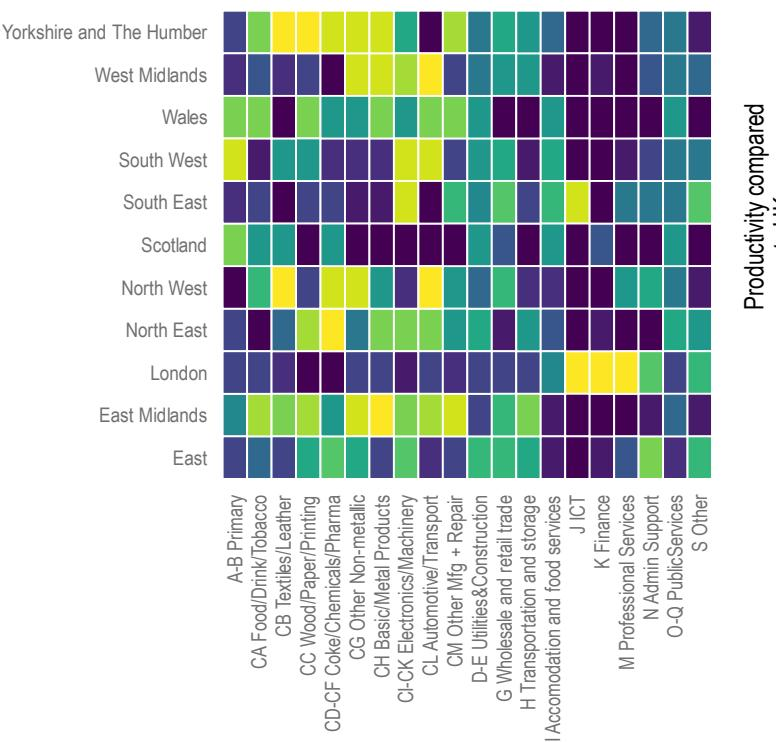

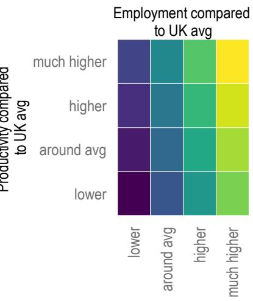  
Note: The figure shows employment and labour productivity concentration across sectors and regions. Employment location quotients indicate whether a sector is over- or under-represented in a region relative to the national average. Productivity location quotients compare regional sectoral labour productivity (GVA per worker) with the national sectoral average, weighted by employment. Cells highlighted as higher–higher indicate sector–region combinations that combine above-average employment concentration with above-average productivity, while lower–lower cells indicate relatively peripheral activities.
Source: ONS.

## StatLink https://stat.link/81wtjz

Over the past decade, policy attention has increasingly focused on reducing regional inequalities through a series of initiatives. City deals and devolution deals intended to empower decision-making of local institutions, complemented in 2021 with the Levelling Up agenda aimed at reducing economic imbalances through investment in skills, infrastructure and housing, and supporting innovation hubs outside London and the South East. Despite these efforts, progress has been uneven, reflecting fragmented governance arrangements, uneven access to skills development and persistent gaps in technology adoption across regions.

Building on this agenda, the current government has introduced new policy frameworks, including the 2025 Industrial Strategy and the 2024 Growth Mission, which place stronger emphasis on sectoral opportunities, infrastructure investment and spatially targeted interventions, including the Oxford–Cambridge and emerging Northern growth corridors, to boost productivity, particularly in lagging regions (HM Government, 2025[7]; 2024[8]). The 2024 English Devolution White Paper further proposes to streamline local governance arrangements and expand subnational responsibilities in England (HM Government, 2024[9]). This sustained policy focus reflects the broad recognition of the need for integrated, place-based approaches that combine human capital development, improved connectivity, faster diffusion of innovation, and stronger institutional coordination. The effectiveness of these strategies will depend on the extent to which national sectoral priorities are translated into coherent local investment, skills and infrastructure strategies, and on whether subnational governments are equipped with the capacity, funding stability and autonomy needed to deliver them effectively.

Against this backdrop, the chapter analyses the structural drivers of regional productivity disparities and explores pathways to foster more balanced growth. Drawing on the 2024 Growth Mission and the 2025

Industrial Strategy, the chapter focuses on four interrelated drivers of regional productivity: strengthening local skills systems, improving physical and digital connectivity, increasing and accelerating the diffusion of technology and innovation within and across regions, and enhancing institutional coordination and local financial and administrative capacity to ensure national ambitions translate to sustainable local growth outcomes.

## 4.2. Addressing structural drivers of regional productivity gaps

The general drivers of labour productivity at the regional level mirror those at the national level and can be broadly grouped into three components: human capital, physical and digital connectivity which shape effective access to markets and capital, and knowledge-based capital, including the diffusion of innovation. In the United Kingdom, these drivers are shaped by a common national policy framework, but regional outcomes diverge markedly as places compete for skilled workers, investment, and highly productive firms. Differences in local skills systems, connectivity, and the capacity to absorb and diffuse innovation therefore shape how effectively regions translate national policies into productivity gains, underscoring the need for a co-ordinated policy approach with a strong geographical dimension to boost aggregate productivity growth.

## 4.2.1. Strengthening local skills systems to support regional productivity

Human capital is a critical driver of productivity and economic performance. Compared to international peers, the United Kingdom performs well with respect to educational attainment of its working-age population, of which about 54% hold a tertiary degree. However, national averages mask persistent local and regional disparities in skills formation, lifelong learning participation, and school-to-work transitions. These disparities weaken productivity growth in lagging regions by constraining firms' access to skilled labour, limiting innovation adoption, and reducing the capacity of local economies to adapt to structural change. Strengthening local skills systems is therefore essential in narrowing regional productivity gaps.

## Building strong human capital foundations across regions

Regional productivity differences are partly rooted in inequalities that emerge early in the education system and accumulate over time. Early childhood development outcomes already vary across England's regions, shaping later educational trajectories and labour market opportunities. Upon entering primary school (around age five), 68.3% of children nationally achieved a “Good Level of Development” (GLD) in 2024, but there is some regional variation. London recorded the highest share of children with a good level of development (71%), while the North West had the lowest with 65% (HM Government, 2025[10]).

These early gaps persist throughout schooling, affecting post-16 pathways, higher education and ultimately higher-quality jobs. By the end of Key Stage 2 (around age 11), 71% of pupils in London met the expected standard in reading, writing and math, compared with a share that was 11 percentage points lower for pupils in the South West. Importantly, disparities across regions have increased over time. While London has largely recovered to pre-pandemic levels, outcomes in all other regions have deteriorated by up to 4 percentage points (Figure 4.6, Panel A). At age 19, GCSE attainment rates reflect a similar pattern (Figure 4.6, Panel B).

From a productivity perspective, these gaps in education performance reduce the future supply of skilled workers in lagging regions and raise the cost of addressing these disadvantages at a later stage. After a decade of real term cuts to education spending, it is therefore welcome that the government has increased funding into early years provision through the expansion of free childcare entitlements and higher hourly funding rates to providers (OECD, 2024[1]; HM Government, 2025[11]). This has included measures such as extending the offer of funded hours for working parents of younger children and uplifts to early years funding formula allocations to local authorities intended to support the sustainability and quality of provision (HM Government, 2025[12]). In the 2025 Budget, the government committed to a review of the early years system which is welcome. This review should particularly focus on identifying remaining policy gaps that may contribute to regional inequalities in early childhood education. Total school spending for pupils aged 5–16 increased largely driven by spending on children with special education needs and disabilities (SEND). Ongoing reforms have involved additional funding for specialist staff and services, the expansion or restructuring of specialist and alternative provision, greater use of assistive technology, and attempts to clarify statutory processes for assessment and intervention under the SEND and alternative provision improvement plan, with the aim of addressing important and persistent inequalities in outcomes (IFS, 2025[13]; IFS, 2026[14]). To ensure that these investments translate into sustained improvements in human capital, funding levels should be protected in real terms, accounting not only for rising labour costs but also increasing non-staff costs faced by schools and early years providers, such as building maintenance and energy expenses.

Figure 4.6. Educational outcomes differ across regions at early stages  
A. Key Stage 2 attainment in reading, writing and maths % of pupils  
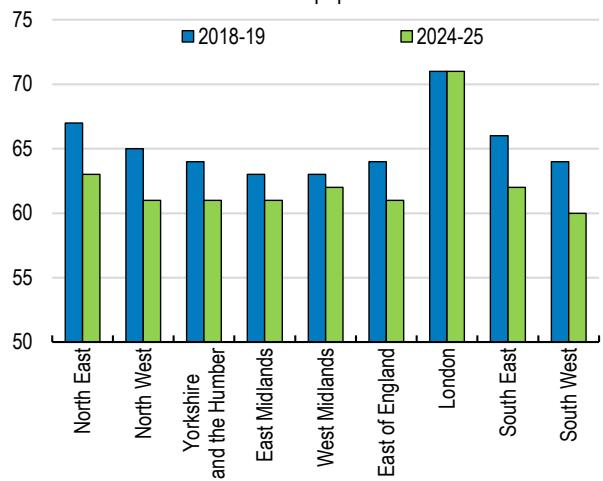

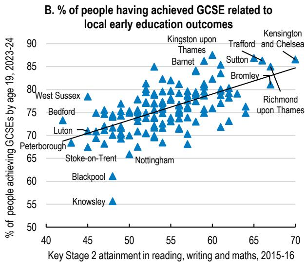  
Note: Key Stage 2 attainment refers to the share of pupils in state-funded schools meeting the expected standard in reading, writing and maths at the end of Key Stage 2. In Panel B, GCSEs in English and Mathematics. Data shows upper-tier/unitary authorities in England. Data for Key Stage 2 attainment was not available for the following authorities: Bournemouth, Christchurch and Poole, Dorset, Buckinghamshire, North Northamptonshire, West Northamptonshire, Cumberland, Westmorland and Furness, North Yorkshire and Somerset.
Source: Department for Education; and Office for National Statistics (ONS).

StatLink https://stat.link/pzmcyt

## Improving school-to-work transitions and reducing youth disengagement

Weak school-to-work transitions represent a key bottleneck in the regional skills pipeline and contribute directly to productivity losses. In the United Kingdom, the share of young people aged 15-24 who are not in employment, education or training (NEET) stood at 13.7% above the OECD average of 11.2% in 2024 (OECD, 2025[15]). Within England, NEET rates for 16–24-year-olds vary markedly across regions (HM Government, 2025[16]). London records the highest rate (15.2%), followed by the East Midlands (14.7%), North West (14.4%) and East of England (14.2%), all above the national average. These figures suggest that strong aggregate labour market performance does not necessarily translate into smooth school-to-work transitions for young people. By contrast, the South East (11.8%) and West Midlands (11.6%) exhibit lower NEET rates, potentially reflecting stronger vocational pathways, tighter entry-level labour markets, or more effective local support structures. These differences underline that school-to-work transitions are shaped by local employer engagement, institutional coordination and labour-market conditions. They also reflect differences in the extent to which young people face complex and interrelated barriers to employment, including skills gaps, health issues and disengagement from education and training (HM Government, 2026[17]). While the specific bottlenecks vary across regions, their inherently local nature implies that uniform national instruments alone are unlikely to address them effectively.

Strengthening dual vocational education and training, which combines school- and work-based learning, is particularly important to ease the transition into work, especially for young people with lower qualifications. As highlighted in previous Economic Surveys (OECD, 2022[18]; 2024[1]), apprenticeships in the United Kingdom have often been used to upskill existing workers rather than to support labour-market entry. Recent reforms to the apprenticeship system aim to better target young people by lowering employer costs, including for SMEs when apprentices are under 25 through fully funding apprenticeship training and offering new incentives up to GBP 2 000 (Box 4.1). These measures represent progress, but do not change the underlying incentive structure of the apprenticeship levy, which remains largely employer driven and geographically neutral. Thus, apprenticeship numbers continue to depend on employers' willingness to create places, favouring sectors and locations where firms already have strong capacity and demand, which suggests some potential deadweight loss, whereby money is spent on apprenticeship contracts that are likely to have come into force even without public support. In addition, evidence suggests that financial incentives alone may be insufficient to support labour market entry for more disadvantaged young people, who often require complementary guidance and support services (HM Government, 2026[17]). Its geographically neutral design also implies that funding does not vary with local labour-market conditions, offering no additional support to regions with weaker economies where young people would benefit most. Introducing funding uplifts or higher public co-investment rates in areas with weaker labour market outcomes could support access in lagging areas, while limiting the respective administrative burden. Linking part of public funding to sustained employment or completion of apprenticeships could further help to strengthen quality incentives.

The announcement of a new Youth Guarantee signals a welcome shift towards preventing youth disengagement and support early labour market attachment. The government has committed GBP 820 million, and announced further funding of GBP 1 billion over three years (HM Government, 2026[19]; House of Commons Library, 2026[20]), to expand access for young people aged 16–24-years who are at risk of long-term unemployment to education, apprenticeships or job-support programmes (Box 4.1). This approach is consistent with growing evidence highlighting the importance of early intervention and coordinated support to prevent long-term disengagement (HM Government, 2026[17]). However, delivery relies on employer participation and local administrative capacity, which varies across regions. Although the Youth Guarantee is designed as a nationwide offer for all eligible young people, its demand-led nature implies that eligibility is linked to areas with higher need, as regions with weaker labour markets tend to have larger numbers of young people meeting the criteria. However, actual funding flows depend on take up, which in turn relies on employer participation and local administrative capacity. As a result, areas with stronger employer bases and delivery systems may absorb a larger share of funding, even if underlying need is greater elsewhere. Whether this translates into effective outcomes therefore depends critically on the capacity of local institutions and delivery partners to tailor support to local labour market conditions and employer demand. Introducing targeted support linked to regions with high local youth unemployment or NEET rates to help build and sustain local delivery capacity alongside the national framework will be essential to ensure that guaranteed opportunities result in meaningful, durable employment outcomes across regions.

## Box 4.1. Renewed focus on the young through the reform to the UK apprenticeship levy (Growth and Skills Levy) and the Youth Guarantee

The UK government has reformed apprenticeships and youth employment support to strengthen labour-market entry and early career progression for young people, particularly those at risk of long-term unemployment.

The apprenticeship levy, introduced in 2017, is a UK-wide tax designed to encourage employer investment in training and to ensure sustainable funding for apprenticeships. Large employers with an annual pay bill of over GBP 3 million pay the levy at 0.5% of their annual wage bill, with funds available via a digital apprenticeship service account that can be used to pay for approved training. Unused funds expire and may be reallocated to fund apprenticeships in smaller firms, which can offer apprenticeships through a co-investment model.

From April 2026, the levy is being transformed into the Growth and Skills Levy, expanding permitted use of funds and refocusing support towards priority skills and early career pathways.

Key changes include:

\- Full public funding of training costs for SMEs hiring apprentices aged under 25, removing the previous 5% co-investment requirement for this group.

\- Cash incentives for SMEs, announced in March 2026, including a payment of GBP 2 000 for each new apprentice aged 16–24 taken on as a new employee.

\- Restrictions on public funding for level 7 (master level) and older apprentices, with new publicly funded starts no longer available for those aged 22 and over.

\- Shorter expiry period of levy funds, reduced from 24 to 12 month from August 2026, to encourage faster investment in training.

\- Higher employer co-investment once levy funds are exhausted, requiring levy-paying employers to contribute 25% of training costs, beyond their available levy balance, up from the previous 5%.

\- Introduction of apprenticeship units, allowing levy funds to be used for shorter, modular training linked to apprenticeship standards, alongside full apprenticeships.

\- Expansion of foundation apprenticeships as an entry-level pathway for 16–21-year-olds, including into sectors such as hospitality and retail, construction and health and social care.

The Youth Guarantee is a national framework supporting young people aged 16–24-year-olds at risk of long-term unemployment, ensuring access to employment, apprenticeships, education or training:

\- A Jobs Guarantee offering six-month paid employment for eligible 18–24-year-olds on Universal Credit for 18 months, with full wage subsidies. Delivery is being phased in, starting with priority areas before national rollout.

\- A Youth Jobs Grant, introduced in March 2026, providing GBP 3 000 to employers hiring eligible young people aged 18–24 who have been on Universal Credit for six months or more.

\- Access to apprenticeships, education or skills-training pathways, and work-experience.

\- Personalised support delivered through Jobcentre Plus, Youth Hubs and employer engagement.

\- Youth Guarantee Trailblazers, testing local delivery approaches alongside the national rollout.

\- Linked to Universal Credit requirements, including potential sanctions for refusing suitable offers.

Source: Hm Government (HM Government, 2025[21]). (HM Government, 2025[22]) (HM Government, 2026[19])

The effectiveness of the Youth Guarantee also depends on how participation requirements are implemented in practice. Individual eligibility for the Youth Guarantee is linked to Universal Credit conditionality and may involve sanctions if a suitable opportunity is refused. While linking participation to benefit eligibility can motivate youth engagement, overly strict sanctions could risk pushing young people into unsuitable placements without addressing underlying challenges such as skills gaps, disabilities, or care responsibilities. Evidence suggests that young people facing multiple barriers benefit from sustained engagement, personalised support and trust-based relationships with service providers (HM Government, 2026[17]). The government should therefore balance participation requirements with supportive measures and sustained guidance to ensure guaranteed opportunities translate into meaningful, durable employment.

## Aligning lifelong learning with regional labour market needs

While initial education and youth transitions matter, sustained productivity growth depends on the ability of workers to update and upgrade their skills throughout their working lives. Skill shortages and gaps vary widely across UK regions, contributing to recruitment difficulties and constraining firm growth (Productivity Institute, 2025[23]; HM Government, 2025[24]). Although UK adults perform reasonably well on average according to the latest OECD Survey of Adult Skills (OECD, 2024[25]), they lag OECD peers in numeracy and digital problem-solving skills, particularly outside more prosperous regions (Figure 4.7).

## Figure 4.7. Adult skills are above the OECD average in most regions

OECD PIAAC average Score, cycle 2, 2023  
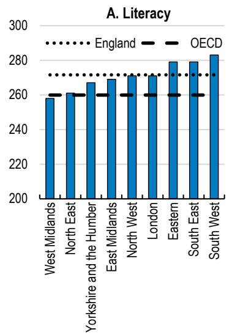

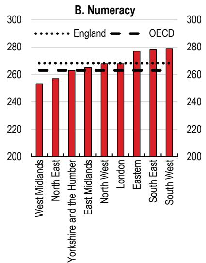

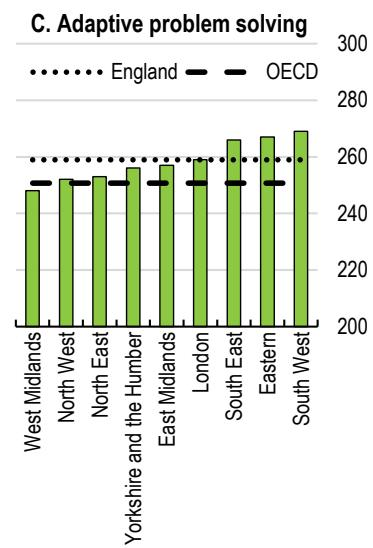  
Source: OECD Education GPS: Survey of Adult Skills 2023 (PIAAC) (database); and Department for Education (2024), Survey of Adult Skills 2023: national report for England.

## StatLink https://stat.link/87qe2n

Despite multiple initiatives, skills mismatches persist, particularly in lagging UK regions. These include both skills shortages (jobs that employers cannot fill) and skills gaps (workers lacking proficiency in their current roles). According to the Employer Skills Survey 2024, the share of employees judged not fully proficient (skill gap density) has improved marginally over the past decade, declining from 5.7% in 2022 to 5% in 2024 (HM Government, 2025 $^{[24]}$ ). However, the South West and East Midlands recorded high skill shortage vacancy densities and above-average skill gaps (Figure 4.8), highlighting the need for targeted training provision and employer incentives to invest in upskilling. Conversely, regions such as East England or West Midlands experience lower than average shortages and skills gaps, suggesting better alignment of labour supply and demand.

Policy initiatives like Local Skills Improvement Plans (LSIPs), launched in 2022, are designed to strengthen the role of employers in identifying regional skills shortages and shaping post-16 education and training. Early pilot evaluations from the Department for Education suggest that the plans have improved dialogue between employers and training providers in areas with strong institutions, especially in digital, manufacturing, and green energy sectors, while places with weaker capacity progress more slowly and risk falling further behind unless policies are adjusted for local delivery capacity and specific labour market needs (Donald, Peck and Westwood, 2025[26]).

## Figure 4.8. Skills shortages and vacancy rates differ markedly across UK regions

Share of vacancies hard to fill due to skills shortages and share of workers not fully proficient, 2024  
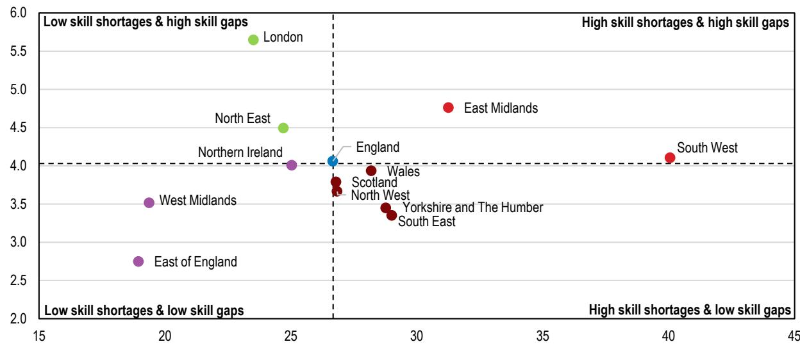  
Note: Dotted lines represent the UK average.  
Source: Department for Education.

StatLink https://stat.link/m09zov

The creation of Skills England in 2025 is an important step towards greater coherence in the skills system, by bringing employer demand, LSIPs and national strategic priorities into one strategic body. Skills England has begun consolidating functions previously held by the Institute for Apprenticeships and Technical Education and is beginning to map skills gaps and training needs across regions while guiding decisions on where to fund training programs, apprenticeships, and reskilling initiatives (HM Government, 2025[27]). To deliver meaningful productivity gains, skills planning needs to explicitly align with the UK government's Growth Mission and Industrial Strategy, ensuring that local training provision maps onto real and emerging sectoral opportunities. The government should continue to develop and refine Skills England's data and labour market intelligence systems, including local skills mapping and standardised skills classification, to strengthen evidence-based monitoring of local skills supply and demand and enable more responsive and targeted policy interventions.

Lifelong learning is central to addressing current and emerging skills gaps. Adult learning participation in England reached 52% in 2023, well above the OECD average (40%), though still below levels in Finland and Norway (58%) and the United States (55%) (OECD, 2025[28]). Participation remains uneven, disproportionately benefitting higher-educated persons and varying across sectors and occupations, with clear regional implications (OECD, 2025[28]). In 2024, total employer investment in training was concentrated in London and the South East, largely driven by business services (HM Government, 2025[24]). While employer investment on training decreased since 2022 on average across UK regions, the North East is one notable exception. Here, investment in training per employee increased by about 50%, while both skill shortage vacancy and skill gap density decreased from 36% to 25% and from 5.9% to 4.5% respectively, highlighting the important role of training in addressing skill shortages (HM Government, 2025[24]).

Expanding lifelong learning requires an increase in investment in adult education and quality training programs. As apprenticeship incentives increasingly prioritise young entrants, there is a risk that support for upskilling existing workers becomes relatively less generous, particularly in firms with limited training capacity. In combination with rising labour cost (see Chapter 1), firms have fewer financial means for upskilling existing employees. Given that investment in general and transferable skills generates positive externalities that firms cannot fully internalise, there is a strong case for public co-investment, as discussed in the previous Economic Survey (OECD, 2024[1]). Instruments such as individual learning accounts, as used in several OECD countries such as Belgium and France, could be particularly effective in regions with weaker employer engagement. The planned Lifelong Learning Entitlement (HM Government, 2025[29]), a student finance system that gives adults a loan equivalent to four years of post-18 education, which they can use flexibly over their lifetime to fund approved degrees or modular courses at Levels 4–6, is a step into the right direction. From its introduction for course starts from 2027, the LLE is intended to widen access to flexible study pathways while aligning provision more closely with evolving skills needs. While many UK degree programmes are structured in modular formats, expanding the type of short, flexible and credit-bearing modular study envisaged under the LLE will still require adaptation by providers, clearer frameworks for credit recognition, and improved information for learners and employers. Evidence from OECD work on lifelong learning and micro credentials points to the importance of transparent qualification frameworks and accessible information systems in supporting uptake of modular provision (OECD, 2023[30]). In the UK context, discussions on the implementation of the LLE similarly emphasise the need for clearer information, guidance and links to labour market needs alongside institutional readiness (HM Government, 2025[27]). Ensuring effective implementation of the LLE therefore requires a balanced approach that combines provider capacity with stronger course transparency, guidance and labour market signalling, so that flexible learning options, such as modular, part-time, blended or online study that can be accumulated over time and aligned with employer demand, translate into meaningful upskilling and reskilling opportunities across regions. The government should set in place a monitoring system to ensure course quality, regional availability and increase outreach and guidance for adult learners, especially those with low qualifications, to support uptake.

## Retaining and attracting skills through stronger local demand and mobility

Improving regional productivity depends not only on creating and upgrading skills but also on the region's ability to retain locally trained graduates and skilled workers, as well as to attract talent from elsewhere. Research shows that higher education graduates have a greater geographical mobility, moving towards regions with higher wages and better amenities, especially towards London and the South East (Britton et al., 2021[31]; Vignoles, 2025[32]; Xu, 2025[33]). While large cities outside London often retain a substantial share of the graduates they educate, they attract comparatively few graduates trained in other regions. Analysis at the Travel-to-Work Area level suggests that this reflects limited inward mobility linked to weaker local demand for high-skill jobs, rather than low individual willingness to move (ONS, 2023[34]). As a result, regions may struggle to capture the returns to their education investments.

Challenges in retaining graduates and highly skilled workers reflect not only a labour-supply issues but also constrained local demand for high-skilled labour, which similarly limits the region's ability to attract external talent. Fewer high-quality job opportunities and weaker employer clustering limit the incentives for skilled workers to remain in the region and to relocate to it. Within the framework of Skills England and LSIPs, there is scope to strengthen retention and attractiveness by developing local skills compacts, which complement national sector-based skills arrangements through agreements co-led by employers, education providers, and local authorities that coordinate training, recruitment, and career opportunities in the region. By pooling information on employer needs, agreeing on joint action, and sharing responsibility for both training and jobs in the local economy, these compacts can help to align local skills supply with job opportunities, encourage businesses to invest in training, and give workers clearer pathways to local employment. Examples include the EU Pact for Skills and Regional Skills Partnerships, which have strengthened links between education and local labour markets (European Commission, 2025[35]; 2024[36]).

Labour mobility and effective skills matching are further constrained by housing shortages, particularly around more productive cities. Given the United Kingdom's relatively flexible labour market, reducing these mismatches depends less on employment protection and more on reducing barriers to mobility across firms and places. Mobility is also limited by structural features of the housing market, including a relatively small and unevenly distributed private rental sector outside major urban centres and high transaction costs associated with owner-occupation, notably stamp duty (OECD, 2022[37]; Hilber and Lyytikäinen, 2017[38]). Successive OBR assessments have pointed to weak housing supply responsiveness as a structural constraint on labour mobility and regional rebalancing (OBR, 2025[39]). The government's planning reform agenda aims to accelerate housing delivery, increase land availability, and reduce delays in local plan adoption, and is therefore an important complement to skills policy. Yet implementation risks remain. Shortages in the construction workforce, alongside capacity constraints in local planning authorities, are likely to slow the pace at which higher housing targets can be translated into completed homes (OBR, 2025[39]). The government should continue to advance the planning reform, by also strengthening the strategic importance of construction-related skills, training and apprenticeships within a place-based productivity strategy. This can support the delivery of planning reform and ensure that improved housing supply can effectively underpin labour mobility, skills retention and the attraction of skilled workers. Policy effectiveness could be enhanced by complementary measures that support residential mobility, including expanding the availability of secure, long-term rental housing in areas of strong labour demand and abolishing stamp duties (Chapter 1) which discourage mobility.

Table 4.1. Past recommendations on education and lifelong learning

<table><tr><td>Past recommendation</td><td>Actions taken since last Survey</td></tr><tr><td>Increase funding rates for adult learning and ensure that they effectively reflect training costs</td><td>Funding and structure changes are progressing, but real-terms support still lags needs. Adult Skills Funding continues to evolve with the introduction of the Adult Skills Fund and updated funding rules across 2025–26 to support tailored learning pathways.</td></tr><tr><td>Ensure that training opportunities for adults are of high quality and respond to identified skills need.</td><td>The Post-16 White Paper signals greater access to short modular courses and Lifelong Learning Entitlement loans to extend learning opportunities.</td></tr><tr><td>Target additional resources to support the highest quality teaching in schools in the most deprived areas.</td><td>The government has launched plans to recruit an additional 6 500 expert teachers with a focus on areas of greatest need, such as schools facing recruitment and retention challenges.</td></tr></table>

## 4.2.2. Strengthening physical and digital connectivity to unlock spatial spillovers

Adequate physical and digital infrastructure is a critical complement to supporting regional productivity growth and reducing disparities. By improving access to markets, increasing the geographic reach of local labour markets and facilitating knowledge spillovers, connectivity enables cities and regions to internalise agglomeration benefits and scale productive activity. While the UK has made progress in rolling out broadband and committed to major transport investments, infrastructure gaps remain large, particularly in less connected regions. A tight housing market and a slow planning system continue to limit the effective size and integration of labour markets, particularly outside London. Strengthening connectivity is therefore needed to support the diffusion of productivity-enhancing activity across firms and places and reducing regional productivity disparities.

## Enhancing transport connectivity to facilitate agglomeration benefits

Public investment in transport infrastructure is highly concentrated. Total investment and maintenance spending remains modest by international standards (OECD, 2022[18]) contributing to below OECD average quality and efficiency (Figure 4.9). Connectivity within the United Kingdom is uneven and investment is concentrated in already well-connected areas. London and the South East benefit from dense, multimodal networks and sustained investment, while the North East, West Midlands and much of Wales continue to face weaker connectivity and ageing assets (NIC 2023). Capital spending in transport per capita in London has been more than double the UK average, contributing to stronger agglomeration returns in the capital, while limiting productivity gains in many regional cities and regions further away from Metropolitan Areas (Figure 4.9).

Figure 4.9. Transport infrastructure investment is concentrated in the London region  
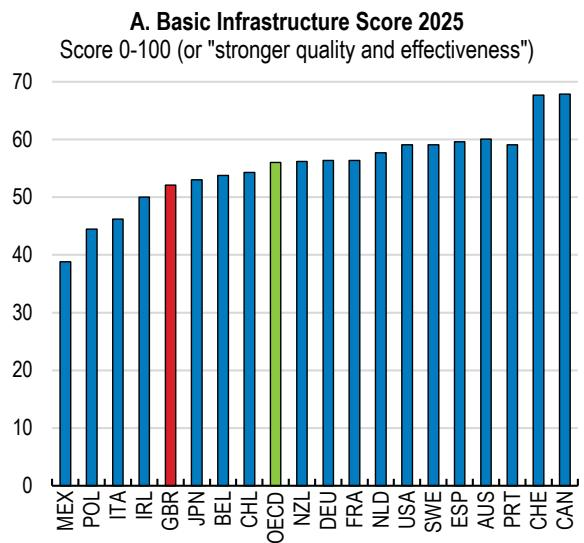  
B. Capital investment in transport per capita
By region, in GBP, 2024-25

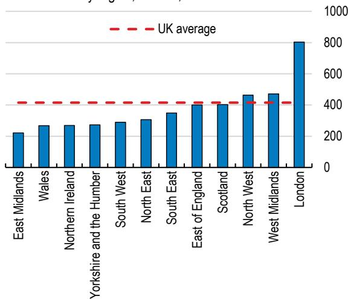  
C. Labour productivity by type of region (TL3) GVA per worker, thousands PPP-adjusted, 2020

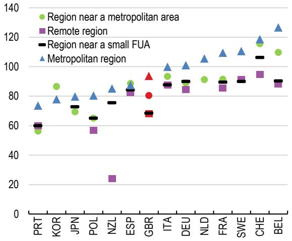

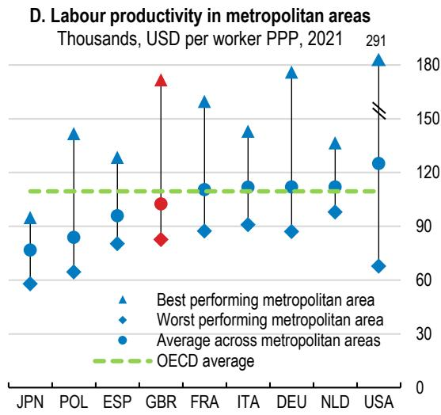

Note: Panel B includes only includes identified spending. In Panel C, labour productivity is defined as Gross Value Added (GVA) per worker. Metropolitan area is defined as a Functional Urban Area (FUA) with a population of 250 000 or more. The average across metropolitan areas is an unweighted average, including the OECD which considers metropolitan areas of 29 OECD countries for which data are available. In Panel D, metropolitan areas have a population of at least 250 000, and a small Functional Urban Area has a population of 50 000-250 000. In Panel D, OECD is a simple average of 34 OECD member countries.

Source: IFS (2025), “Where and how does the government spend its money?”; OECD Regions, Cities and Local Areas (database); and World Population Review.

StatLink https://stat.link/52ni7a

Uneven connectivity in both passenger and freight infrastructure, including roads and rail, constrains labour market access, business integration, and knowledge spillovers while also affecting the efficiency of supply chains and firms' ability to reach wider labour pools. When commuting times are long and transport networks unreliable, firms' effective labour pools shrink, reducing opportunities for matching, learning and innovation. OECD research shows that countries with dense and well-integrated regional transport networks, such as for example Germany and the Netherlands, support stronger inter-city connectivity and more integrated labour markets, which is associated with more balanced productivity performance across regions. By contrast, commuting flows between UK cities outside London are weaker, and inter-city connections limit what should be common labour-market interactions. This contributes to the underperformance of core cities in the United Kingdom compared to international peers (OECD, 2020[6]; OECD, 2015[40]).

Improving connectivity between and within cities remains key to enhance agglomeration benefits and narrow regional productivity gaps. Past UK transport initiatives such as the Transport Decarbonisation Plan (2021[41]), the Integrated Rail Plan for the North and Midlands (2021[42]), and the strengthening of subnational transport bodies, have moved in the right direction, but have often lacked continuity and coherence and do not yet amount to an strategy able to reverse entrenched regional disparities. The cancellation of HS2 Phase 2 in 2023 eroded confidence in the long-term network strategy, particularly for cities such as Birmingham, Manchester, and Leeds (House of Commons Library (2024[43]; 2025[44])). These cities have the scale to be globally competitive but lack the connectivity needed to internalise agglomeration benefits (OECD, 2020[6]). The 2024 Growth Mission seek to address this gap, reaffirming the Northern Growth Corridor through Northern Powerhouse Rail and expanding devolved capital budgets, while the publication of the 10-year infrastructure plan, backed by at least GBP 725 billion in planned investment, and accompanied by multi-year capital budgets reviewed every two years, is a significant development to reduce policy volatility (HM Government, 2025[45]). Long-term investment horizons are consistent with international best practice e.g. in Germany and the Nordics, where infrastructure planning over 15–20 years supports supply-chain developments, skills capacity planning, and private investment. However, despite the 10-year horizon and budget envelope, funding after 2030 remains contingent on future fiscal policy. The implementation of the plan's projects should be regularly assessed to identify potential bottlenecks in delivery capacity and potential shortcomings in institutional coordination.

The Planning and Infrastructure Act 2025 further seeks to address long-standing fragmentation in the UK's planning and land-use system (HM Government, $2025_{[46]}$ ), which has contributed to delays, cost escalation and uncertainty in infrastructure delivery. By streamlining consenting procedures for nationally significant infrastructure projects, clarifying national policy statements and accelerating approval timelines, the Act aims to reduce procedural bottlenecks that have historically constrained transport and energy investment. These reforms could improve predictability and delivery speed, particularly in regions where infrastructure gaps weigh on productivity. However, the centralisation and acceleration of planning decisions also come with some risks. If national prioritisation is not carefully aligned with regional and local economic strategies, faster approvals may improve delivery speed but without necessarily strengthening agglomeration dynamics in second-tier cities. It is therefore important that capital investments are guided by rigorous cost-benefit analysis, including independent scrutiny where appropriate, and target long-standing transport connectivity gaps in lagging areas. Aligning infrastructure investment with regional and local economic strategies, housing supply, local transport and labour market integration objectives will be essential to translate planning reform into regional productivity gains.

The creation of the National Infrastructure and Service Transformation Authority (NISTA) in 2025 aims to reduce institutional fragmentation and strengthen delivery by consolidating strategic oversight and implementation functions (HM Government, 2025[47]). While this may improve coordination across departments, the merger of strategic oversight and delivery functions raises concerns about transparency and accountability. In countries such as Germany and the Netherlands, strategic planning bodies maintain separation from delivery agencies, enabling clearer prioritisation and continuous technical evaluation. The government should therefore ensure that a clear separation between strategic appraisal and delivery oversight is maintained to ensure transparency and accountability.

## Completing the rollout of high-quality digital infrastructure

Digital infrastructure is increasingly central to regional economic performance. High-capacity broadband networks, and reliable fixed and mobile internet enables firms to communicate, innovate and adopt new technologies. It also supports remote working, knowledge exchange and digital entrepreneurship, as well as allows more remote or peripheral regions to participate in national and global value chains. Digital networks therefore complement physical transport infrastructure by extending connectivity beyond geographic distance and providing a foundational input for productivity-enhancing activity.

The United Kingdom has made substantial progress in expanding high-capacity broadband coverage. Project Gigabit has been central to subsidising network expansion in underserved areas, with UK government-funded contracts covering around 1 million hard-to-reach premises of which more than 180 000 of these already built by late 2025 (HM Government, 2025[48]). By mid-2025, about $86\%$ of UK residential premises had access to a gigabit-capable connection (Figure 4.10, Panel A), and full-fibre availability has reached $78\%$ up from $47\%$ in early 2023. At the same time, take-up of full-fibre services among the properties where it is available, increased to $41\%$ , up from $33\%$ just one year earlier (HM Government, 2025[49]).

Figure 4.10. Digital connectivity has improved across England, with some remaining regional gaps  
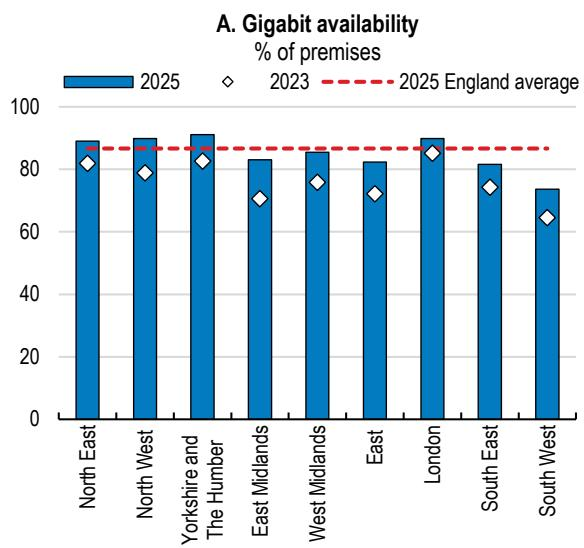  
Source: Ofcom Connected Nations UK report 2025.

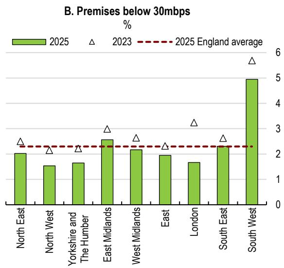  
StatLink https://stat.link/yv0h1x

Despite this strong national progress, geographic disparities remain. The South West, the Midlands and the East of England continue to lag in gigabit-capable coverage and have a higher share of premises with speeds below 30 Mbps (Figure 4.10, Panel B). This regional divide largely reflects urban-rural differences, with urban areas in general having better gigabit capable coverage (about 92% of premises) than rural areas (about 61%) in mid-2025 (Ofcom, 2025[50]). As a result, rural, coastal, and former industrial or peripheral regions may remain structurally disadvantaged. Given these patterns, policy initiatives such as the Shared Rural Network to improve mobile coverage in rural communities, enhancing regional inclusion is welcome, not only to reduce regional gaps in availability but to enable lagging regions to benefit from national growth ambitions. The government should continue to prioritise ongoing investment in network resilience, expanding high-speed connectivity to underserved areas, and ensuring infrastructure supports emerging technologies.

Digital infrastructure is also a necessary precondition for the adoption of advanced digital technologies, including artificial intelligence (AI), whose productivity potential depends critically on fast, reliable networks. As with transport connectivity, however, infrastructure availability alone does not guarantee productivity gains. Regions' productivity benefits depend on firms' capacity to adopt and effectively use digital technologies, and on complementary needs, like rising electricity demand are planned for, otherwise lagging regions risk falling further behind despite digital infrastructure investment (see below). The government should further strengthen cross departmental coordination on complementary needs, such as a modern and stable electricity grid (see Chapter 3).

## 4.2.3. Broadening regional innovation and accelerating diffusion of new technologies

A key structural constraint to productivity is the limited diffusion of innovation, both across firms within regions and across regions themselves. Despite strong national research capabilities and a dynamic innovation frontier, productivity-enhancing technologies, practices and business models are slow to spread beyond leading firms and places. This weak transmission dampens spillovers, slows firm upgrading and scaling, and reinforces spatial concentration of economic activity. Addressing barriers, such as uneven digital adoption, concentrated R&D, weak business dynamism and constrained access to finance, is therefore central to strengthen diffusion and reduce regional productivity disparities.

## Improving digital adoption among SMEs

Digital adoption is a primary channel through which connectivity and skills translate into productivity gains. Yet in the United Kingdom, diffusion of digital technologies among small and medium-sized enterprises remains uneven across regions and sectors, limiting within-region productivity growth and slowing the spread of best practices beyond frontier firms. Firms in London and the South East consistently report higher adoption rates across a wide range of tools than firms elsewhere (Figure 4.11). Adoption patterns appear more closely linked to sectoral composition and managerial capability than to broadband availability alone. London-based SMEs show particularly high usage of enterprise resource planning (ERP) software (15.4%) and virtual reality/augmented reality technologies (17.9%), whereas SMEs in the South East show comparatively high adoption rates for HR Management Software (16.4%) and ERP software (17.3%), suggesting the region's focus on optimising business processes and resource management. By contrast, SMEs in the North East, Wales and Northern Ireland report lower adoption rates across all technologies, pointing towards scope for productivity-enhancing, targeted digital growth initiatives (Mahmood, Asghar and Kousha, 2024[51]).

## Figure 4.11. SMEs in the London region lead in adopting digital technologies

SMEs digital adoption rates across UK regions, %, 2018-2022 average  
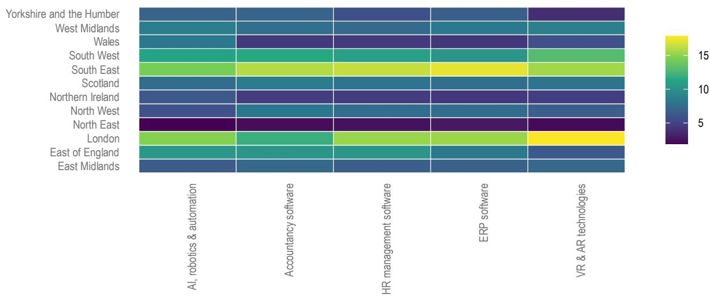  
Source: Mahmood, Asghar and Kousha (2024[51]).  
StatLink https://stat.link/xqpz30

These gaps in adoption reflect persistent barriers faced by many smaller firms. Across regions, SMEs frequently report skills-shortages, high upfront costs, uncertainty about returns and limited access to trusted advice as key obstacles to adoption (HM Government, 2025 $^{[52]}$ ). Management capability also plays an important role, as firms with weaker managerial capacity are less able to identify relevant technologies, integrate them into existing workflows, or reorganise production processes to realise productivity gains. As a result, even where basic digital infrastructure is available, diffusion remains slow, and productivity-enhancing practices fail to spread widely within local economies.

Box 4.2. The UK: Leveraging Artificial Intelligence for Growth, Skills and Regional Development

The United Kingdom is among the world's leading countries in artificial intelligence, combining a strong research base, an active private-sector ecosystem and international engagement on AI governance and safety (Department for Science, Innovation and Technology (DSIT), 2026[55]; International AI Safety Report, 2026[56]). Building on this strength, the government aims to use AI to boost productivity and public services, while widening benefits across regions and groups. Its strategy combines national investment with a strong place-based focus on diffusion, skills and local ecosystems.

The 2025 AI Opportunities Action Plan provides the overarching framework, structured around three pillars: strengthening foundations (compute, data and skills), driving adoption through a “scan, pilot, scale” approach, particularly in public services, and removing barriers via finance, skills and regulatory support. Public sector deployment mainly serves as a lead market and demonstration channel (DSIT, 2025[57]). Progress is monitored through a public online dashboard covering public-sector delivery, business support, skills and wider adoption enablers (DSIT, 2026[58]; DSIT and Number 10 Data Science, 2026[59])

A central feature of the strategy is the use of place-based instruments to broaden adoption beyond established tech hubs:

\- AI Growth Zones across all four UK nations aim to attract private investment and support regional job creation through streamlined planning and improved access to energy (DSIT, 2025[57]; 2025[60]).

\- The Lanarkshire AI Growth Zone illustrates this model: expected to support more than 3400 jobs and attract GBP 8.2 billion in private investment, complemented by public funding for apprenticeships, skills and community initiatives. The project links compute investment with local workforce capacity, recognising that infrastructure alone is insufficient for regional productivity gains (DSIT, 2026[61]).

\- Tech Towns (piloted in Barnsley), focus on stimulating AI adoption at the local level. Barnsley serves as a national testbed for AI use across public services, education, healthcare and small businesses, combining local partnerships, targeted skills provision and practical demonstrations of AI tools to generate lessons that can be replicated elsewhere (DSIT, 2026[62]).

National policies reinforce these regional efforts. Targeted support for high-potential AI firms is provided through the Sovereign AI Unit, helping startups and scale-ups overcome financing and scaling constraints while retaining capabilities domestically. A nationwide AI skills initiative aims to train 10 million people by 2030, with a focus on SMEs and lagging regions, alongside analysis of labour-market impacts to guide training policy.

Finally, a regulator-led governance framework and investment in AI assurance seek to build trust, particularly among SMEs and public sector users, supporting broader adoption. Together, these elements link national strategy with local delivery to promote more geographically inclusive AI-driven growth.

Sources: Department for Science, Innovation and Technology (DSIT) (2025[55]; 2025[58]; 2026[53]; 2026[60]; 2026[61]; 2026[59]; 2026[56]), DSIT and Number 10 Data Science (2026[59]); International AI Safety Report (2026[56]).

Artificial intelligence represents a further stage in this diffusion challenge. Recent national commitments to expand investment in advanced computing, artificial intelligence and quantum technologies (HM Government, 2026[53]) have the potential to lift productivity through automation, data-driven decision-making and new business models. However, adoption of these technologies is likely to be uneven. According to OECD work, AI's estimated contribution to aggregate annual labour productivity growth over the next decade could range between 0.4-1.3 percentage points in the United Kingdom depending on the assumed degree for AI adoption, a similar range as estimated for the United States and Germany (Filippucci et al., 2025[54]). The UK government's AI strategy aims to make the United Kingdom a global leader in AI research, innovation and adoption, with a focus on helping industries and regions to adopt AI. As AI systems require complementary investments in skills, data infrastructure, organisational change and finance, the government should ensure that early adoption is not concentrated among larger firms and already-productive regions to avoid widening regional productivity gaps. Without targeted support, AI could therefore widen existing productivity gaps by reinforcing the advantages of leading firms and places rather than diffusing across regional economies. To address this, the government has begun shifting from a purely national innovation strategy towards place-based AI uptake models, including AI Growth Zones, local Tech Town pilots and large-scale skills initiatives aimed at SMEs (Box 4.2).

Recent policy initiatives recognise the need to strengthen digital diffusion more broadly. National reviews, such as the UK government's 2025 Technology Adoption Review (HM Government, 2025[52]) and the SME Digital Adoption Taskforce (HM Government, 2025[63]), highlight the importance of co-ordinated support for basic, productivity-enhancing digital tools alongside emerging technologies (HM Government, 2025[64]). Past national schemes, such as the “Help to Grow: Digital” programme, offered grants and guidance to support adoption of business software by SMEs, but limited uptake and early closure, partly reflecting restrictive eligibility criteria, limited flexibility and the programme’s short duration, highlight the importance of better-designed, better-signposted and more trusted delivery mechanisms. The government could develop an integrated, staged digital adoption support framework for SMEs that systematically guides firms through incremental levels of digital maturity, combining tailored advisory services, targeted financial incentives, and sector-specific resources, drawing on international examples such as Singapore’s SME Go Digital programme, which has improved productivity across a broad range of firms, and Germany’s Mittelstand Digital Initiative, which combined regional centres with advisory support to target SMEs according to local economic profiles and need (Box 4.3).

## Box 4.3. International Examples of Staged Digital Adoption Support for SMEs

## Germany - Mittelstand-Digital Initiative

Launched by the Federal Ministry for Economic Affairs and Energy, the Mittelstand-Digital Initiative supports SME digitalisation through:

\- Centres of Excellence: Regional centres provide advisory services, workshops, and diagnostic tools that allow firms to assess digital capabilities and progress from basic to advanced digital adoption.

\- IT Security Initiative: Offers targeted guidance, training, and resources to ensure secure implementation of digital solutions.

The initiative combines tailored advisory support, practical implementation guidance, and access to sector-specific resources, providing a staged pathway for SMEs to develop digital maturity.

## Singapore - SMEs Go Digital (SMEGD) programme

Singapore's SMEs Singapore's SMEs Go Digital (SMEGD) programme guides firms through incremental levels of digital adoption across four different offers:

\- Start Digital (SD) (2018): Provides new firms or those yet to digitalise with foundational and easy-to-deploy digital solutions (e.g., digital marketing, digital transactions, accounting, HRM, cybersecurity, etc.).

\- Productivity Solutions Grant (PSG) (2018): Supports the adoption of curated digital solutions that improve productivity (e.g. ERP, retail management systems, etc.)

\- Grow Digital (2019): Help firms' participation in business-to-business (B2B) and business to consumer (B2C) e-commerce platforms to sell overseas.

\- Advanced Digital Solutions (ADS) (2020): Support firms' adoption of advanced or integrated digital solutions to deepen their capabilities, strengthen business continuity measures and build longer-term resilience, including in areas such as sustainability.

Between 2017 and 2024, the SMEGD programme supported over 88 000 SMEs (around $29\%$ of Singapore's SMEs population in 2024). Impact evaluations found measurable improvements in firm performance: PSG recipients increased value-added per worker by $3\%$ and revenue by $2.2\%$ , while SD recipients saw increases of $1.8\%$ and $1.6\%$ , respectively. Micro firms benefited the most, with up to $6.4\%$ productivity gains under PSG and $4.4\%$ under SD. Sector-specific PSG solutions were almost twice as effective as generic solutions.

Source: OECD (CFE/SME) forthcoming: SME Technology Adoption and Diffusion in the United Kingdom: Issues and policies; OECD, https://depp.oecd.org/policies/DEU945; https://digital-strategy.ec.europa.eu/en/policies/edihs

Regional initiatives are important complements to national strategies. Local schemes, such as the North of Tyne's Digital Growth Programme and Greater Manchester's Digital Blueprint offer localised training, digital-skills support, and SME-focused advisory services that are tailored to local business needs (HM Government, 2025[52]; 2025[64]). These place-based approaches are particularly effective where they are embedded in wider local ecosystems, linking digital adoption support with skills provision, innovation assets and access to finance. The government should ensure a coherent policy mix that combines infrastructure rollout with skills development, management support, trusted advisory services and appropriate financing instruments to strengthen digital diffusion among SMEs. By supporting SMEs to adopt and effectively use digital and AI-enabled technologies, policy can accelerate within-region productivity gains, support firm scaling and reinforce business dynamism. Failure to do so risks leaving large parts of the economy disconnected even as national digital infrastructure continues to improve.

## Rebalancing R&D investment to support regional ecosystems

Innovation is a central driver of productivity growth, yet its contribution to reducing regional productivity gaps depends critically on the extent to which new knowledge diffuses across firms and places. In the United Kingdom, innovation activity and R&D investment remain highly spatially concentrated, limiting the strength of cross-regional spillovers and reinforcing existing productivity divides.

Patent activity highlights the geographic imbalance in innovation outputs. While the United Kingdom performs strongly on aggregate innovation indicators (OECD, forthcoming $^{[65]}$ ), patenting is disproportionately clustered in London, the South East and parts of the East of England, even after adjusting for population. In 2022, the South East, Greater London and the East of England alone generated around 46% of total UK Patent Cooperation Treaty applications, or around 100 patents per million inhabitants. By contrast, many regions with lower productivity levels exhibit markedly lower patenting intensity, reflecting weaker local innovation ecosystems and more limited exposure to frontier technologies. This spatial imbalance suggests that national innovation strength does not automatically translate into broad-based productivity gains.

The patent concentration is closely linked to the structure of Research and Development (R&D) investment in the United Kingdom. Gross domestic R&D expenditure at around 2.7% of GDP in 2023 is at the OECD average (Figure 4.12, Panel A) but remains lower than in peer economies such as Germany (3.1%), Japan (3.4%) and the United States (3.5%). Compared to international peers, UK businesses spend less on R&D as discussed in detail in the last Economic Survey (OECD, 2024[1]). A distinctive feature of the UK system is the role of higher education, with universities accounting for a larger share of R&D performance than in most G7 economies, reflecting excellence-based public funding and strong research institutions, but also limiting the diffusion of innovation where links between universities to industry are weaker (OECD, forthcoming[65]).

Business R&D is particularly geographically concentrated. London, the South East and East of England together account for close to 60% of UK business R&D expenditure, reflecting the cumulative advantages of dense research assets, skilled labour markets and access to finance (Figure 4.12, Panel B). By contrast, large parts of the Midlands, North, Wales and Northern Ireland are lagging in both R&D capacity and innovation output (ONS, 2025[66]). Public R&D funding patterns reinforce these dynamics. Competitive allocation mechanisms, while effective at supporting research excellence, have tended to channel funding towards institutions and regions with established research capacity, primarily in the Greater South East. As a result, public support has often amplified existing spatial concentrations rather than strengthening innovation diffusion into weaker regions. This has limited the role of public R&D as a lever for place-based productivity convergence. Internationally, models such as Germany's Fraunhofer institutes, which actively engage with regional innovation ecosystems to support local knowledge transfer and technology adoption, and the Netherlands' TNO network, which works with regional partners and SMEs to translate research into practical innovation outcomes. These models illustrate complementary mechanism to UK approaches, combining excellence-based funding with regionally embedded diffusion institutions (OECD, 2022[67]; OECD, 2025[68]; TNO, 2025[69]).

Figure 4.12. UK R&D spending is around the OECD average but highly spatially concentrated  
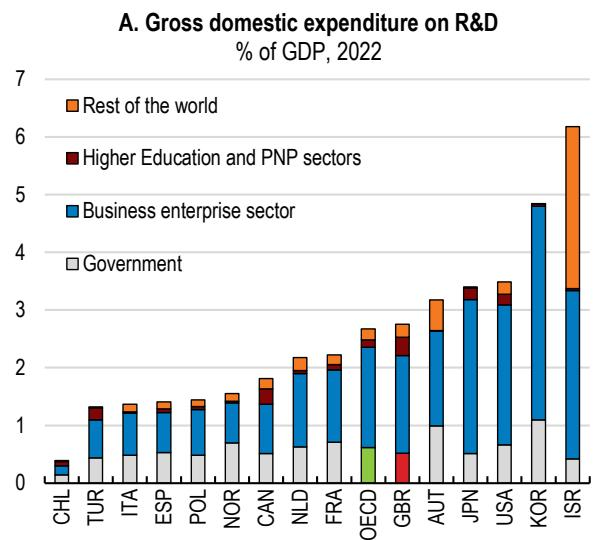

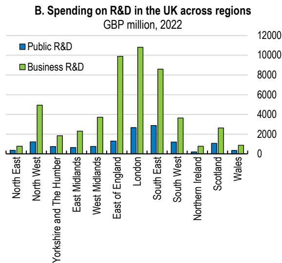  
Source: OECD MSTI, ONS Local Database.  
Note: In Panel B, Public R&D refers to the fiscal year 2021/2022; Business R&D to year 2022.  
StatLink https://stat.link/k5cl2m

Recent policy initiatives indicate a shift towards a more place-based innovation model. The UK Innovation Strategy (HM Government, 2023[70]) explicitly emphasises boosting innovation across all parts of the country and strengthening local innovation systems as a driver of inclusive growth. This agenda has been operationalised through the Innovation Accelerator Pilot Programme, a centrally funded initiative that supports 26 high-potential R&D projects with GBP 130 million across Greater Manchester, Glasgow City Region and the West Midlands (UK Research and Innovation, 2025[71]). Building on this pilot, the Local Innovation Partnerships Fund (LIPF) commits GBP 500 million to foster local “triple helix” partnerships between civic institutions, business and universities to deliver large-scale, region-specific R&D and innovation capabilities, with at least GBP 30 million earmarked for multiple UK regions and city-regions including Greater Manchester, West Midlands, West Yorkshire, Glasgow and Cardiff Capital Region (UK Innovation and Research, 2025[72]). These programmes align closely with the Industrial Strategy’s aims, particularly those related to productivity, net zero and technological diffusion, and it is welcome that they build on regional strengths and aim to foster collaboration between firms, universities and institutions. Broadening the regional coverage and embedding Innovation Accelerator type approaches within long-term regional growth plans could further strengthen alignment with the Industrial Strategy and provide greater certainty for local actors and investors.

## Fostering business dynamism and firm growth across regions

Business dynamism plays a central role in translating innovation into productivity gains, by supporting the diffusion of new technologies and the reallocation of capital and labour towards more productive firms. Where firm entry, exit and scaling are weak, new technologies and business practices diffuse more slowly, limiting productivity spillovers within and across regions. In the United Kingdom, subdued business dynamism has increasingly constrained this reallocation process, reinforcing regional productivity disparities.

With relatively competition-friendly product market regulation, as reflected in OECD Product Market Regulation (PMR) indicators, the United Kingdom continues to exhibit a more open and contestable business environment than many EU peers (Figure 4.13, Panel A). However, over the past two decades reallocation dynamics have weakened. Thus, measures of job reallocation and employment churn remain well below early-2000s levels and have not recovered to their pre-financial-crisis intensity, indicating a reduced pace at which resources move across firms and sectors (ONS, 2025[3]). This decline has occurred alongside rising productivity dispersion, with frontier firms pulling further ahead of the rest, suggesting that innovation is increasingly concentrated rather than diffused across the wider firm population (ONS, 2025[3]).

## Figure 4.13. Business dynamism is around EU peers but has declined over time

% of active enterprises  
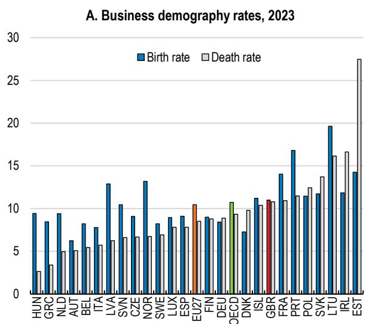

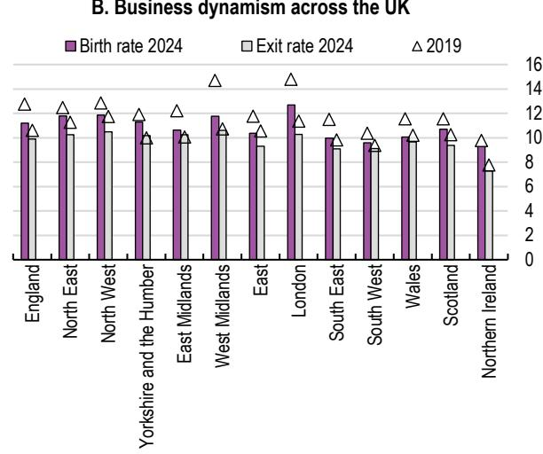  
Note: In Panel A, OECD refers a simple average of 25 OECD member countries that are also part of the EU.  
Source: Eurostat (database); and ONS Business Demography (database).  
StatLink https://stat.link/9byrhi

Firm entry and exit remain important channels for experimentation and the adoption of new technologies, but recent trends suggest that their contribution to aggregate job reallocation has decreased. Net job creation is increasingly driven by incumbent firms rather than by young, fast-growing entrants, reducing the role of high-growth firms as drivers for diffusion (ONS, 2025[3]). This shift seems to be more relevant for regions outside Greater London, where firm turnover is lower (Figure 4.13, Panel B). London's higher levels of firm churn facilitate faster recycling of resources and greater scope for the spread of new technologies and practices. In contrast, many other regions exhibit persistently lower churn and weaker firm growth, even where innovation activity is present. As a result, local innovation may fail to translate into broader productivity gains, reinforcing spatial divides rather than narrowing them. Even relatively small differences in firm churn matter for regional productivity, as lower entry, exit and scaling reduce the scope for local diffusion of new technologies and managerial practices.

Recent policy initiatives acknowledge the importance of firm dynamics in sustaining productivity growth. The 2024 Growth Mission and the 2025 Industrial Strategy highlight the role of competition, firm growth and place-based ecosystems in supporting innovation diffusion. The Competition and Markets Authority has been tasked with a targeted programme to identify and remove barriers to entry, scaling and technology adoption, which is a welcome step towards strengthening reallocation dynamics. There should also be a strong focus on reducing administrative burden for start-ups, a category where the United Kingdom only scores around the OECD average in the latest PMR indicators (OECD, 2026[73]). Complementary initiatives focus on expanding support for regional growth ecosystems, regulatory reforms to ease scaling constraints, and efforts to improve access to growth finance through institutions such as the British Business Bank. These policies aim to strengthen the channels through which innovation spreads and productive firms expand, addressing the structural challenges highlighted by subdued business dynamism.

## Expanding access to finance to support regional investment ecosystems

Access to finance is a critical channel through which innovation diffuses and scales, translating research, adoption and firm growth into sustained productivity. Although the United Kingdom benefits from well-developed capital markets as highlighted in the previous Economic Survey (OECD, 2024[1]), risk finance is geographically concentrated acting as a constraint on diffusion. Thus, even where regions possess innovation capacity, skilled labour and public R&D investment, thin and fragmented local finance ecosystems limit the ability of firms to commercialise innovation, scale operations and anchor productivity gains locally. London and the Greater South East dominate venture capital, equity investment and investor networks, accounting for the majority of deal flow and capital deployment (Figure 4.14). While London's prominence partly reflects its role as a globally competitive financial centre with deep, internationally connected capital markets, the extent of concentration still implies limited availability of risk finance for firms in other regions, particularly at early and scale-up stages. (British Business Bank, 2025[74]). As a result, firms located outside the capital often face higher transaction costs, weaker investor networks and more limited access to follow-on finance, constraining their ability to scale and anchor productivity gains locally.

Figure 4.14. Equity investment is highly concentrated in the London region  
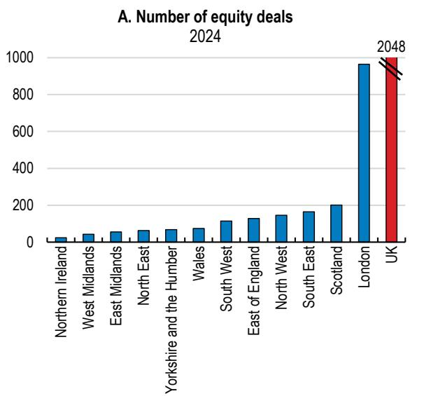  
Source: British Business Bank (2025), Nations and Regions Tracker 2025.

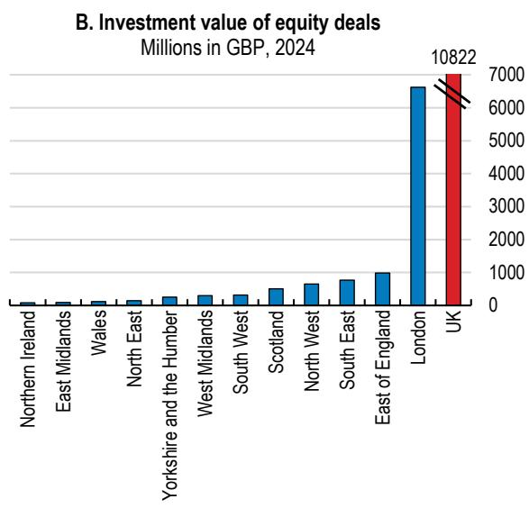  
StatLink https://stat.link/ofie6z

These spatial disparities are amplified through several reinforcing mechanisms, such as geographic concentration of investors, professional services and informal networks that shape deal flow, information and risk assessment. Firms outside London are more likely to rely on distant investors, weakening repeated funding relationships, reducing the availability of hands-on support, networks and strategic guidance. This increases the likelihood that successful firms relocate to financial centres as they scale, rather than expanding in place and lowering the local productivity impact of innovation (British Business Bank, 2025[74]). Thin local markets also limit information flows and risk-sharing, raising the cost of capital and discouraging experimentation, particularly for innovation-intensive SMEs.

Financing gaps are most pronounced at the pre-seed, seed and scale-up stages, where uncertainty is high and tangible collateral is limited. While recent data suggest some improvement in seed-stage investment outside London, later-stage growth finance remains heavily skewed towards the capital, constraining firms in other regions to commercialise their research (British Business Bank, 2025[74]). These stage-specific gaps weaken the diffusion of innovation by interrupting firm growth trajectories, even in regions with strong public research bases and improving digital adoption.

The concentration of finance also limits the effectiveness of national institutions and networks that help turn research into commercial applications. Mechanisms like the Catapult Network (Box 4.4) play an important role in this process, but their impact depends on firms' ability to access follow-on finance locally. Where regional capital markets are thin, public translational support struggles to convert R&D investment into sustained local scaling and productivity gains, weakening place-based innovation outcomes despite national excellence of national translational mechanisms such as the Catapult Network (Box 4.4, (OECD, forthcoming[65])).

## Box 4.4. The UK Catapult network in international perspective

The UK Catapult Network is a system of applied research and innovation centres established from 2011 onwards and overseen by Innovate UK. Catapults operate in strategically important technology and sector areas, providing shared facilities, technical expertise and test-and-demonstration capabilities that support firms, particularly SMEs, in late-stage applied research, technology validation and pre-commercial deployment. While several Catapults are headquartered in London, the Network operates through a geographically dispersed set of centres across the United Kingdom, with substantial activity embedded in regional manufacturing, energy, digital and applied research clusters.

Internationally, Catapults are comparable to applied research institutions found across the OECD. Germany's Fraunhofer-Gesellschaft operates a large, regionally embedded network of industry-oriented research institutes. Finland's VTT Technical Research Centre performs a similar translational role, linking national innovation priorities to firm-level deployment. In the Netherlands, TNO and Top Sector innovation consortia (TKIs) support collaborative applied R&D aligned with national and regional strengths, while in France, comparable functions are performed by the Instituts Carnot and regional competitiveness clusters (pôles de compétitivité). Outside Europe, the United States' Manufacturing USA institutes provide shared applied R&D infrastructure focused on advanced manufacturing and strategic technologies.

As with these international models, the effectiveness of the Catapult Network depends on stable long-term funding, strong industry engagement, and close integration with regional and local growth strategies, skills systems and investment frameworks.

Sources: Innovate UK: https://catapult.org.uk/; https://iuk-business-connect.org.uk/about/innovate-uk-system/catapult-network/; Fraunhofer-Gesellschaft: https://www.fraunhofer.de/en/about-fraunhofer/profile-structure.html; VTT Technical Research Centre: https://www.vttresearch.com/en; TNO: https://www.tno.nl/en; https://www.topsectoren.nl/; Instituts Carnot: https://www.instituts-carnot.eu/en; https://www.economie.gouv.fr/entreprises/developer-son-entreprise/innover-et-numeriser-son-entreprise/tout-savoir-sur-les-poles U.S. Department of Commerce – Manufacturing USA: https://www.manufacturingusa.com/.

Public initiatives aim to address these imbalances through more place-based and mission-oriented finance. The British Business Bank operates a range of regional programmes targeting SME finance gaps, while devolved institutions like the Scottish National Investment Bank provide patient capital, meaning long-term funding without demanding short term returns, aligned with respective regional priorities. However, in England, there is no equivalent devolved national investment bank, and regional SME finance is instead supported through UK-wide institutions, notably the British Business Bank's place-based programmes. Commitments under the 2025 Industrial Strategy, in combination with the 2024 Growth Mission and England's

Governance Devolution plans (see below), signal efforts to better align national investment frameworks with local economic development objectives, which is welcome. However, the current landscape remains fragmented, with multiple finance instruments operating in parallel and often weakly co-ordinated with regional innovation, skills and growth strategies. To enhance effectiveness, regions should address financing risks as binding constraint on firms, and better integrate finance instruments with innovation, skills and scale-up support to ensure that public and private investment translates into locally anchored firm growth (OECD, forthcoming[65]). Building on the BBB's role, efforts should focus on scaling targeted loan guarantees and co-investment funds, strengthening local financial intermediaries, and enhancing coordination with local governments to reduce spatial disparities in SME finance. Additionally, enhancing SME financial literacy through local business support networks are crucial steps. The BBB's 5-year strategy includes increasing regional investment, supporting innovation clusters and angel networks, and establishing new regional investment funds in the East and South-East of England (British Business Bank, 2025[75]). The success of these initiatives should be evaluated and if effective, adopted in more underserved areas.

Table 4.2. Past recommendations on improving businesses access to finance

<table><tr><td>Past recommendation</td><td>Actions taken since last Survey</td></tr><tr><td>Consider allowing the British Business Bank issuing government guaranteed bonds to scale up its operations.</td><td>Rather than government-guaranteed bonds, scaling up progress has focused on mobilising pension capital without guarantees, i.e. through vehicles such as the British Growth Partnership to attract institutional investors including pension funds into UK growth companies.</td></tr><tr><td>Ensure safeguards and appropriate investment regulations remain in place such that pension providers continue acting in the best interest of members.</td><td>Government initiatives such as the Mansion House Accord and broader reforms have emphasised investment opportunities while reaffirming obligations to act in savers’ interests within regulatory norms.</td></tr><tr><td>Advance up the consolidation of DC pension funds by advancing the Value for Money framework.</td><td>According to the Pensions Investment Review, the government aims to strengthen the Value-for-Money framework, and at introducing new rules that require large pension providers’ main default arrangements to have at least GBP 25 billion of assets by 2030, encouraging consolidation into “megafunds.”</td></tr><tr><td>Monitor that consolidation of Local Government pension funds is advancing according to set timelines.</td><td>Process advancing according to government timelines.</td></tr></table>

## 4.3. Improving the financial and administrative capacity of subnational governments to deliver regional productivity gains

Strengthening the institutional foundations of multi-level governance is essential for productivity across regions in the United Kingdom. The key challenge is not the existence of multiple tiers of government, but limited coordination between central and subnational governments, and across central government bodies. Subnational governments play a central role in delivering infrastructure, coordinating skills provision, shaping local labour markets, and steering economic development, including the diffusion of innovation across firms and places. However, in England, their effectiveness is constrained by three systemic weaknesses: horizontal fragmentation within central government, vertical fragmentation between central and subnational tiers, and a subnational fiscal framework characterised by limited subnational revenue-raising powers and a high dependence on central transfers, which undermines long-term planning. These coordination and capacity constraints weaken the translation of national strategies into place-based outcomes and contribute to persistent regional productivity gaps. Addressing these constraints has become a key national policy focus and important steps have been undertaken to increase local decision-making powers which are crucial for making national ambitions on regional growth deliverable in practice.

## 4.3.1. Strengthening institutional coordination and strategic coherence

Regional productivity is influenced not only by explicitly place-based policies but also by national sectoral policies that have significant regional spillovers. In the United Kingdom, transport, education, innovation, environmental regulations, and housing policies are designed at the national level but are implemented at the subnational level and can greatly affect regional outcomes. However, a recurring challenge in the United Kingdom's governance landscape is the limited coordination between place-based policies and broader sectoral policies, which risks fragmented efforts and suboptimal outcomes.

The UK central government architecture remains highly fragmented, with responsibilities affecting regional productivity divided across numerous departments, agencies, and non-departmental public bodies. For example, policies affecting skills and labour productivity are split across the Department for Work and Pensions (e.g., apprenticeships, skills, training and career, Skills England, and labour market participation), and the Department for Business and Trade (firm-level productivity), with sub-national authorities playing a delivery role within nationally defined frameworks. This sectoral siloed governance system, where departments operate through separate funding streams, overlapping programmes, and divergent accountability frameworks, can both limit policy coherence and slow down project delivery (OECD, 2024[76]; 2020[6]; HM Government, 2025[77]). It can also act as a key barrier to place-based productivity improvements. Thus, weak strategic alignment at the centre makes it difficult for subnational bodies to work effectively with the central government and creates mismatches between centrally designed programmes and regional and local priorities. Past growth programmes ranging from Local Growth Deals to the Towns Fund and the Levelling Up Fund often required local authorities to engage with multiple departmental processes and short-term competitive bidding, even when tackling overlapping priorities such as transport, regeneration, skills, and innovation. This setting of fragmented national funding streams increased administrative burden, reduced value for money, and weakened strategic coherence (National Audit Office, 2025[78]; OECD, 2022[18]). Evaluation of policy impacts on regional performance has been inconsistent, limiting learning from past programmes. The government should create a centralised framework for monitoring and evaluation of policy outcomes, building on existing audit and evaluation functions, and encourage shared learning across departments and among levels of government.

Recent policy reforms explicitly aim to address these coordination failures by moving towards mission-oriented, cross-departmental governance. The 2024 Growth Mission sets out shared economic objectives that require joint delivery across the Treasury, Department for Business and Trade, Ministry of Housing, Communities and Local Government, Department for Energy Security and Net Zero, and Department for Education. Similarly, the 2025 Industrial Strategy adopts a mission-based approach to innovation, clean energy, and the digital transition, emphasising cross-departmental decision-making and long-term investment pathways. These are positive steps, as strengthening cross-government coherence is necessary for deeper, clearer devolution, and for building subnational institutions with the authority, autonomy, and predictability required to drive long-term regional productivity gains. Coordination across central government bodies has however historically been difficult to sustain, particularly when missions cut across strong departmental boundaries (House of Commons Committee of Public Accounts, 2024[79]; Coyle, Richards and Smith, 2025[80]). The government should minimise risks related to unclear accountability lines, and inconsistent appraisal approaches. For example, investment decisions in transport and in economic regeneration should be based on comparable frameworks, assumptions, and metrics, rather than separate, siloed approaches. Persistent fiscal pressure (Chapter 1) also creates uncertainty over how departments will prioritise joint missions when faced with their own internal pressures. To secure political commitment beyond electoral cycles, the government should adopt multi-year strategies and parliamentary oversight to maintain continuity and focus. Mission frameworks should also incorporate adaptive governance practices that enable flexibility and learning, such as regular cross-departmental reviews of progress, shared performance indicators, and mechanisms to adjust priorities and resource allocation in response to new evidence or changing economic conditions. A comparable approach would be Finland's phenomenon-based approach to policy making, where cross-cutting societal challenges are jointly addressed by multiple ministries and monitored with shared indicators allowing government to adapt strategies and align resources across traditional departmental boundaries (OECD, 2022[81]), while maintaining clear and consistent core objectives (OECD, 2024[82]).

## 4.3.2. Deepening devolution and building local capacity

Devolution and decentralisation are central to the UK regional productivity agenda, aiming to shift power closer to communities and enable locally tailored decision-making. In Scotland, Wales, and Northern Ireland, devolved governments have broader legislative and fiscal powers enshrined in law, allowing them significant autonomy over key policy areas such as health, education, and economic development, relative to England's subnational arrangements. These nations set their own budgets and have durable frameworks for fiscal and policy responsibility, contrasting with a historically more limited approach to devolution in England (Box 4.5).

## Box 4.5. An asymmetric devolution process across the United Kingdom

Administrative devolution in the United Kingdom is highly asymmetric, reflecting distinct historical, political and constitutional trajectories in Scotland, Wales and Northern Ireland. Each devolution act was negotiated independently; therefore, the powers of the three devolved nations vary in nature and scope and have continued to evolve over time.

A core distinction is between reserved and devolved (or transferred) powers:

\- Reserved powers remain with the UK Parliament and include the constitution, defence and national security, foreign affairs, immigration and nationality, and most macro-tax policy.

\- Devolved powers are exercised by devolved legislatures. In Northern Ireland these are termed “transferred” matters. Northern Ireland also distinguishes reserved matters (can potentially be devolved with consent) and excepted matters (permanently retained by Westminster).

Across the devolved nations, policy areas that are fully or largely devolved include education, health and social care, housing, local government, environment, culture and sport, and (except in Wales) justice and policing. Partial devolution applies to transport, aspects of energy (notably in Northern Ireland), and elements of social security and employment (notably in Scotland). Fiscal devolution also varies: local property taxes are largely devolved, while income tax powers are partially devolved in Scotland and Wales. Some functions are devolved in one nation but reserved elsewhere, reinforcing asymmetry.

Devolution has deepened over time in Scotland and Wales, while Northern Ireland's institutions have been periodically suspended as part of the peace process.

\- Scotland operates under a reserved-powers model: the Scottish Parliament legislates on all matters not explicitly reserved. The Scotland Acts of 2012 and 2016 set out amendments to the Scotland Act 1998 and expanded tax, borrowing, welfare and electoral powers.

\- Wales gained primary legislative powers following a 2010 referendum and moved to a reserved-powers model under the Wales Act 2017. The Senedd (renamed in 2020) now holds a broader but still more limited competence than Scotland.

\- Northern Ireland has a distinct settlement, with most domestic policy devolved to the Assembly and Executive, led jointly by a First Minister and deputy First Minister.

## Local government structures in the four nations

Local governments are governed by the three devolved nations and by the UK government in the case of England. The system of local government is therefore also asymmetric: the organisation, responsibilities and finances, as well as territorial and decentralisation reforms, differ from one nation to another.

Across England, Scotland and Wales, local authorities are generally responsible for social care and deliver aspects of transport, housing and education, alongside neighbourhood services such as planning, waste management, environmental health and leisure. In Northern Ireland, councils provide mainly neighbourhood services; education, libraries and social care remain centralised at devolved level.

At the principal local authority level, the United Kingdom currently has:

<table><tr><td>England: 317 principal local authorities, comprising a mix of unitary authorities and two-tier county/district systems, alongside the Greater London Authority, 32 London boroughs, the City of London Corporation and the Isles of Scilly.Scotland: 32 unitary council areas.Wales: 22 unitary (“principal”) local authorities.Northern Ireland: 11 district councils (following the 2015 reform).</td></tr><tr><td>England</td></tr><tr><td>England has the most fragmented system of subnational governance. In the absence of an English parliament, powers are exercised through overlapping local and sub-regional institutions whose coverage and capacity vary widely.</td></tr><tr><td>Two local models coexist:Unitary authorities, responsible for the full range of local government functions.Two-tier systems, where county councils provide upper-tier services and district or borough councils provide lower-tier services.</td></tr><tr><td>Above local authorities, an incomplete sub-regional tier has emerged through combined authorities, many led by directly elected mayors. These bodies typically hold powers over transport, housing, skills and economic development, but large parts of England remain outside any combined authority.</td></tr><tr><td>Below principal authorities are town and parish councils (around 10 000), the most localised tier of governance. They are common in rural areas and small towns but rare in major cities, with limited statutory powers and small budgets.</td></tr><tr><td>Scotland</td></tr><tr><td>Scotland’s 32 councils are complemented by around 1 200 community councils, which are voluntary statutory bodies representing local areas. Community Planning Partnerships coordinate local public services, with a statutory focus on reducing inequalities. More recently, regional economic partnerships, building on City Deals, have emerged to support regional growth and inclusive development.</td></tr><tr><td>Wales</td></tr><tr><td>Wales’ 22 principal (unitary) local authorities are subdivided into over 800 communities, most of which have community or town councils. The Well-being of Future Generations (Wales) Act 2015 established statutory Public Services Boards in each area. Since 2021, Corporate Joint Committees (CJCs) have created an emerging regional tier responsible for strategic planning, transport, economic development and, in some cases, education improvement services across groups of local authorities.</td></tr><tr><td>Northern Ireland</td></tr><tr><td>Local government in Northern Ireland is more limited compared with local government elsewhere in the United Kingdom. Northern Ireland carried out an important local government reform that reduced the number of district councils from 26 to 11, effective as of April 2015. Councils provide some neighbourhood services such as waste collection and street cleaning. However, they are not responsible for education, libraries or social care.Source: OECD (2020[6]; 2022[83]), World Observatory on Subnational Government Finance and Investment (2022[84]).</td></tr></table>

In England, a central challenge for improving regional productivity is the weakness and complexity of its subnational governance structures, which limit strategic planning and undermine the capacity of local institutions to shape long-term growth. In some areas, local authorities are structured around a two-tier system (county council and district), in others, the local authority is a single-tier “unitary” authority. Some local authorities are covered by Combined Authorities, Mayoral Combined Authorities and Combined County

Authorities, which have been granted varying degrees of responsibility mostly over economic growth, transport, housing, and skills, but with public service boundaries (such as police, fire, probation, and health) not always well aligned (Parliamentary Office of Science and Technology, 2025[85]). Below the tier of local authorities, there are town and parish councils. The result is a patchwork system where responsibilities are divided vertically between central and local government and horizontally among councils with overlapping or misaligned mandates.

Deeper devolution is an essential step towards giving local institutions the powers and certainty that is needed to drive regional productivity. The 2024 English Devolution White Paper and the English Devolution and Community Empowerment Bill (2025) further consolidate the principle that devolution should be extended across England on a consistent footing, with Strategic Authorities operating across functional economic geographies and equipped with clearer responsibilities for transport, skills, planning, innovation and housing (Figure 4.15). This is a welcome step, as the envisioned structure aligns with OECD good practice on decentralisation (Box 4.6). The introduction of the integrated settlement as a funding mechanism for established Mayoral Strategic Authorities, which consolidates multiple existing funding streams into a single, more flexible settlement, can support more strategic spending across policy areas and reduce fragmentation. By providing greater flexibility over funding lines within an agreed outcomes framework, the integrated settlement can facilitate horizontal coordination across transport, regeneration, and skills, while preserving national accountability arrangements. Strategic Authorities will also oversee spatial development strategies across functional economic areas, further binding local authorities into cooperative frameworks.

Figure 4.15. Devolution plan to streamline government in England  
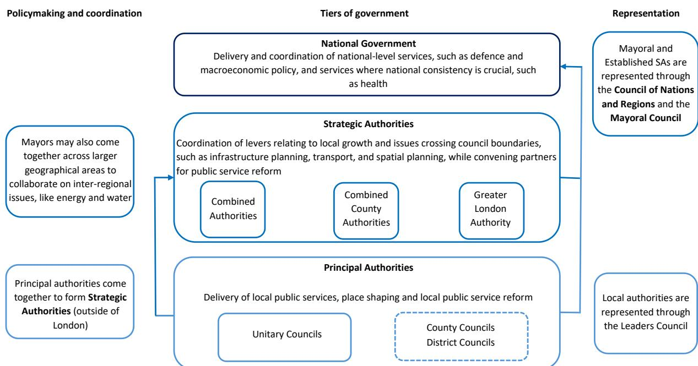  
Source: HM Government (2024[9]).

While the government has committed to universal coverage of Strategic Authorities through the 2024 English Devolution Whitepaper, at present, gaps remain. In many non-metropolitan areas, no strategic tier exists to coordinate local authorities, and institutional capacity varies widely. Established Combined Authorities/Strategic Authorities, such as Greater Manchester and the West Midlands, have developed sophisticated analytical, policy, and delivery teams, enabling them to make better use of devolved powers. Conversely, smaller or newer authorities often face resource constraints and limited technical expertise (HM Government, 2025 $^{[86]}$ ), and without clear incentives and resources, they may struggle to collaborate effectively or to engage with complex mission-based investment programmes. Recent funding arrangements acknowledge these differences to some extent, with the Mayoral Capacity Fund (approximately GBP 45.1 million in 2026–27) supporting staffing, administrative functions, and core capacity across Strategic Authorities, with a baseline allocation and a time-limited uplift for newer institutions reflecting additional setup requirements (HM Government, 2026[87]). However, given the breadth of devolved responsibilities, the sufficiency of this level of support will need to be monitored and evaluated over time. Where necessary, additional, continued and targeted support may be required, particularly for areas at an earlier stage of establishing Strategic Authorities, to help mitigate the risk of widening regional disparities. OECD work on devolution highlights the necessity of local capacity for devolution to translate into improved productivity growth (OECD, 2019[88]). To maximise the benefits of devolution, sustained investment in administrative capacity and technical skills is needed. The government should therefore prioritise training and staffing support to enable better policy planning, evaluation, and local delivery, particularly in lagging areas.

Robust policy evaluation is essential if deeper devolution is to translate into improved regional productivity. This requires enhanced data collection and strengthened performance monitoring to support effective decision making, accountability and peer learning across places. For example, since 2009, Manchester has used independent economic reviews to systematically evaluate its economy, generate evidence-based recommendations and guide local policy and investment decisions (Institute for Government, 2025[89]). The introduction of the Local Outcomes Framework (HM Government, 2026[90]) should help improve the consistency of outcome measurement at the local level for local authorities. For Mayoral Strategic Authorities, outcomes are instead primarily set through central government frameworks, often linked to integrated settlements. This in turn relies on stable institutional arrangements that can sustain evaluation capacity over time. The Devolution and Community Empowerment Act strengthens the institutional foundations for such practices by establishing Strategic Authorities as a statutory tier of governance and setting out the routes and conditions under which they are formed, moving beyond reliance on purely voluntary inter-authority cooperation. By improving role clarity, accountability and durability beyond a single government cycle, statutory Strategic Authorities anchored in clearly defined functional responsibilities can better sustain horizontal collaboration and consistent performance monitoring, supporting long-term productivity gains.

## Box 4.6. Ten guidelines for effective assignment of responsibilities to make decentralisation work

Based on OECD work, ten guiding principles, which apply to all types of countries, have been identified. They are set out below:

1. Clarify the policy areas assigned to different government levels to avoid duplication, waste and accountability.

2. Clarify the functions assigned to different government levels such as financing, regulating, strategic planning, or monitoring.

3. Ensure balance in the way different policy areas and functions are decentralised. This allows complementarity and integrated policy packages for territorial development.

4. Align responsibilities and revenues while enhancing the capacity of subnational governments to manage own resources.

5. Actively support subnational capacity building. More responsibilities at the subnational level need complemented with the human resources to manage them.

6. Build adequate co-ordination mechanisms across levels of government to manage shared responsibility

7. Support cross-jurisdictional co-operation through specific organisational arrangements or financial income to increase efficiency through economies of scale.

8. Allow for asymmetric arrangements and pilot experiences to ensure flexibility in implementation.

<table><tr><td>9. Effective decentralisation requires complementary reforms in land-use governance, citizen participation public service delivery.</td></tr><tr><td>10. Enhance data collection and strengthen performance monitoring to provide useful data for decision n and peer learning.</td></tr><tr><td>Source: OECD (2019[88]; 2021[91]).</td></tr></table>

## 4.3.3. Reforming fiscal frameworks to support sustainable local growth

Effective devolution of powers must be accompanied by adequate and predictable financial resources. In the United Kingdom, local authorities are legally responsible for delivering a wide range of essential public services, including adult and children's social care, education and special educational needs provision, housing and homelessness services, waste management, local transport infrastructure, and public health. These responsibilities place substantial demands on both financial and administrative capacity and are largely statutory in nature, limiting councils' ability to adjust spending in response to fiscal pressures.

Over recent years, these pressures have intensified markedly. Demographic change, particularly population ageing, has driven sustained growth in adult social care demand, while a rising share of children requiring Education, Health and Care Plans (EHCPs) has increased spending on special educational needs and disabilities (SEND). At the same time, inflation has raised operating costs across local services, from staffing to energy and construction, further straining budgets (Figure 4.16). As a result, local authorities have increasingly prioritised demand-led and legally mandated expenditure, including social care, homelessness support, waste disposal and debt servicing, often at the expense of preventive services and growth-enhancing investment (National Audit Office, 2025[78]).

Figure 4.16. Local authorities real available funding remains below 2010 levels  
Real-terms change in local authority spending power, total and per-person  
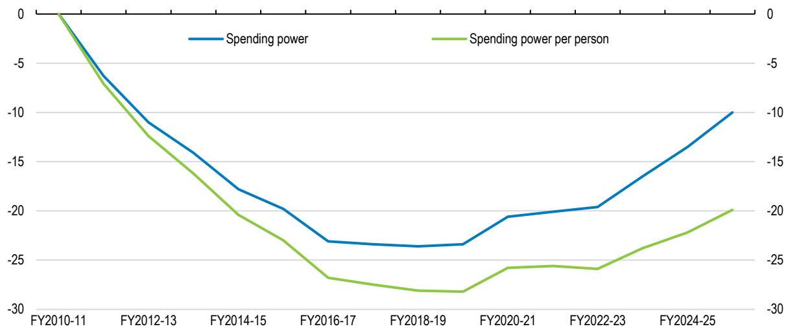  
Note: This excludes 'Other' local authorities - for example, fire authorities, mayoral combined authorities - and shows England only. Available funding refers to the amount of money authorities have to spend from government grants, council tax and business rates outlined in spending plans. Available funding before 2015/16 is an estimate using changes in revenue spending power.  
Source: Institute for Government analysis of MHCLG, 'Core Spending Power table: final local government finance settlement 2025 to 2026', HMT, 'Spending review document', 2025, and ONS, 'Mid-year population estimates', 2024 and ONS, 'Population projections', 2025.

StatLink https://stat.link/e8zvd2

Recognising the scale of these pressures, the government announced in the 2025 Budget that it will fully fund spending on special educational needs and disabilities provision from 2028–29 onwards. Until that point, councils remain responsible for its delivery and costs, but benefit from transitional measures, including continued accounting relief through the Dedicated Schools Grant statutory override and some additional funding (HM Government, 2024[92]). While this reform should significantly reduce fiscal risk over the medium term, it highlights the risk of undermining both service delivery and local growth objectives if further devolution of responsibilities is not accompanied with corresponding adjustments to local financial resources.

The United Kingdom remains one of the most centralised countries in the OECD in fiscal terms. Local governments rely heavily on transfers from central and devolved administrations and raise comparatively little revenue from their own tax and non-tax sources, such as user fees, charges or property income taxes (Figure 4.17). Locally raised revenues from council tax and business rates account for around 18.7% of subnational government revenues, well below the OECD average of 34%. By contrast, grants and subsidies make up approximately 63% of UK subnational revenues, compared with around 40% across the OECD. Similarly, subnational tax revenues represent just 1.7% of GDP and 5.8% of total tax revenues in the United Kingdom, far below OECD averages of 6.9% and 30.9% respectively.

As the support through grants declined since 2010, local authorities' spending power has increasingly come to depend on own-source revenues, which are concentrated on a limited number of taxes (Institute for Government, 2026[93]). In England, Scotland and Wales, local governments are funded primarily through two property taxes: i) a council tax on households and ii) business rates on non-domestic property. In Northern Ireland, these take the form of domestic and non-domestic district rates. In England, councils set council tax rates, but increases are tightly constrained by nationally determined caps and referendum requirements, which in practice limit local discretion. For the purposes of fiscal equalisation and grant allocation, the central government assesses councils' revenue-raising capacity using a notional council tax level set at the national average, rather than actual locally set rates, ensuring full equalisation across authorities. Council tax, however, remains based on property valuations dating back to the early 1990s, and has therefore become increasingly misaligned with current property values and local fiscal capacity, weakening its role as a buoyant and equitable local revenue source; updating property valuations would strengthen the effectiveness of council tax as a local revenue instrument (Chapter 1).

Figure 4.17. Local revenues are limited in the United Kingdom  
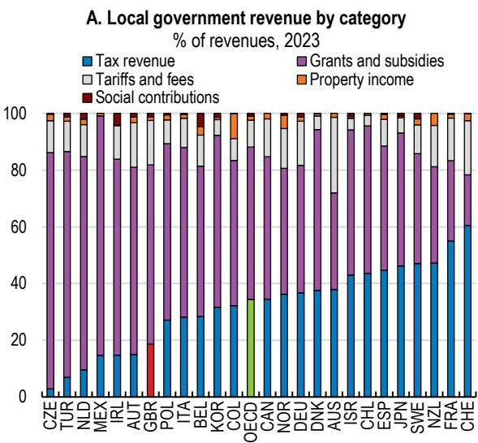

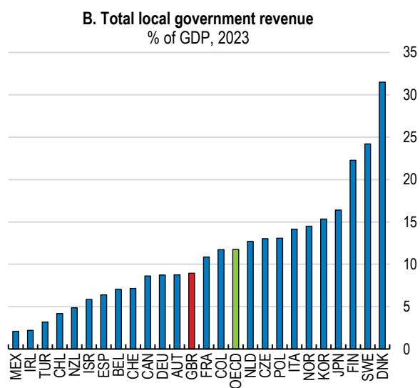

Note: OECD refers to unitary OECD countries. Cross-country comparisons must be interpreted with care, as OECD figures include both own-source taxes and shared taxes. In OECD fiscal statistics, UK devolved governments are treated as part of the central government sector; subnational aggregates therefore largely reflect local authorities. In many countries, subnational governments receive fixed shares of national taxes such as personal income tax or VAT but have limited influence over rates or bases (OECD, 2020[4]). Nevertheless, even accounting for these differences, UK local authorities stand out for their narrow tax base and limited fiscal autonomy.
Source: OECD Subnational Government Structure and Finance Dashboard (database)

StatLink https://stat.link/o7f8t5

Business rates, by contrast, are set nationally and are subject to a system of tariffs and top-ups that equalises resources at the outset and is periodically adjusted through resets and related grant mechanisms, while allowing authorities to retain a share of subsequent growth in receipts. In some areas with devolution deals, “increased business rates retention” arrangements mean that local authorities or combined authorities keep a higher-than-standard share of business rates. In the West of England, for example, the combined authority receives a small share of locally retained growth, whereas in Cornwall and the Liverpool City Region these arrangements sit wholly with the constituent local authorities. Thus, enhanced business rates retention sits mainly at local authority level, with the combined authority tier also receiving a modest share in some areas. As a result, local revenue-raising capacity, which is increasingly important for local finances, varies significantly across places. Announced government plans for increased retention of future business-rates growth in Mayoral Strategic Authorities (HM Government, 2026[53]) could strengthen their local resource base and support the financing of long-term local investment.

In this context, the government has signalled its intention to develop a roadmap for fiscal devolution for Mayoral Strategic Authorities in England (HM Government, 2026[53]), while remaining fiscally neutral at the outset. The government has already taken steps in this direction, including through consulting on providing mayors with the power to introduce an Overnight Visitor Levy and extending the power to introduce a Mayoral Community Infrastructure Levy to all mayors. Successful implementation would represent a meaningful step towards better aligning local responsibilities with local resources and gradually reducing the high dependence on central transfers. As outlined by the Treasury, the roadmap would explore options over time for assigning a defined share of national tax revenues to Mayoral Strategic Authorities, initially focussing on areas with stronger administrative and delivery capacity. This approach is consistent with OECD guidance, which emphasises the importance of stable, growth-linked local tax bases, such as recurrent property taxes and sub-national income taxes, to support effective fiscal decentralisation (OECD, 2021[91]). As local governance structures are streamlined, the government should ensure that revenue-raising powers across different tiers of local and regional government are progressively strengthened and better aligned, while maintaining national fiscal discipline.

Many OECD countries face challenges when it comes to aligning responsibilities and revenues, as subnational expenditure generally exceeds subnational own-source revenues (tax and non-tax revenues such as user charges, fees and revenues from assets), resulting in a vertical fiscal gap that is filled by transfers and subsidies. Comparing the share of subnational expenditure in total public spending with the share of subnational tax revenues in total tax revenues allows to assess the level of vertical fiscal imbalances (OECD, 2019[88]). In the United Kingdom, this gap is particularly pronounced, reflecting both extensive service responsibilities at the local level combined with limited fiscal autonomy (Figure 4.18).

The UK government has taken important steps in modernising the local government finance system in England. Funding formulas were not fully updated for over a decade, and underlying data and assumptions failed to keep pace with demographic and social change resulting in an increasingly misaligned system. The government updated in 2025 its assessments of councils' spending needs and their revenue-raising capacity through the "Fair Funding Review 2.0" and "Provisional Settlement" aiming to more closely align allocations with demographic pressures, deprivation and service cost drivers (Box 4.7) (HM Government, 2025[94]). The reforms consolidate many smaller grants into larger formula-based allocations, reset the business rates retention system allowing councils to keep a recalculated share of local business taxes based on updated assessments of their capacity and needs, and introduce three-year funding certainty, which is welcome as it improves councils' ability to plan.

Figure 4.18. Vertical fiscal imbalances are large in the United Kingdom  
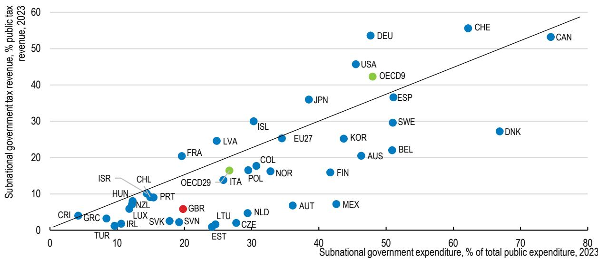  
Note: OECD9 refers to federal and quasi-federal OECD countries: Australia, Austria, Belgium, Canada, Germany, Mexico, Spain, Switzerland and United States. OECD29 refers to unitary countries and includes the remaining OECD countries who are not considered federal and quasi-federal. Source: OECD Subnational Government Structure and Finance Dashboard (database).

## StatLink https://stat.link/kb5qo8

While these reforms represent an important step forward, they are unlikely to resolve all underlying vulnerabilities. Even after redistribution, allocations may still deviate from assessed needs because of outdated data, formula design choices and transitional protections, suggesting that some councils may continue to struggle. Analysis by the Institute for Fiscal Studies suggests that, even under the new system, allocations could still deviate by 10–15% from assessed needs due to data limitations and constrained redistribution, potentially leaving some high-need urban authorities worse off while more affluent areas gain (IFS, 2025[95]; IFS, 2025[96]). Furthermore, core funding increases still depend heavily on assumed council tax increases, which may not be feasible or equitable in all areas leading to larger gaps between revenues and expenditure. Continuous monitoring, ongoing recalibration of funding formulas to incorporate updated data are needed to ease adjustments and ensure all councils maintain core service capacity.

In complement to the update of central transfers, the system of grants accessible for English local governments is being reformed. Over the past decade, the grant system has not only been complex and fragmented, with a large share of funding having been delivered through short-term, ring-fenced and silo-based grants, but also declined in terms of allocated amounts. This has limited local discretion, weakened accountability, and undermined long-term financial planning (OECD, 2020[6]). It is therefore welcome that this fragmented grant system is being streamlined, partially by merging grants within the new transfer formula, as well as in new and a reduced number of grants. For example, the integrated settlement provides a funding mechanism that brings together multiple existing funding streams into a single, more flexible settlement for established Mayoral Strategic Authorities, supporting more strategic and coordinated use of resources. The government has also announced GBP 2.3 billion in City Investment Funds for mayoral authorities, which provide a more predictable multiyear capital envelope for infrastructure and regeneration projects, helping to reduce reliance on fragmented competitive bidding (HM Government, 2026[53]). Complementing these efforts, the 2025 Pride in Place programme was launched as a community-driven urban regeneration and renewal initiative, aiming to channel up to GBP 5.8 billion over ten years into community high streets, public spaces, and neighbourhood improvements across hundreds of communities (HM Government, 2025[97]). The programme demonstrates a shift towards place-based funding and a recognition of the need to empower local communities and neighbourhoods to invest in long-term regeneration. Streamlining the system of grants available for local authorities in England is welcome and has been recommended in previous Economic Surveys (OECD, 2022[18]). The government should however ensure that the streamlining of grants remains broadly neutral, both in terms of funding available for local authorities, while also monitoring potential effects on grants available for local and subnational government in devolved nations.

Going forward, the government should ensure that increasing devolution and governance reforms are met with sufficient funding. Gradually increasing local fiscal flexibility within a fiscally neutral framework, while maintaining robust equalisation across regions, could help reduce local authorities' dependence on central transfers without increasing overall tax burdens. At the same time, equalisation systems should encourage local growth efforts while protecting lower-income areas from being unfairly penalised. Capacity building, especially in financial management, project appraisal, and long-term planning should complement ongoing devolution to ensure that devolved institutions can use any new resources effectively.

## Box 4.7. Local government funding reform in England

Following the Fair Funding Review 2.0 in 2025, the government is introducing a new framework for allocating core funding across English councils, with the aim of better aligning resources with local needs and revenue-raising capacity while managing large distributional changes.

Key elements of the reform are:

\- Updated assessment of spending needs: Each council's relative spending needs will be recalculated using new formulas that reflect differences in demand for services and the cost of delivery.

\- Revised assessment of local revenue capacity: Councils' ability to raise council tax will be measured using modelled revenues, assuming all councils set tax rates at the national average.

\- Full equalisation of funding: Most central government grant funding will be allocated so that, at average council tax rates, each council receives a share of total funding consistent with its assessed needs, based on demographic and service-cost indicators, regardless of local tax base.

\- Redistribution of business rates growth: Business rates growth accumulated since 2013–14 will be fully redistributed based on updated needs assessments. Councils will then retain future growth from 2026–27 until the next system reset.

\- Phased implementation and protections: Changes will be phased in over three years from 2026–27, with funding floors to limit losses for councils facing reductions under the new system.

Source: Institute for fiscal studies (IFS, 2025[98]); (HM Government, 2025[97]).

Table 4.3. Past recommendations on raising local authorities' funds

<table><tr><td>Past recommendations</td><td>Actions taken since last Survey</td></tr><tr><td>Evaluate longer-term funding needs in accordance with the levelling up missions’ timeline.</td><td>Shift towards a new framework of central missions and long-term integrated funding settlements for local areas.</td></tr><tr><td>Consider devolving business property tax revenues to all local authorities in the longer term.</td><td>No action taken.</td></tr><tr><td>Set out a clear timeline and conditions for the devolution of business rates to local authorities.</td><td>No action taken.</td></tr></table>

## 4.3.4. Strengthening governance quality, trust and integrity to improve local delivery

Greater fiscal and administrative devolution offers the potential to strengthen community engagement in shaping places, an important component of creating attractive, productive local and regional environments. Fostering liveable spaces is central to attracting and retaining talent and businesses. The government has signalled an intention to enhance public engagement and community voice as part of governance reforms. However, public trust in, and understanding of, local government remains comparatively low (Parliamentary Office of Science and Technology, 2025[85]). Only around $35\%$ of respondents report high or moderately high trust in local government, and while higher than trust in national government, it is still significantly below the

OECD average of approximately 45% (Figure 4.19, Panel A). Low trust can weaken civic participation and reduce the legitimacy of local decision-making, potentially undermining efforts to develop place-based strategies for growth.

Figure 4.19. Trust in government has declined over time  
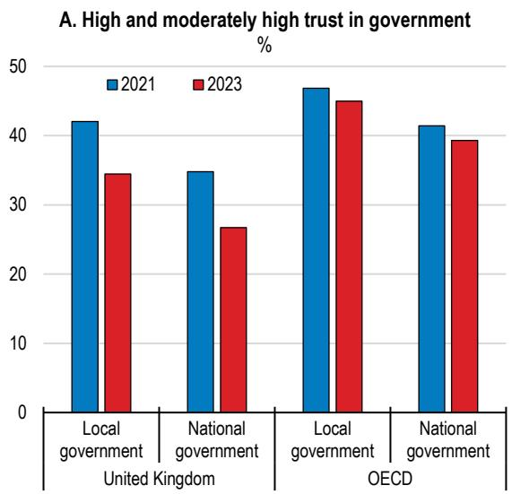

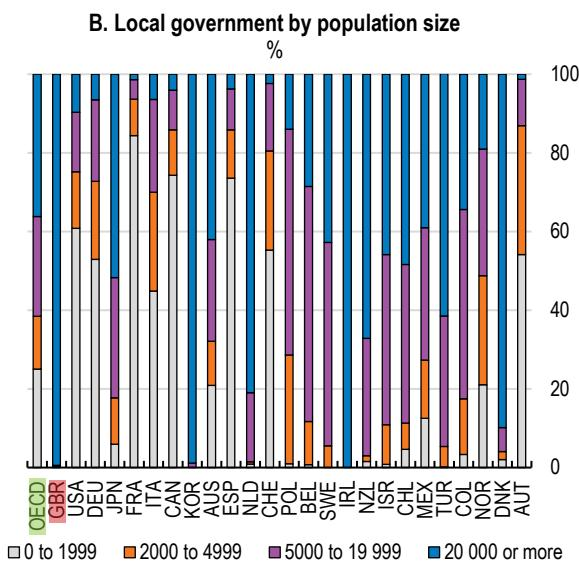  
Source: OECD Government at a Glance (database); and OECD Subnational Government Structure and Finance Dashboard (database).  
StatLink https://stat.link/yoj3aq

The move towards larger Strategic Authorities and consolidated unitary structures as detailed in the 2024 English Devolution White Paper may improve administrative efficiency but also risks distancing local government from communities. Already, local authorities in the United Kingdom are larger in terms of population than international peers (Figure 4.19, Panel B), and new unitary councils are planned to generally cover a population of 500 000 or more. Larger authorities typically have fewer councillors per capita and fewer tiers of democratic representation, which could weaken channels for citizen voice. While proposals to retain and strengthen town and parish councils aim to preserve local fora for engagement, it remains unclear how public trust and accountability will be maintained under broader governance consolidation. The government should support local-level integrity through strengthened monitoring of relevant commitments in the National Anti-Corruption Strategy and extend anti-fraud measures across all levels of government to accompany governance consolidation.

Local governance quality is also tightly linked to the integrity of public institutions, which in turn affects business dynamism and productivity. Because governance frameworks and standards are set and enforced across all levels of government, weaknesses at the national level can generate important spillovers for subnational and local delivery. Strong institutional integrity reduces uncertainty, supports fair competition, and encourages investment and innovation, which are all essential for productivity growth. On international governance indicators, the United Kingdom continues to rank relatively well on measures of control of corruption, but recent trends in perception-based indexes show some deterioration (Figure 4.20).

The UK Anti-Corruption Strategy 2025 builds on the 2017–2022 strategy and sets out the government's latest comprehensive approach to tackling corruption domestically and internationally over the coming years (HM Government, 2025[99]). Although the strategy was not subject to a formal public consultation, it sets out a wide range of strategic objectives. It recognises that corruption risks extend beyond central government, highlighting vulnerabilities in public procurement, political finance and public sector integrity at local level. To address these risks the strategy commits to strengthening prevention, detection and enforcement among all tiers of government through measures, such as expanding specialist policing capacity, improving standards and training, and tightening safeguards around public spending and procurement. These measures are directly relevant to local authorities as their responsibilities expand, and funding arrangements become more complex. The strategy also commits to provide funding to civil society and investigative journalists, with a particular focus on the local level, to strengthen their ability to expose corruption and illicit finance risks. Such measures to enhance public oversight are important as the potential for reduced engagement and visibility between citizens and larger Strategic Authorities can increase exposure to governance and corruption risks, especially in areas such as procurement, planning, and discretionary grant allocation. The UK Government intends to develop its monitoring and evaluation framework to ensure that the strategy's initiatives achieve their objectives. This framework should include clear outcome-level indicators to assess implementation, which at present are missing. Outlined plans for a mandatory local government code of conduct, and a new Local Audit Office should be swiftly assessed and implemented to enhance oversight of subnational public finances.

The United Kingdom has also introduced initiatives to reduce fraud and waste across the public sector, including at the subnational level. A new “failure to prevent fraud offence” came into force in September 2025, designed to encourage organisations to build an anti-fraud culture and move towards implementing prevention procedures. Under this offence, specified organisations may be held criminally liable if an employee, agent, subsidiary, or other “associated person” commits a fraud intended to benefit the organisation or its clients, and the organisation lacked reasonable fraud prevention procedures. The UK Public Sector Fraud Authority (PSFA) is leading the implementation of these anti-fraud efforts. It has developed an AI powered tool that enables public officials to generate draft Fraud Risk Assessments using Large Language Models. Based on uploaded material, such as guidance documents or government grant scheme briefs, the tool identifies fraud risks by actor, action, and outcome, allowing qualified fraud risk assessors to develop more effective assessments. The UK government should continue to prioritise such measures and to extend implementation across the public sector, including at the subnational level.

The United Kingdom shows relatively strong institutional engagement in integrity and anti-corruption frameworks compared with many OECD countries, but has acknowledged there is still scope to reinforce conflict-of-interest and lobbying rules and their enforcement (Ethics and Integrity Commission, 2026[100]). For example, the OECD Anti-Corruption and Integrity Outlook 2026 highlighted that the UK fulfils $56\%$ of OECD criteria on the strength of conflict-of-interest regulations, and $22\%$ on practice compared to the OECD average of $80\%$ and $45\%$ , respectively (OECD, 2026[101]). Strengthening these safeguards could bolster confidence in governance at all levels, including local government, and contribute to a more predictable and fair business environment. Making elements of the Ministerial Code legally enforceable through instruments like a deed of undertaking to also cover conflicts of interest during the term of appointment as outlined in the previous Economic Survey (OECD, 2024[1]) are not yet formalised within the 2025 anti-corruption strategy. It should be considered to introduce liability for conflict-of-interest violations more broadly as recommended in the previous survey.

Figure 4.20. Control of corruption remains high by OECD standards but has weakened  
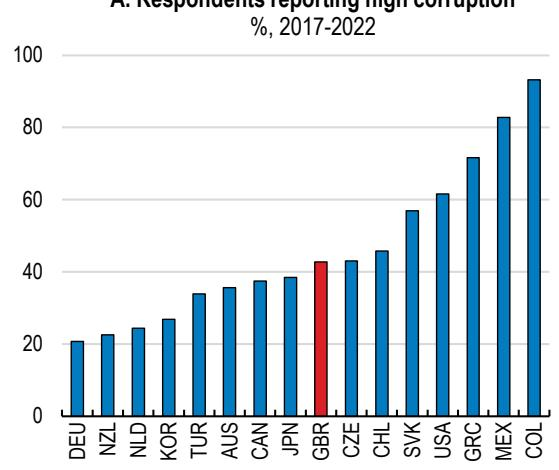

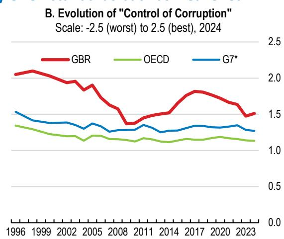

C. OECD Public Integrity Indicators
% of criteria, 2025  
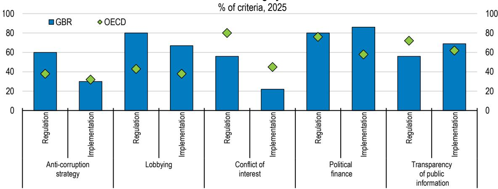

D. Accountability of public policy making  
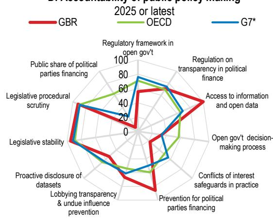

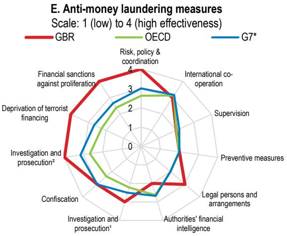

Note: Panel A shows the share of respondents answering 8-10 to the following survey question: "Now I'd like you to tell me your views on corruption – when people pay a bribe, give a gift or do a favour to other people in order to get the things they need done or the services they need. How would you place your views on corruption in your country on a 10-point scale where '1' means 'there is no corruption in my country' and '10' means 'there is abundant corruption in my country'?" Panel C: Data for the United Kingdom was not available for the categories of judicial integrity, prosecutorial integrity and disciplinary system. Panels B, D & E: G7\* is a simple average of G7 countries excluding the United Kingdom. Panel E shows ratings from the FATF peer reviews of each member to assess levels of implementation of the FATF Recommendations. The ratings reflect the extent to which a country's measures are effective against 11 immediate outcomes. "Investigation and prosecution" refers to money laundering. "Investigation and prosecution" refers to terrorist financing.

Source: Panel A: World Values Survey (database); Panel B: World Bank Worldwide Governance Indicators (database); Panels C & D: OECD Public Integrity indicators (database); and OECD, Financial Action Task Force (FATF).

StatLink https://stat.link/4zl837

Recommendations to reduce regional productivity disparities

<table><tr><td>MAIN FINDINGS</td><td>RECOMMENDATIONS (Key recommendations in bold)</td></tr><tr><td colspan="2">Tackling structural drivers of regional disparities</td></tr><tr><td colspan="2">Strengthening local skill systems</td></tr><tr><td>The share of young people not in employment, education or training is above the OECD average in all English regions. While reforms to strengthen school-to-work transitions are important, regions with high NEET rates face capacity and employer-engagement constraints.</td><td>Provide targeted, additional support to regions with high NEET rates to strengthen local implementation capacity, expand access to high-quality training and employment opportunities, and deepen engagement with local employers and delivery partners.</td></tr><tr><td>Skills England is improving coordination in the skills system, but further development of labour market intelligence and stronger alignment with national and regional economic priorities are needed to ensure that training provision supports productivity growth.</td><td>Continue to develop and refine Skills England&#x27;s labour market data and skills mapping to strengthen evidence-based monitoring and evaluation.</td></tr><tr><td>The planned Lifelong Learning Entitlement increases flexibility in post-18 learning, but effective uptake will depend on provider readiness alongside clearer frameworks for modular provision, credit recognition and learner information.</td><td>Strengthen transparency and comparability of modular and short-course offers through clearer qualification frameworks, improved information and guidance for learners, and stronger links to labour-market needs, while ensuring institutions have sufficient capacity to adapt provision across regions.Set up a system to monitor regional course quality, availability, and uptake, while boosting outreach and guidance for low-qualified adult learners.</td></tr><tr><td colspan="2">Strengthening physical and digital connectivity</td></tr><tr><td>Transport infrastructure investment has been disproportionately concentrated in London, reinforcing its agglomeration advantages while limiting connectivity gains elsewhere.</td><td>Ensure capital spending targets long-standing transport connectivity gaps in lagging areas and aligns with regional economic strategies, housing supply, and local transport integration.</td></tr><tr><td>Digital infrastructure gaps persist, especially in rural and remote areas, limiting firms&#x27; ability to adopt productivity-enhancing technologies.</td><td>Close remaining high-speed broadband coverage gaps in rural and lagging areas and ensure supports emerging technologies.</td></tr><tr><td colspan="2">Broadening regional innovation and accelerate diffusion of new technologies</td></tr><tr><td>Uneven adoption of digital technologies among SMEs, particularly outside London and the South East, slows productivity diffusion within and across regions.</td><td>Develop an integrated programme to guide SMEs through progressive levels of digital maturity, combining tailored advisory services, targeted financial incentives, and sector-specific resources.</td></tr><tr><td>Local initiatives to strengthen digital diffusion have been particularly effective when embedded in wider local ecosystems.</td><td>Strengthen local ecosystems by linking digital adoption initiatives with skills development, management support, trusted advisory services and appropriate financing instruments.</td></tr><tr><td>Innovation activity and R&amp;D are concentrated in the Greater Southeast limiting spillovers and weakening the translation of research into productivity gains in lagging regions.</td><td>Integrate targeted innovation support programmes into longer-term regional development strategies to provide certainty for local actors and investors, prioritising regions with untapped innovation potential and lagging performance.</td></tr><tr><td>Risk finance is heavily concentrated in London and the Greater South East, constraining firm growth, scaling, and the local retention of innovation in other regions.</td><td>Expand targeted loan guarantees and co-investment funds, strengthen local financial intermediaries to address early and scale up stage gaps in lagging regions.Enhance SME financial literacy through local business support networks.</td></tr><tr><td colspan="2">Improving the financial and administrative capacity of local governments</td></tr><tr><td>Cross-departmental cooperation has proven challenging in the past due to unclear responsibilities and short-term planning, particularly when missions cut across strong departmental boundaries.</td><td>Ensure mission strategies are supported by clear delivery responsibilities, long-term resources and mechanisms that last beyond election cycles.</td></tr><tr><td>Weak and fragmented evaluation of regional policies limits accountability, learning and effective reallocation of resources.</td><td>Create a cross-government framework to monitor and evaluate policy outcomes and encourage shared learning across departments and levels of governments.</td></tr><tr><td>Devolution plans envision a more consistent structure for regional and local governments, but institutional capacity varies widely.</td><td>Prioritise training and staffing support to enable better policy planning, evaluation, and local delivery, particularly in lagging areas.</td></tr><tr><td>Local spending power has improved over recent years but remains below 2010 levels. Councils remain heavily reliant on shrinking central grants and devolution plans do not envision expanding tax rising powers.</td><td>Gradually increase the ability of local authorities to finance their responsibilities from own-source revenues within a fiscally neutral framework, while maintaining robust equalisation across regions to protect lower-income areas.</td></tr><tr><td>Local governance consolidation towards authorities with larger populations could weaken channels for citizen voice, reduce political visibility, and weaken informal oversight.</td><td>Support local-level integrity through strengthened monitoring of relevant commitments in the National Anti-Corruption Strategy and extend anti-fraud measures across all levels of government.</td></tr></table>

## References

British Business Bank (2025), Five-year Strategic Plan, https://www.british-business-bank.co.uk/sites/g/files/sovrnj166/files/2025-11/five-year-strategic-plan-report-2025\_0.pdf.

[75]

British Business Bank (2025), Nations and Regions Tracker - Small Business Finance Markets 2025, https://www.british-business-bank.co.uk/sites/g/files/sovrnj166/files/2025-10/nations-and-regions-tracker-report-2025.pdf.

[74]

Britton, J. et al. (2021), London calling? Higher education, geographical mobility and early-career earnings, Institute for Fiscal Studies, https://ifs.org.uk/sites/default/files/output\_url\_files/Higher-education-geographical-mobility-and-early-career-earnings.pdf.

[31]

CoR (2025), Italy - Systems of multilevel governance, https://portal.cor.europa.eu/divisionpowers/Pages/Italy-Systems-of-multilevel-governance.aspx.

[103]

Department for Science, Innovation and Technology (2026), Free AI training for all as government and industry programme expands to provide 10 million workers with key AI skills by 2030, https://www.gov.uk/government/news/free-ai-training-for-all-as-government-and-industry-programme-expands-to-provide-10-million-workers-with-key-ai-skills-by-2030.

[105]

Department for Science, Innovation and Technology (2025), AI to power national renewal as government announces billions of additional investment and new plans to boost UK businesses, jobs and innovation, https://www.gov.uk/government/news/ai-to-power-national-renewal-as-government-announces-billions-of-additional-investment-and-new-plans-to-boost-uk-businesses-jobs-and-innovation.

[60]

Department for Science, Innovation and Technology (DSIT) (2026), Assessment of AI capabilities and the impact on the UK labour market, https://www.gov.uk/government/publications/assessment-of-ai-capabilities-and-the-impact-on-the-uk-labour-market/assessment-of-ai-capabilities-and-the-impact-on-the-uk-labour-market.

[55]

DSIT (2026), AI Opportunities Action Plan: dashboard, https://www.gov.uk/government/publications/ai-opportunities-action-plan-dashboard.

[58]

DSIT (2026), Barnsley becomes UK's first government backed Tech Town, https://www.gov.uk/government/news/barnsley-becomes-ups-first-government-backed-tech-town.

[62]

DSIT (2026), More than 3,400 jobs and targeted support for local communities to help tackle the cost of living as Lanarkshire named latest AI Growth Zone, https://www.gov.uk/government/news/more-than-3400-jobs-and-targeted-support-for-local-communities-to-help-tackle-the-cost-of-living-as-lanarkshire-named-latest-ai-growth-zone.

[61]

DSIT (2025), AI Opportunities Action Plan. Independent report,, https://www.gov.uk/government/publications/ai-opportunities-action-plan/ai-opportunities-action-plan.

[57]

DSIT and Number 10 Data Science (2026), AI Opportunities Action Plan – 2026 progress, https://delivery.ai.gov.uk/.

Ethics and Integrity Commission (2026), EIC Review into lobbying, disclosure and access to government, https://eic.independent-commission.uk/wp-content/uploads/2026/03/2026-03-23-LBD-TORs-Headed.pdf.

[100]

European Commission (2025), Regional Skills Partnerships foster collaboration and boost regional skills development, https://pact-for-skills.ec.europa.eu/about/news-and-factsheets/regional-skills-partnerships-foster-collaboration-and-boost-regional-skills-development-2025-02-19\_en.

[35]

European Commission (2024), Pact for Skills celebrates its fourth anniversary and two new regional partnerships, https://pact-for-skills.ec.europa.eu/about/news-and-factsheets/pact-skills-celebrates-its-fourth-anniversary-and-two-new-regional-partnerships-2024-11-08\_en.

[36]

Filippucci, F. et al. (2025), "Macroeconomic productivity gains from Artificial Intelligence in G7 economies", OECD Artificial Intelligence Papers, No. 41, OECD Publishing, Paris, https://doi.org/10.1787/a5319ab5-en.

[54]

Hilber, C. and T. Lyytikäinen (2017), Stamp duty, mobility and the UK housing crisis, Centre for Economic Performance, LSE, https://cep.lse.ac.uk/pubs/download/cp516.pdf.

[38]

HM Government (2026), Explanatory note on Mayoral Strategic Authority funding 2026 to 2027: final, Ministry of Housing, Communities & Local Government, https://www.gov.uk/government/publications/explanatory-note-on-mayoral-strategic-authority-funding-2026-to-2027-final/explanatory-note-on-mayoral-strategic-authority-funding-2026-to-2027-final#mayoral-capacity-funding.

HM Government (2026), Local Outcomes Framework, Ministry of Housing, Communities and Local Government, https://www.gov.uk/government/publications/local-outcomes-framework/local-outcomes-framework.

HM Government (2026), Mais Lecture 2026, HM Treasury; The Rt Hon Rachel Reeves MP, https://www.gov.uk/government/speeches/mais-lecture-2026.

HM Government (2026), Major employment drive to help unlock 200,000 new jobs and apprenticeships for next generation, Department for Work and Pensions, https://www.gov.uk/government/news/major-employment-drive-to-help-unlock-200000-new-jobs-and-apprenticeships-for-next-generation.

HM Government (2026), Young people and work: interim report, Department for Work & Pensions, [17] https://www.gov.uk/government/publications/young-people-and-work-interim-report/young-people-and-work-interim-report.

HM Government (2025), A blueprint for modern digital government, Department for Science, Innovation & Technology; Government Digital Service, https://www.gov.uk/government/publications/a-blueprint-for-modern-digital-government/a-blueprint-for-modern-digital-government-html.

HM Government (2025), Almost a million young people to benefit from expanded support, new training, and work experience opportunities, Department for Work and Pensions, https://www.gov.uk/government/news/almost-a-million-young-people-to-benefit-from-expanded-support-new-training-and-work-experience-opportunities. [22]

HM Government (2025), Changes to apprenticeship assessment, 2025 to 2026, Department for Education, https://www.gov.uk/government/publications/apprenticeship-funding-rules-2025-to-2026/changes-to-apprenticeship-assessment-2025-to-2026.

HM Government (2025), December 2025: Premises contracted and built under Project Gigabit contracts, Building Digital UK, https://www.gov.uk/government/publications/premises-contracted-and-built-project-gigabit-contracts/december-2025-premises-contracted-and-built-under-project-gigabit-contracts. [48]

HM Government (2025), Early years foundation stage profile results - Academic Year 2024-25, Department for Education, https://explore-education-statistics.service.gov.uk/find-statistics/early-years-foundation-stage-profile-results/2024-25. [10]

HM Government (2025), Easy explainer: early years funding rates, Education & Skills Funding Agency; [12] Department for Education, https://www.gov.uk/government/publications/early-years-funding-2025-to-2026/easy-explainer-early-years-funding-rates.

HM Government (2025), Employer Skill Survey 2024, Department for Education, https://www.gov.uk/government/statistics/employer-skills-survey-2024.

HM Government (2025), Giving every child the best start in life, Department for Education, [11] https://www.gov.uk/government/publications/giving-every-child-the-best-start-in-life/giving-every-child-the-best-start-in-life#improving-quality-in-early-years-including-reception.

HM Government (2025), Landmark Planning and Infrastructure Bill becomes law, Ministry of Housing, Communities and Local Government, https://www.gov.uk/government/news/landmark-planning-and-infrastructure-bill-becomes-law. [46]

HM Government (2025), Lifelong learning entitlement: what it is and how it will work, Department for Education, https://www.gov.uk/government/publications/lifelong-learning-entitlement-Ile-overview/lifelong-learning-entitlement-overview. [29]

HM Government (2025), Local authority planning capacity and skills survey: 2023 findings, Ministry of Housing, [86] Communities and Local Government, https://www.gov.uk/government/publications/local-authority-planning-capacity-and-skills-survey-2023-findings.

HM Government (2025), Local government finance policy statement 2026-27 to 2028-29, Ministry of Housing, Communities & Local Government, https://www.gov.uk/government/publications/local-government-finance-policy-statement-2026-27-to-2028-29/local-government-finance-policy-statement-2026-27-to-2028-29.

HM Government (2025), National Infrastructure and Service Transformation Authority, National Infrastructure and Service Transformation Authority, https://www.gov.uk/government/organisations/national-infrastructure-and-service-transformation-authority/about. [47]
HM Government (2025), NEET age 16 to 24 - Calendar year 2024, Department for Education, https://explore-education-statistics.service.gov.uk/find-statistics/neet-statistics-annual-brief/2024. [16]
HM Government (2025), Project Gigabit progress update – April 2024, Building Digital UK, https://www.gov.uk/government/publications/project-gigabit-progress-update-april-2024/project-gigabit-progress-update-april-2024. [49]
HM Government (2025), Skills England - What we do, Skills England, https://www.gov.uk/government/organisations/skills-england/about. [27]
HM Government (2025), SME Digital Adoption Taskforce: final report, Department for Business and Trade, https://www.gov.uk/government/publications/sme-digital-adoption-taskforce-final-report. [63]
HM Government (2025), Technology Adoption Review, Department for Business and Trade, Department for Science, Innovation and Technology; HM Treasury, https://assets.publishing.service.gov.uk/media/6857e0995225e4ed0bf3ceb5/dsit technology adoption review web.pdf. [52]
HM Government (2025), The Fair Funding Review 2.0, Ministry of Housing, Communities & Local Government, https://www.gov.uk/government/consultations/the-fair-funding-review-20/the-fair-funding-review-20. [94]
HM Government (2025), The UK's Modern Industrial Strategy 2025, Department for Business and Trade, https://www.gov.uk/government/collections/the-uks-modern-industrial-strategy-2025. [7]
HM Government (2025), UK anti-corruption strategy 2025, Home Office, https://www.gov.uk/government/publications/uk-anti-corruption-strategy-2025. [99]
HM Government (2025), UK Infrastructure: A 10 Year Strategy, HM Treasury; National Infrastructure and Service Transformation Authority, https://www.gov.uk/government/publications/uk-infrastructure-a-10-year-strategy. [45]
HM Government (2025), Understanding technology adoption among UK SMEs, Department for Business and Trade, https://www.gov.uk/government/publications/understanding-technology-adoption-among-uk-smes. [64]
HM Government (2024), English Devolution White Paper, Ministry of Housing, Communities & Local Government, https://www.gov.uk/government/publications/english-devolution-white-paper-power-and-partnership-foundations-for-growth/english-devolution-white-paper. [9]
HM Government (2024), Local government finance policy statement 2025 to 2026, Ministry of Housing, Communities & Local Government, https://www.gov.uk/government/publications/local-government-finance-policy-statement-2025-to-2026/local-government-finance-policy-statement-2025-to-2026. [92]
HM Government (2024), Plan for Change - Milestones for Mission-Led Government, Prime Minister's Office, https://www.gov.uk/missions. [8]
HM Government (2023), UK Innovation Strategy: leading the future by creating it, Department for Science, Innovation & Technology; Department for Business, Energy & Industrial Strategy, https://www.gov.uk/government/publications/uk-innovation-strategy-leading-the-future-by-creating-it/uk-innovation-strategy-leading-the-future-by-creating-it-accessible-webpage. [70]
HM Government (2021), Integrated Rail Plan for the North and Midlands, Department for Transport, https://www.gov.uk/government/publications/integrated-rail-plan-for-the-north-and-the-midlands. [42]
HM Government (2021), Transport decarbonisation plan, Department for Transport, https://www.gov.uk/government/publications/transport-decarbonisation-plan. [41]
House of Commons Committee of Public Accounts (2024), Cross-government working - Twelfth Report of Session 2023–24, https://committees.parliament.uk/publications/43286/documents/215470/default/. [79]
House of Commons Library (2026), Youth Guarantee, https://researchbriefings.files.parliament.uk/documents/CBP-10827/CBP-10827.pdf. [20]
House of Commons Library (2025), High Speed Rail (Crewe - Manchester) Bill 2024-25, https://researchbriefings.files.parliament.uk/documents/CBP-10066/CBP-10066.pdf. [44]

House of Commons Library (2024), High Speed Rail 2: An overview, https://researchbriefings.files.parliament.uk/documents/CBP-9313/CBP-9313.pdf. [43]
IFS (2026), Annual report on Education Spending in England 2025-2026, https://ifs.org.uk/sites/default/files/2026-01/IFS-annual-report-on-education-spending-in-England-2025%E2%80%9326.pdf. [14]
IFS (2025), An immediate response to announced changes to government plans for reform of the local government funding system in England, https://ifs.org.uk/articles/immediate-response-local-government-finance-policy-statement. [96]
IFS (2025), Annual report on education spending in England: 2024–25, https://ifs.org.uk/sites/default/files/2025-01/IFS-REPORT-EDUCATION-SPENDING-2024-2025.1.pdf. [13]
IFS (2025), Fair Funding Review 2.0: the impacts on council funding across England, https://ifs.org.uk/publications/fair-funding-review-20-impacts-council-funding-across-england. [95]
IFS (2025), Government confirms big redistribution of funding to more urban and more deprived councils in England, https://ifs.org.uk/articles/government-confirms-big-redistribution-funding-more-urban-and-more-deprived-councils. [98]
Institute for Government (2026), Local government funding in England, https://www.instituteforgovernment.org.uk/explainer/local-government-funding-england. [93]
Institute for Government (2025), Making devolution work - Local economic plans, https://www.instituteforgovernment.org.uk/sites/default/files/2025-06/making-devolution-work-local-economic-plans.pdf. [89]
International AI Safety Report (2026), International AI Safety Report 2026, https://internationalaisafetyreport.org/sites/default/files/2026-02/international-ai-safety-report-2026\_1.pdf. [56]
Mahmood, S., N. Asghar and K. Kousha (2024), Investigating Disparities in SMEs Digitalisation, ERC Research Paper, https://www.enterpriseresearch.ac.uk/wp-content/uploads/2024/10/ERC-ResPap111-Investigating-Disparities-in-SMEs-Digitalisation-Mahmood-Asghar-Kousha-Revised.pdf. [51]
National Audit Office (2025), Local government financial sustainability, https://www.nao.org.uk/wp-content/uploads/2025/02/local-government-financial-sustainability.pdf. [78]
OBR (2025), Economic and fiscal outlook - March 2025, https://obr.uk/efo/economic-and-fiscal-outlook-march-2025/. [39]
OECD (2026), Anti-Corruption and Integrity Outlook 2026: Harnessing the Integrity Advantage, OECD Publishing, https://doi.org/10.1787/16708b78-en. [101]
OECD (2026), PMR economy wide indicators 2023, https://www.oecd.org/en/topics/product-market-regulation.html. [73]
OECD (2025), Education at a Glance 2025: OECD Indicators, OECD Publishing, Paris, https://doi.org/10.1787/1c0d9c79-en. [15]
OECD (2025), OECD Economic Surveys: Germany 2025, OECD Publishing, Paris, https://doi.org/10.1787/39d62aed-en. [68]
OECD (2025), Trends in Adult Learning: New Data from the 2023 Survey of Adult Skills, Getting Skills Right, OECD Publishing, Paris, https://doi.org/10.1787/ec0624a6-en. [28]
OECD (2024), “Designing Effective Governance to Enable Mission Success”, OECD Science, Technology and Industry Policy Papers, No. 168, OECD Publishing, Paris, https://doi.org/10.1787/898bca89-en. [82]
OECD (2024), Do Adults Have the Skills They Need to Thrive in a Changing World?: Survey of Adult Skills 2023, OECD Skills Studies, OECD Publishing, Paris, https://doi.org/10.1787/b263dc5d-en. [25]
OECD (2024), OECD Economic Surveys: United Kingdom 2024, OECD Publishing, Paris, https://doi.org/10.1787/709e70b8-en. [1]
OECD (2024), Regional Governance and Public Investment in Wales, United Kingdom: Moving Forward Together, OECD Multi-level Governance Studies, OECD Publishing, Paris, https://doi.org/10.1787/e143e94d-en. [76]

OECD (2023), Flexible adult learning provision: What it is, why it matters, https://www.oecd.org/content/dam/oecd/en/topics/policy-sub-issues/adult-learning/booklet-flexibility-2023.pdf.

[30]

OECD (2023), OECD Public Governance Reviews: Czech Republic: Towards a More Modern and Effective Public Administration, OECD Public Governance Reviews, OECD Publishing, Paris, https://doi.org/10.1787/41fd9e5c-en.

[102]

OECD (2022), Anticipatory Innovation Governance Model in Finland: Towards a New Way of Governing, OECD Public Governance Reviews, OECD Publishing, Paris, https://doi.org/10.1787/a31e7a9a-en.

[81]

OECD (2022), Housing Taxation in OECD Countries, OECD Tax Policy Studies, No. 29, OECD Publishing, Paris, https://doi.org/10.1787/03dfe007-en.

[37]

OECD (2022), OECD Economic Surveys: United Kingdom 2022, OECD Publishing, Paris, https://doi.org/10.1787/7c0f1268-en.

[18]

OECD (2022), OECD Reviews of Innovation Policy: Germany 2022: Building Agility for Successful Transitions, OECD Reviews of Innovation Policy, OECD Publishing, Paris, https://doi.org/10.1787/50b32331-en.

[67]

OECD (2022), Regional Governance in OECD Countries: Trends, Typology and Tools, OECD Multi-level Governance Studies, OECD Publishing, Paris, https://doi.org/10.1787/4d7c6483-en.

[83]

OECD (2021), Fiscal Federalism 2022: Making Decentralisation Work, OECD Publishing, Paris, https://doi.org/10.1787/201c75b6-en.

[91]

OECD (2020), Enhancing Productivity in UK Core Cities: Connecting Local and Regional Growth, OECD Urban Policy Reviews, OECD Publishing, Paris, https://doi.org/10.1787/9ef55ff7-en.

[6]

OECD (2019), Making Decentralisation Work: A Handbook for Policy-Makers, OECD Multi-level Governance Studies, OECD Publishing, Paris, https://doi.org/10.1787/g2g9faa7-en.

[88]

OECD (2015), The Metropolitan Century: Understanding Urbanisation and its Consequences, OECD Publishing, Paris, https://doi.org/10.1787/9789264228733-en.

[40]

OECD (forthcoming), OECD Reviews of Innovation Policy: The United Kingdom.

[65]

Ofcom (2025), Connected Nations UK Report 2025, https://www.ofcom.org.uk/siteassets/resources/documents/research-and-data/multi-sector/infrastructure-research/connected-nations-2025/connected-nations-uk-report-2025.pdf?v=407947.

[50]

Official Journal (1997), Legislative Decree 28 August 1997, n.281, https://leg14.camera.it/parlam/leggi/deleghe/testi/97281dl.htm.

[104]

ONS (2025), Business enterprise research and development, UK, https://www.ons.gov.uk/economy/governmentpublicsectorandtaxes/researchanddevelopmentexpenditure/datasets/businessenterpriseresearchanddevelopmentukdesignadasofficialstatistics.

[66]

ONS (2025), Business Register and Employment Survey, https://www.nomisweb.co.uk/.

[5]

ONS (2025), Regional gross value added (balanced) by industry: all ITL regions (database), https://www.ons.gov.uk/economy/grossvalueaddedgva/datasets/nominalandrealregionalgrossvalueaddedbalancedbyindustry.

[4]

ONS (2025), Trends in UK business dynamism and productivity: 2025, https://www.ons.gov.uk/economy/economicoutputandproductivity/productivitymeasures/bulletins/trendsinukbusinessdynamismandproductivity/2025.

[3]

ONS (2023), Exploring educational attainment and internal migration, within English Travel to Work Areas: 2002 to 2019, https://www.ons.gov.uk/peoplepopulationandcommunity/populationandmigration/migrationwithintheuk/articles/exploringeducationalattainmentandinternalmigrationwithinenglishtraveltoworkareas/2002to2019.

Parliamentary Office of Science and Technology (2025), Community engagement with English devolution, Parliamentary Office of Science and Technology, https://doi.org/10.58248/hs98.

[85]

Productivity Institute (2025), Skills Gap & Labour Market: Addressing Workforce Challenges to Unlock Regional Growth, Productivity Institute, https://www.productivity.ac.uk/wp-content/uploads/2025/06/Thematic-guide-1-Skill-Gaps-and-Labour-June-2025.pdf.

[23]

Resolution Foundation (2019), Mapping gaps - Geographic inequality in productivity and living standards, https://www.resolutionfoundation.org/publications/mapping-gaps-geographic-inequality-in-productivity-and-living-standards/. [2]
TNO (2025), Annual Report 2024, https://www.tno.nl/en/about-tno/organisation/annual-report. [69]
UK Innovation and Research (2025), Local Innovation Partnerships Fund, https://www.ukri.org/what-we-do/browse-our-areas-of-investment-and-support/local-innovation-partnerships-fund. [72]
UK Research and Innovation (2025), Innovation Accelerator programme, https://www.ukri.org/what-we-do/browse-our-areas-of-investment-and-support/innovation-accelerator-programme/. [71]
van Ark, B. et al. (eds.) (2025), Dysfunctionality in UK Central Government: Understanding the Impact of Treasury Control, The Productivity Institute, https://www.productivity.ac.uk/wp-content/uploads/2025/07/Joining-Up-Pro-Productivity-Policies-FINAL.pdf. [80]
van Ark, B. et al. (eds.) (2025), Enhancing Skills and Future of Work, The Productivity Institute, https://www.productivity.ac.uk/wp-content/uploads/2025/07/Joining-Up-Pro-Productivity-Policies.pdf. [32]
van Ark, B. et al. (eds.) (2025), Prioritising Skills for Regional and National Growth, The Productivity Institute, https://www.productivity.ac.uk/wp-content/uploads/2025/07/Joining-Up-Pro-Productivity-Policies-FINAL.pdf. [26]
World Observatory on subnational Government Finance and Investment (2022), Country Profile - United Kingdom, https://www.sng-wofi.org/country\_profiles/united\_kingdom.html. [84]
Xu, X. (2025), “On the move: local opportunities and youth migration”, Fiscal Studies, Vol. 46/4, pp. 451-473, https://doi.org/10.1111/1475-5890.70011. [33]

# OECD Economic Surveys: United Kingdom 2026

July 2026

Volume 2026/20

The UK economy has improved, but growth remains subdued and new global uncertainties continue to test its resilience. Persistent headwinds, including high and volatile energy prices, rising fiscal pressures, weak productivity growth and lasting regional disparities, are weighing on economic performance and living standards. The government's pro-growth agenda is broadly appropriate, but delivering stronger and more inclusive growth will require sustained structural reforms alongside sound macroeconomic and fiscal policies. Fiscal discipline remains essential as high public debt, high interest costs and mounting spending pressures limit fiscal space, underscoring the need to reinforce the fiscal framework, improve tax efficiency and reallocate spending towards productivity-enhancing investment. In parallel, rising long-term spending pressures call for pension reform to contain fiscal risks while preserving adequacy, including by reviewing indexation, strengthening work incentives and expanding private pension coverage. Strengthening energy security, while advancing the green transition, will require better-aligned price signals and faster investment in electricity networks to support electrification and reduce exposure to gas price volatility. Finally, unlocking the full productivity potential of regions requires a long-term strategy that aligns skills, infrastructure, innovation, and finance, supported by strong local governance capacities.

SPECIAL FEATURES: ENSURING STATE PENSION SUSTAINABILITY; STRENGTHENING ENERGY SECURITY; BOOSTING PRODUCTIVITY ACROSS REGIONS