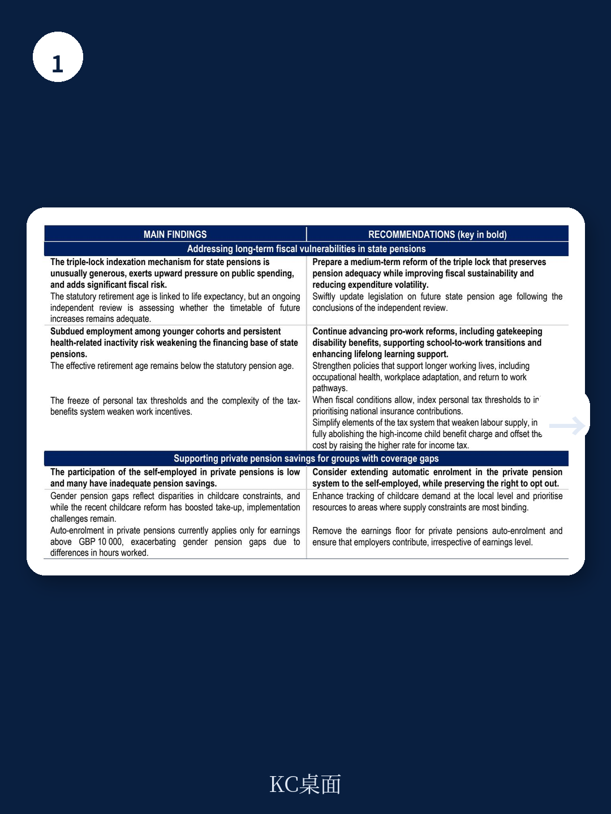

# 经合组织：英国2026年经济调查

英国宏观环境正在走出能源冲击的阴影，但经合组织2026年7月发布的《英国宏观环境调查》给出了一个并不轻松的判断：人均增长虽有改善，却仍低于疫情前趋势，而真正构成长期约束的是三个彼此独立、又相互强化的结构性问题——养老金体系的财政不可持续性、能源转型中的价格与研究错配、以及区域生产率差距的固化。这份报告没有停留在短期预测，而是把财政纪律、能源安全和区域增长放在同一个分析框架里，试图回答一个更根本的问题：英国能否在不牺牲财政稳健的前提下，实现包容性增长。

报告的核心锚点是一组数字：2025年英国一般政府债务占GDP比重为102.3%，利息支出占财政收入的比重持续上升，而养老金支出因“三重锁”机制面临不对称的上行不确定性。经合组织通过随机模拟显示，在乐观情景下养老金支出可能温和可控，但在不利情景下，财政不确定性将显著放大。这不是一个遥远的威胁，而是未来十年内就会显现的约束。

## 1. “三重锁”制造的财政不对称不确定性，比市场预期的更集中

英国国家养老金的“三重锁”机制——按通胀、工资增长或2.5%三者中最高者调整——在政治上几乎不可撼动，但经合组织的分析揭示了其财政后果的严重不对称性。报告通过随机模拟（Box 2.2）量化了这一不确定性：当工资或通胀意外上行时，养老金支出会不成比例地跳升，而宏观环境节奏变化时却几乎没有下调空间。这种单向弹性意味着，财政规划中使用的“基准情景”可能系统性低估了长期支出不确定性。

报告同时指出，就业率偏低正在从收入端侵蚀养老金体系的可持续性。2025年英国15岁以上人口就业率为60.7%，虽高于OECD均值58.0%，但青年失业率（15.0%）和长期失业率（1.0%）的结构性问题并未缓解。更值得关注的是，自雇人群参与私人养老金的比例显著低于雇员，女性因兼职比例更高，退休收入缺口更大。养老金改革不能只盯着支出端，收入端的覆盖缺口同样需要制度性修补。

> **KC评论：** 三重锁的财政不确定性不是“可能发生”，而是“发生概率不对称”。决策者需要关注的是，当通胀或工资增速超预期时，现有财政规则是否留有足够的缓冲空间。报告中提到的澳大利亚指数化体系（Box 2.3）提供了一个参照——通过将养老金增长与消费者价格指数挂钩，同时辅以定期 adequacy review，可以在可持续性和充足性之间找到更平衡的路径。

## 2. 电价高企的真正根源，不是绿电成本，而是系统灵活性研究滞后

英国在减排方面已是全球领先者，但电价依然高于天然气，这与其能源转型路径中的结构性错配直接相关。报告指出，2024年英国可再生能源占一次能源供应比例为15.3%，高于OECD均值13.1%，但电力系统并未同步完成灵活性改造。电网接入积压（grid connection backlogs）正在成为可再生能源部署的实际瓶颈，而短时灵活性资源（如储能、需求响应）的扩张速度，尚未跟上风电和光伏装机增长的速度。

碳定价体系内部的差异进一步扭曲了激励。报告显示，电力部门的碳价远高于供暖和交通部门，这削弱了电气化替代的宏观环境动力——热泵部署速度远低于实现净零所需的水平，而电动汽车的普及更多依赖直接补贴而非碳价信号。经合组织的建议是：协调碳价水平，同时加快电网研究从“被动响应”转向“前瞻性规划”（Box 3.1引用了欧洲的实践）。这不是一个技术问题，而是一个制度设计和研究时序问题。

## 3. 区域生产率差距的根源不在“伦敦太强”，而在其他地方太弱

英国区域生产率差距长期存在，但报告的一个关键发现是：大部分生产率差异来自区域内部，而非区域之间。这意味着问题不是“伦敦虹吸了所有资源”，而是多数地区缺乏将本地技能、基础设施和创新资源转化为生产率提升的能力。报告用一组数据支撑了这一判断：交通基础设施研究高度集中在伦敦地区，数字连接虽在改善但区域差距依然存在，中小企业数字化采纳率在伦敦领先，而R&D支出和股权研究更是高度集中于首都。

报告特别指出，地方政府的财政能力是制约区域增长的一个被低估的因素。2024年英国地方政府的实际可用资金仍低于2010年水平，垂直财政失衡（vertical fiscal imbalance）严重，地方自有收入占比极低。经合组织提出的十项分权指南（Box 4.6）并非抽象原则，而是指向一个具体方向：要让地方有能力设计并执行与本地禀赋匹配的增长战略，而不是仅作为中央政策的执行者。

> **KC评论：** 区域生产率差距的讨论，容易滑向“要不要再分配”的意识形态争论。报告的实际贡献在于，它把问题拆解为技能、基础设施、创新融资和地方治理能力四个可操作的维度，并给出了可比较的国际参照。对于关注英国资产配置的读者，真正需要跟踪的不是某个区域GDP增速，而是地方财政自主权改革和技能培训体系的落地节奏。

这份报告没有给出一个简单的增长处方。它的价值在于，把财政纪律、能源安全和区域增长这三个通常被分开讨论的议题，放进了同一个约束条件里：英国没有足够的财政空间同时解决所有问题，因此必须做出排序和取舍。养老金改革、电网研究和分权化治理，可能才是未来十年英国宏观环境叙事中真正的主角。
