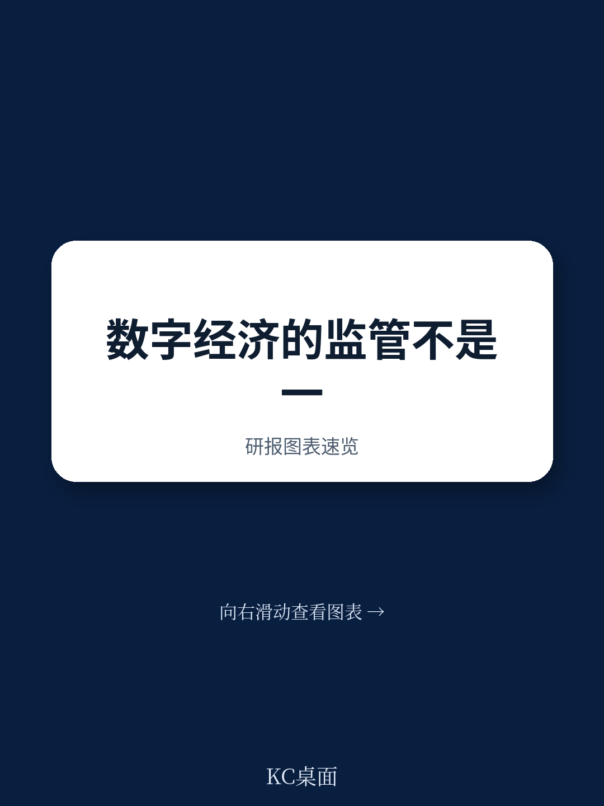
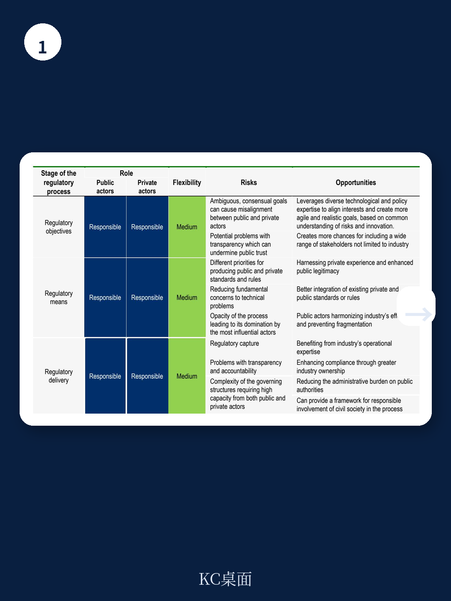
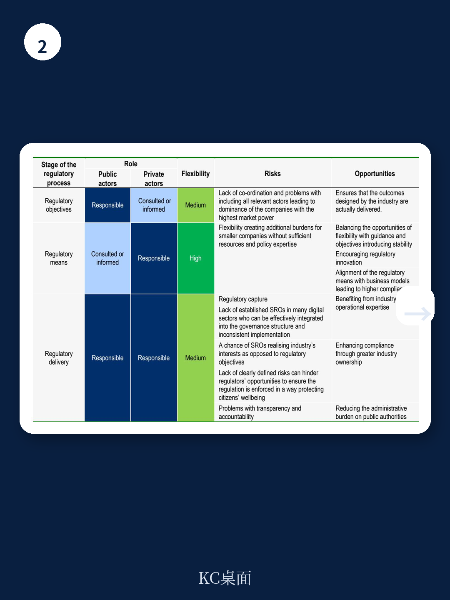

# 经合组织：监管模型谱系及其在数字宏观环境的应用

数字宏观环境的监管者正面临一个比“要不要管”更棘手的问题：当技术迭代速度远超立法周期，政府如何在不扼杀创新的前提下守住底线？经合组织最新发布的监管模型工作论文提供了一个分析框架，其核心判断是——各国政府正在从“选一种监管模式”转向“设计混合模式”，而其中最关键的变量，不是监管的松紧程度，而是公共与私人部门在“设定目标”与“执行手段”之间的责任分配。

这份报告梳理了六种监管模型，从命令控制型到行业自律，并将其置于一条以灵活性和公私责任为坐标轴的谱系上。但真正值得关注的不是分类本身，而是报告揭示的一个趋势：在数字宏观环境领域，政府越来越多地保留设定监管目标的权力，同时将实现目标的手段和合规执行大量委托给私人部门。这种“目标公管、手段私行”的模式，正在成为全球数字监管的主流实践。

## 1. 监管模型的选择取决于三个条件，而非一个理想模板

报告提出了一个评估框架，认为监管模型的选择应基于三类条件：对创新的影响、市场与私人部门的特征、以及公共机构的制度准备度。这三者缺一不可，且彼此之间存在权衡。

例如，当技术成熟度低、市场集中度高时，命令控制型模型可能抑制创新；而当公共机构缺乏技术评估能力时，过早引入绩效型监管反而可能导致执行真空。报告特别指出，在数字宏观环境中，技术成熟度（Technology Readiness Level）是一个常被低估的变量——对低成熟度技术施加刚性规则，往往比不监管更危险。

> **KC评论：** 这一框架的实用价值在于，它把“监管选择”从一个政策理念问题变成了一个条件匹配问题。读者可以对照自己所在行业的技术成熟度和市场结构，判断当前监管模式是否与条件匹配，而不是简单争论“严好还是松好”。

## 2. 混合模式已成主流，但责任分配才是真正的分水岭

报告对六种模型进行了逐项拆解，但最引人注目的发现来自对实际案例的分析：在数字监管实践中，几乎没有哪个国家采用纯粹的单一模型。欧盟的《数字服务法》和《通用数据保护条例》都是典型的混合模式——公共部门设定目标和底线，但具体如何实现（如内容审核机制、数据保护影响评估）则由平台自行设计并接受监督。

报告将这种模式称为“元监管”（meta-regulation），即政府不直接规定行为，而是要求企业建立内部治理体系，并对该体系的有效性进行外部审计。这种模式在灵活性上介于绩效型监管和共同监管之间，但其核心特征是：公共部门保留了“设定目标”的权力，而将“实现手段”和“执行交付”委托给私人部门，同时保留监督和问责权。

## 3. 数字宏观环境的特殊性正在倒逼监管框架的重构

报告专门用一章讨论数字宏观环境的特殊性，指出三个关键挑战：一是技术迭代速度使传统立法周期失效；二是平台企业同时扮演“规则接受者”和“规则制定者”的双重角色；三是跨境特性使任何单一国家的监管都难以独立生效。

这些挑战使得“不监管”本身也成为一种有意识的选择——报告将其列为谱系最右端的模型。但报告强调，不监管不等于不作为，而是指政府选择依赖现有法律框架、行业自律或市场机制来应对不确定性。这种选择的前提是：不确定性可控、市场有能力自我纠正、且公共机构有足够的监测能力来判断是否需要介入。

> **KC评论：** 报告没有给出“哪种模型最好”的答案，但它提供了一个更务实的观察框架：监管的有效性不取决于模型本身的优劣，而取决于模型与条件之间的匹配度。对于产业决策者而言，这意味着理解监管逻辑比预测监管内容更重要——因为监管逻辑决定了企业需要建立什么样的合规能力和治理结构。

这份报告的真正价值不在于给出答案，而在于提供了一套可复用的分析工具。当监管者、企业和读者都能用同一套语言讨论“谁定目标、谁管执行、谁担责任”时，数字宏观环境的治理才有可能从零和博弈转向协同进化。
