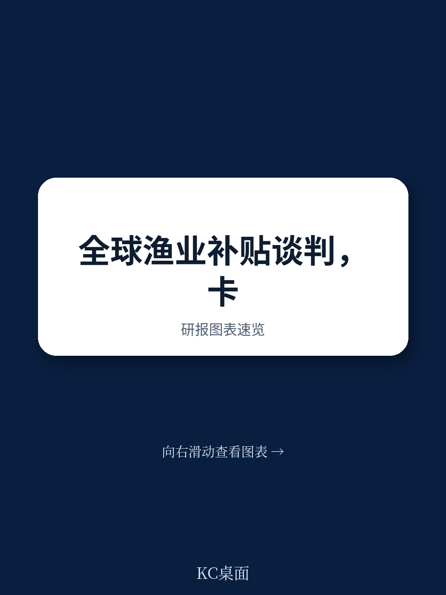

# 世界贸易组织：世界贸易组织总干事呼吁WTO改革同步推进

世界贸易组织渔业补贴谈判进入关键阶段。7月8日，谈判主席、圭亚那大使莱斯利·拉姆萨米向规则谈判组提交最新进展报告，明确释放了一个信号：经过25年讨论，核心议题早已被充分分析，当前阻碍进展的不是缺乏新想法，而是如何从已有方案中拼出多数成员能接受的组合。

这份报告直接回应了“谈判为何迟迟无法收尾”的疑问。拉姆萨米在发言中坦言，历史回顾会议显示，“同一组核心议题多年来一直处于谈判中心”，这些议题已被从不同角度反复分析、讨论。换句话说，谈判桌上并不缺内容，缺的是取舍。

报告同时披露了下一步时间表：今年9月起将连续举办三轮“渔业周”，目标是在12月前就2027年正式谈判的框架形成共识。这相当于给谈判设定了明确的节奏锚点。

> **KC评论：** 拉姆萨米的发言实际上把谈判僵局归因于“选择过多”而非“方案不足”。对关注多边贸易规则走向的读者而言，这意味着未来几个月的焦点不是新提案的涌现，而是主要成员如何在已有选项上让步。

## 1. 数据缺口仍是最大障碍，但成员有义务填补

报告提到，6月25日的数据专题会议揭示了一个基础性问题：全球渔业补贴的完整数据集仍然缺失。要缩小这一信息差距，只能靠各成员按时向WTO提交准确的通知。

这听起来是技术问题，但背后是政治意愿。没有可靠数据，任何补贴纪律都难以落地执行。拉姆萨米特意强调，鱼群存量仍在下降，这给谈判增加了紧迫性——数据缺口不再是拖延的借口，而是必须优先解决的短板。

## 2. 谈判节奏已明确：2026年底前完成框架共识

报告最具体的进展是时间表。拉姆萨米计划在9月、10月、11月各安排一轮“渔业周”，每轮聚焦不同议题。第一轮以“MC12以来取得的进展是什么”为核心问题，要求各成员提前提交书面意见。

这种设计有意避免重蹈过去“反复讨论同一议题”的覆辙。拉姆萨米在结论中回应了两种对立声音：一部分成员主张不能再重复老路，另一部分则提醒不要抛弃已有共识。他的解决方案是——先让成员说清楚“进展”的定义，再决定哪些已有成果可以保留、哪些需要调整。

> **KC评论：** 这个“先定义进展再谈文本”的路径，本质上是在用程序化解政治分歧。它不要求成员立即让步，而是先确认共同认可的谈判基础，再逐步缩小分歧范围。

## 3. 特殊与差别待遇仍是谈判的“内置变量”

报告专门安排了一个上午时段讨论特殊与差别待遇，并明确这一议题将贯穿整个谈判进程。这意味着，任何最终协议都必须包含对发展中国家、特别是最不发达国家的灵活安排。

拉姆萨米在回答成员提问时强调，特殊与差别待遇不是附加条款，而是谈判的“组成部分”。这一定位实际上降低了谈判的难度——它不再是一个需要单独攻克的难题，而是所有条款设计时都必须考虑的前提条件。

## 4. 透明度与包容性被设为谈判底线

报告对“渔业周”的会议安排做了详细说明：所有专题会议和代表团团长会议均向全体成员开放，不设闭门会议。这既是拉姆萨米个人风格的体现，也是吸取了过去谈判“小圈子决策引发反弹”的教训。

同时，报告鼓励成员在会前提交书面提案，以便全体成员公开讨论。这种“先写后谈”的模式，意在减少即兴发言带来的信息不对称，让谈判更聚焦于实质内容而非立场宣示。

## 5. 谈判已进入“从共识到文本”的转换期

拉姆萨米在结论中引用了一句成员的原话：“在追求完美的过程中，我们找到了瘫痪的借口。”这句话点出了谈判长期停滞的心理根源——部分成员因担心协议不完美而拒绝任何妥协。

报告传递的核心信息是：谈判已从“寻找新方案”阶段进入“从已有共识中提炼文本”阶段。未来三个月，各成员需要回答的不是“你想要什么”，而是“你能接受什么”。这将是检验谈判诚意的真正时刻。

---

For informational purposes only. Portions may be generated,translated,summarized,or edited with AI assistance based on source materials and may contain omissions or errors. Please verify independently. This is not investment,legal,tax,accounting,or other professional advice.

