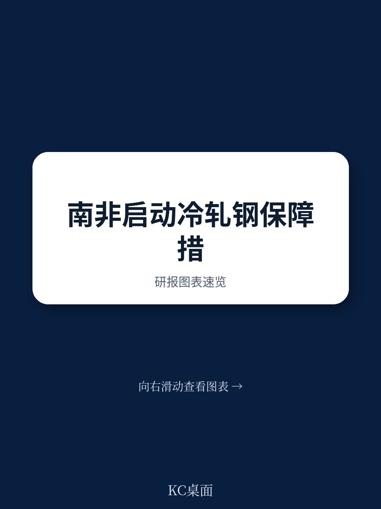

# 世界贸易组织：南非对冷轧钢发起保障措施调查

2026年7月10日，南非正式对进口冷轧钢产品发起保障措施调查。这份提交至世界贸易组织的通知，表面是单一国家的贸易救济程序，背后却揭示了一个正在加速的结构性变化：全球钢铁过剩产能，正在通过贸易壁垒的“缝隙”重新分配流向。南非，只是这一轮转移的接收端之一。

发起调查的申请方是安赛乐米塔尔南非公司，它是南部非洲关税同盟区域内唯一的冷轧钢生产商，占据100%的本地产能。该公司提交的证据显示，2024年期间，冷轧钢进口量在绝对数量和相对本地产量的比例上均出现急剧上升，直接导致其销量、市场份额和盈利能力持续下滑，并转为亏损。调查期覆盖2023年1月1日至2025年12月31日，这意味着南非贸易救济委员会已经掌握了至少两年的数据趋势。

## 1. 全球产能过剩不是新闻，但“贸易壁垒转移效应”正在改变竞争格局

报告中最关键的分析，不在于南非本地的供需失衡，而在于申请方对“不可预见的发展”的论证。安赛乐米塔尔南非公司指出，在乌拉圭回合谈判期间，南非无法预见以下三个同时发生的事件：全球冷轧钢持续供过于求且需求疲软、主要地区纷纷加征贸易救济和关税壁垒、以及由此导致的贸易流被迫转向更开放的市场。

这三件事叠加在一起，形成了一个清晰的因果链——全球过剩产能没有消失，只是在被主要市场拒之门外后，寻找新的出口。南部非洲关税同盟因为关税保护水平相对较低，成为了这一轮“贸易流改道”的目的地。这不是南非独有的现象，而是全球钢铁贸易格局正在经历的再平衡。

> **KC评论：** 这份通知的价值不在于南非是否最终加征保障税，而在于它提供了一个可复用的观察框架：当多个主要市场同时收紧贸易壁垒时，过剩产能不会凭空消失，只会流向壁垒最低的环节。对于任何依赖进口竞争或出口导向的行业，这个逻辑同样适用。

## 2. 单一生产商结构放大了进口冲击的传导速度

南非冷轧钢市场的特殊性在于，安赛乐米塔尔南非公司是唯一的本地供应商。这意味着进口量的任何边际变化，都会直接且完整地反映在该公司的经营数据上。报告显示，申请方提交的初步证据已经覆盖了销量、市场份额、盈利能力和价格效应四个维度，且每个维度都指向“严重损害”。

这种市场结构使得保障措施调查的因果判断相对清晰——没有其他本地生产商可以分担进口冲击，也没有替代供给来源可以缓冲。对于读者和产业观察者而言，这是一个值得注意的信号：在集中度极高的市场中，贸易政策的变化会以更快的速度传导至单一企业的资产负债表。

## 3. 调查程序本身就是一个政策信号，不限于冷轧钢

通知中明确，利益相关方需在调查启动后20天内提交意见和听证请求。这个时间窗口很短，反映出南非贸易救济委员会希望快速推进程序。更重要的是，这份通知的发布本身，已经向全球钢铁出口商发出了一个明确的政策信号：南非正在积极使用WTO框架下的贸易救济工具。

从更宏观的视角看，这并非孤立事件。当全球主要地区都在强化本土产业保护时，像南非这样的中等规模市场，正在成为贸易摩擦的“新前线”。对于跨国钢铁企业而言，理解这些市场的贸易救济规则和程序节奏，可能比关注价格波动更具战略意义。

这份调查的最终结果尚需时日，但其揭示的全球过剩产能再分配机制，已经在改变钢铁行业的竞争边界。
