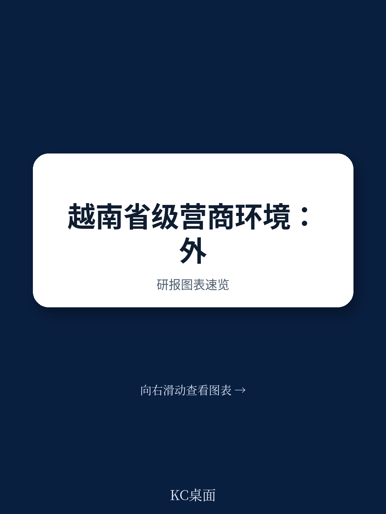
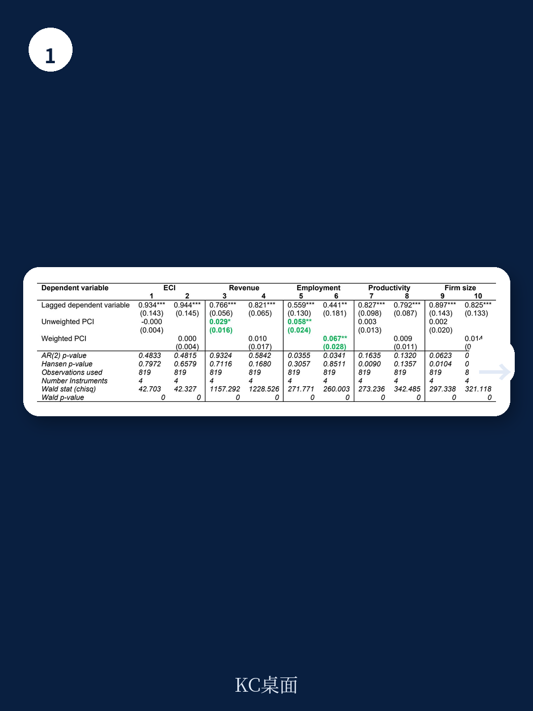
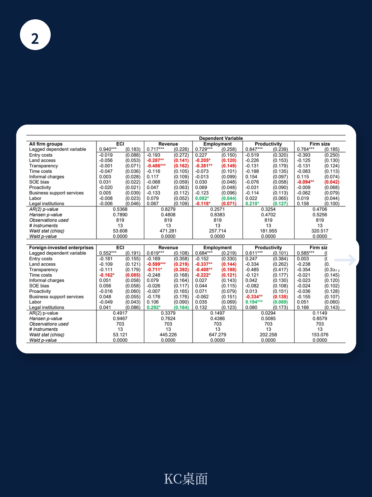

# 亚洲开发银行：ADB，商业环境、经济复杂度与绩效

一份来自亚洲开发银行的工作论文，对越南63个省份2006至2020年的面板数据进行了实证检验，得出了一个反直觉的结论：省级营商环境的改善，并未显著推动当地制造业，尤其是本土企业的宏观环境复杂度、营收、就业和生产率提升。报告甚至发现，在某些领域（如土地准入、透明度和法律机构），治理的“弱化”反而与更好的企业表现相关。这一发现，对理解发展中国家外资驱动型增长模式的深层局限，提供了一个关键切口。

报告的核心研究对象是越南的省级竞争力指数（PCI）及其十个子指标。PCI是衡量越南各省商业环境和宏观环境治理质量的权威指标，长期以来被视为吸引外资和促进地方发展的关键工具。然而，亚洲开发银行的这项研究通过两步差分GMM模型，剥离了其他影响因素后发现，PCI的变化与外资企业和本土企业的绩效指标之间，几乎不存在统计上显著的正向关联。

> **KC评论：** 报告的结论并非否定制度的重要性，而是揭示了一个更棘手的问题：当制度改善的收益被外资企业“内部化”，而外资企业与本土宏观环境又缺乏深度链接时，省级层面的制度竞赛可能陷入“为他人做嫁衣”的困境。

## 1. 外资企业的“超本地化”决策：省级政策为何失灵

报告认为，外资企业的运营决策，尤其是那些嵌入全球价值链的跨国公司，其核心驱动力往往不在越南的某个省份。生产成本的全球比较、海外市场的需求波动、以及集团内部对全球供应链的重新配置，才是决定其产能、就业和产品复杂度的关键变量。省级层面的政策微调，如简化行政审批或提供税收优惠，在这些战略决策面前，影响力被大幅削弱。

这意味着，越南各省份为吸引外资而进行的制度竞赛，其边际效用正在递减。当所有省份都努力提升PCI分数时，单个省份的改善就难以构成独特的竞争优势。外资企业更可能将省级政策视为“标配”，而非决定其长期研究和升级行为的核心因素。研究数据支持了这一判断：在对外资企业的回归分析中，PCI及其子指标的系数大多不显著，且方向不稳定。

## 2. 本土企业的“制度韧性”：在弱治理中生存，而非在强治理中升级

更值得关注的是本土私营企业的表现。理论上，根植于本地商业环境的本土企业，应对制度改善更为敏感。但研究结果恰恰相反：本土企业的绩效与PCI改善之间同样缺乏稳健的正向联系。报告甚至发现，在透明度和法律机构改善较慢的省份，私营企业的就业增长反而更快。

一个可能的解释是，越南的本土企业，尤其是中小型私营企业，已经发展出一套在“弱制度”环境下生存的独特能力，例如依赖非正式关系网络来获取资源和规避不确定性。当制度改善发生时，这些非正式的优势可能被削弱，而新的正式规则又未能及时转化为它们可用的商业机会。另一个解释是，省级制度改革的设计初衷更多是为了迎合外资需求，而非解决本土企业面临的核心痛点，如融资难、技术获取渠道窄、以及市场准入壁垒。

## 3. 宏观环境复杂度停滞：外资与本土的“双轨”困局

报告使用宏观环境复杂度指数（ECI）作为衡量制造业升级的核心指标。ECI衡量的是一个地区出口产品的知识含量和独特性。研究发现，无论是外资企业还是本土企业，其所在省份的ECI变化，都与PCI的改善没有显著关联。这表明，省级营商环境的优化，并未成功推动制造业从简单的组装加工向更复杂、更高附加值环节跃迁。

这指向了越南宏观环境的一个结构性矛盾：外资部门与本土部门之间存在着明显的“双轨”特征。外资企业形成了一个相对封闭的高端制造集群，其技术溢出和知识扩散效应有限。本土企业则被锁定在低端制造和服务领域，难以通过承接外资的技术转移来实现自身升级。省级制度改善未能有效打破这一壁垒，反而可能因为资源向外资倾斜而固化了这种二元结构。

> **KC评论：** 报告的结论对许多依赖外资驱动增长的发展中地区具有警示意义。它提醒政策制定者，单纯的“营商环境排名”竞赛是不够的。制度改革的真正挑战，不在于如何吸引外资，而在于如何设计一套能够促进外资与本土宏观环境深度融合、并最终提升本土企业创新能力和复杂度的制度框架。否则，省级层面的制度改善，可能只是一场没有终点的“内卷”。
