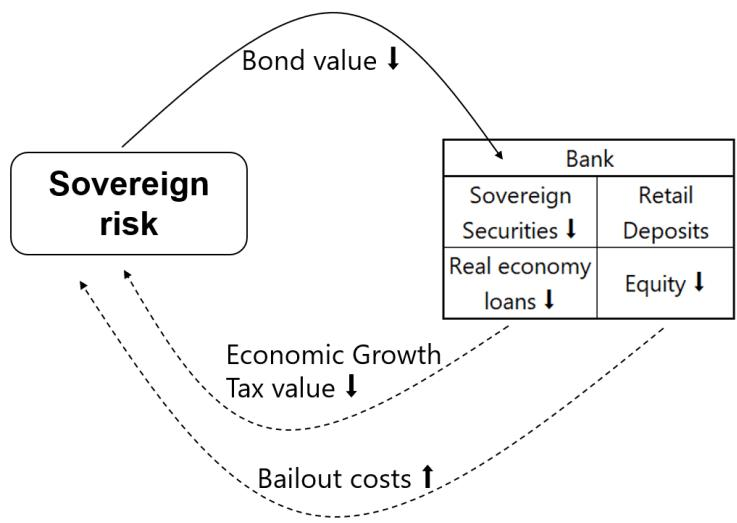
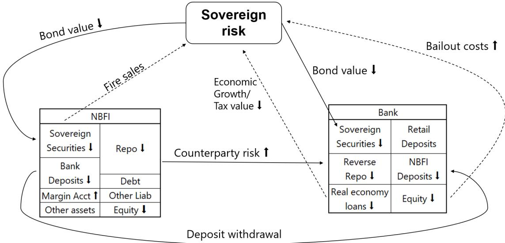
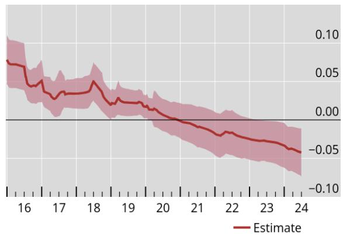
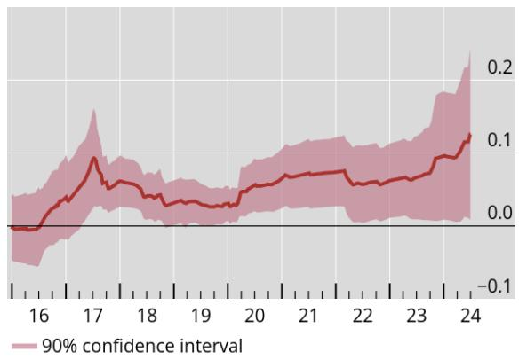
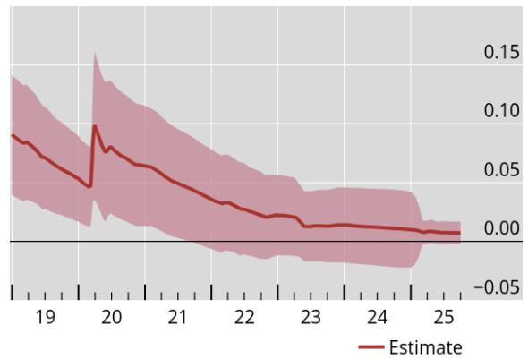
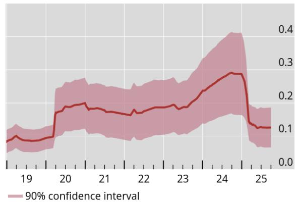

BIS Working Papers
No 1369

The evolving nexus: sovereigns, banks and NBFIs
Stefan Avdjiev, Bryan Hardy and Maximilian Jager

Monetary and Economic Department

July 2026

JEL classification: F34, G01, G21, G23, H63

Keywords: banks, sovereign default, feedback loop, NBFI, nexus, risk

BIS Working Papers are written by members of the Monetary and Economic Department of the Bank for International Settlements, and from time to time by other economists, and are published by the Bank. The papers are on subjects of topical interest and are technical in character. The views expressed in this publication are those of the authors and do not necessarily reflect the views of the BIS or its member central banks.

This publication is available on the BIS website (www.bis.org).

ISSN 1020-0959 (print)
ISSN 1682-7678 (online)

# The evolving nexus: sovereigns, banks and NBFIs

Stefan Avdjiev Bryan Hardy Maximilian Jager

This version: July 14, 2026\*

## Abstract

This paper documents that the traditional sovereign-bank nexus has morphed into a broader nexus that now also includes non-bank financial institutions (NBFIs): the sovereign-bank-NBFI nexus. The classical sovereign-bank nexus has been a major financial stability concern following the eurozone crisis. Since then, sovereign debt levels have increased substantially in many major economies, while NBFIs' footprint in sovereign bond markets has grown significantly. This paper examines the transmission of risks among banks, sovereigns and NBFIs using European bank-level data and global country-level data. We find that banks' direct sovereign exposures have recently become less important in explaining the co-movement between bank and sovereign risk. By contrast, banks' exposures to NBFIs have become a significant determinant of the bank-sovereign risk co-movement. We also find evidence that NBFIs' sovereign debt holdings have become important drivers of the co-movement between NBFI and sovereign risk.

JEL classification: F34, G01, G21, G23, H63

Keywords: banks, sovereign default, feedback loop, NBFI, nexus, risk

## 1 Introduction

The sovereign–bank nexus – often referred to as the sovereign-bank “doom loop” (Brunnermeier, Garicano, Lane, Pagano, Reis, Santos, Thesmar, Van Nieuwerburgh, and Vayanos, 2016; Gennaioli, Martin, and Rossi, 2014) – has been a major vulnerability in the global financial system. It gained particular notoriety during the euro area crisis, when banks’ holdings of sovereign debt exposed them to potential losses associated with sovereign distress, weakening their balance sheets and impairing their credit provision to the real economy. In turn, deteriorating bank health had a negative impact on the creditworthiness of sovereigns by increasing their contingent liabilities and by decreasing their tax revenues (due to the slowdown in economic activity caused by the associated reduction in banks’ supply of credit to the real economy). The above self-reinforcing mechanisms generated a two-way feedback loop in which stress could propagate from sovereigns to banks and vice versa.

Since the euro area crisis, the structure of the financial system has changed in ways that call for a reassessment of the sovereign-bank nexus. In particular, non-bank financial institutions (NBFIs) have grown substantially along several key dimensions – overall size, participation in sovereign debt markets, and interconnectedness with banks (Bank for International Settlements, 2025; Garcia Luna and Hardy, 2019; Aldasoro, Huang, and Kemp, 2020). These developments motivate the main hypothesis we examine in this paper: that the traditional sovereign–bank nexus has evolved into a broader sovereign–bank–NBFI nexus, in which NBFIs play an increasingly important role in the transmission of sovereign risk to banks. This paper tests this hypothesis by examining how the channels linking sovereigns and banks have changed over time, and by documenting the role of NBFIs in shaping these relationships.

The key mechanisms underlying the expansion of the nexus stem from the emergence of new frictions and feedback channels involving NBFIs. Many NBFIs, particularly hedge funds, engage in leveraged sovereign bond trading, often funded through short-term (repo)

borrowing from banks. This implies that even relatively small shocks to sovereign risk can have a large negative impact on NBFIs' balance sheets. In response, NBFIs may deleverage by engaging in fire sales of sovereign bonds and by withdrawing deposits from banks. Moreover, in such a stress scenario, there would be an additional negative impact on banks due to a rise in the expected losses associated with their direct exposures to NBFIs. All of this would have a negative impact on both banks and sovereigns, which would in turn have additional (second round) negative effects on NBFIs. This would give rise to a triangular propagation mechanism, in which shocks to any one of the three sectors – sovereigns, banks, or NBFIs – are transmitted to the other two, resulting in a negative feedback loop passing through all three nodes of the sovereign-bank-NBFI nexus.

We empirically test this hypothesis using both bank-level and aggregate (country-level) data. At the bank level, we use European Banking Authority (EBA) data to examine how the correlation between bank and sovereign CDS spreads is affected by banks' exposures to sovereigns and financial institutions. At the aggregate level, using the BIS international banking statistics, we examine the respective relationships at the national banking system level. In both (bank-level and country-level) sets of empirical exercises, we examine whether the relative importance of banks' exposures to sovereigns and the financial/NBFI sector has changed over time.

Our results suggest that the traditional sovereign–bank nexus has weakened (when considered in isolation). In the earlier part of our sample (prior to 2016), the co-movement between the CDS spreads of banks and sovereigns was higher for banks with greater holdings of risky sovereign debt (in line with the classical sovereign-bank nexus mechanisms). However, in the later part of our sample (post-2016), this relationship weakened significantly.

When we incorporate banks' exposures to the financial sector, particularly to NBFIs, we find a very different pattern. In the later period, greater exposure to financial counterparties located in high-risk sovereign jurisdictions is associated with a stronger correlation between bank and sovereign risk. This shift in the main drivers of the sovereign-bank risk co-movement – from banks’ direct sovereign exposures to their indirect exposures via the financial sector – is also documented in the results generated using aggregate data.

To isolate the underlying mechanism, we examine banks' foreign exposures. This allows us to abstract from the domestic bailout channel that may confound the drivers of the sovereign–bank CDS spread co-movement. The results from these international regressions confirm our main finding: the importance of banks' direct sovereign exposures has declined over time, while that of their financial sector exposures has increased. Moreover, we document that this shift is driven by the riskiness of the borrowing sovereign rather than by the nationality of the lending bank. For example, the main determinant of the CDS spread co-movement between core European banks and peripheral sovereigns switches from banks' direct sovereign exposures prior to 2016 to banks' exposures to the financial sector. In contrast, the co-movement between the CDS spreads of peripheral banks and core sovereigns is driven primarily by banks' exposures to financial institutions throughout the sample.

We also investigate the role of banks' asset and funding composition in amplifying these effects. The expanded (sovereign-bank-NBFI) nexus is more pronounced for banks holding more liquid assets. This is consistent with the hypothesis that banks that provide funding to certain NBFIs (such as hedge funds) through short-term repo lending are more exposed to sovereign risk through their exposures to NBFIs. In addition, banks' liability-side exposures (through deposits) to NBFIs independently contribute to higher co-movement between bank and sovereign risk, over and above the effects attributed to their asset-side exposures.

Finally, we examine the third side of the (sovereign-bank-NBFI) triangle by analyzing the direct relationship between NBFIs and sovereigns. Using aggregate data on NBFIs' holdings of sovereign debt, we find patterns consistent with our bank-level results. Namely, higher sovereign debt exposures of NBFIs are associated with stronger co-movement between NBFI and sovereign risk, especially in the later part of the sample.

Taken together, our findings provide strong evidence that the classical sovereign-bank nexus has evolved into a broader sovereign–bank–NBFI nexus. While banks' direct holdings of sovereign debt have become less central in explaining risk transmission between banks and sovereigns, the importance of banks' indirect exposures through NBFIs has grown. This shift is most pronounced for riskier sovereigns and likely reflects changes in regulation, market structure, and business models. More broadly, our results highlight the need to incorporate NBFIs and their triangular relationships into analyses of financial stability and sovereign risk transmission.

Literature Our paper is related to several strands of existing literature. More concretely, we build on existing work that has examined each of the three edges of the triangle linking sovereigns, banks, and NBFIs.

The sovereign-bank nexus has been explored both theoretically and empirically in a number of insightful papers. Much of this work focuses on the eurozone crisis, where both domestic and cross-border aspects of this nexus were on display (Brunnermeier et al., 2016; Fahri and Tirole, 2018; Acharya and Steffen, 2015; Bocola, 2016; Gennaioli et al., 2014; Acharya, Drechsler, and Schnabl, 2014). A few others examine these dynamics in the context of emerging markets, where sovereign risk and banking fragility are often more apparent and crises (sovereign, currency, banking) often come together (Baskaya, Hardy, Şebnem Kalemli-Özcan, and Yue, 2024; Brutti, 2011; Reinhart and Rogoff, 2011). Our paper’s key contribution to this discussion is expanding the view of the sovereign-bank nexus to account for the growing role of NBFIs, their particular risk sensitivities, and their feedback loops. We also highlight the particular vulnerability of (exposure to) riskier sovereigns for these dynamics.

A growing literature has highlighted the growth and financial stability risks of the NBFI sector and its links with banks. Many NBFIs are reliant on banks for their funding, even when they are competing with them in credit markets (Jiang, 2023; Acharya, Gopal, Jager, and Steffen, 2025). The links between banks and NBFIs run even deeper, as NBFIs also often provide funding to banks. These “interwoven” activities mean banks are exposed to credit and liquidity risks that may appear to have been shifted to the NBFI sector, likely generating the observed correlation in bank and NBFI abnormal equity returns (Acharya, Cetorelli, and Tuckman, 2024). $^{1}$ Our paper brings these risk links into the sovereign-bank nexus and documents how sovereign risk propagates through NBFIs to banks.

Lastly, a set of papers have documented the participation of NBFI investors in the sovereign debt market. Fang, Hardy, and Lewis (2025); Arslanalp and Tsuda (2014a,b) show that non-bank investors (mainly NBFIs) are large investors in terms of the share of sovereign debt that they hold. Fang et al. (2025) further highlights how NBFIs' holdings of sovereign debt are more price responsive than those of other investors, making their behavior (especially flightiness during stress) particularly important for the price of sovereign debt. As central banks wind down their balance sheets, non-bank investors have been the key players stepping in, thus increasing their market exposure and relevance in recent years (Du, Forbes, and Luzzetti, 2024; Eren, Schrimpf, and Xia, 2025). NBFIs also affect this market through their use of sovereign bonds in leveraged trading activities (e.g. the cash-futures basis trade (Barth and Kahn, 2025)). We connect the implications of these links and vulnerabilities back to the sovereign-bank nexus.

The above literature strands have examined each of the three edges of the sovereign-NBFI-bank triangle in isolation (i.e. focusing on only one of the three bilateral links at a time). In contrast, we examine all three edges of the sovereign-NBFI-bank triangle simultaneously and document how they influence each other in a feedback loop that is broader than the traditional sovereign-bank loop. This is our main contribution to the existing literature.

The remainder of this paper is structured as follows: Section 2 describes conceptually how the expanded sovereign-bank-NBFI nexus operates; Section 3 details the data used in our analysis; Section 4 describes our empirical approach; Section 5 presents the results examining different sides of the sovereign-bank-NBFI triangle; and Section 6 concludes.

## 2 The sovereign-bank-NBFI nexus

The sovereign-bank nexus used to have a two-way feedback loop at its core (Figure 1). For banks, this operated through their direct exposures to sovereign debt. A decline in the value of sovereign debt impaired their net worth and led to a cut in credit. For sovereigns, this worked through the risk that a systemic banking crisis would further weaken the economy and impair their creditworthiness, incentivizing them to (at least implicitly) provide support to banks during stress. Thus, both sovereigns and banks are directly impacted by each other's default risk, in addition to the general macroeconomic impacts of the individual failure of each.

Figure 1: The Classical Sovereign-Bank Loop  
  
Notes: Replicated from Brunnermeier et al. (2016).

Adding NBFIs into this nexus changes the dynamics (Figure 2). NBFIs have long been key intermediaries and investors in the sovereign debt market, particularly among advanced economies. Moreover, NBFIs' role in the global financial system has grown significantly over the past decade. There has been a substantial increase in both NBFIs' footprint in sovereign debt markets and their linkages with banks. NBFIs that directly hold sovereign debt are exposed to increases in sovereign risk or sovereign defaults. These vulnerabilities can be amplified when these intermediaries take leveraged positions with these investments. Sovereign debt is also increasingly used as collateral in financial transactions. A rise in sovereign risk lowers the value of sovereign bonds as an investment or as collateral, potentially inducing margin calls or fire sales.

Figure 2: The Sovereign-Bank-NBFI Triangle  
  
Notes: Authors' elaboration.

The above shocks can be transmitted back to both sovereigns and banks. In the case of fire sales, this further depresses the value of sovereign debt, increases sovereigns' borrowing costs, reduces their fiscal space, and impairs their creditworthiness. When NBFIs face margin calls and incur losses on their sovereign bond holdings, they become riskier counterparties for banks. Furthermore, as NBFIs become more constrained, this could generate significant liquidity shocks for banks, as NBFIs are also key providers of funding to banks.

To give a more concrete example, the leveraged trading strategies that some NBFIs – and hedge funds in particular – deploy in sovereign bond markets could generate several of the above stress transmission channels (Hernández de Cos, 2025). These leveraged strategies are typically facilitated by NBFIs' short-term repo borrowing from banks. As a result, they are highly vulnerable to adverse shocks in funding markets. Thus, even a mildly negative shock in sovereign bond markets (triggered either by negative fiscal news or shifts in overall market sentiment) could be significantly amplified by the rapid unraveling of NBFIs' leveraged strategies. In turn, this would (i) transmit to banks via their direct lending exposures to NBFIs and (ii) likely lead to sharp spikes in government bond yields. The latter effect could then result in further unwinding of NBFIs' leveraged positions, thus triggering a new round in the three-way (sovereign-bank-NBFI risk) feedback loop. As a consequence, the impact of the initial shock in sovereign bond markets would be more negative for banks that are more exposed to NBFIs than for banks that are more directly exposed to the sovereign (since, in most cases, the volatility in sovereign bond yields would not translate into a sharp increase in the sovereign's probability of default).

In addition to the direct exposure channels described above, the three-way feedback loop could also be fueled via the indirect exposures that all three nodes of the sovereign-bank-NBFI nexus have to the real economy. More concretely, the spikes in government bond rates described above would likely translate into sharp increases in interest rates in the real economy (e.g. mortgages, consumer loans, business loans, corporate bond rates, etc). This would have a negative impact on economic activity, which would in turn be an additional adverse shock for sovereigns (due to lower tax revenues), as well as for banks and NBFIs (due to the deterioration in the creditworthiness of their real-economy borrowers).

Thus, through all of the above channels, sovereign stress can transmit risk to NBFIs, which can propagate that risk on to banks. In turn, stress in the NBFI sector can directly spill over to banks and have a direct impact on the pricing of sovereign debt (Fang et al., 2025). This naturally leads us to hypothesize that the classical sovereign-bank nexus has morphed into a broader sovereign-bank-NBFI nexus. In the rest of the paper, we test this hypothesis empirically along multiple dimensions.

## 3 Data

We examine the linkages among sovereigns, banks and NBFIs using bank-level data for European banks as well as country-level data for a global sample of banks.

The bank-level data are obtained from the EBA's stress test and transparency exercises. Between 2009 and 2011, the EBA conducted annual stress tests and published the results. In 2011, in response to growing worries about the European Debt Crisis, the EBA also started to disseminate information about banks' portfolio composition, in particular regarding their sovereign exposures. These disclosures entered an annual schedule starting in 2013. After that, the EBA has been publishing the data without further analysis (in a “transparency exercise”) biennially, while in the alternate years, the EBA has been conducting stress tests based on the same data and publishes the results of the test alongside the raw data (in a “stress test exercise”). In most years, the sample of banks has comprised the banks supervised by the ECB, but there have been vintages in which the sample has included fewer banks. The data vintages from 2013 to 2019 contain semi-annual data, while those from 2020 to 2024 contain quarterly data. The specific data series we use include each bank’s exposure to the sovereign sector and the financial sector of its top 10 counterparty countries. The data set we compile from these EBA data releases covers exposures from 2012Q1 to 2024Q2 for 213 banks headquartered in 29 countries. When we match these data series with data on bank CDS spreads from Markit, we obtain a sample of 65 banks from 16 countries. To measure the riskiness of sovereigns, we also use CDS spreads from Markit.

For our country-level analyses, we aggregate the CDS spreads from the bank level to the country level using the total asset-weighted averages for banks in each country. In the case of NBFIs, the entities with active CDS spreads tend to be primarily (re-)insurance companies, real estate companies or (more rarely) asset management companies.

At the country-level level, our main dataset is the BIS consolidated banking statistics (CBS). The sample covers quarterly consolidated exposures of banks headquartered in 27 countries to the official sector in 66 counterparty countries. $^{2}$ These exposures include both cross-border claims and local claims of banks' affiliates located in the country of the respective (sovereign or NBFI) borrowers. When we match these data to countries for which we can produce an estimate of the domestic banking sector's CDS spreads and have the borrowing countries' sovereign CDS spreads, we obtain a sample of 20 bank nationalities and 42 counterparty countries from 2014Q1 to 2025Q2.

We supplement this with two other country-level datasets to better capture NBFI positions. To get NBFIs' investment in the domestic sovereign debt market, we use data from Arslanalp and Tsuda (2014a) and Arslanalp and Tsuda (2014b). These datasets provide quarterly estimates of the holdings of sovereign debt by domestic non-banks for 24 advanced economies and 22 emerging and developing countries from 2004Q1 to 2025Q2. We use non-bank exposures as a proxy for NBFI exposures, as NBFIs are the dominant investors in that category. We pair this with data on the size of the NBFI sector in each country collected by the Financial Stability Board (FSB). This data set is annual and covers 28 advanced and emerging countries from 2002 to 2024. When we match these data to borrowing countries for which we can produce an estimate of the NBFI sector's CDS spreads and have the respective sovereign CDS spreads, we obtain a sample of 11 countries from 2004Q1 to 2024Q3. It is important to note that, while we can perform both, domestic and cross-border analyses using the EBA and CBS datasets, cross-border analysis is not possible for NBFIs' sovereign exposures since the existing data are only available for NBFIs' domestic sovereign debt holdings.

## 4 Empirical Approach

We examine how banks' exposures to sovereigns and NBFIs affect the relationship between bank risk and sovereign risk. We run analyses at the bank-day level using daily series on CDS spreads. More concretely, we estimate the following regression:

$$
\begin{array}{c} C D S _ {b, t} = \beta_ {1} * C D S _ {j, t} + \beta_ {2} * S o v. E x p o s u r e _ {b, j, t} + \beta_ {3} * F i n. E x p o s u r e _ {b, j, t} + \\ \beta_ {4} * S o v. E x p o s u r e _ {b, j, t} \times C D S _ {j, t} + \beta_ {5} * F i n. E x p o s u r e _ {b, j, t} \times C D S _ {j, t} + \alpha_ {b, q} + \epsilon_ {b, t}. \end{array}\tag{1}
$$

In the above equation, b denotes a bank, j denotes the exposure country, and t denotes time (day) while q indicates quarter. Therefore, $CDS_{b,t}$ is the daily CDS spread for bank b and $CDS_{j,t}$ is the respective daily CDS spread for sovereign j.

The exposure of each bank to either the sovereign ( $Sov.Exposure_{b,j,t}$ ) or the financial sector ( $Fin.Exposure_{b,j,t}$ ) in a given country is reported at the end of each quarter and is linearly interpolated between quarter-ends. This interpolation is implemented to prevent sudden jumps in exposures from driving the results. Each bank's sector-specific (sovereign and financial sector) exposures are scaled by its total exposure (reported in the same dataset). Financial sector exposures serve as a proxy for exposure to the NBFI sector, but also include exposures to other banks (which themselves may also have exposure to sovereign debt). $^{3}$

These exposures are then interacted with the CDS spread of the corresponding sovereign. Sovereign CDS spreads are demeaned for each country so that the respective coefficients can be interpreted as deviations from long-term averages. Both the sovereign and financial exposures are standardized to have a mean equal to 0 and a standard deviation of 1, which allows for better comparability between the different exposure measures. $\alpha_{b,q}$ are bank-quarter fixed effects, controlling for other bank-specific medium-term factors (e.g. bank capitalization or profitability in a given quarter). Importantly, these bank-specific factors can move at a higher frequency. But since we are gauging the impact on asset prices, controlling for the frequency at which these factors are observable for investors is already absorbing most relevant variation.

This regression setup implies that we are examining the sensitivity of the correlation between bank and sovereign CDS spreads to banks' (sovereign and financial sector) exposures. A positive coefficient on $\beta_{4}$ , for instance, would be consistent with the classical sovereign-bank nexus result, indicating that greater bank exposures to sovereign debt are associated with banks' risk co-moving more closely with that of the sovereign.

In our analysis, we split the sample along two key dimensions.

The first split is with respect to the time period. We examine the relationships described above during two time windows: 2012Q1-2015Q4 and 2016Q1-2024Q2. The former window includes the eurozone crisis as well as a low interest rate environment with easy monetary conditions. The latter window features a larger NBFI sector that is more active in sovereign debt markets, much higher sovereign debt levels, the Covid-19 pandemic along with the various policy measures associated with it (including large fiscal stimulus packages), and the subsequent high-inflation and high-interest rate environment.

The second dimension along which we split our sample is related to the relative riskiness of sovereigns. While all sovereign debt carries risk, some sovereign bonds are perceived to be “safe assets” and are treated by investors very differently from the debt of other (riskier) sovereigns. For this reason, we split our sample into high-risk and low-risk sovereigns based on average CDS spread. In Europe, an alternative way of capturing this notion is to split sovereigns into “periphery” ones (Spain, Greece, Ireland, Italy, Portugal) and “core” ones (Austria, Belgium, Germany, Denmark, Finland, France, Netherlands, Norway, Sweden, the United Kingdom). $^{4}$

To test the broader patterns of risk co-movement emerging from our bank-level data

analysis, we add regressions at the aggregate banking-sector and country levels:

$$
\begin{array}{r} C D S _ {i, t} = \beta_ {1} * C D S _ {j, t} + \beta_ {2} * S o v. E x p o s u r e _ {i, j, t} + \beta_ {3} * N B F I E x p o s u r e _ {i, j, t} + \\ \beta_ {4} * S o v. E x p o s u r e _ {i, j, t} \times C D S _ {j, t} + \beta_ {5} * N B F I E x p o s u r e _ {i, j, t} \times C D S _ {j, t} + \alpha_ {t} + \alpha_ {i} + \epsilon_ {i, t} \end{array}\tag{2}
$$

Time t is daily, i again denotes the country of headquarters for the bank, and j indicates the country of the borrowing entity. Country-level bank CDS spreads are asset-weighted averages of individual bank CDS spreads. As before, when j = i, we are considering domestic exposures. Our exposure measures are consolidated to the parent bank country, captured at the end of the quarter, and interpolated between quarters to get a daily time series without jumps. The aggregate sample analysis runs from 2014Q1 to 2025Q2. As in the bank-level data, the exposure measures are standardized and sovereign CDS spreads are demeaned to facilitate interpretation.

To analyze the direct relationship of sovereign risk with NBFI risk, we correlate the average CDS spread of the NBFI sector with the CDS spread of the sovereign at the country-level. We implement the following regression:

$$
\begin{array}{c} C D S N B F I _ {i, t} = \beta_ {1} * S o v C D S _ {i, t} + \beta_ {2} * S o v. E x p o s u r e _ {i, t} + \\ \beta_ {3} * S o v. E x p o s u r e _ {i, t} \times C D S _ {i, t} + \alpha_ {i} + \alpha_ {t} + \epsilon_ {i, t}. \end{array}\tag{3}
$$

With data at the country-day level, i indexes country and t indexes day. Sovereign exposures are again measured at quarter-ends and interpolated to daily frequency to avoid large jumps. This metric is obtained by computing the ratio of private non-bank holdings of domestic sovereign debt to the total assets of the NBFI sector. Our sample runs from 2004Q1 to 2024Q3, and we continue to consider analyses splitting the period into pre- and post-2016. Exposure measures are standardized and sovereign CDS spreads are demeaned, as in our other specifications.

## 5 Results

We organize the discussion of our results along the edges of the sovereign-bank-NBFI triangle. We begin by revisiting the traditional bank-sovereign nexus. This is followed by our main focus on the bank-NBFI edge of the triangle. Then we present some evidence examining the NBFI-sovereign edge, which is constrained by the limited data availability on direct NBFI-sovereign linkages.

When possible, we examine separately cross-border exposures and domestic exposures since each of those two exposure types is important and sheds light on different aspects of the sovereign-bank risk nexus. On the one hand, cross-border exposures provide a cleaner measure of sovereign risk transmission to banks, as the feedback loops associated with potential bailouts and depressed growth are not nearly as strong as in the case of domestic exposures. $^{5}$ On the other hand, domestic exposures are typically much larger than cross-border exposures and are the key concern for the traditional “doom loop” feedback effects. Hence, they remain important to examine for bank-sovereign risk transmission.

## 5.1 The Traditional Sovereign-Bank Nexus

In order to set the stage, we start by re-examining the traditional sovereign-bank nexus. More concretely, we estimate a set of regressions that examines how the relationship between sovereign and bank CDS spreads is affected by banks' direct holdings of sovereign debt. The results from these regressions are shown in Table 1. When we examine this relationship for cross-border exposures to low-risk sovereigns in columns (1) and (2), we find a positive but insignificant coefficient in the pre-2016 period and a negative and significant coefficient in the post-2016 period. When focusing on high-risk counterparty countries in columns (3) and (4), as well as “periphery” counterparties in columns (5) and (6), we do see strong evidence for the bank-sovereign nexus in the pre-2016 sample with highly statistically and economically

$^{5}$ For NBFIs, the bailout expectations component is also less important in their domestic exposures.

significant positive coefficients. For example, the coefficient on the interaction term in column (5) implies that a one-standard-deviation higher exposure of banks to periphery sovereign debt is associated with a 50% increase in the co-movement between bank and periphery sovereign CDS spreads. This result is in line with the extensive literature on the bank-sovereign nexus in Europe in the early 2010s. The coefficients in both of these (“high-risk” and “periphery”) sub-samples drop to almost zero and become statistically insignificant in the later (post-2016) period.

Lastly, since all the regressions so far have focused on cross-border exposures, columns (7) and (8) examine the domestic exposures of banks from the European periphery. The pattern from these results is in line with our findings of a strong bank-sovereign nexus in the early part of the sample and a declining importance of direct sovereign exposures in the later part of the sample.

The negative coefficient in the latter part of the sample for domestic and low risk cross-border exposures is likely driven by the existence of two channels. The first one is related to implicit government bailout guarantee for banks. Banks could hold more government bonds either because of moral suasion (Ongena, Popov, and Van Horen (2019)) or because of activities in the money market – a typical feature of large dealer banks. In both cases, an implicit bailout guarantee by the government might be more likely. When sovereign risk rises, the standard transmission channels through the real economy hit all banks. Nevertheless, if the probability of a government bailout would be higher for banks with greater holdings of government debt, this would have a negative effect on the correlation between banks' sovereign exposures and bank-sovereign risk co-movement. The second channel is related to the fact that, under certain conditions, sovereign CDS spreads could move in the opposite direction to sovereign yields. More concretely, suppose that there is a moderately sized global risk shock. Sovereign CDS spreads are likely to go up. However, the yields of some sovereigns may actually decline as flight-to-safety effects dominate the increase in their CDS spreads. As a result, the prices of the respective sovereign bonds would increase. This would have a positive impact on the net worth of the banks holding them, which would in turn lead to a decline in their CDS spreads. While the first channel is present solely in the case of banks' domestic sovereign exposures, the second one is active for all (domestic and foreign) banks' sovereign exposures.

Taken together, the results presented in this sub-section suggest that the nature of the sovereign-bank nexus has changed considerably over the past few years. $^{6}$

## 5.2 The New Sovereign-Bank-NBFI Nexus

We next include banks' financial sector exposures to examine the bank-NBFI edge of the triangle. We keep banks' direct sovereign exposures as a control, but focus on their exposures to the financial sector to test whether sovereign risk is transmitted to banks via their linkages to NBFIs.

## 5.2.1 Bank-level analysis

Table 2 presents results from bank-level regressions examining banks' cross-border exposures (to both, the financial and the sovereign sectors).

As we demonstrated in the previous sub-section, the bank-sovereign nexus is much more pronounced for high-risk borrowing countries. To investigate specifically that (high-risk) part of the sample, columns (3) and (4) focus on countries with high-risk sovereigns and columns (5) and (6) focus on countries from the European periphery.

The results are striking. While the classical bank-sovereign nexus exhibits the same pattern as in Table 1 of losing importance in the later part of the sample, the exact opposite is true for banks' financial sector exposures. The interaction coefficients are insignificant in the pre-2016 period (columns (3) and (5)) but turn significant and economically sizable in

## Table 1: The traditional sovereign-bank nexus

This table shows results of estimating Specification 1 with only the sovereign exposure terms. Columns (1) and (2) display the results for cross-border exposures to countries with low sovereign risk. Columns (3) and (4) show the results for cross-border exposures to countries with high sovereign risk. Columns (5) and (6) display the results for cross-border exposures to countries from the European periphery. Columns (7) and (8) show results for domestic exposures to countries from the European periphery. Odd columns report the results for the sample period until 2015Q4, and even columns report the results for the sample period starting 2016Q1. European periphery refers to Greece, Ireland, Italy, Portugal and Spain; core refers to Austria, Belgium, Denmark, Finland, France, Germany, Netherlands, Norway, Sweden, and the United Kingdom. High (low) sovereign risk refers to counterparty countries whose long-term average CDS spread is above (below) the median of all counterparty countries in our sample. Sovereign CDS spreads are demeaned at the country level. Sovereign exposure measures are standardized to have mean of 0 and standard deviation of 1. All variables are winsorized at the 1% and 99% level. Clustered standard errors in parentheses. Significance levels: $*(p<0.10)$ , $**(p<0.05)$ , $***$ (p<0.01).

<table><tr><td rowspan="4">Country group</td><td>(1)</td><td>(2)</td><td>(3)</td><td>(4)</td><td>(5)</td><td>(6)</td><td>(7)</td><td>(8)</td></tr><tr><td colspan="6">Cross-border</td><td colspan="2">Domestic</td></tr><tr><td colspan="2">Low sov. risk</td><td colspan="2">High sov. risk</td><td colspan="4">Periphery Europe</td></tr><tr><td>Pre-2016</td><td>Post-2016</td><td>Pre-2016</td><td>Post-2016</td><td>Pre-2016</td><td>Post-2016</td><td>Pre-2016</td><td>Post-2016</td></tr><tr><td>Government CDS Spread (in bps)</td><td>0.284***(0.035)</td><td>0.169***(0.015)</td><td>0.087***(0.013)</td><td>0.025***(0.004)</td><td>0.264***(0.035)</td><td>0.059***(0.009)</td><td>0.544***(0.101)</td><td>1.100***(0.207)</td></tr><tr><td>Sov. Exposure Scaled</td><td>0.981***(0.207)</td><td>-0.570***(0.085)</td><td>0.886(0.861)</td><td>-0.835***(0.280)</td><td>2.609(1.703)</td><td>-1.742***(0.573)</td><td>11.413(11.563)</td><td>-28.569***(8.394)</td></tr><tr><td>Sov. Exposure x Gov. CDS Spread</td><td>0.053(0.047)</td><td>-0.075***(0.013)</td><td>0.058***(0.018)</td><td>-0.007(0.010)</td><td>0.138***(0.029)</td><td>-0.004(0.013)</td><td>0.171***(0.060)</td><td>-0.238***(0.078)</td></tr><tr><td>Bank-Quarter FE</td><td>Y</td><td>Y</td><td>Y</td><td>Y</td><td>Y</td><td>Y</td><td>Y</td><td>Y</td></tr><tr><td>Cluster Bank-Quarter</td><td>Y</td><td>Y</td><td>Y</td><td>Y</td><td>Y</td><td>Y</td><td>Y</td><td>Y</td></tr><tr><td>Obs.</td><td>208,665</td><td>497,921</td><td>105,313</td><td>207,452</td><td>56,584</td><td>100,024</td><td>16,368</td><td>30,090</td></tr><tr><td> $R^2$ </td><td>0.988</td><td>0.986</td><td>0.990</td><td>0.987</td><td>0.989</td><td>0.987</td><td>0.985</td><td>0.987</td></tr></table>

the post-2016 period (columns (4) and (6)). For example, the estimated coefficient on the interaction term with banks' financial sector exposures in column (4) implies more than a doubling of the co-movement between bank and sovereign CDS spreads for an additional standard deviation of financial sector exposures. That is, the co-movement between bank and sovereign CDS spreads in the post-2016 period is no longer (primarily) driven by banks' direct exposures to sovereigns but through their indirect exposures channeled through the financial sector. Taken together, the results from Tables 1 and 2 suggest that the classical sovereign-bank nexus has morphed into a sovereign-bank-NBFI nexus. This implies that the risks associated with the linkages between banks and sovereigns have not disappeared, but have moved to different parts of banks' balance sheets.

Figure 3: Sensitivities of bank-sovereign CDS spreads co-movement to banks' (sovereign and financial sector) exposures, bank-level specifications  
  
Panel A - Sensitivity to banks' sovereign exposures

  
Panel B - Sensitivity to banks' financial sector exposures  
Note: This figure shows rolling (five-year) window estimates of the coefficients on the interaction terms from specification 1, linking sovereign CDS spreads with bank CDS spreads via banks' exposures to sovereigns (panel A) and NBFIs (panel B). The shaded areas represent the 90% confidence intervals.

To get a more detailed view of the dynamics of the results documented above, Figure 3 displays the evolution of the counterparts to the interaction terms reported in columns (3) and (4) of Table 2 when running five-year rolling window regressions. Panel A illustrates that the sovereign exposure sensitivity fades away after the European Sovereign Debt Crisis. Around the same time, Panel B shows that the financial exposure sensitivity picks up, stays at an elevated level, and rises even further towards the end of the sample period.

Thus, the results presented so far suggest that the traditional sovereign-bank nexus was strongest in the early part of our sample (including the euro area debt crisis) and weakened in the late (post-2016) part of our sample. By contrast, banks' financial sector exposure have become a significant driver of the bank-sovereign risk relationship. These links are strongest in periphery countries where sovereign risk is high. But is this due to the sovereigns or the banks in these countries?

Table 2: The new sovereign-bank-NBFI nexus: cross-border exposures  
This table shows results of estimating Specification 1. Columns (1) to (2) display the results for all counterparty countries in our sample, columns (3) and (4) display the results for high-risk counterparty countries, and columns (5) to (6) display the results for counterparty countries from the European periphery. These alternate between the sample period until 2015Q4 and the sample period starting 2016Q1. European periphery refers to Greece, Ireland, Italy, Portugal and Spain; core refers to Austria, Belgium, Denmark, Finland, France, Germany, Netherlands, Norway, Sweden, and the United Kingdom. High (low) sovereign risk refers to counterparty countries whose long-term average CDS spread is above (below) the median of all counterparty countries in our sample. Sovereign CDS spreads are demeaned at the country level. Sovereign and financial exposure measures are standardized to have mean of 0 and standard deviation of 1. All variables are winsorized at the 1% and 99% level. Clustered standard errors in parentheses. Significance levels: \*(p<0.10), \*\*(p<0.05), \*\*\* (p<0.01).

<table><tr><td rowspan="2">Country group</td><td colspan="2">(1) All</td><td colspan="2">(2) High sov. risk</td><td rowspan="2">(3) Pre-2016 Post-2016</td><td rowspan="2">(4) Pre-2016 Post-2016</td><td colspan="2">(5) Periphery Europe</td></tr><tr><td>Pre-2016</td><td>Post-2016</td><td>Pre-2016</td><td>Post-2016</td><td>Post-2016</td><td></td></tr><tr><td>Government CDS Spread (in bps)</td><td>0.077***(0.010)</td><td>0.035***(0.005)</td><td>0.099***(0.016)</td><td>0.043***(0.008)</td><td>0.246***(0.039)</td><td>0.078***(0.015)</td><td></td><td></td></tr><tr><td>Fin. Exposure Scaled</td><td>0.642***(0.136)</td><td>0.258(0.161)</td><td>-2.229**(1.106)</td><td>2.669**(1.170)</td><td>-7.914***(2.352)</td><td>2.139(1.831)</td><td></td><td></td></tr><tr><td>Sov. Exposure Scaled</td><td>0.195(0.184)</td><td>-0.154***(0.058)</td><td>1.171(0.936)</td><td>-1.408***(0.391)</td><td>2.369(1.855)</td><td>-2.590**(1.075)</td><td></td><td></td></tr><tr><td>Sov. Exposure x Gov. CDS Spread</td><td>0.035***(0.011)</td><td>-0.009(0.006)</td><td>0.056***(0.018)</td><td>-0.019*(0.011)</td><td>0.142***(0.030)</td><td>-0.023(0.018)</td><td></td><td></td></tr><tr><td>Fin. Exposure x Gov. CDS Spread</td><td>0.099***(0.022)</td><td>0.057***(0.015)</td><td>0.040(0.039)</td><td>0.067***(0.023)</td><td>-0.090(0.082)</td><td>0.074**(0.035)</td><td></td><td></td></tr><tr><td>Bank-Quarter FE</td><td>Y</td><td>Y</td><td>Y</td><td>Y</td><td>Y</td><td>Y</td><td></td><td></td></tr><tr><td>Cluster Bank-Quarter</td><td>Y</td><td>Y</td><td>Y</td><td>Y</td><td>Y</td><td>Y</td><td></td><td></td></tr><tr><td>Obs.</td><td>313,981</td><td>705,373</td><td>105,313</td><td>207,452</td><td>56,584</td><td>100,024</td><td></td><td></td></tr><tr><td> $R^2$ </td><td>0.989</td><td>0.986</td><td>0.990</td><td>0.987</td><td>0.989</td><td>0.987</td><td></td><td></td></tr></table>

To check this, we examine the exposures of “core” banks to “periphery” sovereigns, as well as the exposures of “periphery” banks to “core” sovereigns (Table 3). Columns (1) and (2) display a very similar pattern to the one observed in Table 2. While direct exposures to sovereigns are significant drivers of co-movement between bank and sovereign risk before 2016, this is not the case after 2016. Conversely, banks’ exposures to the financial sector, which did not play a significant role in the early part of the sample, have become significant drivers of the bank-sovereign risk co-movement over the past decade. Going in the opposite direction (periphery banks’ exposures to sovereigns and financial institutions in the core), we find a strong link via financial sector exposures for each of the two windows we examine (columns (3) and (4)). In contrast, there is no additional effect from banks’ direct sovereign exposures (in either of the two windows). Taken together, the above results suggest that the classical sovereign-bank nexus was strongest before 2016 and was primarily driven by exposures to riskier sovereigns, rather than by banks from countries with riskier sovereigns. In contrast, the link between bank and sovereign risk that runs through the financial sector appears to be a more general phenomenon that is present for all (core and periphery) banks.

Table 4 turns to domestic exposures, focusing on periphery Europe where sovereign risk has been high and the sovereign-bank-NBFI dynamics have been at play (as illustrated above). Column (1) shows that both sovereign and financial sector exposures were significant drivers of the co-movement between bank and sovereign CDS spreads prior to 2016, with a larger coefficient for sovereign exposures. Column (2) shows the same pattern as the one that emerged from the regression based on cross-border exposures – the importance of financial sector exposures has grown, while that of direct sovereign debt holdings has fallen. Thus, the main results in the domestic setting match those from the cross-border setting.

Next, we conduct two additional tests in the domestic setting to narrow down the channel through which financial sector exposure affects bank-sovereign risk co-movement. First, the financial sector exposure variable that we have used so far includes not only NBFIs, but also other banks. We refine this measure by using data (obtained from the EBA) on nonperforming loans (NPLs), which identifies NBFIs as a separate category. We use the share of NBFIs within NPLs of financial counterparties to obtain a proxy for banks' NBFI exposures, under the assumption that this NPL share is representative of the share of NBFIs in overall exposures. We provide results using this imputed share in columns (3) and (4) of Table 4. The results mirror the ones obtained when using financial sector exposure in columns (1) and (2).

Table 3: The new sovereign-bank-NBFI nexus: cross-risk categories  
This table shows results of estimating Specification 1 with cross-border exposures crossing the high- vs. low-risk categories. Columns (1) to (2) display the results for European core banks' exposure to sovereigns from the European periphery, and columns (3) to (4) display the results for European periphery banks' exposure to sovereigns from the European core. In both blocks, we first look at the sample period until 2015Q4, and then the sample period starting 2016Q1. European periphery refers to Greece, Ireland, Italy, Portugal and Spain; core refers to Austria, Belgium, Denmark, Finland, France, Germany, Netherlands, Norway, Sweden, and the United Kingdom. Sovereign CDS spreads are de-meaned at the country level. Sovereign and financial exposure measures are standardized to have mean of 0 and standard deviation of 1. All variables are winsorized at the $1\%$ and $99\%$ level. Clustered standard errors in parentheses. Significance levels: $*(p<0.10)$ , $**(p<0.05)$ , $**(p<0.01)$ .

<table><tr><td rowspan="2"></td><td colspan="2">(1)Core-to-periphery</td><td colspan="2">(3)Periphery-to-core</td></tr><tr><td>Pre-2016</td><td>Post-2016</td><td>Pre-2016</td><td>Post-2016</td></tr><tr><td>Government CDS Spread (in bps)</td><td>0.165***(0.019)</td><td>0.058***(0.012)</td><td>0.142***(0.028)</td><td>0.060***(0.016)</td></tr><tr><td>Fin. Exposure Scaled</td><td>-3.756***(1.292)</td><td>0.855(0.826)</td><td>0.376(0.825)</td><td>1.448**(0.626)</td></tr><tr><td>Sov. Exposure Scaled</td><td>7.268***(1.769)</td><td>-1.948***(0.712)</td><td>0.979*(0.556)</td><td>-0.380*(0.197)</td></tr><tr><td>Sov. Exposure x Gov. CDS Spread</td><td>0.176***(0.030)</td><td>-0.026*(0.013)</td><td>0.002(0.036)</td><td>-0.018(0.016)</td></tr><tr><td>Fin. Exposure x Gov. CDS Spread</td><td>-0.045(0.046)</td><td>0.040**(0.015)</td><td>0.327***(0.057)</td><td>0.156***(0.053)</td></tr><tr><td>Bank-Quarter FE</td><td>Y</td><td>Y</td><td>Y</td><td>Y</td></tr><tr><td>Cluster Bank-Quarter</td><td>Y</td><td>Y</td><td>Y</td><td>Y</td></tr><tr><td>Obs.</td><td>30,922</td><td>58,641</td><td>80,545</td><td>158,037</td></tr><tr><td> $R^2$ </td><td>0.964</td><td>0.965</td><td>0.985</td><td>0.986</td></tr></table>

Second, as discussed in Section 2, the link via the financial sector could be through a liquidity shock (i.e. market risk) rather than just credit risk of the NBFI counterparty. NBFIs' dependence on bank funding and their use of leveraged trading strategies can be a conduit for risk spillovers from the sovereign sector to the bank sector operating through NBFIs. To explore this possibility, we estimate two additional regression specifications.

We first add a triple interaction term with the share of liquid assets held by the bank. Indeed, as reported in column (6) of Table 4, we find that for the subsample of periphery countries, the post-2016 link with financial sector exposures is greater for banks that hold more liquid assets. This implies that banks that engage in more short-term (e.g. repo) lending to leveraged NBFIs, such as hedge funds, may be more vulnerable to spillovers of sovereign risks through NBFIs.

In addition, we examine banks' exposures to NBFIs on the liability side of banks' balance sheet. We use this measure, which is available from 2019 onward, to test for the existence of another potentially important mechanism of shock transmission. NBFIs that have significant exposures to sovereign risk may also be important providers of funding to banks. A rise in sovereign risk could disrupt these intermediaries, leading them to cut their lending to banks (e.g. withdraw deposits) to meet their immediate liquidity needs. This could put pressure on banks and increase their riskiness. Our results, which also control for asset-side exposures to the sovereign and financial sectors, are reported in column (7) of Table 4. They show that banks that have more deposits from NBFIs tend to be more exposed to sovereign risks, consistent with the above hypothesis.

Table 4: The new sovereign-bank-NBFI nexus: domestic exposures, euro area periphery  
This table shows results of estimating Specification 1 for domestic exposures of banks from the European periphery. Columns (1) and (2) display the results from the core specification. Columns (3) and (4) replace financial sector exposure by an imputed NBFI sector exposure measure. Columns (5) and (6) add liquid assets to total assets as an interaction term, and column (7) displays the results when adding NBFI deposits scaled by total exposure as a further explanatory variable together with its interaction with the sovereign CDS spread. Pre-2016 refers to the sample period until 2015Q4 and Post-2016 refers to the sample period starting 2016Q1; column (7) starts in 2019 because NBFI deposits are only available from 2019 onward. European periphery refers to banks from Greece, Ireland, Italy, Portugal and Spain. Sovereign CDS spreads are demeaned at the country level. NBFI deposits are demeaned at the bank level. Sovereign and financial exposure measures are standardized to have mean of 0 and standard deviation of 1. All variables are winsorized at the 1% and 99% level. Clustered standard errors in parentheses. Significance levels: \*(p<0.10), \*\*(p<0.05), \*\*\* (p<0.01).

<table><tr><td rowspan="3"></td><td rowspan="2">(1)</td><td rowspan="2">(2)</td><td>(3)</td><td>(4)</td><td>(5)</td><td>(6)</td><td>(7)</td></tr><tr><td colspan="2">Imputed NBFI exp.</td><td colspan="2">Liquidity</td><td>NBFI Deposits</td></tr><tr><td>Pre-2016</td><td>Post-2016</td><td>Pre-2016</td><td>Post-2016</td><td>Pre-2016</td><td>Post-2016</td><td>Post-2016</td></tr><tr><td>Government CDS Spread (in bps)</td><td>0.555***(0.101)</td><td>0.871***(0.193)</td><td>0.562***(0.102)</td><td>0.919***(0.198)</td><td>0.694***(0.132)</td><td>1.313***(0.194)</td><td>0.900***(0.329)</td></tr><tr><td>Fin. Exposure Scaled</td><td>27.321(21.567)</td><td>5.442(3.998)</td><td></td><td></td><td>8.592(22.488)</td><td>1.168(4.075)</td><td>1.341(6.459)</td></tr><tr><td>Sov. Exposure Scaled</td><td>1.567(13.076)</td><td>-27.020***(7.813)</td><td>2.405(12.761)</td><td>-27.768***(7.975)</td><td>-17.464(39.465)</td><td>-12.418**(5.065)</td><td>-28.509**(11.987)</td></tr><tr><td>Sov. Exposure x Gov. CDS Spread</td><td>0.120*(0.065)</td><td>-0.231***(0.073)</td><td>0.108(0.066)</td><td>-0.243***(0.075)</td><td>0.238***(0.085)</td><td>-0.184***(0.064)</td><td>-0.246**(0.098)</td></tr><tr><td>Fin. Exposure x Gov. CDS Spread</td><td>0.108**(0.051)</td><td>0.202***(0.040)</td><td></td><td></td><td>-0.045(0.065)</td><td>0.075*(0.041)</td><td>0.075*(0.040)</td></tr><tr><td>NBFI Exposure Scaled</td><td></td><td></td><td>11.839(11.608)</td><td>3.389*(1.791)</td><td></td><td></td><td></td></tr><tr><td>NBFI Exposure x Gov. CDS Spread</td><td></td><td></td><td>0.068***(0.024)</td><td>0.095***(0.020)</td><td></td><td></td><td></td></tr><tr><td>Liquid asset-to-total assets x Government CDS Spread (in bps)</td><td></td><td></td><td></td><td></td><td>0.001(0.023)</td><td>-0.083**(0.033)</td><td></td></tr><tr><td>Sov. Exposure x Gov. CDS Spread x Liquid asset-to-total assets</td><td></td><td></td><td></td><td></td><td>-0.017(0.012)</td><td>0.022***(0.008)</td><td></td></tr><tr><td>Fin. Exposure x Gov. CDS Spread x Liquid asset-to-total assets</td><td></td><td></td><td></td><td></td><td>0.008(0.013)</td><td>0.017***(0.006)</td><td></td></tr><tr><td>NBFI Deposits-to-exposure</td><td></td><td></td><td></td><td></td><td></td><td></td><td>1134.330***(433.881)</td></tr><tr><td>NBFI Deposits-to-exposure x Government CDS Spread (in bps)</td><td></td><td></td><td></td><td></td><td></td><td></td><td>17.012**(6.946)</td></tr><tr><td>Bank-Quarter FE</td><td>Y</td><td>Y</td><td>Y</td><td>Y</td><td>Y</td><td>Y</td><td>Y</td></tr><tr><td>Cluster Bank-Quarter</td><td>Y</td><td>Y</td><td>Y</td><td>Y</td><td>Y</td><td>Y</td><td>Y</td></tr><tr><td>Obs.</td><td>16,368</td><td>30,090</td><td>16,368</td><td>30,090</td><td>6,486</td><td>15,962</td><td>15,242</td></tr><tr><td> $R^2$ </td><td>0.986</td><td>0.988</td><td>0.986</td><td>0.988</td><td>0.982</td><td>0.972</td><td>0.987</td></tr></table>

## 5.2.2 Country-level analysis

This sub-section explores the sovereign-bank-NBFI nexus at the country level. Doing so provides several additional benefits. First, since it captures a wider set of bank nationalities and counterparty countries, it serves as external validity for the bank-level results reported above. Second, the country-level data directly measure banks' exposures to the NBFI sector. And third, since the sovereign-bank-NBFI nexus also represents a macro-financial risk, country-level data allow us to examine if the nexus is present in the aggregate rather than just at the individual banks level. Aggregate analysis of the NBFI-sovereign link of the triangle is explored in Section 5.3.

Table 5 shows the results for cross-border exposures. When zooming into low-risk counterparty countries in columns (1) and (2), the coefficients on all interaction terms are rather small in magnitude. There is weak evidence that the sovereign interaction was more positive pre-2016 than post-2016, and vice versa for the NBFI interaction. In columns (3) and (4), focusing on high-risk counterparty countries, the picture becomes much clearer. The sovereign interaction coefficient loses nearly 90 percent of its magnitude between the pre-2016 and post-2016 periods. The NBFI interaction coefficient is positive and highly significant in both periods, and its magnitude increases by more than 60 percent from the pre-2016 period to the post-2016 period. In terms of economic magnitudes, the NBFI sector carried two thirds of the importance of the sovereign sector pre-2016 but twice the importance post-2016, clearly suggesting a shift from direct to indirect exposures as the main driver of bank-sovereign risk co-movement. Thus, we find evidence of a clear reduction in the importance of direct sovereign exposures and an increase in the importance of NBFI sector exposures in our global sample, in line with the European bank-level results presented above.

Similar to the exercise conducted in our bank-level analysis, we also investigate the temporal dynamics of the shift through the lens of rolling window regressions at the country level. Figure 4 shows the dynamic version of the regression results displayed in columns (3)

Table 5: The new sovereign-bank-NBFI nexus: country-level cross-border exposures  
This table shows results of estimating Specification 2 for cross-border exposures. Columns (1) to (2) display the results for low-risk counterparty countries and columns (3) to (4) display the results for high-risk counterparty countries. In both blocks, we first look at the sample period until 2015Q4, and then the sample period starting 2016Q1. High (low) sovereign risk refers to counterparty countries whose long-term average CDS spread is above (below) the median of all counterparty countries in our sample. Sovereign CDS spreads are demeaned at the country level. Sovereign and NBFI exposure measures are standardized to have mean of 0 and standard deviation of 1. All variables are winsorized at the 1% and 99% level. Clustered standard errors in parentheses. Significance levels: \*(p<0.10), \*\*(p<0.05), \*\*\* (p<0.01).

<table><tr><td rowspan="2"></td><td>(1)Low risk</td><td>(2)Sovereigns</td><td>(3)High risk</td><td>(4)sovereigns</td></tr><tr><td>Pre-2016</td><td>Post-2016</td><td>Pre-2016</td><td>Post-2016</td></tr><tr><td>Government CDS Spread (in bps)</td><td>0.129***(0.024)</td><td>0.117***(0.016)</td><td>0.063***(0.011)</td><td>0.046***(0.007)</td></tr><tr><td>NBFI Exposure Scaled</td><td>0.166(0.158)</td><td>-0.015(0.032)</td><td>3.750***(1.203)</td><td>12.793***(2.330)</td></tr><tr><td>Sov. Exposure Scaled</td><td>0.449*(0.254)</td><td>-0.441***(0.082)</td><td>1.030(0.679)</td><td>-0.757(0.561)</td></tr><tr><td>Sov. Exposure x Gov. CDS Spread</td><td>0.057(0.039)</td><td>-0.040***(0.009)</td><td>0.166***(0.036)</td><td>0.023*(0.014)</td></tr><tr><td>NBFI Exposure x Gov. CDS Spread</td><td>-0.000(0.023)</td><td>0.008**(0.004)</td><td>0.093***(0.026)</td><td>0.155***(0.029)</td></tr><tr><td>Lender-Quarter FE</td><td>Y</td><td>Y</td><td>Y</td><td>Y</td></tr><tr><td>Cluster Lender-Quarter</td><td>Y</td><td>Y</td><td>Y</td><td>Y</td></tr><tr><td>Obs.</td><td>98,478</td><td>598,060</td><td>102,450</td><td>588,026</td></tr><tr><td> $R^2$ </td><td>0.952</td><td>0.977</td><td>0.914</td><td>0.971</td></tr></table>

and (4) of Table 5, focusing on riskier sovereigns. In our global sample, Panel A shows that the importance of sovereign exposures diminishes over time. The sharp increase in sovereign risk during the Covid-19 outbreak generates an upward shift in the estimated impact, but the trend decline to zero continues thereafter. In Panel B, we see instead a trend increase for the importance of exposures to the NBFI sector. The Covid-19 shock also generated a level shift in the sensitivity, but thereafter the relationship continues to strengthen. While the interaction coefficient declines again after the Covid shock drops from the five-year window, it remains positive and statistically significant.

Figure 4: Sensitivities of bank-sovereign CDS spreads co-movement to banks' (sovereign and NBFI) exposures, country-level specifications  
  
Panel A - Sensitivity to banks' sovereign exposures

  
Panel B - Sensitivity to banks' NBFI exposures  
Note: This figure shows rolling (five-year) window estimates of the coefficients on the interaction terms from specification 2, linking sovereign CDS spreads with bank CDS spreads via banks' exposures to sovereigns (panel A) and NBFIs (panel B). The shaded areas represent the 90% confidence intervals.

Next, we re-examine the domestic relationship, focusing on high-risk sovereigns, where these effects are the strongest. Columns (1) and (2) of Table 6 show very a very weak relationship from either direct holdings of sovereign debt or NBFI exposures before 2016. However, after 2016, there is a significant shift to greater CDS spreads co-movement associated with higher NBFI exposures, consistent with the bank-level results.

In the bank-level analysis, we cannot distinguish (due to data constraints) between banks' general exposures to the NBFI sector and their indirect exposures to the sovereign via exposures to NBFIs that hold sovereign debt. At the country level, however, we can make that distinction by using data on NBFIs' exposures to their domestic sovereigns (explored below in Table 7). This gives us a measure of banks' indirect sovereign exposure via NBFI holdings. More concretely, we scale the existing NBFI exposure of the banking sector by the share of sovereign debt in the NBFI sector's portfolio. We can only perform this exercise for domestic exposures, since data on cross-border NBFI-to-sovereign linkages are not available. The results are shown in columns (3) and (4) of Table 6. They reveal that the pattern documented so far continues to hold. For indirect sovereign exposure via NBFIs, the coefficient turns from zero to positive and highly statistically significant between the pre-2016 and post-2016 sub-samples, consistent with the previous regressions. Thus, it appears that the co-movement between bank and sovereign risk that is driven by the NBFI sector is indeed linked to NBFIs' exposures to the sovereign and is not just capturing other systematic risk factors that affect both the banking system and the sovereign and correlate only with bank-NBFI linkages.

Table 6: The new sovereign-bank-NBFI nexus: country-level domestic exposures  
This table shows results of estimating Specification 2 for domestic exposures in high-risk countries. Columns (1) to (2) display the results for the direct NBFI exposure measure, while columns (3) to (4) display the results when replacing general NBFI exposure with the product of exposure to NBFIs and NBFIs' exposure to the sovereign (“indirect sovereign exposure”). In both blocks, we first look at the sample period until 2015Q4, and then the sample period starting 2016Q1. Sovereign CDS spreads are demeaned at the country level. Sovereign and NBFI exposure measures are standardized to have mean of 0 and standard deviation of 1. All variables are winsorized at the 1% and 99% level. Clustered standard errors in parentheses. Significance levels: \*(p<0.10), \*\*(p<0.05), \*\*\* (p<0.01).

<table><tr><td rowspan="2"></td><td colspan="2">(1)Direct NBFI Exposure</td><td colspan="2">(3)Scaled NBFI Exposure</td></tr><tr><td>Pre-2016</td><td>Post-2016</td><td>Pre-2016</td><td>Post-2016</td></tr><tr><td>Government CDS Spread (in bps)</td><td>1.005***(0.083)</td><td>0.965***(0.141)</td><td>0.939***(0.117)</td><td>0.400***(0.143)</td></tr><tr><td>NBFI Exposure Scaled</td><td>-0.728(7.280)</td><td>16.855**(7.135)</td><td>-5.367(6.880)</td><td>9.326(9.262)</td></tr><tr><td>Sov. Exposure Scaled</td><td>17.239(12.133)</td><td>1.327(6.796)</td><td>14.760(10.330)</td><td>2.141(8.677)</td></tr><tr><td>Sov. Exposure x Gov. CDS Spread</td><td>-0.004(0.019)</td><td>-0.142***(0.029)</td><td>0.036(0.033)</td><td>-0.046*(0.025)</td></tr><tr><td>NBFI Exposure x Gov. CDS Spread</td><td>0.031(0.061)</td><td>0.276***(0.043)</td><td></td><td></td></tr><tr><td>NBFI Exposure x Sov. Exposure of NBFIs. x Gov. CDS Spread</td><td></td><td></td><td>-0.021(0.016)</td><td>0.120***(0.025)</td></tr><tr><td>Lender-Quarter FE</td><td>Y</td><td>Y</td><td>Y</td><td>Y</td></tr><tr><td>Cluster Lender-Quarter</td><td>Y</td><td>Y</td><td>Y</td><td>Y</td></tr><tr><td>Obs.</td><td>1,566</td><td>9,651</td><td>1,566</td><td>8,871</td></tr><tr><td> $R^2$ </td><td>0.994</td><td>0.996</td><td>0.994</td><td>0.996</td></tr></table>

## 5.3 NBFI-Sovereign Linkages

So far, we have examined the linkages between (i) banks and sovereigns and (ii) banks and NBFIs. Next, we turn our attention to the final (third) edge of the sovereign-bank-NBFI triangle: the edge linking NBFIs and sovereigns.

The results presented in the previous subsections strongly suggest that banks' exposures to sovereign risk increasingly run through their exposures to NBFIs, which are in turn exposed to sovereigns. In this subsection, we document that NBFI risk and sovereign risk are linked through NBFIs' direct exposures to sovereigns.

More concretely, we estimate regressions based on the specification presented in equation (3), which links NBFIs' CDS spreads with sovereign CDS spreads at the country-level. We focus on examining the sensitivity of this relationship to NBFIs' sovereign debt holdings. As in the other specifications that we examine, we split the sample into two (pre- and post-2016) windows. The exposure measures are standardized and sovereign CDS spreads are demeaned.

Table 7 shows results consistent with our previous findings. Specifically, NBFI holdings of government debt do not seem to have much bearing on the risk correlation before 2016. However, the relationship strengthens afterwards. Thus, at the time banks' direct holdings of sovereign debt becomes less important determinants of the correlation between bank and sovereign risk, NBFIs' sovereign debt exposures becomes more important. As NBFIs are unlikely to receive a government bailout, this provides another important piece of evidence on the evolution of the risk relationship between the financial sector and the sovereign. Combining this evidence with our bank-level results, we can conclude that bank risk co-moves more with sovereign risk when banks are more exposed to NBFIs, because NBFIs' risk itself is co-moving more with sovereign risk.

Table 7: Direct NBFI-sovereign linkages: domestic exposures  
This table shows results of estimating Specification 3. Pre-2016 refers to the sample period until 2015Q4, and Post-2016 refers to the sample period starting 2016Q1. Sovereign CDS spreads are demeaned at the country level. Sovereign exposure measures are standardized to have mean of 0 and standard deviation of 1. All variables are winsorized at the 1% and 99% level. Clustered standard errors in parentheses. Significance levels: $*(p<0.10)$ , $**(p<0.05)$ , $***$ (p<0.01).

<table><tr><td rowspan="2"></td><td>Pre-2016</td><td>Post-2016</td></tr><tr><td>(1)NBFI Sector CDS Spread</td><td>(2)NBFI Sector CDS Spread</td></tr><tr><td>Government CDS Spread (in bps)</td><td>0.818***(0.061)</td><td>-0.922(0.630)</td></tr><tr><td>Sov. Exposure</td><td>90.054***(21.366)</td><td>289.982***(81.837)</td></tr><tr><td>Sov. Exposure x Gov. CDS Spread</td><td>0.044(0.040)</td><td>1.291**(0.650)</td></tr><tr><td>Day FE</td><td>Y</td><td>Y</td></tr><tr><td>Country FE</td><td>Y</td><td>Y</td></tr><tr><td>Cluster Country-Quarter</td><td>Y</td><td>Y</td></tr><tr><td>Obs.</td><td>31,465</td><td>22,539</td></tr><tr><td> $R^2$ </td><td>0.662</td><td>0.384</td></tr></table>

## 6 Conclusion

The risk transmission between the public sector and the financial sector has crucial implications for financial stability. In this paper, we utilize European bank-level data and global country-level data to examine the transmission of risks among banks, sovereigns, and NBFIs. We document that, in recent years, the co-movement between bank and sovereign risk has become less dependent on banks' sovereign exposures and more dependent on banks' exposures to other financial institutions. We also find that the correlation between NBFI risk and sovereign risk has been increasingly driven by NBFIs' sovereign debt holdings. Taken together, our results suggest that the classical sovereign-bank nexus has evolved into a broader

sovereign-bank-NBFI nexus.

Our findings have important policy implications. The vulnerabilities associated with the expanded nexus could be addressed by deploying a carefully selected combination of tools in a targeted manner (Hernández de Cos (2025)). In terms of financial regulation and supervision, this includes limiting NBFI leverage, incentivizing greater use of central clearing and imposing minimum haircuts on repo borrowing. While implementing these policy measures could substantially reduce the risks associated with the expanded nexus between the sovereign and the financial sector, addressing those risks comprehensively would inevitably require ensuring sustainable fiscal trajectories.

Our paper provides scope for future research along several dimensions. New theoretical models will help to better understand the dynamics and quantify the strength and relevance of the various mechanisms underpinning this broader nexus. On the empirical side, there is scope for more granular analysis that distinguishes as much as possible among different types of NBFIs, while conditioning on the nature of their presence in sovereign bond markets. For example, analysis of fund-level data, especially those with levered trading strategies linked to sovereign bonds, could yield new insights into how and when stress amplification might arise.

## References

ACHARYA, V., I. DRECHSLER, AND P. SCHNABL (2014): “A pyrrhic victory? Bank bailouts and sovereign credit risk,” The Journal of Finance, 69, 2689–2739.

ACHARYA, V. V., N. CETORELLI, AND B. TUCKMAN (2024): “Where do banks end and NBFIs begin?” Tech. rep., National Bureau of Economic Research.

ACHARYA, V. V., M. GOPAL, M. JAGER, AND S. STEFFEN (2025): “Shadow always

touches the feet: implications of bank credit lines to non-bank financial intermediaries," Tech. rep., National Bureau of Economic Research.

ACHARYA, V. V. AND S. STEFFEN (2015): “The “greatest” carry trade ever? Understanding eurozone bank risks,” Journal of Financial Economics, 115, 215–236.

ALDASORO, I. N., W. HUANG, AND E. KEMP (2020): “Cross-border links between banks and non-bank financial institutions,” BIS Quarterly Review, September, 61–74.

ARSLANALP, S. AND T. TSUDA (2014a): “Tracking global demand for advanced economy sovereign debt,” IMF Economic Review, 62, 430–464.

(2014b): “Tracking global demand for emerging market sovereign debt,” IMF Working Paper, No. 14/39.

BANK FOR INTERNATIONAL SETTLEMENTS (2025): “Financial conditions in a changing global financial system,” Annual Economic Report, Chapter II, 47–76.

BARTH, D. AND R. J. KAHN (2025): “Hedge funds and the Treasury cash-futures basis trade,” Journal of Monetary Economics, 155.

BASKAYA, Y. S., B. HARDY, ŞEBNEM KALEMLI-ÖZCAN, AND V. YUE (2024): “Sovereign risk and bank lending: evidence from the 1999 Turkish earthquake,” Journal of International Economics, 150.

BOCOLA, L. (2016): “The pass-through of sovereign risk,” Journal of Political Economy, 124, 879–926.

BRUNNERMEIER, M., L. GARICANO, P. LANE, M. PAGANO, R. REIS, T. SANTOS, D. THESMAR, S. VAN NIEUWERBURGH, AND D. VAYANOS (2016): “The Sovereign-Bank Diabolic Loop and ESBies,” American Economic Review, 106, 508–512.

BRUTTI, F. (2011): “Sovereign defaults and liquidity crises,” Journal of International Economics, 84, 65–72.

CETORELLI, N., M. LANDONI, AND L. LU (2023): “Non-bank financial institutions and banks’ fire-sale vulnerabilities,” FRB of Boston Supervisory Research & Analysis Unit Working Paper No. SRA, 23–01.

Du, W., K. FORBES, AND M. LUZZETTI (2024): “Quantitative Tightening Around the Globe: What Have We Learned?” NBER Working Paper, No 32321.

EREN, E., A. SCHRIMPF, AND F. D. XIA (2025): “The demand for government debt,” BIS Working Papers, No 1105.

FAHRI, E. AND J. TIROLE (2018): “Deadly Embrace: Sovereign and Financial Balance Sheets Doom Loops,” Review of Economic Studies, 85, 1781–1823.

FANG, X., B. HARDY, AND K. K. LEWIS (2025): “Who holds sovereign debt and why it matters,” Review of Financial Studies, 38, 2326–2361.

GARCIA LUNA, P. AND B. HARDY (2019): “Non-bank counterparties in international banking,” BIS Quarterly Review, September, 15–31.

GENNAIOLI, N., A. MARTIN, AND S. ROSSI (2014): “Sovereign Default, Domestic Banks, and Financial Institutions,” Journal of Finance, 69, 819–866.

HARDY, B. AND S. ZHU (2023): “Covid, central banks and the bank-sovereign nexus,” BIS Quarterly Review, March, 15–31.

HERNÁNDEZ DE COS, P. (2025): “Fiscal threats in a changing global financial system,” Lecture at the London School of Economics, 27 Nov.

JIANG, E. X. (2023): “Financing competitors: Shadow banks’ funding and mortgage market competition,” The Review of Financial Studies, 36, 3861–3905.

ONGENA, S., A. POPOV, AND N. VAN HOREN (2019): “The invisible hand of the government: Moral suasion during the European sovereign debt crisis,” American Economic Journal: Macroeconomics, 11, 346–379.

REINHART, C. AND K. ROGOFF (2011): “From financial crash to debt crisis,” American Economic Review, 101, 1676–1706.